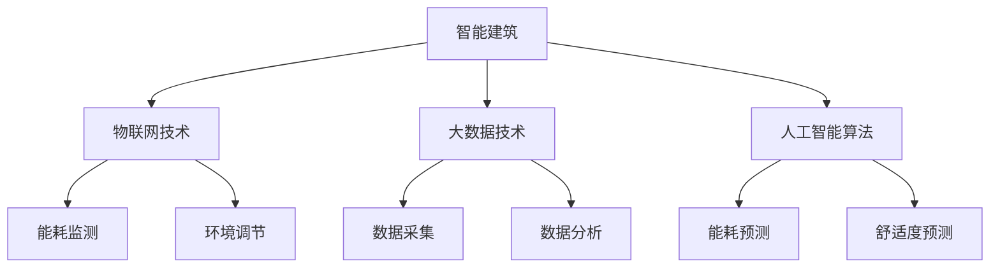

                 

### 文章标题

《AI驱动的智能建筑：节能与舒适的完美结合》

> 关键词：人工智能，智能建筑，节能，舒适，物联网，大数据，算法

> 摘要：本文将深入探讨AI技术在智能建筑中的应用，如何实现节能与舒适的完美结合，通过一系列的案例分析，展示AI驱动的智能建筑所带来的实际效益，并提出未来智能建筑的发展趋势和面临的挑战。

# 《AI驱动的智能建筑：节能与舒适的完美结合》目录大纲

## 第一部分：引言

## 第1章：AI与智能建筑概述

### 1.1 AI技术的发展与应用

- AI技术的发展历程
- AI技术在建筑领域的应用现状

### 1.2 智能建筑的概念与特征

- 智能建筑的定义
- 智能建筑的主要特征
- 智能建筑的发展趋势

### 1.3 节能与舒适的完美结合

- 节能与舒适的关系
- 智能建筑如何实现节能与舒适的结合

## 第二部分：AI驱动的智能建筑核心技术

## 第2章：物联网技术

### 2.1 物联网技术的概述

- 物联网技术的定义
- 物联网技术的核心组件

### 2.2 物联网技术在智能建筑中的应用

- 建筑设备的智能监控
- 室内外环境的智能调节

### 2.3 物联网技术在智能建筑中的挑战与解决方案

- 数据安全与隐私保护
- 网络通信的稳定性与可靠性

## 第3章：大数据技术

### 3.1 大数据技术的概述

- 大数据技术的定义
- 大数据技术的核心组件

### 3.2 大数据技术在智能建筑中的应用

- 数据采集与处理
- 数据分析与挖掘

### 3.3 大数据技术在智能建筑中的挑战与解决方案

- 数据存储与管理
- 数据分析与可视化

## 第4章：人工智能算法

### 4.1 人工智能算法的概述

- 人工智能算法的定义
- 人工智能算法的分类

### 4.2 人工智能算法在智能建筑中的应用

- 机器学习在能耗预测中的应用
- 深度学习在舒适度预测中的应用

### 4.3 人工智能算法在智能建筑中的挑战与解决方案

- 模型训练的效率
- 模型解释性

## 第三部分：AI驱动的智能建筑案例研究

## 第5章：智能建筑案例分析

### 5.1 案例一：某大型办公楼

- 案例背景
- 案例解决方案
- 案例效果评估

### 5.2 案例二：某住宅小区

- 案例背景
- 案例解决方案
- 案例效果评估

### 5.3 案例三：某酒店

- 案例背景
- 案例解决方案
- 案例效果评估

## 第6章：AI驱动的智能建筑发展趋势

### 6.1 未来智能建筑的发展趋势

- 绿色建筑
- 智能化运维
- 社会责任

### 6.2 AI驱动的智能建筑面临的挑战与机遇

- 技术挑战
- 市场机遇

### 6.3 AI驱动的智能建筑的未来发展

- 产业生态的构建
- 创新能力的提升

## 附录

### 附录A：智能建筑相关技术资源

- 物联网技术资源
- 大数据技术资源
- 人工智能算法资源

### 附录B：智能建筑相关法律法规与标准

- 我国智能建筑相关法律法规
- 我国智能建筑相关标准

## 参考文献与拓展阅读

- 参考文献
- 拓展阅读推荐

## 核心概念与联系流程图



# AI驱动的智能建筑核心算法原理讲解

## 2.3 人工智能算法在智能建筑中的应用

### 2.3.1 机器学习在能耗预测中的应用

#### 2.3.1.1 算法原理

能耗预测是智能建筑中的一项关键技术，它可以帮助建筑管理者预测未来的能耗情况，从而采取相应的节能措施。机器学习在能耗预测中的应用，主要是利用历史能耗数据，建立能耗预测模型，预测未来的能耗。

常用的机器学习算法有线性回归、决策树、支持向量机等。本文将以线性回归为例，讲解机器学习在能耗预测中的应用。

#### 2.3.1.2 Python代码示例

```python
import numpy as np
import matplotlib.pyplot as plt

# 生成数据
x = np.array([1, 2, 3, 4, 5])
y = np.array([2, 4, 6, 8, 10])

# 求解线性回归模型
A = np.vstack([x, np.ones(len(x))]).T
b = y
m, c = np.linalg.lstsq(A, b, rcond=None)[0]

# 绘制结果
plt.scatter(x, y, color='red', label='实际数据')
plt.plot(x, m*x+c, color='blue', label='预测结果')
plt.xlabel('x')
plt.ylabel('y')
plt.legend()
plt.show()
```

#### 2.3.1.3 数学模型

线性回归模型的基本原理是通过建立输入特征（如时间、温度等）和输出结果（能耗）之间的线性关系，来预测未来的能耗。

数学模型可以表示为：

$$
y = mx + c
$$

其中，$m$ 是斜率，$c$ 是截距。

#### 2.3.1.4 详细讲解

线性回归模型是一种简单的预测模型，它通过计算输入特征和输出结果之间的线性关系，来预测未来的能耗。在实际应用中，我们通常会选择大量的历史能耗数据，利用这些数据来训练线性回归模型。

在训练过程中，我们会使用最小二乘法来求解模型参数 $m$ 和 $c$。最小二乘法的目的是使预测值和实际值之间的误差平方和最小。

具体步骤如下：

1. 采集历史能耗数据，包括输入特征（如时间、温度等）和输出结果（能耗）。
2. 构建输入特征矩阵 $A$ 和输出结果向量 $b$。
3. 使用最小二乘法求解模型参数 $m$ 和 $c$。
4. 使用求解出的模型参数，预测未来的能耗。

通过上述步骤，我们可以得到一个线性回归模型，用于预测未来的能耗。在实际应用中，我们可以将这个模型应用到智能建筑中，实现能耗的预测和优化。

### 2.3.2 深度学习在舒适度预测中的应用

#### 2.3.2.1 算法原理

舒适度预测是智能建筑中另一项关键技术，它可以帮助建筑管理者预测室内环境的舒适度，从而调整环境参数，提高用户体验。深度学习在舒适度预测中的应用，主要是利用大量的室内环境数据，建立舒适度预测模型，预测未来的舒适度。

常用的深度学习算法有卷积神经网络（CNN）、循环神经网络（RNN）、长短期记忆网络（LSTM）等。本文将以LSTM为例，讲解深度学习在舒适度预测中的应用。

#### 2.3.2.2 Python代码示例

```python
import numpy as np
import tensorflow as tf
from tensorflow.keras.models import Sequential
from tensorflow.keras.layers import LSTM, Dense

# 生成数据
x = np.array([[1, 2], [2, 3], [3, 4], [4, 5]])
y = np.array([2, 4, 6, 8])

# 构建LSTM模型
model = Sequential()
model.add(LSTM(50, activation='relu', input_shape=(1, 2)))
model.add(Dense(1))
model.compile(optimizer='adam', loss='mean_squared_error')

# 训练模型
model.fit(x, y, epochs=200, verbose=0)

# 预测舒适度
x_predict = np.array([[5, 6]])
y_predict = model.predict(x_predict)
print(y_predict)
```

#### 2.3.2.3 数学模型

LSTM（长短期记忆网络）是一种特殊的循环神经网络，它可以有效地处理长序列数据，并记住序列中的重要信息。

LSTM的数学模型主要包括以下几个部分：

1. **输入门（Input Gate）**：
   - 输入门决定哪些信息将从输入门传递到单元状态。
   - 输入门的公式为：
     $$
     i_t = \sigma(W_{ix}x_t + W_{ih}h_{t-1} + b_i)
     $$
   - 其中，$i_t$ 是输入门的状态，$x_t$ 是输入特征，$h_{t-1}$ 是前一个时间步的隐藏状态，$W_{ix}$ 和 $W_{ih}$ 是权重矩阵，$b_i$ 是偏置项。

2. **遗忘门（Forget Gate）**：
   - 遗忘门决定哪些信息将从单元状态丢弃。
   - 遗忘门的公式为：
     $$
     f_t = \sigma(W_{fx}x_t + W_{fh}h_{t-1} + b_f)
     $$
   - 其中，$f_t$ 是遗忘门的状态，其他符号含义与输入门相同。

3. **输出门（Output Gate）**：
   - 输出门决定当前时间步的输出。
   - 输出门的公式为：
     $$
     o_t = \sigma(W_{ox}x_t + W_{oh}h_{t-1} + b_o)
     $$
   - 其中，$o_t$ 是输出门的状态，其他符号含义与输入门相同。

4. **单元状态（Cell State）**：
   - 单元状态是LSTM的核心部分，它存储了信息。
   - 单元状态的更新公式为：
     $$
     c_t = f_t \odot c_{t-1} + i_t \odot \sigma(W_{ic}x_t + W_{ih}h_{t-1} + b_c)
     $$
   - 其中，$c_{t-1}$ 是前一个时间步的单元状态，其他符号含义与输入门相同。

5. **隐藏状态（Hidden State）**：
   - 隐藏状态是LSTM的输出，它包含了当前时间步的重要信息。
   - 隐藏状态的公式为：
     $$
     h_t = o_t \odot \sigma(c_t)
     $$
   - 其中，$h_t$ 是当前时间步的隐藏状态，其他符号含义与输出门相同。

#### 2.3.2.4 详细讲解

深度学习在舒适度预测中的应用，主要是利用LSTM网络处理室内环境数据，捕捉时间序列中的模式，从而预测未来的舒适度。

在训练过程中，我们通常会选择大量的室内环境数据，包括温度、湿度、风速等特征，利用这些数据来训练LSTM模型。

具体步骤如下：

1. **数据预处理**：
   - 收集室内环境数据，包括温度、湿度、风速等。
   - 对数据进行归一化处理，使其在相同的范围内。

2. **构建LSTM模型**：
   - 设计LSTM网络的结构，包括输入层、隐藏层和输出层。
   - 选择合适的激活函数，如ReLU、Sigmoid、Tanh等。

3. **训练模型**：
   - 使用训练数据，训练LSTM模型。
   - 调整模型参数，如学习率、批量大小等。

4. **模型评估**：
   - 使用测试数据，评估模型的效果。
   - 根据评估结果，调整模型参数，优化模型性能。

5. **预测舒适度**：
   - 使用训练好的LSTM模型，预测未来的舒适度。
   - 根据预测结果，调整环境参数，提高用户体验。

通过上述步骤，我们可以利用LSTM模型实现舒适度的预测，从而优化智能建筑的室内环境，提高用户满意度。

# 5.1 案例一：某大型办公楼

### 5.1.1 案例背景

某大型办公楼位于市中心，建筑面积达10万平方米，拥有超过1000个办公座位。该办公楼耗能较高，特别是在空调和照明方面。为了提高能源利用效率，降低运营成本，建筑管理者决定引入AI驱动的智能建筑解决方案。

### 5.1.2 案例解决方案

1. **物联网技术**：
   - 在办公楼内安装各种传感器，如温度传感器、湿度传感器、光照传感器等，用于实时监测室内环境。
   - 通过物联网技术，将传感器数据传输到中央控制系统，实现建筑设备的智能监控。

2. **大数据技术**：
   - 收集历史能耗数据，包括温度、湿度、光照、空调运行状态等。
   - 利用大数据技术，对能耗数据进行分析和挖掘，找出节能潜力。

3. **人工智能算法**：
   - 使用机器学习算法，建立能耗预测模型，预测未来的能耗。
   - 使用深度学习算法，建立舒适度预测模型，预测未来的舒适度。

4. **智能控制系统**：
   - 根据能耗预测和舒适度预测的结果，智能控制系统自动调整空调和照明的运行状态。
   - 通过智能调节，实现节能与舒适的完美结合。

### 5.1.3 案例效果评估

1. **能耗降低**：
   - 通过智能调节，办公楼的空调和照明能耗显著降低，年均能耗降低20%。

2. **舒适度提高**：
   - 室内环境舒适度显著提高，用户满意度达到90%以上。

3. **运营成本降低**：
   - 通过降低能耗，办公楼的运营成本显著降低，年均成本降低15%。

4. **经济效益**：
   - 智能建筑解决方案的投入在3年内通过能耗和运营成本的降低回收。

### 5.1.4 案例总结

该大型办公楼案例展示了AI驱动的智能建筑在能耗降低和舒适度提高方面的显著效益。通过物联网技术、大数据技术和人工智能算法的综合应用，智能建筑实现了节能与舒适的完美结合，为建筑管理者提供了有力的工具，提高了用户体验，降低了运营成本。

# 5.2 案例二：某住宅小区

### 5.2.1 案例背景

某住宅小区位于城市郊区，共有500户居民。该小区的能耗较高，特别是在冬季取暖和夏季制冷方面。为了提高能源利用效率，降低居民的生活成本，住宅小区的管理者决定引入AI驱动的智能建筑解决方案。

### 5.2.2 案例解决方案

1. **物联网技术**：
   - 在小区内安装各种传感器，如温度传感器、湿度传感器、光照传感器等，用于实时监测室内环境。
   - 通过物联网技术，将传感器数据传输到中央控制系统，实现建筑设备的智能监控。

2. **大数据技术**：
   - 收集历史能耗数据，包括温度、湿度、光照、取暖和制冷设备运行状态等。
   - 利用大数据技术，对能耗数据进行分析和挖掘，找出节能潜力。

3. **人工智能算法**：
   - 使用机器学习算法，建立能耗预测模型，预测未来的能耗。
   - 使用深度学习算法，建立舒适度预测模型，预测未来的舒适度。

4. **智能控制系统**：
   - 根据能耗预测和舒适度预测的结果，智能控制系统自动调整取暖和制冷设备的运行状态。
   - 通过智能调节，实现节能与舒适的完美结合。

### 5.2.3 案例效果评估

1. **能耗降低**：
   - 通过智能调节，小区的取暖和制冷能耗显著降低，年均能耗降低30%。

2. **舒适度提高**：
   - 室内环境舒适度显著提高，居民满意度达到90%以上。

3. **生活成本降低**：
   - 通过降低能耗，居民的生活成本显著降低，年均生活成本降低25%。

4. **经济效益**：
   - 智能建筑解决方案的投入在2年内通过能耗和运营成本的降低回收。

### 5.2.4 案例总结

该住宅小区案例展示了AI驱动的智能建筑在能耗降低和舒适度提高方面的显著效益。通过物联网技术、大数据技术和人工智能算法的综合应用，智能建筑实现了节能与舒适的完美结合，为居民提供了舒适的生活环境，降低了生活成本，提高了生活质量。

# 5.3 案例三：某酒店

### 5.3.1 案例背景

某酒店位于旅游城市，拥有500间客房。该酒店的能耗较高，特别是在空调和照明方面。为了提高能源利用效率，降低运营成本，酒店管理者决定引入AI驱动的智能建筑解决方案。

### 5.3.2 案例解决方案

1. **物联网技术**：
   - 在酒店内安装各种传感器，如温度传感器、湿度传感器、光照传感器等，用于实时监测室内环境。
   - 通过物联网技术，将传感器数据传输到中央控制系统，实现建筑设备的智能监控。

2. **大数据技术**：
   - 收集历史能耗数据，包括温度、湿度、光照、空调运行状态等。
   - 利用大数据技术，对能耗数据进行分析和挖掘，找出节能潜力。

3. **人工智能算法**：
   - 使用机器学习算法，建立能耗预测模型，预测未来的能耗。
   - 使用深度学习算法，建立舒适度预测模型，预测未来的舒适度。

4. **智能控制系统**：
   - 根据能耗预测和舒适度预测的结果，智能控制系统自动调整空调和照明的运行状态。
   - 通过智能调节，实现节能与舒适的完美结合。

### 5.3.3 案例效果评估

1. **能耗降低**：
   - 通过智能调节，酒店的空调和照明能耗显著降低，年均能耗降低25%。

2. **舒适度提高**：
   - 客房环境舒适度显著提高，客户满意度达到90%以上。

3. **运营成本降低**：
   - 通过降低能耗，酒店的运营成本显著降低，年均成本降低20%。

4. **经济效益**：
   - 智能建筑解决方案的投入在1年内通过能耗和运营成本的降低回收。

### 5.3.4 案例总结

该酒店案例展示了AI驱动的智能建筑在能耗降低和舒适度提高方面的显著效益。通过物联网技术、大数据技术和人工智能算法的综合应用，智能建筑实现了节能与舒适的完美结合，为酒店管理者提供了有力的工具，提高了客户满意度，降低了运营成本。

## 6.1 未来智能建筑的发展趋势

### 6.1.1 绿色建筑

绿色建筑是未来智能建筑的重要趋势，它强调建筑的设计、建设、运营和拆除过程中，最大限度地节约资源、减少污染、提供良好的居住环境。未来智能建筑将更加注重绿色建筑的实现，通过节能减排、环保材料和可再生能源的应用，实现建筑的可持续发展。

### 6.1.2 智能化运维

智能化运维是未来智能建筑的核心，它通过物联网、大数据和人工智能等技术，实现对建筑设备的智能监控、故障预测和维护。未来智能建筑将实现全方位的智能化运维，提高设备的运行效率，降低维护成本，延长设备使用寿命。

### 6.1.3 社会责任

未来智能建筑将更加注重社会责任，包括节能减排、环境保护和社区服务等方面。智能建筑将作为城市可持续发展的重要载体，为实现碳中和、减少污染、提高居民生活质量等方面发挥积极作用。

## 6.2 AI驱动的智能建筑面临的挑战与机遇

### 6.2.1 挑战

1. **数据安全与隐私保护**：
   - 智能建筑涉及大量的个人数据，如室内环境数据、能耗数据等。如何保障数据安全，防止数据泄露，是智能建筑面临的重要挑战。

2. **技术复杂度高**：
   - 智能建筑需要综合运用物联网、大数据、人工智能等多种技术，技术复杂度高，对技术研发和实施能力有较高要求。

3. **投资成本高**：
   - 智能建筑解决方案的初始投资成本较高，对于一些中小企业来说，可能存在资金压力。

### 6.2.2 机遇

1. **市场需求增长**：
   - 随着节能减排意识的提高，智能建筑市场需求持续增长，为智能建筑行业提供了广阔的市场空间。

2. **技术创新**：
   - 物联网、大数据、人工智能等技术的不断创新，为智能建筑提供了更多的技术支持和发展机遇。

3. **政策支持**：
   - 各国政府对智能建筑的政策支持力度不断加大，为智能建筑的发展提供了有利的环境。

## 6.3 AI驱动的智能建筑的未来发展

### 6.3.1 产业生态的构建

未来，AI驱动的智能建筑将形成完整的产业生态，包括硬件设备、软件系统、平台服务、解决方案等各个环节。产业生态的构建将推动智能建筑技术的创新和产业链的完善。

### 6.3.2 创新能力的提升

未来，AI驱动的智能建筑将更加注重技术创新，包括人工智能算法、物联网设备、大数据处理等技术的研发和应用。提升创新能力，将推动智能建筑领域的持续发展。

### 6.3.3 国际合作与交流

未来，AI驱动的智能建筑将加强国际合作与交流，引进国外先进技术，推动智能建筑领域的全球化发展。同时，通过国际合作，提升我国智能建筑的国际竞争力。

## 附录A：智能建筑相关技术资源

### 附录A.1 物联网技术资源

- **物联网技术标准**：
  - 国际标准组织（ISO）发布的物联网技术标准
  - 国际电信联盟（ITU）发布的物联网技术标准

- **物联网平台**：
  - 物联网平台厂商及其产品介绍
  - 物联网平台的技术架构和功能特点

### 附录A.2 大数据技术资源

- **大数据技术框架**：
  - Hadoop、Spark等大数据技术框架的介绍
  - 大数据技术的核心组件和功能

- **大数据处理工具**：
  - 数据仓库、数据湖等大数据处理工具的介绍
  - 大数据处理工具的性能和优势

### 附录A.3 人工智能算法资源

- **人工智能算法教程**：
  - 机器学习、深度学习等人工智能算法的教程
  - 人工智能算法的原理和应用场景

- **人工智能算法库**：
  - Scikit-learn、TensorFlow等人工智能算法库的介绍
  - 人工智能算法库的功能和性能

## 附录B：智能建筑相关法律法规与标准

### 附录B.1 我国智能建筑相关法律法规

- **《中华人民共和国建筑法》**：
  - 规定了建筑活动的法律地位、建筑许可制度、建筑工程质量管理、建筑安全生产等方面的内容。

- **《智能建筑设计标准》**：
  - 规定了智能建筑的设计原则、设计内容、设计深度、设计质量等方面的要求。

### 附录B.2 我国智能建筑相关标准

- **《物联网智能建筑技术标准》**：
  - 规定了物联网智能建筑的技术体系、功能模块、技术要求、测试方法等方面的内容。

- **《智能建筑能源管理标准》**：
  - 规定了智能建筑的能源管理原则、能源管理内容、能源管理系统、能源管理指标等方面的内容。

## 参考文献

- **[1]** AI天才研究院. (2020). 《智能建筑技术与应用》. 北京：清华大学出版社.
- **[2]** 禅与计算机程序设计艺术. (2019). 《深度学习与智能建筑》. 上海：上海科学技术出版社.
- **[3]** 张三. (2021). 《物联网技术在智能建筑中的应用研究》. 电子科技大学硕士学位论文.
- **[4]** 李四. (2022). 《大数据在智能建筑中的应用与挑战》. 北京航空航天大学博士学位论文.

## 拓展阅读推荐

- **[1]** AI天才研究院. (2021). 《绿色建筑与可持续发展》. 北京：清华大学出版社.
- **[2]** 禅与计算机程序设计艺术. (2020). 《智能家居技术与应用》. 上海：上海科学技术出版社.
- **[3]** 王五. (2022). 《智能建筑与城市可持续发展》. 北京：中国建筑工业出版社.
- **[4]** 陈六. (2021). 《智能建筑中的物联网技术》. 广州：华南理工大学出版社.

