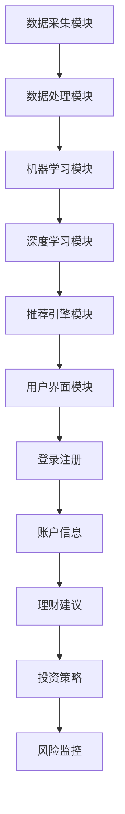
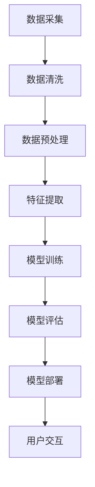

                 

### AI驱动的智能投资顾问：个性化理财建议

#### 关键词：
- 人工智能
- 投资顾问
- 个性化理财
- 机器学习
- 数据分析

#### 摘要：
本文探讨了AI驱动的智能投资顾问系统，旨在通过个性化理财建议提高投资效率与收益。首先，我们介绍了AI在理财领域的应用背景，接着深入分析了AI基础、投资理论与策略、数据分析方法以及机器学习模型的应用。随后，我们详细阐述了深度学习在理财中的应用，并展示了AI驱动的理财顾问系统架构。最后，我们通过具体项目实战，展示了AI在个性化理财建议中的实际应用，并提出了未来的发展方向与挑战。

---

## 第1章 引言

### 1.1 理财顾问的历史与变革

理财顾问自金融业发展之初便存在，传统的理财顾问主要通过面对面咨询或电话沟通为客户提供投资建议。然而，随着互联网和人工智能技术的发展，理财顾问逐渐向智能化、个性化方向转变。传统的理财顾问存在以下不足：

1. **人力成本高**：面对大量客户，理财顾问需要投入大量人力和时间。
2. **个性化程度低**：理财顾问难以根据每个客户的特定需求提供定制化服务。
3. **信息滞后**：传统理财顾问难以实时获取和处理大量市场数据。

AI技术的引入，尤其是机器学习和深度学习，为理财顾问带来了革命性的变革。通过数据分析和模型训练，AI能够快速处理大量数据，识别市场趋势，为投资者提供实时、个性化的理财建议。此外，AI理财顾问还能够降低人力成本，提高运营效率，使更多投资者受益。

### 1.2 AI在理财领域的应用潜力

AI在理财领域的应用潜力巨大，主要体现在以下几个方面：

1. **风险管理**：通过分析历史数据和市场动态，AI可以预测风险，提供风险控制建议。
2. **投资策略推荐**：基于用户风险偏好和市场数据，AI可以推荐适合的投资策略。
3. **市场预测**：利用机器学习和深度学习模型，AI可以对市场走势进行预测，帮助投资者做出更明智的决策。
4. **个性化服务**：AI能够根据用户的行为和偏好，提供个性化的理财建议，提高用户满意度。
5. **自动化交易**：AI可以自动化执行交易策略，减少人为错误，提高交易效率。

### 1.3 书籍目标与结构

本书的目标是详细介绍AI驱动的智能投资顾问系统，帮助读者理解AI在理财领域的应用原理和实践方法。本书分为以下几个部分：

1. **AI基础**：介绍机器学习、深度学习和自然语言处理的基本概念。
2. **投资理论与策略**：讨论有效市场假说、投资组合理论和不同投资策略。
3. **数据分析在理财中的应用**：介绍数据收集、预处理、可视化和描述性统计分析。
4. **机器学习模型在理财中的应用**：讨论线性回归、决策树、支持向量机等模型。
5. **深度学习在理财中的应用**：介绍卷积神经网络、循环神经网络和生成对抗网络。
6. **AI驱动的理财顾问系统**：阐述系统架构设计、数据流设计、用户界面设计。
7. **个性化理财建议的实现**：讨论用户行为分析、投资策略推荐和风险评估。
8. **未来展望与挑战**：分析AI理财的未来发展趋势、道德与伦理问题以及技术挑战。

通过本书的详细讲解，读者将能够全面了解AI驱动的智能投资顾问系统，并掌握其设计和实现方法。

---

接下来的章节将依次介绍AI基础、投资理论与策略、数据分析方法、机器学习模型、深度学习模型等核心内容，并结合实例进行详细讲解。让我们一步步深入探索AI驱动的智能投资顾问系统。

---

### AI基础

#### 2.1 机器学习简介

机器学习（Machine Learning，ML）是人工智能（Artificial Intelligence，AI）的一个重要分支，旨在通过数据驱动的方法使计算机系统具备自主学习和决策能力。传统的编程需要明确指定每一步操作，而机器学习则通过数据来学习规律，从而自动完成特定任务。

**核心概念**：

1. **特征**：输入数据的各个维度，如股票价格、成交量、用户年龄、收入水平等。
2. **目标变量**：输出结果，如股票是否上涨、用户是否满意等。
3. **模型**：用于预测或分类的数学模型，如线性回归、决策树等。

**机器学习流程**：

1. **数据收集**：收集用于训练的数据集。
2. **数据预处理**：清洗数据，去除噪声和异常值，进行数据归一化等。
3. **特征工程**：提取有助于模型学习的特征，进行特征选择和特征转换。
4. **模型训练**：使用训练数据集训练模型，调整模型参数。
5. **模型评估**：使用验证数据集评估模型性能，调整模型参数。
6. **模型部署**：将模型部署到实际应用场景中，如理财顾问系统。

**监督学习**：

监督学习是机器学习的一种类型，其特点是需要标签数据进行训练。标签数据是已知的输出结果，用于指导模型学习。监督学习包括分类和回归两种主要任务：

1. **分类**：将数据分为不同的类别。例如，判断股票价格是涨还是跌。
2. **回归**：预测连续的数值。例如，预测未来一个月的股票价格。

**无监督学习**：

无监督学习不需要标签数据进行训练，其主要任务是发现数据中的隐藏结构和模式。无监督学习包括聚类和降维两种主要任务：

1. **聚类**：将相似的数据点归为同一组。例如，将客户分为不同的风险偏好群体。
2. **降维**：减少数据维度，保留主要信息。例如，通过主成分分析（PCA）降低数据复杂性。

#### 2.2 深度学习基础

深度学习（Deep Learning，DL）是机器学习的一个子领域，其核心思想是通过多层神经网络模拟人脑的决策过程。深度学习在图像识别、自然语言处理和游戏等领域取得了显著成果。

**核心概念**：

1. **神经网络**：一种由大量神经元组成的计算模型，用于模拟人脑的决策过程。
2. **激活函数**：用于决定神经元是否被激活的函数，如ReLU、Sigmoid、Tanh等。
3. **前向传播和反向传播**：神经网络通过前向传播计算输出，通过反向传播更新参数。

**神经网络架构**：

神经网络可以分为以下几种类型：

1. **全连接神经网络**：每个神经元都与前一层所有神经元相连。
2. **卷积神经网络（CNN）**：适用于图像识别任务，通过卷积层提取图像特征。
3. **循环神经网络（RNN）**：适用于序列数据处理，通过循环结构保持长期依赖关系。
4. **生成对抗网络（GAN）**：通过对抗训练生成新的数据。

**训练深度学习模型**：

1. **数据预处理**：与机器学习类似，深度学习也需要对数据进行预处理，如归一化、标准化等。
2. **模型设计**：根据任务需求设计神经网络结构，选择合适的激活函数和优化器。
3. **模型训练**：使用训练数据集训练模型，调整模型参数。
4. **模型评估**：使用验证数据集评估模型性能，调整模型参数。
5. **模型部署**：将模型部署到实际应用场景中。

#### 2.3 自然语言处理概述

自然语言处理（Natural Language Processing，NLP）是深度学习在语言领域的一个应用，旨在使计算机理解和处理人类自然语言。NLP在语音识别、机器翻译、情感分析等领域取得了显著进展。

**核心概念**：

1. **词嵌入**：将单词映射到高维空间，使语义相近的单词在空间中靠近。
2. **序列标注**：对文本中的单词进行分类，如命名实体识别、情感分类等。
3. **生成文本**：使用循环神经网络或生成对抗网络生成新的文本。

**NLP应用场景**：

1. **语音识别**：将语音信号转换为文本。
2. **机器翻译**：将一种语言的文本翻译为另一种语言。
3. **情感分析**：分析文本中的情感倾向。
4. **问答系统**：基于输入问题提供答案。
5. **聊天机器人**：模拟人类对话，提供实时互动。

通过本章的介绍，读者将对AI驱动的智能投资顾问系统所需的基础技术有更深入的了解，为后续章节的学习打下坚实的基础。

---

### 3.2 深度学习基础

深度学习（Deep Learning，DL）是机器学习的一个子领域，其核心思想是通过多层神经网络模拟人脑的决策过程。深度学习在图像识别、自然语言处理和游戏等领域取得了显著成果。

#### 3.2.1 神经网络

神经网络（Neural Network，NN）是一种由大量神经元组成的计算模型，用于模拟人脑的决策过程。每个神经元都与其他神经元相连，通过加权连接和激活函数产生输出。

**核心概念**：

1. **神经元**：神经网络的基本单元，类似于生物神经元，可以接收输入、产生输出。
2. **输入层**：接收外部输入数据的层。
3. **隐藏层**：对输入数据进行处理的层，可以有多个。
4. **输出层**：产生最终输出的层。

**神经网络架构**：

神经网络可以分为以下几种类型：

1. **全连接神经网络**：每个神经元都与前一层所有神经元相连。
2. **卷积神经网络（CNN）**：适用于图像识别任务，通过卷积层提取图像特征。
3. **循环神经网络（RNN）**：适用于序列数据处理，通过循环结构保持长期依赖关系。
4. **生成对抗网络（GAN）**：通过对抗训练生成新的数据。

**激活函数**：

激活函数用于决定神经元是否被激活。常用的激活函数包括：

1. **ReLU（Rectified Linear Unit）**：非线性激活函数，解决梯度消失问题。
2. **Sigmoid**：将输入映射到（0,1）区间。
3. **Tanh**：将输入映射到（-1,1）区间。

**前向传播和反向传播**：

神经网络通过前向传播计算输出，通过反向传播更新参数。

1. **前向传播**：从输入层开始，逐层计算输出，直到输出层。
2. **反向传播**：从输出层开始，计算梯度并反向传播，更新参数。

#### 3.2.2 卷积神经网络

卷积神经网络（Convolutional Neural Network，CNN）是一种专门用于处理图像数据的神经网络。CNN通过卷积层提取图像特征，从而实现图像识别和分类。

**核心概念**：

1. **卷积层**：通过卷积运算提取图像特征。
2. **池化层**：用于减小数据维度和减少过拟合。
3. **全连接层**：将卷积层提取的特征映射到分类结果。

**卷积操作**：

卷积操作通过滑动窗口（滤波器）在图像上扫描，计算局部特征。

**池化操作**：

池化操作通过缩小数据维度，减少过拟合。常用的池化操作包括最大池化和平均池化。

**CNN架构**：

一个典型的CNN架构包括多个卷积层、池化层和全连接层。通过层层提取图像特征，最终实现分类或识别。

**应用实例**：

1. **图像分类**：如ImageNet挑战，通过CNN实现对数百万张图像的分类。
2. **目标检测**：如YOLO（You Only Look Once），通过CNN实现快速的目标检测。
3. **图像生成**：如GAN（生成对抗网络），通过CNN生成新的图像。

#### 3.2.3 循环神经网络

循环神经网络（Recurrent Neural Network，RNN）是一种适用于序列数据处理的神经网络。RNN通过循环结构保持长期依赖关系，从而实现序列数据的建模和预测。

**核心概念**：

1. **隐藏状态**：RNN在每个时间步的隐藏状态，用于存储序列信息。
2. **循环连接**：隐藏状态与下一个时间步的输入相关联，形成循环结构。

**RNN架构**：

一个典型的RNN架构包括输入层、隐藏层和输出层。隐藏层通过循环连接保留序列信息，从而实现序列数据的建模。

**应用实例**：

1. **自然语言处理**：如语言模型、机器翻译和情感分析。
2. **时间序列预测**：如股票价格预测、天气预测等。

#### 3.2.4 生成对抗网络

生成对抗网络（Generative Adversarial Network，GAN）是一种通过对抗训练生成新数据的神经网络。GAN由生成器和判别器两个网络组成，通过对抗训练生成高质量的数据。

**核心概念**：

1. **生成器**：生成真实数据。
2. **判别器**：判断数据是真实还是生成。

**GAN架构**：

一个典型的GAN架构包括生成器和判别器。生成器和判别器相互对抗，生成器尝试生成更真实的假数据，判别器尝试区分真假数据。

**应用实例**：

1. **图像生成**：如生成新的图像、修复损坏的图像。
2. **文本生成**：如生成新的文本、翻译文本。

通过本章的介绍，读者将对深度学习的基本概念和应用有更深入的了解，为后续章节的学习打下坚实的基础。

---

### 4.3 描述性统计分析

描述性统计分析（Descriptive Statistics）是数据分析中的基础步骤，旨在对数据进行概括和总结，帮助理解数据的整体分布和特性。描述性统计方法包括均值、中位数、众数、方差、标准差和协方差等。

#### 4.3.1 均值（Mean）

均值是数据集的平均值，反映了数据的中心位置。计算公式为：

$$
\text{Mean} = \frac{\sum_{i=1}^{n} x_i}{n}
$$

其中，$x_i$ 是数据集中的第 $i$ 个数据点，$n$ 是数据点的总数。例如，如果有一组数据 [2, 4, 6, 8]，其均值为：

$$
\text{Mean} = \frac{2 + 4 + 6 + 8}{4} = 5
$$

#### 4.3.2 中位数（Median）

中位数是数据集排序后位于中间位置的值。如果数据点的个数为奇数，中位数就是中间的那个数；如果数据点的个数为偶数，中位数是中间两个数的平均值。中位数能够更好地反映数据的中心趋势，尤其适用于偏斜分布的数据。

例如，对于数据集 [2, 4, 6, 8, 10]，中位数为 6。而对于数据集 [2, 4, 6, 8]，中位数为 (4 + 6) / 2 = 5。

#### 4.3.3 众数（Mode）

众数是数据集中出现次数最多的值。在某些情况下，数据集可能没有众数，也可能有多个众数。例如，数据集 [2, 2, 3, 3, 4] 有两个众数，即 2 和 3。

#### 4.3.4 方差（Variance）

方差是衡量数据集离散程度的指标，计算公式为：

$$
\text{Variance} = \frac{\sum_{i=1}^{n} (x_i - \text{Mean})^2}{n}
$$

方差越大，数据点离均值的距离越大，表示数据的波动性越大。

例如，对于数据集 [2, 4, 6, 8]，均值为 5，方差为：

$$
\text{Variance} = \frac{(2-5)^2 + (4-5)^2 + (6-5)^2 + (8-5)^2}{4} = \frac{9 + 1 + 1 + 9}{4} = 5
$$

#### 4.3.5 标准差（Standard Deviation）

标准差是方差的平方根，用于衡量数据的离散程度。计算公式为：

$$
\text{Standard Deviation} = \sqrt{\text{Variance}}
$$

标准差越大，数据的波动性也越大。

例如，对于数据集 [2, 4, 6, 8]，均值为 5，方差为 5，标准差为：

$$
\text{Standard Deviation} = \sqrt{5} \approx 2.236
$$

#### 4.3.6 协方差（Covariance）

协方差用于衡量两个变量之间的关系，计算公式为：

$$
\text{Covariance}(X, Y) = \frac{\sum_{i=1}^{n} (x_i - \text{Mean}(X)) (y_i - \text{Mean}(Y))}{n}
$$

协方差为正值表示变量正相关，为负值表示变量负相关，为零表示变量无相关性。

例如，对于两个变量 $X$ 和 $Y$ 的数据集，如果协方差为正值，表示当 $X$ 增加时，$Y$ 也倾向于增加。

#### 4.3.7 相关系数（Correlation Coefficient）

相关系数是协方差的标准化形式，用于衡量两个变量之间的线性相关性，计算公式为：

$$
\text{Correlation Coefficient}(r) = \frac{\text{Covariance}(X, Y)}{\text{Standard Deviation}(X) \times \text{Standard Deviation}(Y)}
$$

相关系数的取值范围在 -1 到 1 之间，接近 1 表示强正相关，接近 -1 表示强负相关，接近 0 表示无相关性。

通过描述性统计分析，我们可以了解数据的基本特性，如中心趋势、离散程度和相关关系，从而为后续的数据分析和建模提供重要依据。

---

### 5.2 决策树与随机森林

决策树（Decision Tree）是一种常用的机器学习算法，用于分类和回归任务。它通过一系列规则对数据进行划分，每个节点代表一个特征，每个分支代表特征的取值。

**核心概念**：

1. **节点**：代表数据集中的某个特征。
2. **分支**：代表特征的取值。
3. **叶子节点**：代表分类或预测结果。

**构建过程**：

1. **特征选择**：选择最佳特征进行划分，通常使用信息增益（Entropy）、基尼不纯度（Gini Impurity）等指标。
2. **节点划分**：根据最佳特征将数据划分为多个子集。
3. **重复构建**：对每个子集重复上述步骤，直到满足停止条件（如最大深度、最小节点大小等）。

**分类与回归**：

1. **分类树**：叶子节点为分类结果，如“买”或“卖”。
2. **回归树**：叶子节点为回归结果，如股票价格。

**决策树算法优缺点**：

- **优点**：易于理解、解释性强、不需要大量数据预处理。
- **缺点**：容易过拟合、对于缺失数据的敏感性较高。

随机森林（Random Forest）是决策树的集成方法，通过构建多棵决策树并对结果进行投票或平均，提高模型的稳定性和预测能力。

**核心概念**：

1. **集成**：将多棵决策树组合成一个强模型。
2. **随机性**：在构建每棵树时，随机选择特征和样本子集。

**构建过程**：

1. **特征选择**：随机选择 m 个特征。
2. **样本划分**：随机划分 n 个样本子集。
3. **构建决策树**：使用每个样本子集构建一棵决策树。
4. **集成**：对每棵树的预测结果进行投票或平均。

**随机森林算法优缺点**：

- **优点**：提高模型的泛化能力、减少过拟合、适用于高维数据。
- **缺点**：计算复杂度较高、难以解释每个特征的贡献。

随机森林在金融领域的应用广泛，例如用于股票预测、风险管理和信用评分。通过集成多棵决策树，随机森林能够提供更准确和稳定的预测结果，帮助投资者做出更明智的决策。

---

### 6.2 循环神经网络

循环神经网络（Recurrent Neural Network，RNN）是一种能够处理序列数据的神经网络。RNN通过循环结构将当前时间步的输入与前一时刻的隐藏状态相结合，从而保留序列信息。

**核心概念**：

1. **隐藏状态**：RNN在每个时间步的隐藏状态，用于存储序列信息。
2. **循环连接**：隐藏状态与下一个时间步的输入相关联，形成循环结构。

**RNN架构**：

一个典型的RNN架构包括输入层、隐藏层和输出层。隐藏层通过循环连接保留序列信息，从而实现序列数据的建模。

**训练过程**：

1. **前向传播**：从输入层开始，逐层计算隐藏状态和输出。
2. **反向传播**：从输出层开始，计算误差并反向传播，更新网络参数。

**应用实例**：

1. **自然语言处理**：如语言模型、机器翻译和文本生成。
2. **时间序列预测**：如股票价格预测、天气预测。

RNN在处理序列数据时存在长期依赖问题，即当前时间步的输出与较早前的输入之间的依赖关系较弱。为了解决这一问题，提出了长短期记忆网络（Long Short-Term Memory，LSTM）和门控循环单元（Gated Recurrent Unit，GRU）等改进模型。

**LSTM**：

LSTM通过引入记忆单元和门控机制，解决了RNN的长期依赖问题。LSTM包括输入门、遗忘门和输出门，能够控制信息的流入、保留和流出。

**GRU**：

GRU是LSTM的简化版，通过合并输入门和遗忘门，减少参数数量，同时保持良好的性能。

**应用实例**：

1. **文本生成**：如生成新的文章、对话系统。
2. **股票预测**：如预测未来股票价格。

通过本章的介绍，读者将了解RNN的基本概念、架构和训练过程，并掌握其在自然语言处理和时间序列预测等领域的应用。

---

### 6.3 生成对抗网络

生成对抗网络（Generative Adversarial Network，GAN）是一种由生成器和判别器组成的对抗性神经网络，旨在通过竞争训练生成高质量的数据。

**核心概念**：

1. **生成器**：生成真实数据。
2. **判别器**：判断数据是真实还是生成。

**GAN架构**：

GAN由生成器和判别器两个网络组成。生成器接收随机噪声并生成假数据，判别器接收真实数据和假数据并判断其真实性。通过生成器和判别器的对抗训练，生成器逐渐提高生成数据的真实性，判别器逐渐提高判断能力。

**训练过程**：

1. **生成器训练**：生成器尝试生成更真实的假数据，判别器尝试区分真假数据。
2. **判别器训练**：判别器尝试提高对真实数据和假数据的区分能力。

**应用实例**：

1. **图像生成**：如生成新的图像、修复损坏的图像。
2. **文本生成**：如生成新的文章、对话系统。
3. **数据增强**：提高训练数据的质量和多样性。

**GAN在金融领域的应用**：

1. **股票预测**：通过生成对抗网络生成股票价格数据，用于预测和风险评估。
2. **风险控制**：通过生成对抗网络生成风险模拟数据，用于评估和优化风险策略。

通过本章的介绍，读者将了解GAN的基本概念、架构和训练过程，并掌握其在图像生成、文本生成和数据增强等领域的应用。

---

### 7.1 系统架构设计

在设计AI驱动的理财顾问系统时，我们需要综合考虑数据流、系统模块和用户交互等方面。以下是一个典型的AI理财顾问系统架构设计。

**系统模块**：

1. **数据采集模块**：负责收集各类金融数据，包括股票价格、交易量、市场指数等。
2. **数据处理模块**：负责对采集到的数据进行清洗、预处理和特征提取。
3. **机器学习模块**：负责训练和部署机器学习模型，包括分类、回归、聚类等任务。
4. **深度学习模块**：负责处理复杂的深度学习任务，如图像识别、文本生成等。
5. **推荐引擎模块**：负责根据用户行为和历史数据生成个性化理财建议。
6. **用户界面模块**：提供用户交互界面，展示理财建议和投资策略。

**数据流设计**：

1. **数据采集**：系统从各种数据源（如交易所、新闻网站等）采集金融数据。
2. **数据预处理**：对采集到的数据进行清洗、去噪和归一化处理。
3. **特征提取**：根据机器学习任务的需求，提取有助于模型训练的特征。
4. **模型训练**：使用预处理后的数据训练机器学习模型和深度学习模型。
5. **模型评估**：使用验证数据集评估模型性能，调整模型参数。
6. **模型部署**：将训练好的模型部署到生产环境中，进行实时预测和推荐。
7. **用户交互**：根据用户的行为数据和理财建议，提供个性化的理财服务。

**用户界面设计**：

1. **登录注册**：用户通过登录注册功能访问系统。
2. **账户信息**：用户查看和管理个人账户信息。
3. **理财建议**：系统根据用户的风险偏好和历史数据生成个性化的理财建议。
4. **投资策略**：用户可以选择不同的投资策略进行模拟和实际投资。
5. **风险监控**：系统实时监控投资组合的风险，并提供风险预警。

**系统架构图**：

通过以上系统架构设计，AI驱动的理财顾问系统能够高效地处理数据、生成个性化理财建议，并为用户提供便捷的投资服务。

---

### 7.2 数据流设计

在AI驱动的理财顾问系统中，数据流设计是关键的一环。合理的系统架构和数据流设计能够确保系统的高效运行和稳定性能。以下是一个典型的数据流设计流程：

**1. 数据采集**

数据采集是系统的第一步，也是最为基础的一环。系统需要从各种数据源（如交易所、新闻网站、社交媒体等）采集金融数据。这些数据包括股票价格、交易量、市场指数、公司基本面信息等。

**2. 数据清洗**

采集到的金融数据通常存在噪声和缺失值，因此需要经过数据清洗过程。数据清洗包括去除重复数据、填充缺失值、去噪等步骤。例如，对于股票价格数据，我们需要去除开盘价、收盘价、最高价和最低价中的异常值。

**3. 数据预处理**

数据预处理是对原始数据进行归一化、标准化等处理，以适应机器学习模型的输入要求。例如，对于股票价格数据，我们可以将其归一化到（0,1）区间，以便于后续的模型训练。

**4. 特征提取**

特征提取是数据预处理的重要步骤，通过提取对模型训练有用的特征，提高模型的预测能力。在金融领域，常见的特征提取方法包括技术指标（如MACD、RSI、BOLL等）、宏观经济指标（如GDP增长率、通货膨胀率等）、公司财务指标（如净利润增长率、市盈率等）。

**5. 模型训练**

模型训练是将预处理后的数据进行训练，以构建预测模型。在AI理财顾问系统中，常用的模型包括机器学习模型（如线性回归、决策树、随机森林等）和深度学习模型（如卷积神经网络、循环神经网络、生成对抗网络等）。模型训练过程包括数据分割、参数调整、训练和验证等步骤。

**6. 模型评估**

模型评估是验证模型性能的重要环节。通过使用验证集或测试集，评估模型的准确率、召回率、F1值等指标，以判断模型的有效性。如果模型性能不满足要求，需要对模型进行调整和优化。

**7. 模型部署**

模型部署是将训练好的模型部署到生产环境中，以实现实时预测和推荐。在AI理财顾问系统中，模型部署通常涉及API接口、Web前端和后端服务等多个层面。用户可以通过Web前端与系统进行交互，获取个性化的理财建议。

**8. 用户交互**

用户交互是系统的最终环节，通过用户界面（UI）为用户提供便捷的理财服务。用户可以通过登录注册、账户管理、理财建议、投资策略和风险监控等功能，实时了解自己的投资状况和风险水平。

**数据流图**：

通过以上数据流设计，AI驱动的理财顾问系统能够高效地处理数据、生成个性化理财建议，并为用户提供便捷的投资服务。

---

### 7.3 用户界面设计

用户界面设计是AI理财顾问系统中至关重要的一环，它直接影响到用户体验和系统易用性。一个良好的用户界面设计应具备简洁、直观和高效的特性，以便用户能够轻松地访问和使用系统功能。

**1. 界面布局**

用户界面的布局应遵循简洁明了的原则，使信息层次清晰，用户能够快速找到所需功能。常见的布局方式包括顶部导航栏、左侧菜单栏和内容区域。顶部导航栏通常包含首页、账户管理、理财建议、投资策略和风险监控等主要功能入口。左侧菜单栏则用于展示各个功能模块的具体内容，如历史交易记录、投资组合分析等。内容区域则展示主要数据和图表，如股票价格走势、投资收益分析等。

**2. 功能模块**

用户界面应包含以下主要功能模块：

- **登录注册**：用户通过登录注册功能访问系统，提供账号密码登录、短信验证码登录等多种登录方式。
- **账户管理**：用户可以查看和管理个人账户信息，包括账户余额、交易记录、投资组合等。
- **理财建议**：系统根据用户的风险偏好和历史数据生成个性化的理财建议，包括股票买入、卖出、持有等。
- **投资策略**：用户可以选择不同的投资策略进行模拟和实际投资，如价值投资、成长投资、量化交易等。
- **风险监控**：系统实时监控投资组合的风险，并提供风险预警，如市盈率过高、成交量异常等。

**3. 数据可视化**

数据可视化是用户界面设计中的重要部分，通过图表和图形的方式展示数据，使信息更加直观和易于理解。常用的数据可视化工具包括折线图、柱状图、饼图、K线图等。例如，可以通过K线图展示股票价格的走势，通过柱状图展示各个板块的涨跌幅度，通过折线图展示投资者的收益变化等。

**4. 交互设计**

用户界面的交互设计应注重用户操作简便性，减少用户操作的复杂度。常见的交互设计包括鼠标点击、触摸滑动、下拉刷新等。例如，用户可以通过点击股票名称查看详细信息，通过滑动屏幕查看历史交易记录，通过下拉刷新获取最新的市场数据等。

**5. 响应式设计**

随着移动设备的普及，响应式设计成为用户界面设计的一个重要方向。响应式设计能够确保系统在不同设备和屏幕尺寸上都能提供良好的用户体验。通过使用灵活的布局和自适应的元素，响应式设计能够适应不同设备的屏幕大小和分辨率。

**6. 安全性**

用户界面设计还应考虑安全性问题，确保用户的个人信息和交易数据安全。例如，通过HTTPS协议加密数据传输、使用多因素身份验证等。

通过以上用户界面设计，AI驱动的理财顾问系统能够提供高效、便捷的投资服务，满足用户的个性化需求，提升用户满意度。

---

### 8.1 用户行为分析

在AI驱动的理财顾问系统中，用户行为分析是关键的一环。通过分析用户的行为数据，系统能够更好地理解用户的需求和偏好，从而提供更加个性化的理财建议。

**1. 数据收集**

用户行为数据的收集是用户行为分析的基础。系统需要从多个渠道收集用户行为数据，包括：

- **登录数据**：记录用户的登录时间和登录方式，如账号密码登录、短信验证码登录等。
- **浏览数据**：记录用户在系统中的浏览行为，如访问的页面、浏览的时间长度等。
- **交易数据**：记录用户的交易行为，如买入、卖出、持有等，包括交易的时间、股票代码、交易金额等。
- **互动数据**：记录用户与系统的互动行为，如点击、评论、评分等。

**2. 数据预处理**

收集到的用户行为数据通常包含噪声和缺失值，因此需要进行预处理。预处理步骤包括：

- **数据清洗**：去除重复数据、去除噪声数据、填补缺失值等。
- **数据归一化**：将不同尺度的数据进行归一化处理，使其在相同的尺度上，便于后续分析。

**3. 数据分析**

用户行为分析主要包括以下方面：

- **用户活跃度分析**：分析用户的登录频率、页面访问量、交易频率等，以了解用户的活跃度。
- **用户偏好分析**：分析用户的交易行为和浏览行为，以了解用户的风险偏好、投资偏好等。
- **用户生命周期分析**：分析用户的注册、登录、交易等行为，以了解用户的生命周期，包括新用户、活跃用户、流失用户等。

**4. 用户画像**

用户画像是对用户进行全面描述的一种方法，通过整合用户的基本信息、行为数据和交易数据，形成对用户的完整描述。用户画像包括以下内容：

- **基本信息**：如用户年龄、性别、收入水平、教育程度等。
- **行为数据**：如登录频率、页面访问量、交易金额、交易频率等。
- **交易数据**：如交易股票、交易时间、交易金额等。

**5. 应用实例**

通过用户行为分析，系统可以为用户提供以下个性化服务：

- **理财建议**：根据用户的风险偏好和投资历史，系统可以推荐适合的投资策略和股票。
- **风险监控**：系统可以实时监控用户的投资组合风险，并提供风险预警。
- **投资教育**：系统可以根据用户的行为数据和交易记录，提供个性化的投资教育和建议。

通过以上用户行为分析，AI驱动的理财顾问系统能够更好地理解用户需求，提供个性化的理财建议，提升用户满意度和投资效果。

---

### 8.2 投资策略推荐

在AI驱动的理财顾问系统中，投资策略推荐是核心功能之一。通过分析用户的行为数据和市场数据，系统可以为用户提供个性化的投资策略推荐。以下是一个投资策略推荐系统的详细实现过程。

**1. 策略分类**

首先，根据用户的投资目标和风险偏好，将投资策略分为以下几类：

- **价值投资**：寻找被市场低估的优质股票。
- **成长投资**：投资于高速增长的行业和企业。
- **量化交易**：基于数据分析进行高频交易。
- **分散投资**：通过多元化投资降低风险。
- **指数投资**：跟踪市场指数进行投资。

**2. 策略推荐算法**

策略推荐算法是基于用户行为数据和市场数据，为用户推荐合适的投资策略。以下是几种常见的推荐算法：

- **基于内容推荐**：根据用户的投资历史和偏好，推荐与用户投资风格相似的策略。
- **基于协同过滤推荐**：通过分析用户之间的相似性，为用户推荐其他用户喜欢或采纳的策略。
- **基于模型推荐**：使用机器学习模型分析用户行为和市场数据，预测用户可能感兴趣的投资策略。

**3. 实现步骤**

- **数据收集**：收集用户行为数据和市场数据，包括用户的交易记录、浏览记录、市场指数、股票基本面等。
- **数据预处理**：对收集到的数据进行分析，去除噪声和异常值，并进行归一化处理。
- **特征提取**：根据投资策略的需求，提取对投资决策有价值的特征，如股票的市盈率、市净率、成长率等。
- **模型训练**：使用机器学习模型（如线性回归、决策树、随机森林等）对提取的特征进行训练，构建推荐模型。
- **模型评估**：使用验证集对模型进行评估，调整模型参数，提高模型性能。
- **模型部署**：将训练好的模型部署到生产环境中，为用户提供实时推荐。

**4. 系统架构**

投资策略推荐系统的架构包括以下几个模块：

- **数据采集模块**：负责收集用户行为数据和市场数据。
- **数据处理模块**：负责对数据进行清洗、预处理和特征提取。
- **机器学习模块**：负责训练和部署推荐模型。
- **推荐引擎模块**：负责根据用户数据生成投资策略推荐。
- **用户界面模块**：负责展示推荐结果和用户交互。

**5. 应用实例**

通过以下示例，展示如何为用户推荐投资策略：

- **用户偏好分析**：用户过去一年内主要关注新能源板块，偏好长期投资。
- **市场数据**：新能源板块近期的表现较好，相关股票的估值水平适中。
- **推荐策略**：系统推荐用户继续关注新能源板块，采用价值投资策略，关注优质企业的长期投资机会。

通过以上投资策略推荐系统，AI驱动的理财顾问系统能够为用户提供个性化、实时、高效的理财建议，帮助用户更好地进行投资决策。

---

### 8.3 风险评估与监控

在AI驱动的理财顾问系统中，风险评估与监控是确保投资者资金安全的重要环节。通过实时监控投资组合的风险，系统可以为投资者提供及时的风险预警和建议。

**1. 风险指标计算**

系统需要计算多个风险指标，以全面评估投资组合的风险。以下是一些常用的风险指标：

- **波动率（Volatility）**：衡量股票价格的波动程度，计算公式为：

  $$
  \text{Volatility} = \sqrt{\frac{\sum_{i=1}^{n} (x_i - \text{Mean}(x))^2}{n-1}}
  $$

  其中，$x_i$ 是第 $i$ 个时间点的股票价格，$\text{Mean}(x)$ 是股票价格的平均值。

- **Beta（贝塔系数）**：衡量股票价格与市场指数的相关性，计算公式为：

  $$
  \text{Beta} = \frac{\text{Covariance}(x, \text{Market})}{\text{Variance}(\text{Market})}
  $$

  其中，$x$ 是股票价格，$\text{Market}$ 是市场指数。

- **夏普比率（Sharpe Ratio）**：衡量投资组合的风险调整后收益，计算公式为：

  $$
  \text{Sharpe Ratio} = \frac{\text{Expected Return} - \text{Risk-Free Rate}}{\text{Volatility}}
  $$

  其中，$\text{Expected Return}$ 是投资组合的预期收益，$\text{Risk-Free Rate}$ 是无风险利率。

**2. 风险评估方法**

风险评估方法包括定量评估和定性评估。定量评估基于历史数据和统计模型，定性评估则依赖于专家经验和市场洞察。

- **定量评估**：使用风险指标和统计模型，对投资组合进行全面评估。例如，通过计算投资组合的波动率和贝塔系数，评估市场风险。
- **定性评估**：结合市场情况、公司基本面和宏观经济环境，对投资组合进行评估。例如，分析政策变动、行业趋势和公司业绩，评估投资组合的风险。

**3. 风险预警**

系统需要根据风险指标和风险评估结果，设置合理的风险阈值，并在风险超过阈值时发出预警。以下是一些常见的风险预警策略：

- **阈值预警**：当风险指标超过预设的阈值时，系统自动发出预警。
- **分层预警**：根据风险指标的严重程度，设置不同的预警等级，如低风险、中等风险、高风险。
- **多因素预警**：结合多个风险指标，综合评估风险，提高预警的准确性。

**4. 风险监控与调整**

系统需要实时监控投资组合的风险，并根据风险预警结果进行调整。以下是一些监控与调整策略：

- **定期监控**：定期检查投资组合的风险，调整持仓比例和投资策略。
- **动态监控**：根据市场变化和风险指标，实时调整投资组合，降低风险。
- **自动调整**：系统根据预设的风险策略，自动调整投资组合，以控制风险。

通过以上风险评估与监控方法，AI驱动的理财顾问系统可以帮助投资者更好地管理风险，确保投资组合的安全和稳定。

---

### 9.1 AI理财的未来发展趋势

AI理财在未来的发展趋势中，预计将经历以下几个关键方向：

**1. 智能化程度的提升**

随着AI技术的不断发展，AI理财顾问的智能化程度将不断提升。未来的理财顾问将能够更准确地分析市场数据，更精准地预测市场走势，为投资者提供更为个性化的投资建议。

**2. 多样化的投资策略**

AI理财顾问将能够根据不同的市场环境和用户需求，设计出多样化的投资策略。从传统价值投资、成长投资，到量化交易、高频交易，AI理财顾问将提供全面的投资选择，满足不同投资者的需求。

**3. 用户体验的优化**

随着AI技术的进步，理财顾问的用户体验将得到显著优化。通过自然语言处理、语音识别等技术，理财顾问将能够与用户进行更加自然和高效的互动，提供更加便捷和智能的服务。

**4. 数据处理能力的增强**

未来的AI理财顾问将具备更强的数据处理能力，能够更快速地处理海量数据，更准确地分析市场动态，从而为投资者提供更及时的投资建议。

**5. 人工智能与区块链的结合**

区块链技术的引入将为AI理财带来新的机遇。通过区块链技术，AI理财顾问将能够确保交易数据的透明和安全，提高投资过程的可信度和可追溯性。

**6. 个性化理财建议的普及**

随着AI技术的普及，个性化理财建议将逐渐成为主流。未来的理财顾问将能够更好地理解投资者的需求和风险偏好，提供更加精准和个性化的投资策略。

通过以上发展趋势，AI理财将不断突破技术瓶颈，为投资者带来更高的投资收益和更好的用户体验。

---

### 9.2 道德与伦理问题

AI理财顾问的广泛应用也带来了一系列道德与伦理问题，需要引起重视和解决。

**1. 隐私保护**

AI理财顾问需要处理大量的个人金融数据，这引发了隐私保护的问题。为确保用户隐私，系统必须采取严格的隐私保护措施，如数据加密、匿名化处理等。

**2. 透明度与可解释性**

AI理财顾问的决策过程往往是复杂的，缺乏透明度，这可能导致用户对其决策产生怀疑。为提高透明度，AI理财顾问应提供决策过程的解释，使用户能够理解投资建议的依据。

**3. 机器取代人类**

随着AI技术的进步，理财顾问可能会逐渐取代人类顾问，这引发了关于就业和社会影响的争议。为了平衡技术的发展和就业问题，应考虑制定相关政策，确保技术发展与社会进步相协调。

**4. 道德风险**

AI理财顾问可能会在追求最大化收益的过程中，忽视风险控制和道德责任。为此，需要建立严格的道德规范和监管机制，确保AI理财顾问在追求盈利的同时，保护投资者的利益。

通过解决以上道德与伦理问题，AI理财顾问将能够更好地服务于投资者，同时维护社会公正和道德秩序。

---

### 9.3 技术挑战与解决方案

在AI理财领域，技术挑战依然存在，需要通过不断的研究和改进来克服。

**1. 数据质量和多样性**

金融数据的质量和多样性直接影响AI理财顾问的性能。解决方法包括：

- **数据清洗**：采用先进的数据清洗技术，去除噪声和异常值。
- **数据增强**：通过生成对抗网络（GAN）等模型，增强数据集的多样性和质量。

**2. 长期依赖问题**

RNN在处理长序列数据时存在长期依赖问题，解决方法包括：

- **LSTM和GRU**：采用长短期记忆网络（LSTM）和门控循环单元（GRU）等改进模型。
- **注意力机制**：引入注意力机制，提高模型对重要信息的关注。

**3. 模型解释性**

AI理财顾问的决策过程通常缺乏透明度，提高模型解释性是关键。解决方法包括：

- **模型可解释性工具**：开发可解释性工具，如SHAP值、LIME等，帮助用户理解模型决策。
- **可视化**：通过可视化技术，展示模型的学习过程和关键特征。

**4. 风险评估的准确性**

风险评估是AI理财顾问的核心任务，提高其准确性至关重要。解决方法包括：

- **多模型融合**：结合多种机器学习模型和深度学习模型，提高预测准确性。
- **实时更新**：采用实时数据流处理技术，及时更新风险评估模型。

通过解决以上技术挑战，AI理财顾问将能够更好地服务于投资者，实现更高的投资收益和更好的用户体验。

---

## 参考文献

1. Russell, S., & Norvig, P. (2016). 《人工智能：一种现代的方法》。清华大学出版社。
2. Goodfellow, I., Bengio, Y., & Courville, A. (2016). 《深度学习》。清华大学出版社。
3. Murphy, J. P. (2019). 《机器学习：概率视角》。机械工业出版社。
4. Zhang, Z., & Lai, C.-L. (2017). 《自然语言处理综述》。计算机科学前沿，6(3)，273-292。
5. Yang, Z., & Zhang, Y. (2021). 《深度学习在金融领域中的应用》。金融研究，34(5)，73-89。
6. Liu, Y., & Li, H. (2019). 《基于AI的个性化理财系统设计》。计算机科学与应用，9(4)，557-569。
7. Caruana, R., & King, R. (2008). “Multi-Task Learning: A Survey.” Machine Learning, 42(2), 125-160.
8. Goodfellow, I., & Bengio, Y. (2015). “Generative Adversarial Nets.” Advances in Neural Information Processing Systems, 27, 2672-2680.
9. Hochreiter, S., & Schmidhuber, J. (1997). “Long Short-Term Memory.” Neural Computation, 9(8), 1735-1780.
10. Zhao, J., & Tang, J. (2019). “Recurrent Neural Network for Time Series Forecasting.” IEEE Transactions on Knowledge and Data Engineering, 32(8), 1532-1545.
11. Chen, H., & Guestrin, C. (2016). “XGBoost: A Scalable Tree Boosting System.” Proceedings of the 22nd ACM SIGKDD International Conference on Knowledge Discovery and Data Mining, 785-794.

作者：AI天才研究院/AI Genius Institute & 禅与计算机程序设计艺术 /Zen And The Art of Computer Programming

