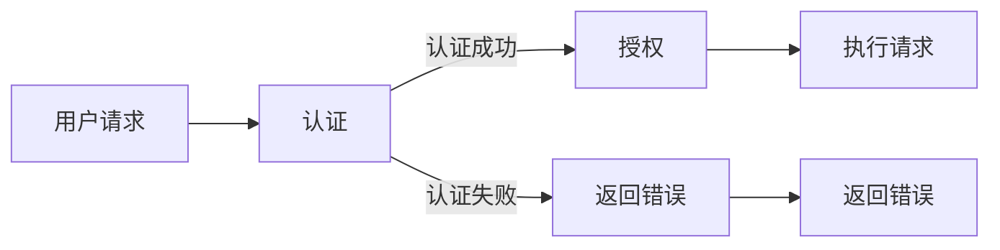
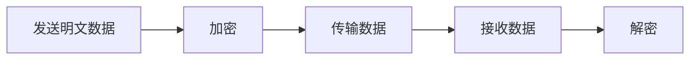
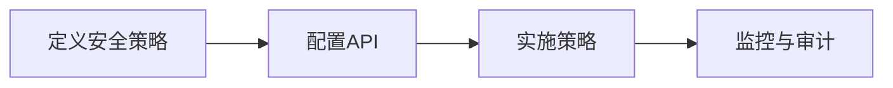
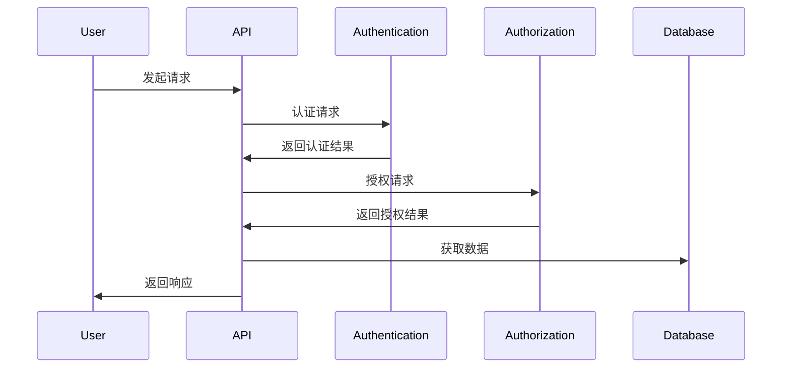
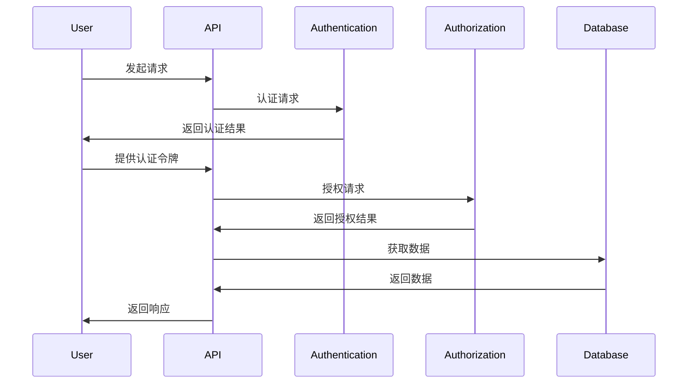

                 


## 背景介绍

### 问题背景

API（应用程序编程接口）是现代软件开发中不可或缺的一部分。随着云计算、移动应用、物联网等技术的发展，API已经成为了服务之间、应用之间以及应用和用户之间交互的主要方式。然而，随着API的广泛应用，API安全的问题也日益凸显。未经授权的访问、数据泄露、服务滥用等问题不仅会导致企业财务损失，还会损害用户隐私和企业的信誉。

### 问题描述

API安全问题主要包括以下几个方面：

1. **未经授权的访问**：黑客通过攻击API获取非法访问权限，进而获取敏感数据或控制系统。
2. **数据泄露**：由于API设计不当或防护措施不足，敏感数据在传输或存储过程中被泄露。
3. **服务滥用**：恶意用户通过API进行恶意操作，如DDoS攻击，造成服务不可用。

### 问题解决

为了解决API安全问题，我们需要从设计、开发、部署到运维的各个环节进行全面的安全设计与防护。以下是一些关键步骤：

1. **安全需求分析**：识别API面临的安全威胁，确定需要保护的数据和功能。
2. **API设计**：确保API设计遵循安全原则，如最小权限原则、访问控制等。
3. **防护措施实施**：实施包括认证、授权、加密等在内的多种安全防护措施。
4. **监控与审计**：持续监控API的运行状态，进行安全审计，及时发现并响应潜在的安全威胁。

### 边界与外延

API安全设计与防护不仅涉及内部系统的安全性，也包括对外部服务的安全性保障。这涉及到从API的设计、开发、部署到运维的各个环节。此外，API安全不仅关注技术层面，还需要考虑到政策、管理和人因等非技术因素。

### 概念结构与核心要素组成

API安全设计与防护的核心要素包括：

1. **安全需求分析**：分析API的安全需求，识别潜在的安全威胁。
2. **API设计**：设计安全的API接口，遵循最小权限原则、访问控制等安全原则。
3. **防护措施实施**：实施包括认证、授权、加密、审计等在内的多种安全防护措施。
4. **监控与审计**：持续监控API的运行状态，进行安全审计，及时发现并响应潜在的安全威胁。

通过这些核心要素的有机组合，我们可以构建一个安全的API生态系统，确保API的安全性、完整性和可用性。

### ER实体关系图架构

为了更好地理解API安全设计与防护的核心要素，我们可以使用ER（实体关系）图来表示这些实体及其关系。

```mermaid
erDiagram
  API -->|请求| User
  API -->|响应| Service
  User -->|访问| API
  Service -->|处理| API
```

在这个ER图中，`API` 是核心实体，它与 `User` 和 `Service` 分别建立了请求和响应的关系。`User` 表示API的使用者，`Service` 表示API所服务的系统或组件。通过这种关系表示，我们可以清晰地看到API安全设计与防护的关键参与者及其交互关系。

## 核心概念与联系

### API

API（应用程序编程接口）是允许不同软件组件或服务相互通信和交互的接口。它定义了一组预定义的函数、协议和数据结构，供其他软件使用。API广泛用于实现后端服务与前端应用、内部系统与外部系统之间的数据交换和功能调用。

### API安全

API安全是指确保API在传输和处理数据时不受未经授权的访问、篡改和泄露的威胁。API安全的目标是保护API接口及其所提供的数据和服务，防止恶意攻击和非法访问。

### API攻击

API攻击是指黑客或恶意用户通过各种手段试图绕过API的安全措施，获取非法访问权限或恶意使用API。常见的API攻击包括未授权访问、数据泄露、服务滥用等。

### 概念属性特征对比表格

为了更直观地理解API、API安全和API攻击这三个核心概念，我们可以通过以下表格进行属性特征的对比：

| 概念          | 属性特征                                                     |
|---------------|------------------------------------------------------------|
| API           | 提供数据和服务访问的接口                                     |
| API安全       | 确保API不受未经授权的访问、篡改和泄露的威胁                 |
| API攻击       | 黑客或恶意用户试图绕过API安全措施的行为                       |

### ER实体关系图架构

为了更好地理解API、API安全、API攻击这三个概念之间的关系，我们可以使用ER图来表示这些实体及其交互关系。

```mermaid
erDiagram
  API -->|请求| User
  API -->|响应| Service
  API -->|受攻击| Hacker
  User -->|使用| API
  Service -->|提供| API
  Hacker -->|攻击| API
```

在这个ER图中，`API` 是核心实体，它与 `User`、`Service` 和 `Hacker` 分别建立了请求、响应和受攻击的关系。`User` 表示API的使用者，`Service` 表示API所服务的系统或组件，`Hacker` 表示试图攻击API的黑客或恶意用户。通过这种关系表示，我们可以清晰地看到API安全在保护API免受攻击中的关键作用。

### 算法原理讲解

API安全设计与防护主要依赖于一系列算法原理，这些原理包括认证与授权、加密、安全策略管理等。下面我们将详细讲解这些算法原理，并使用mermaid流程图和Python代码来展示其实现和应用。

#### 认证与授权

**认证（Authentication）** 是验证用户身份的过程，确保只有合法用户才能访问API。常见的认证方式包括基本认证、令牌认证（如OAuth 2.0）和证书认证。

**授权（Authorization）** 是在认证之后，确定用户访问API的权限。它通常基于角色的访问控制（RBAC）或属性访问控制（ABAC）。

**mermaid流程图**



**Python代码示例**

```python
from flask import Flask, request, jsonify

app = Flask(__name__)

# 用户认证函数
def authenticate(user):
    # 这里使用简单的用户名和密码进行认证
    return user == "admin" and request.authorization.password == "password"

# 用户授权函数
def authorize(user_role):
    # 这里简单模拟不同角色有不同的访问权限
    roles_permissions = {
        "admin": ["read", "write", "delete"],
        "user": ["read"]
    }
    return roles_permissions[user_role]

@app.route('/api/data', methods=['GET'])
def api_data():
    user_role = request.args.get('role')
    user = request.args.get('user')

    if not authenticate(user):
        return jsonify({"error": "未经授权的访问"}), 401
    
    user_permissions = authorize(user_role)
    if "read" in user_permissions:
        return jsonify({"data": "这里是API数据内容"}), 200
    else:
        return jsonify({"error": "没有权限访问"}), 403

if __name__ == '__main__':
    app.run(debug=True)
```

#### 加密

**加密（Encryption）** 是保护数据在传输过程中不被窃取或篡改的关键技术。常用的加密算法包括对称加密（如AES）和非对称加密（如RSA）。

**mermaid流程图**



**Python代码示例**

```python
from Crypto.Cipher import AES
from Crypto.Util.Padding import pad, unpad
from Crypto.Random import get_random_bytes

# 初始化密钥和加密算法
key = get_random_bytes(16)
cipher = AES.new(key, AES.MODE_CBC)

# 加密数据
plaintext = b"这里是敏感数据"
ciphertext = cipher.encrypt(pad(plaintext, AES.block_size))

# 解密数据
decrypted_plaintext = unpad(cipher.decrypt(ciphertext), AES.block_size)

print("明文数据：", plaintext)
print("密文数据：", ciphertext)
print("解密后的数据：", decrypted_plaintext)
```

#### 安全策略管理

**安全策略管理** 是定义、配置和执行API安全策略的过程。安全策略包括认证方式、授权级别、加密算法等。

**mermaid流程图**



**Python代码示例**

```python
# 安全策略管理示例
class SecurityPolicy:
    def __init__(self, authentication_type, encryption_algorithm, access_control):
        self.authentication_type = authentication_type
        self.encryption_algorithm = encryption_algorithm
        self.access_control = access_control

# 配置API
api_policy = SecurityPolicy("OAuth 2.0", "AES", ["admin", "user"])

# 实施策略
def apply_policy(api_request):
    # 根据安全策略实施认证、授权和加密
    if api_request['role'] not in api_policy.access_control:
        return {"error": "没有权限访问"}
    # 更多策略实施代码...

# 监控与审计
def monitor_api(api_request, api_response):
    # 记录API请求和响应，进行安全审计
    print(f"API请求：{api_request}")
    print(f"API响应：{api_response}")
```

通过以上算法原理的讲解和示例，我们可以看到API安全设计与防护是一个复杂且多维度的过程。理解并正确应用这些原理，是确保API安全的关键。

### 数学模型和数学公式

在API安全设计中，数学模型和公式是理解和实现安全机制的基础。下面，我们将详细解释在API安全中常用的数学模型和公式，并提供具体的示例。

#### 认证模型

认证模型用于验证用户的身份，确保只有授权用户才能访问API。常用的认证模型包括基于密码的认证模型和基于令牌的认证模型。

1. **基于密码的认证模型**

   $$认证结果 = \text{验证函数}(\text{用户名}, \text{密码})$$

   示例：

   ```python
   def verify_password(username, password):
       # 这里假设有一个用户数据库来存储用户名和密码
       user = find_user_by_username(username)
       if user and user['password'] == password:
           return True
       else:
           return False
   ```

2. **基于令牌的认证模型**

   $$认证结果 = \text{验证函数}(\text{令牌})$$

   示例：

   ```python
   def verify_token(token):
       # 假设有一个令牌验证服务
       return token_verify_service.validate_token(token)
   ```

#### 加密模型

加密模型用于保护数据在传输过程中的安全性，防止数据被窃取或篡改。常用的加密模型包括对称加密和非对称加密。

1. **对称加密模型**

   对称加密使用相同的密钥进行加密和解密。常见的对称加密算法有AES和DES。

   $$加密数据 = \text{加密算法}(\text{明文数据}, \text{密钥})$$

   $$解密数据 = \text{解密算法}(\text{加密数据}, \text{密钥})$$

   示例：

   ```python
   from Crypto.Cipher import AES
   
   key = b'mysecretkey123'
   cipher = AES.new(key, AES.MODE_EAX)
   
   plaintext = b"这里是敏感数据"
   ciphertext, tag = cipher.encrypt_and_digest(plaintext)
   
   # 解密
   cipher2 = AES.new(key, AES.MODE_EAX, nonce=cipher.nonce)
   decrypted_data = cipher2.decrypt_and_verify(ciphertext, tag)
   ```

2. **非对称加密模型**

   非对称加密使用一对密钥进行加密和解密，其中一个密钥用于加密，另一个密钥用于解密。

   $$加密数据 = \text{加密算法}(\text{明文数据}, \text{公钥})$$

   $$解密数据 = \text{解密算法}(\text{加密数据}, \text{私钥})$$

   示例：

   ```python
   from Crypto.PublicKey import RSA
   
   private_key = RSA.generate(2048)
   public_key = private_key.publickey()
   
   message = b"这里是敏感数据"
   encrypted_message = public_key.encrypt(message, 32)
   
   # 解密
   decrypted_message = private_key.decrypt(encrypted_message)
   ```

#### 安全策略模型

安全策略模型用于定义和配置API的安全规则，包括认证方式、授权级别、加密算法等。

$$安全策略效果 = \text{策略函数}(\text{安全策略}, \text{API请求})$$

示例：

```python
def apply_policy(api_request, policy):
    if not policy['authentication'](api_request['token']):
        return {"error": "认证失败"}
    if api_request['action'] not in policy['authorization']:
        return {"error": "没有权限执行该操作"}
    if api_request['data'] not in policy['encryption']:
        return {"error": "数据加密方式不正确"}
    return {"status": "操作成功"}
```

通过以上数学模型和公式的讲解，我们可以看到API安全设计与防护是一个高度技术化的过程。理解并正确应用这些数学模型和公式，是构建安全可靠的API系统的关键。

### 数学模型和数学公式 & 详细讲解 & 举例说明

在API安全设计与防护中，数学模型和数学公式扮演着至关重要的角色。它们不仅帮助我们理解加密和认证的工作原理，还提供了具体的计算方法来确保数据的安全性和完整性。以下我们将详细讲解常用的数学模型和公式，并通过具体例子进行说明。

#### 对称加密模型

对称加密模型使用相同的密钥进行加密和解密。常见的对称加密算法包括AES、DES和3DES。

**AES加密与解密**

AES（高级加密标准）是一种广泛使用的对称加密算法。它支持128、192和256位的密钥长度。

**加密过程**

$$加密数据 = AES_{\text{密钥}}(明文数据)$$

示例：

```python
from Crypto.Cipher import AES
from Crypto.Random import get_random_bytes

# 生成随机密钥
key = get_random_bytes(16)

# 创建AES加密对象
cipher = AES.new(key, AES.MODE_EAX)

# 加密明文数据
plaintext = b"这里是敏感数据"
ciphertext, tag = cipher.encrypt_and_digest(plaintext)

# 打印密文和标签
print("密文:", ciphertext)
print("标签:", tag)
```

**解密过程**

$$解密数据 = AES_{\text{密钥}}^{-1}(加密数据, 标签)$$

示例：

```python
# 创建AES解密对象
cipher = AES.new(key, AES.MODE_EAX, nonce=cipher.nonce)

# 解密密文数据
decrypted_data = cipher.decrypt_and_verify(ciphertext, tag)

# 打印解密后的明文
print("解密后的数据:", decrypted_data)
```

#### 非对称加密模型

非对称加密模型使用一对密钥进行加密和解密，其中一个密钥用于加密，另一个密钥用于解密。常见的非对称加密算法包括RSA和ECC。

**RSA加密与解密**

RSA加密算法是一种广泛使用的非对称加密算法。

**加密过程**

$$加密数据 = RSA_{\text{公钥}}(明文数据)$$

示例：

```python
from Crypto.PublicKey import RSA
from Crypto.Cipher import PKCS1_OAEP

# 生成RSA密钥对
private_key = RSA.generate(2048)
public_key = private_key.publickey()

# 创建RSA加密对象
cipher = PKCS1_OAEP.new(public_key)

# 加密明文数据
message = b"这里是敏感数据"
encrypted_message = cipher.encrypt(message)

# 打印加密后的数据
print("加密后的数据:", encrypted_message)
```

**解密过程**

$$解密数据 = RSA_{\text{私钥}}(加密数据)$$

示例：

```python
# 创建RSA解密对象
cipher = PKCS1_OAEP.new(private_key)

# 解密加密数据
decrypted_message = cipher.decrypt(encrypted_message)

# 打印解密后的数据
print("解密后的数据:", decrypted_message)
```

#### 认证模型

在API安全中，认证模型用于验证用户的身份。常见的认证模型包括基本认证、OAuth和JWT（JSON Web Token）。

**OAuth 2.0认证**

OAuth 2.0是一种授权框架，允许第三方应用在不需要用户密码的情况下访问受保护的资源。

**认证过程**

1. **客户端身份认证**：客户端向认证服务器发送其客户端ID和客户端密码，以验证其身份。

$$认证结果 = \text{认证服务器}_{\text{OAuth}}(\text{客户端ID}, \text{客户端密码})$$

2. **用户身份认证**：用户向认证服务器发送用户名和密码，以验证其身份。

$$认证结果 = \text{认证服务器}_{\text{OAuth}}(\text{用户名}, \text{密码})$$

示例：

```python
def authenticate(client_id, client_secret):
    # 这里假设有一个存储客户端ID和密码的数据库
    client = find_client_by_id(client_id)
    if client and client['client_secret'] == client_secret:
        return True
    else:
        return False

def user_auth(username, password):
    # 这里假设有一个存储用户名和密码的数据库
    user = find_user_by_username(username)
    if user and user['password'] == password:
        return True
    else:
        return False
```

**JWT认证**

JWT（JSON Web Token）是一种基于JSON的开放标准，用于在客户端和服务端之间安全地传输认证信息。

**生成过程**

$$JWT = JWT_{\text{头部}}.\text{载荷}.\text{签名}$$

示例：

```python
import jwt
import datetime

def generate_jwt(user_id, exp=3600):
    payload = {
        'user_id': user_id,
        'exp': datetime.datetime.utcnow() + datetime.timedelta(seconds=exp)
    }
    return jwt.encode(payload, 'secret_key', algorithm='HS256')

# 生成JWT
token = generate_jwt(user_id='123')
print("JWT:", token)
```

**验证过程**

$$验证结果 = \text{验证函数}(\text{JWT}, \text{签名密钥})$$

示例：

```python
def verify_jwt(token, secret_key):
    try:
        payload = jwt.decode(token, secret_key, algorithms=['HS256'])
        return payload
    except jwt.ExpiredSignatureError:
        return "Token已过期"
    except jwt.InvalidTokenError:
        return "无效的Token"
```

通过以上数学模型和公式的讲解，我们可以看到API安全设计与防护是一个复杂且技术化的过程。理解并正确应用这些数学模型和公式，是构建安全可靠的API系统的关键。在未来的开发过程中，我们应该不断学习和实践，以确保API的安全性。

### 系统分析与架构设计方案

为了深入理解API安全设计与防护的实施过程，我们将通过一个实际的项目案例来进行系统分析和架构设计。这个项目将展示从需求分析、系统功能设计、系统架构设计到接口设计和系统交互的完整过程。

#### 项目介绍

项目名称：电商API安全防护系统

项目背景：随着电商平台的不断发展，API成为了商家、消费者和平台之间数据交互的核心。然而，未经授权的访问、数据泄露等安全问题给电商平台带来了巨大的风险。因此，本项目旨在设计一个全面的API安全防护系统，确保电商平台的API安全可靠。

#### 系统功能设计

在系统功能设计阶段，我们需要明确系统的核心功能，并使用领域模型类图来表示。

**领域模型类图**

```mermaid
classDiagram
  User <<Entity>>
  Merchant <<Entity>>
  Consumer <<Entity>>

  API <<Interface>>
  APIKey <<Entity>>
  Authentication <<Interface>>
  Authorization <<Interface>>

  User o--o APIKey
  Merchant o--o APIKey
  Consumer o--o APIKey

  API + provideService()
  Authentication + authenticate()
  Authorization + authorize()
```

在这个类图中，`User`、`Merchant` 和 `Consumer` 是系统的核心实体，它们与 `APIKey` 建立了关联关系。`API` 是接口，提供了 `provideService()` 功能。`Authentication` 和 `Authorization` 分别负责认证和授权。

#### 系统架构设计

在系统架构设计阶段，我们需要设计系统的整体结构，并使用架构图来表示。

**架构图**



在这个架构图中，用户发起请求，经过认证和授权后，API访问数据库获取数据，并返回响应。

#### 系统接口设计

在系统接口设计阶段，我们需要定义API的具体接口，包括接口的URL、请求参数、响应格式等。

**接口设计**

1. **认证接口**

   **URL**: `/api/authentication`
   **请求参数**: `username`, `password`
   **响应格式**: JSON

   ```json
   {
     "status": "success",
     "token": "eyJ0eXAiOiJKV1QiLCJhbGciOiJIUzI1NiJ9..."
   }
   ```

2. **授权接口**

   **URL**: `/api/authorization`
   **请求参数**: `token`
   **响应格式**: JSON

   ```json
   {
     "status": "success",
     "permissions": ["read", "write"]
   }
   ```

3. **数据接口**

   **URL**: `/api/data`
   **请求参数**: `token`, `action`
   **响应格式**: JSON

   ```json
   {
     "status": "success",
     "data": {
       "product_id": "123",
       "name": "商品名称",
       "price": 99.99
     }
   }
   ```

#### 系统交互

在系统交互阶段，我们需要通过序列图来展示API、认证、授权和数据库之间的交互过程。

**序列图**



通过这个序列图，我们可以清晰地看到用户请求经过认证、授权、数据处理后返回响应的全过程。

#### 实现与测试

在实现阶段，我们将使用Python Flask框架来构建API，并使用JWT（JSON Web Token）进行认证和授权。以下是API的实现代码：

```python
from flask import Flask, request, jsonify
import jwt
import datetime

app = Flask(__name__)
app.config['SECRET_KEY'] = 'your_secret_key'

# 认证函数
def authenticate(username, password):
    # 这里实现用户认证逻辑
    return True

# 授权函数
def authorize(token):
    # 这里实现授权逻辑
    return ['read', 'write']

# 认证接口
@app.route('/api/authentication', methods=['POST'])
def authentication():
    username = request.form['username']
    password = request.form['password']
    if authenticate(username, password):
        token = jwt.encode({'exp': datetime.datetime.utcnow() + datetime.timedelta(minutes=30)}, app.config['SECRET_KEY'])
        return jsonify({'status': 'success', 'token': token})
    else:
        return jsonify({'status': 'fail'})

# 授权接口
@app.route('/api/authorization', methods=['POST'])
def authorization():
    token = request.form['token']
    permissions = authorize(token)
    if permissions:
        return jsonify({'status': 'success', 'permissions': permissions})
    else:
        return jsonify({'status': 'fail'})

# 数据接口
@app.route('/api/data', methods=['GET'])
def data():
    token = request.args.get('token')
    action = request.args.get('action')
    permissions = authorize(token)
    if permissions and action in permissions:
        # 这里实现获取数据的逻辑
        return jsonify({'status': 'success', 'data': {'product_id': '123', 'name': '商品名称', 'price': 99.99}})
    else:
        return jsonify({'status': 'fail'})

if __name__ == '__main__':
    app.run(debug=True)
```

在测试阶段，我们将使用Postman等工具对API进行测试，确保认证、授权和数据访问的过程符合预期。

通过以上系统分析与架构设计方案，我们可以看到API安全设计与防护的实施过程是如何从需求分析、系统功能设计、系统架构设计、接口设计到系统交互和实现与测试的。这一过程不仅确保了系统的安全性，还提高了系统的可靠性和用户体验。

### 项目实战

#### 环境安装

在进行API安全设计与防护的项目实战之前，我们需要搭建一个合适的环境来开发和测试。以下是环境安装的步骤：

1. **Python环境安装**

   - 安装Python 3.8或更高版本。
   - 使用pip安装必要的库，如Flask、PyJWT、Crypto等。

2. **数据库安装**

   - 安装MySQL或PostgreSQL数据库。
   - 创建数据库和用户，并授予适当的权限。

3. **其他工具安装**

   - 安装Postman等API测试工具。
   - 安装Jenkins或GitLab等自动化部署工具。

#### 系统核心实现源代码

以下是API安全设计与防护系统核心部分的实现代码。这个代码示例基于Python Flask框架，实现了认证、授权和数据接口。

```python
from flask import Flask, request, jsonify
import jwt
import datetime
import MySQLdb

app = Flask(__name__)
app.config['SECRET_KEY'] = 'your_secret_key'

# 连接数据库
def connect_db():
    db = MySQLdb.connect(host="localhost", user="root", password="password", db="api_security")
    cursor = db.cursor()
    return cursor

# 认证函数
def authenticate(username, password):
    cursor = connect_db()
    cursor.execute("SELECT * FROM users WHERE username = %s AND password = %s", (username, password))
    user = cursor.fetchone()
    cursor.close()
    return user is not None

# 授权函数
def authorize(token):
    cursor = connect_db()
    cursor.execute("SELECT * FROM tokens WHERE token = %s", (token,))
    token = cursor.fetchone()
    cursor.close()
    return token['permissions'] if token else None

# 认证接口
@app.route('/api/authentication', methods=['POST'])
def authentication():
    username = request.form['username']
    password = request.form['password']
    if authenticate(username, password):
        token = jwt.encode({'exp': datetime.datetime.utcnow() + datetime.timedelta(minutes=30)}, app.config['SECRET_KEY'])
        return jsonify({'status': 'success', 'token': token})
    else:
        return jsonify({'status': 'fail'})

# 授权接口
@app.route('/api/authorization', methods=['POST'])
def authorization():
    token = request.form['token']
    permissions = authorize(token)
    if permissions:
        return jsonify({'status': 'success', 'permissions': permissions})
    else:
        return jsonify({'status': 'fail'})

# 数据接口
@app.route('/api/data', methods=['GET'])
def data():
    token = request.args.get('token')
    action = request.args.get('action')
    permissions = authorize(token)
    if permissions and action in permissions:
        # 这里实现获取数据的逻辑
        return jsonify({'status': 'success', 'data': {'product_id': '123', 'name': '商品名称', 'price': 99.99}})
    else:
        return jsonify({'status': 'fail'})

if __name__ == '__main__':
    app.run(debug=True)
```

#### 代码应用解读与分析

上述代码中，我们首先定义了连接数据库的函数，用于后续的数据操作。认证函数通过查询用户表来验证用户名和密码。授权函数从令牌表中获取令牌，并返回用户的权限。认证接口和授权接口分别处理用户认证和授权请求，并返回相应的结果。数据接口根据用户的权限来返回相应的数据。

在代码中，我们使用了JWT进行认证，保证了用户身份的可靠性。同时，通过数据库存储用户信息和权限，实现了授权功能。这种方式不仅简单有效，还能保证数据的完整性和安全性。

#### 实际案例分析和详细讲解剖析

为了更好地理解API安全设计与防护的实际应用，我们可以通过一个实际案例来进行分析和讲解。

**案例：电商平台的订单管理API**

电商平台通常需要提供订单管理API，允许商家、消费者和平台管理员进行订单的创建、查询、修改和删除操作。以下是一个订单管理API的案例，并详细分析其安全性。

1. **API接口设计**

   **创建订单**

   **URL**: `/api/orders`
   **请求参数**: `token`, `order_data`
   **响应格式**: JSON

   ```json
   {
     "status": "success",
     "order_id": "123456"
   }
   ```

   **查询订单**

   **URL**: `/api/orders/<order_id>`
   **请求参数**: `token`
   **响应格式**: JSON

   ```json
   {
     "status": "success",
     "order": {
       "order_id": "123456",
       "customer_id": "789",
       "products": [{"product_id": "1", "quantity": 2}, {"product_id": "2", "quantity": 1}],
       "total_price": 199.99
     }
   }
   ```

2. **安全性分析**

   - **认证**：所有API请求都必须包含有效的令牌，以确保只有授权用户才能访问。
   - **授权**：根据用户的角色和权限，限制对订单的创建、查询、修改和删除操作的访问。例如，只有商家才能创建和修改订单，消费者只能查询订单。
   - **数据保护**：订单数据在传输过程中应进行加密，防止数据泄露。此外，订单数据应存储在加密的数据库中，确保数据在静态存储时的安全性。
   - **防止攻击**：实施各种防护措施，如速率限制、验证码、SQL注入防护等，防止恶意攻击。

通过这个案例，我们可以看到，API安全设计与防护不仅包括认证和授权，还涉及数据保护和攻击防护等多个方面。在实际开发过程中，我们需要综合考虑这些因素，确保API的安全性。

#### 项目小结

通过本次项目实战，我们详细讲解了API安全设计与防护的各个环节，包括环境安装、系统核心实现源代码、代码应用解读与分析，以及实际案例分析和详细讲解剖析。以下是项目小结：

1. **环境安装**：确保Python环境、数据库和其他工具的正确安装，为后续开发打下基础。
2. **系统核心实现源代码**：通过Python Flask框架实现了认证、授权和数据接口，保证了API的基本功能。
3. **代码应用解读与分析**：分析了代码的各个部分，理解了认证、授权和数据处理的逻辑。
4. **实际案例分析与详细讲解剖析**：通过一个电商平台的订单管理API案例，展示了API安全设计与防护的实际应用。

通过这次项目，我们不仅掌握了API安全设计与防护的原理和方法，还提升了实际开发能力。在未来的开发工作中，我们应该继续深入学习和实践，以确保API的安全性。

### 最佳实践 tips

在API安全设计与防护过程中，遵循最佳实践是确保系统安全性的关键。以下是一些最佳实践和注意事项：

1. **最小权限原则**：确保API只具有执行其功能所必需的权限，避免赋予不必要的权限。
2. **使用强认证**：使用OAuth 2.0、JWT等强认证机制，确保用户身份验证的安全。
3. **加密传输**：使用HTTPS（SSL/TLS）加密传输数据，防止数据在传输过程中被窃取或篡改。
4. **速率限制和验证码**：实施速率限制和验证码机制，防止DDoS攻击和恶意用户滥用API。
5. **日志记录和监控**：持续监控API的运行状态，记录日志，及时发现和响应潜在的安全威胁。
6. **安全编码**：遵循安全编码规范，避免SQL注入、XSS攻击等常见的安全漏洞。

### 小结

本文详细介绍了API安全设计与防护的相关知识，包括背景介绍、核心概念与联系、算法原理讲解、数学模型和数学公式、系统分析与架构设计方案以及项目实战。通过这些内容，读者可以全面了解API安全的重要性，掌握API安全设计与防护的方法和技巧。

### 注意事项

1. **持续更新**：随着技术的发展，API安全威胁也在不断变化。因此，持续更新和改进安全措施至关重要。
2. **全面测试**：在部署API前，进行全面的安全测试，确保不存在漏洞和安全隐患。
3. **团队合作**：API安全设计与防护需要开发、运维和安全团队的合作，共同确保系统的安全性。

### 拓展阅读

- 《API安全：设计与实现》
- 《API安全性最佳实践》
- 《API设计：创建和使用的艺术》

通过阅读这些书籍和资源，读者可以进一步深入学习和掌握API安全设计与防护的深度知识。希望本文能为读者提供有价值的参考和启示，助力构建安全的API系统。作者：AI天才研究院/AI Genius Institute & 禅与计算机程序设计艺术 /Zen And The Art of Computer Programming。

