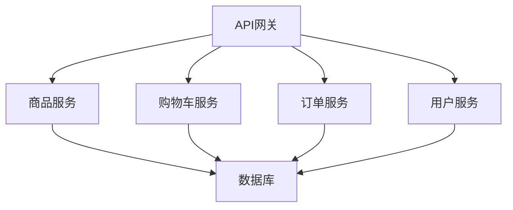
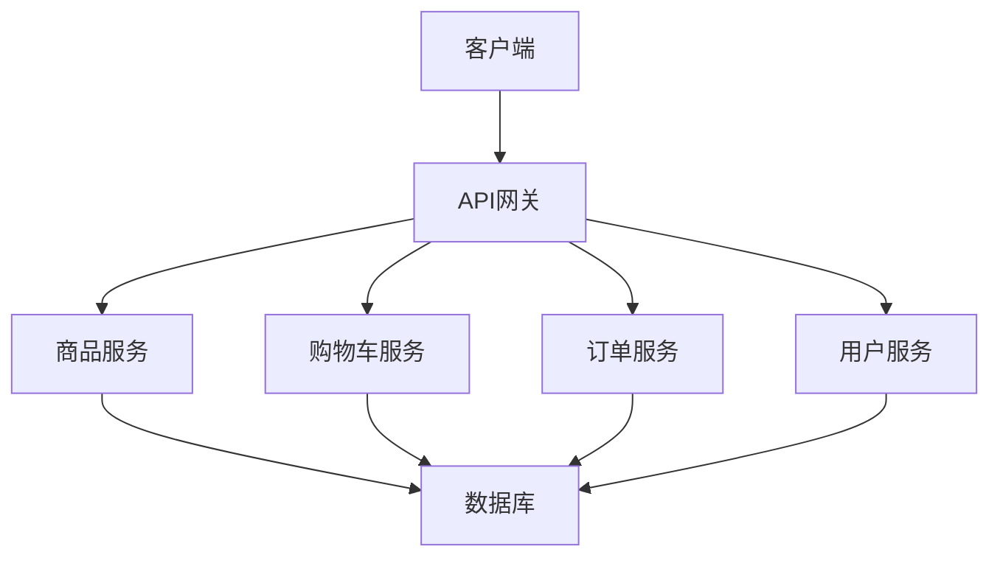

                 


## # API网关: 微服务架构中的统一入口

### 关键词：API网关、微服务、架构设计、路由转发、负载均衡、安全性

> 摘要：本文将深入探讨API网关在微服务架构中的重要性，分析其基础概念、架构设计、核心功能、实现技术以及安全性。通过案例分析和未来发展趋势，帮助读者全面理解API网关在微服务生态系统中的关键作用。

### 目录大纲

1. 第一部分：API网关基础概念与架构
   1.1 API网关概述
   1.2 API网关的架构
   1.3 API网关的分类
2. 第二部分：API网关核心功能
   2.1 路由转发
   2.2 请求和响应处理
   2.3 安全认证与授权
   2.4 负载均衡与故障转移
3. 第三部分：API网关在微服务架构中的应用
   3.1 微服务架构概述
   3.2 API网关在微服务架构中的作用
   3.3 API网关与微服务通信
4. 第四部分：API网关实现技术
   4.1 API网关编程语言选择
   4.2 API网关开发框架
   4.3 API网关性能优化
5. 第五部分：API网关安全性
   5.1 API安全攻击防范
   5.2 API监控与日志管理
   5.3 API网关最佳实践
6. 第六部分：API网关案例分析
   6.1 案例介绍
   6.2 系统设计
   6.3 实现细节
   6.4 案例总结
7. 第七部分：API网关未来发展趋势
   7.1 技术发展趋势
   7.2 行业应用场景
   7.3 未来展望

---

### 1. 第一部分：API网关基础概念与架构

#### 1.1 API网关概述

API网关是微服务架构中一个重要的组件，它作为系统的统一入口，负责处理所有外部请求，并将请求路由到相应的微服务上。API网关的出现解决了微服务架构中服务之间通信复杂、安全性难以保障等问题。

**API网关的概念**：API网关是一种服务器，位于客户端和后端微服务之间，负责接收客户端的请求，将请求转发给相应的微服务，并对返回的响应进行预处理。

**API网关的作用**：
- **路由转发**：根据请求路径和参数，将请求转发到正确的微服务。
- **安全认证**：对请求进行身份验证和授权，确保请求的安全。
- **负载均衡**：将请求分配到不同的微服务实例上，避免单点故障。
- **请求和响应处理**：对请求和响应进行预处理和后处理，如日志记录、缓存、压缩等。
- **统一接口**：为客户端提供一个统一的接口，隐藏微服务的具体实现细节。

**API网关与传统架构的区别**：
- **传统架构**：在传统的单体架构中，所有的功能都集中在单个应用程序中，客户端与服务器之间的通信直接且简单。
- **微服务架构**：在微服务架构中，系统被分解为多个独立的微服务，每个微服务负责一个特定的业务功能。客户端与服务器之间的通信复杂，需要通过API网关进行路由和转发。

#### 1.2 API网关的架构

API网关的基本架构通常包括以下组件：

- **请求接收器**：接收客户端的请求，并将其传递给路由组件。
- **路由组件**：根据请求的路径和参数，将请求转发到相应的微服务。
- **安全组件**：对请求进行认证和授权，确保请求的安全。
- **处理组件**：对请求和响应进行预处理和后处理，如日志记录、缓存、压缩等。
- **负载均衡组件**：将请求分配到不同的微服务实例上，实现负载均衡。

**API网关的关键组件**：
- **负载均衡器**：实现请求的负载均衡，避免单点故障。
- **过滤器**：对请求进行预处理和后处理，如日志记录、缓存、压缩等。
- **认证和授权机制**：确保请求的安全，如OAuth2.0、JWT等。
- **API监控和日志管理**：对API的使用情况进行监控和记录，便于问题排查和性能优化。

**API网关的运行原理**：
1. 客户端发送请求到API网关。
2. API网关接收请求，并根据路由策略将请求转发到相应的微服务。
3. 微服务处理请求并返回响应。
4. API网关接收响应，并进行预处理和后处理，如日志记录、缓存、压缩等。
5. API网关将处理后的响应返回给客户端。

#### 1.3 API网关的分类

根据应用场景和功能需求，API网关可以分为以下几类：

- **服务端API网关**：主要面向外部客户端提供服务，负责处理所有外部请求。
- **客户端API网关**：主要面向内部服务提供接口，负责内部服务之间的通信。
- **微服务API网关**：既面向外部客户端提供服务，也面向内部服务提供接口。

### 2. 第二部分：API网关核心功能

#### 2.1 路由转发

路由转发是API网关的核心功能之一，它负责将客户端的请求转发到正确的微服务。

**路由策略**：
- **基于路径**：根据请求的路径进行路由，如`/user`请求转发到用户服务。
- **基于参数**：根据请求的参数进行路由，如`/order?userId=123`请求转发到用户服务。
- **动态路由**：根据路由策略动态地将请求转发到不同的微服务，如使用Consul进行服务发现。

**路由匹配规则**：
- **前缀匹配**：以请求路径的前缀进行匹配，如`/api/user`匹配到用户服务。
- **完全匹配**：完全匹配请求路径，如`/user`只匹配到用户服务。

#### 2.2 请求和响应处理

请求和响应处理是API网关的另一个重要功能，它负责对请求和响应进行预处理和后处理。

**请求预处理**：
- **参数验证**：对请求的参数进行验证，确保参数的有效性。
- **请求体解析**：解析请求体，如JSON、XML等。

**响应后处理**：
- **响应体压缩**：对响应体进行压缩，减少数据传输量。
- **响应体转换**：将响应体转换为客户端可接受的格式，如JSONP、XML等。
- **响应体加密**：对响应体进行加密，确保数据的安全性。

**跨域处理**：
- **CORS**：通过设置CORS响应头，允许跨域请求访问资源。

#### 2.3 安全认证与授权

安全认证和授权是API网关的重要功能，它负责确保请求的安全性和权限控制。

**认证机制**：
- **OAuth2.0**：通过第三方授权服务器进行用户认证。
- **JWT**：通过JSON Web Token进行用户认证。

**授权策略**：
- **RBAC**：基于角色的访问控制，根据用户的角色进行权限控制。
- **ABAC**：基于属性的访问控制，根据用户的属性进行权限控制。

**API安全策略**：
- **API签名**：对请求进行签名验证，确保请求的合法性。
- **速率限制**：限制请求的频率，防止恶意攻击。

#### 2.4 负载均衡与故障转移

负载均衡和故障转移是API网关的重要功能，它负责确保服务的可用性和性能。

**负载均衡算法**：
- **轮询**：按照请求顺序分配到不同的微服务实例。
- **加权轮询**：根据微服务实例的权重分配请求。
- **最小连接数**：将请求分配到连接数最少的微服务实例。

**故障转移策略**：
- **主从模式**：主实例故障时，从实例自动成为主实例。
- **集群模式**：多个实例同时工作，自动检测并替换故障实例。

**高可用设计**：
- **多实例部署**：部署多个API网关实例，确保服务的可用性。
- **服务网格**：使用服务网格进行服务发现和负载均衡，提高系统的可伸缩性。

### 3. 第三部分：API网关在微服务架构中的应用

#### 3.1 微服务架构概述

微服务架构是一种基于业务模块化的系统架构，将大型单体应用程序分解为多个独立的微服务，每个微服务负责一个特定的业务功能。微服务架构具有高可伸缩性、高可维护性、高容错性等优点。

**微服务架构的特点**：
- **独立性**：每个微服务都是独立的，可以独立部署、升级和扩展。
- **分布式**：微服务运行在分布式环境中，通过HTTP/HTTPS等协议进行通信。
- **自治性**：每个微服务有自己的数据存储和服务逻辑，可以独立运行和管理。
- **微服务间通信**：微服务之间通过RESTful API、gRPC等进行通信。

**微服务架构的优势**：
- **可伸缩性**：根据业务需求，可以独立扩展或缩小某个微服务。
- **可维护性**：每个微服务可以独立开发和维护，降低维护成本。
- **容错性**：某个微服务故障不会影响整个系统的运行。

**微服务架构的挑战**：
- **服务数量多**：随着业务的发展，服务数量会不断增加，导致系统的复杂度提高。
- **服务间通信**：服务之间需要进行通信，需要考虑负载均衡、服务发现等问题。
- **部署和运维**：需要自动化部署和运维，确保系统的稳定运行。

#### 3.2 API网关在微服务架构中的作用

API网关在微服务架构中起着至关重要的作用，它为客户端和微服务提供了一个统一的接口，简化了服务之间的通信，提高了系统的可维护性和可扩展性。

**API网关作为统一入口**：
- **简化服务发现**：客户端无需了解具体的服务地址和端口，只需通过API网关即可访问所有服务。
- **统一路由策略**：API网关可以统一管理路由策略，简化服务之间的通信。
- **统一安全策略**：API网关可以统一管理认证和授权策略，提高系统的安全性。

**API网关与服务发现**：
- **服务注册与发现**：API网关可以通过服务注册中心，如Consul、Eureka等，进行服务注册和发现。
- **动态服务路由**：API网关可以根据服务实例的健康状态和负载情况，动态选择服务实例。

**API网关与配置管理**：
- **配置中心**：API网关可以通过配置中心，如Spring Cloud Config、Nacos等，进行配置管理。
- **动态配置更新**：API网关可以动态更新服务配置，无需重启服务。

#### 3.3 API网关与微服务通信

API网关与微服务之间的通信是微服务架构中的关键一环，它需要考虑负载均衡、服务发现、API版本管理等问题。

**RESTful API设计**：
- **接口设计原则**：遵循RESTful API设计原则，如资源标识、状态码、HTTP方法等。
- **接口版本管理**：通过URL版本号或Header版本号进行接口版本管理。

**gRPC通信**：
- **gRPC特点**：基于HTTP/2协议，支持多语言、高效序列化。
- **gRPC服务定义**：使用Protocol Buffers定义服务接口。

**HTTP/2协议**：
- **HTTP/2优势**：支持多路复用、头部压缩、服务器推送等特性，提高通信效率。

### 4. 第四部分：API网关实现技术

#### 4.1 API网关编程语言选择

API网关的实现语言需要考虑性能、可扩展性、生态等因素。

**Go语言**：
- **优势**：高性能、并发性好、易于部署和运维。
- **应用场景**：适合高并发、高性能的场景。

**Java语言**：
- **优势**：生态丰富、可扩展性强、支持多种开发模式。
- **应用场景**：适合复杂业务、高可维护性的场景。

**Python语言**：
- **优势**：易于学习和使用、生态丰富、可扩展性强。
- **应用场景**：适合快速开发、轻量级应用。

#### 4.2 API网关开发框架

API网关的开发框架可以简化开发过程，提高开发效率。

**Spring Cloud Gateway**：
- **优势**：基于Spring生态系统、支持动态路由、易于集成。
- **应用场景**：适合Java生态系统的微服务架构。

**Apache Kafka Gateway**：
- **优势**：基于Apache Kafka生态系统、支持消息驱动、高吞吐量。
- **应用场景**：适合消息驱动、高吞吐量的场景。

**Kong API网关**：
- **优势**：开源、可扩展性强、支持插件。
- **应用场景**：适合企业级应用、可定制化需求。

#### 4.3 API网关性能优化

API网关的性能优化是确保系统稳定性和响应速度的关键。

**负载均衡优化**：
- **算法选择**：根据业务特点选择合适的负载均衡算法，如轮询、加权轮询等。
- **缓存策略**：使用缓存策略减少数据库访问，提高响应速度。

**缓存策略**：
- **内存缓存**：使用内存缓存减少IO操作，提高访问速度。
- **分布式缓存**：使用分布式缓存提高系统的可扩展性。

**请求压缩**：
- **压缩算法**：使用如GZIP等压缩算法，减少数据传输量。

### 5. 第五部分：API网关安全性

#### 5.1 API安全攻击防范

API安全攻击防范是确保API网关安全性的重要措施。

**OWASP API安全标准**：
- **OWASP API安全标准**：遵循OWASP API安全标准，如防止SQL注入、XSS攻击等。

**常见攻击方式与防御**：
- **SQL注入**：通过构造恶意SQL语句进行攻击，防御措施包括使用预编译语句、参数化查询等。
- **XSS攻击**：通过注入恶意脚本进行攻击，防御措施包括输入验证、输出编码等。

**安全防护措施**：
- **API签名**：对API请求进行签名验证，确保请求的合法性。
- **速率限制**：限制请求的频率，防止恶意攻击。

#### 5.2 API监控与日志管理

API监控和日志管理是确保API网关稳定运行的重要手段。

**API监控指标**：
- **请求量**：监控API的请求量，判断系统负载情况。
- **响应时间**：监控API的响应时间，判断系统性能。

**日志收集与存储**：
- **日志收集**：使用日志收集工具，如Logstash、Fluentd等，收集API日志。
- **日志存储**：将日志存储在数据库或文件中，便于后续分析。

**日志分析与告警**：
- **日志分析**：使用日志分析工具，如ELK、Grok等，对日志进行分析。
- **告警**：设置告警规则，及时发现和处理问题。

#### 5.3 API网关最佳实践

API网关的最佳实践是确保系统稳定、安全、高效运行的重要保障。

**安全配置最佳实践**：
- **最小权限原则**：确保API网关和微服务的权限最小化，减少安全漏洞。
- **密码策略**：设置强密码策略，防止暴力破解。

**性能优化最佳实践**：
- **缓存策略**：合理使用缓存策略，减少数据库访问。
- **负载均衡**：合理配置负载均衡策略，提高系统性能。

**可用性最佳实践**：
- **故障转移**：实现故障转移机制，确保系统的高可用性。
- **监控与告警**：设置监控与告警机制，及时发现和处理问题。

### 6. 第六部分：API网关案例分析

#### 6.1 案例介绍

本案例以一个电商系统为例，分析API网关在该系统中的应用。

**案例背景**：
- **系统需求**：电商系统需要提供多个API接口，如商品查询、购物车管理、订单管理等。
- **挑战**：需要确保API接口的高性能、高可用性、高安全性。

**案例目标**：
- **高性能**：确保API接口的响应速度。
- **高可用性**：确保系统在故障情况下能够自动恢复。
- **高安全性**：防止恶意攻击和未经授权的访问。

#### 6.2 系统设计

**系统架构**：
- **API网关**：作为统一入口，负责路由、安全认证、负载均衡等功能。
- **微服务**：包括商品服务、购物车服务、订单服务、用户服务等。
- **数据库**：存储商品信息、订单信息等。

**系统功能模块**：
- **商品服务**：提供商品查询、商品详情等接口。
- **购物车服务**：提供购物车添加、删除、修改等接口。
- **订单服务**：提供订单创建、订单查询、订单取消等接口。
- **用户服务**：提供用户注册、登录、个人信息管理等接口。

**系统架构设计**：



#### 6.3 实现细节

**API网关设计**：
- **路由策略**：使用基于路径的路由策略，将请求转发到相应的微服务。
- **安全认证**：使用JWT进行用户认证，使用API签名进行请求认证。
- **负载均衡**：使用轮询算法进行负载均衡。

**微服务集成**：
- **服务注册与发现**：使用Consul进行服务注册和发现。
- **API版本管理**：使用URL版本号进行API版本管理。

**性能优化策略**：
- **缓存策略**：使用Redis进行缓存，减少数据库访问。
- **请求压缩**：使用GZIP进行请求压缩，减少数据传输量。

#### 6.4 案例总结

**案例经验**：
- **API网关的优势**：通过API网关，简化了服务之间的通信，提高了系统的可维护性和可扩展性。
- **性能优化**：通过缓存策略和请求压缩，提高了系统的性能。

**案例启示**：
- **安全防护**：在API网关中实现安全认证和授权，提高系统的安全性。
- **自动化部署**：实现自动化部署和运维，提高系统的稳定性。

**案例拓展**：
- **服务网格**：在系统中引入服务网格，提高系统的可扩展性和性能。

### 7. 第七部分：API网关未来发展趋势

#### 7.1 技术发展趋势

API网关的未来发展趋势将受到以下技术的影响：

- **服务网格**：服务网格将提供更高效的微服务通信和流量管理。
- **5G**：5G网络的低延迟和高带宽将推动API网关的性能提升。
- **AI**：AI技术将用于优化路由策略、安全防护和性能分析。

#### 7.2 行业应用场景

API网关将在以下行业应用场景中发挥重要作用：

- **金融行业**：提供高安全性和高可靠性的API接口，支持移动支付和在线交易。
- **物流行业**：提供实时物流信息查询和订单跟踪，提高物流效率。
- **互联网行业**：为用户提供个性化服务和实时数据，提高用户体验。

#### 7.3 未来展望

API网关将在数字化转型中发挥关键作用，通过提供高效、安全、可靠的API接口，支持业务创新和用户体验的提升。

---

## 结论

API网关是微服务架构中的重要组成部分，它为微服务提供了统一的入口和通信渠道。通过对API网关的基础概念、架构设计、核心功能、实现技术、安全性以及未来发展趋势的深入探讨，我们可以更好地理解API网关在微服务架构中的关键作用。随着技术的发展和行业需求的不断变化，API网关将继续演进，为微服务生态系统带来更多价值。

### 作者信息

作者：AI天才研究院/AI Genius Institute & 禅与计算机程序设计艺术 /Zen And The Art of Computer Programming

本文旨在分享技术知识和经验，帮助读者深入理解API网关在微服务架构中的应用。希望本文对您有所帮助，如有疑问或建议，欢迎在评论区留言交流。感谢您的阅读！ 

### 6. 第六部分：API网关案例分析

#### 6.1 案例介绍

为了更深入地理解API网关在实际项目中的应用，我们将分析一个电商平台的API网关案例。这个电商平台是一个大型的在线购物平台，提供商品浏览、购买、订单管理、用户注册等多种服务。随着用户数量的增长和业务需求的扩展，该平台采用了微服务架构，并引入了API网关作为系统的统一入口。

**案例背景**：
- **业务需求**：电商平台需要处理大量的用户请求，并且需要确保服务的可靠性和性能。
- **挑战**：随着业务的发展，服务数量和种类会不断增加，如何管理这些服务、确保安全性和性能成为关键挑战。

**案例目标**：
- **高可靠性**：确保系统的高可用性，减少单点故障的影响。
- **高性能**：优化服务响应时间，提高用户体验。
- **安全性**：防止外部攻击和内部安全威胁。

#### 6.2 系统设计

**系统架构**：
- **API网关**：作为系统的统一入口，负责处理所有来自客户端的请求，并根据路由策略将请求转发到相应的微服务。
- **微服务**：包括商品服务、购物车服务、订单服务、用户服务等，每个服务负责处理特定的业务逻辑。
- **数据库**：存储用户数据、订单数据、商品数据等。
- **服务注册与发现**：使用Eureka或Consul进行服务注册和发现，确保API网关能够动态地获取服务实例的信息。

**系统功能模块**：
- **商品服务**：提供商品查询、商品详情等接口。
- **购物车服务**：提供购物车添加、删除、修改等接口。
- **订单服务**：提供订单创建、订单查询、订单取消等接口。
- **用户服务**：提供用户注册、登录、个人信息管理等接口。

**系统架构设计**：



#### 6.3 实现细节

**API网关设计**：
- **路由策略**：使用基于路径的路由策略，将请求转发到相应的微服务。例如，对于 `/product` 开头的请求，转发到商品服务。
- **安全认证**：使用JWT进行用户认证，确保只有合法的用户才能访问受保护的接口。
- **负载均衡**：使用轮询算法进行负载均衡，将请求平均分配到多个服务实例上。

**微服务集成**：
- **服务注册与发现**：使用Spring Cloud Eureka进行服务注册和发现，API网关通过Eureka获取服务实例的信息，动态地进行服务路由。
- **API版本管理**：为了兼容旧版本的应用，使用URL版本号进行API版本管理，例如 `/api/v1/product`。

**性能优化策略**：
- **缓存策略**：使用Redis进行缓存，减少对数据库的查询次数，提高响应速度。
- **请求压缩**：使用GZIP对请求和响应进行压缩，减少网络传输的数据量。

#### 6.4 案例总结

**案例经验**：
- **API网关的重要性**：API网关作为系统的统一入口，能够有效地管理服务路由、安全认证、负载均衡等关键功能，提高了系统的可维护性和扩展性。
- **性能优化**：通过缓存策略和请求压缩，显著提高了系统的性能和响应速度。
- **安全性**：通过使用JWT和安全认证机制，确保了系统的安全性，防止了未经授权的访问。

**案例启示**：
- **服务治理**：引入服务注册与发现机制，使得服务实例的添加、删除、更新能够自动进行，减少了人工干预。
- **持续集成**：通过持续集成和自动化部署，确保了代码的质量和系统的稳定性。

**案例拓展**：
- **服务网格**：在未来，可以引入服务网格（如Istio）来进一步优化服务之间的通信，提供更细粒度的流量控制和安全性。

#### 6.5 实际案例分析和详细讲解剖析

**环境安装**：
- **Docker**：确保Docker环境已经安装，因为我们将使用容器化部署服务。
- **Kubernetes**：确保Kubernetes集群已经搭建完毕，用于部署和管理容器化应用。

**系统核心实现源代码**：
以下是API网关的核心源代码示例，使用Spring Boot框架实现。

```java
@SpringBootApplication
@EnableDiscoveryClient
public class ApiGatewayApplication {

    public static void main(String[] args) {
        SpringApplication.run(ApiGatewayApplication.class, args);
    }

    @Bean
    public RouteDefinitionLocator routeDefinitionLocator() {
        return new InMemoryRouteDefinitionLocator(CatalogUtils.createRouteDefinition());
    }

    @Bean
    public RouteLocator customRouteLocator(RouteLocatorBuilder builder) {
        return builder.routes()
                .route("eureka-route", r ->
                        r.path("/product/**")
                                .uri("lb://PRODUCT-SERVICE"))
                .build();
    }
}
```

**代码应用解读与分析**：
- **Spring Boot应用**：使用Spring Boot框架构建API网关应用，简化了开发过程。
- **服务发现**：使用`@EnableDiscoveryClient`注解，自动从Eureka服务注册中心获取服务实例。
- **路由定义**：通过自定义`RouteDefinitionLocator`和`RouteLocator`，配置路由策略，将请求路由到相应的服务。

**性能优化策略**：
- **负载均衡**：使用Kubernetes的内置负载均衡器，实现服务实例的负载均衡。
- **缓存**：在服务端使用Redis缓存，减少对数据库的访问，提高查询性能。
- **请求压缩**：使用GZIP压缩请求和响应，减少网络传输的数据量。

**项目实战**：
- **部署**：使用Kubernetes部署API网关，确保服务的高可用性和可扩展性。
- **监控**：集成Prometheus和Grafana，对API网关的流量和性能进行监控。

**项目小结**：
通过以上实际案例，我们可以看到API网关在电商平台的实现细节。API网关不仅提高了系统的性能和可靠性，还简化了服务管理，为开发者提供了便利。

### 7. 第七部分：API网关未来发展趋势

#### 7.1 技术发展趋势

API网关在未来将继续发展，受到以下技术趋势的影响：

- **服务网格（Service Mesh）**：服务网格提供了一种独立的通信基础设施，用于管理服务之间的通信。它将服务之间的通信解耦，提供流量管理、安全性和监控等功能。
- **5G**：5G网络的低延迟和高带宽将为API网关提供更快的通信速度，支持实时应用和大规模分布式系统。
- **AI**：人工智能和机器学习技术将被用于优化API网关的负载均衡策略、安全防护和性能分析。

#### 7.2 行业应用场景

API网关将在以下行业应用场景中发挥重要作用：

- **金融行业**：提供高安全性和高可靠性的API接口，支持移动支付、在线交易和金融风控。
- **物流行业**：提供实时物流信息查询和订单跟踪，提高物流效率和服务质量。
- **互联网行业**：为用户提供个性化服务和实时数据，提高用户体验和业务转化率。

#### 7.3 未来展望

API网关将在数字化转型中扮演关键角色，通过提供高效、安全、可靠的API接口，支持业务创新和用户体验的提升。随着新兴技术的不断发展，API网关将继续演进，为开发者提供更多功能和灵活性。

### 总结

API网关是微服务架构中的重要组成部分，它为微服务提供了统一的入口和通信渠道。本文通过深入探讨API网关的基础概念、架构设计、核心功能、实现技术、安全性以及未来发展趋势，帮助读者全面理解API网关在微服务生态系统中的关键作用。随着技术的发展和行业需求的不断变化，API网关将继续演进，为开发者带来更多价值。

### 作者信息

作者：AI天才研究院/AI Genius Institute & 禅与计算机程序设计艺术 /Zen And The Art of Computer Programming

本文旨在分享技术知识和经验，帮助读者深入理解API网关在微服务架构中的应用。希望本文对您有所帮助，如有疑问或建议，欢迎在评论区留言交流。感谢您的阅读！ 

### 附录：最佳实践 Tips

在设计和实施API网关时，以下最佳实践可以帮助您提高系统的性能、安全性和可维护性：

1. **最小权限原则**：确保API网关和微服务的权限最小化，减少安全漏洞。
2. **使用安全的认证机制**：如OAuth2.0和JWT，确保只有授权用户可以访问受保护的API。
3. **速率限制**：限制请求的频率，防止恶意攻击和资源滥用。
4. **缓存策略**：合理使用缓存，减少数据库访问，提高响应速度。
5. **负载均衡优化**：根据业务特点和需求，选择合适的负载均衡算法。
6. **日志记录与监控**：详细记录API请求和响应，并实时监控API性能，以便快速发现问题。
7. **API版本管理**：合理管理API版本，确保向后兼容和向前兼容。
8. **性能优化**：定期进行性能测试和优化，确保系统在高负载下仍能稳定运行。
9. **服务网格**：考虑引入服务网格，如Istio，提供更细粒度的流量管理和安全性。
10. **定期审计**：定期对API进行安全审计，确保没有安全漏洞。

通过遵循这些最佳实践，您可以确保API网关的高性能、高安全性和高可靠性，从而为用户提供更好的服务体验。

### 小结

本文详细探讨了API网关在微服务架构中的应用，从基础概念、架构设计、核心功能、实现技术、安全性到未来发展趋势，全面介绍了API网关的重要性和作用。通过实际案例分析和最佳实践分享，读者可以更好地理解API网关的设计和实施方法。

API网关作为微服务架构中的统一入口，不仅简化了服务之间的通信，提高了系统的可维护性和可扩展性，还提供了安全性保障和性能优化。随着技术的发展，API网关将继续演进，为开发者带来更多功能和灵活性。

我们鼓励读者在实践中不断探索和总结，结合具体业务场景，设计出适合自己的API网关解决方案。同时，关注API网关的最新动态和技术趋势，为未来的系统构建做好准备。

### 注意事项

在设计API网关时，需要注意以下几点：

1. **安全性**：确保API网关的安全机制有效，防止未经授权的访问和攻击。
2. **性能优化**：根据业务需求和流量特点，选择合适的负载均衡算法和缓存策略。
3. **可扩展性**：设计时考虑系统的可扩展性，以便在未来业务增长时能够轻松扩展。
4. **版本管理**：合理管理API版本，确保向后兼容和向前兼容。
5. **监控与日志**：实时监控API性能和流量，确保系统能够快速响应和处理异常。

### 拓展阅读

如果您对API网关有更深入的兴趣，以下资源可能对您有所帮助：

1. 《API网关设计与实践》：详细介绍了API网关的设计原则、实现方法和最佳实践。
2. 《微服务设计》：涵盖了微服务架构的设计原则、实现技术和最佳实践。
3. 《服务网格：设计、部署与运维》：介绍了服务网格的概念、架构和实际应用。
4. 《Kubernetes实战》：讲解了Kubernetes的部署、运维和扩展，包括API网关的部署实践。

### 感谢您的阅读！

本文由AI天才研究院与《禅与计算机程序设计艺术》共同撰写，旨在帮助您深入理解API网关在微服务架构中的应用。希望本文对您有所启发，如果您有任何问题或建议，欢迎在评论区留言交流。再次感谢您的阅读！

