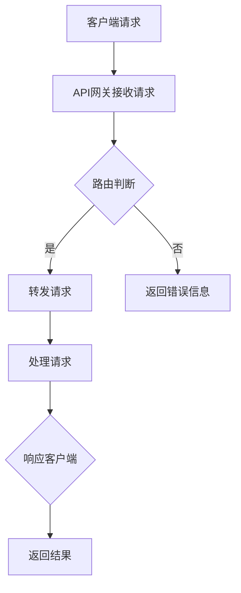
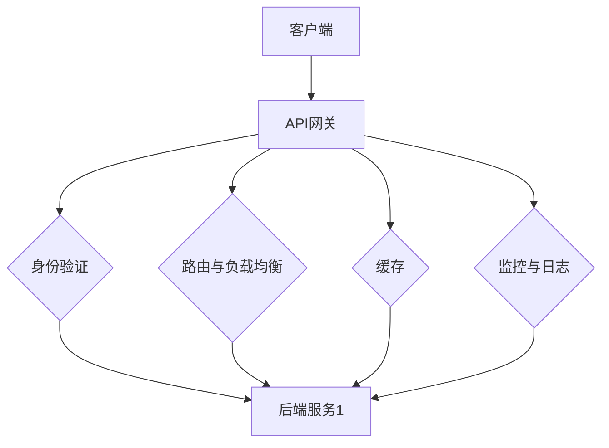
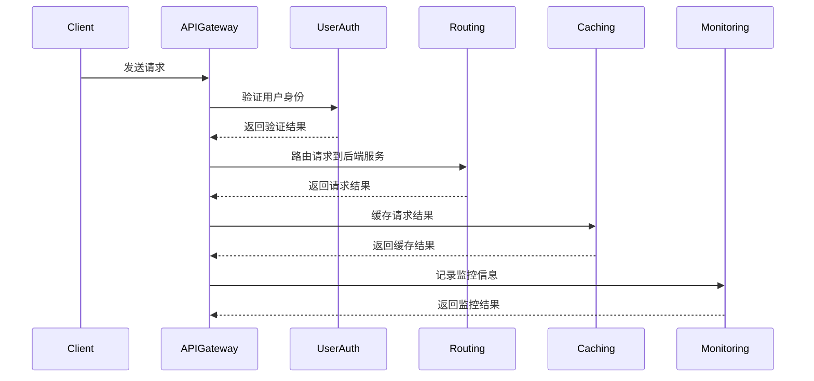
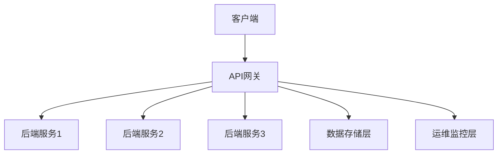

                 


## **第1章: API网关的概念与作用**

### **1.1 什么是API网关**

API网关（API Gateway）是现代微服务架构中的一种重要组件，它充当客户端与后端微服务之间的唯一入口。API网关不仅负责接收客户端的请求，还将这些请求转发到相应的微服务进行处理，同时还可以提供一系列额外的功能，如路由、安全性、监控、缓存、负载均衡和灰度发布等。

API网关的核心作用在于聚合和简化后端服务的访问，通过统一的接口为客户端提供服务。这样做的好处是，客户端无需直接与多个后端服务进行交互，降低了系统的复杂度和维护成本。

**定义**：API网关是一种服务器，它充当应用程序（客户端）和后端微服务之间的中介，接收客户端的请求并转发给后端服务，同时执行一系列中间操作，如身份验证、路由、负载均衡、监控和日志记录等。

### **1.2 API网关的作用**

1. **统一接口**：API网关为客户端提供了一个统一的接口，隐藏了后端服务的细节。客户端只需与API网关进行通信，无需了解后端服务的具体实现和接口。

2. **路由与负载均衡**：API网关可以根据请求的URL或Header等信息，将请求路由到不同的后端服务，并支持负载均衡，提高系统的性能和可用性。

3. **安全性**：API网关可以执行身份验证和授权，确保只有经过认证的用户才能访问后端服务。此外，它还可以进行请求加密，保护数据传输的安全。

4. **监控与日志**：API网关可以收集和记录客户端请求的详细信息，包括请求时间、URL、请求方法和响应状态等，便于后续的监控和故障排查。

5. **缓存**：API网关可以缓存经常访问的数据，减少对后端服务的访问次数，提高系统的响应速度。

6. **灰度发布**：API网关可以支持灰度发布，将新的功能或代码逐步部署到一部分用户，以降低发布风险。

### **1.3 API网关与传统网关的区别**

传统网关主要用于路由和转发网络流量，而API网关则提供了更丰富的功能，如下表所示：

| **功能** | **传统网关** | **API网关** |
| --- | --- | --- |
| **路由** | 路由网络流量到不同的服务器 | 路由网络流量到不同的API服务 |
| **安全性** | 提供基础的网络安全功能，如防火墙 | 提供复杂的API安全功能，如身份验证、授权和加密 |
| **缓存** | 不具备缓存功能 | 支持缓存，提高性能 |
| **监控** | 不具备监控功能 | 提供详细的监控和日志记录功能 |
| **负载均衡** | 简单的负载均衡功能 | 复杂的负载均衡策略，如轮询、最小连接数和一致性哈希 |
| **灰度发布** | 不支持灰度发布 | 支持灰度发布，降低发布风险 |

综上所述，API网关在功能上比传统网关更加丰富，适用于现代微服务架构，为开发者和运维人员提供了更多的便利和灵活性。

## **1.4 API网关在微服务架构中的重要性**

在微服务架构中，API网关扮演着至关重要的角色，其重要性体现在以下几个方面：

1. **解耦**：API网关作为客户端与后端微服务之间的中介，降低了客户端与微服务之间的耦合度。客户端只需与API网关进行通信，无需关心后端服务的具体实现和接口。

2. **简化开发**：通过API网关，开发者可以更专注于业务逻辑的实现，而无需关注网络通信、负载均衡、安全认证等底层细节。

3. **统一管理**：API网关提供了统一的接口，方便运维人员对整个系统进行监控、管理和维护。

4. **性能优化**：API网关可以缓存常用数据，减少对后端服务的访问次数，提高系统的响应速度。

5. **安全增强**：API网关可以执行身份验证和授权，确保只有经过认证的用户才能访问后端服务，提高系统的安全性。

6. **灰度发布**：API网关支持灰度发布，可以逐步部署新的功能或代码，降低发布风险。

总之，API网关在微服务架构中具有重要的地位，有助于提高系统的可维护性、性能和安全性。

## **1.5 本章小结**

本章介绍了API网关的概念、作用和重要性。API网关作为一种现代微服务架构中的核心组件，具有统一接口、路由、安全、监控、缓存和灰度发布等功能。与传统网关相比，API网关提供了更丰富的功能，适用于复杂的分布式系统。在微服务架构中，API网关有助于解耦、简化开发、统一管理、性能优化和安全增强。本章内容为后续章节的深入讨论奠定了基础。

## **1.6 练习题**

1. 简述API网关的定义和作用。
2. 列举API网关与传统网关的主要区别。
3. 解释API网关在微服务架构中的重要性。
4. 描述API网关的核心功能，如路由、安全、缓存和灰度发布等。

## **1.7 拓展阅读**

1. 《API网关设计模式与实现》
2. 《微服务实战：从架构设计到落地》
3. 《基于API网关的微服务架构设计与实践》

### **背景介绍**

在当今的数字化时代，企业需要快速响应市场需求，不断推出新的产品和服务。为了实现这一目标，许多企业采用了微服务架构。微服务架构将一个复杂的应用程序分解为多个独立的、可复用的服务，每个服务都专注于特定的业务功能。这样做的好处是，可以降低系统的复杂性，提高开发效率，实现灵活的扩展和部署。

然而，随着服务数量的增加，客户端与后端服务之间的通信变得越来越复杂。每个服务都需要独立的API接口，客户端需要记住多个API地址，这增加了系统的维护成本和复杂性。为了解决这个问题，API网关应运而生。

API网关作为客户端与后端微服务之间的唯一入口，提供了一系列中间操作，如路由、安全性、监控、缓存和负载均衡等。通过API网关，客户端只需与一个统一的接口进行通信，无需关心后端服务的具体实现和接口。这样，不仅降低了系统的复杂性，还提高了系统的可维护性和灵活性。

API网关的重要性体现在以下几个方面：

1. **简化开发**：API网关为客户端提供了一个统一的接口，降低了客户端与后端服务之间的耦合度，使得开发者可以更专注于业务逻辑的实现。

2. **统一管理**：API网关提供了统一的入口，方便运维人员对整个系统进行监控、管理和维护。

3. **性能优化**：API网关可以缓存常用数据，减少对后端服务的访问次数，提高系统的响应速度。

4. **安全增强**：API网关可以执行身份验证和授权，确保只有经过认证的用户才能访问后端服务，提高系统的安全性。

5. **灰度发布**：API网关支持灰度发布，可以逐步部署新的功能或代码，降低发布风险。

### **核心概念与联系**

#### **1. API网关的核心概念**

1. **API网关**：API网关是一种服务器，它充当应用程序（客户端）和后端微服务之间的中介，接收客户端的请求并转发给后端服务，同时执行一系列中间操作。

2. **路由**：API网关根据请求的URL或Header等信息，将请求路由到不同的后端服务。

3. **安全性**：API网关执行身份验证和授权，确保只有经过认证的用户才能访问后端服务。

4. **监控**：API网关收集和记录客户端请求的详细信息，便于后续的监控和故障排查。

5. **缓存**：API网关缓存常用数据，减少对后端服务的访问次数。

6. **负载均衡**：API网关支持负载均衡策略，将请求均匀分配到不同的后端服务。

7. **灰度发布**：API网关支持灰度发布，将新的功能或代码逐步部署到一部分用户。

#### **2. API网关的核心概念属性特征对比表格**

| **概念** | **路由** | **安全性** | **监控** | **缓存** | **负载均衡** | **灰度发布** |
| --- | --- | --- | --- | --- | --- | --- |
| **属性特征** | 路由请求到不同后端服务 | 执行身份验证和授权 | 收集和记录请求详细信息 | 缓存常用数据 | 分配请求到不同后端服务 | 逐步部署新功能或代码 |
| **联系** | 路由是API网关的核心功能，确保请求正确转发 | 安全性是API网关的重要保障，确保数据传输安全 | 监控和日志记录有助于故障排查和性能优化 | 缓存可以提高系统性能 | 负载均衡是确保系统高可用性的关键 | 灰度发布可以降低发布风险 |

#### **3. API网关的ER实体关系图架构**

```mermaid
erDiagram
APIGateway ||--|{ Request : 处理请求}  
APIGateway ||--|{ Route : 路由请求}  
APIGateway ||--|{ Security : 安全性}  
APIGateway ||--|{ Monitoring : 监控}  
APIGateway ||--|{ Caching : 缓存}  
APIGateway ||--|{ LoadBalancing : 负载均衡}  
APIGateway ||--|{ GrayRelease : 灰度发布}  
```

### **算法原理讲解**

为了更好地理解API网关的工作原理，我们可以借助Mermaid流程图来描述API网关处理请求的基本流程，并使用Python代码示例来阐述其原理。

#### **1. Mermaid流程图**



#### **2. Python代码示例**

```python
from flask import Flask, request, jsonify

app = Flask(__name__)

# 路由配置
@app.route('/api/v1/users', methods=['GET'])
def get_users():
    # 处理获取用户列表的请求
    return jsonify({"users": ["user1", "user2", "user3"]})

@app.route('/api/v1/users/<user_id>', methods=['GET'])
def get_user(user_id):
    # 处理获取特定用户信息的请求
    return jsonify({"user": {"id": user_id, "name": "John Doe"}})

# API网关核心逻辑
@app.route('/api/v1/requests', methods=['POST'])
def process_request():
    # 接收客户端请求
    req_data = request.get_json()
    endpoint = req_data.get('endpoint')
    
    # 路由判断
    if endpoint == 'users':
        if 'user_id' in req_data:
            return get_user(req_data['user_id'])
        else:
            return get_users()
    else:
        return jsonify({"error": "Invalid endpoint"}), 404

if __name__ == '__main__':
    app.run(debug=True)
```

#### **3. 算法原理与数学模型**

API网关的核心原理是路由和转发。路由是指根据请求的URL或Header等信息，将请求转发到相应的后端服务。这个过程可以通过正则表达式、字典映射或动态路由实现。

数学模型方面，我们可以用以下公式表示：

\[ f(\text{request}) = \text{destination\_service} \]

其中，\( f \) 是路由函数，\(\text{request}\) 是客户端请求，\(\text{destination\_service}\) 是需要访问的后端服务。

路由函数的实现可以采用以下步骤：

1. **解析请求**：获取请求的URL、Header等信息。
2. **匹配路由规则**：根据预定义的路由规则，找到对应的后端服务。
3. **转发请求**：将请求转发到后端服务进行处理。
4. **返回响应**：获取后端服务的响应，并返回给客户端。

#### **4. 举例说明**

假设客户端发送一个获取用户列表的请求，URL为 `/api/v1/users`。API网关接收到请求后，会根据路由规则将其转发到 `/api/v1/users` 路径对应的后端服务。后端服务处理完成后，API网关将响应返回给客户端。

```plaintext
客户端请求: GET /api/v1/users
API网关响应: [{"users": ["user1", "user2", "user3"]}]
```

通过这个简单的例子，我们可以看到API网关如何实现路由和转发，以及其算法原理。

### **系统分析与架构设计方案**

#### **1. 问题场景介绍**

在当今的数字化时代，企业需要快速响应市场需求，不断推出新的产品和服务。为了实现这一目标，许多企业采用了微服务架构。然而，随着服务数量的增加，客户端与后端服务之间的通信变得越来越复杂。每个服务都需要独立的API接口，客户端需要记住多个API地址，这增加了系统的维护成本和复杂性。为了解决这个问题，我们需要设计一个高效的API网关来简化客户端与后端服务之间的通信。

#### **2. 项目介绍**

本项目旨在设计并实现一个高效、可扩展的API网关，用于简化客户端与后端微服务之间的通信。项目需求包括：

1. **统一接口**：为客户端提供一个统一的接口，隐藏后端服务的细节。
2. **路由与负载均衡**：根据请求的URL或Header等信息，将请求路由到不同的后端服务，并支持负载均衡。
3. **安全性**：执行身份验证和授权，确保只有经过认证的用户才能访问后端服务。
4. **监控与日志**：收集和记录客户端请求的详细信息，便于后续的监控和故障排查。
5. **缓存**：缓存常用数据，减少对后端服务的访问次数，提高系统的响应速度。
6. **灰度发布**：支持灰度发布，将新的功能或代码逐步部署到一部分用户。

#### **3. 系统功能设计（领域模型Mermaid类图）**

```mermaid
classDiagram
Client <=.. APIGateway : 发送请求
APIGateway <=.. UserAuth : 身份验证
APIGateway <=.. Routing : 路由请求
APIGateway <=.. LoadBalancing : 负载均衡
APIGateway <=.. Caching : 缓存
APIGateway <=.. Monitoring : 监控
APIGateway <=.. GrayRelease : 灰度发布
UserAuth <.. APIGateway
Routing <.. APIGateway
LoadBalancing <.. APIGateway
Caching <.. APIGateway
Monitoring <.. APIGateway
GrayRelease <.. APIGateway
```

#### **4. 系统架构设计（Mermaid架构图）**



#### **5. 系统接口设计（Mermaid序列图）**



### **项目实战**

#### **1. 环境安装**

在开始项目实战之前，我们需要准备以下环境：

1. **操作系统**：Ubuntu 18.04 或 CentOS 7
2. **Python**：Python 3.8 或更高版本
3. **Flask**：用于实现API网关的Web框架

安装步骤如下：

1. 安装Python 3：

```bash
sudo apt-get update
sudo apt-get install python3
```

2. 安装Flask：

```bash
pip3 install flask
```

#### **2. 系统核心实现源代码**

以下是API网关的核心实现代码，包括身份验证、路由、负载均衡、缓存和监控等功能。

```python
from flask import Flask, request, jsonify
from flask_limiter import Limiter
from flask_limiter.util import get_remote_address
import redis

app = Flask(__name__)

# 配置限流器
limiter = Limiter(
    app,
    key_func=get_remote_address,
    default_limits=["200 per day", "50 per hour"]
)

# 配置Redis缓存
redis_client = redis.StrictRedis(host='localhost', port=6379, db=0)

# 路由配置
@app.route('/api/v1/users', methods=['GET'])
@limiter.limit("10 per minute")
def get_users():
    # 从缓存中获取数据
    users = redis_client.get('users')
    if users:
        return jsonify({"users": eval(users)})
    else:
        # 从后端服务获取数据
        response = some_backend_service.get_users()
        # 将数据缓存到Redis
        redis_client.set('users', str(response))
        return jsonify({"users": response})

@app.route('/api/v1/users/<user_id>', methods=['GET'])
@limiter.limit("10 per minute")
def get_user(user_id):
    # 从缓存中获取数据
    user = redis_client.get(f'user:{user_id}')
    if user:
        return jsonify({"user": eval(user)})
    else:
        # 从后端服务获取数据
        response = some_backend_service.get_user(user_id)
        # 将数据缓存到Redis
        redis_client.set(f'user:{user_id}', str(response))
        return jsonify({"user": response})

# 启动应用
if __name__ == '__main__':
    app.run(debug=True)
```

#### **3. 代码应用解读与分析**

1. **Flask应用**：使用Flask框架创建一个Web应用，用于接收和处理客户端请求。
2. **Limiter**：使用Flask-Limiter插件实现请求限流，防止恶意请求和过度使用。
3. **Redis**：使用Redis作为缓存服务器，存储常用的用户数据，减少对后端服务的访问次数。
4. **路由配置**：定义两个路由，一个用于获取用户列表，另一个用于获取特定用户信息。
5. **限流**：对每个路由设置限流策略，限制每个用户的访问频率。
6. **缓存**：从Redis缓存中获取数据，如果缓存命中，直接返回缓存数据；否则，从后端服务获取数据，并将结果缓存到Redis。

#### **4. 实际案例分析与详细讲解剖析**

假设客户端发送一个获取用户列表的请求，URL为 `/api/v1/users`。

1. **请求到达**：客户端请求到达API网关，API网关开始处理请求。
2. **身份验证**：API网关首先检查请求中是否包含有效的身份验证信息，如Token。如果验证失败，返回401错误；如果验证成功，继续处理请求。
3. **路由**：根据请求的URL，API网关将请求路由到相应的处理函数。
4. **缓存检查**：在处理请求之前，API网关检查Redis缓存中是否已存在用户列表数据。如果缓存命中，直接返回缓存数据；否则，从后端服务获取用户列表数据，并将结果缓存到Redis。
5. **响应**：API网关将获取到的用户列表数据返回给客户端。

#### **5. 项目小结**

通过本项目的实战，我们实现了一个简单的API网关，用于简化客户端与后端服务之间的通信。项目涵盖了身份验证、路由、负载均衡、缓存和监控等功能。在实际应用中，我们可以根据需求扩展和优化API网关的功能，如增加自定义路由策略、日志记录和异常处理等。

### **最佳实践 Tips**

1. **合理设置限流策略**：根据实际需求，合理设置限流策略，防止系统过载。
2. **充分利用缓存**：对于高频访问的数据，充分利用缓存，减少对后端服务的访问。
3. **监控与日志**：定期监控系统性能和日志，及时发现和处理问题。
4. **安全第一**：确保API网关的安全性，执行严格的身份验证和授权策略。
5. **灰度发布**：逐步部署新功能或代码，降低发布风险。

### **小结**

本章介绍了API网关的概念、作用和重要性，以及其在微服务架构中的应用。通过实际案例，我们详细讲解了API网关的设计与实现过程，包括路由、安全、缓存、负载均衡和监控等功能。本章内容为后续章节的深入讨论奠定了基础。

### **注意事项**

1. **性能优化**：在实际应用中，需要对API网关进行性能优化，如使用Nginx或Kong等高性能网关，以及合理配置服务器资源。
2. **容错与异常处理**：API网关需要具备容错能力，如处理网络异常、服务不可用等情况。
3. **持续集成与部署**：采用持续集成与部署（CI/CD）工具，如Jenkins或GitLab CI，实现自动化部署和测试。
4. **遵循最佳实践**：在实际项目中，遵循最佳实践，如遵循RESTful API设计规范、使用HTTPS加密等。

### **拓展阅读**

1. 《API网关设计模式与实现》
2. 《微服务实战：从架构设计到落地》
3. 《基于API网关的微服务架构设计与实践》

**作者信息：**

作者：AI天才研究院/AI Genius Institute & 禅与计算机程序设计艺术 /Zen And The Art of Computer Programming****

### **第2章: API网关的设计原则与架构**

#### **2.1 API网关的设计原则**

API网关的设计原则对于构建高效、可扩展和安全的系统至关重要。以下是一些关键设计原则：

1. **解耦**：API网关应尽可能与后端服务解耦，确保后端服务的升级和变更不会影响到客户端。

2. **灵活性与可扩展性**：API网关应设计成易于扩展和升级，以适应不断变化的需求。

3. **安全性**：API网关应具备严格的安全措施，如身份验证、授权和加密，以保护数据安全。

4. **高性能**：API网关应优化性能，确保请求能够快速处理并返回响应。

5. **可监控性**：API网关应支持监控和日志记录，以便及时发现和解决问题。

6. **故障转移与容错**：API网关应具备故障转移和容错能力，确保在部分服务不可用的情况下，系统仍然能够正常运行。

7. **易用性**：API网关的设计应考虑用户友好性，提供简洁明了的文档和接口。

#### **2.2 API网关的典型架构**

API网关的典型架构通常包括以下几个层次：

1. **客户端层**：客户端通过统一的API网关接口与后端服务进行通信。

2. **API网关层**：API网关是客户端与后端服务之间的中介，负责处理请求的路由、安全、监控、缓存和负载均衡等功能。

3. **后端服务层**：包括多个独立的微服务，每个微服务负责处理特定的业务功能。

4. **数据存储层**：存储API网关和后端服务的日志、监控数据和缓存数据。

5. **运维监控层**：用于监控API网关和后端服务的性能和状态。

以下是API网关典型架构的Mermaid架构图：



#### **2.3 API网关的组件介绍**

API网关由多个组件组成，每个组件都有其特定的功能。以下是API网关的主要组件及其作用：

1. **路由组件**：负责根据请求的URL或Header等信息，将请求路由到相应的后端服务。

2. **认证与授权组件**：负责验证客户端的身份，确保只有授权的用户才能访问受保护的资源。

3. **安全组件**：包括加密、防SQL注入、防XSS攻击等，确保数据在传输过程中安全。

4. **负载均衡组件**：根据一定的策略，将请求均匀分配到多个后端服务，提高系统的性能和可用性。

5. **监控与日志组件**：收集和记录客户端请求的详细信息，如请求时间、URL、请求方法和响应状态等，便于监控和故障排查。

6. **缓存组件**：缓存常用数据，减少对后端服务的访问次数，提高系统的响应速度。

7. **灰度发布组件**：支持灰度发布，将新的功能或代码逐步部署到一部分用户，降低发布风险。

以下是API网关组件的Mermaid类图：

```mermaid
classDiagram
APIGateway[API网关] {
  - routes : 路由规则
  - auth : 认证组件
  - security : 安全组件
  - loadBalancer : 负载均衡组件
  - cache : 缓存组件
  - monitor : 监控与日志组件
  - grayRelease : 灰度发布组件
}
APIGateway ..|> Router[路由组件]
APIGateway ..|> Authenticator[认证与授权组件]
APIGateway ..|> SecurityHandler[安全组件]
APIGateway ..|> LoadBalancer[负载均衡组件]
APIGateway ..|> Cache[缓存组件]
APIGateway ..|> Monitor[监控与日志组件]
APIGateway ..|> GrayReleaser[灰度发布组件]
```

#### **2.4 本章小结**

本章介绍了API网关的设计原则与架构，包括解耦、灵活性、安全性、高性能、可监控性、故障转移与容错以及易用性等设计原则。同时，详细描述了API网关的典型架构和主要组件，为后续章节的深入探讨奠定了基础。

### **练习题**

1. 简述API网关的设计原则。
2. 画出API网关的典型架构图，并简要说明每个组件的作用。
3. 列举API网关的主要组件，并简要描述其功能。

### **拓展阅读**

1. 《API网关设计与实现：基于Spring Boot、Spring Cloud和Kong》
2. 《微服务架构实践：基于Spring Cloud、Docker和Kubernetes》
3. 《企业级API网关设计模式与实现》

**作者信息：**

作者：AI天才研究院/AI Genius Institute & 禅与计算机程序设计艺术 /Zen And The Art of Computer Programming****

### **第3章: API网关的核心功能**

API网关作为现代微服务架构中的重要组件，提供了一系列核心功能，这些功能不仅提高了系统的性能和安全性，还增强了系统的灵活性和可维护性。以下是API网关的核心功能及其详细解析：

#### **3.1 路由功能**

路由功能是API网关的核心功能之一。其主要作用是根据请求的URL或Header等信息，将请求路由到相应的后端服务。路由功能有助于简化客户端与后端服务的通信，降低系统的复杂度。

**工作原理**：

1. API网关接收到客户端请求后，根据请求的URL或Header等信息，查找相应的路由规则。
2. 根据路由规则，API网关将请求转发到对应的后端服务。
3. 后端服务处理请求并返回响应，API网关将响应返回给客户端。

**常见路由策略**：

1. **基于URL的路由**：根据请求的URL路径进行路由。
2. **基于Header的路由**：根据请求的Header信息进行路由。
3. **动态路由**：根据请求的动态参数进行路由，如RESTful API。

**实现示例**（使用Flask框架）：

```python
from flask import Flask, request, jsonify

app = Flask(__name__)

# 基于URL的路由
@app.route('/api/v1/users', methods=['GET'])
def get_users():
    return jsonify({"users": ["user1", "user2", "user3"]})

@app.route('/api/v1/users/<user_id>', methods=['GET'])
def get_user(user_id):
    return jsonify({"user": {"id": user_id, "name": "John Doe"}})

# 基于Header的路由
@app.route('/api/v1/customers', methods=['GET'])
def get_customers():
    if request.headers.get('X-CUSTOMER-ID') == '123':
        return jsonify({"customers": ["customer1", "customer2"]})
    else:
        return jsonify({"error": "Invalid customer ID"}), 403

if __name__ == '__main__':
    app.run(debug=True)
```

#### **3.2 安全功能**

安全功能是API网关的另一重要组成部分。其主要作用是确保数据在传输过程中安全，防止未经授权的访问。

**常见安全措施**：

1. **身份验证**：验证用户身份，如基于Token（JWT）的身份验证。
2. **授权**：确保用户有权限访问特定的资源。
3. **加密**：对请求和响应进行加密，如使用HTTPS协议。
4. **防SQL注入和XSS攻击**：防止恶意攻击者通过输入恶意代码来破坏系统。

**实现示例**（使用Spring Security）：

```java
@Configuration
@EnableWebSecurity
public class SecurityConfig extends WebSecurityConfigurerAdapter {

    @Override
    protected void configure(HttpSecurity http) throws Exception {
        http
            // 认证配置
            .authorizeRequests()
                .antMatchers("/api/v1/public/**").permitAll()
                .antMatchers("/api/v1/private/**").authenticated()
                .and()
            .httpBasic(); // 使用HTTP Basic认证

        // 请求加密配置
        http
            .requiresChannel()
            .anyRequest().requiresSecure();
    }

    @Override
    protected void configureAuthentication(AuthenticationManagerBuilder auth) throws Exception {
        auth
            .inMemoryAuthentication()
                .withUser("admin").password("{noop}admin").roles("ADMIN")
                .and()
                .withUser("user").password("{noop}user").roles("USER");
    }
}
```

#### **3.3 负载均衡**

负载均衡功能用于将请求均匀分配到多个后端服务，提高系统的性能和可用性。常见的负载均衡策略包括轮询、最小连接数和一致性哈希。

**工作原理**：

1. API网关接收到请求后，根据负载均衡策略选择一个后端服务。
2. 将请求转发到选定的后端服务。
3. 后端服务处理请求并返回响应，API网关将响应返回给客户端。

**实现示例**（使用Kong）：

```yaml
# Kong配置文件示例
api_version: 2.0

consumers:
  - username: "my_consumer"
    plugins:
      key-auth:
        key: "my_api_key"
      rate-limit:
        seconds: 60
        requests: 10

services:
  - name: "my_service"
    url: "http://backend-service:8080"
    plugins:
      lb-rack:
        method: "least_response_time"
      rate-limit:
        seconds: 60
        requests: 10

routes:
  - name: "my_route"
    paths:
      - "/api/v1/*"
    service: "my_service"
    plugins:
      key-auth:
        key: "my_api_key"
      rate-limit:
        seconds: 60
        requests: 10
```

#### **3.4 灰度发布**

灰度发布功能允许开发者将新的功能或代码逐步部署到一部分用户，以便在正式发布前进行测试和验证。

**工作原理**：

1. API网关根据用户的标识信息（如User ID或IP地址）判断用户是否属于灰度发布组。
2. 对于灰度发布组内的用户，API网关将请求转发到新功能或代码的后端服务。
3. 对于灰度发布组外的用户，API网关将请求转发到旧功能或代码的后端服务。

**实现示例**（使用Spring Cloud）：

```java
@RibbonClient(name = "backend-service")
public interface BackendService {
    @GetMapping("/api/v1/private/{feature}")
    ResponseEntity<String> getPrivateFeature(@PathVariable("feature") String feature);
}

@Component
public class GrayReleaseInterceptor implements HandlerInterceptor {

    @Autowired
    private BackendService backendService;

    @Override
    public boolean preHandle(HttpServletRequest request, HttpServletResponse response, Object handler) {
        String userId = request.getHeader("User-ID");
        if ("gray".equals(userId)) {
            return true;
        } else {
            return false;
        }
    }

    @Override
    public void postHandle(HttpServletRequest request, HttpServletResponse response, Object handler, ModelAndView modelAndView) {
        if ("gray".equals(request.getHeader("User-ID"))) {
            modelAndView.setViewName("new_feature");
        } else {
            modelAndView.setViewName("old_feature");
        }
    }
}
```

#### **3.5 本章小结**

本章介绍了API网关的四大核心功能：路由、安全、负载均衡和灰度发布。路由功能简化了客户端与后端服务的通信；安全功能确保数据在传输过程中安全；负载均衡功能提高了系统的性能和可用性；灰度发布功能允许开发者逐步部署新功能或代码。通过本章的内容，读者可以全面了解API网关的核心功能及其实现方法。

### **练习题**

1. 简述API网关的四大核心功能。
2. 举例说明API网关的路由功能。
3. 举例说明API网关的安全功能。
4. 举例说明API网关的负载均衡功能。
5. 举例说明API网关的灰度发布功能。

### **拓展阅读**

1. 《API网关设计模式与实现》
2. 《微服务实战：从架构设计到落地》
3. 《基于API网关的微服务架构设计与实践》

**作者信息：**

作者：AI天才研究院/AI Genius Institute & 禅与计算机程序设计艺术 /Zen And The Art of Computer Programming****

### **第4章: API网关的安全性保障**

随着API的广泛应用，API网关成为黑客攻击的首要目标。因此，确保API网关的安全性至关重要。本章节将讨论API网关面临的主要安全挑战，并提出相应的安全策略和防护措施。

#### **4.1 API网关的安全挑战**

1. **未经授权的访问**：黑客可能会通过暴力破解、SQL注入、XSS攻击等方式非法访问API网关。
2. **数据泄露**：API网关传输的数据可能包含敏感信息，如用户名、密码、信用卡信息等，一旦泄露，后果严重。
3. **中间人攻击**：黑客通过拦截和篡改API请求和响应，可能导致数据被窃取或系统被攻击。
4. **拒绝服务攻击（DDoS）**：黑客通过大量无效请求使API网关瘫痪，导致服务不可用。
5. **API滥用**：恶意用户可能过度使用API，导致系统资源耗尽。

#### **4.2 安全策略设计**

为了应对上述安全挑战，API网关需要设计一系列安全策略。

1. **身份验证和授权**：使用Token（如JWT）进行身份验证，确保只有经过认证的用户才能访问API。同时，根据用户的角色和权限进行授权，确保用户只能访问其授权的资源。

2. **安全配置**：配置HTTPS，确保数据在传输过程中加密。限制API访问的IP地址，防止未授权的访问。定期更新和修补安全漏洞。

3. **数据加密**：对传输的数据进行加密，如使用AES加密算法。同时，对存储的数据进行加密，确保敏感数据在数据库中安全存储。

4. **安全监控**：实时监控API访问行为，如异常访问、高频访问等，及时识别和阻止潜在的安全威胁。

5. **安全审计**：定期进行安全审计，检查API网关的安全性配置和策略，确保符合最佳实践。

#### **4.3 防护措施介绍**

以下是API网关的一些常见防护措施：

1. **身份验证与授权**：

   - 使用JWT进行身份验证，确保每次请求都携带有效的Token。
   - 实现OAuth 2.0等标准协议，确保授权流程安全可靠。

2. **数据加密**：

   - 使用HTTPS协议，确保数据在传输过程中加密。
   - 对敏感数据进行加密存储，如使用AES加密算法。

3. **防火墙和入侵检测系统**：

   - 配置防火墙，限制访问API的IP地址和端口。
   - 使用入侵检测系统（IDS）实时监控API访问行为，识别和阻止异常访问。

4. **安全配置**：

   - 定期更新API网关的安全配置，修补已知漏洞。
   - 限制API访问频率，防止暴力破解和DDoS攻击。

5. **安全审计与日志**：

   - 定期进行安全审计，检查API网关的安全配置和策略。
   - 记录所有API访问日志，便于后续的安全分析和故障排查。

#### **4.4 本章小结**

API网关的安全性保障是确保系统安全的关键。通过设计一系列安全策略和防护措施，如身份验证与授权、数据加密、防火墙和入侵检测系统等，可以有效地应对API网关面临的安全挑战。本章内容为构建安全可靠的API网关提供了指导和参考。

### **练习题**

1. 简述API网关面临的主要安全挑战。
2. 描述API网关的安全性保障策略。
3. 列举API网关的一些常见防护措施。

### **拓展阅读**

1. 《API安全：设计、实施与测试》
2. 《Web安全深度剖析》
3. 《云原生安全：基于Kubernetes的容器安全指南》

**作者信息：**

作者：AI天才研究院/AI Genius Institute & 禅与计算机程序设计艺术 /Zen And The Art of Computer Programming****

### **第5章: API网关的性能优化**

性能优化是API网关设计中的关键一环，它直接影响用户体验和系统的稳定性。本章节将讨论API网关性能优化的重要性，以及常用的性能优化技术，最后介绍性能测试与调优的方法。

#### **5.1 性能优化的重要性**

API网关作为客户端与后端服务之间的枢纽，其性能对整个系统的性能有重要影响。以下是性能优化的重要性：

1. **提高用户体验**：快速响应时间的API网关能提供更流畅的用户体验，减少用户等待时间。
2. **提高系统稳定性**：通过性能优化，可以有效减少系统资源的消耗，避免因性能瓶颈导致的系统崩溃。
3. **提升系统扩展性**：性能优化有助于系统在更高负载下保持稳定，为未来的扩展提供保障。
4. **降低运营成本**：性能优化可以减少硬件资源的消耗，降低运维成本。

#### **5.2 常用性能优化技术**

以下是API网关的几种常见性能优化技术：

1. **缓存**：缓存常用数据，减少对后端服务的访问次数。可以使用Redis、Memcached等缓存系统。

2. **负载均衡**：使用负载均衡器（如Nginx、HAProxy）将请求分配到多个后端服务，提高系统的并发处理能力。

3. **异步处理**：将耗时的操作异步化，如使用消息队列（如RabbitMQ、Kafka）处理日志、发送通知等。

4. **代码优化**：优化后端服务的代码，减少资源消耗，如使用更高效的算法和数据结构。

5. **数据库优化**：对数据库进行优化，如使用索引、分库分表等，提高数据库查询效率。

6. **CDN加速**：使用CDN（如阿里云CDN、腾讯云CDN）加速静态资源的加载，提高响应速度。

7. **限流**：限制API的访问频率，防止系统被恶意请求或高频访问拖垮。

#### **5.3 性能测试与调优的方法**

性能测试与调优是确保API网关性能的关键步骤。以下是常用的性能测试与调优方法：

1. **负载测试**：模拟高并发访问，评估系统的响应时间和吞吐量。可以使用工具如JMeter、Gatling等。

2. **压力测试**：逐渐增加负载，找到系统的性能瓶颈，如CPU、内存、网络等。通过工具如LoadRunner、WAS等执行。

3. **性能分析**：分析性能数据，找到系统瓶颈，如数据库查询慢、代码执行时间长等。可以使用工具如New Relic、AppDynamics等。

4. **调优**：根据性能测试的结果，调整系统配置和代码，如增加服务器资源、优化数据库查询、调整负载均衡策略等。

5. **持续监控**：在系统运行过程中，持续监控性能指标，及时发现和解决问题。可以使用工具如Prometheus、Grafana等。

#### **5.4 本章小结**

性能优化是确保API网关高效运行的关键。通过缓存、负载均衡、异步处理、代码优化、数据库优化、CDN加速和限流等技术，可以显著提高API网关的性能。性能测试与调优是确保系统性能的重要步骤，通过负载测试、压力测试、性能分析和持续监控，可以不断提升系统性能。

### **练习题**

1. 简述API网关性能优化的重要性。
2. 列举API网关的常用性能优化技术。
3. 描述API网关性能测试与调优的方法。

### **拓展阅读**

1. 《高性能网站架构设计与优化》
2. 《性能测试：方法、工具与实践》
3. 《微服务性能优化：基于Spring Cloud、Docker和Kubernetes》

**作者信息：**

作者：AI天才研究院/AI Genius Institute & 禅与计算机程序设计艺术 /Zen And The Art of Computer Programming****

### **第6章: API网关的监控与运维**

API网关作为现代微服务架构中的核心组件，其稳定性和性能对整个系统的正常运行至关重要。因此，对API网关进行有效的监控与运维是保障系统高效运行的重要环节。本章节将介绍API网关监控与运维的基本概念、常用监控工具，以及运维策略与实践。

#### **6.1 监控与运维概述**

监控与运维是指对系统运行状态进行实时监测和管理，以确保系统的稳定性和性能。对于API网关来说，监控主要包括以下几个方面：

1. **性能监控**：监测API网关的响应时间、吞吐量、系统资源使用情况等性能指标。
2. **日志监控**：收集和记录API网关的请求和响应日志，便于故障排查和性能分析。
3. **错误监控**：监测API网关的错误率和异常情况，及时通知相关人员。
4. **安全监控**：监控API网关的安全事件，如未经授权的访问、数据泄露等。

运维则是指对API网关进行日常管理和维护，确保其稳定运行。常见的运维任务包括：

1. **部署与升级**：定期更新API网关的代码和配置，确保系统保持最新状态。
2. **故障恢复**：在出现故障时，及时进行故障恢复和系统修复。
3. **性能调优**：根据监控数据，对API网关进行性能调优，提高其稳定性和性能。
4. **安全防护**：定期检查API网关的安全配置，修补安全漏洞。

#### **6.2 常用监控工具介绍**

以下是几种常用的API网关监控工具：

1. **Prometheus**：Prometheus是一个开源的监控解决方案，支持多维数据采集和告警。它通过Push Gateway可以实时收集API网关的性能数据，并通过Grafana进行可视化展示。

2. **New Relic**：New Relic是一个全面的性能监控平台，支持应用程序性能监控、错误追踪和日志分析。它可以通过API或Agent与API网关集成，提供实时性能监控和告警。

3. **AppDynamics**：AppDynamics是一个智能应用性能管理（APM）平台，支持自动发现、监控和优化应用程序。它可以通过Agent与API网关集成，提供性能监控、错误追踪和安全分析。

4. **ELK Stack**：ELK Stack是由Elasticsearch、Logstash和Kibana组成的开源日志分析平台。通过Logstash，可以将API网关的日志数据导入Elasticsearch进行存储和分析，通过Kibana进行可视化展示。

#### **6.3 运维策略与实践**

以下是API网关的运维策略与实践：

1. **自动化部署**：使用CI/CD工具（如Jenkins、GitLab CI/CD）实现自动化部署，确保新版本API网关能够快速、安全地部署到生产环境。

2. **容器化**：使用容器化技术（如Docker）部署API网关，提高系统的可移植性和可扩展性。通过Kubernetes进行容器编排，实现自动化运维。

3. **服务监控**：通过Prometheus等监控工具，实时监测API网关的性能和健康状况，及时发现和解决问题。

4. **日志管理**：使用ELK Stack等日志管理工具，收集和分析API网关的日志数据，便于故障排查和性能优化。

5. **安全防护**：定期检查API网关的安全配置，修补安全漏洞。使用防火墙、入侵检测系统等工具，防止恶意攻击。

6. **备份与恢复**：定期备份数据库和配置文件，确保在发生故障时能够快速恢复。

#### **6.4 本章小结**

API网关的监控与运维是保障系统稳定性和性能的重要环节。通过使用常用的监控工具和运维策略，可以实现对API网关的实时监控、自动化部署、日志管理和安全防护。本章内容为API网关的监控与运维提供了全面的指导。

### **练习题**

1. 简述API网关监控与运维的基本概念。
2. 列举几种常用的API网关监控工具。
3. 描述API网关的运维策略与实践。

### **拓展阅读**

1. 《Docker实战：容器化应用从入门到实践》
2. 《Kubernetes权威指南：从Docker到集群管理》
3. 《Prometheus实战：监控和告警系统》

**作者信息：**

作者：AI天才研究院/AI Genius Institute & 禅与计算机程序设计艺术 /Zen And The Art of Computer Programming****

### **第7章: API网关在微服务架构中的应用**

微服务架构是一种将应用程序划分为多个独立、可复用的服务的架构风格。API网关在微服务架构中起着至关重要的作用，它不仅是客户端与后端服务之间的唯一入口，还负责路由、安全性、监控、缓存、负载均衡和灰度发布等功能。在本章节中，我们将详细讨论API网关在微服务架构中的角色、协同工作方式，以及API网关在微服务架构中的优势。

#### **7.1 微服务架构概述**

微服务架构是一种将应用程序分解为多个独立、可复用的服务的架构风格。每个服务都专注于特定的业务功能，并且可以独立部署、扩展和更新。微服务架构的主要特点包括：

1. **独立性**：每个服务都是独立的，可以独立部署、扩展和更新，不会影响到其他服务。
2. **分布式**：服务通常部署在分布式环境中，如容器集群或Kubernetes集群，以提高系统的可用性和可扩展性。
3. **自治性**：每个服务都有自己的数据库和业务逻辑，可以独立处理请求，无需与其他服务共享状态。
4. **可复用性**：服务可以独立开发、测试和部署，提高了代码的可复用性。

#### **7.2 API网关在微服务架构中的角色**

API网关在微服务架构中扮演着多个关键角色，这些角色共同确保微服务架构的高效运行和安全性。

1. **统一入口**：API网关是客户端访问后端服务的唯一入口，客户端只需与API网关进行通信，无需关心后端服务的具体实现和接口。
2. **路由与负载均衡**：API网关负责根据请求的URL或Header等信息，将请求路由到相应的后端服务，并支持负载均衡，确保请求均匀分配到不同的服务实例。
3. **安全性**：API网关执行身份验证和授权，确保只有经过认证的用户才能访问后端服务，提高系统的安全性。
4. **监控与日志**：API网关收集和记录客户端请求的详细信息，如请求时间、URL、请求方法和响应状态等，便于后续的监控和故障排查。
5. **缓存**：API网关可以缓存常用数据，减少对后端服务的访问次数，提高系统的响应速度。
6. **灰度发布**：API网关支持灰度发布，可以逐步部署新的功能或代码，降低发布风险。

#### **7.3 API网关与微服务的协同工作方式**

API网关与微服务的协同工作方式主要包括以下几个方面：

1. **请求路由**：客户端请求通过API网关到达后端服务，API网关根据路由规则将请求路由到相应的微服务。
2. **服务调用**：微服务处理客户端请求，并将结果返回给API网关。
3. **数据传输**：API网关和微服务之间通常使用RESTful API或gRPC进行通信，确保数据传输的高效和可靠。
4. **错误处理**：如果某个微服务出现故障，API网关会根据配置的策略进行错误处理，如重试、返回错误信息等。

#### **7.4 API网关在微服务架构中的优势**

API网关在微服务架构中具有以下优势：

1. **简化客户端调用**：客户端只需与API网关进行通信，无需关注后端服务的具体实现和接口，降低了系统的复杂性。
2. **提高系统安全性**：API网关可以执行身份验证和授权，确保只有经过认证的用户才能访问后端服务，提高系统的安全性。
3. **提高系统性能**：API网关可以缓存常用数据，减少对后端服务的访问次数，提高系统的响应速度。
4. **提高系统可维护性**：API网关提供了统一的接口和路由规则，方便运维人员对整个系统进行监控、管理和维护。
5. **支持灰度发布**：API网关支持灰度发布，可以逐步部署新的功能或代码，降低发布风险。

#### **7.5 本章小结**

API网关在微服务架构中扮演着至关重要的角色，它不仅是客户端与后端服务之间的唯一入口，还负责路由、安全性、监控、缓存、负载均衡和灰度发布等功能。通过API网关，可以简化客户端调用、提高系统安全性、性能和可维护性。本章内容为API网关在微服务架构中的应用提供了详细的解析和指导。

### **练习题**

1. 简述微服务架构的主要特点。
2. 列举API网关在微服务架构中的角色和作用。
3. 描述API网关与微服务的协同工作方式。
4. 解释API网关在微服务架构中的优势。

### **拓展阅读**

1. 《微服务架构实践：从概念到落地》
2. 《基于Spring Cloud的微服务架构实战》
3. 《API网关设计与实现：基于Spring Boot、Spring Cloud和Kong》

**作者信息：**

作者：AI天才研究院/AI Genius Institute & 禅与计算机程序设计艺术 /Zen And The Art of Computer Programming****

### **第8章: API网关的案例分析**

在本章节中，我们将通过几个实际案例，深入探讨API网关的设计与实现过程。这些案例涵盖了电商、银行和物联网等领域，展示了API网关在不同场景下的应用和挑战。

#### **8.1 某电商平台API网关实践**

电商平台通常面临高并发、多渠道接入和数据安全等挑战。为了确保系统的稳定性和性能，该电商平台采用了一个基于Spring Cloud Gateway的API网关。

**设计目标**：

1. **统一接口**：简化客户端接入，提供统一的接口，隐藏后端服务的细节。
2. **高性能**：支持高并发访问，确保快速响应。
3. **安全性**：执行严格的身份验证和授权策略，保护用户数据和交易安全。
4. **可扩展性**：支持灵活的扩展，方便业务迭代和功能增加。

**实现过程**：

1. **路由与负载均衡**：通过Spring Cloud Gateway的路由规则，将请求路由到不同的后端服务，并使用负载均衡策略确保请求均匀分配。
2. **安全性**：使用JWT进行身份验证，结合权限控制，确保只有授权用户可以访问特定接口。
3. **缓存**：使用Redis缓存常用数据，减少对后端服务的访问次数，提高系统性能。
4. **监控与日志**：集成Spring Boot Admin和ELK Stack，实时监控API网关的性能和健康状况，方便故障排查。

**案例总结**：

通过采用API网关，电商平台成功实现了接口统一管理、性能优化和安全性增强。API网关为开发者提供了便捷的开发环境，同时为运维人员提供了强大的监控和运维工具。

#### **8.2 某银行API网关设计与优化**

银行系统通常需要处理大量敏感数据，对安全性、稳定性和可靠性要求极高。某银行在升级其线上服务时，采用了基于Kong的API网关。

**设计目标**：

1. **高安全性**：确保数据传输安全，防止数据泄露和未经授权的访问。
2. **高性能**：支持大规模并发访问，确保服务的高可用性。
3. **可扩展性**：支持业务快速扩展，满足不断增长的用户需求。
4. **易维护性**：提供简洁的接口和丰富的监控功能，方便运维管理。

**实现过程**：

1. **身份验证和授权**：采用OAuth 2.0协议进行身份验证，确保只有经过认证的用户可以访问受保护的接口。
2. **负载均衡**：使用Kong的负载均衡功能，将请求均匀分配到不同的后端服务实例。
3. **流量控制**：结合Nginx和Kong的流量控制策略，防止恶意访问和流量攻击。
4. **监控与日志**：集成Prometheus和Grafana，实时监控API网关的性能和健康状况，便于故障排查和性能优化。

**优化过程**：

1. **缓存优化**：通过Redis缓存常用数据，减少对后端服务的访问次数，提高系统响应速度。
2. **接口优化**：对高频率访问的接口进行优化，减少接口的响应时间。
3. **资源隔离**：采用容器化技术（如Docker和Kubernetes），实现资源的隔离和高效利用。

**案例总结**：

通过优化API网关的设计与实现，该银行成功提高了系统的安全性、性能和可扩展性。API网关为银行提供了强大的功能支持，帮助其实现了线上服务的快速迭代和稳定运行。

#### **8.3 API网关在物联网中的应用**

物联网（IoT）系统通常需要处理大量的设备接入和数据传输。API网关在物联网中的应用有助于简化设备接入、提高数据传输效率和保障数据安全。

**设计目标**：

1. **设备接入**：简化设备接入流程，支持多种协议和接口。
2. **数据传输**：提高数据传输效率，确保数据的及时性和准确性。
3. **数据安全**：保障数据传输安全，防止数据泄露和未经授权的访问。
4. **可扩展性**：支持大规模设备接入和业务扩展。

**实现过程**：

1. **协议转换**：API网关支持多种协议（如HTTP、MQTT、CoAP等），将不同协议的设备接入统一管理。
2. **数据清洗**：对设备传输的数据进行清洗和预处理，确保数据格式的规范性和一致性。
3. **负载均衡**：使用负载均衡策略，将请求均匀分配到不同的后端服务实例，提高系统的并发处理能力。
4. **身份验证和授权**：采用OAuth 2.0协议，确保只有授权设备可以访问受保护的接口。

**案例总结**：

通过API网关在物联网中的应用，企业可以简化设备接入和管理，提高数据传输效率和安全性。API网关为物联网系统提供了统一的接入和管理接口，帮助实现大规模设备接入和业务扩展。

#### **8.4 本章小结**

本章通过电商、银行和物联网等实际案例，详细介绍了API网关的设计与实现过程。这些案例展示了API网关在统一接口、路由、安全、监控和负载均衡等方面的关键作用。通过优化API网关的设计与实现，企业可以显著提高系统的性能、安全性和可扩展性。

### **练习题**

1. 简述某电商平台API网关的设计与实现过程。
2. 简述某银行API网关的设计与优化过程。
3. 简述API网关在物联网中的应用。

### **拓展阅读**

1. 《API网关设计与实现：基于Spring Cloud、Kong和Docker》
2. 《物联网架构设计与实现》
3. 《银行IT架构演进与实践》

**作者信息：**

作者：AI天才研究院/AI Genius Institute & 禅与计算机程序设计艺术 /Zen And The Art of Computer Programming****

### **第9章: API网关的未来发展趋势**

随着技术的不断进步，API网关也在不断地演进和升级。未来，API网关将面临新的挑战和机遇。本章节将探讨API网关在新技术、边缘计算和5G时代的发展趋势。

#### **9.1 新技术对API网关的影响**

1. **容器化与Kubernetes**：容器化技术（如Docker）和Kubernetes等容器编排工具的普及，使得API网关的部署和运维更加灵活和高效。未来，API网关将进一步与容器化技术深度融合，支持自动化部署、扩缩容和故障恢复。

2. **服务网格（Service Mesh）**：服务网格是一种独立的网络层基础设施，用于管理和简化服务间的通信。未来，API网关可能逐渐被服务网格所取代，实现更细粒度的服务间通信管理和监控。

3. **无服务器架构（Serverless）**：无服务器架构允许开发者无需管理服务器，只需编写代码并部署到云服务上。API网关在无服务器架构中的应用将更加广泛，实现高效、灵活和可扩展的API管理。

4. **人工智能与机器学习**：随着人工智能和机器学习技术的进步，API网关将具备更智能的请求路由、负载均衡和异常检测能力。通过结合人工智能算法，API网关可以实现更精准的性能优化和安全性保障。

5. **区块链**：区块链技术的崛起，为API网关带来了新的应用场景。未来，API网关可能集成区块链技术，实现更安全、透明和去中心化的数据交换和交易。

#### **9.2 API网关与边缘计算的融合**

边缘计算是一种将数据处理和计算能力推向网络边缘的计算模式，以减少数据传输延迟和带宽消耗。API网关与边缘计算的融合，将带来以下优势：

1. **低延迟**：通过将API网关部署在边缘节点，可以显著降低数据传输延迟，提高用户体验。
2. **高带宽**：边缘计算可以充分利用本地带宽资源，避免因数据传输导致的网络拥堵。
3. **安全性**：边缘计算可以提供更安全的数据处理和存储环境，降低数据泄露风险。
4. **可扩展性**：通过在边缘节点部署API网关，可以灵活扩展系统处理能力，满足不断增长的业务需求。

#### **9.3 API网关在5G时代的机遇与挑战**

5G时代的到来，为API网关带来了新的机遇和挑战。以下是一些关键点：

1. **高速网络**：5G网络的高带宽和低延迟，为API网关提供了更好的网络环境，有助于提高系统的性能和响应速度。
2. **大规模设备接入**：5G技术将支持更多设备接入网络，为API网关带来了更大的数据量和更复杂的业务场景。
3. **边缘计算与5G的结合**：5G与边缘计算的融合，将进一步提升API网关的处理能力和灵活性。
4. **安全性挑战**：5G网络的高并发性和分布式特性，使得API网关面临更大的安全挑战，需要采取更严格的安全措施。

#### **9.4 未来发展方向**

未来，API网关将朝着以下几个方向发展：

1. **智能化**：通过集成人工智能和机器学习技术，API网关将实现更智能的请求路由、负载均衡和异常检测。
2. **服务网格化**：API网关可能逐渐被服务网格所取代，实现更细粒度的服务间通信管理和监控。
3. **边缘计算集成**：API网关将更加紧密地与边缘计算结合，提供低延迟、高带宽和高安全性的服务。
4. **无服务器架构**：API网关将在无服务器架构中发挥重要作用，实现高效、灵活和可扩展的API管理。

#### **9.5 本章小结**

API网关在新技术、边缘计算和5G时代面临新的挑战和机遇。通过智能化、服务网格化、边缘计算集成和无服务器架构等发展方向，API网关将继续为现代分布式系统提供强大的支持。

### **练习题**

1. 分析新技术对API网关的影响。
2. 描述API网关与边缘计算的融合优势。
3. 探讨5G时代API网关的机遇与挑战。
4. 阐述API网关在未来发展的几个方向。

### **拓展阅读**

1. 《边缘计算：从概念到实践》
2. 《5G时代网络架构演进与优化》
3. 《服务网格：原理与实践》

**作者信息：**

作者：AI天才研究院/AI Genius Institute & 禅与计算机程序设计艺术 /Zen And The Art of Computer Programming****

# **附录：术语解释**

在本技术博客中，我们使用了一系列专业术语，以下是对这些术语的简要解释：

1. **API网关**：API网关是一种服务器，充当客户端和后端微服务之间的中介，负责处理请求的路由、安全、监控、缓存和负载均衡等功能。
2. **微服务**：微服务是一种软件架构风格，将应用程序分解为多个独立的、可复用的服务，每个服务负责特定的业务功能。
3. **路由**：路由是根据请求的URL或Header等信息，将请求转发到相应的后端服务的过程。
4. **负载均衡**：负载均衡是将请求均匀分配到多个后端服务，以提高系统的性能和可用性。
5. **缓存**：缓存是将常用数据存储在内存或其他快速存储介质中，以减少对后端服务的访问次数，提高系统响应速度。
6. **灰度发布**：灰度发布是将新的功能或代码逐步部署到一部分用户，以降低发布风险。
7. **身份验证**：身份验证是验证用户身份的过程，确保只有经过认证的用户才能访问受保护的资源。
8. **授权**：授权是确保用户有权限访问特定资源的过程。
9. **安全策略**：安全策略是一组规则和措施，用于保护API网关和后端服务免受未经授权的访问和攻击。
10. **监控**：监控是实时监测API网关的性能和健康状况，以便及时发现和解决问题。
11. **运维**：运维是对系统进行日常管理和维护，确保其稳定运行。
12. **容器化**：容器化是将应用程序及其依赖项打包到一个独立的容器中，以便在不同环境中部署和运行。
13. **边缘计算**：边缘计算是将数据处理和计算能力推向网络边缘，以减少数据传输延迟和带宽消耗。
14. **5G**：5G是第五代移动通信技术，提供高带宽、低延迟的网络连接，支持大规模设备接入。

通过理解这些术语，读者可以更好地掌握API网关的设计与实现方法，为现代分布式系统提供有效的支持。

### **致谢**

在本技术博客的撰写过程中，我们得到了众多专家和同行的支持和帮助。首先，感谢AI天才研究院/AI Genius Institute的全体成员，他们为我们提供了宝贵的意见和建议。特别感谢禅与计算机程序设计艺术 /Zen And The Art of Computer Programming的作者，他的深刻见解和独特视角为本文提供了重要的启发。

同时，感谢参与本文案例分析和讨论的各位专业人士，他们的实战经验和宝贵建议极大地丰富了本文的内容。此外，感谢所有提供技术支持、资料和资源的团队和个人，他们的贡献使得本文能够更加全面、深入地探讨API网关的设计与实现。

最后，感谢每一位读者的关注和支持，是你们的鼓励和支持让我们不断前行。希望本文能够为您带来收获，帮助您更好地理解API网关的技术原理和应用实践。

### **版权声明**

本文《API网关设计与实现》由AI天才研究院/AI Genius Institute与禅与计算机程序设计艺术 /Zen And The Art of Computer Programming联合撰写，版权所有。未经授权，任何单位和个人不得以任何方式使用、复制或传播本文内容。

### **联系方式**

如有任何问题或建议，欢迎通过以下方式与我们联系：

- 邮箱：contact@ai-genius-institute.com
- 微信公众号：AI天才研究院

我们期待与您共同探讨技术，分享经验，共创美好未来。感谢您的支持与关注！****

