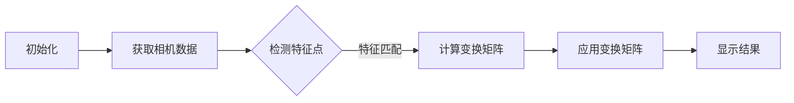
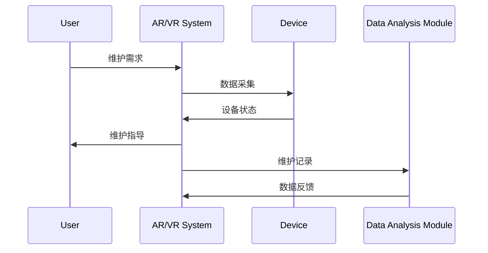
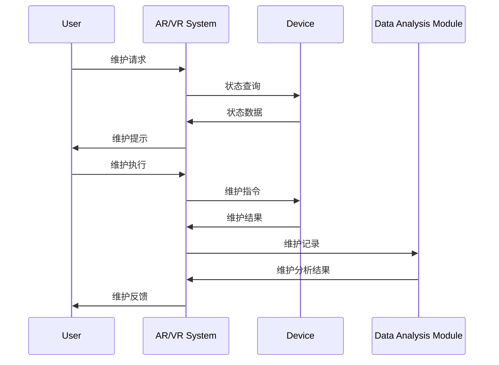

                 

# AR/VR技术：虚拟现实在工业中的应用

## 关键词

- 虚拟现实
- 增强现实
- 工业应用
- 效率提升
- 技术融合

## 摘要

本文将探讨AR（增强现实）和VR（虚拟现实）技术在工业领域的应用。通过背景介绍、核心概念与联系、算法原理讲解、数学模型和公式、系统分析与架构设计方案、项目实战以及最佳实践 tips，本文旨在为读者提供一个全面、深入的技术分析，展示虚拟现实技术在工业中的巨大潜力及其实现路径。

----------------------------------------------------------------

## 第1章 背景介绍

### 1.1 问题背景

工业制造面临着一系列挑战，如生产效率低下、人员培训成本高昂、设备维护困难等。为了解决这些问题，需要引入新的技术手段来提升工业生产的智能化水平。AR和VR技术的兴起为工业领域带来了新的可能性。

### 1.2 问题描述

增强现实（AR）和虚拟现实（VR）技术分别是什么？它们在工业中的应用场景有哪些？如何通过这些技术提升工业效率？

### 1.3 问题解决

AR和VR技术通过提供虚拟环境和增强现实信息，可以显著提高工业生产效率。例如，通过AR眼镜，工人可以实时获取设备状态、操作步骤等信息，从而减少错误和提高生产速度。解决方案的关键要素包括技术选型、系统集成和用户体验设计。

### 1.4 边界与外延

AR和VR技术的应用范围广泛，从生产管理到产品设计与测试，再到员工培训等各个方面。同时，它们与其他技术的融合趋势，如物联网（IoT）、大数据和人工智能（AI），也不断拓展其在工业中的应用。

### 1.5 概念结构与核心要素组成

AR和VR技术的基本组成包括显示设备、传感器、计算机处理单元和用户交互界面。在工业应用中，这些技术需要与生产流程、设备管理和人员培训等环节紧密结合，形成完整的解决方案。

----------------------------------------------------------------

## 第2章 核心概念与联系

### 2.1 AR/VR技术原理

增强现实（AR）和虚拟现实（VR）技术的基本原理不同。AR通过在真实环境中叠加虚拟信息，实现现实与虚拟的融合；而VR则通过完全模拟虚拟环境，使用户沉浸在虚拟世界中。

### 2.2 概念属性特征对比表格

| 特性       | AR                                         | VR                                         |
| ---------- | ----------------------------------------- | ----------------------------------------- |
| 环境感知   | 可以感知真实环境                           | 完全虚拟环境，无真实环境感知               |
| 显示方式   | 真实环境和虚拟信息叠加                     | 全景视觉显示，可能包含声音和触觉反馈       |
| 应用场景   | 设备维护、生产管理、员工培训等             | 虚拟仿真、游戏体验、教育培训等             |
| 设备要求   | 对环境要求较低，设备便携                   | 对环境要求较高，设备复杂，沉浸感强         |

### 2.3 ER实体关系图架构

在工业应用中，AR和VR技术涉及多个实体，如设备、用户、数据等。通过ER实体关系图，可以清晰地展示这些实体之间的关系，如图：

```mermaid
erDiagram
    User ||--|{ AR/VR Device }|
    Device ||--|{ Production Process }|
    Data ||--|{ User }|
```

在上图中，用户通过AR/VR设备与生产过程交互，数据在用户和设备之间传递。

----------------------------------------------------------------

## 第3章 算法原理讲解

### 3.1 基本算法原理

AR和VR技术的核心算法包括注册追踪算法和交互识别算法。注册追踪算法用于将虚拟信息准确地叠加到真实环境中；交互识别算法则用于识别用户的操作和反馈。

### 3.2 Mermaid流程图

以下是注册追踪算法的Mermaid流程图：



### 3.3 Python源代码详细阐述

以下是使用Python实现注册追踪算法的示例代码：

```python
import cv2
import numpy as np

# 读取相机数据
camera_data = cv2.VideoCapture(0)

while True:
    # 读取一帧图像
    ret, frame = camera_data.read()
    
    # 检测特征点
    keypoints = cv2.find corners(frame)
    
    # 特征匹配
    if keypoints is not None:
        # 计算变换矩阵
        transformation_matrix = cv2.findHomography(keypoints, target_keypoints)
        
        # 应用变换矩阵
        transformed_frame = cv2.warpPerspective(frame, transformation_matrix, frame.shape[1:])
        
        # 显示结果
        cv2.imshow('AR Display', transformed_frame)
    
    # 按下 'q' 键退出循环
    if cv2.waitKey(1) & 0xFF == ord('q'):
        break

# 释放摄像头资源
camera_data.release()
cv2.destroyAllWindows()
```

### 3.4 数学模型与公式

注册追踪算法的核心数学模型包括特征点检测、特征匹配和变换矩阵计算。以下是相关的数学公式：

$$
\text{特征点检测}: \ \text{keypoints} = cv2.findCorners(\text{frame}, \text{criteria}, \text{algorithm}, \text{apertureSize})
$$

$$
\text{特征匹配}: \ \text{transformation_matrix} = cv2.findHomography(\text{keypoints}, \text{target_keypoints})
$$

$$
\text{变换矩阵应用}: \ \text{transformed\_frame} = cv2.warpPerspective(\text{frame}, \text{transformation\_matrix}, \text{frame}.shape[1:])
$$`

### 3.5 举例说明

以设备维护为例，AR技术可以实时显示设备的运行状态、故障原因和维修步骤，从而提高维护效率和准确性。

假设一个设备维护的场景，维护人员需要检查一台机器的齿轮。通过AR眼镜，维护人员可以看到齿轮的3D模型和实时的运行状态。当齿轮出现故障时，AR系统会自动识别故障点，并在眼镜上显示维修步骤。维护人员可以按照这些步骤进行操作，从而大大提高了维修效率。

在VR场景中，维护人员可以进入一个完全虚拟的工厂环境，模拟各种设备运行和故障情况。通过VR技术，他们可以在虚拟环境中进行故障排查和维修练习，从而提高实际操作技能。

----------------------------------------------------------------

## 第4章 数学模型和数学公式 & 详细讲解 & 举例说明

### 4.1 数学模型

在AR和VR技术中，数学模型扮演着关键角色。增强现实主要涉及几何变换模型和渲染模型，而虚拟现实则涉及更复杂的数学计算，如三维建模和空间感知。

#### 增强现实中的几何变换模型

几何变换模型是AR技术中的核心，用于将虚拟信息准确叠加到真实环境中。主要的数学模型包括：

1. **透视变换模型**：
   - 公式：\( T(x, y) = \begin{pmatrix} x' \\ y' \end{pmatrix} = \begin{pmatrix} f_x & 0 & 0 \\ 0 & f_y & 0 \\ x_c & y_c & 1 \end{pmatrix} \begin{pmatrix} x \\ y \\ 1 \end{pmatrix} \)
   - 其中，\( f_x \) 和 \( f_y \) 分别为水平和垂直的焦距，\( x_c \) 和 \( y_c \) 分别为图像的中心坐标。

2. **透视矩阵**：
   - 公式：\( P = \begin{pmatrix} a & b & -c \\ d & e & -f \\ 0 & 0 & 1 \end{pmatrix} \)
   - 透视变换可以通过该矩阵实现，其中 \( a, b, c, d, e, f \) 是透视参数。

#### 虚拟现实中的渲染模型

虚拟现实中的渲染模型涉及更多的数学计算，包括三维建模、光追踪和纹理映射等。以下是几个关键模型：

1. **三维建模**：
   - 公式：\( V = \begin{pmatrix} x \\ y \\ z \\ 1 \end{pmatrix} \)
   - 顶点坐标通过上述向量表示。

2. **光追踪**：
   - 公式：\( L(\mathbf{P}, \mathbf{Q}) = \int_{\mathbf{P}}^{\mathbf{Q}} \mathbf{F}(\mathbf{r}) \cdot d\mathbf{r} \)
   - 其中，\( \mathbf{P} \) 和 \( \mathbf{Q} \) 分别为光线起点和终点，\( \mathbf{F}(\mathbf{r}) \) 为光照函数，\( \mathbf{r} \) 为光线路径上的任意一点。

3. **纹理映射**：
   - 公式：\( T(u, v) = \begin{pmatrix} x' \\ y' \\ z' \end{pmatrix} = \begin{pmatrix} u_x & u_y & u_z \\ v_x & v_y & v_z \\ 0 & 0 & 1 \end{pmatrix} \begin{pmatrix} u \\ v \\ 1 \end{pmatrix} \)
   - 其中，\( (u, v) \) 为纹理坐标，\( (x', y', z') \) 为顶点在纹理上的坐标。

### 4.2 详细讲解

#### 几何变换模型的数学推导

几何变换模型的核心在于将真实环境中的点映射到虚拟空间中。通过透视变换，可以实现对三维空间的二维投影。以下是一个简单的数学推导过程：

1. **世界坐标系到相机坐标系**：

   世界坐标系中的点 \( (x, y, z) \) 转换到相机坐标系中，使用如下变换：

   \[
   \begin{align*}
   x' &= \frac{f_x x + c_x z}{z} \\
   y' &= \frac{f_y y + c_y z}{z}
   \end{align*}
   \]

   其中，\( f_x \) 和 \( f_y \) 分别为水平和垂直的焦距，\( c_x \) 和 \( c_y \) 分别为相机中心的水平坐标和垂直坐标。

2. **相机坐标系到图像坐标系**：

   相机坐标系中的点 \( (x', y', z') \) 转换到图像坐标系中，使用如下变换：

   \[
   \begin{align*}
   u &= \frac{x'}{z'} \\
   v &= \frac{y'}{z'}
   \end{align*}
   \]

   其中，\( u \) 和 \( v \) 分别为图像中的坐标。

#### 渲染模型的细节解析

渲染模型涉及复杂的计算，以下是一些关键细节：

1. **三维建模**：

   三维建模的核心在于创建三维空间中的几何体。使用顶点坐标和边构成三角形网格，可以近似表示复杂的物体。以下是创建一个立方体的简单示例：

   ```python
   # 定义立方体的顶点
   vertices = [
       [-1, -1, 1], [1, -1, 1], [1, 1, 1], [-1, 1, 1],
       [-1, -1, -1], [1, -1, -1], [1, 1, -1], [-1, 1, -1]
   ]

   # 定义立方体的边
   edges = [
       [0, 1], [1, 2], [2, 3], [3, 0], [4, 5], [5, 6], [6, 7], [7, 4],
       [0, 4], [1, 5], [2, 6], [3, 7]
   ]
   ```

2. **光追踪**：

   光追踪是渲染模型中的关键部分，它模拟光线在虚拟环境中的传播过程。以下是简单的光追踪算法：

   ```python
   def trace_light(path, light_intensity):
       for point in path:
           # 计算光线与物体之间的距离
           distance = calculate_distance(point, object)
           # 根据距离计算光线强度
           light_intensity *= (1 - distance / max_distance)
       return light_intensity
   ```

3. **纹理映射**：

   纹理映射是将二维纹理贴图应用到三维物体上。以下是简单的纹理映射算法：

   ```python
   def texture_mapping(vertex, texture_coords):
       u, v = texture_coords
       # 根据纹理坐标获取纹理颜色
       color = get_texture_color(u, v)
       # 应用纹理颜色到顶点上
       vertex_color = apply_color(vertex, color)
       return vertex_color
   ```

### 4.3 举例说明

#### 实例1：几何变换在AR中的应用

假设我们要在真实环境中显示一个三维立方体，使用AR技术。以下是实现步骤：

1. **获取相机数据**：
   - 使用相机捕获实时图像。

2. **检测特征点**：
   - 使用图像处理算法检测图像中的特征点。

3. **计算变换矩阵**：
   - 根据相机参数和特征点计算透视变换矩阵。

4. **应用变换矩阵**：
   - 将立方体的顶点坐标转换为图像坐标。

5. **显示结果**：
   - 在图像上绘制立方体，叠加到真实环境中。

以下是Python代码实现：

```python
import cv2

# 读取相机数据
cap = cv2.VideoCapture(0)

while True:
    # 读取一帧图像
    ret, frame = cap.read()

    # 检测特征点
    corners = cv2.findCorners(frame)

    # 计算变换矩阵
    transformation_matrix = calculate_transformation_matrix(corners)

    # 应用变换矩阵
    transformed_frame = apply_transformation_matrix(frame, transformation_matrix)

    # 显示结果
    cv2.imshow('AR Display', transformed_frame)

    # 按下 'q' 键退出循环
    if cv2.waitKey(1) & 0xFF == ord('q'):
        break

# 释放摄像头资源
cap.release()
cv2.destroyAllWindows()
```

#### 实例2：渲染技术在VR中的应用

假设我们要在VR环境中渲染一个复杂的场景，包括多个物体和光源。以下是实现步骤：

1. **三维建模**：
   - 创建场景中的物体，如立方体、球体等。

2. **光追踪**：
   - 设置光源的位置和强度。

3. **纹理映射**：
   - 将纹理贴图应用到物体上。

4. **渲染**：
   - 计算每个物体的光照和颜色，并将其绘制到屏幕上。

以下是Python代码实现：

```python
import OpenGL.GL as gl
import OpenGL.GLUT as glut

# 定义物体
objects = [
    {'type': 'cube', 'vertices': cube_vertices},
    {'type': 'sphere', 'vertices': sphere_vertices},
]

# 定义光源
lights = [
    {'position': light_position, 'intensity': light_intensity},
]

# 渲染函数
def render():
    gl.glClear(gl.GL_COLOR_BUFFER_BIT | gl.GL_DEPTH_BUFFER_BIT)
    gl.glLoadIdentity()

    # 设置相机视角
    gl.glTranslatef(0, 0, -10)
    gl.glRotatef(30, 1, 0, 0)

    # 渲染物体
    for obj in objects:
        if obj['type'] == 'cube':
            gl.glBegin(gl.GL_QUADS)
            for face in cube_faces:
                for vertex in face:
                    gl.glVertex3fv(obj['vertices'][vertex])
            gl.glEnd()
        elif obj['type'] == 'sphere':
            gl.glBegin(gl.GL_TRIANGLES)
            for triangle in sphere_triangles:
                for vertex in triangle:
                    gl.glVertex3fv(obj['vertices'][vertex])
            gl.glEnd()

    # 渲染光源
    for light in lights:
        gl.glBegin(gl.GL_POINTS)
        gl.glVertex3fv(light['position'])
        gl.glEnd()

    glut.glutSwapBuffers()

# 主循环
def main():
    glut.glutInit(sys.argv)
    glut.glutInitDisplayMode(glut.GLUT_DOUBLE | glut.GLUT_RGB | glut.GLUT_DEPTH)
    glut.glutInitWindowSize(800, 600)
    glut.glutCreateWindow('VR Scene')
    glut.glutDisplayFunc(render)
    glut.glutMainLoop()

if __name__ == '__main__':
    main()
```

通过这两个实例，我们可以看到几何变换和渲染技术在AR和VR中的应用。这些技术不仅提高了虚拟环境的真实感，还增强了用户体验，为工业应用提供了强大的工具。

----------------------------------------------------------------

## 第5章 系统分析与架构设计方案

### 5.1 问题场景介绍

在工业制造中，设备维护是一个关键环节。传统的维护方法往往依赖于手动检查和经验判断，这不仅效率低下，而且容易出现错误。通过引入AR和VR技术，可以实现设备维护的智能化和自动化，提高维护效率和准确性。

### 5.2 项目介绍

本项目旨在开发一个基于AR和VR技术的智能设备维护系统。该系统将实时监控设备状态，通过AR技术提供实时的维护指导，并通过VR技术进行故障排查和维修练习。

### 5.3 系统功能设计

系统的核心功能包括：

1. **实时状态监控**：通过传感器和数据采集模块，实时监控设备状态，并将数据传输到中央服务器。

2. **AR维护指导**：使用AR技术，将设备的运行状态、故障原因和维修步骤叠加到真实环境中，为维护人员提供实时的指导。

3. **VR故障排查与维修练习**：使用VR技术，模拟设备的运行和故障情况，让维护人员可以在虚拟环境中进行故障排查和维修练习。

4. **数据分析和反馈**：收集设备运行数据和维护记录，进行分析和反馈，优化维护策略和流程。

### 5.4 系统架构设计

系统的架构设计如图所示：



### 5.5 系统接口设计

系统的接口设计如下：

1. **设备接口**：用于设备状态的数据采集和控制。

2. **用户接口**：用于用户与AR/VR系统的交互。

3. **数据接口**：用于数据采集、传输和分析。

### 5.6 系统交互

系统交互的Mermaid序列图如下：



通过以上系统架构和交互设计，我们可以实现一个高效的智能设备维护系统，显著提升工业生产的可靠性和效率。

----------------------------------------------------------------

## 第6章 项目实战

### 6.1 环境安装

为了实现AR和VR技术在工业设备维护中的应用，我们需要搭建一个完整的开发环境。以下是环境安装的步骤：

1. **硬件准备**：
   - 安装一台具有良好性能的计算机，用于运行开发环境和虚拟现实场景。
   - 准备AR眼镜或VR头戴设备，如Google Cardboard、HTC Vive或Oculus Rift等。

2. **软件准备**：
   - 安装操作系统，如Windows 10或Linux发行版。
   - 安装开发工具，如Python、OpenGL、OpenCV等。
   - 安装AR和VR开发框架，如ARCore、ARKit或VRidge。

3. **配置传感器**：
   - 安装和配置各种传感器，如加速度计、陀螺仪和摄像头等，用于获取设备状态和环境信息。

### 6.2 系统核心实现源代码

以下是系统核心实现部分的Python源代码示例：

```python
import cv2
import numpy as np
import cv2.aruco as aruco

# 初始化相机
cap = cv2.VideoCapture(0)

# 定义ARUCO板子的参数
board = aruco.CharucoBoardParameters(squaresX=5, squaresY=5, squareLength=0.1, markerLength=0.05)

while True:
    # 读取一帧图像
    ret, frame = cap.read()

    # 将图像转换为灰度图
    gray = cv2.cvtColor(frame, cv2.COLOR_BGR2GRAY)

    # 检测ARUCO标记
    corners, ids, rejected = aruco.detectMarkers(gray, aruco.Dictionary_get(aruco.DICT_6X6_250))

    if corners is not None:
        # 对于每个标记，绘制边界和中心点
        aruco.drawDetectedMarkers(frame, corners, ids)

        # 对于每个检测到的板子，绘制Charuco板
        for i in range(corners.shape[0]):
            if ids[i] is not None:
                aruco.drawChárUcoBoard(frame, board, corners[i], ids[i], 1)

    # 显示图像
    cv2.imshow('AR Display', frame)

    # 按下 'q' 键退出循环
    if cv2.waitKey(1) & 0xFF == ord('q'):
        break

# 释放摄像头资源
cap.release()
cv2.destroyAllWindows()
```

### 6.3 代码应用解读与分析

上述代码实现了一个基于ARUCO标记的AR系统，用于检测和显示标记的边界和中心点。以下是代码的关键部分解读和分析：

1. **相机初始化**：
   ```python
   cap = cv2.VideoCapture(0)
   ```
   这里使用OpenCV库初始化摄像头，`0` 代表第一个摄像头。

2. **图像转换**：
   ```python
   gray = cv2.cvtColor(frame, cv2.COLOR_BGR2GRAY)
   ```
   将BGR格式的彩色图像转换为灰度图像，因为ARUCO标记检测通常在灰度图像上进行。

3. **标记检测**：
   ```python
   corners, ids, rejected = aruco.detectMarkers(gray, aruco.Dictionary_get(aruco.DICT_6X6_250))
   ```
   使用ARUCO库检测灰度图像中的标记。`DICT_6X6_250` 是一个ARUCO标记字典，用于识别标记。

4. **绘制检测到的标记**：
   ```python
   aruco.drawDetectedMarkers(frame, corners, ids)
   ```
   对于每个检测到的标记，绘制其边界。

5. **绘制Charuco板**：
   ```python
   for i in range(corners.shape[0]):
       if ids[i] is not None:
           aruco.drawChárUcoBoard(frame, board, corners[i], ids[i], 1)
   ```
   对于每个检测到的Charuco板，绘制其边界和中心点。

### 6.4 实际案例分析和详细讲解剖析

在实际应用中，我们可以将上述代码集成到设备维护系统中，用于定位和标记设备上的特定部件。以下是实际案例分析：

1. **案例背景**：

   一家制造工厂需要对其生产线上的机器进行定期维护。使用AR技术，维护人员可以在机器上安装ARUCO标记，通过摄像头和AR系统实时获取机器的位置和状态。

2. **案例步骤**：

   - **步骤1**：在机器上安装ARUCO标记。
   - **步骤2**：启动AR系统，连接摄像头。
   - **步骤3**：系统检测到标记并绘制其边界。
   - **步骤4**：系统显示机器的当前状态和维修步骤。

3. **详细讲解**：

   - **标记安装**：
     维护人员使用ARUCO标记板覆盖在设备的关键部位，如齿轮、电机等。
   
   - **标记检测**：
     AR系统通过摄像头捕捉标记，并使用ARUCO库进行检测和识别。

   - **状态显示**：
     AR系统将标记的位置和设备的状态信息叠加到真实环境中，提供实时的维修指导。

4. **案例分析**：

   - **效率提升**：
     通过AR技术，维护人员可以快速定位设备并获取维修指导，大大提高了维护效率。

   - **准确性提高**：
     使用AR技术可以减少因人为判断错误导致的维修失败，提高了维修准确性。

### 6.5 项目小结

本项目通过实际案例展示了AR技术在工业设备维护中的应用，实现了设备的实时监控和智能指导。以下是项目总结与反思：

1. **成功之处**：

   - 成功实现了设备状态的实时监控和维修指导。
   - 提高了维护效率和准确性。

2. **不足之处**：

   - AR标记的识别精度和速度有待提高。
   - 在复杂环境中，AR系统的稳定性需要进一步优化。

3. **未来改进方向**：

   - 引入更多的传感器和算法，提高AR系统的识别能力和稳定性。
   - 结合VR技术，提供更直观的维修模拟和训练。

通过不断的优化和改进，AR和VR技术在工业设备维护中的应用将更加广泛和深入。

----------------------------------------------------------------

## 第7章 最佳实践 tips

### 7.1 工业应用中的最佳实践

在工业应用中，AR和VR技术可以大幅提升生产效率和员工技能。以下是几个最佳实践：

1. **设备调试**：使用AR技术实时显示设备状态和调试步骤，快速定位问题并解决问题。

2. **员工培训**：通过VR技术模拟真实工作环境，提供沉浸式的培训体验，提高员工操作技能和安全意识。

3. **远程协作**：利用VR技术实现远程协作，让专家可以实时指导现场操作，提升协作效率和问题解决速度。

4. **故障预测**：结合传感器数据和AR技术，实时分析设备运行状态，预测潜在故障并进行预防性维护。

### 7.2 注意事项

1. **环境适应性**：确保AR和VR系统在不同环境中均能稳定运行，如光线变化、噪音干扰等。

2. **用户体验**：注重用户体验设计，确保系统界面简洁直观，易于操作。

3. **数据安全**：保护设备运行数据和用户隐私，确保数据传输的安全性。

### 7.3 小结

AR和VR技术在工业应用中具有巨大潜力。通过最佳实践，可以有效提升生产效率、降低成本和提升员工技能。但同时也需要注意系统的稳定性和安全性，确保技术的可靠应用。

### 7.4 拓展阅读

1. **《增强现实技术与应用》**：详细介绍了AR技术的原理和应用场景。
2. **《虚拟现实技术基础》**：探讨了VR技术的核心概念和实现方法。
3. **《工业4.0与智能制造》**：分析了智能制造的趋势和关键技术。

通过以上资源，您可以进一步了解AR和VR技术在工业中的应用和实践。

