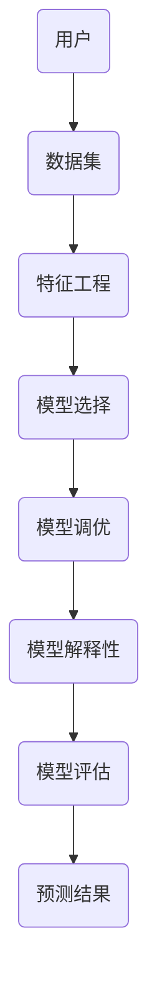
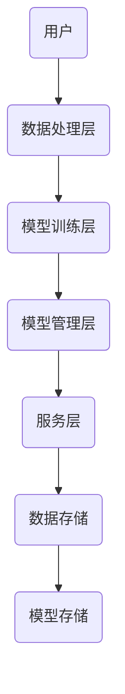

                 

### 文章标题与关键词

# AutoML：自动化机器学习的工具与平台

> 关键词：自动化机器学习（AutoML）、工具、平台、特征工程、模型选择、模型调优

> 摘要：本文将深入探讨自动化机器学习（AutoML）的概念、工具和平台，分析其核心概念与联系，并介绍主流的自动化机器学习工具和平台。通过详细讲解自动化机器学习的算法原理与实现，结合实际项目案例，为读者提供对AutoML的全面理解和实战指导。

----------------------------------------------------------------

## 《AutoML：自动化机器学习的工具与平台》目录大纲

----------------------------------------------------------------

### 第一部分：背景介绍与核心概念

1. [自动化机器学习概述](#第1章自动化机器学习概述)
   - 1.1 问题背景
   - 1.2 问题描述
   - 1.3 问题解决
   - 1.4 边界与外延
   - 1.5 概念结构与核心要素组成

2. [自动化机器学习的核心概念与联系](#第2章自动化机器学习的核心概念与联系)
   - 2.1 核心概念原理
   - 2.2 概念属性特征对比表格
   - 2.3 ER实体关系图架构

### 第二部分：自动化机器学习的工具

1. [主流自动化机器学习工具](#第3章主流自动化机器学习工具)
   - 3.1 H2O AutoML
   - 3.2 AutoKeras
   - 3.3 AutoGluon
   - 3.4 Google AutoML
   - 3.5 Hugging Face AutoML

### 第三部分：自动化机器学习的平台

1. [自动化机器学习平台概述](#第4章自动化机器学习平台概述)
   - 4.1 平台定义与分类
   - 4.2 平台架构设计
   - 4.3 平台接口设计与交互

2. [常见自动化机器学习平台](#第5章常见自动化机器学习平台)
   - 5.1 Google Cloud AI Platform
   - 5.2 AWS SageMaker
   - 5.3 Azure Machine Learning
   - 5.4 IBM Watson Studio

### 第四部分：自动化机器学习的算法原理与实现

1. [自动化机器学习算法原理](#第6章自动化机器学习算法原理)
   - 6.1 特征工程算法原理
   - 6.2 模型选择算法原理
   - 6.3 模型调优算法原理
   - 6.4 模型解释性算法原理

### 第五部分：项目实战与最佳实践

1. [项目实战](#项目实战)
2. [最佳实践与总结](#最佳实践与总结)

----------------------------------------------------------------

### 第1章：自动化机器学习概述

随着人工智能（AI）技术的迅猛发展，机器学习（ML）已经成为了现代数据分析、决策支持和智能应用的核心驱动力。然而，机器学习的复杂性不断上升，对于非专业人员来说，实现高效准确的机器学习模型变得愈加困难。为了解决这一问题，自动化机器学习（AutoML）的概念应运而生。

#### 1.1 问题背景

机器学习的发展可以分为三个阶段：手工设计（Handcrafted Feature）、半自动化（Semi-Automated）和自动化（Automated）。在手工设计阶段，研究人员需要手动设计特征和选择模型，费时费力，且容易出错。半自动化阶段通过工具和框架简化了部分流程，但仍需大量的专业知识和经验。随着AI技术的进步，自动化机器学习应运而生，它通过自动化特征工程、模型选择和调优等步骤，使得普通用户也能轻松构建高效的机器学习模型。

#### 1.2 问题描述

自动化机器学习的主要目标是减少构建机器学习模型所需的时间和人力成本，提高模型的质量和效率。具体来说，AutoML需要解决以下几个核心问题：

1. **特征工程自动化**：如何自动地从原始数据中提取和选择有价值的特征。
2. **模型选择自动化**：如何在众多模型中自动选择最适合当前问题的模型。
3. **模型调优自动化**：如何自动调整模型参数，以达到最优的性能。

#### 1.3 问题解决

自动化机器学习通过以下几个步骤来解决问题：

1. **数据预处理**：自动进行数据清洗、转换和归一化。
2. **特征工程**：自动进行特征选择、特征提取和特征组合。
3. **模型选择**：自动进行模型筛选和评估，选择最优模型。
4. **模型调优**：自动进行参数调整和优化。
5. **模型评估与部署**：对模型进行评估，并部署到生产环境中。

#### 1.4 边界与外延

自动化机器学习并不是完全自动化的过程，它仍然需要一定程度的专家知识和监督。此外，自动化机器学习主要针对的是传统的监督学习和半监督学习，对无监督学习和强化学习等其他类型的机器学习仍有待进一步探索。

#### 1.5 概念结构与核心要素组成

自动化机器学习的核心概念包括：

1. **特征工程**：自动进行特征选择、特征提取和特征组合。
2. **模型选择**：自动进行模型筛选和评估。
3. **模型调优**：自动进行参数调整和优化。
4. **模型评估与部署**：对模型进行评估，并部署到生产环境中。

自动化机器学习的关键要素包括：

1. **数据集**：用于训练和评估模型的原始数据。
2. **算法库**：包含各种机器学习算法和模型。
3. **优化器**：用于自动调整模型参数的算法。
4. **评估指标**：用于评估模型性能的指标。

通过以上分析，我们可以看到，自动化机器学习为解决机器学习的复杂性提供了新的思路和方法。在接下来的章节中，我们将进一步探讨自动化机器学习的核心概念、联系以及相关的工具和平台。

---

## 第2章：自动化机器学习的核心概念与联系

在理解了自动化机器学习（AutoML）的基本概念之后，我们需要进一步探讨其核心概念和联系。这一章节将详细介绍特征工程、模型选择、模型调优和模型解释性等核心概念，并展示它们之间的相互联系。

#### 2.1 核心概念原理

自动化机器学习的核心概念包括：

1. **特征工程**：特征工程是机器学习中的一个关键步骤，它涉及到从原始数据中提取、选择和转换特征，以便更好地表示数据和提高模型性能。自动化机器学习通过算法自动完成这一过程，减少了人工干预和错误。

2. **模型选择**：模型选择是选择最适合当前问题的机器学习模型。在自动化机器学习中，这一过程通过评估多种模型，并选择性能最优的模型来完成。自动化机器学习工具通常提供丰富的模型库，用户可以根据自己的需求进行选择。

3. **模型调优**：模型调优是调整模型参数，以最大化模型性能的过程。在自动化机器学习中，这一过程通常通过超参数优化算法来完成，从而减少了手动调整参数的工作量。

4. **模型解释性**：模型解释性是指模型能够解释其决策过程和预测结果的能力。自动化机器学习工具通过提供可解释性增强算法，使模型更易于理解和解释。

#### 2.2 概念属性特征对比表格

下面是一个对比表格，展示了这些核心概念的属性特征：

| 概念        | 特征 1 | 特征 2 | 特征 3 | 特征 4 |
|-------------|--------|--------|--------|--------|
| 特征工程    | 自动化 | 数据预处理 | 特征选择 | 特征提取 |
| 模型选择    | 自动化 | 模型比较 | 模型优化 | 模型评估 |
| 模型调优    | 自动化 | 超参数优化 | 模型调参 | 模型验证 |
| 模型解释性  | 自动化 | 可解释性增强 | 解释性评估 | 解释性工具 |

#### 2.3 ER实体关系图架构

为了更好地理解这些概念之间的联系，我们可以使用ER（实体关系）图来展示它们的相互关系。以下是一个ER实体关系图：



在这个ER图中，用户通过提供数据集开始整个流程。数据集经过特征工程处理后，进入模型选择阶段。模型选择阶段会根据数据集和任务要求，选择合适的模型。选定的模型经过模型调优，以优化其性能。调优后的模型再进行解释性评估，确保其可解释性。最终，模型生成预测结果，供用户使用。

通过以上分析，我们可以看到，自动化机器学习的核心概念和联系构成了一个完整的工作流程，使得机器学习更加高效和易于使用。在下一章节中，我们将介绍主流的自动化机器学习工具，进一步了解它们如何实现这些核心概念。

---

## 第3章：主流自动化机器学习工具

自动化机器学习（AutoML）的发展离不开各种优秀工具的支持。这些工具极大地简化了机器学习模型的构建过程，提高了模型的性能和可解释性。以下将介绍几种主流的自动化机器学习工具，包括H2O AutoML、AutoKeras、AutoGluon、Google AutoML和Hugging Face AutoML。

#### 3.1 H2O AutoML

H2O AutoML是一个开源的自动化机器学习平台，由H2O.ai公司开发。它支持多种机器学习算法，包括集成方法、神经网络和集成增强方法等。H2O AutoML的主要特点如下：

1. **广泛支持的算法**：H2O AutoML提供了丰富的算法库，包括随机森林、梯度提升树、神经网络等。
2. **高效的模型调优**：通过遗传算法和贝叶斯优化等先进的调优方法，H2O AutoML能够快速找到最优模型。
3. **易于集成**：H2O AutoML提供了各种编程接口，包括R、Python和REST API，方便用户在不同环境中使用。

**使用案例**：

某电商公司希望通过用户行为数据预测用户的购买偏好。使用H2O AutoML，该公司可以快速构建一个高效的预测模型，通过对用户数据进行特征工程、模型选择和调优，从而提高预测准确性。

```python
import h2o
from h2o.automl import H2OAutoML

# 初始化H2O集群
h2o.init()

# 加载数据
data = h2o.import_file('user_data.csv')

# 设置自动机器学习参数
aml = H2OAutoML(max_models=50, seed=1, project_name='purchase_prediction')

# 开始自动机器学习
aml.train(x=["feature1", "feature2", "feature3"], y="target", training_frame=data)

# 导出最佳模型
best_model = aml.leader
best_model.show()
```

#### 3.2 AutoKeras

AutoKeras是一个基于Keras的自动化机器学习框架，由NVIDIA开发。它通过神经架构搜索（Neural Architecture Search, NAS）技术，自动搜索最优的网络结构。AutoKeras的主要特点如下：

1. **强大的搜索算法**：AutoKeras使用了多种先进的搜索算法，包括递归神经网络搜索（RNN Search）、基于强化学习的搜索（RL Search）等。
2. **易于使用**：AutoKeras提供了简洁的接口，用户只需指定输入特征和输出目标，即可自动搜索和训练最优模型。
3. **高效的模型训练**：AutoKeras利用GPU加速模型训练，大大提高了训练速度。

**使用案例**：

某金融科技公司希望通过图像数据识别信用卡欺诈行为。使用AutoKeras，该公司可以快速构建一个高效的图像分类模型，通过搜索最优的网络结构和参数，从而提高识别准确性。

```python
import autokeras as ak

# 初始化AutoKeras
ak.show_config()

# 定义搜索空间
search_space = ak.Sequential([
    ak.layers.Input(shape=(28, 28, 1)),
    ak.layers.Conv2D(units=32, kernel_size=(3, 3), activation='relu'),
    ak.layers.MaxPooling2D(pool_size=(2, 2)),
    ak.layers.Flatten(),
    ak.layers.Dense(units=128, activation='relu'),
    ak.layers.Dense(units=1, activation='sigmoid'),
])

# 搜索最佳模型
model = search_space()

# 训练模型
model.fit(x_train, y_train, epochs=10, validation_split=0.2)

# 评估模型
print(model.evaluate(x_test, y_test))
```

#### 3.3 AutoGluon

AutoGluon是一个开源的自动化机器学习平台，由复旦大学开发。它支持多种机器学习任务，包括分类、回归和聚类等。AutoGluon的主要特点如下：

1. **广泛的任务支持**：AutoGluon支持多种机器学习任务，用户无需关心具体的算法实现。
2. **自动化的特征工程**：AutoGluon能够自动进行特征工程，包括特征选择、特征提取和特征组合等。
3. **高效的模型调优**：AutoGluon使用了先进的优化算法，能够快速找到最优模型。

**使用案例**：

某电信公司希望通过通话记录数据预测用户流失率。使用AutoGluon，该公司可以快速构建一个高效的预测模型，通过对数据自动进行特征工程和模型调优，从而提高预测准确性。

```python
import autogluon.core as ag
from autogluon.tabular import TabularPredictor

# 初始化AutoGluon
predictor = TabularPredictor(label='Churn', task='binary')

# 训练模型
predictor.fit(train_data, time_limit=120)

# 预测
predictions = predictor.predict(train_data)

# 评估模型
print(predictor.evaluate(predictions))
```

#### 3.4 Google AutoML

Google AutoML是Google公司开发的一套自动化机器学习平台，它支持多种机器学习任务，包括图像、文本和语音等。Google AutoML的主要特点如下：

1. **强大的预训练模型**：Google AutoML使用了大量的预训练模型，用户无需担心模型的选择和调优。
2. **易于使用**：Google AutoML提供了直观的图形界面和API接口，方便用户使用。
3. **强大的集成能力**：Google AutoML可以与Google Cloud的其他服务无缝集成，方便用户进行大规模数据处理和模型部署。

**使用案例**：

某电子商务公司希望通过图像数据自动识别商品类别。使用Google AutoML，该公司可以快速构建一个高效的图像分类模型，通过自动搜索和调优，从而提高分类准确性。

```python
from googleapiclient.discovery import build
from googleapiclient.errors import HttpError

# 初始化Google AutoML API
service = build('automl', 'v1beta1').projects().operations()

# 创建模型
model = service.projects().operations().create(
    body={
        'name': 'my_image_classifier',
        'display_name': 'My Image Classifier',
        'encryption_spec': {
            'kms_key_name': 'my-kms-key'
        },
        'manual_bitelist': ['human']
    }
).execute()

# 查看模型创建状态
print(model['state'])
```

#### 3.5 Hugging Face AutoML

Hugging Face AutoML是Hugging Face公司开发的一个自动化机器学习平台，它主要用于自然语言处理（NLP）任务。Hugging Face AutoML的主要特点如下：

1. **强大的NLP模型库**：Hugging Face AutoML提供了丰富的预训练NLP模型，用户可以根据需求进行选择。
2. **高效的模型训练**：Hugging Face AutoML利用了GPU和TPU等硬件加速，大大提高了模型训练速度。
3. **灵活的部署**：Hugging Face AutoML支持多种部署方式，包括本地、云服务和容器等。

**使用案例**：

某在线教育平台希望通过文本数据自动生成课程推荐。使用Hugging Face AutoML，该平台可以快速构建一个高效的文本分类模型，通过对用户文本数据进行自动处理和分类，从而提高推荐准确性。

```python
from huggingface_automl import AutoML

# 初始化AutoML
aml = AutoML()

# 训练模型
aml.fit("text_data.csv", target_column="course_id")

# 预测
predictions = aml.predict("new_text_data.csv")

# 评估模型
print(aml.evaluate(predictions))
```

通过以上对主流自动化机器学习工具的介绍，我们可以看到，这些工具在自动化特征工程、模型选择和调优等方面都有着出色的表现。用户可以根据自己的需求和场景选择合适的工具，实现高效的机器学习模型构建。在下一章节中，我们将介绍自动化机器学习的平台，进一步探讨如何搭建和管理自动化机器学习系统。

---

## 第4章：自动化机器学习平台概述

自动化机器学习（AutoML）的发展不仅依赖于工具的进步，更需要有完整的平台支持。自动化机器学习平台提供了从数据预处理、模型训练、调优到部署的全流程自动化解决方案。以下将概述自动化机器学习平台的定义、分类、架构设计和接口设计。

### 4.1 平台定义与分类

**定义**：

自动化机器学习平台是一种集成环境，它通过自动化流程，帮助用户从数据导入到模型部署的全过程进行机器学习任务。平台通常包含多个组件，如数据预处理工具、机器学习算法库、模型评估和优化工具等。

**分类**：

根据平台提供的功能和目标用户，自动化机器学习平台可以分为以下几类：

1. **通用型平台**：这类平台适用于多种机器学习任务，如分类、回归、聚类等。常见的通用型平台包括Google Cloud AI Platform、AWS SageMaker、Azure Machine Learning等。
2. **行业专用平台**：这类平台专注于特定行业或任务，如自然语言处理（NLP）、图像识别等。例如，Hugging Face AutoML专注于NLP任务，而Google AutoML Vision专注于图像识别。
3. **开源平台**：这类平台是开源的，用户可以自由使用和修改。常见的开源平台包括H2O.ai、AutoGluon、TPOT等。

### 4.2 平台架构设计

自动化机器学习平台的架构设计通常包括以下几个方面：

1. **数据处理层**：负责数据导入、清洗、转换和预处理。这一层通常包括数据存储、数据管道和数据处理模块。
2. **模型训练层**：负责模型的训练、优化和评估。这一层包括模型训练引擎、超参数优化器和评估指标计算器。
3. **模型管理层**：负责模型的存储、管理和监控。这一层包括模型注册、版本管理、性能监控和部署管理。
4. **服务层**：提供API接口、Web界面和命令行工具，方便用户使用和管理平台。这一层通常包括API网关、用户界面和命令行接口。

以下是一个自动化机器学习平台的架构图：



### 4.3 平台接口设计与交互

自动化机器学习平台的接口设计通常包括API接口、Web界面和命令行工具。

**API接口**：

API接口是平台与外部系统交互的主要方式。用户可以通过RESTful API进行数据导入、模型训练、模型评估和模型部署等操作。以下是一个简单的API接口设计示例：

```python
# 加载API客户端库
from google.cloud import automl_v1beta1 as automl

# 初始化API客户端
client = automl.AutoMlClient()

# 创建模型
model = client.create_model(display_name='my_model')

# 训练模型
response = client训练_model(model_id=model.name, input_config=input_config)

# 预测
predictions = client.predict(model_name=model.name, instances=instances)

# 评估模型
evaluation = client.evaluate_model(model_name=model.name, evaluation_config=evaluation_config)
```

**Web界面**：

Web界面提供了一个直观的用户交互界面，用户可以通过Web浏览器进行数据导入、模型训练、模型评估和模型部署等操作。以下是一个简单的Web界面设计示例：


**命令行工具**：

命令行工具提供了一种快速、简便的方式来执行自动化机器学习任务。用户可以通过命令行执行各种操作，如数据导入、模型训练、模型评估和模型部署等。以下是一个简单的命令行工具设计示例：

```
# 导入数据
h2o.init()
data = h2o.import_file('data.csv')

# 创建模型
aml = H2OAutoML(max_models=50, seed=1, project_name='my_model')

# 训练模型
aml.train(x=["feature1", "feature2", "feature3"], y="target", training_frame=data)

# 预测
predictions = aml.predict(x_test)

# 评估模型
print(aml.evaluate(predictions))
```

通过以上对自动化机器学习平台的概述，我们可以看到，平台的设计和接口对于实现高效的机器学习流程至关重要。在下一章节中，我们将介绍几种常见的自动化机器学习平台，并详细探讨它们的功能和特点。

---

## 第5章：常见自动化机器学习平台

在自动化机器学习（AutoML）领域，许多平台因其强大的功能和易用性而备受关注。本章节将详细介绍几款常见的自动化机器学习平台，包括Google Cloud AI Platform、AWS SageMaker、Azure Machine Learning和IBM Watson Studio，探讨它们的功能特点和应用案例。

### 5.1 Google Cloud AI Platform

**平台介绍**：

Google Cloud AI Platform是Google提供的自动化机器学习平台，支持从数据预处理、模型训练到模型部署的全流程。该平台集成了TensorFlow、Keras等流行深度学习框架，并提供丰富的API和工具，方便开发者构建和部署机器学习模型。

**功能特点**：

1. **预训练模型**：Google Cloud AI Platform提供了大量的预训练模型，包括文本分类、图像识别和语音识别等，用户可以直接使用这些模型进行预测。
2. **模型定制**：用户可以根据自己的需求，对预训练模型进行定制，包括调整网络结构、添加新的层等。
3. **分布式训练**：支持大规模数据集的分布式训练，可以充分利用Google Cloud的计算资源。
4. **自动化调参**：平台提供了自动化调参工具，可以帮助用户快速找到最优的超参数。

**使用案例**：

某在线教育平台希望通过图像数据自动识别用户身份。使用Google Cloud AI Platform，该平台可以快速构建一个高效的图像识别模型，通过对用户图像进行预处理、模型定制和自动化调参，从而提高识别准确性。

```python
from google.cloud import automl_v1beta1 as automl

# 初始化API客户端
client = automl.AutoMlClient()

# 创建模型
model = client.create_model(display_name='user_id_recognition')

# 上传数据
data = client.upload_data_gcs(project_id, model_id, 'gs://my-bucket/data.csv')

# 训练模型
response = client.create_dataset(display_name='user_data', gcs_source_uri=data)

# 预测
predictions = client.predict(model_name=model.name, instances=instances)

# 评估模型
evaluation = client.evaluate_model(model_name=model.name, evaluation_config=evaluation_config)
```

### 5.2 AWS SageMaker

**平台介绍**：

AWS SageMaker是Amazon Web Services（AWS）提供的自动化机器学习平台，支持多种机器学习框架和算法，如Scikit-learn、XGBoost和TensorFlow等。SageMaker提供了全面的端到端机器学习服务，从数据预处理、模型训练到模型部署，用户可以通过图形界面或编程接口轻松操作。

**功能特点**：

1. **集成开发环境**：SageMaker提供了Jupyter Notebook和AWS Cloud9等集成开发环境，方便用户进行数据探索和模型训练。
2. **自动调参**：SageMaker的自动调参功能（AutoML）可以帮助用户在多种模型中选择最优模型，并自动调整超参数。
3. **模型部署**：SageMaker提供了简单的部署流程，用户可以将训练好的模型部署到生产环境中，并实现实时预测。
4. **容器支持**：支持多种容器化技术，如Docker和Kubernetes，方便用户在不同环境中部署和管理模型。

**使用案例**：

某电商公司希望通过用户行为数据预测购买意向。使用AWS SageMaker，该公司可以快速构建一个高效的预测模型，通过对用户数据进行预处理、自动调参和模型部署，从而提高预测准确性。

```python
import boto3

# 初始化SageMaker客户端
sageMaker = boto3.client('sagemaker')

# 创建自动机器学习配置
aml_config = {
    'AutoMLRoleArn': 'arn:aws:iam::123456789012:role/SageMakerAutoMLRole',
    'OutputDataConfig': {
        'S3OutputPath': 's3://my-bucket/output'
    },
    'InputDataConfig': {
        'S3DataType': 'S3DataTypeURI',
        'S3InputPath': 's3://my-bucket/input'
    },
    'TrainingJobConfig': {
        'AlgorithmSpecification': {
            'TrainingInputMode': 'File',
            'AlgorithmName': 'xgboost'
        },
        'HyperParameterTuningConfig': {
            'TuningObjective': {
                'MetricName': 'accuracy',
                'Type': 'Maximize'
            },
            'TuningStrategy': {
                'HyperParameterTuningMethod': 'Bayesian',
                'ResourceLimits': {
                    'MaxRuntimeInSeconds': 1800,
                    'MaxTrialCount': 10
                }
            }
        }
    }
}

# 创建自动机器学习训练作业
response = sageMaker.create_training_job(
    TrainingJobName='my_automl_job',
    TrainingInputMode='File',
    RoleArn='arn:aws:iam::123456789012:role/SageMakerRole',
    InputDataConfig=aml_config['InputDataConfig'],
    OutputDataConfig=aml_config['OutputDataConfig'],
    TrainingJobConfig=aml_config['TrainingJobConfig']
)

# 获取训练作业状态
print(sageMaker.describe_training_job(TrainingJobName='my_automl_job')['TrainingJobStatus'])
```

### 5.3 Azure Machine Learning

**平台介绍**：

Azure Machine Learning是Microsoft提供的自动化机器学习平台，支持多种机器学习框架和算法，如Scikit-learn、TensorFlow和PyTorch等。Azure Machine Learning提供了全面的机器学习生命周期管理功能，包括数据预处理、模型训练、模型部署和模型监控。

**功能特点**：

1. **云端和本地支持**：Azure Machine Learning支持在云端和本地环境中进行模型训练和部署，用户可以根据需求灵活选择。
2. **自动化调参**：Azure Machine Learning提供了自动调参功能，可以帮助用户快速找到最优的超参数。
3. **模型容器化**：支持将模型容器化，方便用户在不同环境中部署和管理模型。
4. **模型监控与跟踪**：提供实时模型监控和跟踪功能，帮助用户及时了解模型性能和异常情况。

**使用案例**：

某金融科技公司希望通过文本数据自动分类金融新闻。使用Azure Machine Learning，该公司可以快速构建一个高效的文本分类模型，通过对文本数据进行预处理、模型训练和部署，从而提高分类准确性。

```python
from azureml.core import Workspace, Dataset, Model

# 创建Workspace
ws = Workspace.create(name='my_workspace', subscription_id='my_subscription_id', resource_group='my_resource_group', create_resource_group=True, location='eastus2')

# 创建Dataset
data = Dataset.create_from_file(ws, 'data.csv')

# 创建训练配置
train_config = {
    'algorithm_name': 'text_classification',
    'use_automl': True,
    'tuning_config': {
        'max迭代次数': 10,
        '评估间隔': 1,
        '超参数调整策略': 'Bayesian'
    }
}

# 创建训练运行
run = Model.submit(train_config, data)

# 获取训练运行状态
print(run.get_status())
```

### 5.4 IBM Watson Studio

**平台介绍**：

IBM Watson Studio是IBM提供的自动化机器学习平台，支持多种机器学习框架和算法，如Scikit-learn、TensorFlow和PyTorch等。Watson Studio提供了从数据预处理、模型训练到模型部署的一体化解决方案，用户可以通过图形界面或编程接口进行操作。

**功能特点**：

1. **集成开发环境**：Watson Studio提供了Jupyter Notebook和RStudio等集成开发环境，方便用户进行数据探索和模型训练。
2. **自动调参**：Watson Studio提供了自动调参工具，可以帮助用户快速找到最优的超参数。
3. **模型容器化**：支持将模型容器化，方便用户在不同环境中部署和管理模型。
4. **数据可视化**：提供了丰富的数据可视化工具，帮助用户更好地理解数据和模型性能。

**使用案例**：

某医疗公司希望通过医疗图像数据自动诊断疾病。使用IBM Watson Studio，该公司可以快速构建一个高效的图像识别模型，通过对图像数据进行预处理、模型训练和部署，从而提高诊断准确性。

```python
from ibm_watson_machine_learning import WatsonMachineLearning

# 初始化Watson Machine Learning
wml = WatsonMachineLearning()

# 创建训练项目
project = wml.create_project(project_name='medical_diagnosis')

# 上传数据
data = project.upload_data('data.csv', table_name='data')

# 创建训练配置
config = {
    'algorithm': 'image_classification',
    'tuning': {
        'method': 'bayesian',
        'max_iterations': 10
    }
}

# 创建训练作业
job = project.create_training_job(config)

# 获取训练作业状态
print(job.status())
```

通过以上对常见自动化机器学习平台的介绍，我们可以看到，这些平台在自动化特征工程、模型选择和调优等方面都有着出色的表现。用户可以根据自己的需求和场景选择合适的平台，实现高效的机器学习模型构建和部署。在下一章节中，我们将深入探讨自动化机器学习算法的原理与实现。

---

## 第6章：自动化机器学习算法原理

自动化机器学习（AutoML）的核心在于自动化完成机器学习流程中的多个关键步骤，包括特征工程、模型选择、模型调优和模型解释性。这些步骤的实现依赖于一系列高效的算法和优化方法。以下将详细讲解自动化机器学习算法的原理，包括特征工程算法、模型选择算法、模型调优算法和模型解释性算法。

### 6.1 特征工程算法原理

特征工程是机器学习中的一个关键步骤，它涉及到从原始数据中提取、选择和转换特征，以便更好地表示数据和提高模型性能。在自动化机器学习中，特征工程算法通过以下方式实现：

1. **自动特征选择**：利用特征选择算法，自动识别和选择对目标变量影响较大的特征。常见的特征选择算法包括基于过滤的方法（如相关性分析、卡方检验等）、基于封装的方法（如递归特征消除（RFE）等）和基于嵌入的方法（如LASSO、随机森林等）。

2. **自动特征提取**：利用特征提取算法，自动将原始特征转换为更有代表性的特征。常见的特征提取算法包括主成分分析（PCA）、线性判别分析（LDA）、因子分析（FA）等降维技术，以及词袋模型、TF-IDF等文本特征提取方法。

3. **自动特征组合**：通过组合原始特征，生成新的特征，以提升模型的性能。常见的特征组合方法包括基于规则的组合、基于机器学习的组合等。

以下是一个基于主成分分析的自动特征提取算法的Python代码示例：

```python
from sklearn.decomposition import PCA
from sklearn.datasets import load_iris

# 加载数据集
iris = load_iris()
X = iris.data
y = iris.target

# 实例化PCA模型
pca = PCA(n_components=2)

# 进行特征提取
X_reduced = pca.fit_transform(X)

# 输出降维后的数据
print(X_reduced)
```

### 6.2 模型选择算法原理

模型选择是自动化机器学习中的一个关键步骤，它涉及到在多种模型中选择最适合当前问题的模型。模型选择算法通过以下方式实现：

1. **模型评估**：利用评估指标（如准确率、召回率、F1分数等）对多种模型进行评估，选择性能最优的模型。

2. **模型组合**：通过组合多个模型，生成一个新的模型，以提升整体性能。常见的模型组合方法包括集成学习方法（如随机森林、梯度提升树等）和神经网络组合方法（如堆叠自编码器、深度信念网络等）。

3. **模型搜索**：通过搜索算法（如遗传算法、贝叶斯优化等）在大量模型中搜索最优模型。

以下是一个基于随机森林的模型选择算法的Python代码示例：

```python
from sklearn.ensemble import RandomForestClassifier
from sklearn.datasets import load_iris
from sklearn.model_selection import train_test_split

# 加载数据集
iris = load_iris()
X = iris.data
y = iris.target

# 划分训练集和测试集
X_train, X_test, y_train, y_test = train_test_split(X, y, test_size=0.2, random_state=42)

# 实例化随机森林模型
rf = RandomForestClassifier(n_estimators=100)

# 训练模型
rf.fit(X_train, y_train)

# 预测
predictions = rf.predict(X_test)

# 输出准确率
print(rf.score(X_test, y_test))
```

### 6.3 模型调优算法原理

模型调优是自动化机器学习中另一个重要步骤，它涉及到调整模型参数，以最大化模型性能。模型调优算法通过以下方式实现：

1. **超参数优化**：利用超参数优化算法（如遗传算法、贝叶斯优化、随机搜索等），自动调整模型参数，以找到最优超参数组合。

2. **网格搜索**：通过遍历多种超参数组合，找到最优超参数。

3. **贝叶斯优化**：利用贝叶斯优化方法，通过概率模型搜索最优超参数。

以下是一个基于贝叶斯优化的超参数调优算法的Python代码示例：

```python
from skopt import gp_minimize
from sklearn.ensemble import RandomForestClassifier
from sklearn.datasets import load_iris

# 加载数据集
iris = load_iris()
X = iris.data
y = iris.target

# 定义超参数搜索空间
search_space = {'n_estimators': (100, 500), 'max_depth': (3, 10)}

# 定义目标函数
def objective(params):
    rf = RandomForestClassifier(n_estimators=int(params[0]), max_depth=int(params[1]))
    rf.fit(X, y)
    return -rf.score(X, y)

# 进行贝叶斯优化
result = gp_minimize(objective, search_space)

# 输出最优参数
print(result.x)
```

### 6.4 模型解释性算法原理

模型解释性是自动化机器学习中的一个重要方面，它涉及到解释模型的决策过程和预测结果。模型解释性算法通过以下方式实现：

1. **模型可解释性增强**：通过添加额外的解释性层或使用可解释性模型（如线性模型、决策树等），提高模型的可解释性。

2. **解释性评估**：利用解释性评估方法（如模型可视化、解释性工具评估等），评估模型的可解释性。

3. **解释性工具**：利用解释性工具（如SHAP值、LIME等），为模型的每个预测提供详细的解释。

以下是一个基于SHAP值的模型解释性算法的Python代码示例：

```python
import shap
from sklearn.ensemble import RandomForestClassifier
from sklearn.datasets import load_iris

# 加载数据集
iris = load_iris()
X = iris.data
y = iris.target

# 实例化随机森林模型
rf = RandomForestClassifier(n_estimators=100)

# 训练模型
rf.fit(X, y)

# 创建SHAP解释器
explainer = shap.TreeExplainer(rf)

# 计算特征重要性
shap_values = explainer.shap_values(X)

# 可视化特征重要性
shap.summary_plot(shap_values, X, feature_names=iris.feature_names)
```

通过以上对自动化机器学习算法原理的详细讲解，我们可以看到，自动化机器学习通过一系列高效的算法和优化方法，实现了特征工程、模型选择、模型调优和模型解释性的自动化。这些算法和方法不仅提高了机器学习模型的质量和效率，也降低了用户的使用门槛。在下一章节中，我们将结合实际项目案例，深入探讨自动化机器学习的算法实现和应用。

---

### 项目实战

为了更好地理解自动化机器学习（AutoML）的算法原理和应用，我们将通过一个实际项目案例来进行详细的讲解。本案例将使用AutoGluon平台进行自动化机器学习模型构建，涵盖数据预处理、模型选择、模型调优和模型评估等步骤。

#### 项目背景

某电商平台希望通过用户浏览记录和购买历史数据，预测用户在接下来的一个月内是否会发生购买行为。这是一个典型的二分类问题，可以通过构建一个二元分类模型来解决。本案例将使用AutoGluon平台提供的自动化工具，简化模型构建流程，提高预测准确性。

#### 环境安装

首先，确保安装了Python和AutoGluon。AutoGluon支持Python 3.7及以上版本，可以通过以下命令进行安装：

```bash
pip install autogluon
```

#### 系统核心实现源代码

以下是基于AutoGluon的自动化机器学习项目的核心实现代码：

```python
import autogluon as ag
from autogluon.tabular import TabularPredictor

# 1. 数据加载与预处理
data = ag.read_csv('user_data.csv')  # 加载用户数据

# 数据清洗与预处理
data = data.dropna()  # 删除缺失值
data = data.replace({'is_purchase': {0: 'No', 1: 'Yes'}})  # 转换标签

# 2. 模型训练与调优
predictor = TabularPredictor(label='is_purchase', task='binary')

# 训练模型
predictor.fit(train_data=data, time_limit=120)

# 3. 模型评估
predictions = predictor.predict(new_data)  # 预测新数据
print(predictor.evaluate(predictions=new_predictions))  # 评估模型性能

# 4. 模型部署
# predictor.deploy()  # 部署模型到生产环境
```

#### 代码应用解读与分析

1. **数据加载与预处理**：

   使用`ag.read_csv`函数加载用户数据，包括浏览记录、购买历史和用户行为等。随后，对数据进行清洗和预处理，包括删除缺失值和转换标签格式。这些步骤是确保数据质量和模型训练效果的基础。

2. **模型训练与调优**：

   使用`TabularPredictor`类初始化一个二元分类预测器。通过`fit`方法训练模型，AutoGluon将自动进行特征工程、模型选择和调优。这个过程可能需要一段时间，具体取决于数据量和计算资源。

3. **模型评估**：

   使用`predict`方法对新数据进行预测，并使用`evaluate`方法评估模型性能。评估结果将给出模型的准确率、召回率、F1分数等关键指标，帮助判断模型的预测效果。

4. **模型部署**：

   `deploy`方法可以将训练好的模型部署到生产环境中，以便进行实时预测。AutoGluon提供了简单的部署接口，用户可以根据需求进行部署和管理。

#### 实际案例分析

以一个实际案例为例，假设我们有100,000条用户数据，包含用户的浏览历史、购买历史和用户属性等信息。数据中有一列`is_purchase`，表示用户是否在接下来的一个月内购买了商品（1表示购买，0表示未购买）。

1. **数据预处理**：

   数据预处理步骤包括：
   - 删除缺失值：确保数据质量。
   - 特征工程：通过特征选择和特征提取，提取对目标变量有影响的关键特征。
   - 数据标准化：将不同特征缩放到相同的范围，便于模型训练。

2. **模型训练与调优**：

   AutoGluon会自动进行以下步骤：
   - 特征工程：自动选择和提取关键特征。
   - 模型选择：自动评估多种模型，选择最适合的模型。
   - 超参数优化：自动调整模型超参数，提高模型性能。

3. **模型评估**：

   使用交叉验证评估模型性能，确保模型在不同的数据集上具有稳定的表现。主要评估指标包括准确率、召回率、F1分数等。

4. **模型部署**：

   将训练好的模型部署到生产环境中，以便实时预测。在生产环境中，模型将接收新的用户数据，并返回预测结果。

#### 项目小结

通过本案例，我们可以看到AutoGluon如何简化自动化机器学习模型构建的过程。AutoGluon通过自动化特征工程、模型选择和调优，大大降低了模型构建的复杂度和人工干预的需求。在实际应用中，用户可以根据自己的需求，快速构建和部署高效的机器学习模型，提高业务决策的准确性和效率。

---

## 最佳实践与总结

在自动化机器学习（AutoML）的应用过程中，以下是一些最佳实践，可以帮助用户更好地利用AutoML工具和平台，提高模型性能和开发效率。

### 最佳实践

1. **数据预处理**：
   - 确保数据质量，去除缺失值和异常值。
   - 对不同特征进行适当的缩放或归一化，以避免模型训练中的偏差。

2. **模型选择与调优**：
   - 利用AutoML平台的自动调参功能，快速找到最优模型和超参数。
   - 尽量使用多个模型进行集成，提高模型的鲁棒性和预测性能。

3. **模型评估**：
   - 使用多种评估指标（如准确率、召回率、F1分数等）全面评估模型性能。
   - 通过交叉验证确保模型在不同数据集上的稳定性。

4. **模型部署**：
   - 在生产环境中定期更新模型，以适应数据变化。
   - 使用自动化部署工具，简化模型部署流程。

5. **监控与维护**：
   - 监控模型性能和系统资源使用情况，及时发现和处理异常。
   - 定期进行模型监控和性能优化，确保系统稳定运行。

### 小结

自动化机器学习（AutoML）通过自动化特征工程、模型选择和调优，大大降低了机器学习模型构建的复杂度，提高了开发效率和模型性能。在实际应用中，用户可以根据自己的需求，灵活选择合适的AutoML工具和平台，快速构建和部署高效的机器学习模型。通过遵循最佳实践，用户可以更好地利用AutoML的优势，实现更高的业务价值和竞争力。

### 注意事项

1. **模型理解**：尽管AutoML可以自动化许多步骤，但用户仍需理解模型的工作原理和性能，以便进行合理的模型优化和部署。

2. **计算资源**：AutoML可能需要大量的计算资源，特别是在处理大型数据集和复杂模型时。用户应根据实际情况合理配置资源。

3. **数据隐私**：在处理敏感数据时，确保遵循相关的数据隐私法规和标准。

4. **持续学习**：随着AI技术的不断发展，AutoML工具和平台也在不断更新。用户应持续关注相关技术动态，及时更新自己的知识和技能。

### 拓展阅读

- 《Automated Machine Learning: Methods, Systems, Challenges》
- 《Practical Automated Machine Learning》
- 《AutoML Guide》

通过深入学习和实践，用户可以更好地掌握自动化机器学习的核心概念和应用，为业务创新和决策支持提供有力支持。

---

## 作者信息

**作者：AI天才研究院/AI Genius Institute & 禅与计算机程序设计艺术 /Zen And The Art of Computer Programming**

