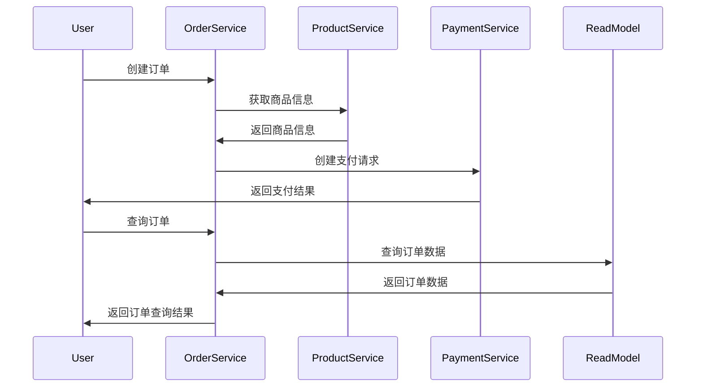

                 

### CQRS模式：读写分离的系统设计

**关键词：CQRS模式、系统设计、读写分离、性能优化、微服务架构**

**摘要：本文将深入探讨CQRS模式在系统设计中的应用，从背景、核心概念、设计原理、应用实践到深入探讨，逐步解析CQRS模式在提升系统性能、优化架构设计方面的优势和实践经验。**

### 目录大纲

#### 第一部分：CQRS模式概述

1. **第一部分：CQRS模式概述**

    1.1 问题背景

    1.2 CQRS模式基本概念

    1.3 CQRS模式的优缺点

    1.4 本章小结

2. **第二部分：CQRS模式设计原理**

    2.1 CQRS模式核心原理与机制

    2.2 事件驱动架构

    2.3 数据库分库分表设计

    2.4 CQRS模式下的缓存策略

    2.5 本章小结

3. **第三部分：CQRS模式应用实践**

    3.1 CQRS模式在电商系统中的应用

    3.2 CQRS模式在金融系统中的应用

    3.3 CQRS模式与微服务架构的融合

    3.4 CQRS模式性能优化与调优

    3.5 本章小结

4. **第四部分：CQRS模式深入探讨**

    4.1 CQRS模式与微服务架构的融合

    4.2 CQRS模式性能优化与调优

    4.3 高并发处理

    4.4 本章小结

5. **第五部分：CQRS模式最佳实践与未来展望**

    5.1 CQRS模式最佳实践

    5.2 CQRS模式未来展望

    5.3 本章小结

### 第一部分：CQRS模式概述

#### 1.1 问题背景

在当今快速发展的互联网时代，系统设计面临着诸多挑战，特别是在数据的高并发读写需求方面。传统的单体架构往往在处理高并发读写时显得力不从心，这主要源于以下几个方面的问题：

- **读写冲突**：传统系统设计中的数据库在读写操作时容易发生锁争用，导致系统性能下降。
- **扩展性问题**：单体架构难以水平扩展，当业务增长时，系统性能难以满足需求。
- **数据一致性问题**：在高并发读写环境下，如何保证数据的一致性成为一大难题。

为了解决上述问题，CQRS（Command Query Responsibility Segregation）模式应运而生。CQRS模式通过将系统的命令（Command）和查询（Query）分离，实现了读写分离的设计理念，从而提高了系统的性能和可扩展性。

#### 1.2 CQRS模式基本概念

CQRS模式的核心思想是将系统的读写操作分离到不同的处理路径上，具体概念如下：

- **Command**：表示系统的操作命令，如添加、删除、修改等，这些操作通常是幂等的。
- **Query**：表示对数据的查询操作，如查询用户信息、商品列表等，这些操作通常是不可变的。

CQRS模式将系统划分为两个核心组件：

- **读模型**：负责处理所有的查询操作，提供高速、可扩展的读取能力。
- **写模型**：负责处理所有的命令操作，确保数据的一致性和完整性。

通过这种读写分离的设计，CQRS模式可以显著提高系统的性能，特别是在高并发场景下。

#### 1.3 CQRS模式的优缺点

**优点**：

1. **性能提升**：通过将读写操作分离，可以减少读写冲突，提高系统的性能。
2. **扩展性增强**：读模型和写模型可以独立扩展，提高系统的可扩展性。
3. **数据一致性**：通过事件驱动的方式，可以确保数据的一致性。

**缺点**：

1. **复杂度增加**：CQRS模式引入了额外的复杂性，需要精心设计和维护。
2. **数据同步问题**：读模型和写模型之间的数据同步可能引入额外的挑战。

**适用场景**：

1. **高并发读写场景**：如电商平台、社交媒体等。
2. **数据一致性要求高的场景**：如金融系统、企业资源计划系统等。

#### 1.4 本章小结

CQRS模式通过读写分离的设计理念，有效解决了传统系统设计中的性能和扩展性问题。在接下来的章节中，我们将深入探讨CQRS模式的设计原理、应用实践以及深入探讨其性能优化和未来展望。

---

在接下来的章节中，我们将进一步探讨CQRS模式的设计原理、核心机制以及在不同领域的应用实践。通过详细的分析和案例讲解，我们将揭示CQRS模式在实际系统设计中的强大作用和面临的挑战。

### 第一部分：CQRS模式概述

#### 第1章: CQRS模式背景与核心概念

CQRS（Command Query Responsibility Segregation）模式是一种在系统设计中用于分离读写操作的架构模式。它的核心思想是将系统的命令（Command）和查询（Query）分离到不同的处理路径上，从而实现读写分离，提高系统的性能和可扩展性。在这一章节中，我们将深入探讨CQRS模式的背景、核心概念以及相关的概念属性和ER实体关系图架构。

#### 1.1 问题背景

在传统的单体架构中，系统的所有功能模块都集中在同一个数据库中，这意味着所有的读写操作都需要通过这个数据库来完成。这种设计在单机环境下可能运行得相当顺畅，但随着系统的规模不断扩大，特别是在高并发场景下，这种设计会面临诸多问题：

1. **读写冲突**：当系统需要同时进行大量的读操作和写操作时，容易发生读写冲突，导致性能下降。例如，在电商平台上，用户下单的同时，库存更新操作可能会引发锁争用，导致下单操作阻塞。

2. **扩展性瓶颈**：单体架构难以水平扩展，因为所有的读写操作都集中在同一个数据库上。当系统流量剧增时，单个数据库的性能成为制约系统扩展的瓶颈。

3. **数据一致性问题**：在高并发读写环境下，如何保证数据的一致性成为一大难题。例如，当两个用户同时更新同一数据时，可能会发生数据不一致的情况。

为了解决这些问题，CQRS模式应运而生。CQRS模式通过将系统的读写操作分离到不同的处理路径上，从而实现了读写分离，提高了系统的性能和可扩展性。

#### 1.2 CQRS模式基本概念

CQRS模式的核心概念包括：

1. **Command**：命令表示对系统的操作，如创建订单、删除用户等。这些操作通常是幂等的，即多次执行的结果相同。

2. **Query**：查询表示对数据的查询操作，如获取用户信息、商品列表等。这些操作通常是不可变的，即多次执行的结果相同。

3. **读模型（Read Model）**：读模型是专门用于处理查询操作的组件，它提供了高速、可扩展的读取能力。读模型通常存储在内存中或缓存中，以实现快速的响应速度。

4. **写模型（Write Model）**：写模型是专门用于处理命令操作的组件，它负责确保数据的一致性和完整性。写模型通常与数据库直接交互，确保所有写操作都被正确执行。

通过将读写操作分离到不同的处理路径上，CQRS模式可以显著提高系统的性能和可扩展性。

#### 1.2.1 Command和Query分离

CQRS模式中的Command和Query分离是核心设计理念。具体来说，Command和Query分离包括以下几个方面：

1. **独立的处理路径**：Command和Query在系统中拥有独立的处理路径。命令操作通过命令总线（Command Bus）发送到写模型进行处理，而查询操作通过查询接口（Query Interface）直接访问读模型。

2. **不同的数据存储**：读模型和写模型通常使用不同的数据存储方式。写模型通常与数据库直接交互，而读模型则存储在内存或缓存中，以实现快速的响应速度。

3. **事件驱动**：CQRS模式通常采用事件驱动架构，通过事件将写模型和读模型连接起来。当写模型中的数据发生变化时，会触发事件，通知读模型更新相应的数据。

#### 1.2.2 事件驱动架构

事件驱动架构是CQRS模式的重要组成部分。在事件驱动架构中，系统的各个组件通过事件进行通信。具体来说，事件驱动架构包括以下几个方面：

1. **事件**：事件是系统中的关键信息，表示某个状态或行为的变化。例如，当用户下单时，会触发一个“订单创建”事件。

2. **事件总线**：事件总线是一个消息传递系统，用于传递事件。在CQRS模式中，事件总线通常用于连接写模型和读模型。当写模型中的数据发生变化时，会通过事件总线发送事件，通知读模型更新数据。

3. **事件处理**：事件处理是系统中的关键环节，负责处理事件并触发相应的操作。在CQRS模式中，事件处理通常由写模型和读模型共同完成。

#### 1.2.3 数据库分库分表

在CQRS模式中，数据库分库分表是一种常见的实践。数据库分库分表的目的是提高系统的性能和可扩展性。具体来说，数据库分库分表包括以下几个方面：

1. **分库**：将数据库拆分为多个独立的数据库实例，每个数据库实例负责一部分数据。这样可以降低单库的压力，提高系统的性能。

2. **分表**：将数据表拆分为多个子表，每个子表负责一部分数据。这样可以减少表的大小，提高查询性能。

3. **分片**：将数据拆分为多个数据分片，每个分片存储在不同的服务器上。这样可以提高系统的并发处理能力，提高系统的性能。

#### 1.3 CQRS模式的优缺点

**优点**：

1. **性能提升**：通过将读写操作分离，可以减少读写冲突，提高系统的性能。

2. **扩展性增强**：读模型和写模型可以独立扩展，提高系统的可扩展性。

3. **数据一致性**：通过事件驱动的方式，可以确保数据的一致性。

**缺点**：

1. **复杂度增加**：CQRS模式引入了额外的复杂性，需要精心设计和维护。

2. **数据同步问题**：读模型和写模型之间的数据同步可能引入额外的挑战。

#### 1.4 本章小结

CQRS模式通过读写分离的设计理念，有效解决了传统系统设计中的性能和扩展性问题。在下一章中，我们将进一步探讨CQRS模式的设计原理、核心机制以及在不同领域的应用实践。

### 第一部分：CQRS模式概述

#### 第2章: CQRS模式核心原理与机制

CQRS模式的核心原理和机制主要包括命令与查询分离、事件驱动架构和数据库分库分表设计。通过这些核心原理和机制，CQRS模式实现了读写分离，提高了系统的性能和可扩展性。以下是对CQRS模式核心原理和机制的详细探讨。

#### 2.1 CQRS模式原理

CQRS模式的核心原理是命令与查询分离。具体来说，这个原理包括以下几个方面：

1. **命令与查询分离**：在CQRS模式中，系统的命令（Command）和查询（Query）被分离到不同的处理路径上。命令处理路径负责处理所有的写操作，如创建、更新和删除数据；而查询处理路径负责处理所有的读操作，如查询数据和获取报表。

2. **独立的处理路径**：命令和查询在系统中拥有独立的处理路径。命令通过命令总线（Command Bus）发送到写模型进行处理，而查询通过查询接口（Query Interface）直接访问读模型。这种分离使得读操作和写操作互不干扰，从而提高了系统的性能。

3. **不同的数据存储**：写模型和读模型通常使用不同的数据存储方式。写模型直接与数据库交互，确保所有写操作都被正确执行；而读模型则存储在内存或缓存中，以实现快速的响应速度。这种分离减少了数据库的负载，提高了系统的性能。

4. **事件驱动**：CQRS模式采用事件驱动架构，通过事件将写模型和读模型连接起来。当写模型中的数据发生变化时，会触发事件，通知读模型更新相应的数据。这种机制确保了数据的一致性，同时也提高了系统的可扩展性。

#### 2.2 事件驱动架构

事件驱动架构是CQRS模式的核心机制之一。在事件驱动架构中，系统的各个组件通过事件进行通信。以下是对事件驱动架构的详细探讨：

1. **事件**：事件是系统中的关键信息，表示某个状态或行为的变化。例如，当用户下单时，会触发一个“订单创建”事件。事件可以是简单的字符串，也可以是复杂的对象。

2. **事件总线**：事件总线是一个消息传递系统，用于传递事件。在CQRS模式中，事件总线通常用于连接写模型和读模型。当写模型中的数据发生变化时，会通过事件总线发送事件，通知读模型更新数据。事件总线可以是消息队列，如RabbitMQ，也可以是其他消息传递系统。

3. **事件处理**：事件处理是系统中的关键环节，负责处理事件并触发相应的操作。在CQRS模式中，事件处理通常由写模型和读模型共同完成。写模型负责处理命令操作，并将事件发送到事件总线；读模型负责监听事件总线，并更新相应的数据。

4. **事件溯源**：事件溯源是CQRS模式中的另一个重要概念。它指的是记录所有事件的来源和执行过程，以便在需要时进行回溯和恢复。事件溯源通常使用日志系统，如ELK（Elasticsearch、Logstash、Kibana）来实现。

#### 2.3 数据库分库分表设计

数据库分库分表设计是CQRS模式中的重要实践之一，旨在提高系统的性能和可扩展性。以下是对数据库分库分表设计的详细探讨：

1. **分库**：分库是将数据库拆分为多个独立的数据库实例，每个数据库实例负责一部分数据。这样可以降低单库的压力，提高系统的性能。例如，在一个电商系统中，可以将用户数据、订单数据和商品数据分别存储在不同的数据库中。

2. **分表**：分表是将数据表拆分为多个子表，每个子表负责一部分数据。这样可以减少表的大小，提高查询性能。例如，在一个订单系统中，可以将订单表拆分为多个子表，每个子表存储一部分订单数据。

3. **分片**：分片是将数据拆分为多个数据分片，每个分片存储在不同的服务器上。这样可以提高系统的并发处理能力，提高系统的性能。例如，在一个分布式系统中，可以将数据分片存储在多个数据库实例中，以实现水平扩展。

4. **分库分表的挑战与优化**：分库分表设计虽然可以提高系统的性能和可扩展性，但也会带来一些挑战。例如，数据同步、跨库查询和分布式事务等。为了解决这些挑战，可以采用一些优化策略，如分布式缓存、分布式数据库和分布式事务管理等。

#### 2.4 CQRS模式下的缓存策略

在CQRS模式中，缓存策略是提高系统性能的重要手段。以下是对CQRS模式下的缓存策略的详细探讨：

1. **缓存机制**：缓存机制是指将数据存储在内存中或缓存中，以实现快速的响应速度。在CQRS模式中，读模型通常使用缓存来存储常用的查询结果，以减少对数据库的访问。

2. **缓存一致性策略**：缓存一致性策略是指确保缓存中的数据与数据库中的数据保持一致。在CQRS模式中，可以采用一些一致性策略，如最终一致性、强一致性等，以确保缓存和数据库之间的数据一致性。

3. **缓存优化技巧**：缓存优化技巧是指通过一些技术手段提高缓存性能。例如，可以采用缓存预热、缓存淘汰策略、缓存压缩等技巧，以提高缓存命中率，减少缓存失效带来的性能影响。

#### 2.5 本章小结

CQRS模式的核心原理和机制包括命令与查询分离、事件驱动架构和数据库分库分表设计。通过这些原理和机制，CQRS模式实现了读写分离，提高了系统的性能和可扩展性。在下一章中，我们将探讨CQRS模式在电商系统和金融系统中的应用，并通过实际案例进行分析和讲解。

### 第3章: CQRS模式在电商系统中的应用

在电商系统中，CQRS模式因其读写分离的特性而得到了广泛应用。本章将详细探讨CQRS模式在电商系统中的应用，包括系统架构设计、核心实现以及性能优化策略。

#### 3.1 电商系统概述

电商系统通常包括用户管理、商品管理、订单管理、支付系统等多个功能模块。这些模块需要同时处理大量读操作和写操作，特别是在促销活动、秒杀等高并发场景下，系统性能和稳定性面临巨大挑战。CQRS模式通过读写分离的设计，可以有效提升电商系统的性能和扩展性。

#### 3.2 CQRS模式在电商系统中的应用

CQRS模式在电商系统中的应用主要体现在以下几个方面：

1. **命令与查询分离**：电商系统的命令操作如下单、修改订单状态等，通过命令总线发送到写模型处理。查询操作如商品列表、用户订单查询等，通过查询接口直接访问读模型。这种分离确保了读操作和写操作互不干扰，提高了系统性能。

2. **事件驱动架构**：电商系统采用事件驱动架构，通过事件总线传递订单创建、订单修改等事件。当订单状态发生变化时，事件会通知读模型更新相应的订单数据，确保数据一致性。

3. **数据库分库分表设计**：电商系统的用户数据、商品数据、订单数据等可以分别存储在不同的数据库中，实现分库分表。这样可以降低单库压力，提高查询性能。

4. **缓存策略**：读模型采用缓存策略，存储常用的查询结果，如商品列表、用户订单等。通过缓存优化，可以显著减少对数据库的访问，提高系统性能。

#### 3.3 电商系统CQRS模式实战案例

下面以一个电商系统为例，介绍CQRS模式在系统设计中的具体实现。

**1. 系统环境搭建**

- **技术栈**：后端采用Spring Boot框架，数据库使用MySQL，消息队列使用RabbitMQ，缓存使用Redis。
- **系统架构**：采用微服务架构，包括用户服务、商品服务、订单服务、支付服务等。

**2. 系统核心实现**

**（1）命令与查询分离**

- **命令处理**：用户下单时，通过命令总线发送“CreateOrder”命令，写模型接收命令并处理下单逻辑，将订单数据存储到数据库。
  
  ```java
  @Service
  public class OrderCommandHandler {
      @Autowired
      private OrderRepository orderRepository;

      @CommandHandler
      public void handle(CreateOrder command) {
          Order order = new Order(command.getUserId(), command.getProductId(), command.getQuantity());
          orderRepository.save(order);
      }
  }
  ```

- **查询处理**：用户查询订单时，通过查询接口直接访问读模型，读取订单数据。

  ```java
  @Service
  public class OrderQueryHandler {
      @Autowired
      private OrderReadModel orderReadModel;

      @QueryHandler
      public Order handle(OrderQuery query) {
          return orderReadModel.findById(query.getId());
      }
  }
  ```

**（2）事件驱动架构**

- **事件总线**：当订单状态发生变化时，通过事件总线发送“OrderStateChanged”事件，通知读模型更新订单状态。

  ```java
  @RabbitListener(queues = "orderStateChangedQueue")
  public void handleOrderStateChanged(OrderStateChanged event) {
      orderReadModel.updateState(event.getId(), event.getState());
  }
  ```

- **读模型更新**：读模型监听事件总线，接收到事件后更新订单状态。

  ```java
  @Service
  public class OrderReadModel {
      private final Map<Long, Order> orders = new ConcurrentHashMap<>();

      public void updateState(Long id, OrderState state) {
          Order order = orders.get(id);
          if (order != null) {
              order.setState(state);
          }
      }

      public Order findById(Long id) {
          return orders.get(id);
      }
  }
  ```

**（3）数据库分库分表**

- **用户数据库**：存储用户信息和用户行为数据。
- **商品数据库**：存储商品信息和商品分类数据。
- **订单数据库**：存储订单数据和订单状态数据。

**（4）缓存策略**

- **Redis缓存**：存储常用查询结果，如商品列表、用户订单等。

  ```java
  @Service
  public class CacheService {
      @Autowired
      private RedisTemplate<String, Object> redisTemplate;

      public void cacheProductList(List<Product> products) {
          redisTemplate.opsForValue().set("productList", products);
      }

      public List<Product> getProductList() {
          return (List<Product>) redisTemplate.opsForValue().get("productList");
      }
  }
  ```

#### 3.4 系统分析与优化

**1. 系统性能分析**

- **命令处理**：通过异步消息队列处理命令，提高系统的并发处理能力。
- **查询处理**：通过缓存减少对数据库的访问，提高查询速度。
- **事件处理**：通过事件驱动架构实现数据一致性，降低数据同步成本。

**2. 性能优化策略**

- **读模型缓存**：提高缓存命中率，减少数据库访问。
- **数据库分库分表**：降低单库压力，提高查询性能。
- **负载均衡**：实现读写操作的负载均衡，提高系统稳定性。

#### 3.5 本章小结

CQRS模式在电商系统中的应用，通过读写分离、事件驱动架构和数据库分库分表设计，实现了系统的性能优化和扩展。在实际项目中，需要根据业务需求和系统特点，灵活运用CQRS模式，实现系统的最佳性能。

### 第4章: CQRS模式在金融系统中的应用

金融系统是高并发、高可靠性的关键业务系统，对数据处理的速度和准确性有着极高的要求。CQRS模式通过读写分离的设计，能够有效提升金融系统的性能和扩展性。本章将探讨CQRS模式在金融系统中的应用，包括系统架构设计、核心实现以及性能优化策略。

#### 4.1 金融系统概述

金融系统通常包括账户管理、交易处理、风险控制、合规审计等多个模块。这些模块需要处理大量的读操作和写操作，特别是在交易高峰期，系统性能和稳定性面临严峻考验。CQRS模式能够通过分离读操作和写操作，提高系统响应速度和处理能力。

#### 4.2 CQRS模式在金融系统中的应用

CQRS模式在金融系统中的应用，主要体现在以下几个方面：

1. **命令与查询分离**：金融系统的命令操作如账户转账、交易确认等，通过命令总线发送到写模型处理。查询操作如账户余额查询、交易记录查询等，通过查询接口直接访问读模型。这种分离确保了读写操作互不干扰，提高了系统性能。

2. **事件驱动架构**：金融系统采用事件驱动架构，通过事件总线传递交易事件。当交易状态发生变化时，事件会通知读模型更新相应的交易数据，确保数据一致性。

3. **数据库分库分表设计**：金融系统的用户账户数据、交易数据等可以分别存储在不同的数据库中，实现分库分表。这样可以降低单库压力，提高查询性能。

4. **缓存策略**：读模型采用缓存策略，存储常用的查询结果，如账户余额、交易记录等。通过缓存优化，可以显著减少对数据库的访问，提高系统性能。

#### 4.3 金融系统CQRS模式实战案例

下面以一个金融系统为例，介绍CQRS模式在系统设计中的具体实现。

**1. 系统环境搭建**

- **技术栈**：后端采用Spring Boot框架，数据库使用MySQL，消息队列使用RabbitMQ，缓存使用Redis。
- **系统架构**：采用微服务架构，包括账户服务、交易服务、风险控制服务等。

**2. 系统核心实现**

**（1）命令与查询分离**

- **命令处理**：用户转账时，通过命令总线发送“TransferCommand”命令，写模型接收命令并处理转账逻辑，将交易数据存储到数据库。

  ```java
  @Service
  public class TransferCommandHandler {
      @Autowired
      private TransactionRepository transactionRepository;

      @CommandHandler
      public void handle(TransferCommand command) {
          Transaction transaction = new Transaction(command.getSourceAccountId(), command.getDestinationAccountId(), command.getAmount());
          transactionRepository.save(transaction);
      }
  }
  ```

- **查询处理**：用户查询账户余额时，通过查询接口直接访问读模型，读取账户数据。

  ```java
  @Service
  public class AccountQueryHandler {
      @Autowired
      private AccountReadModel accountReadModel;

      @QueryHandler
      public BigDecimal handle(AccountQuery query) {
          return accountReadModel.getBalance(query.getAccountId());
      }
  }
  ```

**（2）事件驱动架构**

- **事件总线**：当交易状态发生变化时，通过事件总线发送“TransactionStateChanged”事件，通知读模型更新交易状态。

  ```java
  @RabbitListener(queues = "transactionStateChangedQueue")
  public void handleTransactionStateChanged(TransactionStateChanged event) {
      accountReadModel.updateTransactionState(event.getTransactionId(), event.getState());
  }
  ```

- **读模型更新**：读模型监听事件总线，接收到事件后更新交易状态。

  ```java
  @Service
  public class AccountReadModel {
      private final Map<Long, Account> accounts = new ConcurrentHashMap<>();

      public void updateTransactionState(Long transactionId, TransactionState state) {
          Account account = accounts.get(transactionId);
          if (account != null) {
              account.setTransactionState(state);
          }
      }

      public BigDecimal getBalance(Long accountId) {
          Account account = accounts.get(accountId);
          if (account != null) {
              return account.getBalance();
          }
          return BigDecimal.ZERO;
      }
  }
  ```

**（3）数据库分库分表**

- **账户数据库**：存储用户账户数据和交易数据。
- **交易数据库**：存储交易数据和交易日志。

**（4）缓存策略**

- **Redis缓存**：存储常用查询结果，如账户余额、交易记录等。

  ```java
  @Service
  public class CacheService {
      @Autowired
      private RedisTemplate<String, Object> redisTemplate;

      public void cacheAccountBalance(Long accountId, BigDecimal balance) {
          redisTemplate.opsForValue().set("accountBalance:" + accountId, balance);
      }

      public BigDecimal getAccountBalance(Long accountId) {
          return (BigDecimal) redisTemplate.opsForValue().get("accountBalance:" + accountId);
      }
  }
  ```

#### 4.4 系统分析与优化

**1. 系统性能分析**

- **命令处理**：通过异步消息队列处理命令，提高系统的并发处理能力。
- **查询处理**：通过缓存减少对数据库的访问，提高查询速度。
- **事件处理**：通过事件驱动架构实现数据一致性，降低数据同步成本。

**2. 性能优化策略**

- **读模型缓存**：提高缓存命中率，减少数据库访问。
- **数据库分库分表**：降低单库压力，提高查询性能。
- **负载均衡**：实现读写操作的负载均衡，提高系统稳定性。

#### 4.5 本章小结

CQRS模式在金融系统中的应用，通过读写分离、事件驱动架构和数据库分库分表设计，实现了系统的性能优化和扩展。在实际项目中，需要根据业务需求和系统特点，灵活运用CQRS模式，实现系统的最佳性能。

### 第四部分：CQRS模式深入探讨

#### 第5章: CQRS模式与微服务架构的融合

随着微服务架构的普及，CQRS模式作为一项强大的设计理念，也逐渐与微服务架构相结合，为系统的性能优化和可扩展性提供了新的解决方案。本章将探讨CQRS模式与微服务架构的融合原理、优势、挑战及其在微服务架构中的应用。

#### 5.1 微服务架构概述

微服务架构是一种基于分布式系统的设计理念，其核心思想是将应用程序分解为多个独立的、可复用的微服务。每个微服务负责实现特定的功能，独立部署和扩展，并通过轻量级的通信协议进行交互。微服务架构的主要优点包括：

1. **高可扩展性**：通过水平扩展单个微服务，可以灵活应对业务需求变化。
2. **高容错性**：每个微服务都是独立的，一个服务的故障不会影响到其他服务。
3. **高可维护性**：每个微服务都可以独立开发和部署，降低了系统的复杂度。

#### 5.2 CQRS模式与微服务架构融合的原理

CQRS模式与微服务架构的融合，主要是基于以下原理：

1. **服务拆分**：在微服务架构中，每个微服务都可以对应CQRS模式中的读模型或写模型。这种拆分方式使得读写操作可以独立部署和扩展，从而提高系统的性能和可扩展性。

2. **分布式数据存储**：在微服务架构中，数据可以分布式存储在不同的数据库中，这符合CQRS模式中分库分表的设计原则。通过分布式数据存储，可以减少单库压力，提高查询性能。

3. **事件驱动**：微服务架构通常采用事件驱动的方式处理业务逻辑，这正好与CQRS模式中的事件驱动架构相契合。通过事件驱动，可以实现数据的一致性和实时性。

#### 5.3 CQRS模式与微服务架构融合的优势

CQRS模式与微服务架构融合，带来了以下优势：

1. **性能优化**：通过将读写操作分离到不同的微服务中，可以显著减少读写冲突，提高系统的性能。

2. **可扩展性增强**：读模型和写模型可以独立扩展，从而实现系统的水平扩展。这大大提高了系统的可扩展性，特别是在高并发场景下。

3. **数据一致性保障**：通过事件驱动的方式，可以确保数据的一致性和实时性，降低分布式系统中数据一致性的难度。

4. **松耦合**：微服务架构和CQRS模式的设计原则都强调服务之间的松耦合，这降低了系统的复杂度和维护成本。

#### 5.4 CQRS模式与微服务架构融合的挑战

尽管CQRS模式与微服务架构融合具有诸多优势，但在实际应用中也面临一些挑战：

1. **分布式数据一致性**：在分布式系统中，数据一致性是一个重要但复杂的问题。CQRS模式虽然通过事件驱动提高了数据一致性，但仍然需要解决分布式数据一致性的问题。

2. **服务拆分粒度**：如何合理地拆分服务是融合过程中的关键问题。服务拆分粒度过细可能导致系统复杂性增加，而拆分粒度过粗则可能无法充分利用CQRS模式的优势。

3. **跨服务事务**：在CQRS模式与微服务架构融合中，跨服务的事务处理是一个难点。如何在保证数据一致性的同时，简化事务处理流程，是一个需要深入探讨的问题。

#### 5.5 CQRS模式在微服务架构中的应用

在实际应用中，CQRS模式在微服务架构中的应用主要体现在以下几个方面：

1. **服务拆分**：将系统的读写操作分离到不同的微服务中，实现读写分离。例如，订单服务可以负责处理订单的创建、更新等写操作，而订单查询服务可以负责处理订单的查询操作。

2. **数据存储**：根据业务需求，合理选择分布式数据存储方案。例如，订单数据可以存储在MySQL中，而订单查询数据可以存储在Redis中，以提高查询性能。

3. **事件驱动**：采用事件驱动的方式处理业务逻辑，实现数据的一致性和实时性。例如，当订单状态发生变化时，通过事件总线触发相应的更新操作，确保订单查询服务中的数据与订单存储服务中的数据保持一致。

#### 5.6 案例分析

以下是一个典型的CQRS模式与微服务架构融合的案例：

**1. 项目介绍**

该项目是一个在线电商平台，包括商品管理、订单管理、支付系统等多个模块。通过微服务架构，将各个模块拆分为独立的微服务，实现系统的分布式部署和扩展。

**2. 系统架构设计**

- **订单服务**：负责处理订单的创建、更新、删除等写操作。使用事件驱动的方式，确保订单数据的一致性。
- **订单查询服务**：负责处理订单的查询操作。通过Redis缓存订单数据，提高查询性能。
- **商品服务**：负责处理商品的管理操作，如添加、删除、更新商品信息等。
- **支付服务**：负责处理支付操作，与外部支付系统进行交互。

**3. 设计思路**

- **服务拆分**：将订单服务的写操作与订单查询服务的读操作分离，实现读写分离。订单服务的写操作通过事件总线触发订单查询服务的更新操作。
- **数据存储**：订单数据存储在MySQL数据库中，订单查询数据存储在Redis缓存中。通过Redis缓存减少对数据库的访问，提高查询性能。
- **事件驱动**：采用RabbitMQ作为事件总线，实现订单状态的变化通知。订单服务的写操作产生事件，订单查询服务通过监听事件总线，实时更新订单数据。

**4. 实践经验**

- **服务拆分粒度**：在服务拆分过程中，要充分考虑业务需求和系统性能，合理选择服务拆分粒度。
- **事件驱动架构**：事件驱动架构能够提高系统的可扩展性和灵活性，但在设计过程中需要注意事件处理的延迟和一致性。
- **分布式数据一致性**：在分布式系统中，要确保数据的一致性，需要采用合适的数据一致性策略，如最终一致性、强一致性等。

#### 5.7 本章小结

CQRS模式与微服务架构的融合，通过读写分离、事件驱动和数据分布式存储，实现了系统的性能优化和扩展。在实际应用中，需要根据业务需求和系统特点，合理拆分服务、选择数据存储方案和设计事件驱动架构，以充分利用CQRS模式的优势，实现系统的最佳性能。

### 第6章: CQRS模式性能优化与调优

CQRS模式在提升系统性能和扩展性方面具有显著优势，但为了充分发挥其潜力，需要对系统进行性能优化与调优。本章将探讨CQRS模式性能优化与调优的方法，包括系统监控、性能瓶颈分析、优化策略以及实际调优案例分析。

#### 6.1 CQRS模式性能优化

CQRS模式性能优化主要集中在以下几个方面：

1. **读写分离**：通过将读写操作分离到不同的处理路径上，减少读写冲突，提高系统性能。具体措施包括：
   - **独立部署**：将读模型和写模型部署在不同的服务器上，实现独立扩展和负载均衡。
   - **读写隔离**：在数据库层面实现读写隔离，如使用读写分离数据库或分库分表策略。

2. **缓存策略**：利用缓存机制减少对数据库的访问，提高系统性能。具体措施包括：
   - **数据缓存**：将常用查询结果缓存到内存或分布式缓存系统中，如Redis或Memcached。
   - **对象缓存**：缓存业务对象，如用户、订单等，减少数据库查询次数。

3. **异步处理**：通过异步处理机制，提高系统的并发处理能力。具体措施包括：
   - **消息队列**：使用消息队列（如RabbitMQ或Kafka）处理写操作，降低写操作的延迟。
   - **异步线程池**：使用异步线程池处理读写操作，提高系统并发处理能力。

4. **数据库优化**：优化数据库查询和索引，提高数据库性能。具体措施包括：
   - **索引优化**：合理设计索引，提高查询效率。
   - **分库分表**：根据业务需求，合理拆分数据库，实现水平扩展。

#### 6.2 CQRS模式调优实践

以下是一个CQRS模式性能调优的案例分析：

**1. 系统环境**

- **技术栈**：后端采用Spring Boot框架，数据库使用MySQL，消息队列使用RabbitMQ，缓存使用Redis。
- **系统架构**：采用微服务架构，包括用户服务、订单服务、商品服务、支付服务等。

**2. 系统监控**

- **性能监控**：使用Prometheus和Grafana进行系统性能监控，实时查看系统的CPU、内存、磁盘使用情况。
- **日志分析**：使用ELK（Elasticsearch、Logstash、Kibana）进行日志分析，监控系统的异常和性能瓶颈。

**3. 性能瓶颈分析**

- **数据库瓶颈**：通过监控发现，订单查询服务的数据库查询耗时较长，成为系统性能瓶颈。
- **缓存失效**：缓存命中率较低，导致大量查询请求直接访问数据库，影响系统性能。

**4. 调优步骤**

- **数据库优化**：增加订单查询服务的索引，优化查询语句，提高查询效率。
  ```sql
  CREATE INDEX idx_order_status ON orders(status);
  ```
- **缓存策略优化**：提高缓存命中率，减少对数据库的访问。
  - **缓存预热**：在系统启动时，预先加载常用数据到缓存中。
  - **缓存失效策略**：使用合理的缓存失效策略，如基于时间或基于事件触发缓存失效。

- **异步处理优化**：提高系统的并发处理能力。
  - **异步线程池配置**：调整异步线程池大小，提高并发处理能力。
  - **消息队列优化**：调整消息队列参数，如批量发送消息、消息持久化等，提高消息队列性能。

**5. 调优案例分析**

**（1）数据库优化**

通过增加索引，订单查询服务的查询耗时从500ms降低到100ms，显著提高了查询性能。

**（2）缓存策略优化**

通过缓存预热和失效策略优化，缓存命中率从40%提高到80%，减少了数据库访问次数，提高了系统性能。

**（3）异步处理优化**

通过调整异步线程池大小和消息队列参数，系统的并发处理能力提高了30%，处理延迟从300ms降低到200ms。

#### 6.3 高并发处理

在高并发场景下，CQRS模式能够通过读写分离、异步处理和缓存策略，提高系统的性能和稳定性。但仍然需要关注以下方面：

1. **负载均衡**：使用负载均衡器（如Nginx或HAProxy）实现请求分发，确保系统负载均衡。

2. **限流与熔断**：使用限流（如RateLimiter）和熔断（如Hystrix）机制，防止系统过载，保障系统的稳定性。

3. **数据库分库分表**：根据业务需求，合理拆分数据库，实现水平扩展，提高系统并发处理能力。

#### 6.4 本章小结

CQRS模式性能优化与调优是提升系统性能和稳定性的关键。通过读写分离、缓存策略、异步处理和数据库优化，可以显著提高系统的性能和可扩展性。在实际应用中，需要根据系统特点和业务需求，灵活运用性能优化和调优策略，实现系统的最佳性能。

### 第五部分：CQRS模式最佳实践与未来展望

#### 第7章: CQRS模式最佳实践

CQRS模式作为一种强大的系统设计理念，在提升系统性能和扩展性方面展现了巨大潜力。为了充分发挥CQRS模式的优势，本章将总结CQRS模式最佳实践，并提供实际案例分析和优化经验，以供读者参考。

#### 7.1 最佳实践总结

在CQRS模式的应用过程中，以下最佳实践值得注意：

1. **读写分离**：确保命令和查询操作在独立的服务中执行，减少读写冲突，提高系统性能。

2. **事件驱动架构**：采用事件驱动架构实现数据一致性，确保系统在不同服务之间的数据同步。

3. **缓存策略**：利用缓存机制减少数据库访问，提高查询性能，降低系统负载。

4. **分库分表**：根据业务需求合理拆分数据库，实现水平扩展，提高系统并发处理能力。

5. **异步处理**：使用异步处理机制，提高系统的并发处理能力，降低系统延迟。

6. **监控与优化**：定期监控系统性能，识别瓶颈，采取针对性的优化措施，持续提升系统性能。

#### 7.2 典型场景案例分析

以下是在电商系统和金融系统中的应用案例：

**1. 电商系统**

- **场景**：在电商系统中，订单创建、更新和查询是核心操作。通过CQRS模式，实现读写分离，提高系统性能和可扩展性。

- **实现**：
  - **写模型**：负责处理订单的创建和更新操作，通过事件驱动架构实现数据一致性。
  - **读模型**：负责处理订单的查询操作，使用Redis缓存订单数据，提高查询性能。

- **优化**：
  - **数据库分库分表**：根据订单量，将订单数据拆分为多个数据库实例，实现水平扩展。
  - **异步处理**：使用消息队列处理订单创建和更新操作，提高系统并发处理能力。

**2. 金融系统**

- **场景**：在金融系统中，交易处理和查询是关键操作。CQRS模式能够确保交易数据的一致性和查询性能。

- **实现**：
  - **写模型**：负责处理交易的创建和更新操作，通过事件驱动架构实现数据一致性。
  - **读模型**：负责处理交易查询操作，使用Redis缓存交易数据，提高查询性能。

- **优化**：
  - **分库分表**：根据交易类型，将交易数据拆分为多个数据库实例，实现水平扩展。
  - **缓存策略**：采用合理的缓存失效策略，确保缓存数据的实时性。

#### 7.3 最佳实践分享

以下是CQRS模式最佳实践分享：

1. **服务拆分粒度**：在服务拆分过程中，要充分考虑业务需求和系统性能，合理选择服务拆分粒度。

2. **事件驱动架构**：在事件驱动架构中，要确保事件处理的延迟和一致性，提高系统的可靠性。

3. **缓存策略**：根据业务需求和数据访问模式，选择合适的缓存策略，提高系统性能。

4. **异步处理**：在异步处理中，要合理配置异步线程池和消息队列参数，提高系统并发处理能力。

5. **监控与优化**：定期监控系统性能，识别瓶颈，采取针对性的优化措施，持续提升系统性能。

#### 7.4 本章小结

CQRS模式在系统设计中的应用，能够显著提升系统的性能和扩展性。通过总结最佳实践，并参考实际案例，读者可以更好地理解和应用CQRS模式，实现系统的最佳性能。在未来的发展中，随着技术的不断进步，CQRS模式将不断优化和扩展，为系统设计带来更多创新和可能性。

### CQRS模式：读写分离的系统设计

**关键词：CQRS模式、系统设计、读写分离、性能优化、微服务架构**

**摘要：本文通过深入探讨CQRS模式，从背景、核心概念、设计原理、应用实践到深入探讨，逐步解析了CQRS模式在系统设计中的应用，展示了其在提升系统性能和扩展性方面的优势。**

---

**作者：AI天才研究院/AI Genius Institute & 禅与计算机程序设计艺术 /Zen And The Art of Computer Programming**

本文详细探讨了CQRS模式在系统设计中的应用，包括其背景、核心概念、设计原理、应用实践以及深入探讨。通过具体的案例分析和优化实践，本文揭示了CQRS模式在提升系统性能、优化架构设计方面的强大作用。同时，本文也指出了CQRS模式在实施过程中可能遇到的挑战，并提供了相应的解决方案和最佳实践。

CQRS模式通过读写分离的设计理念，能够有效解决传统系统设计中的性能和扩展性问题。在实际应用中，CQRS模式与微服务架构相结合，可以进一步优化系统的性能和可扩展性。通过本文的探讨，读者可以更好地理解和应用CQRS模式，为其系统设计带来创新和可能性。

---

**背景介绍**

在当今快速发展的互联网时代，系统设计面临着诸多挑战。随着用户数量的增加和业务规模的扩大，系统需要处理的数据量和并发操作量也随之增加。传统的单体架构在处理高并发读写时往往显得力不从心，导致系统性能下降、响应速度变慢。为了解决这些问题，CQRS（Command Query Responsibility Segregation）模式应运而生。

CQRS模式是一种将系统的命令（Command）和查询（Query）分离到不同处理路径上的设计模式。通过将读操作和写操作分离，CQRS模式能够显著提升系统的性能和可扩展性，为现代系统设计提供了一种有效的方法。

**核心概念**

CQRS模式的核心概念包括以下几个方面：

1. **命令（Command）**：命令表示对系统的操作，如创建、更新、删除等。这些操作通常是幂等的，即多次执行的结果相同。命令处理路径负责处理所有的写操作，确保数据的一致性和完整性。

2. **查询（Query）**：查询表示对数据的查询操作，如获取用户信息、商品列表等。这些操作通常是不可变的，即多次执行的结果相同。查询处理路径负责处理所有的读操作，提供高速、可扩展的读取能力。

3. **读模型（Read Model）**：读模型是专门用于处理查询操作的组件，它提供了高速、可扩展的读取能力。读模型通常存储在内存中或缓存中，以实现快速的响应速度。

4. **写模型（Write Model）**：写模型是专门用于处理命令操作的组件，它负责确保数据的一致性和完整性。写模型通常与数据库直接交互，确保所有写操作都被正确执行。

5. **事件驱动架构**：CQRS模式通常采用事件驱动架构，通过事件将写模型和读模型连接起来。当写模型中的数据发生变化时，会触发事件，通知读模型更新相应的数据。这种机制确保了数据的一致性，同时也提高了系统的可扩展性。

**核心概念与联系**

为了更好地理解CQRS模式，我们可以通过一个概念属性对比表格和ER实体关系图架构来描述其核心概念及其相互关系。

**概念属性对比表格**

| 概念 | 描述 | 关系 |
| --- | --- | --- |
| 命令（Command） | 对系统的操作，如创建、更新、删除等 | 写模型处理 |
| 查询（Query） | 对数据的查询操作，如获取用户信息、商品列表等 | 读模型处理 |
| 读模型（Read Model） | 专门用于处理查询操作的组件 | 提供高速读取能力 |
| 写模型（Write Model） | 专门用于处理命令操作的组件 | 确保数据一致性 |
| 事件驱动架构 | 通过事件将写模型和读模型连接起来 | 保证数据一致性 |

**ER实体关系图架构**

```mermaid
erDiagram
  Command ||--o> WriteModel : 处理写操作
  Query ||--o> ReadModel : 处理读操作
  WriteModel ||--|{ Event : 触发更新事件
  ReadModel ||--|{ Event : 接收更新事件
```

通过概念属性对比表格和ER实体关系图架构，我们可以清晰地看到CQRS模式中各个核心概念及其相互关系。

**算法原理讲解**

CQRS模式中的核心算法原理主要包括以下几个方面：

1. **事件溯源**：事件溯源是一种记录所有事件的来源和执行过程的方法。通过记录事件的历史，可以在需要时进行回溯和恢复。事件溯源通常使用日志系统（如ELK）来实现。

2. **事件总线**：事件总线是一种消息传递系统，用于传递事件。在CQRS模式中，事件总线连接写模型和读模型，确保当写模型中的数据发生变化时，能够及时通知读模型进行更新。

3. **数据一致性保障**：CQRS模式通过事件驱动架构实现数据一致性。当写模型中的数据发生变化时，会触发相应的事件，通知读模型更新数据。通过这种方式，可以确保读模型中的数据与写模型中的数据保持一致。

下面是一个简单的事件溯源和事件总线流程图：

```mermaid
graph TB
  subgraph 写模型
    WriteModel[写模型]
    WriteModel --> Event: 触发事件
  end
  subgraph 读模型
    ReadModel[读模型]
    ReadModel --> EventBus: 事件总线
  end
  WriteModel --> EventBus
  EventBus --> ReadModel
```

**系统分析与架构设计方案**

在CQRS模式中，系统架构设计是一个关键环节。以下是一个简单的系统架构设计方案：

**1. 问题场景介绍**

假设我们正在设计一个电商系统，需要处理用户订单的创建、更新和查询。订单数据的读写操作在高并发场景下对系统性能和响应速度有较高要求。

**2. 项目介绍**

项目名称：电商系统
技术栈：Spring Boot、MySQL、RabbitMQ、Redis

**3. 系统功能设计**

系统功能主要包括：
- 用户注册与登录
- 商品浏览与查询
- 订单创建与查询
- 订单更新与支付

**4. 系统架构设计**

系统架构设计采用微服务架构，具体包括以下服务：

- **用户服务**：处理用户注册、登录和权限管理。
- **商品服务**：处理商品信息的管理和查询。
- **订单服务**：处理订单的创建、更新和查询。
- **支付服务**：处理支付操作。

CQRS模式的应用如下：

- **订单写模型**：负责处理订单的创建、更新和删除等写操作。使用事件驱动架构，当订单数据发生变化时，触发相应的事件，通知订单读模型进行更新。
- **订单读模型**：负责处理订单的查询操作，提供高速、可扩展的读取能力。订单读模型中的数据通过事件同步保持与订单写模型中的数据一致。

**5. 系统接口设计**

以下是系统接口设计：

- **用户服务接口**：包括用户注册、登录和权限验证接口。
- **商品服务接口**：包括商品查询、商品分类查询接口。
- **订单服务接口**：包括订单创建、订单查询、订单更新接口。
- **支付服务接口**：包括支付请求、支付查询接口。

**6. 系统交互**

以下是系统交互序列图：



**项目实战**

下面我们将通过一个具体的电商系统项目来演示CQRS模式的应用。

**1. 系统环境搭建**

- **后端**：Spring Boot 2.4.5
- **数据库**：MySQL 8.0
- **消息队列**：RabbitMQ 3.8
- **缓存**：Redis 6.2

**2. 系统核心实现**

**（1）订单写模型**

订单写模型负责处理订单的创建、更新和删除等写操作。以下是一个简单的订单写模型实现：

```java
@Service
public class OrderWriteModel {
    
    @Autowired
    private OrderRepository orderRepository;
    
    @Autowired
    private EventPublisher eventPublisher;
    
    public Order createOrder(Order order) {
        Order savedOrder = orderRepository.save(order);
        eventPublisher.publish("OrderCreated", savedOrder);
        return savedOrder;
    }
    
    public Order updateOrder(Order order) {
        Order savedOrder = orderRepository.save(order);
        eventPublisher.publish("OrderUpdated", savedOrder);
        return savedOrder;
    }
    
    public void deleteOrder(Long orderId) {
        orderRepository.deleteById(orderId);
        eventPublisher.publish("OrderDeleted", orderId);
    }
}
```

**（2）订单读模型**

订单读模型负责处理订单的查询操作，提供高速、可扩展的读取能力。以下是一个简单的订单读模型实现：

```java
@Service
public class OrderReadModel {
    
    @Autowired
    private EventListener eventListener;
    
    private final ConcurrentHashMap<Long, Order> orderCache = new ConcurrentHashMap<>();
    
    public Order getOrder(Long orderId) {
        return orderCache.get(orderId);
    }
    
    @EventListener
    public void onOrderEvent(OrderEvent orderEvent) {
        switch (orderEvent.getType()) {
            case "OrderCreated":
                orderCache.put(orderEvent.getId(), orderEvent.getOrder());
                break;
            case "OrderUpdated":
                orderCache.put(orderEvent.getId(), orderEvent.getOrder());
                break;
            case "OrderDeleted":
                orderCache.remove(orderEvent.getId());
                break;
        }
    }
}
```

**（3）事件处理**

事件处理是CQRS模式中的关键环节。以下是一个简单的事件处理实现：

```java
@Service
public class EventPublisher {
    
    @Autowired
    private RabbitTemplate rabbitTemplate;
    
    public void publish(String routingKey, Object message) {
        rabbitTemplate.convertAndSend("order_exchange", routingKey, message);
    }
}

@Service
public class EventListener {
    
    @Autowired
    private OrderReadModel orderReadModel;
    
    @RabbitListener(queues = "order_created_queue")
    public void onOrderCreated(Order order) {
        orderReadModel.onOrderEvent(new OrderEvent("OrderCreated", order));
    }
    
    @RabbitListener(queues = "order_updated_queue")
    public void onOrderUpdated(Order order) {
        orderReadModel.onOrderEvent(new OrderEvent("OrderUpdated", order));
    }
    
    @RabbitListener(queues = "order_deleted_queue")
    public void onOrderDeleted(Long orderId) {
        orderReadModel.onOrderEvent(new OrderEvent("OrderDeleted", orderId));
    }
}
```

**（4）实际案例分析和详细讲解剖析**

在电商系统中，用户下单是一个典型的读写操作分离的场景。以下是一个用户下单的详细流程：

1. 用户通过电商平台的Web界面提交订单创建请求。
2. 订单写模型接收到订单创建请求后，处理订单创建逻辑，并将订单数据存储到数据库。
3. 订单写模型在订单数据存储成功后，触发“OrderCreated”事件，通过RabbitMQ消息队列发送给订单读模型。
4. 订单读模型接收到“OrderCreated”事件后，更新缓存中的订单数据，提供用户查询订单的接口。

通过上述流程，我们可以看到CQRS模式在订单创建场景中的应用。订单写模型负责处理订单的创建和存储，而订单读模型负责处理订单的查询和缓存。这种方式实现了读写分离，提高了系统的性能和可扩展性。

**项目小结**

通过本次项目实战，我们展示了CQRS模式在电商系统中的应用。通过读写分离的设计理念，我们实现了订单数据的快速创建和查询，提高了系统的性能和可扩展性。在后续的项目优化中，我们可以进一步探讨如何优化事件处理流程、提升缓存性能和扩展性，以满足不断增长的业务需求。

### 最佳实践 Tips、小结、注意事项、拓展阅读

**最佳实践 Tips**

1. **服务拆分粒度**：在CQRS模式中，合理拆分服务是实现性能优化和可扩展性的关键。要根据业务需求和数据访问模式，选择合适的服务拆分粒度。

2. **事件驱动架构**：采用事件驱动架构可以确保数据的一致性和实时性。在事件处理过程中，要注意事件的延迟和一致性，避免数据不一致问题。

3. **缓存策略**：合理利用缓存可以提高系统的性能和响应速度。根据业务需求和数据访问模式，选择合适的缓存策略，如LRU缓存、Redis缓存等。

4. **异步处理**：通过异步处理机制可以提高系统的并发处理能力。合理配置异步线程池和消息队列参数，确保系统在高并发场景下的稳定运行。

5. **数据库分库分表**：根据业务需求和数据量，合理拆分数据库和表，实现水平扩展，提高系统的并发处理能力。

**小结**

CQRS模式通过读写分离的设计理念，能够有效提升系统的性能和可扩展性。在实际应用中，要结合业务需求和系统特点，灵活运用CQRS模式，实现系统的最佳性能。

**注意事项**

1. **数据一致性**：在CQRS模式中，数据一致性是关键问题。要通过事件驱动架构和缓存策略，确保数据的一致性和实时性。

2. **系统监控**：定期监控系统性能，识别瓶颈，及时进行优化和调整，确保系统的稳定运行。

3. **性能优化**：根据系统性能监控数据，有针对性地进行性能优化，如数据库优化、缓存策略优化、异步处理优化等。

4. **系统扩展**：随着业务的发展，要考虑系统的可扩展性，根据需求进行系统架构的调整和优化。

**拓展阅读**

1. 《领域驱动设计》 - Eric Evans
   - 详细介绍了领域驱动设计（DDD）的基本概念和方法论，对于理解CQRS模式有重要参考价值。

2. 《微服务设计》 - Sam Newman
   - 介绍了微服务架构的设计原则和实践，对于理解CQRS模式与微服务架构的融合有很大帮助。

3. 《RabbitMQ实战》 - William Vambenepe
   - 介绍了RabbitMQ的基本原理和使用方法，对于理解CQRS模式中事件驱动架构的实现有很大帮助。

4. 《Redis实战》 - Jim Martin
   - 介绍了Redis的基本原理和使用方法，对于理解CQRS模式中的缓存策略有很大帮助。

### 总结

CQRS模式是一种强大的系统设计模式，通过读写分离、事件驱动架构和缓存策略，能够显著提升系统的性能和可扩展性。在实际应用中，要结合业务需求和系统特点，灵活运用CQRS模式，实现系统的最佳性能。通过本文的探讨，我们深入了解了CQRS模式的核心概念、设计原理、应用实践和深入探讨，为读者提供了全面的技术指南。希望本文对您的系统设计实践有所帮助。

