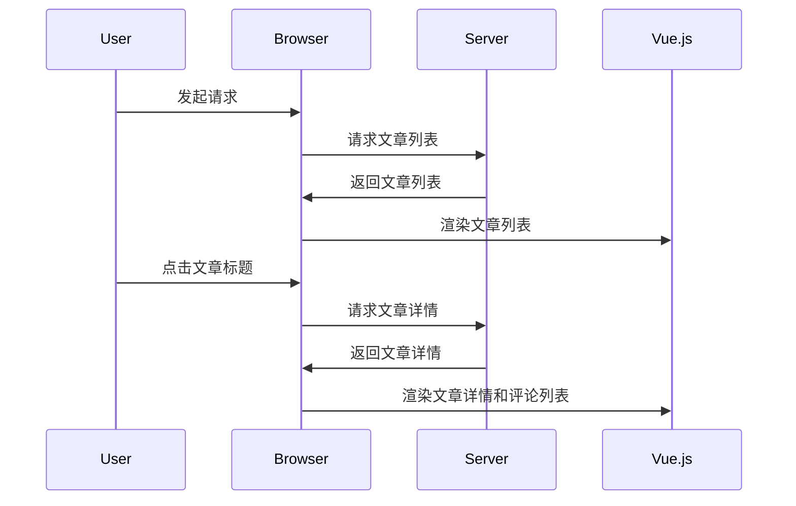
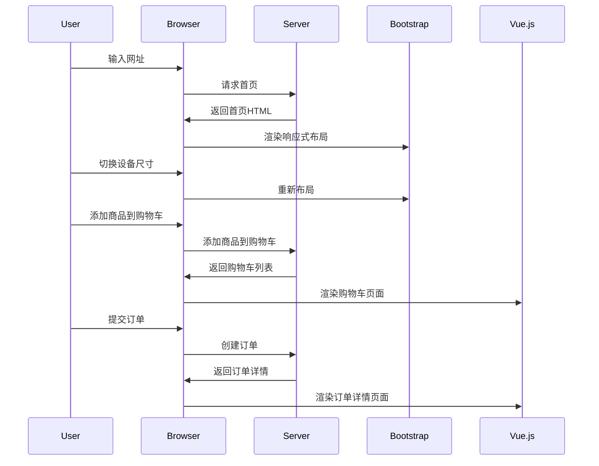
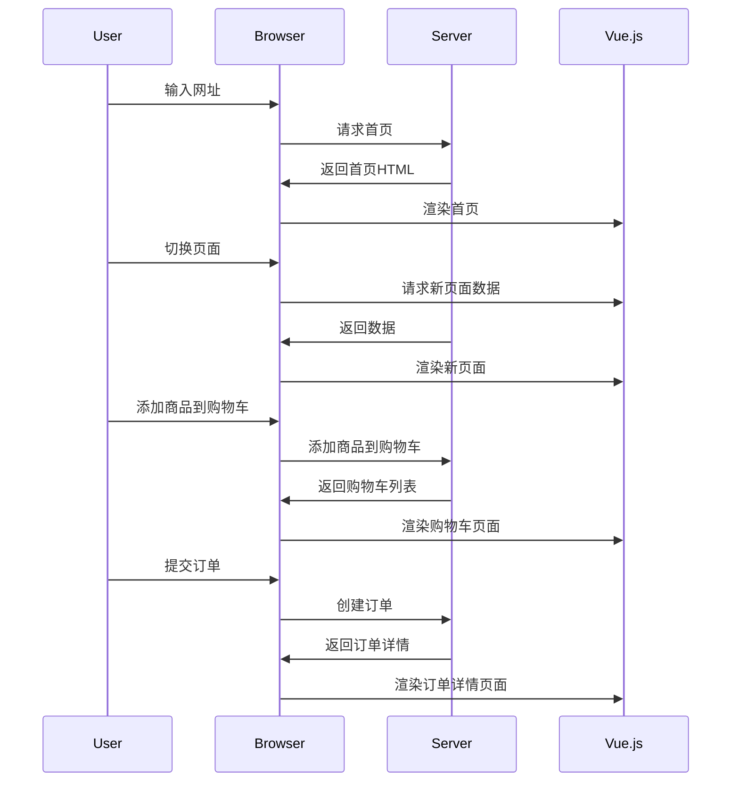

                 

# CSS架构设计与模块化

## 关键词

- **CSS架构设计**
- **模块化**
- **Web开发**
- **代码复用**
- **设计模式**
- **最佳实践**
- **性能优化**

## 摘要

本文旨在深入探讨CSS架构设计与模块化的核心概念、实践方法以及其在现代Web开发中的应用。通过逐步分析，我们将了解CSS架构设计的基本原理，模块化的重要性及其实现策略。随后，我们将探讨一些流行的CSS框架和工具，并通过实际案例展示模块化CSS的最佳实践。最后，我们将总结关键要点，并提供一些实用的技巧和拓展阅读资源。

## 目录大纲

----------------------------------------------------------------

## 第一部分: 引言

### 第1章: CSS架构设计的背景与意义

#### 1.1.1 CSS在Web设计中的作用

#### 1.1.2 CSS架构设计的必要性

#### 1.1.3 CSS架构设计的挑战与机遇

### 第2章: 模块化设计原理

#### 2.1.1 模块化的定义

#### 2.1.2 模块化的核心优势

#### 2.1.3 模块化与CSS架构设计的结合

## 第二部分: CSS架构设计与模块化实践

### 第3章: CSS架构设计基础

#### 3.1.1 CSS基础语法

#### 3.1.2 CSS选择器与优先级

#### 3.1.3 CSS继承与层叠

### 第4章: 模块化设计实践

#### 4.1.1 BEM命名法

#### 4.1.2 CSS预处理器

#### 4.1.3 PostCSS与自动前缀添加

### 第5章: CSS框架与工具

#### 5.1.1 Bootstrap

#### 5.1.2 Foundation

#### 5.1.3 Tailwind CSS

### 第6章: 案例分析

#### 6.1.1 单页面应用中的CSS模块化

#### 6.1.2响应式设计中的CSS优化

#### 6.1.3 大型项目中的CSS架构设计

### 第7章: 最佳实践与技巧

#### 7.1.1 CSS文件组织与结构优化

#### 7.1.2 性能优化策略

#### 7.1.3 维护与迭代

----------------------------------------------------------------

## 第1章: CSS架构设计的背景与意义

### 1.1.1 CSS在Web设计中的作用

CSS（层叠样式表）是Web设计的重要组成部分，它定义了网页的视觉表现，包括布局、颜色、字体和动画等。通过CSS，开发者可以轻松地将样式应用于HTML元素，从而实现一致的视觉体验。CSS的作用不仅限于美化网页，它还为Web内容提供了结构化和语义化的表现，使得网页在多种设备和屏幕尺寸上都能保持良好的显示效果。

### 1.1.2 CSS架构设计的必要性

随着Web应用的复杂性不断增加，CSS代码库也变得日益庞大。如果CSS代码缺乏良好的架构设计，可能会导致以下几个问题：

- **代码重复**：没有模块化的CSS会导致大量的重复代码，这不仅浪费了开发时间，还增加了维护成本。
- **可读性差**：复杂的CSS代码难以理解和维护，特别是当项目规模扩大时。
- **性能问题**：未优化的CSS可能会增加页面加载时间，影响用户体验。
- **响应式设计困难**：缺乏结构化的CSS使得响应式设计变得复杂，难以在不同设备上实现一致的视觉效果。

因此，CSS架构设计变得至关重要，它能够帮助开发者创建可维护、可扩展且高性能的CSS代码库。

### 1.1.3 CSS架构设计的挑战与机遇

CSS架构设计面临的主要挑战包括：

- **兼容性**：Web浏览器的兼容性问题可能导致CSS代码在不同浏览器上表现不一致。
- **开发效率**：设计良好的CSS架构需要一定的学习和适应成本，对于快速迭代的项目可能是一个挑战。
- **性能**：CSS代码的优化对性能有很大影响，需要开发者不断学习和实践性能优化技巧。

然而，这些挑战也带来了机遇：

- **代码复用**：良好的CSS架构使得代码复用成为可能，减少了开发工作量。
- **团队协作**：结构化的CSS架构有助于团队成员之间的协作，提高开发效率。
- **性能优化**：通过CSS架构设计，开发者可以更好地理解和优化CSS性能，提升用户体验。

### 1.1.4 CSS架构设计的目标

CSS架构设计的核心目标是实现以下几方面：

- **可维护性**：代码易于理解和修改，减少维护成本。
- **可扩展性**：代码库能够轻松地添加新功能和组件。
- **性能**：优化CSS加载和渲染时间，提高页面性能。
- **团队协作**：提高团队开发效率和代码质量。

在下一章中，我们将深入探讨模块化的概念与优势，以及如何在CSS架构设计中实现模块化。通过逐步分析，我们将理解模块化如何帮助开发者解决CSS代码管理中的挑战，并提升Web开发的整体效率。

## 第2章: 模块化设计原理

### 2.1.1 模块化的定义

模块化设计是一种设计方法，其核心思想是将系统划分为若干独立的、功能完整的模块。每个模块都负责特定的功能，并通过接口与其他模块进行交互。模块化设计在软件工程中被广泛采用，因为它能够提高代码的可维护性和可扩展性。

在CSS架构设计中，模块化意味着将样式代码拆分成独立的、可重用的部分。这些部分可以单独编写、测试和部署，从而实现代码的复用和灵活性。模块化设计使得CSS代码库更加模块化、结构化，便于团队协作和项目维护。

### 2.1.2 模块化的核心优势

模块化设计在CSS架构中具有以下核心优势：

- **代码复用**：模块化使得开发者可以重复使用相同的样式代码，减少冗余，提高开发效率。
- **可维护性**：模块化的CSS代码易于理解和修改，维护成本较低。
- **可扩展性**：通过增加新的模块，开发者可以轻松地扩展功能，适应项目需求变化。
- **团队协作**：模块化设计有助于团队协作，不同成员可以独立开发各自的模块，并方便地集成在一起。
- **性能优化**：模块化的CSS代码可以更好地进行性能优化，例如通过拆分文件减少HTTP请求次数。

### 2.1.3 模块化与CSS架构设计的结合

模块化与CSS架构设计的结合体现在以下几个方面：

1. **BEM命名法**：BEM（Block、Element、Modifier）是一种常用的CSS命名规范，用于实现模块化设计。它将组件拆分为块（Block）、元素（Element）和修饰符（Modifier），使得代码更具模块化和可读性。

2. **CSS预处理器**：CSS预处理器如Sass、Less等，通过引入变量、嵌套、混合等功能，使得CSS代码更加模块化和可维护。预处理器可以帮助开发者编写结构化的CSS代码，并在编译时生成标准的CSS文件。

3. **PostCSS**：PostCSS是一种现代的CSS处理器，它可以对CSS代码进行扩展和优化。PostCSS可以通过插件实现许多功能，如自动前缀添加、转换CSS语法等，从而提高CSS代码的模块化和兼容性。

4. **CSS模块**：CSS模块是一种基于HTML元素的样式封装技术，它通过`<style>`标签的`module`属性，将样式代码封装为模块。CSS模块可以防止样式冲突，并使得样式代码更加独立和可重用。

### 2.1.4 模块化设计实践

为了实现CSS模块化设计，开发者可以采取以下实践方法：

1. **使用BEM命名法**：遵循BEM命名规范，为每个模块、元素和修饰符定义清晰且一致的命名规则。

2. **编写可复用的组件**：将常用的样式代码抽象为可复用的组件，例如按钮、表单、导航栏等。

3. **使用CSS预处理器**：采用CSS预处理器，如Sass或Less，编写结构化、可维护的CSS代码。

4. **利用PostCSS插件**：使用PostCSS插件，如autoprefixer，自动添加浏览器前缀，提高CSS代码的兼容性。

5. **引入CSS模块**：使用CSS模块技术，将样式代码封装为独立的模块，减少样式冲突和依赖。

通过这些实践方法，开发者可以构建出结构清晰、易于维护和扩展的CSS代码库，从而提升Web开发的整体效率和质量。

在下一章中，我们将深入探讨CSS架构设计的基础知识，包括CSS基础语法、选择器和优先级等。通过这些基础知识，我们将为后续的模块化设计实践打下坚实的基础。

## 第3章: CSS架构设计基础

### 3.1.1 CSS基础语法

CSS（层叠样式表）是一种用于描述HTML文档样式的样式表语言。它通过选择器（Selector）指定要应用样式的HTML元素，并使用声明（Declaration）定义样式属性。CSS基础语法包括选择器、属性和值等组成部分。

#### 选择器（Selector）

选择器用于指定要应用样式的HTML元素。常见的选择器类型包括：

- **类型选择器**：如`h1`，用于选择页面中的标题元素。
- **类选择器**：如`.class-name`，用于选择具有特定类的元素。
- **ID选择器**：如`#id-name`，用于选择具有特定ID的元素。
- **属性选择器**：如`[attribute]`，用于选择具有特定属性的元素。

#### 声明（Declaration）

声明用于定义要应用于选择器的样式属性。例如：

```css
color: #333; /* 设置文本颜色为深灰色 */
font-size: 14px; /* 设置字体大小为14像素 */
```

每个声明由属性（Property）和值（Value）组成，用冒号（:）分隔。

#### 选择器与声明的组合

CSS选择器和声明通过花括号（{}）组合在一起，形成完整的样式规则。例如：

```css
h1 {
  color: #f40;
  font-size: 2em;
}
```

这行CSS代码将红色字体和2倍于基准字体大小的样式应用到所有的`<h1>`元素。

### 3.1.2 CSS选择器与优先级

CSS选择器决定了样式规则的匹配范围，而选择器优先级（Specificity）则决定了哪个样式规则会被应用到元素上。了解选择器优先级对于CSS架构设计至关重要。

#### 选择器优先级

选择器优先级由以下几个部分组成：

- **ID选择器的权重**：每个ID选择器具有100%的权重。
- **类选择器、属性选择器、伪类选择器的权重**：每个类选择器、属性选择器和伪类选择器具有10%的权重。
- **类型选择器和伪元素选择器的权重**：每个类型选择器和伪元素选择器具有1%的权重。
- **内联样式的权重**：内联样式具有最高的权重，即1000%。

#### 优先级规则

以下是一些常见的优先级规则：

1. **ID选择器比类选择器优先级高**：例如，`#id > .class` 的优先级高于 `.class`。
2. **类选择器比属性选择器优先级高**：例如，`.class > [data-type="example"]` 的优先级高于 `[data-type="example"]`。
3. **类型选择器比伪元素选择器优先级高**：例如，`div::before` 的优先级高于 `div`。
4. **内联样式优先级最高**：例如，`style="color: red"` 的优先级高于任何外部或内部样式规则。

### 3.1.3 CSS继承与层叠

CSS继承是指样式属性从父元素传递给子元素。例如，一个 `<p>` 元素会继承其父元素 `<div>` 的 `color` 属性。继承可以减少冗余代码，但并不是所有属性都支持继承。

#### CSS层叠

CSS层叠是指当多个样式规则应用于同一元素时，优先级高的规则会覆盖优先级低的规则。例如，如果一个元素同时具有内联样式和外部样式规则，则外部样式规则会被内联样式规则覆盖。

### 3.1.4 CSS基础语法实践

以下是一个简单的CSS基础语法示例：

```css
/* 类型选择器 */
p {
  color: #333; /* 设置文本颜色为深灰色 */
  font-size: 14px; /* 设置字体大小为14像素 */
}

/* 类选择器 */
.special {
  font-weight: bold; /* 设置字体粗细为粗体 */
  text-decoration: underline; /* 设置文本下划线 */
}

/* ID选择器 */
#header {
  background-color: #f40; /* 设置背景颜色为红色 */
  padding: 10px; /* 设置内边距为10像素 */
}

/* 属性选择器 */
input[type="text"] {
  border: 1px solid #ccc; /* 设置边框为1像素实线 */
  padding: 5px; /* 设置内边距为5像素 */
}

/* 伪类选择器 */
a:hover {
  color: #00f; /* 设置鼠标悬停时文本颜色为蓝色 */
}
```

在这个示例中，我们使用了多种选择器来定义不同的样式。通过这些样式规则，我们可以轻松地为HTML元素设置颜色、字体、边框等样式。

### 3.1.5 CSS基础语法与模块化的结合

在CSS模块化设计中，基础语法与模块化思想相结合，可以更好地实现样式代码的结构化和复用。以下是一些结合实践：

- **使用类选择器定义模块**：将样式代码拆分为多个类选择器，每个类选择器定义一个独立的模块。
- **继承与组合**：利用CSS继承，将通用样式定义为父模块，并通过组合实现更具体的样式。
- **CSS预处理器**：使用CSS预处理器，如Sass或Less，编写更结构化的模块化代码。

在下一章中，我们将进一步探讨模块化设计实践，包括BEM命名法、CSS预处理器和PostCSS等。通过这些实践方法，我们将深入理解如何实现模块化CSS，提升Web开发的效率和代码质量。

## 第4章: 模块化设计实践

### 4.1.1 BEM命名法

BEM（Block、Element、Modifier）是一种广泛应用的CSS命名规范，用于实现模块化和可维护的样式代码。BEM命名法通过将组件拆分为块（Block）、元素（Element）和修饰符（Modifier），使得代码结构更加清晰和模块化。

#### 块（Block）

块是组件的最基本单元，通常由一个唯一的类名表示。例如，一个按钮组件可以命名为`.button`。

```html
<button class="button">点击这里</button>
```

#### 元素（Element）

元素是块内的子组件，用于描述块的具体部分。元素类名通常以下划线 `_` 开头，并紧跟块类名。例如，按钮的文本内容可以命名为`.button__text`。

```html
<button class="button">
  <span class="button__text">点击这里</span>
</button>
```

#### 修饰符（Modifier）

修饰符用于表示组件的不同状态或样式变体。修饰符类名通常以下划线 `_` 开头，并紧跟块类名和一个短横线 `--`。例如，一个激活状态的按钮可以命名为`.button--active`。

```html
<button class="button button--active">点击这里</button>
```

#### BEM命名法实践

通过BEM命名法，我们可以为按钮组件创建以下CSS样式：

```css
.button {
  /* 基本样式 */
  padding: 10px 20px;
  background-color: #f40;
  color: #fff;
  border: none;
  cursor: pointer;
}

.button__text {
  /* 文本样式 */
  font-size: 16px;
}

.button--active {
  /* 激活状态样式 */
  background-color: #ff8c00;
}
```

#### 优点

BEM命名法具有以下优点：

- **模块化**：块、元素和修饰符的明确划分使得代码更加模块化，易于理解和维护。
- **可复用**：通过元素和修饰符的复用，可以减少冗余代码，提高开发效率。
- **可扩展**：新增或修改组件时，不会影响现有代码，提高了代码的可扩展性。

### 4.1.2 CSS预处理器

CSS预处理器是一种用于扩展CSS功能的脚本语言，它可以在编写CSS之前对样式代码进行预处理。常见的CSS预处理器包括Sass、Less和Stylus。这些预处理器提供了变量、嵌套、混合等功能，使得编写CSS代码更加结构化和模块化。

#### 变量

变量是CSS预处理器的一个核心功能，它允许开发者定义可重用的样式值。例如，可以使用变量定义颜色、字体大小等。

```scss
$primary-color: #f40;
$font-size: 14px;

.button {
  color: $primary-color;
  font-size: $font-size;
}
```

#### 嵌套

嵌套规则使得CSS代码更加类似结构化语言，例如HTML。它可以减少冗余代码，提高可读性。

```scss
.button {
  padding: 10px 20px;
  background-color: #f40;
  color: #fff;
  border: none;
  cursor: pointer;

  &__text {
    font-size: 16px;
  }

  &--active {
    background-color: #ff8c00;
  }
}
```

#### 混合（Mixin）

混合是CSS预处理器的一个强大功能，它允许开发者定义可重用的样式块。例如，可以创建一个混合，用于实现按钮的基本样式。

```scss
@mixin button-base {
  padding: 10px 20px;
  background-color: #f40;
  color: #fff;
  border: none;
  cursor: pointer;
}

.button {
  @include button-base;
  color: #333;
}

.button__text {
  @include button-base;
  font-size: 16px;
}

.button--active {
  @include button-base;
  background-color: #ff8c00;
}
```

### 4.1.3 PostCSS与自动前缀添加

PostCSS是一个现代的CSS处理器，它通过插件扩展了CSS的功能。其中，autoprefixer是一个流行的PostCSS插件，用于自动添加浏览器兼容性前缀。这使得开发者可以编写没有前缀的CSS代码，而插件会在编译时自动添加相应的浏览器前缀。

```css
.button {
  transform: scale(1);
  transition: background-color 0.3s;
}
```

编译后：

```css
.button {
  -webkit-transform: scale(1);
          transform: scale(1);
  -webkit-transition: background-color 0.3s;
          transition: background-color 0.3s;
}
```

### 4.1.4 模块化设计实践总结

通过BEM命名法、CSS预处理器和PostCSS等实践方法，开发者可以实现更加模块化和可维护的CSS代码。这些方法不仅提高了开发效率，还降低了维护成本，使得大型项目中的CSS架构设计更加高效和可扩展。

在下一章中，我们将探讨一些流行的CSS框架和工具，如Bootstrap、Foundation和Tailwind CSS。通过这些框架和工具，开发者可以更轻松地实现模块化设计和高性能的CSS架构。

## 第5章: CSS框架与工具

在现代Web开发中，CSS框架和工具为开发者提供了更高效、更灵活的样式解决方案。这些框架和工具不仅能够简化开发过程，还能够提高代码的可维护性和性能。本节将介绍一些流行的CSS框架和工具，包括Bootstrap、Foundation和Tailwind CSS。

### 5.1.1 Bootstrap

Bootstrap是一个广泛使用的开源CSS框架，它提供了丰富的预定义样式和组件，使得快速构建响应式布局变得简单。Bootstrap的核心特点是网格系统和组件库。

#### 网格系统

Bootstrap的网格系统基于12列布局，通过使用`.container`、`.row`和`.col-*`类，可以轻松创建响应式布局。例如，以下代码创建了一个包含两个等宽列的响应式布局：

```html
<div class="container">
  <div class="row">
    <div class="col-md-6">内容1</div>
    <div class="col-md-6">内容2</div>
  </div>
</div>
```

#### 组件库

Bootstrap还提供了大量可重用的UI组件，如按钮、表单、导航栏等。这些组件通过预定义的类名和HTML结构，使得开发者可以快速集成到项目中。

```html
<button type="button" class="btn btn-primary">主要按钮</button>
<input type="text" class="form-control" placeholder="输入文本">
<nav class="navbar navbar-expand-lg navbar-light bg-light">
  <!-- 导航栏内容 -->
</nav>
```

#### 优点

- **快速开发**：Bootstrap提供了大量预定义样式和组件，可以大大缩短开发时间。
- **响应式设计**：网格系统和响应式组件使得Bootstrap非常适合构建多设备兼容的网页。
- **社区支持**：Bootstrap拥有庞大的社区，提供了丰富的文档、插件和教程。

### 5.1.2 Foundation

Foundation是一个高级的响应式前端框架，它以移动优先的原则构建。Foundation提供了丰富的组件和设计模式，使得开发者可以创建美观且高性能的网页。

#### 组件

Foundation包含了许多可重用的UI组件，如导航栏、按钮、表单等。与Bootstrap相比，Foundation的组件设计更为灵活和模块化。

```html
<nav class="top-bar">
  <!-- 导航栏内容 -->
</nav>
<button class="button">按钮</button>
<input type="text" class="input-group input-group--expand">
```

#### 设计模式

Foundation提供了一系列设计模式，如灵活的布局、可调整的网格系统、按钮栏等，使得开发者可以轻松实现复杂的设计需求。

```html
<div class="row">
  <div class="small-12 medium-6 columns">内容1</div>
  <div class="small-12 medium-6 columns">内容2</div>
</div>
```

#### 优点

- **灵活性**：Foundation的设计模式提供了更大的灵活性，使得开发者可以根据具体需求定制组件。
- **移动优先**：Foundation以移动设备为中心，使得网页在移动设备上表现出色。
- **定制化**：Foundation提供了丰富的定制选项，使得开发者可以根据项目需求进行调整。

### 5.1.3 Tailwind CSS

Tailwind CSS是一个功能类优先的CSS框架，它通过使用功能类来控制样式，而不是传统的类名。Tailwind CSS的核心理念是减少CSS的重复，提高代码的可维护性和性能。

#### 功能类

Tailwind CSS使用功能类来定义样式，例如颜色、边框、间距等。通过组合不同的功能类，可以快速创建复杂的样式。

```html
<p class="text-red-500 font-bold text-lg">标题</p>
<div class="bg-gray-100 p-4 border border-gray-300 rounded">
  <!-- 内容 -->
</div>
```

#### 配置

Tailwind CSS可以通过配置文件进行自定义，例如颜色、间距、边框等。这使得开发者可以根据项目需求进行调整。

```css
/* 配置文件 */
@tailwind base;
@tailwind components;
@tailwind utilities;
```

#### 优点

- **简洁**：通过功能类，Tailwind CSS使得CSS代码更加简洁和直观。
- **可维护性**：功能类的组合使得样式代码易于理解和维护。
- **性能**：功能类优先的架构提高了CSS的解析性能，有助于优化页面加载速度。

### 5.1.4 选择合适的CSS框架与工具

在选择CSS框架与工具时，开发者应考虑以下因素：

- **项目需求**：根据项目的具体需求，选择适合的框架和工具。
- **团队技能**：考虑团队成员对框架和工具的熟悉程度。
- **社区支持**：选择社区支持广泛的框架和工具，有助于解决问题和获取帮助。
- **性能**：框架和工具的性能对页面加载速度和用户体验有很大影响。

总之，CSS框架和工具为开发者提供了丰富的选择，通过合理选择和使用，可以显著提高Web开发的效率和质量。

## 第6章: 案例分析

为了更好地理解CSS架构设计与模块化在实际项目中的应用，我们将通过几个具体案例进行分析。

### 6.1.1 单页面应用中的CSS模块化

单页面应用（SPA）因其快速响应用户交互和高性能而成为现代Web开发的主流。以下是一个SPA项目的CSS模块化案例分析。

#### 项目介绍

该项目是一个基于Vue.js的博客平台，主要功能包括文章列表、文章详情、用户评论等。

#### 系统功能设计

- **文章列表**：展示用户发布的最新文章。
- **文章详情**：展示文章内容及其评论。
- **用户评论**：用户可以发表和查看其他用户的评论。

#### 系统架构设计

- **前端**：Vue.js框架，使用Vue Router管理路由。
- **后端**：Node.js与Express.js，提供API服务。
- **CSS架构**：采用Sass作为CSS预处理器，使用BEM命名法进行模块化设计。

#### 系统接口设计

- **文章接口**：获取文章列表、获取文章详情。
- **评论接口**：发表评论、获取评论列表。

#### 系统交互设计



### 6.1.2 响应式设计中的CSS优化

响应式设计是为了确保网页在不同设备和屏幕尺寸上都能提供良好的用户体验。以下是一个电商网站案例，展示如何通过CSS模块化优化响应式设计。

#### 项目介绍

该项目是一个在线购物平台，需要支持各种设备上的良好显示效果。

#### 系统功能设计

- **产品展示**：展示不同分类的产品。
- **购物车**：用户可以添加和删除商品。
- **订单处理**：用户可以查看订单详情并支付。

#### 系统架构设计

- **前端**：采用Bootstrap框架，实现响应式布局。
- **后端**：使用Spring Boot框架，提供RESTful API。
- **CSS架构**：使用Bootstrap进行模块化设计，结合Sass进行定制化调整。

#### 系统接口设计

- **产品接口**：获取产品列表、获取产品详情。
- **购物车接口**：添加商品、删除商品、获取购物车列表。
- **订单接口**：创建订单、获取订单详情。

#### 系统交互设计



### 6.1.3 大型项目中的CSS架构设计

在大型项目中，CSS架构设计至关重要，因为它能够确保代码的可维护性和性能。以下是一个电商平台的CSS架构设计案例分析。

#### 项目介绍

该电商平台拥有多个功能模块，包括商品管理、订单管理、用户管理、支付系统等。

#### 系统功能设计

- **商品管理**：添加、编辑、删除商品信息。
- **订单管理**：创建、编辑、删除订单。
- **用户管理**：用户注册、登录、个人信息管理。
- **支付系统**：处理支付请求、生成支付链接。

#### 系统架构设计

- **前端**：采用Vue.js框架，结合Element UI组件库。
- **后端**：使用Spring Cloud框架，提供微服务架构。
- **CSS架构**：使用Tailwind CSS实现功能类优先的模块化设计。

#### 系统接口设计

- **商品接口**：获取商品列表、获取商品详情。
- **订单接口**：创建订单、获取订单详情。
- **用户接口**：用户注册、登录、获取用户信息。
- **支付接口**：处理支付请求、生成支付链接。

#### 系统交互设计



通过这些案例分析，我们可以看到CSS架构设计与模块化在实际项目中的应用，以及它们如何帮助开发者构建可维护、高性能和响应式的Web应用。

## 第7章: 最佳实践与技巧

在CSS架构设计与模块化的实际应用中，遵循最佳实践和技巧对于提高代码质量、维护性和性能至关重要。以下是一些实用的技巧和注意事项。

### 7.1.1 CSS文件组织与结构优化

- **按功能分割文件**：将CSS文件按功能模块分割，例如布局、组件、布局调整等。这有助于提高代码的可读性和可维护性。
- **利用CSS预处理器**：使用CSS预处理器，如Sass或Less，可以帮助组织代码，提高模块化程度。
- **减少CSS文件依赖**：尽量避免过度依赖外部库或框架，以减少加载时间和复杂性。

### 7.1.2 性能优化策略

- **减少HTTP请求**：通过合并CSS文件，减少HTTP请求次数，提高页面加载速度。
- **使用内容分发网络（CDN）**：利用CDN加速CSS文件的加载。
- **压缩CSS代码**：使用工具如CSSNano压缩CSS文件，减少文件大小。

### 7.1.3 维护与迭代

- **持续集成与部署**：采用持续集成和持续部署（CI/CD）流程，确保代码质量和快速迭代。
- **代码审查**：定期进行代码审查，确保代码风格一致性和质量。
- **版本管理**：使用版本控制系统（如Git），记录代码变更，便于追踪和回滚。

### 7.1.4 模块化设计最佳实践

- **遵循BEM命名法**：使用BEM命名法，将组件拆分为块、元素和修饰符，提高代码模块化和可复用性。
- **使用CSS预处理器**：采用CSS预处理器，如Sass或Less，实现变量、嵌套和混合等功能，提高代码结构性和可维护性。
- **自动化测试**：编写CSS自动化测试，确保样式在不同设备和浏览器上的一致性和正确性。

### 7.1.5 注意事项

- **避免全局样式**：尽量避免使用全局样式，以免造成样式冲突和冗余。
- **合理使用响应式设计**：合理使用媒体查询，避免过度使用响应式设计导致代码复杂度增加。
- **遵循W3C标准**：遵循W3C标准，确保CSS代码的兼容性和可维护性。

通过遵循这些最佳实践和技巧，开发者可以构建出高质量、高性能和易于维护的CSS代码库，从而提高Web开发的整体效率和质量。

## 小结

本文通过深入探讨CSS架构设计与模块化的核心概念、实践方法以及其在现代Web开发中的应用，揭示了模块化对于提升CSS代码质量、维护性和性能的重要性。从BEM命名法、CSS预处理器到流行的CSS框架，再到具体的案例分析，我们一步步了解了如何实现模块化CSS架构，并掌握了一些最佳实践和技巧。

通过本文的阅读，读者应能够：

- **理解CSS架构设计的基本原理和必要性**：了解CSS在Web设计中的作用，以及为什么需要进行架构设计。
- **掌握模块化设计的基本原理和实现策略**：理解模块化的定义、核心优势和如何在CSS中实现模块化。
- **熟悉BEM命名法、CSS预处理器和PostCSS等工具**：掌握这些工具如何提高CSS代码的结构化和可维护性。
- **了解CSS框架和工具的优势**：通过Bootstrap、Foundation和Tailwind CSS等框架，了解它们在响应式设计和模块化设计中的应用。
- **掌握实际项目中的CSS模块化实践**：通过案例分析，了解如何在实际项目中应用模块化CSS架构。

在未来的Web开发中，CSS架构设计与模块化将扮演越来越重要的角色。通过不断学习和实践，开发者可以构建出高质量、高性能和易于维护的Web应用，为用户提供卓越的体验。

## 拓展阅读

- **《CSS Secrets: Better Solutions to Everyday Web Design Problems》**：由Lea Verou撰写的这本书，提供了许多关于CSS高级技巧和最佳实践的宝贵知识。
- **《Learning Web Design: A Beginner's Guide to HTML, CSS, JavaScript, and Web Graphics》**：由Jennifer Niederst Robbins撰写的入门书籍，适合初学者了解Web设计的基础知识。
- **《CSS: The Definitive Guide》**：由Eric A. Meyer撰写的经典书籍，详细介绍了CSS的各种特性和应用。
- **《Responsive Web Design with HTML5 and CSS3》**：由Ben Frain撰写的书籍，专注于响应式Web设计，涵盖了HTML5和CSS3的最新特性。

通过阅读这些资源，读者可以进一步深化对CSS架构设计与模块化的理解，提升自己的Web开发技能。作者：AI天才研究院/AI Genius Institute & 禅与计算机程序设计艺术 /Zen And The Art of Computer Programming

