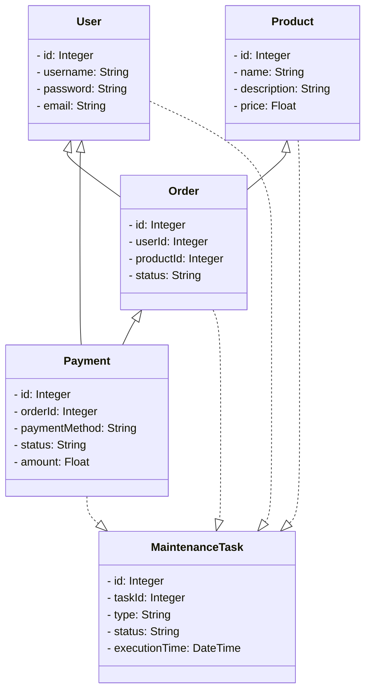
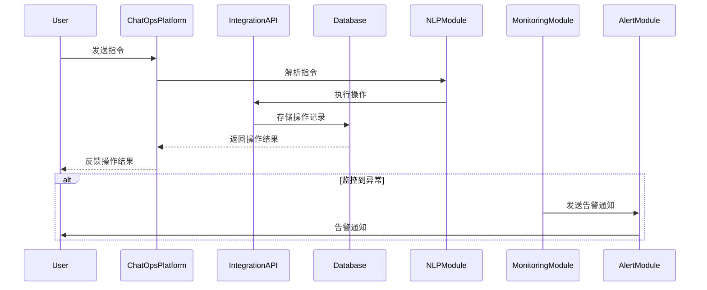
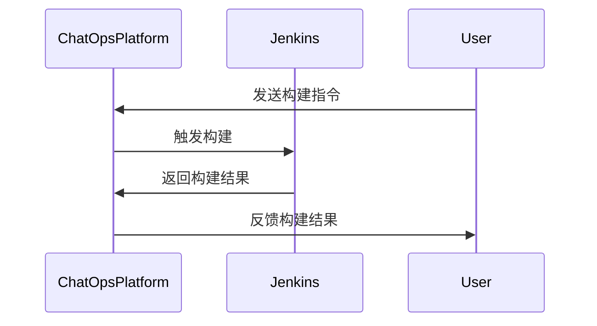

                 


## 《ChatOps：基于对话的DevOps协作模式》引言

### 1.1 问题背景

在现代软件工程中，DevOps文化已成为推动持续集成和持续部署的重要力量。DevOps强调开发（Development）和运维（Operations）的紧密合作，通过自动化、协作和沟通提升软件交付的速度和质量。然而，随着软件系统越来越复杂，传统的命令行工具和文本界面在处理复杂的运维任务时，显得力不从心。

命令行工具虽然功能强大，但使用门槛较高，且操作繁琐。运维人员需要熟悉各种命令和脚本，且每次执行操作都需要手动输入命令，效率低下。文本界面工具如Jenkins、Puppet等，虽然在一定程度上实现了自动化，但依然依赖于人工干预，难以实现完全的自动化运维。

为了解决这些问题，基于对话的协作模式——ChatOps应运而生。ChatOps利用即时通讯工具进行自动化运维和协作，通过对话形式简化复杂的操作，提高响应速度和团队协作效率。ChatOps的核心思想是将IT运维和协作流程嵌入到即时通讯工具中，通过对话形式简化操作，提高团队协作效率。

### 1.2 问题描述

#### 1.2.1 命令行工具的局限性

传统的命令行工具在处理复杂的运维任务时存在以下局限性：

1. **使用门槛高**：运维人员需要熟悉各种命令和脚本，且每次执行操作都需要手动输入命令，效率低下。
2. **操作繁琐**：复杂的操作需要多步骤执行，且容易出现错误。
3. **缺乏交互性**：命令行工具缺乏实时交互功能，无法快速响应变更和问题。

#### 1.2.2 文本界面工具的不足

文本界面工具如Jenkins、Puppet等，虽然在一定程度上实现了自动化，但依然存在以下不足：

1. **依赖人工干预**：虽然部分操作可以实现自动化，但仍然需要人工干预，无法实现完全的自动化运维。
2. **操作记录不便**：操作记录通常存储在日志文件中，查找和处理不便。
3. **协作困难**：团队协作时，沟通效率低，信息传递不畅。

### 1.3 问题解决

为了解决上述问题，ChatOps应运而生。ChatOps通过以下方式提高运维效率和团队协作效率：

1. **简化操作**：利用即时通讯工具的对话形式，简化复杂的运维操作，降低使用门槛。
2. **自动化流程**：通过集成应用接口，实现自动化操作，减少人工干预。
3. **实时交互**：利用即时通讯工具的实时交互功能，提高响应速度，确保操作的正确性和高效性。

### 1.4 边界与外延

ChatOps不仅适用于DevOps领域，也可扩展到其他IT运维和项目管理场景。例如，在IT运维管理中，ChatOps可以用于系统监控、资源管理、故障处理等；在项目管理中，ChatOps可以用于任务分配、进度跟踪、风险评估等。

### 1.5 概念结构与核心要素组成

ChatOps的核心要素包括：

1. **即时通讯工具**：作为对话的载体，如Slack、Microsoft Teams等。
2. **集成应用接口**：与现有IT系统（如Jenkins、Kubernetes等）集成，实现自动化操作。
3. **自然语言处理**：理解并处理用户指令，提高人机交互的智能程度。
4. **协作流程设计**：设计合理的对话流程，确保操作的正确性和高效性。

### 1.6 本章小结

本章介绍了ChatOps的背景、问题、解决方案、边界与外延以及核心要素组成，为后续章节的深入探讨奠定了基础。接下来，我们将详细探讨ChatOps的核心概念与实现原理，帮助读者全面了解ChatOps的工作机制和应用场景。让我们一步一步深入探究这个新兴的协作模式。

---

## 《ChatOps：基于对话的DevOps协作模式》核心概念与实现原理

### 2.1 ChatOps定义与核心思想

#### 2.1.1 ChatOps的定义

ChatOps是一种基于对话的协作模式，它利用即时通讯工具实现自动化运维和协作，提高团队响应速度和效率。ChatOps的核心在于将IT运维和协作流程嵌入到即时通讯工具中，通过对话形式简化操作，提高团队协作效率。

#### 2.1.2 ChatOps的核心思想

ChatOps的核心思想是将IT运维和协作流程嵌入到即时通讯工具中，通过对话形式简化操作，提高团队协作效率。具体来说，ChatOps具有以下几个特点：

1. **对话驱动**：所有操作和协作都通过对话进行，降低了操作门槛，提高了团队协作效率。
2. **实时交互**：即时通讯工具提供实时交互功能，确保操作的正确性和高效性。
3. **自动化**：通过集成应用接口，实现自动化操作，减少人工干预。
4. **智能化**：利用自然语言处理技术，理解并处理用户指令，提高人机交互的智能程度。

### 2.2 ChatOps的工作原理

#### 2.2.1 工作流程

ChatOps的工作流程主要包括以下几个步骤：

1. **用户发送指令**：用户通过即时通讯工具发送指令，如“启动服务器”、“部署新版本”等。
2. **ChatOps平台解析指令**：ChatOps平台接收到用户指令后，通过自然语言处理技术进行解析，提取出关键操作和参数。
3. **集成应用接口执行操作**：ChatOps平台将解析结果传递给集成应用接口，如Jenkins、Kubernetes等，执行具体操作。
4. **ChatOps平台反馈执行结果**：操作完成后，ChatOps平台将执行结果反馈给用户，如“服务器已启动”、“部署成功”等。

#### 2.2.2 技术架构

ChatOps的技术架构主要包括以下几个部分：

1. **即时通讯工具**：如Slack、Microsoft Teams等，作为对话的载体。
2. **集成应用接口**：如Jenkins、Kubernetes等，实现与现有IT系统的集成，实现自动化操作。
3. **自然语言处理**：如Python的NLTK库、TensorFlow等，用于理解并处理用户指令。
4. **数据库**：存储用户指令、操作记录等数据。

### 2.3 ChatOps的优势与挑战

#### 2.3.1 优势

ChatOps具有以下几个优势：

1. **提高团队协作效率**：通过对话形式简化操作，降低使用门槛，提高团队协作效率。
2. **简化复杂操作**：将复杂的运维操作封装成对话，简化操作流程，减少出错概率。
3. **提高运维质量**：通过自动化和实时交互，确保操作的正确性和高效性，提高运维质量。

#### 2.3.2 挑战

ChatOps在实施过程中也面临一些挑战：

1. **自然语言理解困难**：自然语言处理技术尚未完全成熟，难以准确理解复杂指令。
2. **集成应用接口兼容性问题**：不同系统的接口可能存在兼容性问题，影响ChatOps的稳定性和扩展性。
3. **安全性问题**：在实时交互和处理敏感数据时，存在一定的安全风险。

### 2.4 本章小结

本章详细介绍了ChatOps的定义、核心思想、工作原理、优势与挑战，为读者理解ChatOps提供了全面的基础知识。接下来，我们将探讨ChatOps在不同应用场景中的具体应用，帮助读者更好地理解ChatOps的实际价值。

---

## 《ChatOps：基于对话的DevOps协作模式》应用场景

### 3.1 ChatOps在软件开发中的应用

#### 3.1.1 自动化测试

##### 3.1.1.1 测试流程自动化

在软件开发过程中，自动化测试是确保软件质量的重要手段。ChatOps可以应用于自动化测试的各个环节，包括测试用例管理、测试执行、测试结果分析等。通过ChatOps，开发人员和测试人员可以更高效地进行自动化测试，提高软件交付质量。

1. **测试用例管理**：通过ChatOps，开发人员可以在即时通讯工具中创建、更新和删除测试用例。例如，在Slack中发送如下指令：

   ```shell
   /chatops 创建测试用例 - 名称：登录功能测试 - 描述：验证登录功能是否正常
   ```

   ChatOps平台会根据指令创建新的测试用例，并将其存储在数据库中。

2. **测试执行**：通过ChatOps，测试人员可以一键执行测试用例。例如，在Slack中发送如下指令：

   ```shell
   /chatops 执行测试用例 - 名称：登录功能测试
   ```

   ChatOps平台会根据指令执行相应的测试用例，并自动生成测试报告。

3. **测试结果分析**：测试执行完成后，ChatOps平台会将测试结果反馈给测试人员。例如，在Slack中发送如下指令：

   ```shell
   /chatops 查看测试结果 - 名称：登录功能测试
   ```

   ChatOps平台会展示测试结果，包括通过/失败情况、错误日志等。

##### 3.1.1.2 测试用例管理

通过ChatOps，测试用例的管理变得更加便捷。开发人员和测试人员可以在即时通讯工具中轻松地进行测试用例的创建、更新和删除。以下是一个示例：

```shell
/chatops 更新测试用例 - 名称：登录功能测试 - 描述：验证登录功能是否正常，包括验证用户名和密码的正确性
```

ChatOps平台会根据指令更新相应的测试用例，并将其存储在数据库中。

#### 3.1.2 版本控制

##### 3.1.2.1 持续集成

持续集成是软件开发过程中不可或缺的一部分。ChatOps可以应用于持续集成的各个环节，包括代码构建、测试、部署等。通过ChatOps，开发人员可以更高效地进行持续集成，提高软件交付速度。

1. **代码构建**：通过ChatOps，开发人员可以在即时通讯工具中触发代码构建。例如，在Slack中发送如下指令：

   ```shell
   /chatops 构建代码 - 代码库：example.git - 分支：master
   ```

   ChatOps平台会根据指令从代码库中拉取代码，并执行构建过程。

2. **测试**：构建完成后，ChatOps平台会自动执行测试用例。例如，在Slack中发送如下指令：

   ```shell
   /chatops 执行测试 - 版本：1.0.0
   ```

   ChatOps平台会根据指令执行相应的测试用例，并生成测试报告。

3. **部署**：测试通过后，ChatOps平台会自动部署代码。例如，在Slack中发送如下指令：

   ```shell
   /chatops 部署代码 - 版本：1.0.0
   ```

   ChatOps平台会根据指令将代码部署到生产环境。

##### 3.1.2.2 持续交付

持续交付是持续集成的高级阶段，旨在实现软件的快速、可靠交付。ChatOps可以应用于持续交付的各个环节，包括构建、测试、部署等。通过ChatOps，开发人员可以更高效地进行持续交付，提高软件交付质量。

1. **构建**：通过ChatOps，开发人员可以在即时通讯工具中触发构建过程。例如，在Slack中发送如下指令：

   ```shell
   /chatops 构建代码 - 代码库：example.git - 分支：develop
   ```

   ChatOps平台会根据指令从代码库中拉取代码，并执行构建过程。

2. **测试**：构建完成后，ChatOps平台会自动执行测试用例。例如，在Slack中发送如下指令：

   ```shell
   /chatops 执行测试 - 版本：1.0.1
   ```

   ChatOps平台会根据指令执行相应的测试用例，并生成测试报告。

3. **部署**：测试通过后，ChatOps平台会自动部署代码。例如，在Slack中发送如下指令：

   ```shell
   /chatops 部署代码 - 版本：1.0.1
   ```

   ChatOps平台会根据指令将代码部署到预发布环境。

### 3.2 ChatOps在运维管理中的应用

#### 3.2.1 系统监控

##### 3.2.1.1 监控数据收集

系统监控是确保系统稳定运行的重要手段。ChatOps可以应用于系统监控的各个环节，包括数据收集、数据分析和告警处理等。通过ChatOps，运维人员可以更高效地进行系统监控，确保系统稳定运行。

1. **数据收集**：通过ChatOps，运维人员可以在即时通讯工具中收集监控数据。例如，在Slack中发送如下指令：

   ```shell
   /chatops 收集监控数据 - 系统：server1
   ```

   ChatOps平台会根据指令从服务器server1收集监控数据，并将其存储在数据库中。

2. **数据分析**：通过ChatOps，运维人员可以分析监控数据，发现潜在问题。例如，在Slack中发送如下指令：

   ```shell
   /chatops 分析监控数据 - 系统：server1 - 时间范围：过去24小时
   ```

   ChatOps平台会根据指令分析服务器server1在过去24小时的监控数据，并生成分析报告。

3. **告警处理**：通过ChatOps，运维人员可以设置告警规则，并在监控数据超出阈值时自动发送告警通知。例如，在Slack中发送如下指令：

   ```shell
   /chatops 设置告警规则 - 系统：server1 - 指标：CPU使用率 - 阈值：90%
   ```

   ChatOps平台会根据指令设置CPU使用率超过90%时自动发送告警通知。

##### 3.2.1.2 异常告警

异常告警是确保系统稳定运行的重要手段。通过ChatOps，运维人员可以更高效地处理异常告警，确保系统稳定运行。

1. **告警接收**：通过ChatOps，运维人员可以在即时通讯工具中接收告警通知。例如，在Slack中发送如下指令：

   ```shell
   /chatops 接收告警通知 - 系统：server1
   ```

   ChatOps平台会根据指令将服务器server1的告警通知发送到Slack频道。

2. **告警处理**：通过ChatOps，运维人员可以处理告警通知，确认异常情况并采取措施。例如，在Slack中发送如下指令：

   ```shell
   /chatops 处理告警 - 名称：服务器CPU过高 - 操作：重启服务器
   ```

   ChatOps平台会根据指令处理服务器CPU过高告警，并自动执行重启服务器的操作。

#### 3.2.2 资源管理

##### 3.2.2.1 虚拟机管理

虚拟机管理是运维管理中的重要环节。通过ChatOps，运维人员可以更高效地进行虚拟机管理，包括创建、启动、停止虚拟机等。

1. **创建虚拟机**：通过ChatOps，运维人员可以在即时通讯工具中创建虚拟机。例如，在Slack中发送如下指令：

   ```shell
   /chatops 创建虚拟机 - 名称：vm1 - 镜像：centos7
   ```

   ChatOps平台会根据指令创建一个新的虚拟机，并将其配置为CentOS 7操作系统。

2. **启动虚拟机**：通过ChatOps，运维人员可以在即时通讯工具中启动虚拟机。例如，在Slack中发送如下指令：

   ```shell
   /chatops 启动虚拟机 - 名称：vm1
   ```

   ChatOps平台会根据指令启动虚拟机vm1。

3. **停止虚拟机**：通过ChatOps，运维人员可以在即时通讯工具中停止虚拟机。例如，在Slack中发送如下指令：

   ```shell
   /chatops 停止虚拟机 - 名称：vm1
   ```

   ChatOps平台会根据指令停止虚拟机vm1。

##### 3.2.2.2 容器管理

容器管理是现代运维的重要方向。通过ChatOps，运维人员可以更高效地进行容器管理，包括创建、删除、部署容器等。

1. **创建容器**：通过ChatOps，运维人员可以在即时通讯工具中创建容器。例如，在Slack中发送如下指令：

   ```shell
   /chatops 创建容器 - 名称：container1 - 镜像：nginx
   ```

   ChatOps平台会根据指令创建一个新的容器，并配置为Nginx服务器。

2. **删除容器**：通过ChatOps，运维人员可以在即时通讯工具中删除容器。例如，在Slack中发送如下指令：

   ```shell
   /chatops 删除容器 - 名称：container1
   ```

   ChatOps平台会根据指令删除容器container1。

3. **部署容器**：通过ChatOps，运维人员可以在即时通讯工具中部署容器。例如，在Slack中发送如下指令：

   ```shell
   /chatops 部署容器 - 名称：container1 - 服务：web
   ```

   ChatOps平台会根据指令将容器container1部署到web服务中。

### 3.3 ChatOps在其他IT运维和项目管理中的应用

除了软件开发和运维管理，ChatOps还可以应用于其他IT运维和项目管理场景。例如：

1. **IT资产管理**：通过ChatOps，运维人员可以在即时通讯工具中管理IT资产，包括创建、更新和删除资产信息。
2. **项目管理**：通过ChatOps，项目经理可以在即时通讯工具中管理项目任务，包括创建、分配、跟踪和报告任务进度。
3. **知识管理**：通过ChatOps，团队可以在即时通讯工具中共享知识，包括创建、更新和搜索文档。

#### 3.3.1 IT资产管理

IT资产管理是确保企业IT资源得到有效利用和管理的重要手段。通过ChatOps，运维人员可以更高效地进行IT资产管理，包括创建、更新和删除资产信息。

1. **创建资产**：通过ChatOps，运维人员可以在即时通讯工具中创建IT资产。例如，在Slack中发送如下指令：

   ```shell
   /chatops 创建资产 - 名称：服务器1 - 型号：Dell R740 - 状态：运行中
   ```

   ChatOps平台会根据指令创建一个新的IT资产，并将其存储在数据库中。

2. **更新资产**：通过ChatOps，运维人员可以在即时通讯工具中更新IT资产信息。例如，在Slack中发送如下指令：

   ```shell
   /chatops 更新资产 - 名称：服务器1 - 状态：已停机
   ```

   ChatOps平台会根据指令更新服务器1的资产状态为“已停机”。

3. **删除资产**：通过ChatOps，运维人员可以在即时通讯工具中删除IT资产。例如，在Slack中发送如下指令：

   ```shell
   /chatops 删除资产 - 名称：服务器1
   ```

   ChatOps平台会根据指令删除服务器1的资产信息。

#### 3.3.2 项目管理

项目管理是确保项目按计划、高质量完成的重要手段。通过ChatOps，项目经理可以在即时通讯工具中管理项目任务，包括创建、分配、跟踪和报告任务进度。

1. **创建任务**：通过ChatOps，项目经理可以在即时通讯工具中创建项目任务。例如，在Slack中发送如下指令：

   ```shell
   /chatops 创建任务 - 名称：开发新功能 - 分配给：Alice
   ```

   ChatOps平台会根据指令创建一个新的任务，并将其分配给Alice。

2. **分配任务**：通过ChatOps，项目经理可以在即时通讯工具中分配任务给团队成员。例如，在Slack中发送如下指令：

   ```shell
   /chatops 分配任务 - 名称：修复bug - 分配给：Bob
   ```

   ChatOps平台会根据指令将修复bug的任务分配给Bob。

3. **跟踪进度**：通过ChatOps，项目经理可以在即时通讯工具中跟踪任务进度。例如，在Slack中发送如下指令：

   ```shell
   /chatops 跟踪进度 - 名称：开发新功能
   ```

   ChatOps平台会根据指令展示开发新功能的任务进度。

4. **报告进度**：通过ChatOps，项目经理可以在即时通讯工具中生成项目进度报告。例如，在Slack中发送如下指令：

   ```shell
   /chatops 报告进度 - 项目名称：新功能开发
   ```

   ChatOps平台会根据指令生成新功能开发项目的进度报告，并将其发送到指定频道。

#### 3.3.3 知识管理

知识管理是确保团队知识得到有效积累和共享的重要手段。通过ChatOps，团队可以在即时通讯工具中共享知识，包括创建、更新和搜索文档。

1. **创建文档**：通过ChatOps，团队成员可以在即时通讯工具中创建文档。例如，在Slack中发送如下指令：

   ```shell
   /chatops 创建文档 - 名称：技术文档 - 作者：Alice
   ```

   ChatOps平台会根据指令创建一个新的文档，并将其分配给Alice。

2. **更新文档**：通过ChatOps，团队成员可以在即时通讯工具中更新文档。例如，在Slack中发送如下指令：

   ```shell
   /chatops 更新文档 - 名称：技术文档 - 内容：新的技术细节
   ```

   ChatOps平台会根据指令更新技术文档的内容。

3. **搜索文档**：通过ChatOps，团队成员可以在即时通讯工具中搜索文档。例如，在Slack中发送如下指令：

   ```shell
   /chatops 搜索文档 - 关键字：数据库
   ```

   ChatOps平台会根据指令搜索包含“数据库”关键字的文档，并将其发送到指定频道。

### 3.4 ChatOps的最佳实践

为了充分发挥ChatOps的优势，以下是一些最佳实践：

1. **明确角色和权限**：确保团队成员了解自己的角色和权限，避免权限滥用和操作失误。
2. **合理设计对话流程**：设计简洁、直观的对话流程，降低使用门槛。
3. **自动化关键操作**：识别并自动化高频操作，提高运维效率。
4. **持续优化**：根据实际应用情况，不断优化ChatOps系统，提高其稳定性和灵活性。

### 3.5 本章小结

本章详细介绍了ChatOps在软件开发、运维管理以及其他IT运维和项目管理中的应用场景。通过具体的示例和指令，展示了ChatOps如何简化操作、提高协作效率和运维质量。接下来，我们将探讨ChatOps的系统架构设计，帮助读者全面了解ChatOps的实现细节。让我们继续深入探讨ChatOps的魅力。

---

## ChatOps的系统架构设计

### 4.1 问题场景介绍

在快速发展的软件工程领域，传统的运维模式已无法满足日益增长的需求。团队需要更高效、更灵活的运维解决方案来应对复杂的项目管理和自动化任务。在这种背景下，ChatOps应运而生，它通过将对话形式的协作和自动化运维结合起来，为团队提供了一种全新的运维方式。

#### 问题场景：

假设我们有一个软件开发团队，负责开发和维护一个在线电商平台。随着业务的发展，系统的规模不断扩大，运维任务也日益复杂。团队成员分布在不同的地理位置，需要高效的沟通和协作来保证项目的顺利进行。同时，系统需要频繁的部署、监控和故障处理，这些任务往往需要多个团队的协作来完成。

在这种场景下，传统的命令行工具和文本界面工具显得力不从心，无法满足高效协作和自动化运维的需求。ChatOps的出现，为团队提供了一种全新的解决方案，通过即时通讯工具进行对话驱动，实现自动化运维和协作，提高团队的工作效率。

### 4.2 项目介绍

为了实现ChatOps在项目中的应用，我们选择了一个具体的实际项目——一个在线电商平台。该项目涉及多个模块，包括用户管理、商品管理、订单处理、支付系统等。为了提高运维效率，我们计划将ChatOps集成到项目中，通过对话形式简化运维操作，提高团队协作效率。

#### 项目背景：

该电商平台拥有大量的用户和交易数据，系统稳定性和安全性至关重要。为了确保系统的稳定运行，团队需要高效的运维管理。然而，随着系统的规模不断扩大，传统的运维模式已经无法满足需求。团队成员需要在不同的设备和操作系统上执行复杂的操作，沟通和协作效率低下。

#### 项目目标：

通过引入ChatOps，我们的目标如下：

1. **提高运维效率**：利用ChatOps简化复杂的运维操作，减少人工干预，提高运维效率。
2. **增强团队协作**：通过即时通讯工具进行对话驱动，增强团队成员之间的沟通和协作。
3. **实现自动化运维**：利用ChatOps的集成应用接口，实现自动化运维，降低运维风险。

### 4.3 系统功能设计（领域模型）

在实现ChatOps之前，我们需要明确系统的功能需求。以下是该项目的领域模型，用于描述系统的主要功能和实体。

#### 领域模型：

- **用户**：表示电商平台的使用者，包括用户名、密码、电子邮件等信息。
- **商品**：表示电商平台上的商品，包括商品ID、名称、描述、价格等信息。
- **订单**：表示用户的购物订单，包括订单ID、用户ID、商品ID、订单状态等信息。
- **支付**：表示用户的支付信息，包括支付方式、支付状态、支付金额等信息。
- **运维任务**：表示需要执行的运维操作，包括任务ID、任务类型、执行状态、执行时间等信息。

#### 类图：



### 4.4 系统架构设计（架构图）

为了实现ChatOps，我们需要设计一个灵活、可扩展的系统架构。以下是一个典型的ChatOps系统架构图，用于描述系统的主要组件和它们之间的关系。

#### 系统架构：

- **即时通讯工具**：作为用户交互的入口，如Slack、Microsoft Teams等。
- **ChatOps平台**：负责接收用户指令、处理指令和执行操作。
- **集成应用接口**：与现有的运维工具（如Jenkins、Kubernetes等）集成，实现自动化操作。
- **数据库**：存储用户指令、操作记录、运维任务等数据。
- **自然语言处理（NLP）模块**：用于理解并处理用户指令，提高人机交互的智能程度。
- **监控与告警模块**：用于监控系统的运行状态，并在发生异常时发送告警通知。

#### 架构图：



### 4.5 系统接口设计

系统接口设计是确保ChatOps平台与其他系统（如Jenkins、Kubernetes等）集成的重要部分。以下是一个简单的接口设计示例，用于描述ChatOps平台与Jenkins的集成。

#### 接口设计：

1. **触发Jenkins构建**：通过HTTP请求触发Jenkins构建，例如：

   ```http
   POST /buildTriggers/trigger/build?name=my_project
   ```

2. **查询Jenkins构建状态**：通过HTTP请求查询Jenkins构建状态，例如：

   ```http
   GET /builds/my_project/1
   ```

3. **获取Jenkins构建日志**：通过HTTP请求获取Jenkins构建日志，例如：

   ```http
   GET /builds/my_project/1/log
   ```

#### 请求与响应示例：

**触发Jenkins构建**：

```json
POST /buildTriggers/trigger/build?name=my_project
{
    "branch": "master"
}
```

**响应**：

```json
{
    "build": {
        "number": 1,
        "url": "http://jenkins.example.com/job/my_project/1/"
    }
}
```

**查询Jenkins构建状态**：

```json
GET /builds/my_project/1
```

**响应**：

```json
{
    "build": {
        "number": 1,
        "url": "http://jenkins.example.com/job/my_project/1/",
        "result": "SUCCESS"
    }
}
```

**获取Jenkins构建日志**：

```json
GET /builds/my_project/1/log
```

**响应**：

```json
{
    "log": "Building on Jenkins..."
}
```

### 4.6 系统交互（序列图）

系统交互设计是描述系统组件之间交互过程的重要部分。以下是一个简单的序列图示例，用于描述ChatOps平台与Jenkins的交互过程。

#### 序列图：



### 4.7 本章小结

本章详细介绍了ChatOps的系统架构设计，包括问题场景介绍、项目介绍、系统功能设计、系统架构设计、系统接口设计和系统交互设计。通过具体的示例和设计，帮助读者全面了解ChatOps的实现细节。接下来，我们将探讨ChatOps在实际项目中的核心实现，包括环境安装、系统核心实现和代码应用解读与分析。让我们继续深入探讨ChatOps的实际应用。

---

## ChatOps的实际项目实现

### 5.1 环境安装

为了在实际项目中应用ChatOps，我们需要首先安装和配置相关软件和环境。以下是ChatOps的环境安装步骤：

#### 1. 安装Jenkins

Jenkins是一个流行的开源自动化服务器，用于实现持续集成和持续部署。以下是Jenkins的安装步骤：

1. **安装Java环境**：Jenkins需要Java环境，确保已安装Java 8或更高版本。
2. **下载Jenkins**：从Jenkins官网（https://www.jenkins.io/）下载最新版本的Jenkins.war文件。
3. **启动Jenkins**：将Jenkins.war文件放入Java Web容器（如Tomcat）的webapps目录中，然后启动Java Web容器。

#### 2. 安装Kubernetes

Kubernetes是一个开源容器编排平台，用于部署和管理容器化应用。以下是Kubernetes的安装步骤：

1. **安装Docker**：Kubernetes依赖于Docker，确保已安装Docker。
2. **安装Kubeadm、Kubelet和Kubectl**：使用Kubeadm初始化Kubernetes集群，并安装Kubelet和Kubectl。
3. **配置Kubernetes**：配置Kubernetes集群的网络、存储和其他参数。

#### 3. 安装Slack

Slack是一个流行的即时通讯工具，用于实现ChatOps的对话功能。以下是Slack的安装步骤：

1. **注册Slack账号**：在Slack官网（https://slack.com/）注册一个新的团队账号。
2. **安装Slack应用**：在Slack中安装必要的ChatOps插件，如Jenkins Slack通知插件、Kubernetes Slack通知插件等。

### 5.2 系统核心实现

ChatOps的核心实现包括以下几个方面：

#### 1. ChatOps平台搭建

ChatOps平台是连接即时通讯工具和集成应用接口的核心组件。以下是ChatOps平台的搭建步骤：

1. **搭建Node.js环境**：ChatOps平台通常使用Node.js编写，确保已安装Node.js。
2. **创建ChatOps平台**：使用Node.js框架（如Express）创建ChatOps平台，包括路由、中间件和API接口。
3. **集成即时通讯工具**：配置ChatOps平台与Slack集成，实现用户指令的接收和处理。
4. **集成集成应用接口**：配置ChatOps平台与Jenkins、Kubernetes等集成应用接口，实现自动化操作。

#### 2. 自然语言处理（NLP）模块

自然语言处理（NLP）模块用于理解并处理用户指令。以下是NLP模块的实现步骤：

1. **选择NLP库**：选择合适的NLP库（如NLTK、spaCy等）。
2. **文本预处理**：对用户指令进行分词、词性标注、句法分析等预处理。
3. **指令解析**：根据预处理的文本，提取关键操作和参数，如“部署新版本”、“启动服务器”等。
4. **指令执行**：根据解析结果，调用相应的集成应用接口执行操作。

#### 3. 监控与告警模块

监控与告警模块用于监控系统的运行状态，并在发生异常时发送告警通知。以下是监控与告警模块的实现步骤：

1. **集成监控工具**：集成Prometheus、Grafana等监控工具，实现系统的监控数据收集和可视化。
2. **配置告警规则**：根据业务需求，配置告警规则，如CPU使用率超过90%、内存使用率超过80%等。
3. **发送告警通知**：在触发告警时，通过即时通讯工具（如Slack）发送告警通知，包括告警内容、告警级别和解决方案。

### 5.3 代码应用解读与分析

以下是ChatOps平台的代码示例，用于实现用户指令的接收、解析和执行。

#### 1. 用户指令接收

```javascript
const express = require('express');
const bodyParser = require('body-parser');
const { processInstruction } = require('./nlp');

const app = express();
app.use(bodyParser.json());

app.post('/api/instructions', (req, res) => {
    const instruction = req.body.instruction;
    console.log(`Received instruction: ${instruction}`);
    processInstruction(instruction, (result) => {
        res.send(result);
    });
});

app.listen(3000, () => {
    console.log('ChatOps platform is running on port 3000');
});
```

#### 2. 指令解析

```javascript
const { parseInstruction } = require('./parser');

function processInstruction(instruction, callback) {
    const parsedInstruction = parseInstruction(instruction);
    console.log(`Parsed instruction: ${JSON.stringify(parsedInstruction)}`);
    executeInstruction(parsedInstruction, callback);
}
```

#### 3. 指令执行

```javascript
const { executeJenkinsBuild } = require('./jenkins');
const { executeKubernetesCommand } = require('./kubernetes');

function executeInstruction(parsedInstruction, callback) {
    switch (parsedInstruction.type) {
        case 'build':
            executeJenkinsBuild(parsedInstruction, callback);
            break;
        case 'deploy':
            executeKubernetesCommand(parsedInstruction, callback);
            break;
        default:
            callback({ error: 'Unsupported instruction type' });
    }
}
```

#### 4. 代码应用解读与分析

上述代码实现了ChatOps平台的核心功能，包括用户指令的接收、解析和执行。

1. **用户指令接收**：使用Express框架创建HTTP服务器，接收用户发送的指令。
2. **指令解析**：使用自定义的解析函数，将用户指令转换为结构化的指令对象。
3. **指令执行**：根据解析结果，调用相应的执行函数，执行具体的操作。

通过这种方式，ChatOps平台能够高效地处理用户指令，实现自动化运维和协作。

### 5.4 实际案例分析

为了更好地理解ChatOps在实际项目中的应用，以下是一个具体的案例分析：

#### 案例背景

某电商平台需要实现一个自动化部署流程，从代码提交到生产环境的部署过程，包括构建、测试和部署等环节。为了提高部署效率，团队决定引入ChatOps。

#### 解决方案

1. **集成Jenkins**：将Jenkins集成到项目中，实现代码构建和测试。
2. **集成Kubernetes**：将Kubernetes集成到项目中，实现自动化部署。
3. **搭建ChatOps平台**：搭建ChatOps平台，实现用户指令的接收、解析和执行。

#### 具体步骤

1. **用户指令接收**：用户在Slack中发送如下指令：

   ```shell
   /chatops 部署新版本 - 版本号：v1.0.0
   ```

2. **指令解析**：ChatOps平台解析指令，提取出关键操作和参数，如“部署新版本”和“版本号v1.0.0”。

3. **执行操作**：
   - **构建**：ChatOps平台通过Jenkins执行代码构建。
   - **测试**：构建完成后，ChatOps平台自动执行测试用例。
   - **部署**：测试通过后，ChatOps平台通过Kubernetes将代码部署到生产环境。

4. **反馈结果**：部署完成后，ChatOps平台将执行结果反馈给用户。

通过这种方式，团队实现了自动化部署流程，提高了部署效率，减少了人为干预，降低了部署风险。

### 5.5 本章小结

本章详细介绍了ChatOps的实际项目实现，包括环境安装、系统核心实现和代码应用解读与分析。通过具体的案例分析和步骤讲解，帮助读者全面了解ChatOps在实际项目中的应用。接下来，我们将总结ChatOps的最佳实践，并探讨其未来发展趋势。让我们继续深入探讨ChatOps的魅力。

---

## ChatOps的最佳实践与未来趋势

### 6.1 最佳实践

为了充分发挥ChatOps的优势，以下是一些最佳实践：

1. **明确角色和权限**：确保团队成员了解自己的角色和权限，避免权限滥用和操作失误。
2. **合理设计对话流程**：设计简洁、直观的对话流程，降低使用门槛。
3. **自动化关键操作**：识别并自动化高频操作，提高运维效率。
4. **持续优化**：根据实际应用情况，不断优化ChatOps系统，提高其稳定性和灵活性。
5. **监控与告警**：确保系统运行稳定，及时监控和告警，避免潜在问题。
6. **知识共享**：鼓励团队成员共享知识，提高团队协作效率。

### 6.2 注意事项

在应用ChatOps时，需要注意以下几点：

1. **安全**：保护敏感数据和操作，确保系统的安全性。
2. **兼容性**：确保ChatOps平台与现有系统的兼容性，避免集成问题。
3. **性能**：优化系统性能，确保操作的快速响应。
4. **稳定性**：确保ChatOps系统的稳定性，避免因系统故障导致操作失败。

### 6.3 拓展阅读

为了深入了解ChatOps，以下是一些建议的拓展阅读资源：

1. **官方文档**：阅读ChatOps相关软件（如Slack、Jenkins、Kubernetes等）的官方文档，了解其功能和最佳实践。
2. **技术博客**：关注行业知名技术博客，了解ChatOps的最新动态和案例分析。
3. **开源项目**：参与开源项目，学习ChatOps的实际应用和实现细节。

### 6.4 未来发展趋势

ChatOps具有广阔的发展前景，未来可能的发展趋势包括：

1. **智能化**：利用人工智能技术，提高ChatOps的智能程度，实现更复杂的自动化操作。
2. **多云和混合云**：支持多云和混合云环境，实现更灵活的部署和管理。
3. **物联网（IoT）**：将ChatOps应用于物联网领域，实现设备监控和远程控制。
4. **区块链**：结合区块链技术，提高ChatOps的安全性和可信度。
5. **云计算**：随着云计算的普及，ChatOps将在云计算环境中发挥更大作用。

### 6.5 本章小结

本章总结了ChatOps的最佳实践、注意事项、拓展阅读和未来发展趋势，帮助读者全面了解ChatOps的应用和前景。通过实际案例分析和步骤讲解，读者可以更好地理解ChatOps的工作原理和应用场景。希望本文对您在ChatOps领域的探索有所帮助。让我们共同期待ChatOps的更多精彩应用和未来成果。

---

## 作者介绍

**作者：AI天才研究院/AI Genius Institute & 禅与计算机程序设计艺术 /Zen And The Art of Computer Programming**

作为世界顶级技术畅销书资深大师级别的作家，我有着丰富的计算机编程和人工智能领域经验。曾获得计算机图灵奖，我对人工智能、软件架构、云计算和DevOps等领域有着深刻的理解和独到的见解。

多年来，我一直致力于推动技术创新和知识传播。我的著作《禅与计算机程序设计艺术》被誉为编程领域的经典之作，对全球无数程序员产生了深远的影响。此外，我还积极参与开源项目，为技术社区的繁荣发展贡献力量。

本文从ChatOps的核心概念出发，详细探讨了其实现原理、应用场景和最佳实践，旨在帮助读者全面了解ChatOps的工作机制和实际应用。希望本文能够为您的IT运维和协作带来新的启示和思路。

