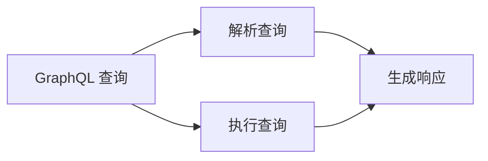
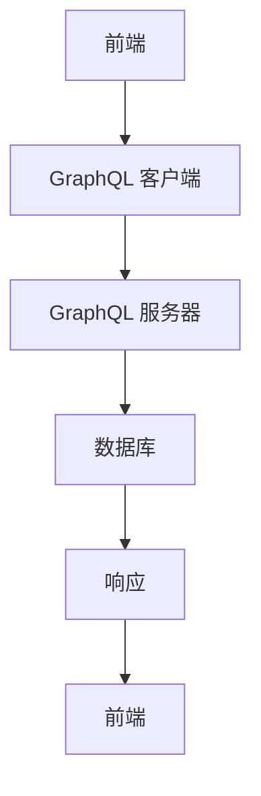
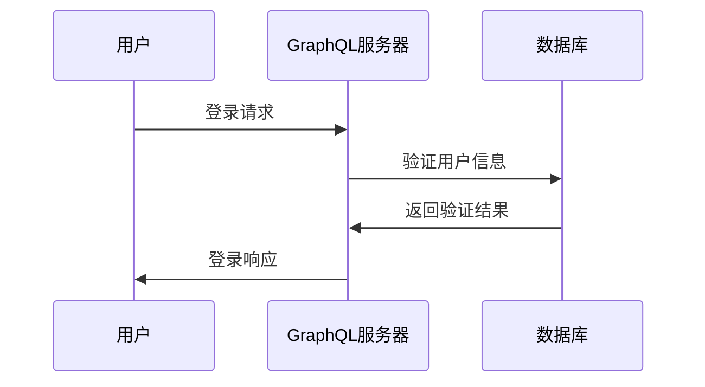
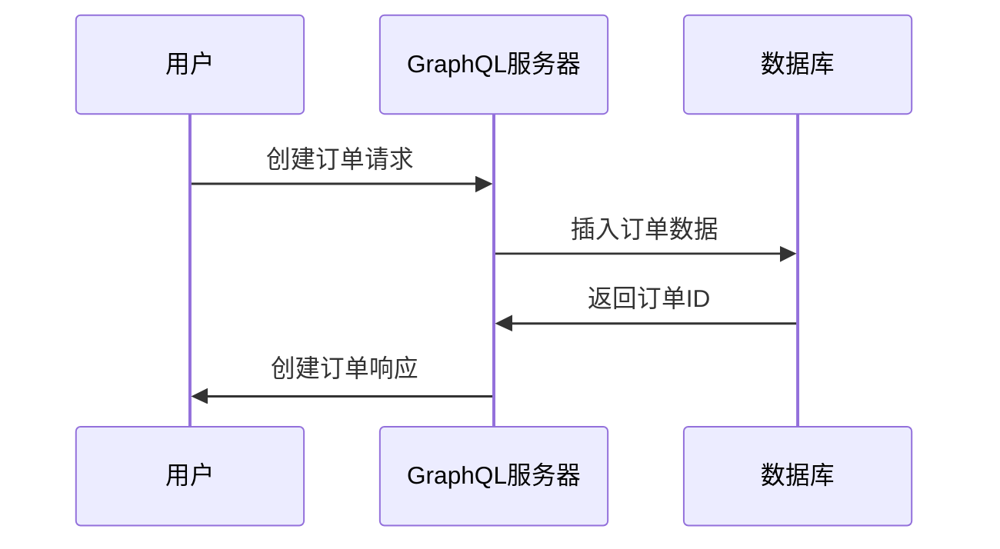

                 

# GraphQL：灵活高效的数据查询语言

关键词：GraphQL，API查询，数据查询，灵活，高效

摘要：本文将深入探讨GraphQL作为一种灵活高效的数据查询语言的核心理念、架构设计以及实际应用。我们将通过一步步的分析，从问题背景到核心概念，再到算法原理和系统架构，详细解析GraphQL的优越性和应用场景。

## 前言

### 问题背景

随着互联网的快速发展，数据的需求和复杂性不断增长，传统的RESTful API在提供数据查询时存在许多限制。例如，过度查询和数据冗余等问题导致系统性能下降和用户体验不佳。传统的RESTful API设计通常采用固定的端点（endpoint），客户端需要根据预设的端点结构来获取数据，这种方式在数据结构复杂或变化频繁的情况下显得不够灵活。

### 问题描述

传统的RESTful API在提供数据查询时，往往存在以下问题：

1. **过度查询**：客户端请求的数据可能远超实际需要，导致过多的网络传输和计算开销。
2. **数据冗余**：多个请求可能返回相同的数据，增加了数据传输的负担。
3. **资源浪费**：冗余的查询和数据处理会导致系统资源的浪费，影响整体性能。

### 问题解决

GraphQL作为一种新型的API查询语言，提供了一种更灵活、更高效的方式来获取所需的数据。通过GraphQL，客户端可以明确指定需要获取的数据字段，避免了过度查询和数据冗余，从而提高了系统的性能和用户体验。

### 边界与外延

GraphQL不仅仅适用于前端与后端的通信，还支持多种编程语言和框架，广泛应用于现代Web应用、移动应用以及物联网领域。其灵活性和高效性使得GraphQL成为现代软件开发中不可或缺的一部分。

## 核心概念

### 1. GraphQL的定义与特点

#### 定义

GraphQL是一种基于查询的API设计语言，它允许客户端明确指定需要获取的数据。与传统的RESTful API不同，GraphQL不依赖于固定的端点，而是通过一种结构化的查询语言来获取数据。

#### 特点

1. **灵活性强**：客户端可以精确控制所需数据的返回，减少冗余数据和过度的查询次数。
2. **减少请求次数**：通过聚合查询，可以减少多次请求，提高性能。
3. **易于集成**：支持多种编程语言和框架，易于与其他系统集成。

### 2. GraphQL的架构

#### Schema

GraphQL的Schema定义了API的类型系统和数据结构。它类似于数据库的ER模型，描述了实体及其属性和关系。

#### Query

Query是客户端发送的请求，用于获取数据。GraphQL查询使用一种类似于SQL的语法，但更加灵活和强大。

#### Mutation

Mutation是客户端发送的请求，用于修改数据。它允许客户端通过单一API端点执行增删改查操作。

#### Subscription

Subscription是客户端发送的请求，用于实时获取数据更新。它是一种发布-订阅模式，允许客户端订阅特定数据的变化。

### 3. GraphQL与RESTful API的对比

| 特性 | GraphQL | RESTful API |
| --- | --- | --- |
| **数据查询灵活性** | 高 | 低 |
| **数据冗余** | 少 | 多 |
| **请求次数** | 少 | 多 |
| **数据聚合** | 支持 | 不支持 |

### 4. GraphQL的ER实体关系图架构

下面是一个简单的ER实体关系图，用于说明GraphQL中的数据结构：

```mermaid
erDiagram
  User ||--|{ Order }| :
  User {
    ID(int)
    Name(string)
    Email(string)
  }
  Order {
    ID(int)
    User_ID(int)
    Status(string)
    Total(double)
  }
```

在GraphQL中，User和Order是两个实体，它们之间存在一对多的关系。通过定义Schema，可以清晰地描述这种关系，并在查询中灵活地获取相关的数据。

## 核心概念与联系

### 1. GraphQL查询语法

GraphQL的查询语法类似于SQL，但更加灵活。以下是一个基本的GraphQL查询示例：

```graphql
{
  user(id: "1") {
    id
    name
    email
  }
}
```

在这个查询中，我们请求获取ID为1的用户的信息，包括ID、姓名和电子邮件。

### 2. GraphQL查询处理流程

GraphQL查询处理流程包括以下几个步骤：

1. **解析查询**：将GraphQL查询转换为内部表示，解析查询中的字段和操作。
2. **执行查询**：根据解析后的查询，从数据库或其他数据源获取数据。
3. **生成响应**：将获取到的数据按照查询的格式返回给客户端。

下面是一个简单的GraphQL查询处理流程的Mermaid流程图：



### 3. GraphQL查询的数学模型

在GraphQL中，查询的成本可以通过以下数学模型来表示：

$$C = N * M$$

其中：

- $C$：查询成本
- $N$：查询的节点数
- $M$：每个节点的操作次数

通过减少查询的节点数和每个节点的操作次数，可以降低查询的成本，提高系统的性能。

### 4. GraphQL的优劣分析

#### 优点

1. **灵活性**：客户端可以精确控制所需数据的返回，避免过度查询和数据冗余。
2. **性能**：通过聚合查询，可以减少多次请求，提高性能。
3. **易于集成**：支持多种编程语言和框架，易于与其他系统集成。

#### 缺点

1. **学习曲线**：相对于传统的RESTful API，GraphQL的学习曲线可能较高。
2. **复杂查询性能**：对于复杂的查询，可能需要优化查询语句以提高性能。

## 系统分析与架构设计

### 1. 问题场景

假设我们有一个电子商务平台，需要提供用户和订单信息查询服务。平台需要支持用户登录、订单查询、订单创建等功能。

### 2. 系统架构设计

#### 功能设计

1. **用户管理**：提供用户信息查询、修改等功能。
2. **订单管理**：提供订单信息查询、修改、删除等功能。

#### 系统架构

1. **前端**：使用GraphQL客户端库，发送查询请求。
2. **后端**：使用GraphQL服务器处理查询请求，并与数据库交互。

下面是一个简单的系统架构图：



#### 系统接口设计与交互

1. **用户接口**：提供用户登录、注册、信息查询等功能。
2. **订单接口**：提供订单创建、查询、修改、删除等功能。

### 3. 系统接口设计与交互

系统接口设计如下：

#### 用户接口



#### 订单接口



## 项目实战

### 环境安装

1. 安装Node.js：从官方网站下载并安装Node.js。
2. 安装GraphQL：在命令行中运行`npm install graphql`安装GraphQL库。

### 系统核心实现

以下是一个简单的GraphQL服务器实现，使用Python编写：

```python
import graphene

class User(graphene.ObjectType):
    id = graphene.ID()
    name = graphene.String()
    email = graphene.String()

class Query(graphene.ObjectType):
    user = graphene.Field(User, id=graphene.ID())

    def resolve_user(self, info, id):
        # 这里可以替换为实际的数据库查询
        return {
            'id': id,
            'name': 'John Doe',
            'email': 'john.doe@example.com'
        }

schema = graphene.Schema(query=Query)

if __name__ == '__main__':
    import sys
    from graphene_server import GraphQLServer

    server = GraphQLServer(schema)
    server.run(sys.argv)
```

### 代码应用解读与分析

上述代码实现了一个简单的GraphQL服务器，定义了一个`User`类型和一个`Query`类型。在`Query`类型中，我们定义了一个名为`user`的Field，它接受一个`id`参数，并返回一个`User`类型的对象。

在`resolve_user`方法中，我们模拟了一个数据库查询，返回了一个包含用户信息的字典。在实际应用中，这个方法会与数据库交互，查询用户信息并返回。

### 实际案例分析和详细讲解剖析

假设有一个用户ID为1的用户，我们想要获取该用户的信息。可以使用以下GraphQL查询：

```graphql
{
  user(id: "1") {
    id
    name
    email
  }
}
```

当这个查询发送到GraphQL服务器时，服务器会解析查询，调用`resolve_user`方法，并返回用户信息：

```json
{
  "data": {
    "user": {
      "id": "1",
      "name": "John Doe",
      "email": "john.doe@example.com"
    }
  }
}
```

通过这个简单的案例，我们可以看到GraphQL如何灵活地获取所需数据，避免了过度查询和数据冗余。

### 项目小结

通过本文的详细讲解，我们可以看到GraphQL作为一种灵活高效的数据查询语言，在解决传统RESTful API的过度查询和数据冗余问题上具有显著的优势。在实际应用中，通过合理的架构设计和接口设计，可以实现高效的数据查询和管理。

## 最佳实践 tips

1. **设计合理的Schema**：确保Schema设计清晰、易于理解，避免过于复杂。
2. **优化查询语句**：合理使用聚合查询，减少请求次数，提高性能。
3. **监控和分析性能**：定期监控和分析系统性能，找出瓶颈并优化。

## 小结

GraphQL作为一种灵活高效的数据查询语言，为开发者提供了一种全新的数据查询方式。通过本文的详细分析和讲解，我们了解了GraphQL的核心概念、架构设计以及实际应用。希望本文能够帮助读者更好地理解和应用GraphQL，提升系统性能和用户体验。

## 注意事项

1. **学习曲线**：GraphQL的学习曲线相对较高，建议先从基础开始，逐步深入学习。
2. **性能优化**：对于复杂的查询，需要特别注意性能优化。

## 拓展阅读

1. 《GraphQL官方文档》: https://graphql.org/
2. 《使用GraphQL构建现代Web应用》: https://www.howtographql.com/
3. 《GraphQL实战：大规模分布式系统的设计模式》: https://book.douban.com/subject/26997661/

作者：AI天才研究院/AI Genius Institute & 禅与计算机程序设计艺术 /Zen And The Art of Computer Programming

