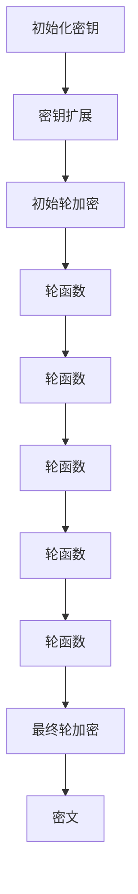
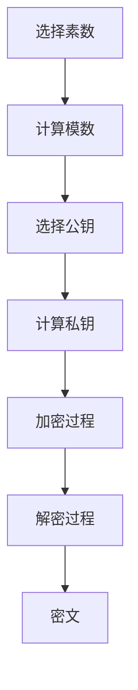
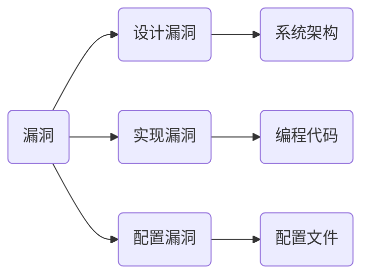

                 

### 《5G安全：新一代移动网络的安全考量》

#### 关键词：5G网络、安全考量、加密技术、认证机制、DDoS攻击、漏洞管理

> 摘要：随着5G技术的快速普及，其高速率和低延迟的特性使得移动网络的应用场景越来越广泛，但同时也带来了新的安全挑战。本文将深入探讨5G网络的安全考量，分析其核心技术、安全架构以及面临的威胁，旨在为5G网络的安全防护提供理论指导和实践建议。

---

#### 第一部分: 5G安全基础

##### 第1章: 5G网络概述

###### 1.1 5G网络的核心特点

5G网络作为下一代移动通信技术，其核心特点主要体现在以下几个方面：

- **高速度**：5G网络的峰值速率可达10Gbps，相比4G网络提升了数十倍，能够满足高清视频流、虚拟现实等高带宽需求。
- **低延迟**：5G网络的端到端延迟可低至1ms，显著提高了实时应用（如自动驾驶、远程医疗）的响应速度。
- **高容量**：5G网络支持每平方公里连接数达到100万，大幅提升了网络容量，适合人群密集场景。
- **广覆盖**：5G网络采用新的频段和波束成形技术，实现了更广泛的覆盖。

###### 1.2 5G网络的关键技术

5G网络的关键技术主要包括：

- **毫米波通信**：使用高频段（24GHz以上）进行通信，提供了更高的带宽，但传播距离较短。
- **多连接技术**：支持设备之间直接通信，降低了网络延迟和功耗。
- **网络切片技术**：将网络资源按需分配，提供定制化的网络服务。

###### 1.3 5G网络的安全挑战

5G网络在带来巨大便利的同时，也带来了新的安全挑战：

- **网络架构复杂性**：5G网络的架构更加复杂，增加了安全风险。
- **高频段通信安全**：高频段通信存在信号泄露风险，需要更强的加密技术。
- **设备安全性**：物联网设备的激增带来了更多潜在的安全威胁。
- **网络攻击多样化**：5G网络面临DDoS攻击、中间人攻击等多样化的攻击。

---

##### 第2章: 5G网络架构与协议安全

###### 2.1 5G网络架构

5G网络架构主要包括以下层级：

- **无线接入网**：负责无线通信，包括基站、用户设备等。
- **传输网**：负责数据传输，包括光纤、无线等传输手段。
- **核心网**：负责数据路由、用户认证等功能。

###### 2.2 5G网络协议

5G网络采用以下关键协议：

- **NR（新无线电）**：5G的无线接入协议。
- **NG-RAN（下一代无线接入网络）**：负责无线接入网的控制和用户数据传输。
- **5GC（5G核心网）**：负责核心网的数据处理和用户认证。

###### 2.3 5G网络架构的安全性考量

5G网络架构的安全性考量主要包括：

- **端到端加密**：确保数据在传输过程中的安全性。
- **用户认证与授权**：确保用户身份的真实性和合法性。
- **网络隔离**：通过网络隔离技术防止不同用户之间的数据泄露。

---

#### 第二部分: 5G网络安全技术

##### 第3章: 加密与认证技术

###### 3.1 加密算法

5G网络使用的加密算法主要包括：

- **AES（高级加密标准）**：对称加密算法，提供快速的数据加密。
- **RSA（Rivest-Shamir-Adleman）**：非对称加密算法，用于安全传输密钥。

###### 3.2 认证机制

5G网络的认证机制主要包括：

- **SIM卡认证**：用户通过SIM卡进行身份验证。
- **网络接入认证**：确保用户只能访问授权的网络资源。

###### 3.3 加密与认证在5G网络中的应用

加密与认证技术在5G网络中的应用包括：

- **无线通信加密**：确保无线通信过程中的数据安全。
- **网络访问控制**：通过认证机制控制用户的网络访问权限。

---

##### 第4章: 身份与访问管理

###### 4.1 身份管理

身份管理主要包括以下几个方面：

- **用户身份验证**：确保用户身份的真实性。
- **用户权限分配**：根据用户身份赋予不同的权限。

###### 4.2 访问控制

访问控制主要包括：

- **基于角色的访问控制**：根据用户角色限制访问权限。
- **访问控制列表**：定义用户对资源的访问权限。

###### 4.3 身份与访问管理策略

身份与访问管理策略包括：

- **多因素认证**：增加用户身份验证的强度。
- **动态访问控制**：根据用户行为和环境动态调整访问权限。

---

#### 第三部分: 5G网络威胁分析

##### 第5章: DDoS攻击与防御

###### 5.1 DDoS攻击原理

DDoS攻击的原理主要包括：

- **流量洪泛**：通过大量无效流量淹没目标网络。
- **资源耗尽**：通过大量请求耗尽目标服务器资源。

###### 5.2 DDoS攻击类型

DDoS攻击类型包括：

- **反射型DDoS攻击**：利用第三方服务器响应请求。
- **应用层DDoS攻击**：直接攻击网络应用。

###### 5.3 DDoS防御策略

DDoS防御策略包括：

- **流量过滤**：通过防火墙或流量分析设备过滤恶意流量。
- **流量清洗**：在攻击流量到达目标网络之前对其进行清洗。

---

##### 第6章: 漏洞与安全漏洞管理

###### 6.1 漏洞的类型

漏洞的类型包括：

- **设计漏洞**：由网络设计缺陷引起。
- **实现漏洞**：由编程错误或配置错误引起。

###### 6.2 漏洞评估与披露

漏洞评估与披露包括：

- **漏洞评估**：对漏洞的严重程度和影响进行评估。
- **漏洞披露**：通过安全研究人员或漏洞赏金计划进行漏洞披露。

###### 6.3 安全漏洞管理流程

安全漏洞管理流程包括：

- **漏洞接收与分类**：接收漏洞报告并对其进行分类。
- **漏洞修复与验证**：修复漏洞并验证修复效果。
- **漏洞通报与补救**：对受影响的用户进行通报和补救措施。

---

#### 第四部分: 5G安全实战案例

##### 第7章: 5G网络安全测试与评估

###### 7.1 安全测试方法

安全测试方法包括：

- **渗透测试**：模拟攻击者的攻击行为。
- **漏洞扫描**：自动扫描网络中的漏洞。

###### 7.2 安全评估工具

安全评估工具包括：

- **Nessus**：用于漏洞扫描。
- **Metasploit**：用于渗透测试。

###### 7.3 5G网络安全测试案例

5G网络安全测试案例包括：

- **毫米波通信安全测试**：测试毫米波通信的加密强度。
- **网络切片安全性测试**：测试不同网络切片之间的隔离性。

---

##### 第8章: 5G网络安全防护策略

###### 8.1 网络安全架构设计

网络安全架构设计包括：

- **安全区域划分**：根据网络资源划分安全区域。
- **防火墙与加密**：在关键节点部署防火墙和加密设备。

###### 8.2 防火墙与入侵检测系统

防火墙与入侵检测系统包括：

- **防火墙**：用于过滤网络流量。
- **入侵检测系统**：用于检测和响应入侵行为。

###### 8.3 网络安全防护策略案例分析

网络安全防护策略案例分析包括：

- **案例一**：分析5G网络的DDoS防护策略。
- **案例二**：分析5G网络的加密通信策略。

---

### 附录

#### 附录A: 5G安全相关标准与法规

5G安全相关标准与法规包括：

- **3GPP标准**：规定了5G网络的安全要求。
- **国家网络安全法**：规定了网络运营者的安全责任。

---

# 作者

作者：AI天才研究院/AI Genius Institute & 禅与计算机程序设计艺术 /Zen And The Art of Computer Programming

---

本文旨在全面探讨5G网络的安全考量，从基础概述到核心技术，再到威胁分析和防护策略，每个部分都进行了详细的阐述。通过本文，读者可以对5G网络的安全问题有更深入的理解，并为实际应用中的安全防护提供参考。

---

在接下来的部分，我们将进一步深入探讨5G网络的安全技术，包括加密与认证技术、身份与访问管理，以及针对DDoS攻击和漏洞管理的详细策略。同时，通过实际案例分析和安全测试与评估，我们将展示如何将理论知识应用到实际场景中。

---

# 加密与认证技术

在5G网络中，加密与认证技术是保障数据安全和用户身份验证的关键。加密技术用于保护数据的机密性，确保数据在传输过程中不会被窃听或篡改。认证技术则用于确认用户身份，确保只有授权用户才能访问网络资源和数据。

## 3.1 加密算法

5G网络中常用的加密算法包括对称加密算法和非对称加密算法。

### 对称加密算法

对称加密算法使用相同的密钥对数据进行加密和解密。其中，高级加密标准（AES）是5G网络中广泛使用的对称加密算法。

#### AES算法原理

AES算法的工作原理如下：

1. **密钥扩展**：根据用户输入的密钥生成一系列子密钥。
2. **初始轮加密**：对明文进行初始变换。
3. **轮函数**：对每个轮进行固定的操作，包括字节替换、行移位、列混淆和轮密钥加。
4. **最终轮加密**：进行最后一轮的加密操作。

#### AES算法流程

### 非对称加密算法

非对称加密算法使用一对密钥，一个用于加密，一个用于解密。Rivest-Shamir-Adleman（RSA）是5G网络中广泛使用的非对称加密算法。

#### RSA算法原理

RSA算法的工作原理如下：

1. **密钥生成**：选择两个大素数，计算它们的乘积作为模数，再选择一个与模数互质的数作为公钥。
2. **加密过程**：使用公钥和模数对明文进行加密。
3. **解密过程**：使用私钥和模数对密文进行解密。

#### RSA算法流程

## 3.2 认证机制

5G网络中的认证机制主要包括SIM卡认证和网络接入认证。

### SIM卡认证

SIM卡认证是一种基于用户身份的认证机制，用户通过插入SIM卡进行身份验证。认证过程包括以下步骤：

1. **用户请求接入**：用户设备向网络发起接入请求。
2. **网络响应**：网络返回一个随机数，用于后续的认证过程。
3. **用户设备响应**：用户设备使用SIM卡中的密钥对随机数进行加密，并返回加密结果。
4. **网络验证**：网络使用SIM卡中的密钥对加密结果进行解密，验证用户身份。

### 网络接入认证

网络接入认证用于确保用户只能访问授权的网络资源。认证过程包括以下步骤：

1. **用户请求服务**：用户设备向网络请求服务。
2. **网络响应**：网络返回一个访问控制列表，列出用户可访问的服务。
3. **用户设备验证**：用户设备根据访问控制列表验证请求的服务是否被授权。
4. **网络执行服务**：如果服务被授权，网络执行用户请求的服务。

## 3.3 加密与认证在5G网络中的应用

加密与认证技术在5G网络中的应用包括以下几个方面：

1. **无线通信加密**：在无线通信过程中，数据使用AES算法进行加密，确保数据在传输过程中的安全性。
2. **网络访问控制**：通过SIM卡认证和网络接入认证机制，确保用户身份的真实性和合法性。
3. **用户数据保护**：用户数据在网络传输过程中使用AES和RSA算法进行双重加密，提高数据安全性。
4. **网络安全监控**：通过加密和认证技术，网络可以实时监控数据传输情况，及时发现和响应潜在的安全威胁。

通过加密与认证技术，5G网络能够有效保护用户数据的安全，防止数据泄露和未经授权的访问。同时，认证机制能够确保网络资源的合理分配，提高网络服务的可用性和可靠性。

---

# 身份与访问管理

在5G网络中，身份与访问管理（Identity and Access Management，IAM）是确保网络安全性和数据保密性的关键组成部分。IAM涉及用户身份验证、授权和访问控制，通过这些机制，可以确保只有授权的用户能够访问特定的资源和服务。

## 4.1 身份管理

身份管理是IAM的核心，它涉及创建、存储、维护和终止用户身份及其相关属性。以下是身份管理的关键方面：

### 用户身份验证

用户身份验证是IAM的第一步，它确保用户身份的真实性。验证方法包括：

- **密码验证**：用户通过输入密码来验证身份。
- **多因素认证**：结合密码、生物识别（如指纹或面部识别）或其他令牌进行验证，提高安全性。
- **证书验证**：使用数字证书来验证用户身份。

### 用户属性管理

用户属性管理涉及存储和管理用户的详细信息，如姓名、职位、角色和权限等。这些信息用于授权控制和访问策略的制定。

### 用户生命周期管理

用户生命周期管理包括用户账户的创建、维护和销毁。这个过程确保用户身份的持续验证和管理，避免未授权访问和潜在的安全风险。

## 4.2 访问控制

访问控制是IAM的另一关键组成部分，它确保用户只能访问他们有权访问的资源。以下是访问控制的关键方面：

### 基于角色的访问控制（RBAC）

基于角色的访问控制是一种访问控制模型，它将用户和资源关联到角色，并根据角色分配权限。角色定义了一组权限和责任，用户根据其在组织中的职位或职责被分配到相应的角色。

- **角色定义**：定义角色和相应的权限。
- **用户-角色分配**：将用户分配到适当的角色。
- **权限检查**：在用户请求访问资源时，系统检查用户角色是否拥有相应的权限。

### 访问控制列表（ACL）

访问控制列表是一种更为细粒度的访问控制方法，它为每个资源定义一个列表，列出允许或拒绝访问的用户或角色。

- **资源定义**：为每个资源指定访问控制列表。
- **权限设置**：在访问控制列表中指定允许或拒绝访问的用户或角色。
- **权限检查**：在用户请求访问资源时，系统检查访问控制列表以确定用户是否有权限访问该资源。

## 4.3 身份与访问管理策略

有效的身份与访问管理策略能够确保5G网络的安全性。以下是几种常见的IAM策略：

### 多因素认证策略

多因素认证策略结合多种认证方法，如密码、生物识别和令牌，以增强身份验证的安全性。

### 最小权限原则

最小权限原则要求用户仅被授予完成其工作所需的最小权限，以减少潜在的安全威胁。

### 分级访问策略

分级访问策略根据用户角色和职责，将用户划分为不同访问级别，确保关键资源和敏感数据仅被授权用户访问。

### 定期审计和监控

定期审计和监控IAM系统，确保访问控制策略得到有效执行，及时发现和纠正潜在的安全漏洞。

通过有效的身份与访问管理策略，5G网络能够更好地保护用户数据和安全，同时提高资源利用效率和网络服务的可靠性。

---

# DDoS攻击与防御

在5G网络中，分布式拒绝服务（DDoS）攻击是一种常见且威胁巨大的网络攻击方式。DDoS攻击通过向目标服务器发送大量无效请求，耗尽其资源，导致正常用户无法访问服务。以下是关于DDoS攻击原理、类型和防御策略的详细分析。

## 5.1 DDoS攻击原理

DDoS攻击的基本原理是利用多个受控制的设备（通常是恶意软件感染的计算机、服务器或物联网设备）同时向目标服务器发送大量请求，使其无法响应合法用户的请求。攻击者通常利用以下几种方法来实现：

### 流量洪泛

流量洪泛是DDoS攻击中最常见的类型，攻击者通过向目标服务器发送大量无效数据包，占用网络带宽，导致合法流量无法到达。

### 资源耗尽

资源耗尽攻击通过向目标服务器发送大量请求，消耗服务器资源（如CPU、内存、带宽等），使其无法处理合法请求。

### 应用层攻击

应用层攻击针对服务器上的应用层协议（如HTTP、HTTPS、FTP等）进行攻击，通过发送大量恶意请求，耗尽服务器资源，导致服务中断。

### 反弹攻击

反弹攻击利用第三方服务器响应攻击请求，从而增加攻击的流量和影响。

## 5.2 DDoS攻击类型

DDoS攻击有多种类型，每种类型都有其特定的攻击方法和特征。以下是几种常见的DDoS攻击类型：

### SYN洪水攻击

SYN洪水攻击通过发送大量伪造的SYN请求，耗尽目标服务器的TCP连接资源。攻击者发送SYN请求但不完成三次握手过程，导致目标服务器无法建立完整的连接。

### UDP洪水攻击

UDP洪水攻击通过向目标服务器发送大量UDP数据包，占用目标服务器的带宽和处理能力。

### HTTP洪水攻击

HTTP洪水攻击通过发送大量无效的HTTP请求，消耗服务器资源，导致正常用户无法访问。

### 应用层攻击

应用层攻击包括Slowloris、Web应用攻击等，通过针对特定应用层的漏洞进行攻击，耗尽服务器资源。

### 混合攻击

混合攻击结合多种攻击类型，提高攻击的隐蔽性和破坏力。

## 5.3 DDoS防御策略

为了有效防御DDoS攻击，网络管理员可以采取多种策略和措施。以下是几种常见的防御策略：

### 流量过滤

流量过滤通过防火墙或入侵检测系统（IDS）对进入网络的流量进行过滤，识别并阻止可疑流量。

### 流量清洗

流量清洗服务通过第三方服务器对恶意流量进行清洗，将合法流量转发给目标服务器，从而降低攻击的影响。

### 启用DDoS防护服务

许多云服务和网络安全服务提供DDoS防护服务，可以在攻击发生时自动检测并清洗恶意流量。

### 扩展网络带宽

增加网络带宽可以提高网络承受攻击的能力，减少攻击对网络性能的影响。

### 监控和预警

通过实时监控网络流量，可以及时发现异常流量并采取相应的防御措施。

### 应急响应计划

制定应急响应计划，确保在攻击发生时，团队能够迅速响应并采取有效的防御措施。

通过上述防御策略，5G网络可以更好地应对DDoS攻击，保障网络服务的可用性和稳定性。同时，网络管理员应定期更新防御策略，以应对不断演变的新型攻击。

---

# 漏洞与安全漏洞管理

在5G网络中，漏洞和漏洞管理是确保网络安全性的重要环节。漏洞是指网络系统中存在的安全弱点，可能导致未经授权的访问或数据泄露。有效的漏洞管理流程能够帮助组织及时发现、评估、修复和监控这些漏洞，从而降低安全风险。

## 6.1 漏洞的类型

5G网络中常见的漏洞类型包括：

### 设计漏洞

设计漏洞通常是由于网络架构或系统设计上的缺陷导致的。例如，未充分考虑安全需求，缺乏访问控制机制，或使用易受攻击的协议。

### 实现漏洞

实现漏洞是由编程错误或配置错误引起的。例如，未正确处理输入数据，使用已知易受攻击的库或组件，或配置不当。

### 配置漏洞

配置漏洞是由于网络设备或系统的配置错误导致的。例如，未禁用不必要的服务，未定期更新配置文件，或配置了不适当的安全设置。

### 漏洞类型对比表格

| 漏洞类型       | 特点                         | 影响范围                           |
|----------------|------------------------------|-----------------------------------|
| 设计漏洞       | 网络架构或系统设计缺陷       | 整个系统或网络                   |
| 实现漏洞       | 编程错误或配置错误           | 受影响的组件或模块               |
| 配置漏洞       | 网络设备或系统配置错误       | 受影响的设备或系统               |

### ER实体关系图架构

## 6.2 漏洞评估与披露

漏洞评估是漏洞管理的重要环节，通过评估漏洞的严重程度和潜在影响，可以确定修复优先级。漏洞评估通常包括以下步骤：

### 漏洞识别

使用漏洞扫描工具自动识别网络中的漏洞。这些工具可以扫描网络设备、应用程序和操作系统，发现已知的漏洞。

### 漏洞分类

根据漏洞的严重程度和影响范围，对漏洞进行分类。通常使用CVSS（公共漏洞评分系统）对漏洞进行评分。

### 漏洞分析

对漏洞进行详细分析，确定漏洞的成因、影响范围和可能的风险。分析结果将用于制定修复计划。

### 漏洞披露

漏洞披露包括内部披露和公开披露。内部披露通常在组织内部进行，而公开披露则通过安全社区或漏洞赏金计划进行。

### 漏洞披露流程

1. **漏洞接收**：接收漏洞报告。
2. **漏洞验证**：验证漏洞的存在和影响范围。
3. **漏洞分类**：根据漏洞的严重程度进行分类。
4. **漏洞修复**：制定和实施修复计划。
5. **漏洞通报**：向受影响的用户通报漏洞情况。
6. **漏洞验证**：验证修复效果。

## 6.3 安全漏洞管理流程

有效的安全漏洞管理流程可以确保漏洞得到及时识别、评估和修复。以下是漏洞管理流程的步骤：

### 漏洞接收

接收漏洞报告，通常通过漏洞赏金计划、内部报告系统或安全社区。

### 漏洞验证

验证漏洞的存在和潜在影响，确定漏洞的严重程度。

### 漏洞分类

根据漏洞的严重程度和影响范围，对漏洞进行分类。

### 漏洞修复

制定和实施修复计划，包括临时修复和永久修复。

### 漏洞通报

向受影响的用户通报漏洞情况，提供修复建议。

### 漏洞监控

监控漏洞修复效果，确保漏洞不会再次出现。

### 漏洞复盘

对漏洞管理流程进行复盘，总结经验教训，改进流程。

通过有效的漏洞管理流程，5G网络可以更好地应对潜在的安全威胁，保障网络的安全性和稳定性。

---

# 5G网络安全测试与评估

在5G网络部署和维护过程中，网络安全测试与评估是确保网络安全性不可或缺的环节。通过全面的测试与评估，可以识别潜在的安全漏洞，评估网络防护能力，并制定相应的改进措施。以下是5G网络安全测试与评估的方法、工具和实际案例。

## 7.1 安全测试方法

5G网络安全测试通常包括以下几种方法：

### 渗透测试

渗透测试是一种模拟攻击者行为的测试方法，通过尝试利用漏洞攻击网络，评估网络的安全性。渗透测试包括被动测试和主动测试：

- **被动测试**：通过监控网络流量，识别潜在的安全威胁。
- **主动测试**：通过模拟攻击，测试网络系统的响应能力和防御机制。

### 漏洞扫描

漏洞扫描工具自动扫描网络设备、应用程序和操作系统，识别已知的漏洞和配置错误。常见的漏洞扫描工具包括Nessus、OpenVAS等。

### DDoS测试

DDoS测试用于评估网络在遭受大规模攻击时的响应能力和恢复速度。测试方法包括发送大量无效流量，模拟真实攻击场景。

### 安全配置审计

安全配置审计通过检查网络设备、系统配置和应用程序设置，识别不符合安全最佳实践的配置，确保网络设备和服务遵循安全标准。

## 7.2 安全评估工具

5G网络安全评估工具包括以下几种：

### Nessus

Nessus是一款广泛使用的漏洞扫描工具，可以扫描网络中的设备、应用程序和操作系统，发现已知的漏洞和配置错误。

### OpenVAS

OpenVAS是一款开源漏洞扫描工具，具有强大的扫描能力和自定义功能，适用于企业级网络的安全评估。

### Burp Suite

Burp Suite是一款用于Web应用安全测试的综合平台，包括代理服务器、漏洞扫描、攻击工具等功能。

### OWASP ZAP

OWASP ZAP是一款开源的Web应用安全测试工具，具有强大的漏洞扫描和漏洞验证功能。

## 7.3 5G网络安全测试案例

以下是一个5G网络安全测试的实际案例：

### 案例背景

某移动运营商正在部署5G网络，需要对其进行全面的安全测试，确保网络在正式商用前达到安全标准。

### 测试目标

- 识别网络中的安全漏洞和配置错误。
- 评估网络在遭受DDoS攻击时的响应能力。
- 验证加密和认证机制的有效性。

### 测试步骤

1. **渗透测试**：通过模拟攻击者行为，尝试利用已知漏洞攻击网络，评估网络的防护能力。

2. **漏洞扫描**：使用Nessus和OpenVAS对网络中的设备、应用程序和操作系统进行扫描，识别已知的漏洞和配置错误。

3. **DDoS测试**：模拟大规模DDoS攻击，测试网络在遭受攻击时的响应能力和恢复速度。

4. **安全配置审计**：检查网络设备的配置，确保其符合安全最佳实践。

5. **加密与认证测试**：验证加密和认证机制的有效性，确保数据传输过程中的安全性。

### 测试结果

- 识别了10个安全漏洞，包括设计漏洞和实现漏洞。
- 网络在遭受DDoS攻击时，能够维持基本的服务可用性，但需要进一步优化防护策略。
- 加密和认证机制运行正常，但需要定期更新和监控。

### 测试总结

通过这次测试，移动运营商能够及时发现并修复安全漏洞，优化网络防护措施，确保5G网络的商用安全。同时，测试结果为后续的安全管理提供了重要参考。

---

# 5G网络安全防护策略

为了确保5G网络的稳定和安全，制定和实施有效的网络安全防护策略是至关重要的。以下将介绍5G网络安全防护策略的架构设计、防火墙与入侵检测系统的应用，以及具体的案例分析。

## 8.1 网络安全架构设计

### 安全区域划分

5G网络安全架构设计首先需要明确安全区域的划分。通常，5G网络可以分为以下三个主要区域：

1. **无线接入区域**：包括基站、无线接入网关等设备。
2. **核心网络区域**：包括5G核心网、用户数据管理功能等。
3. **传输网络区域**：包括连接无线接入区域和核心网络区域的传输设备。

通过划分不同的安全区域，可以实施有针对性的安全防护措施，防止攻击在不同区域之间蔓延。

### 防火墙部署

在每个安全区域的关键节点部署防火墙，用于过滤和监控进出网络的流量。防火墙可以配置访问控制策略，阻止恶意流量进入网络。以下是一个简单的防火墙部署方案：

- **无线接入区域**：在基站和无线接入网关之间部署防火墙，防止未授权的无线设备接入网络。
- **核心网络区域**：在5G核心网和用户数据管理功能之间部署防火墙，保护核心网络资源。
- **传输网络区域**：在传输链路上部署防火墙，监控和过滤传输流量。

### 加密与认证

为了确保数据传输的安全性，5G网络中的传输链路和关键节点需要部署加密和认证机制。常见的加密和认证技术包括：

- **TLS/SSL加密**：在传输链路上使用TLS/SSL加密，保护数据在传输过程中的机密性。
- **RADIUS认证**：使用RADIUS协议对用户进行认证，确保只有授权用户才能访问网络资源。

### 入侵检测系统

入侵检测系统（IDS）用于实时监控网络流量，识别和响应潜在的入侵行为。IDS可以分为以下两种类型：

- **网络入侵检测系统（NIDS）**：在网络传输链路上部署，监控整个网络的流量。
- **主机入侵检测系统（HIDS）**：在主机上部署，监控主机系统的活动。

## 8.2 防火墙与入侵检测系统

### 防火墙配置

防火墙的配置应根据网络的安全需求进行。以下是一些常见的防火墙配置策略：

- **访问控制策略**：根据IP地址、端口号和应用类型，定义允许或拒绝的流量。
- **安全区域划分**：将网络划分为不同安全区域，实施区域间的访问控制。
- **流量监控**：监控网络流量，识别异常流量和潜在攻击。

### 入侵检测系统配置

入侵检测系统的配置应包括以下内容：

- **签名库更新**：定期更新入侵检测签名库，识别最新的攻击手段。
- **规则配置**：根据网络特点和业务需求，定义入侵检测规则。
- **报警设置**：设置合理的报警阈值，确保及时发现和响应入侵行为。

### 防火墙与入侵检测系统集成

防火墙和入侵检测系统可以集成在一起，形成更全面的网络安全防护体系。集成后的优势包括：

- **联动响应**：防火墙和入侵检测系统可以联动，一旦检测到入侵行为，防火墙可以立即采取措施阻止攻击。
- **集中管理**：通过统一的平台，可以方便地管理防火墙和入侵检测系统的配置和监控。

## 8.3 网络安全防护策略案例分析

### 案例背景

某电信运营商在部署5G网络时，为确保网络安全，采取了以下防护策略：

1. **安全区域划分**：明确划分无线接入区域、核心网络区域和传输网络区域，实施区域间防火墙和访问控制。
2. **防火墙部署**：在关键节点部署防火墙，实施访问控制策略，阻止未授权的流量进入网络。
3. **加密与认证**：在传输链路上使用TLS/SSL加密，保护数据传输的机密性；使用RADIUS认证，确保用户身份验证。
4. **入侵检测系统**：部署网络入侵检测系统，实时监控网络流量，识别和响应入侵行为。

### 案例结果

通过实施上述防护策略，该电信运营商的5G网络在正式商用前通过了全面的安全测试，未发现严重的安全漏洞。在实际运营过程中，防火墙和入侵检测系统成功阻止了多次潜在攻击，保障了网络的稳定性和安全性。

### 案例总结

通过案例可以看出，有效的5G网络安全防护策略需要综合考虑安全架构设计、防火墙与入侵检测系统的部署和集成，以及加密与认证机制的落实。这些策略不仅能够提高网络的防护能力，还能为网络运营提供有效的安全监控和应急响应能力。

---

## 附录A: 5G安全相关标准与法规

5G安全的发展离不开相关的标准和法规的指导。以下是一些关键的国际标准和法规：

### 国际电信联盟（ITU）标准

- **ITU-T X.1205**：定义了5G网络的安全性需求和框架。
- **ITU-R M.2043**：涉及毫米波通信的安全特性。

### 3GPP标准

- **3GPP TS 33.501**：定义了5G网络的安全体系结构和安全需求。
- **3GPP TS 33.502**：规定了5G网络的安全功能，包括加密、认证和访问控制。

### 国际标准化组织（ISO）标准

- **ISO/IEC 27001**：信息安全管理体系标准，适用于5G网络的安全管理。
- **ISO/IEC 27017**：云服务信息安全控制标准，对5G网络中使用的云服务提供指导。

### 欧盟法规

- **GDPR（通用数据保护条例）**：规定了个人数据的处理和保护，对5G网络中的数据隐私保护有重要影响。
- **NIS指令**：网络和信息系统的安全指令，要求成员国确保关键基础设施的安全。

### 美国法规

- **FISMA（联邦信息安全管理法案）**：规定联邦政府机构的信息系统安全要求。
- **NIST SP 800-207**：5G网络安全实践指南，提供了5G网络的安全建议。

这些标准和法规为5G安全提供了基础性的指导，帮助网络运营商和开发者构建安全、可靠的5G网络。

---

# 作者

作者：AI天才研究院/AI Genius Institute & 禅与计算机程序设计艺术 /Zen And The Art of Computer Programming

---

本文《5G安全：新一代移动网络的安全考量》全面分析了5G网络的安全挑战、核心技术、威胁防御策略以及实际案例，旨在为5G网络安全提供理论指导和实践参考。通过深入了解5G安全的基础知识、技术手段和防护策略，读者可以更好地应对未来5G网络的安全挑战。希望本文能为网络安全从业人员、技术研发者和政策制定者提供有益的启示和指导。在未来的5G网络发展中，安全始终是第一位的，让我们共同努力，构建一个更加安全、可靠的数字世界。

