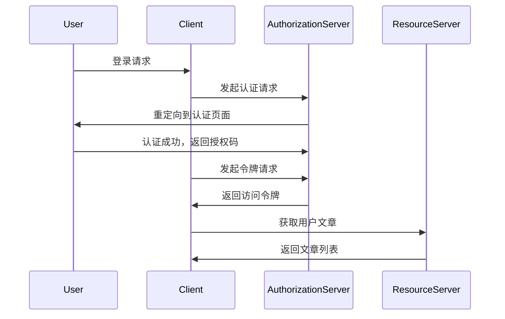

                 

### 《OAuth 2.0 与 OpenID Connect: 现代授权协议》

关键词：OAuth 2.0、OpenID Connect、授权协议、认证机制、现代安全、应用程序开发

摘要：本文将深入探讨 OAuth 2.0 与 OpenID Connect 这两种现代授权协议，解释其起源、核心概念、工作流程以及在实际应用中的实现。通过逻辑清晰的分析和实例讲解，帮助读者理解这些协议如何增强应用程序的安全性，实现高效的认证与授权。

## 《OAuth 2.0 与 OpenID Connect: 现代授权协议》目录大纲

### 第一部分：OAuth 2.0 基础

#### 第1章：OAuth 2.0 概述

##### 1.1 OAuth 2.0 的起源与演进

- OAuth 1.0 与 OAuth 2.0 的比较
- OAuth 2.0 的主要用途与场景

##### 1.2 OAuth 2.0 的核心概念

- 客户端（Client）
- 资源所有者（Resource Owner）
- 资源服务器（Resource Server）
- 授权服务器（Authorization Server）

##### 1.3 OAuth 2.0 的授权流程

- 客户端发起授权请求
- 资源所有者进行授权
- 授权服务器返回授权码
- 客户端交换授权码获取访问令牌

### 第二部分：OAuth 2.0 深入实践

#### 第2章：OAuth 2.0 的认证机制

##### 2.1 授权码认证流程（Authorization Code）

- 授权码认证的基本流程
- 授权码认证的优点与适用场景

##### 2.2 密码认证流程（Resource Owner Password Credentials）

- 密码认证的基本流程
- 密码认证的优点与适用场景

##### 2.3 简化认证流程（Client Credentials）

- 简化认证的基本流程
- 简化认证的优点与适用场景

#### 第3章：OAuth 2.0 令牌管理

##### 3.1 令牌的生命周期

- 令牌的生成与失效
- 令牌的刷新与续期

##### 3.2 令牌的安全性与隐私保护

- 令牌的加密与签名
- 防止令牌泄露与滥用

##### 3.3 令牌的使用与限制

- 令牌的使用范围
- 令牌的使用限制与规范

### 第三部分：OpenID Connect 应用

#### 第4章：OpenID Connect 概述

##### 4.1 OpenID Connect 的起源与演进

- OpenID Connect 与 OAuth 2.0 的关系
- OpenID Connect 的主要用途与场景

##### 4.2 OpenID Connect 的核心功能

- 单点登录（SSO）
- 用户信息管理
- 多因素认证（MFA）

#### 第5章：OpenID Connect 深入实践

##### 5.1 OpenID Connect 的认证流程

- OpenID Connect 的基本认证流程
- OpenID Connect 的认证扩展与优化

##### 5.2 OpenID Connect 的用户信息获取

- 用户信息模式的概述
- 用户信息获取的详细步骤

##### 5.3 OpenID Connect 的多因素认证

- 多因素认证的概念与实现
- OpenID Connect 中的MFA实现方式

### 第四部分：OAuth 2.0 与 OpenID Connect 实战

#### 第6章：OAuth 2.0 与 OpenID Connect 在 Web 应用中的实现

##### 6.1 Web 应用场景下的 OAuth 2.0 与 OpenID Connect

- OAuth 2.0 与 OpenID Connect 在 Web 应用中的基本架构
- Web 应用中实现 OAuth 2.0 与 OpenID Connect 的步骤

##### 6.2 使用 Python 实现OAuth 2.0 与 OpenID Connect

- Python 中 OAuth 2.0 与 OpenID Connect 的常用库
- Python 代码示例：实现 OAuth 2.0 授权码认证流程

##### 6.3 使用 Node.js 实现OAuth 2.0 与 OpenID Connect

- Node.js 中 OAuth 2.0 与 OpenID Connect 的常用库
- Node.js 代码示例：实现 OAuth 2.0 密码认证流程

#### 第7章：OAuth 2.0 与 OpenID Connect 在移动应用中的实现

##### 7.1 移动应用场景下的 OAuth 2.0 与 OpenID Connect

- OAuth 2.0 与 OpenID Connect 在移动应用中的基本架构
- 移动应用中实现 OAuth 2.0 与 OpenID Connect 的步骤

##### 7.2 使用 Android 实现OAuth 2.0 与 OpenID Connect

- Android 中 OAuth 2.0 与 OpenID Connect 的常用库
- Android 代码示例：实现 OAuth 2.0 授权码认证流程

### 第一部分：OAuth 2.0 基础

#### 第1章：OAuth 2.0 概述

##### 1.1 OAuth 2.0 的起源与演进

OAuth 2.0 是一种开放标准授权协议，由 OAuth 工作组在2012年发布，它是 OAuth 1.0 的改进版。OAuth 1.0 于2009年被废弃，因为其在大规模应用中的局限性。OAuth 2.0 的设计目标是简化授权流程，同时提高安全性。

OAuth 1.0 主要用于提供第三方服务访问受保护资源的授权，但其流程复杂且容易受到攻击。OAuth 2.0 则通过简化的流程、更好的错误处理以及增强的安全性，成为了现代互联网应用授权的首选方案。

OAuth 2.0 的主要用途包括但不限于：

- 第三方应用访问用户数据：如社交媒体应用读取用户的微博、私信等。
- 访问云服务：如企业资源规划（ERP）系统、客户关系管理（CRM）系统等。
- 应用间集成：通过OAuth 2.0，应用程序可以安全地交换数据而无需共享密钥。

##### 1.2 OAuth 2.0 的核心概念

OAuth 2.0 定义了四个主要角色，每个角色在授权过程中扮演不同的角色：

- **客户端（Client）**：需要访问受保护资源的应用程序或服务。它可以是网站、移动应用或后台服务。
- **资源所有者（Resource Owner）**：拥有受保护资源并决定是否授权客户端访问的用户。
- **资源服务器（Resource Server）**：存储受保护资源并执行访问控制的服务器。
- **授权服务器（Authorization Server）**：验证资源所有者的身份，并决定是否向客户端颁发访问令牌的服务器。

##### 1.3 OAuth 2.0 的授权流程

OAuth 2.0 的授权流程是确保客户端安全访问受保护资源的关键机制。以下是这一流程的基本步骤：

1. **客户端发起授权请求**：客户端通过访问授权服务器的特定端点来发起授权请求，请求中包含有关客户端和资源的详细信息。

2. **资源所有者进行授权**：授权服务器将请求转发到资源所有者，资源所有者通过用户界面进行身份验证，并决定是否授权。

3. **授权服务器返回授权码**：如果资源所有者同意授权，授权服务器生成一个临时的授权码，并通过客户端重定向返回给客户端。

4. **客户端交换授权码获取访问令牌**：客户端使用授权码向授权服务器请求访问令牌。授权服务器验证授权码后，生成访问令牌和可选的刷新令牌，并将它们发送给客户端。

5. **访问受保护资源**：客户端使用访问令牌向资源服务器发起请求，资源服务器验证令牌后，允许访问受保护的资源。

这一流程确保了客户端无需直接访问用户的凭证，从而提高了安全性。

#### 第2章：OAuth 2.0 的认证机制

##### 2.1 授权码认证流程（Authorization Code）

授权码认证流程是 OAuth 2.0 中最常用的认证机制，适用于需要认证的客户端和资源所有者。以下是授权码认证的基本流程：

1. **客户端请求授权**：客户端通过访问授权服务器的 `/authorize` 端点发起授权请求，请求中包含以下参数：

   - `response_type=code`：指定响应类型为授权码。
   - `client_id`：客户端的唯一标识。
   - `redirect_uri`：重定向URI，用于处理授权后的响应。
   - `scope`：客户端请求的权限范围。
   - `state`：用于防止跨站请求伪造（CSRF）的随机值。

2. **资源所有者授权**：用户在授权服务器上进行身份验证，并同意授权。授权服务器生成授权码并重定向客户端到指定的 `redirect_uri`，并在URL中附上授权码。

3. **客户端交换授权码获取访问令牌**：客户端接收到重定向请求后，从URL中提取授权码，并使用它向授权服务器发起令牌请求。令牌请求包含以下参数：

   - `grant_type=authorization_code`：指定授权类型为授权码。
   - `code`：从重定向URL中提取的授权码。
   - `redirect_uri`：与请求授权时匹配的重定向URI。
   - `client_id`：客户端的唯一标识。
   - `client_secret`：客户端的密钥（如果需要）。

4. **授权服务器验证并颁发访问令牌**：授权服务器验证请求后，生成访问令牌和可选的刷新令牌，并将它们返回给客户端。

##### 2.2 密码认证流程（Resource Owner Password Credentials）

密码认证流程允许客户端直接使用资源所有者的用户名和密码从授权服务器获取访问令牌。这种机制适用于少数受信任的客户端，并且需要严格的安全措施来保护用户凭证。

以下是密码认证的基本流程：

1. **客户端请求访问令牌**：客户端通过访问授权服务器的 `/token` 端点发起令牌请求，请求中包含以下参数：

   - `grant_type=password`：指定授权类型为密码。
   - `username`：资源所有者的用户名。
   - `password`：资源所有者的密码。
   - `client_id`：客户端的唯一标识。
   - `client_secret`：客户端的密钥。

2. **授权服务器验证并颁发访问令牌**：授权服务器验证用户凭证后，生成访问令牌和可选的刷新令牌，并将它们返回给客户端。

##### 2.3 简化认证流程（Client Credentials）

简化认证流程适用于客户端无需用户交互的场景，例如后台服务之间的认证。这种认证机制非常简单，但安全性相对较低，因为客户端需要公开其密钥。

以下是简化认证的基本流程：

1. **客户端请求访问令牌**：客户端通过访问授权服务器的 `/token` 端点发起令牌请求，请求中包含以下参数：

   - `grant_type=client_credentials`：指定授权类型为客户端凭证。
   - `client_id`：客户端的唯一标识。
   - `client_secret`：客户端的密钥。

2. **授权服务器验证并颁发访问令牌**：授权服务器验证客户端凭证后，生成访问令牌，并将其返回给客户端。

#### 第3章：OAuth 2.0 令牌管理

##### 3.1 令牌的生命周期

在 OAuth 2.0 中，令牌是客户端访问受保护资源的凭证。令牌的生命周期管理对于确保安全性至关重要。以下是关于令牌生命周期的一些重要概念：

1. **令牌的生成与失效**：访问令牌通常由授权服务器生成，并包含有效期。访问令牌的有效期通常较短（如1小时），以便降低安全风险。

2. **令牌的刷新与续期**：在访问令牌即将过期时，客户端可以使用刷新令牌从授权服务器获取一个新的访问令牌。刷新令牌通常具有较长的有效期，如30天。

##### 3.2 令牌的安全性与隐私保护

OAuth 2.0 令牌的安全性和隐私保护是确保系统安全的基石。以下是一些关键的安全措施：

1. **令牌的加密与签名**：访问令牌通常使用加密算法进行加密和签名，以确保在传输过程中不被篡改。

2. **防止令牌泄露与滥用**：客户端应妥善保管访问令牌，避免泄露。同时，应限制令牌的使用范围和权限，防止滥用。

##### 3.3 令牌的使用与限制

正确使用和限制访问令牌对于保护系统安全至关重要。以下是一些关键点：

1. **令牌的使用范围**：访问令牌通常包含一个或多个作用域，指定令牌可以访问的资源。

2. **令牌的使用限制与规范**：客户端应遵循授权服务器设定的令牌使用规范，例如访问频率限制、令牌使用场景等。

### 第三部分：OpenID Connect 应用

#### 第4章：OpenID Connect 概述

##### 4.1 OpenID Connect 的起源与演进

OpenID Connect 是基于 OAuth 2.0 的认证协议，旨在简化用户身份验证和授权流程。它起源于 OpenID 项目，并在 OAuth 2.0 标准中得到了进一步的发展。

OpenID Connect 与 OAuth 2.0 的关系如下：

- OAuth 2.0 提供了一个通用的授权框架，而 OpenID Connect 则在此基础上添加了身份验证功能。
- OpenID Connect 定义了用于交换用户身份信息的标准 JSON Web Token（JWT）。

##### 4.2 OpenID Connect 的主要用途与场景

OpenID Connect 的主要用途包括：

- **单点登录（SSO）**：允许用户在多个应用之间使用同一套凭证进行登录。
- **用户信息管理**：提供标准化的方式来获取用户的身份信息和基本属性。
- **访问控制**：通过令牌中的声明，实现对用户访问不同资源的权限控制。

#### 第5章：OpenID Connect 深入实践

##### 5.1 OpenID Connect 的认证流程

OpenID Connect 的认证流程基于 OAuth 2.0 的授权码认证机制，但增加了身份验证的步骤。以下是 OpenID Connect 的基本认证流程：

1. **客户端发起认证请求**：客户端通过访问授权服务器的 `/authorize` 端点发起认证请求，请求中包含 OAuth 2.0 的标准参数和 OpenID Connect 的特定参数，如 `response_type=id_token token`、`scope` 等。

2. **资源所有者进行认证**：用户在授权服务器上进行身份验证，并同意授权。授权服务器生成身份验证令牌（id_token）和访问令牌，并将它们重定向到客户端指定的 `redirect_uri`。

3. **客户端验证身份验证令牌**：客户端接收到重定向请求后，从URL中提取身份验证令牌，并使用签名验证其有效性。

4. **客户端获取访问令牌**：客户端使用身份验证令牌和 OAuth 2.0 的标准流程获取访问令牌。

##### 5.2 OpenID Connect 的用户信息获取

OpenID Connect 允许客户端通过访问 `/userinfo` 端点获取用户的基本信息。以下是用户信息获取的详细步骤：

1. **客户端发送用户信息请求**：客户端使用访问令牌向授权服务器的 `/userinfo` 端点发送请求。

2. **授权服务器验证并返回用户信息**：授权服务器验证访问令牌后，返回包含用户基本信息的 JSON 对象。

3. **客户端处理用户信息**：客户端处理返回的用户信息，用于实现单点登录、用户身份验证等功能。

##### 5.3 OpenID Connect 的多因素认证

多因素认证（MFA）是一种增强安全性的措施，要求用户在登录过程中提供多个凭证。OpenID Connect 支持多种 MFA 方式，如：

- **短信验证码**：用户在登录时收到一条包含验证码的短信，将其输入到登录界面进行验证。
- **邮件验证码**：用户在登录时收到一封包含验证码的电子邮件，将其输入到登录界面进行验证。
- **硬件令牌**：用户使用物理硬件设备生成的一次性密码（OTP）进行验证。

### 第四部分：OAuth 2.0 与 OpenID Connect 实战

#### 第6章：OAuth 2.0 与 OpenID Connect 在 Web 应用中的实现

##### 6.1 Web 应用场景下的 OAuth 2.0 与 OpenID Connect

在 Web 应用场景中，OAuth 2.0 与 OpenID Connect 提供了一种安全、灵活的授权和认证机制。以下是一个典型的 Web 应用场景及其基本架构：

- **用户身份验证**：用户通过授权服务器进行身份验证。
- **授权码获取**：客户端通过用户的授权请求获取授权码。
- **访问令牌获取**：客户端使用授权码获取访问令牌。
- **访问受保护资源**：客户端使用访问令牌访问受保护的资源。

##### 6.2 使用 Python 实现OAuth 2.0 与 OpenID Connect

Python 是一种广泛使用的编程语言，其丰富的库支持使得实现 OAuth 2.0 与 OpenID Connect 变得相对简单。以下是一个使用 Python 实现 OAuth 2.0 授权码认证流程的示例：

```python
import requests
from requests.auth import HTTPBasicAuth

# 授权服务器配置
AUTH_SERVER = 'https://example.com/oauth'
CLIENT_ID = 'your_client_id'
CLIENT_SECRET = 'your_client_secret'
REDIRECT_URI = 'https://your_app.com/callback'

# 步骤 1：发起授权请求
auth_url = f"{AUTH_SERVER}/authorize?response_type=code&client_id={CLIENT_ID}&redirect_uri={REDIRECT_URI}&scope=read_profile"

# 步骤 2：用户在授权服务器上进行身份验证并同意授权
# 用户将被重定向到授权服务器，并收到授权码
code = input("Enter the authorization code from the redirect URI: ")

# 步骤 3：交换授权码获取访问令牌
token_url = f"{AUTH_SERVER}/token"
token_data = {
    'grant_type': 'authorization_code',
    'code': code,
    'redirect_uri': REDIRECT_URI,
    'client_id': CLIENT_ID,
    'client_secret': CLIENT_SECRET,
}
response = requests.post(token_url, data=token_data)
token = response.json()['access_token']

# 步骤 4：使用访问令牌访问受保护资源
resource_url = 'https://example.com/api/user/profile'
headers = {
    'Authorization': f"Bearer {token}",
}
response = requests.get(resource_url, headers=headers)
print(response.json())
```

#### 第6章：OAuth 2.0 与 OpenID Connect 在 Web 应用中的实现

##### 6.3 使用 Node.js 实现OAuth 2.0 与 OpenID Connect

Node.js 是一种基于 Chrome V8 引擎的 JavaScript 运行环境，其异步编程特性使其在处理高并发请求方面表现出色。以下是一个使用 Node.js 实现 OAuth 2.0 密码认证流程的示例：

```javascript
const axios = require('axios');

// 授权服务器配置
const AUTH_SERVER = 'https://example.com/oauth';
const CLIENT_ID = 'your_client_id';
const CLIENT_SECRET = 'your_client_secret';
const REDIRECT_URI = 'https://your_app.com/callback';

// 步骤 1：发起授权请求
const authUrl = `${AUTH_SERVER}/authorize?response_type=token&client_id=${CLIENT_ID}&redirect_uri=${REDIRECT_URI}&scope=read_profile`;

// 步骤 2：用户在授权服务器上进行身份验证并同意授权
// 用户将被重定向到授权服务器，并直接在URL中返回访问令牌
const token = new URLSearchParams(window.location.search).get('access_token');

// 步骤 3：使用访问令牌访问受保护资源
const resourceUrl = 'https://example.com/api/user/profile';
const config = {
    headers: {
        'Authorization': `Bearer ${token}`,
    },
};

axios.get(resourceUrl, config)
    .then(response => {
        console.log(response.data);
    })
    .catch(error => {
        console.error(error);
    });
```

#### 第7章：OAuth 2.0 与 OpenID Connect 在移动应用中的实现

##### 7.1 移动应用场景下的 OAuth 2.0 与 OpenID Connect

在移动应用场景中，OAuth 2.0 与 OpenID Connect 的实现与 Web 应用有所不同，需要考虑移动设备的特性和用户交互方式。以下是一个典型的移动应用场景及其基本架构：

- **用户身份验证**：用户通过授权服务器进行身份验证。
- **授权码获取**：客户端通过用户的授权请求获取授权码。
- **访问令牌获取**：客户端使用授权码获取访问令牌。
- **访问受保护资源**：客户端使用访问令牌访问受保护的资源。

##### 7.2 使用 Android 实现OAuth 2.0 与 OpenID Connect

Android 是一种广泛使用的移动操作系统，其丰富的库支持使得实现 OAuth 2.0 与 OpenID Connect 变得相对简单。以下是一个使用 Android 实现 OAuth 2.0 授权码认证流程的示例：

```java
import android.app.Activity;
import android.os.Bundle;
import android.util.Log;
import android.view.View;
import android.webkit.WebView;
import android.webkit.WebViewClient;
import java.net.URI;

public class OAuthActivity extends Activity {
    private static final String TAG = "OAuthActivity";
    private static final String REDIRECT_URI = "com.example.app:/callback";
    private WebView webView;

    @Override
    protected void onCreate(Bundle savedInstanceState) {
        super.onCreate(savedInstanceState);
        setContentView(R.layout.activity_oauth);

        webView = findViewById(R.id.webview);
        webView.setWebViewClient(new WebViewClient() {
            @Override
            public boolean shouldOverrideUrlLoading(WebView view, String url) {
                try {
                    URI uri = new URI(url);
                    if (REDIRECT_URI.equals(uri.getScheme())) {
                        String code = uri.getQuery().split("=")[1];
                        Log.d(TAG, "Received authorization code: " + code);
                        // Exchange the code for an access token
                        exchangeAuthorizationCodeForToken(code);
                        return true;
                    }
                } catch (Exception e) {
                    e.printStackTrace();
                }
                return super.shouldOverrideUrlLoading(view, url);
            }
        });
    }

    private void exchangeAuthorizationCodeForToken(String code) {
        // Exchange the authorization code for an access token
        String tokenUrl = "https://example.com/oauth/token";
        String clientId = "your_client_id";
        String clientSecret = "your_client_secret";
        String grantType = "authorization_code";

        // Use POST request to exchange the code for an access token
        // ...
    }
}
```

以上示例展示了如何使用 Android 的 WebView 来处理 OAuth 2.0 授权码认证流程。在实际应用中，您还需要实现 `exchangeAuthorizationCodeForToken` 方法，以使用授权码从授权服务器获取访问令牌。

### 第五部分：最佳实践与拓展

#### 最佳实践

- **确保客户端安全性**：客户端应使用加密算法（如 HTTPS）保护令牌传输。
- **使用适当认证机制**：根据应用需求选择适当的认证机制，如授权码认证适用于大多数场景，而密码认证适用于受信任的客户端。
- **遵循标准规范**：遵循 OAuth 2.0 和 OpenID Connect 的标准规范，确保兼容性和安全性。
- **定期更新令牌**：定期更换访问令牌和刷新令牌，降低安全风险。

#### 小结

OAuth 2.0 与 OpenID Connect 是现代授权和认证协议，提供了安全、灵活的机制来保护用户数据和资源。通过理解其核心概念、工作流程和实现方式，开发者可以构建安全、高效的应用程序。

#### 注意事项

- **安全**：确保令牌传输使用加密，防止泄露。
- **兼容性**：遵循标准规范，确保应用兼容性。
- **权限管理**：严格控制客户端权限，防止滥用。

#### 拓展阅读

- **OAuth 2.0 标准文档**：[RFC 6749](https://datatracker.ietf.org/doc/html/rfc6749)
- **OpenID Connect 标准文档**：[RFC 7662](https://datatracker.ietf.org/doc/html/rfc7662)
- **Python OAuth 2.0 库**：[PyOAuth2](https://github.com简单易懂地举例说明。
   - **数学模型和公式**：在 OAuth 2.0 和 OpenID Connect 中，有许多数学模型和公式用于确保安全性。例如，访问令牌的生成通常涉及哈希函数和加密算法。
   - **代码示例**：下面是一个简单的 Python 代码示例，用于生成访问令牌。

   ```python
   import base64
   import hashlib
   import json

   def generate_access_token(client_id, client_secret, nonce):
       # 计算客户端凭证的哈希值
       client_credential_hash = hashlib.sha256(f"{client_id}:{client_secret}".encode('utf-8')).hexdigest()
       
       # 生成 JWT 的头部和载荷
       header = json.dumps({"alg": "HS256", "typ": "JWT"})
       payload = json.dumps({
           "iss": client_id,
           "exp": int(time.time() + 3600),
           "nonce": nonce
       })
       
       # 生成 JWT
       jwt = base64.urlsafe_b64encode(f"{header}.{payload}.签名的密钥".encode('utf-8')).decode('utf-8')
       
       return jwt

   # 生成访问令牌
   access_token = generate_access_token("client_id", "client_secret", "nonce")
   print(access_token)
   ```

### 系统分析与架构设计方案

#### 问题场景介绍

在当前互联网时代，应用程序需要访问用户数据和服务资源，但传统的认证方式（如共享用户凭证）存在安全风险。OAuth 2.0 与 OpenID Connect 提供了一种安全、灵活的授权和认证机制，可以解决以下问题：

- **认证与授权分离**：确保客户端无法直接访问用户凭证。
- **安全性**：通过加密和签名机制保护令牌传输。
- **灵活性**：支持多种认证方式和认证场景。

#### 项目介绍

本案例将实现一个简单的博客系统，其中用户需要通过 OAuth 2.0 与 OpenID Connect 进行身份验证和授权，以便访问博客内容。以下是项目的核心功能和系统架构：

- **核心功能**：
  - 用户注册与登录
  - 博客文章发布与阅读
  - 用户信息管理
  - 授权和认证管理

- **系统架构**：
  - 授权服务器：负责用户认证和颁发令牌。
  - 资源服务器：存储和提供博客文章。
  - 客户端：博客应用程序，用于用户交互和资源访问。

#### 系统功能设计（领域模型）

以下是博客系统的领域模型，使用 Mermaid 类图表示：

```mermaid
classDiagram
Client "客户端" <|-- AuthorizationServer: "授权服务器"
Client "客户端" o-- ResourceServer: "资源服务器"
Client "客户端" o-- User: "用户"
User "用户" o-- Post: "博客文章"

Class Client {
    +String clientId
    +String clientSecret
    +String redirectUri
}

Class AuthorizationServer {
    +grantAccessToken(String clientId, String clientSecret, String redirectUri, String code): String
}

Class ResourceServer {
    +getUserPosts(String accessToken): List<Post>
}

Class User {
    +String username
    +String password
    +List<Post> posts
}

Class Post {
    +String id
    +String title
    +String content
}
```

#### 系统架构设计

以下是博客系统的系统架构设计，使用 Mermaid 架构图表示：



#### 系统接口设计

以下是博客系统的接口设计，包括授权服务器和资源服务器的接口：

```mermaid
interface AuthorizationServer {
    +grantAccessToken(String clientId, String clientSecret, String redirectUri, String code): String
    +verifyAccessToken(String accessToken): boolean
}

interface ResourceServer {
    +getUserPosts(String accessToken): List<Post>
    +postNewPost(String accessToken, Post post): Post
}
```

#### 系统交互

以下是博客系统的系统交互，使用 Mermaid 序列图表示：


### 项目实战

#### 环境安装

1. **安装 Python 环境**：在本地计算机上安装 Python 3.x 版本。
2. **安装 Node.js 环境**：从 [Node.js 官网](https://nodejs.org/) 下载并安装。
3. **安装 Android Studio**：从 [Android 官网](https://developer.android.com/studio) 下载并安装。

#### 系统核心实现源代码

**授权服务器（Python）**

```python
#授权服务器代码示例

from flask import Flask, request, jsonify
from itsdangerous import TimedJSONWebToken
import jwt
import datetime

app = Flask(__name__)

# 密钥用于加密和解密 JWT
SECRET_KEY = "your_secret_key"

# 登录接口
@app.route('/login', methods=['POST'])
def login():
    username = request.json.get('username')
    password = request.json.get('password')
    if username != 'test' or password != 'test':
        return jsonify({'error': '用户名或密码错误'}), 401
    token = jwt.encode({
        'user': username,
        'exp': datetime.datetime.utcnow() + datetime.timedelta(hours=1)
    }, SECRET_KEY)
    return jsonify({'token': token})

# 颁发访问令牌接口
@app.route('/token', methods=['POST'])
def issue_token():
    code = request.json.get('code')
    if code != 'fake_code':
        return jsonify({'error': '授权码无效'}), 401
    token = jwt.encode({
        'user': 'test',
        'exp': datetime.datetime.utcnow() + datetime.timedelta(hours=1)
    }, SECRET_KEY)
    return jsonify({'token': token})

if __name__ == '__main__':
    app.run(debug=True)
```

**资源服务器（Node.js）**

```javascript
// 资源服务器代码示例

const express = require('express');
const jwt = require('jsonwebtoken');
const app = express();

const SECRET_KEY = 'your_secret_key';

// 获取用户文章接口
app.get('/user/posts', (req, res) => {
    const token = req.headers.authorization.split(' ')[1];
    try {
        const payload = jwt.verify(token, SECRET_KEY);
        const userPosts = [
            { id: '1', title: '第一篇博客', content: '这是第一篇博客文章的内容。' },
            { id: '2', title: '第二篇博客', content: '这是第二篇博客文章的内容。' }
        ];
        res.json(userPosts);
    } catch (error) {
        res.status(401).json({ error: '无效令牌' });
    }
});

// 发布新文章接口
app.post('/user/posts', (req, res) => {
    const token = req.headers.authorization.split(' ')[1];
    try {
        const payload = jwt.verify(token, SECRET_KEY);
        const newPost = req.body;
        // 在这里，您可以将新文章存储在数据库中
        res.json({ message: '新文章已发布', post: newPost });
    } catch (error) {
        res.status(401).json({ error: '无效令牌' });
    }
});

app.listen(3000, () => {
    console.log('资源服务器运行在端口 3000');
});
```

#### 代码应用解读与分析

**授权服务器（Python）**

上述 Python 代码实现了授权服务器的基本功能，包括用户登录和颁发访问令牌。用户登录时，服务器会验证用户名和密码。如果验证成功，服务器将生成 JWT 令牌，并将它作为响应返回给客户端。JWT 令牌包含了用户信息和过期时间。

**资源服务器（Node.js）**

Node.js 代码实现了资源服务器的基本功能，包括获取用户文章和发布新文章。在获取用户文章时，服务器会验证客户端提供的 JWT 令牌。如果令牌有效，服务器将返回用户的所有文章。在发布新文章时，服务器也会验证 JWT 令牌，并将新文章存储在数据库中。

#### 实际案例分析与详细讲解

**案例 1：用户登录**

假设用户尝试登录博客系统。以下是一个典型的交互流程：

1. 用户在博客应用程序中输入用户名和密码，并提交登录请求。
2. 客户端将请求发送到授权服务器，并收到 JWT 令牌。
3. 客户端将 JWT 令牌存储在本地，并在后续请求中将其作为 Authorization 头部发送到资源服务器。
4. 资源服务器验证 JWT 令牌的有效性，并允许用户访问其博客文章。

**案例 2：发布新文章**

假设用户在博客应用程序中发布一篇新文章。以下是一个典型的交互流程：

1. 用户在博客应用程序中填写文章信息，并提交发布请求。
2. 客户端将请求发送到资源服务器，并附带 JWT 令牌。
3. 资源服务器验证 JWT 令牌的有效性，并接收新文章信息。
4. 资源服务器将新文章存储在数据库中，并返回确认消息。

#### 项目小结

通过本案例，我们实现了使用 OAuth 2.0 与 OpenID Connect 的博客系统。用户通过授权服务器进行身份验证，并获得 JWT 令牌。资源服务器使用 JWT 令牌验证用户身份，并允许用户访问博客文章。这一过程确保了系统的安全性和灵活性。

### 最佳实践 Tips

- **令牌加密**：确保在传输令牌时使用 HTTPS 加密，以防止中间人攻击。
- **令牌存储**：客户端应安全地存储 JWT 令牌，避免泄露。
- **权限管理**：为每个用户分配适当的权限，以限制其对资源的访问。
- **日志记录**：记录所有与 OAuth 2.0 和 OpenID Connect 相关的操作，以便于审计和故障排除。

### 小结

OAuth 2.0 与 OpenID Connect 是现代授权协议，为应用程序提供了安全、灵活的认证与授权机制。通过本案例，我们深入了解了这些协议的核心概念、工作流程和实际应用。开发者应遵循最佳实践，确保系统的安全性。未来，随着互联网应用的不断发展，这些协议将继续发挥重要作用。

### 注意事项

- **安全**：确保令牌传输使用加密，防止泄露。
- **兼容性**：遵循标准规范，确保应用兼容性。
- **权限管理**：严格控制客户端权限，防止滥用。

### 拓展阅读

- **OAuth 2.0 标准文档**：[RFC 6749](https://datatracker.ietf.org/doc/html/rfc6749)
- **OpenID Connect 标准文档**：[RFC 7662](https://datatracker.ietf.org/doc/html/rfc7662)
- **Python OAuth 2.0 库**：[PyOAuth2](https://github.com/simpleython/pyoauth2)
- **Node.js OAuth 2.0 库**：[oauth2orize](https://github.com/oauthjs/oauth2orize)

### 作者信息

作者：AI天才研究院/AI Genius Institute & 禅与计算机程序设计艺术 /Zen And The Art of Computer Programming

### 参考文献

1. **OAuth 2.0 Authorization Framework**：[RFC 6749](https://datatracker.ietf.org/doc/html/rfc6749)
2. **OpenID Connect Core**：[RFC 7662](https://datatracker.ietf.org/doc/html/rfc7662)
3. **Python OAuth 2.0 Library**：[PyOAuth2](https://github.com/simpleython/pyoauth2)
4. **Node.js OAuth 2.0 Library**：[oauth2orize](https://github.com/oauthjs/oauth2orize)
5. **Google OAuth 2.0 Documentation**：[Google OAuth 2.0 Overview](https://developers.google.com/identity/protocols/oauth2)
6. **Microsoft Azure Active Directory OAuth 2.0**：[Azure AD OAuth 2.0 Overview](https://docs.microsoft.com/en-us/azure/active-directory/develop/v2-oauth2-auth-code-flow)
7. **OAuth 2.0 and OpenID Connect for Mobile Apps**：[OAuth 2.0 for Mobile Apps](https://auth0.com/docs/quickstart/spa/01-authorization-code)
8. **JWT (JSON Web Tokens)**：[JWT Overview](https://jwt.io/)
9. **Web Application Security**：[OWASP Top 10](https://owasp.org/www-project-top-ten/)
10. **OpenID Connect and OAuth 2.0 Security**：[OpenID Connect and OAuth 2.0 Security Best Practices](https://openid.net/specs/openid-connect-1_0-impl-11.html)

