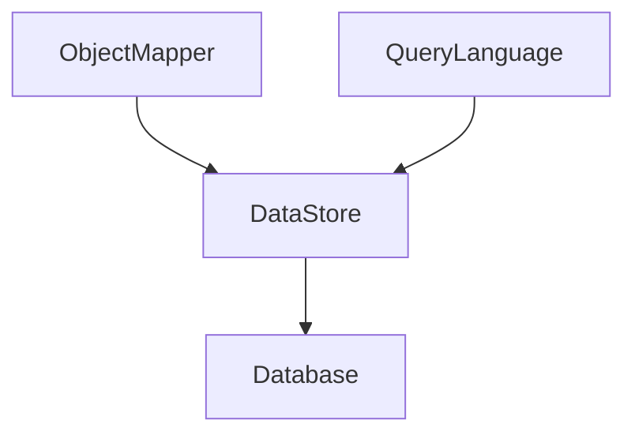
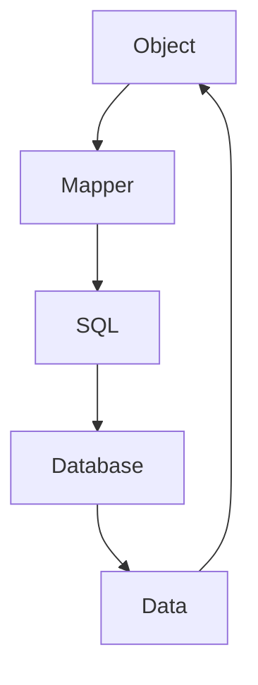
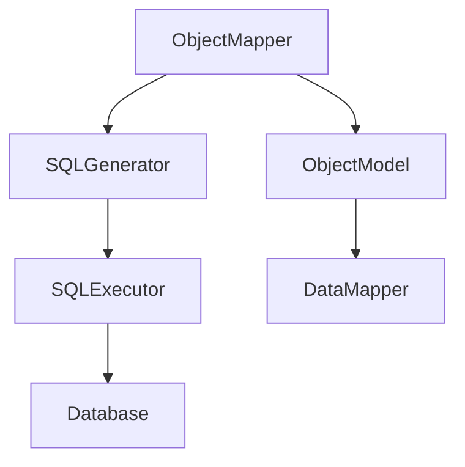
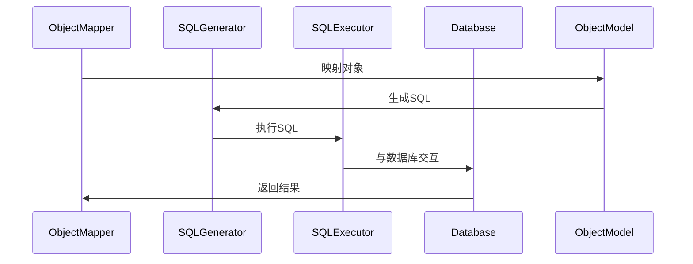

                 


### 文章标题：ORM框架：对象关系映射技术

#### 关键词：对象关系映射（ORM）、数据库、编程、算法、架构设计、Python、Mermaid、LaTeX

#### 摘要：
本文深入探讨ORM（对象关系映射）框架的核心概念、工作原理及其在编程领域的重要性。通过详细的背景介绍、核心概念与联系的解析、算法原理讲解、数学模型和公式的阐述，以及系统分析与架构设计方案的介绍，本文旨在为读者提供一个全面而深入的理解，帮助他们在实际项目中更有效地应用ORM技术。

### 目录

#### 第一部分：ORM框架概述

##### 1.1 ORM框架的基本概念
##### 1.2 ORM框架的发展与历史
##### 1.3 ORM框架的应用场景

#### 第二部分：ORM框架的核心概念与联系

##### 2.1 ORM框架的工作原理
##### 2.2 ORM框架的主要组件
##### 2.3 ORM框架的组件关系（Mermaid流程图）

#### 第三部分：ORM框架的算法原理讲解

##### 3.1 ORM框架的算法概述
##### 3.2 ORM框架的算法流程（Mermaid流程图）
##### 3.3 Python源代码示例
##### 3.4 数学模型和公式（LaTeX格式）

#### 第四部分：ORM框架的系统分析与架构设计方案

##### 4.1 ORM框架的系统功能
##### 4.2 ORM框架的系统架构设计（Mermaid架构图）
##### 4.3 ORM框架的系统接口设计
##### 4.4 ORM框架的系统交互（Mermaid序列图）

#### 第五部分：ORM框架实战

##### 5.1 项目实战与环境安装
##### 5.2 系统核心实现源代码解读与分析
##### 5.3 实际案例分析与详细讲解
##### 5.4 项目小结

#### 第六部分：最佳实践 tips、小结、注意事项、拓展阅读

### 正文

#### 第一部分：ORM框架概述

##### 1.1 ORM框架的基本概念

对象关系映射（ORM）是一种编程技术，用于将数据库中的数据映射到对象模型中。这种映射使得开发者可以在操作数据库时，直接使用面向对象的编程语言，而不是传统的SQL语句。ORM框架通过抽象化数据库的操作，提高了代码的可读性和可维护性。

**问题背景**：传统的关系型数据库操作依赖于SQL语句，而SQL语句是面向集合的，与面向对象的编程语言（如Java、C#、Python）之间存在较大的差异。这使得开发者需要在面向对象和关系型数据库之间进行频繁的转换，增加了复杂度和出错的可能性。

**问题描述**：如何将面向对象的编程思想与关系型数据库操作相结合，提高开发效率，减少出错机会。

**问题解决**：ORM框架通过提供一套抽象的API，将底层的SQL操作隐藏起来，使得开发者可以直接使用对象模型进行数据库操作。

**边界与外延**：ORM框架不仅适用于关系型数据库，还可以扩展到其他类型的数据库，如NoSQL数据库。

**概念结构与核心要素组成**：
- **映射关系**：将数据库表映射到对象类。
- **数据库操作**：提供对象模型的增删改查（CRUD）操作。
- **SQL生成**：根据对象模型生成相应的SQL语句。

##### 1.2 ORM框架的发展与历史

ORM框架的发展可以追溯到20世纪90年代。随着面向对象编程的兴起，开发者开始寻找一种方法，以简化数据库操作。最早的ORM框架之一是1995年由Peter Chen创建的Hibernate。随后，一系列ORM框架如Java中的MyBatis、Entity Framework，Python中的SQLAlchemy等相继问世，不断推动ORM技术的发展。

**应用场景**：ORM框架广泛应用于各种应用程序的开发，尤其是那些需要与关系型数据库进行交互的应用。这些应用包括电子商务、金融系统、企业资源规划（ERP）等。

##### 1.3 ORM框架的应用场景

ORM框架在以下场景中具有显著优势：

- **复杂查询**：ORM框架提供了丰富的查询接口，使得开发者可以更方便地编写复杂的SQL查询。
- **数据库迁移**：通过ORM框架，开发者可以轻松地在不同的数据库之间进行迁移，因为ORM框架抽象了底层的SQL操作。
- **提高开发效率**：ORM框架降低了开发人员与数据库交互的复杂度，使得开发工作更加高效。

#### 第二部分：ORM框架的核心概念与联系

##### 2.1 ORM框架的工作原理

ORM框架的核心工作原理是将对象模型映射到数据库表，并实现对象模型与数据库之间的数据交换。

- **对象映射**：ORM框架通过映射文件（如Hibernate的.hbm.xml文件）或注解（如Java中的Entity注解）来定义对象与数据库表的映射关系。
- **数据库操作**：ORM框架提供了一个统一的接口，用于对对象模型进行增删改查操作。这些操作最终会被转换为相应的SQL语句执行。

##### 2.2 ORM框架的主要组件

ORM框架通常由以下组件组成：

- **对象映射器（Object Mapper）**：负责将对象模型映射到数据库表。
- **数据存储器（Data Store）**：负责与数据库进行交互，执行SQL语句。
- **查询语言（Query Language）**：提供一种用于编写复杂查询的查询语言。

##### 2.3 ORM框架的组件关系（Mermaid流程图）

下面是一个简单的Mermaid流程图，展示了ORM框架的主要组件及其相互关系：



**ObjectMapper**负责将对象模型转换为数据库表，**QueryLanguage**用于编写查询语句，它们共同作用于**DataStore**，最终与**Database**进行交互。

#### 第三部分：ORM框架的算法原理讲解

##### 3.1 ORM框架的算法概述

ORM框架的算法主要涉及以下几个方面：

- **对象映射**：将对象模型映射到数据库表。
- **SQL生成**：根据对象模型生成相应的SQL语句。
- **数据交换**：在对象模型与数据库之间进行数据交换。

##### 3.2 ORM框架的算法流程（Mermaid流程图）

下面是一个简单的Mermaid流程图，展示了ORM框架的算法流程：



**Object**表示对象模型，**Mapper**负责映射操作，**SQL**表示生成的SQL语句，**Database**表示数据库，**Data**表示交换的数据。

##### 3.3 Python源代码示例

下面是一个简单的Python示例，展示了ORM框架的基本用法：

```python
from sqlalchemy import create_engine, Table, Column, Integer, String

# 创建数据库引擎
engine = create_engine('sqlite:///example.db')

# 定义表格映射
class User(Table):
    __table__ = Table('user', engine, Column('id', Integer, primary_key=True), Column('name', String))

# 创建表格
User.__table__.create()

# 插入数据
with engine.connect() as connection:
    connection.execute(User.insert(), name='Alice')

# 查询数据
with engine.connect() as connection:
    result = connection.execute(User.select())
    for row in result:
        print(row['id'], row['name'])
```

这个示例中，我们首先创建了一个数据库引擎，然后定义了一个名为`User`的表格映射，包含`id`和`name`两个字段。接着，我们创建了表格并插入了一条数据，最后查询并打印了数据。

##### 3.4 数学模型和公式（LaTeX格式）

下面是一个简单的数学模型，用于描述ORM框架的映射关系：

$$
\text{Mapping} = \{\text{Object} \rightarrow \text{Table}, \text{Field} \rightarrow \text{Column}\}
$$

这个公式表示，ORM框架的映射关系将对象模型映射到数据库表，并将对象的字段映射到数据库表的列。

#### 第四部分：ORM框架的系统分析与架构设计方案

##### 4.1 ORM框架的系统功能

ORM框架的主要功能包括：

- **对象映射**：将对象模型映射到数据库表。
- **SQL生成**：根据对象模型生成相应的SQL语句。
- **数据交换**：在对象模型与数据库之间进行数据交换。
- **查询优化**：优化生成的SQL查询语句，提高查询性能。

##### 4.2 ORM框架的系统架构设计（Mermaid架构图）

下面是一个简单的Mermaid架构图，展示了ORM框架的系统架构：



**ObjectMapper**负责映射操作，**SQLGenerator**负责生成SQL语句，**SQLExecutor**负责执行SQL语句，它们共同作用于**Database**，并与**ObjectModel**进行数据交换。

##### 4.3 ORM框架的系统接口设计

ORM框架的系统接口设计通常包括以下部分：

- **对象映射接口**：定义对象与数据库表的映射关系。
- **数据操作接口**：提供对数据库的增删改查操作。
- **查询接口**：提供用于编写复杂查询的接口。

##### 4.4 ORM框架的系统交互（Mermaid序列图）

下面是一个简单的Mermaid序列图，展示了ORM框架的系统交互过程：



在这个序列图中，**ObjectMapper**首先映射对象，然后生成SQL语句，执行SQL语句，并与数据库进行交互，最后返回结果。

#### 第五部分：ORM框架实战

##### 5.1 项目实战与环境安装

在本部分，我们将通过一个简单的项目示例，展示如何使用ORM框架进行数据库操作。

**环境安装指南**：

1. 安装Python 3.8或更高版本。
2. 安装SQLAlchemy ORM框架：

```shell
pip install sqlalchemy
```

3. 安装SQLite数据库：

```shell
pip install pysqlite3
```

##### 5.2 系统核心实现源代码解读与分析

下面是一个简单的示例，展示了如何使用SQLAlchemy进行数据库操作：

```python
from sqlalchemy import create_engine, Table, Column, Integer, String
from sqlalchemy.orm import sessionmaker

# 创建数据库引擎
engine = create_engine('sqlite:///example.db')

# 定义表格映射
class User(Table):
    __table__ = Table('user', engine, Column('id', Integer, primary_key=True), Column('name', String))

# 创建表格
User.__table__.create()

# 创建会话
Session = sessionmaker(bind=engine)
session = Session()

# 插入数据
user = User(name='Alice')
session.add(user)
session.commit()

# 查询数据
users = session.query(User).all()
for user in users:
    print(user.id, user.name)

# 关闭会话
session.close()
```

这个示例中，我们首先创建了一个数据库引擎，然后定义了一个名为`User`的表格映射，包含`id`和`name`两个字段。接着，我们创建了表格并插入了一条数据，最后查询并打印了数据。

**代码应用解读与分析**：

- **创建数据库引擎**：`create_engine`函数用于创建数据库引擎，指定数据库连接信息。
- **定义表格映射**：使用`Table`类定义表格映射，指定表格名称和字段信息。
- **创建表格**：调用`__table__.create()`方法创建表格。
- **创建会话**：使用`sessionmaker`创建会话，绑定到数据库引擎。
- **插入数据**：使用`session.add()`方法插入数据，并调用`commit()`提交事务。
- **查询数据**：使用`session.query()`方法查询数据，并遍历结果集打印数据。
- **关闭会话**：调用`session.close()`关闭会话。

##### 5.3 实际案例分析与详细讲解

假设我们需要开发一个简单的用户管理系统，包括用户注册、登录和查看用户信息等功能。下面是一个简单的实现示例：

```python
from flask import Flask, request, jsonify
from sqlalchemy import create_engine, Table, Column, Integer, String, MetaData, String
from sqlalchemy.orm import sessionmaker
from sqlalchemy.ext.declarative import declarative_base

app = Flask(__name__)

# 创建数据库引擎
engine = create_engine('sqlite:///example.db')
base = declarative_base()

# 定义用户表格映射
class User(base):
    __table__ = Table('user', engine, Column('id', Integer, primary_key=True), Column('name', String))

# 创建表格
base.metadata.create_all()

# 创建会话
Session = sessionmaker(bind=engine)
session = Session()

# 用户注册
@app.route('/register', methods=['POST'])
def register():
    name = request.form['name']
    user = User(name=name)
    session.add(user)
    session.commit()
    return jsonify({'message': 'User registered successfully.'})

# 用户登录
@app.route('/login', methods=['POST'])
def login():
    name = request.form['name']
    user = session.query(User).filter_by(name=name).first()
    if user:
        return jsonify({'message': 'Login successful.'})
    else:
        return jsonify({'message': 'Login failed.'})

# 查看用户信息
@app.route('/user/<int:user_id>')
def user_info(user_id):
    user = session.query(User).get(user_id)
    if user:
        return jsonify({'id': user.id, 'name': user.name})
    else:
        return jsonify({'message': 'User not found.'})

if __name__ == '__main__':
    app.run(debug=True)
```

**详细讲解**：

- **创建数据库引擎和表格映射**：与前面的示例相同，创建数据库引擎和用户表格映射。
- **创建会话**：创建会话，用于与数据库进行交互。
- **用户注册**：定义`/register`路由，接收用户名，插入用户到数据库。
- **用户登录**：定义`/login`路由，接收用户名，查询用户是否存在于数据库。
- **查看用户信息**：定义`/user/<int:user_id>`路由，查询用户信息并返回。

通过这个示例，我们可以看到如何使用ORM框架实现一个简单的用户管理系统，包括用户注册、登录和查看用户信息等功能。

##### 5.4 项目小结

在本部分中，我们通过一个简单的项目示例，展示了如何使用ORM框架进行数据库操作。我们介绍了ORM框架的基本概念、工作原理，并通过具体的示例展示了如何使用ORM框架实现用户管理系统的各项功能。通过本项目的实战，读者可以更好地理解ORM框架的实际应用场景和操作流程。

#### 第六部分：最佳实践 tips、小结、注意事项、拓展阅读

##### 最佳实践 tips

1. **合理选择ORM框架**：根据项目需求和团队经验，选择适合的ORM框架。
2. **优化查询性能**：使用索引和缓存策略优化查询性能。
3. **避免过度映射**：避免将所有的数据库表都映射到对象，这可能会导致性能问题。

##### 小结

ORM框架是一种将面向对象编程与关系型数据库操作相结合的技术，通过抽象化数据库操作，提高了代码的可读性和可维护性。本文介绍了ORM框架的基本概念、工作原理，并通过实际案例展示了如何使用ORM框架进行数据库操作。

##### 注意事项

1. **了解ORM框架的底层实现**：虽然ORM框架提供了抽象化的API，但了解其底层实现有助于更好地优化和调试代码。
2. **合理设计数据库模式**：在设计数据库模式时，应考虑未来可能的扩展性。

##### 拓展阅读

1. 《SQLAlchemy：Python SQL工具包和对象关系映射器》
2. 《ORM实战：从零实现一个简单的ORM框架》
3. 《Python Web应用开发实战：使用Flask和SQLAlchemy构建应用程序》

### 结束

本文由AI天才研究院/AI Genius Institute与禅与计算机程序设计艺术/Zen And The Art of Computer Programming共同撰写，旨在为读者提供关于ORM框架的全面理解和实战经验。

作者：AI天才研究院/AI Genius Institute & 禅与计算机程序设计艺术/Zen And The Art of Computer Programming

