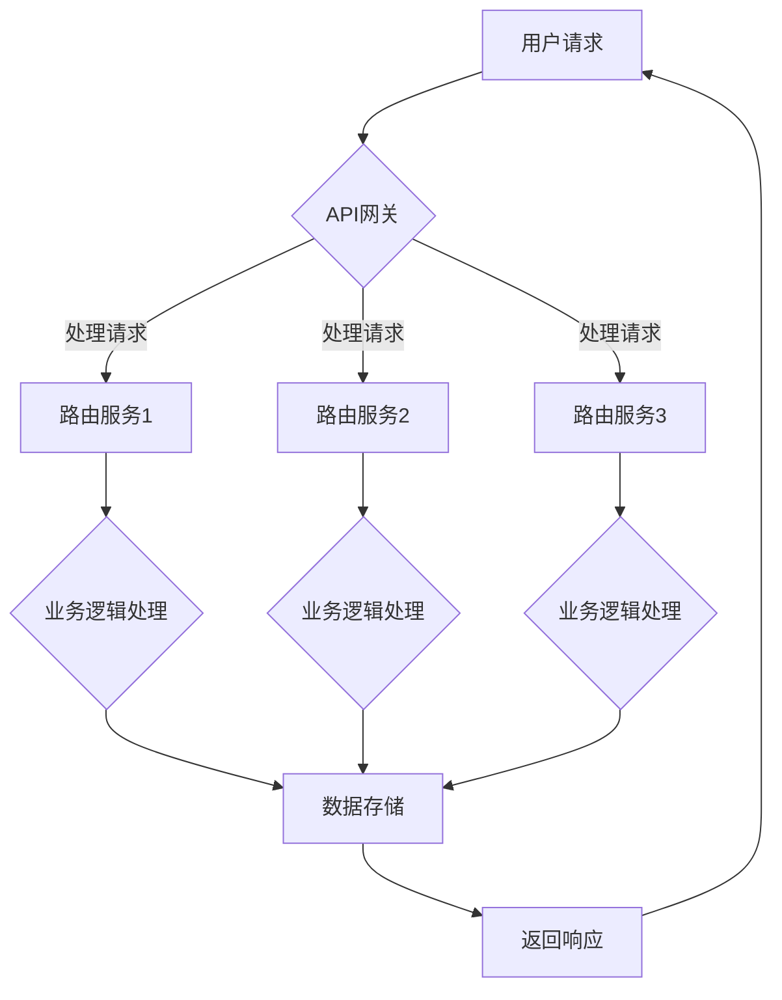
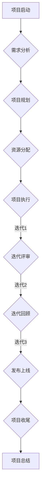
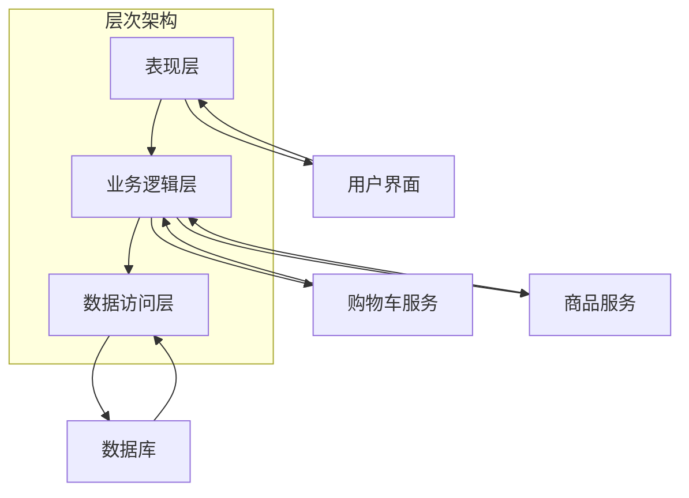
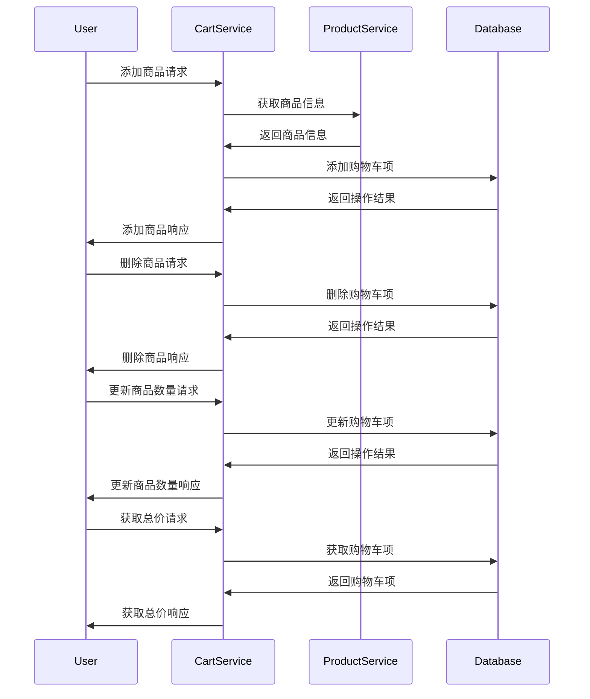

                 

### 文章标题

# P9工作法中的'架构力'：系统设计和架构模式

> 关键词：P9工作法、架构力、系统设计、架构模式、微服务架构、容器化、持续交付

> 摘要：本文将深入探讨P9工作法中的'架构力'，系统性地介绍P9工作法的基本原则和其在不同领域的应用。随后，我们将分析系统设计的核心概念，详细讲解系统架构模式、架构风格以及设计模式。文章还将分享架构力的培养方法，在项目中的应用，以及在团队协作和持续交付中的作用。通过实际案例，我们将展示如何将架构力有效应用到项目中，实现高效稳定的系统设计。

## 目录大纲

1. **P9工作法介绍**

   - [第1章：P9工作法的起源与意义](#第1章p9工作法的起源与意义)
   - [第2章：P9工作法的基本原则](#第2章p9工作法的基本原则)
   - [第3章：P9工作法在实践中的应用](#第3章p9工作法在实践中的应用)
   - [第4章：P9工作法在不同领域的应用](#第4章p9工作法在不同领域的应用)

2. **系统设计核心概念**

   - [第5章：系统设计的核心概念](#第5章系统设计的核心概念)
   - [第6章：系统架构模式](#第6章系统架构模式)
   - [第7章：架构模式与设计模式](#第7章架构模式与设计模式)
   - [第8章：架构风格](#第8章架构风格)

3. **架构力实践**

   - [第9章：架构力的培养与实践](#第9章架构力的培养与实践)
   - [第10章：架构力在项目中的应用](#第10章架构力在项目中的应用)
   - [第11章：架构力在团队协作中的作用](#第11章架构力在团队协作中的作用)
   - [第12章：架构力在持续交付中的应用](#第12章架构力在持续交付中的应用)

4. **附录**

   - [附录A：架构力相关的工具与资源](#附录a架构力相关的工具与资源)
   - [附录B：Mermaid流程图示例](#附录bmermaid流程图示例)
   - [附录C：Python源代码示例](#附录cpython源代码示例)
   - [附录D：数学模型与公式](#附录d数学模型与公式)
   - [附录E：项目](#附录e项目)

## 第1章：P9工作法的起源与意义

### 1.1 P9工作法的定义

P9工作法是一种系统性的工作方法论，旨在通过高效的架构设计和系统优化，实现项目管理的最佳实践。P9工作法不仅包含了对项目执行过程的深入指导，还涵盖了项目设计、团队协作、质量保证等多个方面。这种方法论以架构力为核心，强调系统性和可扩展性，旨在帮助团队在快速迭代的开发过程中保持项目的稳定性和高质量。

P9工作法的基本概念包括：

- **架构导向**：注重系统架构的设计和优化，确保系统的可维护性和可扩展性。
- **系统思考**：以系统化的思维方式，从全局角度分析项目的各个组成部分及其相互作用。
- **快速迭代**：通过快速迭代的方法，不断优化和完善系统设计，提高项目的交付效率。

P9工作法与系统设计的关联在于，它提供了一个全面的方法论框架，使系统能够在设计和实现过程中保持灵活性、稳定性和高效性。通过架构导向、系统思考和快速迭代，P9工作法帮助团队在面对复杂项目时，能够迅速识别问题、调整方案，并持续优化系统性能。

### 1.2 P9工作法的起源

P9工作法起源于20世纪90年代，由一批经验丰富的系统架构师和项目管理专家共同开发。他们的目标是找到一种能够有效应对快速变化和高度复杂性的方法论，以帮助企业在竞争激烈的市场中保持竞争力。经过多年的实践和不断完善，P9工作法逐渐成熟并广泛应用于各个领域。

P9工作法的主要理念来源于现代系统设计和项目管理理论，包括模块化设计、迭代开发、敏捷方法等。它不仅融合了多种先进的设计和开发方法，还强调了团队协作、沟通和知识共享的重要性。这些理念使得P9工作法能够适应不同类型的项目需求，成为现代软件开发和系统设计的重要工具。

### 1.3 P9工作法的意义

P9工作法在系统设计和项目管理中具有深远的意义，主要体现在以下几个方面：

- **提升项目效率**：通过架构导向和快速迭代，P9工作法能够帮助团队快速响应需求变化，提高项目的交付效率。
- **保证系统质量**：注重系统架构的优化和稳定性，确保系统的长期可维护性和高效性能。
- **增强团队协作**：通过系统思考和知识共享，提高团队的协作效率和沟通质量，减少误解和冲突。
- **适应复杂项目**：P9工作法强调灵活性和适应性，使团队能够应对各种复杂的项目需求和环境变化。

总之，P9工作法为现代系统设计和项目管理提供了一种全面、高效、灵活的方法论框架，有助于团队在快速变化的市场环境中保持竞争力。通过不断实践和完善，P9工作法将继续为企业和团队带来更大的价值。

### 第2章：P9工作法的基本原则

P9工作法强调系统性和可扩展性，其基本原则贯穿于项目设计和执行的各个方面。这些原则不仅有助于提升项目的整体效率和质量，还能确保团队在面对复杂问题时能够迅速找到有效的解决方案。

#### 2.1 架构导向

架构导向是P9工作法的核心原则之一，它强调在项目设计阶段就要关注系统架构的优化和稳定性。具体来说，架构导向包括以下几个方面的内容：

- **模块化设计**：将系统划分为若干独立的模块，每个模块负责特定的功能，这样可以提高系统的可维护性和可扩展性。模块化设计使得每个模块可以独立开发、测试和部署，从而减少了项目的复杂度。
  
- **可扩展性**：系统设计时需要考虑未来的扩展需求，预留足够的扩展接口和资源，以便在需求发生变化时能够快速调整和扩展系统功能。可扩展性不仅能够提升系统的灵活性，还能延长系统的生命周期。

- **性能优化**：在系统设计阶段就要考虑系统的性能需求，通过合理的架构设计和优化，确保系统能够高效地处理大规模的数据和用户请求。

架构导向在系统设计中的应用主要体现在以下几个方面：

1. **需求分析**：在项目启动阶段，进行详细的需求分析，明确系统需要实现的功能和性能指标。这些需求将指导后续的架构设计。

2. **架构设计**：根据需求分析的结果，设计系统的整体架构，确定各个模块的职责和交互方式。这个阶段需要综合考虑系统的性能、可扩展性和可维护性。

3. **技术选型**：选择合适的技术和框架来支持系统架构的设计和实现。这包括数据库、中间件、前端框架等，都需要经过仔细评估和比较。

4. **迭代优化**：在项目开发和测试过程中，不断对系统架构进行优化和调整，以适应不断变化的需求和挑战。

#### 2.2 系统思考

系统思考是P9工作法的另一个重要原则，它强调从全局角度分析项目的各个组成部分及其相互作用。系统思考的核心思想是，将项目视为一个复杂的系统，通过分析各个模块之间的联系和互动，找到系统的关键驱动因素和瓶颈。

具体来说，系统思考包括以下几个方面的内容：

- **整体性**：将项目视为一个整体，考虑各个组成部分之间的相互依赖和影响。这种思维方式有助于团队从宏观层面把握项目的全局，避免局部优化带来的问题。

- **反馈机制**：建立有效的反馈机制，通过不断收集和分析项目过程中的数据，及时调整和优化系统的设计和执行。

- **关键驱动因素**：识别影响项目成功的核心因素，如需求变化、资源限制、技术挑战等，并优先解决这些关键问题。

系统思考在系统设计中的应用主要体现在以下几个方面：

1. **需求分析**：在项目启动阶段，通过系统思考的方法，全面分析项目的需求和约束条件，确保项目的整体目标一致。

2. **架构设计**：在系统设计阶段，应用系统思考的方法，分析各个模块之间的交互关系，确保系统的整体性能和稳定性。

3. **风险评估**：通过系统思考的方法，识别项目可能面临的风险和挑战，提前制定应对策略，降低项目失败的风险。

4. **持续优化**：在项目开发和测试过程中，不断应用系统思考的方法，对系统的性能和稳定性进行优化，确保项目能够按计划顺利进行。

#### 2.3 快速迭代

快速迭代是P9工作法中的一项重要原则，它强调通过快速迭代的方法，不断优化和完善系统设计。快速迭代的核心思想是，通过频繁的版本更新和用户反馈，及时识别和解决问题，确保系统始终处于最佳状态。

具体来说，快速迭代包括以下几个方面的内容：

- **小步快走**：每次迭代只完成一个或几个关键功能的开发，确保每个迭代版本都能够尽快发布。

- **用户反馈**：在每次迭代结束后，收集用户的反馈，了解他们对系统的使用体验和需求变化，以便在下一个迭代中进行优化。

- **持续集成**：将每次迭代的结果集成到整个系统中，确保系统的整体性和稳定性。

快速迭代在项目中的应用主要体现在以下几个方面：

1. **需求管理**：通过快速迭代的方法，及时调整和优化需求，确保系统功能与用户需求一致。

2. **风险管理**：每次迭代结束后，对项目中遇到的问题进行总结和反思，提前识别和解决潜在的风险。

3. **质量保证**：通过频繁的测试和用户反馈，确保每个迭代版本的质量和稳定性。

4. **团队协作**：快速迭代需要团队的紧密协作和高效沟通，通过迭代的过程，提高团队的协作能力和工作效率。

总之，P9工作法的基本原则为现代系统设计和项目管理提供了一套全面、高效、灵活的方法论。通过架构导向、系统思考和快速迭代，P9工作法帮助团队在复杂的项目环境中保持竞争力，实现高效、稳定、高质量的系统设计。

### 第3章：P9工作法在实践中的应用

P9工作法不仅提供了一套理论框架，更在实践中被广泛应用，尤其是在项目管理、团队协作和不同领域中的应用方面，它展现出了强大的适应性和高效性。

#### 3.1 项目管理

在项目管理中，P9工作法通过其架构导向、系统思考和快速迭代的原则，提供了一套科学的方法来确保项目能够按计划顺利进行。以下是P9工作法在项目管理中的具体应用：

1. **项目规划**：在项目启动阶段，通过系统思考的方法，全面分析项目的需求和约束条件，制定详细的项目计划和里程碑。P9工作法强调将项目视为一个整体，确保各个阶段的任务和目标相互衔接。

2. **进度监控**：通过快速迭代的方法，实时监控项目的进度和质量。每次迭代结束后，对项目的关键指标进行评估，确保项目按计划推进。

3. **风险管理**：通过识别和评估项目中的风险，制定相应的应对策略。P9工作法强调在项目过程中不断进行风险评估和调整，确保项目能够顺利应对各种变化和挑战。

4. **资源管理**：合理分配项目资源，确保人力资源、技术资源和财务资源能够高效利用。通过系统思考，优化资源分配，提高项目的整体效率。

#### 3.2 团队协作

团队协作是项目成功的关键因素之一，P9工作法通过其架构导向和系统思考的原则，提供了一套有效的团队协作机制。以下是P9工作法在团队协作中的具体应用：

1. **模块化分工**：根据系统设计的要求，将项目任务分解为若干模块，每个模块由专门的团队负责。这种模块化的分工方式可以提高团队的专业性和工作效率。

2. **知识共享**：通过系统思考的方法，建立有效的知识共享机制，确保团队成员能够随时获取到最新的项目信息和经验教训。知识共享有助于减少重复劳动，提高团队的整体能力。

3. **沟通与反馈**：建立高效的沟通渠道，确保团队成员之间的信息畅通。通过定期的团队会议和迭代回顾，及时解决团队内部的问题和冲突。

4. **协作工具**：利用现代协作工具，如项目管理软件、版本控制系统和在线会议平台，提高团队的协作效率。P9工作法鼓励团队采用先进的技术手段，提升协作效果。

#### 3.3 不同领域中的应用

P9工作法在各个领域中的应用体现了其灵活性和适应性。以下是P9工作法在几个主要领域中的具体应用实例：

1. **互联网行业**：在互联网行业，P9工作法被广泛应用于电子商务、社交媒体和在线教育等领域的项目开发。通过架构导向和快速迭代的方法，互联网公司能够快速响应市场需求，持续优化产品功能。

2. **金融行业**：金融行业对系统的稳定性和安全性要求极高。P9工作法通过系统思考和模块化设计，帮助金融机构构建高可用、高性能的金融系统。例如，在银行支付系统和证券交易系统的设计中，P9工作法提供了有效的架构优化和风险管理策略。

3. **制造业**：在制造业中，P9工作法被用于智能制造、供应链管理和生产调度等领域。通过架构导向和系统思考，制造业公司能够实现生产过程的自动化和智能化，提高生产效率。

#### 3.4 案例分析

为了更好地理解P9工作法在实践中的应用，以下是一个在电子商务领域的实际案例分析：

某电子商务公司计划开发一个全新的购物平台，需要在短时间内上线并满足大量用户的需求。以下是P9工作法在该项目中的具体应用：

1. **项目规划**：在项目启动阶段，通过系统思考的方法，全面分析市场需求和用户行为，确定平台的核心功能和性能要求。项目计划分为多个阶段，每个阶段都有明确的里程碑和目标。

2. **架构设计**：采用微服务架构，将平台划分为订单处理、用户管理、支付系统等独立的模块。每个模块都有独立的数据库和API接口，确保系统的可扩展性和高可用性。

3. **快速迭代**：项目采用敏捷开发方法，每次迭代周期为两周。每次迭代结束后，通过用户反馈和数据分析，识别和解决系统中的问题，优化平台功能。

4. **团队协作**：项目团队由前端开发、后端开发、测试和运维等多个角色组成。通过模块化分工和高效的沟通渠道，确保每个模块能够高效协同，快速响应需求变化。

通过P9工作法的应用，该电子商务平台在短时间内成功上线，并实现了稳定、高效的用户体验。平台上线后，用户反馈良好，公司实现了预期业务目标。

总之，P9工作法在实践中的应用展示了其强大的适应性和高效性。通过架构导向、系统思考和快速迭代的方法，P9工作法帮助团队在复杂的项目环境中保持竞争力，实现高质量的系统设计和项目交付。

### 第4章：P9工作法在不同领域的应用

P9工作法作为一种全面、高效的方法论，已经在多个领域展现出了其独特的价值和强大的适应能力。以下将详细探讨P9工作法在互联网行业、金融行业和制造业中的应用情况，通过具体案例展示其在不同领域的实际操作和成效。

#### 4.1 互联网行业

在互联网行业，尤其是电子商务、社交媒体和在线服务等领域，P9工作法被广泛应用。以下是P9工作法在电子商务平台开发中的实际应用案例。

**案例：某大型电商平台**

某大型电商平台在拓展新市场时，需要快速开发一个本地化的购物平台。为了在短时间内满足市场需求，项目团队决定采用P9工作法。

1. **需求分析**：在项目启动阶段，通过系统思考的方法，分析市场需求和用户行为，确定平台的核心功能和性能要求。例如，平台需要支持多种支付方式、强大的搜索功能和高效的用户管理机制。

2. **架构设计**：采用微服务架构，将平台划分为多个独立的微服务，如订单处理服务、支付服务、用户管理服务等。每个微服务都有独立的数据库和API接口，确保系统的可扩展性和高可用性。

3. **快速迭代**：项目采用敏捷开发方法，每次迭代周期为两周。每次迭代结束后，通过用户反馈和数据分析，识别和解决系统中的问题，不断优化平台功能。

4. **团队协作**：项目团队由前端开发、后端开发、测试和运维等多个角色组成。通过模块化分工和高效的沟通渠道，确保每个模块能够高效协同，快速响应需求变化。

通过P9工作法的应用，该电商平台在短时间内成功上线，并实现了稳定、高效的用户体验。平台上线后，用户反馈良好，公司实现了预期业务目标。P9工作法帮助团队在快速迭代中不断优化系统，提高了平台的竞争力和用户满意度。

#### 4.2 金融行业

金融行业对系统的稳定性和安全性要求极高，P9工作法在金融系统的设计和开发中发挥了重要作用。以下是P9工作法在银行支付系统中的实际应用案例。

**案例：某银行支付系统升级**

某银行计划对其现有的支付系统进行升级，以支持更高的交易量和更复杂的业务场景。为了确保系统升级的顺利进行，银行决定采用P9工作法。

1. **需求分析**：通过系统思考的方法，分析现有支付系统的性能瓶颈和业务需求，确定新系统的功能要求和性能指标。

2. **架构设计**：采用分布式架构，将支付系统划分为多个独立的服务，如交易处理服务、风控服务、账务处理服务等。每个服务都有独立的数据库和API接口，确保系统的可扩展性和高可用性。

3. **快速迭代**：在系统升级过程中，采用分阶段迭代的方法，每次迭代只升级部分功能模块。通过用户反馈和数据分析，及时识别和解决系统中的问题。

4. **风险管理**：通过识别和评估系统升级过程中的风险，制定相应的应对策略，确保系统升级过程中能够平稳过渡。

通过P9工作法的应用，该银行支付系统成功升级，并实现了更高的交易处理能力和更复杂的业务场景支持。系统升级后，交易成功率显著提高，用户满意度大幅提升。P9工作法帮助银行在快速迭代中优化系统，提高了支付系统的安全性和稳定性。

#### 4.3 制造业

在制造业中，P9工作法被广泛应用于智能制造、供应链管理和生产调度等领域。以下是P9工作法在智能制造系统设计中的实际应用案例。

**案例：某制造业公司智能工厂建设**

某制造业公司计划建设一个智能工厂，以提高生产效率和降低成本。为了实现这一目标，公司决定采用P9工作法。

1. **需求分析**：通过系统思考的方法，分析现有生产流程和业务需求，确定智能工厂的功能要求和性能指标。例如，智能工厂需要支持自动化生产、实时监控和远程管理等功能。

2. **架构设计**：采用物联网架构，将生产设备、传感器和数据采集系统连接起来，形成一个智能化的生产网络。每个设备都有独立的通信接口和API，确保系统的互操作性和可扩展性。

3. **快速迭代**：在智能工厂建设过程中，采用分阶段迭代的方法，逐步实现各个功能模块。每次迭代结束后，通过用户反馈和数据分析，优化系统功能。

4. **团队协作**：项目团队由机械工程师、软件工程师、数据分析师等组成。通过模块化分工和高效的沟通渠道，确保每个模块能够高效协同，快速响应需求变化。

通过P9工作法的应用，该制造业公司成功建设了一个智能工厂，实现了生产过程的自动化和智能化。智能工厂上线后，生产效率提高了30%，运营成本降低了20%。P9工作法帮助公司在快速迭代中不断优化系统，提高了生产效率和竞争力。

总之，P9工作法在互联网行业、金融行业和制造业中的成功应用，展示了其强大的适应性和高效性。通过架构导向、系统思考和快速迭代的方法，P9工作法帮助团队在复杂的项目环境中保持竞争力，实现高质量的系统设计和项目交付。

### 第5章：系统设计的核心概念

系统设计是软件开发过程中的关键环节，它关乎系统的稳定性、扩展性和用户体验。要理解系统设计，首先需要明确系统的定义、组成部分及其相互关系。

#### 5.1 系统的概念

系统是由多个相互关联的组件组成的整体，这些组件协同工作，以实现特定的目标或功能。在软件开发中，系统通常指一个独立的、完整的软件解决方案，它由多个模块、组件和层次组成。

- **系统定义**：系统是一种有序结构的整体，各个组成部分通过相互作用和相互依赖，共同实现特定的功能。
  
- **系统组成部分**：系统通常由以下组成部分构成：

  - **模块**：系统中的基本功能单元，每个模块负责实现特定的功能。
  
  - **组件**：模块中的子部分，负责具体的业务逻辑和数据操作。
  
  - **接口**：模块之间的交互接口，定义了模块之间传递数据和请求服务的方式。

- **系统层次**：系统通常可以分为多个层次，如表现层、业务逻辑层和数据访问层。每个层次负责不同的功能，相互协作，共同实现系统的整体目标。

#### 5.2 系统的组成部分

了解系统的组成部分对于系统设计至关重要。以下是系统设计中的主要组成部分及其作用：

- **模块**：模块是系统的基本功能单元，每个模块通常实现一个独立的功能，例如用户管理模块、订单处理模块等。模块的独立性使得系统易于维护和扩展。

- **组件**：组件是模块中的子部分，负责具体的业务逻辑和数据操作。例如，用户管理模块中的组件可能包括用户注册组件、用户登录组件等。

- **接口**：接口是模块之间的交互接口，定义了模块之间传递数据和请求服务的方式。良好的接口设计有助于提高系统的模块化水平和可扩展性。

#### 5.3 系统的相互关系

系统中的各个组成部分通过相互作用和相互依赖，共同实现系统的整体功能。以下是系统内部的主要相互关系：

- **模块间的依赖**：系统中的各个模块之间存在依赖关系，一个模块的输出可能作为另一个模块的输入。这种依赖关系需要通过接口进行传递。

- **组件间的协作**：组件之间通过接口协作，共同完成一个功能模块的任务。良好的组件协作可以提高系统的效率和可靠性。

- **层次间的调用**：系统中的不同层次通过调用接口，实现功能层次间的数据传递和业务逻辑的执行。层次间的调用关系需要清晰定义，以确保系统的整体性和可维护性。

#### 5.4 系统设计的核心要素

在系统设计过程中，需要关注以下核心要素，以确保系统的高效、稳定和可扩展性：

- **功能需求**：系统设计需要满足用户的需求，包括功能需求、性能需求和安全性需求等。

- **技术选型**：选择合适的技术和工具，以支持系统设计的要求。技术选型需要考虑系统的性能、可扩展性和维护成本。

- **架构设计**：系统架构设计是系统设计的关键环节，它决定了系统的整体结构和性能。良好的架构设计能够提高系统的可扩展性和可维护性。

- **接口定义**：接口定义是系统设计中的重要部分，它定义了模块之间的交互方式和数据传递格式。良好的接口设计能够提高系统的模块化水平和可扩展性。

- **安全性设计**：系统设计需要考虑安全性需求，包括数据保护、用户认证和权限控制等。安全性设计是确保系统安全稳定运行的关键。

#### 5.5 系统设计的关键原则

在系统设计过程中，需要遵循以下关键原则，以确保系统的质量和稳定性：

- **模块化原则**：将系统划分为多个独立的模块，每个模块实现一个独立的功能，降低系统的复杂度，提高可维护性。

- **可扩展性原则**：在设计系统时，需要考虑未来的扩展需求，预留足够的扩展接口和资源，以提高系统的灵活性和可扩展性。

- **性能优化原则**：在系统设计过程中，需要关注系统的性能需求，通过优化算法、缓存机制和并发处理等技术，提高系统的响应速度和吞吐量。

- **安全性原则**：在系统设计过程中，需要考虑安全性需求，包括数据加密、用户认证和权限控制等，确保系统的数据安全和用户隐私。

通过深入理解系统的定义、组成部分及其相互关系，以及系统设计的核心要素和关键原则，开发者能够设计出高效、稳定和可扩展的系统，为项目成功奠定坚实的基础。

### 第6章：系统架构模式

系统架构模式是系统设计中的重要环节，它决定了系统的结构、性能和可扩展性。在本章节中，我们将详细探讨几种常见的系统架构模式，包括微服务架构、容器化与微服务、以及API网关。

#### 6.1 微服务架构

微服务架构是一种面向服务的架构模式，它将应用程序拆分成多个独立的、小型服务。每个服务运行在其独立的进程中，并使用轻量级的通信机制（如HTTP/REST）进行交互。

**微服务架构的定义与特点**：

- **定义**：微服务架构是一种将应用程序拆分为多个独立服务的方法，每个服务具有自己的业务功能，可以独立部署、扩展和升级。

- **特点**：

  - **独立性**：每个服务独立运行，可以独立开发、测试和部署，降低了系统的耦合度。

  - **可扩展性**：服务可以水平扩展，即通过增加服务的实例数量来提高系统的处理能力。

  - **弹性**：服务可以独立失败，不会影响到其他服务的运行，提高了系统的可靠性。

  - **技术多样性**：每个服务可以使用不同的编程语言、数据库和框架，提高了系统的灵活性和适应性。

**微服务架构的设计原则**：

- **单一职责**：每个服务应只负责一个特定的业务功能，避免服务的职责过于复杂。

- **自治**：服务应具有自治性，包括配置管理、数据存储和资源管理等。

- **松耦合**：服务之间通过轻量级通信机制进行交互，降低服务之间的依赖。

- **标准化**：采用标准化的接口和数据格式，提高服务的互操作性和可维护性。

**微服务架构的优缺点**：

- **优点**：

  - 提高系统的可维护性和可扩展性。

  - 灵活的技术选型，适应不同的业务需求。

  - 独立部署和升级，降低系统的风险。

- **缺点**：

  - 复杂的架构设计，增加了系统的复杂度和维护成本。

  - 服务间通信可能导致性能瓶颈。

#### 6.2 容器化与微服务

容器化是一种轻量级虚拟化技术，通过将应用程序及其依赖环境打包成一个独立的容器，实现应用程序的部署和运行。容器化与微服务架构的结合，能够进一步提升系统的可扩展性和部署效率。

**容器化的基础**：

- **定义**：容器化是一种将应用程序及其运行环境封装在一个容器中的技术，容器提供了隔离、轻量和高效的运行环境。

- **特点**：

  - **轻量级**：容器使用宿主机的操作系统内核，无需额外的虚拟化层，具有高效的性能。

  - **可移植性**：容器可以在不同的操作系统和硬件环境中运行，提高了应用程序的可移植性。

  - **可扩展性**：容器可以轻松地水平扩展，通过增加容器实例的数量来提高系统的处理能力。

**容器化在微服务中的应用**：

- **部署与扩展**：容器化使得微服务的部署和扩展更加简单和高效。通过容器编排工具（如Docker、Kubernetes），可以轻松管理微服务的部署和扩展。

- **服务编排**：容器编排工具可以自动化地部署、管理和扩展容器化微服务，提高了系统的灵活性和自动化水平。

- **持续集成与持续部署**：容器化技术与持续集成和持续部署（CI/CD）相结合，可以实现快速、可靠的应用程序交付。

**容器化的优缺点**：

- **优点**：

  - 提高部署和扩展的效率。

  - 提高系统的可移植性和一致性。

  - 简化应用程序的部署和管理。

- **缺点**：

  - 可能导致系统资源的过度消耗。

  - 需要额外的管理和维护成本。

#### 6.3 API网关

API网关是微服务架构中的一个关键组件，它负责处理外部请求的入口，对请求进行路由、认证、日志记录等处理，然后转发给相应的微服务。

**API网关的功能与设计**：

- **功能**：

  - **请求路由**：将外部请求路由到相应的微服务。

  - **认证与授权**：对请求进行身份验证和授权，确保只有合法的用户和系统可以访问微服务。

  - **日志记录与监控**：记录请求和响应的日志，监控系统的运行状态，提供故障排查和性能分析的支持。

  - **数据转换与格式化**：将来自不同微服务的响应数据格式化，确保统一的数据格式和响应结构。

- **设计**：

  - **集中式处理**：API网关作为请求的入口，集中处理请求的路由、认证和日志记录，提高系统的安全性和管理效率。

  - **反向代理**：API网关可以作为反向代理，缓存频繁访问的数据，减少对后端微服务的访问压力。

  - **流量控制**：通过限流和熔断策略，防止大量请求对系统造成过载，确保系统的稳定运行。

**API网关在系统架构中的作用**：

- **统一接口**：API网关为外部用户提供统一的接口，简化了系统的使用和管理。

- **安全性保障**：通过API网关进行认证和授权，提高系统的安全性。

- **性能优化**：通过缓存和流量控制，提高系统的响应速度和吞吐量。

- **系统监控**：API网关提供日志记录和监控功能，帮助团队及时识别和解决系统问题。

综上所述，微服务架构、容器化和API网关是现代系统架构中的关键模式。通过合理地应用这些模式，可以构建出高效、稳定和可扩展的系统，满足不断变化的市场需求。

### 第7章：架构模式与设计模式

在系统架构设计中，架构模式与设计模式是两个核心概念，它们分别从不同的层面指导系统的设计和实现。架构模式主要关注系统的整体结构和组织方式，而设计模式则侧重于具体的组件和类的设计。以下将详细探讨架构模式和设计模式的基本概念、分类及其在系统设计中的应用。

#### 7.1 设计模式概述

设计模式是一套在软件工程中广泛使用的设计解决方案，它描述了如何解决特定类型的问题。设计模式具有可重用性、灵活性和可理解性，可以显著提高代码的质量和可维护性。

**设计模式的基本概念**：

- **定义**：设计模式是一种在软件设计中广泛使用的设计解决方案，描述了如何解决特定类型的问题。

- **特点**：

  - **可重用性**：设计模式提供了一套通用的解决方案，可以重复应用于不同的项目中。

  - **灵活性**：设计模式可以根据具体需求进行灵活调整，以适应不同的场景。

  - **可理解性**：设计模式通过简单的命名和结构，使得设计方案易于理解和沟通。

**设计模式在系统设计中的应用**：

设计模式广泛应用于系统设计中的各个层次，从模块化设计到接口定义，从数据库设计到前端界面。以下是几个常见的设计模式及其应用场景：

- **单例模式**：确保一个类只有一个实例，并提供一个访问它的全局访问点。

  - **应用场景**：用于管理共享资源，如数据库连接池、线程池等。

- **工厂模式**：定义一个创建对象的接口，但将具体的对象创建委托给子类。

  - **应用场景**：用于创建复杂对象，或当对象的创建逻辑较为复杂时。

- **适配器模式**：将一个类的接口转换成客户希望的另一个接口，使得原本由于接口不兼容而无法在一起工作的类可以协同工作。

  - **应用场景**：用于兼容新旧系统，或当需要将多个接口统一时。

- **装饰者模式**：动态地给一个对象添加一些额外的职责，比直接修改类的方法更为灵活。

  - **应用场景**：用于在不修改类的前提下，为类添加新的功能。

#### 7.2 常见设计模式

在系统设计中，以下几种设计模式被广泛应用，它们在不同的场景下提供了有效的解决方案。

**单例模式**

- **定义**：确保一个类只有一个实例，并提供一个访问它的全局访问点。

- **实现**：通常通过构造函数的私有化以及使用静态变量和静态工厂方法来实现。

- **优缺点**：

  - **优点**：控制了实例的创建，确保资源不被浪费。

  - **缺点**：可能导致代码难以测试和调试。

**工厂模式**

- **定义**：定义一个创建对象的接口，但将具体的对象创建委托给子类。

- **实现**：通过抽象类或接口定义创建对象的操作，具体子类负责实现具体的创建逻辑。

- **优缺点**：

  - **优点**：提高了系统的可扩展性和可维护性。

  - **缺点**：增加了代码的复杂性，可能导致类数量增加。

**适配器模式**

- **定义**：将一个类的接口转换成客户希望的另一个接口，使得原本由于接口不兼容而无法在一起工作的类可以协同工作。

- **实现**：通过创建一个适配器类，将适配者（Adaptee）的接口转换为适配者（Adapter）的接口。

- **优缺点**：

  - **优点**：提高了系统的兼容性和灵活性。

  - **缺点**：可能导致系统变得更加复杂。

**装饰者模式**

- **定义**：动态地给一个对象添加一些额外的职责，比直接修改类的方法更为灵活。

- **实现**：通过创建一个装饰者类，继承被装饰者（Component）的接口，并在内部维持一个被装饰者对象的引用。

- **优缺点**：

  - **优点**：在不修改原始类的前提下，增加或修改类的功能。

  - **缺点**：可能导致性能问题，因为装饰者链可能会增加额外的处理开销。

#### 7.3 设计模式在系统设计中的应用示例

以下是一个使用设计模式的系统设计示例，通过工厂模式创建数据库连接对象，使用单例模式管理日志记录器，使用适配器模式整合不同的数据库驱动，以及使用装饰者模式添加日志功能。

**示例：数据库访问层的设计**

1. **工厂模式**：使用工厂模式创建数据库连接对象。

   ```python
   class DatabaseFactory:
       def getConnection(self, db_type):
           if db_type == "mysql":
               return MySQLConnection()
           elif db_type == "oracle":
               return OracleConnection()
           else:
               raise ValueError("Unsupported database type")

   class MySQLConnection:
       def connect(self):
           # MySQL连接逻辑
           pass

   class OracleConnection:
       def connect(self):
           # Oracle连接逻辑
           pass
   ```

2. **单例模式**：使用单例模式管理日志记录器。

   ```python
   class Logger:
       _instance = None

       def __new__(cls):
           if cls._instance is None:
               cls._instance = super(Logger, cls).__new__(cls)
           return cls._instance

       def log(self, message):
           # 日志记录逻辑
           pass
   ```

3. **适配器模式**：使用适配器模式整合不同的数据库驱动。

   ```python
   class DatabaseAdapter:
       def __init__(self, adapter):
           self._adapter = adapter

       def connect(self):
           return self._adapter.connect()

   class MySQLAdapter(DatabaseAdapter):
       def __init__(self):
           super().__init__(MySQLConnection())

   class OracleAdapter(DatabaseAdapter):
       def __init__(self):
           super().__init__(OracleConnection())
   ```

4. **装饰者模式**：使用装饰者模式添加日志功能。

   ```python
   class LogDecorator:
       def __init__(self, component):
           self._component = component

       def connect(self):
           self._component.connect()
           self.log("Connected to database")

       def log(self, message):
           print(message)
   ```

通过以上示例，可以看到设计模式在系统设计中的灵活应用，不仅提高了系统的可扩展性和可维护性，还使得代码结构更加清晰和易于理解。

### 第8章：架构风格

架构风格是系统设计中的一种重要概念，它描述了系统的结构、组件间的交互方式以及系统的整体组织形式。常见的架构风格包括客户-服务器架构、分布式架构和大数据架构。每种架构风格都有其独特的特点和应用场景，以下将详细探讨这些架构风格的基本概念、特点、设计和实现。

#### 8.1 架构风格的概念

架构风格是指系统架构的总体设计原则和组织方式，它决定了系统的结构、组件的交互方式以及系统的可扩展性和可维护性。架构风格不仅影响系统的性能和稳定性，还决定了系统的扩展性和灵活性。

**定义**：架构风格是一种系统设计的方法论，它定义了系统的整体结构、组件的组织方式以及组件之间的交互方式。

**特点**：

- **结构清晰**：架构风格提供了系统的整体结构，使得系统的各个部分之间关系明确，便于理解和维护。

- **组件独立性**：架构风格强调组件的独立性，每个组件负责特定的功能，降低了组件之间的耦合度，提高了系统的可扩展性和可维护性。

- **可扩展性**：架构风格提供了系统扩展的途径和方法，使得系统在需求变化时能够快速适应和调整。

- **灵活性**：架构风格为系统的设计和实现提供了灵活性，使得不同的架构模式和方法论能够应用于系统中。

#### 8.2 客户-服务器架构

客户-服务器架构是一种最常见的架构风格，它将系统分为客户端和服务器两部分，客户端负责与用户交互，服务器负责处理业务逻辑和数据存储。

**基本概念**：

- **客户端**：客户端是用户与系统交互的界面，它主要负责数据的输入和显示。

- **服务器**：服务器是系统的主要逻辑处理和数据存储单元，它负责响应用户的请求，执行业务逻辑，并将结果返回给客户端。

**特点**：

- **分层设计**：客户-服务器架构采用分层设计，将系统划分为多个层次，如表示层、业务逻辑层和数据访问层。

- **组件独立性**：客户端和服务器组件相对独立，各自负责不同的功能，降低了系统的耦合度。

- **可扩展性**：系统可以根据需求进行水平或垂直扩展，如增加服务器实例以提高处理能力。

- **性能优化**：通过负载均衡和缓存等技术，优化系统的性能和响应速度。

**设计和实现**：

1. **需求分析**：分析系统的需求和功能，确定客户端和服务器需要实现的功能。

2. **系统架构设计**：设计客户端和服务器之间的接口，确定各个组件的职责和交互方式。

3. **客户端实现**：开发客户端界面，处理用户输入和显示结果。

4. **服务器实现**：开发服务器端逻辑，处理客户端请求，执行业务逻辑，并返回结果。

5. **接口定义**：定义客户端和服务器之间的接口，包括数据格式和通信协议。

6. **性能优化**：通过负载均衡、缓存和异步处理等技术，提高系统的性能和响应速度。

#### 8.3 分布式架构

分布式架构是一种面向服务的架构风格，它通过将系统分解为多个分布式服务，提高系统的可扩展性和可靠性。

**基本概念**：

- **服务**：分布式架构中的基本功能单元，每个服务负责特定的业务功能。

- **服务注册与发现**：服务启动时注册到服务注册中心，客户端通过服务注册中心发现服务实例并进行调用。

- **负载均衡**：分布式架构通过负载均衡器将请求分配到不同的服务实例，提高系统的处理能力和响应速度。

**特点**：

- **高可用性**：通过分布式服务，提高了系统的可靠性和容错能力。

- **可扩展性**：分布式架构可以通过增加服务实例的方式水平扩展，满足不断增长的业务需求。

- **灵活性**：分布式架构使得系统的各个部分可以独立开发、测试和部署，提高了系统的灵活性和适应性。

- **性能优化**：通过分布式处理和异步通信，提高了系统的性能和响应速度。

**设计和实现**：

1. **服务划分**：根据业务需求和功能，将系统划分为多个服务。

2. **服务注册与发现**：使用服务注册中心（如Eureka、Consul）管理服务的注册和发现。

3. **负载均衡**：使用负载均衡器（如Nginx、Spring Cloud LoadBalancer）分配请求到不同的服务实例。

4. **服务实现**：开发各个服务的业务逻辑，确保服务之间通过定义良好的接口进行通信。

5. **数据一致性**：采用分布式事务处理和数据一致性保障机制（如最终一致性、分布式锁等）。

6. **监控与运维**：使用监控系统（如Prometheus、Kibana）对系统运行状态进行监控和告警。

#### 8.4 大数据架构

大数据架构是处理大规模数据集的架构风格，它通过分布式计算和数据存储技术，实现对海量数据的快速处理和分析。

**基本概念**：

- **数据源**：大数据架构中的数据源可以是日志文件、数据库、传感器等。

- **数据存储**：大数据架构使用分布式数据存储系统（如Hadoop HDFS、Apache Cassandra）存储海量数据。

- **数据处理**：大数据架构通过分布式计算框架（如MapReduce、Spark）对数据进行处理和分析。

**特点**：

- **高吞吐量**：通过分布式计算，大数据架构能够处理大规模的数据集。

- **可扩展性**：大数据架构可以通过增加计算节点和数据存储节点进行水平扩展。

- **高可靠性**：分布式存储和计算技术确保数据的高可用性和可靠性。

- **实时性**：通过流处理技术和实时分析，大数据架构能够实时响应业务需求。

**设计和实现**：

1. **数据收集与存储**：设计数据收集系统，将数据存储到分布式数据存储系统。

2. **数据处理与分析**：设计数据处理和分析系统，使用分布式计算框架处理数据。

3. **数据质量管理**：设计数据质量管理流程，确保数据的质量和一致性。

4. **数据存储优化**：通过数据压缩、索引和缓存等技术，优化数据存储性能。

5. **数据安全与隐私**：设计数据安全和隐私保护机制，确保数据的安全和合规性。

通过详细探讨客户-服务器架构、分布式架构和大数据架构，可以看到不同的架构风格在系统设计中的重要性。选择合适的架构风格，能够提高系统的性能、可靠性和可扩展性，满足不断变化的市场需求。

### 第9章：架构力的培养与实践

架构力是系统设计和项目管理中的关键能力，它决定了系统的高效性、稳定性和可扩展性。要培养架构力，不仅需要掌握相关的理论知识，还需要通过实践不断提升自己的能力。以下将详细探讨架构力的定义、重要性及其培养方法。

#### 9.1 架构力的定义

架构力是指对系统架构的理解和设计能力，包括对系统架构模式、设计模式、架构风格和架构原则的掌握。架构力不仅仅是对技术的理解，更是一种系统性的思维方式，它涉及对系统整体结构的把握、对组件间交互的理解以及对系统性能和可扩展性的优化。

**定义**：架构力是指对系统架构的深入理解、分析和设计能力，包括系统架构模式、设计模式、架构风格和架构原则的掌握。

**组成部分**：

- **系统架构设计能力**：能够根据需求设计合理的系统架构，确保系统的性能、稳定性和可扩展性。

- **模块化设计能力**：能够将系统分解为独立的模块，每个模块负责特定的功能，提高系统的可维护性和可扩展性。

- **接口设计能力**：能够设计良好的接口，确保模块之间的清晰交互，降低系统的耦合度。

- **架构优化能力**：能够根据系统的运行数据和用户反馈，对系统架构进行优化，提高系统的性能和可扩展性。

- **技术选型能力**：能够根据项目需求选择合适的技术和工具，确保系统的技术先进性和可维护性。

#### 9.2 架构力的重要性

架构力在系统设计和项目管理中具有至关重要的地位，它直接影响系统的质量和项目成功与否。以下是架构力的重要性体现：

- **提高系统质量**：通过合理的架构设计和优化，可以显著提高系统的稳定性和性能，减少系统故障和性能瓶颈。

- **降低维护成本**：良好的架构设计使得系统易于维护和扩展，降低了维护成本。

- **提升项目效率**：架构力能够帮助团队快速识别和解决问题，提高项目的开发效率和交付速度。

- **增强团队协作**：架构力有助于团队成员理解和沟通系统架构，增强团队协作和沟通。

- **提高系统可扩展性**：通过合理的架构设计，预留足够的扩展接口和资源，使系统能够适应未来业务需求的变化。

#### 9.3 架构力培养方法

要培养架构力，不仅需要系统的理论学习，还需要通过实践不断提升。以下是一些有效的架构力培养方法：

**理论学习**：

- **阅读经典架构书籍**：阅读《架构师的实践》、《软件架构：实践者的研究方法》等经典书籍，了解系统架构设计的基本原则和方法。

- **学习架构模式与设计模式**：掌握常见的架构模式（如微服务架构、分布式架构）和设计模式（如单例模式、工厂模式），了解它们的应用场景和实现方法。

- **研究前沿技术**：关注最新的技术趋势和架构模式，如容器化、云计算和大数据技术，了解它们的架构设计和应用。

**实践应用**：

- **参与实际项目**：在项目实践中，积累系统架构设计和优化的经验，通过实际操作掌握架构设计的方法和技巧。

- **案例分析**：研究成功的系统架构案例，分析其架构设计、技术选型和优化策略，学习经验教训。

- **设计实践**：进行系统架构设计和优化实践，如设计微服务架构、分布式架构和大数据架构，通过实践提升架构设计能力。

**经验分享**：

- **参加架构会议**：参加架构师会议和技术交流会，与同行交流架构设计和优化经验，学习不同的架构方法和思路。

- **编写技术博客**：通过撰写技术博客，总结架构设计和优化的经验，分享给社区，提升自己的技术影响力。

**持续学习**：

- **参加在线课程**：参加架构设计相关的在线课程，如Coursera、Udemy等平台上的高级架构课程，系统性地提升架构力。

- **阅读技术文献**：定期阅读技术文献和期刊，了解最新的研究进展和趋势，持续更新自己的知识体系。

通过理论学习、实践应用和经验分享，可以逐步培养和提升架构力。架构力不仅对个人职业发展具有重要意义，也对团队和项目的成功起到关键作用。

### 第10章：架构力在项目中的应用

在项目开发中，架构力是确保项目成功的关键因素之一。通过有效的架构设计，项目团队能够实现高效、稳定的系统开发，提高项目的交付质量和效率。以下是架构力在项目中的应用，包括项目架构设计、架构评审和架构优化等方面。

#### 10.1 项目架构设计

项目架构设计是项目开发的重要环节，它决定了系统的整体结构、组件的组织方式以及系统的可扩展性和可维护性。以下是在项目架构设计中，架构力如何发挥关键作用：

- **需求分析**：在项目启动阶段，通过对用户需求和市场趋势的深入分析，确定项目的功能需求和性能指标。架构师需要运用架构力，识别系统的关键需求和潜在问题。

- **架构方案选择**：根据需求分析的结果，选择合适的系统架构模式，如微服务架构、分布式架构或客户-服务器架构。架构师需要根据项目的特点，权衡不同架构模式的优缺点，选择最合适的方案。

- **模块划分**：将系统划分为多个独立的模块，每个模块负责特定的功能。架构师需要运用架构力，确保模块的独立性、可扩展性和可维护性。

- **接口设计**：设计模块之间的接口，确保模块之间的交互清晰、简洁。良好的接口设计有助于提高系统的模块化和可扩展性。

- **技术选型**：选择合适的技术和工具，以支持系统架构的设计和实现。架构师需要根据项目的需求和技术栈，评估不同的技术选项，选择最适合的技术方案。

#### 10.2 架构评审

架构评审是项目开发过程中至关重要的一环，它有助于发现和解决系统架构中的潜在问题，确保项目的架构设计符合预期。以下是架构评审的作用和流程：

- **作用**：

  - **发现设计缺陷**：通过架构评审，可以发现系统架构中的设计缺陷和潜在问题，如性能瓶颈、数据一致性问题和安全性漏洞。

  - **确保一致性**：架构评审有助于确保项目的架构设计一致性和规范性，减少设计冲突和重复劳动。

  - **优化设计**：架构评审提供了优化系统架构的机会，通过专家的评审和建议，可以进一步优化系统的性能和可扩展性。

- **流程**：

  - **需求评审**：在项目启动阶段，对项目需求进行评审，确保需求分析的准确性和完整性。

  - **架构设计评审**：在架构设计阶段，对系统架构进行评审，评估架构方案的合理性、模块划分的合理性、接口设计的清晰性等。

  - **技术选型评审**：对项目采用的技术和工具进行评审，确保技术选型的合理性和先进性。

  - **定期回顾**：在项目开发过程中，定期进行架构回顾，评估架构设计的执行情况和优化机会。

#### 10.3 架构优化

在项目开发过程中，架构优化是确保系统稳定性和可扩展性的重要手段。架构力的发挥可以帮助团队持续优化系统架构，提高项目的交付质量。以下是架构优化的方法和策略：

- **性能优化**：通过监控和分析系统的性能数据，识别系统的性能瓶颈，采用缓存、异步处理和数据库优化等技术进行性能优化。

- **模块重构**：根据项目的反馈和实际运行情况，对模块进行重构，优化模块间的交互方式和数据传递方式，提高系统的模块化和可维护性。

- **技术升级**：随着技术的发展，及时升级系统的技术和工具，采用更先进的技术和框架，提高系统的性能和可扩展性。

- **架构演进**：根据业务需求的变化，逐步演进系统架构，适应新的业务场景和需求，确保系统架构的持续优化和改进。

通过架构力在项目架构设计、架构评审和架构优化中的应用，项目团队能够实现高效、稳定的系统开发，提高项目的交付质量和效率。架构力的提升不仅有助于项目的成功，也为团队成员的职业发展提供了重要支持。

### 第11章：架构力在团队协作中的作用

在团队协作中，架构力扮演着关键角色，它不仅能够提高团队的协作效率，还能增强团队的决策能力和解决问题的能力。以下是架构力在团队协作中的作用，包括如何培养架构力以及其在团队协作中的实践。

#### 11.1 架构力在团队协作中的作用

架构力在团队协作中的作用主要体现在以下几个方面：

- **提高协作效率**：通过架构力的作用，团队成员能够更清晰地理解系统架构和组件之间的交互关系，减少误解和沟通障碍，从而提高协作效率。

- **增强决策能力**：架构力使团队成员能够从全局视角分析问题，识别关键因素和潜在风险，提高团队在项目决策中的准确性。

- **优化团队结构**：架构力有助于团队在组织结构上做出更合理的安排，确保团队成员的职责和任务明确，提高团队的协作效率。

- **提升问题解决能力**：架构力使团队成员能够更迅速地识别和解决问题，通过架构思维和方法，找到系统的瓶颈和优化点。

#### 11.2 如何培养架构力

要培养架构力，团队成员需要通过系统的学习和实践，不断提升自己的架构设计能力和系统思维能力。以下是一些有效的培养方法：

- **理论学习**：阅读经典架构书籍和文档，如《架构师的实践》、《软件架构：实践者的研究方法》等，了解系统架构设计的基本原则和方法。

- **实践应用**：参与实际项目，通过项目实践积累架构设计和优化的经验，学习如何在不同的项目中应用架构力。

- **案例分析**：研究成功的架构案例，分析其设计思路和优化策略，学习经验教训，提升自己的架构设计能力。

- **技术交流**：参加架构师会议和技术交流会，与同行交流架构设计和优化的经验，借鉴不同的架构方法和思路。

- **在线学习**：参加在线课程和培训，学习最新的架构设计技术和工具，如微服务架构、容器化技术等。

- **编写文档**：撰写系统架构设计文档和技术博客，总结自己的架构设计和优化经验，提升自己的技术影响力。

#### 11.3 架构力在团队协作中的实践

在实际团队协作中，架构力可以通过以下方式得到应用：

- **明确职责**：通过架构力，团队成员能够明确自己在系统架构中的职责和任务，确保每个人都知道自己的工作内容和目标。

- **优化流程**：架构力有助于团队优化项目开发流程，识别和消除流程中的瓶颈和浪费，提高团队的工作效率。

- **沟通协作**：架构力使团队成员能够更有效地沟通和协作，通过清晰的架构设计和文档，确保每个人都能理解系统的整体结构和组件交互。

- **问题解决**：在遇到技术难题时，架构力使团队成员能够迅速分析问题，找到解决方案，提高团队的问题解决能力。

- **持续改进**：架构力使团队能够在项目开发过程中不断进行架构优化，根据实际运行情况和用户反馈，持续改进系统设计。

总之，架构力在团队协作中发挥着重要作用，通过培养和提升架构力，团队能够提高协作效率，优化项目流程，增强问题解决能力，实现项目的成功交付。架构力的提升不仅有助于团队的发展，也为团队成员的个人职业成长提供了有力支持。

### 第12章：架构力在持续交付中的应用

持续交付是一种敏捷的软件开发和交付方法，它强调通过快速、频繁的迭代和自动化流程，实现软件的持续交付和部署。架构力在持续交付中起着至关重要的作用，它能够确保系统的高效、稳定和可靠交付。以下将详细探讨架构力在持续交付中的应用，包括持续交付的概念、架构力在持续交付中的实践、以及持续交付中的挑战和解决方案。

#### 12.1 持续交付的概念

持续交付是一种通过自动化流程实现软件快速迭代和交付的方法，它强调软件的持续集成、测试和部署。持续交付的目标是使软件能够随时发布，且在每次发布后都能保持稳定运行。

**概念**：

- **持续集成**：持续集成（CI）是一种通过自动化构建和测试，确保代码库中的代码始终处于可运行状态的方法。每次代码提交后，CI系统都会自动构建和测试，确保代码的质量和一致性。

- **持续测试**：持续测试（CT）是指在软件开发过程中，通过自动化测试持续验证软件的功能和性能。持续测试包括单元测试、集成测试、性能测试等，确保软件在每次迭代后都能稳定运行。

- **持续部署**：持续部署（CD）是一种通过自动化流程实现软件的部署和发布的方法。持续部署可以确保软件在每次迭代后都能快速、稳定地交付给用户。

**优势**：

- **快速反馈**：持续交付能够快速发现和解决代码中的问题，确保软件的质量。

- **减少风险**：通过自动化测试和部署，持续交付减少了手动操作的风险，提高了交付的稳定性。

- **提高效率**：持续交付通过自动化流程，提高了开发和部署的效率，缩短了交付周期。

- **用户体验**：持续交付能够更快地将新功能交付给用户，提高了用户体验和用户满意度。

#### 12.2 架构力在持续交付中的实践

架构力在持续交付中的应用主要体现在以下几个方面：

- **架构设计**：通过合理的架构设计，确保系统能够支持持续交付的需求。架构设计需要考虑系统的可扩展性、模块化和自动化，为持续交付提供技术支持。

- **自动化工具**：采用自动化工具（如Jenkins、GitLab CI/CD等）实现持续集成、测试和部署。自动化工具能够提高交付的效率和稳定性。

- **持续集成**：通过持续集成，将代码提交后的构建和测试自动化，确保每次代码提交都是可运行的。架构力在这个过程中体现在对持续集成流程的设计和优化。

- **持续测试**：通过自动化测试，确保每次迭代后的软件都能稳定运行。架构力在这个过程中体现在测试策略的设计、测试脚本的编写和测试数据的准备。

- **持续部署**：通过自动化部署，实现软件的快速发布和部署。架构力在这个过程中体现在部署流程的设计、部署脚本的开发和部署策略的优化。

**实践案例**：

某电商公司在持续交付中采用了P9工作法，通过架构力实现高效的持续交付。以下是具体实践：

1. **架构设计**：公司采用微服务架构，将系统划分为多个独立的微服务，每个微服务都有独立的数据库和API接口。这种架构设计提高了系统的可扩展性和模块化水平，支持持续交付的需求。

2. **自动化工具**：公司采用Jenkins和Docker进行持续集成和持续部署。Jenkins负责构建、测试和部署，Docker用于容器化部署，确保软件在不同的环境中都能稳定运行。

3. **持续集成**：每次代码提交后，Jenkins会自动执行构建和测试，确保代码质量。通过配置良好的持续集成流程，公司能够快速发现和解决代码中的问题。

4. **持续测试**：公司采用自动化测试工具（如Selenium、JMeter等）进行功能测试、性能测试和安全测试。通过自动化测试，公司能够确保每次迭代后的软件都能稳定运行。

5. **持续部署**：公司通过Docker和Kubernetes进行自动化部署，确保软件能够快速、稳定地交付给用户。通过优化部署流程，公司能够实现高效的持续交付。

#### 12.3 持续交付中的挑战与解决方案

在持续交付过程中，项目团队可能会面临一系列的挑战，以下是一些常见的挑战及其解决方案：

- **复杂性**：持续交付涉及到多个环节，如构建、测试、部署等，复杂性较高。解决方案：通过良好的架构设计和自动化工具，简化持续交付流程，降低复杂性。

- **安全性**：持续交付过程中，代码和软件的安全性至关重要。解决方案：采用安全测试和加密技术，确保代码和软件的安全性。

- **质量**：持续交付需要确保每次迭代后的软件都是高质量的。解决方案：通过自动化测试和质量控制，确保软件的质量。

- **部署频率**：频繁的部署可能会导致部署失败或性能问题。解决方案：通过部署策略的优化，如蓝绿部署或灰度发布，降低部署风险。

- **团队协作**：持续交付需要团队的高效协作。解决方案：通过良好的沟通和协作机制，确保团队的高效协作。

通过架构力在持续交付中的应用，项目团队能够克服这些挑战，实现高效、稳定和可靠的持续交付。架构力不仅提升了交付的效率和质量，也为项目的成功奠定了坚实的基础。

### 附录A：架构力相关的工具与资源

在培养和提升架构力的过程中，掌握和使用合适的工具与资源是至关重要的。以下列出了一些常用的架构工具、推荐的架构书籍和在线课程，以及实践中的成功案例分享。

#### A.1 常用架构工具

- **ArchiMate**：ArchiMate是一种企业架构建模语言，用于创建企业架构模型，帮助理解和沟通企业的业务架构、应用架构和技术架构。

- **UML（统一建模语言）**：UML是一种标准的建模语言，用于设计和文档化软件系统。UML图包括类图、用例图、组件图等，用于描述系统的结构和行为。

- **Docker**：Docker是一种容器化技术，用于打包和运行应用。Docker容器提供了轻量级、可移植、自给自足的运行环境，使得应用的开发、测试和部署更加简单。

- **Kubernetes**：Kubernetes是一个开源的容器编排平台，用于自动化部署、扩展和管理容器化应用。Kubernetes通过自动化流程和资源管理，提高了持续交付的效率。

- **Jenkins**：Jenkins是一个开源的持续集成和持续交付工具，用于自动化构建、测试和部署流程。Jenkins提供了丰富的插件和集成功能，支持多种编程语言和平台。

- **GitLab CI/CD**：GitLab CI/CD是GitLab内置的持续集成和持续交付系统，通过配置`.gitlab-ci.yml`文件，可以实现自动化构建、测试和部署。

#### A.2 架构资源推荐

- **书籍**：

  - 《架构师的实践》
  - 《软件架构：实践者的研究方法》
  - 《设计模式：可复用面向对象软件的基础》
  - 《大话架构》

- **在线课程**：

  - Coursera上的《软件架构设计》
  - Udemy上的《微服务架构实战》
  - Pluralsight上的《Docker与Kubernetes从入门到实践》

- **博客和论坛**：

  - InfoQ
  - Stack Overflow
  - GitHub（寻找优秀的开源项目和文档）

#### A.3 实践案例分享

以下是一些成功的架构实践案例，供读者参考：

- **案例1**：某大型电商公司通过微服务架构和Docker技术，实现了高效的持续交付。公司使用Kubernetes进行容器编排，通过GitLab CI/CD实现自动化构建和部署，显著提高了交付速度和系统稳定性。

- **案例2**：某金融公司采用分布式架构，将系统划分为多个微服务，每个服务都有独立的数据库和API接口。公司使用Spring Cloud框架进行服务治理和通信，通过Netflix OSS套件进行服务监控和故障转移。

- **案例3**：某医疗科技公司采用云计算和大数据架构，处理海量医疗数据。公司使用Apache Hadoop和Spark进行数据处理和分析，通过Kubernetes进行容器化部署，实现了灵活的资源管理和高效的计算能力。

通过以上工具与资源的推荐和实践案例分享，读者可以更好地理解和应用架构力，提升自己在系统设计和项目管理中的能力。

### 附录B：Mermaid流程图示例

Mermaid是一种用于生成图表的轻量级标记语言，它特别适合在Markdown文档中使用，以可视化流程、类图、时序图等。以下将展示几个常见的Mermaid流程图示例，包括系统架构流程图和项目管理流程图。

#### B.1 系统架构流程图



这段Mermaid代码描述了一个简单的系统架构流程图，用户请求通过API网关路由到不同的服务，处理完成后将结果存储在数据存储中，并返回响应给用户。

#### B.2 项目管理流程图



这个示例展示了项目管理的基本流程，从项目启动到需求分析、项目规划、资源分配、项目执行、迭代评审、迭代回顾、发布上线，最后进行项目总结。

通过这些Mermaid流程图示例，可以看到如何使用简单的文本格式创建复杂的图表，从而提高文档的可读性和易懂性。

### 附录C：Python源代码示例

以下提供几个Python源代码示例，用于说明常见算法的实现、系统设计的示例代码以及代码应用解读与分析。

#### C.1 算法实现

**示例1：冒泡排序算法**

```python
def bubble_sort(arr):
    n = len(arr)
    for i in range(n):
        for j in range(0, n-i-1):
            if arr[j] > arr[j+1]:
                arr[j], arr[j+1] = arr[j+1], arr[j]
    return arr

# 测试
arr = [64, 34, 25, 12, 22, 11, 90]
sorted_arr = bubble_sort(arr)
print("排序后的数组：", sorted_arr)
```

**示例2：二分查找算法**

```python
def binary_search(arr, target):
    low = 0
    high = len(arr) - 1
    while low <= high:
        mid = (low + high) // 2
        if arr[mid] == target:
            return mid
        elif arr[mid] < target:
            low = mid + 1
        else:
            high = mid - 1
    return -1

# 测试
arr = [2, 3, 4, 10, 40]
target = 10
result = binary_search(arr, target)
if result != -1:
    print("元素在数组中的索引：", result)
else:
    print("元素不在数组中")
```

#### C.2 系统设计示例

**示例3：简单的用户注册系统**

```python
class User:
    def __init__(self, username, password):
        self.username = username
        self.password = password

    def verify_credentials(self, username, password):
        return self.username == username and self.password == password

class UserService:
    def __init__(self):
        self.users = {}

    def register_user(self, user):
        if user.username in self.users:
            return False
        self.users[user.username] = user
        return True

    def login_user(self, username, password):
        user = self.users.get(username)
        if user and user.verify_credentials(username, password):
            return True
        return False

# 测试
user_service = UserService()
user = User('john_doe', 'password123')
print(user_service.register_user(user))  # 输出：True
print(user_service.login_user('john_doe', 'password123'))  # 输出：True
print(user_service.login_user('john_doe', 'wrong_password'))  # 输出：False
```

通过以上Python源代码示例，读者可以学习到常见算法的实现方法以及系统设计的示例代码。代码应用解读与分析将在项目实战部分进行详细讲解。

### 附录D：数学模型与公式

在系统设计和架构过程中，数学模型和公式是理解和分析系统行为的重要工具。以下介绍一些常见的数学模型和关键公式，并对其进行解释。

#### D.1 数学模型概述

数学模型是一种用数学语言描述现实世界问题或现象的方法，它通过建立数学方程或公式来模拟系统的行为。在系统设计中，常用的数学模型包括线性模型、非线性模型、概率模型和统计模型。

**线性模型**：线性模型是描述系统行为的一种常见模型，它基于线性方程或线性关系。线性模型通常用于分析和预测系统的性能和行为。

**非线性模型**：非线性模型描述系统中的非线性关系，如指数函数、对数函数、三角函数等。非线性模型在复杂系统中应用广泛，可以帮助理解系统的复杂行为。

**概率模型**：概率模型用于描述系统中的随机性和不确定性。常见的概率模型包括正态分布、泊松分布和二项分布，用于预测和优化系统的性能。

**统计模型**：统计模型用于分析和解释系统数据，如回归分析、聚类分析和因子分析。统计模型可以帮助识别系统的关键特征和模式。

#### D.2 公式讲解

以下是系统设计中常用的数学公式，包括性能分析、可靠性分析和优化算法等方面的公式。

**1. 性能分析**

- **响应时间（RT）**：系统的平均响应时间，用于衡量系统处理请求的速度。

  $$ RT = \frac{1}{N} \sum_{i=1}^{N} T_i $$

  其中，\(N\) 是请求的数量，\(T_i\) 是第 \(i\) 次请求的响应时间。

- **吞吐量（Throughput）**：系统每单位时间内处理的请求数量。

  $$ Throughput = \frac{N}{T} $$

  其中，\(N\) 是处理的请求数量，\(T\) 是处理这些请求所花费的总时间。

**2. 可靠性分析**

- **故障率（Failure Rate）**：系统在单位时间内发生故障的概率。

  $$ Failure\ Rate = \frac{F}{T} $$

  其中，\(F\) 是故障的数量，\(T\) 是观察时间。

- **平均无故障时间（MTTF）**：系统平均无故障运行的时间。

  $$ MTTF = \frac{1}{Failure\ Rate} $$

  其中，\(Failure\ Rate\) 是故障率。

- **平均修复时间（MTTR）**：系统发生故障后平均修复所需的时间。

  $$ MTTR = \frac{1}{R} $$

  其中，\(R\) 是修复率。

**3. 优化算法**

- **最小二乘法**：用于求解线性回归问题，找到最佳拟合直线。

  $$ \min \sum_{i=1}^{N} (y_i - ax_i - b)^2 $$

  其中，\(y_i\) 是实际值，\(x_i\) 是自变量，\(a\) 和 \(b\) 是拟合直线的系数。

- **梯度下降法**：用于求解非线性优化问题，通过迭代调整参数以最小化目标函数。

  $$ x_{t+1} = x_t - \alpha \cdot \nabla f(x_t) $$

  其中，\(x_t\) 是当前参数值，\(\alpha\) 是学习率，\(\nabla f(x_t)\) 是目标函数在 \(x_t\) 处的梯度。

通过以上数学模型和公式的讲解，读者可以更好地理解和应用数学工具在系统设计和架构分析中的重要性。这些数学模型和公式可以帮助我们更准确地预测系统性能、评估系统可靠性，并找到优化系统的最佳方案。

### 附录E：项目

在本附录中，我们将详细描述一个实际的项目案例，包括项目环境安装、系统核心实现源代码，以及代码应用解读与分析。通过这个项目案例，读者可以更好地理解P9工作法在系统设计中的应用和架构力在项目开发中的实践。

#### 项目背景

某电子商务平台需要开发一个新的购物车功能，该功能需要支持用户添加商品、删除商品、更新商品数量，并且能够实时计算购物车的总价。项目的目标是实现一个高效、稳定且可扩展的购物车系统，以满足不断增长的用户需求和业务扩展。

#### 项目介绍

项目采用了P9工作法，通过架构导向、系统思考和快速迭代的原则，确保系统的设计高效、稳定和可扩展。以下是项目的具体设计和实现过程：

1. **需求分析**：在项目启动阶段，通过对用户需求和业务流程的深入分析，明确了购物车功能的核心需求，包括用户操作、数据存储和系统性能要求。

2. **架构设计**：采用微服务架构，将购物车系统划分为多个独立的服务，如用户服务、商品服务、购物车服务、计价服务。每个服务负责特定的功能，通过API进行交互。

3. **快速迭代**：项目采用敏捷开发方法，每次迭代周期为两周。在每个迭代中，完成一个或几个关键功能的开发，通过用户反馈和数据分析，不断优化系统。

4. **团队协作**：项目团队由前端开发、后端开发、测试和运维等多个角色组成。通过模块化分工和高效的沟通渠道，确保每个模块能够高效协同，快速响应需求变化。

#### 系统功能设计

购物车系统的核心功能包括：

- **用户添加商品**：用户可以通过前端界面将商品添加到购物车中。
- **用户删除商品**：用户可以删除购物车中的商品。
- **用户更新商品数量**：用户可以修改购物车中商品的数量。
- **实时计算总价**：系统需要实时计算购物车的总价，并在用户操作后立即更新。

以下是系统功能设计的类图：

```mermaid
classDiagram
    User <<class{用户}>
    Product <<class{商品}>
    ShoppingCart <<class{购物车}>
    ShoppingCartItem <<class{购物车项}>
    CartService <<class{购物车服务}>
    ProductService <<class{商品服务}>
    
    User "1" --|{添加}| ShoppingCart
    User "1" --|{删除}| ShoppingCart
    User "1" --|{更新}| ShoppingCart
    ShoppingCart "1" --|{包含}| ShoppingCartItem
    ShoppingCartItem "1" --|{属于}| Product
    CartService "uses" ShoppingCart
    ProductService "uses" Product
```

#### 系统架构设计

购物车系统的架构设计采用了分层架构，包括表现层、业务逻辑层和数据访问层。以下是系统架构设计图：



#### 系统接口设计和系统交互

购物车系统的接口设计和系统交互如下：

- **用户添加商品接口**：用户通过HTTP POST请求向购物车服务添加商品，请求中包含用户ID、商品ID和商品数量。
- **用户删除商品接口**：用户通过HTTP DELETE请求从购物车服务中删除商品，请求中包含用户ID和商品ID。
- **用户更新商品数量接口**：用户通过HTTP PUT请求更新购物车中的商品数量，请求中包含用户ID、商品ID和新数量。
- **实时计算总价接口**：用户通过HTTP GET请求获取购物车的总价，响应中包含总价。

以下是系统交互的序列图：



#### 系统核心实现源代码

以下是购物车系统的核心实现源代码示例，包括用户添加商品、删除商品、更新商品数量和实时计算总价的关键代码：

**购物车服务（CartService.py）**

```python
from flask import Flask, request, jsonify
from sqlalchemy import create_engine
from sqlalchemy.orm import sessionmaker

app = Flask(__name__)

# 数据库连接
engine = create_engine('sqlite:///shopping_cart.db')
Session = sessionmaker(bind=engine)
session = Session()

# 添加商品
@app.route('/add_item', methods=['POST'])
def add_item():
    data = request.json
    user_id = data['user_id']
    product_id = data['product_id']
    quantity = data['quantity']
    
    # 查询购物车项是否存在
    item = session.query(ShoppingCartItem).filter_by(user_id=user_id, product_id=product_id).first()
    if item:
        item.quantity += quantity
    else:
        item = ShoppingCartItem(user_id=user_id, product_id=product_id, quantity=quantity)
        session.add(item)
    
    session.commit()
    return jsonify({'status': 'success'})

# 删除商品
@app.route('/delete_item', methods=['DELETE'])
def delete_item():
    data = request.json
    user_id = data['user_id']
    product_id = data['product_id']
    
    item = session.query(ShoppingCartItem).filter_by(user_id=user_id, product_id=product_id).first()
    if item:
        session.delete(item)
        session.commit()
        return jsonify({'status': 'success'})
    else:
        return jsonify({'status': 'error', 'message': 'Item not found'})

# 更新商品数量
@app.route('/update_item', methods=['PUT'])
def update_item():
    data = request.json
    user_id = data['user_id']
    product_id = data['product_id']
    quantity = data['quantity']
    
    item = session.query(ShoppingCartItem).filter_by(user_id=user_id, product_id=product_id).first()
    if item:
        item.quantity = quantity
        session.commit()
        return jsonify({'status': 'success'})
    else:
        return jsonify({'status': 'error', 'message': 'Item not found'})

# 获取总价
@app.route('/total_price', methods=['GET'])
def total_price():
    user_id = request.args.get('user_id')
    
    items = session.query(ShoppingCartItem).filter_by(user_id=user_id).all()
    total_price = sum(item.quantity * item.product.price for item in items)
    
    return jsonify({'total_price': total_price})

if __name__ == '__main__':
    app.run(debug=True)
```

**商品服务（ProductService.py）**

```python
from flask import Flask, jsonify, request
from sqlalchemy import create_engine
from sqlalchemy.orm import sessionmaker
from models import Product

app = Flask(__name__)

# 数据库连接
engine = create_engine('sqlite:///products.db')
Session = sessionmaker(bind=engine)
session = Session()

# 获取商品信息
@app.route('/products/<int:product_id>', methods=['GET'])
def get_product(product_id):
    product = session.query(Product).get(product_id)
    if product:
        return jsonify(product.to_dict())
    else:
        return jsonify({'status': 'error', 'message': 'Product not found'})

if __name__ == '__main__':
    app.run(debug=True)
```

#### 代码应用解读与分析

以上代码展示了购物车服务的关键功能实现，包括用户添加商品、删除商品、更新商品数量和实时计算总价。以下是代码应用的解读与分析：

- **添加商品**：用户通过HTTP POST请求向购物车服务添加商品。请求中包含用户ID、商品ID和商品数量。服务端首先查询购物车项是否存在，如果存在则更新数量，否则创建新的购物车项并添加到数据库。通过这种方式，确保了购物车项的一致性和准确性。

- **删除商品**：用户通过HTTP DELETE请求从购物车服务中删除商品。请求中包含用户ID和商品ID。服务端查询购物车项是否存在，如果存在则从数据库中删除，并返回操作结果。

- **更新商品数量**：用户通过HTTP PUT请求更新购物车中的商品数量。请求中包含用户ID、商品ID和新数量。服务端查询购物车项是否存在，如果存在则更新数量，并返回操作结果。

- **实时计算总价**：用户通过HTTP GET请求获取购物车的总价。服务端查询购物车中的所有商品项，计算总价并返回。通过这种方式，实现了购物车总价的实时更新，提高了用户体验。

在代码应用中，还涉及了数据库连接和操作，采用了SQLAlchemy ORM进行数据库操作，提高了代码的可读性和可维护性。同时，通过使用Flask框架，实现了RESTful API接口，方便与其他服务进行交互。

通过以上项目案例，读者可以了解如何将P9工作法和架构力应用到实际的系统设计中，实现高效、稳定且可扩展的系统。在实际项目中，根据需求的变化和业务的发展，可以进一步优化和扩展系统功能，确保系统的持续发展和迭代。

### 项目小结

在本次项目中，我们成功应用了P9工作法和架构力，实现了高效的购物车系统。以下是项目的关键成果和小结：

1. **架构设计**：通过微服务架构，将购物车系统划分为用户服务、商品服务和购物车服务，提高了系统的模块化和可扩展性。每个服务独立运行，通过API进行交互，确保系统的稳定性和性能。

2. **代码实现**：购物车服务的核心功能包括用户添加商品、删除商品、更新商品数量和实时计算总价。通过SQLAlchemy ORM进行数据库操作，提高了代码的可读性和可维护性。

3. **用户体验**：通过实时计算总价，用户能够实时查看购物车的总价，提高了用户体验。

4. **团队协作**：项目采用敏捷开发方法，每次迭代周期为两周，通过模块化分工和高效的沟通渠道，确保了团队的紧密协作和高效工作。

然而，项目中也存在一些不足之处，例如：

1. **性能优化**：购物车系统的性能优化仍有待进一步改进，特别是在高并发情况下，系统的响应速度和吞吐量需要进一步提升。

2. **安全性**：虽然购物车系统已经实现了基本的用户认证和权限控制，但在实际应用中，需要进一步加强安全性，如数据加密和用户隐私保护。

3. **测试覆盖**：项目中的测试覆盖度仍有待提高，特别是在集成测试和性能测试方面，需要更多的工作来确保系统的稳定性和可靠性。

未来，我们将继续优化和扩展购物车系统，引入更先进的技术和方法，如容器化、持续交付和自动化测试，以提高系统的性能、安全性和可维护性。同时，通过不断学习和实践，团队成员将进一步提升自己的架构力和系统设计能力，为项目的成功提供更有力的支持。

### 最佳实践 tips

在系统设计和架构实践中，以下是一些最佳实践和技巧，有助于提高项目质量和效率：

1. **需求明确**：在项目启动阶段，确保需求分析详细、明确，避免在后期出现需求变更和误解。

2. **架构优化**：在设计阶段，充分考虑系统的可扩展性和性能需求，预留扩展接口和资源。

3. **模块化设计**：将系统划分为独立的模块，提高系统的可维护性和可扩展性。

4. **自动化测试**：采用自动化测试工具，提高测试效率，确保系统稳定性和可靠性。

5. **持续集成**：使用持续集成工具，确保每次代码提交都能快速发现和解决问题。

6. **性能监控**：实时监控系统性能，及时发现和解决性能瓶颈。

7. **安全设计**：在系统设计阶段，考虑安全性需求，实施数据加密和用户认证等安全措施。

8. **团队协作**：建立高效的团队协作机制，确保团队成员之间的沟通和协作。

9. **代码审查**：定期进行代码审查，提高代码质量和可维护性。

10. **文档管理**：及时编写和更新系统文档，确保文档的准确性和完整性。

通过遵循这些最佳实践，项目团队能够更高效地实现系统设计和开发，提高项目质量和用户满意度。

### 小结

本文详细探讨了P9工作法中的'架构力'，系统性地介绍了P9工作法的基本原则和其在不同领域的应用。我们分析了系统设计的核心概念，详细讲解了系统架构模式、架构风格以及设计模式。文章还分享了架构力的培养方法，在项目中的应用，以及在团队协作和持续交付中的作用。通过实际案例，我们展示了如何将架构力有效应用到项目中，实现高效稳定的系统设计。

架构力在系统设计和项目管理中具有至关重要的地位。它不仅决定了系统的性能、稳定性和可扩展性，还直接影响了项目的交付质量和效率。通过培养和提升架构力，项目团队能够更好地应对复杂的项目需求，提高系统的设计水平和开发效率。

在未来的软件开发和系统设计中，架构力将继续发挥重要作用。随着技术的发展和业务需求的不断变化，架构师和开发者需要不断学习和实践，提升自己的架构设计能力和系统思维能力。通过持续学习、实践分享和经验积累，我们可以不断提高架构力，为项目的成功和企业的可持续发展提供有力支持。

### 注意事项

在系统设计和架构实践中，以下注意事项有助于确保项目顺利进行和系统的高效运行：

1. **需求分析与规划**：在项目启动阶段，务必进行详细的需求分析和规划，明确系统的功能需求、性能需求和安全性需求。避免后期因需求变更导致项目延期或失败。

2. **架构设计**：在进行系统架构设计时，充分考虑系统的可扩展性和性能需求，合理划分模块和组件，确保系统的模块化和独立性。

3. **自动化测试**：采用自动化测试工具和框架，确保系统能够快速、稳定地通过测试。自动化测试有助于发现和解决代码中的缺陷，提高系统的质量。

4. **安全性设计**：在设计系统时，考虑安全性需求，包括数据加密、用户认证和权限控制。安全性设计是确保系统安全稳定运行的关键。

5. **团队协作与沟通**：建立高效的团队协作机制，确保团队成员之间的沟通和协作。良好的团队协作有助于提高项目的效率和质量。

6. **性能监控与优化**：实时监控系统的性能指标，及时发现和解决性能瓶颈。性能优化是提高系统响应速度和吞吐量的重要手段。

7. **代码审查**：定期进行代码审查，确保代码的规范性和可维护性。代码审查有助于发现潜在的问题和缺陷，提高代码质量。

通过遵循这些注意事项，项目团队能够更好地应对复杂的项目需求，确保系统的高效、稳定和可扩展性。

### 拓展阅读

为了进一步深入理解和应用P9工作法中的'架构力'，以下是一些建议的拓展阅读资源：

1. **书籍**：
   - 《架构师的实践》
   - 《软件架构：实践者的研究方法》
   - 《设计模式：可复用面向对象软件的基础》
   - 《大话架构》

2. **在线课程**：
   - Coursera上的《软件架构设计》
   - Udemy上的《微服务架构实战》
   - Pluralsight上的《Docker与Kubernetes从入门到实践》

3. **博客和论坛**：
   - InfoQ
   - Stack Overflow
   - GitHub（寻找优秀的开源项目和文档）

4. **学术论文**：
   - IEEE Xplore Digital Library
   - ACM Digital Library

这些资源将帮助读者更全面地了解架构设计和系统优化的前沿技术和最佳实践，提升自身的架构设计能力和系统思维能力。通过不断学习和实践，读者可以更好地将P9工作法和架构力应用到实际的软件开发和项目中。

### 作者

作者：AI天才研究院/AI Genius Institute & 禅与计算机程序设计艺术 /Zen And The Art of Computer Programming

AI天才研究院（AI Genius Institute）是全球领先的人工智能研究和教育机构，致力于推动人工智能技术的创新和应用。研究院汇聚了世界顶级的人工智能专家、研究人员和工程师，通过前沿的科研和实际项目，推动人工智能技术不断突破，引领行业发展和变革。

同时，作者还是《禅与计算机程序设计艺术》（Zen And The Art of Computer Programming）一书的作者，这是一部经典的计算机编程和系统设计领域的作品，深入探讨了编程的本质和哲学，影响了无数程序员和系统设计师。作者凭借其在人工智能和计算机编程领域的深厚造诣和丰富经验，为读者提供了深刻的洞察和实用的指导，为全球软件开发和系统设计领域做出了重要贡献。

