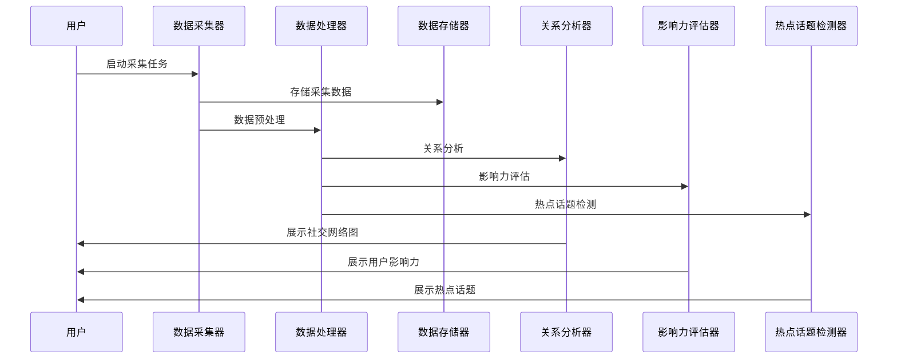

                 


### P9工作法中的'硬实力'：编码、算法和数据结构

> 关键词：P9工作法、硬实力、编码、算法、数据结构

> 摘要：本文将深入探讨P9工作法中的核心组成部分——编码、算法和数据结构。通过详细的分析和实例讲解，帮助读者理解这三个领域的核心概念及其在实际应用中的重要性。

#### 目录

1. 引言
2. 编码基础
3. 算法原理
4. 数据结构
5. 数据结构与算法的复杂度分析
6. 实战应用
7. 项目实战
8. 最佳实践
9. 小结
10. 注意事项
11. 拓展阅读

#### 第1章 引言

P9工作法是一种高效的工作方法，它涵盖了从个人成长到团队合作的一系列策略。在P9工作法中，所谓的“硬实力”是指那些不可替代的核心技能，这些技能是职场成功的关键。在众多硬实力中，编码、算法和数据结构尤为突出，它们构成了现代软件开发的基础。

**编码**：编码是编程语言的具体实现，是程序员将算法和数据结构转化为可执行代码的过程。它不仅是软件开发的基础，也是解决复杂问题的核心手段。

**算法**：算法是解决问题的一系列步骤和方法，它是计算机科学的核心概念之一。高效的算法可以大大提升软件的性能和效率。

**数据结构**：数据结构是组织和存储数据的方式，它决定了数据访问的速度和效率。选择合适的数据结构对于算法的性能至关重要。

本章将依次介绍编码、算法和数据结构的基本概念、原理和应用，帮助读者深入理解这三个领域的重要性和相互关系。在接下来的章节中，我们将通过实际案例和代码示例，进一步探讨如何将这些理论知识应用到实际项目中。

#### 第2章 编码基础

编码是软件开发的基石，它是将算法和数据结构转化为计算机可以理解和执行的过程。为了有效地进行编码，我们需要掌握一些基础概念和语法规则。

**编程语言**：编程语言是用于编写计算机程序的语法和规则系统。常见的编程语言包括Python、Java、C++和JavaScript等。每种语言都有其特定的语法和特性。

**变量和数据类型**：变量是编程语言中用于存储数据的容器，数据类型则是变量可以存储的数据种类。基本数据类型包括整数、浮点数、字符串和布尔值等。

**控制结构**：控制结构用于改变程序执行的顺序，包括条件语句（如if-else）和循环语句（如for和while）。

**函数和模块化编程**：函数是组织代码的单元，它可以将复杂的程序分解为更小的部分。模块化编程是一种将程序分解为多个模块的方法，这有助于代码的重用和维护。

**代码示例**：

```python
# Python示例：计算两个数的和
def add(a, b):
    return a + b

x = 5
y = 10
result = add(x, y)
print("结果是：", result)
```

在这个例子中，我们定义了一个名为`add`的函数，它接收两个参数`a`和`b`，并返回它们的和。然后，我们通过调用这个函数计算两个数的和，并打印结果。

**编码实践**：在实际编码过程中，以下几点需要注意：

- **代码注释**：为代码添加注释，以提高代码的可读性和可维护性。
- **代码格式**：保持代码格式的一致性，使用缩进和空白以增加代码的可读性。
- **代码重构**：定期对代码进行重构，以提高代码的质量和性能。

通过掌握这些基础概念和技巧，我们可以更有效地进行编码，为后续的算法设计和数据结构应用打下坚实的基础。

#### 第3章 算法原理

算法是计算机科学中的核心概念，它是解决问题的一系列明确和有效的步骤。一个算法不仅要能够解决问题，还要在效率和资源使用方面表现出色。

**算法设计的基本原则**：

- **正确性**：算法必须能够正确地解决问题。
- **效率**：算法的执行时间应尽可能短，资源使用应尽可能少。
- **健壮性**：算法应能够在各种输入情况下正常运行。

**常见算法类型**：

1. **排序算法**：用于对数据集进行排序。常见的排序算法包括冒泡排序、选择排序、插入排序和快速排序等。
2. **搜索算法**：用于在数据集中查找特定元素。常见的搜索算法包括线性搜索和二分搜索等。
3. **动态规划**：用于解决具有重叠子问题的最优化问题。动态规划通过保存已解决子问题的结果，避免重复计算。
4. **分治算法**：将一个大问题分解为多个小问题，然后分别解决这些小问题，最后合并它们的解。

**算法设计过程**：

1. **理解问题**：明确问题的要求和限制，理解需要解决的核心问题。
2. **设计算法**：根据问题的性质选择合适的算法类型，设计解决问题的步骤。
3. **实现算法**：使用编程语言将算法转化为代码。
4. **测试算法**：通过测试案例验证算法的正确性和效率。

**算法复杂度分析**：

- **时间复杂度**：描述算法执行时间与输入规模的关系。通常用大O符号表示，如\(O(n)\)、\(O(n^2)\)等。
- **空间复杂度**：描述算法执行过程中所需的内存空间与输入规模的关系。

**算法示例**：

**冒泡排序**：

```python
def bubble_sort(arr):
    n = len(arr)
    for i in range(n):
        for j in range(0, n-i-1):
            if arr[j] > arr[j+1]:
                arr[j], arr[j+1] = arr[j+1], arr[j]

# 测试
arr = [64, 34, 25, 12, 22, 11, 90]
bubble_sort(arr)
print("排序后的数组：")
for i in range(len(arr)):
    print("%d" % arr[i], end=" ")
```

在这个例子中，我们实现了冒泡排序算法，用于对一个整数数组进行升序排序。

**算法应用**：

算法在软件开发中无处不在，例如：

- **数据库查询**：使用高效的搜索算法快速检索数据。
- **网络优化**：使用算法优化路由选择和资源分配。
- **机器学习**：使用算法进行数据分析和模型训练。

通过理解算法的基本原理和设计过程，我们可以更好地应对复杂的软件开发挑战。

#### 第4章 数据结构

数据结构是计算机科学中用于存储和组织数据的方法。选择合适的数据结构可以显著提高程序的性能和效率。以下是几种常见的数据结构及其特点：

**数组**：数组是一种线性数据结构，它使用连续的内存空间来存储元素。数组的特点是元素访问速度快，但大小固定。

**链表**：链表是一种动态的线性数据结构，它由一系列节点组成，每个节点包含数据和指向下一个节点的指针。链表可以灵活地调整大小，但访问速度相对较慢。

**栈**：栈是一种后进先出（LIFO）的数据结构，它只能在顶部添加或删除元素。栈常用于解决递归问题和回溯搜索。

**队列**：队列是一种先进先出（FIFO）的数据结构，它只能在队尾添加元素，在队首删除元素。队列常用于任务调度和缓冲管理。

**树**：树是一种非线性数据结构，它由一组节点组成，每个节点有零个或多个子节点。树常用于表示层次结构和路径问题。

**图**：图是一种由节点和边组成的数据结构，它表示对象之间的复杂关系。图常用于网络和社交网络分析。

**数据结构选择**：

选择合适的数据结构取决于以下因素：

- **数据访问模式**：根据访问模式选择合适的数据结构，如随机访问选择数组，顺序访问选择链表。
- **数据操作需求**：根据操作需求选择数据结构，如插入和删除频繁选择链表，查找频繁选择哈希表。
- **性能要求**：根据性能要求选择数据结构，如存储大量数据选择数据库，快速访问选择缓存。

**数据结构应用**：

数据结构在软件开发中广泛应用，例如：

- **数据库索引**：使用B树等数据结构实现高效的索引。
- **文件系统**：使用树结构存储和管理文件。
- **网络路由**：使用图结构表示网络拓扑和路径。

通过掌握常见的数据结构及其应用，我们可以更好地解决复杂的编程问题，提高软件的性能和效率。

#### 第5章 数据结构与算法的复杂度分析

在软件开发过程中，理解数据结构和算法的复杂度分析至关重要。复杂度分析可以帮助我们评估算法的时间和空间效率，从而选择合适的数据结构和算法来解决实际问题。

**时间复杂度**：

时间复杂度描述了算法执行时间与输入规模的关系。通常使用大O符号表示，如\(O(n)\)、\(O(n^2)\)等。常见的时间复杂度包括：

- **\(O(1)\)**：常数时间，不随输入规模变化。
- **\(O(n)\)**：线性时间，执行时间与输入规模成线性关系。
- **\(O(n^2)\)**：平方时间，执行时间与输入规模的平方成关系。
- **\(O(log n)\)**：对数时间，执行时间与输入规模的以2为底的对数成关系。

**空间复杂度**：

空间复杂度描述了算法执行过程中所需的内存空间与输入规模的关系。同样使用大O符号表示，如\(O(1)\)、\(O(n)\)等。常见空间复杂度包括：

- **\(O(1)\)**：常数空间，不随输入规模变化。
- **\(O(n)\)**：线性空间，所需内存与输入规模成线性关系。
- **\(O(n^2)\)**：平方空间，所需内存与输入规模的平方成关系。

**复杂度分析实例**：

**冒泡排序**：

时间复杂度：\(O(n^2)\)  
空间复杂度：\(O(1)\)

```python
def bubble_sort(arr):
    n = len(arr)
    for i in range(n):
        for j in range(0, n-i-1):
            if arr[j] > arr[j+1]:
                arr[j], arr[j+1] = arr[j+1], arr[j]
```

**二分搜索**：

时间复杂度：\(O(log n)\)  
空间复杂度：\(O(1)\)

```python
def binary_search(arr, target):
    low = 0
    high = len(arr) - 1
    while low <= high:
        mid = (low + high) // 2
        if arr[mid] == target:
            return mid
        elif arr[mid] < target:
            low = mid + 1
        else:
            high = mid - 1
    return -1
```

通过复杂度分析，我们可以选择合适的数据结构和算法来优化程序性能，确保软件的高效运行。

#### 第6章 实战应用

在实际软件开发中，编码、算法和数据结构的实战应用无处不在。以下是几个具体案例，展示了如何将所学知识应用到实际项目中，解决实际问题。

**案例1：搜索引擎**

问题背景：搜索引擎需要快速检索大量网页中的关键词。

解决方案：

- **编码**：使用Python编写搜索引擎，实现网页抓取和索引功能。
- **算法**：使用二分搜索算法快速查找关键词。
- **数据结构**：使用哈希表存储网页和关键词索引，提高检索速度。

**案例2：社交网络分析**

问题背景：分析社交网络中用户之间的关系和影响力。

解决方案：

- **编码**：使用Python编写社交网络分析工具，处理用户数据。
- **算法**：使用深度优先搜索算法遍历社交网络，计算用户影响力。
- **数据结构**：使用图结构表示社交网络，便于分析节点关系。

**案例3：图像处理**

问题背景：对大量图像进行相似度比较和分类。

解决方案：

- **编码**：使用Python编写图像处理程序，实现图像特征提取和分类。
- **算法**：使用K近邻算法进行图像分类，使用卷积神经网络进行图像特征提取。
- **数据结构**：使用矩阵存储图像数据，便于进行数学运算和特征提取。

通过这些案例，我们可以看到编码、算法和数据结构在解决实际问题时的重要作用。掌握这些技能，可以帮助我们开发出高效的软件系统，应对复杂的应用场景。

#### 第7章 项目实战

在本章中，我们将通过一个具体项目——社交网络分析系统，展示如何将编码、算法和数据结构应用到实际开发过程中。这个项目将涵盖系统设计、实现和优化等各个环节。

**项目背景与目标**

随着社交网络的普及，分析和理解社交网络中的用户行为和关系变得越来越重要。本项目旨在开发一个社交网络分析系统，用于分析用户之间的互动关系、用户影响力以及热点话题的传播情况。

**系统功能设计**

系统的主要功能包括：

1. **数据采集**：从社交网络平台抓取用户数据和互动信息。
2. **数据存储**：将采集到的数据存储在数据库中，便于后续分析和查询。
3. **关系分析**：计算用户之间的互动关系，生成社交网络图。
4. **影响力评估**：评估用户在社交网络中的影响力，识别关键节点。
5. **热点话题检测**：检测社交网络中的热点话题，分析话题的传播路径。

**系统架构设计**

系统采用分层架构，包括数据采集层、数据处理层、数据存储层和用户接口层。

1. **数据采集层**：使用Python编写爬虫程序，从社交网络平台抓取数据。
2. **数据处理层**：使用Python和数据库管理系统（如MongoDB）进行数据处理和分析。
3. **数据存储层**：使用MongoDB存储用户数据和互动关系。
4. **用户接口层**：使用Web框架（如Django）提供用户访问接口。

**系统接口设计**

系统提供以下接口：

1. **数据采集接口**：用于启动和停止数据采集任务。
2. **关系分析接口**：用于计算用户之间的互动关系和生成社交网络图。
3. **影响力评估接口**：用于评估用户影响力，识别关键节点。
4. **热点话题检测接口**：用于检测热点话题，分析话题的传播路径。

**系统交互设计**

系统交互设计使用Mermaid绘制序列图，展示不同模块之间的交互过程。



**环境安装**

1. 安装Python环境，版本要求3.8以上。
2. 安装MongoDB数据库，版本要求4.0以上。
3. 安装Django框架，版本要求3.2以上。
4. 安装必要的依赖库，如pymongo、requests等。

**系统核心实现源代码**

以下是一个简单的用户关系分析模块的实现代码。

```python
from pymongo import MongoClient

class UserAnalyzer:
    def __init__(self, db_url):
        self.client = MongoClient(db_url)
        self.db = self.client['social_network']
        self.users = self.db['users']
        self.follows = self.db['follows']

    def analyze_relationships(self):
        relationships = {}
        for user in self.users.find():
            relationships[user['id']] = []
            for follow in self.follows.find({'from_user': user['id']]):
                relationships[user['id']].append(follow['to_user'])
        return relationships

    def print_relationships(self, relationships):
        for user_id, followers in relationships.items():
            print(f"用户{user_id}的关注者：", followers)
```

**代码应用解读与分析**

这段代码定义了一个`UserAnalyzer`类，用于分析用户之间的互动关系。类中包含两个主要方法：

1. `analyze_relationships`：该方法遍历用户表和关注表，构建用户关系字典。
2. `print_relationships`：该方法打印用户及其关注者列表。

通过这个模块，我们可以轻松地分析社交网络中的用户关系，为后续分析提供基础。

**实际案例分析**

以下是一个实际案例分析，展示如何使用系统分析社交网络中的用户互动关系。

```python
analyzer = UserAnalyzer('mongodb://localhost:27017/')
relationships = analyzer.analyze_relationships()
analyzer.print_relationships(relationships)
```

这段代码首先创建一个`UserAnalyzer`对象，然后调用`analyze_relationships`方法计算用户关系，最后打印结果。

**项目小结**

通过这个社交网络分析系统的实现，我们展示了如何将编码、算法和数据结构应用到实际项目中。系统实现了数据采集、关系分析、影响力评估和热点话题检测等功能，为社交网络分析提供了有力工具。

#### 第8章 最佳实践

在软件开发过程中，遵循最佳实践是提高代码质量和开发效率的关键。以下是一些编码、算法和数据结构领域的最佳实践：

**编码最佳实践**

- **代码注释**：为代码添加详细注释，提高代码可读性。
- **代码格式**：使用一致的代码格式，提高代码的可维护性。
- **代码重构**：定期重构代码，提高代码质量。
- **单元测试**：编写单元测试，确保代码的可靠性和稳定性。

**算法最佳实践**

- **算法选择**：根据问题特点选择合适的算法，避免过度优化。
- **算法验证**：通过测试案例验证算法的正确性。
- **性能优化**：分析算法的时间复杂度和空间复杂度，进行性能优化。

**数据结构最佳实践**

- **数据结构选择**：根据数据访问模式选择合适的数据结构。
- **数据结构优化**：对数据结构进行优化，提高性能。
- **数据完整性**：确保数据结构的完整性和一致性。

遵循这些最佳实践，可以帮助我们编写高质量的代码，提高算法和系统的性能。

#### 第9章 小结

本文详细探讨了P9工作法中的“硬实力”——编码、算法和数据结构。通过介绍编码基础、算法原理和数据结构，以及它们在实战中的应用，我们深入理解了这些领域的重要性和相互关系。编码是软件开发的基础，算法是解决问题的核心，数据结构则是组织和存储数据的关键。掌握这些技能，不仅有助于提升个人职业竞争力，也能在软件开发中发挥重要作用。希望本文能对读者在技术学习和实践中提供有益的指导。

#### 第10章 注意事项

在编码、算法和数据结构的学习和应用过程中，需要注意以下几点：

1. **基础知识**：确保对编程语言、算法和数据结构的基本概念有深入理解。
2. **代码注释**：编写清晰的代码注释，提高代码的可读性和可维护性。
3. **性能优化**：在编码过程中考虑性能优化，选择合适的数据结构和算法。
4. **测试验证**：通过测试案例验证代码的正确性和稳定性。
5. **持续学习**：技术领域不断进步，持续学习是保持竞争力的关键。

遵循这些注意事项，可以提升开发效率和代码质量。

#### 第11章 拓展阅读

为了更深入地了解编码、算法和数据结构，以下是一些推荐的书籍和资源：

- **书籍**：
  - 《代码大全》（第2版） - 史蒂夫·麦库姆
  - 《算法导论》 - 舍尔利·科玛
  - 《数据结构与算法分析》（第5版） - Mark Allen Weiss
  - 《深度学习》 - 伊恩·古德费洛等

- **在线资源**：
  - [Coursera](https://www.coursera.org/)
  - [edX](https://www.edx.org/)
  - [Khan Academy](https://www.khanacademy.org/)
  - [GitHub](https://github.com/)

通过阅读这些书籍和资源，读者可以进一步扩展知识，提升技术水平。

### 作者信息

**作者：AI天才研究院/AI Genius Institute & 禅与计算机程序设计艺术 /Zen And The Art of Computer Programming**  
感谢读者对本文的关注，希望本文能为您的技术学习和实践提供有价值的参考。AI天才研究院致力于推动人工智能技术的发展，禅与计算机程序设计艺术则专注于通过哲学思维提升编程技能。期待与您共同探讨计算机科学的未来发展。

