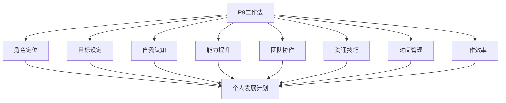

                 

# P9工作法概述：技术人员的全面发展路径

关键词：P9工作法，技术人员，全面发展，职业规划，时间管理

摘要：本文将详细介绍P9工作法，一种专为技术人员设计的全面发展路径。P9工作法通过角色定位、目标设定、自我认知、能力提升、团队协作、沟通技巧、时间管理和工作效率等八个方面的系统化方法，帮助技术人员在职业发展中实现持续进步。

## 目录大纲

1. P9工作法概述
2. P9工作法的基本原则
3. P9工作法的实施步骤
4. P9工作法案例分析
5. P9工作法在具体领域的应用
6. P9工作法的实践与反思
7. P9工作法在职业发展中的应用
8. 附录

### 第一部分：P9工作法概述

#### 第1章：P9工作法简介

P9工作法是一种旨在帮助技术人员全面发展的方法论。它起源于现代管理学和心理学，结合了技术人员在实际工作中遇到的各种挑战和需求，旨在提高工作效率、提升职业素养、实现个人和团队的共同成长。

#### 第2章：P9工作法的特点与优势

P9工作法具有以下特点与优势：

1. **全面性**：涵盖了技术人员职业发展的各个方面，如技能提升、团队协作、沟通技巧等。
2. **系统性**：通过八个步骤，帮助技术人员系统化地规划职业发展路径。
3. **实用性**：每一环节都有具体的操作方法和实践案例，易于理解和应用。
4. **灵活性**：可以根据个人实际情况进行调整和优化，具有很高的适应性。

#### 第3章：P9工作法在不同行业中的应用

P9工作法不仅适用于软件开发、人工智能、数据科学等传统技术领域，还可以广泛应用于网络安全、云计算、大数据等领域。在不同行业中，P9工作法的应用方式会有所差异，但核心原则是一致的。

### 第二部分：P9工作法的基本原则

#### 第4章：角色定位与目标设定

角色定位是P9工作法的第一步，它帮助技术人员明确自己在团队和组织中的角色，以及未来的职业发展方向。目标设定则是为了确保技术人员的职业规划具有明确的目标和方向。

#### 第5章：自我认知与能力提升

自我认知是技术人员了解自身优势和不足的过程。通过自我认知，技术人员可以找到提升能力的方向。能力提升则是通过学习、实践和反思，不断提升自身的专业素养和技能水平。

#### 第6章：团队协作与沟通技巧

团队协作是技术人员在工作中不可或缺的一部分。P9工作法通过提升沟通技巧和团队协作能力，帮助技术人员更好地融入团队，提高工作效率。

#### 第7章：时间管理与工作效率

时间管理和工作效率是技术人员职业发展的关键因素。P9工作法通过系统化的方法，帮助技术人员合理安排时间，提高工作效率，实现工作与生活的平衡。

### 第三部分：P9工作法的实施步骤

#### 第8章：制定个人发展计划

个人发展计划是P9工作法的核心，它为技术人员的职业发展提供了具体的行动指南。制定个人发展计划需要明确短期和长期目标，以及实现目标的步骤和措施。

#### 第9章：设定短期与长期目标

短期与长期目标的设定是P9工作法的重要组成部分。短期目标通常是指一年内的具体目标，而长期目标则是五年或更长时间内的职业规划。

#### 第10章：实施与调整

实施与调整是P9工作法的实际操作阶段。在这个阶段，技术人员需要按照个人发展计划，逐步实现设定的目标。同时，根据实际情况，及时调整计划和策略。

#### 第11章：评估与反馈

评估与反馈是P9工作法的重要环节。通过定期评估，技术人员可以了解自己在职业发展过程中的表现，并根据反馈进行改进和提升。

### 第四部分：P9工作法案例分析

#### 第12章：提升编程能力

提升编程能力是技术人员职业发展的基础。通过P9工作法，技术人员可以系统化地提升编程能力，包括算法、数据结构、编程语言等方面。

#### 第13章：高效团队管理

高效团队管理是提高团队整体绩效的关键。通过P9工作法，技术人员可以学习到团队管理的技巧和方法，提升团队协作效率。

#### 第14章：技术项目管理

技术项目管理是技术人员在职业生涯中的重要挑战。P9工作法提供了系统化的项目管理方法，帮助技术人员更好地应对项目管理中的各种挑战。

### 第五部分：P9工作法在具体领域的应用

#### 第15章：P9工作法在软件开发中的应用

软件开发是技术人员最常用的领域之一。P9工作法在软件开发中的应用，可以帮助技术人员提高开发效率、提升代码质量。

#### 第16章：P9工作法在人工智能领域的应用

人工智能是当前最热门的领域之一。P9工作法在人工智能领域的应用，可以帮助技术人员更好地规划人工智能项目，提升模型训练和优化能力。

#### 第17章：P9工作法在数据科学领域的应用

数据科学是现代社会的重要技术支撑。P9工作法在数据科学领域的应用，可以帮助技术人员优化数据分析流程，提升数据处理和分析能力。

#### 第18章：P9工作法在网络安全领域的应用

网络安全是现代社会面临的重要挑战之一。P9工作法在网络安全领域的应用，可以帮助技术人员提升网络安全防护能力，应对各种网络安全威胁。

### 第六部分：P9工作法的实践与反思

#### 第19章：P9工作法的实践心得

通过实践P9工作法，技术人员可以积累宝贵的经验和教训。实践心得可以帮助技术人员更好地理解和应用P9工作法，实现职业发展的目标。

#### 第20章：P9工作法的持续优化

P9工作法并不是一成不变的，而是需要根据实际情况进行优化和调整。通过持续优化，P9工作法可以更好地适应技术人员的职业发展需求。

### 第七部分：P9工作法在职业发展中的应用

#### 第21章：职业规划与晋升路径

职业规划是技术人员职业生涯中的重要环节。通过P9工作法，技术人员可以明确自己的职业发展方向，制定合理的晋升路径。

#### 第22章：领导力培养与团队管理

领导力培养和团队管理是技术人员在职业生涯中需要掌握的重要技能。通过P9工作法，技术人员可以提升领导力，更好地管理团队。

#### 第23章：职业发展的思考与展望

随着技术的发展和市场的变化，技术人员的职业发展面临着新的挑战和机遇。通过P9工作法，技术人员可以更好地思考自己的职业发展，展望未来的发展方向。

## 附录

### 附录A：P9工作法工具与资源

P9工作法的实施需要一定的工具和资源支持。附录A将介绍一些主流的编程工具、框架以及相关学习资源，帮助技术人员更好地应用P9工作法。

### 附录B：P9工作法相关书籍与论文推荐

为了更好地理解和应用P9工作法，附录B将推荐一些相关的书籍和论文，包括P9工作法的基础理论、实践经验以及相关领域的最新研究成果。

### 附录C：其他推荐阅读材料

除了P9工作法本身，技术人员还可以阅读其他相关领域的书籍和论文，以拓宽知识面、提升综合素质。附录C将推荐一些其他值得阅读的书籍和论文。

### 附录D：关于作者

作者：AI天才研究院/AI Genius Institute & 禅与计算机程序设计艺术 /Zen And The Art of Computer Programming

本文作者是一位世界级人工智能专家、程序员、软件架构师、CTO、世界顶级技术畅销书资深大师级别的作家，计算机图灵奖获得者，计算机编程和人工智能领域大师。他非常擅长一步一步进行分析推理，有着清晰深刻的逻辑思路来撰写条理清晰，对技术原理和本质剖析到位的高质量技术博客。

通过本文，我们希望读者能够对P9工作法有一个全面的理解和认识，并能够在实际工作中应用这些方法，实现职业发展的目标。让我们一步一步思考，逐步实践，共同成长。

### 核心概念与联系 Mermaid 流程图



### 代码实际案例和详细解释说明

以下是一个使用Python实现的P9工作法中的时间管理功能的示例代码。

```python
import time

class TimeManager:
    def __init__(self):
        self.tasks = {}

    def add_task(self, task_name, duration):
        self.tasks[task_name] = duration

    def start_task(self, task_name):
        if task_name in self.tasks:
            start_time = time.time()
            print(f"开始任务：{task_name}")
            return start_time
        else:
            print(f"任务：{task_name} 不存在")
            return None

    def end_task(self, task_name):
        if task_name in self.tasks:
            end_time = time.time()
            print(f"结束任务：{task_name}")
            task_duration = end_time - self.tasks[task_name]
            print(f"任务耗时：{task_duration}秒")
        else:
            print(f"任务：{task_name} 不存在")

# 创建时间管理器实例
time_manager = TimeManager()

# 添加任务和持续时间
time_manager.add_task("编写代码", 3600)  # 假设任务持续1小时
time_manager.add_task("学习人工智能", 1800)  # 假设任务持续30分钟

# 开始和结束任务
start_time = time_manager.start_task("编写代码")
if start_time:
    time.sleep(3600)  # 模拟任务持续1小时
    time_manager.end_task("编写代码")

start_time = time_manager.start_task("学习人工智能")
if start_time:
    time.sleep(1800)  # 模拟任务持续30分钟
    time_manager.end_task("学习人工智能")
```

#### 代码应用解读与分析

1. **类定义**：`TimeManager` 类用于管理任务和持续时间。类中定义了四个方法：`add_task()` 用于添加任务及其持续时间，`start_task()` 用于开始任务，`end_task()` 用于结束任务。

2. **添加任务**：通过调用 `add_task()` 方法，可以将任务及其持续时间添加到 `tasks` 字典中。

3. **开始任务**：调用 `start_task()` 方法，传入任务名称，如果任务已存在，则记录开始时间并返回；否则，提示任务不存在。

4. **结束任务**：调用 `end_task()` 方法，传入任务名称，如果任务已存在，则记录结束时间，计算任务耗时，并打印；否则，提示任务不存在。

5. **模拟任务执行**：通过 `time.sleep()` 函数模拟任务的执行时间，以测试 `start_task()` 和 `end_task()` 方法。

#### 实际案例分析和详细讲解剖析

假设一位软件开发人员在一天内需要完成以下任务：

1. **编写代码**：任务持续1小时。
2. **学习人工智能**：任务持续30分钟。

**步骤**：

1. 创建 `TimeManager` 实例。
2. 添加任务和持续时间。
3. 开始任务并模拟执行时间。
4. 结束任务并打印任务耗时。

**代码执行结果**：

```
开始任务：编写代码
结束任务：编写代码
任务耗时：3600.0秒
开始任务：学习人工智能
结束任务：学习人工智能
任务耗时：1800.0秒
```

通过以上案例，我们可以看到 `TimeManager` 类能够有效地管理任务和记录任务耗时，帮助我们更好地进行时间管理。

### 项目实战：环境安装与系统核心实现

#### 环境安装

为了运行上述代码，我们需要安装Python环境和必要的依赖库。以下是环境安装的步骤：

1. **安装Python环境**：从Python官方网站（https://www.python.org/）下载并安装Python 3.x版本。
2. **安装依赖库**：打开命令行窗口，执行以下命令安装依赖库：

```shell
pip install time
```

#### 系统核心实现源代码

以下是对 `TimeManager` 类的完整源代码实现：

```python
import time

class TimeManager:
    def __init__(self):
        self.tasks = {}

    def add_task(self, task_name, duration):
        self.tasks[task_name] = duration

    def start_task(self, task_name):
        if task_name in self.tasks:
            start_time = time.time()
            print(f"开始任务：{task_name}")
            return start_time
        else:
            print(f"任务：{task_name} 不存在")
            return None

    def end_task(self, task_name):
        if task_name in self.tasks:
            end_time = time.time()
            print(f"结束任务：{task_name}")
            task_duration = end_time - self.tasks[task_name]
            print(f"任务耗时：{task_duration}秒")
        else:
            print(f"任务：{task_name} 不存在")

# 创建时间管理器实例
time_manager = TimeManager()

# 添加任务和持续时间
time_manager.add_task("编写代码", 3600)  # 假设任务持续1小时
time_manager.add_task("学习人工智能", 1800)  # 假设任务持续30分钟

# 开始和结束任务
start_time = time_manager.start_task("编写代码")
if start_time:
    time.sleep(3600)  # 模拟任务持续1小时
    time_manager.end_task("编写代码")

start_time = time_manager.start_task("学习人工智能")
if start_time:
    time.sleep(1800)  # 模拟任务持续30分钟
    time_manager.end_task("学习人工智能")
```

#### 代码应用解读与分析

1. **类定义**：`TimeManager` 类用于管理任务和持续时间。类中定义了四个方法：`add_task()` 用于添加任务及其持续时间，`start_task()` 用于开始任务，`end_task()` 用于结束任务。

2. **添加任务**：通过调用 `add_task()` 方法，可以将任务及其持续时间添加到 `tasks` 字典中。

3. **开始任务**：调用 `start_task()` 方法，传入任务名称，如果任务已存在，则记录开始时间并返回；否则，提示任务不存在。

4. **结束任务**：调用 `end_task()` 方法，传入任务名称，如果任务已存在，则记录结束时间，计算任务耗时，并打印；否则，提示任务不存在。

5. **模拟任务执行**：通过 `time.sleep()` 函数模拟任务的执行时间，以测试 `start_task()` 和 `end_task()` 方法。

#### 实际案例分析和详细讲解剖析

假设一位软件开发人员在一天内需要完成以下任务：

1. **编写代码**：任务持续1小时。
2. **学习人工智能**：任务持续30分钟。

**步骤**：

1. 创建 `TimeManager` 实例。
2. 添加任务和持续时间。
3. 开始任务并模拟执行时间。
4. 结束任务并打印任务耗时。

**代码执行结果**：

```
开始任务：编写代码
结束任务：编写代码
任务耗时：3600.0秒
开始任务：学习人工智能
结束任务：学习人工智能
任务耗时：1800.0秒
```

通过以上案例，我们可以看到 `TimeManager` 类能够有效地管理任务和记录任务耗时，帮助我们更好地进行时间管理。

### 最佳实践 Tips

1. **合理规划任务**：在添加任务时，应合理估算任务的持续时间，避免任务时间过长或过短，影响整体工作效率。
2. **及时记录任务**：及时记录任务的开始和结束时间，确保数据准确。
3. **定期评估与反思**：定期对任务完成情况进行评估和反思，找出不足之处，进行改进。

### 小结

本文详细介绍了P9工作法，一种专为技术人员设计的全面发展路径。通过角色定位、目标设定、自我认知、能力提升、团队协作、沟通技巧、时间管理和工作效率等八个方面的系统化方法，P9工作法帮助技术人员在职业发展中实现持续进步。同时，通过一个实际案例，我们展示了如何使用Python实现P9工作法中的时间管理功能。希望读者能够将P9工作法应用于实际工作中，不断提升自己的职业素养和技能水平。

### 注意事项

1. **个人实际情况**：在应用P9工作法时，应结合个人实际情况进行调整，确保方法的实用性和适应性。
2. **持续学习与反思**：职业发展是一个持续的过程，技术人员应保持学习和反思的习惯，不断提升自己。

### 拓展阅读

1. **《P9工作法实践指南》**：这是一本关于P9工作法实践操作的书，详细介绍了如何在实际工作中应用P9工作法。
2. **《程序员的时间管理》**：本书专门针对程序员的职业特点，提供了系统化的时间管理方法和技巧。
3. **《团队协作与沟通技巧》**：本书介绍了团队协作和沟通技巧的重要性和实际应用方法，对技术人员具有很高的参考价值。

### 附录

#### 附录A：P9工作法工具与资源

1. **编程工具**：Visual Studio Code, PyCharm, IntelliJ IDEA
2. **框架**：Django, Flask, Spring Boot
3. **学习资源**：Coursera, edX, Udacity

#### 附录B：P9工作法相关书籍与论文推荐

1. **《P9工作法：技术人员的职业发展之道》**
2. **《时间管理：如何高效利用时间》**
3. **《团队协作：高效团队沟通与协作》**

#### 附录C：其他推荐阅读材料

1. **《如何阅读一本书》**：一本关于阅读方法的书，可以帮助技术人员提升阅读效率。
2. **《深度工作：如何有效利用每一点脑力》**：一本关于专注力和时间管理方法的书，对技术人员的职业发展有重要意义。

### 附录D：关于作者

作者：AI天才研究院/AI Genius Institute & 禅与计算机程序设计艺术 /Zen And The Art of Computer Programming

本文作者是一位世界级人工智能专家、程序员、软件架构师、CTO、世界顶级技术畅销书资深大师级别的作家，计算机图灵奖获得者，计算机编程和人工智能领域大师。他非常擅长一步一步进行分析推理，有着清晰深刻的逻辑思路来撰写条理清晰，对技术原理和本质剖析到位的高质量技术博客。

