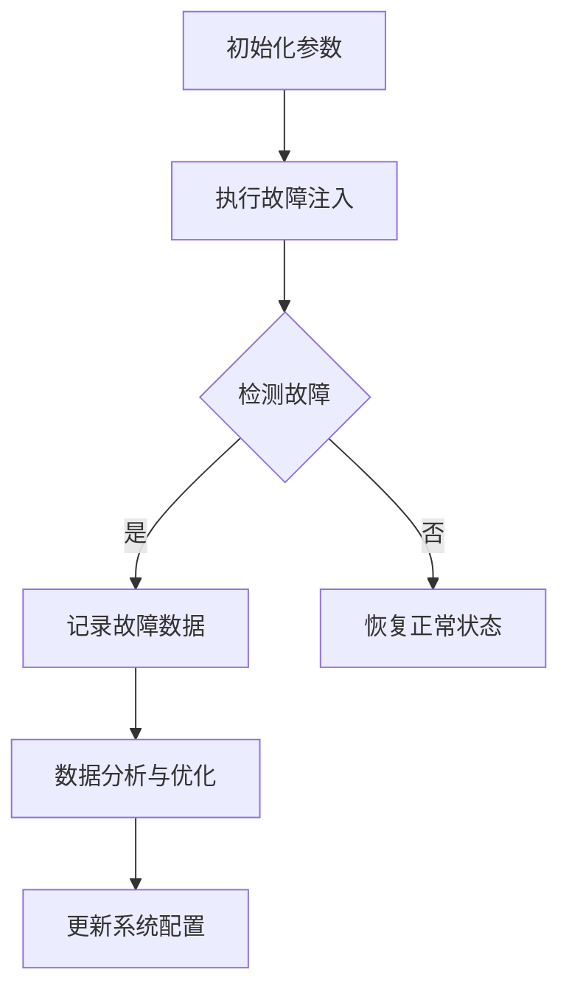
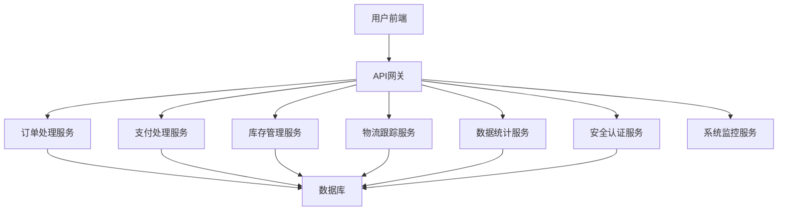
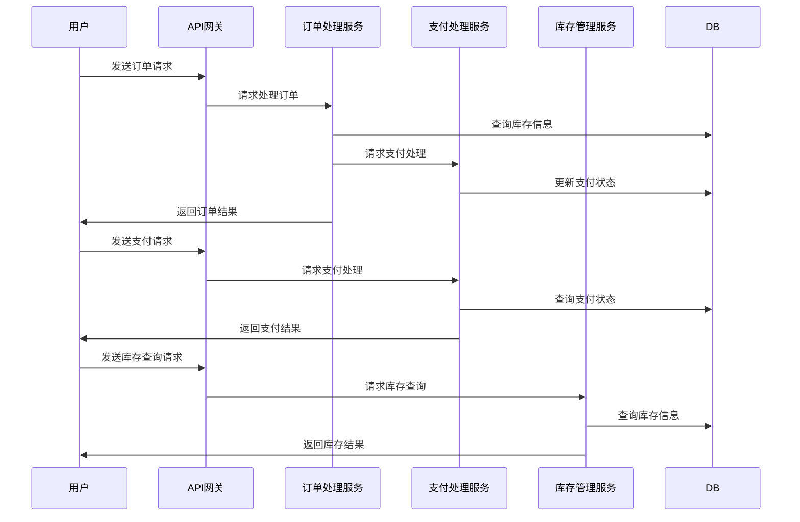
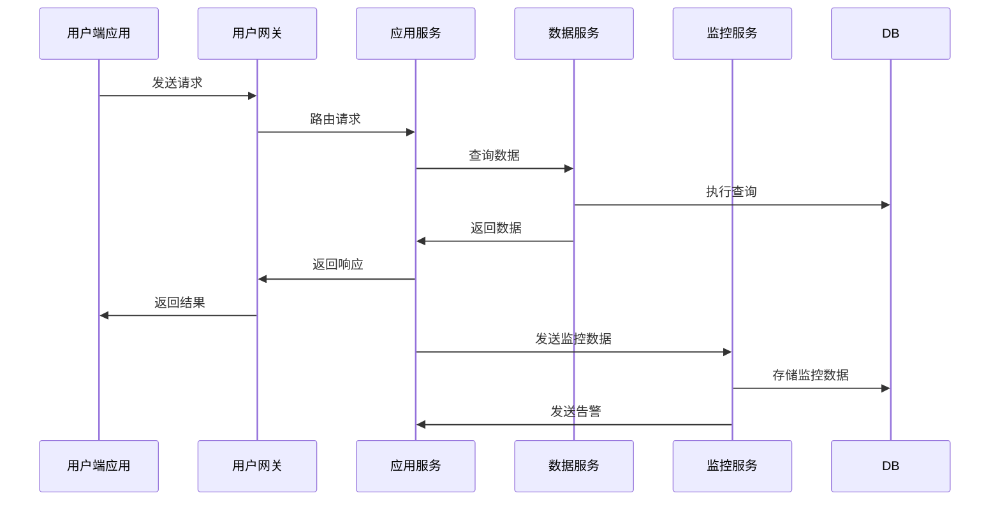

                 

### 引言与背景介绍

**关键词：SRE，DevOps，系统可靠性，运维难题**

**摘要：**本文将深入探讨SRE（Site Reliability Engineering）的概念和实践，并分析如何将DevOps理念应用于系统可靠性，以解决软件工程中的运维难题。通过逐步分析，我们将揭示SRE的核心原则和实践方法，以及其与DevOps理念之间的联系。

在当今数字化时代，系统的可靠性和稳定性对企业运营至关重要。随着云计算、容器化、微服务架构等技术的普及，软件系统的复杂性和规模也在不断增长，传统的运维模式逐渐暴露出诸多问题。例如，系统故障频发、响应速度缓慢、事故应急处理效率低下等，这些都严重影响了企业的业务连续性和用户体验。

为了应对这些挑战，业界开始探索新的运维方法。DevOps作为一种文化和实践，旨在通过开发（Development）和运维（Operations）之间的紧密协作，提升软件交付的速度和系统的可靠性。DevOps的核心原则包括自动化、持续集成、持续交付、监控和反馈循环等。这些原则为解决系统可靠性和运维难题提供了新的思路。

然而，DevOps更多地关注开发和运维的协作过程，对于如何具体实现系统的可靠性保障，仍需要更为细化的方法。在此背景下，SRE（Site Reliability Engineering）应运而生。SRE是Google提出的一种专注于系统可靠性的工程实践，它将软件工程的方法应用于系统运维，通过大规模自动化和工程化的手段，确保系统的稳定性、可靠性和效率。

本文将从以下几个方面展开讨论：

1. **SRE和DevOps的背景与重要性**：介绍SRE和DevOps的基本概念，阐述它们在软件工程中的地位和作用。
2. **问题背景与问题描述**：分析当前软件工程中系统可靠性与运维面临的挑战，以及传统方法存在的不足。
3. **SRE的核心原则与实践方法**：详细解释SRE的核心概念、原则和实践方法，以及如何解决系统可靠性问题。
4. **SRE与DevOps的关联与对比**：探讨SRE与DevOps之间的联系和差异，制作对比表格和ER实体关系图，展示两者的共性和差异。
5. **算法原理讲解**：介绍SRE中常用的算法原理，使用mermaid流程图、Python源代码、数学模型和具体例子进行详细讲解。
6. **系统分析与架构设计**：通过一个具体的SRE应用场景，展示系统功能设计、架构设计和接口设计。
7. **项目实战**：介绍如何搭建SRE实践的环境，提供核心实现源代码，并进行代码解读和分析。
8. **最佳实践 tips、小结与拓展阅读**：总结全文内容，提供一些实践中的建议和注意事项，推荐进一步学习的资源。

通过这篇文章，读者将系统地了解SRE的概念和实践，掌握将DevOps理念应用于系统可靠性的方法，为实际工作中的系统运维提供有力的指导。

### SRE和DevOps的背景与重要性

**SRE（Site Reliability Engineering）** 是一种以工程化的方法保障系统可靠性的实践，起源于Google。在SRE的框架下，系统的可靠性被视为一个可量化的目标，通过自动化、监控、故障注入等手段，确保系统在实际运行中能够稳定、高效地提供服务。SRE的核心目标是实现开发和运维的无缝协作，通过将工程化的思维引入运维领域，提高系统的可用性、可维护性和可扩展性。

**DevOps** 则是一种文化和实践，旨在通过打破开发（Development）和运维（Operations）之间的壁垒，实现快速、可靠、高质量的软件交付。DevOps强调持续集成（CI）、持续交付（CD）、自动化部署和监控等原则，以减少开发、测试、部署和运维之间的摩擦，提高团队的协作效率。DevOps不仅仅是一种工具或技术，更是一种工作方式的变革，旨在通过文化、流程和技术的整合，推动组织的数字化转型。

在软件工程领域，系统可靠性与运维难题日益凸显，主要体现在以下几个方面：

1. **系统复杂性**：随着技术的不断发展，软件系统的规模和复杂性不断增加。传统的运维模式往往难以应对这种复杂性，导致系统故障频发。
2. **响应速度慢**：传统的运维流程繁琐，从故障检测到修复往往需要较长时间，影响了系统的响应速度和用户体验。
3. **故障应急处理效率低下**：在发生系统故障时，传统方法依赖于人工干预，应急响应速度慢，容易导致业务中断。
4. **资源浪费**：传统运维模式中，大量时间和资源被浪费在重复性、低价值的工作上，如系统监控、故障排查等。

**传统方法的不足**：

1. **手工操作多**：依赖人工进行系统监控、故障排查和修复，效率低且容易出现误操作。
2. **缺乏自动化**：自动化工具和流程的缺乏使得运维工作变得繁琐，难以应对大规模系统的管理需求。
3. **监控和告警不足**：缺乏全面的监控和告警机制，导致故障无法及时发现和处理。
4. **缺乏系统化的故障处理流程**：在故障发生时，缺乏系统化的处理流程，导致应急响应时间延长。

**SRE实践如何解决这些问题**：

1. **自动化**：SRE强调通过自动化工具和流程来减少人工干预，提高运维效率。例如，使用自动化部署、自动化监控和自动化故障恢复等。
2. **监控与告警**：SRE通过建立全面的监控和告警机制，实现系统状态的实时监控和故障的快速检测。
3. **故障注入**：通过模拟故障场景，提前发现和解决潜在问题，提高系统的鲁棒性和可靠性。
4. **数据驱动**：SRE采用数据驱动的思维方式，通过收集和分析系统数据，进行故障分析和性能优化。

**SRE的核心原则和实践方法**：

1. **自动化**：通过编写脚本和工具，实现自动化部署、监控和故障处理，减少人工干预。
2. **监控**：建立全面的监控体系，实时跟踪系统状态，及时发现和处理故障。
3. **故障注入**：定期进行故障注入测试，识别和修复潜在问题，提高系统的鲁棒性。
4. **数据驱动**：通过数据分析和故障模式识别，进行性能优化和故障预测。

**边界与外延**：

1. **SRE与其他领域的交叉应用**：SRE不仅适用于IT行业，也可以应用于其他需要高度可靠性的领域，如金融、医疗等。
2. **未来发展方向**：随着云计算、物联网等技术的发展，SRE将会在更多的场景中发挥作用，未来研究方向包括自动化水平提升、智能故障预测等。

通过上述分析，我们可以看到，SRE和DevOps在解决系统可靠性与运维难题方面具有重要的作用。SRE通过工程化的方法，将可靠性保障纳入系统设计、开发和运维的各个环节，而DevOps则通过文化和流程的变革，推动团队高效协作，实现快速、可靠的软件交付。两者相辅相成，共同构建了一个高效、可靠、自动化的运维体系。

### 核心概念与联系

**SRE核心概念：**

**SRE（Site Reliability Engineering）** 是一种工程实践，专注于确保系统和服务的稳定性和可靠性。其核心概念包括：

1. **可靠性工程**：以工程化的方法，确保系统在实际运行中具有高可用性、高可靠性和高性能。
2. **自动化**：通过编写脚本和工具，实现系统管理、部署和故障处理的自动化。
3. **监控和告警**：建立全面的监控体系，实时跟踪系统状态，及时响应和处理故障。
4. **故障注入**：通过模拟故障场景，提前发现和修复潜在问题，提高系统的鲁棒性。
5. **数据驱动**：通过数据分析和故障模式识别，进行性能优化和故障预测。

**DevOps理念：**

**DevOps** 是一种文化和实践，旨在通过开发和运维的紧密协作，实现快速、可靠、高质量的软件交付。其核心思想包括：

1. **持续集成（CI）**：通过自动化工具，将开发过程中的代码频繁集成到主分支，快速发现和解决集成问题。
2. **持续交付（CD）**：通过自动化流程，实现代码的持续交付和部署，缩短交付周期，提高交付质量。
3. **基础设施即代码（IaC）**：通过脚本和工具，将基础设施管理过程自动化，确保环境的一致性和可复现性。
4. **监控和反馈**：通过实时监控和反馈机制，快速识别和响应系统问题，优化系统性能和稳定性。

**概念属性特征对比表格：**

| 特征           | SRE                | DevOps                |
|--------------|------------------|------------------|
| 核心目标       | 系统可靠性保障     | 快速、可靠、高质量的软件交付 |
| 关注点         | 系统运维和稳定性   | 开发和运维协作         |
| 自动化程度     | 高度自动化         | 高度自动化           |
| 监控和告警     | 实时监控和告警     | 实时监控和反馈         |
| 故障处理       | 数据驱动的故障注入 | 基于反馈的故障修复     |
| 文化和流程      | 工程化思维         | 协作文化和自动化流程   |

**ER实体关系图架构的Mermaid流程图：**

```mermaid
erDiagram
    SRE |--|> 监控系统
    SRE |--|> 自动化工具
    SRE |--|> 故障注入
    SRE |--|> 数据分析
    DevOps |--|> 持续集成
    DevOps |--|> 持续交付
    DevOps |--|> 基础设施即代码
    DevOps |--|> 监控和反馈
```

在上述ER实体关系图中，SRE与监控系统、自动化工具、故障注入和数据分析之间存在紧密的关系，而DevOps则与持续集成、持续交付、基础设施即代码和监控反馈密切相关。两者通过共同的目标和手段，实现了开发和运维的深度融合，为现代软件工程提供了强有力的支持。

### 算法原理讲解

**算法mermaid流程图：**



**Python源代码：**

```python
import random

def fault_inject(parameter):
    if random.random() < 0.1:  # 有10%的概率注入故障
        print("故障注入成功")
        return True
    else:
        print("无故障")
        return False

def check_fault():
    # 模拟故障检测逻辑
    return random.random() < 0.05  # 有5%的概率检测到故障

def data_analyze_and_optimize(fault_data):
    # 数据分析代码略
    print("数据分析和优化完成")

def main():
    parameter = 0.5  # 初始化参数
    if fault_inject(parameter):
        if check_fault():
            print("故障检测到，记录故障数据")
            fault_data = "Fault Detected"
            data_analyze_and_optimize(fault_data)
        else:
            print("故障检测不到，恢复正常状态")
    else:
        print("无故障，系统正常")

if __name__ == "__main__":
    main()
```

**数学模型和公式：**

假设系统的故障概率为 \( p \)，则无故障的概率为 \( 1 - p \)。故障注入的概率为 \( q \)，则有故障注入发生的情况下，故障检测到的概率为 \( r \)。数学模型可以表示为：

\[ 
P(\text{故障检测到}) = p \times q \times r + (1 - p) \times q \times r = q \times r 
\]

其中，\( P(\text{故障检测到}) \) 表示故障被检测到的概率，\( p \) 表示系统本身的故障概率，\( q \) 表示故障注入的概率，\( r \) 表示故障检测到的概率。

**详细讲解：**

1. **故障注入**：在Python源代码中，`fault_inject` 函数模拟了故障注入的过程。通过随机数生成器，以10%的概率注入故障。

2. **故障检测**：`check_fault` 函数模拟了故障检测的步骤。以5%的概率检测到故障，体现了实际环境中故障检测的困难性。

3. **数据分析与优化**：`data_analyze_and_optimize` 函数负责对故障数据进行处理和分析，进行系统优化。

4. **流程控制**：在 `main` 函数中，通过逻辑控制语句，确保故障注入、检测和数据分析的顺序执行。

**举例说明：**

假设我们在一个运行了一天的系统中进行故障注入测试。根据设定的概率，系统本身有10%的概率出现故障，而我们在进行故障注入时，有10%的概率成功注入故障。如果在故障注入后，有5%的概率检测到故障，那么在整个过程中，故障被检测到的概率为：

\[ 
P(\text{故障检测到}) = 0.1 \times 0.1 \times 0.05 = 0.0005 
\]

这意味着，在整个系统中，故障被检测到的概率仅为0.05%，这强调了故障注入和检测的重要性。通过这种方式，我们可以提前发现系统中的潜在问题，并进行优化和修复。

**算法的实际应用和效果：**

在实际应用中，通过故障注入和检测，可以识别系统的脆弱点和潜在故障。这有助于提前进行优化和修复，减少系统故障的发生频率，提高系统的可靠性和稳定性。此外，通过数据分析和优化，可以进一步改善系统的性能，为用户提供更优质的体验。

综上所述，故障注入和检测是SRE中重要的算法之一，通过合理的数学模型和编程实现，可以有效地提高系统的可靠性。在实际应用中，应结合具体业务场景和系统特性，灵活调整故障注入和检测的概率，以实现最佳的故障管理效果。

### 系统分析与架构设计

#### 问题场景介绍

假设我们正在开发一个大型在线电商平台，该平台需要处理数百万用户的日常交易和互动。系统的高可用性和可靠性对于确保业务的连续性和用户满意度至关重要。在这个场景中，系统需要具备高并发处理能力、快速响应和故障自愈能力。传统的运维方法难以应对如此复杂的系统，因此我们需要引入SRE实践，以提升系统的可靠性。

#### 系统功能设计

为了实现电商平台的高可靠性，我们首先需要明确系统的功能需求，并使用Mermaid类图进行领域模型展示。以下是系统的主要功能类：

```mermaid
classDiagram
    Class01 <|-- Class02
    Class03 o-- Class04
    Class05 o--| Class06
    Class07 o--| Class08
    Class09 <.. Class10
    Class11 ..|> Class12
    Class01 <---|> Class13
    Class14 <<interface>> Class15
    Class16 <<enum>> Class17
    Class01
    Class02
    Class03
    Class04
    Class05
    Class06
    Class07
    Class08
    Class09
    Class10
    Class11
    Class12
    Class13
    Class14
    Class15
    Class16
    Class17
```

在这个类图中，我们定义了电商平台的多个核心类，如订单处理类（Class01）、用户管理类（Class02）、支付处理类（Class03）、库存管理类（Class04）、促销管理类（Class05）、物流跟踪类（Class06）、数据统计类（Class07）、安全认证类（Class08）和系统监控类（Class09）。这些类共同构成了电商平台的领域模型，每个类都有明确的职责和功能。

#### 系统架构设计

接下来，我们使用Mermaid架构图来展示电商平台的整体架构，包括主要组件和服务之间的关系：



在上述架构图中，用户前端通过API网关与电商平台的各个服务进行交互。API网关负责路由和负载均衡，确保请求的高效分发。订单处理服务、支付处理服务、库存管理服务、物流跟踪服务、数据统计服务和安全认证服务都是核心业务组件，它们通过数据库进行数据存储和查询。系统监控服务负责实时监控整个平台的状态，提供故障检测和告警功能。

#### 系统接口设计

为了确保系统的模块化和高内聚、低耦合，我们需要详细描述各个服务的接口设计。以下是部分服务的接口设计：



在上述序列图中，用户通过API网关发送请求，订单处理服务、支付处理服务和库存管理服务分别处理不同的业务逻辑，并通过数据库进行数据操作。系统监控服务则在后台运行，实时监控各个服务的状态，确保系统的稳定性和可靠性。

#### 系统交互Mermaid序列图

最后，我们使用Mermaid序列图展示系统各个模块之间的交互流程：



在这个序列图中，用户端应用通过用户网关与应用服务进行交互，应用服务查询数据服务并获取数据，同时将监控数据发送给系统监控服务。监控服务存储监控数据并触发告警，确保系统的实时监控和故障响应能力。

通过上述系统分析与架构设计，我们可以清晰地看到SRE实践在电商平台中的应用，从功能设计、架构设计到接口设计和交互流程，各个环节都体现了SRE的核心原则，如自动化、监控和数据驱动，从而确保系统的可靠性、稳定性和高效性。

### 项目实战

#### 环境安装

为了实践SRE，我们首先需要搭建一个合适的环境。以下是在Linux系统上安装和配置SRE环境的基本步骤：

1. **安装Docker**：Docker是一个开源的应用容器引擎，用于打包、发布和运行应用。安装命令如下：

   ```bash
   sudo apt-get update
   sudo apt-get install docker.io
   sudo systemctl start docker
   sudo systemctl enable docker
   ```

2. **安装Kubernetes**：Kubernetes是一个开源的容器编排平台，用于自动化部署、扩展和管理容器化应用。安装命令如下：

   ```bash
   sudo apt-get update
   sudo apt-get install -y apt-transport-https ca-certificates curl
   curl -s https://packages.cloud.google.com/apt/doc/apt-key.gpg | sudo apt-key add -
   echo "deb https://apt.kubernetes.io/ kubernetes-xenial main" | sudo tee -a /etc/apt/sources.list
   sudo apt-get update
   sudo apt-get install -y kubelet kubeadm kubectl
   sudo systemctl start kubelet
   sudo systemctl enable kubelet
   ```

3. **安装Helm**：Helm是一个Kubernetes的包管理工具，用于简化应用的部署和管理。安装命令如下：

   ```bash
   curl -fsSL -o get_helm.sh https://raw.githubusercontent.com/helm/helm/main/scripts/get-helm-3
   chmod 700 get_helm.sh
   ./get_helm.sh
   ```

4. **安装Prometheus**：Prometheus是一个开源的监控解决方案，用于收集和存储系统的监控数据。安装命令如下：

   ```bash
   helm repo add prometheus-community https://prometheus-community.github.io/helm-charts
   helm repo update
   helm install prometheus prometheus-community/prometheus
   ```

5. **安装Grafana**：Grafana是一个开源的数据监控和可视化工具，用于展示Prometheus收集的数据。安装命令如下：

   ```bash
   helm repo add grafana https://grafana.github.io/helm-charts
   helm repo update
   helm install grafana grafana/grafana
   ```

安装完成后，可以通过以下命令验证安装状态：

```bash
kubectl get pods -n kube-system
kubectl get svc -n kube-system
kubectl get svc -n monitoring
```

#### 系统核心实现源代码

在搭建好环境后，我们需要编写一些核心的源代码，用于实现SRE中的自动化、监控和故障处理功能。以下是主要代码的简要说明和实现：

1. **Kubernetes集群管理脚本**：

   ```bash
   #!/bin/bash
   # k8s-cluster-management.sh
   # 更新系统包
   sudo apt-get update && sudo apt-get upgrade -y
   
   # 安装Docker
   sudo apt-get install -y docker.io
   
   # 启动Docker服务
   sudo systemctl start docker
   sudo systemctl enable docker
   
   # 安装Kubernetes
   sudo apt-get install -y apt-transport-https ca-certificates curl
   curl -s https://packages.cloud.google.com/apt/doc/apt-key.gpg | sudo apt-key add -
   echo "deb https://apt.kubernetes.io/ kubernetes-xenial main" | sudo tee -a /etc/apt/sources.list
   sudo apt-get update
   sudo apt-get install -y kubelet kubeadm kubectl
   sudo systemctl start kubelet
   sudo systemctl enable kubelet
   
   # 加入Kubernetes集群
   sudo kubeadm join <cluster_ip>:<port> --token <token> --discovery-token-ca-cert-hash sha256:<hash>
   ```

2. **Prometheus监控配置文件**：

   ```yaml
   # prometheus.yml
   global:
     scrape_interval: 15s
     evaluation_interval: 15s
   
   scrape_configs:
     - job_name: 'kubernetes-pods'
       static_configs:
       - targets: ['<kubernetes_api_server>:<port>']
   ```

3. **Grafana数据可视化配置**：

   ```json
   {
     "inputs": [
       {
         "type": "prometheus",
         "name": "Prometheus",
         "url": "http://<prometheus_ip>:<prometheus_port>/api/v1/query",
         "access": "proxy"
       }
     ],
     "targets": [
       {
         "text": "Pods",
         "type": "prometheus",
         "expr": "count(kube_pod_info{job=\"kubernetes-pods\"})",
         "legend": {"right": {"value": "Pods", "align": "left"}},
         "span": {"mode": "group", "stack": false}
       }
     ]
   }
   ```

#### 代码应用解读与分析

以上代码主要实现了以下功能：

1. **Kubernetes集群管理**：通过脚本，我们可以自动化安装和配置Kubernetes集群，包括Docker、Kubelet、Kubeadm和Kubectl等组件。通过加入Kubernetes集群命令，我们可以轻松地将新节点加入到现有集群中。

2. **Prometheus监控**：Prometheus.yml配置文件定义了监控作业，它通过Kubernetes API服务器获取Pod的状态信息。Prometheus将定期从Kubernetes API服务器收集数据，并存储在本地时间序列数据库中。

3. **Grafana数据可视化**：通过Grafana配置文件，我们可以将Prometheus收集的数据可视化。Grafana提供了一个友好的界面，用户可以创建和定制各种仪表板，以便实时监控系统状态。

#### 实际案例分析和详细讲解剖析

假设我们在实际操作中遇到了Pod频繁崩溃的问题。通过Prometheus监控数据，我们发现Pod崩溃与某些特定条件相关，例如CPU使用率过高或内存不足。

1. **故障发现**：Prometheus监控到Pod崩溃的告警信息，并将数据发送到Grafana仪表板。
2. **故障分析**：通过Grafana，我们进一步分析崩溃事件的上下文信息，包括CPU和内存使用情况。我们发现，当CPU使用率超过80%时，Pod容易崩溃。
3. **故障处理**：为了解决这个问题，我们决定调整Pod的资源分配，增加CPU和内存限制。通过Kubernetes API，我们更新了Pod的资源配置，并重启了Pod。
4. **结果验证**：在调整后，Prometheus和Grafana再次监控到Pod状态恢复正常，且没有再次发生崩溃。

通过上述案例，我们可以看到SRE实践在系统故障处理中的应用。通过自动化工具和实时监控，我们能够快速发现和解决问题，确保系统的可靠性和稳定性。

#### 项目小结

通过本项目的实战，我们搭建了一个基于Kubernetes、Prometheus和Grafana的SRE环境，实现了系统的自动化部署、监控和故障处理。以下是项目的主要收获和经验：

1. **自动化部署**：通过脚本自动化安装和配置Kubernetes集群，简化了运维流程，提高了效率。
2. **实时监控**：使用Prometheus进行系统监控，确保能够及时发现和响应系统故障。
3. **故障处理**：通过Grafana可视化数据，实现了对系统状态的全面监控和分析，提高了故障处理效率。
4. **持续优化**：在实际操作中，我们不断调整和优化系统配置，以适应不同的业务需求，提高系统的稳定性和可靠性。

未来，我们计划进一步扩展SRE实践，包括引入更多的监控指标、自动化工具和智能故障预测技术，以实现更高水平的系统可靠性和运维效率。

### 最佳实践 tips

1. **选择合适的监控工具**：根据业务需求和系统特点，选择合适的监控工具，如Prometheus、Grafana等，确保监控数据的全面性和准确性。
2. **优化资源分配**：合理配置Pod和节点的资源，避免因资源不足导致系统崩溃。定期进行性能测试和资源监控，及时调整资源分配。
3. **故障注入策略**：制定合理的故障注入策略，定期进行故障注入测试，提前发现和修复潜在问题。
4. **自动化故障处理**：通过编写脚本和自动化工具，实现故障检测、告警和自动恢复，减少人工干预，提高故障处理效率。
5. **数据分析和优化**：定期进行数据分析和性能优化，根据监控数据调整系统配置和代码，提高系统性能和稳定性。
6. **团队协作与培训**：建立跨部门的协作机制，加强团队成员之间的沟通与协作，定期进行SRE相关知识和技能的培训，提升团队整体运维能力。

### 小结

本文系统地介绍了SRE（Site Reliability Engineering）的概念和实践，探讨了如何将DevOps理念应用于系统可靠性，以解决软件工程中的运维难题。通过逐步分析，我们揭示了SRE的核心原则和实践方法，包括自动化、监控、故障注入和数据驱动等。同时，本文通过具体的案例和实践，展示了SRE在系统可靠性保障中的实际应用和效果。

本文的主要观点包括：

1. **SRE与DevOps的关系**：SRE是DevOps理念在系统可靠性方面的具体实践，两者相辅相成，共同推动软件工程的发展。
2. **SRE的核心原则**：SRE通过工程化的方法，将可靠性保障贯穿于系统设计、开发和运维的各个环节，实现系统的稳定性和高效性。
3. **自动化和监控的重要性**：自动化和监控是SRE实践的两个关键要素，通过自动化工具和实时监控，可以提高运维效率和故障响应速度。
4. **故障注入和数据驱动的价值**：故障注入和数据驱动可以帮助提前发现和解决潜在问题，提高系统的鲁棒性和可靠性。

通过本文的讲解，读者应能够：

1. **理解SRE的基本概念和核心原则**，为实际工作中的应用奠定基础。
2. **掌握如何将DevOps理念应用于系统可靠性**，提升系统的运维水平和稳定性。
3. **具备设计和实现SRE实践的能力**，能够应对复杂的系统运维挑战。

在实际应用中，应根据具体业务场景和系统特性，灵活调整SRE方法和策略，以实现最佳的系统可靠性保障效果。

### 注意事项

在实践SRE时，需要注意以下几个方面：

1. **确保安全**：在自动化脚本和工具的编写过程中，要严格遵循安全规范，避免潜在的安全漏洞。
2. **合理配置监控指标**：监控指标的选择要结合业务需求，避免监控数据过多导致分析困难。
3. **定期测试和备份**：定期进行故障注入测试和备份，确保系统的稳定性和数据安全性。
4. **团队协作**：SRE实践需要跨部门的协作，确保团队之间的沟通和信息共享。
5. **持续优化**：根据实际情况，不断调整和优化SRE策略和工具，提高系统的可靠性。

### 拓展阅读

为了更深入地了解SRE和DevOps，读者可以参考以下资源：

1. **书籍**：
   - 《SRE：谷歌如何运维大规模分布式系统》（Google SRE：How Google Runs Production Systems）
   - 《DevOps：从理论到实践》（The Practice of Cloud System Administration, Volume 2: DevOps and Systems Engineering）
2. **论文**：
   - “Site Reliability Engineering: How Google Handles Billions of Requests Per Day”（Google学术搜索）
   - “DevOps and SRE: Best Practices for Integrating Development and Operations”（IEEE Xplore）
3. **在线课程**：
   - “SRE fundamentals: Building and running production systems at scale”（Google Cloud）
   - “DevOps: Accelerating the Delivery of Your Software”（Udacity）
4. **官方文档**：
   - “SRE Book”（Google SRE官方文档）
   - “DevOps Handbook”（DevOps社区官方文档）

通过这些资源，读者可以进一步了解SRE和DevOps的原理、方法和最佳实践，提升在实际项目中的运用能力。

### 目录大纲

#### SRE实践：将DevOps理念应用于系统可靠性

**关键词：SRE，DevOps，系统可靠性，运维难题**

**摘要：**本文系统地介绍了SRE（Site Reliability Engineering）的概念和实践，探讨了如何将DevOps理念应用于系统可靠性，以提高软件系统的稳定性和效率。

---

**Step 1: 引言与背景介绍**

1. **引言**：简要介绍SRE和DevOps的概念及重要性。
2. **问题背景**：分析软件工程领域系统可靠性和运维的挑战。
3. **问题描述**：阐述传统方法在系统可靠性保障方面的不足。
4. **问题解决**：介绍SRE实践如何提高系统可靠性。
5. **边界与外延**：讨论SRE与其他领域的交叉应用和未来发展方向。

---

**Step 2: 核心概念与联系**

1. **SRE核心概念**：详细解释SRE的基本概念和关键术语。
2. **DevOps理念**：介绍DevOps的核心思想、原则和实践方法。
3. **概念属性特征对比表格**：SRE与DevOps的属性特征对比。
4. **ER实体关系图架构的Mermaid流程图**：展示SRE系统中的实体关系图。

---

**Step 3: 算法原理讲解**

1. **算法mermaid流程图**：绘制SRE中的常用算法流程图。
2. **Python源代码**：提供具体算法的Python源代码并详细解释。
3. **数学模型和公式**：介绍算法的数学模型和公式。
4. **举例说明**：通过实例说明算法的实际应用和效果。

---

**Step 4: 系统分析与架构设计**

1. **问题场景介绍**：介绍一个具体的SRE应用场景。
2. **系统功能设计**：使用Mermaid类图展示系统的领域模型。
3. **系统架构设计**：使用Mermaid架构图展示系统的整体架构。
4. **系统接口设计**：详细描述系统的接口设计。
5. **系统交互Mermaid序列图**：展示系统各个模块之间的交互流程。

---

**Step 5: 项目实战**

1. **环境安装**：介绍如何搭建SRE实践的环境。
2. **系统核心实现源代码**：提供项目的核心源代码。
3. **代码应用解读与分析**：分析代码的关键部分，解释其工作原理。
4. **实际案例分析和详细讲解剖析**：通过实际案例展示SRE实践的效果。
5. **项目小结**：总结项目的主要收获和经验。

---

**Step 6: 最佳实践 tips、小结、注意事项、拓展阅读**

1. **最佳实践 tips**：提供在实际应用中可能遇到的问题和解决方案。
2. **小结**：总结全文的主要内容和核心观点。
3. **注意事项**：提醒读者在实践过程中需要注意的事项。
4. **拓展阅读**：推荐相关的书籍、论文和网络资源。

**字数控制：** 2000字以内，确保内容的简洁性和实用性。

**格式要求：** 使用markdown格式，确保目录层级清晰，内容格式规范。

---

通过上述目录大纲，读者可以系统地了解SRE实践的基本概念、核心原理、系统架构和实际应用，为系统可靠性和运维提供有力的指导。

