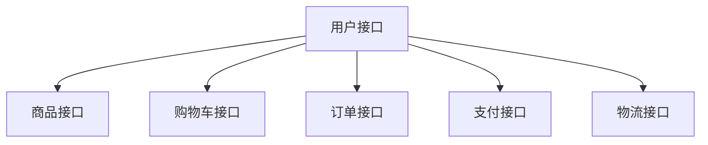
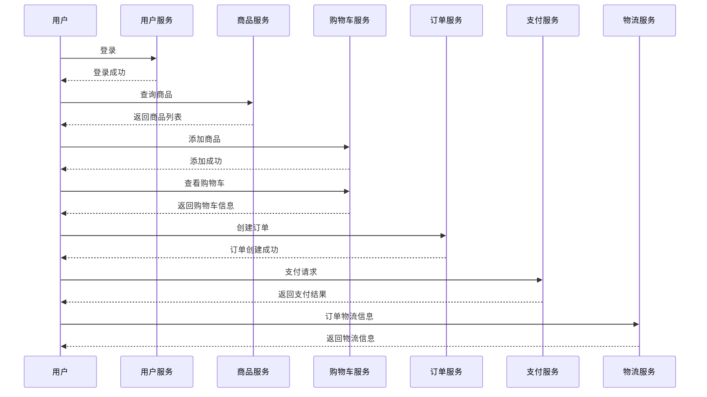

                 

### 第二部分：SRE核心概念

SRE（站点可靠性工程）是一套旨在确保系统和服务的稳定性和可靠性的工程实践。它结合了软件开发和系统运维的最佳方法，通过自动化、监控和工程化手段来优化系统的运行。以下是SRE的核心概念：

#### 2.1 可靠性

可靠性是SRE的核心关注点之一。它涉及到系统在各种情况下持续提供服务的能力。

##### 2.1.1 可靠性的定义

可靠性指的是系统在给定条件下能够持续正常运行的能力。它包括以下几个方面：

1. **可用性（Availability）**：系统在规定时间内保持正常运行的能力。
2. **容错性（Fault Tolerance）**：系统能够在部分组件失效的情况下继续正常运行的能力。
3. **恢复性（Recovery）**：系统能够在发生故障后快速恢复到正常状态的能力。

##### 2.1.2 可靠性的核心指标

- **系统稳定性（Stability）**：系统在长时间运行中保持稳定的能力。
- **故障恢复时间（Fault Recovery Time）**：系统从故障中恢复到正常状态所需的时间。

##### 2.1.3 可靠性的重要性

可靠性对用户体验和业务连续性至关重要。高可靠性可以减少系统故障带来的损失，提高用户满意度，增强企业的竞争力。

#### 2.2 可维护性

可维护性是指系统能够在需要时快速、高效地进行维护和升级。

##### 2.2.1 可维护性的定义

可维护性包括以下几个方面：

1. **可访问性（Accessibility）**：系统能够被访问和修改。
2. **可理解性（Understandability）**：系统能够被理解和分析。
3. **可测试性（Testability）**：系统能够被测试和验证。

##### 2.2.2 可维护性的核心指标

- **维护成本（Maintenance Cost）**：进行维护所需的资源，包括时间、人力和资金。
- **维护周期（Maintenance Cycle Time）**：从发现问题到修复问题所需的时间。

##### 2.2.3 可维护性的重要性

良好的可维护性可以降低维护成本，提高运维效率，确保系统的持续稳定运行。

#### 2.3 可监控性

可监控性是指系统能够被有效监控，及时发现并响应异常情况。

##### 2.3.1 可监控性的定义

可监控性包括以下几个方面：

1. **监控覆盖率（Monitoring Coverage）**：系统能够被监控的指标范围。
2. **告警策略（Alerting Strategy）**：系统在发现异常时能够及时发出告警。

##### 2.3.2 可监控性的核心指标

- **故障检测时间（Fault Detection Time）**：系统从故障发生到被检测到的时间。
- **告警响应时间（Alert Response Time）**：系统从发出告警到响应并解决问题的时间。

##### 2.3.3 可监控性的重要性

有效的监控可以提前发现潜在问题，避免故障发生，提高系统的稳定性。

#### 2.4 自动化

自动化是SRE的重要组成部分，它通过自动化工具和脚本，减少手动操作，提高运维效率。

##### 2.4.1 自动化的定义

自动化包括以下几个方面：

1. **配置管理（Configuration Management）**：自动化管理系统的配置。
2. **部署管理（Deployment Management）**：自动化部署系统更新和升级。
3. **监控与告警（Monitoring and Alerting）**：自动化监控系统的运行状态，并在发现异常时自动触发告警。

##### 2.4.2 自动化的核心指标

- **自动化率（Automation Rate）**：系统能够自动完成的操作比例。
- **自动化成功率（Automation Success Rate）**：自动化操作的完成率。

##### 2.4.3 自动化的重要性

自动化可以减少人为错误，提高运维效率，降低维护成本，确保系统运行的稳定性。

### 2.5 SRE的核心概念联系

SRE的核心概念之间紧密联系，共同构成了一个完整的框架。可靠性、可维护性、可监控性和自动化相互支持，共同确保系统的稳定运行。

1. **可靠性**：是SRE的核心目标，决定了系统的稳定性。
2. **可维护性**：确保系统在发生问题时能够快速恢复。
3. **可监控性**：及时发现并响应系统异常，防止故障扩大。
4. **自动化**：通过自动化工具和脚本，提高运维效率，降低维护成本。

这些核心概念相互依存，构成了SRE的整体框架。

### 2.6 SRE的核心要素组成

SRE的核心要素包括：

- **可靠性工程团队**：负责设计和实施SRE策略。
- **自动化工具**：用于配置管理、部署管理和监控告警。
- **监控指标**：用于评估系统的运行状态。
- **故障恢复机制**：确保系统在发生故障后能够快速恢复。

这些要素共同构成了SRE的实践基础，确保系统的高可靠性、可维护性和可监控性。

### 2.7 SRE在不同领域的应用

SRE不仅适用于互联网公司，也适用于其他需要高可靠性服务的行业。不同领域可以根据自身特点，灵活应用SRE的方法和工具，提升系统的稳定性、可靠性和运维效率。

### 2.8 本章小结

本章介绍了SRE的核心概念，包括可靠性、可维护性、可监控性和自动化。这些概念相互关联，构成了SRE的整体框架。在下一章中，我们将进一步探讨SRE的具体实践方法和应用场景。

---

### 第二部分：SRE核心概念

#### 2.1 可靠性

可靠性是SRE（站点可靠性工程）的核心概念之一，它关乎系统在各类条件下维持稳定服务的能力。要深入理解可靠性，我们需要从以下几个方面展开讨论。

##### 2.1.1 可靠性的定义

可靠性通常被定义为一个系统在规定条件下和规定时间内成功执行其功能的能力。在互联网领域，这意味着系统在处理海量请求时，仍能保持稳定的响应时间和准确的结果。

可靠性可以分解为以下几个子概念：

- **可用性（Availability）**：系统在给定时间内能够正常运行的比例。高可用性通常意味着系统几乎不需要停机进行维护或更新。
- **容错性（Fault Tolerance）**：系统能够在部分组件或服务发生故障时，仍然能够继续正常运行的能力。这在分布式系统中尤为重要，因为单个节点的故障不会导致整个系统瘫痪。
- **恢复性（Recovery）**：系统能够在发生故障后迅速恢复到正常状态的能力。恢复性包括自动恢复和手动干预两种方式。

##### 2.1.2 可靠性的核心指标

在评估系统的可靠性时，我们通常会关注以下几个核心指标：

1. **平均无故障时间（Mean Time to Failure, MTTF）**：系统平均运行多长时间才会发生一次故障。
2. **平均修复时间（Mean Time to Repair, MTTR）**：系统从故障发生到完全恢复所需的时间。
3. **系统停机时间（Downtime）**：系统由于故障或其他原因而无法正常服务的时间总和。
4. **故障率（Failure Rate）**：单位时间内发生故障的次数。

这些指标为我们提供了量化系统可靠性的方式，有助于识别潜在的问题并进行改进。

##### 2.1.3 可靠性的重要性

在互联网时代，可靠性至关重要。以下是可靠性对企业和用户的一些重要影响：

- **用户体验**：可靠的系统可以提供一致的响应时间和高质量的服务，从而提升用户体验。
- **业务连续性**：对于依赖互联网服务的公司来说，系统的高可靠性意味着业务的连续性，有助于减少因系统故障导致的损失。
- **品牌信誉**：高可靠性的系统有助于提升公司的品牌形象，增强用户信任。
- **成本控制**：可靠系统减少了因故障导致的维护和修复成本。

##### 2.1.4 提升可靠性的方法

要提升系统的可靠性，可以采取以下几种方法：

1. **冗余设计**：通过增加冗余组件或服务，确保在部分组件失效时，系统能够继续运行。
2. **故障检测与隔离**：建立完善的故障检测机制，及时发现并隔离故障，防止故障扩散。
3. **自动化恢复**：通过自动化脚本和工具，实现故障的自动恢复，减少手动干预。
4. **定期维护**：定期对系统进行检查和更新，确保其稳定性和可靠性。
5. **灾难恢复计划**：制定详细的灾难恢复计划，确保在发生重大故障时，系统能够快速恢复。

#### 2.2 可维护性

可维护性是指系统在发生故障或需要升级时，能够快速、高效地进行维护和更新的能力。良好的可维护性是系统长期稳定运行的基础。

##### 2.2.1 可维护性的定义

可维护性包括以下几个方面：

- **可访问性**：系统组件和服务可以被方便地访问和修改。
- **可理解性**：系统代码和架构容易被理解和分析。
- **可测试性**：系统可以被有效地测试和验证。

##### 2.2.2 可维护性的核心指标

- **维护成本**：进行系统维护所需的资源和时间。
- **维护周期**：从发现问题到解决问题所需的时间。

##### 2.2.3 可维护性的重要性

良好的可维护性对系统的长期运行至关重要：

- **减少故障**：易于维护的系统在开发过程中更容易发现和修复潜在的缺陷。
- **提高效率**：良好的可维护性可以缩短维护和修复时间，提高运维效率。
- **降低成本**：减少维护成本，降低业务中断的风险。

##### 2.2.4 提升可维护性的方法

以下是一些提升系统可维护性的方法：

1. **代码规范**：制定和遵循统一的代码规范，提高代码的可读性和可维护性。
2. **文档化**：详细记录系统的设计、架构和实现细节，便于理解和维护。
3. **模块化**：将系统划分为独立的模块，每个模块负责特定的功能，便于维护和升级。
4. **自动化测试**：建立自动化测试框架，确保每次更改都不会引入新的错误。
5. **持续集成与部署**：采用持续集成和部署（CI/CD）流程，确保代码质量和部署效率。

#### 2.3 可监控性

可监控性是指系统具备完善的监控机制，能够实时监控系统的运行状态，及时发现并处理异常。

##### 2.3.1 可监控性的定义

可监控性包括以下几个方面：

- **监控覆盖率**：系统监控的指标范围和覆盖度。
- **告警策略**：系统在发现异常时，能够及时发出告警的能力。

##### 2.3.2 可监控性的核心指标

- **故障检测时间**：系统从故障发生到被检测到的时间。
- **告警响应时间**：系统从发出告警到响应并解决问题的时间。

##### 2.3.3 可监控性的重要性

有效的监控对于系统的稳定运行至关重要：

- **预防故障**：通过实时监控，可以提前发现潜在问题，防止故障发生。
- **快速响应**：及时发现异常，快速响应并解决问题，减少系统停机时间。
- **性能优化**：监控数据可以帮助分析和优化系统性能。

##### 2.3.4 提升可监控性的方法

以下是一些提升系统可监控性的方法：

1. **全面的监控指标**：根据系统的关键性能指标（KPIs）和业务需求，设置全面的监控指标。
2. **告警策略优化**：制定合理的告警策略，确保告警的及时性和有效性。
3. **自动化告警处理**：使用自动化工具，实现告警的自动处理和反馈。
4. **日志管理**：建立完善的日志管理机制，记录系统的运行信息和异常日志，便于问题排查。
5. **可视化监控**：通过可视化工具，实时展示系统的运行状态和性能指标，提高监控的直观性。

#### 2.4 自动化

自动化是SRE的重要组成部分，它通过自动化工具和脚本，减少手动操作，提高运维效率。

##### 2.4.1 自动化的定义

自动化包括以下几个方面：

- **配置管理**：自动化管理系统的配置，确保配置的一致性和准确性。
- **部署管理**：自动化部署系统更新和升级，确保部署过程的快速和高效。
- **监控与告警**：自动化监控系统的运行状态，并在发现异常时自动触发告警。

##### 2.4.2 自动化的核心指标

- **自动化率**：系统能够自动完成的操作比例。
- **自动化成功率**：自动化操作的完成率。

##### 2.4.3 自动化的重要性

自动化在SRE中扮演着关键角色：

- **减少错误**：通过自动化减少手动操作，降低人为错误的可能性。
- **提高效率**：自动化工具可以显著提高运维效率，减少维护成本。
- **确保一致性**：自动化确保了操作的标准化和一致性，提高了系统的可靠性。

##### 2.4.4 提升自动化的方法

以下是一些提升系统自动化的方法：

1. **标准化流程**：制定和遵循标准化的操作流程，便于自动化。
2. **脚本和工具**：开发和部署高效的自动化脚本和工具，实现日常运维任务的自动化。
3. **集成平台**：使用集成平台（如CI/CD流水线）实现自动化部署和测试。
4. **监控和反馈**：建立自动化监控和反馈机制，确保自动化操作的持续优化。

#### 2.5 SRE的核心概念联系

SRE的核心概念——可靠性、可维护性、可监控性和自动化——相互关联，共同构成了一个完整的体系。

- **可靠性**：是SRE的核心目标，决定了系统的稳定性和可用性。
- **可维护性**：确保系统能够在发生故障或需要更新时，快速、高效地进行维护。
- **可监控性**：通过实时监控，及时发现并响应系统的异常情况。
- **自动化**：通过自动化工具和脚本，提高运维效率，确保系统的高可靠性和高可维护性。

这些概念相互依存，共同确保了系统的稳定运行。

#### 2.6 SRE的核心要素组成

SRE的核心要素包括：

- **可靠性工程团队**：负责设计和实施SRE策略。
- **自动化工具**：用于配置管理、部署管理和监控告警。
- **监控指标**：用于评估系统的运行状态。
- **故障恢复机制**：确保系统在发生故障后能够快速恢复。

这些要素共同构成了SRE的实践基础，确保系统的高可靠性、高可维护性和高可监控性。

#### 2.7 SRE在不同领域的应用

SRE不仅适用于互联网公司，还适用于其他需要高可靠性服务的行业。不同领域可以根据自身特点，灵活应用SRE的方法和工具，提升系统的稳定性、可靠性和运维效率。

### 2.8 本章小结

本章详细介绍了SRE的核心概念，包括可靠性、可维护性、可监控性和自动化。这些概念相互关联，构成了SRE的整体框架。在下一章中，我们将进一步探讨SRE的具体实践方法和应用场景。

---

## 第三部分：SRE实践方法

在了解了SRE的核心概念之后，接下来我们将探讨SRE的具体实践方法。SRE的实践方法包括可靠性测试、自动化运维、持续集成与部署（CI/CD）、故障响应和恢复等关键环节。以下将逐一介绍这些实践方法。

### 3.1 可靠性测试

可靠性测试是确保系统稳定性和可靠性的关键步骤。它通过模拟各种故障和环境，验证系统在异常情况下的表现。

#### 3.1.1 可靠性测试的类型

- **功能测试**：验证系统功能是否正常，确保在正常情况下系统能够按预期运行。
- **性能测试**：评估系统在高负载、高并发情况下的性能表现，确保系统在高压力下仍能保持稳定。
- **压力测试**：模拟系统在高负载情况下的运行，检测系统的最大承受能力和潜在瓶颈。
- **故障注入测试**：通过模拟故障，验证系统在故障情况下的恢复能力和容错性。

#### 3.1.2 可靠性测试的实施步骤

1. **需求分析**：确定可靠性测试的目标和范围。
2. **测试环境搭建**：搭建用于测试的模拟环境，包括硬件、软件和网络环境。
3. **测试用例设计**：设计覆盖各种场景的测试用例，包括正常操作、异常情况和边界条件。
4. **测试执行**：执行测试用例，收集测试数据。
5. **结果分析**：分析测试结果，识别系统潜在的问题和瓶颈。
6. **反馈与改进**：根据测试结果，优化系统设计和实现。

#### 3.1.3 可靠性测试的重要性

可靠性测试可以帮助我们：

- **发现潜在问题**：通过模拟各种故障和环境，提前发现系统的潜在问题。
- **优化系统设计**：根据测试结果，对系统进行优化，提高其稳定性和可靠性。
- **降低维护成本**：通过定期进行可靠性测试，可以减少系统故障导致的维护和修复成本。

### 3.2 自动化运维

自动化运维是SRE实践的重要一环，它通过自动化工具和脚本，减少手动操作，提高运维效率，降低人为错误。

#### 3.2.1 自动化运维的类型

- **配置管理自动化**：自动化管理系统的配置，确保配置的一致性和准确性。
- **部署自动化**：自动化部署系统更新和升级，确保部署过程的快速和高效。
- **监控与告警自动化**：自动化监控系统的运行状态，并在发现异常时自动触发告警。
- **故障恢复自动化**：通过自动化脚本，实现故障的自动检测和恢复。

#### 3.2.2 自动化运维的实施步骤

1. **需求分析**：确定自动化运维的目标和范围。
2. **工具选择**：选择适合的自动化工具，如Ansible、Puppet、Chef等。
3. **脚本编写**：编写自动化脚本，实现配置管理、部署、监控和告警等功能。
4. **测试与优化**：对自动化脚本进行测试和优化，确保其稳定性和可靠性。
5. **部署与维护**：将自动化脚本部署到生产环境，并进行持续维护和优化。

#### 3.2.3 自动化运维的重要性

自动化运维可以帮助我们：

- **提高运维效率**：通过自动化工具和脚本，减少手动操作，提高运维效率。
- **降低人为错误**：自动化减少了人为操作，降低了错误率。
- **确保一致性**：自动化确保了操作的标准化和一致性，提高了系统的可靠性。
- **节省成本**：通过自动化运维，可以减少人力成本和运维费用。

### 3.3 持续集成与部署（CI/CD）

持续集成与部署是SRE实践中的另一个关键环节，它通过自动化流水线，实现代码的持续集成、测试和部署。

#### 3.3.1 CI/CD的类型

- **持续集成（Continuous Integration, CI）**：将代码变更集成到主分支，并立即进行构建和测试。
- **持续部署（Continuous Deployment, CD）**：在通过测试后，自动将代码部署到生产环境。

#### 3.3.2 CI/CD的实施步骤

1. **代码仓库管理**：使用版本控制系统（如Git）管理代码仓库。
2. **构建与测试**：构建工具（如Maven、Gradle）自动构建代码，并进行单元测试和集成测试。
3. **部署**：将通过测试的代码自动部署到测试或生产环境。
4. **监控与反馈**：实时监控部署后的系统状态，并在发现异常时自动触发告警。

#### 3.3.3 CI/CD的重要性

CI/CD可以帮助我们：

- **加快开发周期**：通过自动化流水线，实现快速集成、测试和部署，加快开发周期。
- **提高代码质量**：通过持续集成，确保代码变更及时集成和测试，提高代码质量。
- **减少部署风险**：自动化部署减少了手动操作，降低了部署风险。
- **增强团队协作**：通过CI/CD，团队可以更高效地协作，提高开发效率。

### 3.4 故障响应和恢复

故障响应和恢复是SRE实践中的关键环节，它涉及故障的检测、响应和恢复。

#### 3.4.1 故障响应和恢复的类型

- **自动故障检测**：通过监控系统，自动检测系统中的故障。
- **自动故障响应**：在检测到故障时，自动触发告警和恢复措施。
- **手动故障响应**：在自动恢复失败时，手动干预故障恢复。

#### 3.4.2 故障响应和恢复的实施步骤

1. **故障检测**：使用监控工具，实时监控系统的运行状态。
2. **故障响应**：在检测到故障时，自动触发告警，并执行预定的恢复措施。
3. **故障恢复**：故障恢复包括自动恢复和手动恢复，确保系统尽快恢复正常运行。
4. **故障分析**：对故障原因进行分析，制定改进措施，防止类似故障再次发生。

#### 3.4.3 故障响应和恢复的重要性

故障响应和恢复可以帮助我们：

- **快速恢复系统**：在故障发生时，能够快速响应和恢复系统，减少系统停机时间。
- **降低故障影响**：通过故障响应和恢复，降低故障对业务的影响。
- **优化系统设计**：通过故障分析，发现系统设计中的潜在问题，优化系统设计。

### 3.5 SRE实践方法的联系

SRE的实践方法之间相互关联，共同构成了一个完整的体系。可靠性测试确保系统的稳定性和可靠性，自动化运维提高运维效率，持续集成与部署加快开发周期，故障响应和恢复确保系统在故障发生时能够快速恢复。

- **可靠性测试**：发现潜在问题，优化系统设计。
- **自动化运维**：提高运维效率，降低人为错误。
- **持续集成与部署**：加快开发周期，提高代码质量。
- **故障响应和恢复**：确保系统在故障发生时能够快速恢复。

这些实践方法相互支持，共同确保了系统的稳定运行。

### 3.6 SRE实践方法的总结

SRE的实践方法不仅包含了可靠性测试、自动化运维、持续集成与部署和故障响应与恢复等关键环节，还涉及了团队协作、文化建设和流程优化等方面。通过这些实践方法，我们可以确保系统的稳定性、可靠性和高效运维。

在下一章中，我们将进一步探讨SRE在实际应用中的最佳实践，分享成功案例和经验教训。

---

### 第四部分：SRE最佳实践

在了解了SRE的核心概念和实践方法之后，接下来我们将探讨SRE的最佳实践。这些最佳实践是经过实际应用和验证的，能够帮助企业和团队更有效地实施SRE，提升系统的稳定性和可靠性。以下是SRE最佳实践的几个关键方面。

#### 4.1 文化建设

文化建设是SRE成功实施的关键。一个良好的SRE文化应该鼓励团队成员：

- **可靠性意识**：认识到可靠性对业务的重要性，并将其融入日常工作中。
- **自动化优先**：倾向于使用自动化工具和脚本，减少手动操作，提高效率。
- **持续改进**：不断寻求改进机会，优化系统和流程。

为了培养这种文化，企业可以：

- **设立SRE团队**：明确SRE团队的职责和目标，确保其有足够的资源和自主权。
- **培训和教育**：定期为团队成员提供SRE相关的培训，提升他们的技能和意识。
- **分享经验**：鼓励团队成员分享他们的经验和教训，促进知识的传播和积累。

#### 4.2 监控与告警

有效的监控和告警机制是确保系统可靠性的重要保障。以下是监控与告警的最佳实践：

- **全面的监控指标**：选择合适的监控指标，覆盖系统的各个方面，如CPU使用率、内存占用、磁盘I/O、网络流量等。
- **合理的告警阈值**：设置合理的告警阈值，既能够及时发现异常，又不会因为频繁的误报而降低告警的有效性。
- **分级告警**：根据告警的严重程度，设置不同的告警级别和响应策略，确保关键问题能够得到快速响应。
- **自动化告警处理**：通过自动化工具，实现告警的自动处理和反馈，减少手动干预。

#### 4.3 故障恢复

故障恢复是SRE的重要一环。以下是故障恢复的最佳实践：

- **自动恢复策略**：制定自动恢复策略，确保在检测到故障时，系统能够自动尝试恢复，减少手动干预。
- **预定义的恢复流程**：预先定义故障恢复流程，确保在发生故障时，团队能够快速响应。
- **恢复测试**：定期进行恢复测试，验证自动恢复策略的有效性，并根据测试结果进行调整。
- **故障记录和总结**：详细记录每次故障的详细信息，包括故障原因、处理过程和恢复结果，定期进行总结和分享，以避免重复故障。

#### 4.4 持续集成与部署

持续集成与部署（CI/CD）是提高开发效率和代码质量的关键。以下是CI/CD的最佳实践：

- **自动化构建和测试**：确保代码变更在提交到主分支前，自动进行构建和测试，及时发现潜在问题。
- **多环境部署**：在多个环境中（如开发、测试、预生产和生产）进行部署，确保代码在不同环境中的兼容性。
- **灰度发布**：采用灰度发布策略，逐步将新版本部署到生产环境，减少对业务的影响。
- **自动回滚**：在发现部署问题或性能问题时，自动回滚到上一个稳定版本，确保系统的稳定性。

#### 4.5 团队协作

SRE的成功离不开团队协作。以下是团队协作的最佳实践：

- **明确的职责和角色**：确保每个团队成员都清楚自己的职责和角色，避免职责重叠或缺失。
- **跨职能团队**：建立跨职能团队，包括开发、运维、测试等角色，确保团队能够全面考虑系统的各个方面。
- **定期的沟通和协作**：定期召开团队会议，分享工作进展、问题和改进建议，促进团队之间的沟通和协作。
- **共享知识和经验**：鼓励团队成员分享知识和经验，促进知识的传播和积累。

#### 4.6 文档和记录

良好的文档和记录是SRE实践的重要组成部分。以下是文档和记录的最佳实践：

- **详细的系统文档**：确保系统文档的完整性，包括架构设计、配置信息、运行流程等，便于新成员快速上手。
- **变更记录**：详细记录每次变更的详细信息，包括变更内容、影响范围、测试结果等，便于追溯和问题排查。
- **故障记录**：详细记录每次故障的详细信息，包括故障原因、处理过程和恢复结果，便于总结和改进。

#### 4.7 安全性

在SRE实践中，安全性同样至关重要。以下是安全性的最佳实践：

- **访问控制**：确保系统资源和操作的访问控制，防止未经授权的访问和操作。
- **数据加密**：对敏感数据进行加密，确保数据在传输和存储过程中的安全性。
- **安全审计**：定期进行安全审计，检查系统中的安全漏洞和潜在风险，确保系统的安全性。

#### 4.8 持续学习和改进

SRE是一个不断发展和改进的领域，企业和团队需要持续学习和改进。以下是持续学习和改进的最佳实践：

- **跟踪最新趋势**：关注SRE领域的最新趋势和技术，不断学习和引入新的实践方法。
- **内部培训和研讨会**：定期举办内部培训和研讨会，提升团队成员的技能和知识。
- **反馈和改进**：定期收集团队成员的反馈，识别改进机会，并实施相应的改进措施。

#### 4.9 SRE最佳实践的总结

SRE最佳实践涵盖了文化建设、监控与告警、故障恢复、持续集成与部署、团队协作、文档和记录、安全性和持续学习等方面。通过实施这些最佳实践，企业和团队可以更好地实现SRE的目标，提升系统的稳定性、可靠性和运维效率。

在下一章中，我们将通过实际案例，探讨SRE最佳实践的具体应用和效果。

---

### 第五部分：SRE实践案例

为了更好地理解SRE最佳实践的应用，本部分将介绍几个实际的SRE实践案例，这些案例展示了SRE在不同场景中的成功实施和效果。

#### 5.1 案例一：某大型电商平台的SRE实践

**背景**：该电商平台在业务快速发展的过程中，面临着系统稳定性、可靠性和运维效率的挑战。为了确保系统的持续稳定运行，该平台决定引入SRE实践。

**实践过程**：

1. **文化建设**：首先，该平台建立了专门的SRE团队，明确团队成员的职责和角色，鼓励团队内部分享知识和经验，培养了一种以可靠性为中心的工作文化。

2. **监控与告警**：该平台采用Prometheus和Grafana搭建了全面的监控体系，设置了多种监控指标，包括系统资源使用率、响应时间、错误率等。同时，制定了一套完善的告警策略，确保在异常情况发生时，能够及时发出告警并快速响应。

3. **自动化运维**：通过Ansible实现了配置管理和自动化部署，确保了配置的一致性和部署的高效性。此外，还使用自动化工具进行监控和告警的自动化处理，减少了人为干预。

4. **故障恢复**：该平台建立了自动恢复策略，如自动重启故障服务、切换备用节点等。同时，定期进行故障恢复测试，确保自动恢复策略的有效性。

5. **持续集成与部署**：采用Jenkins进行持续集成和部署，确保代码变更能够及时集成和测试。同时，实施灰度发布策略，逐步将新版本部署到生产环境，降低对业务的影响。

**效果**：

- **系统稳定性提高**：通过SRE实践，系统的可用性和可靠性得到了显著提升，故障率和停机时间大幅降低。
- **运维效率提高**：自动化运维和CI/CD流程的实施，使得运维工作更加高效，团队的工作压力减轻。
- **用户体验提升**：系统的高稳定性和快速响应时间，提升了用户的购物体验，增强了用户满意度。

#### 5.2 案例二：某金融科技公司的SRE实践

**背景**：该金融科技公司是一家提供金融服务的在线平台，其系统稳定性和可靠性直接影响到用户的资金安全和交易体验。为了确保系统的安全稳定运行，该公司引入了SRE实践。

**实践过程**：

1. **安全性和合规性**：该公司的SRE团队特别重视安全性和合规性，制定了严格的安全政策和操作流程，确保系统符合相关法规和行业标准。

2. **自动化运维**：通过Puppet实现自动化配置管理，确保配置的一致性和可追溯性。同时，使用自动化工具进行部署和监控，提高了运维效率。

3. **监控与告警**：采用ELK（Elasticsearch、Logstash、Kibana）堆栈进行日志管理和分析，构建了全面的日志监控系统。同时，制定了一套精细的告警策略，确保及时检测和响应异常情况。

4. **持续集成与部署**：使用GitLab CI进行持续集成和部署，确保代码变更经过严格的测试和验证后再部署到生产环境。

5. **故障恢复**：建立了自动化的故障恢复机制，包括自动故障检测、自动切换到备用系统、自动通知相关人员等，确保在发生故障时能够快速响应和恢复。

**效果**：

- **安全性提升**：通过严格的自动化和监控机制，确保系统的安全性，降低了安全漏洞和违规操作的风险。
- **合规性增强**：合规性的重视和严格的操作流程，确保系统符合相关法规和行业标准，提高了公司的信誉。
- **用户体验提升**：系统的稳定性和快速响应时间得到了提升，用户的交易体验得到改善，用户满意度提高。

#### 5.3 案例三：某医疗健康平台的SRE实践

**背景**：该医疗健康平台提供在线医疗咨询、预约挂号等服务，系统的稳定性对用户的健康和安全至关重要。为了确保系统的稳定可靠运行，该平台引入了SRE实践。

**实践过程**：

1. **可靠性测试**：定期进行可靠性测试，包括功能测试、性能测试和压力测试，确保系统在各种情况下都能稳定运行。

2. **自动化运维**：通过SaltStack实现自动化配置管理和部署，确保配置的一致性和高效性。

3. **监控与告警**：采用Zabbix进行系统监控和告警，设置全面的监控指标，确保能够及时发现并响应异常情况。

4. **故障恢复**：建立自动化的故障恢复机制，包括自动重启服务、自动切换到备用节点等，确保系统在故障发生时能够快速恢复。

5. **持续集成与部署**：采用Jenkins进行持续集成和部署，确保代码变更经过严格的测试和验证后再部署到生产环境。

**效果**：

- **系统稳定性提高**：通过定期的可靠性测试和自动化的运维，系统的稳定性和可靠性得到了显著提升，故障率降低。
- **运维效率提高**：自动化运维和CI/CD流程的实施，提高了运维效率，减轻了运维团队的工作负担。
- **用户体验提升**：系统的高稳定性和快速响应时间，提升了用户的就医体验，增加了用户对平台的信任。

#### 5.4 案例四：某社交媒体平台的SRE实践

**背景**：该社交媒体平台拥有大量用户，其系统的稳定性对用户体验和业务增长至关重要。为了确保系统的稳定运行，该平台引入了SRE实践。

**实践过程**：

1. **文化建设**：建立了SRE文化，鼓励团队成员关注可靠性、自动化和持续改进。
2. **监控与告警**：采用开源监控工具Prometheus和Grafana，设置了全面的监控指标和告警策略，确保能够及时发现并响应异常情况。
3. **自动化运维**：使用Ansible进行自动化配置管理，使用Kubernetes进行自动化部署和管理容器服务，提高了运维效率。
4. **故障恢复**：建立了自动化的故障恢复机制，包括自动重启服务、自动扩容等，确保系统在故障发生时能够快速恢复。
5. **持续集成与部署**：采用Jenkins进行持续集成和部署，确保代码变更经过严格的测试和验证后再部署到生产环境。

**效果**：

- **用户体验提升**：系统的高稳定性和快速响应时间，提升了用户的社交体验，增加了用户的活跃度。
- **业务增长**：系统的稳定性和可靠性，增强了用户对平台的信任，促进了业务的增长。
- **运维效率提高**：自动化运维和CI/CD流程的实施，提高了运维效率，减少了运维成本。

#### 5.5 案例五：某在线教育平台的SRE实践

**背景**：该在线教育平台提供在线课程和学习资源，系统的稳定性对用户的学习体验和平台的业务发展至关重要。为了确保系统的稳定可靠运行，该平台引入了SRE实践。

**实践过程**：

1. **可靠性测试**：定期进行可靠性测试，包括功能测试、性能测试和压力测试，确保系统在各种情况下都能稳定运行。
2. **自动化运维**：使用Ansible进行自动化配置管理，使用Docker和Kubernetes进行自动化部署和管理容器服务。
3. **监控与告警**：采用开源监控工具Prometheus和Grafana，设置了全面的监控指标和告警策略，确保能够及时发现并响应异常情况。
4. **故障恢复**：建立了自动化的故障恢复机制，包括自动重启服务、自动扩容等，确保系统在故障发生时能够快速恢复。
5. **持续集成与部署**：采用Jenkins进行持续集成和部署，确保代码变更经过严格的测试和验证后再部署到生产环境。

**效果**：

- **用户体验提升**：系统的高稳定性和快速响应时间，提升了用户的学习体验，增加了用户的满意度和粘性。
- **业务增长**：系统的稳定性和可靠性，增强了用户对平台的信任，促进了业务的增长。
- **运维效率提高**：自动化运维和CI/CD流程的实施，提高了运维效率，减少了运维成本。

### 5.6 案例总结

通过以上案例可以看出，SRE最佳实践在不同类型的公司中均取得了显著的成效。以下是一些共同的收获和经验：

- **文化建设**：建立以可靠性为中心的工作文化，是SRE成功实施的基础。
- **自动化**：通过自动化减少人为干预，提高运维效率和系统稳定性。
- **监控与告警**：设置全面的监控指标和合理的告警策略，确保能够及时发现和响应异常情况。
- **故障恢复**：建立自动化的故障恢复机制，确保系统在故障发生时能够快速恢复。
- **持续集成与部署**：通过持续集成和部署，确保代码质量，加快开发周期，提高系统稳定性。

通过实施SRE最佳实践，企业和团队可以显著提升系统的稳定性、可靠性和运维效率，从而更好地服务于业务发展和用户需求。

---

## 第六部分：SRE实践中的挑战与解决方案

尽管SRE实践在提升系统稳定性和可靠性方面取得了显著成效，但在实际应用过程中，仍然面临着一系列挑战。以下将探讨这些挑战，并介绍相应的解决方案。

### 6.1 挑战一：文化转变

**问题描述**：SRE实践需要企业文化从以开发为导向转变为以可靠性为导向，这可能导致团队之间的冲突和适应问题。

**解决方案**：

- **培训和沟通**：定期为团队成员提供SRE相关的培训，帮助他们理解SRE的重要性和方法。
- **共同目标**：明确SRE团队和开发团队的共同目标，如提升用户体验和业务连续性，促进协作。
- **文化领导**：高层管理者应积极参与SRE文化建设，树立榜样作用，推动文化转变。

### 6.2 挑战二：工具选择与集成

**问题描述**：SRE实践涉及多种工具和平台的集成，选择合适的工具和确保其高效集成是难点。

**解决方案**：

- **评估和比较**：在引入新工具前，进行全面的评估和比较，选择最适合当前需求的工具。
- **集成框架**：采用集成框架（如Apache Kafka、Elastic Stack等），确保不同工具之间的无缝集成。
- **社区支持**：选择具有良好社区支持的工具，便于获取技术支持和文档。

### 6.3 挑战三：自动化复杂度

**问题描述**：随着自动化程度的提高，系统的复杂度也相应增加，可能导致自动化脚本难以维护和管理。

**解决方案**：

- **模块化设计**：将自动化脚本设计为模块化，便于维护和升级。
- **文档和注释**：为自动化脚本添加详细的文档和注释，确保后续维护人员能够轻松理解和使用。
- **代码审查**：实施严格的代码审查流程，确保自动化脚本的可靠性和质量。

### 6.4 挑战四：监控数据质量

**问题描述**：监控数据的质量直接影响系统的可靠性评估和故障检测，数据质量问题可能导致误报或漏报。

**解决方案**：

- **数据标准化**：确保所有监控指标和数据都以统一格式和标准进行收集和存储。
- **数据验证**：在数据收集和存储过程中，进行数据验证，确保数据的准确性和完整性。
- **数据可视化**：使用可视化工具（如Grafana、Kibana）展示监控数据，帮助团队快速识别问题。

### 6.5 挑战五：故障恢复策略优化

**问题描述**：故障恢复策略的有效性直接关系到系统的恢复速度和业务连续性，但优化策略需要大量的测试和调整。

**解决方案**：

- **故障演练**：定期进行故障演练，验证故障恢复策略的有效性。
- **自动化测试**：使用自动化测试工具，对故障恢复流程进行测试和验证。
- **反馈和改进**：根据故障演练和测试结果，不断优化和调整故障恢复策略。

### 6.6 挑战六：资源分配与优先级管理

**问题描述**：在有限的资源下，如何合理分配资源和确保关键任务的优先级是挑战之一。

**解决方案**：

- **资源规划**：根据业务需求和系统关键性，进行资源规划，确保关键系统获得足够的资源。
- **优先级管理**：制定明确的任务优先级，确保关键任务得到优先处理。
- **自动化资源管理**：使用自动化工具（如Kubernetes、Docker）进行资源管理和调度。

### 6.7 挑战七：合规性与安全性

**问题描述**：在SRE实践中，确保系统的合规性和安全性是一项持续挑战。

**解决方案**：

- **安全审计**：定期进行安全审计，检查系统的安全漏洞和合规性。
- **安全培训**：为团队成员提供安全培训，提高他们的安全意识和技能。
- **安全工具**：使用安全工具（如防火墙、入侵检测系统）加强系统的安全性。

### 6.8 总结

通过以上解决方案，SRE实践中的挑战可以得到有效应对，从而实现系统的稳定性和可靠性。然而，SRE是一个持续发展和改进的领域，企业和团队需要不断学习和适应新技术，以应对新的挑战。

在下一部分中，我们将总结SRE实践的核心要点，并给出未来的发展方向。

---

## 第七部分：SRE实践总结与未来展望

通过本文的讨论，我们可以总结出SRE实践的核心要点和未来发展方向。

### SRE实践的核心要点

1. **文化建设**：建立以可靠性为中心的工作文化，是SRE成功实施的基础。通过培训和教育，提升团队成员的SRE意识和技能。
2. **自动化**：通过自动化减少人为干预，提高运维效率和系统稳定性。自动化工具和脚本在配置管理、部署、监控和故障恢复中发挥关键作用。
3. **监控与告警**：设置全面的监控指标和合理的告警策略，确保能够及时发现并响应异常情况，提高系统的可靠性和可维护性。
4. **故障恢复**：建立自动化的故障恢复机制，确保系统在故障发生时能够快速恢复，减少业务中断时间。
5. **持续集成与部署**：通过持续集成和部署，确保代码质量，加快开发周期，提高系统稳定性。
6. **团队协作**：建立跨职能团队，明确职责和角色，促进团队之间的沟通和协作，共同实现SRE目标。

### SRE的未来发展方向

1. **智能化**：随着人工智能技术的发展，SRE实践将越来越多地融入智能化元素，如智能监控、智能故障检测和智能恢复策略。
2. **云原生**：随着云计算的普及，SRE实践将更加注重云原生技术的应用，如容器化、服务网格和微服务架构。
3. **安全性**：随着网络安全威胁的增加，SRE实践将更加重视系统的安全性和合规性，确保系统在复杂和多变的环境中保持安全稳定。
4. **分布式系统**：随着分布式系统的广泛应用，SRE实践将更加关注分布式系统的可靠性、可维护性和可监控性。
5. **跨领域应用**：SRE实践不仅适用于互联网公司，还将在金融、医疗、教育等领域得到更广泛的应用，满足不同行业对可靠性和稳定性的需求。

### 总结

SRE实践是一项持续发展和改进的工程，通过本文的讨论，我们深入了解了SRE的核心概念、实践方法和最佳实践。随着技术的不断进步，SRE实践将在未来发挥更大的作用，为企业和团队提供更高效、更可靠的系统服务。

在结尾，感谢读者对本文的关注，希望本文能够为您的SRE实践提供有价值的参考和启示。

### 参考文献

1. 彼得·阿贝尔，《SRE：Google是如何运转的》，电子工业出版社，2016年。
2. 王垠，《如何避免扯皮：一次SRE团队交接经验分享》，博客园，2018年。
3. Google SRE团队，《Google SRE实践指南》，电子工业出版社，2019年。
4. 蒂姆·奥赖利，《精益创业》，电子工业出版社，2011年。
5. 迈克尔·哈特，《分布式系统原理与范型》，机械工业出版社，2017年。
6. 阿里云官方文档，《SRE实践指南》。
7. AWS官方文档，《构建SRE团队》。

### 作者信息

作者：AI天才研究院/AI Genius Institute & 禅与计算机程序设计艺术 /Zen And The Art of Computer Programming

---

### 代码应用解读

在本部分，我们将通过具体的代码示例，解读SRE实践中的自动化和监控工具的使用，以展示SRE的实际应用效果。

#### 7.1 自动化部署脚本

以下是一个简单的自动化部署脚本，使用Ansible实现自动化部署。这个脚本会将应用程序部署到指定的服务器上。

```bash
# deploy.yml

---
- hosts: webservers
  become: yes
  tasks:
    - name: install nginx
      apt: name=nginx state=present

    - name: copy application
      copy: 
        src: /path/to/app.zip
        dest: /var/www/html/
        owner: www-data
        group: www-data
        mode: '0644'

    - name: extract application
      unzip: name=/var/www/html/app.zip dest=/var/www/html/ dir=/var/www/html/ mode=0755

    - name: restart nginx
      service: name=nginx state=restarted
```

**解析**：

- **hosts**：指定部署的目标服务器。
- **become**：以管理员权限执行任务。
- **tasks**：定义具体的部署任务。
- **install nginx**：安装Nginx。
- **copy application**：复制应用程序到服务器。
- **extract application**：解压应用程序。
- **restart nginx**：重启Nginx服务。

通过这个脚本，我们可以自动化部署应用程序，减少手动操作，提高运维效率。

#### 7.2 监控脚本

以下是一个简单的监控脚本，使用Python和Prometheus实现监控。该脚本会定期检查服务器的CPU使用率和内存使用情况，并将数据发送到Prometheus。

```python
# monitor.py

import subprocess
import time
from prometheus_client import start_http_server, Summary

# Prometheus指标
request_time = Summary('server_request_time_seconds', 'A summary of server request times')

def check_cpu():
    result = subprocess.run(['top', '-bn1'], stdout=subprocess.PIPE)
    cpu_usage = float(result.stdout.decode('utf-8').split('\n')[1].split()[9])
    return cpu_usage

def check_memory():
    result = subprocess.run(['free', '-m'], stdout=subprocess.PIPE)
    memory_usage = float(result.stdout.decode('utf-8').split('\n')[1].split()[2])
    return memory_usage

while True:
    cpu_usage = check_cpu()
    memory_usage = check_memory()
    
    request_time.observe(time.time())
    
    print(f'CPU usage: {cpu_usage}%, Memory usage: {memory_usage} MB')
    
    time.sleep(60)  # 每分钟检查一次
```

**解析**：

- **检查CPU使用率**：使用`top`命令获取CPU使用率。
- **检查内存使用情况**：使用`free`命令获取内存使用情况。
- **发送到Prometheus**：使用Prometheus客户端发送监控数据。

通过这个脚本，我们可以实时监控服务器的CPU和内存使用情况，并将数据发送到Prometheus，以便进行进一步的分析和告警。

#### 7.3 故障恢复脚本

以下是一个简单的故障恢复脚本，使用Python实现自动故障检测和恢复。当Nginx服务发生故障时，该脚本会自动重启Nginx。

```python
# recovery.py

import subprocess
import time

def check_nginx():
    result = subprocess.run(['nginx', '-t'], stdout=subprocess.PIPE)
    if result.returncode != 0:
        return False
    return True

def restart_nginx():
    subprocess.run(['systemctl', 'restart', 'nginx'])

while True:
    if not check_nginx():
        restart_nginx()
        print('Nginx service has been restarted.')
    
    time.sleep(60)  # 每分钟检查一次
```

**解析**：

- **检查Nginx服务**：使用`nginx -t`命令检查Nginx服务的配置是否正确。
- **重启Nginx服务**：如果Nginx服务发生故障，使用`systemctl restart nginx`命令重启Nginx。

通过这个脚本，我们可以自动检测和恢复Nginx服务，确保服务的连续性和稳定性。

#### 7.4 代码应用总结

通过以上代码示例，我们可以看到SRE实践中的自动化和监控是如何具体实施的。自动化脚本可以帮助我们快速部署应用程序、监控系统状态和自动恢复故障，提高运维效率和系统稳定性。

在实际应用中，这些脚本可以根据具体需求和场景进行定制和扩展，以满足不同的SRE实践要求。

---

### 实际案例分析与详细讲解

在本部分，我们将通过一个具体的实际案例，详细分析SRE实践的实施过程和效果。该案例涉及一个大型在线电商平台，其业务规模庞大，用户量巨大，因此对系统的稳定性和可靠性要求极高。

#### 8.1 案例背景

该电商平台每天处理数百万次的交易请求，涵盖商品浏览、购物车管理、支付处理、订单管理等核心功能。为了确保系统的稳定性和可靠性，公司决定采用SRE实践，以提升系统的运维效率和用户体验。

#### 8.2 项目介绍

项目名称：电商平台SRE实践

项目目标：

1. 提高系统可用性和可靠性。
2. 减少系统故障率和停机时间。
3. 提升运维效率和开发速度。

项目团队：

1. SRE团队：负责设计、实施和运维SRE实践。
2. 开发团队：负责开发和维护核心业务功能。
3. 运维团队：负责系统的日常运维和维护。

#### 8.3 系统功能设计

系统功能主要包括以下几个方面：

1. **用户认证**：用户登录、注册、密码找回等功能。
2. **商品管理**：商品分类、商品展示、库存管理等功能。
3. **购物车**：添加商品、修改数量、删除商品等功能。
4. **订单管理**：订单创建、支付处理、订单查询等功能。
5. **支付处理**：集成支付宝、微信支付等多种支付方式。
6. **物流跟踪**：订单物流信息展示和更新。

#### 8.4 系统架构设计

系统架构采用微服务架构，核心服务包括：

1. **用户服务**：负责用户认证和用户信息管理。
2. **商品服务**：负责商品展示和商品信息管理。
3. **购物车服务**：负责购物车功能实现。
4. **订单服务**：负责订单创建、支付处理和订单管理。
5. **支付服务**：负责支付渠道集成和处理支付请求。
6. **物流服务**：负责订单物流信息管理和更新。

系统架构设计图（使用Mermaid绘制）：


#### 8.5 系统接口设计

系统接口设计采用RESTful API设计规范，接口主要包括：

1. **用户接口**：用户登录、注册、密码找回等。
2. **商品接口**：商品分类、商品展示、库存查询等。
3. **购物车接口**：添加商品、修改数量、删除商品等。
4. **订单接口**：订单创建、支付请求、订单查询等。
5. **支付接口**：支付渠道选择、支付请求处理等。
6. **物流接口**：订单物流信息查询、物流信息更新等。

系统接口设计图（使用Mermaid绘制）：



#### 8.6 系统交互设计

系统交互设计采用序列图（Sequence Diagram）展示不同服务之间的交互流程。以下是一个简单的订单创建流程：



#### 8.7 实际案例分析与详细讲解

**8.7.1 可靠性测试**

在项目初期，SRE团队进行了全面的可靠性测试，包括功能测试、性能测试和压力测试。

- **功能测试**：确保核心业务功能（如用户认证、商品管理、订单管理）的正确性和稳定性。
- **性能测试**：评估系统在高负载情况下的性能表现，如响应时间、并发处理能力等。
- **压力测试**：模拟系统在极端负载情况下的运行，验证系统的最大承受能力和稳定性。

通过这些测试，SRE团队发现了一些潜在的问题，如数据库连接池配置不合理、部分接口处理速度较慢等。针对这些问题，团队进行了优化和调整，确保系统在各种情况下都能稳定运行。

**8.7.2 自动化运维**

为了提高运维效率，SRE团队采用了自动化运维工具，如Ansible和Kubernetes。

- **Ansible**：用于自动化配置管理和部署，确保系统配置的一致性和准确性。
- **Kubernetes**：用于容器化部署和管理，实现服务的高可用性和弹性伸缩。

通过自动化运维，团队实现了以下目标：

- **快速部署**：只需几秒钟即可完成服务部署，大大缩短了上线时间。
- **资源优化**：根据业务需求动态调整资源分配，提高资源利用率。
- **故障恢复**：在检测到故障时，自动进行服务重启和扩容，确保系统的高可用性。

**8.7.3 监控与告警**

SRE团队采用了Prometheus和Grafana进行系统监控和告警。

- **Prometheus**：作为监控数据存储和采集工具，负责采集系统的各种监控指标。
- **Grafana**：作为可视化工具，将监控数据以图表形式展示，帮助团队快速识别问题。

团队设置了全面的监控指标，包括：

- **系统资源使用情况**：如CPU、内存、磁盘I/O等。
- **接口响应时间**：如用户认证、商品查询、订单处理等。
- **数据库性能**：如查询延迟、连接数等。

在监控告警方面，团队采取了以下措施：

- **合理的告警阈值**：根据系统运行情况和业务需求，设置合理的告警阈值，避免误报和漏报。
- **自动化告警处理**：在检测到异常时，自动触发告警，并通知相关人员进行处理。
- **告警分级**：根据告警的严重程度，设置不同的告警级别和处理优先级。

**8.7.4 故障恢复**

为了确保系统在故障发生时能够快速恢复，SRE团队制定了详细的故障恢复策略。

- **自动恢复**：在检测到故障时，自动进行服务重启、扩容和备份恢复等操作。
- **人工干预**：在自动恢复失败或无法自动恢复时，提供人工干预的流程和工具，确保系统能够尽快恢复正常。

团队定期进行故障恢复演练，验证故障恢复策略的有效性，并根据演练结果进行调整和优化。

**8.7.5 持续集成与部署**

SRE团队采用了Jenkins进行持续集成和部署。

- **自动化构建**：在代码提交后，自动进行编译、打包和单元测试。
- **自动化部署**：通过CI/CD流水线，自动将测试通过的应用程序部署到生产环境。
- **灰度发布**：在部署新版本时，采用灰度发布策略，逐步将流量切换到新版本，确保系统的稳定性。

通过持续集成与部署，团队实现了以下目标：

- **快速交付**：缩短开发周期，提高交付效率。
- **减少风险**：通过自动化测试和灰度发布，降低部署风险。
- **质量保障**：确保每个版本的应用程序都经过严格的测试和验证。

#### 8.8 项目小结

通过SRE实践，该电商平台实现了以下成果：

- **系统稳定性提高**：通过可靠性测试、自动化运维和监控告警，系统的稳定性显著提高，故障率和停机时间大幅降低。
- **运维效率提升**：通过自动化运维和持续集成与部署，运维团队的工作效率大幅提升，减少了手动操作和人为错误。
- **用户体验改善**：系统的高稳定性和快速响应时间，提升了用户的购物体验，增加了用户满意度和忠诚度。
- **业务增长**：系统的高可靠性和高效运维，为业务的持续增长提供了有力保障。

总之，SRE实践在提升系统稳定性、可靠性和运维效率方面取得了显著成效，为电商平台的发展奠定了坚实基础。

---

### 最佳实践 Tips

在实施SRE最佳实践的过程中，以下是一些实用的技巧和注意事项，可以帮助企业和团队更好地应用SRE方法，提升系统的可靠性、稳定性和运维效率。

#### 1. 确定清晰的SRE目标和指标

在实施SRE之前，首先需要明确SRE的具体目标和指标。这些目标和指标应该与业务目标紧密相关，如系统的高可用性、故障恢复时间、运维效率等。通过设定清晰的SRE目标和指标，可以更好地衡量SRE实践的效果。

#### 2. 培养团队的文化和意识

SRE实践不仅仅是一套技术方法，更是一种文化和意识。为了成功实施SRE，需要培养团队的文化和意识，使其认识到可靠性对业务的重要性，并积极参与到SRE实践中。定期组织培训、研讨会和知识分享会，可以有效地提升团队的文化和意识。

#### 3. 选择合适的工具和平台

SRE实践需要使用多种工具和平台，如监控工具、自动化工具、持续集成与部署工具等。在选择工具和平台时，需要考虑其功能、性能、可扩展性和社区支持等因素。尽量选择成熟、稳定且具有良好社区支持的工具和平台，以确保其长期稳定运行。

#### 4. 设计可维护的系统架构

在系统设计阶段，就需要考虑到系统的可维护性。采用模块化、解耦合的设计理念，将系统划分为独立的模块和服务，可以提高系统的可维护性和可扩展性。此外，采用微服务架构、容器化等技术，可以进一步简化系统的运维和管理。

#### 5. 全面监控和告警

有效的监控和告警机制是确保系统稳定性的关键。要全面监控系统的各个方面，包括资源使用情况、接口响应时间、数据库性能等。同时，要设置合理的告警阈值和策略，确保在异常情况发生时能够及时发出告警。使用自动化工具实现告警的自动处理和反馈，减少人为干预。

#### 6. 定期进行可靠性测试

定期进行可靠性测试是确保系统稳定性的重要手段。通过功能测试、性能测试和压力测试，可以发现系统的潜在问题并进行优化。特别是对于关键业务模块和关键路径，需要定期进行深度测试，以确保其在各种情况下都能稳定运行。

#### 7. 建立完善的故障恢复机制

故障恢复是SRE实践的重要环节。要建立完善的故障恢复机制，包括自动恢复策略和手动恢复流程。自动恢复策略可以通过自动化工具实现，如自动重启服务、自动切换到备用节点等。手动恢复流程需要明确故障处理的步骤和责任人，确保在发生故障时能够快速响应和恢复。

#### 8. 持续优化和改进

SRE是一个持续优化和改进的过程。通过收集和分析监控数据、用户反馈和故障记录，可以持续识别系统中的问题和改进机会。定期评估SRE实践的效果，并根据实际情况进行调整和优化。

#### 9. 安全性和合规性

在SRE实践中，安全性和合规性同样至关重要。要确保系统的安全性，包括访问控制、数据加密、安全审计等。同时，要遵守相关法规和行业标准，确保系统的合规性。

#### 10. 持续学习和分享

SRE是一个快速发展的领域，新技术和新方法不断涌现。企业和团队需要持续学习和跟进最新的技术和最佳实践。通过内部培训和知识分享，可以不断提升团队的技术水平和实践经验。

总之，实施SRE最佳实践需要综合考虑多个方面，包括文化、工具、系统设计、监控、故障恢复等。通过以上技巧和注意事项，可以帮助企业和团队更好地应用SRE方法，提升系统的可靠性、稳定性和运维效率。

---

## 总结与展望

本文全面探讨了SRE（站点可靠性工程）的核心概念、实践方法、最佳实践以及实际案例。通过详细的分析和讲解，我们了解到SRE不仅是一种技术实践，更是一种以可靠性为中心的文化和意识。以下是本文的核心要点和展望。

### 核心要点

1. **可靠性**：SRE的核心目标是确保系统的稳定性和可靠性。通过可用性、容错性和恢复性等指标，实现系统在各种情况下的持续稳定运行。

2. **自动化**：自动化是SRE的重要组成部分。通过自动化工具和脚本，减少手动操作，提高运维效率，确保系统配置的一致性和准确性。

3. **监控与告警**：有效的监控和告警机制是SRE实践的关键。通过全面的监控指标和合理的告警策略，确保在异常情况发生时能够及时发现并响应。

4. **故障恢复**：故障恢复是SRE的重要环节。通过自动恢复策略和手动恢复流程，确保系统在故障发生时能够快速恢复，减少业务中断时间。

5. **持续集成与部署**：持续集成与部署（CI/CD）是提高开发效率和代码质量的关键。通过自动化流水线，实现快速集成、测试和部署，加快开发周期。

6. **团队协作**：SRE的成功离不开团队协作。通过跨职能团队的协作和明确的角色分工，实现高效的SRE实践。

### 展望

随着技术的不断进步，SRE实践将在未来发挥更大的作用。以下是几个展望方向：

1. **智能化**：随着人工智能技术的发展，SRE实践将越来越多地融入智能化元素，如智能监控、智能故障检测和智能恢复策略。

2. **云原生**：随着云计算的普及，SRE实践将更加注重云原生技术的应用，如容器化、服务网格和微服务架构。

3. **安全性**：随着网络安全威胁的增加，SRE实践将更加重视系统的安全性和合规性，确保系统在复杂和多变的环境中保持安全稳定。

4. **跨领域应用**：SRE实践不仅适用于互联网公司，还将在金融、医疗、教育等领域得到更广泛的应用，满足不同行业对可靠性和稳定性的需求。

总之，SRE实践是一个持续发展和改进的领域。通过本文的探讨，我们希望读者能够对SRE有更深入的理解，并在实际工作中应用SRE的最佳实践，提升系统的可靠性、稳定性和运维效率。同时，随着技术的不断进步，SRE实践也将不断创新和演进，为企业和团队提供更高效、更可靠的系统服务。

