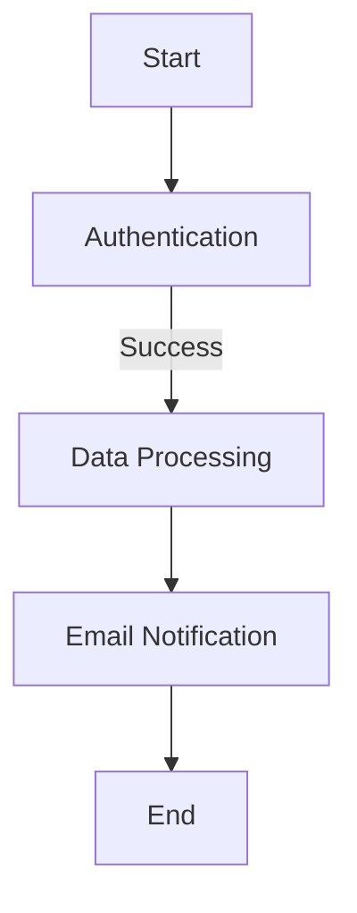
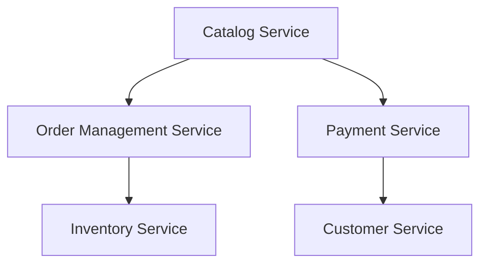
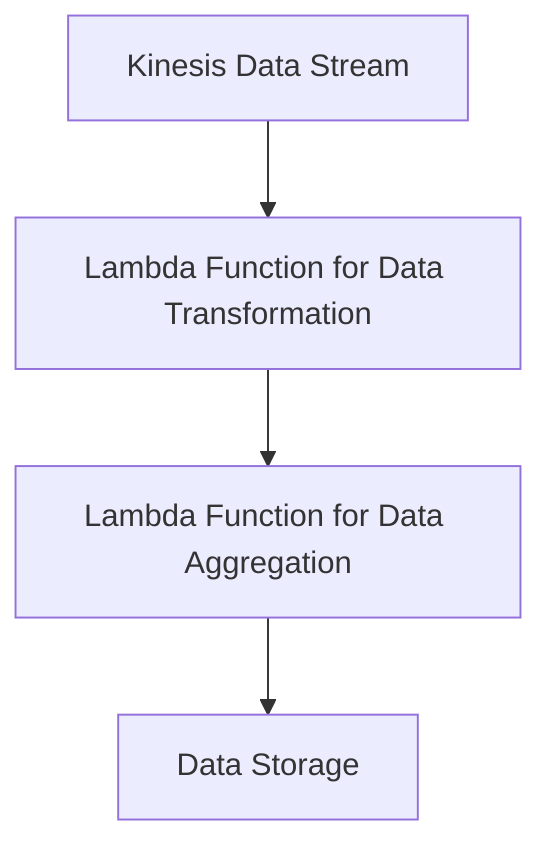
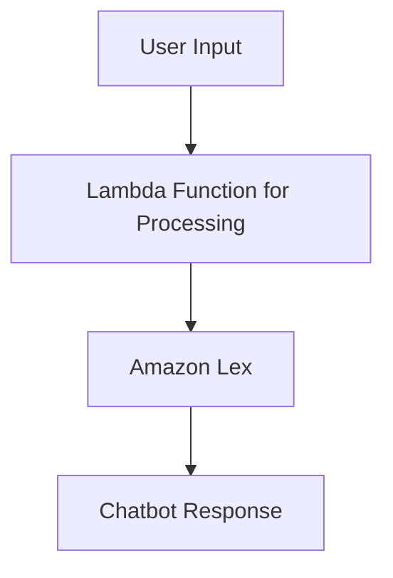

                 

### Introduction to Serverless Architecture

Serverless architecture has emerged as a transformative approach in the world of software development, revolutionizing the way applications are built and deployed. At its core, serverless architecture abstracts away the complexities of server management, allowing developers to focus solely on writing application logic. This paradigm shift has opened up new possibilities for scalability, flexibility, and cost-efficiency. In this section, we will delve into the fundamentals of serverless architecture, exploring its key concepts, ecosystem, and practical applications.

#### 1.1.1 Origins of Serverless Architecture

Serverless architecture traces its origins back to the early 2010s, with the introduction of cloud computing platforms like AWS Lambda and Azure Functions. These platforms allowed developers to run code in response to events without the need to provision or manage servers. The term "serverless" was coined to describe this new model, emphasizing the removal of server management as a concern for developers.

#### 1.1.2 Characteristics of Serverless Architecture

The defining characteristics of serverless architecture include:

- **Event-Driven**: Applications are built around events, which trigger functions to execute.
- **No Server Management**: Developers do not need to worry about server provisioning, scaling, or maintenance.
- **Scalability**: Functions automatically scale based on the number of events, handling traffic spikes efficiently.
- **Pay-per-Use**: Developers are billed based on the actual usage of their functions, providing a cost-effective model.

#### 1.1.3 Advantages and Challenges of Serverless Architecture

Serverless architecture offers several advantages, such as:

- **Cost Efficiency**: By eliminating the need for server management, organizations can reduce infrastructure costs.
- **Scalability**: Serverless functions can scale automatically, making them ideal for handling varying workloads.
- **Faster Development**: Developers can focus on writing code without the overhead of infrastructure management.

However, there are challenges, including:

- **Vendor Lock-in**: Serverless platforms are often proprietary, leading to potential lock-in.
- **Cold Start**: Functions may experience a delay (cold start) when they are invoked after being dormant for an extended period.
- **Complexity**: Managing multiple functions and integrating with other services can be complex.

#### 1.2 Serverless Ecosystem

The serverless ecosystem is vibrant and growing, comprising various platforms, tools, and services. Key players include:

- **AWS Lambda**: A serverless computing service that runs code in response to events.
- **Azure Functions**: A serverless compute service that enables developers to create and run applications without thinking about servers.
- **Google Cloud Functions**: A serverless execution environment for building and connecting cloud services.

Developers also rely on a range of tools for development, testing, and deployment, such as:

- **Serverless Framework**: A popular open-source tool for defining and deploying serverless architectures.
- ** Claudia.js**: A CLI tool for deploying and managing serverless applications on AWS Lambda.
- **Serverless CLI**: An open-source command-line interface for deploying serverless functions.

#### 1.3 Applications of Serverless Architecture

Serverless architecture is versatile and can be applied in various scenarios:

- **Web Applications**: Serverless can power the backend of web applications, enabling seamless scaling and cost savings.
- **Backend Services**: Microservices and API gateways can be implemented using serverless functions, providing a scalable and flexible backend.
- **Real-time Data Processing**: Serverless architectures are well-suited for processing real-time data streams, offering low-latency and high-throughput capabilities.
- **AI and Machine Learning**: Serverless platforms can host machine learning models and perform real-time inference, making AI accessible to a broader audience.

In conclusion, serverless architecture represents a significant shift in the way applications are developed and deployed. By abstracting away server management and providing scalability and cost-efficiency, serverless offers numerous benefits. However, developers must navigate the challenges and consider the specific requirements of their applications when adopting serverless architecture.

### Core Concepts and Architectural Patterns

Serverless architecture is built upon several core concepts and architectural patterns that enable developers to build scalable, reliable, and efficient applications. In this section, we will explore two key patterns: service orchestration and event-driven architecture, as well as the trade-offs between stateless and stateful services.

#### 2.1 Service Orchestration and Automation

Service orchestration involves defining the flow of tasks and services within an application, ensuring that they are executed in the right sequence and under the appropriate conditions. Automation plays a crucial role in orchestrating services, allowing developers to manage complex workflows with minimal effort.

##### 2.1.1 Basic Concepts of Service Orchestration

Service orchestration is the process of defining and managing the interactions between services and components within an application. It ensures that each service is invoked at the right time, with the right data, and in the right sequence.

**Example:**

Consider a web application that requires user authentication, data processing, and email notification. The service orchestration flow might look like this:

1. **Authentication**: The user logs in, triggering the authentication service.
2. **Data Processing**: If the authentication is successful, the user's data is processed.
3. **Email Notification**: The email notification service is triggered to send a welcome email.

##### 2.1.2 Automation Tools and Technologies

Automation tools streamline the process of service orchestration, allowing developers to define workflows and manage them programmatically. Some popular automation tools and technologies include:

- **AWS Step Functions**: A serverless orchestration service that enables developers to create and manage workflows composed of AWS Lambda functions, API Gateway, and other AWS services.
- **Azure Logic Apps**: A cloud service that allows developers to create automated workflows that trigger actions across various data sources and services.
- **Apache Airflow**: An open-source platform for creating, scheduling, and monitoring data pipelines.

**Example:**

Using Apache Airflow, we can define an orchestration workflow as follows:



##### 2.1.3 Practical Case: Automated Workflow Design

Let's consider a practical case where we design an automated workflow for a social media platform that processes user-generated content. The workflow includes content validation, categorization, and storage.

1. **Content Validation**: When a user uploads content (e.g., a post), the content is validated for compliance with platform policies.
2. **Categorization**: Valid content is categorized based on tags and metadata.
3. **Storage**: Categorized content is stored in a database for retrieval and display.

Using AWS Step Functions, the workflow can be defined as follows:

```python
import boto3

def validate_content(content):
    # Validate content based on platform policies
    return "valid" if content_meets_policies else "invalid"

def categorize_content(content):
    # Categorize content based on tags and metadata
    return content_category

def store_content(content):
    # Store content in the database
    database.insert(content)

step_function = boto3.client('stepfunctions')

step_function.start_execution(
    stateMachineArn='arn:aws:states:us-east-1:123456789012:stateMachine:ContentProcessingWorkflow',
    input={
        'content': content
    }
)
```

#### 2.2 Event-Driven Architecture

Event-driven architecture (EDA) is an architectural pattern where the flow of the application is driven by events. Events can be anything from user interactions, system notifications, or data updates. The key idea is to react to events as they occur, rather than predefining the entire flow of the application.

##### 2.2.1 Basic Principles of Event-Driven Architecture

The core principles of event-driven architecture include:

- **Decoupled Components**: Components are loosely coupled, communicating through events rather than direct interactions.
- **Event Queue**: Events are stored in a queue, ensuring that they are processed in the order they are received.
- **Event-Driven Processing**: Components process events as they arrive, executing specific tasks based on the event type.

**Example:**

Consider a messaging application where messages are sent between users. The event-driven architecture might look like this:

1. **Message Received**: A user sends a message, triggering an event.
2. **Message Processing**: The message is processed by a service that validates and routes the message.
3. **Message Delivery**: The message is delivered to the recipient's device.

Using AWS Lambda and Amazon EventBridge, the event-driven architecture can be implemented as follows:

```python
import boto3

def process_message(message):
    # Process the message and validate it
    if message_is_valid:
        # Deliver the message to the recipient
        send_message_to_recipient(message)
    else:
        # Reject the message
        reject_message(message)

eventbridge = boto3.client('events')

# Define the event rule
eventbridge.put_rule(
    Name='MessageProcessing',
    Description='Process incoming messages',
    EventPattern={
        'source': ['user.*'],
        'detail-type': ['Message Sent']
    }
)

# Trigger the Lambda function
eventbridge.put_trigger(
    Name='MessageProcessingTrigger',
    Description='Trigger Lambda function to process messages',
    Source='aws.events',
    RoleArn='arn:aws:iam::123456789012:role/MessageProcessingRole',
    Targets=[
        {
            'Id': 'MessageProcessingLambda',
            'Arn': 'arn:aws:lambda:us-east-1:123456789012:function:ProcessMessage'
        }
    ]
)
```

##### 2.2.2 Implementing Event-Driven Architectures

Implementing event-driven architectures involves several key steps:

1. **Define Events**: Identify the events that drive your application's flow.
2. **Design Event Queue**: Choose an appropriate event queueing system, such as AWS Kinesis or Amazon SQS.
3. **Implement Event Processing**: Develop services that process events and execute the required tasks.
4. **Integrate with External Systems**: Connect your event-driven architecture with external systems and services through APIs or message queues.

#### 2.3 Stateless vs. Stateful Services

In serverless architectures, services can be either stateless or stateful. The choice between these two depends on the specific requirements of your application.

##### 2.3.1 Stateless Services

Stateless services do not maintain any state between invocations. Each request is independent and self-contained. This makes stateless services highly scalable and easy to manage.

**Advantages:**

- **High Scalability**: Stateless services can be easily scaled horizontally without worrying about maintaining state.
- **Simplified Design**: Stateless services are simpler to design and implement.

**Disadvantages:**

- **Limited Functionality**: Stateless services may have limitations when it comes to handling long-running tasks or maintaining session state.
- **Complex Data Management**: State management needs to be handled through external systems like databases or caches.

##### 2.3.2 Stateful Services

Stateful services maintain state between invocations, allowing them to handle long-running tasks and maintain user sessions.

**Advantages:**

- **Long-Running Tasks**: Stateful services are suitable for handling tasks that require maintaining state over an extended period.
- **Session Management**: Stateful services can maintain user sessions and context.

**Disadvantages:**

- **Reduced Scalability**: Stateful services can be more challenging to scale due to the need to maintain state.
- **Increased Complexity**: Designing and implementing stateful services can be more complex.

##### 2.3.3 Integrating Stateless and Stateful Services

In many cases, a combination of stateless and stateful services is used to achieve the desired functionality. For example, a web application might use stateless services for processing requests and stateful services for managing user sessions.

**Example:**

Consider a web application that handles user authentication. The architecture might include:

- **Stateless Service**: Validates user credentials and generates authentication tokens.
- **Stateful Service**: Manages user sessions and handles user interactions.

Using AWS Lambda and Amazon API Gateway for the stateless service and AWS AppSync for the stateful service, the architecture can be implemented as follows:

```python
import boto3

def authenticate_user(username, password):
    # Validate user credentials
    if credentials_are_valid:
        # Generate authentication token
        return generate_auth_token(username)
    else:
        # Return an error
        return "Invalid credentials"

def manage_session(auth_token):
    # Manage user session
    if auth_token_is_valid:
        # Return user session details
        return user_session
    else:
        # Return an error
        return "Invalid auth token"

apigateway = boto3.client('apigateway')

# Create a Lambda function for authentication
apigateway.create_lambda_function(
    name='AuthenticateUser',
    runtime='python3.8',
    role_arn='arn:aws:iam::123456789012:role/Auth Lambda Role',
    handler='app.authenticate_user'
)

# Create an API Gateway endpoint that triggers the Lambda function
apigateway.create_endpoint(
    rest_api_id='arn:aws:apigateway:us-east-1:123456789012:restapis/abcd1234',
    stage_variables={
        'AUTH_LAMBDA_FUNCTION': 'arn:aws:lambda:us-east-1:123456789012:function:AuthenticateUser'
    }
)

appsync = boto3.client('appsync')

# Create a GraphQL API for managing user sessions
appsync.create_api(
    name='SessionManagement',
    schema='
        type Query {
            getSession(authToken: ID!): Session
        }
    ',
    authentication_type='API_KEY',
    apiKeySettings={
        'disableApiKeyValidation': False
    }
)

# Create a Lambda function for managing user sessions
appsync.create_resolver(
    apiId='arn:aws:appsync:us-east-1:123456789012:api/abcd1234',
    type='QUERY',
    fieldName='getSession',
    kind='LAMBDA',
    lambdaConfiguration={
        'name': 'ManageSession',
        'arn': 'arn:aws:lambda:us-east-1:123456789012:function:ManageSession',
        'description': 'Manage user session'
    }
)
```

In conclusion, understanding the core concepts and architectural patterns of serverless architecture is crucial for building scalable and efficient applications. Service orchestration and event-driven architecture enable developers to create complex workflows and responsive systems. Additionally, carefully considering the trade-offs between stateless and stateful services helps in designing robust and flexible applications.

### Design Patterns and Best Practices

Serverless applications, while offering numerous advantages, come with their own set of challenges and considerations. Effective design patterns and best practices are essential to overcome these challenges and ensure that serverless architectures are robust, secure, and maintainable. In this section, we will explore common design patterns, performance optimization strategies, and security best practices for serverless applications.

#### 3.1 Common Design Patterns

Design patterns are proven solutions to common problems in software design. In the context of serverless architectures, several design patterns have emerged as particularly useful.

##### 3.1.1 State Pattern

The state pattern allows an object to alter its behavior when its internal state changes. This is particularly useful in serverless applications where state management can be complex due to the ephemeral nature of function executions.

**Example:**

Consider a serverless application that processes orders. The state pattern can be used to manage the different stages of an order (e.g., pending, processing, completed):

```python
class OrderState:
    def process(self):
        raise NotImplementedError

class PendingState(OrderState):
    def process(self):
        print("Order is being processed")

class ProcessingState(OrderState):
    def process(self):
        print("Order is processing")

class CompletedState(OrderState):
    def process(self):
        print("Order is completed")

class Order:
    def __init__(self):
        self.state = PendingState()

    def set_state(self, state):
        self.state = state

    def process_order(self):
        self.state.process()

# Usage
order = Order()
order.process_order()  # Output: Order is being processed
order.set_state(ProcessingState())
order.process_order()  # Output: Order is processing
order.set_state(CompletedState())
order.process_order()  # Output: Order is completed
```

##### 3.1.2 Singleton Pattern

The singleton pattern ensures that a class has only one instance and provides a global point of access to it. This can be particularly useful in serverless applications where maintaining state or shared resources across function executions can be challenging.

**Example:**

```python
class Database:
    _instance = None

    def __new__(cls):
        if cls._instance is None:
            cls._instance = super(Database, cls).__new__(cls)
        return cls._instance

    def connect(self):
        # Connect to the database
        pass

# Usage
db = Database()
another_db = Database()
print(db is another_db)  # Output: True
```

##### 3.1.3 Observer Pattern

The observer pattern defines a one-to-many dependency between objects so that when one object changes state, all its dependents are notified and updated automatically. This is useful in serverless architectures for implementing real-time updates and event-driven workflows.

**Example:**

```python
class Observer:
    def update(self, subject):
        pass

class Subject:
    def __init__(self):
        self.observers = []

    def attach(self, observer):
        self.observers.append(observer)

    def detach(self, observer):
        self.observers.remove(observer)

    def notify(self):
        for observer in self.observers:
            observer.update(self)

class ConcreteObserver(Observer):
    def update(self, subject):
        print(f"Observer notified by {subject}")

# Usage
subject = Subject()
observer = ConcreteObserver()
subject.attach(observer)
subject.notify()  # Output: Observer notified by <__main__.Subject object at 0x7f8d2a07e5f0>
```

#### 3.2 Performance Optimization

Performance optimization is a critical aspect of serverless applications, as they are often subjected to varying workloads and need to scale dynamically. Here are some best practices for optimizing the performance of serverless applications:

##### 3.2.1 Core Performance Metrics

When optimizing serverless applications, it's important to focus on the following core performance metrics:

- **Latency**: The time it takes to process a request and return a response.
- **Throughput**: The number of requests that can be processed per unit of time.
- **Resource Utilization**: The efficiency of using computational resources, including CPU, memory, and network.
- **Error Rates**: The percentage of requests that result in errors.

##### 3.2.2 Optimization Strategies

Here are some strategies for optimizing serverless application performance:

1. **Function Warm-up**: Warm-up functions to avoid cold starts, which can significantly impact latency.
2. **Optimize Function Configuration**: Configure functions to use the appropriate memory and timeout settings based on the workload.
3. **Throttling**: Use throttling mechanisms to control the rate of incoming requests and prevent resource exhaustion.
4. **Caching**: Implement caching strategies to store and reuse frequently accessed data, reducing the need for expensive computations or API calls.
5. **Load Balancing**: Use load balancers to distribute traffic evenly across multiple functions or instances.

##### 3.2.3 Practical Case: Performance Optimization

Let's consider a practical case of optimizing a serverless API that serves static content. To improve performance, we can implement the following strategies:

1. **Enable Content Delivery Network (CDN)**: Use a CDN to cache and deliver static content to users, reducing latency.
2. **Optimize Function Configuration**: Set the function to use the minimum required memory to avoid over-provisioning.
3. **Implement Caching**: Cache frequently accessed static files in a distributed cache like Redis or Memcached.

```python
import boto3
import os

s3_client = boto3.client('s3')
redis = Redis(host='redis-server', port=6379)

def get_static_content(event, context):
    key = event['path']
    cached_content = redis.get(key)
    if cached_content:
        return cached_content

    s3_response = s3_client.get_object(Bucket=os.environ['BUCKET_NAME'], Key=key)
    content = s3_response['Body'].read()

    redis.set(key, content)
    return content

# Usage
event = {'path': 'static/css/style.css'}
response = get_static_content(event)
print(response)
```

#### 3.3 Security and Compliance

Security is a primary concern when deploying serverless applications, as they often interact with sensitive data and external services. Here are some best practices for ensuring the security and compliance of serverless applications:

##### 3.3.1 Security Risks Analysis

Common security risks in serverless architectures include:

- **Insecure APIs**: Unprotected API endpoints that can be exploited by attackers.
- **Data Leakage**: Unauthorized access to sensitive data stored in databases or logs.
- **Configuration Vulnerabilities**: Misconfigured functions or services that expose security vulnerabilities.
- **Unauthorized Access**: Unrestricted access to serverless services that can lead to data breaches.

##### 3.3.2 Security Best Practices

To mitigate these risks, follow these security best practices:

1. **Use Secure Connections**: Always use HTTPS for communication between client and server.
2. **Implement Access Controls**: Use IAM roles and policies to control access to serverless services.
3. **Secure API Endpoints**: Use API Gateway features like API keys, signing, and throttling to secure your APIs.
4. **Encrypt Data**: Use AWS KMS to encrypt sensitive data at rest and in transit.
5. **Monitor and Log Activities**: Use AWS CloudTrail and AWS X-Ray to monitor and log serverless activities for auditing and troubleshooting.

##### 3.3.3 Compliance Considerations

Serverless applications must comply with various regulations and standards, such as GDPR, HIPAA, and PCI DSS. Key compliance considerations include:

1. **Data Privacy**: Ensure that data handling practices comply with privacy regulations.
2. **Data Protection**: Implement measures to protect sensitive data from unauthorized access and breaches.
3. **Auditability**: Maintain detailed logs and audit trails to demonstrate compliance with regulatory requirements.
4. **Continuous Monitoring**: Regularly review and update security and compliance practices to address new threats and changes in regulations.

In conclusion, serverless applications benefit from well-defined design patterns and best practices that enhance their performance, security, and maintainability. By adopting these patterns and practices, developers can build robust and scalable serverless architectures that meet the needs of modern applications.

### Case Studies and Real-World Applications

Serverless architecture has gained significant traction in the industry due to its scalability, flexibility, and cost-efficiency. In this section, we will explore real-world case studies and examples of serverless applications across various domains, highlighting the successes and challenges encountered by organizations.

#### 4.1 Enterprise-Level Application Cases

Enterprise-level organizations have been quick to adopt serverless architecture to modernize their applications and improve their operational efficiency. Here are some notable examples:

##### 4.1.1 E-Commerce Platform Transformation

A leading e-commerce platform transformed its backend infrastructure from a traditional monolithic architecture to a serverless architecture. This migration involved moving from on-premises servers to AWS Lambda, Amazon API Gateway, and Amazon S3.

**Successes:**

- **Scalability**: The platform could handle large traffic spikes during sales events without manual intervention.
- **Cost Savings**: The company saw a significant reduction in operational costs due to the pay-per-use model and reduced server management overhead.
- **Faster Time-to-Market**: Developers could focus on writing application logic instead of managing servers, accelerating feature development and deployment.

**Challenges:**

- **Vendor Lock-in**: Migrating to a proprietary serverless platform required a significant upfront investment in training and tooling.
- **Cold Start Issues**: Initially, the platform experienced latency during high traffic due to cold starts, which was mitigated through warming strategies.

##### 4.1.2 Banking Industry Innovations

Several banks have adopted serverless architectures to enhance their services and improve customer experiences. For example, a large banking institution used AWS Lambda and Amazon API Gateway to build a real-time fraud detection system.

**Successes:**

- **Speed and Accuracy**: The system could process and analyze transaction data in real-time, reducing fraud detection latency.
- **Scalability**: The fraud detection system automatically scaled to handle varying transaction volumes.
- **Enhanced Security**: By using serverless, the bank could implement security measures more effectively, such as encryption and IAM controls.

**Challenges:**

- **Regulatory Compliance**: Ensuring compliance with regulations like PCI DSS and GDPR required careful consideration and additional security measures.
- **Performance Testing**: Testing the system under different load conditions was challenging due to the ephemeral nature of serverless functions.

##### 4.1.3 Manufacturing Line Monitoring

A global manufacturing company used serverless architecture to monitor and manage production lines. This involved deploying AWS Lambda and IoT Core to collect real-time data from sensors and process it using serverless functions.

**Successes:**

- **Real-Time Insights**: The company gained real-time visibility into production line performance, enabling proactive maintenance and reducing downtime.
- **Cost Efficiency**: Serverless architecture reduced the cost of infrastructure, as the company only paid for the compute resources used.
- **Scalability**: The system could easily scale to accommodate additional sensors and production lines without significant infrastructure changes.

**Challenges:**

- **Data Privacy**: Ensuring the privacy and security of the data collected from sensors was a concern, requiring robust encryption and access controls.
- **Integration Complexity**: Integrating the serverless system with existing manufacturing systems posed challenges, requiring careful planning and execution.

#### 4.2 Developer Experience and Lessons Learned

Developers who have adopted serverless architecture share their experiences and insights, highlighting both the benefits and challenges they have encountered.

##### 4.2.1 Building a Serverless Application from Scratch

A team of developers at a startup built a serverless application to provide real-time weather updates. They used AWS Lambda for function execution, Amazon API Gateway for API management, and Amazon DynamoDB for data storage.

**Steps:**

1. **Define Requirements**: Clearly define the application requirements, including the features, data sources, and expected performance.
2. **Design the Architecture**: Create a high-level architecture that includes data flow, function interactions, and integration points.
3. **Develop Functions**: Write and deploy Lambda functions to handle different parts of the application, such as data processing, API handling, and notifications.
4. **Test and Iterate**: Thoroughly test the application to identify and fix any bugs or performance issues.

**Key Learnings:**

- **Focus on the Core Logic**: When building serverless applications, it's crucial to focus on the core logic and minimize the complexity of the infrastructure.
- **Leverage Managed Services**: Take advantage of managed services provided by cloud providers to reduce the burden of infrastructure management.
- **Monitor and Optimize**: Continuously monitor the application's performance and optimize it based on real usage patterns.

##### 4.2.2 Deployment and Operations

A mid-sized company deployed a serverless application to manage customer support requests. They used AWS Lambda, API Gateway, and Amazon S3 for storing attachments.

**Steps:**

1. **Containerize Functions**: Containerize Lambda functions using Docker to ensure consistency across environments.
2. **Automate Deployment**: Use CI/CD pipelines to automate the deployment process, ensuring that changes are quickly and reliably deployed to production.
3. **Monitor and Manage**: Use monitoring tools like AWS X-Ray to track the performance of the application and identify issues.
4. **Implement Logging**: Implement structured logging to capture relevant information for debugging and troubleshooting.

**Key Learnings:**

- **Automate Everything**: Automating deployment, testing, and monitoring reduces the risk of human error and speeds up the development process.
- **Monitoring and Logging Are Critical**: Monitoring and logging are essential for understanding the application's behavior and quickly addressing issues.
- **Keep It Simple**: Overly complex architectures can be difficult to manage and maintain, so it's important to keep the design simple and focused.

##### 4.2.3 Scaling and Upgrades

A large enterprise scaled its serverless application to handle millions of requests per day. They used AWS Lambda, API Gateway, and Amazon RDS for database management.

**Steps:**

1. **Assess Current Performance**: Analyze the current performance metrics to identify bottlenecks and areas for improvement.
2. **Design for Scalability**: Modify the architecture to support horizontal scaling, including load balancing and distributed processing.
3. **Perform Stress Testing**: Conduct stress testing to ensure that the application can handle the expected load.
4. **Upgrade and Iterate**: Continuously upgrade and optimize the application based on feedback and changing requirements.

**Key Learnings:**

- **Design for Scalability from the Start**: Scalability should be a key consideration from the initial design phase to avoid costly rearchitecture later on.
- **Monitor and Adjust**: Regularly monitor performance and adjust the infrastructure to ensure optimal performance.
- **Invest in Tooling**: Invest in monitoring and testing tools to gain insights into the application's behavior and identify potential issues early.

In conclusion, serverless architecture has proven to be a powerful tool for building scalable, flexible, and cost-effective applications. By learning from real-world case studies and developer experiences, organizations and developers can navigate the challenges and maximize the benefits of serverless architectures.

### Advanced Topics and Future Trends

As serverless architecture continues to evolve, it's essential to stay informed about advanced topics and emerging trends that can shape its future. This section explores the convergence of serverless and microservices, serverless data processing, and future innovations in the serverless ecosystem.

#### 5.1 Fusion of Serverless and Microservices

The integration of serverless architecture with microservices is a burgeoning trend, combining the scalability and ease of deployment of serverless with the modularity and flexibility of microservices. This fusion allows developers to leverage the strengths of both paradigms, creating robust and agile applications.

**Benefits:**

- **Scalable Microservices**: Serverless functions can be used to implement microservices, enabling them to scale independently based on demand.
- **Dynamic Scaling**: Microservices deployed as serverless functions benefit from automatic scaling, reducing the need for manual intervention.
- **Elasticity**: Serverless microservices can handle varying loads dynamically, providing high availability and resilience.

**Challenges:**

- **Complexity**: Managing a distributed system of serverless microservices can be complex, requiring tools and strategies for service discovery, communication, and monitoring.
- **Data Consistency**: Ensuring data consistency across microservices hosted on serverless platforms can be challenging, especially in scenarios involving distributed transactions.

**Example:**

Consider an e-commerce platform that uses a microservices architecture with serverless functions. The catalog service, payment service, and order management service can all be implemented as serverless functions, scaling independently based on traffic.



#### 5.2 Serverless Data Processing

Serverless architectures are not only suitable for processing web requests but also for handling real-time data processing tasks. Technologies like AWS Kinesis and Apache Flink are being integrated with serverless platforms to enable scalable and efficient data processing.

**Benefits:**

- **Real-Time Processing**: Serverless data processing allows for low-latency data ingestion, processing, and analysis.
- **Scalability**: Data processing workflows can scale automatically based on the volume of incoming data.
- **Cost-Effectiveness**: Pay-per-use models for serverless data processing services can be more cost-effective than traditional data processing solutions.

**Challenges:**

- **Data Integration**: Integrating serverless data processing with existing data storage and analytics systems can be complex.
- **Data Privacy**: Ensuring data privacy and security in serverless data processing workflows is crucial, especially when handling sensitive information.

**Example:**

A real-time analytics platform uses AWS Lambda and Amazon Kinesis to process and analyze streaming data. Lambda functions are triggered by Kinesis data streams, performing real-time data transformations and aggregations.



#### 5.3 Future Trends in Serverless Ecosystem

The serverless ecosystem is continuously evolving, with new tools, platforms, and features being introduced. Here are some future trends to watch:

- **Multi-Cloud Serverless**: As organizations become more cloud-agnostic, the demand for multi-cloud serverless solutions is increasing. Platforms like Serverless Framework and AWS Lambda are expanding their support for multiple cloud providers.
- **Serverless Data Management**: Advances in serverless data management, such as serverless databases and data warehouses, are simplifying data handling in serverless architectures.
- **Serverless AI and Machine Learning**: The integration of AI and machine learning models with serverless platforms enables scalable AI-driven applications. Services like AWS SageMaker and Google AI Platform for Serverless are making it easier to deploy machine learning models at scale.
- **Function as Code**: The adoption of "Function as Code" practices, where serverless functions are defined and managed as code repositories, is streamlining the development and deployment process.

**Example:**

A serverless-based chatbot platform uses AWS Lambda for processing user interactions and Amazon Lex for natural language understanding. The chatbot's code is versioned and managed using Git, allowing for easy updates and deployments.



In conclusion, serverless architecture is continuously evolving, driven by advances in technology and the growing need for scalable and flexible applications. By staying informed about advanced topics and future trends, developers and organizations can leverage the full potential of serverless to build innovative and efficient applications.

