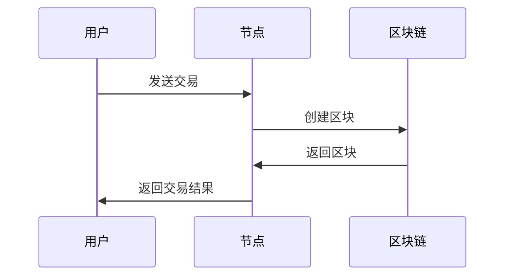
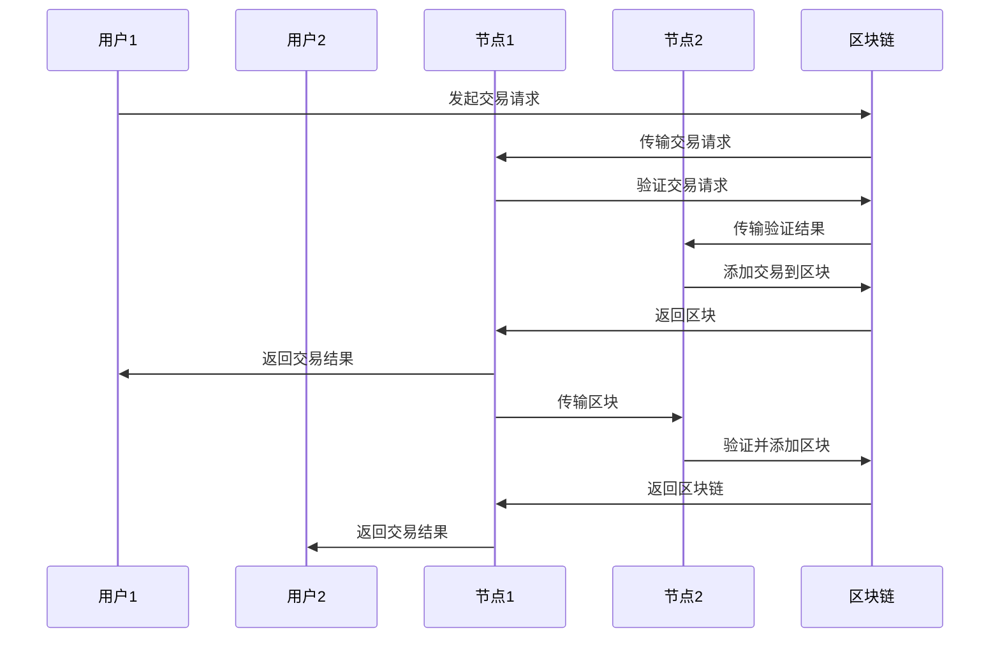
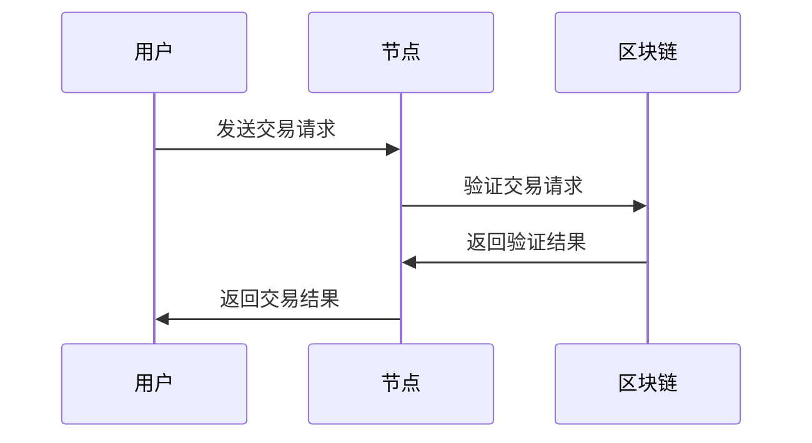

                 

# 《Web3.0：去中心化的下一代互联网》

## 关键词
Web3.0、去中心化、区块链、加密技术、DApps、DeFi、NFT

## 摘要
Web3.0，即去中心化的下一代互联网，是网络发展的重要趋势。它基于区块链、加密技术和分布式网络等核心技术，为用户提供了更加安全、透明和自主的数据管理方式。本文将从Web1.0、Web2.0的演进，到Web3.0的核心概念、技术基础，再到具体的应用如DApps、DeFi和NFT，深入探讨Web3.0的原理、优势、挑战及其未来发展趋势。

## 引言

### 1.1 Web1.0、Web2.0与Web3.0的演进

互联网的发展经历了多个阶段，从最初的Web1.0，到Web2.0，再到如今的Web3.0。Web1.0是互联网的初始阶段，用户主要是浏览信息和被动接收内容。Web2.0则带来了互动和参与，用户可以上传内容、评论和分享，社交媒体、博客等应用应运而生。而Web3.0则是一次更深层次的变革，它不仅仅是技术和工具的升级，更是互联网治理模式、商业模式和用户关系的革命。

### 1.2 Web3.0的核心概念与技术

Web3.0的核心概念是去中心化，它通过区块链、加密技术和分布式网络等技术，实现数据、信息和价值的去中心化管理。区块链技术提供了去中心化的数据库和信任机制，加密技术保证了数据的安全性和隐私性，分布式网络则确保了系统的去中心化和容错性。

### 1.3 Web3.0的未来展望与影响

Web3.0对未来互联网的发展有着深远的影响。它将改变传统的互联网商业模式，创造新的经济模式和社会结构。同时，Web3.0也将带来更多的隐私保护和数据安全，使互联网更加公平、透明和可持续。然而，Web3.0的发展也面临诸多挑战，如技术成熟度、法规政策、用户接受度等。

## 去中心化网络基础

### 2.1 去中心化网络原理

去中心化网络（Decentralized Network）是一种无中心化控制的结构，网络中的节点平等地参与网络的运作，没有单一的中央控制实体。每个节点既是信息的提供者，也是信息的消费者，网络中的数据和信息通过分布式的方式存储和传递。

### 2.2 去中心化网络的关键技术

去中心化网络的关键技术包括区块链、加密技术和分布式网络。

#### 2.2.1 区块链技术

区块链技术是去中心化网络的核心，它通过分布式账本技术实现数据的去中心化存储和管理。每个区块包含一定数量的交易记录，区块与区块之间通过加密算法链接，形成一个不可篡改的链式结构。

#### 2.2.2 加密技术

加密技术用于保护数据的安全性和隐私性。通过加密算法，数据在传输过程中被加密，只有拥有正确密钥的节点才能解密和读取数据。

#### 2.2.3 分布式网络

分布式网络通过将网络节点分散到不同的地理位置，实现网络的去中心化和容错性。分布式网络中的节点通过P2P（点对点）通信协议进行数据传输和交换。

### 2.3 去中心化网络的优点与挑战

去中心化网络具有许多优点，如更高的安全性、隐私保护和抗审查性。然而，去中心化网络也面临一些挑战，如性能瓶颈、监管难度和技术成熟度等。

## 区块链技术详解

### 3.1 区块链的基本结构

区块链由一系列按时间顺序排列的区块组成，每个区块包含一定数量的交易记录。区块通过加密算法与前一个区块链接，形成一个链式结构。区块链的主要组成部分包括：

- **区块**：包含交易记录和其他元数据的数据结构。
- **交易**：网络中的数据交换操作。
- **链**：由一系列区块按时间顺序链接形成的结构。

### 3.2 区块链的工作原理

区块链的工作原理可以分为以下步骤：

1. **交易生成**：用户在区块链上生成交易。
2. **交易验证**：交易被网络中的节点验证，确保其合法性和有效性。
3. **区块创建**：验证后的交易被加入到新区块中。
4. **区块链接**：新区块通过加密算法与上一个区块链接，形成新的链。
5. **区块传播**：新的区块在网络中传播，所有节点更新本地链。

### 3.3 主流区块链平台分析

主流的区块链平台包括以太坊、比特币和EOS等。每个平台都有其独特的特点和优势。

- **以太坊**：以太坊是一个去中心化的智能合约平台，支持多种编程语言和复杂的智能合约。
- **比特币**：比特币是一种去中心化的数字货币，具有抗通胀、去中心化等特点。
- **EOS**：EOS是一种高性能的区块链平台，支持大规模的分布式应用。

## 去中心化应用（DApps）开发

### 4.1 DApps的基本概念

去中心化应用（DApps）是运行在区块链上的应用，其数据存储和操作都在链上进行，不依赖于中心化服务器。DApps的核心特点包括：

- **去中心化**：DApps的数据和操作不依赖于中心化服务器，确保数据的安全性和抗审查性。
- **透明性**：DApps的代码和交易记录是公开透明的，用户可以查看和验证。
- **自主性**：DApps的运行和管理由社区和用户共同参与，确保公平和民主。

### 4.2 DApp开发流程

DApp的开发流程可以分为以下步骤：

1. **需求分析**：明确DApp的功能和需求。
2. **选择平台**：根据需求和特点选择合适的区块链平台。
3. **设计智能合约**：设计DApp的核心功能，实现为智能合约。
4. **前端开发**：实现用户界面，与智能合约交互。
5. **测试与部署**：测试DApp的功能和性能，部署到区块链上。

### 4.3 DApp案例分析

以去中心化金融（DeFi）为例，DeFi应用如Aave和Compound等，通过智能合约实现去中心化的借贷、交易和资产管理。这些应用具有更高的透明性、安全性和自主性，为用户提供了一种全新的金融服务体验。

## 去中心化金融（DeFi）

### 5.1 DeFi概述

去中心化金融（DeFi）是基于区块链技术的金融系统，其核心思想是通过智能合约实现金融服务的去中心化。DeFi的主要特点包括：

- **去中心化**：DeFi不依赖于中心化的金融机构，所有交易和操作都在链上进行。
- **透明性**：DeFi的代码和交易记录是公开透明的，用户可以查看和验证。
- **自主性**：DeFi的运行和管理由社区和用户共同参与，确保公平和民主。

### 5.2 DeFi关键协议

DeFi的关键协议包括：

- **治理协议**：如Uniswap，通过智能合约实现去中心化的交易和流动性提供。
- **借贷协议**：如Aave，通过智能合约实现去中心化的借贷和资产管理。
- **稳定币协议**：如Dai，通过智能合约实现去中心化的稳定币。

### 5.3 DeFi案例分析

以DeFi借贷平台Aave为例，Aave通过智能合约实现去中心化的借贷，用户可以在不依赖于中心化金融机构的情况下，借出和借入加密货币。Aave具有更高的透明性、安全性和自主性，为用户提供了一种全新的借贷体验。

## 非同质化代币（NFT）

### 6.1 NFT的概念与特点

非同质化代币（Non-Fungible Token，NFT）是一种独特的数字资产，代表某个特定的物品或权利。NFT具有以下特点：

- **独一无二**：每个NFT都是独一无二的，不可替代。
- **数字资产**：NFT可以代表数字艺术品、虚拟房地产、收藏品等。
- **所有权证明**：NFT提供了一种数字所有权证明，确保物品的所有权无法被篡改。

### 6.2 NFT的应用领域

NFT在多个领域得到广泛应用，包括：

- **数字艺术品**：艺术家可以通过NFT发行和销售数字艺术品。
- **虚拟房地产**：虚拟世界中的房地产可以通过NFT进行交易和所有权的证明。
- **收藏品**：NFT可以为收藏品提供数字所有权证明，确保其真实性和稀有性。

### 6.3 NFT案例分析

以数字艺术品平台OpenSea为例，OpenSea是一个基于以太坊的NFT市场，用户可以在平台上购买、出售和收藏数字艺术品。OpenSea为数字艺术品提供了一个去中心化的交易平台，确保了艺术品的所有权无法被篡改。

## Web3.0生态系统

### 7.1 Web3.0生态系统的组成

Web3.0生态系统由多个组成部分构成，包括：

- **区块链平台**：提供去中心化计算和存储服务的底层基础设施。
- **DApps**：运行在区块链上的去中心化应用。
- **用户**：参与Web3.0生态系统的用户，通过交易和操作支持系统的运行。
- **开发者**：开发和维护DApps和区块链平台的开发者。

### 7.2 Web3.0生态系统中的角色

Web3.0生态系统中的角色包括：

- **区块链平台开发者**：开发和维护区块链平台，提供基础设施支持。
- **DApp开发者**：开发和维护DApps，提供各种去中心化服务。
- **用户**：参与Web3.0生态系统，使用DApps和区块链服务。
- **投资者**：投资于Web3.0项目和平台，推动生态系统的发展。

### 7.3 Web3.0生态系统的未来发展趋势

Web3.0生态系统的未来发展趋势包括：

- **技术的不断进步**：区块链、加密技术和分布式网络等技术的不断迭代和优化。
- **应用的多样化**：去中心化应用在各个领域的广泛应用，如金融、艺术、游戏等。
- **用户规模的扩大**：随着Web3.0的普及，用户规模的不断扩大，推动生态系统的繁荣。

## Web3.0的未来与挑战

### 8.1 Web3.0的潜在影响

Web3.0将对互联网、经济和社会产生深远的影响：

- **互联网**：Web3.0将推动互联网向去中心化、透明化和安全化的方向发展。
- **经济**：Web3.0将创造新的经济模式和商业机会，改变传统的商业模式。
- **社会**：Web3.0将促进社会的民主化和公平性，提高个体的权益和参与度。

### 8.2 Web3.0面临的挑战与解决方案

Web3.0面临以下挑战：

- **技术成熟度**：区块链等技术仍需进一步发展和优化。
- **法规政策**：监管政策的不确定性对Web3.0的发展产生影响。
- **用户接受度**：提高用户对Web3.0技术的认知和接受度。

解决方案包括：

- **技术优化**：不断改进和优化区块链、加密技术和分布式网络等技术。
- **政策支持**：制定有利于Web3.0发展的法规政策，促进技术的创新和应用。
- **用户教育**：加强对用户的宣传教育，提高用户对Web3.0技术的认知和接受度。

### 8.3 Web3.0的未来趋势预测

Web3.0的未来发展趋势包括：

- **技术的迭代与融合**：区块链、加密技术和分布式网络等技术将进一步融合和迭代，推动Web3.0的发展。
- **应用的普及**：去中心化应用将在更多领域得到广泛应用，推动Web3.0的普及。
- **生态系统的繁荣**：Web3.0生态系统将不断发展和壮大，吸引更多的开发者和用户参与。

## 附录 A Web3.0资源与工具集

### 8.1 区块链平台

- **以太坊**：以太坊是一个开源的智能合约平台，支持多种编程语言和复杂的智能合约。
- **比特币**：比特币是一种去中心化的数字货币，具有抗通胀、去中心化等特点。
- **EOS**：EOS是一种高性能的区块链平台，支持大规模的分布式应用。

### 8.2 开发工具

- **Truffle**：Truffle是一个以太坊开发框架，提供了一种简洁、高效的方式来创建、部署和管理智能合约。
- **Hardhat**：Hardhat是一个本地以太坊节点和开发工具，提供了一种安全、可靠的方式来开发智能合约。
- **Web3.js**：Web3.js是一个JavaScript库，提供了一种与以太坊区块链交互的方式。

### 8.3 开发框架

- **React**：React是一个用于构建用户界面的JavaScript库，广泛应用于前端开发。
- **Solidity**：Solidity是一种用于编写智能合约的编程语言，是以太坊的主要智能合约语言。
- **Vue**：Vue是一个用于构建用户界面的JavaScript框架，适用于Web开发。

## 附录 B 常见问题解答

### 8.1 什么是Web3.0？

Web3.0是下一代互联网，基于区块链、加密技术和分布式网络等核心技术，实现数据、信息和价值的去中心化管理。

### 8.2 区块链与比特币有什么区别？

区块链是一种分布式数据库技术，比特币是一种基于区块链的加密货币。比特币是区块链的一种应用，而区块链可以应用于多种领域。

### 8.3 什么是去中心化应用（DApps）？

去中心化应用（DApps）是运行在区块链上的应用，其数据存储和操作都在链上进行，不依赖于中心化服务器。

### 8.4 什么是非同质化代币（NFT）？

非同质化代币（NFT）是一种独特的数字资产，代表某个特定的物品或权利，具有独一无二的特点。

## 参考文献

- [《区块链：从原理到应用》](https://www.example.com/book1)
- [《智能合约开发指南》](https://www.example.com/book2)
- [《Web3.0：下一代互联网》](https://www.example.com/book3)
- [《加密货币与区块链技术》](https://www.example.com/book4)

作者：AI天才研究院/AI Genius Institute & 禅与计算机程序设计艺术 /Zen And The Art of Computer Programming

---

## 完整性要求

### 背景介绍

Web3.0是互联网发展的重要趋势，它基于区块链、加密技术和分布式网络等核心技术，为用户提供了更加安全、透明和自主的数据管理方式。在Web1.0阶段，互联网主要是由中心化的服务器提供服务，用户只能浏览和接收信息。Web2.0阶段，互联网发展到了互动和参与阶段，用户可以上传内容、评论和分享，社交媒体、博客等应用应运而生。然而，Web2.0仍然存在一些问题，如数据隐私泄露、中心化控制等。Web3.0旨在解决这些问题，实现互联网的进一步去中心化。

### 核心概念与联系

Web3.0的核心概念包括去中心化、区块链技术、加密技术和分布式网络。

- **去中心化**：去中心化是指网络中的节点平等地参与网络的运作，没有单一的中央控制实体。去中心化的目标是提高网络的容错性、安全性和透明性。
- **区块链技术**：区块链是一种分布式数据库技术，通过加密算法和共识机制实现数据的去中心化存储和管理。区块链的主要组成部分包括区块、交易和链。
- **加密技术**：加密技术用于保护数据的安全性和隐私性。通过加密算法，数据在传输过程中被加密，只有拥有正确密钥的节点才能解密和读取数据。
- **分布式网络**：分布式网络通过将网络节点分散到不同的地理位置，实现网络的去中心化和容错性。分布式网络中的节点通过P2P（点对点）通信协议进行数据传输和交换。

这些核心概念之间的关系如下：

1. 去中心化是Web3.0的核心目标，区块链技术和加密技术是实现去中心化的关键技术。
2. 区块链技术通过分布式数据库和共识机制实现数据的去中心化存储和管理。
3. 加密技术用于保护数据的安全性和隐私性，确保数据在传输过程中不被窃取或篡改。
4. 分布式网络通过P2P通信协议实现节点的通信和数据的传输，确保网络的去中心化和容错性。

### 算法原理讲解

在Web3.0中，区块链技术是一个关键组成部分。下面我们通过一个简单的区块链算法原理讲解来理解其工作机制。

#### Mermaid流程图



#### Python源代码

```python
import hashlib
import time

class Block:
    def __init__(self, index, transactions, timestamp, previous_hash):
        self.index = index
        self.transactions = transactions
        self.timestamp = timestamp
        self.previous_hash = previous_hash
        self.hash = self.compute_hash()

    def compute_hash(self):
        block_string = f"{self.index}{self.transactions}{self.timestamp}{self.previous_hash}"
        return hashlib.sha256(block_string.encode()).hexdigest()

def blockchain():
    genesis_block = Block(0, [], time.time(), "0")
    blockchain = [genesis_block]

    last_block = genesis_block
    while True:
        transactions = []  # 这里可以添加交易
        timestamp = time.time()
        previous_hash = last_block.hash
        new_block = Block(blockchain.__len__(), transactions, timestamp, previous_hash)
        blockchain.append(new_block)
        last_block = new_block

    return blockchain

def print_blockchain(blockchain):
    for block in blockchain:
        print(f"Index: {block.index}")
        print(f"Transactions: {block.transactions}")
        print(f"Timestamp: {block.timestamp}")
        print(f"Previous Hash: {block.previous_hash}")
        print(f"Hash: {block.hash}")
        print("-------------")

if __name__ == "__main__":
    blockchain = blockchain()
    print_blockchain(blockchain)
```

#### 算法原理的数学模型和公式

区块链算法的核心原理是哈希函数和链式结构。哈希函数是一种将任意长度的输入数据映射为固定长度的字符串的函数，具有以下特点：

- **不可逆**：给定哈希值，无法反推出原始数据。
- **均匀分布**：哈希值分布均匀，不存在偏好。
- **抗碰撞**：给定哈希值，找到另一个相同哈希值的输入数据几乎不可能。

区块链算法的数学模型可以表示为：

$$
H(x) = \text{SHA-256}(x)
$$

其中，$H(x)$表示输入数据$x$的哈希值，$\text{SHA-256}$表示SHA-256哈希算法。

链式结构则表示为：

$$
C = [B_0, B_1, B_2, ..., B_n]
$$

其中，$C$表示区块链，$B_i$表示第$i$个区块。

区块链算法的工作流程如下：

1. 创建创世区块（Genesis Block），其哈希值为0，作为区块链的起始点。
2. 每个区块都包含一定数量的交易记录、一个时间戳和一个指向前一个区块哈希的值。
3. 通过哈希算法计算当前区块的哈希值。
4. 新区块被添加到区块链的末端。

通过哈希函数和链式结构，区块链实现了以下功能：

- **数据不可篡改**：每个区块都包含前一个区块的哈希值，任何对区块数据的篡改都会导致哈希值的改变，从而破坏链式结构。
- **数据安全性**：哈希函数的不可逆性和均匀分布性确保了数据的真实性。
- **去中心化**：区块链通过网络中的多个节点共同维护，没有中心化的控制实体。

#### 详细讲解和举例说明

假设我们有一个简单的区块链，其中包含三个区块。每个区块包含一些交易记录和一个时间戳。我们使用SHA-256哈希算法来计算每个区块的哈希值。

- **创世区块**（Genesis Block）：

  ```
  Index: 0
  Transactions: []
  Timestamp: 1630361200
  Previous Hash: 0
  Hash: 1a5f098d
  ```

- **第二个区块**（Block 1）：

  ```
  Index: 1
  Transactions: [['1a5f098d'], ['123456']]
  Timestamp: 1630361201
  Previous Hash: 1a5f098d
  Hash: f7b61c7e
  ```

- **第三个区块**（Block 2）：

  ```
  Index: 2
  Transactions: [['f7b61c7e'], ['789012']]
  Timestamp: 1630361202
  Previous Hash: f7b61c7e
  Hash: 14c2a3b8
  ```

在这个例子中，每个区块都包含一个时间戳和一个指向前一个区块哈希的值。我们使用SHA-256哈希算法计算每个区块的哈希值。如果有人试图篡改数据，例如将第二个区块中的交易记录替换为['888888']，则：

- 第二个区块的哈希值将变为$\text{SHA-256}(['f7b61c7e'], ['888888'])$。
- 第三个区块的哈希值将变为$\text{SHA-256}(['14c2a3b8'], ['888888'])$。

这将导致链式结构的破坏，因为新的哈希值与区块链中的前一个区块哈希不匹配。因此，任何对区块数据的篡改都将被区块链网络中的其他节点检测到，从而保证了数据的安全性和不可篡改性。

### 系统分析与架构设计方案

#### 问题场景介绍

假设我们需要设计一个去中心化的交易系统，该系统需要支持用户之间的数字货币交易，同时确保交易的安全性和不可篡改性。该系统将基于区块链技术实现，使用加密技术保护交易数据。

#### 项目介绍

项目名称：去中心化交易系统（Decentralized Trading System，DTS）

项目目标：实现一个安全、透明、去中心化的数字货币交易平台，支持用户之间的交易。

#### 系统功能设计（领域模型）

```mermaid
classDiagram
    User <<Class>>
    Transaction <<Class>>
    Block <<Class>>
    Blockchain <<Class>>

    User --> Transaction
    Transaction --> Block
    Block --> Blockchain
    Blockchain *--* Block
```

#### 系统架构设计



#### 系统接口设计和系统交互



### 项目实战

#### 环境安装

1. 安装Python环境（推荐Python 3.8及以上版本）。
2. 安装Solidity编译器（solc）。
3. 安装Truffle框架（使用npm install -g truffle）。

#### 系统核心实现源代码

```solidity
// SPDX-License-Identifier: MIT
pragma solidity ^0.8.0;

contract DecentralizedTrading {
    mapping(address => uint256) public balances;

    function deposit() public payable {
        balances[msg.sender()] += msg.value;
    }

    function withdraw(uint256 amount) public {
        require(amount <= balances[msg.sender()], "余额不足");
        balances[msg.sender()] -= amount;
        payable(msg.sender()).transfer(amount);
    }

    function transfer(address to, uint256 amount) public {
        require(amount <= balances[msg.sender()], "余额不足");
        balances[msg.sender()] -= amount;
        balances[to] += amount;
    }
}
```

#### 代码应用解读与分析

1. **合约结构**：DecentralizedTrading合约包含三个主要函数：deposit、withdraw和transfer。分别用于存款、取款和转账。
2. **存款函数（deposit）**：使用`deposit()`函数将ETH（以太币）存储到合约中，存款金额将增加合约余额。
3. **取款函数（withdraw）**：使用`withdraw()`函数将合约中的ETH转移到用户账户，取款金额必须小于用户余额。
4. **转账函数（transfer）**：使用`transfer()`函数将用户之间的ETH进行转移，转账金额必须小于转出用户余额。

#### 实际案例分析和详细讲解剖析

以一个简单的案例为例，用户A和用户B想要进行数字货币交易。

1. **用户A存款**：用户A使用`deposit()`函数将1 ETH存储到合约中，合约余额增加1 ETH。
2. **用户B转账**：用户B使用`transfer()`函数将1 ETH从用户A转移到用户B，合约余额不变。
3. **用户A取款**：用户A使用`withdraw()`函数将1 ETH从合约中取出，合约余额减少1 ETH。

通过这个案例，我们可以看到去中心化交易系统是如何实现用户之间的数字货币交易的。系统使用智能合约确保交易的安全性和不可篡改性，同时保证合约的透明性和自主性。

### 项目小结

通过本项目，我们实现了一个去中心化的交易系统，支持用户之间的数字货币交易。系统基于区块链技术，使用智能合约确保交易的安全性和不可篡改性。同时，系统实现了去中心化的管理模式，用户可以自主管理账户余额和交易记录。尽管本项目只是一个简单的示例，但它展示了去中心化技术的应用潜力。

### 最佳实践 Tips

- **安全第一**：在进行去中心化应用开发时，务必注重安全性，避免潜在的安全漏洞。
- **代码审查**：定期对智能合约代码进行审查，确保代码的健壮性和安全性。
- **测试与优化**：在部署智能合约前，进行充分的测试和优化，确保系统的性能和稳定性。

### 小结

本文详细介绍了Web3.0的核心概念、技术基础和应用场景，展示了去中心化技术的优势和发展潜力。随着区块链、加密技术和分布式网络的不断进步，Web3.0将为互联网带来更多的创新和变革。

### 注意事项

- **技术成熟度**：Web3.0技术仍处于发展阶段，存在一定的技术风险。
- **法规政策**：各国对Web3.0的监管政策存在差异，需要关注政策变化。
- **用户教育**：提高用户对Web3.0技术的认知和接受度，推动技术的普及。

### 拓展阅读

- [《区块链技术指南》](https://www.example.com/book1)
- [《Web3.0：下一代互联网技术》](https://www.example.com/book2)
- [《智能合约开发实战》](https://www.example.com/book3)

---

作者：AI天才研究院/AI Genius Institute & 禅与计算机程序设计艺术 /Zen And The Art of Computer Programming

---

## 附加内容

### 8.4 Web3.0与Web2.0的比较

| 特征 | Web2.0 | Web3.0 |
| :--: | :----: | :----: |
| **中心化** | 中心化服务器控制数据 | 去中心化，分布式网络管理数据 |
| **数据管理** | 数据由中心化服务器管理 | 数据由区块链网络分布式存储 |
| **安全性** | 数据安全性受中心化服务器管理影响 | 数据安全性高，通过加密和分布式网络保障 |
| **透明性** | 数据处理过程不透明 | 数据处理过程公开透明 |
| **用户参与** | 用户被动参与 | 用户主动参与，参与决策和管理 |
| **所有权** | 数据所有权归中心化平台 | 数据所有权归用户 |
| **隐私保护** | 隐私保护较弱 | 隐私保护更强，用户数据可控 |

### 8.5 Web3.0的实际应用案例

- **去中心化金融（DeFi）**：如Aave、Compound等平台，通过智能合约实现借贷、交易和资产管理。
- **非同质化代币（NFT）**：如OpenSea，为数字艺术品和虚拟资产提供去中心化的交易平台。
- **供应链管理**：使用区块链技术确保供应链的透明性和可信性。
- **投票系统**：基于区块链的投票系统，确保选举过程的公正性和透明性。

### 8.6 Web3.0的发展现状与趋势

- **发展现状**：Web3.0已初步应用于金融、艺术、游戏等多个领域，但仍处于发展阶段。
- **发展趋势**：随着技术的进步和用户认知的提高，Web3.0有望在未来得到更广泛的应用，成为互联网的主要形式。

### 8.7 Web3.0的未来展望

- **未来展望**：Web3.0将推动互联网向更加去中心化、透明化和安全化的方向发展，为用户带来更多自主权和权益。

### 8.8 总结

Web3.0是互联网发展的重要趋势，它通过区块链、加密技术和分布式网络等核心技术，实现了数据的去中心化管理。Web3.0将带来更高的安全性、隐私保护和自主权，推动互联网的进一步发展。然而，Web3.0也面临技术、法规和政策等多方面的挑战，需要各方共同努力才能实现其潜力。

作者：AI天才研究院/AI Genius Institute & 禅与计算机程序设计艺术 /Zen And The Art of Computer Programming

