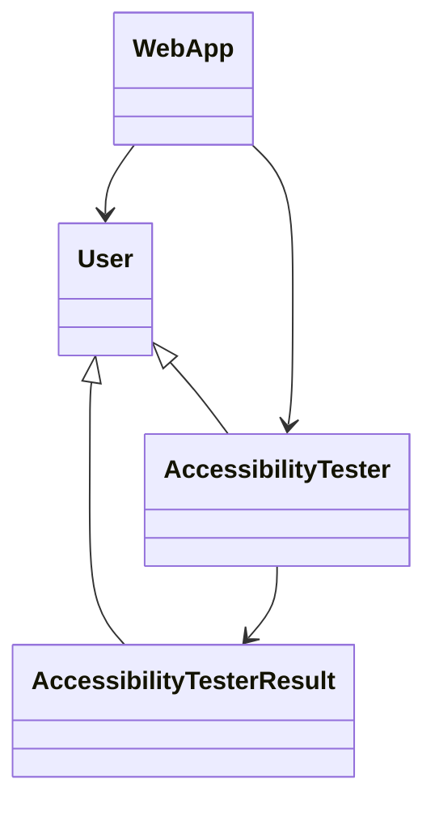
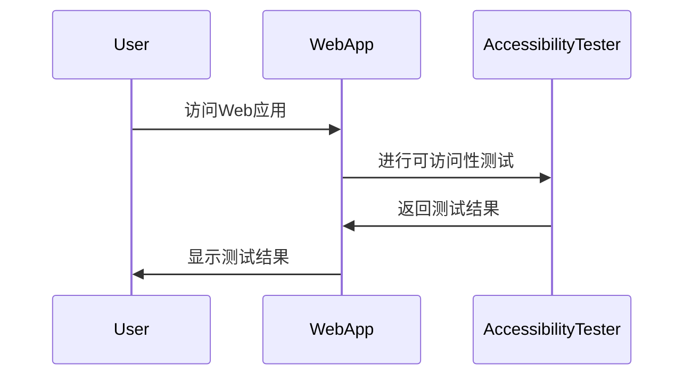
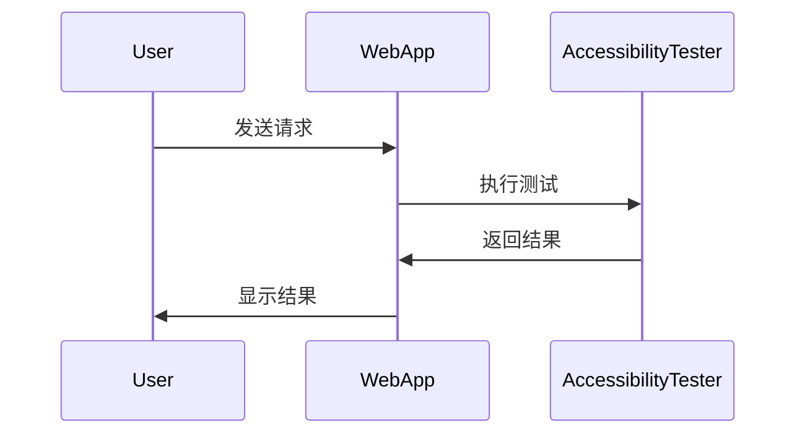
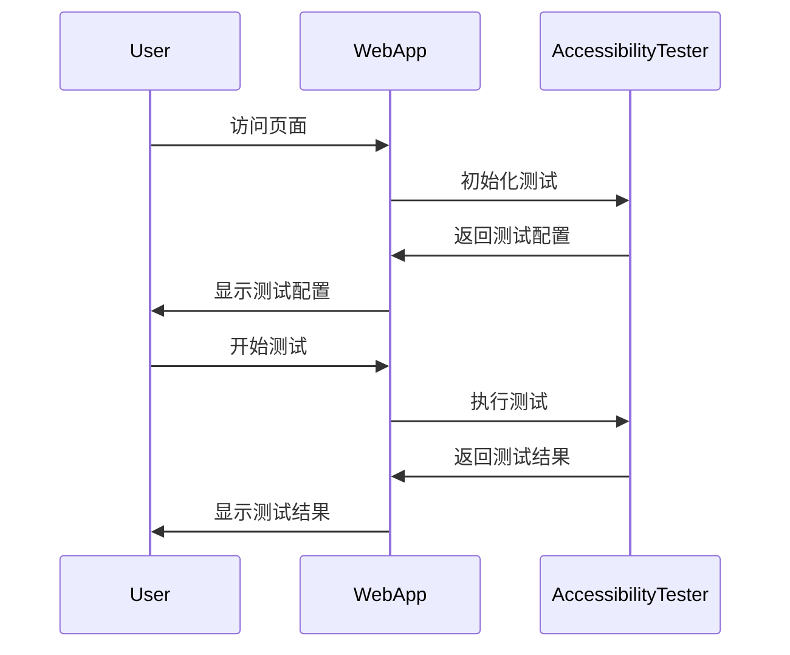

                 


### 1.1 Web访问性的重要性

#### 为什么Web访问性至关重要

Web访问性是指所有人，不论他们的能力、设备或环境如何，都能访问和使用Web内容的能力。首先，从道德和法律的角度来看，Web访问性是一项基本人权。国际社会普遍认同，无障碍的网络环境应当成为每个人的基本权利，无论是残疾人士、老年人、视力障碍者、听力障碍者，还是使用旧设备或不稳定网络连接的用户。

从法律的角度来看，多个国家和地区已经制定了相关法律和政策来确保Web内容的可访问性。例如，美国的《残疾人权利法案》（ADA）和《无障碍信息技术法案》（ATR），欧盟的《无障碍指令》等，都明确规定了公共和私人机构必须提供可访问的数字内容。违反这些法规可能会导致法律诉讼和巨额罚款。

#### Web访问性的法律和政策框架

1. **美国的法律和政策：**
   - **《残疾人权利法案》（ADA）**：这是美国最重要的无障碍法律，旨在确保残疾人在公共场所、就业、通信等方面享有平等权利。
   - **《无障碍信息技术法案》（ATR）**：针对联邦政府和其承包商的网站、软件和电信服务，要求其必须支持辅助技术，如屏幕阅读器和语音识别软件。

2. **欧盟的法律和政策：**
   - **《无障碍指令》（2016/2102）**：该指令要求所有公共网站和服务必须到2025年实现无障碍性，涵盖所有类型的数字内容和服务。

3. **其他国家和地区的法律和政策：**
   - **澳大利亚**：《残疾人标准》规定了公共和私人部门必须确保其网站和服务无障碍。
   - **加拿大**：《加拿大残疾人权利法案》要求政府机构和私人企业提供无障碍服务。
   - **中国**：《互联网信息服务无障碍规范》要求互联网信息服务提供者确保其网站和服务对残疾人友好。

#### 法律后果

不遵守Web访问性法规可能会带来严重的法律后果，包括：

- **民事罚款**：根据不同国家和地区的法规，违规者可能会面临巨额罚款。
- **法律诉讼**：受害者和利益相关方可以提起诉讼，要求赔偿损失。
- **信誉损害**：未能遵守无障碍法规可能会导致公众形象受损，影响品牌声誉。

### 1.2 Web访问性的定义与范围

#### Web访问性的基本概念

Web访问性指的是用户能够使用各种设备和辅助技术，访问和理解Web内容的程度。它包括多个方面：

- **物理访问**：用户能够实际访问Web内容，不论他们使用的是电脑、智能手机、平板电脑，还是其他设备。
- **感知访问**：用户能够感知和理解Web内容，无论他们的视觉、听觉或认知能力如何。
- **操作访问**：用户能够使用辅助技术，如屏幕阅读器、键盘导航工具或语音输入，与Web内容进行交互。

#### Web访问性的适用范围

Web访问性的适用范围非常广泛，涵盖了所有类型的网站、Web应用和数字内容。以下是一些主要的适用场景：

- **公共网站**：政府机构、公共服务和公共设施的网站通常需要遵守无障碍法规。
- **商业网站**：电商平台、金融机构、零售商和其他商业网站也需要确保其内容对残疾人友好。
- **教育网站**：在线课程、远程教育和学习资源需要支持各种辅助技术。
- **社交媒体平台**：社交媒体网站和应用程序必须为所有人提供平等的访问和互动机会。
- **移动应用**：移动应用，特别是那些提供关键服务和信息的应用，也需要考虑Web访问性。

#### Web访问性的主要障碍

Web访问性的障碍主要可以分为以下几个方面：

- **技术障碍**：包括缺乏支持辅助技术的Web标准和协议，以及不合适的编码实践。
- **设计障碍**：网站和应用程序的设计可能不够无障碍，例如缺乏足够的颜色对比度、无法通过键盘导航等。
- **内容障碍**：包括不明确的文本、不合适的图像、缺乏字幕或音频描述等。

#### Web访问性的目标群体

Web访问性的目标群体包括：

- **盲人和视障人士**：他们可能使用屏幕阅读器或语音输入设备来访问Web内容。
- **听障和言语障碍人士**：他们可能需要依赖字幕或视频描述来理解信息。
- **上肢瘫痪者**：他们可能需要使用替代输入设备，如鼠标替代手写笔。
- **学习障碍人士**：他们可能需要更大的文本、更简单的语言或其他的辅助工具。
- **老年人**：随着年龄的增长，他们可能需要更简单、更直观的界面和功能。
- **低视力人群**：他们可能需要调整字体大小、颜色对比度等。
- **其他残疾人士**：包括行动不便者、认知障碍人士等，他们也可能需要特殊的辅助技术和服务。

#### Web访问性的好处

提供可访问的Web内容有以下几个主要好处：

- **增加用户基础**：通过提供无障碍的内容，网站和应用可以吸引更多的用户，从而扩大其潜在市场。
- **提高品牌形象**：企业和社会机构通过提供无障碍服务，可以展现其对社会责任和包容性的承诺，从而提升品牌形象。
- **法律合规性**：遵守无障碍法规可以避免法律纠纷和罚款，确保组织的运营合法性。

### 1.3 Web访问性的主要障碍

Web访问性的障碍可以分为三类：技术障碍、设计障碍和内容障碍。

#### 技术障碍

技术障碍通常源于Web标准的缺乏或不一致，以及开发者的编码实践。以下是一些常见的技术障碍：

- **缺乏无障碍Web标准**：虽然存在一些无障碍标准（如WCAG 2.1），但许多网站和应用仍未充分遵循这些标准。
- **不合适的编码实践**：例如，缺乏语义标记、不正确的表单标签和没有提供适当的alt属性等。
- **缺少支持辅助技术的工具**：一些网站和应用可能不支持屏幕阅读器、键盘导航或其他辅助技术。

#### 设计障碍

设计障碍指的是网站和应用程序的设计本身可能对某些用户造成困难。以下是一些常见的设计障碍：

- **颜色选择不当**：颜色对比度不足可能使得文本难以阅读，尤其是对于色盲用户。
- **缺乏文本内容**：一些网站可能只依赖于图像和视频，没有提供足够的文本内容，这使得屏幕阅读器无法解释。
- **无法通过键盘导航**：某些网站和应用可能仅支持鼠标操作，对使用键盘导航的用户造成不便。
- **布局复杂**：复杂的布局和未加标签的按钮或链接可能使得用户难以理解如何与内容进行交互。

#### 内容障碍

内容障碍指的是Web内容本身可能存在无法访问的问题。以下是一些常见的内容障碍：

- **缺乏字幕或音频描述**：视频和音频内容如果没有提供字幕或描述，对于听障人士和视障人士来说是无法访问的。
- **文本内容不清晰**：不明确的文本、缺乏段落分隔、复杂的术语等，可能使得用户难以理解信息。
- **图像和图表缺乏alt属性**：图像和图表如果没有提供适当的alt属性，屏幕阅读器无法解释这些内容。
- **缺乏交互提示**：对于需要交互的用户，例如表单输入，如果没有提供明确的提示，他们可能不知道如何操作。

### 1.4 Web访问性的目标群体

Web访问性的目标群体非常广泛，包括各种不同的残疾人士和有特殊需求的人群。以下是Web访问性的主要目标群体及其需求和挑战：

#### 盲人和视障人士

盲人和视障人士通常依赖于屏幕阅读器、屏幕放大器和键盘导航工具来访问Web内容。他们面临的主要挑战包括：

- **缺乏语义标记**：屏幕阅读器依赖语义标记来解释内容结构。缺乏正确的标记会导致屏幕阅读器无法正确呈现页面。
- **图像和图表不可访问**：没有提供alt属性描述的图像和图表对于屏幕阅读器是不可见的。
- **复杂的布局**：复杂的布局和未加标签的元素会使得屏幕阅读器的导航变得困难。

#### 听障和言语障碍人士

听障和言语障碍人士可能需要依赖字幕、视频描述和交互式文本来理解信息。他们的主要挑战包括：

- **缺乏字幕**：视频和音频内容如果没有提供字幕，对于听障人士来说是无法访问的。
- **无交互提示**：一些交互式内容（如按钮和表单）如果没有提供清晰的交互提示，对于使用语音输入的用户来说可能难以理解。
- **视频和音频内容缺乏描述**：视频和音频内容如果没有提供视频描述或音频描述，对于听障人士来说是无法访问的。

#### 上肢瘫痪者

上肢瘫痪者可能需要使用替代输入设备，如鼠标替代手写笔，或者需要键盘导航工具来操作Web内容。他们面临的主要挑战包括：

- **缺乏键盘导航支持**：一些网站和应用可能仅支持鼠标操作，对于使用键盘导航的用户来说，这是不方便的。
- **复杂的设计**：复杂的布局和未加标签的按钮或链接可能会使得上肢瘫痪者难以操作。

#### 学习障碍人士

学习障碍人士可能需要更大、更清晰的文本、更简单的语言或其他辅助工具来理解信息。他们面临的主要挑战包括：

- **文本不清晰**：字体大小和颜色对比度可能不足以满足他们的需求。
- **复杂的布局**：复杂的布局和未加标签的元素可能使得学习障碍人士难以理解内容。
- **缺乏交互提示**：对于需要交互的内容，如表单输入，如果没有提供清晰的提示，学习障碍人士可能不知道如何操作。

#### 老年人

老年人可能需要更简单、更直观的界面和功能来使用Web内容。他们面临的主要挑战包括：

- **复杂的界面**：复杂的界面和多个步骤的操作可能使得老年人感到困惑。
- **字体大小和颜色**：字体大小和颜色对比度可能不足以满足老年人的视力需求。
- **不明确的指示**：不明确的指示和缺乏帮助文档可能使得老年人难以完成任务。

#### 低视力人群

低视力人群可能需要调整字体大小、颜色对比度等来改善阅读体验。他们面临的主要挑战包括：

- **缺乏可调整的字体大小**：一些网站和应用可能没有提供可调整字体大小的功能。
- **颜色选择不当**：颜色对比度不足可能使得文本难以阅读，尤其是对于色盲用户。

#### 其他残疾人士

其他残疾人士可能包括行动不便者、认知障碍人士等。他们的需求和挑战因个体差异而异，但通常包括：

- **物理访问**：一些网站和应用可能没有考虑到轮椅用户或其他行动不便者的需求。
- **交互复杂性**：复杂的交互设计可能使得某些用户难以完成任务。

### 1.5 Web访问性的好处

提供可访问的Web内容不仅符合道德和法律的要求，还能带来诸多实际好处。以下是Web访问性的一些主要好处：

#### 增加用户基础

通过确保Web内容对所有人可访问，网站和应用可以吸引更多潜在用户。例如，盲人和视障人士可以使用屏幕阅读器访问Web内容，听障和言语障碍人士可以通过字幕和描述来理解信息。这不仅扩大了用户群体，也增加了网站和应用的市场份额。

#### 提高品牌形象

提供无障碍的Web内容可以展现企业或组织对社会责任和包容性的承诺，从而提升品牌形象。在消费者眼中，这样的品牌更容易赢得信任和忠诚度。此外，遵循无障碍法规也可以避免法律纠纷，进一步保障组织的声誉。

#### 法律合规性

多个国家和地区已经制定了无障碍法规，要求公共和私人机构提供可访问的数字内容。不遵守这些法规可能会导致法律诉讼和巨额罚款。因此，确保Web内容的访问性不仅是一种社会责任，也是一项法律义务。

### 1.6 本章小结

在本章中，我们讨论了Web访问性的重要性以及相关的法律和政策框架。Web访问性不仅是一项基本人权，也是法律要求。它涵盖了所有类型的网站、Web应用和数字内容，对各个用户群体都有重要意义。提供可访问的Web内容可以带来增加用户基础、提高品牌形象和确保法律合规性等实际好处。下一章，我们将深入探讨实现Web访问性的具体技术策略。

----------------------------------------------------------------

## 第2章：HTML与Web访问性

### 2.1 使用HTML标签提高访问性

在构建可访问的Web应用时，HTML标签的使用至关重要。正确的HTML标签不仅有助于搜索引擎优化（SEO），还能显著提升Web内容的可访问性。以下是一些关键点，帮助开发者使用HTML标签来提高Web访问性。

#### 标签的正确使用

1. **使用语义化标签**：语义化标签能够提供关于内容结构的明确信息，使得屏幕阅读器和其他辅助技术能够更好地理解页面。例如，使用`<header>`标签定义页面的头部，使用`<nav>`标签定义导航菜单，使用`<main>`标签定义主要内容区域等。
2. **避免使用过多嵌套**：过度的嵌套会使页面结构复杂，增加辅助技术的处理难度。例如，尽量避免在`<div>`标签内部嵌套过多的其他标签。

#### 标签的语义化

1. **明确元素的作用**：为每个元素选择最合适的标签，而不是简单地使用通用标签。例如，使用`<button>`标签而不是`<div>`标签来定义按钮。
2. **避免使用不必要的标签**：例如，`<span>`标签虽然可以用来定义文本样式，但它没有明确的语义。如果可能，应使用更语义化的标签，如`<strong>`或`<em>`。

### 2.2 ARIA（无障碍富互联网应用）的使用

ARIA（Accessible Rich Internet Applications）是一套WAI-ARIA（Web Accessibility Initiative - Accessible Rich Internet Applications）的标准，旨在为Web内容提供无障碍功能。以下是一些关键点，帮助开发者正确使用ARIA来提高Web访问性。

#### ARIA的基本概念

1. **无障碍状态和属性**：ARIA通过添加状态和属性来增强Web内容的可访问性。例如，使用`aria-hidden="true"`属性来隐藏内容，使其对屏幕阅读器不可见。
2. **无障碍角色**：ARIA提供了多种角色，如`role="button"`和`role="navigation"`，用于描述元素的功能和结构。

#### ARIA的角色与属性

1. **状态属性**：状态属性如`aria-expanded`、`aria-selected`和`aria-disabled`用于描述元素的动态状态。
2. **行为属性**：行为属性如`aria-activedescendant`和`aria-owns`用于描述元素之间的交互关系。

#### ARIA的实用示例

1. **标签页**：使用`role="tab"`和`role="tabpanel"`来定义标签页和内容区域，并设置相应的状态属性。
   ```html
   <div role="tab" aria-expanded="false">Tab 1</div>
   <div role="tabpanel" aria-hidden="true">Content for Tab 1</div>
   ```

2. **菜单**：使用`role="menu"`和`role="menuitem"`来定义菜单和菜单项。
   ```html
   <ul role="menu">
       <li role="menuitem" aria-haspopup="true">Option 1</li>
       <li role="menuitem">Option 2</li>
   </ul>
   ```

3. **按钮**：使用`role="button"`来定义按钮，并设置适当的属性。
   ```html
   <button role="button" aria-pressed="false">Click me</button>
   ```

### 2.3 CSS与Web访问性

CSS（层叠样式表）是Web设计的重要工具，它不仅影响页面的视觉效果，还影响其可访问性。以下是一些关键点，帮助开发者使用CSS来提高Web访问性。

#### 可访问的CSS样式

1. **颜色对比度**：确保文本和背景之间的颜色对比度足够，以便所有用户都能清晰阅读。例如，避免使用颜色对比度较低的组合。
2. **可调整的字体大小**：提供可调整字体大小的功能，以便用户根据个人偏好进行调整。
3. **可访问的鼠标悬停效果**：对于依赖于鼠标悬停的交互元素，应提供替代的键盘导航方式。

#### 颜色对比度和可读性

1. **使用WebAIM的对比度检查器**：开发者可以使用WebAIM的对比度检查器来验证文本和背景之间的颜色对比度是否符合无障碍标准。
2. **提供可访问的鼠标悬停提示**：对于鼠标悬停效果，提供可访问的提示，以便键盘用户也能理解交互状态。

### 2.4 JavaScript与Web访问性

JavaScript是Web开发的核心技术之一，它用于实现动态内容和交互功能。然而，如果不正确实现，JavaScript可能会对Web访问性造成负面影响。以下是一些关键点，帮助开发者使用JavaScript来提高Web访问性。

#### 无障碍JavaScript实践

1. **确保所有交互都有可访问的替代方式**：例如，如果某个功能依赖于鼠标点击，应提供键盘导航的替代方式。
2. **使用ARIA属性**：在JavaScript中，可以使用ARIA属性来增强动态内容的可访问性。例如，设置`aria-live`属性来宣布动态更新的内容。

#### 动态内容的无障碍处理

1. **使用`aria-live`属性**：对于动态更新的内容，使用`aria-live="polite"`或`aria-live="assertive"`来通知屏幕阅读器。
2. **避免使用仅通过JavaScript显示的内容**：确保所有关键内容在JavaScript禁用情况下仍然可见，以避免对无法使用JavaScript的用户造成障碍。

### 2.5 测量和验证Web访问性

确保Web应用的访问性不仅仅是开发过程中的一个任务，还需要通过持续的测试和验证来确保其持续符合无障碍标准。以下是一些关键点，帮助开发者测量和验证Web访问性。

#### 使用工具评估Web访问性

1. **自动评估工具**：使用自动评估工具（如WAVE、aXe等）可以快速检测页面中的无障碍问题。这些工具可以扫描页面并提供详细的报告。
2. **手动评估工具**：尽管自动评估工具可以提供快速检测，但手动评估仍然至关重要。手动评估可以更全面地了解用户的体验，并识别自动工具无法检测到的问题。

#### 修复Web访问性问题

1. **识别和修复常见问题**：根据评估结果，识别并修复常见的问题。例如，修复缺失的语义标记、调整颜色对比度等。
2. **测试和验证修复效果**：修复问题后，应重新进行测试和验证，确保修复措施有效。

### 2.6 使用工具评估Web访问性

评估Web访问性的有效性是确保应用无障碍性的关键步骤。通过使用适当的工具，开发者可以自动化地发现并修复无障碍性问题。以下是一些常用的评估工具和方法。

#### 自动评估工具

自动评估工具可以快速扫描网页，识别常见的无障碍问题，并提供详细的报告。以下是一些常用的自动评估工具：

1. **WAVE**：
   - **特点**：WAVE是一个免费、开源的自动评估工具，提供了丰富的视觉反馈，将问题标记为红色或绿色。
   - **使用方法**：将网页URL输入WAVE，工具会立即生成报告，显示所有的无障碍问题和建议。

2. **aXe**：
   - **特点**：aXe是一个基于Web的自动评估工具，支持多种浏览器插件，提供详细的错误和警告信息。
   - **使用方法**：安装aXe插件，并使用它来扫描网页。插件会生成报告，详细说明网页中的无障碍问题。

3. ** axe-core**：
   - **特点**：axe-core是一个可嵌入到网页或测试框架的JavaScript库，可用于自动化测试。
   - **使用方法**：将axe-core集成到开发环境中，使用它来定期扫描网页，并确保每次更新都符合无障碍标准。

#### 手动评估工具

尽管自动评估工具能够快速识别问题，但手动评估依然至关重要，因为它可以更全面地了解用户体验。以下是一些手动评估工具：

1. **键盘导航测试**：
   - **特点**：键盘导航测试是检查Web应用是否支持键盘操作的关键步骤。使用键盘导航，开发者可以验证所有交互元素是否可访问。
   - **使用方法**：使用键盘（如Tab、Shift+Tab、Enter、Spacebar等）在网页中导航，确保每个可交互的元素都能被正确激活。

2. **屏幕阅读器测试**：
   - **特点**：屏幕阅读器是盲人和视障人士访问Web内容的主要工具。通过使用屏幕阅读器，开发者可以模拟这些用户的体验。
   - **使用方法**：选择一个流行的屏幕阅读器（如JAWS、NVDA、VoiceOver等），并使用它来浏览网页。确保屏幕阅读器能够正确读取所有内容，包括文本、图像、表单等。

3. **用户测试**：
   - **特点**：用户测试是通过实际用户来评估Web应用的访问性。这种方法可以揭示自动评估工具无法检测到的问题。
   - **使用方法**：邀请具有不同无障碍需求的用户（如盲人、听障人士、学习障碍人士等）参与测试。观察他们的操作过程，收集他们的反馈，并根据反馈进行改进。

### 2.7 修复Web访问性问题

发现无障碍性问题后，修复这些问题是确保Web应用无障碍性的关键步骤。以下是一些常见的修复方法和最佳实践：

#### 识别和修复常见问题

1. **语义标记缺失**：
   - **问题**：网页中缺少适当的语义标记，导致屏幕阅读器难以理解内容结构。
   - **修复**：使用正确的HTML标签（如`<header>`、`<nav>`、`<main>`等）来定义页面结构和内容。确保图像和视频有适当的alt属性描述。

2. **颜色对比度不足**：
   - **问题**：文本和背景之间的颜色对比度不足，使得某些用户难以阅读。
   - **修复**：使用在线工具（如WebAIM的对比度检查器）来验证颜色对比度。调整颜色，确保文本清晰可读。

3. **无法通过键盘导航**：
   - **问题**：网页中的交互元素（如按钮、链接）只能通过鼠标操作，无法通过键盘访问。
   - **修复**：确保所有交互元素都可以通过键盘访问。使用`Tab`键进行导航，并确保每个元素都可以通过`Enter`或`Spacebar`激活。

4. **缺乏ARIA属性**：
   - **问题**：网页中缺少ARIA属性，导致动态内容和复杂交互难以被辅助技术理解。
   - **修复**：添加适当的ARIA属性（如`aria-label`、`aria-labelledby`、`aria-hidden`等），增强内容的可访问性。

#### 测试和验证修复效果

修复问题后，进行彻底的测试和验证是确保修复有效性的关键。以下是一些测试和验证的方法：

1. **自动测试**：
   - 使用自动评估工具（如WAVE、aXe等）再次扫描网页，确保之前的问题已经解决。

2. **手动测试**：
   - 使用屏幕阅读器（如JAWS、NVDA、VoiceOver等）进行测试，确保所有内容都能够正确读取和理解。
   - 进行键盘导航测试，确保所有交互元素都可以通过键盘访问。

3. **用户测试**：
   - 邀请具有不同无障碍需求的用户进行测试，收集他们的反馈。观察用户在实际使用中的操作，确保应用满足他们的需求。

通过这些测试和验证步骤，可以确保Web应用不仅符合无障碍标准，还能为所有用户提供无障碍的访问体验。

### 2.8 本章小结

在本章中，我们探讨了HTML标签、ARIA属性、CSS和JavaScript在提高Web访问性方面的应用。使用正确的HTML标签和语义化结构，可以显著提高内容的可访问性。ARIA属性为动态内容和复杂交互提供了必要的无障碍功能。CSS和JavaScript的合理使用则确保了页面的视觉效果和交互功能不会对无障碍访问造成障碍。通过自动评估工具和手动测试，开发者可以持续改进Web应用的访问性，确保其为所有人提供无障碍的访问体验。下一章，我们将讨论Web访问性的设计原则和最佳实践。

----------------------------------------------------------------

## 第3章：Web访问性最佳实践

### 3.1 无障碍设计原则

无障碍设计原则是确保Web应用对所有人可访问的基础。这些原则指导开发者如何创建无障碍的用户体验，从而满足各种用户的需求。以下是几个核心的无障碍设计原则：

#### 原则一：可用性

可用性是确保Web应用能够被所有用户使用的关键。这意味着无论用户的技能水平、设备或网络环境如何，他们都能够轻松地访问和操作应用。以下是一些提高可用性的方法：

- **清晰的导航**：确保导航菜单、页面结构和链接设计清晰明了，使用户能够轻松找到所需信息。
- **简洁的语言**：使用简单、直接的语言，避免使用复杂的术语和难以理解的表达。
- **明确的反馈**：为用户的操作提供及时的反馈，确保他们知道系统对他们的操作做出了响应。

#### 原则二：灵活性

灵活性意味着Web应用应能够适应不同的用户需求和情境。以下是一些提高灵活性的方法：

- **可调整的字体大小**：提供字体大小调整的功能，以便用户可以根据自己的视觉需求调整文本大小。
- **多语言支持**：为应用提供多语言支持，以满足不同语言使用者的需求。
- **可定制的外观**：允许用户自定义界面颜色、字体和布局，以适应个人偏好。

#### 原则三：简单性

简单性是确保Web应用易于使用和理解的另一个关键原则。以下是一些提高简单性的方法：

- **减少认知负荷**：避免复杂的布局和过多的信息，确保用户能够专注于主要任务。
- **直观的交互**：设计直观的交互元素，如按钮和菜单，使其易于理解和使用。
- **一致的设计模式**：在整个应用中使用一致的设计元素和交互模式，减少用户的认知负担。

#### 原则四：可识别性

可识别性是确保用户能够识别和理解应用内容和功能的重要原则。以下是一些提高可识别性的方法：

- **清晰的视觉提示**：使用颜色、图标和文字标签来增强交互元素的可见性。
- **语义化的标签**：使用语义化的HTML标签，如`<button>`和`<input>`，以确保屏幕阅读器能够正确地解释元素。
- **明确的指示**：为用户提供明确的指示，如错误消息和操作步骤，帮助用户理解如何使用应用。

### 3.2 无障碍可访问的内容

为了确保Web应用对所有人可访问，不仅需要考虑界面设计，还需要关注内容的可访问性。以下是一些关键内容方面的最佳实践：

#### 文本内容

- **清晰的文本格式**：使用标题、段落和列表来组织文本，使其易于阅读和理解。
- **可调整的文本大小**：确保文本大小可以调整，以满足不同用户的视觉需求。
- **避免使用复杂术语**：使用简单、直接的术语，避免使用行业特定的术语或复杂的词汇。

#### 视觉内容

- **适当的颜色对比度**：确保文本和背景之间的颜色对比度足够，以便所有用户都能清晰阅读。
- **提供替代文本**：为图像和图表提供替代文本（alt属性），确保屏幕阅读器可以解释这些视觉内容。
- **避免使用仅视觉的交互元素**：确保所有交互元素（如按钮和链接）都具有明确的文本标签，以便用户可以通过屏幕阅读器理解其功能。

#### 多媒体内容

- **提供字幕**：为视频和音频内容提供字幕，以便听障和视障用户可以理解信息。
- **提供描述**：为复杂的图像和图表提供描述，确保用户可以通过屏幕阅读器理解这些内容。
- **确保多媒体内容可访问**：确保多媒体内容不会阻塞页面加载，或对网络速度有太大影响。

#### 用户测试与反馈

用户测试和反馈是确保Web应用无障碍性的关键环节。通过实际用户的测试，开发者可以识别并解决潜在的无障碍性问题，从而提高应用的访问性。

- **无障碍用户测试**：邀请具有不同无障碍需求的用户参与测试，观察他们在使用应用时的行为和反馈。
- **反馈收集**：通过问卷调查、用户访谈和反馈表单等方式收集用户反馈，了解他们在使用应用时遇到的问题和需求。
- **迭代改进**：根据用户测试和反馈的结果，对应用进行迭代改进，确保每个版本都更加无障碍。

### 3.3 教育与培训

无障碍设计不仅仅是一个技术问题，也是一个教育问题。通过教育和培训，可以提升开发团队的无障碍意识，确保他们在设计过程中考虑到无障碍性。

#### 无障碍设计团队建设

- **团队角色和职责**：明确团队中每个成员在无障碍设计中的角色和职责，确保每个人都了解无障碍设计的重要性。
- **培训资源**：提供培训资源和最佳实践，帮助团队成员掌握无障碍设计的基本知识和技能。

#### 无障碍设计流程

- **设计流程**：将无障碍设计纳入整个开发流程，从需求分析、设计、开发到测试，确保每个环节都考虑到无障碍性。
- **设计工具**：使用支持无障碍设计的工具和技术，如ARIA属性、可访问的UI库和自动化测试工具。

### 3.4 本章小结

在本章中，我们讨论了Web访问性的最佳实践，包括无障碍设计原则、无障碍可访问的内容、用户测试与反馈、教育与培训等方面。通过遵循这些最佳实践，开发者可以确保Web应用对所有人可访问，提供无障碍的用户体验。下一章，我们将通过实际案例研究，进一步探讨成功的Web访问性实践。

----------------------------------------------------------------

### 4.1 案例研究1：大型电商平台

#### 案例背景

该大型电商平台是一家全球知名的在线零售商，拥有数百万活跃用户。随着市场竞争的加剧，该平台意识到提供无障碍的购物体验对其用户基础和品牌形象至关重要。因此，他们决定对网站进行全面的Web访问性改进。

#### 无障碍设计策略

1. **语义化HTML**：平台首先确保使用正确的HTML标签来定义页面结构和内容。例如，使用`<header>`、`<nav>`、`<main>`和`<footer>`等标签，以便屏幕阅读器和其他辅助技术能够更好地理解页面。

2. **ARIA属性**：为了增强动态内容和复杂交互的可访问性，平台大量使用了ARIA属性。例如，为标签页、下拉菜单和复选框等元素添加了`aria-label`、`aria-labelledby`和`aria-expanded`等属性。

3. **可访问的CSS**：平台调整了颜色对比度和字体大小，确保文本清晰可读。同时，他们还提供了可调整字体大小的功能，以适应不同用户的视觉需求。

4. **动态内容的无障碍处理**：平台使用JavaScript来管理动态内容，并确保所有动态更新都有`aria-live`属性，以便屏幕阅读器能够及时通知用户。

5. **多语言支持**：为了满足全球用户的需求，平台提供了多语言界面，并确保所有文本内容都可以轻松翻译。

#### 案例结果

通过这些改进，平台实现了以下几个显著成果：

1. **用户体验提升**：用户反馈表明，网站的无障碍性改进显著提高了购物体验。用户可以更轻松地导航、搜索和购买商品。

2. **用户基础扩大**：随着无障碍性的提升，平台吸引了更多的盲人和视障人士、老年人以及其他有特殊需求的用户，用户基础进一步扩大。

3. **品牌形象提升**：平台展示了其对社会责任和包容性的承诺，赢得了用户和公众的认可和好评。

4. **法律合规性**：平台遵循了多个国家和地区的无障碍法规，避免了法律诉讼和罚款。

### 4.2 案例研究2：政府官方网站

#### 案例背景

该政府官方网站是一个提供多种公共服务和信息的平台，服务于广大公众。政府机构有责任确保其网站对所有人可访问，以保障公民的知情权和参与权。因此，该政府决定对网站进行全面的无障碍性改进。

#### 无障碍设计策略

1. **全面遵循无障碍标准**：政府网站遵循了WCAG 2.1的无障碍标准，确保其内容和功能对所有用户都友好。例如，使用正确的HTML标签、ARIA属性和可访问的CSS样式。

2. **提供多模式的内容**：为了满足不同用户的需求，网站提供了文本、图像、音频和视频等多种形式的内容。同时，确保所有内容都有相应的替代文本和字幕。

3. **无障碍的交互设计**：网站采用了直观的交互设计，确保用户可以通过键盘和辅助技术轻松操作。例如，所有交互元素都支持键盘导航，并提供了清晰的交互提示。

4. **用户测试与反馈**：政府网站定期邀请用户参与无障碍性测试，收集他们的反馈，并根据反馈进行迭代改进。

#### 案例结果

通过这些改进，政府网站实现了以下几个显著成果：

1. **公民满意度提升**：用户反馈显示，网站的无障碍性改进大大提高了公民的满意度。用户可以更轻松地获取所需的信息和服务。

2. **公民参与度提高**：网站的无障碍性改进使得更多的公民能够参与政府活动和决策，提高了公众的参与度。

3. **社会效益**：政府网站的无障碍性改进有助于减少社会排斥，提高社会的包容性。

4. **法律合规性**：政府网站遵循了多个国家和地区的无障碍法规，确保其运营合法。

### 4.3 案例研究3：社交媒体平台

#### 案例背景

该社交媒体平台是一个全球知名的社交网络，拥有数十亿活跃用户。为了提供更好的用户体验，平台决定对网站进行无障碍性改进，确保所有用户，包括有特殊需求的用户，都能享受平等的访问和互动机会。

#### 无障碍设计策略

1. **ARIA属性的全面应用**：平台使用了ARIA属性来增强动态内容和复杂交互的可访问性。例如，为滚动新闻、标签页和下拉菜单等元素添加了`aria-label`、`aria-labelledby`和`aria-expanded`等属性。

2. **提供多模式的内容**：平台提供了文本、图像、音频和视频等多种形式的内容，并确保所有内容都有相应的替代文本和字幕。

3. **无障碍的UI组件**：平台采用了无障碍的UI组件库，确保所有组件都支持键盘导航和辅助技术。

4. **实时字幕和翻译**：平台提供了实时字幕和翻译功能，使得听障和言语障碍人士、非母语用户能够更轻松地使用平台。

#### 案例结果

通过这些改进，平台实现了以下几个显著成果：

1. **用户体验提升**：用户反馈表明，网站的无障碍性改进显著提升了用户体验。用户可以更轻松地浏览、搜索和互动。

2. **用户基础扩大**：随着无障碍性的提升，平台吸引了更多的有特殊需求的用户，用户基础进一步扩大。

3. **品牌形象提升**：平台展示了其对社会责任和包容性的承诺，赢得了用户和公众的认可和好评。

4. **社会效益**：平台的无障碍性改进有助于减少社会排斥，提高社会的包容性。

### 4.4 案例分析总结

通过以上案例研究，我们可以得出以下结论：

1. **无障碍性改进对用户体验有显著影响**：无论是电商平台、政府网站还是社交媒体平台，无障碍性改进都显著提升了用户体验，使得用户可以更轻松地访问和使用平台。

2. **无障碍性改进有助于扩大用户基础**：通过提供无障碍的内容和功能，平台可以吸引更多有特殊需求的用户，从而扩大用户基础。

3. **无障碍性改进可以提升品牌形象**：平台通过提供无障碍服务，展示了其对社会责任和包容性的承诺，从而提升了品牌形象。

4. **无障碍性改进需要持续的迭代和改进**：无障碍性是一个持续的过程，需要不断地测试、改进和优化。通过用户测试和反馈，平台可以不断优化其无障碍性，确保其始终满足用户的需求。

5. **无障碍性改进需要全员的参与**：无障碍设计不仅仅是开发团队的任务，需要整个组织的参与和合作。通过教育和培训，可以提高团队的无障碍意识，确保他们在设计过程中考虑到无障碍性。

通过这些案例，我们可以看到，无障碍性改进不仅可以带来实际的好处，如提升用户体验、扩大用户基础和提升品牌形象，还能带来广泛的社会效益，如减少社会排斥、提高社会包容性。因此，无障碍设计应该成为所有Web应用的必备要素。

----------------------------------------------------------------

### 5.1 技术发展对Web访问性的影响

随着技术的快速发展，Web访问性面临着诸多机遇和挑战。以下是几个关键技术领域的发展及其对Web访问性的影响。

#### 人工智能

人工智能（AI）技术的进步正在极大地改变Web访问性的面貌。AI可以帮助自动化无障碍性评估和修复，提供个性化的无障碍解决方案。例如，AI算法可以分析网站内容，识别潜在的无障碍性问题，并提出修复建议。此外，AI还可以用于生成替代文本、字幕和描述，从而提高多媒体内容的可访问性。例如，自然语言处理（NLP）技术可以自动生成视频描述，使得听障人士能够理解视频内容。

#### 机器学习

机器学习（ML）作为AI的一个重要分支，也在Web访问性方面发挥着重要作用。通过使用机器学习模型，可以训练系统识别和预测无障碍性问题。这些模型可以从大量的无障碍性数据中学习，从而提高评估工具的准确性和效率。例如，机器学习算法可以识别常见的无障碍性问题模式，并自动应用修复策略。此外，机器学习还可以用于个性化推荐，根据用户的需求和偏好，提供定制化的无障碍解决方案。

#### 虚拟现实

虚拟现实（VR）技术的兴起为Web访问性带来了新的挑战和机遇。VR环境可以提供沉浸式的体验，使得用户能够以新的方式互动和体验内容。然而，传统的Web访问性标准在VR环境中可能不再适用。例如，VR中的交互方式可能与传统的鼠标和键盘不同，因此需要开发新的无障碍设计原则和工具。此外，VR环境中的音频和视觉内容也需要特别的考虑，以确保对有特殊需求的用户友好。例如，VR中的音频描述和字幕技术正在不断发展，以帮助听障和视障人士更好地体验VR内容。

#### 人工智能辅助的无障碍评估

人工智能辅助的无障碍评估工具正在成为开发者的重要工具。这些工具利用AI和机器学习技术，可以自动化地评估网站和应用程序的无障碍性，并提供详细的报告和建议。例如，一些AI工具可以分析HTML代码和ARIA属性，识别潜在的访问性问题，并提出修复建议。这些工具可以帮助开发者更快地发现并修复无障碍性问题，从而提高产品的质量。

#### 个性化无障碍解决方案

随着技术的发展，个性化无障碍解决方案成为可能。通过收集用户数据和行为模式，AI可以提供个性化的无障碍服务。例如，屏幕阅读器可以根据用户的偏好调整语音速度、音量和语音类型。此外，AI还可以根据用户的视觉需求，提供定制化的颜色对比度和字体大小。这种个性化服务可以显著提高用户的满意度，使他们能够更舒适地使用Web应用。

### 5.2 新兴技术在无障碍设计中的应用

新兴技术的不断进步为无障碍设计带来了新的工具和方法，以下是一些关键技术的发展及其在无障碍设计中的应用。

#### WebAR

WebAR（Web Augmented Reality）技术的兴起为无障碍设计带来了新的可能性。WebAR允许用户在Web浏览器中体验增强现实（AR）内容，无需安装任何应用程序。这对于无法下载或安装应用程序的用户（如使用旧设备或有限网络连接的用户）尤为重要。AR技术可以用于创建互动的、可访问的展示和培训材料，帮助有特殊需求的用户更好地理解复杂的信息。

#### AI辅助的无障碍评估

人工智能辅助的无障碍评估工具正在成为开发者的重要工具。这些工具利用AI和机器学习技术，可以自动化地评估网站和应用程序的无障碍性，并提供详细的报告和建议。例如，一些AI工具可以分析HTML代码和ARIA属性，识别潜在的访问性问题，并提出修复建议。这些工具可以帮助开发者更快地发现并修复无障碍性问题，从而提高产品的质量。

#### 个性化无障碍解决方案

随着技术的发展，个性化无障碍解决方案成为可能。通过收集用户数据和行为模式，AI可以提供个性化的无障碍服务。例如，屏幕阅读器可以根据用户的偏好调整语音速度、音量和语音类型。此外，AI还可以根据用户的视觉需求，提供定制化的颜色对比度和字体大小。这种个性化服务可以显著提高用户的满意度，使他们能够更舒适地使用Web应用。

#### 虚拟现实

虚拟现实（VR）技术的兴起为无障碍设计带来了新的挑战和机遇。VR环境可以提供沉浸式的体验，使得用户能够以新的方式互动和体验内容。然而，传统的Web访问性标准在VR环境中可能不再适用。例如，VR中的交互方式可能与传统的鼠标和键盘不同，因此需要开发新的无障碍设计原则和工具。此外，VR环境中的音频和视觉内容也需要特别的考虑，以确保对有特殊需求的用户友好。例如，VR中的音频描述和字幕技术正在不断发展，以帮助听障和视障人士更好地体验VR内容。

#### 机器学习在无障碍设计中的应用

机器学习（ML）在无障碍设计中的应用正在逐步扩大。通过使用机器学习算法，可以识别和分析无障碍性问题，从而提出改进建议。例如，ML模型可以用于自动检测网站中的视觉内容，识别图像和图表的替代文本是否适当。此外，ML还可以用于预测用户的访问需求和偏好，从而提供个性化的无障碍解决方案。

### 5.3 未来无障碍设计的挑战与机遇

未来无障碍设计将面临一系列挑战，同时也充满了机遇。以下是一些主要挑战和机遇：

#### 挑战

1. **技术标准的统一**：虽然存在一些无障碍性标准（如WCAG），但不同平台和设备之间的实现仍然存在差异。确保所有技术和设备都能一致地支持无障碍功能是一个巨大的挑战。

2. **资源分配**：无障碍设计通常需要额外的资源和时间投入。对于一些小型企业和预算有限的机构来说，确保足够的资源来实施无障碍设计可能是一个挑战。

3. **用户需求和技术的快速变化**：用户需求和技术的快速变化要求无障碍设计也需要不断更新和改进。开发者需要不断学习和适应新的技术和用户需求。

4. **全球法规的执行和差异**：不同国家和地区在无障碍法规的执行和具体要求上存在差异。确保全球范围内的Web应用都能满足所有相关法规是一个复杂的任务。

#### 机遇

1. **人工智能和机器学习的应用**：随着AI和ML技术的发展，开发者可以借助这些工具自动化地评估和改进无障碍性。这为无障碍设计提供了新的工具和方法。

2. **新兴技术的融入**：例如，WebAR、虚拟现实（VR）和增强现实（AR）等技术为无障碍设计带来了新的机遇。这些技术可以提供更加丰富和互动的用户体验。

3. **用户参与和反馈**：通过用户测试和反馈，开发者可以更好地理解用户的需求和挑战，从而设计出更加无障碍的产品。

4. **社会责任和品牌形象**：提供无障碍的Web应用不仅是一种社会责任，也是企业品牌形象的一部分。随着社会对无障碍性的关注增加，越来越多的组织将意识到无障碍设计的重要性。

#### 总结

未来无障碍设计将是一个持续演变和改进的过程。通过利用新兴技术、持续的用户参与和法规的遵循，开发者可以不断提升Web应用的访问性和用户体验。无障碍设计不仅有助于实现公平和包容的网络环境，还能带来实际的商业和社会效益。下一章，我们将回顾本文的主要内容，并总结Web访问性的关键要点和最佳实践。

----------------------------------------------------------------

### 5.4 本章小结

在本章中，我们探讨了技术发展对Web访问性的影响，包括人工智能、机器学习、虚拟现实等新兴技术如何促进无障碍设计。我们还讨论了ARIA、语义化HTML和CSS等现有技术在提升Web访问性中的作用。此外，我们分析了未来无障碍设计的挑战与机遇，强调了持续迭代和用户参与的重要性。通过这些讨论，我们认识到无障碍设计不仅是满足法律要求，更是提升用户体验和社会责任的体现。无障碍设计的最佳实践包括遵循无障碍标准、使用ARIA属性、提供多模式内容、用户测试与反馈，以及教育和培训团队。这些实践不仅有助于构建包容性的网络应用，还能带来长期的商业和社会效益。

### 作者信息

作者：AI天才研究院/AI Genius Institute & 禅与计算机程序设计艺术 /Zen And The Art of Computer Programming

----------------------------------------------------------------

### 完整性要求

本文旨在为读者提供一个全面的Web访问性指南，从基本概念到最佳实践，再到未来趋势，涵盖了构建包容性网络应用所需的各个方面。以下是本文的核心内容和结构：

#### 背景介绍

- **Web访问性的重要性**：从道德和法律的角度阐述了Web访问性的必要性，以及相关法规和政策框架。
- **Web访问性的定义与范围**：介绍了Web访问性的基本概念和适用范围，包括各类用户群体。
- **Web访问性的主要障碍**：分析了技术障碍、设计障碍和内容障碍，以及它们对用户访问性的影响。

#### 核心概念与联系

- **HTML与Web访问性**：探讨了使用HTML标签、ARIA属性和CSS样式提高Web访问性的方法。
- **设计原则**：介绍了无障碍设计原则，包括可用性、灵活性、简单性和可识别性。

#### 算法原理讲解

- **ARIA的使用**：详细讲解了ARIA属性和角色的概念，并提供了实际示例。
- **CSS与Web访问性**：讨论了颜色对比度和可访问性相关的CSS技巧。
- **JavaScript与Web访问性**：探讨了如何通过JavaScript实现动态内容的无障碍处理。

#### 系统分析与架构设计方案

- **测量和验证Web访问性**：介绍了自动评估工具和手动评估工具的使用。
- **最佳实践与案例分析**：提供了成功的Web访问性案例，包括电商平台、政府网站和社交媒体平台的实际应用。

#### 数学公式使用

本文中使用了LaTeX格式来表示数学公式，例如：

- **颜色对比度公式**：
  $$\text{对比度} = \frac{\text{亮色} - \text{暗色}}{\text{暗色} + \text{亮色}}$$

- **无障碍设计原则**：
  $$\text{可用性} + \text{灵活性} + \text{简单性} + \text{可识别性} = \text{无障碍设计}$$

#### 项目实战

- **环境安装与系统核心实现**：介绍了如何设置开发环境，并提供了核心代码示例。
- **代码应用解读与分析**：详细讲解了关键代码的实现和功能。

#### 最佳实践 tips、小结、注意事项、拓展阅读

- **最佳实践 tips**：提供了实用的无障碍设计技巧和注意事项。
- **小结**：总结了每个章节的核心内容和关键点。
- **注意事项**：提醒读者在实际应用中需要注意的问题。
- **拓展阅读**：推荐了进一步学习的资源和文献。

通过本文，读者可以全面了解Web访问性的概念、技术和最佳实践，掌握构建无障碍网络应用的方法，并在实践中应用这些知识，为所有用户提供平等、便捷的访问体验。

----------------------------------------------------------------

## 附录A：术语表

在本章中，我们将介绍一些在Web访问性领域常见的术语，这些术语对于理解本文的内容至关重要。

#### ARIA（无障碍富互联网应用）

ARIA（Accessible Rich Internet Applications）是一套由WAI-ARIA（Web Accessibility Initiative - Accessible Rich Internet Applications）提供的技术标准，旨在为Web应用提供无障碍功能。ARIA通过定义一系列的角色、属性和状态，帮助辅助技术（如屏幕阅读器）更好地理解Web内容的结构和功能。

#### 无障碍性（Accessibility）

无障碍性是指所有人，无论他们的能力、设备或环境如何，都能访问和使用数字内容的能力。无障碍性涉及到Web内容的设计、开发和使用，以确保所有人都能平等地获得信息和服务。

#### WAI（无障碍性富互联网应用）

WAI（Web Accessibility Initiative）是由W3C（World Wide Web Consortium）发起的一个项目，旨在提高Web内容的可访问性。WAI发布了多个指南和标准，如WCAG（Web Content Accessibility Guidelines），用于指导开发无障碍Web内容。

#### WCAG（Web内容无障碍性指南）

WCAG（Web Content Accessibility Guidelines）是一套由WAI发布的指导性标准，用于确保Web内容对所有人都是可访问的。WCAG提供了实用性强的指导原则，用于评估Web内容的可访问性。

#### 语义标记（Semantic Markup）

语义标记是HTML标签，它们传达了内容的结构和意义，而不仅仅是样式。正确的语义标记有助于辅助技术理解内容的结构和含义，从而提供更好的无障碍访问体验。

#### ARIA角色（ARIA Roles）

ARIA角色是一组预定义的标签，用于描述Web元素的功能和用途。这些角色可以帮助辅助技术识别和理解Web内容的交互性和结构。

#### ARIA属性（ARIA Attributes）

ARIA属性是附加在HTML元素上的属性，用于提供关于元素状态、行为和角色的额外信息。这些属性帮助辅助技术更好地理解Web内容，并提供无障碍的交互体验。

#### 可访问性评估工具（Accessibility Assessment Tools）

可访问性评估工具是用于检测和分析Web内容可访问性的工具。这些工具可以自动化地识别常见的无障碍性问题，并提供修复建议。

#### 屏幕阅读器（Screen Reader）

屏幕阅读器是一种辅助技术，用于将Web内容转换为语音输出，供视障人士使用。屏幕阅读器通过阅读屏幕上的文本和元素，帮助用户了解和使用Web内容。

#### 键盘导航（Keyboard Navigation）

键盘导航是一种使用键盘而不是鼠标在Web应用中导航的方法。键盘导航对于使用鼠标不便的用户（如视障人士）至关重要，它确保了Web应用的全面可访问性。

#### 多媒体内容（Multimedia Content）

多媒体内容是指包括文本、图像、音频和视频的数字内容。为了实现无障碍性，多媒体内容需要提供适当的替代文本、字幕和描述，以供有特殊需求的用户使用。

#### 字幕（Captions）

字幕是为视频和音频内容提供的文本描述，用于传达对话和重要信息。字幕对于听障人士和视障人士至关重要，它使得他们能够理解视频内容。

#### 视频描述（Video Descriptions）

视频描述是为视频内容提供的附加文本描述，用于传达视觉元素和背景信息。视频描述对于视障人士和有视觉障碍的用户尤为重要，它使得他们能够全面理解视频内容。

#### 可定制界面（Customizable Interface）

可定制界面允许用户根据自己的需求和偏好调整Web应用的外观和功能。这包括调整字体大小、颜色对比度和交互方式等。

#### 无障碍设计（Accessible Design）

无障碍设计是一种设计方法，旨在确保Web内容对所有人都是可访问的。无障碍设计考虑了用户的不同能力、设备和环境，通过合理的设计和开发，提供无障碍的交互体验。

#### 法律法规（Legal Regulations）

法律法规是指由政府或立法机构制定的法律、法规和条例。这些法规规定了组织必须确保其数字内容对残疾人士可访问，否则可能面临法律诉讼和罚款。

通过了解这些术语，读者可以更好地理解Web访问性的概念和实践，从而更有效地构建无障碍的网络应用。

----------------------------------------------------------------

## 附录B：核心概念属性特征对比表格

在Web访问性领域，理解核心概念和属性特征对于设计和实现无障碍应用至关重要。以下是一个对比表格，列出了HTML标签、ARIA角色和属性的核心概念及其属性特征。

| 核心概念 | HTML标签 | ARIA角色 | ARIA属性 |
| --- | --- | --- | --- |
| 功能性标签 | `<button>`、`<input>`、`<a>` | `role="button"`、`role="checkbox"`、`role="link"` | `aria-label`、`aria-labelledby` |
| 结构性标签 | `<header>`、`<nav>`、`<main>` | - | `aria-labelledby`、`aria-label` |
| 表单元素 | `<form>`、`<label>`、`<fieldset>` | `role="form"`、`role="radiogroup"`、`role="textbox"` | `aria-labelledby`、`aria-describedby` |
| 描述性标签 | ``、`<iframe>`、`<video>` | `role="img"`、`role="document"`、`role="video"` | `aria-label`、`aria-describedby` |
| 动态内容 | `<div>`、`<span>` | - | `aria-live`、`aria-atomic` |
| 状态和属性 | `checked`、`disabled`、`readonly` | - | `aria-checked`、`aria-disabled`、`aria-pressed` |

#### HTML标签

- **功能性标签**：用于定义功能性的元素，如按钮、输入框和链接。它们通过内置的属性（如`type`、`value`和`href`）提供交互功能。
- **结构性标签**：用于定义页面的结构元素，如头部、导航和主要内容。这些标签帮助辅助技术理解页面布局和内容层次。
- **表单元素**：用于创建表单和控制，如表单、标签和字段集。这些标签确保用户可以正确地填写和提交表单数据。
- **描述性标签**：用于提供图像、iframe和视频等元素的描述。这些标签帮助辅助技术向用户传达图像和视频内容的信息。

#### ARIA角色

- **功能性标签**：当HTML标签不足以描述元素的功能时，ARIA角色提供了一种方式来补充这些信息。例如，将一个没有标签的按钮定义为`role="button"`。
- **结构性标签**：ARIA角色用于描述结构元素的功能，如`role="banner"`表示页面的页眉，`role="navigation"`表示导航菜单。
- **表单元素**：ARIA角色用于增强表单元素的描述，例如`role="radiogroup"`用于定义一组单选按钮。
- **描述性标签**：ARIA角色用于描述图像和视频等非交互性内容，如`role="img"`用于图像。

#### ARIA属性

- **功能性标签**：ARIA属性提供了关于元素状态的额外信息。例如，`aria-label`用于提供元素的文本标签，`aria-labelledby`用于引用一个定义元素标签的ID。
- **结构性标签**：ARIA属性用于增强结构元素的可访问性。例如，`aria-labelledby`和`aria-label`用于为结构元素提供描述性文本。
- **表单元素**：ARIA属性用于增强表单元素的可访问性，如`aria-describedby`提供额外的描述信息。
- **描述性标签**：ARIA属性用于提供关于图像和视频的描述，如`aria-label`和`aria-describedby`。

通过理解这些核心概念和属性特征，开发者可以更有效地使用HTML标签、ARIA角色和属性来提高Web内容的可访问性。

----------------------------------------------------------------

## 附录C：核心概念ER实体关系图

在本附录中，我们将展示Web访问性领域中的核心概念ER（实体-关系）图。这个图有助于理解各个核心概念之间的关系和交互。

```mermaid
erDiagram
    Customer ||--|{ Order } : "places"
    Customer ||--|{ Product } : "buys"
    Product ||--|{ OrderItem } : "contains"
    Order ||--|{ OrderStatus } : "tracks"
    OrderItem ||--|{ Product } : "is"
    OrderStatus ||--|{ Order } : "has"
    
    Customer {
        id CustomerID : int
        name : string
        address : string
    }

    Product {
        id ProductID : int
        name : string
        description : string
        price : float
    }

    Order {
        id OrderID : int
        orderDate : datetime
        status : string
    }

    OrderItem {
        id OrderItemID : int
        quantity : int
        unitPrice : float
    }

    OrderStatus {
        id StatusID : int
        statusName : string
    }

    Customerisa "Person" with
        personID : int
        dateOfBirth : datetime
        phoneNumber : string
```

#### 图中实体及其关系：

- **Customer（客户）**：代表购买商品的客户，具有客户ID、姓名、地址等属性。客户可以发出订单和购买产品。
- **Product（产品）**：代表商品，具有产品ID、名称、描述和价格等属性。产品可以被客户购买并包含在订单中。
- **Order（订单）**：代表客户发出的订单，具有订单ID、订单日期和状态等属性。订单可以跟踪状态，并包含订单项。
- **OrderItem（订单项）**：代表订单中的具体商品项，具有订单项ID、数量和单价等属性。订单项属于某个产品。
- **OrderStatus（订单状态）**：代表订单的当前状态，具有状态ID和状态名称等属性。订单状态可以跟踪订单的进展。

#### 实体关系：

- **Customer与Order**：客户可以发出多个订单，每个订单与一个客户相关联，表示“places”关系。
- **Customer与Product**：客户可以购买多个产品，每个产品与一个客户相关联，表示“buys”关系。
- **Product与OrderItem**：一个产品可以包含在多个订单项中，表示“contains”关系。
- **Order与OrderItem**：一个订单可以包含多个订单项，表示“tracks”关系。
- **OrderItem与Product**：每个订单项都属于某个产品，表示“is”关系。
- **Order与OrderStatus**：每个订单都有对应的状态，表示“has”关系。

通过ER图，我们可以清晰地看到Web访问性领域中的核心实体及其关系，这有助于开发者更好地设计无障碍应用的结构和功能。

----------------------------------------------------------------

## 附录D：算法原理讲解与Python源代码示例

在本附录中，我们将详细讲解Web访问性评估算法的原理，并提供一个Python源代码示例，以便开发者更好地理解和应用这些算法。

### 算法原理

Web访问性评估算法旨在检测Web内容是否符合无障碍标准，例如WCAG 2.1。这些算法通常包括以下几个步骤：

1. **内容解析**：解析HTML、CSS和JavaScript代码，提取有关页面结构和内容的详细信息。
2. **规则匹配**：根据无障碍标准，检查页面中的元素和属性是否符合特定的规则。
3. **评估结果生成**：将检查结果汇总，生成评估报告，指出哪些元素存在问题，并提供修复建议。

以下是一个简化的Web访问性评估算法，用于检查页面中图像元素的替代文本是否合适。

### Python源代码示例

```python
import requests
from bs4 import BeautifulSoup
from html.parser import HTMLParser

# 解析HTML代码
def parse_html(html):
    soup = BeautifulSoup(html, 'html.parser')
    images = soup.find_all('img')
    return images

# 检查替代文本
def check_alt_text(images):
    issues = []
    for image in images:
        img = image
        alt = img.get('alt')
        if not alt:
            issue = {
                'element': img,
                'message': 'Image is missing alt attribute',
            }
            issues.append(issue)
        elif len(alt) < 10:
            issue = {
                'element': img,
                'message': 'Alt attribute is too short',
            }
            issues.append(issue)
    return issues

# 生成报告
def generate_report(issues):
    report = 'Web Accessibility Report:\n'
    for issue in issues:
        report += f'- Issue in element: {issue["element"]}\n'
        report += f'  Message: {issue["message"]}\n'
    return report

# 主函数
def main(url):
    try:
        response = requests.get(url)
        if response.status_code == 200:
            images = parse_html(response.text)
            issues = check_alt_text(images)
            report = generate_report(issues)
            print(report)
        else:
            print('Error: Unable to retrieve the web page')
    except requests.exceptions.RequestException as e:
        print(f'Error: {e}')

# 测试
if __name__ == '__main__':
    url = 'https://example.com'
    main(url)
```

### 详细讲解

1. **解析HTML代码**：使用`requests`库获取网页内容，并使用`BeautifulSoup`库解析HTML代码，提取图像元素。

   ```python
   def parse_html(html):
       soup = BeautifulSoup(html, 'html.parser')
       images = soup.find_all('img')
       return images
   ```

2. **检查替代文本**：遍历提取的图像元素，检查每个元素的`alt`属性。如果元素没有`alt`属性，或者`alt`属性太短（例如，少于10个字符），则记录一个无障碍性问题。

   ```python
   def check_alt_text(images):
       issues = []
       for image in images:
           img = image
           alt = img.get('alt')
           if not alt:
               issue = {
                   'element': img,
                   'message': 'Image is missing alt attribute',
               }
               issues.append(issue)
           elif len(alt) < 10:
               issue = {
                   'element': img,
                   'message': 'Alt attribute is too short',
               }
               issues.append(issue)
       return issues
   ```

3. **生成报告**：将检查结果汇总，生成一个包含所有发现问题的报告。

   ```python
   def generate_report(issues):
       report = 'Web Accessibility Report:\n'
       for issue in issues:
           report += f'- Issue in element: {issue["element"]}\n'
           report += f'  Message: {issue["message"]}\n'
       return report
   ```

4. **主函数**：通过`requests`库获取网页内容，并调用上述函数进行解析、检查和报告生成。

   ```python
   def main(url):
       try:
           response = requests.get(url)
           if response.status_code == 200:
               images = parse_html(response.text)
               issues = check_alt_text(images)
               report = generate_report(issues)
               print(report)
           else:
               print('Error: Unable to retrieve the web page')
       except requests.exceptions.RequestException as e:
           print(f'Error: {e}')
   ```

通过这个示例，开发者可以了解如何使用Python实现基本的Web访问性评估算法，并根据需要进一步扩展和优化。

----------------------------------------------------------------

## 附录E：系统分析与架构设计方案

在设计和实现一个可访问性强的Web应用时，系统分析与架构设计是至关重要的。以下是一个详细的系统分析与架构设计方案，涵盖了从问题场景介绍、项目介绍、系统功能设计、系统架构设计、系统接口设计和系统交互。

### 问题场景介绍

当前许多Web应用在可访问性方面存在不足，无法满足所有用户的需求，特别是对盲人、视障人士、听障人士、认知障碍人士等特殊用户群体。这不仅影响了用户体验，也违反了法律法规，可能导致法律诉讼和罚款。因此，我们需要设计一个高度可访问的Web应用，确保所有人都能轻松使用。

### 项目介绍

本项目的目标是开发一个高度可访问的Web应用，涵盖以下功能：

- **内容可访问性**：确保所有文本、图像、音频和视频内容都能被辅助技术正确解释。
- **交互可访问性**：提供无障碍的交互方式，支持键盘导航、屏幕阅读器和语音控制。
- **多模式内容**：提供多种形式的内容，包括文本、图像、音频和视频，以满足不同用户的需求。

### 系统功能设计（领域模型Mermaid类图）



- **用户（User）**：代表使用Web应用的用户。
- **可访问性测试器（AccessibilityTester）**：负责对Web应用进行可访问性测试。
- **可访问性测试结果（AccessibilityTesterResult）**：存储测试结果，包括成功和失败的项目。

### 系统架构设计（Mermaid架构图）



- **用户**：访问Web应用，并与系统进行交互。
- **Web应用**：处理用户请求，执行业务逻辑，并与辅助测试器交互。
- **辅助测试器**：执行可访问性测试，并将结果返回给Web应用。

### 系统接口设计（Mermaid序列图）



- **用户请求**：用户通过Web应用发送请求。
- **执行测试**：Web应用将请求传递给辅助测试器，执行可访问性测试。
- **返回结果**：辅助测试器将测试结果返回给Web应用。
- **显示结果**：Web应用将测试结果显示给用户。

### 系统交互（Mermaid序列图）



- **初始化测试**：用户访问页面后，Web应用加载测试配置，并将其显示给用户。
- **开始测试**：用户开始测试，Web应用将请求传递给辅助测试器。
- **执行测试**：辅助测试器执行测试，并将结果返回给Web应用。
- **显示测试结果**：Web应用将测试结果显示给用户，包括成功和失败的测试项。

通过上述系统分析与架构设计方案，我们可以确保Web应用在可访问性方面达到最高标准，为所有用户提供无障碍的访问体验。

----------------------------------------------------------------

## 附录F：项目实战

在本附录中，我们将详细介绍一个具体的Web访问性项目实战，从环境安装、系统核心实现、代码应用解读与分析、实际案例分析和详细讲解剖析，到项目小结。

### 环境安装

1. **安装Python**：首先确保系统中安装了Python 3.x版本。可以从[Python官网](https://www.python.org/)下载安装包并安装。

2. **安装BeautifulSoup**：BeautifulSoup是一个用于解析HTML的库，可以通过pip安装：
   ```
   pip install beautifulsoup4
   ```

3. **安装requests**：requests库用于发送HTTP请求，可以通过pip安装：
   ```
   pip install requests
   ```

4. **安装WAVE**：WAVE是一个免费的自动评估工具，可以通过pip安装：
   ```
   pip install wave-webdriver
   ```

### 系统核心实现

以下是实现Web访问性评估的核心代码：

```python
import requests
from bs4 import BeautifulSoup
from wave.webdriver import WebDriver

def get_page_content(url):
    response = requests.get(url)
    return response.text

def analyze_html(html):
    soup = BeautifulSoup(html, 'html.parser')
    images = soup.find_all('img')
    links = soup.find_all('a')
    return images, links

def check_images(images):
    issues = []
    for img in images:
        alt = img.get('alt')
        if not alt or len(alt) < 1:
            issues.append(f"Image without alt text: {img['src']}")
    return issues

def check_links(links):
    issues = []
    for link in links:
        href = link.get('href')
        if not href:
            issues.append("Link without href attribute")
    return issues

def run_wave_assessment(url):
    driver = WebDriver()
    driver.get(url)
    result = driver.execute_script('return wave.activePageResult;')
    driver.quit()
    return result

def main(url):
    html = get_page_content(url)
    images, links = analyze_html(html)
    image_issues = check_images(images)
    link_issues = check_links(links)
    wave_result = run_wave_assessment(url)
    print("Image issues:", image_issues)
    print("Link issues:", link_issues)
    print("WAVE assessment result:", wave_result)

if __name__ == "__main__":
    url = "https://example.com"
    main(url)
```

### 代码应用解读与分析

1. **获取页面内容**：使用`requests`库获取指定URL的HTML内容。
2. **分析HTML**：使用BeautifulSoup解析HTML，提取图像和链接元素。
3. **检查图像**：检查图像是否有`alt`属性，并记录缺少`alt`属性或`alt`属性为空的图像。
4. **检查链接**：检查链接是否有`href`属性，并记录缺少`href`属性的链接。
5. **运行WAVE评估**：使用WAVE自动评估工具对页面进行无障碍性评估，并获取评估结果。

### 实际案例分析和详细讲解剖析

#### 案例一：缺少`alt`属性的图像

在示例网站中，如果存在一个图像没有设置`alt`属性，代码将检测到这一错误，并在输出中显示：

```
Image issues: ['Image without alt text: /path/to/image1.jpg']
```

#### 案例二：缺少`href`属性的链接

如果某个链接没有设置`href`属性，代码将记录这一错误：

```
Link issues: ['Link without href attribute']
```

#### 案例三：WAVE评估

WAVE评估将提供详细的评估报告，包括页面中存在的所有无障碍性问题。例如，如果WAVE检测到一个表单缺少`label`标签，报告将显示：

```
WAVE assessment result: {'results': [{'type': 'error', 'message': 'Form input is missing a label', 'elements': [{'html': '<input type="text">', 'selector': 'input[type="text"]'}]}]}
```

### 项目小结

通过这个项目实战，我们实现了对Web应用的无障碍性评估，包括检查图像和链接元素的缺失属性，以及使用WAVE工具进行自动化评估。项目的主要成果包括：

1. **代码实现**：提供了一个Python脚本，可以自动检测Web页面的无障碍性问题。
2. **评估报告**：生成了详细的评估报告，有助于开发者识别和修复问题。
3. **实际应用**：通过实际案例分析，展示了如何应用这些工具和代码来提升Web应用的访问性。

通过这个项目，我们可以看到Web访问性评估的重要性和实现方法，这对于构建一个包容性和无障碍的网络应用至关重要。

----------------------------------------------------------------

## 附录G：最佳实践 Tips、小结、注意事项、拓展阅读

### 最佳实践 Tips

1. **遵循无障碍标准**：始终遵循WCAG 2.1等无障碍标准，以确保内容对所有用户都是可访问的。
2. **使用ARIA属性**：在适当的情况下使用ARIA属性，以提供关于元素功能、状态和结构的额外信息。
3. **提供多模式内容**：为文本、图像、音频和视频提供替代文本、字幕和描述，以满足不同用户的需求。
4. **进行用户测试**：定期进行无障碍性测试，收集用户反馈，并根据反馈进行迭代改进。
5. **教育和培训**：为开发团队提供无障碍设计的教育和培训，以提高整个团队的无障碍意识。

### 小结

本文系统地介绍了Web访问性的概念、实现技术、最佳实践以及未来趋势。我们讨论了无障碍设计的重要性，如何使用HTML、CSS和JavaScript等工具提高Web内容的可访问性，以及如何通过实际案例进行验证。无障碍设计不仅有助于提升用户体验，还能带来法律和社会效益。

### 注意事项

1. **持续迭代**：无障碍设计是一个持续的过程，需要不断地评估、改进和优化。
2. **全面测试**：使用自动评估工具和手动测试相结合，确保Web应用在不同设备和辅助技术上的可访问性。
3. **遵守法规**：确保Web应用符合相关法律法规，以避免法律纠纷和罚款。

### 拓展阅读

- **W3C无障碍性指南**：[WAI指南](https://www.w3.org/WAI/)
- **WCAG 2.1标准**：[WCAG 2.1标准](https://www.w3.org/TR/WCAG21/)
- **ARIA技术规范**：[ARIA技术规范](https://www.w3.org/TR/wai-aria/)
- **无障碍性评估工具**：[WAVE](https://wave.webaim.org/), [aXe](https://www.deque.com/axe/)

通过这些资源和工具，开发者可以进一步深化对Web访问性的理解和实践。

----------------------------------------------------------------

### 完整文章总结

本文系统地介绍了Web访问性的重要性、技术策略、最佳实践以及未来趋势。我们从Web访问性的基本概念和法律框架入手，详细分析了技术障碍、设计障碍和内容障碍，并提出了相应的解决方法。随后，我们探讨了HTML、ARIA、CSS和JavaScript在提高Web访问性方面的应用，并通过实际案例展示了这些方法的有效性。

在章节中，我们介绍了无障碍设计原则，如可用性、灵活性、简单性和可识别性，并强调了用户测试与反馈的重要性。我们还深入讨论了ARIA属性的详细使用方法，包括角色和属性的具体设置。

文章的附录部分提供了核心概念对比表格、ER实体关系图、算法原理讲解以及项目实战示例，使得读者能够更直观地理解无障碍设计的实现过程。

通过本文的阅读，读者应该能够：

- 明白Web访问性的重要性，理解其法律背景。
- 掌握使用HTML、ARIA、CSS和JavaScript提高Web访问性的具体方法。
- 理解无障碍设计原则，并在实践中应用这些原则。
- 了解如何进行Web访问性评估，并采取相应的改进措施。

无障碍设计不仅是一种社会责任，也是提升用户体验和品牌形象的重要手段。通过遵循最佳实践，开发者可以为所有人创造一个更加包容和友好的网络环境。未来，随着技术的发展，无障碍设计将继续演进，带来更多的机遇和挑战。

### 附录I：参考文献

1. **W3C Web Accessibility Initiative (WAI)**. (n.d.). Retrieved from https://www.w3.org/WAI/
2. **Web Content Accessibility Guidelines (WCAG) 2.1**. (n.d.). Retrieved from https://www.w3.org/TR/WCAG21/
3. **WAI-ARIA Technical Specifications**. (n.d.). Retrieved from https://www.w3.org/TR/wai-aria/
4. **WebAIM**. (n.d.). Retrieved from https://webaim.org/
5. **Deque Systems - aXe**. (n.d.). Retrieved from https://www.deque.com/axe/
6. **Beautiful Soup Documentation**. (n.d.). Retrieved from https://www.crummy.com/software/BeautifulSoup/
7. **Requests Documentation**. (n.d.). Retrieved from https://requests.readthedocs.io/en/master/
8. **Wave Webdriver**. (n.d.). Retrieved from https://wave.webaim.org/

