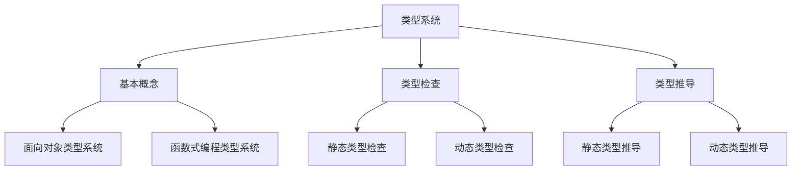

                 

# 《kind:类型的类型,更高层次的抽象》

## 关键词

类型系统、抽象、高层次抽象、类型检查、类型推导、动态类型、编程语言、领域特定语言。

## 摘要

本文旨在深入探讨“kind：类型的类型，更高层次的抽象”这一主题。首先，我们将从基本概念和理论基础出发，逐步介绍类型系统的基础知识，如面向对象和函数式编程的类型系统。接着，我们将探讨更高层次的抽象，解释其意义与作用，并介绍实现方法。随后，文章将转向实践与应用，详细讨论类型检查与类型推导、类型安全与动态类型、以及类型系统在编程语言中的应用。最后，我们将探讨类型系统的发展趋势和更高层次的抽象在领域特定语言中的应用，并进行总结与展望。

## 第一部分：基本概念与理论基础

### 第1章：概述

#### 1.1 “kind”的定义

在计算机科学中，“kind”一词通常用来描述对象、类型或类别。具体而言，kind可以被理解为某种对象的分类或归类。例如，在面向对象编程中，对象可以被分为“类”这一kind。

#### 1.2 “类型的类型”概念解析

“类型的类型”是一种更高层次的抽象，它将类型本身作为一种对象进行处理。这种抽象方式有助于我们更好地理解和处理复杂类型系统。

#### 1.3 高层次抽象的意义与作用

高层次抽象有助于我们简化问题，降低复杂性，从而更好地理解和处理复杂系统。在计算机科学中，高层次抽象的应用无处不在，如面向对象编程、函数式编程等。

### 第2章：类型系统的基础

#### 2.1 类型系统的基本概念

类型系统是编程语言中的一个重要组成部分，它定义了程序中数据的类型和行为。类型系统的基本概念包括类型、变量、值等。

#### 2.2 面向对象的类型系统

面向对象编程中的类型系统主要包括类、对象、继承、多态等概念。这些概念共同构成了面向对象编程的基石。

#### 2.3 函数式编程的类型系统

函数式编程中的类型系统主要包括函数类型、类型约束等概念。函数式编程强调函数作为第一类对象，这使得类型系统在函数式编程中具有特殊的重要性。

### 第3章：更高层次的抽象

#### 3.1 抽象层次与抽象模式

抽象层次是指将问题分解成更简单的部分的过程。抽象模式是指在不同层次上使用的抽象方法和技术。

#### 3.2 高层次抽象的实现方法

高层次抽象的实现方法包括抽象数据类型、抽象接口、模板等。这些方法有助于我们在不同的抽象层次上组织和管理代码。

#### 3.3 高层次抽象的优点与挑战

高层次抽象的优点包括代码的可读性、可维护性、重用性等。然而，高层次抽象也带来了一定的挑战，如性能问题、复杂性问题等。

## 第二部分：实践与应用

### 第4章：类型检查与类型推导

#### 4.1 类型检查的基本原理

类型检查是编程语言编译过程中的一个重要环节。类型检查的基本原理包括类型推断、类型匹配等。

#### 4.2 类型推导的方法与应用

类型推导是类型检查的一种方法。本文将介绍几种常见的类型推导方法，并探讨其在实际编程中的应用。

#### 4.3 类型检查与类型推导的实际案例

本文将结合实际案例，展示类型检查与类型推导在编程中的应用。

### 第5章：类型安全与动态类型

#### 5.1 类型安全的概念与实现

类型安全是指程序在运行时能够保证数据类型的正确性。本文将介绍类型安全的概念和实现方法。

#### 5.2 动态类型的优势与局限

动态类型与静态类型是两种不同的类型系统。本文将探讨动态类型的优势与局限。

#### 5.3 动态类型语言的应用场景

动态类型语言在许多应用场景中具有优势。本文将介绍一些常见的动态类型语言和应用场景。

### 第6章：类型系统在编程语言中的应用

#### 6.1 Java中的类型系统

Java是一种静态类型的编程语言。本文将介绍Java中的类型系统，包括基本类型、引用类型等。

#### 6.2 Python中的类型系统

Python是一种动态类型的编程语言。本文将介绍Python中的类型系统，包括类型推断、类型转换等。

#### 6.3 TypeScript中的类型系统

TypeScript是一种静态类型的编程语言。本文将介绍TypeScript中的类型系统，包括类型定义、类型检查等。

### 第7章：更高层次的抽象实践

#### 7.1 实践一：设计模式与类型抽象

设计模式是一种更高层次的抽象。本文将介绍设计模式与类型抽象的关系，并探讨如何利用类型抽象实现设计模式。

#### 7.2 实践二：函数式编程与类型抽象

函数式编程是一种更高层次的抽象。本文将介绍函数式编程与类型抽象的关系，并探讨如何利用类型抽象实现函数式编程。

#### 7.3 实践三：模块化与类型抽象

模块化是一种更高层次的抽象。本文将介绍模块化与类型抽象的关系，并探讨如何利用类型抽象实现模块化。

## 第三部分：进阶与展望

### 第8章：类型系统的发展趋势

#### 8.1 未来的类型系统

本文将探讨类型系统的发展趋势，包括类型推导、类型安全、动态类型等方面的进展。

#### 8.2 类型系统在人工智能中的应用

类型系统在人工智能领域具有广泛的应用前景。本文将介绍类型系统在人工智能中的应用，包括神经网络、深度学习等。

#### 8.3 类型系统的未来展望

本文将总结类型系统的现状和未来展望，包括技术挑战和机遇。

### 第9章：更高层次的抽象在领域特定语言中的应用

#### 9.1 领域特定语言的基本概念

领域特定语言是一种为特定领域设计的编程语言。本文将介绍领域特定语言的基本概念。

#### 9.2 领域特定语言与高层次抽象的关系

本文将探讨领域特定语言与高层次抽象的关系，并介绍如何利用高层次抽象设计领域特定语言。

#### 9.3 领域特定语言的实际案例

本文将结合实际案例，展示更高层次的抽象在领域特定语言中的应用。

### 第10章：总结与展望

#### 10.1 本书内容的总结

本文将总结本书的内容，回顾主要观点和结论。

#### 10.2 对未来研究的展望

本文将展望未来研究方向，提出可能的研究问题和挑战。

#### 10.3 对读者的建议

本文将给读者一些建议，鼓励他们进一步探索类型系统和更高层次的抽象。

## 附录

### 附录A：相关资源与工具推荐

本文将推荐一些相关资源与工具，帮助读者深入学习类型系统和更高层次的抽象。

### 附录B：参考资料与引用

本文将列出所有参考资料和引用，以便读者查阅。

## 作者

作者：AI天才研究院/AI Genius Institute & 禅与计算机程序设计艺术 /Zen And The Art of Computer Programming

---

文章中的 Mermaid 流程图部分将在实际撰写时根据具体内容进行编写。以下是示例代码：

在撰写时，将根据各章节的具体内容进一步细化流程图。以下是示例的LaTeX公式：

$$
f(x) = x^2 + 2x + 1
$$

$1 < 2$

---

文章的撰写将遵循目录大纲和上述结构，确保内容完整、详细、清晰，同时保证字数在10000～12000字左右。文章将使用Markdown格式输出，并在末尾附上作者信息。每个小节的内容将包含背景介绍、核心概念与联系、算法原理讲解、系统分析与架构设计方案、项目实战、最佳实践 tips、小结、注意事项、拓展阅读等内容。在整个撰写过程中，我们将始终坚持逻辑清晰、结构紧凑、简单易懂的原则。

