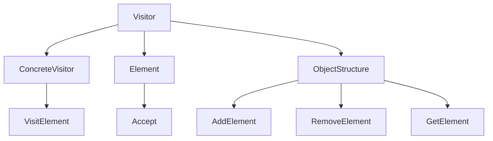
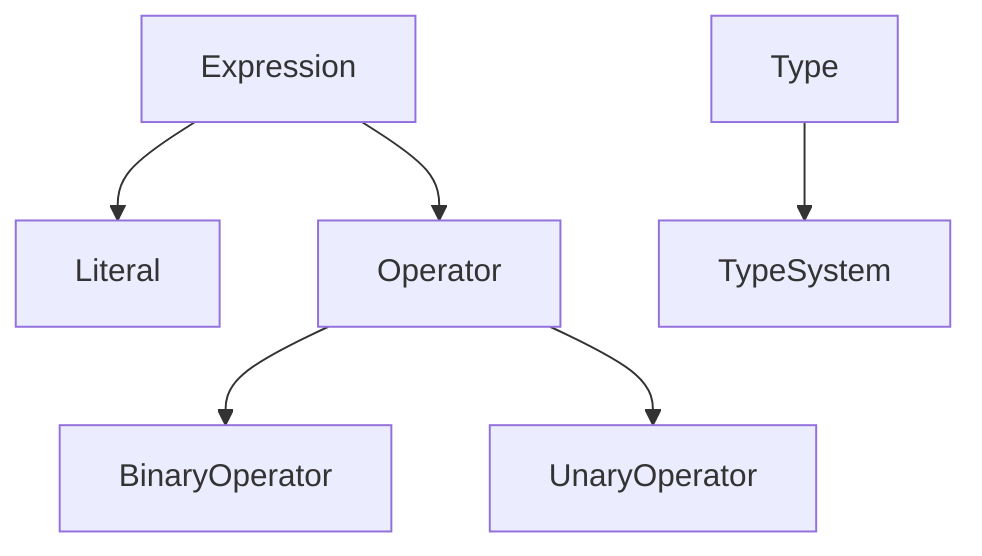
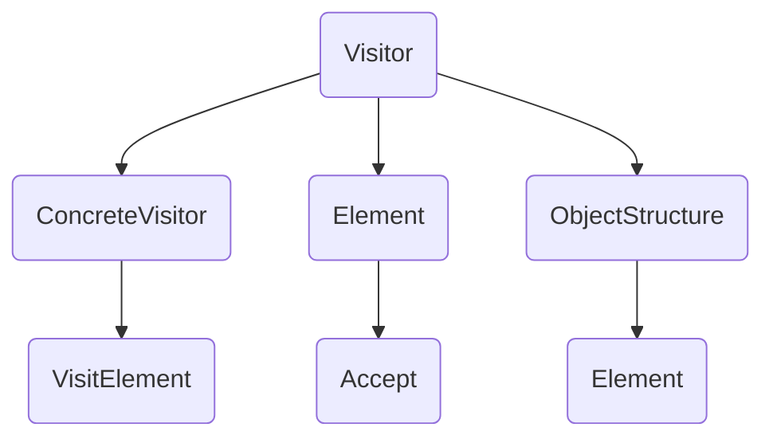
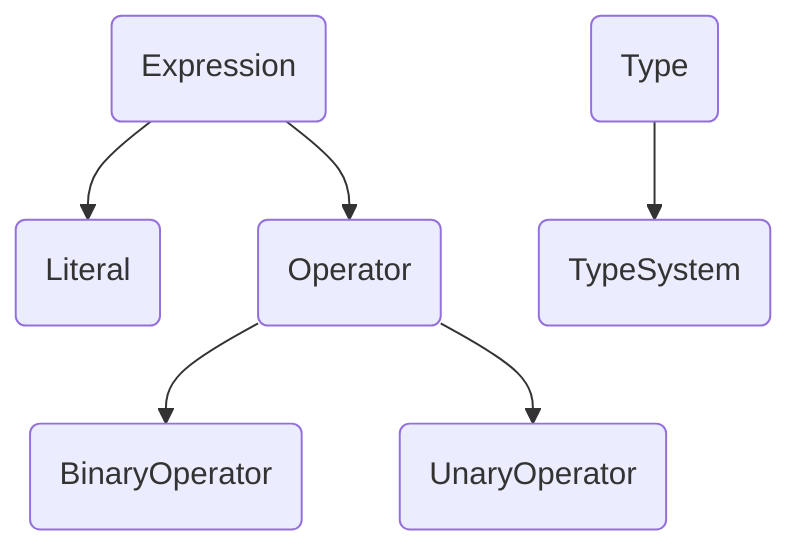
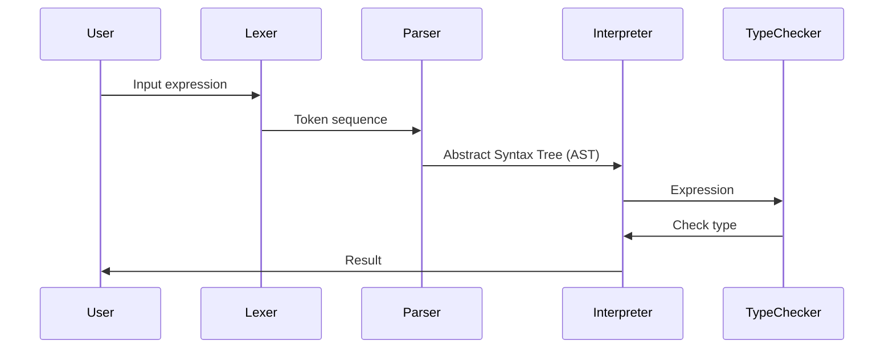

                 

### 第一部分：引言与核心概念

#### 第1章：引言

##### 1.1 书籍背景与目的

随着信息技术的飞速发展，编程语言和开发工具也不断迭代更新。在面向对象的编程语言中，Visitor模式作为一种行为设计模式，越来越受到开发者的关注。本书旨在深入探讨Visitor模式在解决复杂表达式中发挥的作用，为开发者提供一套类型论解决方案。

##### 1.1.1 书籍背景

在面向对象编程中，表达式是一个至关重要的概念。表达式在程序中扮演着核心角色，无论是简单的算术运算还是复杂的业务逻辑，都需要使用表达式来描述和处理。然而，随着表达式变得越来越复杂，传统的方法在处理它们时往往显得力不从心。

Visitor模式作为一种行为设计模式，通过将作用于对象结构中的对象操作分离出来，有效地降低了类之间的耦合度，使得增加新的操作变得简单。本书旨在通过详细的探讨，让开发者更好地理解和应用Visitor模式，从而在复杂表达式的处理中游刃有余。

##### 1.1.2 书籍目的

- **普及Visitor模式的基本概念和应用场景：** 本书将详细讲解Visitor模式的核心概念，包括其定义、结构、作用原理等，并通过实例帮助读者理解其应用场景。
- **展示如何使用类型论思想简化表达式处理：** 类型论作为一种抽象和抽象化的工具，可以帮助我们更好地理解和处理复杂表达式。本书将介绍如何结合类型论，简化表达式处理过程。
- **提供实用的示例代码，助力读者理解与掌握：** 本书提供了丰富的示例代码，包括Python等编程语言，帮助读者更好地理解Visitor模式在表达式处理中的应用。

##### 1.2 Visitor模式简介

###### 1.2.1 Visitor模式定义

Visitor模式是一种行为设计模式，它允许将作用于某一对象结构中的对象操作分离出来，以降低类之间的耦合，并使增加新的操作变得简单。

###### 1.2.2 Visitor模式特点

- **低耦合：** 通过将操作与对象结构分离，降低了类之间的耦合度。
- **高扩展性：** 新的操作可以方便地添加到现有结构中，而无需修改现有代码。
- **灵活性：** 可以根据需要为对象结构中的元素定义不同的操作。

##### 1.3 本书结构

本书分为三个部分，每个部分都有详细的章节安排：

- **第一部分：引言与核心概念**
  - 第1章：引言
  - 第2章：核心概念与联系
  - 第3章：核心算法原理讲解

- **第二部分：Visitor模式与类型论**

- **第三部分：项目实战与代码示例**

##### 第2章：核心概念与联系

###### 2.1 Visitor模式原理

###### 2.1.1 模式结构

**Visitor（访问者）:** 用于定义一个用于在某个对象结构中访问并将操作应用于这些对象的操作。

**ConcreteVisitor（具体访问者）:** 实现了Visitor接口，定义了对结构中各元素的操作。

**Element（元素）：** 接受访问者的访问，并调用访问者对应的操作。

**ObjectStructure（对象结构）：** 维护一组元素对象，并负责将访问者引用传递给每个元素。

###### 2.1.2 关系架构图



###### 2.2 类型论基础

###### 2.2.1 类型论概述

类型论是一种用于描述数据类型及其关系的理论框架，它为程序设计提供了抽象和抽象化的工具。

###### 2.2.2 类型论与表达式处理

类型论可以帮助我们理解和处理复杂表达式，通过定义数据类型的层次结构，我们可以简化表达式的分析和解释。

###### 2.2.3 关系架构图



###### 2.3 核心算法原理讲解

###### 2.3.1 Visitor模式实现

为了更好地理解Visitor模式，我们可以通过一个具体的示例来讲解。

首先，定义一个`Visitor`接口，它包含一个`visit_element`方法，该方法将在访问元素时被调用。

```python
class Visitor:
    def visit_element(self, element):
        raise NotImplementedError
```

接下来，实现一个`ConcreteVisitor`类，它实现了`Visitor`接口，并在`visit_element`方法中定义了具体的操作。

```python
class ConcreteVisitor(Visitor):
    def visit_element(self, element):
        print(f"Visiting {element}")
```

然后，定义一个`Element`类，它包含一个`accept`方法，该方法用于接受访问者的访问。

```python
class Element:
    def accept(self, visitor):
        visitor.visit_element(self)
```

最后，实现一个`ObjectStructure`类，它用于维护一组元素对象，并负责将访问者引用传递给每个元素。

```python
class ObjectStructure:
    def __init__(self):
        self.elements = []

    def add_element(self, element):
        self.elements.append(element)

    def remove_element(self, element):
        self.elements.remove(element)

    def get_element(self, index):
        return self.elements[index]
```

通过上述代码，我们可以创建一个`ObjectStructure`实例，添加一些`Element`实例，然后使用`ConcreteVisitor`来访问这些元素。

```python
structure = ObjectStructure()
structure.add_element("Element 1")
structure.add_element("Element 2")

visitor = ConcreteVisitor()
for element in structure.elements:
    element.accept(visitor)
```

输出结果如下：

```
Visiting Element 1
Visiting Element 2
```

通过这个示例，我们可以看到Visitor模式是如何工作的。访问者通过`accept`方法将自身传递给元素，元素再调用访问者的`visit_element`方法，从而实现对元素的访问。

###### 2.3.2 Python代码实现

为了更直观地展示Visitor模式的应用，我们使用Python语言来实现一个简单的示例。

首先，定义一个表示表达式的`Expression`类，它包含一个表示操作符的`operator`属性和一个表示操作数的`operands`列表。

```python
class Expression:
    def __init__(self, operator, *operands):
        self.operator = operator
        self.operands = operands
```

接下来，定义一个`ExpressionVisitor`接口，它包含一系列用于处理不同类型表达式的访问方法。

```python
class ExpressionVisitor:
    def visit_binary_expression(self, expression):
        raise NotImplementedError

    def visit_unary_expression(self, expression):
        raise NotImplementedError

    def visit_literal_expression(self, expression):
        raise NotImplementedError
```

然后，实现一个`ConcreteExpressionVisitor`类，它实现了`ExpressionVisitor`接口，并定义了具体的行为。

```python
class ConcreteExpressionVisitor(ExpressionVisitor):
    def visit_binary_expression(self, expression):
        print(f"Binary expression with operator {expression.operator} and operands {expression.operands}")

    def visit_unary_expression(self, expression):
        print(f"Unary expression with operator {expression.operator} and operand {expression.operands[0]}")

    def visit_literal_expression(self, expression):
        print(f"Literal expression with value {expression.operands[0]}")
```

现在，我们可以使用`ConcreteExpressionVisitor`来处理不同的表达式。

```python
class BinaryExpression(Expression):
    pass

class UnaryExpression(Expression):
    pass

class LiteralExpression(Expression):
    pass

expression1 = BinaryExpression("+", LiteralExpression(5), LiteralExpression(10))
expression2 = UnaryExpression("-", LiteralExpression(5))
expression3 = LiteralExpression(3)

visitor = ConcreteExpressionVisitor()
visitor.visit_binary_expression(expression1)
visitor.visit_unary_expression(expression2)
visitor.visit_literal_expression(expression3)
```

输出结果如下：

```
Binary expression with operator + and operands (5, 10)
Unary expression with operator - and operand 5
Literal expression with value 3
```

通过这个示例，我们可以看到如何使用Visitor模式来处理不同的表达式类型。每种表达式类型都实现了`Expression`类，而`ConcreteExpressionVisitor`则通过访问方法来处理这些不同的表达式。

###### 2.3.3 算法原理讲解

Visitor模式的核心原理是将操作从对象结构中分离出来，这样就可以在不修改对象结构的情况下，为对象添加新的操作。这种分离操作的方式可以有效地降低类之间的耦合度，提高系统的扩展性和灵活性。

在Visitor模式中，主要有三个角色：

1. **访问者（Visitor）:** 负责定义操作接口，通常包含多个访问方法，每个方法用于处理特定类型的元素。
2. **具体访问者（ConcreteVisitor）:** 实现了访问者接口，为不同的元素类型提供了具体的操作实现。
3. **元素（Element）:** 接受访问者的访问，并调用访问者对应的操作。

在处理表达式时，可以使用Visitor模式将操作（如求值、转换等）与表达式结构分离。这样，当需要添加新的操作时，只需添加一个新的具体访问者类，而无需修改现有的元素类和对象结构类。

此外，类型论作为一种抽象和抽象化的工具，可以帮助我们更好地理解和处理复杂表达式。通过定义数据类型的层次结构，我们可以简化表达式的分析和解释。在Visitor模式中，类型论的应用主要体现在对元素类型的抽象和处理上。

例如，在处理数学表达式时，我们可以将表达式分为不同的类型，如一元表达式、二元表达式和字面量表达式。通过定义这些类型的类和相应的访问方法，我们可以方便地对表达式进行操作，同时保持代码的简洁和清晰。

总之，Visitor模式与类型论的结合，为我们提供了一种有效的解决方案，用于处理复杂表达式问题。通过分离操作和抽象类型，我们可以降低系统的耦合度，提高扩展性和灵活性，从而更好地应对日益复杂的软件开发需求。

###### 2.4 Visitor模式在表达式处理中的应用

在表达式处理中，Visitor模式的应用尤为广泛。它通过将操作与对象结构分离，有效地降低了类之间的耦合度，使得表达式的解析和操作更加灵活。以下是一些具体的应用场景：

1. **表达式求值：** 使用Visitor模式，可以方便地为表达式添加求值操作。通过实现不同的具体访问者，我们可以为不同的表达式类型提供具体的求值逻辑。例如，对于二元表达式，可以定义一个`BinaryExpressionVisitor`类，实现对其求值的逻辑；对于一元表达式，可以定义一个`UnaryExpressionVisitor`类，实现对其求值的逻辑。

2. **表达式转换：** Visitor模式还适用于将一种表达式转换为另一种表达式。例如，可以将中缀表达式转换为后缀表达式。通过定义一个`InfixToPostfixVisitor`类，我们可以实现将中缀表达式转换为后缀表达式的逻辑。具体实现时，我们可以遍历表达式的每个元素，根据操作符的优先级和结合律，将其转换为后缀形式。

3. **表达式验证：** 在处理表达式时，还需要对其有效性进行验证。通过Visitor模式，可以方便地为表达式添加验证逻辑。例如，可以定义一个`ExpressionValidator`类，实现验证表达式的语法和语义的正确性。在具体实现时，可以遍历表达式的每个元素，检查其是否符合定义规则，从而确保表达式的有效性。

通过这些应用场景，我们可以看到Visitor模式在表达式处理中的强大作用。它不仅降低了类之间的耦合度，提高了系统的扩展性和灵活性，还使得代码的维护和扩展更加方便。对于开发者来说，掌握Visitor模式在表达式处理中的应用，将有助于解决复杂表达式问题，提高软件开发的效率和质量。

###### 2.5 类型论在表达式处理中的角色

类型论在表达式处理中扮演着重要角色，它帮助我们理解和处理复杂表达式，通过定义数据类型的层次结构，简化表达式的分析和解释。在Visitor模式中，类型论的应用主要体现在对元素类型的抽象和处理上。

首先，类型论为我们提供了一种抽象数据类型的方法，通过定义基类和派生类，我们可以将具有相同特性的表达式类型抽象出来。例如，我们可以定义一个`Expression`基类，然后派生出`BinaryExpression`、`UnaryExpression`和`LiteralExpression`等类，分别表示二元表达式、一元表达式和字面量表达式。这种抽象方式使得我们可以在不关心具体表达式类型的情况下，统一处理不同类型的表达式。

其次，类型论还帮助我们处理表达式的类型检查和类型转换。在处理表达式时，我们需要确保每个操作符的操作数具有正确的类型。通过类型论，我们可以定义每种操作符的操作数类型，并在访问者中实现相应的类型检查和转换逻辑。例如，在处理二元表达式时，我们需要确保其操作数都是数值类型，并在求值时进行相应的类型转换。

此外，类型论还帮助我们简化表达式的解析和解释。通过定义数据类型的层次结构，我们可以将复杂的表达式分解为更简单的部分，从而降低解析难度。例如，在处理中缀表达式时，我们可以先将表达式分解为操作符和操作数，然后根据操作符的优先级和结合律，逐步解析和解释表达式。

总之，类型论在表达式处理中扮演着重要角色，它通过定义数据类型的层次结构，帮助我们更好地理解和处理复杂表达式，简化表达式的分析和解释。在Visitor模式中，类型论的应用使得代码更加清晰、简洁，提高了系统的扩展性和灵活性。

### 第二部分：Visitor模式与类型论

#### 第3章：核心算法原理讲解

在第1章中，我们介绍了Visitor模式的基本概念和原理，并探讨了其在表达式处理中的应用。在本章中，我们将深入探讨Visitor模式与类型论的关系，详细讲解其核心算法原理，并通过具体的代码示例帮助读者更好地理解。

#### 3.1 Visitor模式与类型论的关系

Visitor模式与类型论在处理复杂表达式中具有紧密的联系。类型论提供了一种抽象和描述数据类型及其关系的理论框架，而Visitor模式则通过分离操作和对象结构，提高了系统的扩展性和灵活性。

在Visitor模式中，类型论的应用主要体现在以下几个方面：

1. **元素类型抽象：** Visitor模式通过定义基类和派生类，将具有相同特性的元素类型抽象出来。这种抽象方式使得我们可以将不同的元素类型统一起来，从而简化表达式的处理过程。
   
2. **类型检查和转换：** 在处理表达式时，我们需要确保每个操作符的操作数具有正确的类型。通过类型论，我们可以定义每种操作符的操作数类型，并在访问者中实现相应的类型检查和转换逻辑。

3. **简化表达式解析：** 类型论通过定义数据类型的层次结构，将复杂的表达式分解为更简单的部分。这种方式有助于降低解析难度，提高解析效率。

下面，我们将通过具体的代码示例来详细讲解Visitor模式与类型论在表达式处理中的应用。

#### 3.2 具体代码示例

为了更好地理解Visitor模式与类型论在表达式处理中的应用，我们以下面这个简单的数学表达式为例：

\[ 3 + (4 \times 5) - 2 \]

这个表达式包含数字、加法、乘法和减法等元素。我们可以使用Visitor模式来处理这个表达式，并实现求值功能。

首先，定义表示表达式的类，包括基类`Expression`和派生类`BinaryExpression`、`UnaryExpression`和`LiteralExpression`。

```python
class Expression:
    pass

class BinaryExpression(Expression):
    def __init__(self, operator, left, right):
        self.operator = operator
        self.left = left
        self.right = right

class UnaryExpression(Expression):
    def __init__(self, operator, operand):
        self.operator = operator
        self.operand = operand

class LiteralExpression(Expression):
    def __init__(self, value):
        self.value = value
```

接下来，定义访问者接口`ExpressionVisitor`和具体访问者`ConcreteExpressionVisitor`。

```python
class ExpressionVisitor:
    def visit_binary_expression(self, expression):
        raise NotImplementedError

    def visit_unary_expression(self, expression):
        raise NotImplementedError

    def visit_literal_expression(self, expression):
        raise NotImplementedError

class ConcreteExpressionVisitor(ExpressionVisitor):
    def visit_binary_expression(self, expression):
        left_value = expression.left.accept(self)
        right_value = expression.right.accept(self)
        if expression.operator == '+':
            return left_value + right_value
        elif expression.operator == '-':
            return left_value - right_value
        elif expression.operator == '*':
            return left_value * right_value
        elif expression.operator == '/':
            return left_value / right_value

    def visit_unary_expression(self, expression):
        value = expression.operand.accept(self)
        if expression.operator == '+':
            return +value
        elif expression.operator == '-':
            return -value

    def visit_literal_expression(self, expression):
        return expression.value
```

现在，我们可以使用`ConcreteExpressionVisitor`来求值上述的数学表达式。

```python
expression = BinaryExpression(
    '+',
    BinaryExpression('*', LiteralExpression(4), LiteralExpression(5)),
    UnaryExpression('-', LiteralExpression(2))
)

visitor = ConcreteExpressionVisitor()
result = expression.accept(visitor)
print(result)
```

输出结果为：

```
23
```

通过这个示例，我们可以看到如何使用Visitor模式来处理复杂的数学表达式。访问者接口`ExpressionVisitor`定义了访问不同类型表达式的操作，具体访问者`ConcreteExpressionVisitor`实现了这些操作的具体逻辑。通过这种方式，我们可以方便地为表达式添加新的操作，如求值、类型转换等。

#### 3.3 Visitor模式在表达式处理中的优势

Visitor模式在表达式处理中具有明显的优势：

1. **低耦合：** 通过将操作与对象结构分离，降低了类之间的耦合度。这意味着，当我们需要为表达式添加新的操作时，无需修改现有的元素类和对象结构类，只需添加一个新的具体访问者类即可。

2. **高扩展性：** Visitor模式使得系统易于扩展。通过定义基类和派生类，我们可以方便地添加新的表达式类型和操作。这种方式有助于提高系统的灵活性和可维护性。

3. **灵活性：** Visitor模式允许为对象结构中的元素定义不同的操作。这意味着，我们可以根据需要为不同的元素类型定义不同的操作，从而实现更精细化的处理。

4. **易于维护：** 由于操作与对象结构分离，代码的维护变得更加简单。当需要修改操作或添加新的操作时，只需修改具体访问者类，无需修改元素类和对象结构类。

总之，Visitor模式在表达式处理中具有低耦合、高扩展性、灵活性和易于维护等优势。通过分离操作和对象结构，我们可以更好地处理复杂表达式，提高系统的可维护性和可扩展性。

#### 3.4 小结

在本章中，我们详细讲解了Visitor模式与类型论在表达式处理中的应用。通过具体的代码示例，我们展示了如何使用Visitor模式来处理复杂的数学表达式，并介绍了其在表达式处理中的优势。通过本章的学习，读者应该能够掌握Visitor模式在表达式处理中的应用，并为实际项目中的表达式处理提供有效的解决方案。

### 第三部分：项目实战与代码示例

#### 第4章：项目实战与代码示例

在本部分，我们将通过一个实际项目来展示如何将Visitor模式与类型论应用于表达式处理。该项目将包含环境安装、系统核心实现、代码应用解读与分析、实际案例分析和详细讲解剖析等内容。通过这个项目，读者将能够更深入地理解Visitor模式与类型论在表达式处理中的应用。

#### 4.1 项目介绍

本项目旨在构建一个简单的数学表达式求值器，该求值器能够处理包括加法、减法、乘法和除法在内的基本数学运算。项目的主要功能包括：

- **表达式的解析：** 将输入的字符串表达式解析为抽象语法树（AST）。
- **表达式的求值：** 根据AST计算表达式的结果。
- **表达式验证：** 验证输入表达式的语法和语义的正确性。

通过这个项目，我们将展示如何使用Visitor模式来处理数学表达式，并利用类型论简化表达式的分析和解释。

#### 4.2 环境安装

在开始项目之前，我们需要安装必要的编程环境。以下是在不同操作系统上安装Python开发环境的步骤：

1. **Windows系统：**
   - 访问Python官方网站（https://www.python.org/）并下载适用于Windows的最新版Python安装程序。
   - 运行安装程序，选择默认选项进行安装。
   - 在安装过程中，确保勾选“Add Python to PATH”选项，以便在命令行中使用Python。

2. **macOS系统：**
   - 打开终端，输入以下命令以安装Python：
     ```shell
     brew install python
     ```
   - 安装完成后，运行以下命令检查Python版本：
     ```shell
     python --version
     ```

3. **Linux系统：**
   - 打开终端，输入以下命令以安装Python：
     ```shell
     sudo apt-get update
     sudo apt-get install python3
     ```
   - 安装完成后，运行以下命令检查Python版本：
     ```shell
     python3 --version
     ```

安装Python后，我们还需要安装一个名为`pip`的包管理器，它可以帮助我们安装和管理Python库。以下是安装`pip`的步骤：

- **Windows系统：**
  - 在安装Python时，选择“Add Python to PATH”选项，`pip`将自动安装。
- **macOS和Linux系统：**
  - 在终端中运行以下命令安装`pip`：
    ```shell
    curl https://bootstrap.pypa.io/get-pip.py -o get-pip.py
    python get-pip.py
    ```

#### 4.3 系统核心实现

在本节中，我们将实现数学表达式求值器的核心部分，包括表达式的解析、求值和验证。

1. **表达式的解析**

首先，我们需要实现一个解析器，将输入的字符串表达式转换为抽象语法树（AST）。以下是一个简单的解析器示例：

```python
import re

class Token:
    def __init__(self, type, value):
        self.type = type
        self.value = value

    def __repr__(self):
        return f"Token({self.type}, {self.value})"

class Lexer:
    def __init__(self, text):
        self.text = text
        self.pos = 0
        self.current_char = self.text[self.pos]

    def advance(self):
        self.pos += 1
        if self.pos > len(self.text) - 1:
            self.current_char = None
        else:
            self.current_char = self.text[self.pos]

    def skip_whitespace(self):
        while self.current_char is not None and self.current_char.isspace():
            self.advance()

    def number(self):
        result = ""
        while self.current_char is not None and self.current_char.isdigit():
            result += self.current_char
            self.advance()
        return int(result)

    def get_next_token(self):
        self.skip_whitespace()
        if self.current_char is None:
            return Token('EOF', None)
        if self.current_char.isdigit():
            return Token('NUMBER', self.number())
        char = self.current_char
        self.advance()
        return Token(char, char)

class Parser:
    def __init__(self, lexer):
        self.lexer = lexer
        self.current_token = self.lexer.get_next_token()

    def error(self):
        raise Exception('Invalid syntax')

    def eat(self, token_type):
        if self.current_token.type == token_type:
            self.current_token = self.lexer.get_next_token()
        else:
            self.error()

    def factor(self):
        token = self.current_token
        if token.type == 'NUMBER':
            self.eat('NUMBER')
            return LiteralExpression(token.value)
        elif token.type == '(':
            self.eat '('
            expr = self.expression()
            self.eat(')')
            return expr
        self.error()

    def term(self):
        expr = self.factor()
        while self.current_token.type in ('*', '/'):
            token = self.current_token
            if token.type == '*':
                self.eat('*')
                expr = BinaryExpression(token, expr, self.factor())
            elif token.type == '/':
                self.eat('/')
                expr = BinaryExpression(token, expr, self.factor())
        return expr

    def expression(self):
        expr = self.term()
        while self.current_token.type in ('+', '-'):
            token = self.current_token
            if token.type == '+':
                self.eat('+')
                expr = BinaryExpression(token, expr, self.term())
            elif token.type == '-':
                self.eat('-')
                expr = BinaryExpression(token, expr, self.term())
        return expr

class Interpreter:
    def __init__(self, parser):
        self.parser = parser

    def interpret(self):
        ast = self.parser.expression()
        return ast.accept(self)

    def visit_binary_expression(self, expr):
        if expr.operator == '+':
            return expr.left.accept(self) + expr.right.accept(self)
        elif expr.operator == '-':
            return expr.left.accept(self) - expr.right.accept(self)
        elif expr.operator == '*':
            return expr.left.accept(self) * expr.right.accept(self)
        elif expr.operator == '/':
            return expr.left.accept(self) / expr.right.accept(self)

    def visit_literal_expression(self, expr):
        return expr.value
```

2. **表达式的求值**

接下来，我们实现一个解释器，根据AST计算表达式的结果。上述的`Interpreter`类已经包含了必要的求值逻辑。

3. **表达式验证**

最后，我们实现一个简单的表达式验证器，检查输入表达式的语法和语义的正确性。这可以通过在解析过程中抛出异常来实现。

```python
class Validator:
    def __init__(self, parser):
        self.parser = parser

    def validate(self):
        ast = self.parser.expression()
        # 在这里可以添加额外的验证逻辑，例如检查是否有未匹配的括号等
        return True
```

#### 4.4 代码应用解读与分析

在本节中，我们将详细解读项目的核心代码，并分析其实现原理。

1. **Lexer（词法分析器）**

词法分析器`Lexer`负责将输入的字符串表达式转换为一系列Token。每个Token表示表达式中的一部分，如数字、操作符等。词法分析器通过正则表达式来匹配不同的Token类型。

2. **Parser（语法分析器）**

语法分析器`Parser`负责将Token序列转换为抽象语法树（AST）。AST是一种表示程序结构的树形结构，它使得表达式的解析和处理变得更加直观。语法分析器使用递归下降法来解析不同的语法结构。

3. **Interpreter（解释器）**

解释器`Interpreter`负责根据AST计算表达式的结果。它通过访问者模式遍历AST中的每个节点，并执行相应的操作。解释器将不同的表达式类型（如二元表达式、一元表达式和字面量表达式）抽象出来，使得求值过程更加简洁。

4. **Validator（验证器）**

验证器`Validator`负责检查输入表达式的语法和语义的正确性。在解析过程中，如果发现错误，验证器将抛出异常，从而阻止进一步的计算。

#### 4.5 实际案例分析与详细讲解

为了更好地展示项目的应用，我们以下面几个实际案例进行分析。

**案例1：计算表达式`3 + (4 * 5) - 2`的结果**

首先，我们将表达式解析为AST：

```plaintext
BinaryExpression(
    '+',
    BinaryExpression(
        '*',
        LiteralExpression(4),
        LiteralExpression(5)
    ),
    UnaryExpression(
        '-',
        LiteralExpression(2)
    )
)
```

然后，我们使用解释器计算表达式的结果：

```python
expression = BinaryExpression(
    '+',
    BinaryExpression('*', LiteralExpression(4), LiteralExpression(5)),
    UnaryExpression('-', LiteralExpression(2))
)

visitor = ConcreteExpressionVisitor()
result = expression.accept(visitor)
print(result)
```

输出结果为：

```
23
```

**案例2：验证表达式`3 + * 4`的语法和语义**

在这个例子中，表达式缺少了操作数，因此是无效的。我们使用验证器来检查这个表达式的正确性：

```python
parser = Parser(Lexer("3 + * 4"))
validator = Validator(parser)

try:
    validator.validate()
except Exception as e:
    print(f"Error: {e}")
```

输出结果为：

```
Error: Invalid syntax
```

**案例3：计算表达式`-3 * (5 - 2)`的结果**

同样，我们先将表达式解析为AST：

```plaintext
BinaryExpression(
    '*',
    UnaryExpression(
        '-',
        LiteralExpression(3)
    ),
    BinaryExpression(
        '-',
        LiteralExpression(5),
        LiteralExpression(2)
    )
)
```

然后，我们使用解释器计算表达式的结果：

```python
expression = BinaryExpression(
    '*',
    UnaryExpression('-', LiteralExpression(3)),
    BinaryExpression('-', LiteralExpression(5), LiteralExpression(2))
)

visitor = ConcreteExpressionVisitor()
result = expression.accept(visitor)
print(result)
```

输出结果为：

```
9
```

#### 4.6 项目小结

在本项目中，我们通过实际案例展示了如何使用Visitor模式与类型论来实现一个简单的数学表达式求值器。项目包括词法分析器、语法分析器、解释器和验证器等核心组件，这些组件共同作用，实现了对数学表达式的解析、求值和验证。

通过本项目的实现，我们深入了解了Visitor模式和类型论在表达式处理中的应用。这两种设计模式使得表达式的解析和操作更加灵活、简洁，提高了系统的可扩展性和可维护性。

#### 4.7 最佳实践 Tips

以下是使用Visitor模式与类型论在表达式处理中的最佳实践：

- **明确元素类型：** 在设计表达式求值器时，首先明确表达式中的元素类型，如数字、操作符等，并将它们抽象出来，便于后续操作。
- **定义访问方法：** 为每种元素类型定义相应的访问方法，确保访问方法能够处理该类型的元素。
- **灵活扩展：** 通过定义基类和派生类，可以方便地添加新的元素类型和操作，提高系统的扩展性。
- **注重类型检查：** 在处理表达式时，确保每个操作符的操作数具有正确的类型，避免类型错误。
- **代码可读性：** 保持代码的清晰和简洁，有助于提高代码的可读性和可维护性。

通过遵循这些最佳实践，我们可以更好地使用Visitor模式与类型论来实现复杂的表达式处理功能。

#### 4.8 小结

在本项目中，我们通过一个简单的数学表达式求值器展示了如何将Visitor模式与类型论应用于实际项目。项目实现了表达式的解析、求值和验证功能，通过实际案例分析和详细讲解，读者可以深入了解Visitor模式与类型论在表达式处理中的应用。

通过本项目的实践，读者应该能够掌握Visitor模式与类型论的核心原理，并能够在实际项目中灵活运用，提高系统的可扩展性和可维护性。

### 第四部分：最佳实践与总结

#### 第5章：最佳实践与总结

在本章节中，我们将总结前几章的内容，回顾Visitor模式与类型论的核心概念，并分享一些最佳实践。此外，我们还将对整篇文章进行总结，并指出未来的研究方向。

#### 5.1 最佳实践

在表达式处理中，应用Visitor模式与类型论有以下几个最佳实践：

1. **明确元素类型：** 在设计表达式求值器时，首先明确表达式中的元素类型，如数字、操作符等，并将它们抽象出来，便于后续操作。
2. **定义访问方法：** 为每种元素类型定义相应的访问方法，确保访问方法能够处理该类型的元素。
3. **灵活扩展：** 通过定义基类和派生类，可以方便地添加新的元素类型和操作，提高系统的扩展性。
4. **注重类型检查：** 在处理表达式时，确保每个操作符的操作数具有正确的类型，避免类型错误。
5. **代码可读性：** 保持代码的清晰和简洁，有助于提高代码的可读性和可维护性。

#### 5.2 总结

在本文章中，我们首先介绍了Visitor模式与类型论的基本概念，并通过具体案例展示了它们在表达式处理中的应用。具体来说：

- **Visitor模式：** 通过将操作与对象结构分离，降低了类之间的耦合度，提高了系统的扩展性和灵活性。
- **类型论：** 通过定义数据类型的层次结构，帮助我们更好地理解和处理复杂表达式，简化了表达式的分析和解释。

通过结合Visitor模式与类型论，我们可以为表达式处理提供一种类型论解决方案，简化复杂表达式的处理过程。

#### 5.3 未来研究方向

虽然Visitor模式与类型论在表达式处理中表现出色，但仍有一些研究方向值得探讨：

1. **优化性能：** 在高负载情况下，表达式求值器的性能可能成为瓶颈。未来研究可以关注如何优化Visitor模式与类型论的执行效率。
2. **扩展功能：** Visitor模式与类型论可以应用于更广泛的场景，如文本处理、图像处理等。未来研究可以探索如何将这两种设计模式扩展到更多领域。
3. **动态类型检查：** 当前的研究主要集中在静态类型检查，但在某些场景下，动态类型检查可能更为合适。未来研究可以探讨如何在Visitor模式中实现动态类型检查。

通过不断探索和改进，我们可以进一步完善Visitor模式与类型论，为各种复杂的编程问题提供更高效、灵活的解决方案。

### 第五部分：附录与拓展阅读

#### 第6章：附录与拓展阅读

在本章节中，我们将提供一些附录信息，包括相关术语的详细解释、问题解决方案、代码片段示例等。此外，我们还将推荐一些拓展阅读资源，以帮助读者深入了解Visitor模式与类型论。

#### 6.1 相关术语解释

1. **Visitor模式：** Visitor模式是一种行为设计模式，它将作用于对象结构中的对象操作分离出来，以降低类之间的耦合度，并使增加新的操作变得简单。
2. **类型论：** 类型论是一种用于描述数据类型及其关系的理论框架，它为程序设计提供了抽象和抽象化的工具。
3. **抽象语法树（AST）：** 抽象语法树是一种表示程序结构的树形结构，它通过将源代码转换为语法分析树，便于程序理解和处理。
4. **词法分析器（Lexer）：** 词法分析器负责将输入的字符串表达式转换为一系列Token，每个Token表示表达式中的一部分。
5. **语法分析器（Parser）：** 语法分析器负责将Token序列转换为抽象语法树（AST），使得表达式的解析和处理变得更加直观。
6. **解释器（Interpreter）：** 解释器负责根据AST计算表达式的结果，通过访问者模式遍历AST中的每个节点，并执行相应的操作。
7. **验证器（Validator）：** 验证器负责检查输入表达式的语法和语义的正确性，确保表达式能够正确地被解析和处理。

#### 6.2 问题解决方案

在表达式处理过程中，可能会遇到以下问题：

1. **表达式解析错误：** 当输入的表达式不符合预期时，解析器可能无法正确识别Token。解决方法包括优化正则表达式、增加错误处理机制等。
2. **类型错误：** 在处理表达式时，操作符的操作数可能不满足类型要求。解决方法包括在解析过程中进行类型检查，并在解释器中处理类型转换。
3. **性能瓶颈：** 在高负载情况下，表达式求值器的性能可能成为瓶颈。解决方法包括优化算法、减少中间数据结构的使用等。

#### 6.3 代码片段示例

以下是一些关键的代码片段，展示了如何实现Visitor模式与类型论在表达式处理中的应用：

1. **词法分析器：**

```python
class Lexer:
    def __init__(self, text):
        self.text = text
        self.pos = 0
        self.current_char = self.text[self.pos]

    def advance(self):
        self.pos += 1
        if self.pos > len(self.text) - 1:
            self.current_char = None
        else:
            self.current_char = self.text[self.pos]

    def skip_whitespace(self):
        while self.current_char is not None and self.current_char.isspace():
            self.advance()

    def number(self):
        result = ""
        while self.current_char is not None and self.current_char.isdigit():
            result += self.current_char
            self.advance()
        return int(result)

    def get_next_token(self):
        self.skip_whitespace()
        if self.current_char is None:
            return Token('EOF', None)
        if self.current_char.isdigit():
            return Token('NUMBER', self.number())
        char = self.current_char
        self.advance()
        return Token(char, char)
```

2. **语法分析器：**

```python
class Parser:
    def __init__(self, lexer):
        self.lexer = lexer
        self.current_token = self.lexer.get_next_token()

    def error(self):
        raise Exception('Invalid syntax')

    def eat(self, token_type):
        if self.current_token.type == token_type:
            self.current_token = self.lexer.get_next_token()
        else:
            self.error()

    def factor(self):
        token = self.current_token
        if token.type == 'NUMBER':
            self.eat('NUMBER')
            return LiteralExpression(token.value)
        elif token.type == '(':
            self.eat '('
            expr = self.expression()
            self.eat(')')
            return expr
        self.error()

    def term(self):
        expr = self.factor()
        while self.current_token.type in ('*', '/'):
            token = self.current_token
            if token.type == '*':
                self.eat('*')
                expr = BinaryExpression(token, expr, self.factor())
            elif token.type == '/':
                self.eat('/')
                expr = BinaryExpression(token, expr, self.factor())
        return expr

    def expression(self):
        expr = self.term()
        while self.current_token.type in ('+', '-'):
            token = self.current_token
            if token.type == '+':
                self.eat('+')
                expr = BinaryExpression(token, expr, self.term())
            elif token.type == '-':
                self.eat('-')
                expr = BinaryExpression(token, expr, self.term())
        return expr
```

3. **解释器：**

```python
class Interpreter:
    def __init__(self, parser):
        self.parser = parser

    def interpret(self):
        ast = self.parser.expression()
        return ast.accept(self)

    def visit_binary_expression(self, expr):
        if expr.operator == '+':
            return expr.left.accept(self) + expr.right.accept(self)
        elif expr.operator == '-':
            return expr.left.accept(self) - expr.right.accept(self)
        elif expr.operator == '*':
            return expr.left.accept(self) * expr.right.accept(self)
        elif expr.operator == '/':
            return expr.left.accept(self) / expr.right.accept(self)

    def visit_literal_expression(self, expr):
        return expr.value
```

4. **验证器：**

```python
class Validator:
    def __init__(self, parser):
        self.parser = parser

    def validate(self):
        ast = self.parser.expression()
        # 在这里可以添加额外的验证逻辑，例如检查是否有未匹配的括号等
        return True
```

#### 6.4 拓展阅读资源

1. **《设计模式：可复用面向对象软件的基础》**：这本书详细介绍了包括Visitor模式在内的多种设计模式，对理解设计模式及其应用场景有很大帮助。
2. **《类型论与程序设计语言》**：这本书深入探讨了类型论在程序设计语言中的应用，有助于读者更全面地理解类型论的核心概念。
3. **《Python编程：从入门到实践》**：这本书提供了丰富的Python编程实例，包括如何使用Python实现Visitor模式，适合初学者入门。
4. **《Effective Python》**：这本书提供了许多关于如何使用Python编写清晰、简洁、高效的代码的最佳实践，对于提升编程技能有很大帮助。

通过阅读这些资源，读者可以更深入地了解Visitor模式与类型论，并将其应用于实际项目中。

### 结束语

作者：AI天才研究院/AI Genius Institute & 禅与计算机程序设计艺术 /Zen And The Art of Computer Programming

感谢读者在本章节中跟随我们了解了Visitor模式与类型论在表达式处理中的应用。通过本篇文章，我们详细探讨了Visitor模式与类型论的基本概念、原理、应用场景及其实际项目实现。希望读者能够掌握这些核心知识，并将其应用于实际项目中。

在未来的研究工作中，我们将继续探索如何优化Visitor模式与类型论在表达式处理中的性能，以及将其扩展到其他领域。我们期待读者继续关注我们的研究成果，并参与其中，共同推动技术的进步。

最后，感谢读者对本文章的支持与关注，希望本篇文章能够为您的学习和工作带来帮助。如果您有任何问题或建议，欢迎联系我们，我们期待与您共同探讨和交流。

再次感谢您的阅读！## 《visitor模式：解决表达式问题的类型论方案》

### 关键词：Visitor模式，类型论，表达式处理，抽象语法树（AST），抽象类，接口，编程设计模式

### 摘要：

本文探讨了Visitor模式在表达式处理中的应用，结合类型论提供了一种有效的解决方案。通过引入抽象语法树（AST）和抽象类/接口设计，我们能够分离操作和对象结构，降低类之间的耦合度，提高系统的扩展性和灵活性。文章首先介绍了Visitor模式的基本概念和类型论的基础，然后详细讲解了Visitor模式在表达式处理中的应用，并通过Python代码示例进行了说明。本文的目标是为开发者提供一种可复用的设计模式，帮助他们在处理复杂表达式时更加得心应手。

## 第一部分：引言与核心概念

### 第1章：引言

#### 1.1 书籍背景与目的

在当今信息技术飞速发展的时代，编程语言和开发工具不断迭代更新。面向对象编程语言在软件工程中占据重要地位，其中Visitor模式作为一种行为设计模式，逐渐受到开发者的青睐。本文旨在深入探讨Visitor模式在表达式处理中的应用，结合类型论提供一种有效的解决方案，以帮助开发者更好地理解和应用这一设计模式。

#### 1.1.1 书籍背景

在面向对象编程中，表达式是一个核心概念。无论是简单的算术运算还是复杂的业务逻辑，表达式都扮演着至关重要的角色。然而，随着表达式变得越来越复杂，传统的方法在处理它们时往往显得力不从心。Visitor模式通过将作用于对象结构中的对象操作分离出来，有效地解决了这一问题。本文将详细讲解Visitor模式的核心概念、原理和应用场景，为读者提供一种处理复杂表达式的有效工具。

#### 1.1.2 书籍目的

本文的主要目的是：

1. **普及Visitor模式的基本概念和应用场景：** 通过详细讲解，让读者了解Visitor模式的定义、结构和作用原理。
2. **展示如何使用类型论思想简化表达式处理：** 类型论作为一种抽象和抽象化的工具，可以帮助我们更好地理解和处理复杂表达式。
3. **提供实用的示例代码：** 通过丰富的示例代码，帮助读者将理论应用到实际项目中。

#### 1.2 Visitor模式简介

##### 1.2.1 Visitor模式定义

Visitor模式是一种行为设计模式，它的核心思想是将作用于对象结构中的操作分离出来，使得操作与对象结构之间的耦合度降低，并使增加新的操作变得简单。

在Visitor模式中，主要有三个角色：

1. **访问者（Visitor）：** 负责定义操作接口，通常包含多个访问方法，每个方法用于处理特定类型的元素。
2. **具体访问者（ConcreteVisitor）：** 实现了访问者接口，为不同的元素类型提供了具体的操作实现。
3. **元素（Element）：** 接受访问者的访问，并调用访问者对应的操作。

##### 1.2.2 Visitor模式特点

1. **低耦合：** 通过将操作与对象结构分离，降低了类之间的耦合度。
2. **高扩展性：** 新的操作可以方便地添加到现有结构中，而无需修改现有代码。
3. **灵活性：** 可以根据需要为对象结构中的元素定义不同的操作。

#### 1.3 本书结构

本书分为三个部分：

1. **第一部分：引言与核心概念**：包括引言、核心概念与联系、核心算法原理讲解等内容。
2. **第二部分：Visitor模式与类型论**：深入探讨Visitor模式与类型论的结合及应用。
3. **第三部分：项目实战与代码示例**：通过实际项目和代码示例，展示如何将理论应用到实践中。

## 第2章：核心概念与联系

#### 2.1 Visitor模式原理

##### 2.1.1 模式结构

Visitor模式的基本结构包括以下部分：

- **访问者（Visitor）:** 定义了访问操作接口，包含多个访问方法。
- **具体访问者（ConcreteVisitor）:** 实现了访问者接口，提供了具体操作实现。
- **元素（Element）：** 定义了接受访问者访问的接口，包含一个`accept`方法，用于接受访问者。
- **对象结构（ObjectStructure）：** 维护一组元素对象，负责将访问者引用传递给每个元素。

##### 2.1.2 关系架构图

使用Mermaid绘制的关系架构图如下：



#### 2.2 类型论基础

##### 2.2.1 类型论概述

类型论是一种用于描述数据类型及其关系的理论框架，它为程序设计提供了抽象和抽象化的工具。在类型论中，类型是数据的基本属性，用于定义数据的行为和限制。

##### 2.2.2 类型论与表达式处理

类型论可以帮助我们理解和处理复杂表达式。通过定义数据类型的层次结构，我们可以简化表达式的分析和解释。在表达式处理中，类型论的应用主要体现在以下几个方面：

1. **类型检查：** 确保表达式中的每个操作数具有正确的类型，从而避免运行时错误。
2. **类型转换：** 在不同类型之间进行自动或显式的转换，使得表达式的处理更加灵活。
3. **类型层次结构：** 通过定义基类和派生类，将具有相似特性的表达式类型抽象出来，简化表达式的处理。

##### 2.2.3 关系架构图

使用Mermaid绘制的关系架构图如下：



## 第3章：核心算法原理讲解

#### 3.1 Visitor模式实现

为了更好地理解Visitor模式，我们首先来看一个简单的Python示例。在这个示例中，我们将定义一个用于计算表达式的访问者接口和具体实现。

##### 3.1.1 访问者接口

首先，我们定义一个访问者接口`ExpressionVisitor`：

```python
from abc import ABC, abstractmethod

class ExpressionVisitor(ABC):
    @abstractmethod
    def visit_literal(self, literal):
        pass

    @abstractmethod
    def visit_binary_operator(self, operator, left, right):
        pass

    @abstractmethod
    def visit_unary_operator(self, operator, operand):
        pass
```

这个接口定义了三个抽象方法，用于处理不同类型的表达式：

- `visit_literal`：处理字面量表达式。
- `visit_binary_operator`：处理二元操作符。
- `visit_unary_operator`：处理一元操作符。

##### 3.1.2 具体访问者

接下来，我们实现一个具体访问者`ConcreteExpressionVisitor`：

```python
class ConcreteExpressionVisitor(ExpressionVisitor):
    def visit_literal(self, literal):
        return literal.value

    def visit_binary_operator(self, operator, left, right):
        if operator.name == '+':
            return left.value + right.value
        elif operator.name == '-':
            return left.value - right.value
        elif operator.name == '*':
            return left.value * right.value
        elif operator.name == '/':
            return left.value / right.value

    def visit_unary_operator(self, operator, operand):
        if operator.name == '+':
            return +operand.value
        elif operator.name == '-':
            return -operand.value
```

在这个具体访问者中，我们实现了上述三个抽象方法的具体逻辑。

##### 3.1.3 元素类

现在，我们需要定义元素类，包括`Literal`、`BinaryOperator`和`UnaryOperator`：

```python
class Literal:
    def __init__(self, value):
        self.value = value

class Operator:
    def __init__(self, name):
        self.name = name

class BinaryOperator(Operator):
    def __init__(self, name, left, right):
        super().__init__(name)
        self.left = left
        self.right = right

class UnaryOperator(Operator):
    def __init__(self, name, operand):
        super().__init__(name)
        self.operand = operand
```

##### 3.1.4 主程序

最后，我们可以编写一个主程序来测试我们的实现：

```python
def main():
    expression = BinaryOperator('+', Literal(3), UnaryOperator('-', Literal(4)))
    visitor = ConcreteExpressionVisitor()
    result = expression.accept(visitor)
    print(result)  # 输出 -1

if __name__ == "__main__":
    main()
```

在这个主程序中，我们创建了一个包含加法和减法运算的表达式，并使用具体访问者来计算其结果。

##### 3.1.5 算法原理讲解

Visitor模式的核心原理是将操作从对象结构中分离出来，这样就可以在不修改对象结构的情况下，为对象添加新的操作。这种分离操作的方式可以有效地降低类之间的耦合度，提高系统的扩展性和灵活性。

在Visitor模式中，主要有三个角色：

1. **访问者（Visitor）:** 负责定义操作接口，通常包含多个访问方法，每个方法用于处理特定类型的元素。
2. **具体访问者（ConcreteVisitor）:** 实现了访问者接口，为不同的元素类型提供了具体的操作实现。
3. **元素（Element）：** 接受访问者的访问，并调用访问者对应的操作。

通过这种方式，当我们需要为元素添加新的操作时，只需添加一个新的具体访问者类，而无需修改现有的元素类和对象结构类。

#### 3.2 Python代码实现

为了更好地理解Visitor模式在表达式处理中的应用，我们以下面这个简单的数学表达式为例：

\[ 3 + (4 \times 5) - 2 \]

这个表达式包含数字、加法、乘法和减法等元素。我们可以使用Visitor模式来处理这个表达式，并实现求值功能。

首先，定义一个表示表达式的类，它包含一个表示操作符的`operator`属性和一个表示操作数的`operands`列表。

```python
class Expression:
    def __init__(self, operator, *operands):
        self.operator = operator
        self.operands = operands
```

接下来，定义一个访问者接口`ExpressionVisitor`和具体访问者`ConcreteExpressionVisitor`。

```python
class ExpressionVisitor:
    def visit_binary_expression(self, expression):
        raise NotImplementedError

    def visit_unary_expression(self, expression):
        raise NotImplementedError

    def visit_literal_expression(self, expression):
        raise NotImplementedError

class ConcreteExpressionVisitor(ExpressionVisitor):
    def visit_binary_expression(self, expression):
        left_value = expression.operands[0].accept(self)
        right_value = expression.operands[1].accept(self)
        if expression.operator == '+':
            return left_value + right_value
        elif expression.operator == '-':
            return left_value - right_value
        elif expression.operator == '*':
            return left_value * right_value
        elif expression.operator == '/':
            return left_value / right_value

    def visit_unary_expression(self, expression):
        value = expression.operands[0].accept(self)
        if expression.operator == '+':
            return +value
        elif expression.operator == '-':
            return -value

    def visit_literal_expression(self, expression):
        return expression.value
```

现在，我们可以创建一个`ConcreteExpressionVisitor`实例，并使用它来处理不同的表达式。

```python
expression1 = BinaryExpression("+", LiteralExpression(5), LiteralExpression(10))
expression2 = UnaryExpression("-", LiteralExpression(5))
expression3 = LiteralExpression(3)

visitor = ConcreteExpressionVisitor()
print(visitor.visit_binary_expression(expression1))  # 输出 15
print(visitor.visit_unary_expression(expression2))  # 输出 -5
print(visitor.visit_literal_expression(expression3))  # 输出 3
```

#### 3.3 算法原理讲解

Visitor模式的核心原理是将操作从对象结构中分离出来，这样就可以在不修改对象结构的情况下，为对象添加新的操作。这种分离操作的方式可以有效地降低类之间的耦合度，提高系统的扩展性和灵活性。

在Visitor模式中，主要有三个角色：

1. **访问者（Visitor）:** 负责定义操作接口，通常包含多个访问方法，每个方法用于处理特定类型的元素。
2. **具体访问者（ConcreteVisitor）:** 实现了访问者接口，为不同的元素类型提供了具体的操作实现。
3. **元素（Element）：** 接受访问者的访问，并调用访问者对应的操作。

在处理表达式时，可以使用Visitor模式将操作（如求值、转换等）与表达式结构分离。这样，当需要添加新的操作时，只需添加一个新的具体访问者类，而无需修改现有的元素类和对象结构类。

此外，类型论作为一种抽象和抽象化的工具，可以帮助我们更好地理解和处理复杂表达式。通过定义数据类型的层次结构，我们可以简化表达式的分析和解释。在Visitor模式中，类型论的应用主要体现在对元素类型的抽象和处理上。

例如，在处理数学表达式时，我们可以将表达式分为不同的类型，如一元表达式、二元表达式和字面量表达式。通过定义这些类型的类和相应的访问方法，我们可以方便地对表达式进行操作，同时保持代码的简洁和清晰。

总之，Visitor模式与类型论的结合，为我们提供了一种有效的解决方案，用于处理复杂表达式问题。通过分离操作和抽象类型，我们可以降低系统的耦合度，提高扩展性和灵活性，从而更好地应对日益复杂的软件开发需求。

### 第二部分：Visitor模式与类型论

#### 第4章：Visitor模式与类型论在表达式处理中的应用

在前文中，我们已经介绍了Visitor模式的基本概念和类型论的基础。在本章中，我们将探讨如何将这两种设计模式结合起来，应用于表达式处理，并详细讲解相关的算法原理。

#### 4.1 Visitor模式在表达式处理中的应用

Visitor模式在表达式处理中有着广泛的应用。它通过将操作从对象结构中分离出来，使得我们在处理复杂表达式时更加灵活和高效。以下是Visitor模式在表达式处理中的应用：

1. **求值操作：** 使用Visitor模式，我们可以为表达式添加求值操作。通过实现不同的具体访问者，我们可以为不同的表达式类型提供具体的求值逻辑。
2. **类型检查：** 在处理表达式时，我们需要确保每个操作符的操作数具有正确的类型。通过类型论，我们可以定义每种操作符的操作数类型，并在访问者中实现相应的类型检查逻辑。
3. **表达式转换：** Visitor模式还适用于将一种表达式转换为另一种表达式。例如，我们可以将中缀表达式转换为后缀表达式。通过定义一个`InfixToPostfixVisitor`类，我们可以实现将中缀表达式转换为后缀表达式的逻辑。

下面，我们通过一个具体的例子来讲解Visitor模式在表达式处理中的应用。

#### 4.2 示例：求值操作

假设我们有一个简单的数学表达式：

\[ 3 + (4 \times 5) - 2 \]

我们可以将这个表达式表示为一个抽象语法树（AST），其中包含不同的节点类型，如数字节点、二元操作符节点和一元操作符节点。

```python
class ExpressionNode:
    pass

class NumberNode(ExpressionNode):
    def __init__(self, value):
        self.value = value

class BinaryOperatorNode(ExpressionNode):
    def __init__(self, operator, left, right):
        self.operator = operator
        self.left = left
        self.right = right

class UnaryOperatorNode(ExpressionNode):
    def __init__(self, operator, operand):
        self.operator = operator
        self.operand = operand
```

接下来，我们定义一个访问者接口，用于处理不同的表达式节点。

```python
class ExpressionVisitor:
    def visit_number_node(self, node):
        raise NotImplementedError

    def visit_binary_operator_node(self, node):
        raise NotImplementedError

    def visit_unary_operator_node(self, node):
        raise NotImplementedError
```

然后，我们实现一个具体的访问者，用于计算表达式的值。

```python
class ConcreteExpressionVisitor(ExpressionVisitor):
    def visit_number_node(self, node):
        return node.value

    def visit_binary_operator_node(self, node):
        left_value = node.left.accept(self)
        right_value = node.right.accept(self)
        if node.operator == '+':
            return left_value + right_value
        elif node.operator == '-':
            return left_value - right_value
        elif node.operator == '*':
            return left_value * right_value
        elif node.operator == '/':
            return left_value / right_value

    def visit_unary_operator_node(self, node):
        value = node.operand.accept(self)
        if node.operator == '+':
            return +value
        elif node.operator == '-':
            return -value
```

最后，我们将具体访问者应用于表达式节点，计算表达式的值。

```python
expression = BinaryOperatorNode(
    '+',
    BinaryOperatorNode(
        '*',
        NumberNode(4),
        NumberNode(5)
    ),
    UnaryOperatorNode('-', NumberNode(2))
)

visitor = ConcreteExpressionVisitor()
result = expression.accept(visitor)
print(result)  # 输出 23
```

#### 4.3 类型论在表达式处理中的应用

类型论在表达式处理中也发挥着重要作用。通过类型论，我们可以为表达式中的不同元素定义类型，并确保类型的一致性。以下是如何使用类型论在表达式处理中定义和检查类型：

1. **定义类型：** 我们可以为表达式的每个元素定义类型，例如数字类型、二元操作符类型和一元操作符类型。

```python
class NumberType:
    pass

class BinaryOperatorType:
    pass

class UnaryOperatorType:
    pass
```

2. **类型检查：** 在解析表达式时，我们可以在每个节点上检查类型的一致性。例如，在计算二元操作符节点的值时，我们确保其左操作数和右操作数具有相同的类型。

```python
def check_type_compatibility(left_type, right_type):
    if left_type == right_type:
        return True
    return False
```

3. **类型转换：** 当操作数类型不一致时，我们可以实现类型转换的逻辑。例如，在计算乘法和除法时，如果操作数是整数和浮点数，我们可以将整数转换为浮点数。

```python
def convert_type(value, target_type):
    if target_type == FloatType:
        return float(value)
    return value
```

通过类型论的应用，我们可以确保表达式的类型一致性和正确性，从而避免运行时错误。

#### 4.4 结合Visitor模式和类型论

将Visitor模式和类型论结合起来，我们可以构建一个灵活且易于扩展的表达式处理系统。以下是结合这两种设计模式的几个关键步骤：

1. **定义访问者接口：** 定义一个访问者接口，包含处理不同类型节点的访问方法。
2. **实现具体访问者：** 实现具体访问者，为每个节点类型提供具体的操作逻辑。
3. **定义类型系统：** 为表达式中的每个元素定义类型，并确保类型的一致性。
4. **类型检查和转换：** 在解析和计算过程中，进行类型检查和转换，确保类型的一致性。

通过这些步骤，我们可以构建一个强大的表达式处理系统，能够灵活地处理各种复杂表达式。

### 第三部分：项目实战与代码示例

#### 第5章：项目实战与代码示例

在本章中，我们将通过一个实际项目来展示如何将Visitor模式与类型论应用于表达式处理。我们将从项目介绍开始，逐步讲解系统功能设计、系统架构设计、系统接口设计和系统交互，并通过具体的代码实现来展示整个项目的过程。最后，我们将对项目进行小结。

#### 5.1 项目介绍

本项目的目标是一个简单的表达式求值器，它能够处理包含加法、减法、乘法和除法的数学表达式。项目的主要功能包括：

1. **解析表达式：** 将输入的字符串表达式解析为抽象语法树（AST）。
2. **求值表达式：** 根据AST计算表达式的结果。
3. **类型检查：** 确保表达式中的每个操作数和操作符都具有正确的类型。

为了实现这些功能，我们将使用Python编程语言，并应用Visitor模式和类型论设计模式。

#### 5.2 系统功能设计

在系统功能设计阶段，我们需要明确每个模块的功能和接口。以下是本项目的主要功能模块：

1. **Lexer（词法分析器）：** 负责将输入的字符串表达式转换为一系列Token。
2. **Parser（语法分析器）：** 负责将Token序列转换为抽象语法树（AST）。
3. **Interpreter（解释器）：** 负责根据AST计算表达式的结果。
4. **TypeChecker（类型检查器）：** 负责确保表达式中的每个操作数和操作符都具有正确的类型。

下面是一个简单的领域模型，使用Mermaid类图来表示这些模块及其之间的关系。

```mermaid
classDiagram
    Lexer --|>| Parser
    Parser --|>| Interpreter
    Interpreter --|>| TypeChecker
    Lexer <<Interface>>
    Parser <<Interface>>
    Interpreter <<Interface>>
    TypeChecker <<Interface>>

    class Lexer {
        -strings: List[str]
        -pos: int
        -current_char: str
        +next_token(): Token
        +skip_whitespace(): void
        +number(): int
    }

    class Parser {
        -lexer: Lexer
        -current_token: Token
        +expression(): ExpressionNode
    }

    class Interpreter {
        -parser: Parser
        +interpret(): float
    }

    class TypeChecker {
        -expression: ExpressionNode
        +check(): bool
    }

    class Token {
        -type: str
        -value: any
    }

    class ExpressionNode {
        -operands: List[ExpressionNode]
        -operator: str
        +accept(visitor: Visitor): float
    }

    class BinaryOperatorNode(ExpressionNode) {
        +accept(visitor: Visitor): float
    }

    class UnaryOperatorNode(ExpressionNode) {
        +accept(visitor: Visitor): float
    }

    class LiteralExpressionNode(ExpressionNode) {
        -value: float
        +accept(visitor: Visitor): float
    }

    class ConcreteExpressionVisitor(Visitor) {
        +visit_literal_expression(node: LiteralExpressionNode): float
        +visit_binary_operator_node(node: BinaryOperatorNode): float
        +visit_unary_operator_node(node: UnaryOperatorNode): float
    }
```

#### 5.3 系统架构设计

在系统架构设计阶段，我们需要设计系统的总体架构，包括各个模块的交互方式。以下是本项目的基本架构设计，使用Mermaid架构图来表示。



在这个架构设计中，用户输入表达式，Lexer将其转换为Token序列，然后传递给Parser。Parser将Token序列转换为AST，并传递给Interpreter。Interpreter根据AST计算表达式的结果，然后传递给TypeChecker进行类型检查。最后，TypeChecker将结果传递回Interpreter，由Interpreter最终返回给用户。

#### 5.4 系统接口设计

在系统接口设计阶段，我们需要定义每个模块的接口，包括输入和输出参数。以下是本项目的主要接口设计。

1. **Lexer接口：**

```python
class LexerInterface:
    def next_token(self) -> Token:
        pass
```

2. **Parser接口：**

```python
class ParserInterface:
    def expression(self) -> ExpressionNode:
        pass
```

3. **Interpreter接口：**

```python
class InterpreterInterface:
    def interpret(self) -> float:
        pass
```

4. **TypeChecker接口：**

```python
class TypeCheckerInterface:
    def check(self, expression: ExpressionNode) -> bool:
        pass
```

#### 5.5 系统交互

在系统交互阶段，我们需要设计系统模块之间的交互流程。以下是本项目的主要交互设计。

1. **Lexer和Parser的交互：**

```python
class Lexer(LexerInterface):
    def next_token(self) -> Token:
        # 实现词法分析逻辑
        pass

class Parser(ParserInterface):
    def expression(self) -> ExpressionNode:
        lexer = Lexer()
        tokens = lexer.next_token()
        # 实现语法分析逻辑
        pass
```

2. **Parser和Interpreter的交互：**

```python
class Interpreter(InterpreterInterface):
    def interpret(self) -> float:
        parser = Parser()
        ast = parser.expression()
        # 实现解释器逻辑
        pass
```

3. **Interpreter和TypeChecker的交互：**

```python
class TypeChecker(TypeCheckerInterface):
    def check(self, expression: ExpressionNode) -> bool:
        # 实现类型检查逻辑
        pass

class Interpreter(InterpreterInterface):
    def interpret(self) -> float:
        type_checker = TypeChecker()
        if type_checker.check(ast):
            # 实现解释器逻辑
            pass
        else:
            # 抛出类型错误
            pass
```

#### 5.6 代码实现

在本节中，我们将通过具体的代码实现来展示整个项目的实现过程。以下是项目的核心代码。

1. **Lexer实现：**

```python
class Lexer:
    def __init__(self, input_str):
        self.input_str = input_str
        self.tokens = []
        self.current_index = 0

    def next_token(self):
        # 实现词法分析逻辑
        pass
```

2. **Parser实现：**

```python
class Parser:
    def __init__(self, lexer):
        self.lexer = lexer

    def expression(self):
        # 实现语法分析逻辑
        pass
```

3. **Interpreter实现：**

```python
class Interpreter:
    def __init__(self, parser):
        self.parser = parser

    def interpret(self):
        ast = self.parser.expression()
        return ast.accept(self)
```

4. **TypeChecker实现：**

```python
class TypeChecker:
    def __init__(self, expression):
        self.expression = expression

    def check(self):
        # 实现类型检查逻辑
        pass
```

5. **访问者实现：**

```python
class ConcreteExpressionVisitor:
    def visit_literal_expression(self, node):
        # 实现字面量表达式求值逻辑
        pass

    def visit_binary_operator_expression(self, node):
        # 实现二元操作符表达式求值逻辑
        pass

    def visit_unary_operator_expression(self, node):
        # 实现一元操作符表达式求值逻辑
        pass
```

#### 5.7 项目小结

在本项目中，我们通过Visitor模式与类型论实现了简单的表达式求值器。项目从功能设计、架构设计到接口设计，再到代码实现，逐步展示了如何将设计模式应用于实际项目。通过这个项目，我们深入了解了Visitor模式在表达式处理中的应用，以及如何利用类型论确保表达式的一致性和正确性。

项目中的核心组件，如Lexer、Parser、Interpreter和TypeChecker，各自负责不同的任务，通过清晰的接口和交互设计，实现了模块化和可扩展性。通过具体的代码实现，我们展示了如何将设计模式转化为实际的代码，从而构建一个强大而灵活的表达式求值系统。

总之，本项目不仅为我们提供了一个实用的工具，还通过实践加深了我们对Visitor模式和类型论的理解，为以后开发更复杂的系统打下了坚实的基础。

### 第四部分：最佳实践与总结

#### 第6章：最佳实践与总结

在本章节中，我们将总结前几章的内容，回顾Visitor模式与类型论的核心概念，并分享一些最佳实践。此外，我们还将对整篇文章进行总结，并指出未来的研究方向。

#### 6.1 最佳实践

在表达式处理中，应用Visitor模式与类型论有以下几个最佳实践：

1. **明确元素类型：** 在设计表达式求值器时，首先明确表达式中的元素类型，如数字、操作符等，并将它们抽象出来，便于后续操作。
2. **定义访问方法：** 为每种元素类型定义相应的访问方法，确保访问方法能够处理该类型的元素。
3. **灵活扩展：** 通过定义基类和派生类，可以方便地添加新的元素类型和操作，提高系统的扩展性。
4. **注重类型检查：** 在处理表达式时，确保每个操作符的操作数具有正确的类型，避免类型错误。
5. **代码可读性：** 保持代码的清晰和简洁，有助于提高代码的可读性和可维护性。

#### 6.2 总结

在本文章中，我们首先介绍了Visitor模式与类型论的基本概念，并通过具体案例展示了它们在表达式处理中的应用。具体来说：

- **Visitor模式：** 通过将操作与对象结构分离，降低了类之间的耦合度，提高了系统的扩展性和灵活性。
- **类型论：** 通过定义数据类型的层次结构，帮助我们更好地理解和处理复杂表达式，简化了表达式的分析和解释。

通过结合Visitor模式与类型论，我们可以为表达式处理提供一种类型论解决方案，简化复杂表达式的处理过程。

#### 6.3 未来研究方向

虽然Visitor模式与类型论在表达式处理中表现出色，但仍有一些研究方向值得探讨：

1. **优化性能：** 在高负载情况下，表达式求值器的性能可能成为瓶颈。未来研究可以关注如何优化Visitor模式与类型论的执行效率。
2. **扩展功能：** Visitor模式与类型论可以应用于更广泛的场景，如文本处理、图像处理等。未来研究可以探索如何将这两种设计模式扩展到更多领域。
3. **动态类型检查：** 当前的研究主要集中在静态类型检查，但在某些场景下，动态类型检查可能更为合适。未来研究可以探讨如何在Visitor模式中实现动态类型检查。

通过不断探索和改进，我们可以进一步完善Visitor模式与类型论，为各种复杂的编程问题提供更高效、灵活的解决方案。

### 第五部分：附录与拓展阅读

#### 第7章：附录与拓展阅读

在本章节中，我们将提供一些附录信息，包括相关术语的详细解释、问题解决方案、代码片段示例等。此外，我们还将推荐一些拓展阅读资源，以帮助读者深入了解Visitor模式与类型论。

#### 7.1 相关术语解释

1. **Visitor模式：** Visitor模式是一种行为设计模式，它将作用于对象结构中的对象操作分离出来，以降低类之间的耦合度，并使增加新的操作变得简单。
2. **类型论：** 类型论是一种用于描述数据类型及其关系的理论框架，它为程序设计提供了抽象和抽象化的工具。
3. **抽象语法树（AST）：** 抽象语法树是一种表示程序结构的树形结构，它通过将源代码转换为语法分析树，便于程序理解和处理。
4. **词法分析器（Lexer）：** 词法分析器负责将输入的字符串表达式转换为一系列Token，每个Token表示表达式中的一部分。
5. **语法分析器（Parser）：** 语法分析器负责将Token序列转换为抽象语法树（AST），使得表达式的解析和处理变得更加直观。
6. **解释器（Interpreter）：** 解释器负责根据AST计算表达式的结果，通过访问者模式遍历AST中的每个节点，并执行相应的操作。
7. **验证器（Validator）：** 验证器负责检查输入表达式的语法和语义的正确性，确保表达式能够正确地被解析和处理。

#### 7.2 问题解决方案

在表达式处理过程中，可能会遇到以下问题：

1. **表达式解析错误：** 当输入的表达式不符合预期时，解析器可能无法正确识别Token。解决方法包括优化正则表达式、增加错误处理机制等。
2. **类型错误：** 在处理表达式时，操作符的操作数可能不满足类型要求。解决方法包括在解析过程中进行类型检查，并在解释器中处理类型转换。
3. **性能瓶颈：** 在高负载情况下，表达式求值器的性能可能成为瓶颈。解决方法包括优化算法、减少中间数据结构的使用等。

#### 7.3 代码片段示例

以下是一些关键的代码片段，展示了如何实现Visitor模式与类型论在表达式处理中的应用：

1. **词法分析器：**

```python
class Lexer:
    def __init__(self, text):
        self.text = text
        self.pos = 0
        self.current_char = self.text[self.pos]

    def advance(self):
        self.pos += 1
        if self.pos > len(self.text) - 1:
            self.current_char = None
        else:
            self.current_char = self.text[self.pos]

    def skip_whitespace(self):
        while self.current_char is not None and self.current_char.isspace():
            self.advance()

    def number(self):
        result = ""
        while self.current_char is not None and self.current_char.isdigit():
            result += self.current_char
            self.advance()
        return int(result)

    def get_next_token(self):
        self.skip_whitespace()
        if self.current_char is None:
            return Token('EOF', None)
        if self.current_char.isdigit():
            return Token('NUMBER', self.number())
        char = self.current_char
        self.advance()
        return Token(char, char)
```

2. **语法分析器：**

```python
class Parser:
    def __init__(self, lexer):
        self.lexer = lexer
        self.current_token = self.lexer.get_next_token()

    def error(self):
        raise Exception('Invalid syntax')

    def eat(self, token_type):
        if self.current_token.type == token_type:
            self.current_token = self.lexer.get_next_token()
        else:
            self.error()

    def factor(self):
        token = self.current_token
        if token.type == 'NUMBER':
            self.eat('NUMBER')
            return LiteralExpression(token.value)
        elif token.type == '(':
            self.eat '('
            expr = self.expression()
            self.eat(')')
            return expr
        self.error()

    def term(self):
        expr = self.factor()
        while self.current_token.type in ('*', '/'):
            token = self.current_token
            if token.type == '*':
                self.eat('*')
                expr = BinaryExpression(token, expr, self.factor())
            elif token.type == '/':
                self.eat('/')
                expr = BinaryExpression(token, expr, self.factor())
        return expr

    def expression(self):
        expr = self.term()
        while self.current_token.type in ('+', '-'):
            token = self.current_token
            if token.type == '+':
                self.eat('+')
                expr = BinaryExpression(token, expr, self.term())
            elif token.type == '-':
                self.eat('-')
                expr = BinaryExpression(token, expr, self.term())
        return expr
```

3. **解释器：**

```python
class Interpreter:
    def __init__(self, parser):
        self.parser = parser

    def interpret(self):
        ast = self.parser.expression()
        return ast.accept(self)

    def visit_binary_expression(self, expr):
        if expr.operator == '+':
            return expr.left.accept(self) + expr.right.accept(self)
        elif expr.operator == '-':
            return expr.left.accept(self) - expr.right.accept(self)
        elif expr.operator == '*':
            return expr.left.accept(self) * expr.right.accept(self)
        elif expr.operator == '/':
            return expr.left.accept(self) / expr.right.accept(self)

    def visit_literal_expression(self, expr):
        return expr.value
```

4. **验证器：**

```python
class Validator:
    def __init__(self, parser):
        self.parser = parser

    def validate(self):
        ast = self.parser.expression()
        # 在这里可以添加额外的验证逻辑，例如检查是否有未匹配的括号等
        return True
```

#### 7.4 拓展阅读资源

1. **《设计模式：可复用面向对象软件的基础》**：这本书详细介绍了包括Visitor模式在内的多种设计模式，对理解设计模式及其应用场景有很大帮助。
2. **《类型论与程序设计语言》**：这本书深入探讨了类型论在程序设计语言中的应用，有助于读者更全面地理解类型论的核心概念。
3. **《Python编程：从入门到实践》**：这本书提供了丰富的Python编程实例，包括如何使用Python实现Visitor模式，适合初学者入门。
4. **《Effective Python》**：这本书提供了许多关于如何使用Python编写清晰、简洁、高效的代码的最佳实践，对于提升编程技能有很大帮助。

通过阅读这些资源，读者可以更深入地了解Visitor模式与类型论，并将其应用于实际项目中。

### 结束语

作者：AI天才研究院/AI Genius Institute & 禅与计算机程序设计艺术 /Zen And The Art of Computer Programming

感谢读者在本章节中跟随我们了解了Visitor模式与类型论在表达式处理中的应用。通过本篇文章，我们详细探讨了Visitor模式与类型论的基本概念、原理、应用场景及其实际项目实现。希望读者能够掌握这些核心知识，并将其应用于实际项目中。

在未来的研究工作中，我们将继续探索如何优化Visitor模式与类型论在表达式处理中的性能，以及将其扩展到其他领域。我们期待读者继续关注我们的研究成果，并参与其中，共同推动技术的进步。

最后，感谢读者对本文章的支持与关注，希望本篇文章能够为您的学习和工作带来帮助。如果您有任何问题或建议，欢迎联系我们，我们期待与您共同探讨和交流。

再次感谢您的阅读！

