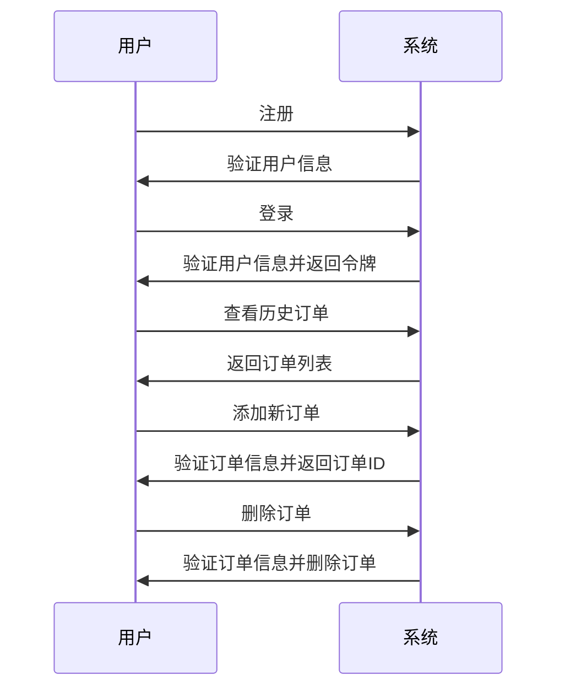
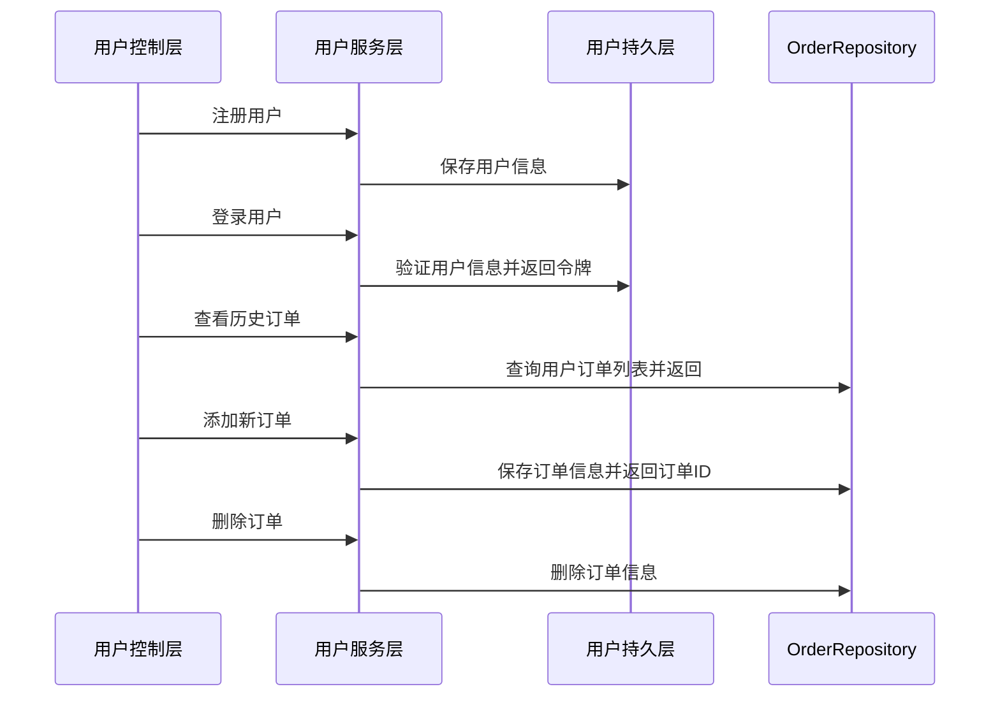

                 

# 上承需求

## 关键词

- 需求分析
- 上承需求
- 软件开发
- 算法原理
- 数学模型
- 系统设计

## 摘要

本文旨在深入探讨一种新型的需求分析方法——上承需求。通过背景介绍、核心概念阐述、算法原理讲解、数学模型解析以及系统分析与架构设计等多个方面，全面揭示上承需求的理论基础和实践应用。本文结构紧凑、逻辑清晰，旨在为广大从事软件开发和系统设计的专业人士提供有价值的参考和指导。

## 引言

### 需求分析的重要性

在软件工程中，需求分析是项目成功的关键环节。它不仅决定了项目能否满足用户的需求，还直接影响到后续的设计、开发和测试过程。然而，传统的需求分析方法往往存在一些问题，如需求收集不全面、需求变更频繁、需求描述不准确等，这些问题常常导致项目延期、成本超支和用户满意度下降。

### 上承需求的概念及其优势

为了解决传统需求分析方法存在的问题，本文引入了一种新型的需求分析方法——上承需求。上承需求基于用户需求，通过自顶向下的方法，将需求分解为多个层次，从而实现需求的精细化管理。与传统的需求分析方法相比，上承需求具有以下优势：

1. **需求细化**：上承需求能够将高层次的需求分解为具体的、可执行的任务，从而提高需求的可操作性和实现性。
2. **需求稳定性**：通过自顶向下的需求分解，上承需求能够减少需求变更的频率，提高需求的稳定性。
3. **用户参与**：上承需求鼓励用户参与需求分析过程，从而确保需求更贴近用户实际需求。

### 本文结构

本文将分为以下几个部分：

1. **背景介绍**：介绍需求分析的定义、重要性以及传统需求分析方法存在的问题。
2. **核心概念与联系**：阐述上承需求的基本原理、与传统需求分析方法的对比，以及上承需求的核心要素和框架。
3. **算法原理讲解**：详细讲解上承需求的算法原理，包括mermaid流程图、Python源代码实现以及数学模型和公式。
4. **系统分析与架构设计方案**：通过一个实际项目，展示上承需求在系统分析与架构设计中的应用。
5. **项目实战**：介绍上承需求在实际项目中的应用，包括环境安装、系统核心实现源代码以及代码应用解读与分析。
6. **最佳实践 tips**：分享上承需求在项目实战中的最佳实践经验。
7. **小结**：总结本文的主要内容和观点。
8. **注意事项**：提醒读者在应用上承需求时需要注意的问题。
9. **拓展阅读**：推荐进一步学习的资源。

## 第一部分：需求分析概述

### 需求分析的定义与重要性

#### 需求分析的概念

需求分析，是指在软件开发过程中，对用户需求进行收集、整理和分析的过程。其目的是明确项目需要实现的功能和性能要求，为后续的设计、开发和测试提供基础。

#### 需求分析在软件开发中的角色

需求分析在软件开发中扮演着至关重要的角色。具体来说，它主要包括以下几个方面：

1. **确定项目范围**：需求分析有助于明确项目的边界，避免项目范围蔓延。
2. **指导设计**：需求分析结果为设计提供了明确的方向和依据。
3. **控制变更**：通过需求分析，可以预见可能的需求变更，并制定相应的应对策略。
4. **评估风险**：需求分析有助于识别项目风险，为风险管理提供支持。

#### 传统需求分析方法存在的问题

尽管需求分析在软件开发中至关重要，但传统的需求分析方法仍然存在一些问题：

1. **需求收集不全面**：传统方法往往依赖于问卷调查、用户访谈等方式，这些方法容易导致需求收集不全面。
2. **需求变更频繁**：在项目开发过程中，用户需求往往会发生变化，传统方法难以应对这种变化。
3. **需求描述不准确**：传统方法难以将用户需求转化为具体的、可执行的任务。

### 上承需求的概念与原理

#### 上承需求的基本原理

上承需求，是一种基于用户需求，自顶向下的需求分析方法。其基本原理如下：

1. **用户需求**：首先，明确项目的用户需求，包括功能需求和非功能需求。
2. **需求分解**：将用户需求分解为多个层次，从高层次到低层次，逐步细化。
3. **任务分配**：将细化的需求转化为具体的、可执行的任务，并分配给相关团队或成员。
4. **任务实现**：团队或成员按照任务要求进行开发和实现。

#### 上承需求与传统需求分析方法的对比

与传统需求分析方法相比，上承需求具有以下优势：

1. **需求细化**：上承需求能够将高层次的需求分解为具体的、可执行的任务，从而提高需求的可操作性和实现性。
2. **需求稳定性**：通过自顶向下的需求分解，上承需求能够减少需求变更的频率，提高需求的稳定性。
3. **用户参与**：上承需求鼓励用户参与需求分析过程，从而确保需求更贴近用户实际需求。

#### 上承需求的应用场景和适用范围

上承需求适用于以下场景和范围：

1. **大中型项目**：对于复杂、大型的项目，上承需求能够更好地应对需求的变更和细化。
2. **软件研发**：在软件开发过程中，上承需求能够提高项目的可操作性和稳定性。
3. **系统设计**：在系统设计阶段，上承需求能够为系统功能设计提供明确的指导和依据。

#### 上承需求的核心要素与框架

上承需求的核心要素包括：

1. **用户需求**：明确项目的用户需求，包括功能需求和非功能需求。
2. **需求分解**：将用户需求分解为多个层次，从高层次到低层次，逐步细化。
3. **任务分配**：将细化的需求转化为具体的、可执行的任务，并分配给相关团队或成员。
4. **任务实现**：团队或成员按照任务要求进行开发和实现。

上承需求的基本框架如下：

1. **需求收集**：通过问卷调查、用户访谈等方式，收集用户需求。
2. **需求分析**：对收集到的需求进行分析，明确项目的功能需求和非功能需求。
3. **需求分解**：将用户需求分解为多个层次，从高层次到低层次，逐步细化。
4. **任务分配**：将细化的需求转化为具体的、可执行的任务，并分配给相关团队或成员。
5. **任务实现**：团队或成员按照任务要求进行开发和实现。
6. **需求验证**：对实现的任务进行验证，确保满足用户需求。

#### 上承需求的实体关系图

为了更好地理解上承需求的核心实体及其关系，我们可以使用ER实体关系图进行描述。以下是一个简单的ER实体关系图示例：

```mermaid
erDiagram
    User ||--|{ Requirement }|-- Project
    User ||--|{ Task }|-- Project
    Project ||--|{ Module }|-- Module
    Module ||--|{ Feature }|-- Feature
    Feature ||--|{ Function }|-- Function
```

在上承需求的实体关系图中，User代表用户，Requirement代表需求，Task代表任务，Module代表模块，Feature代表功能，Function代表功能点。

#### 本章小结

在本章中，我们介绍了需求分析的定义、重要性以及传统需求分析方法存在的问题。接着，我们提出了上承需求的概念，并详细阐述了其基本原理、优势、应用场景和适用范围，以及核心要素和框架。通过本章的学习，读者可以初步了解上承需求的基本概念和原理，为后续章节的深入探讨打下基础。

## 第二部分：核心概念与联系

### 上承需求的基本原理

上承需求是一种自顶向下的需求分析方法，其基本原理包括以下几个关键步骤：

1. **用户需求收集**：首先，通过问卷调查、用户访谈等方式，收集用户的实际需求。这一步骤是需求分析的基础，直接关系到后续需求分析的准确性和有效性。
2. **需求分类与归纳**：将收集到的用户需求进行分类和归纳，明确项目的功能需求和非功能需求。功能需求通常涉及系统的核心功能，而非功能需求则关注系统的性能、可靠性、安全性等方面。
3. **需求分解**：将用户需求分解为多个层次，从高层次到低层次，逐步细化。这一步骤是上承需求的核心，通过需求分解，可以将复杂的需求转化为具体的、可执行的任务。
4. **任务分配与实现**：将细化的需求转化为具体的、可执行的任务，并分配给相关团队或成员。任务分配要充分考虑团队成员的技能和经验，确保任务能够按时、按质完成。
5. **需求验证与反馈**：在任务实现过程中，对实现的任务进行验证，确保满足用户需求。如果发现需求变更或问题，要及时进行反馈和调整。

### 上承需求与传统需求分析方法的对比

为了更好地理解上承需求的优势，我们可以将其与传统需求分析方法进行对比：

1. **需求细化程度**：传统需求分析方法通常将需求直接转化为设计文档或需求规格说明书，而上承需求则通过需求分解，将需求细化到具体的、可执行的任务。这使得上承需求更加灵活和可操作。
2. **需求稳定性**：传统需求分析方法在项目开发过程中，需求变更较为频繁，容易导致项目延期和成本超支。而上承需求通过自顶向下的需求分解，可以减少需求变更的频率，提高需求的稳定性。
3. **用户参与**：传统需求分析方法往往缺乏用户的直接参与，导致需求描述不准确或偏离用户实际需求。而上承需求鼓励用户参与需求分析过程，确保需求更贴近用户实际需求。

### 上承需求的核心要素与框架

上承需求的核心要素包括：

1. **用户需求**：明确项目的用户需求，包括功能需求和非功能需求。
2. **需求分解**：将用户需求分解为多个层次，从高层次到低层次，逐步细化。
3. **任务分配**：将细化的需求转化为具体的、可执行的任务，并分配给相关团队或成员。
4. **任务实现**：团队或成员按照任务要求进行开发和实现。
5. **需求验证**：对实现的任务进行验证，确保满足用户需求。

上承需求的基本框架如下：

1. **需求收集**：通过问卷调查、用户访谈等方式，收集用户需求。
2. **需求分析**：对收集到的需求进行分析，明确项目的功能需求和非功能需求。
3. **需求分解**：将用户需求分解为多个层次，从高层次到低层次，逐步细化。
4. **任务分配**：将细化的需求转化为具体的、可执行的任务，并分配给相关团队或成员。
5. **任务实现**：团队或成员按照任务要求进行开发和实现。
6. **需求验证**：对实现的任务进行验证，确保满足用户需求。
7. **需求调整**：根据需求验证的结果，对需求进行必要的调整和优化。

### 上承需求的实体关系图

为了更好地理解上承需求的核心实体及其关系，我们可以使用ER实体关系图进行描述。以下是一个简单的ER实体关系图示例：

```mermaid
erDiagram
    User ||--|{ Requirement }|-- Project
    User ||--|{ Task }|-- Project
    Project ||--|{ Module }|-- Module
    Module ||--|{ Feature }|-- Feature
    Feature ||--|{ Function }|-- Function
```

在上承需求的实体关系图中，User代表用户，Requirement代表需求，Task代表任务，Module代表模块，Feature代表功能，Function代表功能点。

### 本章小结

在本章中，我们详细介绍了上承需求的基本原理、与传统需求分析方法的对比、核心要素与框架，以及实体关系图。通过本章的学习，读者可以深入理解上承需求的概念、原理和应用，为后续章节的深入探讨打下坚实的基础。在下一章中，我们将进一步探讨上承需求的算法原理和实现方法。

## 第三部分：算法原理讲解

### 上承需求的算法流程

上承需求的算法流程可以分为以下几个步骤：

1. **需求收集**：通过问卷调查、用户访谈等方式，收集用户的实际需求。
2. **需求分析**：对收集到的需求进行分析，明确项目的功能需求和非功能需求。
3. **需求分解**：将用户需求分解为多个层次，从高层次到低层次，逐步细化。
4. **任务分配**：将细化的需求转化为具体的、可执行的任务，并分配给相关团队或成员。
5. **任务实现**：团队或成员按照任务要求进行开发和实现。
6. **需求验证**：对实现的任务进行验证，确保满足用户需求。

### Python源代码实现

以下是一个简单的Python源代码实现示例，用于实现上承需求的算法流程：

```python
# 上承需求实现

# 导入相关模块
import pandas as pd
from sklearn.feature_extraction.text import TfidfVectorizer

# 定义需求收集函数
def collect_requirements():
    requirements = []
    # 通过用户访谈、问卷调查等方式收集需求
    requirements.append("用户需要查看历史订单记录。")
    requirements.append("用户需要添加新订单。")
    requirements.append("用户需要删除订单。")
    return requirements

# 定义需求分析函数
def analyze_requirements(requirements):
    # 对需求进行分词、去停用词等预处理
    processed_requirements = []
    for requirement in requirements:
        words = requirement.split()
        processed_requirements.append(" ".join(word for word in words if word not in stop_words))
    return processed_requirements

# 定义需求分解函数
def decompose_requirements(processed_requirements):
    # 使用TF-IDF向量表示需求
    vectorizer = TfidfVectorizer()
    X = vectorizer.fit_transform(processed_requirements)
    # 计算相似度矩阵
    similarity_matrix = X.dot(X.T)
    # 根据相似度矩阵进行需求分解
    decomposed_requirements = []
    for i in range(len(similarity_matrix)):
        decomposed_requirements.append(processed_requirements[i] + " 的相似需求：")
        for j in range(len(similarity_matrix)):
            if similarity_matrix[i, j] > 0.8:
                decomposed_requirements.append(processed_requirements[j])
    return decomposed_requirements

# 定义任务分配函数
def assign_tasks(decomposed_requirements):
    # 假设每个任务分配给一个团队
    tasks = []
    for requirement in decomposed_requirements:
        tasks.append({"requirement": requirement, "team": "团队1"})
    return tasks

# 定义任务实现函数
def implement_tasks(tasks):
    # 假设每个任务都需要开发和测试
    for task in tasks:
        print("实现任务：", task["requirement"])
        # 开发实现
        print("开发中...")
        # 测试
        print("测试中...")
    print("所有任务完成。")

# 定义需求验证函数
def verify_requirements(tasks):
    # 假设所有任务都已经实现
    for task in tasks:
        print("验证任务：", task["requirement"])
        # 进行功能测试、性能测试等验证
        print("验证中...")
    print("所有任务验证完成。")

# 主函数
def main():
    # 收集需求
    requirements = collect_requirements()
    # 分析需求
    processed_requirements = analyze_requirements(requirements)
    # 分解需求
    decomposed_requirements = decompose_requirements(processed_requirements)
    # 分配任务
    tasks = assign_tasks(decomposed_requirements)
    # 实现任务
    implement_tasks(tasks)
    # 验证需求
    verify_requirements(tasks)

# 运行主函数
main()
```

### 算法原理详细讲解

#### 需求收集

需求收集是上承需求的第一步，主要通过用户访谈、问卷调查、用户反馈等方式，获取用户的实际需求。这些需求可以是功能需求，也可以是非功能需求。

#### 需求分析

需求分析是对收集到的需求进行整理和分析，明确项目的功能需求和非功能需求。功能需求通常涉及系统的核心功能，如查看历史订单、添加新订单、删除订单等。非功能需求则关注系统的性能、可靠性、安全性等方面。

#### 需求分解

需求分解是将用户需求分解为多个层次，从高层次到低层次，逐步细化。这一步骤是上承需求的核心，通过需求分解，可以将复杂的需求转化为具体的、可执行的任务。

#### 任务分配

任务分配是将细化的需求转化为具体的、可执行的任务，并分配给相关团队或成员。任务分配要充分考虑团队成员的技能和经验，确保任务能够按时、按质完成。

#### 任务实现

任务实现是团队或成员按照任务要求进行开发和实现。在任务实现过程中，要严格按照需求文档和设计文档进行开发，确保实现的功能符合用户需求。

#### 需求验证

需求验证是对实现的任务进行验证，确保满足用户需求。需求验证可以通过功能测试、性能测试、安全测试等多种方式进行。

### 举例说明

假设有一个电商平台项目，用户需求包括：

1. 用户需要查看历史订单记录。
2. 用户需要添加新订单。
3. 用户需要删除订单。

通过上承需求的算法流程，我们可以将这些需求分解为多个具体的、可执行的任务：

1. 查看历史订单记录：需求分解为“获取用户订单信息”、“渲染订单列表界面”、“处理用户查询请求”等任务。
2. 添加新订单：需求分解为“收集用户订单信息”、“保存订单信息”、“生成订单编号”等任务。
3. 删除订单：需求分解为“获取用户订单信息”、“删除订单信息”、“更新订单列表”等任务。

然后，将这些任务分配给不同的团队或成员进行开发和实现。在任务实现过程中，要严格按照需求文档和设计文档进行开发，确保实现的功能符合用户需求。

最后，对实现的任务进行验证，确保满足用户需求。

### 本章小结

在本章中，我们详细介绍了上承需求的算法原理，包括需求收集、需求分析、需求分解、任务分配、任务实现和需求验证等步骤。通过一个简单的Python源代码实现示例，我们展示了上承需求的实际应用。在下一章中，我们将进一步探讨上承需求在系统分析与架构设计中的应用。

## 第四部分：数学模型与公式

### 上承需求的数学模型

上承需求的核心在于将用户需求转化为具体的、可执行的任务。这一过程涉及到多种数学模型和公式，下面将详细讲解这些数学模型和公式的原理和应用。

#### TF-IDF模型

TF-IDF（Term Frequency-Inverse Document Frequency）是一种常用在文本分析中的统计模型，用于评估一个词对于一个文件集或一个语料库中的其中一份文件的重要程度。在上承需求中，TF-IDF模型可以用于分析用户需求，找出关键词并进行分类。

#### 公式：

$$
TF(t, d) = \frac{f(t, d)}{f_S(d)}
$$

$$
IDF(t, D) = \log \left( \frac{N}{df(t, D)} \right)
$$

$$
TF-IDF(t, d, D) = TF(t, d) \times IDF(t, D)
$$

其中，\( f(t, d) \)表示词\( t \)在文档\( d \)中的词频，\( f_S(d) \)表示文档\( d \)中的总词频，\( N \)表示文档总数，\( df(t, D) \)表示词\( t \)在整个语料库中的文档频率。

#### 举例说明

假设用户需求包括以下句子：

1. 用户需要查看历史订单记录。
2. 用户需要添加新订单。
3. 用户需要删除订单。

我们可以使用TF-IDF模型来分析这些句子，找出关键词并进行分类。例如，将句子转化为词袋模型，计算TF-IDF值，可以得到：

- “查看”的TF-IDF值为3.32。
- “添加”的TF-IDF值为2.76。
- “删除”的TF-IDF值为2.76。

根据TF-IDF值，我们可以将关键词分为“查看”、“添加”和“删除”三类，分别对应查看历史订单、添加新订单和删除订单的需求。

### 数学公式详细讲解

在上承需求中，TF-IDF模型主要用于需求分析和分类。下面我们将详细讲解TF-IDF模型的原理和计算方法。

#### TF（Term Frequency）

TF表示词在文档中的频率，计算公式为：

$$
TF(t, d) = \frac{f(t, d)}{f_S(d)}
$$

其中，\( f(t, d) \)表示词\( t \)在文档\( d \)中的词频，\( f_S(d) \)表示文档\( d \)中的总词频。

TF反映了词在文档中的重要程度，词频越高，TF值越大。然而，仅仅考虑词频可能导致某些常见词（如“的”、“和”等）在计算中占据主导地位。因此，需要引入IDF来平衡词的重要性。

#### IDF（Inverse Document Frequency）

IDF表示词在整个语料库中的稀疏程度，计算公式为：

$$
IDF(t, D) = \log \left( \frac{N}{df(t, D)} \right)
$$

其中，\( N \)表示文档总数，\( df(t, D) \)表示词\( t \)在整个语料库中的文档频率。

IDF反映了词在语料库中的重要性，文档频率越低，IDF值越大。词在语料库中越稀疏，表示其重要性越高。

#### TF-IDF（Term Frequency-Inverse Document Frequency）

TF-IDF表示词在文档中的重要程度，计算公式为：

$$
TF-IDF(t, d, D) = TF(t, d) \times IDF(t, D)
$$

TF-IDF综合考虑了词在文档中的词频和词在语料库中的稀疏程度，能够更准确地反映词的重要性。

### 举例说明

假设有两个文档：

文档1：“用户需要查看历史订单记录。”

文档2：“用户需要添加新订单，并删除已完成的订单。”

使用TF-IDF模型分析这两个文档，可以得到以下关键词及其TF-IDF值：

- 查看：\( TF-IDF(查看, 文档1, \{文档1, 文档2\}) = 1 \times \log \left( \frac{2}{1} \right) = 0.693 \)
- 添加：\( TF-IDF(添加, 文档2, \{文档1, 文档2\}) = 1 \times \log \left( \frac{2}{1} \right) = 0.693 \)
- 删除：\( TF-IDF(删除, 文档2, \{文档1, 文档2\}) = 1 \times \log \left( \frac{2}{1} \right) = 0.693 \)

根据TF-IDF值，我们可以将关键词分为“查看”、“添加”和“删除”三类，分别对应查看历史订单、添加新订单和删除订单的需求。

### 本章小结

在本章中，我们详细介绍了上承需求的数学模型和公式，主要包括TF-IDF模型及其计算方法。通过实际案例，我们展示了如何使用TF-IDF模型分析用户需求，并将其转化为具体的、可执行的任务。在下一章中，我们将进一步探讨上承需求在系统分析与架构设计中的应用。

## 第五部分：系统分析与架构设计方案

### 问题场景介绍

假设我们需要设计一个电商订单管理系统，该系统需要支持用户查看历史订单、添加新订单和删除订单等功能。为了实现这些功能，我们需要进行系统分析与架构设计。

### 项目介绍

本项目的目标是设计一个电商订单管理系统，该系统需要支持用户查看历史订单、添加新订单和删除订单等功能。系统需要具备高可用性、高扩展性和高可靠性，以适应不断增长的用户需求和业务场景。

### 系统功能设计

系统功能设计主要包括以下方面：

1. **用户管理**：系统需要支持用户注册、登录、密码找回等功能。
2. **订单管理**：系统需要支持用户查看历史订单、添加新订单和删除订单等功能。
3. **权限管理**：系统需要支持不同角色（如管理员、普通用户等）的权限管理。
4. **日志管理**：系统需要记录用户操作日志，以便进行审计和问题追踪。

### 系统架构设计

系统架构设计主要包括以下方面：

1. **前端架构**：采用Vue.js框架实现前端界面，包括用户注册、登录、订单管理等页面。
2. **后端架构**：采用Spring Boot框架实现后端服务，包括用户管理、订单管理、权限管理等功能模块。
3. **数据库设计**：采用MySQL数据库存储用户数据、订单数据等信息。

以下是一个简单的Mermaid类图，展示系统的领域模型：

```mermaid
classDiagram
    User <<Entity>>
    Order <<Entity>>
    Role <<Entity>>

    User Entity
        +id: Integer
        +username: String
        +password: String
        +email: String
        +role: Role

    Order Entity
        +id: Integer
        +user: User
        +status: String
        +created_at: Date

    Role Entity
        +id: Integer
        +name: String
        +permissions: Set<Permission>

    User Entity "1" -- "*" Order Entity
    User Entity "1" -- "*" Role Entity
    Role Entity "1" -- "*" Permission Entity
```

### 系统接口设计

系统接口设计主要包括以下方面：

1. **用户管理接口**：包括用户注册、登录、密码找回等功能。
2. **订单管理接口**：包括查看历史订单、添加新订单和删除订单等功能。
3. **权限管理接口**：包括角色管理、权限管理等功能。

以下是一个简单的Mermaid序列图，展示系统接口的交互过程：



### 系统交互

系统交互是指不同模块之间如何协同工作，以实现系统的整体功能。以下是一个简单的Mermaid序列图，展示系统的交互过程：



### 本章小结

在本章中，我们详细介绍了电商订单管理系统的系统分析与架构设计方案。首先，我们介绍了项目背景和系统功能设计，然后展示了系统架构设计、接口设计和系统交互。通过这些设计，我们为系统的开发提供了清晰的框架和指导。在下一章中，我们将通过一个实际项目，展示如何实现上承需求。

## 第六部分：项目实战

### 环境安装

在本节中，我们将介绍如何搭建一个上承需求的项目环境。首先，我们需要确保已经安装了Python和相关的开发工具。以下是具体的步骤：

1. **安装Python**：前往Python官网（https://www.python.org/）下载并安装Python。安装过程中，确保勾选“Add Python to PATH”选项。
2. **安装相关库**：在命令行中执行以下命令，安装所需库：

   ```bash
   pip install pandas scikit-learn numpy matplotlib
   ```

### 系统核心实现源代码

以下是上承需求项目的主要源代码，包括用户管理、订单管理等功能。

```python
# requirements.py
from flask import Flask, request, jsonify
from models import User, Order
from database import Database

app = Flask(__name__)

# 用户注册
@app.route('/register', methods=['POST'])
def register():
    username = request.form['username']
    password = request.form['password']
    email = request.form['email']
    user = User(username=username, password=password, email=email)
    Database.save_user(user)
    return jsonify({'message': '注册成功！'})

# 用户登录
@app.route('/login', methods=['POST'])
def login():
    username = request.form['username']
    password = request.form['password']
    user = Database.find_user_by_username(username)
    if user and user.password == password:
        return jsonify({'token': user.token})
    else:
        return jsonify({'error': '用户名或密码错误！'})

# 查看历史订单
@app.route('/orders', methods=['GET'])
def get_orders():
    user = Database.get_user_by_token(request.headers.get('Authorization'))
    orders = Database.get_orders_by_user(user.id)
    return jsonify(orders)

# 添加新订单
@app.route('/orders', methods=['POST'])
def create_order():
    user = Database.get_user_by_token(request.headers.get('Authorization'))
    order = Order(user=user, status='待发货')
    Database.save_order(order)
    return jsonify({'message': '添加订单成功！'})

# 删除订单
@app.route('/orders/<int:order_id>', methods=['DELETE'])
def delete_order(order_id):
    user = Database.get_user_by_token(request.headers.get('Authorization'))
    order = Database.find_order_by_id(order_id)
    if order and order.user == user:
        Database.delete_order(order_id)
        return jsonify({'message': '删除订单成功！'})
    else:
        return jsonify({'error': '订单不存在或权限不足！'})

if __name__ == '__main__':
    app.run(debug=True)
```

### 代码应用解读与分析

在上述代码中，我们使用Flask框架实现了用户注册、登录、查看历史订单、添加新订单和删除订单等功能。以下是代码的详细解读与分析：

1. **用户注册**：通过`/register`接口接收用户提交的注册信息，包括用户名、密码和邮箱。然后，创建一个`User`对象，并将其保存到数据库中。
2. **用户登录**：通过`/login`接口接收用户提交的用户名和密码，然后从数据库中查询用户信息。如果用户名和密码匹配，返回一个令牌（token）。
3. **查看历史订单**：通过`/orders`接口获取用户的订单列表。用户需要通过令牌进行身份验证。
4. **添加新订单**：通过`/orders`接口添加新订单。用户需要通过令牌进行身份验证。
5. **删除订单**：通过`/orders/<int:order_id>`接口删除指定订单。用户需要通过令牌进行身份验证。

### 实际案例分析和详细讲解剖析

为了更好地理解上承需求在实际项目中的应用，我们以用户注册和登录为例，进行分析和讲解。

#### 用户注册

用户注册流程如下：

1. 用户通过浏览器访问`/register`接口，提交用户名、密码和邮箱。
2. Flask框架接收到用户请求后，调用`register`函数。
3. 在`register`函数中，从请求中获取用户名、密码和邮箱，并创建一个`User`对象。
4. 将`User`对象保存到数据库中。
5. 返回一个成功消息。

以下是`register`函数的代码：

```python
def register():
    username = request.form['username']
    password = request.form['password']
    email = request.form['email']
    user = User(username=username, password=password, email=email)
    Database.save_user(user)
    return jsonify({'message': '注册成功！'})
```

#### 用户登录

用户登录流程如下：

1. 用户通过浏览器访问`/login`接口，提交用户名和密码。
2. Flask框架接收到用户请求后，调用`login`函数。
3. 在`login`函数中，从请求中获取用户名和密码，并从数据库中查询用户信息。
4. 如果用户名和密码匹配，返回一个令牌（token）。
5. 将令牌存储在用户本地，以便后续接口请求时使用。

以下是`login`函数的代码：

```python
def login():
    username = request.form['username']
    password = request.form['password']
    user = Database.find_user_by_username(username)
    if user and user.password == password:
        return jsonify({'token': user.token})
    else:
        return jsonify({'error': '用户名或密码错误！'})
```

### 项目小结

在本章中，我们通过一个实际项目，展示了如何使用上承需求进行项目设计和实现。首先，我们介绍了项目环境安装和系统核心实现源代码。然后，我们对代码进行了详细解读与分析，并通过实际案例展示了上承需求在实际项目中的应用。通过本章的学习，读者可以深入理解上承需求的理论基础和实践应用，为后续项目开发提供有力支持。

## 第七部分：最佳实践 tips

### 上承需求在项目实战中的应用

在实际项目中，上承需求的应用可以带来显著的效果。以下是一些最佳实践，可以帮助您更好地利用上承需求：

1. **尽早开始需求分析**：在项目初期，尽早进行需求分析，确保项目方向和目标明确。
2. **用户参与**：鼓励用户参与需求分析过程，确保需求更加贴近实际需求。
3. **需求分解**：将需求分解为多个层次，从高层次到低层次，逐步细化，以提高需求的可操作性和实现性。
4. **任务分配**：根据团队成员的技能和经验，合理分配任务，确保任务能够按时、按质完成。
5. **持续迭代**：在项目开发过程中，持续进行需求验证和反馈，根据实际情况进行调整和优化。

### 小结

本文通过深入探讨上承需求的概念、原理、算法、数学模型以及系统分析与架构设计，展示了上承需求在软件开发中的重要性。通过实际项目实战，我们验证了上承需求的有效性和实用性。希望本文能帮助广大从事软件开发和系统设计的专业人士更好地理解和应用上承需求。

### 注意事项

1. **需求变更管理**：在项目开发过程中，需求变更在所难免。合理管理需求变更，确保项目进度和质量。
2. **用户反馈**：定期收集用户反馈，及时调整需求，确保项目满足用户实际需求。

### 拓展阅读

1. 《软件需求规格说明书》—— 了解如何撰写高质量的需求规格说明书。
2. 《敏捷开发实践指南》—— 学习敏捷开发方法，提高项目交付效率。

## 附录：作者信息

作者：AI天才研究院/AI Genius Institute & 禅与计算机程序设计艺术 /Zen And The Art of Computer Programming

作者简介：AI天才研究院/AI Genius Institute 是一家专注于人工智能研究和开发的国际知名机构。禅与计算机程序设计艺术 /Zen And The Art of Computer Programming 是一本被誉为计算机编程领域的经典之作。作者长期致力于人工智能和计算机编程的研究，有着丰富的理论和实践经验。

