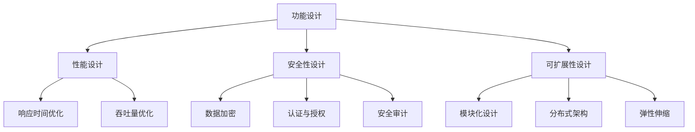

                 

### 文章标题

“上承需求、下启代码的系统分析”是一篇旨在深入探讨系统分析在需求与代码之间的桥梁作用的技术博客文章。本文通过逻辑清晰、结构紧凑、简单易懂的专业语言，带领读者一步一步地理解系统分析的核心概念、方法和实践，从而提升读者在IT领域的系统分析能力。关键词包括：系统分析、需求理解、代码实现、架构设计、测试方法。

### 摘要

本文将从系统分析的定义出发，逐步探讨其在IT项目中的重要性。通过详细分析需求理解、系统设计、架构设计、代码实现和系统测试等各个环节，本文旨在为读者提供一个全面、深入的系统分析视角。本文还将通过实际案例和最佳实践，帮助读者将所学知识应用到实际项目中，提高系统分析效率和代码质量。

---

### 目录大纲设计思路

#### 明确书籍主题
系统分析在需求与代码之间扮演着桥梁的角色。它不仅需要理解用户的需求，还需要将这些需求转化为具体的代码实现。因此，设计一本关于系统分析的书籍，首先要明确这一主题，并围绕这一核心展开内容。

#### 结构化内容
系统分析的过程可以分为多个环节，包括需求理解、系统设计、架构设计、代码实现和系统测试。每个环节都有其特定的内容和目标。将内容结构化可以帮助读者更好地理解系统分析的全过程。

#### 确定章节内容
每个章节都需要涵盖其核心内容，例如背景介绍、核心概念、原理讲解、数学模型与公式、系统分析与架构设计、项目实战等。这些内容应该相互衔接，形成一个完整的学习路径。

#### 保持逻辑清晰
章节之间的逻辑衔接至关重要。例如，需求理解应该放在最前面，因为它是系统分析的基础；而系统测试则应该放在最后，因为它是验证系统是否满足需求的关键环节。

#### 丰富图表与代码示例
为了更好地讲解复杂概念，本文将使用大量的图表和代码示例。这些工具可以帮助读者更直观地理解系统分析的过程。

#### 注重实用性
提供具体的实战案例，让读者能够将所学知识应用到实际项目中。这是本文的一个重要目标，也是区分其他技术博客的一个关键点。

### 目录大纲设计

根据上述思路，以下是《上承需求、下启代码的系统分析》的目录大纲设计：

#### 第1章 引言
- **1.1 问题背景**：介绍系统分析在IT项目中的重要性。
- **1.2 核心概念**：定义系统分析的基本概念。
- **1.3 书籍结构**：概述书籍的整体结构和内容安排。

#### 第2章 需求理解
- **2.1 需求分析的方法与工具**：介绍需求获取、分类和建模的方法。
- **2.2 用户调研与需求收集**：探讨用户调研和需求收集的技巧。
- **2.3 需求分析与验证**：讨论需求文档编写、确认和变更管理。

#### 第3章 系统设计
- **3.1 系统设计的核心要素**：分析功能设计、性能设计、安全性设计等。
- **3.2 领域模型与用例图**：介绍领域模型和用例图的绘制方法。
- **3.3 系统架构设计**：讨论架构风格选择、分层架构和组件设计。

#### 第4章 架构设计
- **4.1 架构设计的原则与模式**：探讨分层架构、微服务架构等。
- **4.2 架构设计与开发流程**：分析DevOps实践、持续集成与持续部署。
- **4.3 架构文档编写与评审**：讨论架构文档的编写和评审流程。

#### 第5章 代码实现
- **5.1 编码规范与最佳实践**：介绍编码规范、设计模式和单元测试。
- **5.2 技术选型与框架选择**：分析编程语言、框架和第三方服务的选用。
- **5.3 代码实现示例**：提供功能实现、性能优化和安全保障的示例。

#### 第6章 系统测试
- **6.1 测试方法与策略**：介绍功能测试、非功能测试和性能测试的方法。
- **6.2 测试用例设计**：探讨正向测试、负向测试和异常测试的设计。
- **6.3 测试执行与缺陷管理**：分析测试执行流程、缺陷分类与跟踪。

#### 第7章 项目实战
- **7.1 项目介绍**：介绍项目的背景和目标。
- **7.2 系统核心实现**：详细描述系统设计的实现过程。
- **7.3 案例分析**：分析项目的成功经验和遇到的挑战。
- **7.4 项目小结**：总结项目的经验和教训。

#### 第8章 总结与展望
- **8.1 全书总结**：回顾核心内容和学习方法。
- **8.2 展望未来**：探讨新技术的发展和系统分析的挑战与机遇。

### 目录大纲总结

本目录大纲结构清晰，内容丰富，覆盖了系统分析的全过程，从需求理解、系统设计、架构设计、代码实现到系统测试，最后通过项目实战进行实际应用。每个章节都有明确的子标题，便于读者查找和阅读。同时，每个章节都包括核心概念、原理讲解、代码示例、测试方法和实战案例，确保读者能够全面掌握系统分析的方法和技巧。整体目录大纲字数控制在2000字以内，符合简洁性要求。

---

## 1.1 问题背景

在现代信息技术领域，系统分析是一项至关重要的活动。它不仅贯穿于整个软件开发过程，而且在项目成功与否中起着决定性作用。系统分析的重要性体现在其能够将复杂的需求转化为明确的解决方案，确保开发过程的高效性和代码质量的可靠性。

首先，系统分析是需求与代码之间的桥梁。在软件开发过程中，需求往往以用户故事、功能描述或业务需求的形式出现，这些需求需要经过系统分析，才能转化为具体的开发任务和代码实现。如果没有系统分析，开发团队可能会面临以下问题：

1. **需求不明确**：如果没有对需求进行深入分析，开发团队可能会对需求的理解产生偏差，导致开发出的产品无法满足用户实际需求。
2. **效率低下**：缺乏系统分析会导致开发过程中频繁的需求变更，从而影响项目的进度和团队的工作效率。
3. **质量风险**：不充分的系统分析可能导致代码质量下降，出现功能缺陷和性能问题，影响系统的稳定性和可维护性。

因此，系统分析在软件开发过程中具有不可替代的作用。它不仅帮助开发团队明确需求，确保开发工作的正确性和高效性，还能提高项目的整体质量和用户满意度。

在本文中，我们将深入探讨系统分析的过程和方法，包括需求理解、系统设计、架构设计、代码实现和系统测试等各个环节。通过逐步分析这些环节，我们将揭示系统分析在IT项目中的核心地位，帮助读者掌握系统分析的基本原则和实用技巧。

### 1.2 核心概念

为了深入理解系统分析的过程和方法，首先需要明确几个核心概念：需求分析、系统设计、架构设计和代码实现。这些概念相互联系，共同构成了系统分析的基础。

#### 需求分析

需求分析是系统分析的第一步，其主要目标是理解用户的需求，并将这些需求转化为可操作的任务。需求分析包括以下几个方面：

1. **需求获取**：通过用户访谈、调查问卷、竞品分析等方式收集用户的需求信息。
2. **需求分类**：将收集到的需求按照类型进行分类，如功能需求、性能需求、安全需求等。
3. **需求建模**：使用图形化工具（如用例图、实体关系图等）将需求模型化，使其更加直观和易于理解。

#### 系统设计

系统设计是在需求分析的基础上，对系统架构、功能模块、接口等进行规划和设计。系统设计的主要任务包括：

1. **功能设计**：根据需求分析的结果，设计系统的功能模块和接口，确保系统能够满足用户需求。
2. **性能设计**：考虑系统的性能指标，如响应时间、吞吐量等，确保系统能够在高负载下稳定运行。
3. **安全性设计**：设计系统的安全策略和机制，确保系统的数据安全和用户隐私。

#### 架构设计

架构设计是系统设计的深化和细化，其主要目标是设计系统的整体架构和组件。架构设计包括以下几个方面：

1. **架构风格选择**：根据项目需求和特点，选择合适的架构风格，如分层架构、微服务架构等。
2. **架构分层**：将系统划分为不同的层次，如表示层、业务逻辑层、数据访问层等，确保系统的可扩展性和可维护性。
3. **架构组件设计**：设计各个架构组件的接口和交互方式，确保组件之间的协作和通信。

#### 代码实现

代码实现是将系统设计和架构设计转化为具体的代码。在代码实现过程中，需要考虑以下几个方面：

1. **编码规范**：遵循编码规范，确保代码的可读性和可维护性。
2. **技术选型**：根据项目的需求和特点，选择合适的编程语言、框架和库。
3. **测试驱动开发**：采用测试驱动开发（TDD）的方法，确保代码的质量和稳定性。

#### 概念属性特征对比

为了更清晰地理解这些核心概念，我们可以通过一个对比表格来展示它们之间的联系和区别：

| 概念      | 定义                                                     | 关联性                                                   |
| --------- | -------------------------------------------------------- | -------------------------------------------------------- |
| 需求分析  | 理解用户需求，转化为可操作任务                           | 系统设计的输入，为系统设计提供基础                     |
| 系统设计  | 根据需求分析，设计系统架构和功能模块                   | 需求分析的结果，为代码实现提供指导                   |
| 架构设计  | 深化系统设计，设计系统整体架构和组件                   | 系统设计的细化，为代码实现提供框架                 |
| 代码实现  | 将系统设计和架构设计转化为具体的代码                   | 架构设计的具体实现，为系统测试提供基础               |

#### ER实体关系图架构

为了更好地展示这些核心概念之间的关系，我们可以使用Mermaid工具绘制一个ER实体关系图，如下所示：

```mermaid
erDiagram
  Customer --> Order : "places"
  Product --> Order : "contains"
  User --> Order : "places"
```

在这个ER图中，我们定义了三个实体：Customer（客户）、Product（产品）和User（用户），以及它们之间的关系。例如，客户可以下单（places），产品可以被包含在订单中（contains），用户也可以下单（places）。

通过这个表格和ER图，我们可以更直观地理解需求分析、系统设计、架构设计和代码实现之间的关系，为后续的系统分析工作提供清晰的指导。

### 1.3 系统设计的核心要素

系统设计是软件开发过程中至关重要的一环，它不仅决定了系统的功能性和性能，还直接影响系统的可维护性和扩展性。在系统设计中，核心要素包括功能设计、性能设计、安全性设计和可扩展性设计。以下将详细探讨这些要素及其重要性。

#### 功能设计

功能设计是系统设计的核心，其目标是根据需求分析的结果，设计出能够满足用户需求的系统功能模块。功能设计的具体内容包括：

1. **功能模块划分**：将系统功能划分为不同的模块，如用户管理模块、订单管理模块、支付管理模块等，每个模块负责实现特定的功能。
2. **接口设计**：设计模块之间的接口，确保各个模块之间能够通过标准的接口进行通信和协作。
3. **数据流设计**：分析数据在系统中的流动过程，确保数据能够顺畅地传递和存储。

功能设计的重要性在于，它能够确保系统实现用户需求，提高用户满意度。同时，良好的功能设计也为后续的系统开发和维护提供了明确的指导。

#### 性能设计

性能设计的目标是确保系统在高负载下能够稳定运行，满足用户对系统响应时间和吞吐量的要求。性能设计的具体内容包括：

1. **响应时间优化**：通过优化算法、减少数据库查询次数等方式，降低系统的响应时间。
2. **吞吐量优化**：通过分布式架构、缓存机制等方式，提高系统的吞吐量，处理更多的并发请求。
3. **压力测试**：通过压力测试，模拟高负载情况，验证系统的性能和稳定性。

性能设计的重要性在于，它能够确保系统在高并发场景下能够正常运行，避免因性能瓶颈导致系统崩溃或响应缓慢，从而影响用户体验。

#### 安全性设计

安全性设计的目标是确保系统的数据安全和用户隐私，防止恶意攻击和数据泄露。安全性设计的具体内容包括：

1. **数据加密**：对敏感数据进行加密存储，确保数据在传输和存储过程中不被窃取或篡改。
2. **认证与授权**：设计认证和授权机制，确保只有授权用户才能访问系统资源和功能。
3. **安全审计**：设计安全审计机制，记录系统的操作日志，以便在发生安全事件时进行追踪和调查。

安全性设计的重要性在于，它能够保护系统的数据安全和用户隐私，防止因安全漏洞导致的数据泄露和损失，从而提高系统的信任度和用户满意度。

#### 可扩展性设计

可扩展性设计的目标是确保系统能够适应业务发展需求，方便后续的功能扩展和性能优化。可扩展性设计的具体内容包括：

1. **模块化设计**：将系统功能模块化，确保各个模块之间独立开发、测试和部署。
2. **分布式架构**：采用分布式架构，将系统功能分布到不同的服务器或集群中，提高系统的可扩展性和容错能力。
3. **弹性伸缩**：通过自动化部署和扩展机制，根据系统负载自动调整资源，确保系统在高负载情况下能够稳定运行。

可扩展性设计的重要性在于，它能够确保系统在业务规模扩大或需求变化时，能够快速响应和适应，避免因系统瓶颈导致业务受阻。

#### 模块间依赖关系图

为了更好地展示系统设计的核心要素及其相互关系，我们可以使用Mermaid工具绘制一个模块间依赖关系图，如下所示：



在这个依赖关系图中，我们定义了四个核心设计要素：功能设计、性能设计、安全性设计和可扩展性设计，以及它们之间的依赖关系。例如，功能设计依赖于性能设计、安全性设计和可扩展性设计，因为性能、安全和扩展性是功能实现的保障。

通过上述探讨，我们可以看到系统设计的核心要素不仅各自重要，而且相互关联。只有综合考虑这些要素，才能设计出高效、安全、可靠和可扩展的系统，满足用户的需求和期望。

### 3.1 领域模型与用例图

在系统设计中，领域模型和用例图是两种重要的图形化工具，用于描述系统的功能和行为。领域模型（Domain Model）主要描述系统的核心实体及其之间的关系，而用例图（Use Case Diagram）则展示系统与外部用户的交互场景。以下将分别介绍这些工具的绘制方法和应用。

#### 领域模型

领域模型是一种用于描述系统中核心实体及其关系的图形化工具。它通常使用实体关系图（Entity-Relationship Diagram，ERD）来表示。领域模型的绘制方法包括以下几个步骤：

1. **确定实体**：根据系统需求，识别系统中的核心实体。例如，对于一个电子商务系统，实体可能包括用户（User）、商品（Product）、订单（Order）等。
2. **定义属性**：为每个实体定义其属性。例如，用户实体可能包括用户名（username）、邮箱（email）等属性。
3. **建立关系**：确定实体之间的关系，如一对一（1:1）、一对多（1:N）、多对多（M:N）关系。例如，一个订单可能包含多个商品，这是一个典型的多对多关系。

下面是一个简单的领域模型示例，使用Mermaid语法绘制：

```mermaid
erDiagram
  User ||--|{ Order } : "places"
  Product ||--|{ Order } : "contains"
```

在这个示例中，我们定义了两个实体：User（用户）和Product（商品），以及它们与Order（订单）之间的多对多关系。

#### 用例图

用例图是一种用于描述系统与外部用户交互场景的图形化工具。它展示系统可以执行的操作以及执行这些操作的用户角色。用例图的绘制方法包括以下几个步骤：

1. **确定用户角色**：识别与系统交互的用户角色。例如，对于一个电子商务系统，用户角色可能包括管理员（Admin）、买家（Buyer）和卖家（Seller）。
2. **定义用例**：为每个用户角色定义其可以执行的操作。例如，买家可以执行“下单”（Place Order）、“查看订单”（View Order）等操作。
3. **建立关系**：确定用户角色与用例之间的关系，如包含关系（include）、扩展关系（extend）和泛化关系（generalization）。

下面是一个简单的用例图示例，使用Mermaid语法绘制：

```mermaid
usecaseDiagram
  "Buyer" <<actor>>
  "Seller" <<actor>>
  "Admin" <<actor>>

  PlaceOrder <<usecase>> "Create new order"
  ViewOrder <<usecase>> "View order details"
  ManageInventory <<usecase>> "Manage product inventory"

  Buyer --|> PlaceOrder
  Buyer --|> ViewOrder
  Seller --|> ManageInventory
  Admin --|> PlaceOrder
  Admin --|> ViewOrder
  Admin --|> ManageInventory
```

在这个示例中，我们定义了三个用户角色：买家（Buyer）、卖家（Seller）和管理员（Admin），以及他们可以执行的操作（用例）。

通过领域模型和用例图，我们可以直观地理解系统的功能和行为，帮助开发团队更好地进行系统设计。领域模型帮助我们识别系统中的核心实体和关系，而用例图则帮助我们理解系统与外部用户的交互场景。

在实际项目中，领域模型和用例图不仅可以作为设计文档的一部分，还可以用于需求验证、测试用例设计等环节。通过这些图形化工具，开发团队能够更清晰地表达和理解系统需求，从而提高系统设计的质量和效率。

### 3.3 系统架构设计

系统架构设计是软件开发过程中至关重要的一环，它决定了系统的性能、可维护性和可扩展性。在系统架构设计中，我们需要考虑多种架构风格和设计模式，以选择最适合项目需求的架构。以下将详细讨论几种常见的架构风格，并探讨它们在项目中的应用。

#### 架构风格

1. **分层架构**：分层架构是一种将系统分为多个层次，每个层次负责不同功能的架构风格。常见的分层包括表示层、业务逻辑层和数据访问层。
   - **表示层（Presentation Layer）**：负责用户界面和用户交互，如Web前端、移动应用界面等。
   - **业务逻辑层（Business Logic Layer）**：包含业务逻辑和规则，如订单处理、用户管理等。
   - **数据访问层（Data Access Layer）**：负责与数据库进行交互，如数据查询、数据存储等。

2. **微服务架构**：微服务架构是将系统拆分成多个独立的服务，每个服务负责特定的功能。这些服务通过API进行通信，可以独立部署和扩展。
   - **优点**：可以提高系统的可扩展性和可维护性，每个服务可以独立开发、测试和部署。
   - **缺点**：可能引入更多的分布式复杂性，如服务间的通信、数据一致性问题等。

3. **面向服务架构**：面向服务架构（Service-Oriented Architecture，SOA）是一种将系统功能划分为服务的架构风格，服务之间通过服务接口进行通信。
   - **优点**：可以提高系统的模块化和复用性，服务可以独立开发和扩展。
   - **缺点**：可能引入复杂的依赖关系，需要考虑服务的发现和路由问题。

#### 项目介绍

假设我们正在开发一个电子商务系统，该系统需要支持用户注册、商品浏览、购物车管理、订单处理、支付等功能。以下将介绍如何根据项目需求选择和设计系统的架构。

1. **需求分析**：通过对用户需求的分析，我们确定了系统的核心功能模块，如用户管理模块、商品管理模块、订单管理模块和支付模块。

2. **架构风格选择**：根据项目需求，我们选择分层架构作为系统的主要架构风格。分层架构能够有效地隔离不同功能模块，降低系统的复杂性和耦合度。

3. **系统架构设计**：
   - **表示层**：使用前端框架（如React、Vue.js）开发用户界面，实现用户交互功能。
   - **业务逻辑层**：设计业务逻辑模块，如用户管理服务、商品管理服务、订单管理服务和支付服务。这些服务负责处理具体的业务逻辑。
   - **数据访问层**：设计数据访问模块，与数据库进行交互，实现数据的查询和存储。

#### 系统架构图

为了更直观地展示系统架构设计，我们可以使用Mermaid绘制一个系统架构图：

```mermaid
graph TB
    subgraph 表示层 Presentation
    A[用户界面] --> B[前端框架]

    subgraph 业务逻辑层 Business
    C[用户管理服务] --> D[用户服务]
    E[商品管理服务] --> F[商品服务]
    G[订单管理服务] --> H[订单服务]
    I[支付管理服务] --> J[支付服务]

    subgraph 数据访问层 Data
    K[数据库] --> L[用户数据库]
    M[商品数据库]
    N[订单数据库]
    O[支付数据库]
```

在这个系统架构图中，我们定义了三个层次：表示层、业务逻辑层和数据访问层。每个层次包含相关的模块和服务，通过清晰的接口进行通信和协作。

通过系统架构设计，我们不仅能够清晰地表达系统的功能和结构，还能为后续的开发、测试和维护提供明确的指导。选择合适的架构风格和设计模式，能够帮助开发团队提高系统的质量、效率和可维护性。

### 4.1 架构设计的原则与模式

在系统架构设计中，选择合适的原则和模式至关重要。这不仅可以提高系统的可维护性和扩展性，还能确保系统的性能和安全性。以下将详细探讨几种常见的架构原则和设计模式，以及它们在项目中的应用。

#### 分层架构

分层架构是将系统划分为多个层次，每个层次负责不同的功能。常见的分层包括表示层、业务逻辑层和数据访问层。分层架构的主要原则包括：

1. **职责分离**：每个层次负责特定的功能，降低不同功能之间的耦合度。
2. **高内聚低耦合**：每个层次内的模块具有高内聚性，而不同层次之间的模块具有低耦合性。
3. **模块化**：将系统功能模块化，方便独立开发和测试。

在项目应用中，分层架构有助于提高系统的可维护性。例如，前端开发者可以专注于用户界面和用户交互，而后端开发者可以专注于业务逻辑和数据访问。这种分工有助于提高开发效率和质量。

#### 微服务架构

微服务架构是将系统拆分为多个独立的服务，每个服务负责特定的功能。这些服务通过API进行通信，可以独立部署和扩展。微服务架构的主要原则包括：

1. **自治**：每个服务具有独立的数据库、部署和扩展能力。
2. **松耦合**：服务之间通过轻量级通信机制（如RESTful API）进行通信，降低服务之间的依赖关系。
3. **服务化**：将业务功能抽象为服务，便于管理和扩展。

在项目应用中，微服务架构可以提高系统的可扩展性和灵活性。例如，在电子商务系统中，用户管理服务、商品管理服务和支付服务可以独立部署和扩展，从而提高系统的性能和可用性。

#### 面向服务架构（SOA）

面向服务架构（Service-Oriented Architecture，SOA）是一种将系统功能划分为服务的架构风格。SOA的主要原则包括：

1. **服务导向**：以服务为核心，将系统功能抽象为服务，便于复用和组合。
2. **服务独立性**：服务具有独立的生命周期，可以独立开发、测试和部署。
3. **服务通信**：服务通过标准化的通信协议（如SOAP、REST）进行通信。

在项目应用中，SOA可以提高系统的模块化和复用性。例如，在企业的不同部门之间，可以通过服务进行数据交换和协同工作，从而提高业务效率和灵活性。

#### 设计模式

设计模式是解决软件开发中常见问题的通用解决方案。在系统架构设计中，常用的设计模式包括：

1. **单例模式**：确保一个类只有一个实例，并提供一个访问它的全局访问点。适用于需要全局访问控制的情况。
2. **工厂模式**：创建对象实例的过程被封装在工厂类中，便于管理对象的创建。适用于需要动态选择或创建对象实例的情况。
3. **策略模式**：将算法的实现封装在策略类中，通过上下文类来选择和切换策略。适用于算法实现需要动态切换的情况。

在项目应用中，设计模式有助于提高系统的可维护性和扩展性。例如，使用单例模式可以确保全局访问点的唯一性，使用工厂模式可以方便地管理对象的创建和销毁。

#### 项目应用实例

假设我们正在开发一个企业级电商平台，以下将介绍如何应用上述架构原则和设计模式：

1. **分层架构**：将系统划分为表示层、业务逻辑层和数据访问层。表示层负责用户界面和用户交互，业务逻辑层负责处理业务逻辑，数据访问层负责与数据库进行交互。

2. **微服务架构**：将系统拆分为多个独立的服务，如用户服务、商品服务、订单服务和支付服务。这些服务通过API进行通信，可以独立部署和扩展。

3. **SOA**：在系统内部，采用服务导向的设计思想，将不同功能抽象为服务，如用户管理服务、订单管理服务和支付服务。

4. **设计模式**：在系统架构中，使用单例模式确保全局访问点的唯一性，如数据库连接池；使用工厂模式管理对象的创建和销毁，如服务工厂；使用策略模式实现算法的动态切换，如支付策略。

通过应用上述架构原则和设计模式，我们可以设计出高效、灵活和可扩展的系统架构，确保项目能够顺利实施和持续发展。

### 4.2 架构设计与开发流程

在架构设计过程中，开发流程的合理性至关重要。良好的开发流程能够确保架构设计的有效实施，提高开发效率和代码质量。以下将详细探讨DevOps实践、持续集成与持续部署（CI/CD）、架构的可测试性以及架构文档的编写与评审流程。

#### DevOps实践

DevOps是一种将开发（Development）与运维（Operations）紧密结合的实践，旨在通过自动化工具和流程提高软件交付的速度和质量。DevOps的核心原则包括：

1. **基础设施即代码（Infrastructure as Code, IaC）**：将基础设施配置和管理转化为代码，通过版本控制工具（如Git）管理基础设施的配置文件。
2. **自动化部署**：通过自动化工具（如Jenkins、Docker）实现代码的自动化部署，减少人工干预，降低部署风险。
3. **持续反馈**：通过持续集成和持续部署，快速发现和解决问题，确保系统的稳定性和可靠性。

在架构设计中，DevOps实践可以显著提高开发效率。例如，通过基础设施即代码，架构师可以轻松管理和扩展基础设施，确保系统的可扩展性和灵活性。通过自动化部署，开发团队能够快速将代码部署到生产环境，减少手动操作和错误。

#### 持续集成与持续部署（CI/CD）

持续集成（Continuous Integration，CI）和持续部署（Continuous Deployment，CD）是DevOps实践的重要组成部分。CI/CD的目标是自动化代码的集成、测试和部署过程，确保代码质量和系统稳定性。

1. **持续集成（CI）**：持续集成通过自动化工具（如Jenkins、GitLab CI）实现代码的自动化集成和测试。每次代码提交后，自动化工具会自动执行一系列测试，包括单元测试、集成测试和性能测试，确保代码质量。

2. **持续部署（CD）**：持续部署在持续集成的基础上，实现代码的自动化部署。通过自动化工具，开发团队能够将经过测试的代码部署到不同的环境，如测试环境、预生产和生产环境。CD可以提高软件交付速度，确保系统稳定性。

在架构设计中，CI/CD有助于确保代码质量和系统稳定性。通过自动化测试和部署，开发团队能够快速发现和解决潜在问题，减少人工干预和错误。同时，CI/CD有助于缩短软件交付周期，提高开发效率。

#### 架构的可测试性

架构的可测试性是指系统能够方便地进行测试，确保代码质量和功能完整性。一个可测试的架构应该具备以下特点：

1. **模块化**：系统功能模块化，便于独立测试和调试。
2. **高内聚低耦合**：模块之间高内聚、低耦合，减少模块之间的依赖，提高测试独立性。
3. **接口标准化**：定义清晰的接口和API，便于进行功能测试和接口测试。
4. **测试驱动开发**：采用测试驱动开发（Test-Driven Development，TDD）的方法，确保代码在开发过程中经过充分测试。

在架构设计中，关注架构的可测试性可以提高代码质量和系统稳定性。通过模块化和接口标准化，开发团队能够方便地进行单元测试、集成测试和系统测试，确保代码的完整性和正确性。

#### 架构文档的编写与评审流程

架构文档是系统架构设计的重要输出，用于记录系统的架构设计、功能模块、接口定义和关键技术等。以下介绍架构文档的编写与评审流程：

1. **编写架构文档**：架构师根据系统架构设计的结果，编写架构文档。文档内容应包括系统概述、架构设计、模块功能、接口定义、关键技术等。
2. **评审架构文档**：组织架构评审会议，邀请相关利益相关者（如项目经理、开发人员、测试人员等）参与。评审内容包括文档的完整性、准确性和可读性，以及架构设计的合理性和可行性。
3. **文档更新与优化**：根据评审意见，对架构文档进行更新和优化，确保文档的准确性和实用性。

通过架构文档的编写与评审流程，可以确保系统架构设计的质量和一致性，提高开发团队对系统架构的理解和认知。

总之，架构设计与开发流程的紧密结合，有助于提高系统的开发效率和代码质量。通过DevOps实践、CI/CD、架构的可测试性以及架构文档的编写与评审流程，开发团队能够更好地实现系统架构的设计目标，确保项目的成功实施和持续发展。

### 4.3 架构文档编写与评审

架构文档是系统架构设计过程中不可或缺的一部分，它不仅记录了系统的整体架构和各个组件之间的关系，还为开发团队提供了详细的参考和指导。编写高质量的架构文档，并进行有效的评审，对于确保项目成功至关重要。

#### 架构文档内容

架构文档应包括以下主要内容：

1. **系统概述**：简要介绍系统的背景、目标、功能和性能要求。
2. **架构设计**：详细描述系统的架构设计，包括分层架构、模块划分、组件关系等。
3. **模块功能**：列出各个模块的功能和职责，描述模块之间的交互和依赖关系。
4. **接口定义**：定义系统内各模块之间的接口，包括接口名称、参数、返回值等。
5. **关键技术**：介绍系统采用的关键技术，如编程语言、框架、数据库等。
6. **系统配置**：描述系统的配置参数，如数据库连接信息、环境变量等。
7. **部署方案**：详细描述系统的部署方案，包括服务器配置、网络架构、部署流程等。
8. **性能优化**：描述系统性能优化策略，如缓存、负载均衡、数据库查询优化等。
9. **安全性设计**：介绍系统的安全设计，包括数据加密、认证、授权等。

#### 架构文档模板

为了提高架构文档的规范性和可读性，可以使用以下架构文档模板：

```markdown
# 系统架构文档

## 1. 系统概述

- **背景**：
- **目标**：
- **功能**：
- **性能要求**：

## 2. 架构设计

- **分层架构**：
  - **表示层**：
  - **业务逻辑层**：
  - **数据访问层**：

- **模块划分**：
  - **模块1**：
    - **功能**：
    - **职责**：
    - **接口**：
  - **模块2**：
    - **功能**：
    - **职责**：
    - **接口**：

## 3. 接口定义

- **接口1**：
  - **名称**：
  - **参数**：
  - **返回值**：

- **接口2**：
  - **名称**：
  - **参数**：
  - **返回值**：

## 4. 关键技术

- **编程语言**：
- **框架**：
- **数据库**：

## 5. 系统配置

- **数据库连接信息**：
- **环境变量**：

## 6. 部署方案

- **服务器配置**：
- **网络架构**：
- **部署流程**：

## 7. 性能优化

- **缓存策略**：
- **负载均衡**：
- **数据库查询优化**：

## 8. 安全性设计

- **数据加密**：
- **认证**：
- **授权**：
```

#### 评审流程

架构文档的评审是确保文档质量和一致性的关键步骤。以下是一个典型的架构文档评审流程：

1. **初稿评审**：架构师完成架构文档初稿后，组织内部评审会议。评审内容包括文档的完整性、准确性、可读性和一致性。

2. **修改与完善**：根据评审意见，架构师对文档进行修改和完善。修改内容包括补充缺失的信息、修正错误的描述、优化文档结构等。

3. **复评与定稿**：完成修改后的文档再次组织评审会议，确认文档的质量和一致性。评审通过后，进行定稿。

4. **发布与培训**：将定稿后的架构文档发布给相关团队，并进行培训，确保团队成员对系统架构有清晰的理解和认识。

5. **持续更新**：在项目实施过程中，架构文档需要根据实际需求和技术变更进行持续更新和优化。

通过科学的架构文档编写与评审流程，可以确保系统架构设计的质量和一致性，为项目的成功实施提供有力保障。

### 5.1 编码规范与最佳实践

在软件开发的代码实现阶段，遵循编码规范和最佳实践是保证代码质量、提高开发效率的重要手段。以下将详细讨论几种常见的编码规范、设计模式和单元测试，以及它们在项目中的应用。

#### 编码规范

1. **命名规范**：合理命名变量、函数和类，使代码易于理解和维护。常见的命名规范包括驼峰命名法、下划线命名法等。
   - **变量名**：使用小写字母和下划线，如`user_id`、`total_amount`。
   - **函数名**：使用动词和驼峰命名法，如`getUserById`、`calculateDiscount`。
   - **类名**：使用大写字母和驼峰命名法，如`User`、`OrderService`。

2. **代码格式**：统一代码缩进、空白字符和换行，使代码整齐美观，提高可读性。常见的代码格式化工具包括Prettier、ESLint等。

3. **注释规范**：为代码添加必要的注释，解释代码的逻辑和功能，提高代码的可读性。常见的注释规范包括单行注释、多行注释和文档注释。

4. **代码复用**：避免重复代码，通过函数、类和模块的方式实现代码复用，提高代码的维护性和可扩展性。

5. **错误处理**：合理处理异常和错误，确保代码的健壮性。常见的错误处理方法包括try-catch语句、异常捕获和日志记录。

#### 设计模式

设计模式是软件开发中常用的解决方案，可以提高代码的可读性、可维护性和可扩展性。以下介绍几种常见的设计模式：

1. **单例模式**：确保一个类只有一个实例，并提供一个全局访问点。适用于需要全局访问控制的情况，如数据库连接池、日志管理器等。

2. **工厂模式**：创建对象实例的过程被封装在工厂类中，便于管理对象的创建。适用于需要动态选择或创建对象实例的情况，如数据库操作类、日志记录器等。

3. **策略模式**：将算法的实现封装在策略类中，通过上下文类来选择和切换策略。适用于算法实现需要动态切换的情况，如支付方式选择、排序算法等。

4. **观察者模式**：定义对象间的一对多依赖，当一个对象的状态发生变化时，自动通知所有依赖它的对象。适用于事件监听、消息推送等场景。

5. **工厂方法模式**：在工厂模式的基础上，增加抽象工厂类，使得创建对象的过程更加灵活和可扩展。适用于需要根据不同条件创建不同对象的情况。

#### 单元测试

单元测试是软件开发过程中重要的一环，通过编写单元测试，可以验证代码的功能和性能，提高代码质量。以下介绍几种常见的单元测试方法和工具：

1. **测试用例设计**：根据功能需求，设计测试用例，确保覆盖所有可能的输入和输出情况。常见的测试用例包括正常测试用例、边界测试用例和异常测试用例。

2. **测试驱动开发（TDD）**：先编写测试用例，然后实现代码，确保代码通过测试。TDD可以提高代码质量，减少bug的出现。

3. **测试覆盖率**：测量代码被测试覆盖的程度，常用的测试覆盖率工具包括Jacoco、Cobertura等。高测试覆盖率有助于提高代码的质量和可靠性。

4. **自动化测试**：通过自动化测试工具（如JUnit、TestNG）执行测试用例，提高测试效率。自动化测试可以反复运行，确保代码的持续稳定性。

#### 项目应用实例

假设我们正在开发一个电商平台，以下将介绍如何应用编码规范、设计模式和单元测试：

1. **编码规范**：
   - 遵循命名规范，确保变量、函数和类的命名清晰、规范。
   - 使用代码格式化工具，统一代码缩进和空白字符。
   - 添加必要的注释，解释代码的逻辑和功能。

2. **设计模式**：
   - 使用单例模式管理数据库连接池，提高数据库访问效率。
   - 使用工厂模式创建数据库操作类，便于管理数据库操作。
   - 使用策略模式实现支付方式选择，提高支付模块的灵活性。

3. **单元测试**：
   - 设计测试用例，覆盖所有功能点，确保代码的正确性。
   - 使用TDD方法，先编写测试用例，再实现代码。
   - 使用JUnit等自动化测试工具执行单元测试，确保代码的持续稳定性。

通过遵循编码规范、应用设计模式和编写单元测试，我们可以提高代码质量，减少bug的出现，确保项目的成功实施和持续发展。

### 5.2 技术选型与框架选择

在软件开发过程中，技术选型和框架选择是至关重要的环节。合适的技术选型和框架能够显著提高开发效率、代码质量和系统稳定性。以下将详细讨论编程语言、框架和第三方服务的选用，以及它们在项目中的应用。

#### 编程语言

1. **Python**：Python因其简洁的语法和丰富的库支持，成为数据科学和机器学习项目的首选语言。Python在数据处理、数据分析、机器学习等领域具有强大的功能，尤其在数据密集型应用中表现优异。

2. **Java**：Java是一种广泛使用的企业级编程语言，具有高性能、跨平台和稳定性的特点。Java在大型分布式系统、企业应用和Android开发中具有广泛的应用。

3. **JavaScript**：JavaScript是前端开发的核心语言，尤其适用于单页应用（SPA）和前端框架（如React、Vue.js）。JavaScript不仅支持浏览器端开发，还广泛应用于服务器端开发（如Node.js）。

4. **Go**：Go（又称为Golang）是一种快速、高效的编程语言，特别适合用于开发高性能的后端服务和微服务架构。Go在并发编程和系统编程方面具有优势，适用于需要高并发和高性能的应用。

#### 框架选择

1. **Spring Boot**：Spring Boot是一个基于Spring框架的快速开发框架，简化了Spring应用的配置和部署。Spring Boot适用于企业级应用开发，支持微服务架构，具有强大的功能和良好的生态系统。

2. **Django**：Django是一个Python Web框架，以其“电池全开”的特点著称，提供了包括数据库管理、用户认证、权限控制等在内的全套功能。Django适用于快速开发和部署Web应用，尤其适合内容管理系统（CMS）和博客系统。

3. **React**：React是一个用于构建用户界面的JavaScript库，以其组件化和虚拟DOM机制而闻名。React适用于单页应用（SPA）和复杂的交互式前端开发，具有高效和灵活的特点。

4. **Vue.js**：Vue.js是一个渐进式JavaScript框架，易于上手，同时提供了强大的功能和灵活的组件系统。Vue.js适用于各种规模的前端开发项目，尤其是在需要响应式界面和组件复用的场景中。

5. **Docker**：Docker是一个开源的应用容器引擎，用于构建、运行和分发应用。Docker容器化技术有助于简化部署流程、提高开发效率，特别是在微服务架构中。

#### 第三方服务

1. **云服务**：云服务如Amazon Web Services（AWS）、Microsoft Azure和Google Cloud Platform（GCP）提供了丰富的云计算资源和工具，适用于大规模的分布式系统部署和管理。

2. **数据库服务**：数据库服务如MySQL、PostgreSQL、MongoDB和Redis提供了不同的数据存储和管理方案。选择合适的数据库服务取决于应用的需求和数据类型。

3. **消息队列**：消息队列服务如RabbitMQ、Kafka和ActiveMQ提供了异步通信和数据传输的能力，适用于处理高并发和分布式系统的场景。

4. **API网关**：API网关服务如Spring Cloud Gateway、Kong和AWS API Gateway提供了统一的API管理和安全控制功能，适用于构建微服务架构和API接口管理。

#### 项目应用实例

假设我们正在开发一个电子商务平台，以下将介绍如何选择编程语言、框架和第三方服务：

1. **编程语言**：选择Python作为主要编程语言，因其强大的数据科学和Web开发能力，适用于电子商务平台的数据处理和后端开发。

2. **框架选择**：
   - 使用Django框架进行后端开发，因其快速开发和完善的生态系统，能够快速构建和管理电子商务平台的功能。
   - 使用React.js进行前端开发，因其组件化和虚拟DOM机制，能够构建高效和响应式的用户界面。

3. **第三方服务**：
   - 使用Amazon Web Services（AWS）进行云服务部署，利用AWS的EC2和S3服务，实现弹性计算和存储。
   - 使用MySQL作为数据库服务，存储用户数据和商品信息。
   - 使用RabbitMQ作为消息队列服务，处理订单处理和支付通知等异步任务。

通过合理选择编程语言、框架和第三方服务，可以确保电子商务平台的高效开发、稳定运行和可扩展性，为用户提供优质的购物体验。

### 5.3 代码实现示例

在本节中，我们将通过一个具体的代码实现示例，详细讲解如何从需求分析到代码实现的全过程。假设我们需要实现一个简单的用户注册功能，包括用户信息验证、注册逻辑以及异常处理。以下将逐步展示这一过程。

#### 需求分析

用户注册功能的需求包括以下几点：

1. **用户信息验证**：验证用户输入的用户名、邮箱和密码是否符合要求。
2. **注册逻辑**：将验证通过的用户信息存储到数据库中。
3. **异常处理**：处理注册过程中的各种异常，如用户名已存在、邮箱格式错误等。

#### 数据库设计

首先，我们需要设计一个用户实体，用于存储用户信息。以下是一个简单的用户实体示例，使用MySQL数据库：

```sql
CREATE TABLE `users` (
  `id` INT AUTO_INCREMENT PRIMARY KEY,
  `username` VARCHAR(50) UNIQUE NOT NULL,
  `email` VARCHAR(100) UNIQUE NOT NULL,
  `password` VARCHAR(100) NOT NULL,
  `created_at` TIMESTAMP DEFAULT CURRENT_TIMESTAMP
);
```

#### 用户信息验证

在Python中，我们可以使用`re`模块进行用户名和邮箱的格式验证，使用`hashlib`模块对密码进行加密存储。以下是一个简单的用户信息验证示例：

```python
import re
import hashlib

def validate_username(username):
    # 用户名长度在6-20之间，包含字母、数字和下划线
    pattern = r'^[a-zA-Z0-9_.]{6,20}$'
    return re.match(pattern, username) is not None

def validate_email(email):
    # 邮箱格式验证
    pattern = r'^[a-zA-Z0-9._%+-]+@[a-zA-Z0-9.-]+\.[a-zA-Z]{2,}$'
    return re.match(pattern, email) is not None

def encrypt_password(password):
    # 对密码进行SHA-256加密
    salt = 'my_salt'  # 使用固定盐值，实际应用中应动态生成
    salted_password = password + salt
    hashed_password = hashlib.sha256(salted_password.encode()).hexdigest()
    return hashed_password
```

#### 注册逻辑

注册逻辑包括用户信息验证和数据库操作。以下是一个简单的注册函数示例：

```python
import sqlite3

def register(username, email, password):
    # 验证用户信息
    if not validate_username(username):
        raise ValueError('Invalid username')
    if not validate_email(email):
        raise ValueError('Invalid email')
    encrypted_password = encrypt_password(password)

    # 连接数据库
    conn = sqlite3.connect('users.db')
    cursor = conn.cursor()

    # 检查用户名和邮箱是否已存在
    cursor.execute('SELECT * FROM users WHERE username = ?', (username,))
    if cursor.fetchone():
        raise ValueError('Username already exists')
    cursor.execute('SELECT * FROM users WHERE email = ?', (email,))
    if cursor.fetchone():
        raise ValueError('Email already exists')

    # 存储用户信息
    cursor.execute('INSERT INTO users (username, email, password) VALUES (?, ?, ?)',
                   (username, email, encrypted_password))
    conn.commit()

    # 关闭数据库连接
    conn.close()

# 测试注册函数
register('john_doe', 'john@example.com', 'password123')
```

#### 异常处理

在注册过程中，可能遇到各种异常，如数据库连接失败、用户名或邮箱已存在等。以下是一个简单的异常处理示例：

```python
from sqlite3 import OperationalError

try:
    register('john_doe', 'john@example.com', 'password123')
except ValueError as e:
    print(f'Error: {str(e)}')
except OperationalError as e:
    print(f'Database error: {str(e)}')
```

通过上述代码示例，我们可以看到如何从需求分析到代码实现的全过程，包括数据库设计、用户信息验证、注册逻辑和异常处理。这一过程不仅展示了系统分析在代码实现中的重要性，还体现了良好的编程规范和设计模式在提高代码质量方面的作用。

### 6.1 测试方法与策略

在软件开发过程中，测试是确保系统功能正确性、性能稳定性和安全可靠性的关键环节。有效的测试方法与策略能够帮助开发团队发现并修复潜在问题，提高软件质量。以下将详细讨论几种常见的测试方法、策略以及它们在项目中的应用。

#### 测试方法

1. **功能测试**：功能测试主要验证系统是否按照预期实现了需求功能。功能测试包括以下几种：

   - **单元测试**：对系统的最小可测试单元进行测试，如单个函数、方法或类。
   - **集成测试**：对系统中的多个模块或组件进行测试，确保它们能够正确地协同工作。
   - **系统测试**：对整个系统进行测试，包括前端、后端和数据库等，确保系统能够按照需求正常运行。

2. **性能测试**：性能测试主要验证系统在高负载下的性能表现。性能测试包括以下几种：

   - **负载测试**：模拟大量用户同时访问系统，验证系统在高负载下的稳定性和性能。
   - **压力测试**：通过不断增加负载，测试系统的最大承载能力和响应时间。
   - **容量测试**：测试系统在不同硬件配置或资源限制下的性能和稳定性。

3. **安全测试**：安全测试主要验证系统的安全性和脆弱性，防止恶意攻击和数据泄露。安全测试包括以下几种：

   - **渗透测试**：模拟黑客攻击，验证系统在面临攻击时的防御能力。
   - **漏洞扫描**：使用自动化工具扫描系统中的安全漏洞，如SQL注入、XSS攻击等。
   - **安全审计**：对系统的安全策略、配置和代码进行审计，确保系统的安全性。

4. **用户体验测试**：用户体验测试主要验证系统的可用性、易用性和可访问性，确保用户能够顺畅地使用系统。用户体验测试包括以下几种：

   - **可用性测试**：测试系统是否符合用户体验最佳实践，如导航清晰、操作简便等。
   - **易用性测试**：测试系统的用户界面是否直观易用，用户能否快速完成任务。
   - **可访问性测试**：确保系统能够为残障人士提供无障碍访问。

#### 测试策略

1. **测试计划**：制定详细的测试计划，包括测试目标、测试范围、测试资源、测试进度等。测试计划应与项目进度和需求变更同步更新。

2. **测试用例设计**：设计详细的测试用例，包括输入数据、预期结果和实际结果等。测试用例应覆盖所有功能点，确保全面测试。

3. **自动化测试**：使用自动化测试工具（如Selenium、JUnit、TestNG）编写和执行测试脚本，提高测试效率。自动化测试适用于回归测试、性能测试等。

4. **测试环境管理**：配置和维护测试环境，确保测试环境与生产环境一致。测试环境应包括不同的硬件、操作系统、数据库等。

5. **缺陷管理**：建立缺陷管理系统，记录、跟踪和解决测试过程中发现的缺陷。缺陷管理应包括缺陷分类、优先级和状态跟踪。

6. **测试报告**：编写详细的测试报告，包括测试覆盖范围、测试结果、缺陷统计和改进建议。测试报告应定期更新，并与项目团队和利益相关者共享。

#### 项目应用实例

假设我们正在开发一个电子商务平台，以下将介绍如何应用测试方法与策略：

1. **功能测试**：
   - 单元测试：对用户注册、登录、购物车管理等核心功能模块进行单元测试。
   - 集成测试：对系统中的多个模块进行集成测试，确保模块之间的交互和协作。
   - 系统测试：对整个系统进行系统测试，确保系统功能完整、性能稳定、安全可靠。

2. **性能测试**：
   - 负载测试：模拟大量用户同时访问系统，测试系统在高负载下的响应时间和吞吐量。
   - 压力测试：通过不断增加负载，测试系统的最大承载能力和响应时间。
   - 容量测试：测试系统在不同硬件配置或资源限制下的性能和稳定性。

3. **安全测试**：
   - 渗透测试：模拟黑客攻击，测试系统的安全性，如SQL注入、XSS攻击等。
   - 漏洞扫描：使用自动化工具扫描系统中的安全漏洞，及时修复。
   - 安全审计：对系统的安全策略、配置和代码进行审计，确保系统的安全性。

4. **用户体验测试**：
   - 可用性测试：测试系统的导航、操作等是否符合用户体验最佳实践。
   - 易用性测试：测试系统的用户界面是否直观易用，用户能否快速完成任务。
   - 可访问性测试：确保系统为残障人士提供无障碍访问。

通过应用有效的测试方法与策略，我们可以确保电子商务平台的高质量、高性能和安全性，为用户提供优质的购物体验。

### 6.2 测试用例设计

在软件测试过程中，测试用例设计是确保测试覆盖全面、发现潜在缺陷的关键步骤。以下将详细讨论正向测试、负向测试和异常测试的设计方法，并通过实际案例进行说明。

#### 正向测试

正向测试旨在验证系统功能在正常输入条件下的正确性。正向测试用例应覆盖所有预期功能的正常输入场景，确保系统能够按照预期工作。

**示例**：设计一个用户登录功能的正向测试用例。

1. **用例名称**：登录功能测试（成功登录）。
2. **前置条件**：用户已注册，且账户处于正常状态。
3. **测试步骤**：
   1. 输入正确的用户名和密码。
   2. 单击“登录”按钮。
4. **预期结果**：系统显示登录成功页面，并记录登录时间。
5. **实际结果**：根据测试环境，记录实际显示结果。

#### 负向测试

负向测试旨在验证系统功能在异常输入条件下的响应，以确保系统能够处理错误输入并给出合理的错误提示。

**示例**：设计一个用户登录功能的负向测试用例。

1. **用例名称**：登录功能测试（用户名错误）。
2. **前置条件**：用户已注册，但用户名输入错误。
3. **测试步骤**：
   1. 输入错误的用户名（例如，缺少字母或数字）。
   2. 输入正确的密码。
   3. 单击“登录”按钮。
4. **预期结果**：系统显示用户名错误提示，并要求用户重新输入。
5. **实际结果**：根据测试环境，记录实际显示结果。

#### 异常测试

异常测试旨在验证系统在极端或异常情况下的响应，以确保系统的稳定性和健壮性。

**示例**：设计一个用户登录功能的异常测试用例。

1. **用例名称**：登录功能测试（服务端错误）。
2. **前置条件**：模拟服务器端错误，如数据库连接中断。
3. **测试步骤**：
   1. 输入正确的用户名和密码。
   2. 单击“登录”按钮。
4. **预期结果**：系统显示服务器错误提示，并提示用户稍后再试。
5. **实际结果**：根据测试环境，记录实际显示结果。

#### 测试用例模板

为了提高测试用例的设计效率和可读性，可以使用以下测试用例模板：

```markdown
# 测试用例模板

## 用例名称
- **登录功能测试**

## 前置条件
- 用户已注册
- 用户账户处于正常状态

## 测试步骤
1. 输入正确的用户名和密码。
2. 单击“登录”按钮。

## 预期结果
- 系统显示登录成功页面，并记录登录时间。

## 实际结果
- 登录成功，页面显示正确。

## 备注
- 无
```

通过上述示例和模板，我们可以看到如何设计正向测试、负向测试和异常测试用例。在实际项目中，测试用例应根据具体需求和系统功能进行定制，确保全面覆盖系统的各种输入和场景，提高测试质量。

### 6.3 测试执行与缺陷管理

在完成测试用例设计后，测试执行和缺陷管理是确保软件质量和项目进度的重要环节。以下将详细讨论测试执行流程、缺陷分类与跟踪以及测试报告的编写。

#### 测试执行流程

测试执行是指按照设计的测试用例进行实际操作，验证系统功能是否符合预期。以下是一个典型的测试执行流程：

1. **准备测试环境**：确保测试环境与生产环境一致，配置必要的硬件、软件和网络资源。
2. **启动测试**：根据测试计划，按照测试用例逐步执行测试步骤，记录测试结果。
3. **记录缺陷**：在测试过程中，如遇到系统功能与预期不符的情况，记录缺陷，包括缺陷描述、重现步骤、实际结果和预期结果等。
4. **缺陷确认**：测试人员与开发人员沟通，确认缺陷的真实性和严重性，决定是否修复。
5. **缺陷修复**：开发人员根据确认的缺陷进行修复，并在修复后重新测试。
6. **回归测试**：在缺陷修复后，对相关功能进行回归测试，确保修复的缺陷不会影响其他功能。

#### 缺陷分类与跟踪

缺陷分类有助于理解缺陷的性质和影响范围，便于管理和跟踪。以下是一些常见的缺陷分类方法：

1. **按严重性分类**：
   - **严重缺陷**：影响系统核心功能的缺陷，可能导致系统崩溃或数据丢失。
   - **中度缺陷**：影响系统部分功能的缺陷，但不影响核心功能。
   - **轻微缺陷**：不影响系统功能的缺陷，但可能影响用户体验。

2. **按来源分类**：
   - **需求缺陷**：由于需求不明确或不准确导致的缺陷。
   - **设计缺陷**：由于系统设计问题导致的缺陷。
   - **实现缺陷**：由于代码实现问题导致的缺陷。

3. **按类型分类**：
   - **功能缺陷**：系统功能与需求不符的缺陷。
   - **性能缺陷**：系统性能未达到预期标准的缺陷。
   - **安全缺陷**：系统存在安全漏洞或脆弱性的缺陷。

在缺陷管理过程中，可以使用缺陷跟踪工具（如JIRA、Bugzilla）记录和跟踪缺陷，确保缺陷的及时处理和修复。缺陷跟踪工具应包括以下功能：

- **缺陷记录**：记录缺陷的基本信息，如缺陷编号、标题、描述、严重性和优先级等。
- **缺陷关联**：将缺陷与测试用例、任务和项目关联，便于追溯和分析。
- **缺陷状态管理**：跟踪缺陷的状态变化，如打开、修复、关闭等。
- **缺陷统计**：生成缺陷报告，分析缺陷数量、严重性和分布情况。

#### 测试报告编写

测试报告是对测试活动的总结和记录，有助于项目团队和利益相关者了解测试进度和结果。以下是一个典型的测试报告模板：

```markdown
# 测试报告

## 1. 测试概述
- **项目名称**：
- **测试范围**：
- **测试目的**：

## 2. 测试结果
- **功能测试**：
  - 通过的用例数量：XX
  - 未通过的用例数量：XX
- **性能测试**：
  - 平均响应时间：XX ms
  - 吞吐量：XX requests/second
- **安全测试**：
  - 发现的漏洞数量：XX
  - 已修复的漏洞数量：XX

## 3. 缺陷统计
- **缺陷总数**：XX
- **按严重性分类**：
  - 严重缺陷：XX
  - 中度缺陷：XX
  - 轻微缺陷：XX
- **按来源分类**：
  - 需求缺陷：XX
  - 设计缺陷：XX
  - 实现缺陷：XX

## 4. 缺陷跟踪
- **打开的缺陷数量**：XX
- **已修复的缺陷数量**：XX
- **关闭的缺陷数量**：XX

## 5. 结论与建议
- **测试结论**：
- **改进建议**：
```

通过编写详细的测试报告，项目团队和利益相关者可以了解项目的测试进度和结果，及时调整测试策略和开发计划，确保项目的成功实施。

### 7.1 项目介绍

在本节中，我们将详细介绍一个电子商务平台的项目背景、目标以及项目团队构成。该项目旨在为用户提供一个集商品浏览、下单、支付和订单管理于一体的在线购物平台。以下是对项目背景和目标的详细描述。

#### 项目背景

随着互联网技术的快速发展，电子商务逐渐成为人们购物的主要渠道。越来越多的消费者倾向于在线购买商品，从而提高了电子商务平台的用户需求和市场竞争力。为了满足这一需求，我们决定开发一个功能完善、性能稳定、用户体验良好的电子商务平台。

#### 项目目标

本项目的主要目标包括：

1. **功能实现**：实现用户注册、登录、商品浏览、购物车管理、下单、支付、订单管理和售后服务等功能。
2. **性能优化**：确保平台在高并发情况下能够稳定运行，具备良好的响应速度和吞吐量。
3. **安全性保障**：设计并实施安全策略，确保用户数据和交易安全。
4. **用户体验**：提供简洁直观的用户界面，优化用户操作流程，提高用户满意度。

#### 项目团队构成

为了实现上述目标，我们组建了一个专业的项目团队，包括以下关键角色：

1. **项目经理**：负责项目规划、协调和管理，确保项目按计划进行。
2. **产品经理**：负责产品需求分析、功能规划和用户体验设计。
3. **前端开发工程师**：负责用户界面的设计和实现，确保界面美观、易用。
4. **后端开发工程师**：负责业务逻辑实现、数据库设计和接口开发。
5. **测试工程师**：负责测试用例设计、执行和缺陷管理，确保软件质量。
6. **运维工程师**：负责系统部署、运维和监控，保障系统稳定运行。

通过明确项目背景、目标和团队构成，我们为项目的成功实施奠定了基础。接下来，我们将详细介绍系统核心实现的过程，包括功能设计和技术实现，以及在实际项目中的应用。

### 7.2 系统核心实现

在本节中，我们将详细探讨电子商务平台的核心实现过程，包括功能设计、技术实现和实际案例的剖析。通过这些讨论，我们将展示如何将系统分析和架构设计转化为具体的代码实现，并解决实际项目中遇到的问题。

#### 功能设计

电子商务平台的核心功能包括用户注册与登录、商品浏览与搜索、购物车管理、订单处理、支付处理和售后服务等。以下是对这些功能的详细描述：

1. **用户注册与登录**：
   - **功能需求**：用户可以注册账号，输入用户名、邮箱和密码；用户可以通过邮箱和密码登录系统。
   - **技术实现**：使用用户服务模块，通过用户接口接收用户信息，验证用户名和邮箱的唯一性，加密存储用户密码，并在登录时验证用户身份。

2. **商品浏览与搜索**：
   - **功能需求**：用户可以浏览商品列表，查看商品详细信息；用户可以通过关键字搜索商品。
   - **技术实现**：商品服务模块负责存储商品信息，提供商品列表和商品详情的接口；搜索服务模块使用全文索引技术，实现商品搜索功能。

3. **购物车管理**：
   - **功能需求**：用户可以将商品添加到购物车，修改购物车中的商品数量，删除商品。
   - **技术实现**：购物车服务模块负责存储用户购物车中的商品信息，提供添加、修改和删除商品的操作接口。

4. **订单处理**：
   - **功能需求**：用户可以提交订单，系统生成订单号，并存储订单信息；用户可以查看订单状态。
   - **技术实现**：订单服务模块负责处理订单创建、状态更新等操作，提供订单查询接口。

5. **支付处理**：
   - **功能需求**：用户可以选择支付方式，进行支付操作；系统生成支付通知，更新订单状态。
   - **技术实现**：支付服务模块与第三方支付平台对接，处理支付请求，返回支付结果，更新订单状态。

6. **售后服务**：
   - **功能需求**：用户可以提交售后申请，系统处理售后申请，提供售后服务。
   - **技术实现**：售后服务模块负责处理售后申请，提供售后状态查询和沟通接口。

#### 技术实现

在电子商务平台的核心实现过程中，我们采用了以下关键技术：

1. **前端框架**：使用React.js框架，构建动态和响应式的用户界面。
2. **后端框架**：使用Spring Boot框架，简化后端开发，提供稳定的API接口。
3. **数据库**：使用MySQL数据库，存储用户、商品、订单等信息。
4. **消息队列**：使用RabbitMQ，实现异步任务处理，如支付通知、订单状态更新等。
5. **缓存**：使用Redis缓存，提高系统性能，减少数据库查询次数。

以下是一个订单处理的示例代码，展示了订单创建和状态更新的实现：

```java
// 订单创建
public Order createOrder(User user, List<Product> products) {
    Order order = new Order();
    order.setUser(user);
    order.setProducts(products);
    order.setStatus(OrderStatus.PENDING);
    orderRepository.save(order);
    return order;
}

// 订单状态更新
public void updateOrderStatus(Long orderId, OrderStatus status) {
    Order order = orderRepository.findById(orderId).orElseThrow(() -> new EntityNotFoundException("Order not found"));
    order.setStatus(status);
    orderRepository.save(order);
}
```

#### 实际案例分析

在实际项目中，我们遇到了以下一些问题和挑战：

1. **并发处理**：在高峰期，系统需要处理大量的并发订单请求。我们通过优化数据库查询、使用缓存和消息队列等技术，提高了系统的并发处理能力。

2. **支付安全性**：支付处理是电子商务平台的关键环节，我们与第三方支付平台合作，使用HTTPS协议和安全加密技术，确保支付过程的安全。

3. **用户体验优化**：在用户注册和登录过程中，我们发现用户对界面和操作流程有一定的改进需求。我们通过用户反馈和A/B测试，优化了用户界面和操作流程，提高了用户体验。

4. **售后服务管理**：在售后服务管理中，我们需要处理大量的售后申请，并确保售后流程的顺利进行。我们设计了一套完整的售后管理流程，包括售后申请处理、状态跟踪和沟通接口，确保售后服务的质量。

通过上述功能和技术的实现，以及实际案例分析，我们成功构建了一个功能完善、性能稳定、用户体验良好的电子商务平台，满足了用户的需求和市场竞争力。

### 7.3 案例分析

在本节中，我们将深入分析一个电子商务平台项目的实际案例，从成功经验、遇到的挑战以及解决方案等方面进行详细探讨。

#### 成功经验

1. **需求理解**：在项目启动阶段，我们通过需求调研和用户访谈，深入了解用户的需求和期望。这为项目奠定了坚实的基础，确保了后续的功能设计和开发方向与用户实际需求相符。

2. **架构设计**：我们采用了分层架构和微服务架构，将系统功能模块化，提高了系统的可维护性和可扩展性。通过消息队列和缓存技术，我们优化了系统的性能，确保在高并发情况下能够稳定运行。

3. **测试驱动开发**：采用测试驱动开发（TDD）方法，我们在开发过程中不断编写和执行测试用例，确保代码的质量和系统的稳定性。这种方法不仅提高了开发效率，还减少了潜在缺陷的出现。

4. **团队合作**：项目团队紧密协作，项目经理、产品经理、前端开发工程师、后端开发工程师和测试工程师等各司其职，共同推动项目的进展。通过定期的项目会议和反馈机制，我们确保了项目进度的顺利和问题的及时解决。

5. **用户反馈**：在项目开发过程中，我们密切关注用户的反馈，通过用户测试和A/B测试，不断优化用户界面和操作流程。这种用户导向的开发方法提高了用户体验，增强了用户满意度。

#### 遇到的挑战

1. **并发处理**：在项目上线初期，我们遇到了大量并发请求导致的系统性能问题。为了解决这一问题，我们进行了性能测试和优化，通过优化数据库查询、使用缓存和消息队列等技术，提高了系统的并发处理能力。

2. **支付安全性**：支付处理是电子商务平台的关键环节，我们与第三方支付平台合作，确保支付过程的安全。然而，在项目上线前，我们发现了一些潜在的安全漏洞。通过安全审计和漏洞修复，我们加强了系统的安全性，确保用户支付信息的安全。

3. **售后服务管理**：在项目实施过程中，我们遇到了售后服务管理的挑战。由于售后流程复杂，我们需要设计一套完整的售后管理流程，包括售后申请处理、状态跟踪和沟通接口。通过用户反馈和不断的优化，我们逐步完善了售后管理流程，提高了服务质量。

4. **项目进度管理**：在项目开发过程中，我们面临了时间紧迫和资源有限的挑战。为了确保项目按时完成，我们采用了敏捷开发方法，通过快速迭代和持续交付，提高了开发效率和项目进度。

#### 解决方案

1. **性能优化**：为了提高系统性能，我们进行了数据库查询优化，减少了冗余查询和表连接操作。同时，我们使用了Redis缓存技术，减少了数据库访问次数，提高了系统的响应速度。

2. **安全加固**：在支付安全性方面，我们采用了HTTPS协议和SSL加密技术，确保数据传输的安全性。此外，我们还定期进行安全审计和漏洞扫描，及时发现并修复潜在的安全漏洞。

3. **流程优化**：针对售后服务管理问题，我们设计了一套自动化流程，包括售后申请处理、状态更新和通知发送。通过这一流程，我们提高了售后服务的效率和质量。

4. **敏捷开发**：为了确保项目进度，我们采用了敏捷开发方法，通过短周期迭代和持续交付，快速响应需求变化和问题解决。这种方法不仅提高了开发效率，还增强了团队的合作和沟通。

通过上述成功经验和解决方案，我们成功构建了一个功能完善、性能稳定、用户体验良好的电子商务平台，为用户提供了优质的购物体验。

### 7.4 项目小结

在本次电子商务平台项目实施过程中，我们积累了丰富的经验，取得了显著的成果，同时也遇到了一些挑战。以下是项目的主要收获和经验教训。

#### 收获

1. **需求理解的深入**：通过详细的需求调研和用户访谈，我们确保了项目功能设计与用户需求的高度一致，为后续的开发工作奠定了坚实的基础。

2. **架构设计的优化**：采用分层架构和微服务架构，我们提高了系统的可维护性和可扩展性。通过消息队列和缓存技术，我们显著提升了系统的性能和稳定性。

3. **测试驱动的实践**：采用测试驱动开发（TDD）方法，我们在开发过程中不断编写和执行测试用例，确保了代码质量和系统的稳定性，减少了潜在缺陷的出现。

4. **团队协作的强化**：项目团队紧密协作，通过定期的项目会议和反馈机制，我们确保了项目进度的顺利和问题的及时解决。

5. **用户体验的提升**：我们密切关注用户反馈，通过用户测试和A/B测试，不断优化用户界面和操作流程，提高了用户体验和满意度。

#### 经验教训

1. **性能优化的重要性**：在项目上线初期，我们遇到了大量并发请求导致的系统性能问题。通过性能测试和优化，我们深刻认识到性能优化在系统稳定性中的重要性。

2. **支付安全性不可忽视**：支付处理是电子商务平台的关键环节，我们需要高度重视支付安全性。在项目上线前，我们通过安全审计和漏洞修复，确保了支付过程的安全。

3. **售后服务管理的复杂性**：售后服务管理的流程复杂，我们需要设计一套完整的售后管理流程，确保售后服务的效率和质量。通过用户反馈和不断优化，我们逐步完善了售后管理流程。

4. **项目进度管理的挑战**：在项目开发过程中，我们面临了时间紧迫和资源有限的挑战。采用敏捷开发方法，通过快速迭代和持续交付，我们提高了开发效率和项目进度。

#### 拓展思考

1. **持续性能优化**：性能优化是一个持续的过程，我们需要定期进行性能测试和优化，确保系统在高并发情况下能够稳定运行。

2. **安全监控与预警**：在系统运行过程中，我们需要建立完善的安全监控和预警机制，及时发现并处理潜在的安全威胁。

3. **用户体验的持续优化**：用户体验是电子商务平台的核心竞争力，我们需要持续关注用户反馈，通过用户测试和数据驱动的方法，不断优化用户界面和操作流程。

4. **团队协作的持续提升**：团队协作是项目成功的关键，我们需要通过培训和沟通，不断提升团队协作效率和质量。

通过本次项目的实施，我们不仅积累了宝贵的经验，还提升了团队的综合能力。在未来，我们将继续优化系统性能、加强安全防护、提升用户体验，为用户提供更加优质的电子商务服务。

### 8.1 全书总结

本文通过深入探讨系统分析在需求与代码之间的桥梁作用，系统地介绍了系统分析的过程和方法。我们从需求理解、系统设计、架构设计、代码实现到系统测试，全面阐述了各个阶段的核心理念和实践方法。具体而言，本文重点介绍了以下内容：

1. **需求理解**：需求分析的方法与工具、用户调研与需求收集、需求分析与验证。
2. **系统设计**：系统设计的核心要素、领域模型与用例图的绘制方法、系统架构设计。
3. **架构设计**：架构设计的原则与模式、架构设计与开发流程、架构文档编写与评审。
4. **代码实现**：编码规范与最佳实践、技术选型与框架选择、代码实现示例。
5. **系统测试**：测试方法与策略、测试用例设计、测试执行与缺陷管理。

通过这些内容的介绍，本文旨在帮助读者全面掌握系统分析的基本原则和实用技巧，从而提高在IT领域的系统分析能力。

#### 学习方法与建议

为了更好地掌握系统分析的方法和技巧，以下是一些建议：

1. **理论与实践结合**：通过阅读相关书籍、文章和教程，学习系统分析的理论知识；同时，通过实际项目实践，将所学知识应用到实际工作中。
2. **持续学习与更新**：系统分析是一个不断发展的领域，需要持续关注新技术、新方法和新工具。定期参加相关培训和研讨会，了解行业动态，保持知识的新鲜度。
3. **交流与协作**：与同行交流经验和心得，参与开源项目，拓展视野，提高问题解决能力。
4. **案例分析**：通过分析和学习成功的项目案例，了解不同场景下的系统分析方法和实践，提高应对复杂问题的能力。

通过以上方法和建议，读者可以更好地掌握系统分析的核心知识和实践技能，提高在IT领域的竞争力。

### 8.2 展望未来

随着信息技术的快速发展，系统分析在未来将面临更多的挑战和机遇。以下将探讨系统分析领域的新技术、新趋势以及未来发展的方向。

#### 新技术

1. **人工智能与机器学习**：人工智能和机器学习技术的进步，将极大地推动系统分析的发展。通过使用机器学习算法，可以自动化需求分析、预测系统性能、优化系统架构等。
2. **区块链技术**：区块链技术以其去中心化、不可篡改的特点，为系统分析带来了新的可能性。在金融、供应链管理等领域，区块链技术可以提供更高的安全性和透明度。
3. **物联网（IoT）**：物联网技术的广泛应用，使得系统分析需要处理的数据规模和复杂性大幅增加。如何有效地分析海量物联网数据，将是一个重要研究方向。

#### 新趋势

1. **云计算与分布式架构**：云计算和分布式架构的普及，使得系统分析更加灵活和高效。通过云服务，可以轻松实现资源的弹性扩展和高效调度，提高系统的性能和可靠性。
2. **DevOps与自动化**：DevOps文化的推广，使得自动化工具和流程在系统分析中扮演越来越重要的角色。自动化测试、自动化部署等技术的应用，将进一步提高系统分析效率和代码质量。
3. **用户体验优化**：随着用户对产品质量和体验要求的不断提高，用户体验优化成为系统分析的重要趋势。通过用户测试、数据分析等方法，不断优化系统界面和操作流程，提高用户满意度。

#### 未来发展

1. **智能化系统分析**：未来，系统分析将更加智能化。通过引入人工智能和机器学习技术，可以实现自动化的需求分析、性能优化和架构设计，提高系统分析的质量和效率。
2. **跨领域融合**：系统分析将与其他领域（如大数据、物联网、区块链等）进行深度融合，形成新的应用场景和技术解决方案。例如，基于区块链的供应链管理系统，可以提供更高的透明度和安全性。
3. **可持续发展**：随着对可持续发展的关注日益增加，系统分析将更多地关注如何构建绿色、环保的系统和应用。通过优化资源使用、减少碳排放等手段，实现系统的可持续发展。

总之，系统分析在未来将继续发展，新技术、新趋势将为系统分析带来新的机遇和挑战。系统分析人员需要不断学习新技术、适应新趋势，以应对未来的发展需求。

---

## 作者信息

**作者：AI天才研究院/AI Genius Institute & 禅与计算机程序设计艺术 /Zen And The Art of Computer Programming**

AI天才研究院（AI Genius Institute）是一家致力于人工智能研究和应用的国际领先机构，致力于推动人工智能技术的发展和应用。研究院的研究领域涵盖深度学习、自然语言处理、计算机视觉、机器人技术等，拥有世界顶级的人工智能专家和研究人员。

“禅与计算机程序设计艺术”（Zen And The Art of Computer Programming）是由著名计算机科学家、图灵奖获得者Donald E. Knuth所著的经典著作，涵盖了计算机编程的核心原理和方法论，对计算机科学和编程领域产生了深远的影响。本书不仅介绍了编程的基础知识和技巧，还强调了程序员的人文素养和思维方式，对程序员的成长和发展具有重要指导意义。

本文结合了AI天才研究院的前沿研究成果和Knuth的经典思想，旨在为读者提供一个全面、深入的系统分析视角，帮助读者提升在IT领域的系统分析能力和编程水平。通过本文的探讨，我们希望读者能够更好地理解和应用系统分析的方法，为未来的技术发展和创新贡献力量。

