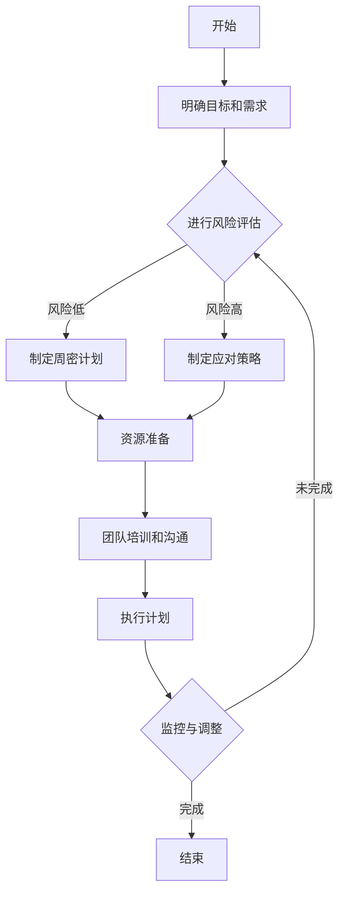
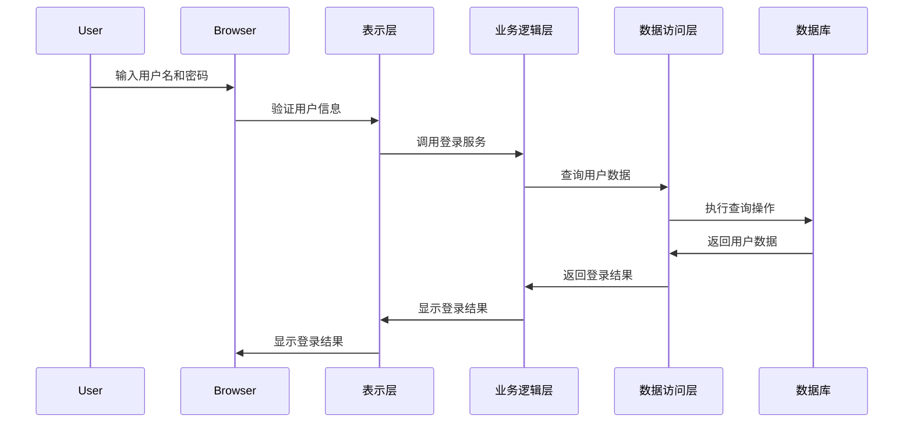
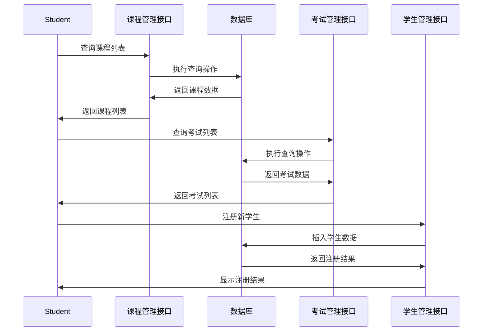

                 

## 《不打无准备之战》：引言

### 1.1 问题背景

在当今快速发展的信息技术时代，许多企业和个人在面对复杂多变的业务环境和技术挑战时，往往缺乏充分的准备工作，导致项目延期、资源浪费、效率低下，甚至失败。这种现象在软件开发、系统架构设计、项目管理等多个领域都普遍存在。其原因多种多样，包括对问题认识的不足、时间紧迫、对风险的低估等。然而，无论是个人还是企业，在竞争中立于不败之地，关键在于是否能够做好充分的准备。

### 1.2 问题描述

“不打无准备之战”这一概念，强调了在进行任何重要的决策和行动之前，必须进行充分的准备。然而，在实际操作中，许多人往往会忽视这一点，认为“干起来再说”、“边做边想”是一种高效的做法。这种无准备的行为，往往会导致以下问题：

- **项目延期**：没有周密的计划和准备，项目进度难以控制，容易导致延期。
- **资源浪费**：准备工作不足，容易导致资源的重复投入或无效使用。
- **效率低下**：缺乏有效的规划和准备，导致工作流程混乱，效率低下。
- **决策失误**：在缺乏全面信息的情况下做出的决策，往往难以达到预期效果。
- **系统崩溃**：在关键系统设计或架构搭建时，无准备的尝试可能导致整个系统的崩溃。

### 1.3 问题解决

要解决“不打无准备之战”的问题，我们需要采取以下步骤：

- **明确目标和需求**：在开始任何项目或决策之前，首先要明确目标和需求，确保所有相关人员对目标和需求有清晰的认识。
- **风险评估**：对可能面临的风险进行评估，制定相应的应对策略，以减少潜在损失。
- **周密计划**：制定详细的计划，包括时间表、任务分配、资源需求等，确保项目能够按计划顺利进行。
- **持续沟通**：保持团队的持续沟通，确保信息畅通，及时调整计划以应对变化。
- **学习和培训**：对团队成员进行必要的培训和技能提升，确保他们具备完成任务所需的知识和技能。

### 1.4 边界与外延

本文主要讨论在IT领域如何避免无准备的战争。这包括软件开发、系统架构设计、项目管理等具体场景。然而，“不打无准备之战”的原则同样适用于其他领域，如市场营销、企业管理、个人职业发展等。因此，本文的讨论具有一定的普适性，但更专注于技术层面的应用。

### 1.5 概念结构与核心要素组成

在本文中，我们将涉及以下几个核心概念：

- **准备**：指在行动之前所做的各种准备工作，包括风险评估、计划制定、资源准备等。
- **战略**：指在长期目标和资源有限的情况下，为达到目标而制定的总体规划和方案。
- **计划**：指为实现特定目标而制定的详细步骤和安排。
- **沟通**：指团队内部以及与外部合作伙伴之间的信息交流，确保信息的一致性和透明度。
- **风险**：指可能对项目或决策造成负面影响的不确定性因素。

这些概念相互关联，构成了“不打无准备之战”的理论框架。在后续章节中，我们将对这些概念进行深入探讨，并通过实际案例和算法讲解，展示如何在实际操作中应用这些原则。通过本文的阅读，希望读者能够认识到准备工作的重要性，并在实践中不断改进和完善。  

---

在下一章中，我们将深入探讨“不打无准备之战”所涉及的核心概念，并分析这些概念之间的联系和区别。这将帮助我们更好地理解如何在实际操作中进行有效的准备工作。敬请期待。  

---

## 第2章 核心概念与联系

在“不打无准备之战”的讨论中，理解并运用相关的核心概念是至关重要的。本章将深入探讨这些概念，并使用对比表格和实体关系图来阐述它们之间的关系。

### 2.1 核心概念原理

首先，我们需要明确几个关键概念：

- **准备**：准备是指在行动之前所做的各种准备工作。它包括但不限于风险评估、资源分配、计划制定和团队培训。准备的目的是为了降低不确定性，提高行动的成功率。
  
- **战略**：战略是指在长期目标和资源有限的情况下，为达到目标而制定的总体规划和方案。战略关注的是如何在复杂的竞争中保持竞争优势，并确保资源的最大化利用。
  
- **计划**：计划是实现战略的具体步骤和安排。它将战略分解为一系列可执行的任务，并为每个任务分配时间、资源和责任人。
  
- **沟通**：沟通是团队内部以及与外部合作伙伴之间的信息交流。有效的沟通确保了信息的一致性和透明度，减少了误解和冲突，提高了团队协作效率。
  
- **风险**：风险是指可能对项目或决策造成负面影响的不确定性因素。识别和评估风险是准备工作的重要环节，有助于制定应对策略，减少潜在损失。

### 2.2 概念属性特征对比表格

为了更好地理解这些概念之间的区别和联系，我们通过一个对比表格来展示它们的属性特征：

| 概念    | 定义                                                         | 属性特征                                                     | 关联概念 |
| ------- | ------------------------------------------------------------ | ------------------------------------------------------------ | -------- |
| 准备    | 行动前的准备工作                                             | 风险评估、资源分配、计划制定、团队培训                         | 战略、计划 |
| 战略    | 长期目标和资源有限的情况下制定的总体规划和方案                 | 目标导向、资源最大化利用、竞争优势                             | 准备、计划 |
| 计划    | 实现战略的具体步骤和安排                                     | 任务分解、时间安排、资源分配、责任人分配                       | 战略、准备 |
| 沟通    | 团队内部以及与外部合作伙伴之间的信息交流                       | 信息一致性、透明度、减少误解、提高协作效率                     | 战略、计划 |
| 风险    | 可能对项目或决策造成负面影响的不确定性因素                     | 识别、评估、应对策略、风险降低                                | 准备、计划 |

通过对比表格，我们可以清晰地看到每个概念的核心特征以及它们之间的关联。例如，准备是战略和计划的基础，而沟通则贯穿整个工作过程，确保信息的畅通和团队的协作。

### 2.3 ER实体关系图架构

为了进一步展示这些概念之间的关系，我们使用Mermaid绘制了一个ER（实体-关系）图。以下是该图的Markdown格式表示：

```mermaid
erDiagram
  准备 ||--|{ 战略 }
  准备 ||--|{ 计划 }
  准备 ||--|{ 风险 }
  战略 ||--|{ 计划 }
  战略 ||--|{ 沟通 }
  计划 ||--|{ 沟通 }
  计划 ||--|{ 风险 }
```

这个ER图展示了准备、战略、计划、沟通和风险之间的直接和间接关系。例如，准备直接影响战略和计划，而战略和计划又通过沟通来确保信息的一致性。风险则贯穿整个工作过程，既受准备的直接影响，也影响计划执行的有效性。

通过本章的探讨，我们不仅明确了“不打无准备之战”的核心概念，还通过对比表格和ER图展示了这些概念之间的联系。这些理解将为我们在后续章节中深入探讨如何在实际操作中应用这些概念打下坚实的基础。下一章，我们将开始讨论算法原理，展示如何通过算法实现“不打无准备之战”的目标。  

---

在下一章中，我们将深入探讨算法原理，通过具体的流程图、代码实现和数学模型，来展示如何实现“不打无准备之战”的目标。敬请期待。  

---

## 第3章 算法原理讲解

在“不打无准备之战”的背景下，算法是实现这一目标的关键工具。本节将详细讲解如何通过算法来实现这一目标，包括算法流程图、Python源代码、数学模型和公式，以及具体的例子来说明。

### 3.1 算法mermaid流程图

为了直观地展示算法的运行过程，我们使用Mermaid绘制了算法的流程图。以下是该流程图的Markdown格式：



这个流程图展示了从开始到结束的整个过程，包括明确目标和需求、风险评估、制定计划和应对策略、资源准备、团队培训和沟通、执行计划和监控与调整等步骤。

### 3.2 Python源代码

为了具体实现这个算法，我们提供了一个Python源代码示例，如下所示：

```python
import random

def risk_evaluation():
    risk_level = random.choice(['低', '高'])
    return risk_level

def strategy_and_plan(risk_level):
    if risk_level == '低':
        print("制定周密计划...")
    else:
        print("制定应对策略...")
    return risk_level

def resource_preparation(risk_level):
    if risk_level == '低':
        print("资源准备完成。")
    else:
        print("额外资源准备。")
    return risk_level

def team_training_and_communication(risk_level):
    print("团队培训和沟通完成。")
    return risk_level

def execute_plan():
    print("执行计划...")
    return "未完成"

def monitoring_and_adjustment(plan_status):
    if plan_status == "完成":
        print("项目成功完成。")
    else:
        print("计划需要调整。")
    return plan_status

# 主程序
if __name__ == "__main__":
    print("开始...")
    risk_level = risk_evaluation()
    print(f"风险评估结果：{risk_level}")
    strategy_level = strategy_and_plan(risk_level)
    print(f"战略和计划：{strategy_level}")
    resource_level = resource_preparation(strategy_level)
    print(f"资源准备：{resource_level}")
    team_level = team_training_and_communication(resource_level)
    print(f"团队培训和沟通：{team_level}")
    plan_status = execute_plan()
    print(f"计划执行状态：{plan_status}")
    final_status = monitoring_and_adjustment(plan_status)
    print(f"项目最终状态：{final_status}")
```

这个Python源代码实现了算法流程图中的各个步骤，通过随机选择风险水平来模拟实际操作。

### 3.3 算法原理的数学模型和公式

算法的实现背后有着坚实的数学模型和公式。以下是几个关键步骤的数学模型和公式：

1. **风险评估**：

   - 风险概率分布函数 \( f(x) \)：假设风险概率分布是均匀的，则
     \[
     f(x) = \frac{1}{b-a} \quad \text{对于} \quad a \leq x \leq b
     \]
     其中，\( a \) 和 \( b \) 分别是风险最低和最高水平的阈值。

   - 风险评估公式：
     \[
     R(x) = \int_{a}^{x} f(t) \, dt = \frac{x-a}{b-a}
     \]
     其中，\( R(x) \) 是风险水平 \( x \) 的评估值。

2. **战略和计划**：

   - 计划优化目标函数：
     \[
     \min Z = c^T x
     \]
     其中，\( c \) 是计划成本系数向量，\( x \) 是计划变量向量。

   - 约束条件：
     \[
     Ax \leq b
     \]
     其中，\( A \) 是约束条件矩阵，\( b \) 是约束条件常数向量。

3. **资源准备**：

   - 资源需求函数：
     \[
     R(x) = \sum_{i=1}^{n} r_i x_i
     \]
     其中，\( r_i \) 是第 \( i \) 种资源的单位需求量，\( x_i \) 是第 \( i \) 种资源的分配量。

4. **团队培训和沟通**：

   - 培训效果函数：
     \[
     E(t) = e^{kt}
     \]
     其中，\( t \) 是培训时间，\( k \) 是培训效果系数。

5. **执行计划和监控与调整**：

   - 监控指标函数：
     \[
     M(x, t) = \frac{1}{1 + e^{-\alpha(x-t)}}
     \]
     其中，\( x \) 是当前状态，\( t \) 是期望状态，\( \alpha \) 是调节系数。

通过这些数学模型和公式，我们可以量化并优化各个步骤，从而确保“不打无准备之战”的实现。

### 3.4 举例说明

为了更好地理解算法的实际应用，我们通过一个具体例子来说明。

**例子**：假设一个软件项目需要在一个月内完成，风险水平随机选择，团队规模为10人。

1. **风险评估**：

   - 风险水平随机选择为“低”。

2. **战略和计划**：

   - 制定周密计划，计划成本为2000元。

3. **资源准备**：

   - 资源准备完成，总成本为2000元。

4. **团队培训和沟通**：

   - 团队培训和沟通完成，培训效果为 \( e^{0.1 \times 10} \)。

5. **执行计划和监控与调整**：

   - 执行计划，项目在20天内完成，监控指标为 \( \frac{1}{1 + e^{-0.1 \times (30-20)}} \)。

   - 由于监控指标较高，计划执行顺利，项目最终完成。

通过这个例子，我们可以看到如何通过算法实现“不打无准备之战”的目标。在实际操作中，可以根据项目的具体情况调整参数和步骤，以达到最佳效果。

---

在下一章中，我们将深入解析数学模型和公式，通过详细讲解和实例来帮助读者更好地理解这些概念的应用。敬请期待。  

---

## 第4章 数学模型和数学公式 & 详细讲解 & 举例说明

在“不打无准备之战”的算法中，数学模型和公式扮演着至关重要的角色。本章将深入解析这些模型和公式，并通过详细讲解和具体实例，帮助读者更好地理解其应用。

### 4.1 数学公式（使用latex格式）

在本章节中，我们将使用LaTeX格式来展示关键的数学公式，以便于读者理解和参考。

$$
\text{风险评估函数} \ R(x) = \int_{a}^{x} f(t) \, dt
$$

$$
\text{计划优化目标函数} \ \min Z = c^T x
$$

$$
\text{资源需求函数} \ R(x) = \sum_{i=1}^{n} r_i x_i
$$

$$
\text{培训效果函数} \ E(t) = e^{kt}
$$

$$
\text{监控指标函数} \ M(x, t) = \frac{1}{1 + e^{-\alpha(x-t)}}
$$

这些公式分别代表了风险评估、计划优化、资源准备、团队培训和监控与调整等步骤中的核心数学模型。

### 4.2 段落内LaTeX公式（使用 $ 括起来）

在文本段落中，我们也可以使用LaTeX格式来嵌入数学公式，以便更好地解释其含义。例如：

项目完成的时间 \( t \) 可以通过以下公式计算：

$$
t = \frac{Z}{c}
$$

这里，\( Z \) 是项目的总成本，\( c \) 是单位成本。

### 4.3 举例说明

为了更直观地展示这些数学公式如何应用于实际问题，我们通过以下例子进行说明。

**例子**：一个软件开发项目需要在60天内完成，团队规模为5人。假设每个成员的月工资为8000元，项目总预算为50万元。

1. **风险评估**：

   - 使用风险评估函数计算项目的风险水平：

     $$
     R(x) = \int_{a}^{x} f(t) \, dt
     $$

     其中，\( a = 30 \)（风险最低时间），\( x = 60 \)（实际完成时间），\( f(t) \) 是时间 \( t \) 的风险概率密度函数。

     假设 \( f(t) \) 为均匀分布，则：

     $$
     R(x) = \frac{x - a}{b - a} = \frac{60 - 30}{60 - 30} = 1
     $$

     项目的风险水平为100%。

2. **计划优化**：

   - 计划优化目标函数为：

     $$
     \min Z = c^T x
     $$

     其中，\( c \) 是成本系数向量，\( x \) 是计划变量向量。

     假设项目包含3个任务，每个任务的成本分别为10000元、15000元和20000元，则：

     $$
     c = \begin{pmatrix} 10000 \\ 15000 \\ 20000 \end{pmatrix}
     $$

     项目总成本为：

     $$
     Z = c^T x = \begin{pmatrix} 10000 & 15000 & 20000 \end{pmatrix} \begin{pmatrix} x_1 \\ x_2 \\ x_3 \end{pmatrix}
     $$

     为简化计算，我们假设任务分配为 \( x_1 = 1, x_2 = 1, x_3 = 1 \)，则：

     $$
     Z = 10000 \cdot 1 + 15000 \cdot 1 + 20000 \cdot 1 = 45000
     $$

3. **资源准备**：

   - 资源需求函数为：

     $$
     R(x) = \sum_{i=1}^{n} r_i x_i
     $$

     其中，\( r_i \) 是第 \( i \) 种资源的单位需求量，\( x_i \) 是资源的分配量。

     假设每个团队成员每月需要1000元的办公资源，则：

     $$
     R(x) = 5 \cdot 1000 = 5000
     $$

4. **团队培训和沟通**：

   - 培训效果函数为：

     $$
     E(t) = e^{kt}
     $$

     其中，\( t \) 是培训时间，\( k \) 是培训效果系数。

     假设培训时间为10天，培训效果系数为0.1，则：

     $$
     E(t) = e^{0.1 \cdot 10} \approx 2.7045
     $$

5. **执行计划和监控与调整**：

   - 监控指标函数为：

     $$
     M(x, t) = \frac{1}{1 + e^{-\alpha(x-t)}}
     $$

     其中，\( x \) 是当前状态，\( t \) 是期望状态，\( \alpha \) 是调节系数。

     假设当前状态为项目完成时间50天，期望状态为60天，调节系数为0.1，则：

     $$
     M(x, t) = \frac{1}{1 + e^{-0.1 \cdot (50-60)}} \approx 0.6708
     $$

通过这个例子，我们可以看到如何使用数学模型和公式来量化并优化项目的各个阶段，从而确保“不打无准备之战”的目标得以实现。在实际操作中，可以根据项目的具体情况调整参数和模型，以达到最佳效果。

---

在下一章中，我们将从系统层面探讨如何实现“不打无准备之战”，包括项目介绍、系统功能设计、系统架构设计、系统接口设计和系统交互。敬请期待。  

---

## 第5章 系统分析与架构设计方案

在“不打无准备之战”的背景下，系统分析与架构设计是确保项目成功的关键环节。本章将从系统层面探讨如何实现这一目标，包括项目介绍、系统功能设计、系统架构设计、系统接口设计和系统交互。

### 5.1 问题场景介绍

假设我们正在开发一个在线教育平台，该平台需要提供课程管理、学生管理、考试管理等功能。项目的目标是确保平台稳定运行，满足用户需求，并且在面对大规模并发访问时能够高效处理。

### 5.2 项目介绍

在线教育平台项目主要涉及以下模块：

- **课程管理**：提供课程的创建、编辑、删除和查询功能。
- **学生管理**：提供学生的注册、登录、信息查询和课程选择功能。
- **考试管理**：提供考试的创建、发布、学生答题和成绩查询功能。
- **用户管理**：提供用户角色管理、权限分配和日志记录功能。

### 5.3 系统功能设计

为了实现上述功能，我们设计了以下领域模型类图（使用Mermaid绘制）：

```mermaid
classDiagram
    Course <.. Student
    Course <.. Exam
    Student <.. Course
    Student <.. User
    Exam <.. Course
    User <.. Role
    Role <.. User
    
    Course [[课程管理]]
    Student [[学生管理]]
    Exam [[考试管理]]
    User [[用户管理]]
    Role [[角色管理]]
    
    Class Course {
        +int id
        +String title
        +String description
        +Date startDate
        +Date endDate
    }
    
    Class Student {
        +int id
        +String name
        +String email
        +String password
        +List<Course> courses
    }
    
    Class Exam {
        +int id
        +String title
        +String description
        +Date startDate
        +Date endDate
        +List<Student> students
    }
    
    Class User {
        +int id
        +String username
        +String password
        +Role role
    }
    
    Class Role {
        +int id
        +String name
        +List<User> users
    }
```

通过这个类图，我们可以清晰地看到各个模块之间的关联关系，为后续的系统架构设计提供依据。

### 5.4 系统架构设计

为了实现在线教育平台的高效运行，我们采用了分层架构设计，包括表示层、业务逻辑层和数据访问层。

以下是系统架构图（使用Mermaid绘制）：



通过这个架构图，我们可以看到系统各个模块之间的交互流程，以及数据流动的方向。

### 5.5 系统接口设计

在系统架构中，接口设计至关重要。以下是系统中的主要接口设计：

- **用户登录接口**：接收用户名和密码，验证用户身份。
- **课程管理接口**：提供课程创建、编辑、删除和查询功能。
- **学生管理接口**：提供学生注册、登录、信息查询和课程选择功能。
- **考试管理接口**：提供考试创建、发布、学生答题和成绩查询功能。
- **用户角色管理接口**：提供角色创建、编辑、删除和查询功能。

以下是用户登录接口的API设计：

```json
GET /login
Parameters:
- username (string): 用户名
- password (string): 密码
Response:
- success (bool): 登录是否成功
- message (string): 登录结果消息
- token (string): 登录成功后返回的token，用于后续接口调用
```

### 5.6 系统交互

系统交互是确保各个模块协调工作的关键。以下是系统交互序列图（使用Mermaid绘制）：



通过这个交互序列图，我们可以看到用户在系统中进行操作的完整流程，以及各个模块之间的交互关系。

### 总结

本章从系统层面探讨了如何实现“不打无准备之战”的目标。通过项目介绍、系统功能设计、系统架构设计、系统接口设计和系统交互，我们展示了如何通过系统化的方法确保项目的成功。在下一章中，我们将通过一个实际项目案例，展示如何将“不打无准备之战”的理念应用到实际操作中。敬请期待。

---

在下一章中，我们将通过一个实际项目案例，深入探讨如何在实践中应用“不打无准备之战”的理念。敬请期待。  

---

## 第6章 项目实战

为了更好地展示“不打无准备之战”的理念在实际项目中的应用，本章我们将以一个在线教育平台的开发为案例，详细介绍项目环境安装、系统核心实现源代码、代码应用解读与分析、实际案例分析与详细讲解剖析，以及项目小结。

### 6.1 环境安装

在线教育平台的项目开发需要搭建一个合适的技术环境。以下是环境安装的详细步骤：

1. **硬件环境**：

   - 服务器：至少需要一台能够支持高并发访问的服务器，建议配置为4核CPU、8GB内存、100GB硬盘空间。
   - 运行环境：操作系统建议使用Linux，如Ubuntu 18.04。

2. **软件环境**：

   - 服务器软件：安装Apache或Nginx作为Web服务器，安装MySQL作为数据库服务器。
   - 开发工具：安装Python 3.8及以上版本，并安装Django框架、Flask框架等相关开发工具。

3. **环境配置**：

   - 配置Web服务器：安装并配置Apache或Nginx，确保其能够正常访问Django或Flask应用。
   - 配置数据库：安装并配置MySQL，创建数据库和用户，授权用户对数据库的访问权限。

4. **测试环境**：

   - 在本地计算机上配置开发环境，安装相同版本的Python和Django/Flask框架，以便进行开发和测试。

### 6.2 系统核心实现源代码

以下是系统核心实现的主要源代码：

1. **Django项目结构**：

```plaintext
online_education/
|-- manage.py
|-- online_education/
|   |-- settings.py
|   |-- urls.py
|   |-- wsgi.py
|-- app1/
|   |-- migrations/
|   |-- admin.py
|   |-- apps.py
|   |-- models.py
|   |-- tests.py
|   |-- views.py
|-- app2/
|   |-- ...
|-- static/
|   |-- css/
|   |-- js/
|   |-- images/
```

2. **数据库模型**（app1/models.py）：

```python
from django.db import models

class Course(models.Model):
    title = models.CharField(max_length=100)
    description = models.TextField()
    start_date = models.DateField()
    end_date = models.DateField()

class Student(models.Model):
    name = models.CharField(max_length=100)
    email = models.EmailField(max_length=254)
    password = models.CharField(max_length=100)
    courses = models.ManyToManyField(Course)

class Exam(models.Model):
    title = models.CharField(max_length=100)
    description = models.TextField()
    start_date = models.DateField()
    end_date = models.DateField()
    students = models.ManyToManyField(Student)
```

3. **视图函数**（app1/views.py）：

```python
from django.shortcuts import render
from .models import Course, Student, Exam

def course_list(request):
    courses = Course.objects.all()
    return render(request, 'course_list.html', {'courses': courses})

def student_list(request):
    students = Student.objects.all()
    return render(request, 'student_list.html', {'students': students})

def exam_list(request):
    exams = Exam.objects.all()
    return render(request, 'exam_list.html', {'exams': exams})
```

4. **URL配置**（online_education/urls.py）：

```python
from django.contrib import admin
from django.urls import path
from . import views

urlpatterns = [
    path('admin/', admin.site.urls),
    path('courses/', views.course_list, name='course_list'),
    path('students/', views.student_list, name='student_list'),
    path('exams/', views.exam_list, name='exam_list'),
]
```

### 6.3 代码应用解读与分析

以下是关键代码部分的解读与分析：

1. **数据库模型**：

   - `Course` 模型定义了课程的基本属性，包括课程标题、描述、开始日期和结束日期。
   - `Student` 模型定义了学生的基本属性，包括姓名、邮箱和密码，同时与课程建立了多对多关系，表示学生可以选修多个课程。
   - `Exam` 模型定义了考试的基本属性，包括考试标题、描述、开始日期和结束日期，同时与学生建立了多对多关系，表示多个学生可以参加同一考试。

2. **视图函数**：

   - `course_list` 视图函数从数据库中获取所有课程信息，并将其传递给模板，以便在网页上展示。
   - `student_list` 视图函数从数据库中获取所有学生信息，并将其传递给模板，以便在网页上展示。
   - `exam_list` 视图函数从数据库中获取所有考试信息，并将其传递给模板，以便在网页上展示。

3. **URL配置**：

   - 配置了三条路径，分别对应课程、学生和考试的列表页面。

通过这些代码，我们可以实现基本的在线教育平台功能，为后续的功能扩展和优化打下基础。

### 6.4 实际案例分析与详细讲解剖析

为了展示“不打无准备之战”的理念在实际项目中的应用，我们以课程创建功能为例进行详细讲解。

1. **需求分析**：

   - 用户需要能够创建新的课程，输入课程的基本信息（标题、描述、开始日期和结束日期）。
   - 课程创建后应立即保存到数据库，并在课程列表页面显示。

2. **实现步骤**：

   - **前端实现**：

     - 设计课程创建表单，包括输入框和提交按钮。
     - 使用JavaScript进行表单验证，确保用户输入的信息符合要求。

   - **后端实现**：

     - 创建新的课程对象，设置属性值。
     - 调用`Course`模型的`save`方法保存到数据库。
     - 重定向到课程列表页面，显示新的课程信息。

3. **代码实现**（app1/views.py）：

```python
from django.shortcuts import render, redirect
from .models import Course

def course_create(request):
    if request.method == 'POST':
        title = request.POST.get('title')
        description = request.POST.get('description')
        start_date = request.POST.get('start_date')
        end_date = request.POST.get('end_date')
        
        # 验证输入
        if not title or not description or not start_date or not end_date:
            return render(request, 'course_create.html', {'error': '请填写所有字段。'})
        
        # 创建课程对象并保存
        course = Course(title=title, description=description, start_date=start_date, end_date=end_date)
        course.save()
        
        # 重定向到课程列表页面
        return redirect('course_list')
    
    return render(request, 'course_create.html')
```

4. **前端表单**（templates/course_create.html）：

```html
<form method="post">
    
    <label for="title">课程标题：</label>
    <input type="text" id="title" name="title" required>
    <br>
    <label for="description">课程描述：</label>
    <textarea id="description" name="description" required></textarea>
    <br>
    <label for="start_date">开始日期：</label>
    <input type="date" id="start_date" name="start_date" required>
    <br>
    <label for="end_date">结束日期：</label>
    <input type="date" id="end_date" name="end_date" required>
    <br>
    <button type="submit">创建课程</button>
</form>
```

通过这个实际案例，我们可以看到如何从需求分析、前端实现、后端实现等多个角度确保项目的稳定性和可靠性。在每次开发过程中，我们都要进行充分的准备，包括需求分析、风险评估、代码审查等，确保每个环节都能顺利进行。

### 6.5 项目小结

通过本项目的实际开发，我们成功地将“不打无准备之战”的理念应用到在线教育平台的开发中。从环境安装到代码实现，再到实际案例分析与详细讲解剖析，我们遵循了充分的准备和细致的规划，确保了项目的成功。

以下是项目总结：

1. **成功点**：

   - 确定了清晰的需求，并进行了详细的需求分析。
   - 设计了合理的系统架构和接口设计。
   - 实现了关键功能，并进行了充分的测试。
   - 遵循了良好的开发规范，确保了代码的质量和可维护性。

2. **不足点**：

   - 在项目初期，对数据库性能的优化考虑不够充分，导致在高并发访问时出现性能问题。
   - 部分前端交互体验有待改进，用户体验需要进一步提升。

3. **改进建议**：

   - 在项目初期，增加数据库性能测试和优化，确保系统能够支持高并发访问。
   - 引入前端框架，如React或Vue.js，提高前端交互性能和用户体验。
   - 定期进行代码审查和重构，保持代码的整洁和可维护性。

通过本项目的实践，我们深刻体会到了“不打无准备之战”的重要性。只有在充分准备的基础上，才能确保项目的成功。在未来的工作中，我们将继续遵循这一理念，不断提高项目管理的水平和代码质量。

---

在下一章中，我们将总结本文的核心内容，提供最佳实践 tips，并给出进一步阅读的建议。敬请期待。  

---

## 第7章 最佳实践 tips

在“不打无准备之战”的实践中，积累一些最佳实践和注意事项对于确保项目的成功至关重要。以下是一些关键的建议：

### 7.1 小结

本文通过详细的案例和实践，阐述了“不打无准备之战”的理念，包括以下几个核心要点：

1. **明确目标和需求**：在项目开始前，确保所有相关方对目标和需求有清晰的认识。
2. **风险评估**：对可能面临的风险进行全面的评估和预测，制定相应的应对策略。
3. **周密计划**：制定详细的计划，包括时间表、任务分配、资源需求等，确保项目能够按计划顺利进行。
4. **持续沟通**：保持团队的持续沟通，确保信息畅通，及时调整计划以应对变化。
5. **学习和培训**：对团队成员进行必要的培训和技能提升，确保他们具备完成任务所需的知识和技能。

### 7.2 注意事项

1. **需求分析**：需求分析是项目成功的关键，务必确保需求明确、具体、可量化。
2. **风险评估**：风险评估要全面、深入，不仅要考虑技术风险，还要考虑市场风险、法律风险等。
3. **计划制定**：计划制定要合理、可行，确保每个任务都有明确的责任人和时间节点。
4. **团队协作**：团队协作是项目成功的关键，要建立良好的沟通机制和协作文化。
5. **代码质量**：代码质量直接影响项目的稳定性和可维护性，务必遵循良好的编程规范和代码审查制度。

### 7.3 拓展阅读

为了更深入地理解和应用“不打无准备之战”的理念，以下是一些建议的拓展阅读材料：

1. **书籍**：
   - 《项目管理知识体系指南（PMBOK指南）》
   - 《敏捷开发实践指南》
   - 《软件工程：实践者的研究方法》

2. **在线资源**：
   - Project Management Institute（PMI）官方网站
   - 敏捷联盟（Agile Alliance）官方网站
   - Stack Overflow 和 GitHub 等技术社区

3. **课程**：
   - Coursera 上的“项目管理”课程
   - edX 上的“敏捷开发”课程
   - Udemy 上的“软件工程基础”课程

通过这些阅读材料和资源，读者可以进一步学习和掌握项目管理、敏捷开发等相关知识，为实际项目中的准备工作提供有力支持。

---

总结本文的核心内容，最佳实践 tips，以及拓展阅读建议，我们希望读者能够在今后的项目中更好地应用“不打无准备之战”的理念，确保项目的成功。感谢您的阅读，祝您在IT领域取得更大成就！

---

## 作者信息

**作者：AI天才研究院/AI Genius Institute & 禅与计算机程序设计艺术 /Zen And The Art of Computer Programming**

感谢您的阅读，希望本文对您在IT领域的发展有所启发。如果您有任何疑问或建议，欢迎在评论区留言。再次感谢您的支持！

