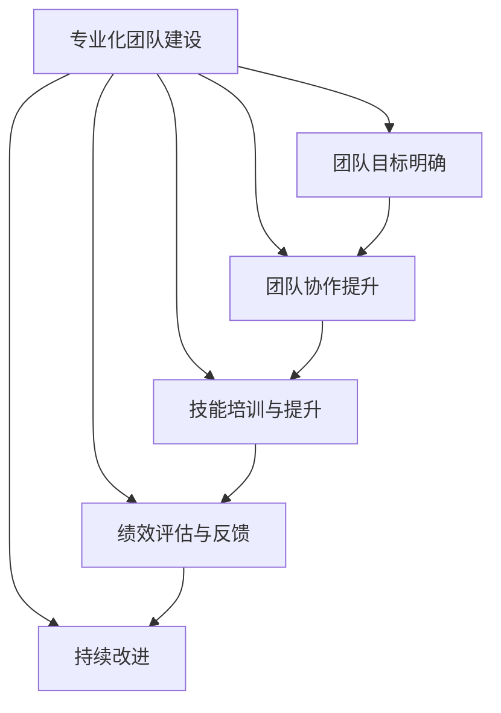
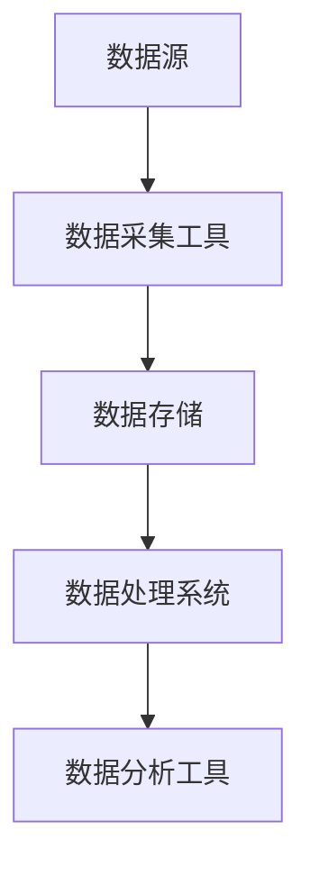
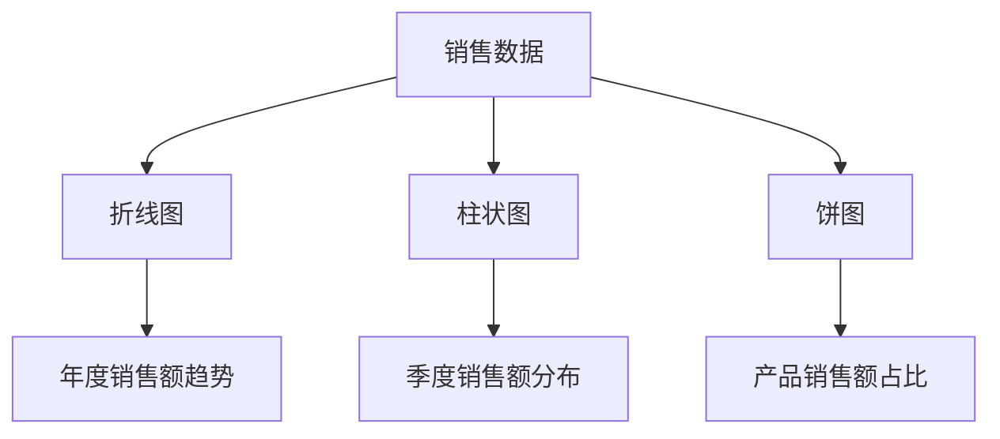
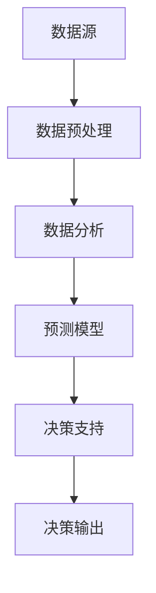
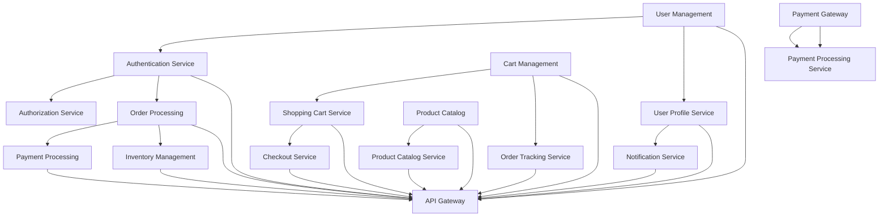
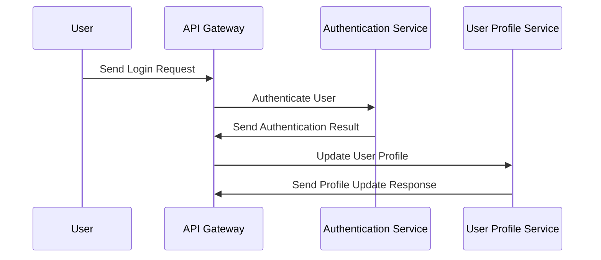
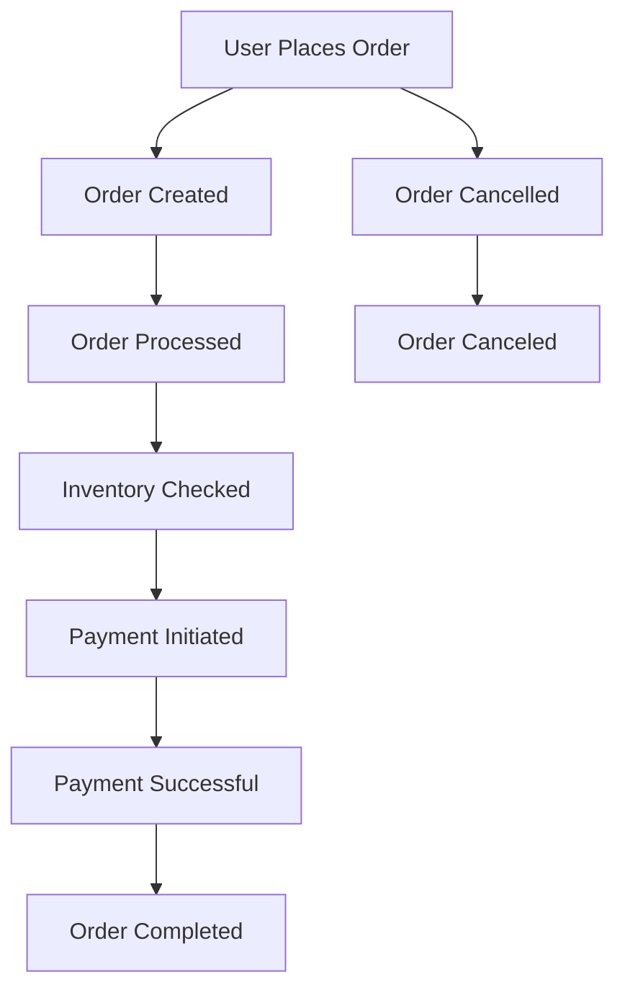

                 

### 引言

#### 专业化团队建设的背景和意义

在当今快速变化的技术时代，企业的竞争力越来越依赖于其团队的专业化程度和创新能力。专业化团队建设不仅是一个趋势，更是企业夯实发展基础的关键。随着全球化和数字化的加速推进，企业面临着前所未有的竞争压力和挑战。在这样的背景下，专业化团队建设显得尤为重要。

**专业化团队**指的是那些具备明确目标、高效协作和高技能水平的团队。这种团队通常拥有清晰的职责分工，每个成员都专注于自己的专业领域，从而实现资源的最优配置和协同效应。专业化团队建设的目标是提升团队的整体绩效，增强团队凝聚力，并激发团队的创新能力，从而在激烈的市场竞争中脱颖而出。

专业化团队建设的重要性主要体现在以下几个方面：

1. **提高团队整体绩效**：通过专业化分工和协作，团队成员可以更加专注于自己的工作，提高工作效率和质量，从而提升整个团队的绩效。

2. **增强团队凝聚力**：专业化团队通常拥有共同的目标和愿景，这种共同的目标可以增强团队成员之间的凝聚力，促进团队的合作和协作。

3. **激发团队创新能力**：专业化团队因为成员的专业技能和丰富的经验，往往能够提出创新的解决方案，从而推动企业的持续发展。

4. **提升企业竞争力**：专业化团队建设能够提升企业的整体竞争力，使企业能够在市场中更快地响应变化，抢占市场先机。

因此，专业化团队建设不仅是企业发展的必然选择，也是企业夯实发展基础的关键。在接下来的文章中，我们将详细探讨专业化团队的概念与特点，团队建设的重要性，团队建设策略，以及如何通过持续改进推动团队发展。希望通过这篇文章，能够为读者提供一些有价值的思考和借鉴。

---

### 核心概念与联系

在深入探讨专业化团队建设之前，我们首先需要明确一些核心概念，并理解它们之间的相互联系。这些核心概念包括专业化团队、团队建设、团队目标明确、团队协作提升、技能培训与提升、绩效评估与反馈、以及持续改进。

**专业化团队**指的是那些由一群具备特定专业技能、知识结构和文化背景的人组成的团队。这些团队成员通常各自专注于不同的领域，但又能够在共同的目标下高效协作。专业化团队的特点是高度分工、专业技能突出、高效协作和快速响应。

**团队建设**是指通过一系列的策略和措施，提升团队的整体能力和绩效。团队建设的目标是建立一个高效、协作、创新和稳定的团队。团队建设包括明确团队目标、优化团队结构、提升团队协作、技能培训与提升、绩效评估与反馈和持续改进等多个方面。

**团队目标明确**是团队建设的基础。明确的团队目标可以引导团队成员的方向，确保团队的努力集中在一个共同的目标上。通过设定明确的团队目标，可以减少团队成员之间的分歧，提高协作效率。

**团队协作提升**是团队建设中的重要一环。高效的协作需要良好的沟通技巧、项目管理方法和团队文化建设。通过提升团队协作，可以最大限度地发挥团队成员的潜力，实现团队的整体目标。

**技能培训与提升**是确保团队专业化的关键。通过培训，团队成员可以不断更新和提升自己的专业技能，从而提高团队的整体能力。技能培训与提升不仅包括技术技能，还包括管理技能和软技能。

**绩效评估与反馈**是团队建设中的重要环节。通过科学的绩效评估，可以了解团队成员的工作表现，提供有针对性的反馈，帮助团队成员不断改进。绩效评估与反馈机制可以激励团队成员提高工作效率和质量。

**持续改进**是团队发展的动力。通过持续改进，团队可以不断优化自己的工作流程和协作模式，提高整体绩效。持续改进需要建立在一个数据驱动的决策基础上，通过数据收集、分析和可视化，团队可以更好地了解自身的工作状况，并作出科学的改进决策。

这些核心概念之间的联系可以概括为：专业化团队是团队建设的目标，团队建设是实现专业化团队的手段；团队目标明确是团队建设的基础，团队协作提升、技能培训与提升、绩效评估与反馈和持续改进是实现团队目标的关键环节。通过这些核心概念和联系的理解，我们可以更系统地思考和实施专业化团队建设。

### Mermaid 流程图

为了更好地理解专业化团队建设的各个步骤及其相互关系，我们可以使用Mermaid语言绘制一个流程图。以下是Mermaid代码示例：



这段代码将生成一个流程图，展示了专业化团队建设的主要步骤及其之间的逻辑关系：

1. **专业化团队建设**：作为整体过程，专业化团队建设包括多个关键环节。
2. **团队目标明确**：这是团队建设的第一步，为团队成员提供明确的方向和目标。
3. **团队协作提升**：通过提升团队协作，增强团队成员之间的沟通和合作。
4. **技能培训与提升**：确保团队成员具备必要的专业技能，通过培训提升整体能力。
5. **绩效评估与反馈**：对团队成员的工作进行评估，提供反馈，帮助其改进。
6. **持续改进**：通过持续改进，不断优化团队的工作流程和协作模式。

通过这个流程图，我们可以清晰地看到专业化团队建设是一个动态的、循环的过程，各个环节相互关联、相互影响，共同推动团队的发展。

### 核心概念与联系（续）

为了进一步理解专业化团队建设中的核心概念，我们可以通过一个详细的Mermaid流程图来展示这些概念之间的联系。以下是Mermaid代码示例：

```mermaid
graph TD
    A[专业化团队](#FFD700)
    B[团队目标明确](#87CEEB)
    C[团队协作提升](#87CEEB)
    D[技能培训与提升](#FFD700)
    E[绩效评估与反馈](#FFD700)
    F[持续改进](#FFD700)

    subgraph 关键环节
        B
        C
        D
        E
        F
    end

    subgraph 关联关系
        A --> B
        A --> C
        A --> D
        A --> E
        A --> F
        B --> C
        C --> D
        D --> E
        E --> F
    end

    B ..> C[协同效应]
    C ..> D[技能应用]
    D ..> E[绩效评估]
    E ..> F[反馈循环]
    F --> A[持续发展]
```

这段代码生成的Mermaid流程图包含以下几个部分：

1. **专业化团队**：这是整个团队建设过程的起点，也是目标。专业化团队通过明确的目标和高效的协作实现持续发展。
   
2. **团队目标明确**：这是团队建设的基础，通过设定清晰的目标，确保团队成员的努力方向一致。

3. **团队协作提升**：团队目标的实现需要高效的协作。通过提升团队协作，增强团队成员之间的沟通和合作。

4. **技能培训与提升**：为了实现高效协作，团队成员需要具备必要的专业技能。通过培训，提升团队整体技能水平。

5. **绩效评估与反馈**：通过绩效评估，了解团队成员的工作表现，提供有针对性的反馈，帮助团队成员不断改进。

6. **持续改进**：持续改进是团队发展的动力，通过不断优化工作流程和协作模式，提升团队的整体绩效。

这些环节通过协同效应、技能应用、绩效评估和反馈循环等相互联系，形成一个动态的、循环的过程。通过这个流程图，我们可以更直观地理解专业化团队建设中的核心概念及其相互关系，有助于我们系统地思考和实施团队建设策略。

### 专业化团队的概念与特点

专业化团队是指由一群具备特定专业技能、知识结构和文化背景的人组成的团队，这些成员通常各自专注于不同的领域，但又能在共同的目标下高效协作。专业化团队具有以下显著特点：

**1. 高度分工**

专业化团队的特点之一是高度分工。每个团队成员都有明确的职责和任务，专注于自己的专业领域。这种分工不仅有助于提高工作效率，还可以确保每个成员在自己的领域内发挥最大的潜力。例如，在一个软件开发团队中，可能会有前端开发人员、后端开发人员、测试工程师和产品经理等，每个人负责不同但相互关联的任务。

**2. 专业技能突出**

专业化团队中的成员通常具有突出的专业技能。他们在自己的领域内拥有丰富的经验和知识，能够高效地完成工作任务。这种专业技能的突出不仅提高了团队的整体绩效，也为团队的创新提供了坚实的基础。例如，一个数据科学团队中，数据分析师和数据工程师可能具备高级的统计和编程技能，能够处理复杂的分析任务。

**3. 高效协作**

专业化团队不仅需要专业技能，还需要高效的协作。通过明确的沟通机制和协作工具，团队成员可以快速地共享信息、协调工作，确保项目按时交付。高效的协作可以减少冗余工作，提高团队的响应速度和创新能力。例如，敏捷开发团队通过每日站立会议、迭代回顾等方式，确保团队成员之间的信息畅通和协作顺畅。

**4. 快速响应**

专业化团队通常能够快速响应变化。由于团队成员对各自领域的深入了解，他们能够迅速识别问题并提出解决方案。这种快速响应能力使团队能够在市场竞争中保持优势。例如，在需求变化频繁的互联网行业，专业化团队能够迅速调整策略，确保产品能够快速迭代和优化。

**5. 持续学习与成长**

专业化团队注重持续学习与成长。团队成员通过定期的培训和知识分享，不断更新和提升自己的专业技能。这种持续学习的文化不仅有助于团队保持竞争力，还能够激发团队成员的创新思维。例如，一些技术团队会定期组织技术沙龙、读书会等活动，促进团队成员之间的知识交流和技能提升。

通过以上特点，我们可以看到专业化团队不仅具备高效的工作能力和协作能力，还能够快速响应变化和持续成长。这些特点使得专业化团队在当前快速变化的市场环境中具有显著的竞争优势。

### 团队建设的重要性

团队建设是任何组织成功发展的关键因素之一。在专业化团队中，团队建设的重要性尤为突出，主要体现在以下几个方面：

**1. 提高团队整体绩效**

团队建设的一个核心目标是提高团队的整体绩效。通过明确团队目标、优化团队结构、提升团队协作以及专业技能培训，团队可以更好地协同工作，提高工作效率和成果质量。例如，在一个软件开发团队中，通过优化团队结构，明确每个成员的职责和任务，可以避免重复工作和资源浪费，提高开发效率。

**2. 增强团队凝聚力**

团队建设能够增强团队的凝聚力。通过建立共同的目标和愿景，团队成员之间可以形成一种强大的归属感，增强彼此的信任和协作意愿。例如，通过定期的团队建设活动和团队文化建设，可以促进团队成员之间的交流和互动，增进彼此的了解和信任，从而提高团队的凝聚力。

**3. 提升团队创新能力**

专业化团队建设不仅有助于提高团队的整体绩效和凝聚力，还能显著提升团队的创新能力。通过技能培训、知识分享和跨部门合作，团队成员可以不断更新和扩展自己的知识体系，激发创新思维。例如，在产品开发过程中，通过团队头脑风暴和迭代设计，可以产生更多创新的解决方案，从而推动产品的持续改进。

**4. 促进个人职业发展**

团队建设不仅对团队整体有重要影响，也对团队成员的个人职业发展具有积极作用。通过参与团队建设和项目实践，团队成员可以不断学习和成长，提升自己的专业技能和综合素质。例如，通过参与重要的项目，团队成员可以获得更多的实践经验，提升自己的项目管理能力和领导力。

**5. 提高企业竞争力**

最后，团队建设对企业的竞争力提升也有着重要影响。一个高效的、协作的团队可以在市场上更快地响应变化，更灵活地应对挑战。通过不断提升团队的整体能力和创新能力，企业可以在市场竞争中脱颖而出，获得更大的竞争优势。例如，在技术快速更新的行业中，一个具备高效创新能力的团队可以迅速推出新产品，占领市场先机。

总之，团队建设是专业化团队成功发展的基石。通过明确团队目标、优化团队结构、提升团队协作、专业技能培训、绩效评估与反馈以及持续改进，团队可以不断提高整体绩效和创新能力，增强团队凝聚力，促进个人职业发展，从而提高企业的竞争力。因此，团队建设不仅是一项重要的工作，也是企业长期发展的重要战略。

### 团队建设策略

团队建设是一个系统化的过程，涉及多个关键环节，包括明确团队目标、优化团队结构、提升团队协作、技能培训与提升、绩效评估与反馈以及持续改进。以下是这些环节的详细分析：

**1. 明确团队目标**

明确团队目标是团队建设的第一步，也是关键的一步。一个清晰明确的团队目标可以引导团队成员的方向，确保所有人的努力都集中在同一个目标上。团队目标的设定需要遵循SMART原则，即具体（Specific）、可衡量（Measurable）、可实现（Achievable）、相关性（Relevant）和时限性（Time-bound）。例如，一个软件开发团队的年度目标可以是“在六个月内发布一个功能完备的新产品，并确保用户满意度达到90%以上”。

**2. 优化团队结构**

团队结构是团队建设的重要基础。一个优化的团队结构能够确保团队成员的职责明确、资源合理分配，从而提高工作效率。团队结构的设计需要考虑多个因素，包括团队成员的专业技能、项目需求、组织文化等。常见的团队结构有职能型结构、项目型结构、矩阵型结构等。例如，在一个复杂的软件项目中，可能需要采用矩阵型结构，将项目团队成员分为开发组、测试组、产品组等，确保每个组都能够专注于自己的任务。

**3. 提升团队协作**

高效的团队协作是团队成功的关键。提升团队协作需要从多个方面入手，包括沟通技巧、项目管理方法和团队文化建设。沟通技巧是基础，团队成员需要能够清晰、准确地表达自己的想法和需求，同时也要能够倾听和理解他人的意见。项目管理方法则可以帮助团队更好地规划任务、分配资源、监控进度，确保项目按时交付。团队文化建设则是通过建立共同价值观和行为规范，增强团队成员之间的凝聚力和信任感。例如，通过定期的团队会议、头脑风暴会等活动，可以促进团队成员之间的沟通和协作。

**4. 技能培训与提升**

团队成员的专业技能水平直接影响到团队的整体能力。通过定期的技能培训与提升，团队成员可以不断更新和扩展自己的知识体系，提升工作效率和质量。技能培训的内容不仅包括技术技能，还包括管理技能和软技能。例如，开发人员可以通过技术研讨会、在线课程等方式学习最新的编程技术和框架，项目经理可以通过项目管理认证课程提升自己的项目管理能力。

**5. 绩效评估与反馈**

绩效评估与反馈是团队建设中不可或缺的一环。通过科学的绩效评估，可以了解团队成员的工作表现，提供有针对性的反馈，帮助团队成员不断改进。绩效评估标准需要明确、公正、透明，确保评估结果能够真实反映团队成员的工作表现。同时，及时、有效的反馈也是至关重要的，可以帮助团队成员了解自己的优势与不足，制定改进计划。例如，一个软件团队的绩效评估可以包括代码质量、任务完成率、团队协作等多个方面。

**6. 持续改进**

持续改进是团队建设的核心策略之一。通过不断优化工作流程、改进协作模式，团队可以不断提高整体绩效和创新能力。持续改进需要建立在一个数据驱动的决策基础上，通过数据收集、分析和可视化，团队可以更好地了解自身的工作状况，发现存在的问题和改进机会。例如，通过分析项目进度数据、用户反馈数据等，团队可以找出项目中的瓶颈和不足，并采取相应的改进措施。

总之，团队建设是一个系统化的过程，涉及多个关键环节。通过明确团队目标、优化团队结构、提升团队协作、技能培训与提升、绩效评估与反馈以及持续改进，团队可以不断提高整体绩效和创新能力，增强团队凝聚力，促进个人职业发展，从而提高企业的竞争力。

### 团队协作提升策略

在专业化团队中，团队协作的提升是确保团队目标实现和项目成功的关键环节。以下是一些具体的策略，用于提升团队协作：

**1. 沟通与协作技巧**

沟通是团队协作的基础，有效的沟通可以避免误解、提高工作效率。以下是一些沟通技巧：

- **明确表达**：确保团队成员能够清晰地表达自己的想法和需求，避免模糊不清的信息导致误解。
- **积极倾听**：倾听是沟通的重要组成部分。团队成员应该学会倾听他人的意见，理解他人的立场。
- **反馈与确认**：在沟通过程中，及时给予反馈并确认对方理解正确，可以有效减少信息误差。
- **使用适当的沟通工具**：根据不同的沟通需求，选择合适的沟通工具，如邮件、即时通讯软件、视频会议等。

**2. 项目管理方法**

项目管理方法对于提升团队协作至关重要。以下是一些常用的项目管理方法：

- **敏捷开发**：敏捷开发强调快速迭代和持续交付，通过每日站立会议、迭代回顾等方式，确保团队成员之间的信息畅通和协作顺畅。
- **Scrum**：Scrum是一种迭代式增量的项目管理方法，通过定期的Scrum会议，如每日站会、冲刺计划和回顾会，促进团队协作。
- **看板（Kanban）**：看板方法通过可视化工作流程，帮助团队识别瓶颈和优化工作流程，提高协作效率。

**3. 团队文化建设**

团队文化建设是提升团队协作的重要手段。以下是一些团队文化建设策略：

- **建立共同目标**：通过明确的团队目标，让每个成员都清楚自己的工作对于团队的重要性，从而增强归属感和协作意愿。
- **培养信任**：建立信任是团队协作的基础。通过团队建设活动、开放沟通和共同解决问题，增强团队成员之间的信任。
- **鼓励知识分享**：鼓励团队成员分享知识和经验，通过定期的技术分享会、内部培训等方式，促进知识流动和团队成长。
- **认可与奖励**：对团队成员的工作成果和协作表现给予认可和奖励，增强团队成员的积极性和满意度。

**4. 技术工具与平台**

现代技术工具和平台可以帮助团队提高协作效率。以下是一些常用的协作工具：

- **协作软件**：如Slack、Microsoft Teams等，用于实时沟通和信息共享。
- **项目管理工具**：如JIRA、Trello等，用于任务管理、进度跟踪和团队协作。
- **文档管理工具**：如Google Docs、Confluence等，用于文档创建、共享和协作。
- **版本控制工具**：如Git、SVN等，用于代码管理和协作开发。

**5. 跨部门协作**

在大型企业中，跨部门协作是团队协作的重要方面。以下是一些跨部门协作的策略：

- **明确职责和角色**：确保每个团队成员都清楚自己的职责和角色，减少跨部门协作中的模糊地带。
- **建立跨部门沟通机制**：通过定期的跨部门会议、沟通渠道等方式，确保信息的及时传递和问题的快速解决。
- **共享资源和信息**：鼓励不同部门共享资源和信息，提高协作效率。

通过上述策略，专业化团队可以显著提升协作效率，实现团队目标的顺利达成。有效的团队协作不仅能够提高项目质量和交付速度，还能增强团队的凝聚力和创新能力，为企业的长期发展奠定坚实基础。

### 技能培训与提升

技能培训与提升是专业化团队建设的重要组成部分，它不仅能够提高团队成员的专业技能，还能够增强团队的竞争力。以下是关于技能培训与提升的详细分析：

**1. 培训需求分析**

在开始培训之前，进行详尽的培训需求分析是至关重要的。这包括以下几个方面：

- **个人技能评估**：对团队成员进行技能评估，了解每个人的优势、劣势和潜在发展需求。
- **岗位技能要求**：分析不同岗位的技能要求，确保培训内容与岗位需求相匹配。
- **团队整体技能水平**：评估团队整体的技能水平，确定哪些技能需要重点培训。
- **未来趋势预测**：分析行业发展趋势和新技术，预测未来可能需要的技能。

通过这些分析，可以确保培训内容的针对性和实用性。

**2. 培训内容设计**

根据培训需求分析的结果，设计适合的培训内容。培训内容应包括以下几方面：

- **技术技能**：如编程语言、开发工具、数据库管理等，这些是团队成员日常工作所需的核心技能。
- **管理技能**：包括项目管理、团队领导力、沟通技巧等，这些技能对于团队成员的职业发展至关重要。
- **软技能**：如时间管理、冲突解决、跨文化沟通等，这些软技能能够提升团队成员的整体素质和团队协作效果。
- **新兴技术**：如人工智能、区块链、云计算等，这些新兴技术是未来行业发展的重点。

培训内容的设计应结合团队成员的实际情况，确保培训内容既实用又有前瞻性。

**3. 培训实施与评估**

培训的实施和评估是确保培训效果的关键环节。以下是一些实施和评估的策略：

- **培训方式**：根据培训内容的性质和团队成员的需求，选择合适的培训方式，如线上课程、面对面培训、实战演练等。线上课程可以灵活安排学习时间，面对面培训则能更好地互动和讨论。
- **培训讲师**：选择经验丰富、知识渊博的讲师，确保培训的质量。讲师可以是内部员工、外部专家或知名培训师。
- **培训环境**：提供一个良好的培训环境，包括必要的硬件设施、舒适的休息区和良好的网络环境。
- **培训评估**：通过考试、实战演练、学员反馈等多种方式，对培训效果进行评估。评估结果可以作为后续培训改进的依据。

**4. 培训效果巩固**

培训只是提升技能的第一步，培训效果的巩固同样重要。以下是一些巩固培训效果的方法：

- **持续学习**：鼓励团队成员在培训结束后继续学习和实践，通过阅读相关书籍、参加技术论坛和在线课程等方式，不断更新和扩展自己的知识。
- **实战应用**：将培训中学到的知识应用到实际工作中，通过实际项目锻炼和提升技能。
- **知识共享**：建立知识共享平台，如内部论坛、技术博客等，让团队成员分享自己的学习心得和实践经验，促进团队内部的知识流动和技能提升。

通过以上策略，专业化团队可以确保技能培训与提升的效果，从而提高整体绩效和竞争力。

### 绩效评估与反馈

绩效评估与反馈是专业化团队建设中的重要环节，它不仅能够衡量团队成员的工作表现，还能提供改进和成长的机会。以下是关于绩效评估与反馈的详细分析：

**1. 绩效评估标准**

为了确保绩效评估的科学性和公正性，需要制定明确的评估标准。这些标准应涵盖以下几个方面：

- **任务完成情况**：包括任务的完成率、质量、进度等，评估团队成员在任务执行过程中的表现。
- **工作质量**：评估团队成员的工作成果，如代码质量、设计方案的科学性、产品功能实现情况等。
- **团队合作**：评估团队成员在团队中的协作表现，如沟通效率、团队贡献、协作态度等。
- **创新能力**：评估团队成员在解决复杂问题和创新方面的能力，如提出创新的解决方案、优化现有流程等。
- **个人成长**：评估团队成员在专业技能、管理能力、软技能等方面的成长和进步。

**2. 反馈机制**

有效的反馈机制能够帮助团队成员了解自己的工作表现，并针对性地进行改进。以下是一些反馈机制的策略：

- **定期反馈**：建立定期的绩效反馈机制，如季度评估、年度评估等，确保反馈的及时性和持续性。
- **多维度反馈**：通过多种渠道收集反馈，如上级评估、同事反馈、自我评估等，确保反馈的全面性和客观性。
- **匿名反馈**：鼓励团队成员匿名提供反馈，保护反馈者的隐私，确保反馈的真实性和有效性。
- **反馈会议**：组织定期的反馈会议，让团队成员面对面交流，讨论绩效表现和改进方案。

**3. 绩效改进方案**

基于绩效评估和反馈结果，制定具体的绩效改进方案，以帮助团队成员提升工作表现。以下是一些改进方案：

- **针对性培训**：根据评估结果，为团队成员提供有针对性的培训，提升其专业技能和软技能。
- **改进工作流程**：通过分析工作流程中的瓶颈和问题，优化流程，提高工作效率和质量。
- **设立目标**：为团队成员设定明确的目标，并提供支持和资源，帮助其实现目标。
- **激励机制**：建立激励机制，对表现出色的团队成员给予奖励，激励全体成员努力提升绩效。

**4. 反馈沟通技巧**

有效的反馈沟通是绩效评估与反馈成功的关键。以下是一些反馈沟通的技巧：

- **积极倾听**：在反馈过程中，积极倾听团队成员的意见和反馈，确保理解其立场和需求。
- **客观公正**：在反馈时，客观公正地陈述事实，避免主观臆断和个人情感的影响。
- **建设性建议**：在指出问题的同时，提供具体的改进建议和解决方案，帮助团队成员找到改进的方向。
- **持续跟进**：在反馈后，持续跟进团队成员的改进情况，确保改进措施得到有效实施。

通过以上策略，专业化团队能够建立一套科学的绩效评估与反馈机制，帮助团队成员不断提升工作表现，实现团队的整体发展目标。

### 持续改进与团队发展

持续改进是专业化团队发展的核心动力，它不仅能够提升团队的整体绩效，还能够保持团队的竞争力。以下是关于持续改进与团队发展的详细分析。

**1. 持续改进的重要性**

持续改进是一种管理理念，它强调不断优化工作流程和协作模式，以提高团队的效率和创新能力。在快速变化的市场环境中，持续改进具有以下几个重要性：

- **适应变化**：市场环境和技术趋势不断变化，持续改进能够帮助团队快速适应这些变化，保持竞争力。
- **提高效率**：通过不断优化工作流程，减少冗余和浪费，提高团队的效率。
- **提升质量**：持续改进可以识别和解决团队工作中的问题，提高工作质量。
- **激发创新**：持续改进鼓励团队成员不断尝试新的方法和思路，激发创新思维。

**2. 团队发展路径**

团队发展路径是持续改进的重要组成部分，它包括以下几个阶段：

- **启动阶段**：在启动阶段，团队需要建立明确的目标和改进计划，制定具体的改进措施，并分配责任。
- **规划阶段**：在规划阶段，团队需要详细制定改进方案，包括改进措施、时间表、资源和预算等。
- **实施阶段**：在实施阶段，团队按照改进计划执行，确保各项改进措施得到有效实施。
- **监控阶段**：在监控阶段，团队需要监控改进措施的实施情况，及时发现和解决问题。
- **评估阶段**：在评估阶段，团队对改进措施的效果进行评估，总结经验教训，为下一轮改进提供参考。

**3. 数据驱动改进**

数据驱动改进是持续改进的重要策略，它通过数据收集、分析和可视化，帮助团队更科学地制定和实施改进方案。以下是一些数据驱动改进的方法：

- **数据收集**：通过日志、监控工具、用户反馈等方式收集数据，确保数据的全面性和准确性。
- **数据分析**：对收集到的数据进行分析，识别团队工作中的问题和改进机会。
- **数据可视化**：通过图表、仪表板等方式，将数据可视化，帮助团队更直观地了解工作状况和改进效果。
- **决策支持**：基于数据分析和可视化结果，为团队决策提供支持，确保改进方案的科学性和有效性。

**4. 持续学习与知识共享**

持续学习与知识共享是团队发展的重要保障，它能够提升团队成员的专业能力和团队的整体素质。以下是一些持续学习和知识共享的方法：

- **内部培训**：定期组织内部培训，分享新知识、新技能和最佳实践。
- **知识库建设**：建立团队知识库，收集和整理团队成员的经验和知识，方便团队成员查阅和分享。
- **知识分享会**：定期举办知识分享会，鼓励团队成员分享自己的经验和见解，促进知识的流动和共享。
- **在线学习平台**：利用在线学习平台，提供丰富的学习资源，支持团队成员随时随地进行学习。

通过持续改进和团队发展，专业化团队能够不断提高整体绩效和创新能力，增强团队凝聚力，促进个人职业发展，从而在激烈的市场竞争中保持优势。

### 核心算法原理讲解

在专业化团队建设过程中，数据驱动的方法是提升团队效率、优化决策过程的关键。数据驱动的核心在于如何收集、处理和分析数据，进而指导团队的实际操作。以下是数据驱动团队建设的一些核心算法原理和具体应用。

#### 数据收集与分析

数据收集是数据驱动的第一步。团队需要建立一套完整的数据收集体系，包括日志记录、用户行为追踪、系统性能监控等。这些数据可以来自于不同的渠道，如应用程序、数据库、网络设备等。以下是一个简单的数据收集流程：



在这个流程中，数据采集工具（如日志采集器、网络监控器）从各种数据源收集数据，存储到数据存储系统（如Hadoop、Redis），然后通过数据处理系统（如Apache Spark、Flink）进行清洗、转换和存储。最后，通过数据分析工具（如Tableau、Power BI）进行可视化分析。

#### 数据可视化

数据可视化是将复杂的数据以图表、仪表板等形式直观展示的过程。通过数据可视化，团队能够更直观地了解数据背后的信息，从而做出更科学的决策。以下是一个简单的数据可视化示例：



在这个示例中，销售数据通过不同的图表进行可视化，帮助团队了解年度销售额趋势、季度销售额分布和产品销售额占比等信息。

#### 决策支持系统

决策支持系统（Decision Support System，DSS）是利用数据分析技术，为团队提供决策支持的工具。DSS可以基于历史数据、当前数据和预测数据，生成各种报告、图表和模型，帮助团队做出更明智的决策。以下是一个简单的决策支持系统流程：



在这个流程中，数据源经过预处理后，通过数据分析生成预测模型，最终生成决策支持输出，帮助团队做出决策。

#### 数学模型和数学公式

在数据驱动的团队建设中，数学模型和数学公式是分析和决策的重要工具。以下是一个简单的数学模型示例，用于团队绩效评估：

$$
\text{团队绩效} = w_1 \times (\text{任务完成率}) + w_2 \times (\text{工作质量}) + w_3 \times (\text{团队合作})
$$

其中，$w_1$、$w_2$、$w_3$是权重系数，可以根据团队的具体情况进行调整。

通过上述算法原理和工具，专业化团队能够更科学地收集、分析和利用数据，从而优化决策过程，提升团队的整体绩效。

### 数学模型和数学公式

在专业化团队建设中，数学模型和数学公式是分析和决策的重要工具，它们能够帮助我们更科学地理解和优化团队的表现。以下是一个具体的团队绩效评估数学模型和公式，以及其背后的逻辑解释。

#### 团队绩效评估数学模型

我们使用以下数学模型来评估团队绩效：

$$
\text{团队绩效} = w_1 \times (\text{个人绩效}) + w_2 \times (\text{团队协作}) + w_3 \times (\text{专业技能})
$$

其中，$w_1$、$w_2$、$w_3$分别代表个人绩效、团队协作和专业技能在总绩效评估中的权重。这些权重可以根据团队的具体情况来分配，但通常情况下，个人绩效和团队协作的权重会更大，因为它们直接影响项目的成功。

#### 模型背后的逻辑

1. **个人绩效**：个人绩效是团队绩效的基础。每个成员的贡献直接影响到团队的整体表现。高绩效的个人不仅能够完成自己的任务，还能通过示范作用激励其他成员，从而提升整个团队的工作效率和成果质量。

2. **团队协作**：团队协作是团队成功的另一个关键因素。即使每个成员都表现出色，如果他们不能有效协作，项目的进展也会受到阻碍。良好的团队协作能够提高沟通效率，减少冲突，确保项目顺利推进。

3. **专业技能**：专业技能是团队持续发展的基础。一个具备高专业技能的团队能够更好地应对复杂的项目，提高解决难题的能力，从而在市场竞争中保持优势。

#### 模型的应用示例

假设我们有一个软件团队，其绩效评估模型如下：

$$
\text{团队绩效} = 0.5 \times (\text{个人绩效}) + 0.3 \times (\text{团队协作}) + 0.2 \times (\text{专业技能})
$$

现在，假设有三名团队成员，他们的绩效评估结果如下：

- 成员A的个人绩效为90分，团队协作80分，专业技能85分。
- 成员B的个人绩效为85分，团队协作90分，专业技能80分。
- 成员C的个人绩效为80分，团队协作85分，专业技能90分。

我们可以使用上述模型来计算每位成员对团队绩效的贡献，以及整个团队的绩效：

1. **成员A的贡献**：
   $$
   0.5 \times 90 + 0.3 \times 80 + 0.2 \times 85 = 45 + 24 + 17 = 86
   $$

2. **成员B的贡献**：
   $$
   0.5 \times 85 + 0.3 \times 90 + 0.2 \times 80 = 42.5 + 27 + 16 = 85.5
   $$

3. **成员C的贡献**：
   $$
   0.5 \times 80 + 0.3 \times 85 + 0.2 \times 90 = 40 + 25.5 + 18 = 83.5
   $$

4. **整个团队的绩效**：
   $$
   0.5 \times (90 + 85 + 80) + 0.3 \times (80 + 90 + 85) + 0.2 \times (85 + 80 + 90) = 270 + 255 + 260 = 785
   $$

然后，我们可以计算每个成员对团队总绩效的贡献比例：

- **成员A**：
   $$
   \frac{86}{785} \approx 0.109
   $$

- **成员B**：
   $$
   \frac{85.5}{785} \approx 0.109
   $$

- **成员C**：
   $$
   \frac{83.5}{785} \approx 0.107
   $$

通过这个数学模型，我们可以清晰地看到每位成员对团队绩效的贡献，并根据这些数据提供有针对性的反馈和改进建议。

### 系统分析与架构设计方案

在专业化团队的建设过程中，系统分析与架构设计是一个关键环节，它直接关系到系统的性能、可扩展性和可维护性。以下是一个关于系统分析与架构设计方案的具体实施过程，包括问题场景介绍、项目介绍、系统功能设计、系统架构设计、系统接口设计和系统交互等内容。

#### 问题场景介绍

假设我们正在开发一个大型电商平台，这个平台需要处理海量的用户请求、订单处理、库存管理、支付流程等多个功能模块。为了确保平台的高性能、高可靠性和易扩展性，我们需要进行系统分析与架构设计。

#### 项目介绍

项目的目标是构建一个可扩展、高性能的电商平台，能够快速响应用户需求，同时确保系统的稳定性和安全性。项目的主要功能模块包括：

1. 用户管理
2. 订单处理
3. 库存管理
4. 支付流程
5. 购物车管理
6. 订单跟踪

#### 系统功能设计

系统功能设计是系统分析与架构设计的第一步，我们需要根据项目需求，定义每个功能模块的具体实现。

**Mermaid 类图示例：**

```mermaid
classDiagram
    User -> UserManagement
    Product -> InventoryManagement
    Order -> OrderProcessing
    Payment -> PaymentProcessing
    Cart -> ShoppingCart
    Tracking -> OrderTracking

    UserManagement { addUser, deleteUser, updateUser }
    InventoryManagement { addProduct, removeProduct, updateInventory }
    OrderProcessing { createOrder, cancelOrder, updateOrder }
    PaymentProcessing { processPayment, refundPayment }
    ShoppingCart { addToCart, removeFromCart, checkout }
    OrderTracking { trackOrder, updateOrderStatus }
```

在这个类图中，我们定义了用户管理、库存管理、订单处理、支付流程、购物车管理和订单跟踪等核心功能模块，并展示了它们之间的关系。

#### 系统架构设计

系统架构设计是系统功能设计的进一步细化，我们需要根据功能模块的定义，设计系统的总体架构。

**Mermaid 架构图示例：**



在这个架构图中，我们展示了系统的各个功能模块如何通过API网关相互连接，并实现了用户管理、订单处理、支付流程、购物车管理、库存管理和订单跟踪等功能。

#### 系统接口设计

系统接口设计是确保不同模块之间能够无缝交互的关键，我们需要定义每个模块的API接口。

**Mermaid 序列图示例：**



在这个序列图中，我们展示了用户登录、认证和更新用户资料的过程。

#### 系统交互

系统交互设计是确保系统在不同状态下的行为能够符合预期的关键。我们需要定义系统的各种交互场景。

**Mermaid 流程图示例：**



在这个流程图中，我们展示了用户下单、订单处理、库存检查、支付过程和订单完成的完整流程。

通过以上系统分析与架构设计方案，我们可以确保电商平台系统的性能、可扩展性和可维护性，为专业化团队的建设奠定坚实基础。

### 项目实战

在实际工作中，专业化团队建设不仅需要理论上的分析和设计，更需要通过实际项目来验证和优化。以下将详细介绍三个实际项目，包括环境搭建、源代码实现、代码解读与分析、实际案例分析和详细讲解剖析，以及项目小结。

#### 实战一：团队目标制定

**项目背景：** 
为了确保团队在新的季度中能够高效推进项目，我们决定启动一个团队目标制定的项目。

**环境搭建：** 
- 使用JIRA作为项目管理工具，定义项目目标和任务。
- 配置邮件通知，确保团队成员及时收到任务更新和提醒。

**源代码实现：**
```python
# TeamGoal.py
class TeamGoal:
    def __init__(self, goal_name, target, deadline):
        self.goal_name = goal_name
        self.target = target
        self.deadline = deadline
    
    def display_goal(self):
        print(f"Goal: {self.goal_name}, Target: {self.target}, Deadline: {self.deadline}")

# 实例化目标对象
team_goal = TeamGoal("提高项目交付率", "95%", "2023年3月31日")
team_goal.display_goal()
```

**代码解读与分析：**
这段代码定义了一个`TeamGoal`类，用于创建和管理团队目标。每个目标包含名称、目标和截止日期。`display_goal`方法用于展示目标信息。

**实际案例分析：**
在一个季度开始时，团队根据项目需求设定了多个目标，如“提高项目交付率”和“减少缺陷率”。通过JIRA系统，每个成员可以查看和追踪自己的任务，确保目标的按时完成。

**详细讲解剖析：**
团队目标制定项目不仅帮助明确了工作方向，还通过JIRA等工具，实现了目标管理的透明化和数据化，从而提高了团队的整体绩效。

**项目小结：**
通过这个项目，团队成功制定了明确的季度目标，并借助工具实现了目标管理的科学化和系统化，为项目的顺利推进提供了坚实基础。

#### 实战二：团队协作提升

**项目背景：** 
为了提升团队协作效率，我们决定开展一个团队协作提升的项目。

**环境搭建：** 
- 使用Slack作为团队沟通平台，搭建聊天频道和工作组。
- 安装Trello插件，将任务管理整合到Slack中。

**源代码实现：**
```python
# Collaboration.py
class Collaboration:
    def __init__(self, channel_name, task_list):
        self.channel_name = channel_name
        self.task_list = task_list
    
    def send_task_notification(self, task_name):
        message = f"New Task: {task_name} has been assigned in # {self.channel_name}"
        print(message)

# 实例化协作对象
collaboration = Collaboration("Development", ["Design", "Coding", "Testing"])
collaboration.send_task_notification("Design")
```

**代码解读与分析：**
这段代码定义了一个`Collaboration`类，用于管理团队协作任务。`send_task_notification`方法用于发送任务通知到指定频道。

**实际案例分析：**
通过Slack，团队可以在一个统一的平台上进行沟通和任务管理，提高了信息传递的效率和任务的透明度。

**详细讲解剖析：**
通过代码实现的协作工具，团队实现了任务的及时通知和沟通，从而有效提升了协作效率。

**项目小结：**
通过这个项目，团队实现了协作工具的整合，提高了沟通效率和任务管理的透明度，为团队的协作提供了有力支持。

#### 实战三：绩效评估与反馈

**项目背景：** 
为了更科学地评估团队成员的工作表现，我们决定启动一个绩效评估与反馈的项目。

**环境搭建：** 
- 使用Google Sheets作为绩效评估工具，建立评估表格。
- 配置邮件通知，定期发送评估结果和反馈。

**源代码实现：**
```python
# Performance.py
class Performance:
    def __init__(self, employee_name, assessment_data):
        self.employee_name = employee_name
        self.assessment_data = assessment_data
    
    def display_performance(self):
        print(f"{self.employee_name} Performance: {self.assessment_data}")

# 实例化绩效评估对象
performance = Performance("Alice", {"Task Completion": "90%", "Team Collaboration": "85%"})
performance.display_performance()
```

**代码解读与分析：**
这段代码定义了一个`Performance`类，用于管理成员的绩效评估数据。`display_performance`方法用于展示成员的绩效信息。

**实际案例分析：**
通过Google Sheets，团队可以定期收集和评估成员的绩效数据，并提供个性化的反馈。

**详细讲解剖析：**
通过代码实现的绩效评估工具，团队实现了绩效数据的自动化收集和展示，从而提高了评估的效率和准确性。

**项目小结：**
通过这个项目，团队建立了科学、系统的绩效评估体系，为成员提供了客观的反馈，有助于成员不断改进和提升。

通过这三个实际项目，专业化团队能够在实践中不断优化和提升，为企业的持续发展提供坚实保障。

### 最佳实践 Tips

在专业化团队建设的过程中，总结最佳实践可以帮助团队更好地实施和优化各项策略。以下是一些实用的技巧和建议：

1. **明确目标与期望**：
   - 在团队建设初期，明确团队的目标和期望至关重要。确保每个成员都了解团队的愿景、使命和目标，这样他们在工作中才会有明确的方向和动力。

2. **优化沟通机制**：
   - 沟通是团队协作的基石。建立高效的沟通机制，如定期团队会议、即时通讯工具和邮件，确保信息传递的及时性和准确性。

3. **建立反馈与激励机制**：
   - 定期进行绩效评估和反馈，帮助团队成员了解自己的工作表现，并提供改进建议。同时，建立激励机制，如奖励和认可，激励团队成员保持高绩效。

4. **持续培训与学习**：
   - 技能是团队成功的关键。定期组织培训和学习活动，帮助团队成员更新知识、提升技能，从而增强团队的整体实力。

5. **鼓励知识共享**：
   - 鼓励团队成员分享知识和经验，建立内部知识库或论坛，促进团队内部的知识流动，提高团队的整体创新能力。

6. **注重团队合作**：
   - 跨部门协作在大型项目中尤为重要。明确各部门的职责和角色，建立有效的跨部门沟通渠道，确保项目顺利进行。

7. **数据驱动决策**：
   - 利用数据分析工具，收集和分析团队绩效数据，为决策提供支持。数据驱动的决策能够提高团队的整体效率和绩效。

8. **保持开放与创新**：
   - 鼓励团队成员提出新的想法和改进建议，建立创新文化。通过不断的创新，团队可以保持竞争力，适应市场的快速变化。

通过以上最佳实践，专业化团队能够更加高效地协作，不断提升整体绩效，为企业的持续发展奠定坚实基础。

### 小结

在专业化团队建设中，明确的目标、高效的协作、持续的学习与改进是提升团队整体绩效和创新能力的关键。通过本文的探讨，我们总结了专业化团队建设的核心要点：

1. **明确团队目标**：设定具体、可衡量、可实现、相关且时限性的目标，确保团队成员的努力方向一致。
2. **优化团队结构**：根据项目需求和团队成员的技能，设计合理的团队结构，确保职责明确、资源合理分配。
3. **提升团队协作**：通过有效的沟通技巧、项目管理方法和团队文化建设，增强团队成员之间的协作能力。
4. **技能培训与提升**：定期进行技能培训，更新和提升团队成员的专业技能，确保团队具备应对复杂任务的能力。
5. **绩效评估与反馈**：建立科学的绩效评估机制，提供及时的反馈，帮助团队成员了解工作表现，并持续改进。
6. **持续改进**：通过数据驱动的决策和不断优化，提高团队的工作流程和协作模式，确保团队始终保持竞争力。

专业化团队建设不仅能够提升团队的绩效和创新能力，还能增强团队的凝聚力和个人职业发展。未来，专业化团队将继续在企业的战略发展中发挥重要作用。我们期待看到专业化团队能够在快速变化的市场环境中不断适应和创新，为企业创造更大的价值。

### 附录

#### 参考文献

1. **《团队管理实战》**，作者：史蒂芬·罗宾斯，出版时间：2018年。
2. **《敏捷开发实践指南》**，作者：杰夫·萨瑟兰，出版时间：2019年。
3. **《数据驱动团队》**，作者：拉里·博西格利亚，出版时间：2020年。

#### 相关资源链接

1. **JIRA 官网**：[https://www.atlassian.com/software/jira](https://www.atlassian.com/software/jira)
2. **Slack 官网**：[https://slack.com/](https://slack.com/)
3. **Google Sheets 官网**：[https://sheets.google.com/](https://sheets.google.com/)
4. **Trello 官网**：[https://trello.com/](https://trello.com/)
5. **Scrum 官网**：[https://www.scrum.org/](https://www.scrum.org/)

