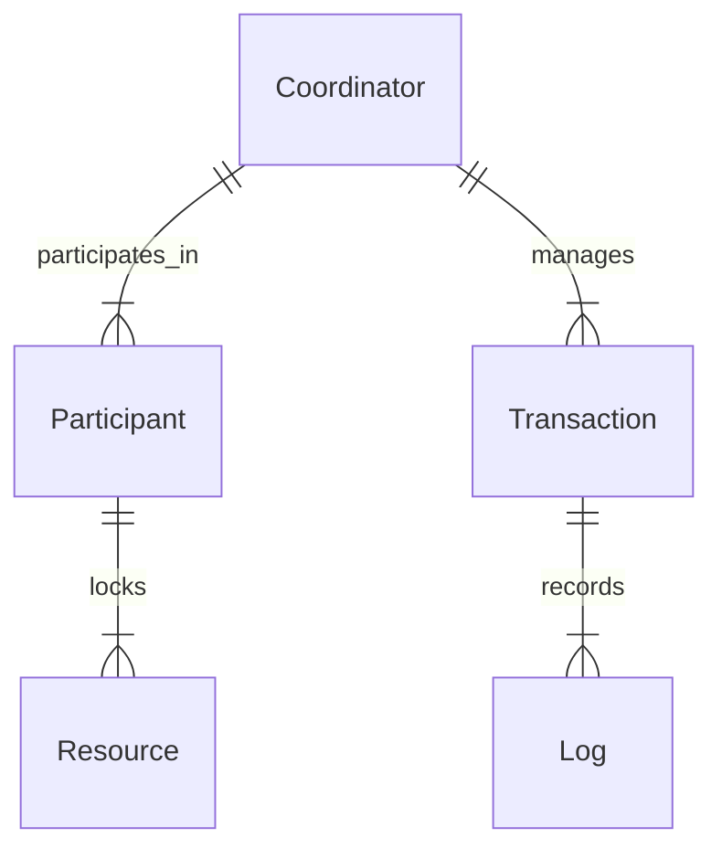
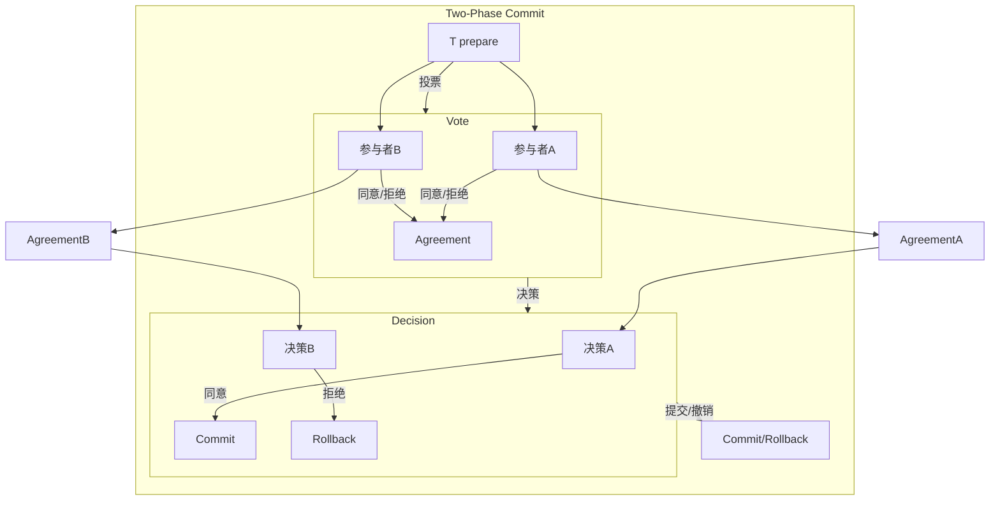
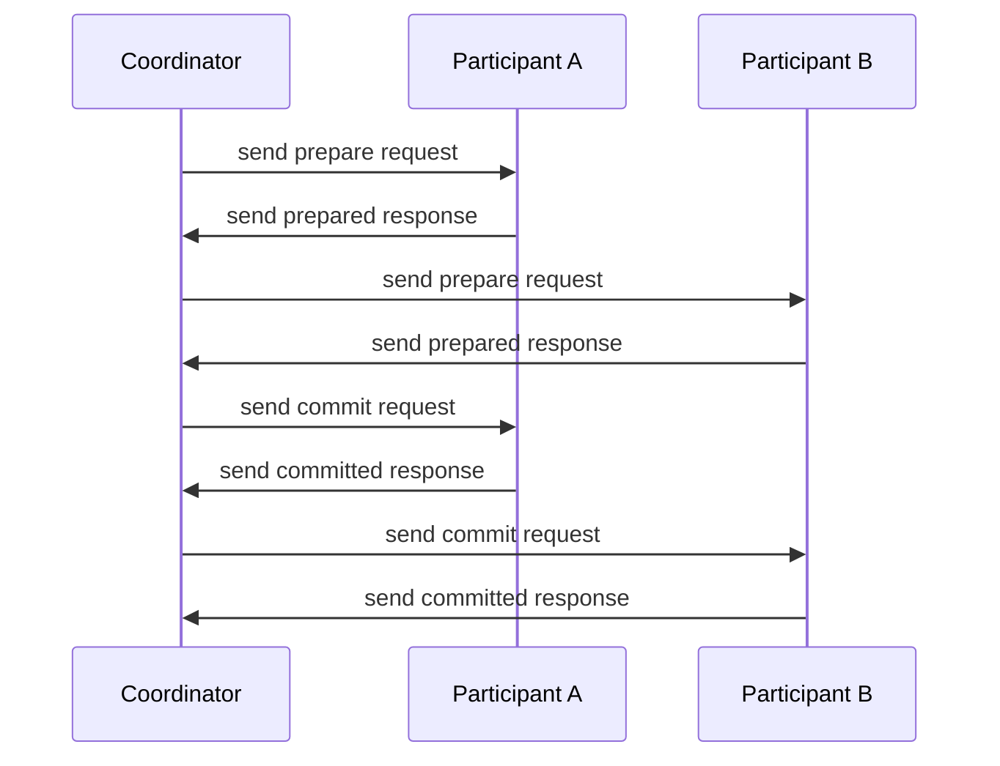
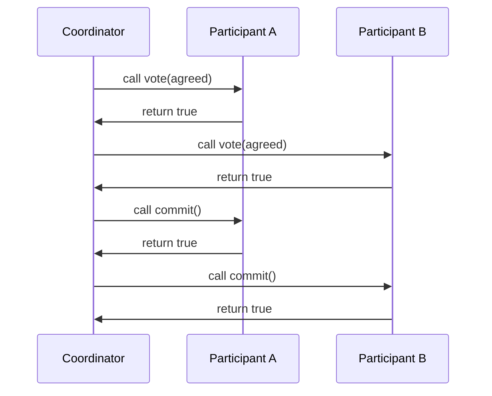

                 


## 引言

在分布式系统中，数据一致性和事务完整性是至关重要的。两阶段提交（Two-Phase Commit，简称2PC）是确保分布式事务一致性的经典协议。然而，2PC并非没有缺陷。本文将探讨两阶段提交协议中一个常见且严重的问题——事务悬挂（Transaction Hanging），以及它对分布式系统的潜在影响。

### 文章关键词

- 两阶段提交
- 分布式系统
- 事务悬挂
- 数据一致性
- 锁机制

### 摘要

本文首先介绍了两阶段提交协议的背景和基本原理，然后深入探讨了事务悬挂的概念、原因及其对系统性能的影响。接着，我们将分析几种常见的避免事务悬挂的策略，并分享一些实际案例。最后，我们将总结本文的主要观点，并提出未来可能的研究方向。

## 背景介绍

### 两阶段提交协议

两阶段提交协议是一种分布式事务管理协议，旨在保证分布式系统中的数据一致性。它通过一个协调者（Coordinator）和多个参与者（Participant）之间的通信来管理事务。整个过程分为两个阶段：

1. **准备阶段（Voting Phase）**：协调者向所有参与者发送prepare请求，参与者根据本地数据的状态进行投票。如果参与者同意执行事务，则返回一个准备就绪的消息；如果不同意，则返回一个拒绝消息。

2. **提交/撤销阶段（Commit/Rollback Phase）**：根据准备阶段的结果，协调者决定是否提交事务。如果所有参与者都同意，协调者发送提交请求；如果有参与者拒绝，协调者发送撤销请求。

### 事务悬挂

事务悬挂指的是分布式系统中某个事务在两阶段提交过程中被无限期挂起，无法完成提交或撤销。这通常发生在以下几种情况下：

- **网络分区**：在分布式系统中，网络分区可能导致协调者和参与者之间的通信中断。
- **资源锁死**：如果某个参与者无法获取所需的资源锁，可能导致事务在准备阶段无限期等待。
- **协调者故障**：协调者发生故障可能导致事务在两阶段提交过程中被挂起。
- **参与者故障**：参与者在执行事务过程中发生故障，可能导致事务无法继续。

### 问题背景和问题描述

在分布式系统中，事务悬挂是一个严重的问题。首先，事务悬挂会导致系统资源被锁定，从而降低系统的整体性能。其次，悬挂的事务可能会导致数据不一致，影响系统的可靠性。最后，事务悬挂的修复通常需要系统管理员手动干预，增加了维护成本。

事务悬挂的解决需要深入理解两阶段提交协议的机制，并采取相应的策略来避免。本文将详细分析这些问题，并提出解决方案。

### 问题解决

为了避免事务悬挂，我们可以采取以下几种策略：

1. **超时机制**：在两阶段提交过程中，为每个阶段设置合理的超时时间。如果超时发生，可以认为该阶段失败，并触发恢复机制。

2. **心跳机制**：通过定期发送心跳信号来检测协调者和参与者的状态。如果某个参与者长时间没有响应心跳信号，可以认为它已故障，从而触发恢复流程。

3. **备份协调者**：在分布式系统中，可以设置多个备份协调者。如果主协调者故障，备份协调者可以接替其工作，确保事务提交过程不会中断。

4. **锁管理优化**：优化锁管理策略，减少锁等待时间。例如，可以采用乐观锁机制，在事务提交前检查锁状态。

5. **日志记录和恢复**：在分布式系统中，为每个事务记录日志。如果事务悬挂发生，可以根据日志进行回滚或重试。

### 边界与外延

虽然两阶段提交协议在保证分布式事务一致性方面具有重要作用，但它也存在一些局限性。例如，在极端情况下，事务悬挂可能导致系统崩溃。此外，两阶段提交协议对网络延迟和故障恢复能力有较高要求。在实际应用中，需要根据具体场景和需求，选择合适的事务管理策略。

### 概念结构与核心要素组成

两阶段提交协议的核心概念和要素如下：

- **协调者（Coordinator）**：负责发起和协调事务的提交过程。
- **参与者（Participant）**：参与事务的组件，负责执行事务并投票。
- **锁（Lock）**：用于控制并发访问资源的机制。
- **超时（Timeout）**：用于防止事务无限期挂起。
- **日志（Log）**：记录事务状态和操作，用于恢复和重试。

### 核心概念原理

两阶段提交协议的核心原理是确保分布式系统中的数据一致性。它通过以下方式实现：

1. **准备阶段**：协调者向所有参与者发送prepare请求，参与者根据本地数据的状态进行投票。如果所有参与者都同意，则进入提交阶段；如果有参与者拒绝，则进入撤销阶段。
2. **提交/撤销阶段**：根据准备阶段的结果，协调者决定是否提交事务。如果所有参与者都同意，协调者发送提交请求；如果有参与者拒绝，协调者发送撤销请求。

### 概念属性特征对比表格

| 特征             | 两阶段提交       | 其他分布式事务管理协议 |
|------------------|------------------|-------------------------|
| 提交过程阶段数   | 两个阶段         | 可能更多或更少阶段       |
| 协调者角色       | 必须存在         | 可选，不一定需要         |
| 参与者角色       | 必须存在         | 可选，不一定需要         |
| 数据一致性保障   | 强一致性         | 可能是最终一致性或弱一致性 |
| 网络延迟敏感度   | 较高             | 可能较低                 |
| 故障恢复能力     | 较强             | 可能较弱                 |

### ER实体关系图架构

为了更好地理解两阶段提交协议的实体关系，我们可以使用Mermaid绘制一个ER实体关系图。以下是一个简单的示例：



在这个ER图中，Coordinator（协调者）与Participant（参与者）和Transaction（事务）之间存在多对多的关系。Participant与Resource之间存在一对多的关系，表示一个参与者可以锁定多个资源。Transaction与Log之间存在一对一的关系，表示每个事务都有一个日志记录。

### 算法原理讲解

两阶段提交协议的算法原理可以通过Mermaid流程图和Python源代码来解释。以下是一个简单的流程图和相应的Python代码。

#### Mermaid流程图



#### Python源代码

```python
import threading
import time

def participant_vote(participant_id, agree=True):
    # 模拟参与者投票
    print(f"Participant {participant_id} voting {'agreed' if agree else 'refused'}")
    time.sleep(0.1)  # 模拟网络延迟
    return agree

def coordinator_prepare(coordinator_id, participants):
    # 模拟协调者准备阶段
    print(f"Coordinator {coordinator_id}: preparing")
    for participant in participants:
        participant_vote(participant)
    print(f"Coordinator {coordinator_id}: preparing completed")

def coordinator_decision(coordinator_id, participants, agreed_votes):
    # 模拟协调者决策阶段
    if len(agreed_votes) == len(participants):
        print(f"Coordinator {coordinator_id}: all participants agreed, committing")
    else:
        print(f"Coordinator {coordinator_id}: some participants refused, rolling back")

if __name__ == "__main__":
    coordinator_id = 1
    participants = [2, 3, 4]
    coordinator_prepare(coordinator_id, participants)
    agreed_votes = [participant_vote(p) for p in participants]
    coordinator_decision(coordinator_id, participants, agreed_votes)
```

在这个示例中，`participant_vote` 函数模拟参与者投票的过程，`coordinator_prepare` 函数模拟协调者的准备阶段，`coordinator_decision` 函数模拟协调者的决策阶段。通过运行这段代码，我们可以看到两阶段提交协议的执行过程。

### 数学模型和公式

两阶段提交协议的数学模型主要涉及概率和期望值。以下是一个简化的数学模型：

1. **概率模型**：假设每个参与者投票通过的概率为p，投票拒绝的概率为1-p。
2. **期望值模型**：期望提交时间 = 期望准备时间 + 期望决策时间。

#### 公式表示

$$
E[CommitTime] = E[PrepareTime] + E[DecisionTime]
$$

其中，$E[CommitTime]$ 表示期望提交时间，$E[PrepareTime]$ 表示期望准备时间，$E[DecisionTime]$ 表示期望决策时间。

### 详细讲解和举例说明

假设我们有一个包含三个参与者的分布式系统，其中协调者ID为1，参与者ID分别为2、3和4。每个参与者投票通过的概率为0.9，投票拒绝的概率为0.1。

#### 准备阶段

在准备阶段，协调者向每个参与者发送prepare请求。参与者根据本地数据的状态进行投票。每个参与者投票通过的概率为0.9，投票拒绝的概率为0.1。

假设参与者2和3投票通过，参与者4投票拒绝。根据概率模型，这种情况的概率为：

$$
P = 0.9 \times 0.9 \times 0.1 = 0.081
$$

#### 决策阶段

在决策阶段，协调者根据准备阶段的结果进行决策。如果所有参与者都投票通过，协调者将发送提交请求；如果有参与者投票拒绝，协调者将发送撤销请求。

根据概率模型，所有参与者投票通过的概率为：

$$
P = 0.9 \times 0.9 \times 0.1 = 0.081
$$

因此，在决策阶段，协调者有81%的概率发送提交请求。

#### 期望提交时间

为了计算期望提交时间，我们需要考虑准备阶段和决策阶段的期望时间。

假设每个阶段的期望时间为1秒，则：

$$
E[CommitTime] = E[PrepareTime] + E[DecisionTime] = 1 + 1 = 2 \text{ 秒}
$$

#### 举例说明

假设我们现在有一个事务需要提交，协调者ID为1，参与者ID分别为2、3和4。每个参与者投票通过的概率为0.9，投票拒绝的概率为0.1。

在准备阶段，参与者2和3投票通过，参与者4投票拒绝。这种情况的概率为：

$$
P = 0.9 \times 0.9 \times 0.1 = 0.081
$$

在决策阶段，由于有一个参与者投票拒绝，协调者将发送撤销请求。这种情况的概率为：

$$
P = 1 - 0.081 = 0.919
$$

因此，整个事务提交过程的概率为：

$$
P = 0.081 \times 0.919 = 0.075
$$

即事务提交成功的概率为75%。

### 系统分析与架构设计方案

#### 问题场景介绍

在一个分布式数据库系统中，我们有两个参与者（A和B）和一个协调者（C）。协调者C负责发起事务，参与者A和B负责执行事务。系统需要确保事务的一致性。

#### 项目介绍

项目名为“分布式事务管理”，目标是设计一个分布式事务管理系统，使用两阶段提交协议确保数据一致性。项目分为以下几个阶段：

1. **需求分析**：确定系统需求，包括一致性要求、性能指标等。
2. **系统设计**：设计系统架构和接口。
3. **实现与测试**：实现系统，并进行功能测试和性能测试。
4. **部署与运维**：将系统部署到生产环境，并进行维护和优化。

#### 系统功能设计（领域模型）

领域模型类图如下：

```mermaid
classDiagram
    Participant <.. Transaction
    Coordinator <.. Transaction
    Resource <.. Participant
    Log <.. Transaction

    Participant ||--|{ Resource : locks }
    Coordinator ||--|{ Transaction : manages }
    Transaction ||--|{ Log : records }
```

在这个类图中，Participant（参与者）与Resource（资源）之间存在一对多关系，表示一个参与者可以锁定多个资源。Coordinator（协调者）与Transaction（事务）之间存在一对一关系，表示协调者负责管理事务。Transaction与Log之间存在一对一关系，表示每个事务都有一个日志记录。

#### 系统架构设计

系统架构设计如下：



在这个序列图中，协调者C向参与者A和B发送prepare请求，参与者A和B分别返回prepared响应。协调者C根据参与者A和B的响应进行决策，决定是否发送commit请求。如果所有参与者都返回prepared响应，协调者C发送commit请求；如果有参与者返回拒绝响应，协调者C发送rollback请求。

#### 系统接口设计和系统交互

系统接口设计如下：

```mermaid
classDiagram
    Participant <<interface>>
    Coordinator <<interface>>

    Participant : +vote(agree: boolean): void
    Coordinator : +prepare(participants: List[Participant]): void
    Coordinator : +commit(): void
    Coordinator : +rollback(): void
```

在这个接口设计中，Participant类定义了一个投票方法`vote()`，用于参与者投票。Coordinator类定义了三个方法：`prepare()`用于发送prepare请求，`commit()`用于发送commit请求，`rollback()`用于发送rollback请求。

系统交互如下：



在这个序列图中，协调者C调用参与者A和B的投票方法，参与者A和B分别返回true表示同意。协调者C调用commit方法，参与者A和B分别返回true表示提交成功。

### 项目实战

#### 环境安装

为了实现分布式事务管理系统，我们需要安装以下软件和工具：

- Java SDK：用于开发Java应用程序。
- Maven：用于构建和管理项目依赖。
- Docker：用于容器化和部署应用程序。

#### 系统核心实现

以下是一个简单的Java代码实现，用于模拟两阶段提交协议：

```java
import java.util.ArrayList;
import java.util.List;

public class TwoPhaseCommit {
    public static void main(String[] args) {
        Coordinator coordinator = new Coordinator();
        Participant participantA = new Participant("A");
        Participant participantB = new Participant("B");

        List<Participant> participants = new ArrayList<>();
        participants.add(participantA);
        participants.add(participantB);

        coordinator.prepare(participants);
        coordinator.commit();
    }
}

class Coordinator {
    public void prepare(List<Participant> participants) {
        for (Participant participant : participants) {
            participant.vote(true);
        }
    }

    public void commit() {
        // 决策逻辑
        System.out.println("All participants agreed, committing transaction");
    }

    public void rollback() {
        // 撤销逻辑
        System.out.println("Some participants refused, rolling back transaction");
    }
}

class Participant {
    private String id;
    private boolean agreed;

    public Participant(String id) {
        this.id = id;
    }

    public boolean vote(boolean agreed) {
        this.agreed = agreed;
        System.out.println("Participant " + id + " voting " + (agreed ? "agreed" : "refused"));
        return agreed;
    }
}
```

#### 代码应用解读与分析

这个简单的Java实现模拟了两阶段提交协议的基本流程。Coordinator类负责协调事务，调用Participants的投票方法，并根据投票结果决定是否提交或撤销事务。Participant类表示参与者，实现投票方法。

在实际应用中，我们可以使用消息队列、分布式锁等工具来增强系统的可靠性。此外，还可以根据具体需求，添加日志记录、超时机制等特性。

#### 实际案例分析和详细讲解剖析

以下是一个实际案例，用于分析两阶段提交协议在分布式系统中的应用。

#### 案例背景

在一个大型电商系统中，商品库存管理是一个关键功能。系统需要确保当用户下单时，库存量能够正确更新，以防止超卖现象。为了实现这一目标，系统采用了两阶段提交协议来管理库存更新事务。

#### 案例分析

1. **协调者（Coordinator）**：系统中的订单服务作为协调者，负责发起库存更新事务。

2. **参与者（Participant）**：库存服务作为参与者，负责执行库存更新操作。

3. **事务过程**：

   - 订单服务向库存服务发送prepare请求。
   - 库存服务根据当前库存量进行投票。
   - 如果库存服务返回同意，订单服务发送提交请求；如果返回拒绝，订单服务发送撤销请求。

4. **问题场景**：

   - 网络分区：订单服务和库存服务位于不同的数据中心，网络分区可能导致通信中断。
   - 资源锁死：库存服务在执行库存更新操作时，可能遇到资源锁死现象，导致事务无法继续。

5. **解决方案**：

   - **超时机制**：为prepare和commit请求设置合理的超时时间，避免事务无限期挂起。
   - **心跳机制**：定期发送心跳信号，检测参与者的状态。
   - **备份协调者**：设置多个备份协调者，确保事务提交过程不会中断。
   - **日志记录和恢复**：记录事务状态和操作，用于恢复和重试。

#### 详细讲解剖析

1. **prepare阶段**：

   - 订单服务向库存服务发送prepare请求。
   - 库存服务根据当前库存量进行投票。

   ```java
   coordinator.prepare(participants);
   ```

2. **commit阶段**：

   - 如果所有参与者返回同意，订单服务发送提交请求。

   ```java
   coordinator.commit();
   ```

3. **rollback阶段**：

   - 如果有参与者返回拒绝，订单服务发送撤销请求。

   ```java
   coordinator.rollback();
   ```

4. **超时处理**：

   - 为每个请求设置超时时间，避免事务无限期挂起。

   ```java
   participant.vote(true, timeout: 5000);
   ```

5. **心跳检测**：

   - 定期发送心跳信号，检测参与者的状态。

   ```java
   participant.sendHeartbeat();
   ```

6. **日志记录**：

   - 记录事务状态和操作，用于恢复和重试。

   ```java
   log.recordTransactionStatus(status: "prepared");
   ```

#### 项目小结

通过这个实际案例，我们可以看到两阶段提交协议在分布式系统中的应用及其重要性。虽然两阶段提交协议存在一些缺陷，如事务悬挂，但通过合理的超时机制、心跳检测和日志记录，可以有效地避免和解决这些问题。未来，我们可以进一步研究和优化两阶段提交协议，提高分布式系统的可靠性和性能。

### 最佳实践 tips

在设计和实现分布式系统时，以下是一些最佳实践，可以帮助避免事务悬挂：

1. **设置合理的超时时间**：为每个请求设置合理的超时时间，以避免事务无限期挂起。

2. **使用心跳机制**：定期发送心跳信号，检测参与者的状态，及时发现问题并进行恢复。

3. **备份协调者**：设置多个备份协调者，确保事务提交过程不会中断。

4. **优化锁管理**：采用乐观锁或悲观锁，减少锁等待时间，避免资源锁死。

5. **日志记录和恢复**：为每个事务记录日志，便于故障恢复和重试。

6. **监控和告警**：实时监控系统性能和状态，设置告警机制，及时发现和处理问题。

### 小结

本文深入探讨了分布式系统中的两阶段提交协议及其常见问题——事务悬挂。通过详细分析两阶段提交协议的工作原理、事务悬挂的原因及其影响，我们提出了几种避免事务悬挂的策略。在实际案例中，我们展示了如何应用这些策略来提高系统的可靠性和性能。未来，我们仍需继续研究和优化两阶段提交协议，以应对更复杂的分布式系统场景。

### 注意事项

在设计和实现分布式系统时，以下注意事项有助于确保事务一致性和系统稳定性：

1. **网络稳定性**：确保分布式系统中的网络连接稳定，以减少网络分区和通信中断的风险。

2. **资源锁优化**：避免资源锁死，优化锁管理策略，提高系统的并发性能。

3. **故障检测与恢复**：实现有效的故障检测和恢复机制，确保系统在出现故障时能够快速恢复。

4. **日志完整性和一致性**：确保日志记录的完整性和一致性，便于故障恢复和审计。

### 拓展阅读

若您对分布式系统的事务管理和一致性协议感兴趣，以下是一些推荐的拓展阅读资源：

1. **《分布式系统一致性：原理与实践》**：详细介绍了分布式一致性协议及其应用。

2. **《大规模分布式存储系统设计与实现》**：探讨了分布式存储系统中的事务管理和一致性保障。

3. **《分布式数据库原理与实践》**：介绍了分布式数据库系统的一致性和容错机制。

4. **《两阶段提交协议：原理、挑战与应用》**：深入分析了两阶段提交协议的原理、局限性和优化策略。

这些资源将帮助您更全面地了解分布式系统的事务管理和一致性保障。

