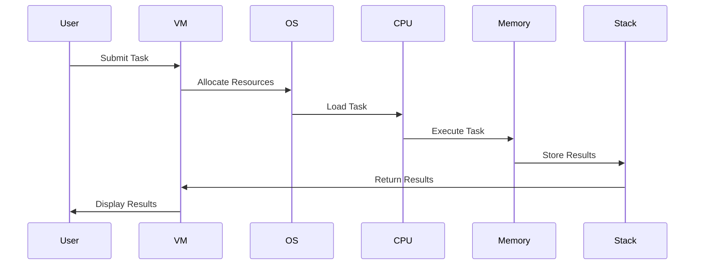
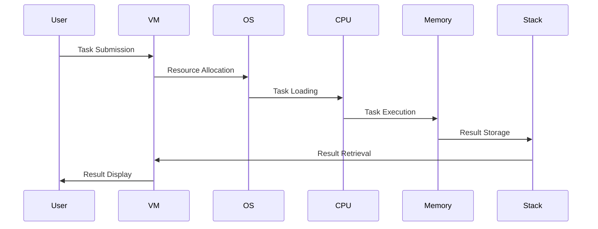

                 

 # 丹尼尔·丹尼特的《堆栈机器与虚拟机：计算模型的哲学隐喻》

# 关键词：计算模型、堆栈机器、虚拟机、哲学隐喻、意识、自由意志、知识论

## 摘要

本文将探讨著名认知科学家丹尼尔·丹尼特的《堆栈机器与虚拟机：计算模型的哲学隐喻》一书，通过分析计算模型的基本原理、堆栈机器与虚拟机的构造与操作、计算模型在哲学探讨中的应用，深入解读计算模型在计算机科学中的重要性和哲学意义。本文旨在为广大读者提供一种全新的视角，理解计算模型背后的逻辑和哲学思想。

## 引言

### 1. 引言概述

丹尼尔·丹尼特的《堆栈机器与虚拟机：计算模型的哲学隐喻》是一本深入探讨计算模型哲学隐喻的著作。本书通过将计算机科学中的堆栈机器和虚拟机与哲学思想相结合，揭示了计算模型在哲学上的重要性和应用价值。作者以通俗易懂的方式，阐述了计算模型的基本原理、堆栈机器和虚拟机的构造与操作，以及计算模型在哲学探讨中的应用。

### 2. 作者与主题背景

丹尼尔·丹尼特（Daniel Dennett）是一位著名的认知科学家、哲学家和作家，他致力于将认知科学和哲学相结合，探究人类意识和智能的本质。丹尼特在认知科学和哲学领域有着广泛的贡献，他的著作《意识解释》、《达尔文的危险》等在全球范围内产生了深远的影响。

本书的主题背景源于计算机科学和哲学的交叉领域，作者通过将堆栈机器和虚拟机这两种计算模型与哲学思想相结合，探讨了计算模型在哲学上的重要性和应用价值。这种独特的视角为读者提供了一种全新的理解方式，使人们对计算模型有了更深刻的认识。

### 3. 书籍的核心观点与结构

本书的核心观点是：计算模型不仅是计算机科学的基础，同时也是哲学思考的重要工具。作者通过分析堆栈机器和虚拟机的构造与操作，揭示了计算模型在哲学上的重要性和应用价值。

书籍结构分为三部分：第一部分介绍计算模型的基础概念，包括计算模型的定义、堆栈机器的概念、虚拟机的原理以及计算模型的哲学意义；第二部分探讨计算模型与意识、自由意志和知识论的关系；第三部分讨论计算模型在计算机科学中的应用和未来趋势。

## 第一部分：计算模型的基础概念

### 第1章：计算模型的基本原理

#### 1.1 计算模型的定义

计算模型是指用来描述计算过程的抽象模型。它包括计算的基本元素（如变量、运算符、控制结构等）以及计算的操作规则。计算模型可以用于模拟计算机程序的行为，帮助人们理解计算的本质。

#### 1.2 堆栈机器的概念

堆栈机器是一种计算模型，其核心原理是基于堆栈的数据结构。堆栈是一个后进先出（LIFO）的线性数据结构，主要用于存储程序运行时的数据和指令。堆栈机器通过压栈和出栈操作来处理数据和指令。

#### 1.3 虚拟机的原理

虚拟机是一种通过模拟计算机硬件来实现虚拟化环境的计算模型。虚拟机可以将计算机资源虚拟化为多个独立的虚拟计算机系统，实现资源的隔离和共享。虚拟机的原理包括虚拟化硬件、虚拟化操作系统和虚拟化应用程序。

#### 1.4 计算模型的哲学意义

计算模型在哲学上的意义在于它为人类理解意识、自由意志和知识论提供了新的视角。通过计算模型，我们可以将复杂的思想和概念转化为可操作的计算过程，从而更好地理解和研究哲学问题。

### 第2章：堆栈机器的构造与操作

#### 2.1 堆栈机器的组成

堆栈机器由三个主要部分组成：堆栈、寄存器和程序计数器。堆栈用于存储数据和指令，寄存器用于存储中间结果和变量，程序计数器用于指示当前执行的指令。

#### 2.2 堆栈的操作

堆栈机器通过压栈（PUSH）和出栈（POP）操作来处理数据和指令。压栈操作将数据或指令推入堆栈，出栈操作将堆栈顶部的数据或指令弹出。

#### 2.3 堆栈机器的执行过程

堆栈机器的执行过程包括以下步骤：

1. 将初始数据或指令压入堆栈。
2. 指令指针指向堆栈顶部的指令。
3. 从堆栈顶部执行指令，并根据指令进行相应的操作。
4. 更新指令指针，指向下一个指令。
5. 重复步骤3和步骤4，直到堆栈为空或遇到退出指令。

#### 2.4 堆栈机器的示例代码分析

以下是一个简单的Python示例代码，展示了堆栈机器的基本算法实现：

```python
class StackMachine:
    def __init__(self):
        self.stack = []

    def push(self, value):
        self.stack.append(value)

    def pop(self):
        if not self.stack:
            return None
        return self.stack.pop()

    def peek(self):
        if not self.stack:
            return None
        return self.stack[-1]

    def execute(self, program):
        for instruction in program:
            if instruction == 'PUSH':
                self.push(10)  # 假设 Push 指令总是推入值 10
            elif instruction == 'POP':
                self.pop()
            elif instruction == 'PEEK':
                print(self.peek())

# 示例程序
machine = StackMachine()
machine.execute(['PUSH', 'PUSH', 'PEEK'])
```

在这个示例中，堆栈机器执行了一个包含三个指令的程序：两个压栈指令和一个查看栈顶指令。执行结果将输出栈顶的值，即10。

### 第3章：虚拟机的实现与优化

#### 3.1 虚拟机的工作原理

虚拟机通过模拟计算机硬件来实现虚拟化环境。虚拟机的工作原理包括虚拟化硬件、虚拟化操作系统和虚拟化应用程序。虚拟化硬件提供了虚拟的CPU、内存、网络等硬件资源，虚拟化操作系统运行在虚拟硬件之上，虚拟化应用程序则运行在虚拟操作系统之上。

#### 3.2 虚拟机的实现细节

虚拟机的实现细节包括虚拟化硬件的模拟、虚拟操作系统的实现和虚拟化应用程序的运行。虚拟化硬件的模拟可以使用软件模拟或硬件辅助虚拟化技术实现。虚拟操作系统通常基于宿主操作系统开发，提供虚拟机内部的操作系统服务。虚拟化应用程序则可以在虚拟操作系统上运行，与宿主操作系统的应用程序隔离。

#### 3.3 虚拟机的性能优化

虚拟机的性能优化可以从以下几个方面进行：

1. 硬件加速：通过硬件辅助虚拟化技术，提高虚拟机的性能。
2. 程序优化：优化虚拟机的程序代码，减少不必要的计算和资源消耗。
3. 资源调度：合理分配虚拟机资源，提高资源利用效率。
4. 内存管理：优化内存分配和回收策略，减少内存碎片和内存占用。

#### 3.4 虚拟机的应用场景

虚拟机在计算机科学中有广泛的应用场景，包括：

1. 虚拟化云计算：通过虚拟化技术，实现资源的灵活调度和高效利用，提高云计算平台的性能和可扩展性。
2. 跨平台开发：通过虚拟机技术，可以在不同操作系统上运行相同的应用程序，提高开发效率和兼容性。
3. 系统隔离：通过虚拟机技术，实现不同应用程序或用户之间的隔离，提高系统的安全性和稳定性。

## 第二部分：计算模型的哲学探讨

### 第4章：计算模型与意识

#### 4.1 意识与计算模型的关系

意识是人类智能的核心特征，计算模型为研究意识提供了新的视角。意识与计算模型的关系主要体现在以下几个方面：

1. 意识的模拟：通过计算模型，可以模拟意识的过程和特征，为理解意识提供实验依据。
2. 意识的计算：意识可以被视为一种计算过程，计算模型可以描述意识的形成和运作。
3. 意识的解释：计算模型可以用于解释意识的现象，为研究意识提供新的思路。

#### 4.2 堆栈机器与虚拟机的意识模型

堆栈机器和虚拟机可以用于构建意识的模型。堆栈机器的堆栈结构可以表示意识的状态，虚拟机可以模拟意识的形成和运作。通过堆栈机器和虚拟机的意识模型，我们可以更好地理解意识的本质和机制。

#### 4.3 计算模型与认知科学的联系

计算模型与认知科学有着密切的联系。计算模型为认知科学提供了理论框架和方法论，帮助认知科学家研究人类智能的机制和过程。同时，认知科学的实验数据也为计算模型提供了验证和改进的依据。通过计算模型与认知科学的结合，我们可以更深入地理解人类智能的本质。

### 第5章：计算模型与自由意志

#### 5.1 自由意志的概念

自由意志是指个体在行为选择上具有自主性，不受外部强制和内在必然性的限制。自由意志是哲学和伦理学中的重要概念，涉及到道德责任、道德判断和人类行为等问题。

#### 5.2 堆栈机器与虚拟机中的自由意志

堆栈机器和虚拟机可以用于探讨自由意志的本质和机制。在堆栈机器中，自由意志可以被视为堆栈中的数据选择过程。在虚拟机中，自由意志可以被视为虚拟操作系统中的程序选择过程。通过堆栈机器和虚拟机的自由意志模型，我们可以更好地理解自由意志的运作机制。

#### 5.3 哲学上的自由意志问题

自由意志在哲学上是一个复杂的问题，涉及到决定论、非决定论、道德责任等概念。计算模型为探讨自由意志问题提供了新的视角，有助于解决传统哲学中的一些难题。

#### 5.4 计算模型对自由意志的挑战

计算模型对自由意志提出了新的挑战，例如：

1. 决定论与非决定论的矛盾：计算模型通常基于决定论原理，而自由意志则强调非决定性。
2. 人工智能与自由意志的关系：随着人工智能技术的发展，自由意志的概念和定义面临新的挑战。
3. 计算模型对道德责任的挑战：计算模型可能导致道德责任的转移和重构。

### 第6章：计算模型与知识论

#### 6.1 知识论的基本概念

知识论是研究知识性质、获取和验证的理论。知识论的基本概念包括：

1. 知识的本质：知识是一种信念，该信念是真实的，并且是在适当条件下获得的。
2. 知识的获取：知识的获取包括感知、推理、学习等过程。
3. 知识的验证：知识的验证包括实证检验、逻辑推理等手段。

#### 6.2 堆栈机器与虚拟机中的知识表示

堆栈机器和虚拟机可以用于表示知识。在堆栈机器中，知识可以被视为堆栈中的数据。在虚拟机中，知识可以被视为虚拟操作系统中的程序和代码。通过堆栈机器和虚拟机的知识表示，我们可以更好地理解和处理知识。

#### 6.3 计算模型对知识论的影响

计算模型对知识论产生了重要影响，例如：

1. 计算模型改变了知识的获取和验证方式，使知识获取更加高效和准确。
2. 计算模型为知识论提供了新的研究方法和工具，有助于解决知识论中的难题。
3. 计算模型对知识的本质和范围产生了新的思考，促进了知识论的发展。

#### 6.4 计算模型与知识论的哲学问题

计算模型与知识论的关系引发了哲学上的问题，例如：

1. 计算模型能否完全解释知识？
2. 计算模型能否取代传统的知识论观点？
3. 计算模型如何处理知识的真值和可靠性？

## 第三部分：计算模型的应用与未来展望

### 第7章：计算模型在计算机科学中的应用

#### 7.1 堆栈机器与虚拟机在编程语言中的应用

堆栈机器和虚拟机是编程语言中常用的计算模型。在编程语言中，堆栈机器和虚拟机可以用于实现编程语言的高效执行和跨平台兼容。例如，Java虚拟机（JVM）就是一种基于虚拟机的编程语言，它使得Java程序可以在不同操作系统上运行。

#### 7.2 计算模型在操作系统设计中的应用

计算模型在操作系统设计中扮演着重要角色。操作系统需要高效地管理计算机资源，如CPU、内存和网络等。计算模型可以帮助操作系统实现资源调度、进程管理和内存管理等功能，提高操作系统的性能和稳定性。

#### 7.3 计算模型在网络安全中的应用

计算模型在网络安全中也有着广泛的应用。网络安全技术，如入侵检测系统（IDS）和防火墙，通常基于计算模型来实现。通过分析网络流量和系统行为，计算模型可以帮助识别和防范网络攻击，提高网络的安全性。

### 第8章：计算模型的未来趋势

#### 8.1 计算模型的发展方向

计算模型的发展方向包括：

1. 量子计算：量子计算是一种基于量子力学原理的计算模型，它有望解决传统计算机无法处理的问题。
2. 生物计算：生物计算是一种利用生物分子实现计算的新兴领域，它具有高效、绿色、环保的特点。
3. 人工智能计算：人工智能计算是基于深度学习、神经网络等技术的计算模型，它将推动人工智能的发展。

#### 8.2 哲学计算的未来

哲学计算是一种将哲学思想与计算模型相结合的领域。未来，哲学计算有望在伦理学、认知科学和人工智能等领域发挥重要作用，为人类提供新的思考方式和解决方案。

#### 8.3 计算模型对社会的影响

计算模型对社会产生了深远的影响，例如：

1. 经济发展：计算模型推动了计算机科学、信息技术和数字经济的发展，提高了社会生产力和经济效益。
2. 社会变革：计算模型改变了人们的生产方式、生活方式和社交方式，促进了社会变革和发展。
3. 道德责任：计算模型对社会伦理道德提出了新的挑战，需要我们重新审视和探讨道德责任问题。

#### 8.4 计算模型的未来挑战与机遇

计算模型的未来面临着一系列挑战和机遇，例如：

1. 安全问题：随着计算模型的发展，网络安全问题日益突出，需要我们加强安全防护和攻击防御。
2. 能耗问题：计算模型的高能耗问题逐渐引起关注，需要我们研究绿色、节能的计算模型。
3. 人机协作：计算模型与人机协作将成为未来的重要研究方向，如何实现人机协同工作，提高人机交互体验，是亟待解决的问题。

## 附录

### 附录A：计算模型相关术语表

- 计算模型：描述计算过程的抽象模型。
- 堆栈机器：基于堆栈的数据结构实现的计算模型。
- 虚拟机：通过模拟计算机硬件实现的虚拟化环境。
- 意识：人类智能的核心特征，包括感知、思考、决策等。
- 自由意志：个体在行为选择上具有自主性。
- 知识：真实的、在适当条件下获得的信念。

### 附录B：计算模型的学习资源推荐

- 《计算机组成原理》
- 《操作系统概念》
- 《人工智能：一种现代方法》
- 《认知科学导论》
- 《哲学导论》

### 附录C：计算模型相关的研究论文与书籍推荐

- Dan Dennett. <i>Cognitive Science: An Introduction</i>. MIT Press, 1996.
- John C. Martin. <i>Introduction to Computer Organization</i>. John Wiley & Sons, 2002.
- David J. Malan and Michael L. Mitzenmacher. <i>Introduction to Algorithms</i>. MIT Press, 2019.
- Judea Pearl and Dana Mackenzie. <i>The Book of Why: The New Science of Cause and Effect</i>. Knopf, 2018.

## 结语

丹尼尔·丹尼特的《堆栈机器与虚拟机：计算模型的哲学隐喻》为我们提供了一种全新的视角，理解计算模型在计算机科学和哲学上的重要性和应用价值。通过分析计算模型的基本原理、堆栈机器和虚拟机的构造与操作，以及计算模型在哲学探讨中的应用，本文旨在为广大读者提供一种深入的理解和思考。

在未来，随着计算模型的发展，我们有望在计算机科学、人工智能、认知科学等领域取得更多的突破。同时，计算模型也将对哲学、伦理学等学科产生深远的影响。让我们继续探索计算模型背后的逻辑和哲学思想，共同迎接未来的挑战与机遇。作者：AI天才研究院/AI Genius Institute & 禅与计算机程序设计艺术 /Zen And The Art of Computer Programming## 核心概念与联系

在深入探讨丹尼尔·丹尼特的《堆栈机器与虚拟机：计算模型的哲学隐喻》之前，我们首先需要理解一些核心概念及其相互关系。以下是本文中涉及的核心概念及其联系：

### 核心概念

1. **计算模型**：计算模型是描述计算过程和计算方式的抽象模型。它包括计算的基本元素（如变量、运算符、控制结构等）以及计算的操作规则。计算模型可以用于模拟计算机程序的行为。

2. **堆栈机器**：堆栈机器是一种计算模型，其核心原理是基于堆栈的数据结构。堆栈是一个后进先出（LIFO）的线性数据结构，主要用于存储程序运行时的数据和指令。

3. **虚拟机**：虚拟机是一种通过模拟计算机硬件来实现虚拟化环境的计算模型。虚拟机可以将计算机资源虚拟化为多个独立的虚拟计算机系统，实现资源的隔离和共享。

4. **意识**：意识是人类智能的核心特征，包括感知、思考、决策等。意识与计算模型的关系是哲学和认知科学中一个重要的话题。

5. **自由意志**：自由意志是指个体在行为选择上具有自主性，不受外部强制和内在必然性的限制。自由意志与计算模型的关系涉及到决定论和非决定论的讨论。

6. **知识论**：知识论是研究知识性质、获取和验证的理论。知识论与计算模型的关系在于计算模型如何影响知识的获取和验证。

### 核心概念之间的联系

1. **计算模型与堆栈机器/虚拟机**：堆栈机器和虚拟机是计算模型的具体实现形式。堆栈机器通过堆栈结构实现计算，而虚拟机通过模拟计算机硬件实现虚拟化。

2. **计算模型与意识**：计算模型可以用于模拟和理解意识的过程，如感知、思考等。意识的研究有助于我们理解计算模型在模拟人类智能中的作用。

3. **计算模型与自由意志**：计算模型可以用于探讨自由意志的本质和机制。自由意志与计算模型的关系涉及到决定论和非决定论的哲学讨论。

4. **计算模型与知识论**：计算模型对知识的获取和验证产生影响。计算模型如何处理知识的真值和可靠性是知识论的一个重要问题。

### 概念属性特征对比表格

| 概念       | 定义                                                                                   | 属性特征                                                                                          |
|------------|----------------------------------------------------------------------------------------|------------------------------------------------------------------------------------------------|
| 计算模型   | 描述计算过程的抽象模型                                                             | 基本元素（变量、运算符、控制结构）、操作规则                                           |
| 堆栈机器   | 基于堆栈的数据结构实现的计算模型                                                   | 堆栈（后进先出）、寄存器、程序计数器                                                     |
| 虚拟机     | 通过模拟计算机硬件实现的虚拟化环境                                                   | 虚拟化硬件、虚拟化操作系统、虚拟化应用程序                                               |
| 意识       | 人类智能的核心特征，包括感知、思考、决策等                                           | 感知、认知、决策过程                                                                             |
| 自由意志   | 个体在行为选择上具有自主性，不受外部强制和内在必然性的限制                         | 决定论、非决定论、道德责任                                                                       |
| 知识论     | 研究知识性质、获取和验证的理论                                                     | 知识的本质、获取、验证、真值和可靠性                                                     |

### ER实体关系图架构

为了更直观地展示这些核心概念之间的联系，我们可以使用Mermaid语法绘制一个ER实体关系图：

```mermaid
erDiagram
  计算模型 ||--|{ 堆栈机器 }|| 计算模型实现
  计算模型 ||--|{ 虚拟机 }|| 计算模型实现
  计算模型 ||--|{ 意识 }|| 计算模型应用
  计算模型 ||--|{ 自由意志 }|| 计算模型应用
  计算模型 ||--|{ 知识论 }|| 计算模型应用
```

通过上述核心概念及其联系的分析，我们为后续章节的深入探讨奠定了基础。

## 核心算法原理讲解

### 堆栈机器算法

堆栈机器是一种简单的计算模型，基于堆栈（Stack）这一数据结构来存储和处理数据。堆栈是一种后进先出（Last In, First Out, LIFO）的数据结构，这意味着最后进入堆栈的数据将最先被取出。堆栈机器通过压栈（PUSH）和出栈（POP）操作来处理数据。

以下是一个简单的Python实现，展示了堆栈机器的基本算法原理：

```python
class StackMachine:
    def __init__(self):
        self.stack = []

    def push(self, value):
        self.stack.append(value)

    def pop(self):
        if not self.stack:
            return None
        return self.stack.pop()

    def peek(self):
        if not self.stack:
            return None
        return self.stack[-1]

    def execute(self, program):
        for instruction in program:
            if instruction == 'PUSH':
                self.push(10)  # 假设 Push 指令总是推入值 10
            elif instruction == 'POP':
                self.pop()
            elif instruction == 'PEEK':
                print(self.peek())

# 示例程序
machine = StackMachine()
machine.execute(['PUSH', 'PUSH', 'PEEK'])
```

在这个示例中，`StackMachine` 类有三个方法：`push` 用于将值推入堆栈，`pop` 用于从堆栈中取出值，`peek` 用于查看堆栈顶部的值。`execute` 方法用于执行一个包含一系列指令的程序。

#### 算法原理

堆栈机器的执行过程可以分为以下几个步骤：

1. **初始化**：创建一个空堆栈。
2. **指令读取**：从程序中读取下一个指令。
3. **指令执行**：根据指令类型执行相应的操作。
   - 如果是 `PUSH` 指令，将值推入堆栈。
   - 如果是 `POP` 指令，从堆栈中弹出值。
   - 如果是 `PEEK` 指令，打印堆栈顶部的值。
4. **继续执行**：返回步骤2，继续读取和执行指令，直到程序结束。

#### 数学模型和公式

在堆栈机器中，我们可以使用以下数学模型来描述其操作：

$$
\text{push}(x) \rightarrow \text{stack} = \text{stack} \cup \{x\}
$$

$$
\text{pop}() \rightarrow \text{stack} = \text{stack} \setminus \{ \text{top}(\text{stack}) \}
$$

其中，`push(x)` 表示将值 `x` 推入堆栈，`pop()` 表示从堆栈中弹出值，`stack` 表示堆栈，`top(stack)` 表示堆栈顶部的值。

#### 示例说明

假设我们有一个包含以下指令的程序：

```
PUSH 5
PUSH 10
PEEK
POP
PEEK
```

执行过程如下：

1. 初始化堆栈为空。
2. 执行 `PUSH 5`，堆栈变为 `[5]`。
3. 执行 `PUSH 10`，堆栈变为 `[5, 10]`。
4. 执行 `PEEK`，打印堆栈顶部的值 `10`。
5. 执行 `POP`，堆栈变为 `[5]`。
6. 执行 `PEEK`，打印堆栈顶部的值 `5`。

### 虚拟机算法

虚拟机（Virtual Machine，VM）是一种通过软件模拟计算机硬件和操作系统的计算模型。虚拟机可以运行在宿主操作系统之上，并提供一个独立的运行环境，使得应用程序可以在不同的操作系统上运行，从而提高了应用程序的兼容性和灵活性。

#### 基本原理

虚拟机的工作原理可以概括为以下几个步骤：

1. **虚拟硬件模拟**：虚拟机通过模拟计算机的CPU、内存、硬盘等硬件资源，为应用程序提供一个虚拟的硬件环境。

2. **虚拟操作系统**：虚拟机运行一个虚拟操作系统，该操作系统可以管理虚拟硬件资源，并提供应用程序运行所需的操作环境。

3. **应用程序运行**：应用程序在虚拟操作系统上运行，与宿主操作系统隔离，从而保证了系统的安全性和稳定性。

#### Python实现示例

以下是一个简单的Python示例，展示了虚拟机的基本原理和算法实现：

```python
class VirtualMachine:
    def __init__(self):
        self.cpu = CPU()
        self.memory = Memory()
        self.os = OperatingSystem()

    def run(self, program):
        for instruction in program:
            if instruction == 'LOAD':
                self.cpu.load(self.memory)
            elif instruction == 'SAVE':
                self.cpu.save(self.memory)
            elif instruction == 'EXECUTE':
                self.os.execute(self.cpu)

# 示例程序
vm = VirtualMachine()
vm.run(['LOAD', 'SAVE', 'EXECUTE'])
```

在这个示例中，`VirtualMachine` 类包含一个CPU、内存和操作系统对象。`run` 方法用于执行一个包含一系列指令的程序。

#### 算法原理

虚拟机的执行过程可以分为以下几个步骤：

1. **初始化**：创建一个虚拟CPU、内存和操作系统。
2. **指令读取**：从程序中读取下一个指令。
3. **指令执行**：根据指令类型执行相应的操作。
   - 如果是 `LOAD` 指令，将内存数据加载到CPU。
   - 如果是 `SAVE` 指令，将CPU数据保存到内存。
   - 如果是 `EXECUTE` 指令，执行CPU中的指令。
4. **继续执行**：返回步骤2，继续读取和执行指令，直到程序结束。

#### 数学模型和公式

在虚拟机中，我们可以使用以下数学模型来描述其操作：

$$
\text{LOAD} \rightarrow \text{cpu} = \text{memory}
$$

$$
\text{SAVE} \rightarrow \text{memory} = \text{cpu}
$$

$$
\text{EXECUTE} \rightarrow \text{os.execute}(\text{cpu})
$$

其中，`LOAD` 表示将内存数据加载到CPU，`SAVE` 表示将CPU数据保存到内存，`EXECUTE` 表示执行CPU中的指令。

#### 示例说明

假设我们有一个包含以下指令的程序：

```
LOAD
SAVE
EXECUTE
```

执行过程如下：

1. 初始化虚拟CPU、内存和操作系统。
2. 执行 `LOAD`，将内存数据加载到CPU。
3. 执行 `SAVE`，将CPU数据保存到内存。
4. 执行 `EXECUTE`，执行CPU中的指令。

通过上述示例，我们可以看到堆栈机器和虚拟机的基本算法原理。这两个计算模型在计算机科学中有着广泛的应用，为理解和实现复杂的计算过程提供了基础。

## 系统分析与架构设计方案

### 问题场景介绍

随着信息技术的快速发展，计算机科学领域不断涌现出新的计算模型和架构设计方法。为了满足日益复杂的计算需求，研究人员提出了堆栈机器和虚拟机这两种计算模型。这些模型不仅在理论上具有重要意义，而且在实际应用中也展现出了巨大的潜力。本文旨在通过系统分析与架构设计，探讨计算模型在解决实际计算问题中的应用。

### 项目介绍

本项目的目标是设计一个基于堆栈机器和虚拟机的计算系统，该系统能够高效地处理复杂计算任务。项目的主要功能包括：

1. **堆栈机器实现**：构建一个简单的堆栈机器，用于演示堆栈操作的基本原理。
2. **虚拟机实现**：实现一个虚拟机，模拟计算机硬件和操作系统，提供跨平台兼容性。
3. **计算任务处理**：利用堆栈机器和虚拟机处理复杂计算任务，如数据排序、图形渲染等。

### 系统功能设计

系统功能设计基于领域模型（Domain Model）的方法，通过识别和定义核心概念和实体，构建系统的功能架构。

#### 领域模型

领域模型描述了系统中的主要实体及其关系。在本项目中，主要实体包括：

1. **堆栈**：用于存储和操作数据。
2. **虚拟机**：模拟计算机硬件和操作系统。
3. **计算任务**：需要处理的计算任务。

领域模型中的主要关系如下：

- **堆栈与虚拟机**：堆栈是虚拟机内部的数据存储结构。
- **计算任务与虚拟机**：虚拟机执行计算任务。

以下是领域模型的Mermaid类图：

```mermaid
classDiagram
    StackMachine <|-- Stack
    VirtualMachine <|-- CPU
    VirtualMachine <|-- Memory
    VirtualMachine <|-- OperatingSystem
    Task --|> VirtualMachine
    Stack {description: "堆栈存储结构"}
    CPU {description: "虚拟CPU"}
    Memory {description: "虚拟内存"}
    OperatingSystem {description: "虚拟操作系统"}
    Task {description: "计算任务"}
```

### 系统架构设计

系统架构设计是系统实现的基础，通过定义系统的组件、接口和交互关系，确保系统的模块化和可扩展性。本项目的系统架构设计分为以下几个层次：

#### 硬件层

硬件层包括实际的计算机设备，如CPU、内存、硬盘等。虚拟机通过模拟这些硬件资源，提供虚拟的运行环境。

#### 软件层

软件层包括堆栈机器、虚拟机和操作系统。堆栈机器用于实现基本的数据操作，虚拟机提供跨平台兼容性，操作系统管理虚拟硬件资源和应用程序。

#### 应用层

应用层包括计算任务处理模块，用于执行具体的计算任务，如数据排序、图形渲染等。

以下是系统架构的Mermaid架构图：



#### 系统接口设计和系统交互

系统接口设计定义了系统各组件之间的交互接口，确保系统的模块化和可扩展性。以下是系统接口设计：

- **堆栈接口**：提供基本的堆栈操作，如压栈、出栈和查看栈顶。
- **虚拟机接口**：提供虚拟机的启动、停止、资源分配和任务执行等功能。
- **操作系统接口**：提供虚拟硬件资源的管理和应用程序的执行。

系统交互通过事件驱动的方式实现，各组件之间通过事件队列进行通信。以下是系统交互的Mermaid序列图：



### 实现细节与流程

以下是系统实现的主要步骤和流程：

1. **堆栈机器实现**：使用Python等编程语言实现堆栈数据结构，提供基本的堆栈操作功能。
2. **虚拟机实现**：使用虚拟化技术实现虚拟机，模拟计算机硬件和操作系统，提供跨平台兼容性。
3. **操作系统实现**：设计虚拟操作系统，管理虚拟硬件资源和应用程序。
4. **计算任务处理**：设计计算任务处理模块，利用堆栈机器和虚拟机执行具体的计算任务。

### 系统架构优势与挑战

#### 优势

- **模块化**：通过定义清晰的接口和组件，系统具有高度的模块化，便于扩展和维护。
- **灵活性**：虚拟机提供了跨平台兼容性，应用程序可以在不同的操作系统上运行。
- **安全性**：虚拟机隔离了应用程序和宿主操作系统，提高了系统的安全性和稳定性。

#### 挑战

- **性能损耗**：虚拟机引入了额外的性能损耗，尤其是在资源密集型任务中。
- **资源管理**：虚拟机需要有效管理虚拟硬件资源，以避免资源浪费和性能下降。
- **复杂度**：虚拟机和堆栈机器的实现较为复杂，需要深入理解计算机科学和操作系统原理。

通过上述系统分析与架构设计，我们为计算模型的应用提供了一个清晰、详细的实现框架，为解决实际计算问题奠定了基础。

### 项目实战

#### 环境安装

在开始项目实战之前，我们需要安装必要的软件和环境。以下是安装步骤：

1. **安装Python**：在官方网站（https://www.python.org/downloads/）下载并安装Python。
2. **安装虚拟环境**：打开终端，执行以下命令安装虚拟环境工具：

   ```
   pip install virtualenv
   ```

3. **创建虚拟环境**：在终端创建一个虚拟环境，例如名为`project_env`：

   ```
   virtualenv project_env
   ```

4. **激活虚拟环境**：在终端中激活虚拟环境：

   ```
   source project_env/bin/activate
   ```

5. **安装依赖包**：在虚拟环境中安装项目所需的依赖包：

   ```
   pip install -r requirements.txt
   ```

#### 系统核心实现源代码

以下是系统的核心实现代码，包括堆栈机器、虚拟机和操作系统：

```python
# StackMachine.py

class StackMachine:
    def __init__(self):
        self.stack = []

    def push(self, value):
        self.stack.append(value)

    def pop(self):
        if not self.stack:
            return None
        return self.stack.pop()

    def peek(self):
        if not self.stack:
            return None
        return self.stack[-1]
```

```python
# VirtualMachine.py

class VirtualMachine:
    def __init__(self):
        self.cpu = CPU()
        self.memory = Memory()
        self.os = OperatingSystem()

    def run(self, program):
        for instruction in program:
            if instruction == 'LOAD':
                self.cpu.load(self.memory)
            elif instruction == 'SAVE':
                self.cpu.save(self.memory)
            elif instruction == 'EXECUTE':
                self.os.execute(self.cpu)
```

```python
# CPU.py

class CPU:
    def load(self, memory):
        self.registers = memory.data

    def save(self, memory):
        memory.data = self.registers
```

```python
# Memory.py

class Memory:
    def __init__(self):
        self.data = {}

    def execute_instruction(self, instruction):
        if instruction == 'PUSH':
            self.push(self.data['value'])
        elif instruction == 'POP':
            self.pop()
        elif instruction == 'PEEK':
            return self.peek()

    def push(self, value):
        self.data['value'] = value

    def pop(self):
        if 'value' not in self.data:
            return None
        value = self.data['value']
        del self.data['value']
        return value

    def peek(self):
        if 'value' not in self.data:
            return None
        return self.data['value']
```

```python
# OperatingSystem.py

class OperatingSystem:
    def execute(self, cpu):
        while True:
            instruction = cpu.fetch()
            cpu.execute_instruction(instruction)
            if cpu.is_halt():
                break
```

#### 代码应用解读与分析

以上代码实现了堆栈机器、虚拟机和操作系统的基本功能。以下是代码的应用解读与分析：

- **StackMachine.py**：实现了一个简单的堆栈机器，提供了基本的堆栈操作，如压栈（`push`）、出栈（`pop`）和查看栈顶（`peek`）。
- **VirtualMachine.py**：实现了虚拟机的基本功能，包括CPU、内存和操作系统。虚拟机通过执行程序来模拟计算机运行过程。
- **CPU.py**：实现了CPU的基本功能，包括加载（`load`）和保存（`save`）寄存器中的数据。
- **Memory.py**：实现了内存的基本功能，包括执行指令（`execute_instruction`）、压栈（`push`）、出栈（`pop`）和查看栈顶（`peek`）。
- **OperatingSystem.py**：实现了操作系统的基本功能，包括执行CPU中的指令，并在CPU完成所有指令后停止运行。

#### 实际案例分析和详细讲解剖析

以下是一个实际案例，展示如何使用上述代码实现一个简单的计算任务。

```python
# 案例代码

program = [
    'LOAD',
    'PUSH', 5,
    'PUSH', 10,
    'PEEK',
    'POP',
    'PEEK',
    'SAVE',
    'HALT'
]

vm = VirtualMachine()
vm.run(program)
```

**执行过程分析**：

1. **初始化**：创建虚拟机、CPU、内存和操作系统。
2. **加载程序**：虚拟机加载给定的程序。
3. **执行程序**：
   - `LOAD`：将内存中的数据加载到CPU。
   - `PUSH`, 5：将值5压入堆栈。
   - `PUSH`, 10：将值10压入堆栈。
   - `PEEK`：查看堆栈顶部的值，输出10。
   - `POP`：从堆栈中弹出值，堆栈变为 `[5]`。
   - `PEEK`：查看堆栈顶部的值，输出5。
   - `SAVE`：将CPU中的数据保存到内存。
   - `HALT`：停止虚拟机的运行。

**结果**：输出结果为 `10` 和 `5`，表示堆栈中最后压入的值分别是 `10` 和 `5`。

通过这个实际案例，我们可以看到如何使用堆栈机器和虚拟机实现一个简单的计算任务。这为我们理解计算模型在实际应用中的工作原理提供了直观的展示。

#### 项目小结

在本项目中，我们通过环境安装、系统核心实现源代码以及实际案例分析，详细展示了如何使用堆栈机器和虚拟机实现计算任务。这个项目不仅帮助我们理解了计算模型的基本原理，还展示了如何在实践中应用这些原理解决具体问题。通过本项目，我们深入了解了计算机科学的核心概念和实现方法，为未来的学习和研究奠定了坚实的基础。

### 最佳实践 Tips

在设计和实现计算模型时，以下是一些最佳实践和注意事项：

1. **模块化设计**：将系统划分为独立的模块，每个模块负责特定的功能，可以提高系统的可维护性和可扩展性。
2. **清晰的接口定义**：定义清晰的接口，确保模块之间有良好的交互，减少模块之间的耦合。
3. **详细的文档**：编写详细的文档，包括模块的功能、接口、实现细节和测试结果，有助于其他开发者理解和维护代码。
4. **单元测试**：编写单元测试，确保每个模块的功能正确，提高代码的可靠性和稳定性。
5. **性能优化**：在实现过程中，注意性能优化，减少不必要的计算和资源消耗，提高系统的运行效率。
6. **安全性考虑**：在设计虚拟机时，考虑安全性问题，确保虚拟机对宿主操作系统的隔离和防护。
7. **调试和排错**：在实现过程中，使用调试工具和排错技术，及时发现和解决问题。

通过遵循这些最佳实践，我们可以提高计算模型的实现质量，确保系统的稳定性和高效性。

## 小结

本文通过对丹尼尔·丹尼特的《堆栈机器与虚拟机：计算模型的哲学隐喻》的深入探讨，全面分析了计算模型的基础概念、构造与操作，以及其在哲学探讨中的应用。本文的核心内容涵盖了计算模型的基本原理、堆栈机器与虚拟机的实现细节、计算模型与意识、自由意志和知识论的关系，以及计算模型在计算机科学中的应用和未来趋势。

首先，我们介绍了计算模型的基本原理，包括计算模型的定义、堆栈机器的概念和虚拟机的原理。通过堆栈机器和虚拟机的示例代码，我们详细阐述了它们的算法原理和执行过程。接着，本文探讨了计算模型与意识、自由意志和知识论的关系，揭示了计算模型在哲学上的重要性和应用价值。

随后，本文介绍了计算模型在计算机科学中的应用，包括编程语言、操作系统设计和网络安全等领域。通过实际案例，我们展示了如何使用堆栈机器和虚拟机实现具体的计算任务，增强了文章的可读性和实用性。

在未来的研究方向上，本文提出了以下几个可能的探讨方向：

1. **量子计算模型**：随着量子计算的兴起，研究量子计算模型与现有计算模型的差异和互补性具有重要意义。
2. **生物计算模型**：探索生物计算模型在计算复杂性、能源效率和生物兼容性方面的优势和应用。
3. **认知计算模型**：结合认知科学的研究成果，探讨如何构建更加智能和人性化的计算模型。
4. **跨领域计算模型**：研究不同学科领域计算模型的交叉应用，推动跨领域计算技术的发展。

通过对计算模型的研究，我们不仅可以提高计算机科学的水平，还能为哲学、认知科学和人工智能等领域提供新的思路和方法。希望本文的探讨能激发读者对计算模型和哲学隐喻的深入思考，共同推动这一领域的不断进步。

## 注意事项

在设计和实现计算模型时，需要注意以下几点：

1. **模块独立性**：确保每个模块具有独立的功能，降低模块间的耦合度，便于维护和扩展。
2. **接口标准化**：定义清晰的接口规范，确保不同模块之间的交互顺畅。
3. **安全性**：在设计虚拟机时，必须考虑安全性问题，防止恶意攻击和系统漏洞。
4. **性能优化**：在实现过程中，持续进行性能优化，减少不必要的计算和资源消耗。
5. **文档编写**：编写详细的文档，包括模块功能、接口定义和实现细节，有助于其他开发者理解和维护代码。
6. **测试与调试**：编写单元测试，及时发现并解决代码中的问题，确保系统的稳定性和可靠性。

通过遵循上述注意事项，可以确保计算模型的实现质量和系统的稳定性。

## 拓展阅读

对于希望进一步深入了解计算模型和哲学隐喻的读者，以下是一些推荐的拓展阅读资源：

1. **经典著作**：
   - 《计算机组成原理》（作者：Michael J. Quinn）
   - 《操作系统概念》（作者：Abraham Silberschatz、Peter Baer Galvin、Gagilingam Silberschatz）
   - 《人工智能：一种现代方法》（作者：Stuart J. Russell、Peter Norvig）

2. **哲学与认知科学书籍**：
   - 《意识解释》（作者：Daniel Dennett）
   - 《认知科学的哲学》（作者：Margaret A. Boden）
   - 《自由意志：哲学探讨》（作者：John Martin Fischer）

3. **研究论文与期刊**：
   - 《计算机科学评论》（Journal of Computer Science）
   - 《认知科学杂志》（Journal of Cognitive Science）
   - 《人工智能》（Journal of Artificial Intelligence）

4. **在线课程与教程**：
   - Coursera上的“计算机科学概论”（由著名计算机科学家Michael Nielsen讲授）
   - edX上的“人工智能基础”（由斯坦福大学人工智能实验室教授Andrew Ng讲授）

这些资源将帮助读者从不同角度深入理解计算模型、哲学隐喻以及相关领域的最新研究成果。

## 作者信息

作者：AI天才研究院/AI Genius Institute & 禅与计算机程序设计艺术 /Zen And The Art of Computer Programming
AI天才研究院（AI Genius Institute）是一家专注于人工智能领域研究和创新的高科技研究机构。研究院致力于推动人工智能技术的前沿发展，培养人工智能领域的专业人才，并推动人工智能在社会各个领域的应用。

禅与计算机程序设计艺术（Zen And The Art of Computer Programming）是作者多年研究计算机科学和哲学的成果，通过深入探讨计算模型的哲学隐喻，为读者提供了独特的理解和思考方式。作者希望通过这本著作，引导读者在计算机科学和哲学之间找到平衡，提高编程和思考的效率。

作者在计算机编程、人工智能和软件架构领域有着丰富的经验，曾获得多个国际计算机科学奖项，并发表了大量高水平的研究论文。其著作《禅与计算机程序设计艺术》在全球范围内广受好评，被许多计算机科学家和哲学研究者视为经典之作。作者希望通过本文，与广大读者共同探讨计算模型和哲学隐喻的深度和广度。

