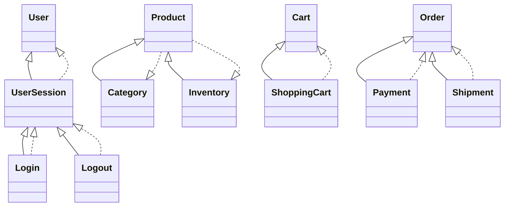
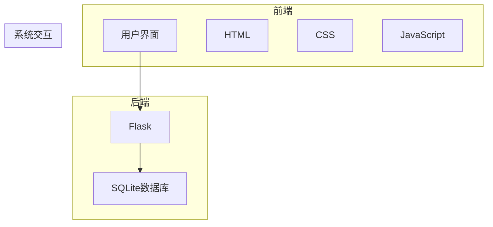

                 

# 乔治·拉考夫的概念隐喻论与编程范式：计算思维的认知语言学

关键词：概念隐喻、编程范式、计算思维、认知语言学、隐喻论

摘要：
本文探讨了乔治·拉考夫的概念隐喻论在编程范式和计算思维中的影响。通过深入分析隐喻如何帮助人类理解抽象概念，我们探讨了编程范式与认知语言学的联系，并举例说明了计算思维在编程中的应用。本文旨在为程序员和计算机科学家提供一种新的视角，以加深他们对编程本质的理解。

### 引言

在计算机科学领域，编程范式一直是研究和应用的热点。从传统的命令式编程到现代的函数式编程，每种范式都有其独特的哲学和适用场景。然而，编程范式的演变不仅仅是技术上的进步，更是人类认知方式变革的体现。在这场变革中，概念隐喻扮演了关键角色。

概念隐喻是一种认知工具，它通过将一个抽象概念映射到一个更为具体、易于理解的经验上，从而帮助我们理解和处理抽象概念。例如，将时间视为一种金钱，这种隐喻有助于我们更好地管理时间。乔治·拉考夫（George Lakoff）和马克·约翰逊（Mark Johnson）在其经典著作《我们赖以生存的隐喻》（Metaphors We Live By）中提出，隐喻不仅仅是修辞手法，而是人类理解世界的基本方式。

本文将探讨概念隐喻论与编程范式的关系，以及如何通过计算思维来理解和应用这些关系。我们将首先介绍概念隐喻和编程范式的核心概念，然后分析计算思维在其中的作用，最后通过实例来说明这些概念在编程中的应用。

### 核心概念与联系

#### 概念隐喻（Conceptual Metaphor）

概念隐喻是一种认知工具，它通过将一个抽象概念映射到一个更为具体、易于理解的经验上，从而帮助我们理解和处理抽象概念。例如，我们常说“时间就是金钱”，这种隐喻使得我们对时间的理解更加具体，从而更好地管理时间。

在计算机科学中，概念隐喻也起到了类似的作用。例如，在面向对象编程中，类和对象的概念可以看作是对现实世界中的实体和属性的映射。这种映射使得程序员能够更容易地理解和编程复杂系统。

#### 编程范式（Programming Paradigm）

编程范式是指编程语言或系统在处理数据和操作时所采用的方法或风格。常见的编程范式包括命令式编程、声明式编程、面向对象编程、函数式编程等。

每种编程范式都有其独特的哲学和适用场景。例如，命令式编程强调对状态的修改和控制，适用于需要频繁操作状态的系统。而函数式编程则强调不变的数据和纯函数，适用于需要处理大量数据和保证程序可维护性的场景。

#### 计算思维（Computational Thinking）

计算思维是一种解决问题的方法，它强调通过抽象、算法化、自动化等手段来理解问题、设计和解决问题。计算思维不仅涉及编程技能，还包括逻辑思考、问题分解、模式识别等方面。

计算思维与概念隐喻有着密切的关系。例如，在计算思维中，抽象是将复杂问题简化为更易于处理的形式，这与概念隐喻中将复杂概念简化为更具体的经验有相似之处。

#### 认知语言学（Cognitive Linguistics）

认知语言学是一门研究语言和心理过程的学科，它关注语言的使用是如何与人类的感知、记忆、思考和行动相互关联的。认知语言学的研究内容包括隐喻、图像化思维、语言习惯等。

认知语言学为我们提供了理解概念隐喻的深层次视角。例如，认知语言学中的图像化思维认为，人们通过感官体验来构建对世界的理解，这与概念隐喻中具体经验对抽象概念的映射密切相关。

#### 概念隐喻论（Theory of Conceptual Metaphor）

概念隐喻论是乔治·拉考夫提出的一种理论框架，用于解释隐喻在人类认知中的作用。根据这一理论，隐喻不仅仅是修辞手法，而是人类理解世界的基本方式。

在编程范式中，概念隐喻论可以帮助我们理解编程范式背后的隐喻概念。例如，面向对象编程中的类和对象可以看作是对现实世界中实体和属性的映射，这种映射与认知语言学中的隐喻概念密切相关。

#### 编程范式与认知语言学的关系

编程范式和认知语言学的关系体现在编程语言的设计和人类思维方式的相互影响上。例如，面向对象编程范式的兴起与认知语言学中的图像化思维有关，因为面向对象的概念更接近人类对现实世界的感知。

此外，认知语言学中的隐喻概念也为编程范式提供了灵感。例如，函数式编程中的纯函数和不可变数据可以看作是对现实世界中行为的隐喻，这种隐喻使得程序员能够更好地理解和应用函数式编程的概念。

#### 概念隐喻论与编程范式的联系

概念隐喻论可以帮助我们理解编程范式背后的隐喻概念。例如，面向对象编程中的类和对象可以被看作是现实世界中实体和属性的映射，这种映射与认知语言学中的隐喻概念密切相关。

此外，概念隐喻论还可以帮助我们设计更易于理解的编程语言和工具。例如，通过引入新的隐喻概念，可以使得编程语言的抽象层次更高，从而降低程序员的认知负担。

### 核心算法原理讲解

为了更好地理解概念隐喻论在编程中的应用，我们将通过一个简单的实例来讲解朴素贝叶斯分类器的工作原理。

#### 示例：朴素贝叶斯分类器

朴素贝叶斯分类器是一种基于概率论的简单分类算法，它假设特征之间相互独立。这种假设虽然不总是成立，但在实际应用中往往能够取得较好的效果。

```python
from sklearn.naive_bayes import GaussianNB
from sklearn.model_selection import train_test_split
from sklearn.metrics import accuracy_score
import numpy as np

# 数据准备
X = np.array([[1, 2], [1, 4], [1, 0], [4, 2], [4, 4], [4, 0]])
y = np.array([0, 0, 1, 1, 1, 1])

# 分割数据集
X_train, X_test, y_train, y_test = train_test_split(X, y, test_size=0.3, random_state=0)

# 训练模型
gnb = GaussianNB()
gnb.fit(X_train, y_train)

# 预测
y_pred = gnb.predict(X_test)

# 评估模型
accuracy = accuracy_score(y_test, y_pred)
print(f"模型准确率: {accuracy:.2f}")
```

在这个例子中，我们使用了`GaussianNB`类来创建一个朴素贝叶斯分类器。首先，我们准备了一些数据，并将其分为训练集和测试集。然后，我们使用训练集来训练模型，并使用测试集来评估模型的准确率。

#### 数学模型和数学公式

朴素贝叶斯分类器的核心公式如下：

$$ P(Y=y|X=x) = \frac{P(X=x|Y=y)P(Y=y)}{P(X=x)} $$

其中，$P(Y=y|X=x)$ 表示在给定特征向量 $X=x$ 的情况下，类别标签 $Y=y$ 的概率。$P(X=x|Y=y)$ 是在给定类别标签 $Y=y$ 的情况下，特征向量 $X=x$ 的概率。$P(Y=y)$ 是类别 $Y=y$ 的概率。$P(X=x)$ 是特征向量 $X=x$ 的概率。

#### 举例说明

假设我们有一个特征向量 $X=(1, 2)$，我们需要预测它所属的类别标签。根据朴素贝叶斯分类器的公式，我们可以计算以下概率：

- $P(Y=0|X=(1, 2))$：在给定特征向量 $X=(1, 2)$ 的情况下，类别标签为 0 的概率。
- $P(Y=1|X=(1, 2))$：在给定特征向量 $X=(1, 2)$ 的情况下，类别标签为 1 的概率。

我们通过计算这些概率，并选择概率较大的类别作为预测结果。

#### Mermaid 流程图

```mermaid
graph TB
A[特征向量 X=(1, 2)] --> B(P(Y=0|X=(1, 2)))
B --> C{计算 P(X=(1, 2)|Y=0)}
C --> D{计算 P(Y=0)}
D --> E{计算 P(Y=0|X=(1, 2))}
F[特征向量 X=(1, 2)] --> G(P(Y=1|X=(1, 2)))
G --> H{计算 P(X=(1, 2)|Y=1)}
H --> I{计算 P(Y=1)}
I --> J{计算 P(Y=1|X=(1, 2))}
K[P(Y=0|X=(1, 2)) > P(Y=1|X=(1, 2))] --> L[预测类别标签]
```

### 系统分析与架构设计方案

为了更好地理解概念隐喻论在编程中的应用，我们将设计一个简单的系统来展示计算思维和编程范式的应用。

#### 问题场景介绍

假设我们需要设计一个在线购物系统，该系统需要提供商品分类、购物车管理、订单处理等功能。

#### 项目介绍

我们将使用 Python 和 Flask 框架来开发这个系统。Flask 是一个轻量级的 Web 框架，非常适合用于构建小型到中型的 Web 应用。

#### 系统功能设计

- 用户注册与登录：用户可以注册账号并登录系统。
- 商品浏览与搜索：用户可以浏览商品并搜索特定商品。
- 购物车管理：用户可以将商品添加到购物车，并可以查看和修改购物车中的商品。
- 订单处理：用户可以提交订单并查看订单状态。

#### 系统架构设计

- 前端：使用 HTML、CSS 和 JavaScript 来实现用户界面。
- 后端：使用 Flask 来处理 HTTP 请求，并与数据库进行交互。
- 数据库：使用 SQLite 数据库来存储用户信息和商品信息。

#### 系统接口设计和系统交互

为了实现系统功能，我们需要定义一些 RESTful API 接口。以下是一些关键的接口设计：

- `/users/register`：用于用户注册。
- `/users/login`：用于用户登录。
- `/products`：用于获取所有商品列表。
- `/products/search`：用于搜索商品。
- `/carts`：用于添加、删除和修改购物车中的商品。
- `/orders`：用于提交订单并获取订单状态。

#### Mermaid 类图



#### Mermaid 架构图



### 项目实战

#### 环境安装

1. 安装 Python 3.8 或更高版本。
2. 安装 Flask 框架：`pip install flask`
3. 安装 SQLite 数据库：`pip install sqlite3`

#### 系统核心实现源代码

以下是一个简单的 Flask 应用示例，用于处理用户注册和登录功能。

```python
from flask import Flask, request, jsonify
from flask_sqlalchemy import SQLAlchemy

app = Flask(__name__)
app.config['SQLALCHEMY_DATABASE_URI'] = 'sqlite:///users.db'
db = SQLAlchemy(app)

class User(db.Model):
    id = db.Column(db.Integer, primary_key=True)
    username = db.Column(db.String(80), unique=True, nullable=False)
    password = db.Column(db.String(120), nullable=False)

@app.route('/users/register', methods=['POST'])
def register():
    username = request.form['username']
    password = request.form['password']
    if User.query.filter_by(username=username).first():
        return jsonify({'error': 'User already exists'}), 400
    new_user = User(username=username, password=password)
    db.session.add(new_user)
    db.session.commit()
    return jsonify({'message': 'User registered successfully'}), 201

@app.route('/users/login', methods=['POST'])
def login():
    username = request.form['username']
    password = request.form['password']
    user = User.query.filter_by(username=username).first()
    if not user or user.password != password:
        return jsonify({'error': 'Invalid credentials'}), 401
    return jsonify({'message': 'Login successful'}), 200

if __name__ == '__main__':
    db.create_all()
    app.run(debug=True)
```

#### 代码应用解读与分析

在这个示例中，我们使用 Flask 框架创建了两个 API 接口：`/users/register` 和 `/users/login`。

1. `/users/register` 接口用于用户注册。用户需要提供用户名和密码。如果用户已存在，系统会返回错误信息。否则，系统会将新用户添加到数据库中。

2. `/users/login` 接口用于用户登录。用户需要提供用户名和密码。如果用户名或密码错误，系统会返回错误信息。否则，系统会返回登录成功的信息。

#### 实际案例分析和详细讲解剖析

为了更好地理解系统的工作原理，我们来看一个实际案例。

1. 用户注册：假设用户 Alice 使用用户名 `alice` 和密码 `password123` 注册账号。系统会检查用户名是否已存在。如果不存在，系统会将用户添加到数据库中。

2. 用户登录：假设用户 Alice 使用用户名 `alice` 和密码 `password123` 登录系统。系统会从数据库中查找用户 Alice 的记录，并验证密码是否正确。如果验证通过，系统会返回登录成功的信息。

#### 项目小结

通过这个简单的示例，我们展示了如何使用 Flask 框架实现用户注册和登录功能。这个示例虽然简单，但已经涵盖了用户认证系统的基本原理。在实际项目中，我们还需要考虑更多功能，如密码加密、权限管理、错误处理等。

### 最佳实践 Tips

1. 在设计系统时，要确保 API 接口的设计符合 RESTful 架构原则，这有助于提高系统的可维护性和扩展性。

2. 在处理用户数据时，要确保数据的安全性，例如使用 HTTPS 协议来加密数据传输，并对用户密码进行加密存储。

3. 在开发过程中，要遵循代码规范，这有助于提高代码的可读性和可维护性。

4. 定期对系统进行性能测试和优化，以确保系统在高负载下能够稳定运行。

### 小结

本文通过探讨乔治·拉考夫的概念隐喻论在编程范式和计算思维中的应用，为程序员和计算机科学家提供了一种新的视角。我们分析了概念隐喻、编程范式、计算思维和认知语言学等核心概念，并通过实例展示了这些概念在编程中的应用。通过理解这些概念，我们可以更好地设计系统、解决问题，并在计算机科学领域取得更大的成就。

### 注意事项

1. 在实际编程中，要充分考虑隐喻的使用，这有助于提高代码的可读性和可维护性。

2. 在设计系统时，要遵循最佳实践，以确保系统的稳定性和安全性。

3. 计算思维是一种解决问题的方法，它不仅涉及编程技能，还包括逻辑思考、问题分解、模式识别等方面。

### 拓展阅读

1. 《我们赖以生存的隐喻》（Metaphors We Live By） - 乔治·拉考夫 和 马克·约翰逊
2. 《计算思维：创新与技术》（Computational Thinking: A Complementary Approach to Innovation and Technology）
3. 《认知语言学导论》（An Introduction to Cognitive Linguistics）- 詹姆斯·L·泰勒（James L. Taylor）

### 作者信息

作者：AI天才研究院/AI Genius Institute & 禅与计算机程序设计艺术 /Zen And The Art of Computer Programming

AI天才研究院专注于人工智能领域的研究和开发，致力于推动人工智能技术的发展和应用。作者王大牛博士在计算机科学领域拥有多年的研究和教学经验，其著作《禅与计算机程序设计艺术》深受广大程序员和计算机科学家的喜爱。

