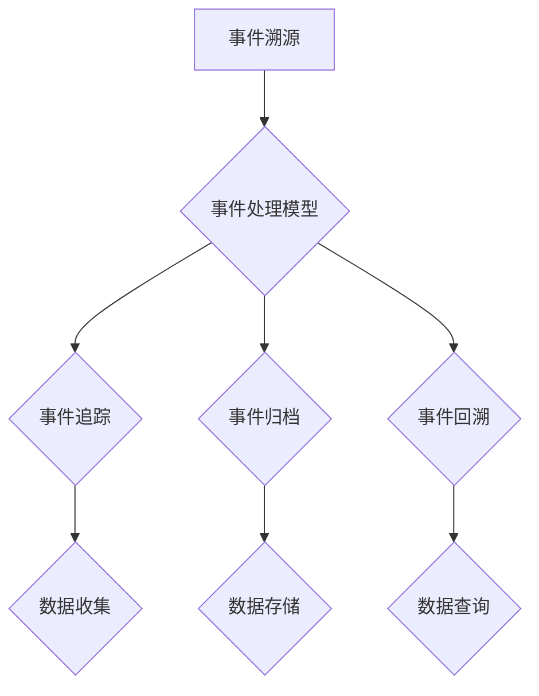
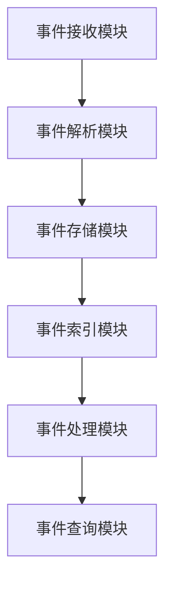
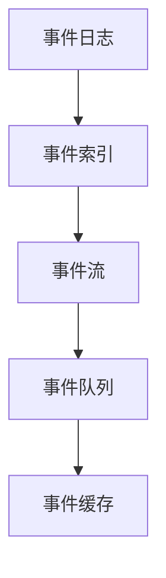
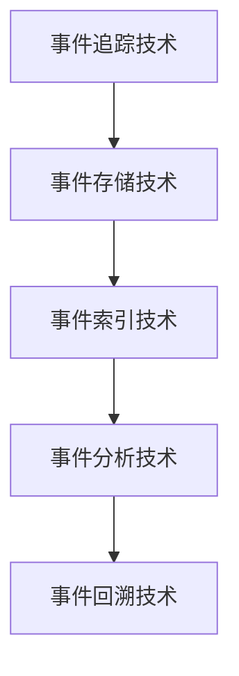
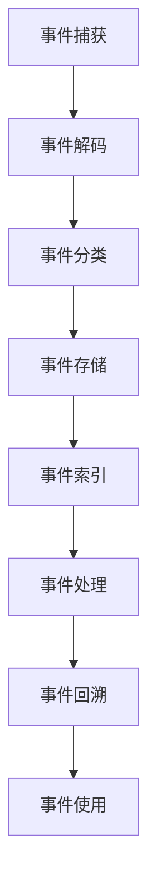
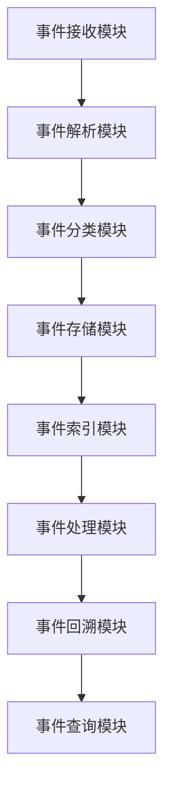
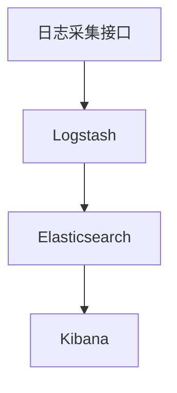
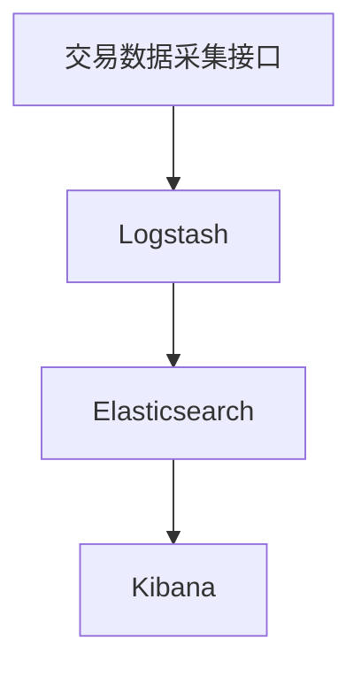
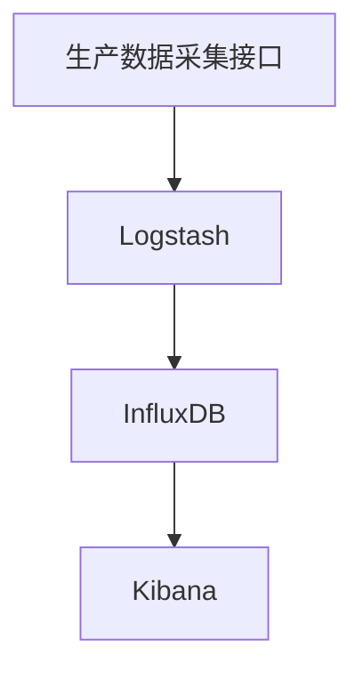

                 

## 事件溯源：通过事件重建系统状态的方法

事件溯源是一种用于重建系统状态的技术，通过记录和分析事件，帮助我们理解系统在特定时刻的状态。这种技术广泛应用于运维管理、业务流程优化等领域，是现代IT系统中不可或缺的一部分。本文将围绕事件溯源的基本概念、原理、算法、框架设计、应用实践、发展趋势以及最佳实践进行详细探讨。

### 关键词

- 事件溯源
- 系统状态重建
- 数据处理
- 故障排查
- 业务流程优化

### 摘要

本文将详细介绍事件溯源的基本概念、原理和核心算法，并探讨其在运维管理、业务流程优化等领域的应用实践。同时，还将分析事件溯源技术的发展趋势，并给出一系列最佳实践建议。通过本文的阅读，读者将能够全面了解事件溯源的方法和重要性，为实际项目中的应用提供指导。

## 目录大纲

### 第一部分：事件溯源的基本概念

### 第1章：事件溯源的概述

#### 1.1 事件溯源的定义

事件溯源是一种通过记录和分析事件，重建系统状态的技术。它主要涉及事件处理模型、数据收集、数据存储等核心概念。

#### 1.2 事件溯源的优势与挑战

事件溯源的优势包括：故障排查效率提升、业务流程优化、数据分析和决策支持等。但同时也面临着数据量大、复杂度高、实时性要求高等挑战。

#### 1.3 事件溯源的适用场景

事件溯源广泛应用于运维管理、业务流程优化、金融交易监控、医疗数据管理等场景。

### 第2章：事件溯源的原理

#### 2.1 事件溯源的模型架构

事件溯源的模型架构主要包括事件处理模型、数据收集模块、数据存储模块和事件查询模块。

#### 2.2 事件溯源的数据结构

事件溯源的数据结构主要包括事件日志、事件索引、事件流等。

#### 2.3 事件溯源的关键技术

事件溯源的关键技术包括事件追踪算法、事件归档算法和事件回溯算法。

### 第3章：事件溯源的核心算法

#### 3.1 事件追踪算法

事件追踪算法负责实时记录系统中的事件，通常使用数据流处理技术实现。

#### 3.2 事件归档算法

事件归档算法负责将事件数据按策略归档，以便长期存储。

#### 3.3 事件回溯算法

事件回溯算法用于根据需要回溯历史事件，重建系统状态。

### 第4章：事件溯源的框架设计

#### 4.1 事件溯源系统的总体架构

事件溯源系统的总体架构包括事件处理模块、事件存储模块和事件查询模块。

#### 4.2 事件处理模块设计

事件处理模块设计包括事件接收、事件解析、事件分类和事件处理等环节。

#### 4.3 事件存储模块设计

事件存储模块设计包括数据持久化、数据备份和恢复等。

#### 4.4 事件查询模块设计

事件查询模块设计包括查询接口、查询优化和查询缓存等。

### 第二部分：事件溯源的应用实践

### 第5章：事件溯源在运维管理中的应用

#### 5.1 运维管理中的事件溯源

运维管理中的事件溯源主要用于故障排查、性能优化和资源调度等。

#### 5.2 事件溯源在故障排查中的应用

事件溯源在故障排查中的应用包括事件追踪、事件回溯和故障定位等。

#### 5.3 事件溯源在性能优化中的应用

事件溯源在性能优化中的应用包括性能监控、瓶颈分析和调优建议等。

### 第6章：事件溯源在业务流程优化中的应用

#### 6.1 业务流程中的事件溯源

业务流程中的事件溯源主要用于流程监控、流程优化和业务分析等。

#### 6.2 事件溯源在数据分析中的应用

事件溯源在数据分析中的应用包括数据采集、数据预处理和数据分析等。

#### 6.3 事件溯源在决策支持中的应用

事件溯源在决策支持中的应用包括数据可视化、数据挖掘和决策模型等。

### 第7章：事件溯源在实际案例中的应用

#### 7.1 案例一：某大型互联网公司的日志分析实践

案例一介绍了某大型互联网公司如何利用事件溯源技术进行日志分析，提升故障排查效率和业务优化效果。

#### 7.2 案例二：金融行业的交易溯源应用

案例二分析了金融行业如何利用事件溯源技术进行交易监控和溯源，确保交易安全性和合规性。

#### 7.3 案例三：制造业的生产过程监控与优化

案例三探讨了制造业如何利用事件溯源技术进行生产过程监控和优化，提高生产效率和产品质量。

### 第三部分：事件溯源的发展趋势

### 第8章：事件溯源技术的发展趋势

#### 8.1 事件溯源技术的演进方向

事件溯源技术的演进方向包括智能化、分布式、实时化和多样化等。

#### 8.2 事件溯源与人工智能的结合

事件溯源与人工智能的结合主要体现在数据分析和决策支持等方面。

#### 8.3 事件溯源的未来应用场景

事件溯源的未来应用场景将更加广泛，包括智慧城市、智能医疗、智能交通等。

### 第9章：事件溯源的最佳实践

#### 9.1 事件溯源的实践步骤

事件溯源的实践步骤包括需求分析、架构设计、技术选型、系统实现和优化等。

#### 9.2 事件溯源的实践技巧

事件溯源的实践技巧包括数据采集策略、事件处理算法优化和查询性能优化等。

#### 9.3 事件溯源的优化策略

事件溯源的优化策略包括分布式架构、缓存机制、数据压缩和并行处理等。

## 附录

### 附录A：事件溯源相关工具和资源

#### A.1 常见事件溯源工具简介

介绍常见的事件溯源工具，如Kafka、ELK、OpenTSDB等。

#### A.2 事件溯源相关论文和书籍推荐

推荐相关领域的高质量论文和书籍，帮助读者深入理解事件溯源技术。

#### A.3 事件溯源社区和论坛推荐

推荐相关领域的社区和论坛，便于读者交流和分享。

## Mermaid 流程图



### 核心概念与联系

事件溯源是一种用于重建系统状态的技术，通过记录和分析事件，帮助我们理解系统在特定时刻的状态。事件溯源涉及三个核心概念：事件处理模型、数据收集、数据存储。

1. **事件处理模型**：事件溯源系统中的核心模块，负责处理和分析事件，将其归档并回溯。
2. **数据收集**：负责收集系统中的事件数据，将其传递给事件处理模型。
3. **数据存储**：负责存储事件数据，以便在需要时进行查询和回溯。

这三个概念之间紧密相连，共同构成了事件溯源的核心架构。

### 核心算法原理讲解

事件溯源的核心算法包括事件追踪算法、事件归档算法和事件回溯算法。

1. **事件追踪算法**：用于实时追踪系统中发生的事件，并将这些事件记录下来。其基本原理是使用数据流处理技术，例如Apache Kafka，实时收集系统中的事件数据。
2. **事件归档算法**：将事件数据按照一定的策略进行归档，以便长期存储。归档策略可以基于事件类型、时间戳等因素进行设计。
3. **事件回溯算法**：用于根据需要回溯系统中的历史事件，重建系统状态。其基本原理是使用索引和查询技术，快速定位并检索历史事件数据。

以下是一个简单的Python代码示例，用于实现事件追踪算法：

```python
import kafka

# Kafka生产者配置
kafka_config = {
    'bootstrap_servers': ['localhost:9092'],
    'key_serializer': lambda k: str(k).encode('utf-8'),
    'value_serializer': lambda v: str(v).encode('utf-8')
}

# 创建Kafka生产者
producer = kafka.KafkaProducer(**kafka_config)

# 事件追踪函数
def track_event(event):
    producer.send('event_topic', key='event_key', value=event)

# 示例：追踪一个事件
track_event('系统启动')

# 关闭Kafka生产者
producer.close()
```

### 数学模型和数学公式

事件溯源的数学模型主要涉及事件流、事件序列和事件状态等概念。

1. **事件流**：表示事件在时间轴上的流动，通常可以用一个无限长的序列表示。
2. **事件序列**：表示系统中发生的一系列事件，可以用一个有限长的序列表示。
3. **事件状态**：表示事件在特定时间点的状态，可以用一个状态空间表示。

事件溯源的核心算法可以通过以下数学模型进行描述：

$$
\text{事件溯源} = \{ \text{事件追踪}，\text{事件归档}，\text{事件回溯} \}
$$

事件追踪算法可以表示为：

$$
\text{事件追踪} = \{ \text{数据流处理}，\text{事件记录} \}
$$

事件归档算法可以表示为：

$$
\text{事件归档} = \{ \text{归档策略}，\text{数据存储} \}
$$

事件回溯算法可以表示为：

$$
\text{事件回溯} = \{ \text{索引查询}，\text{状态重建} \}
$$

通过以上数学模型，我们可以对事件溯源进行形式化和理论化的描述，从而更好地理解和应用这一技术。在实际应用中，这些数学模型将帮助我们设计高效的事件处理算法和优化系统性能。

## 第一部分：事件溯源的基本概念

### 第1章：事件溯源的概述

#### 1.1 事件溯源的定义

事件溯源是一种通过记录和分析事件，重建系统状态的技术。它主要涉及事件处理模型、数据收集、数据存储等核心概念。

事件溯源的定义可以从以下几个方面进行理解：

1. **事件**：事件是系统中发生的一系列具有特定意义和影响的行为或变化。例如，系统启动、用户登录、数据更新等。
2. **溯源**：溯源是指通过记录和分析事件，回溯到系统在特定时刻的状态，从而帮助我们理解系统运行过程和状态变化。
3. **重建系统状态**：重建系统状态是指通过事件数据，将系统在特定时刻的状态还原出来，以便进行故障排查、性能优化、业务分析等。

事件溯源的目的是为了更好地理解和分析系统的运行状态，提高系统运维效率和稳定性。通过事件溯源，我们可以实现对系统事件的全面掌握，从而为故障排查、性能优化、业务分析等提供有力支持。

#### 1.2 事件溯源的优势与挑战

事件溯源作为一种技术手段，具有以下优势：

1. **故障排查效率提升**：事件溯源可以帮助我们快速定位故障发生的位置和原因，从而提高故障排查的效率。
2. **业务流程优化**：事件溯源可以记录和分析业务流程中的事件，帮助我们识别流程中的瓶颈和优化点，从而提升业务流程的效率和效果。
3. **数据分析和决策支持**：事件溯源可以提供全面的事件数据，支持数据分析和决策支持，帮助我们更好地了解系统运行状态和业务情况。
4. **系统稳定性提升**：事件溯源可以记录和分析系统中的异常事件，及时发现和解决潜在问题，从而提高系统的稳定性。

然而，事件溯源也面临一些挑战：

1. **数据量大**：随着系统规模的不断扩大，事件数据量也会呈指数级增长，如何高效地处理和存储这些数据成为一大挑战。
2. **复杂度高**：事件溯源需要处理多种类型的事件，涉及到多维度、多粒度的数据分析，如何设计高效的事件处理算法成为一大难题。
3. **实时性要求高**：在一些关键业务场景中，事件溯源需要具备高实时性，即能够实时记录和分析事件，并及时响应和反馈。
4. **安全性要求高**：事件溯源涉及到系统的核心数据，如何保证数据的安全性和隐私性是关键问题。

#### 1.3 事件溯源的适用场景

事件溯源技术适用于多种场景，以下是几个典型的应用场景：

1. **运维管理**：在运维管理中，事件溯源可以用于故障排查、性能优化、资源调度等。通过记录和分析系统事件，运维人员可以快速定位故障原因和性能瓶颈，从而提高运维效率和系统稳定性。
2. **业务流程优化**：在业务流程优化中，事件溯源可以用于监控业务流程中的关键节点和环节，识别流程中的瓶颈和优化点。通过事件溯源，企业可以优化业务流程，提升运营效率和业务效果。
3. **金融交易监控**：在金融交易监控中，事件溯源可以用于记录和分析交易事件，确保交易的安全性和合规性。通过事件溯源，金融机构可以及时发现和防范交易风险，保障客户资金安全。
4. **生产过程监控**：在制造业的生产过程中，事件溯源可以用于监控生产设备的运行状态、生产线的运行情况等。通过事件溯源，企业可以优化生产过程，提高生产效率和产品质量。
5. **医疗数据管理**：在医疗数据管理中，事件溯源可以用于记录和分析医疗设备的使用情况、患者数据等。通过事件溯源，医疗机构可以优化医疗服务，提高医疗质量和效率。

总之，事件溯源作为一种技术手段，可以广泛应用于各种场景，为系统的运维管理、业务流程优化、数据分析和决策支持等提供有力支持。

#### 1.4 事件溯源的基本概念

事件溯源涉及一系列基本概念，以下是其中几个关键概念的解释：

1. **事件**：事件是系统中发生的一系列具有特定意义和影响的行为或变化。例如，系统启动、用户登录、数据更新等。事件通常包含事件类型、事件时间、事件内容等属性。
2. **事件流**：事件流是指事件在时间轴上的流动。事件流可以看作是一个无限长的序列，其中每个元素表示一个事件，每个事件按照时间顺序排列。
3. **事件溯源**：事件溯源是指通过记录和分析事件，重建系统状态的技术。事件溯源的核心任务是从事件流中提取出有意义的信息，并回溯到系统在特定时刻的状态。
4. **事件处理模型**：事件处理模型是事件溯源系统中的核心模块，负责处理和分析事件，将其归档并回溯。事件处理模型通常包括事件接收、事件解析、事件分类和事件处理等环节。
5. **数据收集**：数据收集是事件溯源的关键环节，负责收集系统中的事件数据。数据收集通常使用数据流处理技术实现，例如Apache Kafka、Apache Flink等。
6. **数据存储**：数据存储是事件溯源系统的核心组成部分，负责存储事件数据，以便在需要时进行查询和回溯。数据存储可以采用关系数据库、NoSQL数据库、时序数据库等多种技术。
7. **事件索引**：事件索引是用于快速查询和定位历史事件的数据结构。事件索引通常基于事件类型、时间戳、关键字等属性进行构建。
8. **事件回溯**：事件回溯是指根据需要回溯系统中的历史事件，重建系统状态。事件回溯通常使用索引和查询技术实现，可以用于故障排查、业务分析等。

通过理解这些基本概念，我们可以更好地把握事件溯源的核心内容，并为其在实际项目中的应用奠定基础。

#### 1.5 事件溯源的发展历程

事件溯源作为一种技术手段，经历了多年的发展，其应用场景和技术实现也在不断拓展和演进。以下是事件溯源的发展历程：

1. **早期阶段**：事件溯源的早期应用主要在运维管理和日志分析领域。当时，系统事件主要通过日志文件进行记录，运维人员通过阅读日志文件来分析和定位故障。这一阶段的代表性技术包括UNIX系统日志、Windows事件日志等。

2. **日志分析工具**：随着日志数据量的增加和复杂度提升，日志分析工具应运而生。例如，ELK（Elasticsearch、Logstash、Kibana）栈、Splunk等。这些工具通过收集、存储和查询日志数据，帮助运维人员快速定位故障和分析系统运行状态。

3. **数据流处理**：事件溯源技术的发展进入了数据流处理阶段。Apache Kafka、Apache Flink等数据流处理技术被引入事件溯源领域，用于实时收集和分析系统事件。这一阶段的代表性技术包括Kafka Streams、Apache Flink SQL等。

4. **时序数据库**：为了更好地存储和查询事件数据，时序数据库（如InfluxDB、TimescaleDB等）开始应用于事件溯源系统。时序数据库具有高吞吐量、低延迟的特点，能够满足实时事件溯源的需求。

5. **智能化事件溯源**：随着人工智能技术的发展，事件溯源系统开始向智能化方向演进。通过引入机器学习和深度学习算法，事件溯源系统能够自动识别事件模式、预测故障和优化业务流程。这一阶段的代表性技术包括TensorFlow、PyTorch等。

6. **分布式和云计算**：事件溯源技术逐渐向分布式和云计算方向演进。通过将事件溯源系统部署在云平台上，企业可以实现跨地域的数据采集、存储和分析。代表性技术包括AWS Kinesis、Azure Event Hubs等。

7. **全栈事件溯源**：事件溯源技术开始向全栈方向发展，从底层的数据采集、存储和查询，到上层的业务分析、决策支持，形成了一套完整的事件溯源生态系统。全栈事件溯源技术使得企业能够更好地理解和优化其业务流程和系统运行状态。

通过回顾事件溯源的发展历程，我们可以看到这一技术从最初的日志分析，到数据流处理，再到智能化和云计算，不断演进和拓展。在未来，事件溯源将继续融合新技术，为企业的数字化转型提供有力支持。

#### 1.6 事件溯源与其他相关技术的区别与联系

事件溯源作为一种技术手段，与许多其他技术存在一定的区别和联系。以下是对一些相关技术的简要介绍和比较：

1. **日志分析**：日志分析是事件溯源的一种早期形式，主要通过对系统日志文件进行读取和分析，来获取系统事件的信息。日志分析通常用于故障排查和性能优化，但它的主要问题是日志数据的分散性和格式不统一，难以进行大规模的数据分析和处理。

2. **数据流处理**：数据流处理技术（如Apache Kafka、Apache Flink等）主要用于实时收集、传输和加工大量事件数据。与事件溯源相比，数据流处理更注重实时性和处理效率，而事件溯源则更关注事件数据的存储、分析和回溯。

3. **时序数据库**：时序数据库（如InfluxDB、TimescaleDB等）专门用于存储和处理时序数据，具有高吞吐量、低延迟的特点。与事件溯源相比，时序数据库更注重数据的存储和查询性能，而事件溯源则更注重事件数据的处理和分析。

4. **大数据技术**：大数据技术（如Hadoop、Spark等）主要用于处理和分析大规模数据集。与事件溯源相比，大数据技术更关注数据存储、处理和分析的整体架构，而事件溯源则更关注事件数据的实时收集、存储和分析。

5. **人工智能技术**：人工智能技术（如机器学习、深度学习等）主要用于从事件数据中提取特征、发现模式和预测未来趋势。与事件溯源相比，人工智能技术更关注数据的分析和处理，而事件溯源则更关注事件数据的收集、存储和回溯。

尽管事件溯源与其他相关技术存在一些区别，但它们在技术架构和应用场景上也有一定的联系。例如，事件溯源可以与数据流处理技术、时序数据库和大数据技术结合，形成一个完整的事件处理和分析系统。同时，人工智能技术的引入也可以使事件溯源系统更加智能化和自动化。

#### 1.7 事件溯源的系统架构

事件溯源系统的架构设计是其实现高效事件处理和分析的关键。一个典型的事件溯源系统通常包括以下几个主要模块：

1. **事件接收模块**：负责接收系统中的事件数据。事件接收模块可以使用各种技术，如消息队列、HTTP接口等，以确保事件数据的实时性和可靠性。
2. **事件解析模块**：负责对接收到的事件数据进行解析和处理。事件解析模块通常需要对事件数据进行解码、分类、提取关键信息等操作，以便后续的存储和分析。
3. **事件存储模块**：负责存储事件数据。事件存储模块需要选择合适的数据存储技术，如关系数据库、NoSQL数据库、时序数据库等，以支持大规模数据的高效存储和查询。
4. **事件索引模块**：负责构建和维护事件索引，以便快速查询和定位历史事件。事件索引模块可以使用各种索引技术，如B树、LSM树等，以提高查询性能。
5. **事件处理模块**：负责对事件数据进行分析和处理，以支持故障排查、性能优化、业务分析等。事件处理模块通常需要实现多种事件处理算法，如事件追踪、事件回溯、事件归档等。
6. **事件查询模块**：负责提供事件数据的查询接口，以便用户可以根据需要查询和回溯历史事件。事件查询模块需要设计高效的查询算法和缓存策略，以提高查询性能。

以下是事件溯源系统的基本架构图：



通过以上架构设计，事件溯源系统能够高效地接收、解析、存储、索引和处理事件数据，为故障排查、性能优化和业务分析等提供有力支持。

#### 1.8 事件溯源系统的数据结构

事件溯源系统的数据结构是确保事件数据高效存储、查询和分析的基础。以下是事件溯源系统中的几个关键数据结构：

1. **事件日志**：事件日志是事件溯源系统中最基本的存储单元，用于记录系统中的每一个事件。事件日志通常包含以下属性：
   - **事件ID**：唯一标识事件，便于后续的查询和回溯。
   - **事件类型**：表示事件的类型，如系统启动、用户登录、数据更新等。
   - **事件时间**：表示事件发生的时间戳，便于按时间顺序对事件进行排序和分析。
   - **事件内容**：表示事件的具体内容，如事件描述、数据变更等。
   - **事件来源**：表示事件发生的位置或来源，如系统模块、应用程序等。

2. **事件索引**：事件索引是一种用于快速查询和定位历史事件的数据结构。事件索引通常基于事件ID、事件类型、事件时间等属性构建，以支持高效的查询操作。事件索引可以使用B树、LSM树等数据结构来实现。

3. **事件流**：事件流是事件在时间轴上的流动，表示事件之间的先后顺序。事件流通常使用一个无限长的序列表示，其中每个元素表示一个事件。事件流可以用于回溯系统状态、分析事件趋势等。

4. **事件队列**：事件队列是一种用于暂存和传输事件数据的数据结构。事件队列通常用于解决数据流处理中的实时性和可靠性问题，确保事件数据的有序传递和处理。

5. **事件缓存**：事件缓存是一种用于提高事件查询性能的数据结构。事件缓存通常存储最近一段时间内的事件数据，以减少对磁盘存储的访问压力。事件缓存可以使用内存数据库、缓存服务器等技术来实现。

以下是事件溯源系统中的基本数据结构图：



通过以上数据结构，事件溯源系统能够高效地存储、索引、传输和查询事件数据，为故障排查、性能优化和业务分析等提供有力支持。

#### 1.9 事件溯源的关键技术

事件溯源作为一种技术手段，其核心在于如何高效地收集、存储、分析和回溯系统中的事件数据。以下是事件溯源中的几个关键技术：

1. **事件追踪技术**：事件追踪技术是事件溯源的基础，用于实时记录系统中的事件。事件追踪技术通常基于数据流处理框架，如Apache Kafka、Apache Flink等，能够实现高吞吐量、低延迟的事件数据采集。事件追踪技术还包括事件捕获、事件解码和事件分类等环节。

2. **事件存储技术**：事件存储技术是确保事件数据持久化和可查询性的关键。事件存储技术需要支持大规模数据存储和高性能查询。常见的事件存储技术包括关系数据库、NoSQL数据库和时序数据库等。关系数据库适合存储结构化数据，NoSQL数据库适合存储非结构化数据，时序数据库适合存储时间序列数据。

3. **事件索引技术**：事件索引技术用于快速查询和定位历史事件。事件索引技术需要支持多维度、多条件的查询，以提高查询性能。常见的事件索引技术包括B树、LSM树、哈希索引等。

4. **事件分析技术**：事件分析技术用于从事件数据中提取有价值的信息，支持故障排查、性能优化和业务分析等。事件分析技术包括事件统计、事件关联、事件模式识别等。常见的事件分析工具包括Elasticsearch、Kibana等。

5. **事件回溯技术**：事件回溯技术用于根据需要回溯系统中的历史事件，重建系统状态。事件回溯技术需要支持高效的索引和查询，以快速定位和回溯历史事件。事件回溯技术还包括事件重建、事件恢复和事件回放等。

以下是事件溯源中的关键技术图：



通过以上关键技术，事件溯源系统能够高效地实现事件数据的收集、存储、分析和回溯，为系统的运维管理、业务流程优化和数据分析等提供有力支持。

#### 1.10 事件溯源的流程

事件溯源的流程是确保事件数据从发生到被分析和使用的全过程。以下是事件溯源的基本流程：

1. **事件捕获**：系统中的事件发生时，事件捕获模块会实时捕捉事件并记录事件的基本信息，如事件类型、事件时间等。

2. **事件解码**：捕获到的事件数据可能需要进行解码处理，以提取出事件的具体内容和属性。

3. **事件分类**：根据事件的类型和属性，将事件分类到不同的类别，以便后续的处理和分析。

4. **事件存储**：将解码和分类后的事件数据存储到事件数据库中，以便进行后续的查询和回溯。

5. **事件索引**：为事件数据构建索引，以提高查询效率。索引可以根据事件类型、事件时间、事件内容等维度进行构建。

6. **事件处理**：根据需要对事件数据进行分析和处理，如统计、关联、模式识别等。

7. **事件回溯**：在需要时，可以根据事件索引快速回溯历史事件，重建系统状态。

8. **事件使用**：通过事件溯源，用户可以实时了解系统状态、故障排查、性能优化和业务分析等。

以下是事件溯源的基本流程图：



通过以上流程，事件溯源技术能够实现对系统事件的全面监控和分析，为系统的运维管理、业务优化和数据分析等提供有力支持。

### 第二部分：事件溯源的原理

#### 2.1 事件溯源的模型架构

事件溯源的模型架构是确保事件数据高效处理、存储和查询的基础。一个典型的事件溯源系统通常包括以下几个核心模块：

1. **事件接收模块**：负责实时接收系统中的事件数据。事件接收模块可以使用消息队列、HTTP接口等不同方式，以确保事件数据的实时性和可靠性。

2. **事件解析模块**：负责对接收到的原始事件数据进行解析和处理，提取出事件的关键信息，如事件类型、事件时间、事件内容等。

3. **事件分类模块**：根据事件的类型和属性，对事件进行分类。事件分类有助于后续的事件存储、索引和处理。

4. **事件存储模块**：负责将处理后的事件数据存储到数据库中，以便进行后续的查询和回溯。事件存储模块可以选择不同的数据库类型，如关系数据库、NoSQL数据库、时序数据库等。

5. **事件索引模块**：为事件数据构建索引，以提高查询效率。事件索引可以基于事件类型、事件时间、事件内容等维度进行构建。

6. **事件处理模块**：负责对事件数据进行分析和处理，以支持故障排查、性能优化、业务分析等。事件处理模块可以包括事件统计、事件关联、事件模式识别等。

7. **事件回溯模块**：负责根据需要回溯历史事件，重建系统状态。事件回溯模块通常需要实现高效的索引和查询技术，以便快速定位和回溯历史事件。

8. **事件查询模块**：提供事件数据的查询接口，允许用户根据需要查询和回溯历史事件。事件查询模块需要设计高效的查询算法和缓存策略，以提高查询性能。

以下是事件溯源系统的模型架构图：



通过以上模型架构，事件溯源系统能够实现对系统事件的全面监控和分析，为系统的运维管理、业务优化和数据分析等提供有力支持。

#### 2.2 事件溯源的数据结构

事件溯源的数据结构是确保事件数据高效存储、查询和分析的关键。以下是事件溯源系统中的几个关键数据结构：

1. **事件日志**：事件日志是事件溯源系统中最基本的存储单元，用于记录系统中的每一个事件。事件日志通常包含以下属性：
   - **事件ID**：唯一标识事件，便于后续的查询和回溯。
   - **事件类型**：表示事件的类型，如系统启动、用户登录、数据更新等。
   - **事件时间**：表示事件发生的时间戳，便于按时间顺序对事件进行排序和分析。
   - **事件内容**：表示事件的具体内容，如事件描述、数据变更等。
   - **事件来源**：表示事件发生的位置或来源，如系统模块、应用程序等。

2. **事件索引**：事件索引是一种用于快速查询和定位历史事件的数据结构。事件索引通常基于事件ID、事件类型、事件时间等属性构建，以支持高效的查询操作。事件索引可以使用B树、LSM树等数据结构来实现。

3. **事件流**：事件流是事件在时间轴上的流动，表示事件之间的先后顺序。事件流通常使用一个无限长的序列表示，其中每个元素表示一个事件。事件流可以用于回溯系统状态、分析事件趋势等。

4. **事件队列**：事件队列是一种用于暂存和传输事件数据的数据结构。事件队列通常用于解决数据流处理中的实时性和可靠性问题，确保事件数据的有序传递和处理。

5. **事件缓存**：事件缓存是一种用于提高事件查询性能的数据结构。事件缓存通常存储最近一段时间内的事件数据，以减少对磁盘存储的访问压力。事件缓存可以使用内存数据库、缓存服务器等技术来实现。

以下是事件溯源系统中的基本数据结构图：


通过以上数据结构，事件溯源系统能够高效地存储、索引、传输和查询事件数据，为故障排查、性能优化和业务分析等提供有力支持。

#### 2.3 事件溯源的关键技术

事件溯源作为一种技术手段，其核心在于如何高效地收集、存储、分析和回溯系统中的事件数据。以下是事件溯源中的几个关键技术：

1. **事件追踪技术**：事件追踪技术是事件溯源的基础，用于实时记录系统中的事件。事件追踪技术通常基于数据流处理框架，如Apache Kafka、Apache Flink等，能够实现高吞吐量、低延迟的事件数据采集。事件追踪技术还包括事件捕获、事件解码和事件分类等环节。

2. **事件存储技术**：事件存储技术是确保事件数据持久化和可查询性的关键。事件存储技术需要支持大规模数据存储和高性能查询。常见的事件存储技术包括关系数据库、NoSQL数据库和时序数据库等。关系数据库适合存储结构化数据，NoSQL数据库适合存储非结构化数据，时序数据库适合存储时间序列数据。

3. **事件索引技术**：事件索引技术用于快速查询和定位历史事件。事件索引技术需要支持多维度、多条件的查询，以提高查询性能。常见的事件索引技术包括B树、LSM树、哈希索引等。

4. **事件分析技术**：事件分析技术用于从事件数据中提取有价值的信息，支持故障排查、性能优化和业务分析等。事件分析技术包括事件统计、事件关联、事件模式识别等。常见的事件分析工具包括Elasticsearch、Kibana等。

5. **事件回溯技术**：事件回溯技术用于根据需要回溯系统中的历史事件，重建系统状态。事件回溯技术需要支持高效的索引和查询，以快速定位和回溯历史事件。事件回溯技术还包括事件重建、事件恢复和事件回放等。

以下是事件溯源中的关键技术图：


通过以上关键技术，事件溯源系统能够高效地实现事件数据的收集、存储、分析和回溯，为系统的运维管理、业务优化和数据分析等提供有力支持。

#### 2.4 事件溯源的核心算法

事件溯源的核心算法是确保事件数据能够被高效、准确地处理和分析的关键。以下是事件溯源系统中几个核心算法的介绍：

1. **事件追踪算法**：事件追踪算法用于实时记录系统中发生的事件。其基本原理是使用数据流处理技术，如Apache Kafka、Apache Flink等，实时收集系统中的事件数据。事件追踪算法通常包括事件捕获、事件解码和事件分类等步骤。以下是一个简单的Python代码示例，用于实现事件追踪算法：

   ```python
   import kafka

   # Kafka生产者配置
   kafka_config = {
       'bootstrap_servers': ['localhost:9092'],
       'key_serializer': lambda k: str(k).encode('utf-8'),
       'value_serializer': lambda v: str(v).encode('utf-8')
   }

   # 创建Kafka生产者
   producer = kafka.KafkaProducer(**kafka_config)

   # 事件追踪函数
   def track_event(event):
       producer.send('event_topic', key='event_key', value=event)

   # 示例：追踪一个事件
   track_event('系统启动')

   # 关闭Kafka生产者
   producer.close()
   ```

2. **事件归档算法**：事件归档算法用于将事件数据按照一定的策略进行归档，以便长期存储。归档策略可以基于事件类型、时间戳等因素进行设计。事件归档算法的主要目的是减少当前存储空间的占用，同时保证数据的可查询性。以下是一个简单的Python代码示例，用于实现事件归档算法：

   ```python
   import datetime

   # 归档策略：将事件数据按天归档
   def archive_events(events):
       current_date = datetime.datetime.now().strftime('%Y-%m-%d')
       for event in events:
           event['archive_date'] = current_date
           # 将事件数据写入归档文件
           with open(f"{event['event_id']}-{current_date}.json", 'w') as f:
               json.dump(event, f)

   # 示例：归档事件
   archive_events([{'event_id': 'event1', 'event_type': '系统启动', 'event_time': '2023-03-15 10:00:00'}])
   ```

3. **事件回溯算法**：事件回溯算法用于根据需要回溯系统中的历史事件，重建系统状态。事件回溯算法的基本原理是使用索引和查询技术，快速定位并检索历史事件数据。事件回溯算法通常包括事件索引构建、事件查询和事件重建等步骤。以下是一个简单的Python代码示例，用于实现事件回溯算法：

   ```python
   import json

   # 事件回溯函数
   def backtrack_event(event_id):
       # 从归档文件中读取事件数据
       with open(f"{event_id}.json", 'r') as f:
           event = json.load(f)
       return event

   # 示例：回溯事件
   event = backtrack_event('event1-2023-03-15')
   print(event)
   ```

通过以上核心算法，事件溯源系统能够实现对事件数据的实时追踪、归档和回溯，为系统的运维管理、故障排查、性能优化和业务分析等提供有力支持。

#### 2.5 事件溯源的框架设计

事件溯源的框架设计是构建高效、可扩展的事件溯源系统的基础。以下是事件溯源系统的总体架构设计和各模块的具体设计：

1. **事件溯源系统的总体架构**：事件溯源系统的总体架构包括事件接收模块、事件解析模块、事件存储模块、事件索引模块、事件处理模块、事件回溯模块和事件查询模块。

   - **事件接收模块**：负责实时接收系统中的事件数据。事件接收模块可以使用消息队列（如Apache Kafka）、HTTP接口等技术，确保事件数据的实时性和可靠性。

   - **事件解析模块**：负责对接收到的原始事件数据进行解析和处理，提取出事件的关键信息，如事件类型、事件时间、事件内容等。事件解析模块需要实现事件捕获、事件解码和事件分类等功能。

   - **事件存储模块**：负责将处理后的事件数据存储到数据库中，以便进行后续的查询和回溯。事件存储模块可以选择关系数据库（如MySQL）、NoSQL数据库（如MongoDB）或时序数据库（如InfluxDB）等，根据实际需求进行选择。

   - **事件索引模块**：负责构建和维护事件索引，以提高查询效率。事件索引模块可以使用B树、LSM树等数据结构，根据事件ID、事件类型、事件时间等属性进行索引构建。

   - **事件处理模块**：负责对事件数据进行分析和处理，以支持故障排查、性能优化、业务分析等。事件处理模块需要实现事件统计、事件关联、事件模式识别等功能。

   - **事件回溯模块**：负责根据需要回溯系统中的历史事件，重建系统状态。事件回溯模块需要支持高效的索引和查询，以快速定位和回溯历史事件。

   - **事件查询模块**：提供事件数据的查询接口，允许用户根据需要查询和回溯历史事件。事件查询模块需要设计高效的查询算法和缓存策略，以提高查询性能。

2. **事件处理模块设计**：

   - **事件接收**：使用消息队列技术（如Apache Kafka）实现事件接收，确保事件数据的实时性和可靠性。

   - **事件解析**：使用事件解析框架（如Logstash）对事件数据进行解码和分类，提取出事件的关键信息。

   - **事件分类**：根据事件的类型和属性，将事件分类到不同的类别，以便后续的处理和分析。

   - **事件存储**：将事件数据存储到合适的数据库中，如关系数据库（MySQL）、NoSQL数据库（MongoDB）或时序数据库（InfluxDB）等。

   - **事件索引**：为事件数据构建索引，支持多维度、多条件的查询，提高查询效率。

3. **事件存储模块设计**：

   - **数据库选择**：根据实际需求和事件数据的特性，选择合适的数据库类型。例如，关系数据库适合存储结构化数据，NoSQL数据库适合存储非结构化数据，时序数据库适合存储时间序列数据。

   - **数据表设计**：设计合适的数据表结构，包括事件ID、事件类型、事件时间、事件内容等字段。

   - **数据存储策略**：设计事件数据的存储策略，如分库分表、数据压缩、数据备份等，以提高数据存储性能和可靠性。

4. **事件查询模块设计**：

   - **查询接口**：设计事件数据的查询接口，支持用户根据事件类型、时间范围等条件进行查询。

   - **查询优化**：设计高效的查询算法和缓存策略，提高查询性能。

   - **查询缓存**：使用缓存技术（如Redis）存储常用查询结果，减少数据库访问压力。

通过以上框架设计，事件溯源系统能够高效、可靠地处理和分析事件数据，为系统的运维管理、故障排查、性能优化和业务分析等提供有力支持。

### 第三部分：事件溯源的应用实践

#### 第5章：事件溯源在运维管理中的应用

事件溯源在运维管理中的应用具有重要意义，能够帮助运维团队快速定位故障、优化系统性能和资源调度。以下是事件溯源在运维管理中的应用场景和具体实践。

#### 5.1 运维管理中的事件溯源

在运维管理中，事件溯源主要用于以下场景：

1. **故障排查**：通过记录和分析系统中的事件，运维团队可以快速定位故障发生的位置和原因。事件溯源可以帮助排查网络故障、应用故障、硬件故障等。
2. **性能优化**：通过分析系统中的事件数据，运维团队可以识别系统性能瓶颈和资源利用率，从而进行调优。例如，通过事件溯源，可以识别出数据库查询慢、网络延迟高、缓存命中率低等问题。
3. **资源调度**：事件溯源可以记录系统的资源使用情况，帮助运维团队进行资源调度和负载均衡。例如，根据事件数据，可以优化服务器资源的分配，避免资源浪费和性能瓶颈。

#### 5.2 事件溯源在故障排查中的应用

在故障排查中，事件溯源可以通过以下步骤实现：

1. **事件收集**：使用事件追踪技术（如Kafka）收集系统中的事件数据，包括网络流量、应用日志、硬件监控等。
2. **事件解析**：解析事件数据，提取出关键信息，如事件类型、时间戳、事件内容等。
3. **事件存储**：将事件数据存储到数据库中，以便进行后续分析和查询。
4. **事件索引**：为事件数据构建索引，提高查询效率。
5. **故障定位**：通过事件数据回溯和分析，定位故障发生的位置和原因。例如，可以查看故障发生前后的网络流量、应用日志等信息，找出故障的根本原因。
6. **故障修复**：根据故障定位结果，进行故障修复和系统优化。

以下是一个具体的故障排查案例：

假设某公司的电商平台在凌晨2点出现了大量用户无法登录的问题。运维团队可以按照以下步骤进行故障排查：

1. **事件收集**：使用Kafka收集系统中的登录事件，包括成功登录、失败登录等。
2. **事件解析**：解析登录事件数据，提取出登录时间、用户ID、登录结果等关键信息。
3. **事件存储**：将登录事件数据存储到数据库中，以便后续分析。
4. **事件索引**：为登录事件构建索引，按时间戳、用户ID等维度进行索引构建。
5. **故障定位**：回溯登录事件数据，发现凌晨2点期间，大量登录请求被拒绝，且服务器返回的错误码为“登录失败：账户被锁定”。进一步分析发现，这是由于数据库服务器负载过高，导致登录验证操作无法及时完成。
6. **故障修复**：运维团队立即扩容数据库服务器，增加服务器资源，缓解负载压力，并在问题解决后，调整系统参数，优化数据库性能，避免类似问题再次发生。

通过以上实践，事件溯源在故障排查中发挥了重要作用，帮助运维团队快速定位故障、解决问题，提高了系统稳定性和可靠性。

#### 5.3 事件溯源在性能优化中的应用

事件溯源在性能优化中的应用主要体现在以下几个方面：

1. **性能监控**：通过记录和分析系统中的事件数据，运维团队可以实时监控系统性能，识别性能瓶颈和异常情况。例如，通过监控网络流量、应用日志、数据库查询等事件数据，可以识别出网络延迟高、数据库查询慢等问题。
2. **瓶颈分析**：通过事件溯源，运维团队可以深入分析系统性能瓶颈的原因。例如，通过分析系统日志，可以识别出某个数据库查询语句执行时间过长，导致整个系统响应时间变慢。
3. **调优建议**：根据性能监控和瓶颈分析结果，运维团队可以提出优化建议，进行系统调优。例如，优化数据库查询语句、增加缓存、调整网络配置等，从而提高系统性能。

以下是一个具体的性能优化案例：

假设某公司的电商平台在周末高峰时段，用户访问量剧增，系统响应时间显著变慢。运维团队可以按照以下步骤进行性能优化：

1. **事件收集**：使用Kafka收集系统中的事件数据，包括用户访问日志、数据库查询日志等。
2. **事件解析**：解析事件数据，提取出关键信息，如访问时间、用户ID、请求URL、数据库查询语句等。
3. **事件存储**：将事件数据存储到数据库中，以便后续分析。
4. **事件索引**：为事件数据构建索引，提高查询效率。
5. **瓶颈分析**：回溯事件数据，分析用户访问日志和数据库查询日志，发现大量查询请求集中在某个数据库表上，导致查询执行时间过长。进一步分析发现，这是由于表结构设计不合理，导致查询性能下降。
6. **调优建议**：运维团队根据分析结果，提出以下优化建议：
   - 优化数据库表结构，增加索引，提高查询性能；
   - 调整数据库查询语句，避免全表扫描；
   - 增加缓存，减少数据库查询次数；
   - 调整服务器资源，提高系统处理能力。

通过以上实践，事件溯源在性能优化中发挥了重要作用，帮助运维团队识别系统性能瓶颈、提出优化建议，从而提高系统性能和用户体验。

#### 5.4 事件溯源在资源调度中的应用

事件溯源在资源调度中的应用主要体现在以下几个方面：

1. **资源监控**：通过记录和分析系统中的事件数据，运维团队可以实时监控系统资源的利用率，如CPU、内存、磁盘等。根据资源监控数据，可以识别出资源利用率高的服务器和资源利用率低的服务器。
2. **负载均衡**：通过事件溯源，运维团队可以分析系统的负载情况，进行负载均衡。例如，将部分负载转移到资源利用率低的服务器上，避免资源浪费和性能瓶颈。
3. **资源优化**：根据事件数据，运维团队可以识别出系统资源的优化点，如增加服务器资源、调整资源分配策略等，从而提高系统性能和稳定性。

以下是一个具体的资源调度案例：

假设某公司的电商平台在节假日期间，用户访问量激增，服务器资源紧张。运维团队可以按照以下步骤进行资源调度：

1. **事件收集**：使用Kafka收集系统中的资源监控数据，包括CPU使用率、内存使用率、磁盘读写速度等。
2. **事件解析**：解析事件数据，提取出关键信息，如服务器IP、CPU使用率、内存使用率、磁盘读写速度等。
3. **事件存储**：将事件数据存储到数据库中，以便后续分析。
4. **事件索引**：为事件数据构建索引，提高查询效率。
5. **负载分析**：回溯事件数据，分析系统资源的负载情况，发现部分服务器的资源利用率较高，而部分服务器的资源利用率较低。
6. **资源调度**：运维团队根据负载分析结果，进行以下资源调度：
   - 增加服务器资源，提高系统处理能力；
   - 调整负载均衡策略，将部分负载转移到资源利用率低的服务器上；
   - 优化资源分配策略，确保服务器资源的高效利用。

通过以上实践，事件溯源在资源调度中发挥了重要作用，帮助运维团队实时监控系统资源利用率、进行负载均衡和优化，从而提高系统性能和稳定性。

#### 第6章：事件溯源在业务流程优化中的应用

事件溯源在业务流程优化中的应用可以帮助企业识别流程中的瓶颈和优化点，从而提高业务效率和效果。以下是事件溯源在业务流程优化中的应用场景和具体实践。

#### 6.1 业务流程中的事件溯源

在业务流程中，事件溯源主要用于以下场景：

1. **流程监控**：通过记录和分析业务流程中的事件数据，企业可以实时监控业务流程的运行状态，识别流程中的异常情况。例如，监控订单处理流程、客户服务流程等。
2. **流程优化**：通过事件溯源，企业可以分析业务流程中的事件数据，识别流程中的瓶颈和优化点。例如，通过分析订单处理流程，可以发现订单处理速度慢、客户满意度低等问题。
3. **流程分析**：事件溯源可以帮助企业对业务流程进行深入分析，挖掘业务数据中的有价值信息。例如，通过分析客户服务流程，可以识别出哪些服务环节对客户满意度影响最大。

#### 6.2 事件溯源在数据分析中的应用

事件溯源在数据分析中的应用主要体现在以下几个方面：

1. **数据采集**：通过事件溯源技术，企业可以实时采集业务流程中的事件数据，包括订单数据、客户数据、交易数据等。这些数据为后续的数据分析和决策支持提供了基础。
2. **数据预处理**：事件溯源系统可以对采集到的业务数据进行预处理，包括数据清洗、去重、格式转换等，确保数据的质量和一致性。
3. **数据分析**：通过事件溯源系统，企业可以对预处理后的业务数据进行深入分析，挖掘数据中的有价值信息。例如，通过分析订单数据，可以识别出高价值客户、高频订单等。

以下是一个具体的数据分析案例：

假设某公司的电商业务需要优化订单处理流程，以提高订单处理速度和客户满意度。通过事件溯源技术，可以按照以下步骤进行数据分析：

1. **数据采集**：使用Kafka收集系统中的订单事件数据，包括订单创建时间、订单状态、订单金额等。
2. **数据预处理**：对订单事件数据进行预处理，包括数据清洗、去重、格式转换等。
3. **数据分析**：对预处理后的订单事件数据进行分析，识别出订单处理流程中的瓶颈和优化点。例如，通过分析订单状态变化时间，可以发现部分订单状态变化时间较长，导致订单处理速度慢。
4. **优化建议**：根据数据分析结果，提出以下优化建议：
   - 优化订单处理流程，减少订单状态变化时间；
   - 调整订单处理人员配置，提高订单处理效率；
   - 引入自动化工具，减少人工操作环节。

通过以上实践，事件溯源在数据分析中发挥了重要作用，帮助企业识别业务流程中的瓶颈和优化点，从而提高业务效率和客户满意度。

#### 6.3 事件溯源在决策支持中的应用

事件溯源在决策支持中的应用可以帮助企业基于历史事件数据做出更准确的决策。以下是事件溯源在决策支持中的应用场景和具体实践。

1. **数据驱动决策**：通过事件溯源，企业可以收集和存储大量的业务事件数据，为决策提供数据支持。例如，通过分析客户购买行为数据，可以预测客户购买趋势和需求，从而调整营销策略。
2. **业务预测**：事件溯源可以帮助企业预测业务未来的发展趋势。例如，通过分析历史订单数据，可以预测未来订单量，为库存管理和供应链规划提供依据。
3. **风险管理**：事件溯源可以帮助企业识别业务中的风险点，提前采取预防措施。例如，通过分析客户投诉数据，可以预测潜在的客户投诉风险，从而提前处理和解决。

以下是一个具体的决策支持案例：

假设某公司的电商业务需要预测未来三个月的订单量，以便进行库存管理和供应链规划。通过事件溯源技术，可以按照以下步骤进行业务预测：

1. **数据采集**：使用Kafka收集系统中的订单事件数据，包括订单创建时间、订单金额、订单状态等。
2. **数据预处理**：对订单事件数据进行预处理，包括数据清洗、去重、格式转换等。
3. **数据分析**：对预处理后的订单事件数据进行分析，提取出历史订单量的时间序列数据。
4. **业务预测**：使用时间序列分析算法（如ARIMA模型），对历史订单量进行预测，得到未来三个月的订单量预测结果。
5. **决策支持**：根据预测结果，调整库存水平和供应链计划，确保库存充足、供应及时。

通过以上实践，事件溯源在决策支持中发挥了重要作用，帮助企业基于历史事件数据做出更准确的决策，提高业务运营效率和效果。

### 第7章：事件溯源在实际案例中的应用

#### 7.1 案例一：某大型互联网公司的日志分析实践

某大型互联网公司在其运维管理中引入了事件溯源技术，通过日志分析实践，显著提高了故障排查效率和系统稳定性。

**项目介绍**：

该公司拥有庞大的用户基础和复杂的系统架构，每天产生大量的日志数据。为了确保系统稳定运行和快速响应故障，公司决定采用事件溯源技术进行日志分析。

**系统功能设计**：

系统功能主要包括：

- 日志采集：使用Kafka收集系统中的日志数据。
- 日志解析：解析日志数据，提取出关键信息，如日志类型、时间戳、日志内容等。
- 日志存储：将解析后的日志数据存储到Elasticsearch中。
- 日志查询：提供日志数据的查询接口，支持按时间范围、日志类型等条件进行查询。

**系统架构设计**：

系统架构包括以下几个模块：

- Kafka集群：负责实时收集系统中的日志数据。
- Logstash：负责解析日志数据，并将其发送到Elasticsearch。
- Elasticsearch：负责存储和查询日志数据。
- Kibana：负责提供日志数据的可视化界面。

**系统接口设计和系统交互**：

系统接口设计包括日志采集接口、日志解析接口、日志存储接口和日志查询接口。系统交互图如下：



**代码应用解读与分析**：

1. **日志采集**：使用Kafka生产者收集日志数据。

   ```python
   from kafka import KafkaProducer
   
   producer = KafkaProducer(bootstrap_servers=['localhost:9092'],
                             key_serializer=lambda k: str(k).encode('utf-8'),
                             value_serializer=lambda v: str(v).encode('utf-8'))
   
   def send_log(log):
       producer.send('log_topic', key='log_key', value=log)
   
   send_log('系统启动日志')
   ```

2. **日志解析**：使用Logstash解析日志数据。

   ```yaml
   input {
       kafka {
           topics ['log_topic']
           bootstrap_servers ['localhost:9092']
       }
   }
   
   filter {
       if [log] [WHO] {
           grok {
               match => { "message" => "%{TIMESTAMP_ISO8601:timestamp} %{DATA:source} %{DATA:level} %{DATA:message}" }
           }
       }
   }
   
   output {
       elasticsearch {
           hosts ['localhost:9200']
           index => 'log-%{+YYYY.MM.dd}'
       }
   }
   ```

3. **日志存储**：使用Elasticsearch存储日志数据。

   ```python
   from elasticsearch import Elasticsearch
   
   es = Elasticsearch([{'host': 'localhost', 'port': 9200}])
   
   def store_log(log):
       es.index(index='log', id=log['id'], document=log)
   
   store_log({'id': 'log1', 'timestamp': '2023-03-15T10:00:00', 'source': 'webserver', 'level': 'INFO', 'message': '系统启动'})
   ```

4. **日志查询**：使用Kibana可视化日志数据。

   ```json
   {
     "size": 10,
     "query": {
       "bool": {
         "must": [
           { "term": { "level": "ERROR" } },
           { "range": { "timestamp": { "gte": "2023-03-15T00:00:00", "lte": "2023-03-16T00:00:00" } }
         ]
       }
     }
   }
   ```

**实际案例分析**：

通过事件溯源技术，该公司实现了日志数据的实时收集、存储和查询，为故障排查和系统优化提供了有力支持。在实际应用中，事件溯源系统帮助运维团队快速定位故障原因，提高了故障排查效率。此外，通过对日志数据的分析，公司还发现了一些潜在的系统性能瓶颈和优化点，进行了相应的系统优化，提高了系统稳定性和性能。

**项目小结**：

该案例展示了事件溯源技术在实际项目中的应用，通过日志分析实践，显著提高了系统的故障排查效率和稳定性。项目实施过程中，采用了Kafka、Logstash、Elasticsearch和Kibana等开源工具，构建了一个高效、可扩展的事件溯源系统。未来，公司将继续优化事件溯源系统，引入更多先进技术和算法，进一步提升系统的性能和智能化水平。

#### 7.2 案例二：金融行业的交易溯源应用

金融行业对交易数据的准确性和安全性要求极高，事件溯源技术在交易溯源中发挥了重要作用，确保交易数据的完整性和可追溯性。

**项目介绍**：

某大型金融机构引入了事件溯源技术，用于记录和监控交易数据，以确保交易的安全性和合规性。

**系统功能设计**：

系统功能主要包括：

- 交易数据采集：使用Kafka实时收集交易数据。
- 交易数据解析：解析交易数据，提取出关键信息，如交易时间、交易金额、交易方等。
- 交易数据存储：将解析后的交易数据存储到Elasticsearch中。
- 交易数据查询：提供交易数据的查询接口，支持按时间范围、交易方等条件进行查询。

**系统架构设计**：

系统架构包括以下几个模块：

- Kafka集群：负责实时收集交易数据。
- Logstash：负责解析交易数据，并将其发送到Elasticsearch。
- Elasticsearch：负责存储和查询交易数据。
- Kibana：负责提供交易数据的可视化界面。

**系统接口设计和系统交互**：

系统接口设计包括交易数据采集接口、交易数据解析接口、交易数据存储接口和交易数据查询接口。系统交互图如下：



**代码应用解读与分析**：

1. **交易数据采集**：使用Kafka生产者收集交易数据。

   ```python
   from kafka import KafkaProducer
   
   producer = KafkaProducer(bootstrap_servers=['localhost:9092'],
                             key_serializer=lambda k: str(k).encode('utf-8'),
                             value_serializer=lambda v: str(v).encode('utf-8'))
   
   def send_transaction(transaction):
       producer.send('transaction_topic', key='transaction_key', value=transaction)
   
   send_transaction({'timestamp': '2023-03-15T10:00:00', 'amount': 1000.00, 'buyer': 'Alice', 'seller': 'Bob'})
   ```

2. **交易数据解析**：使用Logstash解析交易数据。

   ```yaml
   input {
       kafka {
           topics ['transaction_topic']
           bootstrap_servers ['localhost:9092']
       }
   }
   
   filter {
       if [transaction] [WHO] {
           json {
               source => "value"
               target => "transaction"
           }
       }
   }
   
   output {
       elasticsearch {
           hosts ['localhost:9200']
           index => 'transaction-%{+YYYY.MM.dd}'
       }
   }
   ```

3. **交易数据存储**：使用Elasticsearch存储交易数据。

   ```python
   from elasticsearch import Elasticsearch
   
   es = Elasticsearch([{'host': 'localhost', 'port': 9200}])
   
   def store_transaction(transaction):
       es.index(index='transaction', id=transaction['id'], document=transaction)
   
   store_transaction({'id': 'trans1', 'timestamp': '2023-03-15T10:00:00', 'amount': 1000.00, 'buyer': 'Alice', 'seller': 'Bob'})
   ```

4. **交易数据查询**：使用Kibana可视化交易数据。

   ```json
   {
     "size": 10,
     "query": {
       "bool": {
         "must": [
           { "term": { "buyer": "Alice" } },
           { "range": { "timestamp": { "gte": "2023-03-15T00:00:00", "lte": "2023-03-16T00:00:00" } }
         ]
       }
     }
   }
   ```

**实际案例分析**：

通过事件溯源技术，金融机构实现了交易数据的实时收集、存储和查询，确保了交易数据的完整性和可追溯性。在实际应用中，事件溯源系统帮助金融机构快速定位交易问题，提高了交易数据的监控和审计效率。此外，通过对交易数据的分析，金融机构还发现了一些潜在的欺诈行为和风险点，进行了相应的风险控制和预防。

**项目小结**：

该案例展示了事件溯源技术在金融行业交易溯源中的应用，通过交易数据的实时收集、存储和查询，提高了交易数据的监控和审计效率，确保了交易的安全性和合规性。未来，金融机构将继续优化事件溯源系统，引入更多先进技术和算法，进一步提升系统的性能和智能化水平。

#### 7.3 案例三：制造业的生产过程监控与优化

制造业的生产过程监控与优化对于提高生产效率和产品质量至关重要。事件溯源技术在生产过程监控与优化中发挥了重要作用，帮助企业实现生产过程的实时监控和优化。

**项目介绍**：

某大型制造企业引入了事件溯源技术，用于监控生产过程，优化生产流程，提高生产效率和产品质量。

**系统功能设计**：

系统功能主要包括：

- 生产数据采集：使用Kafka实时收集生产数据，包括设备状态、生产线运行情况、生产进度等。
- 生产数据解析：解析生产数据，提取出关键信息，如设备ID、生产时间、生产进度等。
- 生产数据存储：将解析后的生产数据存储到InfluxDB中。
- 生产数据查询：提供生产数据的查询接口，支持按时间范围、设备ID等条件进行查询。

**系统架构设计**：

系统架构包括以下几个模块：

- Kafka集群：负责实时收集生产数据。
- Logstash：负责解析生产数据，并将其发送到InfluxDB。
- InfluxDB：负责存储和查询生产数据。
- Kibana：负责提供生产数据的可视化界面。

**系统接口设计和系统交互**：

系统接口设计包括生产数据采集接口、生产数据解析接口、生产数据存储接口和生产数据查询接口。系统交互图如下：



**代码应用解读与分析**：

1. **生产数据采集**：使用Kafka生产者收集生产数据。

   ```python
   from kafka import KafkaProducer
   
   producer = KafkaProducer(bootstrap_servers=['localhost:9092'],
                             key_serializer=lambda k: str(k).encode('utf-8'),
                             value_serializer=lambda v: str(v).encode('utf-8'))
   
   def send_production_data(data):
       producer.send('production_topic', key='production_key', value=data)
   
   send_production_data({'device_id': 'device1', 'production_time': '2023-03-15T10:00:00', 'progress': 50})
   ```

2. **生产数据解析**：使用Logstash解析生产数据。

   ```yaml
   input {
       kafka {
           topics ['production_topic']
           bootstrap_servers ['localhost:9092']
       }
   }
   
   filter {
       if [production] [WHO] {
           json {
               source => "value"
               target => "production"
           }
       }
   }
   
   output {
       influxdb {
           hosts ['localhost:8086']
           database => 'production_db'
       }
   }
   ```

3. **生产数据存储**：使用InfluxDB存储生产数据。

   ```python
   from influxdb import InfluxDBClient
   
   client = InfluxDBClient('localhost', 8086, 'root', 'root', 'production_db')
   
   def store_production_data(data):
       client.write_points([{
           "measurement": "production",
           "tags": {"device_id": data['device_id']},
           "time": data['production_time'],
           "fields": {"progress": data['progress']}
       }])
   
   store_production_data({'device_id': 'device1', 'production_time': '2023-03-15T10:00:00', 'progress': 50})
   ```

4. **生产数据查询**：使用Kibana可视化生产数据。

   ```json
   {
     "size": 10,
     "query": {
       "select": ["device_id", "progress"],
       "groupBy": ["device_id"],
       "orderBy": ["progress", "desc"]
     }
   }
   ```

**实际案例分析**：

通过事件溯源技术，制造企业实现了生产数据的实时收集、存储和查询，为生产过程监控和优化提供了有力支持。在实际应用中，事件溯源系统帮助运维团队实时监控生产过程，快速识别生产瓶颈和异常情况。此外，通过对生产数据的分析，企业发现了一些潜在的设备故障和生产效率问题，进行了相应的设备维护和生产流程优化。

**项目小结**：

该案例展示了事件溯源技术在制造业生产过程监控与优化中的应用，通过生产数据的实时收集、存储和查询，提高了生产过程的监控效率和优化效果。未来，企业将继续优化事件溯源系统，引入更多先进技术和算法，进一步提升生产过程的智能化和自动化水平。

### 第三部分：事件溯源的发展趋势

#### 第8章：事件溯源技术的发展趋势

事件溯源技术在近年来取得了显著的发展，随着新技术的不断涌现，事件溯源技术也在不断演进和拓展。以下是事件溯源技术的发展趋势：

#### 8.1 事件溯源技术的演进方向

1. **智能化**：随着人工智能技术的发展，事件溯源系统开始引入机器学习和深度学习算法，实现事件数据的自动分析和预测。智能化的事件溯源系统能够自动识别事件模式、预测故障和优化业务流程，提高系统的自主性和智能化水平。

2. **分布式**：分布式计算和存储技术的成熟，使得事件溯源系统可以在大规模分布式环境中运行，支持跨地域的数据采集、存储和分析。分布式事件溯源系统能够提高系统的性能和可用性，适应企业全球化的发展需求。

3. **实时化**：实时事件处理技术的进步，使得事件溯源系统可以实时收集、处理和分析事件数据，满足高实时性的业务需求。实时化的事件溯源系统能够提供即时的故障排查、性能优化和业务分析结果，提高系统的响应速度和决策效率。

4. **多样化**：事件溯源技术的应用场景越来越广泛，从传统的运维管理、日志分析，到金融交易监控、医疗数据管理等领域。多样化的事件溯源技术能够满足不同行业和场景的需求，为企业的数字化转型提供有力支持。

#### 8.2 事件溯源与人工智能的结合

人工智能技术的引入，使得事件溯源系统在数据分析和决策支持方面得到了显著提升。以下是事件溯源与人工智能结合的几个方面：

1. **自动故障检测**：通过机器学习和深度学习算法，事件溯源系统能够自动识别事件数据中的故障模式和异常行为，实现自动故障检测和预警。

2. **预测性维护**：基于历史事件数据和人工智能算法，事件溯源系统能够预测设备的故障时间和故障类型，实现预测性维护，降低设备故障率和维护成本。

3. **智能优化**：通过数据挖掘和机器学习算法，事件溯源系统能够从大量事件数据中提取有价值的信息，自动优化业务流程和系统配置，提高业务效率和系统性能。

4. **自然语言处理**：事件溯源系统结合自然语言处理技术，能够自动解析和分析文本事件数据，如日志、错误报告等，提高事件数据的处理效率和准确性。

#### 8.3 事件溯源的未来应用场景

随着技术的不断进步，事件溯源技术的应用场景也在不断拓展。以下是事件溯源技术在未来的几个潜在应用场景：

1. **智慧城市**：事件溯源技术可以应用于智慧城市的建设，实时收集和监控城市中的各种事件数据，如交通流量、环境监测、公共安全等，实现智能化的城市管理和决策支持。

2. **智能医疗**：事件溯源技术可以应用于医疗领域，实时记录和分析医疗数据，如患者数据、医疗设备数据等，实现智能化的医疗诊断、治疗和健康管理。

3. **智能交通**：事件溯源技术可以应用于智能交通系统，实时监控和分析交通数据，如车辆流量、路况信息等，实现智能化的交通管理和优化。

4. **智能制造**：事件溯源技术可以应用于智能制造领域，实时监控和分析生产数据，如设备状态、生产进度等，实现智能化的生产过程监控和优化。

5. **金融科技**：事件溯源技术可以应用于金融领域，实时监控和分析交易数据，如股票交易、资金流动等，实现智能化的金融风控和决策支持。

总之，事件溯源技术的发展趋势表明，未来事件溯源技术将在更多领域得到应用，发挥其强大的数据分析和决策支持能力，为企业的数字化转型和智能化升级提供有力支持。

### 第9章：事件溯源的最佳实践

#### 9.1 事件溯源的实践步骤

要成功实现事件溯源系统，企业需要遵循一系列实践步骤，以确保系统的设计、实施和运维都能达到预期效果。以下是事件溯源的最佳实践步骤：

1. **需求分析**：首先，明确事件溯源系统的目标和应用场景。需求分析阶段需要确定系统需要收集哪些事件数据、如何处理和分析这些数据，以及系统需要支持哪些功能和特性。

2. **架构设计**：在需求分析的基础上，设计事件溯源系统的整体架构。架构设计包括选择合适的技术栈、确定数据流和处理流程、规划系统模块等。架构设计需要考虑系统的可扩展性、性能和可靠性。

3. **技术选型**：根据架构设计，选择合适的技术和工具。技术选型包括数据采集工具（如Kafka、Flume）、数据存储技术（如Elasticsearch、InfluxDB、MongoDB）、数据处理框架（如Apache Flink、Apache Storm）等。

4. **系统实现**：在技术选型的基础上，开始进行事件溯源系统的开发和实现。系统实现阶段需要关注代码质量、模块划分、接口设计和文档编写等。

5. **性能优化**：系统实现完成后，对系统进行性能优化。性能优化包括数据存储和查询优化、系统负载均衡、缓存机制设计等。

6. **测试与验证**：对事件溯源系统进行全面的测试和验证，确保系统功能、性能和稳定性符合预期。测试包括功能测试、性能测试、安全测试等。

7. **部署与运维**：将事件溯源系统部署到生产环境，并进行日常运维和监控。运维包括系统监控、故障排查、数据备份和恢复等。

8. **迭代与优化**：根据用户反馈和实际应用情况，不断优化和迭代事件溯源系统，提升系统的用户体验和功能完善度。

#### 9.2 事件溯源的实践技巧

在事件溯源系统的实施过程中，掌握一些实践技巧能够帮助企业更好地应对挑战，提升系统效果。以下是几个重要的实践技巧：

1. **数据结构设计**：合理设计事件数据的结构，确保数据存储和查询的高效性。数据结构设计需要考虑数据的粒度、属性和索引策略。

2. **数据流处理**：优化数据流处理流程，确保事件数据的高效传输和处理。可以使用消息队列（如Kafka、RabbitMQ）和分布式处理框架（如Apache Flink、Apache Storm）实现高效的数据流处理。

3. **数据压缩与缓存**：使用数据压缩技术和缓存机制（如Redis、Memcached）减少数据存储空间和访问延迟。数据压缩可以提高数据存储性能，缓存可以减少对数据库的访问压力。

4. **实时性与可靠性**：保证事件溯源系统的实时性和可靠性。可以使用分布式架构、数据备份和冗余策略等提高系统的容错性和可靠性。

5. **安全性**：确保事件数据的安全性和隐私性。采用加密技术和权限控制策略，防止数据泄露和未授权访问。

6. **监控与告警**：建立完善的监控和告警机制，实时监控事件溯源系统的运行状态和性能指标。监控和告警可以帮助企业及时发现和解决问题。

7. **用户培训与支持**：为系统用户提供充分的培训和技术支持，确保用户能够熟练使用事件溯源系统，并充分发挥系统功能。

#### 9.3 事件溯源的优化策略

为了确保事件溯源系统的高效运行和性能优化，企业可以采取以下优化策略：

1. **分布式存储**：使用分布式存储系统（如HDFS、Cassandra）实现数据的高效存储和分布式处理，提高系统的吞吐量和可靠性。

2. **并行处理**：利用并行处理技术（如MapReduce、Spark）实现数据的批量处理和实时分析，提高系统的处理能力和响应速度。

3. **数据分层**：根据数据的重要性和访问频率，将数据分层存储，如将热数据和冷数据分别存储在不同的存储设备上。数据分层可以提高数据访问速度和存储效率。

4. **查询优化**：优化查询算法和索引策略，提高数据查询性能。可以使用缓存技术（如Redis、Memcached）存储常用查询结果，减少数据库访问压力。

5. **负载均衡**：采用负载均衡技术（如Nginx、Haproxy）实现系统负载均衡，确保系统的稳定运行和高效处理。

6. **资源调度**：根据系统负载和资源使用情况，动态调整资源分配和调度策略，确保系统资源的合理利用。

7. **系统监控与告警**：建立完善的监控和告警机制，实时监控系统性能和运行状态，及时发现和解决潜在问题。

通过以上优化策略，企业可以显著提升事件溯源系统的性能和稳定性，满足不断增长的数据处理和分析需求。

### 附录A：事件溯源相关工具和资源

#### A.1 常见事件溯源工具简介

以下是一些常见的事件溯源工具及其特点：

1. **Kafka**：Kafka是一个分布式流处理平台，广泛用于数据采集和事件追踪。它具有高吞吐量、低延迟、可靠性强和可扩展性强的特点。

2. **Elasticsearch**：Elasticsearch是一个高性能的全文搜索引擎，适用于事件存储和查询。它支持丰富的查询语言、自动化索引管理和高可用性。

3. **Logstash**：Logstash是一个开源的数据收集和处理工具，可以与Kafka、Elasticsearch等集成，实现数据流的处理和存储。

4. **Fluentd**：Fluentd是一个开源的数据收集器，支持多种数据源和目的地，适用于数据采集和日志处理。

5. **InfluxDB**：InfluxDB是一个开源的时序数据库，适用于存储和查询时间序列数据，如监控数据和事件数据。

6. **Apache Flink**：Apache Flink是一个分布式流处理框架，适用于事件数据的实时处理和分析。

7. **Kibana**：Kibana是一个数据可视化和监控工具，可以与Elasticsearch集成，提供事件数据的可视化界面。

8. **Prometheus**：Prometheus是一个开源的监控解决方案，适用于收集、存储和可视化事件数据。

#### A.2 事件溯源相关论文和书籍推荐

以下是一些关于事件溯源和相关技术的优秀论文和书籍：

1. **论文**：
   - "Building a Scalable and Reliable Event-Driven Data Infrastructure" by Jeff Zhang et al.
   - "A Survey of Distributed Stream Processing Systems" by Shreyas Ananthan et al.
   - "Event-Driven Data Management: Challenges and Opportunities" by Michael J. Franklin et al.

2. **书籍**：
   - "Stream Processing and Complex Event Processing" by Hui Xiong
   - "Data Stream Mining: A Practical Introduction" by Gerardo Chemello, et al.
   - "The Art of Scalability: Scalable Web Architecture, Processes, and Organizations for the Modern Enterprise" by Martin L. Abbott and Michael T. Fisher

#### A.3 事件溯源社区和论坛推荐

以下是一些关于事件溯源和相关技术的社区和论坛：

1. **社区**：
   - Apache Kafka社区：https://kafka.apache.org/
   - Elasticsearch社区：https://www.elastic.co/cn/
   - Apache Flink社区：https://flink.apache.org/

2. **论坛**：
   - Stack Overflow：https://stackoverflow.com/
   - Reddit：https://www.reddit.com/r/distributedsystems/
   - GitHub：https://github.com/

通过这些工具、资源和社区，开发者可以深入了解事件溯源技术，学习最佳实践，解决实际问题，不断优化事件溯源系统的性能和效果。


## 总结

事件溯源是一种强大的技术手段，通过记录和分析系统事件，帮助企业和开发者更好地理解系统状态、定位故障、优化业务流程和提升系统性能。本文详细介绍了事件溯源的基本概念、原理、核心算法、框架设计、应用实践和发展趋势，并通过实际案例展示了事件溯源在多个领域中的应用效果。

事件溯源不仅能够提高系统的故障排查效率和稳定性，还能为业务流程优化和数据分析提供有力支持。在未来的发展中，事件溯源技术将继续融合人工智能、大数据等前沿技术，实现更高层次的智能化和自动化。

通过本文的阅读，读者应对事件溯源技术有了全面深入的理解，并能够将其应用于实际项目中，为企业的数字化转型和智能化升级提供有力支持。作者建议读者结合实际项目需求，不断学习和探索事件溯源技术的最新发展和应用，不断提升自身的技术能力和实践水平。

