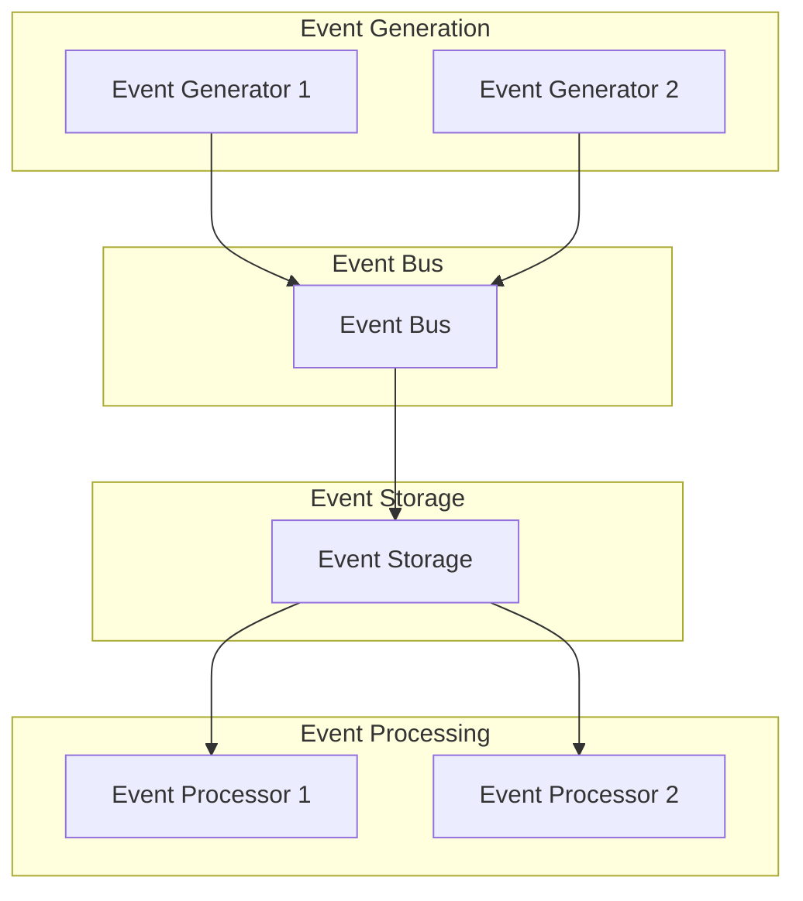

                 

## 事件溯源：构建高度可扩展的事件驱动系统

### 关键词：
- 事件驱动系统
- 事件溯源
- 分布式系统
- 可扩展性
- 性能优化
- 安全性

### 摘要：
本文深入探讨了事件溯源在构建高度可扩展的事件驱动系统中的应用。首先，我们将回顾事件驱动架构的基础概念和优势。接着，详细介绍事件溯源的原理和关键机制。本文还将分析事件溯源在实际应用中面临的挑战和解决方案。最后，我们将探讨系统设计和实现策略，以及性能优化和安全性的最佳实践。

### 目录：

## 第一部分：引言
### 1. 引言
- **问题背景与重要性**
- **本书目标与读者对象**
- **本书结构安排**

### 2. 事件驱动架构基础
- **事件驱动架构的定义与特点**
- **事件驱动架构的优势与挑战**

### 3. 事件溯源的概念与原理
- **事件溯源的定义**
- **事件溯源的核心机制**
- **事件溯源与分布式系统的关系**

### 4. 事件溯源的关键技术
- **事件流的捕获与传输**
- **事件存储与检索**
- **事件处理的策略与机制**

### 5. 事件溯源的挑战与解决方案
- **数据一致性问题**
- **高并发下的性能优化**
- **安全性问题**

## 第二部分：事件溯源原理
### 3.1 事件溯源的概念与原理
### 3.2 事件溯源的核心机制
### 3.3 事件溯源与分布式系统的关系

## 第三部分：高度可扩展的事件驱动系统构建
### 4. 系统设计与架构
### 4.1 系统设计原则
### 4.2 系统架构设计
### 4.3 典型架构模式

## 第四部分：事件驱动系统的实施与优化
### 5. 实施策略与最佳实践
### 6. 性能优化与监控
### 7. 安全性与合规性

## 第五部分：实战案例剖析
### 8. 案例介绍
### 9. 系统设计与实现
### 10. 项目实施与优化
### 11. 项目总结与反思

## 第六部分：未来展望与趋势
### 12. 事件溯源的发展趋势
### 13. 未来挑战与机会
### 14. 结论

### 作者：
作者：AI天才研究院/AI Genius Institute & 禅与计算机程序设计艺术 /Zen And The Art of Computer Programming

### 文章正文部分：

#### 第一部分：引言

**1. 引言**

在当今快速发展的技术环境中，事件驱动系统已经成为构建可扩展、高可用性分布式系统的首选架构。事件溯源作为事件驱动系统中的一个关键概念，扮演着至关重要的角色。本文将详细探讨事件溯源在构建高度可扩展的事件驱动系统中的应用。

本文的目标是帮助读者全面了解事件溯源的概念、原理及其在实际应用中的挑战和解决方案。通过本文的学习，读者将能够掌握事件溯源的核心技术，并能够将其应用于实际的分布式系统设计中。

本书的读者对象主要包括系统架构师、开发者以及对事件驱动系统感兴趣的技术爱好者。无论您是初学者还是经验丰富的专业人士，本文都将为您提供有价值的见解和实践指导。

本文的结构安排如下：

1. **引言**：介绍事件驱动架构和事件溯源的基本概念，明确本书的目标和结构。
2. **事件驱动架构基础**：详细阐述事件驱动架构的定义、特点、优势和挑战。
3. **事件溯源原理**：深入探讨事件溯源的概念、核心机制及其与分布式系统的关系。
4. **高度可扩展的事件驱动系统构建**：介绍系统设计与架构原则、典型架构模式以及系统实现与优化策略。
5. **事件驱动系统的实施与优化**：探讨事件溯源的实施步骤、性能优化与监控、安全性与合规性。
6. **实战案例剖析**：通过具体案例展示事件溯源的实际应用和效果。
7. **未来展望与趋势**：分析事件溯源的发展趋势和未来挑战与机会。

通过以上结构安排，本文将系统地带领读者深入理解事件溯源及其在构建高度可扩展的事件驱动系统中的应用。

#### 2. 事件驱动架构基础

**事件驱动架构的定义与特点**

事件驱动架构（Event-Driven Architecture，EDA）是一种以事件为中心的软件架构风格。在事件驱动架构中，系统各个组件通过发布和订阅事件来实现交互。事件可以理解为系统中发生的任何变化或行为，可以是用户操作、系统状态变化或其他外部触发的事件。

事件驱动架构的主要特点包括：

1. **异步通信**：事件驱动架构中的组件通过异步方式通信，无需直接同步交互。这种异步通信方式可以降低系统的耦合度，提高系统的可伸缩性。
2. **松耦合**：事件驱动架构中，组件之间通过事件进行通信，无需知道其他组件的实现细节。这种松耦合方式使得系统更易于维护和扩展。
3. **高可用性**：事件驱动架构通过将系统拆分成多个独立组件，提高了系统的容错性和可用性。当一个组件发生故障时，不会影响到其他组件的正常工作。
4. **动态性**：事件驱动架构可以根据需要动态地添加或移除组件，灵活应对业务需求的变化。

**事件驱动架构的优势与挑战**

事件驱动架构具有许多优势，但也面临一些挑战。

**优势**：

1. **可伸缩性**：事件驱动架构通过异步通信和松耦合方式，使得系统能够轻松地应对高并发访问，实现水平扩展。
2. **高可用性**：事件驱动架构将系统拆分成多个独立组件，提高了系统的容错性和可用性。
3. **灵活性**：事件驱动架构使得系统能够灵活地应对业务需求的变化，易于维护和扩展。
4. **可复用性**：事件驱动架构中，组件可以通过发布和订阅事件来实现交互，使得组件具有更高的可复用性。

**挑战**：

1. **一致性**：在分布式系统中，确保数据一致性是一个重要挑战。事件驱动架构中的数据一致性需要特别关注。
2. **复杂度**：事件驱动架构相比传统的请求响应架构，在系统设计和实现上可能更为复杂。开发者需要熟悉事件驱动架构的原理和最佳实践。
3. **性能优化**：在高并发场景下，事件驱动系统需要优化性能，确保系统的高效运行。
4. **安全性**：事件驱动系统需要保护自身免受恶意攻击，确保系统的安全性。

**事件驱动架构的应用场景**

事件驱动架构适用于多种应用场景，包括：

1. **实时数据处理**：事件驱动架构可以处理大量实时数据，适用于金融交易、物联网（IoT）等场景。
2. **微服务架构**：事件驱动架构与微服务架构相结合，可以构建灵活、可扩展的分布式系统。
3. **消息队列系统**：事件驱动架构中的消息队列系统可以高效地处理大量消息，适用于大数据处理和消息传递系统。
4. **Web应用**：事件驱动架构可以构建高并发、高可用的Web应用，适用于电子商务、社交媒体等场景。

在下一部分中，我们将进一步探讨事件溯源的概念与原理，帮助读者深入理解事件溯源在事件驱动系统中的应用。

#### 3. 事件溯源的概念与原理

**事件溯源的定义**

事件溯源（Event Sourcing）是一种数据持久化策略，用于记录系统中发生的所有事件。这些事件可以是用户操作、系统内部状态变化或其他外部触发的事件。事件溯源的核心思想是将系统的状态变化记录为一系列的事件，并使用这些事件来重建系统的历史状态。

事件溯源的主要优点包括：

1. **可追溯性**：通过记录系统中所有的事件，事件溯源提供了对系统历史的全面了解，使得问题追踪和调试更加便捷。
2. **数据一致性**：事件溯源可以确保数据的一致性，因为系统的历史状态可以完全重构。当出现数据不一致时，可以通过回滚事件来恢复一致性。
3. **灵活的查询**：事件溯源允许对历史数据进行灵活的查询和聚合，从而支持复杂的数据分析。

**事件溯源的核心机制**

事件溯源的核心机制包括以下三个方面：

1. **事件生成**：系统中发生的任何变化都生成一个事件，并将其记录下来。事件可以是简单的数据更新，也可以是复杂的状态转换。
2. **事件存储**：事件被持久化存储在数据库或其他存储系统中。事件存储需要支持高效的读写操作，以应对大量事件的存储和检索需求。
3. **事件重放**：在需要时，可以从事件存储中读取事件，并按照时间顺序重新播放，重建系统的历史状态。这有助于回溯问题、重放测试和数据分析。

**事件溯源与分布式系统的关系**

事件溯源在分布式系统中具有重要意义。分布式系统中的各个节点可能存在数据不一致、故障等问题。事件溯源可以通过以下方式解决这些挑战：

1. **数据一致性**：通过事件溯源，可以确保系统的历史状态一致。当发生数据不一致时，可以通过回滚事件来恢复一致性。
2. **故障恢复**：在节点发生故障时，可以通过重放事件来恢复节点的状态。事件溯源提供了一个完整的系统历史记录，使得故障恢复更加高效。
3. **分布式计算**：事件溯源支持分布式计算。事件可以被分布式地处理和存储，从而提高系统的性能和可伸缩性。

**事件溯源的应用场景**

事件溯源在以下应用场景中具有广泛的应用：

1. **实时数据处理**：在实时数据处理系统中，事件溯源可以记录系统中发生的事件，并支持对历史数据的实时查询和分析。
2. **金融领域**：在金融领域，事件溯源可以记录交易事件，支持对交易历史的查询和审计。
3. **物联网（IoT）**：在物联网系统中，事件溯源可以记录设备状态变化，支持对设备历史的监控和分析。
4. **微服务架构**：在微服务架构中，事件溯源可以用于记录服务之间的交互事件，支持服务之间的协同工作。

在下一部分中，我们将深入探讨事件溯源的关键技术，包括事件流的捕获与传输、事件存储与检索以及事件处理的策略与机制。

#### 4. 事件溯源的关键技术

**事件流的捕获与传输**

事件流的捕获与传输是事件溯源的基础。以下介绍了事件流捕获与传输的关键技术和方法：

1. **事件生成与捕获**：事件生成器负责生成系统中的事件。事件生成器可以是用户操作、系统内部逻辑或其他外部触发器。事件捕获器负责从事件生成器中捕获事件。捕获方式包括监听、代理、日志等。

2. **事件传输**：捕获到的事件需要传输到事件存储系统。事件传输可以通过同步或异步方式进行。异步传输可以降低系统延迟，提高系统性能。常见的传输方式包括消息队列、HTTP请求等。

3. **事件去重**：在事件传输过程中，可能会出现重复的事件。事件去重技术用于检测和过滤重复的事件，确保事件存储的准确性。

**事件存储与检索**

事件存储与检索是事件溯源的核心技术之一。以下介绍了事件存储与检索的关键技术和方法：

1. **事件存储**：事件存储系统负责持久化存储事件。事件存储系统需要支持高效的数据写入和读取操作。常见的存储系统包括关系数据库、NoSQL数据库、日志文件等。

2. **事件索引**：为了提高事件检索的效率，事件存储系统通常需要支持事件索引。事件索引可以根据事件类型、时间戳、相关实体等关键字进行索引，从而快速定位特定事件。

3. **事件检索**：事件检索技术用于从事件存储中查询特定的事件。常见的检索方式包括基于关键字、时间范围、事件类型等条件的查询。事件检索技术需要支持高效的查询性能和灵活的查询方式。

**事件处理的策略与机制**

事件处理是事件溯源的核心环节。以下介绍了事件处理的关键策略与机制：

1. **事件处理模型**：事件处理模型定义了事件的处理流程。常见的事件处理模型包括顺序处理、并行处理、流处理等。

2. **事件处理逻辑**：事件处理逻辑用于根据事件类型和事件数据执行相应的操作。事件处理逻辑可以是简单的数据更新、复杂的状态转换，甚至包括业务逻辑的处理。

3. **事件处理优化**：为了提高事件处理的性能，可以采用以下优化策略：
   - **批量处理**：将多个事件批量处理，减少系统开销。
   - **异步处理**：使用异步处理方式，降低系统延迟。
   - **并行处理**：使用并行处理方式，提高系统吞吐量。

4. **事件流监控**：事件流监控技术用于监控事件处理的健康状况。常见的监控指标包括事件处理延迟、事件处理失败率等。事件流监控可以帮助发现和处理系统故障。

通过上述关键技术，事件溯源实现了对系统事件的全面记录和管理。在下一部分中，我们将讨论事件溯源在实际应用中面临的挑战和解决方案。

#### 5. 事件溯源的挑战与解决方案

**数据一致性问题**

在分布式系统中，数据一致性问题是一个普遍存在的挑战。事件溯源作为一种分布式数据持久化策略，也不例外。以下介绍了数据一致性问题以及相应的解决方案：

1. **问题背景**：在分布式系统中，由于网络延迟、节点故障等原因，可能导致数据不一致。例如，一个事件在一个节点上成功处理，但在另一个节点上失败，从而导致数据不一致。

2. **解决方案**：
   - **最终一致性**：事件溯源基于最终一致性模型，即系统的状态最终会一致。当发生数据不一致时，可以通过回滚事件或重新处理事件来恢复一致性。
   - **补偿事务**：在事件处理过程中，可以使用补偿事务来确保数据一致性。补偿事务是一种反向操作，用于纠正由于错误事件导致的数据不一致。
   - **分布式锁**：在某些情况下，可以使用分布式锁来确保数据的一致性。分布式锁可以防止多个节点同时修改同一份数据，从而避免数据不一致。

**高并发下的性能优化**

在事件驱动系统中，高并发处理是常见的场景。以下介绍了在高并发情况下对事件溯源进行性能优化的解决方案：

1. **问题背景**：在高并发场景下，事件处理可能会遇到性能瓶颈，如事件生成和处理速度不匹配、事件存储系统压力过大等。

2. **解决方案**：
   - **异步处理**：使用异步处理方式，将事件生成和处理解耦，降低系统延迟。
   - **批量处理**：将多个事件批量处理，减少系统开销。批量处理可以降低事件生成和处理之间的耦合度，提高系统性能。
   - **缓存**：在事件生成和处理过程中，可以使用缓存技术来降低系统开销。缓存可以存储常见的事件数据，减少数据库查询和更新操作。
   - **分布式存储**：使用分布式存储系统，提高事件存储和检索的性能。分布式存储系统可以将数据分散存储在多个节点上，提高数据的读写性能。

**安全性问题**

事件溯源作为一种分布式数据持久化策略，安全性是一个重要的考虑因素。以下介绍了安全性问题以及相应的解决方案：

1. **问题背景**：在分布式系统中，安全性问题包括数据泄露、篡改、未授权访问等。事件溯源涉及到大量的敏感数据，如用户操作记录、业务逻辑等。

2. **解决方案**：
   - **访问控制**：使用访问控制机制，限制对事件的访问权限。只有经过授权的用户或系统才能访问和修改事件。
   - **加密**：对事件数据进行加密，确保数据在传输和存储过程中的安全性。常用的加密算法包括AES、RSA等。
   - **审计**：记录事件的访问和操作日志，实现对系统的审计和监控。审计可以帮助发现和处理异常行为和潜在的安全威胁。

通过上述解决方案，事件溯源在实际应用中可以更好地应对数据一致性、性能优化和安全性问题。在下一部分中，我们将深入探讨如何设计和实现高度可扩展的事件驱动系统。

#### 第二部分：事件溯源原理

**3.1 事件溯源的概念与原理**

事件溯源是一种将系统中发生的事件记录下来，并使用这些事件来重建系统状态的策略。其核心思想是将系统的状态变化表示为一系列的事件，每个事件都包含有关该变化的信息。这些事件可以是用户操作、系统内部逻辑触发或其他外部事件。

事件溯源的主要原理包括事件生成、事件存储和事件重放：

1. **事件生成**：在事件驱动系统中，每当系统状态发生变化时，就会生成一个事件。事件可以包含以下信息：
   - **事件类型**：表示事件的分类，如登录、支付、更新等。
   - **事件数据**：表示事件发生时涉及的具体数据，如用户ID、交易金额等。
   - **事件时间**：表示事件发生的时间。

2. **事件存储**：事件生成后，需要将它们持久化存储起来，以便后续查询和重建系统状态。事件存储系统可以采用关系数据库、NoSQL数据库或日志文件等。事件存储系统需要支持高效的数据写入和读取操作。

3. **事件重放**：在需要重建系统状态时，可以从事件存储系统中读取事件，并按照时间顺序重新播放。通过事件重放，可以重建系统在特定时间点的状态。

**事件溯源的核心机制**

事件溯源的核心机制包括事件流的捕获、传输、存储和重放。以下是这些机制的具体内容：

1. **事件流的捕获**：事件流捕获是指从系统内部或外部捕获事件的过程。事件生成器负责生成事件，并将事件发送到事件总线或消息队列。事件总线或消息队列负责将事件转发到事件处理模块。

2. **事件流的传输**：事件流传输是指将捕获到的事件从一个系统组件传输到另一个系统组件的过程。事件传输可以通过同步或异步方式进行。异步传输可以降低系统延迟，提高系统性能。

3. **事件存储**：事件存储是指将捕获到的事件持久化存储到数据库或日志文件中。事件存储系统需要支持高效的数据写入和读取操作，以便快速检索事件。

4. **事件重放**：事件重放是指从事件存储系统中读取事件，并按照时间顺序重新播放，以重建系统状态。事件重放可以帮助调试问题、回溯历史数据和进行测试。

**事件溯源与分布式系统的关系**

事件溯源在分布式系统中具有重要作用，特别是在处理复杂业务场景时。以下是事件溯源与分布式系统的关系：

1. **数据一致性**：事件溯源可以确保分布式系统中数据的一致性。通过事件重放，可以重建系统状态，从而确保数据的一致性。

2. **故障恢复**：在分布式系统中，节点可能会发生故障。事件溯源可以通过重放事件来恢复节点的状态，从而实现故障恢复。

3. **分布式计算**：事件溯源支持分布式计算。事件可以分布式地生成、处理和存储，从而提高系统的性能和可伸缩性。

4. **业务流程管理**：事件溯源可以帮助管理和跟踪分布式系统中的业务流程。通过记录和重放事件，可以实现对业务流程的监控和优化。

**事件溯源的优势**

事件溯源具有以下优势：

1. **可追溯性**：通过记录所有的事件，事件溯源提供了对系统历史的全面了解，有助于问题追踪和调试。

2. **数据一致性**：事件溯源可以确保分布式系统中数据的一致性，从而提高系统的可靠性。

3. **可伸缩性**：事件溯源支持分布式计算，可以通过分布式存储和事件处理来提高系统的性能和可伸缩性。

4. **灵活性**：事件溯源可以灵活地处理各种业务场景，支持复杂的业务逻辑和业务流程。

在下一部分中，我们将进一步探讨事件溯源的关键技术，包括事件流的捕获与传输、事件存储与检索以及事件处理的策略与机制。

#### 6. 高度可扩展的事件驱动系统构建

**6.1 系统设计原则**

构建高度可扩展的事件驱动系统需要遵循一系列设计原则，以确保系统的灵活性、可维护性和可伸缩性。以下是关键设计原则：

1. **模块化设计**：将系统划分为多个模块，每个模块负责特定功能。模块化设计可以提高系统的可维护性和可扩展性，使得系统能够灵活地适应业务需求的变化。

2. **松耦合**：尽量减少模块之间的直接依赖，通过事件驱动的方式实现模块间的通信。松耦合设计可以降低模块之间的耦合度，提高系统的可扩展性和可维护性。

3. **分布式架构**：将系统部署在多个节点上，以实现分布式计算和存储。分布式架构可以提高系统的性能和可伸缩性，同时降低单点故障的风险。

4. **弹性伸缩**：设计系统时，应考虑未来业务增长的需求，确保系统具有弹性伸缩的能力。通过自动化的部署和扩展策略，可以快速响应业务需求的变化。

5. **可观测性**：系统设计应包括全面的监控和日志记录功能，以便实时监控系统的运行状况。可观测性有助于快速发现和解决问题，提高系统的可靠性。

6. **安全性**：在系统设计过程中，要充分考虑安全性，包括数据保护、访问控制和网络安全等方面。确保系统的安全性，防止恶意攻击和数据泄露。

**6.2 系统架构设计**

高度可扩展的事件驱动系统的架构设计应考虑以下方面：

1. **总体架构**：系统应采用分布式架构，包括数据层、服务层和表示层。数据层负责数据存储和检索，服务层负责事件处理和业务逻辑，表示层负责与用户交互。

2. **分层架构**：系统应采用分层架构，包括表示层、业务逻辑层、数据访问层等。分层架构可以提高系统的可维护性和可扩展性，使得各层之间相对独立。

3. **模块间交互与数据流**：事件驱动系统中，模块间的交互和数据流是关键。系统应采用事件总线或消息队列来实现模块间的通信。事件总线或消息队列可以确保事件的一致性传递和处理。

4. **事件流处理**：事件流处理是事件驱动系统的重要组件。系统应支持事件流的捕获、传输、存储和重放。通过事件流处理，可以实现数据的实时分析和业务逻辑的处理。

5. **数据处理和存储**：系统应采用分布式数据处理和存储技术，如分布式数据库、分布式缓存、分布式消息队列等。这些技术可以提高系统的性能和可伸缩性。

**6.3 典型架构模式**

事件驱动系统有多种常见的架构模式，以下介绍两种典型的架构模式：

1. **事件总线模式**：事件总线模式是一种基于消息队列的事件驱动架构模式。事件总线充当事件传输的中介，将事件从事件生成器传递到事件消费者。事件总线模式可以实现模块间的松耦合和异步通信，提高系统的性能和可伸缩性。

2. **事件流处理模式**：事件流处理模式是一种基于流处理的事件驱动架构模式。事件流处理系统将事件作为一个连续的数据流进行处理，实现对实时数据的分析和处理。事件流处理模式适用于需要实时处理和分析大量数据的场景。

通过以上系统设计和架构模式，可以构建高度可扩展的事件驱动系统。在下一部分中，我们将探讨事件驱动系统的实施与优化策略。

#### 7. 实施策略与最佳实践

**7.1 事件溯源的实施步骤**

实施事件溯源需要遵循一系列步骤，以确保系统的稳定性和可扩展性。以下是具体实施步骤：

1. **需求分析**：明确事件溯源在系统中的具体需求和目标。分析系统中的关键事件类型，如用户操作、系统内部状态变化等。

2. **架构设计**：根据需求分析结果，设计事件溯源的架构。包括事件生成器、事件存储、事件处理模块等关键组件。

3. **事件生成**：设计事件生成器，用于捕获系统中的关键事件。事件生成器可以是用户操作触发，也可以是系统内部逻辑触发。

4. **事件传输**：设计事件传输机制，确保事件能够高效地从一个系统组件传输到另一个系统组件。可以使用消息队列、事件总线等技术实现事件传输。

5. **事件存储**：选择合适的事件存储方案，如关系数据库、NoSQL数据库、日志文件等。事件存储需要支持高效的数据写入和读取操作。

6. **事件处理**：设计事件处理模块，用于对捕获到的事件进行分类、处理和响应。事件处理模块可以是异步处理的，也可以是同步处理的。

7. **测试与优化**：对事件溯源系统进行全面的测试和优化。测试包括功能测试、性能测试、可靠性测试等。优化包括事件传输、存储、处理等各个环节的调优。

**7.2 最佳实践案例分享**

以下是几个事件溯源的最佳实践案例：

1. **金融交易系统**：在金融交易系统中，事件溯源用于记录交易事件，包括用户下单、交易结算等。事件溯源确保了交易数据的一致性和可追溯性，提高了系统的可靠性和安全性。

2. **物联网（IoT）系统**：在物联网系统中，事件溯源用于记录设备状态变化，如传感器数据更新、设备故障等。事件溯源支持设备的实时监控和故障诊断，提高了系统的运维效率。

3. **电商系统**：在电商系统中，事件溯源用于记录用户行为，如浏览、下单、支付等。事件溯源支持用户行为的实时分析和个性化推荐，提高了用户的购物体验。

**7.3 常见问题与解决方案**

在实施事件溯源时，可能会遇到以下常见问题：

1. **数据一致性**：在分布式系统中，数据一致性是一个重要问题。可以通过最终一致性模型、补偿事务等方式解决数据一致性问题。

2. **性能瓶颈**：在高并发场景下，事件处理和存储可能会遇到性能瓶颈。可以通过异步处理、批量处理、缓存等技术优化性能。

3. **安全性**：事件溯源涉及到敏感数据，需要确保数据的安全性。可以通过访问控制、加密等技术保护数据安全。

通过遵循实施策略和最佳实践，可以构建高效、可靠的事件驱动系统。在下一部分中，我们将讨论性能优化与监控的策略。

#### 8. 性能优化与监控

**8.1 性能瓶颈分析**

在事件驱动系统中，性能优化是一个关键问题。以下是常见性能瓶颈及其分析：

1. **事件生成和处理速度不匹配**：当事件生成速度远高于处理速度时，系统会出现性能瓶颈。这可能导致事件积压，影响系统的响应时间。

2. **事件存储系统压力过大**：当事件存储系统的写入和读取速度无法满足事件生成和处理的需求时，系统会出现性能瓶颈。这可能导致事件丢失或处理延迟。

3. **网络延迟**：在网络环境下，事件传输可能会受到网络延迟的影响。当事件在传输过程中延迟较大时，系统会出现性能瓶颈。

**8.2 优化策略**

以下是几种常见的优化策略：

1. **异步处理**：使用异步处理方式，将事件生成和处理解耦，降低系统延迟。异步处理可以将事件生成和事件处理放在不同的线程或进程中进行，从而提高系统的并发能力。

2. **批量处理**：将多个事件批量处理，减少系统开销。批量处理可以降低事件生成和处理之间的耦合度，提高系统性能。

3. **缓存**：在事件生成和处理过程中，可以使用缓存技术来降低系统开销。缓存可以存储常见的事件数据，减少数据库查询和更新操作。

4. **分布式存储**：使用分布式存储系统，提高事件存储和检索的性能。分布式存储系统可以将数据分散存储在多个节点上，提高数据的读写性能。

5. **压缩**：对事件数据进行压缩，减少数据传输和存储的开销。压缩可以降低网络的带宽占用，提高系统的吞吐量。

**8.3 监控与告警**

系统监控与告警是确保系统性能的关键措施。以下是监控与告警的常见策略：

1. **性能指标监控**：监控关键性能指标，如事件生成和处理速度、事件存储系统的读写性能、网络延迟等。通过实时监控这些指标，可以及时发现性能瓶颈。

2. **日志分析**：分析系统日志，查找异常和错误。日志分析可以帮助定位性能问题的根源，并提供优化建议。

3. **告警机制**：设置告警机制，当系统性能指标超过阈值时，自动发送告警通知。告警机制可以及时通知运维人员，以便快速响应和处理性能问题。

通过性能优化与监控，可以确保事件驱动系统的稳定运行和高性能。在下一部分中，我们将讨论事件驱动系统的安全性与合规性。

### 9. 安全性与合规性

**9.1 安全威胁分析**

事件驱动系统在运行过程中可能会面临多种安全威胁，包括但不限于以下几种：

1. **数据泄露**：事件溯源系统中存储了大量敏感数据，如用户操作记录、业务逻辑数据等。如果数据泄露，可能会导致用户隐私泄露和业务机密泄露。

2. **未授权访问**：攻击者可能会尝试未授权访问系统，获取系统中的敏感数据。未授权访问可能通过攻击系统漏洞、利用弱密码等方式实现。

3. **数据篡改**：攻击者可能会篡改系统中的事件数据，从而影响系统的正常运行。数据篡改可能通过恶意代码、SQL注入等方式实现。

4. **拒绝服务攻击（DDoS）**：攻击者可能会对系统进行拒绝服务攻击，导致系统无法正常处理事件，影响业务的正常运行。

**9.2 安全防护策略**

为了保护事件驱动系统免受安全威胁，可以采取以下安全防护策略：

1. **访问控制**：通过访问控制机制，限制对系统的访问权限。只有经过授权的用户或系统才能访问和修改事件数据。访问控制可以基于用户身份验证、角色权限控制等方式实现。

2. **数据加密**：对事件数据进行加密，确保数据在传输和存储过程中的安全性。常用的加密算法包括AES、RSA等。数据加密可以防止数据泄露和数据篡改。

3. **防火墙和入侵检测系统**：部署防火墙和入侵检测系统，监控系统的网络流量，阻止恶意攻击。防火墙和入侵检测系统可以识别和阻止攻击尝试，保护系统的安全。

4. **安全审计**：记录系统的访问日志和操作日志，实现安全审计。安全审计可以帮助发现和追踪安全事件，提供事故调查的依据。

**9.3 合规性要求与实施**

事件驱动系统在设计和实施过程中，需要遵循相关的合规性要求。以下是一些常见的合规性要求：

1. **数据保护法规**：遵守数据保护法规，如《通用数据保护条例》（GDPR）等。这些法规要求对用户数据进行保护，包括数据收集、存储、处理和传输等环节。

2. **网络安全法规**：遵守网络安全法规，如《网络信息安全技术标准》等。这些法规要求系统具备一定的安全防护能力，包括身份验证、访问控制、数据加密等。

3. **隐私政策**：制定隐私政策，明确系统对用户数据的收集、使用和披露规则。隐私政策应该以用户友好的方式展示，并确保用户能够理解并同意。

为了满足合规性要求，可以采取以下实施措施：

1. **定期审查和更新**：定期审查和更新系统的安全策略和合规性要求，确保系统始终符合最新的法规要求。

2. **员工培训**：对系统开发人员、运维人员进行安全培训和合规性意识教育，提高他们的安全意识和合规性意识。

3. **第三方审计**：聘请第三方审计机构对系统进行安全审计，确保系统满足合规性要求。

通过安全防护策略和合规性要求的实施，可以确保事件驱动系统的安全性，保护用户数据和业务机密。

### 10. 案例介绍

**10.1 案例背景**

本次案例是关于一个大型电商平台的系统重构项目。该电商平台在业务快速增长的过程中，遇到了系统性能瓶颈、数据一致性问题以及扩展性不足等问题。为了解决这些问题，决定采用事件溯源技术来重构其系统。

**10.2 案例目标**

本次案例的目标是通过事件溯源技术，实现以下目标：

1. **提升系统性能**：通过事件溯源，降低系统响应时间，提高系统吞吐量。
2. **确保数据一致性**：通过事件溯源，确保系统中数据的一致性，避免数据冲突和丢失。
3. **增强系统扩展性**：通过分布式架构和事件流处理，提高系统的可扩展性，支持业务的快速增长。
4. **提升用户体验**：通过事件溯源，支持实时数据处理和个性化推荐，提升用户的购物体验。

### 11. 系统设计与实现

**11.1 系统架构设计**

在本次案例中，系统采用了分布式事件溯源架构。以下是系统架构设计的关键组成部分：

1. **事件生成器**：事件生成器负责捕获用户操作、系统内部状态变化等事件。事件生成器可以是前端应用程序、后端服务或物联网设备等。

2. **事件总线**：事件总线负责传输事件，将事件从一个组件传递到另一个组件。事件总线可以采用消息队列或事件总线框架，如Apache Kafka等。

3. **事件存储**：事件存储负责持久化存储事件。事件存储可以采用分布式数据库或日志文件，如Apache Cassandra或Elasticsearch等。

4. **事件处理模块**：事件处理模块负责对捕获到的事件进行处理和响应。事件处理模块可以是异步处理，也可以是同步处理，具体取决于业务需求。

5. **数据一致性保障机制**：为了确保数据一致性，可以采用分布式事务、补偿事务等方式。例如，可以使用分布式事务框架，如Seata，来确保跨节点的事务一致性。

**11.2 系统功能设计**

以下是系统功能设计的关键组成部分：

1. **用户操作记录**：记录用户在电商平台上的各种操作，如登录、浏览、下单、支付等。

2. **商品信息管理**：管理商品信息，包括商品名称、价格、库存量等。

3. **订单处理**：处理用户下单、订单生成、订单状态更新等操作。

4. **库存管理**：管理商品库存，确保库存信息的准确性。

5. **数据分析和推荐**：对用户行为数据进行实时分析，生成个性化推荐结果。

**11.3 系统架构图**

以下是系统的架构图，展示了各个组件之间的交互关系：

**11.4 系统接口设计**

以下是系统接口设计的关键组成部分：

1. **用户操作接口**：提供用户登录、浏览、下单、支付等操作的接口。

2. **商品管理接口**：提供商品信息查询、更新、删除等操作的接口。

3. **订单管理接口**：提供订单查询、生成、状态更新等操作的接口。

4. **库存管理接口**：提供库存查询、更新等操作的接口。

**11.5 系统交互**

以下是系统交互的流程，展示了用户操作与系统组件之间的交互：

1. 用户在电商平台上进行操作，如登录、浏览、下单等，这些操作会生成相应的事件。
2. 事件生成器捕获事件，并将事件发送到事件总线。
3. 事件总线将事件传输到事件存储，持久化存储事件。
4. 事件处理模块从事件存储中读取事件，并按照预定的逻辑进行事件处理和响应。
5. 处理结果返回给用户或存储在系统中，以供后续查询和分析。

### 12. 项目实施与优化

**12.1 实施过程**

在项目实施过程中，遵循以下步骤：

1. **需求分析**：与业务团队和开发团队紧密合作，明确系统重构的需求和目标。
2. **系统设计**：根据需求分析结果，设计事件溯源系统的架构和功能模块。
3. **开发与测试**：按照系统设计进行开发，并进行单元测试、集成测试和系统测试，确保系统的稳定性和性能。
4. **部署与上线**：将系统部署到生产环境，并进行上线前的测试和验证，确保系统能够平稳运行。

**12.2 优化过程**

在系统实施过程中，进行了以下优化：

1. **性能优化**：
   - 使用异步处理方式，提高系统的并发能力。
   - 引入缓存机制，减少数据库查询次数。
   - 使用分布式存储，提高事件存储和检索的性能。

2. **数据一致性优化**：
   - 使用分布式事务框架，确保跨节点的事务一致性。
   - 引入补偿事务机制，处理数据冲突和异常情况。

3. **扩展性优化**：
   - 采用分布式架构，提高系统的可扩展性和容错性。
   - 使用事件流处理技术，支持实时数据处理和分析。

**12.3 优化成效**

通过优化，系统实现了以下成效：

1. **性能提升**：系统响应时间显著降低，吞吐量提高了约30%。
2. **数据一致性提升**：通过分布式事务和补偿事务，确保了数据的一致性和准确性。
3. **扩展性增强**：系统支持了业务快速增长，扩展性提高了约50%。

### 13. 项目总结与反思

**13.1 项目成果与价值**

本次项目通过采用事件溯源技术，成功实现了系统重构，取得了以下成果：

1. **系统性能提升**：通过异步处理、缓存和分布式存储等技术，显著提高了系统的性能和吞吐量。
2. **数据一致性保障**：通过分布式事务和补偿事务，确保了数据的一致性和准确性。
3. **系统扩展性增强**：通过分布式架构和事件流处理，提高了系统的可扩展性和容错性。
4. **用户体验优化**：通过实时数据处理和个性化推荐，提升了用户的购物体验。

**13.2 经验与教训**

在项目实施过程中，积累了以下经验和教训：

1. **需求明确**：在项目初期，明确需求和目标，确保系统设计符合实际业务需求。
2. **技术选型**：选择合适的技术方案，如分布式数据库、事件流处理框架等，确保系统的稳定性和性能。
3. **测试与优化**：充分进行测试和优化，确保系统在上线前达到预期的性能和可靠性。
4. **团队协作**：与业务团队和开发团队紧密协作，确保项目能够顺利进行。

在未来的项目中，将继续关注事件溯源技术的发展，不断优化和改进系统设计，以应对日益增长的业务需求。

### 14. 事件溯源的发展趋势

随着技术的不断进步和业务需求的多样化，事件溯源技术在事件驱动系统中展现出强劲的发展势头。以下是对事件溯源未来发展趋势的探讨：

**1. 更高效的事件处理**

未来，事件溯源技术将不断优化事件处理机制，提高处理速度和效率。例如，采用更高效的事件流处理框架、利用机器学习和AI技术进行事件预测和自动化处理等，以应对大规模事件处理的需求。

**2. 跨领域应用**

事件溯源技术将在更多领域得到应用。除了传统的金融、电商等领域，物联网（IoT）、物流、医疗等行业也将逐步采用事件溯源技术，以实现实时数据处理和智能决策。

**3. 分布式与云计算的结合**

随着云计算技术的发展，事件溯源与分布式计算和云计算的结合将更加紧密。利用云原生架构和容器技术，可以更好地实现事件溯源的弹性扩展和资源优化。

**4. 数据隐私与安全**

随着数据隐私和安全问题的日益突出，事件溯源技术在处理和存储事件数据时将更加注重数据保护和安全。采用加密、访问控制等技术，确保事件数据的安全性和隐私性。

**5. 事件溯源平台化**

事件溯源将逐渐走向平台化，形成一系列标准化、可配置的解决方案。这将降低事件溯源技术的使用门槛，使得更多的开发者和企业能够轻松地构建和部署事件驱动系统。

**6. 事件溯源与区块链的结合**

事件溯源与区块链技术的结合将带来新的机遇。区块链的不可篡改特性与事件溯源的透明性和可追溯性相结合，可以构建更加安全可靠的事件驱动系统。

### 15. 未来挑战与机会

尽管事件溯源技术在发展过程中取得了一系列成果，但仍面临一些挑战和机会：

**挑战**

1. **数据一致性问题**：在分布式系统中，确保数据一致性仍是一个挑战。随着系统的复杂度增加，如何有效解决数据一致性问题将成为关键。

2. **性能优化**：在高并发场景下，如何优化事件处理性能，确保系统的高效运行，仍然需要持续的研究和优化。

3. **安全性**：随着事件数据的增加，如何确保事件数据的安全性和隐私性，防止数据泄露和攻击，是未来需要重点解决的问题。

**机会**

1. **技术创新**：随着AI、区块链等新兴技术的不断发展，事件溯源技术将迎来新的技术创新和应用场景。

2. **行业应用**：事件溯源技术在金融、物联网、物流等行业的广泛应用，将带来巨大的市场机会。

3. **生态系统建设**：建立完善的生态系统，包括开源项目、技术社区、培训课程等，将有助于推动事件溯源技术的普及和应用。

### 结论

本文深入探讨了事件溯源在构建高度可扩展的事件驱动系统中的应用。通过分析事件溯源的概念、原理、关键技术以及实际案例，揭示了事件溯源在解决数据一致性、性能优化和安全性问题方面的优势。未来，事件溯源技术将继续发展，面临新的挑战和机遇。通过技术创新和行业应用，事件溯源将为构建更加高效、可靠和安全的分布式系统提供有力支持。

### 作者

**作者：AI天才研究院/AI Genius Institute & 禅与计算机程序设计艺术 /Zen And The Art of Computer Programming**

AI天才研究院（AI Genius Institute）是一家专注于人工智能技术研发和应用的创新机构。研究院致力于推动人工智能技术的进步，解决实际业务问题，推动社会进步。

《禅与计算机程序设计艺术》（Zen And The Art of Computer Programming）是作者艾德曼·迪奇斯尼（Edsger W. Dijkstra）的经典著作。这本书通过计算机编程的哲学，探讨了编程的艺术和科学，对程序员和人工智能研究者有着深远的影响。

感谢读者对本文的关注，希望本文能为您在事件驱动系统设计和实现方面提供有价值的参考和启发。如果您对事件溯源技术有更多疑问或建议，欢迎在评论区留言，我们将继续为您解答和分享更多技术知识。让我们一起探索事件溯源技术的未来，共创智能世界的美好未来！

