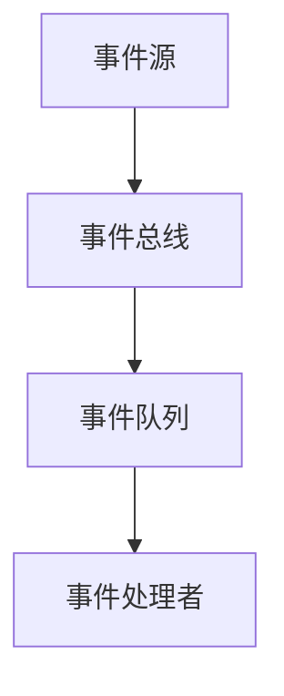

                 

### 事件驱动架构概述

在现代软件工程中，系统的复杂度和规模不断增长，这要求我们采用更加高效和灵活的架构模式来满足高性能和高可扩展性的需求。事件驱动架构（Event-Driven Architecture，简称EDA）作为一种先进的系统设计模式，因其强大的异步处理能力、松耦合的特点以及卓越的可扩展性，逐渐成为构建高性能、高可扩展性响应式系统的首选方案。

#### 问题背景

传统的请求驱动模型（Request-Driven Architecture，RDA）是建立在同步调用和响应的基础上的。在这种模型中，系统的各个组件通过请求和响应的方式进行交互，当一个组件发出请求后，必须等待响应返回才能进行下一步操作。这种模式在简单的、组件间交互较少的应用场景下表现良好，但随着系统复杂度的增加，它暴露出了一系列问题：

1. **性能瓶颈**：请求和响应的同步处理方式可能导致系统响应速度变慢，尤其在高峰期，由于大量请求堆积，系统的性能可能会急剧下降。
2. **扩展性问题**：传统的请求驱动模型在扩展性方面存在一定的局限性，增加新组件或扩展系统功能往往需要修改现有代码，导致系统维护成本增加。
3. **可靠性问题**：同步调用过程中，任何一个环节的故障都可能引发整个系统的崩溃。

面对这些问题，我们需要一种更加灵活和高效的架构模式来应对现代软件系统的需求，这就催生了事件驱动架构。

#### 问题描述

事件驱动架构（EDA）是一种通过事件来驱动系统状态变化的模型。在这种架构中，系统组件之间通过事件进行通信，而不是通过请求和响应。事件可以看作是一种数据包，它携带了关于系统状态变化的信息。当一个事件发生时，相关的组件会被通知并执行相应的操作，而不需要等待其他组件的响应。

事件驱动架构的核心问题是如何高效地处理大量事件，并在系统中实现松耦合。具体来说，问题描述可以归纳为以下几点：

1. **事件产生**：系统中的某个组件（事件源）产生了一个事件，这个事件需要被系统中的其他组件处理。
2. **事件传递**：事件需要从一个组件传递到另一个组件，这个过程中需要保证事件传递的效率和可靠性。
3. **事件处理**：接收事件的组件需要根据事件的类型和数据内容进行处理，并可能产生新的事件。
4. **系统耦合**：如何降低系统组件之间的耦合度，使得系统更加灵活和可扩展。

#### 问题解决

事件驱动架构通过以下方式解决了传统请求驱动模型中存在的问题：

1. **异步处理**：事件驱动架构采用了异步处理的方式，事件的处理不必是同步的。这意味着当一个组件产生事件时，它不需要等待其他组件的处理结果，从而提高了系统的响应速度和处理能力。
2. **松耦合**：通过事件作为系统组件之间的通信媒介，事件驱动架构实现了组件之间的松耦合。组件只需要关注自己感兴趣的事件，而不需要知道其他组件的具体实现细节，从而降低了系统的复杂度和维护成本。
3. **可扩展性**：事件驱动架构天然具有高可扩展性，因为新组件的加入只需订阅和发布相关事件，不需要修改现有代码，大大提高了系统的灵活性和可维护性。
4. **高可靠性**：事件驱动架构通过分布式部署和事件队列等机制，提高了系统的容错能力和稳定性，即使某个节点发生故障，其他节点仍能正常运行。

#### 边界与外延

事件驱动架构不仅适用于Web应用、分布式系统，还广泛应用于物联网（IoT）、游戏、实时通信等领域。在物联网领域，设备可以产生大量事件，如传感器数据、设备状态更新等，通过事件驱动架构，这些数据可以被实时处理和分析。在游戏领域，事件驱动架构可以用于实现复杂的游戏逻辑和用户交互，如角色动作、场景切换等。在实时通信领域，事件驱动架构可以用于处理大量并发连接和实时数据传输，如聊天应用、视频会议系统等。

#### 概念结构与核心要素组成

事件驱动架构的核心要素包括：

- **事件**：驱动系统状态变化的数据包，可以包含事件类型、数据内容、事件源等信息。
- **事件源**：产生事件的实体，可以是系统中的任何组件，如用户操作、设备状态变化等。
- **事件处理者**：处理事件的实体，根据事件类型和数据内容执行相应的操作，可以是系统中的任何组件。
- **事件队列**：暂存事件的数据结构，可以保证事件的有序处理和可靠传输。
- **事件总线**：负责事件传递的组件，类似于消息总线，用于在系统组件之间传递事件。

通过这些核心要素，事件驱动架构实现了异步处理、松耦合和可扩展性，为构建高性能、高可扩展性的响应式系统提供了有力支持。

#### 第1章总结

本章详细介绍了事件驱动架构的背景、问题描述、问题解决方法以及相关的边界与外延。事件驱动架构以其异步处理、松耦合和可扩展性等特点，成为现代软件系统设计的重要选择。通过理解事件驱动架构的核心概念和要素，我们可以为后续章节的深入探讨打下坚实的基础。接下来，我们将进一步探讨事件驱动架构的核心概念与联系，以便更全面地理解这一架构模式。

### 第1章: 事件驱动架构基础

#### 第1节：事件驱动架构概述

在深入了解事件驱动架构（Event-Driven Architecture，EDA）的核心概念和模式之前，我们需要对事件驱动架构进行一个全面的概述。事件驱动架构是一种通过事件来驱动系统状态变化的系统设计模式，它提供了异步处理、松耦合和可扩展性等多种优势。在本节中，我们将首先介绍事件驱动架构的背景，然后深入探讨其核心概念、基本原理和关键要素。

##### 背景介绍

随着互联网的快速发展，软件系统逐渐变得越来越复杂，规模也越来越庞大。传统的请求驱动模型（Request-Driven Architecture，RDA）在这种环境下暴露出了许多问题，如性能瓶颈、扩展性和可靠性问题。为了应对这些挑战，业界开始探索新的系统设计模式，事件驱动架构应运而生。

事件驱动架构最早起源于操作系统的消息机制和微内核设计理念。在现代软件系统中，事件驱动架构得到了广泛应用，尤其是在分布式系统、实时系统、物联网（IoT）和游戏等领域。

##### 核心概念

事件驱动架构的核心概念主要包括事件、事件源、事件处理者、事件队列和事件总线等。

- **事件（Event）**：事件是驱动系统状态变化的原子操作，它可以携带关于系统状态变化的信息。例如，用户点击按钮、传感器数据更新等都是事件。
- **事件源（Event Source）**：事件源是产生事件的实体，可以是系统中的任何组件，如用户界面、设备传感器等。事件源负责检测并生成事件。
- **事件处理者（Event Handler）**：事件处理者是接收并处理事件的实体。当事件发生时，事件处理者根据事件类型和数据内容执行相应的操作。例如，用户界面更新、数据存储等。
- **事件队列（Event Queue）**：事件队列是用于暂存事件的数据结构。事件队列确保事件按照特定顺序进行处理，并提供了一定的缓冲能力，以应对事件高峰期。
- **事件总线（Event Bus）**：事件总线是一种负责事件传递的组件，类似于消息总线。事件总线负责将事件从一个事件源传递到事件处理者，实现系统组件之间的解耦合。

##### 基本原理

事件驱动架构的基本原理是通过事件来驱动系统状态变化，从而实现异步处理和松耦合。具体来说，事件驱动架构遵循以下原则：

1. **异步处理**：事件驱动架构采用异步处理方式，组件之间通过事件进行通信，而不需要等待其他组件的响应。这意味着当一个组件产生事件时，它不需要等待其他组件的处理结果，从而提高了系统的响应速度和处理能力。
2. **松耦合**：事件驱动架构通过事件作为系统组件之间的通信媒介，实现了组件之间的松耦合。组件只需要关注自己感兴趣的事件，而不需要知道其他组件的具体实现细节，从而降低了系统的复杂度和维护成本。
3. **高可扩展性**：事件驱动架构具有高可扩展性，新组件的加入只需订阅和发布相关事件，不需要修改现有代码，从而提高了系统的灵活性和可维护性。

##### 关键要素

事件驱动架构的关键要素包括事件流、异步处理、解耦合、事件队列和事件总线等。以下是这些要素的详细解释：

1. **事件流（Event Flow）**：事件流是事件的流动过程。在事件驱动架构中，事件从事件源产生，经过事件队列，最终传递到事件处理者。事件流确保了事件按照特定顺序进行处理，并提供了一定的缓冲能力，以应对事件高峰期。
2. **异步处理（Asynchronous Processing）**：异步处理是指事件的处理不必是同步的。这意味着当一个组件产生事件时，它不需要等待其他组件的处理结果，从而提高了系统的响应速度和处理能力。
3. **解耦合（Decoupling）**：解耦合是指系统组件之间通过事件进行通信，降低了组件之间的耦合度。组件只需要关注自己感兴趣的事件，而不需要知道其他组件的具体实现细节，从而降低了系统的复杂度和维护成本。
4. **事件队列（Event Queue）**：事件队列是用于暂存事件的数据结构。事件队列确保事件按照特定顺序进行处理，并提供了一定的缓冲能力，以应对事件高峰期。
5. **事件总线（Event Bus）**：事件总线是一种负责事件传递的组件，类似于消息总线。事件总线负责将事件从一个事件源传递到事件处理者，实现系统组件之间的解耦合。

##### 小结

在本节中，我们介绍了事件驱动架构的背景、核心概念、基本原理和关键要素。事件驱动架构以其异步处理、松耦合和可扩展性等特点，成为现代软件系统设计的重要选择。通过理解事件驱动架构的核心概念和要素，我们可以为后续章节的深入探讨打下坚实的基础。在下一节中，我们将进一步探讨事件驱动架构在系统设计和开发中的应用和优势。

### 第1.2节：事件驱动架构的机制

事件驱动架构的核心在于其事件处理机制，这种机制使得系统能够高效、灵活地响应用户需求和其他系统事件。在本节中，我们将深入探讨事件驱动架构中的事件处理机制，包括事件源、事件队列和事件处理者等核心组件，以及这些组件之间的相互作用。

#### 事件源

事件源是事件驱动架构中的起点，负责监测和产生事件。事件源可以是用户操作、系统内部状态变化、外部系统通知等。在事件驱动架构中，事件源的关键作用是生成事件并将其发布到事件队列。

事件源的产生机制通常包括以下几个步骤：

1. **事件监测**：事件源需要具备监测系统状态或外部环境变化的能力。例如，一个Web应用的事件源可能会监测用户的点击操作、浏览器的加载状态等。
2. **事件生成**：当监测到特定条件或事件时，事件源会生成一个事件对象，这个事件对象通常包含事件类型、时间戳、相关数据等信息。
3. **事件发布**：事件生成后，事件源会将事件发布到事件队列中，以便后续的事件处理者可以处理这个事件。

#### 事件队列

事件队列是事件驱动架构中的临时存储结构，用于暂存事件。事件队列的设计至关重要，因为它不仅影响事件处理的性能，还影响系统的可靠性。事件队列通常具备以下功能：

1. **事件缓冲**：事件队列可以缓冲大量的事件，以应对系统高峰期的事件处理压力。这有助于确保事件处理的连贯性和稳定性。
2. **事件排序**：事件队列通常会对事件进行排序，确保事件按照一定的顺序进行处理。例如，先处理时间戳较近的事件，或者根据事件类型进行排序。
3. **事件持久化**：在某些情况下，事件队列可能会将事件持久化到数据库或其他存储系统中，以便后续的分析和处理。

#### 事件处理者

事件处理者是事件驱动架构中的关键组件，负责接收和处理事件。事件处理者可以是一个独立的进程、线程或者函数，其核心职责是根据事件类型和数据内容执行相应的操作。

事件处理者通常包括以下几个步骤：

1. **事件接收**：事件处理者从事件队列中获取事件。获取事件的方式可以是轮询、监听或者异步通知等。
2. **事件处理**：事件处理者根据事件类型和数据内容执行相应的处理操作。例如，更新数据库记录、发送通知消息、执行业务逻辑等。
3. **事件反馈**：在某些情况下，事件处理者可能会生成新的事件，并将这些事件发布到事件队列中，以便其他事件处理者进行处理。

#### 组件间相互作用

在事件驱动架构中，事件源、事件队列和事件处理者之间的相互作用是实现系统响应性和灵活性的关键。以下是一个简化的组件间相互作用流程：

1. **事件产生**：用户在Web应用中点击了一个按钮，事件源（可能是用户界面组件）生成一个点击事件并将其发布到事件队列。
2. **事件传递**：事件队列接收到点击事件后，按照预定顺序将其传递给第一个事件处理者。
3. **事件处理**：事件处理者接收到点击事件后，执行相应的操作，例如更新用户界面、提交表单数据等。
4. **事件反馈**：如果事件处理者需要生成新的事件，它会将新事件发布到事件队列，以便后续的事件处理者进行处理。

通过事件驱动架构的机制，系统可以高效地处理大量事件，并实现组件间的松耦合。这种机制不仅提高了系统的性能和响应速度，还增强了系统的可扩展性和可维护性。

#### 小结

在本节中，我们详细探讨了事件驱动架构中的事件处理机制，包括事件源、事件队列和事件处理者的功能及其相互作用。通过理解这些机制，我们可以更好地把握事件驱动架构的核心原理，并在实际项目中有效地应用这一架构模式。在下一节中，我们将继续探讨事件驱动架构的边界与外延，以及它在不同应用场景中的适用性。

### 第1.3节：事件驱动架构的应用优势

事件驱动架构（EDA）以其异步处理、松耦合和可扩展性等特点，在现代软件系统中得到了广泛应用。本节将详细分析事件驱动架构的应用优势，这些优势不仅使其在复杂系统中成为首选，还为其在不同领域中的应用提供了强大的支持。

#### 异步处理

异步处理是事件驱动架构的核心优势之一。在传统的请求驱动模型中，组件之间的交互是同步的，这意味着当一个组件发出请求后，必须等待响应返回才能继续执行。这种同步调用方式会导致以下几个问题：

1. **性能瓶颈**：随着系统复杂度的增加，同步调用可能会导致系统响应时间变长，尤其在高峰期，系统可能会因为请求堆积而出现性能瓶颈。
2. **资源占用**：同步调用会占用大量系统资源，包括CPU、内存和网络带宽等，这可能会导致系统资源不足，影响整体性能。
3. **可靠性问题**：在同步调用过程中，任何一个环节的故障都可能导致整个系统崩溃。

相比之下，事件驱动架构通过异步处理解决了这些问题。在EDA中，组件通过事件进行通信，不需要等待其他组件的响应，从而提高了系统的响应速度和处理能力。具体优势包括：

1. **提升系统性能**：通过异步处理，系统可以同时处理多个事件，提高了并发处理能力，从而提升了整体性能。
2. **减少资源占用**：异步处理减少了系统资源的占用，特别是CPU和内存资源，这有助于系统在处理大量请求时保持高效运行。
3. **增强系统可靠性**：由于组件之间的交互是异步的，单个组件的故障不会影响其他组件的正常运行，从而提高了系统的可靠性。

#### 松耦合

松耦合是事件驱动架构的另一大优势。在传统的请求驱动模型中，组件之间通常通过紧密的请求和响应方式进行交互，这导致了组件之间的强耦合。当系统需要扩展或修改时，这种强耦合会导致大量的代码改动，增加了系统的复杂度和维护成本。

事件驱动架构通过事件作为组件之间的通信媒介，实现了组件之间的松耦合。松耦合意味着组件只需要关注自己感兴趣的事件，而不需要了解其他组件的实现细节。具体优势包括：

1. **降低系统复杂度**：由于组件之间是松耦合的，系统的整体复杂度显著降低，这使得系统更加易于理解和维护。
2. **提高系统可扩展性**：在松耦合的架构中，新组件的加入只需订阅和发布相关事件，不需要修改现有代码，从而提高了系统的可扩展性。
3. **提高系统灵活性**：松耦合使得系统更加灵活，可以轻松地实现功能扩展和组件替换，从而快速响应业务变化。

#### 可扩展性

事件驱动架构具有出色的可扩展性，这使得它非常适合处理大规模、高并发场景。以下是一些可扩展性的关键优势：

1. **水平扩展**：事件驱动架构支持水平扩展，即通过增加更多的处理节点来提高系统的处理能力。在分布式系统中，事件可以分布在多个节点上处理，从而提高了系统的吞吐量和性能。
2. **弹性伸缩**：通过动态调整事件处理节点的数量，系统可以根据实际负载进行弹性伸缩。例如，在高峰期增加处理节点，在低峰期减少处理节点，从而优化资源利用率。
3. **分布式处理**：事件驱动架构天然支持分布式处理，这使得系统可以跨越多个服务器和数据中心，处理大量并发事件，从而提高了系统的可靠性和可扩展性。

#### 小结

事件驱动架构的应用优势体现在异步处理、松耦合和可扩展性等方面。异步处理提高了系统的响应速度和处理能力，松耦合降低了系统的复杂度和维护成本，而可扩展性使得系统能够轻松应对大规模、高并发场景。这些优势共同构成了事件驱动架构的强大魅力，使其在多种应用场景中成为构建高性能、高可扩展性响应式系统的首选方案。在下一节中，我们将继续探讨事件驱动架构在不同领域的应用，以及其在实际项目中的具体表现。

### 第1.4节：事件驱动架构的边界与外延

事件驱动架构（EDA）作为一种先进的系统设计模式，其应用范围非常广泛。除了在传统的Web应用和分布式系统中有着出色的表现外，事件驱动架构还在物联网（IoT）、游戏和实时通信等领域展现了其独特的优势。本节将详细探讨事件驱动架构在这些领域的应用，以及其在这些场景中的具体表现和优势。

#### 物联网（IoT）

物联网是一个复杂的系统，包含大量的设备、传感器和数据流。在物联网系统中，事件驱动架构可以有效地处理设备生成的大量事件，如传感器数据更新、设备状态变化等。

1. **实时数据处理**：物联网设备通常需要实时处理和分析传感器数据。事件驱动架构通过异步处理和事件队列，可以高效地处理大量实时数据，确保系统对设备状态变化的及时响应。
2. **设备解耦**：在物联网系统中，设备之间的交互往往需要解耦。事件驱动架构通过事件作为通信媒介，实现了设备之间的松耦合，使得系统可以灵活地扩展和修改。
3. **高可用性**：通过分布式部署和事件队列的缓存能力，事件驱动架构提高了物联网系统的容错能力和稳定性。即使某个设备或节点发生故障，其他设备仍能正常运行，从而保证了系统的连续性。

#### 游戏

游戏是一个高度实时和交互性的领域，事件驱动架构在游戏中有着广泛的应用。游戏中的事件包括用户输入、角色动作、场景变化等，事件驱动架构可以有效地处理这些事件，提供流畅的游戏体验。

1. **高并发处理**：游戏通常需要处理大量的并发用户和操作。事件驱动架构通过异步处理和事件队列，能够高效地处理大量并发事件，确保游戏系统的稳定性和响应速度。
2. **模块化设计**：事件驱动架构支持模块化设计，使得游戏中的不同模块（如用户界面、游戏逻辑、网络通信等）可以独立开发、测试和部署，提高了开发效率和系统维护性。
3. **实时交互**：事件驱动架构能够实时处理用户输入和游戏事件，确保游戏中的实时交互和动态场景变化，为玩家提供流畅的游戏体验。

#### 实时通信

实时通信是一个对实时性和可靠性有极高要求的领域，事件驱动架构在实时通信系统中有着重要的应用。实时通信系统中的事件包括用户登录、消息发送、状态更新等，事件驱动架构可以有效地处理这些事件，提供稳定、快速的通信服务。

1. **异步通信**：事件驱动架构支持异步通信，这意味着系统可以在处理一个事件的同时，继续处理其他事件，从而提高了系统的并发处理能力和响应速度。
2. **消息队列**：事件驱动架构中的消息队列可以缓存大量消息，确保消息的可靠传输和有序处理。即使系统在高峰期，也能保证消息的及时传递和处理。
3. **高可用性**：通过分布式部署和事件队列的缓存能力，事件驱动架构提高了实时通信系统的容错能力和稳定性。即使在部分节点发生故障的情况下，系统仍能正常运行，确保通信服务的连续性。

#### 小结

事件驱动架构在物联网、游戏和实时通信等领域的广泛应用，展示了其卓越的异步处理能力、松耦合特性和高可扩展性。通过事件驱动架构，这些领域可以高效、稳定地处理大量事件，提供出色的用户体验和服务质量。在下一节中，我们将深入探讨事件驱动架构的核心概念与联系，进一步理解这一架构模式的本质。

### 第1.5节：事件驱动架构的核心概念与联系

在深入探讨事件驱动架构（EDA）之前，我们需要首先了解其核心概念。事件驱动架构由几个关键组成部分构成，这些组成部分相互协作，共同实现高效、灵活的系统设计。在本节中，我们将详细解释事件驱动架构的核心概念，并使用表格和流程图等工具来帮助读者更好地理解这些概念之间的关系。

#### 核心概念

1. **事件（Event）**：事件是事件驱动架构中的基本数据单元，表示系统状态的变化。事件可以包含有关数据、触发条件和处理信息等。例如，用户登录、页面加载、传感器数据更新等都可以视为事件。

2. **事件源（Event Source）**：事件源是产生事件的实体，可以是用户、系统内部组件或外部设备。事件源负责检测系统状态的变化，并生成相应的事件。例如，一个Web应用中的用户点击按钮可以触发一个“按钮点击”事件。

3. **事件处理者（Event Handler）**：事件处理者是负责处理事件的组件。当事件发生时，事件处理者会根据事件的类型和数据内容执行相应的操作。事件处理者可以是服务、进程、线程或函数等。

4. **事件队列（Event Queue）**：事件队列是用于暂存和管理事件的缓冲区。事件队列确保事件按照特定的顺序进行处理，并提供了一定的缓冲能力，以应对事件高峰期。事件队列可以是内存中的数据结构，也可以是持久化存储系统的一部分。

5. **事件总线（Event Bus）**：事件总线是一种负责事件传递的组件，类似于消息总线。事件总线负责在事件源和事件处理者之间传递事件，实现系统组件之间的解耦合。事件总线可以是一个独立的组件，也可以集成在操作系统或中间件中。

#### 核心概念与联系

为了更好地理解事件驱动架构中的核心概念，我们可以使用一个表格来对比传统请求驱动模型（RDA）和事件驱动架构（EDA）的主要特征。

| 特征         | 传统请求驱动模型 | 事件驱动架构         |
| ------------ | ----------------- | -------------------- |
| 耦合性       | 高               | 低                   |
| 响应时间     | 可能较长         | 较短                 |
| 扩展性       | 有限             | 强                   |
| 系统维护     | 复杂             | 简单                 |

通过上表，我们可以看出事件驱动架构相对于传统请求驱动模型在耦合性、响应时间和扩展性方面具有显著优势。

#### 事件驱动架构的核心概念联系图

为了更直观地展示事件驱动架构中各核心概念之间的关系，我们可以使用Mermaid流程图来绘制一个简化的架构图。

在上面的流程图中，事件源（A）产生事件，事件通过事件总线（B）传递到事件队列（C），然后按照特定顺序由事件处理者（D）进行处理。

#### 小结

事件驱动架构通过事件、事件源、事件处理者、事件队列和事件总线等核心概念，实现了一种高效、灵活的异步处理机制。这些概念相互协作，共同为系统提供异步处理、松耦合和可扩展性。通过理解这些核心概念及其关系，我们可以更好地应用事件驱动架构，构建高性能、高可扩展性的现代软件系统。在下一节中，我们将进一步探讨事件驱动架构与传统架构的比较，以更全面地理解其优势。

### 第1.6节：事件驱动架构与传统架构的比较

在软件架构领域，事件驱动架构（EDA）和传统请求驱动架构（RDA）是两种主要的系统设计模式。虽然它们都能实现系统功能，但各自的原理、特点和应用场景有所不同。本节将深入探讨这两种架构模式之间的区别，并分析事件驱动架构相对于传统请求驱动架构的优势。

#### 传统请求驱动架构

传统请求驱动架构（RDA）是软件系统中最常见的架构模式之一。在这种架构中，系统组件通过请求和响应的方式进行交互。当一个组件需要执行某个操作时，它会向其他组件发送一个请求，并等待响应返回。请求驱动架构的特点如下：

1. **同步通信**：请求驱动架构中的通信是同步的，意味着组件在发送请求后必须等待响应返回，才能继续执行后续操作。
2. **紧密耦合**：组件之间的交互紧密耦合，组件间的调用链构成了系统的核心逻辑，这使得系统的修改和扩展较为复杂。
3. **顺序执行**：请求驱动架构中的操作通常按照一定的顺序执行，组件之间的协作依赖于这种顺序关系。
4. **性能瓶颈**：在请求驱动架构中，由于组件之间的交互是同步的，系统可能在高峰期出现性能瓶颈，响应速度变慢。

#### 事件驱动架构

事件驱动架构（EDA）是一种以事件为中心的系统设计模式。在这种架构中，系统组件通过事件进行通信，事件可以表示系统状态的变化或外部环境的触发条件。事件驱动架构的特点如下：

1. **异步通信**：事件驱动架构中的通信是异步的，组件不必等待事件的响应即可继续执行。这提高了系统的并发处理能力和响应速度。
2. **松耦合**：事件驱动架构通过事件作为组件之间的通信媒介，实现了组件之间的松耦合。组件只需要关注自己感兴趣的事件，不需要知道其他组件的实现细节。
3. **灵活扩展**：事件驱动架构支持灵活的扩展，新组件的加入只需订阅和发布相关事件，不需要修改现有代码。
4. **高可扩展性**：事件驱动架构天然支持水平扩展和分布式处理，能够高效地处理大量并发事件。

#### 比较分析

以下是事件驱动架构和传统请求驱动架构的详细对比：

| 特征       | 传统请求驱动模型               | 事件驱动架构                       |
| ---------- | ------------------------------ | ----------------------------------- |
| 耦合性     | 高                             | 低                                 |
| 扩展性     | 有限                           | 强                                 |
| 响应时间   | 可能受到同步调用影响           | 快                                 |
| 系统维护   | 更复杂，调试难度大             | 更简单，易于维护和扩展             |
| 并发处理   | 受限于同步调用和资源占用       | 更高效，支持大量并发事件           |
| 可扩展性   | 依赖于组件间的直接调用关系     | 支持水平扩展和分布式处理           |

从上述对比可以看出，事件驱动架构在耦合性、扩展性、响应时间和系统维护等方面具有明显优势。这些优势使得事件驱动架构在处理高并发、高复杂度和高可扩展性需求时，比传统请求驱动架构更加适合。

#### 应用场景

1. **高并发场景**：在需要处理大量并发请求的场景中，事件驱动架构能够更好地应对。例如，在线购物平台在购物节期间需要处理数百万次并发请求，事件驱动架构可以有效地处理这些请求，确保系统稳定运行。
2. **实时系统**：在需要实时响应和处理的系统中，如实时通信、金融交易系统等，事件驱动架构能够通过异步处理和分布式处理，提供快速、可靠的服务。
3. **物联网系统**：在物联网系统中，设备会产生大量的事件数据，如传感器数据、设备状态更新等。事件驱动架构可以高效地处理这些事件，提供实时监控和分析能力。

#### 小结

事件驱动架构与传统请求驱动架构相比，在耦合性、扩展性、响应时间和系统维护等方面具有显著优势。这些优势使得事件驱动架构在处理高并发、高复杂度和高可扩展性需求时，成为更优秀的选择。通过合理设计事件驱动架构，我们可以构建出高性能、高可扩展性的现代软件系统。在下一节中，我们将继续探讨事件驱动架构中的主流模式，以便更深入地了解其实现和应用。

### 第2章: 主流事件驱动架构模式

在了解了事件驱动架构的基本概念和优势之后，接下来我们将探讨几种主流的事件驱动架构模式。这些模式在不同的应用场景下有着独特的优势和应用，包括观察者模式、发布-订阅模式和中介者模式。在本章中，我们将详细描述这些模式的工作原理、适用场景以及各自的特点。

#### 观察者模式

观察者模式（Observer Pattern）是一种设计模式，它定义了一种一对多的依赖关系，使得当一个对象的状态发生变化时，所有依赖于它的对象都将得到通知并自动更新。在事件驱动架构中，观察者模式通过事件实现组件之间的通信和协作。

##### 工作原理

观察者模式的核心组件包括观察者（Observer）和主题（Subject）。主题负责管理所有观察者，并维护一个观察者列表。当主题的状态发生变化时，它会通知所有观察者，并触发相应的更新操作。

1. **注册观察者**：观察者通过注册接口将自己的更新方法添加到主题的观察者列表中。
2. **状态变化**：当主题的状态发生变化时，主题会遍历观察者列表，调用每个观察者的更新方法。
3. **更新操作**：观察者根据主题的通知和数据，执行相应的更新操作。

##### 适用场景

观察者模式适用于以下场景：

1. **模块间通信**：当系统中需要实现模块间的通信和协作时，观察者模式可以有效解耦各模块，实现灵活的通知机制。
2. **事件处理**：在需要处理大量事件并保持系统组件独立性的场景中，观察者模式可以确保事件传递的及时性和准确性。

##### 特点

观察者模式的主要特点包括：

1. **解耦合**：通过事件机制，观察者模式和主题之间的耦合度较低，便于系统的扩展和修改。
2. **异步处理**：观察者模式支持异步处理，提高了系统的并发能力和响应速度。
3. **灵活扩展**：观察者模式支持动态添加和移除观察者，使得系统可以灵活地调整事件处理逻辑。

#### 发布-订阅模式

发布-订阅模式（Publisher-Subscriber Pattern）是一种消息通信模式，它定义了消息发布者和订阅者之间的抽象关系。发布者发布消息，订阅者根据感兴趣的主题订阅并处理消息。在事件驱动架构中，发布-订阅模式广泛应用于分布式系统和实时通信系统中。

##### 工作原理

发布-订阅模式的核心组件包括发布者（Publisher）、订阅者（Subscriber）和主题（Topic）。主题是一个抽象的消息类别，发布者和订阅者通过主题进行消息的发布和订阅。

1. **主题订阅**：订阅者通过订阅接口订阅感兴趣的主题，订阅成功后，订阅者会接收到该主题上的所有消息。
2. **消息发布**：发布者通过发布接口发布消息，消息会被发送到相应的主题。
3. **消息处理**：订阅者根据主题接收消息，并执行相应的处理操作。

##### 适用场景

发布-订阅模式适用于以下场景：

1. **分布式系统**：在分布式系统中，发布-订阅模式可以有效地实现不同节点间的通信，降低系统耦合度。
2. **实时通信**：在实时通信系统中，发布-订阅模式可以支持大量用户的并发通信，提供高效的消息传递机制。

##### 特点

发布-订阅模式的主要特点包括：

1. **高可扩展性**：发布-订阅模式支持大规模消息传递，可以轻松扩展到多个节点和订阅者。
2. **灵活性**：订阅者可以根据需要订阅多个主题，实现灵活的消息过滤和处理。
3. **可靠性**：发布-订阅模式通常提供消息持久化和重试机制，确保消息的可靠传递。

#### 中介者模式

中介者模式（Mediator Pattern）是一种行为设计模式，通过引入一个中介者，将多个组件之间的直接交互解耦，中介者负责协调组件间的通信。在事件驱动架构中，中介者模式可以简化系统组件之间的交互，提高系统的可维护性和扩展性。

##### 工作原理

中介者模式的核心组件包括中介者（Mediator）和组件（Colleague）。中介者负责管理组件之间的通信，组件之间不直接交互，而是通过中介者进行消息传递。

1. **组件注册**：组件通过注册接口将自身注册到中介者中，中介者会维护一个组件列表。
2. **消息传递**：当一个组件需要与另一个组件通信时，它会通过中介者发送消息，中介者根据消息类型和组件列表，将消息传递给目标组件。
3. **消息处理**：目标组件接收到中介者传递的消息后，执行相应的处理操作。

##### 适用场景

中介者模式适用于以下场景：

1. **复杂交互**：在系统中存在大量复杂交互时，中介者模式可以有效简化组件间的通信，提高系统的可维护性。
2. **分布式系统**：在分布式系统中，中介者模式可以协调不同节点间的通信，降低系统的复杂性。

##### 特点

中介者模式的主要特点包括：

1. **解耦合**：通过中介者，组件之间的直接交互被解耦，提高了系统的模块化程度。
2. **灵活性**：中介者可以根据需要扩展和修改，以适应不同的通信需求。
3. **可扩展性**：中介者模式支持动态添加和移除组件，使得系统可以灵活扩展和调整。

#### 小结

观察者模式、发布-订阅模式和中介者模式是事件驱动架构中的三种主流模式，每种模式都有其独特的优势和适用场景。通过合理选择和应用这些模式，我们可以构建出高效、灵活和可扩展的软件系统。在下一章中，我们将探讨事件驱动架构在分布式系统中的应用，进一步了解其在复杂系统设计中的表现和优势。

### 第3章: 事件驱动架构在分布式系统中的应用

分布式系统是由多个节点组成的系统，这些节点可以分布在不同的地理位置，通过网络进行通信。在分布式系统中，事件驱动架构因其异步处理、松耦合和可扩展性等特点，成为了一种理想的系统设计模式。本节将探讨事件驱动架构在分布式系统中的应用，分析其优势以及设计要点。

#### 优势

1. **高可用性**：事件驱动架构通过分布式部署，提高了系统的容错能力。即使某个节点发生故障，其他节点仍能正常运行，保证了系统的连续性和稳定性。
2. **高性能**：事件驱动架构支持异步处理，使得系统能够同时处理多个事件，提高了系统的并发处理能力。这对于需要处理大量并发请求的分布式系统尤为重要。
3. **高可扩展性**：事件驱动架构天然支持水平扩展，通过增加更多的处理节点，系统能够动态地适应负载变化，提高了系统的性能和可靠性。
4. **低耦合**：事件驱动架构通过事件作为节点之间的通信媒介，实现了节点之间的松耦合。节点只需要关注自己感兴趣的事件，不需要知道其他节点的具体实现细节，从而降低了系统的复杂度。

#### 设计要点

1. **数据一致性**：在分布式系统中，确保数据一致性是一个关键挑战。事件驱动架构可以通过事件日志和分布式事务机制来保证数据的一致性。
2. **负载均衡**：合理分配事件处理任务是实现高性能的关键。负载均衡策略可以根据节点的处理能力、网络延迟等因素进行动态调整，确保系统资源得到充分利用。
3. **事件传递**：事件传递的效率和可靠性是分布式系统设计的重要考虑因素。可以使用消息队列、事件总线等技术来实现高效、可靠的事件传递。
4. **故障恢复**：在分布式系统中，节点故障是不可避免的。设计时要考虑故障检测、故障恢复和故障切换机制，确保系统能够在故障发生时快速恢复。

#### 实际案例

一个典型的实际案例是分布式消息队列系统，如Apache Kafka。Kafka是一种基于发布-订阅模式的消息系统，广泛应用于分布式系统中。以下是一个简化的Kafka架构设计：

1. **Producer**：消息生产者，负责将消息发布到Kafka主题中。
2. **Broker**：Kafka代理，负责存储和转发消息。多个Broker可以组成一个Kafka集群，提供高可用性和负载均衡。
3. **Consumer**：消息消费者，从Kafka主题中消费消息并处理。

在Kafka中，事件驱动架构的设计要点包括：

- **数据一致性**：Kafka通过副本机制确保数据的一致性。每个主题都有多个分区，每个分区都有一个或多个副本，主副本负责写入和读取数据，副本作为备份在主副本故障时接管数据。
- **负载均衡**：Kafka通过Zookeeper进行负载均衡。Zookeeper维护了集群状态和元数据，根据节点的负载情况动态调整消息路由。
- **事件传递**：Kafka使用分区和副本机制来实现高效、可靠的事件传递。分区使得消息可以并行处理，副本提供了数据的冗余和故障恢复能力。
- **故障恢复**：Kafka支持自动故障检测和故障恢复。当主副本故障时，副本会自动提升为主副本，继续提供服务。

通过以上设计，Kafka实现了高性能、高可用性的分布式消息系统，广泛应用于大数据处理、实时计算和微服务架构等领域。

#### 小结

事件驱动架构在分布式系统中的应用，为系统提供了高可用性、高性能、高可扩展性和低耦合等优势。设计分布式系统时，要关注数据一致性、负载均衡、事件传递和故障恢复等关键要点，以确保系统能够高效、稳定地运行。通过合理的设计和实践，事件驱动架构能够为分布式系统提供强大的支持。

### 第4章: 事件驱动架构的最佳实践

在设计事件驱动架构时，遵循一系列最佳实践能够帮助开发人员构建出高效、可靠且易于维护的系统。以下是几个关键的设计原则、最佳实践以及注意事项。

#### 设计原则

1. **高内聚低耦合**：在设计事件驱动架构时，应确保每个组件（如事件源、事件处理者）具有高度的内聚性，同时组件之间保持低耦合。内聚性高的组件可以独立开发、测试和维护，而低耦合性则使得组件之间通过事件进行通信，降低了修改和扩展的难度。
2. **可扩展性**：设计时需考虑系统的未来扩展需求，包括事件类型、处理节点数量和系统负载等方面。通过使用可扩展的数据结构和通信机制，如消息队列和分布式缓存，系统能够轻松应对增长。
3. **可重用性**：组件和事件处理逻辑应具有高可重用性，避免重复编写相同的代码。这可以通过模块化设计、事件处理策略和工厂模式等实现。
4. **灵活性**：系统设计应具备灵活性，以便适应不断变化的业务需求和技术更新。例如，使用配置文件或动态策略来调整事件处理逻辑和系统行为。

#### 最佳实践

1. **事件类型定义**：明确定义事件类型，并确保事件具有统一的规范和结构。事件类型应反映系统的核心业务逻辑，并包含必要的数据和信息。
2. **事件处理者职责**：为每个事件处理者定义明确的职责，确保事件处理逻辑简洁、单一。避免在一个事件处理者中处理多个不相关的任务，以提高系统的可维护性。
3. **异步处理**：充分利用异步处理机制，减少同步等待，提高系统的并发处理能力。例如，使用线程池、异步编程模型（如异步IO）和消息队列等技术。
4. **事件队列设计**：合理设计事件队列，确保事件按特定顺序处理，并具备一定的缓冲能力。事件队列可以采用FIFO（先进先出）或优先级队列等策略，以满足不同场景的需求。
5. **事件总线**：选择合适的事件总线，如消息队列系统、事件驱动框架（如Apache Kafka、RabbitMQ）或自定义事件系统。事件总线负责事件传递，提供可靠的消息传递机制和高可用性。
6. **监控与日志**：实现全面的监控和日志系统，以便实时监控事件处理过程和系统状态。日志记录有助于调试和故障排查，而监控则可以帮助发现性能瓶颈和潜在问题。

#### 注意事项

1. **事件冲突**：在事件驱动架构中，可能会出现事件之间的冲突。例如，两个事件同时触发，导致系统状态不一致。设计时要考虑事件冲突的解决机制，如事务性事件处理和事件优先级。
2. **性能优化**：在高并发场景中，事件处理性能至关重要。需要优化事件处理逻辑，减少不必要的计算和资源消耗，例如通过批量处理、缓存和懒加载等技术。
3. **安全性**：事件驱动架构中的事件传递和处理可能涉及敏感数据。确保系统具备适当的安全措施，如加密传输、访问控制和权限管理。
4. **调试与测试**：事件驱动架构的调试和测试较为复杂。应使用合适的工具和方法（如单元测试、集成测试和模拟测试）来验证系统功能和性能。

#### 小结

事件驱动架构是一种强大的系统设计模式，通过遵循最佳实践和注意事项，可以构建出高效、可靠和易于维护的系统。设计原则、事件类型定义、事件处理者职责、异步处理、事件队列设计和事件总线选择等关键要素，共同构成了事件驱动架构的核心。通过合理应用这些原则和实践，开发人员可以充分发挥事件驱动架构的优势，为现代软件系统提供强大的支持。

### 第5章: 实际案例分析

在本章中，我们将通过两个实际案例，深入探讨事件驱动架构在具体项目中的应用。第一个案例是实时消息系统，第二个案例是物联网（IoT）应用。这两个案例将分别展示事件驱动架构的设计思路、实现细节以及项目的实际效果。

#### 案例一：实时消息系统

**背景介绍**

随着互联网的快速发展，实时消息系统成为各种在线服务和应用的核心功能之一。实时消息系统需要能够处理大量的并发消息，并确保消息的及时传递和处理。传统的请求驱动架构在面对高并发和低延迟要求时，往往难以满足性能和可靠性需求。因此，采用事件驱动架构成为构建高性能实时消息系统的最佳选择。

**架构设计**

实时消息系统的事件驱动架构设计主要包括以下几个关键组件：

1. **消息生产者**：消息生产者是系统中的数据源头，负责生成消息并将其发布到消息队列。
2. **消息队列**：消息队列是暂存消息的缓冲区，负责存储和处理消息。常见的消息队列系统包括Apache Kafka、RabbitMQ等。
3. **消息消费者**：消息消费者是系统中的数据处理单元，从消息队列中获取消息并进行相应的业务处理。
4. **事件处理器**：事件处理器是负责消息处理的模块，可以根据消息类型和数据内容执行不同的操作，如更新数据库、发送通知等。

**实现细节**

1. **消息生产者**：消息生产者通过异步方式生成消息，并将消息发布到消息队列。例如，可以使用异步IO和多线程技术，提高消息生成的并发能力。
2. **消息队列**：消息队列采用分布式设计，确保消息的高可用性和持久性。在消息队列系统中，可以设置多个副本和分区，提高系统的容错能力和并发处理能力。
3. **消息消费者**：消息消费者从消息队列中获取消息，并根据消息类型分配给不同的处理线程。消费者可以使用负载均衡机制，确保系统资源得到充分利用。
4. **事件处理器**：事件处理器采用异步处理方式，对消息进行业务处理。例如，对于订单消息，事件处理器可以更新订单数据库记录，并生成通知消息发送给相关用户。

**实际效果**

通过采用事件驱动架构，实时消息系统在性能和可靠性方面取得了显著提升：

1. **高性能**：异步处理和分布式消息队列使得系统能够同时处理大量消息，显著提高了系统的响应速度和处理能力。
2. **高可靠性**：分布式消息队列和副本机制提高了系统的容错能力和数据持久性，即使在节点故障的情况下，系统能够自动切换到备用节点，确保消息的可靠传递。
3. **高可扩展性**：通过水平扩展消息队列和事件处理器，系统可以轻松应对不断增加的消息量，提供了强大的扩展能力。

#### 案例二：物联网（IoT）应用

**背景介绍**

物联网（IoT）应用涉及大量的智能设备和传感器，这些设备会产生大量的实时数据。传统的请求驱动架构在处理海量数据和实现设备互联方面存在明显不足。事件驱动架构能够通过事件机制实现设备间的松耦合和高效通信，成为物联网应用设计的重要选择。

**架构设计**

物联网事件驱动架构设计主要包括以下几个核心组件：

1. **设备**：设备是物联网系统的数据源，负责监测和采集环境数据，并将事件发送到事件队列。
2. **事件队列**：事件队列是暂存设备事件的缓冲区，负责事件的处理和传递。
3. **事件处理器**：事件处理器是系统中的数据处理单元，根据事件类型和数据内容执行相应的业务逻辑。
4. **事件总线**：事件总线负责事件在系统组件之间的传递和协调，实现设备与事件处理器之间的解耦合。

**实现细节**

1. **设备**：设备通过传感器监测环境数据，并将事件发送到事件队列。例如，温度传感器可以监测环境温度，并将温度变化事件发送到事件队列。
2. **事件队列**：事件队列采用分布式设计，确保事件的高可用性和持久性。事件队列系统可以设置多个分区和副本，提高系统的并发处理能力和容错能力。
3. **事件处理器**：事件处理器从事件队列中获取事件，并根据事件类型和数据内容执行相应的业务逻辑。例如，对于温度变化事件，事件处理器可以触发报警逻辑或调整设备参数。
4. **事件总线**：事件总线负责在设备、事件队列和事件处理器之间传递事件，实现系统组件之间的解耦合。事件总线可以使用消息队列、事件驱动框架（如Apache Kafka）或自定义事件系统。

**实际效果**

通过采用事件驱动架构，物联网应用在数据采集、处理和设备互联方面取得了显著成果：

1. **高效数据采集**：事件驱动架构通过异步处理和分布式消息队列，实现了高效的数据采集和传输，确保了数据及时性和准确性。
2. **设备互联**：事件驱动架构通过事件机制实现了设备间的松耦合和高效通信，使得不同设备和传感器可以灵活接入和协作，提供了强大的设备互联能力。
3. **高可扩展性**：通过水平扩展事件处理器和事件队列，系统可以轻松应对不断增加的设备数量和数据量，提供了强大的扩展能力。

#### 小结

通过上述两个实际案例，我们可以看到事件驱动架构在实时消息系统和物联网应用中的广泛应用和显著优势。事件驱动架构通过异步处理、松耦合和分布式设计，实现了高性能、高可靠性和高可扩展性的系统目标。在未来的软件开发中，事件驱动架构将继续发挥重要作用，为构建复杂、高需求的现代软件系统提供有力支持。

### 第6章: 事件驱动架构的最佳实践与未来展望

在本章中，我们将总结事件驱动架构的最佳实践，并提出未来可能的发展趋势和技术改进方向。

#### 最佳实践

1. **设计原则**：遵循高内聚低耦合、可扩展性和灵活性的设计原则，确保系统组件的独立性和模块化。
2. **事件规范**：明确事件类型和规范，确保事件的结构和内容具有一致性和可扩展性，便于系统维护和扩展。
3. **异步处理**：充分利用异步处理机制，减少同步等待，提高系统的并发处理能力和响应速度。
4. **事件队列设计**：合理设计事件队列，确保事件按特定顺序处理，并具备一定的缓冲能力，以提高系统的可靠性和性能。
5. **事件总线选择**：选择适合系统需求的事件总线，如消息队列系统或事件驱动框架，确保事件传递的高效性和可靠性。
6. **监控与日志**：实现全面的监控和日志系统，实时监控事件处理过程和系统状态，便于调试和故障排查。
7. **安全性**：确保系统具备适当的安全措施，如数据加密、访问控制和权限管理，保护敏感数据和安全。

#### 未来展望

1. **智能化**：随着人工智能技术的发展，事件驱动架构可能会集成更多的智能算法，实现自动事件分析和处理，提高系统的自主性和智能化水平。
2. **边缘计算**：随着物联网和5G技术的发展，边缘计算将逐渐成为重要趋势。事件驱动架构可能会在边缘设备上实现更多本地化的事件处理，减少数据传输和延迟。
3. **分布式一致性**：分布式一致性是一个长期挑战。未来可能会出现更多高效、可靠的分布式一致性算法和协议，以应对复杂分布式系统中的数据一致性问题。
4. **高性能通信**：随着网络技术的进步，事件驱动架构将能够利用更高效、低延迟的通信技术，进一步提高系统的性能和响应速度。
5. **定制化事件系统**：未来可能会出现更多定制化的事件驱动架构框架和工具，以适应不同业务场景和需求，提供更加灵活和高效的事件处理能力。

#### 小结

事件驱动架构以其异步处理、松耦合和可扩展性等特点，为现代软件系统提供了强大的支持。通过总结最佳实践和展望未来趋势，我们可以更好地应用事件驱动架构，构建出高效、可靠和可扩展的系统。未来，事件驱动架构将继续随着技术的发展而演进，为软件开发带来更多创新和机遇。

### 全文总结

在本篇文章中，我们详细探讨了事件驱动架构（EDA）的概念、原理、应用和最佳实践。事件驱动架构通过异步处理、松耦合和可扩展性，解决了传统请求驱动模型在性能、扩展性和可靠性方面的问题。EDA的核心概念包括事件、事件源、事件处理者、事件队列和事件总线，这些概念相互协作，共同实现高效、灵活的系统设计。

本文首先介绍了事件驱动架构的背景和问题，分析了其在现代软件系统中的优势，包括异步处理、松耦合和高可扩展性。接着，我们详细描述了事件驱动架构的机制，包括事件源、事件队列和事件处理者的功能及其相互作用。通过分析事件驱动架构与传统架构的比较，我们进一步了解了EDA在耦合性、响应时间和扩展性方面的优势。

在探讨主流事件驱动架构模式时，我们详细介绍了观察者模式、发布-订阅模式和中介者模式的工作原理、适用场景和特点。这些模式在构建灵活、高效的系统时发挥了重要作用。接着，我们探讨了事件驱动架构在分布式系统中的应用，分析了其在高可用性、高性能和高可扩展性方面的优势，并通过案例展示了EDA在实时消息系统和物联网应用中的成功实践。

文章的最后部分总结了事件驱动架构的最佳实践和未来展望，强调了设计原则、事件规范、异步处理、事件队列设计、事件总线选择、监控与日志以及安全性等关键实践。同时，我们展望了事件驱动架构在智能化、边缘计算、分布式一致性、高性能通信和定制化事件系统等方向的发展趋势。

事件驱动架构作为一种先进的系统设计模式，在构建高性能、高可扩展性和高可靠性的现代软件系统方面具有显著优势。通过合理应用事件驱动架构，开发人员可以构建出更加灵活、高效和可维护的软件系统，满足不断变化的市场需求。未来，随着技术的不断发展，事件驱动架构将继续在软件工程领域发挥重要作用，为软件开发带来更多创新和机遇。我们期待事件驱动架构在未来的应用中取得更加辉煌的成就。

