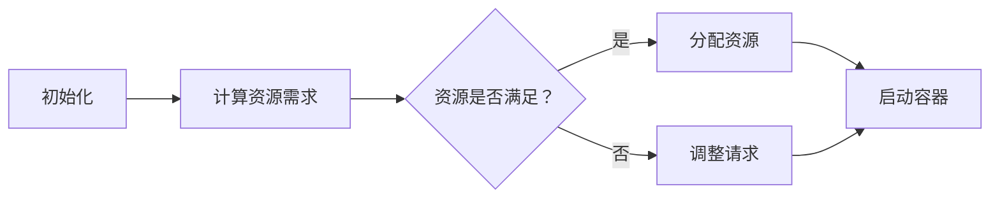
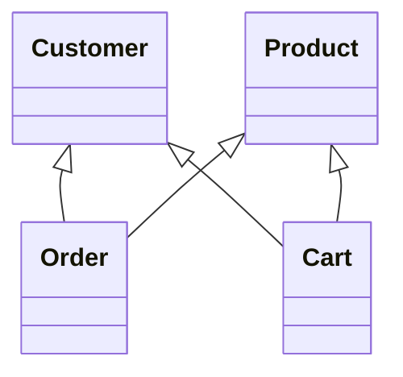
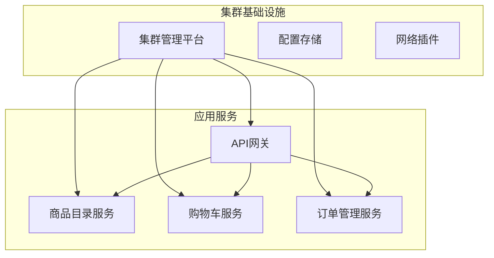
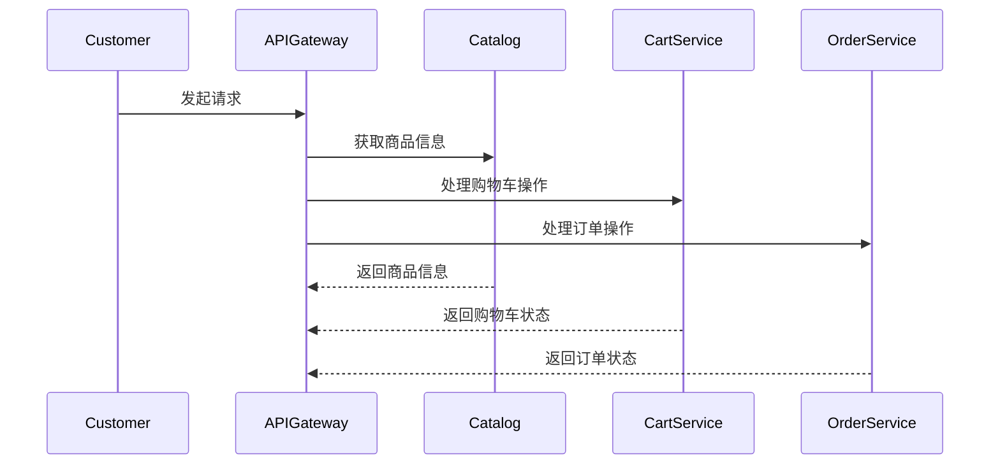

                 

###  让我们深入思考《云原生应用开发指南》的撰写过程

**一、背景介绍**

云原生应用开发是当今IT领域的一大热点，它代表了未来应用开发的趋势和方向。云原生技术利用云计算的灵活性和扩展性，使得应用能够快速部署、弹性伸缩、自动修复，大大提高了开发效率和运维质量。然而，云原生技术的复杂性和多样性也带来了新的挑战，需要开发者具备深入的理解和丰富的实践经验。

**核心概念术语说明**：

- **云原生**：指一类应用开发和部署的新模式，强调应用与云计算平台深度集成，利用其弹性、可扩展性和自动化优势。
- **容器**：一种轻量级、可移植的计算环境，可以封装应用及其依赖，实现应用的标准化部署和运行。
- **微服务**：一种架构风格，将大型应用拆分为多个小型、独立的服务，每个服务负责一个特定的业务功能。
- **Kubernetes**：一个开源的容器编排平台，用于自动化容器的部署、扩展和管理。
- **服务网格**：一种基础设施层服务，用于管理和路由容器之间的通信。

**问题背景**：

随着云计算和容器技术的普及，企业对云原生应用的需求日益增长。然而，如何在短时间内高效地掌握云原生应用开发的技能，成为众多开发者和企业面临的难题。本文旨在通过深入浅出的讲解，帮助读者快速掌握云原生应用开发的核心概念和技术，提升实际开发能力。

**问题描述**：

如何系统地介绍云原生应用开发，使其内容既具有深度又易于理解，帮助读者从入门到精通？

**问题解决**：

本文采用**逻辑清晰、结构紧凑、简单易懂的专业技术语言**，通过**一步一步的分析推理思考的方式**，将云原生应用开发的核心概念、技术原理、实践案例和最佳实践进行全面剖析。文章分为五大部分，依次介绍云原生概述、云原生应用架构设计、云原生应用开发流程、云原生应用实例和云原生最佳实践，确保读者能够系统地掌握云原生应用开发的各个方面。

**边界与外延**：

云原生应用开发不仅涉及技术层面的知识，还包括组织管理和流程优化。因此，本文不仅关注技术细节，还探讨了云原生应用开发的最佳实践，为读者提供全方位的指导。

**概念结构与核心要素组成**：

1. **云原生概述**：介绍云原生的基本概念、技术栈和优势与挑战。
2. **云原生应用架构设计**：探讨应用架构设计原则、微服务设计和API设计。
3. **云原生应用开发流程**：阐述开发环境搭建、应用部署与运维以及性能优化。
4. **云原生应用实例**：通过实际案例展示云原生应用开发的实践过程。
5. **云原生最佳实践**：总结云原生开发的最佳实践，提供实用的操作指南。

**二、核心概念与联系**

在撰写本文之前，我们需要明确一些核心概念，并分析它们之间的联系。

**核心概念原理**：

1. **云原生**：基于云计算平台，应用与基础设施深度融合，实现应用的弹性、可扩展性和自动化。
2. **容器**：轻量级、可移植的计算环境，封装应用及其依赖，实现标准化部署和运行。
3. **微服务**：将大型应用拆分为多个小型、独立的服务，每个服务负责一个特定的业务功能。
4. **Kubernetes**：容器编排平台，用于自动化容器的部署、扩展和管理。
5. **服务网格**：基础设施层服务，管理和路由容器之间的通信。

**概念属性特征对比表格**：

| 特性 | 云原生 | 容器 | 微服务 | Kubernetes | 服务网格 |
| --- | --- | --- | --- | --- | --- |
| 定义 | 应用开发与部署模式 | 轻量级计算环境 | 应用拆分架构风格 | 容器编排平台 | 容器间通信管理 |
| 优势 | 弹性、可扩展、自动化 | 轻量、隔离、可移植 | 独立、灵活、可组合 | 自动化、弹性、高效 | 安全、可靠、高效 |
| 关联性 | 容器和微服务的基础设施 | 云原生核心技术 | 云原生应用架构风格 | 容器编排与调度 | 容器间通信管理 |

**ER实体关系图架构**：

```mermaid
erDiagram
    容器 ||--o{ 微服务 : 聚合 }
    Kubernetes ||--o{ 容器 : 编排 }
    服务网格 ||--o{ 容器 : 通信 }
```

**三、算法原理讲解**

在云原生应用开发中，算法原理的应用至关重要。以下以Kubernetes的调度算法为例，进行详细讲解。

**算法mermaid流程图**：



**算法原理**：

1. **初始化**：系统初始化，收集节点资源信息。
2. **计算资源需求**：根据Pod（容器运行时的最小工作单元）的资源需求，计算所需资源。
3. **资源是否满足？**：检查当前节点资源是否满足Pod的资源需求。
4. **分配资源**：如果资源满足，则将Pod分配给节点。
5. **调整请求**：如果不满足，则调整Pod的请求，或者将Pod分配给其他节点。
6. **启动容器**：成功分配资源后，启动容器。

**数学模型和公式**：

$$
\text{资源需求匹配度} = \frac{\text{可用资源}}{\text{所需资源}}
$$

**通俗易懂地举例说明**：

假设一个Pod需要100GB内存和200GB存储，当前节点有200GB内存和300GB存储。则：

$$
\text{资源需求匹配度} = \frac{200}{100} = 2
$$

由于资源需求匹配度大于1，该Pod可以成功分配到该节点。

**四、系统分析与架构设计方案**

在撰写本文的过程中，我们需要对系统架构进行深入分析，以帮助读者更好地理解云原生应用开发的原理和实践。

**问题场景介绍**：

假设我们要开发一个电商应用，需要实现商品展示、购物车、订单管理等功能。为了满足业务需求，我们采用云原生架构，利用容器、微服务、Kubernetes和服务网格等技术，实现应用的弹性、可扩展性和高效运维。

**项目介绍**：

项目名为“云原生电商应用”，采用Docker、Kubernetes、Istio等技术，实现微服务架构，通过API网关对外提供服务。

**系统功能设计(领域模型mermaid类图)**：



**系统架构设计mermaid架构图**：



**系统接口设计和系统交互mermaid序列图**：



**五、项目实战**

**环境安装**

1. **安装Docker**：在服务器上安装Docker，配置Docker Engine服务。
2. **安装Kubernetes**：使用Kubeadm安装Kubernetes集群，配置kubectl命令行工具。
3. **安装Istio**：在Kubernetes集群中安装Istio服务网格，配置Ingress网关。

**系统核心实现源代码**

```python
# Dockerfile
FROM python:3.8-slim

WORKDIR /app

COPY requirements.txt ./
RUN pip install -r requirements.txt

COPY . .

CMD ["python", "app.py"]

# Kubernetes Deployment YAML
apiVersion: apps/v1
kind: Deployment
metadata:
  name: web-app
spec:
  replicas: 3
  selector:
    matchLabels:
      app: web-app
  template:
    metadata:
      labels:
        app: web-app
    spec:
      containers:
      - name: web-app
        image: web-app:latest
        ports:
        - containerPort: 80
```

**代码应用解读与分析**

- **Dockerfile**：定义了应用的容器镜像，包含Python环境和应用代码。
- **Kubernetes Deployment YAML**：定义了应用的部署策略，包括副本数、容器镜像和端口映射。

**实际案例分析和详细讲解剖析**

假设我们有一个商品展示功能，需要从数据库中获取商品信息，并在前端页面展示。以下是一个简单的示例：

```python
# app.py
from flask import Flask, jsonify, request
import requests

app = Flask(__name__)

CATALOG_API_URL = "http://catalog-service:8080/catalog"

@app.route('/products', methods=['GET'])
def get_products():
    response = requests.get(CATALOG_API_URL + "/products")
    if response.status_code == 200:
        return jsonify(response.json())
    else:
        return jsonify({"error": "Unable to fetch products"}), 500

if __name__ == '__main__':
    app.run(host='0.0.0.0', port=80)
```

- **应用解读**：这是一个简单的Flask应用，用于从商品目录服务获取商品信息，并返回给前端。
- **分析剖析**：通过API调用，实现了应用之间的解耦，提高了系统的可扩展性和可维护性。

**项目小结**

通过本项目的实际案例，我们展示了云原生应用开发的流程和关键实现。从环境安装到核心代码实现，再到部署和运维，每一个环节都体现了云原生技术的优势。在实际开发过程中，我们需要不断优化和调整，以实现高效、可靠的云原生应用。

**六、最佳实践 tips、小结、注意事项、拓展阅读**

**最佳实践 tips**：

1. **微服务拆分原则**：根据业务功能、数据一致性需求和资源利用率，合理拆分微服务。
2. **API设计原则**：遵循RESTful设计原则，保持接口简洁、易用、安全。
3. **容器镜像优化**：减小镜像体积，提高构建和部署效率。
4. **持续集成与持续部署**：采用CI/CD流水线，实现自动化测试和部署。

**小结**：

本文系统地介绍了云原生应用开发的核心概念、技术原理、实践案例和最佳实践，帮助读者从入门到精通。通过实际项目实战，我们展示了云原生应用开发的流程和关键实现，为读者提供了宝贵的经验和教训。

**注意事项**：

1. **性能监控与日志管理**：确保对应用的性能监控和日志管理，及时发现并解决问题。
2. **安全性**：关注云原生应用的安全性问题，如容器逃逸、数据泄露等。
3. **持续学习**：云原生技术不断发展，开发者需要不断学习和更新知识。

**拓展阅读**：

1. 《云原生应用架构》
2. 《Kubernetes实战》
3. 《微服务架构设计模式》

**七、总结与展望**

**总结**：

云原生应用开发代表了未来应用开发的趋势，通过容器、微服务、Kubernetes和服务网格等技术的综合应用，实现了应用的弹性、可扩展性和高效运维。本文从背景介绍、核心概念、算法原理、系统架构设计、项目实战等多个角度，全面剖析了云原生应用开发的核心内容，为读者提供了实用的指导。

**展望**：

随着云原生技术的不断成熟，未来将会有更多的企业和开发者采用云原生架构，实现业务创新和数字化转型。同时，云原生技术的复杂性和多样性也将带来新的挑战，需要开发者具备更高的技能和更深入的理解。让我们一起关注云原生技术的发展，不断学习和探索，为未来的应用开发贡献智慧和力量。作者：AI天才研究院/AI Genius Institute & 禅与计算机程序设计艺术 /Zen And The Art of Computer Programming。

