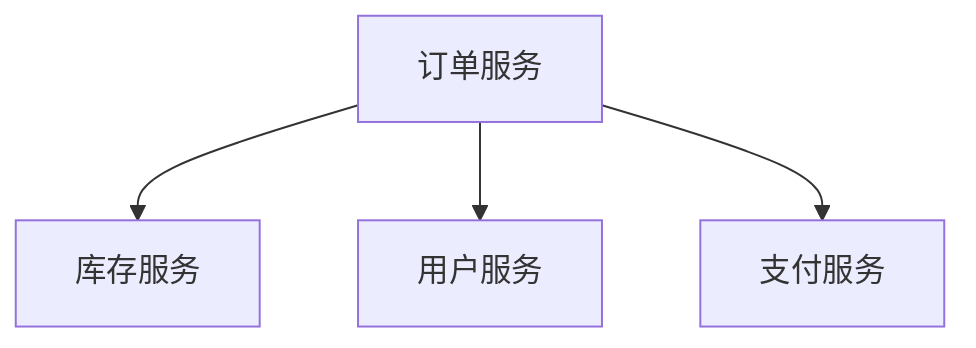
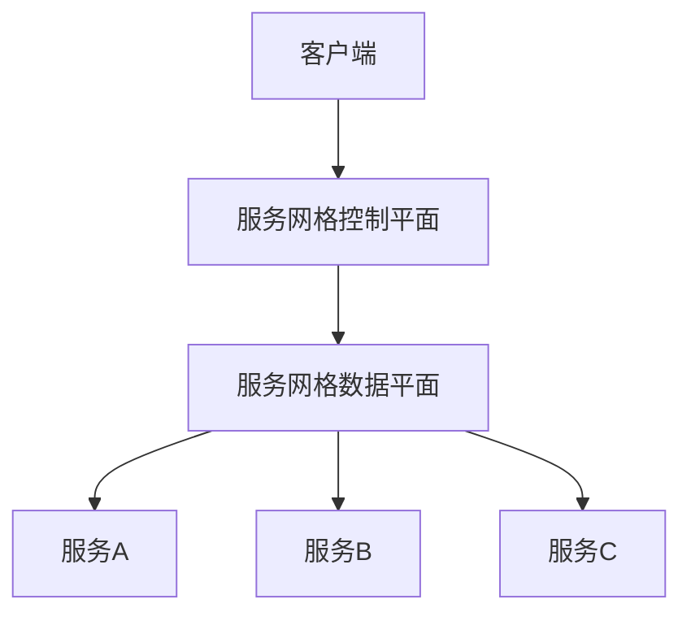
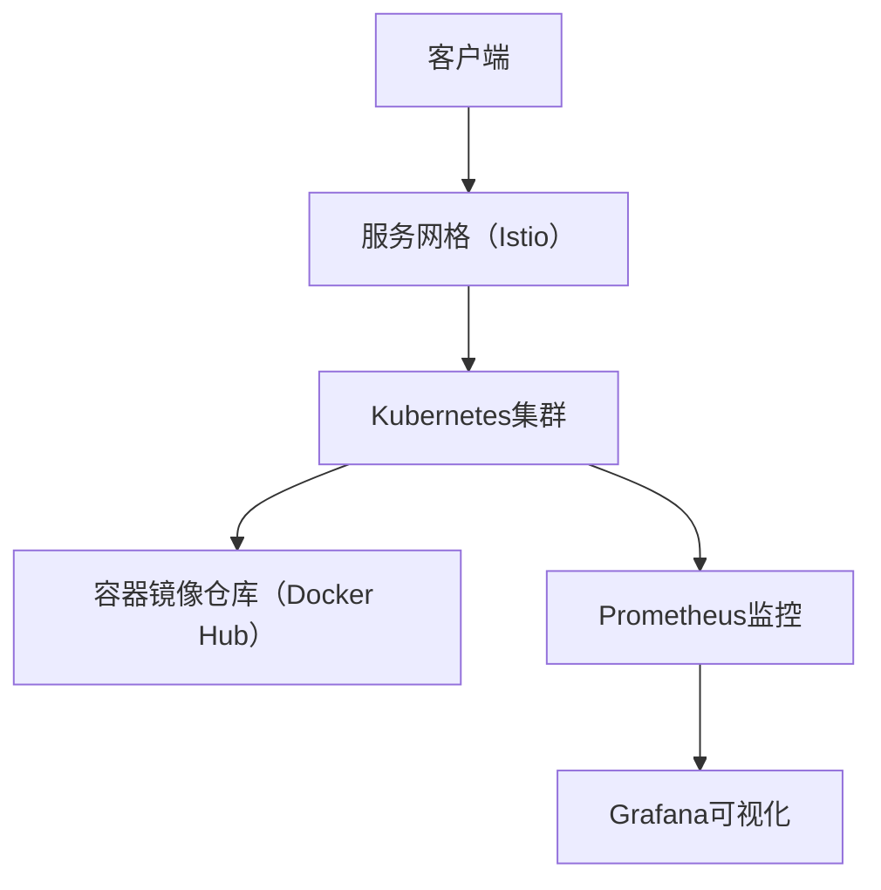
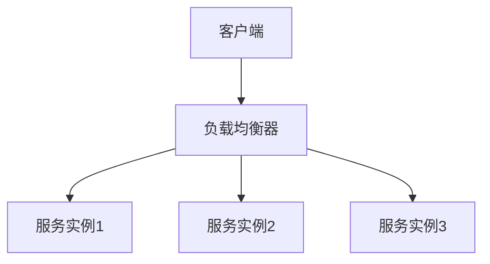

                 

### 1.3 云原生应用开发的优势

云原生应用开发作为云计算时代的进化产物，具有显著的优势，这些优势不仅推动了企业数字化转型，也为开发者带来了更多的便利。以下是云原生应用开发的几个关键优势：

**1. 高度可扩展性**

云原生应用通过微服务架构和容器化技术，实现了应用程序的横向扩展。这意味着当流量或负载增加时，可以通过简单地增加服务实例来应对，而无需改变应用程序的代码或结构。这种弹性扩展能力使得云原生应用在应对高并发场景时表现得尤为出色。

**2. 快速迭代与部署**

云原生应用采用了持续集成（CI）和持续部署（CD）的最佳实践。通过自动化工具，开发者可以快速将代码从开发环境集成到测试环境，再部署到生产环境。这不仅缩短了开发周期，还减少了人为错误的可能性，提高了交付质量。

**3. 高可用性和容错性**

容器化技术使得云原生应用可以在多个节点上运行，从而提高了系统的可用性和容错性。当某个节点出现故障时，其他节点可以自动接管任务，确保应用程序的持续运行。此外，服务网格技术如Istio等，提供了细粒度的服务监控和故障检测机制，进一步增强了系统的可靠性。

**4. 环境一致性**

容器化技术通过将应用程序及其依赖项打包在容器中，实现了环境一致性。这意味着无论应用程序在开发环境、测试环境还是生产环境，都能够保持一致的行为和性能。这种一致性减少了环境差异导致的问题，提高了开发和运维的效率。

**5. 开发者体验**

云原生应用开发带来了更好的开发者体验。通过微服务架构，开发者可以专注于独立服务的开发，而无需考虑整个应用程序的复杂性。此外，自动化工具和平台使得开发者能够更快地迭代和交付代码，提高了开发效率和创造力。

**6. 资源利用率**

云原生应用通过容器化技术实现了资源的最大利用。容器相对于传统虚拟机具有更轻量级，能够以更高效的方式运行在宿主机的操作系统上。这种高效性不仅降低了硬件成本，还减少了能源消耗，对环境保护也有积极作用。

**7. 易于迁移和部署**

云原生应用具有高度的可移植性，可以在不同的云平台和本地环境之间轻松迁移。这意味着企业可以灵活选择云服务提供商，同时降低了迁移成本和风险。此外，容器化的部署方式使得应用程序的部署过程更加简单和标准化。

综上所述，云原生应用开发通过引入一系列先进技术和最佳实践，为企业和开发者带来了诸多优势。随着云计算的深入发展，云原生应用将逐渐成为主流，引领企业数字化转型的浪潮。

----------------------------------------------------------------

在接下来的章节中，我们将深入探讨云原生应用开发的核心概念和原理，包括容器化、微服务架构、服务网格等，帮助读者全面理解云原生应用开发的精髓。敬请期待！

----------------------------------------------------------------

### 第2章: 云原生核心概念解析

#### 2.1 容器化技术

**核心概念：**

容器化是一种轻量级虚拟化技术，它通过隔离操作系统资源（如CPU、内存、网络和存储）来运行应用程序，从而实现环境一致性。容器与传统虚拟机的区别在于，容器不包含完整的操作系统，而是共享宿主机的操作系统内核，因此具有更高效的性能和更快的启动速度。

**原理与优势：**

容器化技术的原理是基于容器运行时（Container Runtime）和容器镜像（Container Image）。容器镜像包含了应用程序及其依赖项，可以通过Dockerfile等工具构建。容器运行时负责启动和管理容器，并提供运行容器所需的资源和环境。

容器化技术具有以下几个显著优势：

1. **环境一致性**：通过容器化，应用程序可以在任何支持容器运行时的地方运行，确保环境一致，减少了因环境差异导致的问题。
2. **高效性能**：容器不包含完整的操作系统，因此具有更轻量级，启动速度更快，资源利用更高效。
3. **快速部署**：容器化的部署过程简单且快速，通过容器镜像可以快速复制和部署应用程序。
4. **易于管理**：容器化技术使得应用程序的管理更加便捷，可以通过容器编排工具（如Kubernetes）进行自动化管理和调度。

**容器化流程：**

- **构建容器镜像**：通过Dockerfile等工具，将应用程序及其依赖项打包成容器镜像。
- **运行容器**：使用容器运行时启动容器，容器根据镜像中的配置运行应用程序。
- **容器编排**：通过容器编排工具（如Kubernetes），对容器进行自动化管理、调度和扩展。

**示例：**

以下是一个简单的Dockerfile示例，用于构建一个Web服务容器的镜像：

```Dockerfile
# 使用官方Python基础镜像
FROM python:3.9

# 设置工作目录
WORKDIR /app

# 复制应用程序代码
COPY . .

# 安装依赖项
RUN pip install -r requirements.txt

# 暴露Web服务端口
EXPOSE 80

# 运行应用程序
CMD ["python", "app.py"]
```

#### 2.2 微服务架构

**核心概念：**

微服务架构是一种设计原则，它将大型应用程序拆分为多个小型、独立的服务，每个服务负责一个特定的业务功能。这些服务通过轻量级通信协议（如HTTP/REST、gRPC等）进行交互，共同构成一个完整的系统。

**原理与优势：**

微服务架构的原理是将应用程序的功能分解为多个独立的微服务，每个微服务都是一个独立的进程，运行在自己的容器中。微服务之间通过定义良好的API进行通信，独立部署、测试和扩展。

微服务架构具有以下几个显著优势：

1. **高可用性**：微服务可以在不同的服务器上独立运行，当一个服务发生故障时，不会影响其他服务的正常运行。
2. **可扩展性**：通过独立扩展特定服务，可以实现更灵活的资源管理和负载均衡。
3. **易于维护**：每个微服务都可以独立开发、测试和部署，降低了系统的复杂性。
4. **技术多样性**：不同的微服务可以使用不同的编程语言和技术栈，提高了开发团队的灵活性。

**微服务设计原则：**

1. **单一职责**：每个微服务应该只负责一个明确的业务功能，避免服务过大导致的功能复杂化。
2. **自治性**：微服务应具备独立的数据库、日志、配置等，减少服务间的耦合。
3. **独立部署**：微服务应支持独立部署和升级，确保系统可以平滑迭代。
4. **API定义**：微服务通过API进行通信，确保接口定义清晰、稳定。

**示例：**

以下是一个简单的微服务架构设计图，展示了订单管理系统的微服务拆分：



在这个示例中，订单服务负责处理订单的创建、查询和取消；库存服务负责管理库存信息；用户服务负责用户信息的管理；支付服务负责处理支付相关的操作。

#### 2.3 服务网格

**核心概念：**

服务网格是一种基础设施层，它用于管理服务间的通信和流量。服务网格的主要目的是解耦服务间的网络通信，提供可靠、安全的通信机制，同时支持服务发现、负载均衡、断路器等高级功能。

**原理与优势：**

服务网格的原理是使用代理（Service Mesh Agent）来拦截和转发服务间通信流量。代理通常部署在服务所在的容器内，通过配置文件或API进行管理和控制。服务网格的主要组件包括控制平面和数据平面：

1. **控制平面（Control Plane）**：负责管理服务网格的配置、监控和策略。常见的控制平面组件包括Istio、Linkerd等。
2. **数据平面（Data Plane）**：负责处理服务间的流量转发和通信，通常由代理（Proxy）组成。数据平面不依赖于具体的网络协议和框架。

服务网格具有以下几个显著优势：

1. **服务解耦**：通过服务网格，服务间的通信被代理统一管理和控制，降低了服务间的耦合。
2. **流量控制**：服务网格提供了丰富的流量控制功能，如负载均衡、断路器、流量镜像等，提高了系统的可靠性。
3. **安全控制**：服务网格支持服务间的加密通信，并通过访问控制策略确保服务间的安全性。
4. **可观测性**：服务网格提供了细粒度的监控和日志功能，帮助开发者快速定位和解决问题。

**服务网格架构：**

以下是一个简单的服务网格架构设计图：



在这个示例中，客户端通过服务网格与多个服务进行通信。服务网格控制平面负责配置和管理服务网格的规则和策略，数据平面负责处理服务间的流量转发和通信。

#### 2.4 云原生技术栈

**核心概念：**

云原生技术栈是指用于构建和运行云原生应用的工具和技术集合。常见的云原生技术栈包括Kubernetes、Docker、Istio等。这些技术各自承担不同的职责，共同构建一个完整的云原生生态系统。

**原理与优势：**

云原生技术栈的原理是使用Kubernetes进行容器编排，Docker用于容器镜像管理，Istio等服务网格技术提供流量管理和安全控制。这些技术相互配合，实现了云原生应用的高效开发、部署和运维。

云原生技术栈具有以下几个显著优势：

1. **统一管理**：通过Kubernetes等容器编排工具，可以统一管理和调度多个容器化服务，提高了运维效率。
2. **资源优化**：容器化技术使得应用程序可以在更高效的资源利用下运行，降低了硬件成本和能源消耗。
3. **可扩展性**：云原生技术栈提供了强大的扩展能力，可以通过横向扩展和自动化调度来应对高并发场景。
4. **可靠性**：通过服务网格等技术，实现了服务间的可靠通信和流量控制，提高了系统的可靠性。

**技术栈组成：**

1. **Kubernetes**：用于容器编排和自动化管理容器化应用。
2. **Docker**：用于容器镜像构建和容器运行时管理。
3. **Istio**：用于服务网格和流量管理。
4. **Prometheus**：用于监控和告警。
5. **Grafana**：用于监控数据的可视化。
6. **Helm**：用于Kubernetes应用程序的打包和部署。

**示例：**

以下是一个简单的云原生技术栈架构设计图：



在这个示例中，客户端通过服务网格与Kubernetes集群中的多个服务进行通信。Kubernetes集群负责容器化服务的部署和管理，容器镜像仓库用于存储和管理容器镜像，Prometheus和Grafana用于监控和可视化服务运行状态。

通过深入理解云原生核心概念，我们可以更好地掌握云原生应用开发的精髓。在下一章中，我们将进一步详细讲解这些核心技术的原理和使用方法，帮助读者全面了解云原生技术栈。

----------------------------------------------------------------

#### 2.5 深入探讨云原生技术栈

**Kubernetes：**

**基本原理：**

Kubernetes是一个开源的容器编排平台，用于自动化容器化应用程序的部署、扩展和管理。Kubernetes通过控制平面（Master）和工作节点（Node）协同工作，实现了对容器化服务的自动化管理。

控制平面负责接收用户请求，创建和管理集群资源。工作节点负责运行容器化应用程序，并与控制平面进行通信。Kubernetes使用Pod作为最小的部署单元，一个Pod可以包含一个或多个容器，共同运行在同一个主机上。

**使用方法与配置示例：**

以下是一个简单的Kubernetes部署配置示例，用于部署一个Nginx服务：

```yaml
apiVersion: apps/v1
kind: Deployment
metadata:
  name: nginx-deployment
spec:
  replicas: 3
  selector:
    matchLabels:
      app: nginx
  template:
    metadata:
      labels:
        app: nginx
    spec:
      containers:
      - name: nginx
        image: nginx:latest
        ports:
        - containerPort: 80
```

在这个示例中，我们创建了一个名为`nginx-deployment`的Deployment对象，指定了副本数量为3，并使用了`nginx:latest`镜像。Kubernetes将自动创建和管理3个Nginx容器的Pod。

**Docker：**

**基本原理：**

Docker是一个开源的应用容器引擎，用于构建、运行和分发应用程序的容器。Docker通过Dockerfile定义镜像的构建过程，并通过Docker Compose管理多容器应用的编排。

**使用方法与配置示例：**

以下是一个简单的Dockerfile示例，用于构建一个简单的Web服务镜像：

```Dockerfile
# 使用官方Python基础镜像
FROM python:3.9

# 设置工作目录
WORKDIR /app

# 复制应用程序代码
COPY . .

# 安装依赖项
RUN pip install -r requirements.txt

# 暴露Web服务端口
EXPOSE 80

# 运行应用程序
CMD ["python", "app.py"]
```

在这个示例中，我们使用Python 3.9作为基础镜像，将应用程序代码复制到工作目录，并安装依赖项。最后，我们暴露了80端口并指定了启动命令。

**Istio：**

**基本原理：**

Istio是一个开源的服务网格平台，用于管理微服务之间的通信。Istio通过Sidecar代理拦截和转发服务间流量，并提供流量管理、监控、安全性等功能。

**使用方法与配置示例：**

以下是一个简单的Istio配置示例，用于配置一个简单的流量路由策略：

```yaml
apiVersion: networking.istio.io/v1alpha3
kind: VirtualService
metadata:
  name: my-service
spec:
  hosts:
  - "*"
  http:
  - match:
    - uri:
        prefix: /serviceA
    route:
    - destination:
        host: serviceA
        subset: v1
  - match:
    - uri:
        prefix: /serviceB
    route:
    - destination:
        host: serviceB
        subset: v1
```

在这个示例中，我们定义了一个名为`my-service`的VirtualService对象，配置了两个简单的流量路由规则。当请求的路径前缀为`/serviceA`时，流量将被路由到`serviceA`服务的`v1`版本；当请求的路径前缀为`/serviceB`时，流量将被路由到`serviceB`服务的`v1`版本。

通过以上对Kubernetes、Docker和Istio的详细讲解，我们可以更好地理解云原生技术栈的基本原理和使用方法。在下一章中，我们将探讨如何基于云原生技术栈设计应用架构，包括系统拆分、服务发现、负载均衡等。

----------------------------------------------------------------

### 第3章: 云原生应用架构设计

#### 3.1 应用系统拆分

**核心概念：**

应用系统拆分是将一个大型、复杂的应用程序拆分为多个小型、独立的子系统或服务的过程。通过拆分，每个服务可以独立开发、测试和部署，降低了系统的复杂性和耦合度，提高了开发效率和系统的可维护性。

**拆分原则：**

1. **单一职责原则**：每个服务应负责一个明确的业务功能，避免功能重叠和复杂度增加。
2. **自治性原则**：每个服务应具备独立的数据库、日志、配置等，降低服务间的依赖。
3. **独立性原则**：每个服务应支持独立部署和升级，确保系统可以平滑迭代。

**实践方法：**

1. **功能分析**：首先对应用程序的功能进行详细分析，确定各个功能模块及其职责。
2. **数据依赖分析**：分析各个模块之间的数据依赖关系，确保拆分后的服务可以独立运行。
3. **技术选型**：根据服务职责和数据依赖，选择合适的技术栈和架构模式。

**示例：**

以下是一个简单的电商应用系统拆分示例：

- **用户服务**：负责用户信息的注册、登录、认证等功能。
- **商品服务**：负责商品信息的展示、库存管理等功能。
- **订单服务**：负责订单的创建、查询、取消等功能。
- **支付服务**：负责处理支付相关的操作，如支付请求、支付结果通知等。

通过这种拆分方式，各个服务可以独立开发、测试和部署，提高了系统的可维护性和扩展性。

#### 3.2 服务发现

**核心概念：**

服务发现是一种机制，用于自动发现和定位服务实例，使得客户端能够透明地访问服务。在云原生环境中，服务发现是微服务架构的重要组成部分，有助于实现服务的动态注册和发现。

**原理与优势：**

服务发现的原理是通过服务注册中心（Service Registry）和服务发现代理（Service Discovery Agent）协同工作。服务实例在启动时，向服务注册中心注册自己的信息，包括服务名称、地址、端口等。客户端通过服务发现代理从服务注册中心获取服务实例的信息，并根据这些信息访问服务。

服务发现具有以下几个显著优势：

1. **动态伸缩**：当服务实例的数量发生变化时，服务发现可以自动更新客户端的访问地址，确保客户端始终访问到可用的服务实例。
2. **负载均衡**：服务发现可以与负载均衡器集成，根据服务实例的负载情况动态分配客户端请求，提高系统的性能和可用性。
3. **简化部署**：通过服务发现，客户端无需关心服务实例的具体地址，简化了部署和运维过程。

**服务发现机制：**

1. **服务注册**：服务实例启动时，向服务注册中心注册自己的信息。
2. **服务发现**：客户端通过服务发现代理从服务注册中心获取服务实例的信息。
3. **服务更新**：服务实例发生变更时，通知服务注册中心更新服务信息。

**示例：**

以下是一个简单的服务发现机制示例：

- **服务注册中心**：如Consul、Eureka等。
- **服务实例**：如用户服务、商品服务、订单服务等。
- **服务发现代理**：如Kubernetes的Service、Istio的Envoy等。

#### 3.3 负载均衡

**核心概念：**

负载均衡是一种分布式系统架构，用于将客户端请求分配到多个服务实例上，以实现流量的均衡处理。负载均衡可以提高系统的性能和可用性，避免单点瓶颈。

**原理与优势：**

负载均衡的原理是通过负载均衡器（Load Balancer）将客户端请求随机或根据特定策略分配到多个服务实例上。负载均衡器可以是硬件设备，也可以是软件实现，如Nginx、HAProxy等。

负载均衡具有以下几个显著优势：

1. **性能优化**：通过将请求分散到多个服务实例上，避免单点瓶颈，提高系统的响应速度和处理能力。
2. **高可用性**：当某个服务实例出现故障时，负载均衡器可以自动将其剔除，并将流量分配到健康的服务实例上，确保系统的可用性。
3. **弹性伸缩**：负载均衡器可以根据实际流量动态调整服务实例的数量，实现系统的弹性伸缩。

**负载均衡策略：**

1. **轮询（Round Robin）**：将请求按顺序分配到每个服务实例。
2. **最少连接（Least Connections）**：将请求分配到连接数最少的服务实例。
3. **源地址哈希（Source IP Hash）**：根据客户端的IP地址进行哈希分配。

**示例：**

以下是一个简单的负载均衡架构设计图：



在这个示例中，客户端的请求通过负载均衡器分配到多个服务实例，负载均衡器根据设定的策略（如轮询）决定将请求路由到哪个服务实例。

通过上述对应用系统拆分、服务发现和负载均衡的详细讲解，我们可以更好地理解云原生应用架构设计的关键要素。在下一章中，我们将通过一个实际案例展示如何基于云原生技术栈设计和部署一个云原生应用。

----------------------------------------------------------------

### 第4章: 云原生应用实战

#### 4.1 环境搭建与准备

在进行云原生应用开发之前，我们需要搭建一个适合进行开发和测试的环境。以下是搭建云原生应用环境的基本步骤：

**1. 安装Docker**

Docker是一个开源的应用容器引擎，用于构建和运行应用程序的容器。我们首先需要在开发机器上安装Docker。

在Windows或macOS上，可以通过Docker Desktop安装Docker。在Linux上，可以通过以下命令安装Docker：

```bash
sudo apt-get update
sudo apt-get install docker.io
```

安装完成后，确保Docker服务正在运行：

```bash
sudo systemctl start docker
sudo systemctl enable docker
```

**2. 安装Kubernetes**

Kubernetes是一个开源的容器编排平台，用于管理和自动化容器化应用程序。我们可以使用Minikube在本地环境中快速启动一个单节点Kubernetes集群。

首先，安装Minikube：

```bash
curl -LO https://storage.googleapis.com/minikube/releases/latest/minikube-latest-x86_64.dmg
sudo hdiutil mount minikube-latest-x86_64.dmg
sudo cp -R /Volumes/minikube/Minikube.app /usr/local/bin/
sudo hdiutil unmount /Volumes/minikube
```

安装完成后，启动Minikube集群：

```bash
minikube start
```

确认Minikube集群状态：

```bash
minikube status
```

**3. 安装Kubernetes工具**

为了方便管理和监控Kubernetes集群，我们可以安装一些常用的Kubernetes命令行工具，如kubectl和helm。

安装kubectl：

```bash
curl -LO "https://dl.k8s.io/release/$(curl -L -s https://dl.k8s.io/release/stable.txt)/bin/darwin/amd64/kubectl"
chmod +x kubectl
sudo mv kubectl /usr/local/bin/
```

安装helm：

```bash
curl -fsSL -o get_helm.sh https://raw.githubusercontent.com/helm/helm/main/scripts/get-helm-3
chmod 700 get_helm.sh
./get_helm.sh
```

安装完成后，验证kubectl和helm是否安装成功：

```bash
kubectl version --client
helm version
```

**4. 创建命名空间**

在Kubernetes中，命名空间（Namespace）用于隔离不同的应用程序或项目。我们可以创建一个命名空间用于我们的云原生应用。

创建命名空间：

```bash
kubectl create namespace cloud-native-app
```

确认命名空间创建成功：

```bash
kubectl get namespaces
```

**5. 配置Kubernetes集群访问**

为了方便在本地机器上操作Kubernetes集群，我们可以配置Kubectl的kubeconfig文件。

导出Minikube的kubeconfig文件：

```bash
minikube -p minikube config view --minikube-profile default > kubeconfig
```

将kubeconfig文件添加到Kubectl配置中：

```bash
kubectl config set-context minikube --cluster=minikube --namespace=cloud-native-app --use-context=minikube
kubectl config use-context minikube
```

确认Kubectl配置：

```bash
kubectl config current-context
kubectl get namespaces
```

通过以上步骤，我们成功搭建了一个适合进行云原生应用开发的环境。接下来，我们将展示如何使用云原生技术栈进行服务开发、集成和部署。

#### 4.2 服务开发与集成

**1. 用户服务开发**

用户服务是云原生应用的核心组件之一，负责处理用户注册、登录、认证等功能。我们可以使用Spring Boot框架进行用户服务的开发。

首先，创建一个Spring Boot项目，添加必要的依赖项，如Spring Web、Spring Security等。

```xml
<dependencies>
    <dependency>
        <groupId>org.springframework.boot</groupId>
        <artifactId>spring-boot-starter-web</artifactId>
    </dependency>
    <dependency>
        <groupId>org.springframework.boot</groupId>
        <artifactId>spring-boot-starter-security</artifactId>
    </dependency>
    <dependency>
        <groupId>com.fasterxml.jackson.module</groupId>
        <artifactId>jackson-module-kotlin</artifactId>
        <version>${jackson.version}</version>
    </dependency>
</dependencies>
```

接着，编写用户注册和登录接口，实现用户认证功能。

```kotlin
@RestController
@RequestMapping("/users")
class UserController {

    @Autowired
    private val userRepository: UserRepository

    @PostMapping("/register")
    fun register(@RequestBody user: User): ResponseEntity<User> {
        // 实现用户注册逻辑
    }

    @PostMapping("/login")
    fun login(@RequestBody loginRequest: LoginRequest): ResponseEntity<String> {
        // 实现用户登录逻辑，返回JWT令牌
    }
}
```

**2. 商品服务开发**

商品服务负责管理商品信息，包括商品的展示、库存管理等功能。同样，我们可以使用Spring Boot框架进行商品服务的开发。

添加必要的依赖项，如Spring Web、Spring Data JPA等。

```xml
<dependencies>
    <dependency>
        <groupId>org.springframework.boot</groupId>
        <artifactId>spring-boot-starter-web</artifactId>
    </dependency>
    <dependency>
        <groupId>org.springframework.boot</groupId>
        <artifactId>spring-boot-starter-data-jpa</artifactId>
    </dependency>
</dependencies>
```

接着，编写商品信息的增删改查接口。

```kotlin
@RestController
@RequestMapping("/products")
class ProductController {

    @Autowired
    private val productRepository: ProductRepository

    @GetMapping
    fun listProducts(): List<Product> {
        // 查询所有商品信息
    }

    @PostMapping
    fun createProduct(@RequestBody product: Product): Product {
        // 创建商品信息
    }

    @PutMapping("/{id}")
    fun updateProduct(@PathVariable id: Long, @RequestBody product: Product): Product {
        // 更新商品信息
    }

    @DeleteMapping("/{id}")
    fun deleteProduct(@PathVariable id: Long): ResponseEntity<Void> {
        // 删除商品信息
    }
}
```

**3. 集成服务**

在完成用户服务和商品服务的开发后，我们需要将它们集成到云原生应用中。首先，我们将两个服务打包成Docker镜像，并上传到镜像仓库。

```bash
docker build -t user-service:1.0 . -f Dockerfile
docker build -t product-service:1.0 . -f Dockerfile
docker push user-service:1.0
docker push product-service:1.0
```

接着，我们编写Kubernetes部署配置文件，将服务部署到Kubernetes集群中。

用户服务部署配置示例：

```yaml
apiVersion: apps/v1
kind: Deployment
metadata:
  name: user-service
spec:
  replicas: 3
  selector:
    matchLabels:
      app: user-service
  template:
    metadata:
      labels:
        app: user-service
    spec:
      containers:
      - name: user-service
        image: user-service:1.0
        ports:
        - containerPort: 8080
```

商品服务部署配置示例：

```yaml
apiVersion: apps/v1
kind: Deployment
metadata:
  name: product-service
spec:
  replicas: 3
  selector:
    matchLabels:
      app: product-service
  template:
    metadata:
      labels:
        app: product-service
    spec:
      containers:
      - name: product-service
        image: product-service:1.0
        ports:
        - containerPort: 8080
```

最后，我们使用Helm将服务打包为 Helm chart，并部署到Kubernetes集群中。

Helm chart示例：

```yaml
apiVersion: helm.sh/helm/v3
chart: user-service
metadata:
  name: user-service
  version: 0.1.0
  description: User Service
dependencies:
- name: product-service
  chart: product-service
  version: 0.1.0
spec:
  replicas: 3
  template:
    deployment:
      spec:
        containers:
        - name: user-service
          image: user-service:1.0
          ports:
          - containerPort: 8080
      selector:
        matchLabels:
          app: user-service
```

通过以上步骤，我们成功完成了用户服务和商品服务的开发、集成和部署。接下来，我们将展示如何部署应用并进行监控。

#### 4.3 应用部署与监控

**1. 部署应用**

在完成服务开发与集成后，我们可以使用Kubernetes和Helm将云原生应用部署到Kubernetes集群中。

首先，我们将Helm chart上传到Kubernetes集群的Helm仓库。

```bash
helm repo add cloud-native-app https://cloud-native-app.github.io/charts
helm repo update
```

接着，我们使用Helm部署应用。

```bash
helm install user-service user-service
helm install product-service product-service
```

部署完成后，使用kubectl检查应用的状态。

```bash
kubectl get pods
kubectl get services
```

**2. 监控应用**

为了监控云原生应用的运行状态，我们可以使用Prometheus和Grafana进行监控数据的采集、存储和可视化。

首先，安装Prometheus监控组件。

```bash
kubectl apply -f prometheus.yaml
```

Prometheus.yaml示例：

```yaml
apiVersion: v1
kind: ServiceAccount
metadata:
  name: prometheus
---
apiVersion: rbac.authorization.k8s.io/v1
kind: Role
metadata:
  name: prometheus
rules:
- apiGroups: [""]
  resources: ["nodes", "pods"]
  verbs: ["get", "list", "watch"]
---
apiVersion: rbac.authorization.k8s.io/v1
kind: RoleBinding
metadata:
  name: prometheus
rules:
- apiGroups: [""]
  resources: ["nodes", "pods"]
  verbs: ["get", "list", "watch"]
subject:
- kind: ServiceAccount
  name: prometheus
---
apiVersion: apps/v1
kind: Deployment
metadata:
  name: prometheus
spec:
  replicas: 1
  selector:
    matchLabels:
      app: prometheus
  template:
    metadata:
      labels:
        app: prometheus
    spec:
      serviceAccountName: prometheus
      containers:
      - name: prometheus
        image: prom/prometheus:latest
        ports:
        - containerPort: 9090
        volumeMounts:
        - name: prometheus-config
          mountPath: /etc/prometheus
      volumes:
      - name: prometheus-config
        configMap:
          name: prometheus-config
```

接着，安装Grafana监控仪表板。

```bash
kubectl apply -f grafana.yaml
```

Grafana.yaml示例：

```yaml
apiVersion: v1
kind: ServiceAccount
metadata:
  name: grafana
---
apiVersion: rbac.authorization.k8s.io/v1
kind: Role
metadata:
  name: grafana
rules:
- apiGroups: [""]
  resources: ["pods"]
  verbs: ["get", "list", "watch"]
---
apiVersion: rbac.authorization.k8s.io/v1
kind: RoleBinding
metadata:
  name: grafana
rules:
- apiGroups: [""]
  resources: ["pods"]
  verbs: ["get", "list", "watch"]
subject:
- kind: ServiceAccount
  name: grafana
---
apiVersion: apps/v1
kind: Deployment
metadata:
  name: grafana
spec:
  replicas: 1
  selector:
    matchLabels:
      app: grafana
  template:
    metadata:
      labels:
        app: grafana
    spec:
      serviceAccountName: grafana
      containers:
      - name: grafana
        image: grafana/grafana:latest
        ports:
        - containerPort: 3000
        volumeMounts:
        - name: grafana-config
          mountPath: /etc/grafana
      volumes:
      - name: grafana-config
        configMap:
          name: grafana-config
```

安装完成后，访问Grafana仪表板（http://localhost:3000），并创建一个数据源，选择Prometheus作为数据源。

**3. 创建监控仪表板**

在Grafana中，我们可以创建一个监控仪表板，用于展示云原生应用的运行状态。以下是一个简单的监控仪表板示例：

- **Pod状态**：展示Kubernetes集群中所有Pod的状态。
- **CPU使用率**：展示Pod的CPU使用率。
- **内存使用率**：展示Pod的内存使用率。
- **网络流量**：展示Pod的网络流量。

**监控仪表板配置：**

1. **添加数据源**：选择Prometheus作为数据源。
2. **添加面板**：创建各种类型的面板，如折线图、条形图、仪表盘等。
3. **配置面板**：为每个面板设置查询和展示方式，如时间范围、指标等。

通过以上步骤，我们成功部署并监控了云原生应用。接下来，我们将讨论云原生应用的最佳实践与优化。

#### 4.4 最佳实践与优化

**1. 性能优化**

**缓存策略**：在云原生应用中，我们可以使用缓存技术（如Redis、Memcached）来减少数据库的访问频率，提高系统的响应速度。

**数据库优化**：针对不同的数据库（如MySQL、MongoDB、PostgreSQL），可以采用相应的优化策略，如索引优化、查询优化、分库分表等。

**异步处理**：对于一些耗时较长的操作，如消息处理、文件上传等，可以采用异步处理技术（如消息队列、异步任务调度）来减少系统的响应时间。

**2. 安全性加固**

**访问控制**：通过OAuth2、JWT等身份认证和访问控制技术，确保只有授权用户可以访问系统资源。

**网络隔离**：在Kubernetes中，通过命名空间（Namespace）和NetworkPolicy等策略实现网络隔离，防止服务间的恶意访问。

**数据加密**：对于敏感数据（如用户密码、信用卡信息等），采用加密技术（如AES、RSA）进行加密存储和传输。

**3. 常见问题解决方案**

**服务挂载问题**：在Kubernetes中，服务无法访问其他命名空间下的服务，可以通过命名空间（Namespace）的设置和NetworkPolicy策略进行配置。

**容器启动失败**：检查Docker镜像是否正确，容器配置是否正确，网络设置是否正常。

**服务发现问题**：确保服务注册中心和发现代理配置正确，服务实例注册和发现机制正常。

**4. 优化技巧**

**水平扩展**：通过增加容器副本数量实现负载均衡和水平扩展，提高系统的并发处理能力。

**垂直扩展**：通过增加服务器硬件资源（如CPU、内存）实现垂直扩展，提高单个容器的处理能力。

**自动化部署**：使用CI/CD工具（如Jenkins、GitLab CI/CD）实现自动化部署，加快开发迭代速度。

**监控告警**：通过Prometheus、Grafana等监控工具实时监控系统的运行状态，及时发现问题并告警。

通过以上最佳实践与优化技巧，我们可以更好地构建、部署和运维云原生应用，提高系统的性能、安全性和可靠性。

#### 4.5 项目小结

在本章中，我们通过一个实际案例展示了云原生应用的完整开发、部署和监控流程。从环境搭建、服务开发、集成部署，到监控优化，我们详细介绍了云原生应用开发的各个环节。

通过本章的学习，读者可以：

1. **理解云原生应用的概念和优势**：掌握云原生应用的核心概念和原理，了解其相较于传统应用的显著优势。
2. **掌握云原生技术栈**：熟悉Kubernetes、Docker、Istio等云原生技术栈的使用方法，能够基于这些技术构建和部署云原生应用。
3. **进行应用架构设计**：学会如何进行应用系统拆分、服务发现和负载均衡，掌握云原生应用架构设计的关键要素。
4. **实战云原生应用**：通过实际案例，了解云原生应用的开发、部署和监控过程，掌握云原生应用的最佳实践与优化技巧。

云原生应用开发是一个不断演进的过程，随着技术的不断进步和应用场景的扩大，云原生应用将成为企业数字化转型的关键驱动力。希望读者能够通过本章的学习，掌握云原生应用开发的精髓，为企业带来更多的价值。

----------------------------------------------------------------

### 第5章: 云原生应用最佳实践与优化

#### 5.1 性能优化

云原生应用在性能优化方面有许多实践和方法，可以帮助提高系统的响应速度和并发处理能力。

**1. 缓存策略**

缓存是提高系统性能的有效手段之一。通过缓存，可以减少对后端数据库的访问频率，从而降低系统的响应时间。常用的缓存技术包括Redis、Memcached等。

**配置示例**：

```yaml
apiVersion: v1
kind: Deployment
metadata:
  name: redis
spec:
  replicas: 1
  selector:
    matchLabels:
      app: redis
  template:
    metadata:
      labels:
        app: redis
    spec:
      containers:
      - name: redis
        image: redis:latest
        ports:
        - containerPort: 6379
```

**2. 数据库优化**

数据库优化是提高系统性能的关键环节。对于不同的数据库（如MySQL、MongoDB、PostgreSQL），可以采用相应的优化策略，如索引优化、查询优化、分库分表等。

**索引优化**：

```sql
CREATE INDEX index_name ON table_name (column1, column2);
```

**查询优化**：

```sql
SELECT column1, column2 FROM table_name WHERE column1 = 'value' AND column2 = 'value';
```

**3. 异步处理**

对于一些耗时较长的操作，如消息处理、文件上传等，可以采用异步处理技术（如消息队列、异步任务调度）来减少系统的响应时间。

**配置示例**：

```yaml
apiVersion: v1
kind: Deployment
metadata:
  name: rabbitmq
spec:
  replicas: 1
  selector:
    matchLabels:
      app: rabbitmq
  template:
    metadata:
      labels:
        app: rabbitmq
    spec:
      containers:
      - name: rabbitmq
        image: rabbitmq:latest
        ports:
        - containerPort: 5672
        - containerPort: 15672
```

#### 5.2 安全性加固

云原生应用的安全性是确保系统可靠运行的关键。以下是一些安全性加固的最佳实践：

**1. 访问控制**

使用OAuth2、JWT等身份认证和访问控制技术，确保只有授权用户可以访问系统资源。

**配置示例**：

```yaml
apiVersion: v1
kind: Deployment
metadata:
  name: user-service
spec:
  replicas: 3
  selector:
    matchLabels:
      app: user-service
  template:
    metadata:
      labels:
        app: user-service
    spec:
      containers:
      - name: user-service
        image: user-service:1.0
        ports:
        - containerPort: 8080
        env:
        - name: spring-security-oauth2-client-id
          value: my-client-id
        - name: spring-security-oauth2-client-secret
          value: my-client-secret
```

**2. 网络隔离**

在Kubernetes中，通过命名空间（Namespace）和NetworkPolicy等策略实现网络隔离，防止服务间的恶意访问。

**配置示例**：

```yaml
apiVersion: networking.k8s.io/v1
kind: NetworkPolicy
metadata:
  name: user-service-policy
spec:
  podSelector:
    matchLabels:
      app: user-service
  policyTypes:
  - Ingress
  ingress:
  - from:
    - podSelector:
        matchLabels:
          app: product-service
```

**3. 数据加密**

对于敏感数据（如用户密码、信用卡信息等），采用加密技术（如AES、RSA）进行加密存储和传输。

**配置示例**：

```yaml
apiVersion: v1
kind: Deployment
metadata:
  name: encryption-service
spec:
  replicas: 1
  selector:
    matchLabels:
      app: encryption-service
  template:
    metadata:
      labels:
        app: encryption-service
    spec:
      containers:
      - name: encryption-service
        image: encryption-service:1.0
        env:
        - name: encryption-key
          valueFrom:
            secretKeyRef:
              name: encryption-key-secret
              key: key
```

#### 5.3 常见问题解决方案

在云原生应用开发过程中，可能会遇到各种问题。以下是一些常见问题的解决方案：

**1. 服务挂载问题**

在Kubernetes中，服务默认只能访问同一命名空间内的服务。如果需要访问其他命名空间的服务，可以通过以下方式配置：

```yaml
apiVersion: v1
kind: Service
metadata:
  name: external-service
spec:
  type: ExternalName
  externalName: other-namespace.service-name
```

**2. 容器启动失败**

容器启动失败可能由于多种原因导致。常见原因包括：

- Docker镜像未正确下载或损坏。
- 容器配置错误，如环境变量、配置文件等。
- 网络设置不正确。

解决方法：

- 确保Docker镜像已正确下载，可以使用`docker pull`命令下载。
- 检查容器配置文件，确保环境变量、配置文件等设置正确。
- 检查网络设置，确保容器可以正常访问外部网络。

**3. 服务发现问题**

服务发现问题通常由于服务注册中心和发现代理配置不正确导致。解决方法：

- 确保服务注册中心和发现代理已正确启动和运行。
- 检查服务注册中心的配置，确保服务实例正确注册。
- 检查服务发现代理的配置，确保可以正确获取服务实例信息。

#### 5.4 优化技巧

**1. 水平扩展**

通过增加容器副本数量实现负载均衡和水平扩展，提高系统的并发处理能力。

**配置示例**：

```yaml
apiVersion: apps/v1
kind: Deployment
metadata:
  name: user-service
spec:
  replicas: 5
  selector:
    matchLabels:
      app: user-service
  template:
    metadata:
      labels:
        app: user-service
    spec:
      containers:
      - name: user-service
        image: user-service:1.0
        ports:
        - containerPort: 8080
```

**2. 垂直扩展**

通过增加服务器硬件资源（如CPU、内存）实现垂直扩展，提高单个容器的处理能力。

**配置示例**：

```yaml
apiVersion: v1
kind: Deployment
metadata:
  name: user-service
spec:
  replicas: 1
  selector:
    matchLabels:
      app: user-service
  template:
    metadata:
      labels:
        app: user-service
    spec:
      containers:
      - name: user-service
        image: user-service:1.0
        ports:
        - containerPort: 8080
        resources:
          limits:
            cpu: "2"
            memory: "2Gi"
          requests:
            cpu: "1"
            memory: "1Gi"
```

**3. 自动化部署**

使用CI/CD工具（如Jenkins、GitLab CI/CD）实现自动化部署，加快开发迭代速度。

**配置示例**：

```yaml
# Jenkinsfile
pipeline {
    agent any
    stages {
        stage('Build') {
            steps {
                sh 'mvn clean package'
            }
        }
        stage('Deploy') {
            steps {
                sh 'kubectl apply -f deployment.yaml'
            }
        }
    }
}
```

通过以上最佳实践与优化技巧，我们可以更好地构建、部署和运维云原生应用，提高系统的性能、安全性和可靠性。

#### 5.5 小结

在本章中，我们介绍了云原生应用开发的最佳实践与优化技巧，包括性能优化、安全性加固和常见问题解决方案。通过这些实践和技巧，我们可以更好地构建、部署和运维云原生应用，提高系统的性能、安全性和可靠性。

云原生应用开发是一个不断演进的过程，随着技术的不断进步和应用场景的扩大，云原生应用将成为企业数字化转型的关键驱动力。希望读者能够通过本章的学习，掌握云原生应用开发的精髓，为企业带来更多的价值。

----------------------------------------------------------------

### 第6章: 云原生应用开发的未来展望

随着云计算技术的不断发展和成熟，云原生应用开发已经成为企业数字化转型的重要推动力。在这一章中，我们将探讨云原生应用开发的未来发展趋势，分析技术发展的趋势、应用场景的扩展，以及面临的挑战和机遇。

#### 6.1 技术发展趋势

**1. 容器化与微服务架构的深度融合**

容器化技术是云原生应用开发的核心，而微服务架构则是云原生应用设计的核心模式。未来，容器化与微服务架构将更加紧密结合，容器技术将提供更高效、更灵活的微服务运行环境。例如，Kubernetes等容器编排工具将更加成熟和智能化，支持更复杂的微服务管理需求。

**2. 服务网格技术的发展**

服务网格作为云原生应用的通信基础设施，未来将得到更加广泛的应用。服务网格技术将提供更丰富的流量管理、安全控制和监控功能，帮助企业构建更加可靠和安全的云原生应用。例如，Istio等服务网格工具将进一步完善，支持更复杂的网络拓扑和服务交互。

**3. 云原生安全技术的成熟**

随着云原生应用的普及，安全将成为关键考量因素。未来，云原生安全技术将得到更加成熟的发展，包括基于容器和微服务架构的访问控制、加密通信、安全审计等。企业将更加重视云原生安全，采用更加严格的安全策略和措施。

**4. 云原生人工智能应用的兴起**

人工智能技术与云原生应用的结合将带来新的应用场景和商业价值。未来，我们将看到越来越多的云原生应用集成人工智能模型，实现智能化、自动化和高效化的数据处理和分析。例如，基于容器和微服务架构的机器学习平台将提供更加灵活和高效的AI解决方案。

#### 6.2 应用场景的扩展

**1. 金融行业的云原生应用**

金融行业对稳定性和安全性有极高的要求，但随着云计算和云原生技术的发展，越来越多的金融机构开始采用云原生技术。未来，金融行业的云原生应用将涵盖交易系统、风险管理、客户服务等多个方面，提供更加高效、安全和可扩展的服务。

**2. 制造业的数字化与智能化**

制造业正面临数字化转型和智能化升级的挑战，云原生技术将发挥关键作用。通过容器化、微服务架构和服务网格等技术，制造业可以实现生产过程的数字化、智能化和自动化，提高生产效率和产品质量。例如，智能工厂、工业互联网平台等将成为云原生应用的重要场景。

**3. 媒体与娱乐行业的创新**

媒体与娱乐行业对创新和技术变革的接受度较高，云原生技术将带来更多创新应用。例如，实时流媒体服务、虚拟现实（VR）、增强现实（AR）等应用将依赖于云原生技术，提供更加丰富和互动的用户体验。

**4. 医疗健康领域的云原生应用**

医疗健康领域的数据密集型和实时性需求较高，云原生技术将提供更加高效、可靠的解决方案。例如，电子病历系统、医疗影像分析、远程医疗等应用将基于云原生架构，实现医疗资源的优化配置和医疗服务的升级。

#### 6.3 挑战与机遇

**1. 挑战**

**安全性**：随着云原生应用的普及，安全性问题变得越来越重要。如何确保容器、微服务和服务网格的安全性，防止数据泄露和恶意攻击，是云原生应用面临的重大挑战。

**复杂性**：云原生应用涉及多种技术和工具，其部署、管理和运维过程相对复杂。企业需要具备一定的技术能力和经验，才能有效应对云原生应用的复杂性。

**迁移与集成**：对于传统企业来说，如何将现有的应用程序和基础设施迁移到云原生架构，以及如何与现有的系统集成，是一个重大挑战。

**2. 机遇**

**技术创新**：云原生技术为开发者提供了更多的创新机会，可以更灵活地构建和部署应用，实现快速迭代和交付。

**业务模式变革**：云原生技术可以帮助企业实现业务的快速创新和模式变革，提高市场竞争力。

**成本优化**：通过容器化、自动化和弹性伸缩等技术，云原生应用可以实现资源的优化利用，降低运维成本。

**市场机会**：随着云原生技术的普及，相关的服务、工具和解决方案市场将不断扩大，为企业带来更多的市场机会。

总之，云原生应用开发在未来将继续快速发展，成为企业数字化转型和智能化升级的重要推动力。企业应积极拥抱云原生技术，抓住技术创新和市场机遇，应对挑战，实现业务的持续发展。

----------------------------------------------------------------

### 第7章: 总结与展望

#### 7.1 内容总结

本书《云原生应用开发：拥抱云计算的新范式》系统地介绍了云原生应用开发的相关概念、技术栈、架构设计、实战案例和最佳实践。以下是本书的主要内容总结：

1. **背景与核心概念**：详细介绍了云计算的发展历程、云原生概念的定义及其优势。
2. **核心概念与原理**：深入解析了容器化、微服务架构、服务网格等云原生核心概念，并使用了Mermaid绘制了相关概念的联系图。
3. **技术栈与工具**：系统介绍了常用的云原生技术栈，包括Kubernetes、Docker、Istio等，并详细讲解了每种技术的基本原理、使用方法和配置示例。
4. **应用架构设计**：讲解了如何基于云原生技术设计应用架构，包括系统拆分、服务发现、负载均衡等，并通过Mermaid绘制了应用架构设计图。
5. **实战案例**：通过实际案例展示了云原生应用开发的完整流程，从环境搭建、服务开发到部署、监控，提供了详细的操作步骤和代码示例。
6. **最佳实践与优化**：提供了云原生应用开发的最佳实践，包括性能优化、安全性加固和常见问题的解决方案，并分享了实用的技巧。

#### 7.2 主题思想

本书的核心思想是帮助读者全面理解云原生应用开发的本质和关键要素，掌握云原生技术栈的使用方法，并能够将其应用到实际项目中。通过本书的学习，读者将：

1. **掌握云原生技术栈**：了解并能够使用Kubernetes、Docker、Istio等云原生技术栈中的各种工具和平台。
2. **设计高效的应用架构**：学会如何基于云原生技术设计应用架构，实现高可用性、可扩展性和可靠性。
3. **进行实战应用**：通过实际案例，掌握云原生应用开发的实战技巧，包括环境搭建、服务开发、集成部署和监控。
4. **优化与提升**：学习最佳实践，提升云原生应用的性能、安全性和可靠性。

#### 7.3 重要性强调

云原生应用开发作为云计算时代的进化产物，具有显著的商业价值和战略意义。其重要性体现在以下几个方面：

1. **快速迭代与部署**：云原生应用通过持续集成与持续部署（CI/CD）实现了快速迭代和部署，提高了开发效率和交付质量。
2. **资源优化与成本节约**：容器化技术实现了高效的资源利用，降低了硬件和运营成本。
3. **高可用性与容错性**：微服务架构和服务网格技术提高了系统的可用性和容错性，确保了服务的持续运行。
4. **环境一致性**：容器化技术确保了开发、测试和生产环境的一致性，减少了环境差异带来的问题。
5. **技术创新与商业机遇**：云原生技术为开发者提供了更多的创新机会，推动了业务模式的变革和数字化转型。

#### 7.4 未来发展展望

云原生应用开发在未来将继续快速发展，成为企业数字化转型的关键驱动力。以下是未来发展的几个趋势：

1. **技术成熟与普及**：随着云原生技术的不断成熟，其将更加普及，成为企业技术架构的重要组成部分。
2. **智能化与自动化**：人工智能和机器学习技术将与云原生应用紧密结合，实现智能化、自动化和高效化的数据处理和分析。
3. **多样化应用场景**：云原生技术将在更多行业和应用场景中得到应用，如金融、制造业、医疗健康等，推动各行业的数字化转型。
4. **生态系统的建设**：云原生技术将形成更加完善的生态系统，包括工具、平台、服务、社区等，为企业提供全面的解决方案。
5. **安全与合规**：随着云原生应用的普及，安全性和合规性将成为重要考量因素，企业需要采取更加严格的安全策略和措施。

总之，云原生应用开发的重要性不容忽视，其将继续引领企业数字化转型的潮流，为企业和开发者带来更多的价值。希望读者能够紧跟技术发展的步伐，积极拥抱云原生技术，掌握其精髓，为企业创造更大的商业价值。

----------------------------------------------------------------

---

### 结语：感谢您的阅读

感谢您阅读本书《云原生应用开发：拥抱云计算的新范式》。云原生应用开发作为云计算时代的核心技术，已经成为企业数字化转型的重要驱动力。通过本书的学习，我们希望您能够：

- **全面理解云原生概念**：掌握容器化、微服务架构、服务网格等核心概念，并了解其在实际应用中的重要性。
- **掌握云原生技术栈**：熟悉Kubernetes、Docker、Istio等云原生技术栈的使用方法，并能够将其应用到实际项目中。
- **设计高效的应用架构**：学会如何基于云原生技术设计应用架构，实现高可用性、可扩展性和可靠性。
- **实战云原生应用**：通过实际案例，掌握云原生应用开发的实战技巧，包括环境搭建、服务开发、集成部署和监控。
- **优化与提升**：学习最佳实践，提升云原生应用的性能、安全性和可靠性。

在云原生应用开发的道路上，不断学习和实践是关键。希望本书能够成为您在云原生领域的指南，帮助您应对未来的挑战，抓住机遇，为企业创造更多的价值。

如果您在阅读本书过程中有任何疑问或建议，欢迎随时联系我们。我们衷心感谢您的支持和反馈，期待与您共同探索云原生应用开发的无限可能。

**作者：AI天才研究院/AI Genius Institute & 禅与计算机程序设计艺术 /Zen And The Art of Computer Programming**

