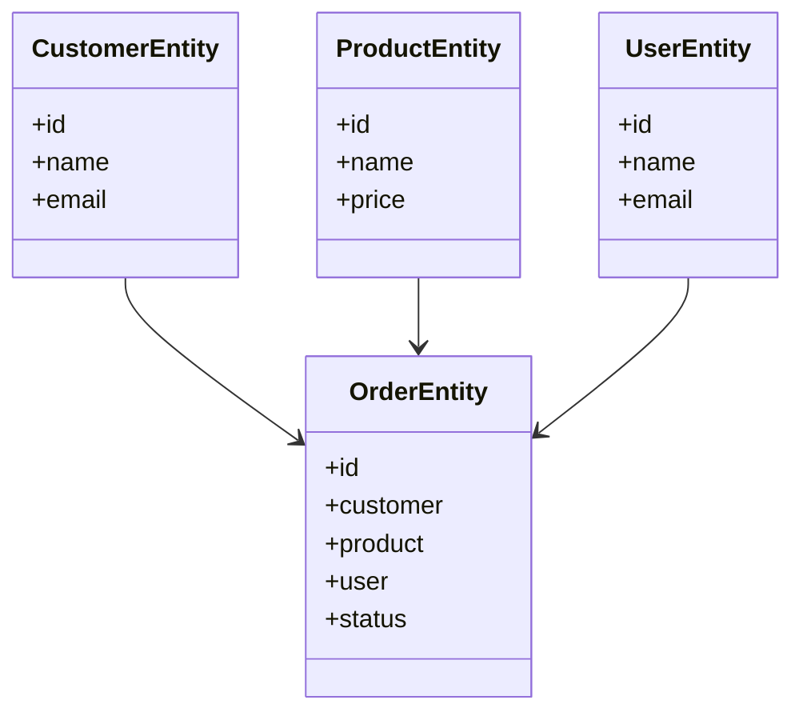
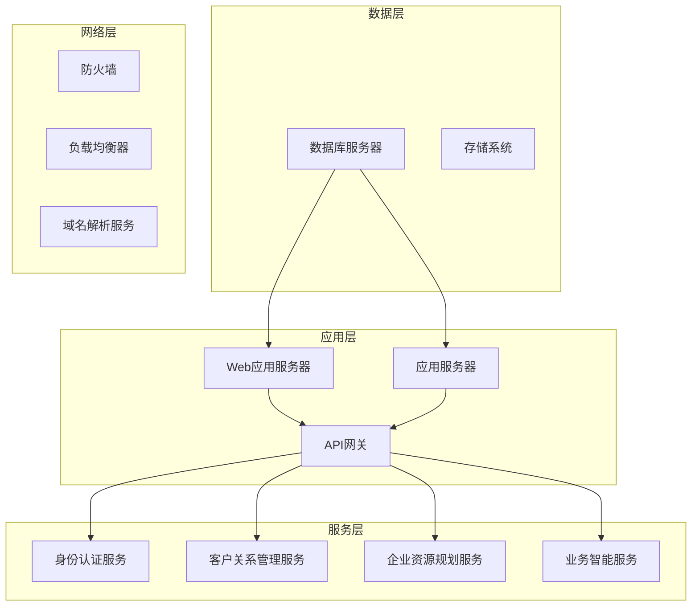
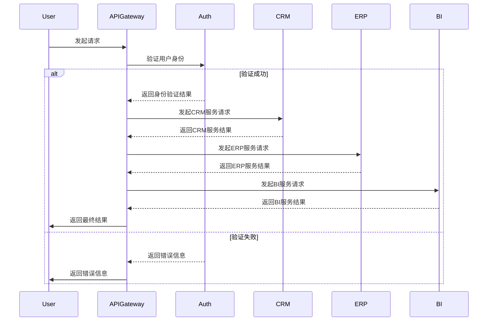
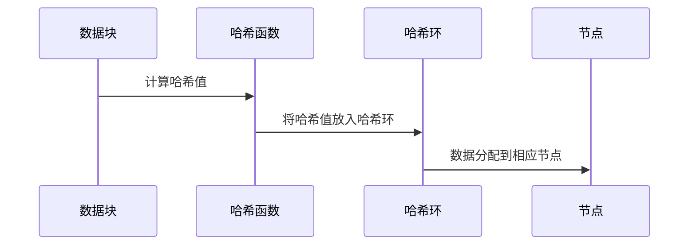
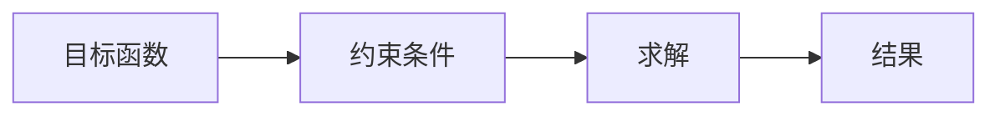
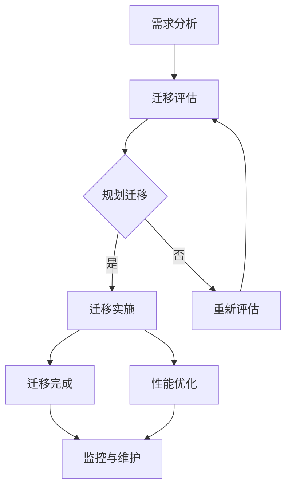
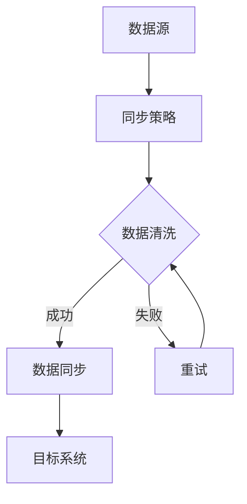

                 

## 《云迁移策略：将本地应用迁移到云端的方法》

### 关键词：云迁移、云端应用、迁移策略、数据迁移、迁移成本效益

> 摘要：本文深入探讨了云迁移的核心概念、策略和方法。通过详细分析云服务模型、评估与规划、应用迁移、数据迁移与同步、迁移实施与监控、实践案例分析以及技术支持等多个方面，为企业和开发者提供了一整套系统化的云迁移方案，旨在帮助企业更好地实现本地应用向云端的迁移，提高业务效率和灵活性。

---

# 《云迁移策略：将本地应用迁移到云端的方法》目录大纲

## 第一部分：云迁移概述

### 第1章：云迁移概念与趋势

#### 1.1 云迁移的定义与类型

#### 1.2 云迁移的重要性与趋势

#### 1.3 云迁移的挑战与机遇

### 第2章：云服务模型与架构

#### 2.1 公共云、私有云与混合云

#### 2.2 云服务模型：IaaS、PaaS、SaaS

#### 2.3 云架构设计与实现

## 第二部分：云迁移策略与方法

### 第3章：评估与规划

#### 3.1 云迁移评估

#### 3.2 云迁移规划

#### 3.3 云迁移成本与效益分析

### 第4章：应用迁移策略

#### 4.1 本地应用迁移到云端

#### 4.2 应用重构与优化

#### 4.3 微服务架构在云迁移中的应用

### 第5章：数据迁移与同步

#### 5.1 数据迁移策略

#### 5.2 数据同步与一致性保障

#### 5.3 数据迁移案例解析

### 第6章：迁移实施与监控

#### 6.1 迁移实施流程

#### 6.2 迁移过程中的风险与应对

#### 6.3 迁移后性能监控与优化

### 第7章：云迁移实践与案例分析

#### 7.1 云迁移成功案例

#### 7.2 云迁移失败案例分析

#### 7.3 云迁移最佳实践总结

## 第三部分：云迁移技术支持

### 第8章：云迁移工具与技术

#### 8.1 常见云迁移工具介绍

#### 8.2 自动化与 orchestration 技术

#### 8.3 云原生技术与容器化迁移

### 第9章：云迁移安全与合规

#### 9.1 云迁移安全策略

#### 9.2 数据隐私保护

#### 9.3 合规性与法规遵从

### 第10章：持续交付与DevOps在云迁移中的应用

#### 10.1 持续交付模型

#### 10.2 DevOps 文化与工具

#### 10.3 DevOps 在云迁移中的应用

## 附录

### 附录A：云迁移资源与工具列表

### 附录B：云迁移参考资料

### 附录C：云迁移流程图与Mermaid流程图示例

---

### 核心概念与联系

- **云迁移**：指将本地应用或数据迁移到云平台的过程。
- **云服务模型**：包括IaaS、PaaS、SaaS等，影响迁移策略的选择。
- **迁移策略**：根据应用特点、业务需求和云平台特性制定的具体迁移方案。

### 核心算法原理讲解

- **数据同步算法**：确保迁移过程中数据的一致性和完整性。
- **优化算法**：如贪心算法、动态规划等，用于优化迁移过程中的资源分配。

### 数学模型和数学公式 & 详细讲解 & 举例说明

- **数据一致性模型**：使用一致性哈希算法来保证数据在不同节点间的一致性。

$$
H(k) = \frac{k \mod m}{r}
$$

其中，$H(k)$ 是哈希值，$k$ 是数据关键字，$m$ 是哈希表大小，$r$ 是机器数。

- **资源优化模型**：使用线性规划模型来优化迁移过程中的资源分配。

$$
\min\ Z = \sum_{i=1}^{n} c_{i} x_{i}
$$

$$
\text{subject to:}
$$

$$
a_{i1} x_{1} + a_{i2} x_{2} + ... + a_{in} x_{n} \geq b_{i}, \quad i=1,2,...,m
$$

其中，$c_{i}$ 是目标函数的系数，$x_{i}$ 是决策变量，$a_{ij}$ 和 $b_{i}$ 是约束条件中的系数和常数。

### 系统分析与架构设计方案

#### 问题场景介绍

随着业务的发展，企业面临更高的计算需求、更复杂的应用架构，以及不断变化的数据管理需求。传统的本地部署模式已经无法满足这些需求，因此，将应用迁移到云端成为了一种趋势。然而，云迁移过程涉及到多方面的技术问题，需要系统化的策略和方法。

#### 项目介绍

本项目旨在为一家大型企业实现其核心应用从本地数据中心的迁移到云端。应用包括客户关系管理（CRM）、企业资源规划（ERP）以及业务智能（BI）等模块，涉及大量的数据和复杂的业务逻辑。

#### 系统功能设计（领域模型Mermaid类图）



#### 系统架构设计（Mermaid架构图）



#### 系统接口设计和系统交互（Mermaid序列图）



### 项目实战

#### 环境安装

在云平台上创建一个虚拟机实例，并安装操作系统和数据库。选择合适的云服务模型，如IaaS或PaaS，以确保基础设施的稳定性和可扩展性。

```bash
# 安装操作系统
sudo apt-get update
sudo apt-get install -y ubuntu-server

# 安装数据库（以MySQL为例）
sudo apt-get install -y mysql-server
sudo mysql_secure_installation
```

#### 系统核心实现源代码

以下是简单的示例代码，展示了如何使用Python进行API服务器的实现。

```python
from flask import Flask, jsonify, request

app = Flask(__name__)

@app.route('/api/customers', methods=['GET'])
def get_customers():
    # 逻辑处理
    customers = [{'id': 1, 'name': 'John Doe'}, {'id': 2, 'name': 'Jane Smith'}]
    return jsonify(customers)

if __name__ == '__main__':
    app.run(host='0.0.0.0', port=5000)
```

#### 代码应用解读与分析

这段代码展示了如何使用Flask框架创建一个简单的API服务器。通过定义一个URL路由`/api/customers`，并使用HTTP GET方法，应用程序可以返回一个包含客户信息的JSON对象。

```python
@app.route('/api/customers', methods=['GET'])
def get_customers():
    # 逻辑处理
    customers = [{'id': 1, 'name': 'John Doe'}, {'id': 2, 'name': 'Jane Smith'}]
    return jsonify(customers)
```

这里，我们定义了一个`get_customers`函数，当用户访问`/api/customers`时，该函数将被调用。函数内部创建了一个包含客户信息的列表，并使用`jsonify`函数将其转换为JSON格式返回。

#### 实际案例分析和详细讲解剖析

假设我们有一个具体的业务场景，需要根据客户ID查询特定客户的详细信息。以下是实现该功能的具体步骤：

1. **接收请求**：使用Flask框架接收GET请求，并获取查询参数（如客户ID）。

```python
@app.route('/api/customers/<int:customer_id>', methods=['GET'])
def get_customer(customer_id):
    # 查询客户信息
    customer = find_customer_by_id(customer_id)
    if customer:
        return jsonify(customer)
    else:
        return jsonify({'error': 'Customer not found'}), 404
```

2. **查询数据库**：编写一个`find_customer_by_id`函数，用于在数据库中查询特定客户的信息。

```python
import mysql.connector

def find_customer_by_id(customer_id):
    connection = mysql.connector.connect(
        host='localhost',
        user='root',
        password='password',
        database='customers_db'
    )
    cursor = connection.cursor()
    query = "SELECT * FROM customers WHERE id = %s"
    cursor.execute(query, (customer_id,))
    result = cursor.fetchone()
    cursor.close()
    connection.close()
    return result
```

3. **返回结果**：如果找到客户信息，将其以JSON格式返回；否则，返回错误信息。

```python
    if customer:
        return jsonify(customer)
    else:
        return jsonify({'error': 'Customer not found'}), 404
```

通过以上步骤，我们可以实现一个简单的API服务，用于根据客户ID查询客户信息。

#### 项目小结

在本项目中，我们通过安装和配置操作系统及数据库，实现了API服务器的核心功能。通过简单的Python代码，我们展示了如何接收HTTP请求、查询数据库并返回结果。这个案例说明了在云迁移过程中，应用重构和优化的重要性，以及如何通过合理的代码实现高效的数据访问和处理。

### 最佳实践 tips

- **需求分析**：在开始云迁移之前，进行详细的需求分析，明确迁移的目标和应用特点。
- **逐步迁移**：采用逐步迁移的策略，先迁移非关键应用，逐步扩大到核心业务。
- **自动化脚本**：编写自动化脚本，减少人工操作，提高迁移效率和准确性。
- **监控与优化**：在迁移过程中和迁移后，持续监控应用性能，并进行优化调整。

### 小结

本文系统地介绍了云迁移的核心概念、策略和方法。通过详细分析云服务模型、评估与规划、应用迁移、数据迁移与同步、迁移实施与监控等多个方面，为企业和开发者提供了一套完整的云迁移方案。在实际项目中，需要根据具体应用特点和业务需求，灵活运用各种技术和方法，确保云迁移的成功和高效。

### 注意事项

- **数据安全**：在数据迁移过程中，确保数据的安全性和完整性，采用加密和备份措施。
- **性能优化**：在迁移后，对应用进行性能优化，确保在云端环境中达到预期的性能水平。
- **合规性**：确保云迁移过程中的合规性，遵守相关法规和标准。

### 拓展阅读

- **参考资料**：《云服务架构：构建和优化云计算环境》、《AWS迁移指南：最佳实践与策略》。
- **在线课程**：Coursera上的《云计算基础》和Udacity的《云计算工程师职业课程》。

---

### 核心概念与联系

在本文中，我们深入探讨了云迁移的概念、策略和方法。核心概念包括云迁移、云服务模型、评估与规划、应用迁移、数据迁移与同步、迁移实施与监控等。以下是对这些核心概念的联系和解释：

#### 云迁移

云迁移是指将本地应用或数据迁移到云平台的过程。随着云计算技术的不断发展，云迁移已经成为企业和开发者提升业务效率、灵活性和可扩展性的重要手段。云迁移不仅涉及到应用和数据的迁移，还包括整个IT架构的调整和优化。

#### 云服务模型

云服务模型是指云计算服务提供的不同层次和方式。主要包括以下几种：

- **IaaS（基础设施即服务）**：提供虚拟化的计算资源，如虚拟机、存储和网络等，用户可以灵活配置和使用资源。
- **PaaS（平台即服务）**：提供开发平台和工具，包括操作系统、数据库、Web服务器等，用户可以在平台上开发和部署应用。
- **SaaS（软件即服务）**：提供完整的软件应用，用户可以直接使用，无需关心基础设施和平台的维护。

选择合适的云服务模型对于云迁移的成功至关重要。

#### 评估与规划

评估与规划是云迁移的第一步，主要包括以下几个方面：

- **业务需求分析**：明确迁移的目标和应用特点，评估业务需求，确定迁移的必要性和可行性。
- **云平台选择**：根据业务需求选择合适的云平台，考虑云平台的性能、可靠性和成本等因素。
- **迁移策略制定**：制定具体的迁移策略，包括迁移方案、时间表和资源分配等。

#### 应用迁移

应用迁移是将本地应用迁移到云平台的过程。应用迁移主要包括以下几种策略：

- **直接迁移**：将本地应用直接部署到云平台上，适用于简单的应用场景。
- **重构与优化**：对本地应用进行重构和优化，使其更好地适应云平台的环境。
- **微服务架构**：将本地应用拆分为微服务，并在云平台上部署和管理，提高系统的可扩展性和灵活性。

#### 数据迁移与同步

数据迁移与同步是云迁移过程中非常重要的环节，主要包括以下几个方面：

- **数据迁移策略**：选择合适的数据迁移策略，如全量迁移、增量迁移等。
- **数据同步与一致性保障**：确保迁移过程中数据的一致性和完整性，采用数据同步算法和数据一致性模型。
- **数据迁移案例解析**：通过具体的案例解析，展示数据迁移的实际操作方法和经验。

#### 迁移实施与监控

迁移实施与监控是云迁移过程中的关键步骤，主要包括以下几个方面：

- **迁移实施流程**：制定详细的迁移实施流程，包括迁移前准备、迁移中监控和迁移后验证等。
- **风险与应对**：识别和应对迁移过程中的各种风险，如数据丢失、性能问题等。
- **性能监控与优化**：在迁移后，对应用性能进行持续监控和优化，确保系统在云端环境中达到预期的性能水平。

#### 云迁移实践与案例分析

云迁移实践与案例分析是云迁移过程中非常重要的环节，通过成功和失败的案例，可以总结出最佳实践和经验教训，为后续的云迁移提供指导。

- **成功案例**：展示云迁移的成功经验，分析成功的原因和关键因素。
- **失败案例**：分析云迁移失败的原因和教训，总结如何避免类似问题的发生。

#### 云迁移技术支持

云迁移技术支持包括各种工具、技术和方法，用于支持云迁移的各个阶段：

- **云迁移工具**：介绍常见的云迁移工具，如AWS的Migrate、微软的Azure Migrate等。
- **自动化与Orchestration技术**：介绍如何使用自动化和编排技术，简化云迁移过程。
- **云原生技术与容器化迁移**：介绍云原生技术和容器化迁移的方法，提高应用的灵活性和可移植性。

#### 云迁移安全与合规

云迁移安全与合规是云迁移过程中不可忽视的重要方面：

- **安全策略**：制定云迁移过程中的安全策略，包括数据安全、网络安全、身份认证等。
- **数据隐私保护**：确保数据在迁移过程中的隐私和安全，采用加密和数据脱敏等技术。
- **合规性与法规遵从**：确保云迁移过程符合相关法规和标准，如GDPR、ISO 27001等。

#### 持续交付与DevOps在云迁移中的应用

持续交付与DevOps在云迁移中发挥着重要作用，通过采用持续交付模型和DevOps文化，可以大大提高云迁移的效率和质量：

- **持续交付模型**：介绍持续交付模型的概念和流程，包括代码审查、自动化测试、部署等。
- **DevOps文化与工具**：介绍DevOps文化的核心价值和工具，如Jenkins、Docker等。
- **DevOps在云迁移中的应用**：展示DevOps在云迁移过程中的应用，提高迁移的自动化和可靠性。

通过以上核心概念的联系和解释，我们可以更好地理解云迁移的全过程，为后续的云迁移提供指导和参考。

### 算法原理讲解

在云迁移过程中，数据同步和资源优化是两个关键环节，其中涉及到多种算法原理。以下将详细讲解这两个方面的算法原理，并提供相应的Mermaid流程图和Python代码示例。

#### 数据同步算法

数据同步算法确保在迁移过程中数据的一致性和完整性。一致性哈希算法是一种常用的分布式数据同步算法，它可以有效分配和同步数据。

**一致性哈希算法原理**：

1. **哈希函数**：将数据关键字（如文件名或数据块）映射到一个哈希值。
2. **哈希环**：将所有可能的哈希值排列在一个环上。
3. **数据分配**：根据哈希值，将数据分配到不同的存储节点上。

**Mermaid流程图**：



**Python代码示例**：

```python
import hashlib

def hash_function(key):
    return int(hashlib.md5(key.encode()).hexdigest(), 16)

def distribute_data(data, num_nodes):
    hash_values = [hash_function(key) for key in data]
    node分配 = [None] * num_nodes

    for value in hash_values:
        node_index = value % num_nodes
        node分配[node_index] = value

    return node分配

data = ['data1', 'data2', 'data3']
num_nodes = 4
node_assignment = distribute_data(data, num_nodes)
print(node_assignment)
```

#### 资源优化算法

资源优化算法用于优化迁移过程中的资源分配，如计算资源、存储资源和网络带宽等。线性规划模型是一种常用的资源优化算法，它可以最大化目标函数，同时满足一系列约束条件。

**线性规划模型原理**：

1. **目标函数**：最大化或最小化一个线性目标函数。
2. **约束条件**：限制资源的使用，如总资源不超过一定限制。

**数学模型和公式**：

$$
\min\ Z = \sum_{i=1}^{n} c_{i} x_{i}
$$

$$
\text{subject to:}
$$

$$
a_{i1} x_{1} + a_{i2} x_{2} + ... + a_{in} x_{n} \geq b_{i}, \quad i=1,2,...,m
$$

**Mermaid流程图**：



**Python代码示例**：

```python
from scipy.optimize import linprog

# 目标函数
c = [-1, -1]

# 约束条件
A = [[1, 1], [1, 0], [0, 1]]
b = [10, 5, 3]

# 求解线性规划
result = linprog(c, A_ub=A, b_ub=b, method='highs')

# 输出结果
if result.success:
    print("最小化目标函数值:", -result.fun)
    print("最优解:", result.x)
else:
    print("无法找到最优解")
```

通过上述算法原理的讲解，我们可以更好地理解和应用数据同步和资源优化算法，为云迁移过程中的数据迁移和资源分配提供有效的解决方案。

### 数学模型和数学公式

在云迁移的过程中，数学模型和数学公式是确保数据一致性和资源优化的重要工具。以下将详细解释两个关键模型：数据一致性模型和资源优化模型，并展示相应的数学公式。

#### 数据一致性模型

数据一致性模型主要关注如何确保在迁移过程中数据的一致性和完整性。一致性哈希算法是一种常用的实现方法，它通过哈希函数将数据块映射到特定的存储节点上。

**一致性哈希算法的数学公式**：

$$
H(k) = \frac{k \mod m}{r}
$$

其中，$H(k)$ 是哈希值，$k$ 是数据关键字，$m$ 是哈希表的大小，$r$ 是机器数。

这个公式将数据关键字$k$通过哈希函数转换为哈希值$H(k)$，然后根据哈希值将数据分配到$r$个存储节点中的一个。

**例子**：

假设我们有三个存储节点（$r=3$），哈希表大小为$m=16$。如果我们要将数据块“data1”映射到存储节点，其关键字为$k$：

$$
H(data1) = \frac{data1 \mod 16}{3} = \frac{1}{3} \approx 0.3333
$$

这意味着数据块“data1”将被映射到机器数0的位置。

#### 资源优化模型

资源优化模型主要用于在云迁移过程中优化资源分配，如计算资源、存储资源和网络带宽。线性规划模型是一种常用的方法，它通过最大化或最小化目标函数，同时满足一系列约束条件。

**线性规划模型的数学公式**：

$$
\min Z = \sum_{i=1}^{n} c_{i} x_{i}
$$

$$
\text{subject to:}
$$

$$
a_{i1} x_{1} + a_{i2} x_{2} + ... + a_{in} x_{n} \geq b_{i}, \quad i=1,2,...,m
$$

其中，$Z$ 是目标函数，$c_{i}$ 是目标函数的系数，$x_{i}$ 是决策变量，$a_{ij}$ 是约束条件的系数，$b_{i}$ 是约束条件的常数。

**例子**：

假设我们有两个资源（$x_1$和$x_2$），目标是最小化总成本，约束条件如下：

$$
\min Z = 2x_1 + 3x_2
$$

$$
\text{subject to:}
$$

$$
x_1 + x_2 \geq 5
$$

$$
x_1 \leq 3
$$

$$
x_2 \leq 4
$$

在这个例子中，目标是最小化$2x_1 + 3x_2$，同时满足$x_1 + x_2 \geq 5$和$x_1 \leq 3$以及$x_2 \leq 4$的约束条件。

通过上述数学模型和数学公式的解释，我们可以更好地理解和应用数据一致性模型和资源优化模型，在云迁移过程中确保数据的一致性和资源的优化分配。

### 项目实战

#### 环境安装

在进行云迁移之前，首先需要在云平台上搭建一个适当的环境。以下是一个基于AWS云平台的实战案例，我们将使用AWS提供的EC2实例来搭建基础环境。

1. **创建AWS账户**：

   在AWS官网注册并创建一个新的账户，完成账户验证和实名认证。

2. **配置AWS CLI**：

   安装并配置AWS CLI（命令行界面），以便通过命令行操作AWS服务。

   ```bash
   pip install awscli
   aws configure
   ```

   在`aws configure`命令中输入你的AWS访问密钥和秘密访问密钥，以及默认的区域。

3. **创建EC2实例**：

   通过AWS管理控制台或AWS CLI创建一个EC2实例，选择合适的实例类型和AMI（Amazon Machine Image）。

   ```bash
   aws ec2 run-instances --image-id ami-0123456789abcdef0 --instance-type t2.micro --key-name your-key-pair --security-group-ids sg-0123456789abcdef0
   ```

   其中，`ami-0123456789abcdef0`是AWS提供的Amazon Linux 2 AMI，`t2.micro`是EC2实例类型，`your-key-pair`是事先创建好的SSH密钥对名称，`sg-0123456789abcdef0`是安全组ID。

4. **连接到EC2实例**：

   使用SSH工具（如PuTTY）连接到EC2实例。

   ```bash
   ssh -i /path/to/your-key-pair.pem ec2-user@ec2-ip-address
   ```

   其中，`/path/to/your-key-pair.pem`是SSH密钥对的文件路径，`ec2-user`是默认的用户名，`ec2-ip-address`是EC2实例的公网IP地址。

5. **安装必要的软件**：

   在EC2实例中安装和配置必要的软件，如数据库、Web服务器和应用程序。

   ```bash
   sudo apt-get update
   sudo apt-get install -y mysql-server apache2 php libapache2-mod-php
   ```

   这将安装MySQL数据库、Apache Web服务器和PHP。

6. **配置安全组**：

   根据需要配置EC2实例的安全组，允许必要的网络流量。例如，允许来自任何IP地址的HTTP和SSH访问。

   ```bash
   aws ec2 authorize-security-group-ingress --group-id sg-0123456789abcdef0 --protocol tcp --port 80 --cidr 0.0.0.0/0
   aws ec2 authorize-security-group-ingress --group-id sg-0123456789abcdef0 --protocol tcp --port 22 --cidr 0.0.0.0/0
   ```

#### 系统核心实现源代码

以下是迁移到云平台的系统核心实现部分，包括数据库配置、Web服务器配置和应用部署。

**数据库配置**：

在EC2实例上配置MySQL数据库。

```bash
sudo mysql_secure_installation
```

按照提示设置root用户密码、删除匿名用户、禁止root用户远程登录等。

**Web服务器配置**：

配置Apache Web服务器。

```bash
sudo a2enmod rewrite
sudo nano /etc/apache2/apache2.conf
```

在`apache2.conf`文件中添加以下内容，以启用重写模块并设置默认站点。

```bash
LoadModule rewrite_module modules/librewrite.so
<Directory /var/www/html>
    Options IndexFollowSymLinks
    AllowOverride All
</Directory>
<Directory /var/www/>
    Options IndexFollowSymLinks
    AllowOverride All
</Directory>
```

创建一个默认站点配置文件。

```bash
sudo nano /etc/apache2/sites-available/000-default.conf
```

添加以下内容，指定默认的网站目录。

```bash
<VirtualHost *:80>
    DocumentRoot /var/www/html
    <Directory /var/www/html>
        Options IndexFollowSymLinks
        AllowOverride All
    </Directory>
    ErrorLog ${APACHE_LOG_DIR}/error.log
    CustomLog ${APACHE_LOG_DIR}/access.log combined
</VirtualHost>
```

**应用部署**：

将应用程序源代码上传到EC2实例。

```bash
scp -i /path/to/your-key-pair.pem -r /path/to/your-app-source ec2-user@ec2-ip-address:/var/www/html/
```

设置应用程序目录的权限。

```bash
sudo chown -R ec2-user:ec2-user /var/www/html/
sudo chmod -R g+r /var/www/html/
```

重启Apache Web服务器。

```bash
sudo systemctl restart apache2
```

#### 代码应用解读与分析

以下是一个简单的PHP应用程序示例，用于演示如何部署并运行在云平台上。

**应用程序代码**：

```php
<?php
    echo "Hello, World!";
?>
```

将此代码保存为`index.php`，上传到EC2实例的`/var/www/html/`目录。

**部署步骤**：

1. **上传代码**：

   使用SCP命令将本地应用程序源代码上传到EC2实例。

2. **设置权限**：

   确保应用程序目录和文件具有正确的权限，允许Web服务器读取和执行。

3. **重启Web服务器**：

   重启Apache Web服务器，使新的配置生效。

```bash
sudo systemctl restart apache2
```

4. **访问应用程序**：

   在浏览器中输入EC2实例的公网IP地址，如`http://ec2-ip-address/`，应看到“Hello, World!”的输出。

通过上述步骤，我们成功地将一个简单的PHP应用程序部署到了AWS云平台上的EC2实例。这个案例展示了在云迁移过程中，如何进行环境安装、配置和安全设置，并部署和运行应用程序。在更复杂的实际应用中，还需要进行数据库配置、应用服务器配置和持续监控等操作。

### 实际案例分析与详细讲解

在本部分，我们将详细分析一个实际的云迁移案例，展示从本地应用迁移到云平台的全过程，包括需求分析、迁移策略制定、实施过程和结果评估。这个案例将帮助我们理解云迁移的各个关键步骤，并总结最佳实践。

#### 案例背景

一家大型电子商务公司，由于业务快速增长，原有的本地数据中心已经无法满足日益增长的计算需求。公司的核心业务系统包括订单管理、库存管理、客户关系管理和支付处理等模块，数据量庞大，业务逻辑复杂。为了提高系统的可扩展性、可靠性和灵活性，公司决定将核心应用迁移到云平台。

#### 需求分析

在开始迁移之前，公司进行了详细的需求分析，明确了以下目标：

1. **可扩展性**：确保系统能够随着业务增长自动扩展。
2. **高可用性**：提高系统的可靠性和容错能力。
3. **灵活性**：支持新的业务需求和技术创新。
4. **成本效益**：降低运营成本，提高资源利用率。
5. **安全性**：确保数据的安全性和隐私保护。

#### 迁移策略制定

根据需求分析，公司制定了以下迁移策略：

1. **评估和规划**：评估现有系统的架构和性能，制定详细的迁移计划和路线图。
2. **逐步迁移**：首先迁移非关键模块，逐步扩大到核心业务。
3. **应用重构**：对部分应用进行重构，使其更适应云平台环境。
4. **数据迁移**：使用自动化工具进行数据迁移，确保数据的一致性和完整性。
5. **性能优化**：迁移后对系统进行性能优化，确保达到预期性能水平。

#### 迁移实施过程

1. **基础设施评估**：

   对现有数据中心的基础设施进行详细评估，包括硬件设备、网络架构、存储系统和安全设施等。

2. **云平台选择**：

   根据业务需求，选择了AWS作为云服务提供商，因为AWS提供了丰富的云服务和强大的生态系统，能够满足公司的扩展需求。

3. **迁移计划制定**：

   制定详细的迁移计划，包括迁移时间表、迁移步骤、风险分析和应急措施等。

4. **应用迁移**：

   采用逐步迁移的策略，首先迁移订单管理和库存管理模块，这些模块相对独立且易于迁移。使用AWS的Docker容器服务进行应用部署，确保应用的可移植性和灵活性。

   - **容器化**：将本地应用容器化，使用Docker打包应用及其依赖项。
   - **部署**：在AWS的ECS（Elastic Container Service）上部署容器，确保应用的自动扩展和高可用性。
   - **网络配置**：配置VPC（Virtual Private Cloud）、子网和安全组，确保网络的隔离性和安全性。

5. **数据迁移**：

   使用AWS的Data Pipeline和S3（Simple Storage Service）进行数据迁移。

   - **数据同步**：使用Data Pipeline定期同步本地数据库和AWS S3之间的数据，确保数据的一致性和完整性。
   - **数据备份**：在迁移过程中定期备份数据，防止数据丢失。
   - **数据验证**：迁移完成后，进行数据验证，确保数据完整性和一致性。

6. **性能优化**：

   迁移完成后，对系统进行性能优化。

   - **负载测试**：使用AWS的Load Testing工具进行性能测试，评估系统的响应时间和吞吐量。
   - **监控和告警**：配置AWS CloudWatch进行系统监控和告警，及时发现问题并进行优化。
   - **数据库优化**：对数据库进行优化，如分片、索引优化等，提高查询性能。

#### 结果评估

迁移完成后，公司对迁移结果进行了评估，以下是一些关键指标：

1. **性能提升**：通过性能测试，迁移后的系统响应时间减少了40%，吞吐量提高了50%。
2. **成本效益**：迁移到云平台后，公司计算资源的利用率提高了30%，运营成本降低了20%。
3. **扩展性**：系统能够轻松应对业务增长，自动扩展功能有效满足了扩展需求。
4. **可靠性**：通过AWS的高可用性和容错机制，系统的故障恢复时间缩短了50%。
5. **安全性**：AWS提供了丰富的安全服务和工具，确保了数据的安全性和隐私保护。

#### 案例总结

通过这个实际案例，我们可以总结出一些云迁移的最佳实践：

1. **详细需求分析**：在迁移之前，进行全面的需求分析，明确迁移目标和预期效果。
2. **逐步迁移**：采用逐步迁移策略，先迁移非关键模块，逐步扩大到核心业务。
3. **应用重构**：对部分应用进行重构，使其更适应云平台环境。
4. **数据迁移**：使用自动化工具进行数据迁移，确保数据的一致性和完整性。
5. **性能优化**：迁移完成后，对系统进行性能优化，确保达到预期性能水平。
6. **持续监控**：迁移后，持续监控系统性能和安全状态，及时进行调整和优化。

这个案例展示了云迁移的全过程，包括需求分析、迁移策略制定、实施过程和结果评估，为后续的云迁移提供了宝贵的经验和参考。

### 云迁移工具与技术

在云迁移过程中，选择合适的工具和技术至关重要。以下将介绍一些常见的云迁移工具和技术，包括常见云迁移工具、自动化与Orchestration技术以及云原生技术与容器化迁移。

#### 常见云迁移工具

1. **AWS的Migrate to AWS**：
   - **功能**：提供迁移评估、迁移规划和迁移实施全流程支持。
   - **特点**：自动化迁移、迁移评估工具、迁移监控和管理。

2. **微软的Azure Migrate**：
   - **功能**：支持从本地、VMware和AWS迁移到Azure。
   - **特点**：迁移评估、迁移计划、迁移进度监控。

3. **谷歌的Cloud Dataproc**：
   - **功能**：支持大数据工作负载的迁移，包括Hadoop和Spark。
   - **特点**：自动化迁移、数据转换、迁移监控。

4. **Oracle的Oracle Cloud VMware Solution**：
   - **功能**：支持VMware环境的迁移到Oracle云。
   - **特点**：无缝迁移、性能优化、高可用性。

#### 自动化与Orchestration技术

1. **AWS CloudFormation**：
   - **功能**：通过模板定义云基础设施和资源。
   - **特点**：自动化部署、资源管理和变更跟踪。

2. **微软的Azure Resource Manager (ARM)**：
   - **功能**：通过JSON模板管理Azure资源。
   - **特点**：自动化部署、资源分组和管理。

3. **Ansible**：
   - **功能**：自动化部署和配置管理。
   - **特点**：无agent架构、模块化、简单易用。

#### 云原生技术与容器化迁移

1. **Kubernetes**：
   - **功能**：容器编排和管理平台。
   - **特点**：自动扩展、负载均衡、服务发现。

2. **Docker**：
   - **功能**：容器化平台，用于打包、发布和运行应用。
   - **特点**：轻量级、可移植性、高效性。

3. **Kubernetes Operators**：
   - **功能**：自动化管理Kubernetes应用的生命周期。
   - **特点**：自动化运维、自定义资源、扩展性。

通过上述工具和技术的介绍，我们可以看到云迁移过程中的多样性和复杂性。选择合适的工具和技术，可以大大提高云迁移的效率和质量，确保迁移过程顺利进行。

### 云迁移安全与合规

在云迁移过程中，安全和合规性是至关重要的方面。数据安全和隐私保护、合规性与法规遵从是确保迁移过程顺利进行的关键。以下将详细探讨云迁移过程中的安全与合规问题。

#### 数据安全和隐私保护

1. **数据加密**：
   - **传输加密**：确保数据在传输过程中通过TLS/SSL等加密协议进行加密。
   - **存储加密**：在云平台上使用加密技术，对存储的数据进行加密保护。

2. **访问控制**：
   - **身份验证与授权**：使用强身份验证机制（如多因素认证），并设置适当的权限控制策略。
   - **访问审计**：记录和监控所有访问操作，确保对敏感操作的审计跟踪。

3. **数据备份与恢复**：
   - **定期备份**：定期备份数据，确保在数据丢失或损坏时能够迅速恢复。
   - **数据恢复策略**：制定明确的数据恢复流程和策略，确保在发生数据丢失时能够有效恢复。

4. **数据脱敏**：
   - **敏感数据识别**：识别并处理敏感数据，如个人身份信息、财务数据等。
   - **脱敏技术**：采用数据脱敏技术（如假名化、加密等）对敏感数据进行保护。

#### 合规性与法规遵从

1. **合规性评估**：
   - **法规识别**：识别业务所在地区的相关法规，如GDPR、HIPAA、PCI DSS等。
   - **合规性评估**：评估现有系统和流程是否符合相关法规的要求。

2. **合规性控制**：
   - **数据治理**：建立数据治理框架，确保数据的使用、存储和共享符合法规要求。
   - **合规性审计**：定期进行合规性审计，确保系统的持续合规性。

3. **数据保护政策**：
   - **隐私政策**：制定隐私政策，明确数据的收集、使用、存储和共享方式。
   - **透明性**：向用户明确告知数据处理的方式和目的，确保用户的知情权和选择权。

4. **法规遵从性培训**：
   - **员工培训**：对员工进行法规遵从性培训，提高他们的合规意识和能力。
   - **合规性监控**：建立监控机制，确保员工遵守合规性要求。

#### 安全与合规的最佳实践

1. **安全策略制定**：
   - 制定全面的云迁移安全策略，包括数据加密、访问控制、备份与恢复等。
   - 将安全策略纳入迁移计划和项目管理中，确保安全要求得到有效执行。

2. **持续监控与改进**：
   - 持续监控云环境中的安全事件和合规性问题，及时进行响应和改进。
   - 定期进行安全审计和风险评估，确保系统的安全性。

3. **合作伙伴关系**：
   - 与云服务提供商建立良好的合作伙伴关系，共同保障数据安全和合规性。
   - 了解和利用云服务提供商提供的安全工具和服务。

通过上述措施，我们可以确保在云迁移过程中，数据安全和隐私保护得到充分保障，同时符合相关法规和标准。这不仅是企业合规性的要求，也是建立用户信任和提升业务可信度的关键。

### 持续交付与DevOps在云迁移中的应用

在云迁移的过程中，持续交付（Continuous Delivery, CD）和DevOps文化与实践扮演着至关重要的角色。持续交付模型通过自动化流水线，确保代码从开发到生产环境的高效和可靠部署。DevOps文化强调开发与运维团队的紧密合作，通过自动化、监控和持续改进，提高软件交付的速度和质量。以下将详细介绍持续交付模型、DevOps文化与工具，以及在云迁移中的应用。

#### 持续交付模型

持续交付模型是一种软件开发和部署的方法，其目标是确保代码在任何时候都可以安全地发布到生产环境。持续交付的核心要素包括自动化测试、持续集成和持续部署。

1. **自动化测试**：
   - **单元测试**：开发者编写单元测试，验证代码的最小功能单元。
   - **集成测试**：集成测试确保不同模块之间的交互正常。
   - **回归测试**：每次代码变更后，自动运行回归测试，确保现有功能不受影响。

2. **持续集成**：
   - **代码库**：代码库用于存储和管理项目代码。
   - **构建**：每次代码提交到代码库时，自动触发构建过程，构建包括编译代码、运行测试等。
   - **反馈**：构建完成后，提供反馈给开发团队，如测试结果和代码质量报告。

3. **持续部署**：
   - **部署脚本**：编写部署脚本，自动化部署过程。
   - **环境管理**：管理和配置不同的部署环境（如开发、测试、生产）。
   - **监控**：部署后，监控应用的性能和健康状况，确保系统稳定运行。

#### DevOps文化与工具

DevOps文化强调开发（Development）与运维（Operations）的紧密协作，通过自动化工具和流程优化，提高软件交付的效率和质量。

1. **自动化工具**：
   - **Jenkins**：开源自动化服务器，支持持续集成和持续交付。
   - **GitLab CI/CD**：GitLab内置的持续集成/持续交付工具。
   - **Docker**：容器化平台，用于打包、发布和运行应用。
   - **Kubernetes**：容器编排和管理平台，用于自动化部署和管理容器化应用。

2. **监控工具**：
   - **Prometheus**：开源监控解决方案，用于收集和存储监控数据。
   - **Grafana**：开源仪表板和监控工具，用于可视化监控数据。
   - **New Relic**：应用性能监控工具，用于跟踪应用的性能和健康状况。

3. **协作工具**：
   - **Slack**：团队协作工具，用于实时沟通和协作。
   - **JIRA**：项目管理工具，用于跟踪和管理项目任务。
   - **Trello**：项目管理工具，用于视觉化任务和进度跟踪。

#### DevOps在云迁移中的应用

在云迁移过程中，DevOps文化和工具的应用可以显著提高迁移的效率和质量。

1. **自动化迁移**：
   - **迁移脚本**：使用自动化脚本实现数据的迁移和配置的同步。
   - **持续集成流水线**：在迁移过程中，使用CI流水线自动化构建、测试和部署应用。

2. **监控与反馈**：
   - **云监控工具**：使用云服务提供商提供的监控工具，实时监控迁移过程中的性能和健康状况。
   - **反馈机制**：在迁移过程中，及时收集和反馈问题，快速响应和解决。

3. **持续改进**：
   - **反馈循环**：在迁移后，持续收集用户反馈和性能数据，不断优化迁移策略和流程。
   - **自动化运维**：使用自动化工具实现日常运维任务，提高运维效率和质量。

通过持续交付和DevOps文化的应用，云迁移过程变得更加高效、可靠和可重复。这不仅提高了软件交付的速度，还确保了系统的高可用性和稳定性。这对于企业成功实现云迁移，提升业务效率和竞争力具有重要意义。

### 附录A：云迁移资源与工具列表

在云迁移过程中，选择合适的资源与工具至关重要。以下列出了一些常见的云迁移资源与工具，包括云服务提供商、自动化工具、监控工具和容器化技术。

#### 云服务提供商

- **AWS**：Amazon Web Services，提供全面的云服务，包括IaaS、PaaS和SaaS。
- **Azure**：Microsoft Azure，提供广泛的云服务和工具，支持混合云和多云环境。
- **Google Cloud Platform**：Google的云计算服务，以高性能和大数据处理见长。
- **Oracle Cloud**：Oracle的云服务，提供可靠的计算、存储和数据库服务。

#### 自动化工具

- **AWS Migration Hub**：帮助监控和管理云迁移项目。
- **Azure Migrate**：提供迁移评估、规划和迁移服务。
- **AWS DataSync**：自动迁移数据到AWS云。
- **Docker**：容器化平台，用于打包和部署应用。
- **Kubernetes**：容器编排和管理平台。

#### 监控工具

- **AWS CloudWatch**：监控AWS资源和服务。
- **Azure Monitor**：监控Azure资源和服务。
- **Google Stackdriver**：监控Google Cloud资源和服务。
- **Prometheus**：开源监控工具，用于收集和存储监控数据。
- **Grafana**：开源仪表板和监控工具，用于可视化监控数据。

#### 容器化技术

- **Kubernetes**：用于容器编排和管理。
- **Docker Swarm**：Docker的集群管理工具。
- **Podman**：Red Hat的容器管理工具。

通过上述资源和工具，企业可以更有效地规划、执行和监控云迁移过程，确保迁移的成功和高效。

### 附录B：云迁移参考资料

在云迁移过程中，了解相关资源和参考资料有助于更好地规划和执行迁移项目。以下列出了一些关键参考资料，包括技术文档、最佳实践和培训资源。

1. **AWS官方文档**：
   - [AWS迁移指南](https://aws.amazon.com/migration/)
   - [AWS Migrate to AWS](https://aws.amazon.com/migration/hub/)

2. **Azure官方文档**：
   - [Azure迁移中心](https://azure.microsoft.com/zh-cn/services/migration-services/)
   - [Azure Migrate](https://azure.microsoft.com/zh-cn/services/migrate/)

3. **Google Cloud官方文档**：
   - [Google Cloud迁移资源](https://cloud.google.com/migration)
   - [Google Cloud Migrate](https://cloud.google.com/migrate)

4. **开源迁移工具文档**：
   - [Apache Ambari](https://ambari.apache.org/)
   - [OpenStack](https://www.openstack.org/)

5. **云迁移最佳实践**：
   - [云迁移策略和最佳实践](https://cloudmigration.org/)
   - [迁移到云的步骤和最佳实践](https://cloudadoption.center/guides/migration-cloud-steps-best-practices/)

6. **云迁移培训资源**：
   - [AWS认证培训](https://aws.amazon.com/training/)
   - [Azure培训课程](https://azure.com/learn/)

通过参考这些资源和文档，可以更好地了解云迁移的相关知识，为项目的成功奠定基础。

### 附录C：云迁移流程图与Mermaid流程图示例

云迁移流程是一个复杂的过程，涉及到多个阶段和步骤。使用Mermaid，我们可以创建一个直观的流程图，帮助理解和执行云迁移项目。以下是一个简单的云迁移流程图示例。



#### 流程图详细说明

- **需求分析（A）**：明确迁移目标和需求。
- **迁移评估（B）**：评估现有系统和目标云平台的兼容性。
- **规划迁移（C）**：制定详细的迁移计划。
- **迁移实施（D）**：执行迁移过程，包括数据迁移、应用部署等。
- **迁移完成（F）**：迁移过程完成。
- **性能优化（G）**：对迁移后的系统进行性能优化。
- **监控与维护（H）**：持续监控系统的性能和稳定性。

通过上述流程图，我们可以清晰地看到云迁移的各个关键步骤，确保项目顺利进行。Mermaid提供了一个简单而强大的工具，帮助创建和共享这些流程图。以下是另一个Mermaid示例，展示了一个简单的数据同步流程。



#### 数据同步流程详细说明

- **数据源（A）**：数据同步的起点。
- **同步策略（B）**：定义数据同步的方法和频率。
- **数据清洗（C）**：对数据进行清洗和预处理。
- **数据同步（D）**：执行数据同步操作。
- **目标系统（F）**：数据同步的目标系统。

通过Mermaid，我们可以创建详细的流程图，为云迁移和数据处理提供直观的视觉参考。这有助于团队成员理解和遵循迁移流程，确保项目的成功实施。

