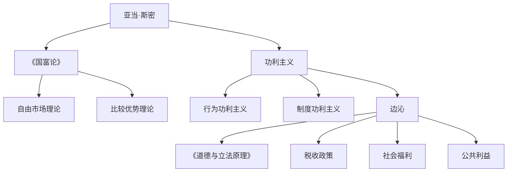

                 

# 《亚当·斯密与边沁：功利主义的经济学基础》

> 关键词：功利主义、经济学、亚当·斯密、边沁、道德伦理

> 摘要：本文将探讨功利主义在经济学领域的应用，以亚当·斯密与边沁的理论为基础，分析其核心理念、经济学观点以及对现代经济政策的影响。通过一步步的推理与思考，本文旨在揭示功利主义在现代经济学中的重要性及其面临的挑战。

## 目录大纲

### 第1章 引言

- 1.1 功利主义概述
  - 1.1.1 功利主义的起源与发展
  - 1.1.2 功利主义的核心理念
- 1.2 亚当·斯密与边沁
  - 1.2.1 亚当·斯密：经济学之父
    - 1.2.1.1 亚当·斯密生平
    - 1.2.1.2 《国富论》的基本观点
    - 1.2.1.3 斯密与功利主义的关系
  - 1.2.2 边沁：功利主义的奠基者
    - 1.2.2.1 边沁生平
    - 1.2.2.2 《道德与立法原理》的基本观点
    - 1.2.2.3 边沁与斯密思想的比较

### 第2章 功利主义的基本原理

- 2.1 功利主义的定义与评价标准
  - 2.1.1 功利主义的定义
  - 2.1.2 功利主义的评价标准
- 2.2 功利主义的理论体系
  - 2.2.1 功利主义的基本原理
  - 2.2.2 功利主义的道德原则
- 2.3 功利主义的经济学应用
  - 2.3.1 功利主义在经济学中的地位
  - 2.3.2 功利主义的经济政策建议

### 第3章 亚当·斯密的经济学理论

- 3.1 亚当·斯密的经济思想
  - 3.1.1 贸易理论
    - 3.1.1.1 贸易利益
    - 3.1.1.2 比较优势理论
  - 3.1.2 财政理论
    - 3.1.2.1 财政收入的来源
    - 3.1.2.2 财政支出的原则
- 3.2 斯密的经济学观点对功利主义的影响
  - 3.2.1 斯密对功利主义的影响
  - 3.2.2 功利主义对斯密观点的批判

### 第4章 边沁的经济学理论

- 4.1 边沁的经济思想
  - 4.1.1 功利主义的道德原则
    - 4.1.1.1 行为功利主义
    - 4.1.1.2 制度功利主义
  - 4.1.2 边沁的经济政策建议
- 4.2 边沁的经济学观点对功利主义的影响
  - 4.2.1 边沁对功利主义的影响
  - 4.2.2 功利主义对边沁观点的批判

### 第5章 功利主义在现代经济学中的应用

- 5.1 功利主义在现代经济学中的发展
  - 5.1.1 功利主义与福利经济学
  - 5.1.2 功利主义与公共选择理论
- 5.2 功利主义在经济政策制定中的应用
  - 5.2.1 功利主义在环境保护政策中的应用
    - 5.2.1.1 环境与功利主义
    - 5.2.1.2 环境政策的功利主义评估
  - 5.2.2 功利主义在社会福利政策中的应用

### 第6章 功利主义与道德伦理

- 6.1 功利主义与道德伦理的关系
  - 6.1.1 功利主义的道德观
  - 6.1.2 功利主义与道德规范的关系
- 6.2 功利主义在道德伦理教育中的应用
  - 6.2.1 功利主义在教育中的重要性
  - 6.2.2 功利主义在道德教育中的应用

### 第7章 结论

- 7.1 功利主义的经济学基础
  - 7.1.1 亚当·斯密与边沁的贡献
  - 7.1.2 功利主义在现代经济学中的意义
- 7.2 功利主义的未来发展
  - 7.2.1 功利主义面临的挑战
  - 7.2.2 功利主义的未来方向

### 附录

- 8.1 参考文献
- 8.2 概念关系图
- 附录A：亚当·斯密与边沁的思想关系图

---

## 第1章 引言

### 1.1 功利主义概述

功利主义（Utilitarianism）是一种道德哲学理论，主张行为的价值在于其产生的功利（即幸福或福利）。功利主义的核心理念是“最大幸福原则”，即选择那些能够最大化幸福的行为。功利主义的起源可以追溯到18世纪的英国，其代表人物是杰里米·边沁（Jeremy Bentham）和约翰·斯图尔特·米尔（John Stuart Mill）。

#### 1.1.1 功利主义的起源与发展

功利主义起源于18世纪的英国，其创始人杰里米·边沁是一位律师和哲学家。边沁主张，道德评价应当基于行为的功利后果，而不是行为本身。他认为，社会的目标应当是最大化整体的幸福。

约翰·斯图尔特·米尔是边沁的学生和同事，他对功利主义进行了进一步的发展和完善。米尔提出了“幸福多元论”，认为幸福不仅包括物质利益，还包括非物质的利益，如知识和美。

#### 1.1.2 功利主义的核心理念

功利主义的核心理念是“最大幸福原则”。这个原则有两个基本要素：

1. **行为的功利后果**：行为的道德价值取决于其产生的功利后果，即行为带来的幸福或福利。
2. **最大幸福**：应当选择那些能够最大化幸福的行为。

功利主义强调行为的价值，而不是行为者的意图或动机。因此，即使一个行为者的意图是好的，但如果其行为导致了不良的后果，这个行为也是不道德的。

### 1.2 亚当·斯密与边沁

#### 1.2.1 亚当·斯密：经济学之父

亚当·斯密（Adam Smith）是经济学领域的奠基人之一，被誉为“经济学之父”。他于1723年出生在苏格兰的格拉斯哥，曾在牛津大学学习，后来成为格拉斯哥大学的教授。

斯密的主要著作是《国富论》（The Wealth of Nations），该书于1776年出版。在《国富论》中，斯密提出了自由放任的经济理论，主张市场自由和竞争的重要性。

##### 1.2.1.1 亚当·斯密生平

亚当·斯密的一生可以概括为以下几个阶段：

1. **学术生涯**：在格拉斯哥大学期间，斯密开始研究经济学，并在1759年发表了《道德情操论》（The Theory of Moral Sentiments），该书奠定了他的道德哲学基础。
2. **出版《国富论》**：1776年，《国富论》的出版标志着经济学作为一门独立学科的诞生。
3. **退休生活**：在退休后，斯密继续撰写和修改《国富论》的续篇，但最终未能完成。

##### 1.2.1.2 《国富论》的基本观点

《国富论》提出了以下基本观点：

1. **劳动分工**：斯密认为，劳动分工是提高生产效率的重要因素。他通过一个针厂的例子，展示了劳动分工如何使得生产过程更加高效。
2. **市场机制**：斯密主张市场自由和竞争的重要性，认为市场机制能够自动调节经济活动，实现资源的最优配置。
3. **看不见的手**：斯密提出了“看不见的手”的概念，认为市场的自由竞争会导致经济主体追求自身利益，从而间接促进社会的整体利益。

##### 1.2.1.3 斯密与功利主义的关系

斯密的经济学观点与功利主义存在一定的联系。斯密认为，市场机制能够最大化社会的整体利益，这与功利主义的“最大幸福原则”相契合。然而，斯密的理论更侧重于经济效率和资源配置，而功利主义则强调行为的功利后果。

#### 1.2.2 边沁：功利主义的奠基者

杰里米·边沁是功利主义的奠基者，他于1748年出生在英国伦敦。边沁是一位律师、哲学家和社会改革家，他的著作《道德与立法原理》（An Introduction to the Principles of Morals and Legislation）奠定了功利主义的理论基础。

##### 1.2.2.1 边沁生平

边沁的一生可以概括为以下几个阶段：

1. **学术生涯**：边沁在牛津大学学习期间，受到洛克和休谟的影响，开始研究道德哲学。
2. **律师生涯**：边沁成为了一名成功的律师，但他更热衷于哲学和社会改革。
3. **哲学著作**：边沁的《道德与立法原理》于1789年出版，提出了功利主义的基本原则。

##### 1.2.2.2 《道德与立法原理》的基本观点

《道德与立法原理》提出了以下基本观点：

1. **行为功利主义**：边沁认为，行为的道德价值取决于其产生的功利后果，即行为带来的幸福或福利。
2. **制度功利主义**：边沁主张，法律和制度的设计应当基于功利主义的原则，以最大化社会的整体幸福。

##### 1.2.2.3 边沁与斯密思想的比较

边沁和斯密都是功利主义的支持者，但他们关注的焦点有所不同。斯密更关注经济效率和资源配置，而边沁则更关注行为的功利后果和制度设计。

边沁强调，行为的道德价值取决于其产生的功利后果，这与斯密的“看不见的手”理论相呼应。然而，边沁的制度功利主义提出了对法律和制度的批判，认为这些制度应当更加关注社会的整体幸福。

## 第2章 功利主义的基本原理

### 2.1 功利主义的定义与评价标准

功利主义是一种道德哲学理论，主张行为的价值在于其产生的功利（即幸福或福利）。在功利主义的视角下，行为的道德价值取决于其功利后果，而不是行为者的意图或动机。

#### 2.1.1 功利主义的定义

功利主义的核心概念是“功利”，它指的是行为或决策所带来的幸福或福利。功利主义的定义可以概括为：

> 功利主义是一种道德哲学理论，主张行为的价值在于其产生的功利（即幸福或福利）。行为的道德价值取决于其功利后果，而不是行为者的意图或动机。

功利主义的定义包含以下几个关键要素：

1. **行为的价值**：功利主义认为，行为的价值在于其产生的功利后果，即行为带来的幸福或福利。
2. **功利**：功利指的是行为或决策所带来的幸福或福利。幸福和福利可以包括物质利益，如财富和健康，也可以包括非物质利益，如知识和美。
3. **功利后果**：行为的道德价值取决于其功利后果，即行为产生的幸福或福利。如果行为产生的功利后果是积极的，那么这个行为就是道德的；反之，如果行为产生的功利后果是消极的，那么这个行为就是不道德的。
4. **意图与动机**：功利主义不关注行为者的意图或动机，而是关注行为产生的功利后果。即使一个行为者的意图是好的，但如果其行为导致了不良的后果，这个行为也是不道德的。

#### 2.1.2 功利主义的评价标准

功利主义的评价标准是基于功利（即幸福或福利）的。功利主义认为，行为的道德价值取决于其产生的功利后果，即行为带来的幸福或福利。评价标准可以概括为：

1. **功利最大化**：功利主义主张，应当选择那些能够最大化功利（幸福或福利）的行为。这意味着，在两个相互冲突的行为之间，应当选择那个能够带来更多幸福或福利的行为。
2. **功利权衡**：在实际决策中，功利主义强调权衡不同行为产生的功利后果。如果两个行为的功利后果难以直接比较，那么应当选择那个能够带来更大总功利（幸福或福利）的行为。
3. **功利后果的长期性**：功利主义关注行为的长期功利后果，而不仅仅是短期功利后果。这意味着，在决策时，应当考虑到行为的长期影响，而不仅仅是短期影响。

### 2.2 功利主义的理论体系

功利主义是一个复杂而深刻的道德哲学理论体系，它包含了一系列的基本原理和道德原则。这些基本原理和道德原则构成了功利主义的核心，为评价行为的道德价值提供了理论基础。

#### 2.2.1 功利主义的基本原理

功利主义的基本原理包括以下几个：

1. **功利原则**：功利原则是功利主义的核心原理，它主张行为的价值在于其产生的功利后果，即行为带来的幸福或福利。功利原则要求我们选择那些能够最大化功利的行为。

2. **幸福原则**：幸福原则是功利主义的一个衍生原理，它主张幸福或福利是道德评价的标准。幸福原则强调，行为的道德价值取决于其产生的功利后果，即行为带来的幸福或福利。

3. **利益平等原则**：利益平等原则是功利主义的一个重要补充原理，它主张在分配功利（幸福或福利）时应当平等对待每个人。利益平等原则要求我们在追求功利最大化的同时，确保每个人都能够享受到平等的福利。

4. **功利后果原则**：功利后果原则是功利主义的一个补充原理，它强调行为的道德价值取决于其产生的功利后果，而不是行为者的意图或动机。功利后果原则要求我们关注行为产生的实际后果，而不仅仅是行为者的意图。

#### 2.2.2 功利主义的道德原则

功利主义的基本原理构成了其道德原则的基础。功利主义的道德原则包括以下几个：

1. **最大幸福原则**：最大幸福原则是功利主义的核心道德原则，它主张选择那些能够最大化幸福的行为。最大幸福原则要求我们考虑行为的功利后果，选择那些能够带来最大幸福的行为。

2. **行为功利主义原则**：行为功利主义原则主张行为的道德价值取决于其产生的功利后果，即行为带来的幸福或福利。行为功利主义原则要求我们评价行为的道德价值时，关注行为产生的实际后果，而不仅仅是行为者的意图。

3. **制度功利主义原则**：制度功利主义原则主张法律和制度的设计应当基于功利主义的原则，以最大化社会的整体幸福。制度功利主义原则要求我们在设计法律和制度时，考虑其对社会整体幸福的贡献。

4. **利益平等原则**：利益平等原则是功利主义的一个重要补充原则，它主张在分配功利（幸福或福利）时应当平等对待每个人。利益平等原则要求我们在追求功利最大化的同时，确保每个人都能够享受到平等的福利。

### 2.3 功利主义的经济学应用

功利主义不仅在道德哲学领域具有广泛的应用，还在经济学领域发挥了重要作用。功利主义为经济政策制定提供了理论基础，并为评估经济政策的效果提供了评价标准。

#### 2.3.1 功利主义在经济学中的地位

功利主义在经济学中的地位可以从以下几个方面进行阐述：

1. **经济效率**：功利主义主张，经济活动应当追求最大化的功利，即最大化社会的整体福利。这意味着，功利主义强调经济效率，主张通过市场机制实现资源的最优配置。

2. **社会福利**：功利主义将社会福利作为评价经济政策的标准。一个有效的经济政策应当能够最大化社会的整体福利，即带来最大的幸福或福利。

3. **公共选择**：功利主义为公共选择理论提供了理论基础。公共选择理论认为，政治决策应当基于功利主义的原则，以最大化社会的整体利益。

#### 2.3.2 功利主义的经济政策建议

基于功利主义的经济学原理，可以提出以下经济政策建议：

1. **市场自由**：功利主义主张市场自由，认为市场机制能够自动调节经济活动，实现资源的最优配置。市场自由政策有助于提高经济效率，最大化社会的整体福利。

2. **社会福利**：功利主义强调社会福利的重要性，主张通过税收和社会福利制度来减少贫困和失业，提高社会的整体福利。

3. **环境保护**：功利主义认为，环境保护是一项重要的社会目标，应当通过经济政策来实现。功利主义主张，在经济发展与环境保护之间寻求平衡，以最大化社会的整体福利。

4. **公平分配**：功利主义主张公平分配，认为应当确保每个人都能够享受到平等的福利。通过税收和社会福利制度，可以实现财富和资源的公平分配。

## 第3章 亚当·斯密的经济学理论

### 3.1 亚当·斯密的经济思想

亚当·斯密是经济学领域的奠基人之一，他的经济思想对现代经济学产生了深远的影响。斯密的经济思想主要包括贸易理论、财政理论和自由市场理论等。

#### 3.1.1 贸易理论

斯密的贸易理论主要体现在他的《国富论》中。他提出了两个核心观点：贸易利益和比较优势理论。

##### 3.1.1.1 贸易利益

斯密认为，贸易能够带来利益，因为不同国家和地区在生产同一产品时存在生产效率的差异。通过贸易，各国可以专注于生产自己具有比较优势的产品，从而提高整体生产效率，实现资源的优化配置。

具体来说，贸易利益体现在以下几个方面：

1. **生产效率的提高**：通过贸易，各国可以充分发挥各自的比较优势，提高生产效率。例如，一个国家可能在农业生产方面具有优势，而另一个国家可能在制造业方面具有优势，通过贸易，两国可以互相交换产品，提高整体生产效率。

2. **消费多样性的增加**：贸易使得各国可以获取到其他国家生产的商品，从而增加消费者的选择。消费者可以获得更多样化的商品，提高生活质量。

3. **资源的优化配置**：通过贸易，各国可以将资源投入到具有比较优势的产业，实现资源的优化配置。例如，一个国家可以将有限的资源用于农业生产，而另一个国家可以将资源用于制造业，从而提高整体经济效率。

##### 3.1.1.2 比较优势理论

斯密的比较优势理论是贸易理论的核心。他认为，即使一个国家在所有产品的生产上都不具有绝对优势，但通过专注于生产具有比较优势的产品，仍然可以通过贸易获得利益。

比较优势理论的关键在于比较成本的概念。斯密认为，比较成本是指生产同一产品在不同国家所需劳动时间的差异。如果一个国家在某种产品的生产上具有较低的比较成本，那么这个国家就具有比较优势，应当专注于生产这种产品。

具体来说，比较优势理论包括以下几个要点：

1. **比较成本的差异**：比较优势理论基于比较成本的差异。如果一个国家在某种产品的生产上具有较低的比较成本，而另一个国家具有较高的比较成本，那么第一个国家就具有比较优势，应当专注于生产这种产品。

2. **专注与专业化**：比较优势理论主张，各国应当专注于生产具有比较优势的产品，实现专业化生产。通过专业化生产，各国可以充分利用自己的比较优势，提高生产效率。

3. **贸易与福利**：比较优势理论认为，通过贸易，各国可以互相交换具有比较优势的产品，从而实现资源的优化配置，提高整体经济福利。

#### 3.1.2 财政理论

斯密的财政理论主要体现在他的《国富论》中。他提出了两个核心观点：财政收入的来源和财政支出的原则。

##### 3.1.2.1 财政收入的来源

斯密认为，财政收入的应当来源于税制。他提出了以下几种主要的财政收入来源：

1. **税收**：税收是政府最主要的财政收入来源。斯密主张，税收应当公平合理，不应过重，以免影响人民的福祉。

2. **关税**：关税是一种贸易税收，用于保护国内产业。斯密认为，关税可以保护国内产业免受外国竞争的冲击，但应当适度，以免损害国际贸易。

3. **公债**：公债是政府通过发行债券筹集资金的一种方式。斯密认为，公债可以用于大型公共项目，但应当慎重发行，以免导致财政危机。

##### 3.1.2.2 财政支出的原则

斯密提出了以下财政支出的原则：

1. **公共安全**：政府应当确保公共安全，包括国防、警察和消防等。

2. **公共福利**：政府应当关注公共福利，包括教育、医疗和公共设施等。

3. **公债偿还**：政府应当按时偿还公债，保持财政稳健。

4. **财政平衡**：政府应当努力保持财政平衡，避免财政赤字。

#### 3.1.3 自由市场理论

斯密是自由市场理论的奠基人之一。他认为，市场机制具有自我调节能力，可以优化资源配置，实现经济的稳定发展。

##### 3.1.3.1 市场机制的作用

斯密认为，市场机制具有以下作用：

1. **资源优化配置**：市场机制通过价格机制，引导资源流向最有效的领域，实现资源的优化配置。

2. **信息传递**：市场机制通过价格信号，传递供求信息，帮助经济主体做出理性决策。

3. **竞争促进**：市场机制通过竞争，激励经济主体提高生产效率，促进技术创新。

##### 3.1.3.2 “看不见的手”

斯密提出了“看不见的手”的概念，认为市场机制中的经济主体在追求自身利益的过程中，无意中促进了整个社会的福祉。

“看不见的手”指的是市场机制中的自发调节过程，经济主体在追求自身利益的同时，无意中促进了社会的整体利益。这种自发调节过程使得市场机制具有自我优化能力，实现了资源的优化配置和经济的稳定发展。

### 3.2 斯密的经济学观点对功利主义的影响

斯密的经济学观点对功利主义产生了深远的影响。斯密的理论强调了市场机制的作用，提出了自由市场理论和比较优势理论，这些理论为功利主义提供了重要的理论基础。

#### 3.2.1 斯密对功利主义的影响

1. **市场机制的功利主义性质**：斯密的市场机制理论强调了市场机制的功利主义性质。市场机制通过价格信号传递供求信息，引导资源流向最有效的领域，实现资源的优化配置。这种市场机制的作用符合功利主义的最大幸福原则，即最大化社会的整体福利。

2. **自由市场与社会福利**：斯密主张自由市场，认为自由市场能够实现资源的最优配置，最大化社会的整体福利。这与功利主义的目标是一致的，即通过市场机制实现社会福利的最大化。

3. **比较优势理论与贸易福利**：斯密的比较优势理论认为，通过贸易，各国可以互相交换具有比较优势的产品，实现资源的优化配置，提高整体经济福利。这符合功利主义的观点，即通过贸易实现社会福利的最大化。

#### 3.2.2 功利主义对斯密观点的批判

尽管斯密的经济学观点对功利主义产生了积极的影响，但功利主义也对斯密的观点提出了一些批判。

1. **市场失灵**：功利主义认为，市场机制并非总是有效的，存在市场失灵的情况。例如，市场机制可能导致外部性问题，即市场未能考虑到某些行为对第三方的影响。此外，市场机制也可能导致不公平现象，如贫富差距的扩大。

2. **道德责任**：功利主义强调行为的道德责任，认为行为的价值取决于其产生的功利后果。然而，斯密的理论中并未明确提及道德责任，而是更多地关注经济效率和市场机制的作用。

3. **公共利益与私人利益**：功利主义认为，公共利益应当优先于私人利益。然而，斯密的理论中并未明确区分公共利益和私人利益，而是强调市场机制的作用，实现资源的优化配置。

总之，斯密的经济学观点对功利主义产生了重要的影响，为功利主义提供了理论基础。然而，功利主义也对斯密的观点提出了一些批判，这为经济学的发展提供了新的思考方向。

### 第4章 边沁的经济学理论

#### 4.1 边沁的经济思想

边沁的经济思想主要体现在他的《道德与立法原理》中。他提出了功利主义的基本原则，并在此基础上探讨了经济政策的设计。边沁的经济思想主要包含以下几个方面：

1. **功利主义的基本原则**：边沁是功利主义的奠基人，他主张行为的道德价值取决于其产生的功利后果，即行为带来的幸福或福利。边沁认为，社会的目标应当是最大化整体幸福，即最大化社会的总体福利。

2. **行为功利主义**：边沁提出的行为功利主义原则主张，个体应当选择那些能够最大化功利后果的行为。这意味着，在评价一个行为的道德价值时，我们应当关注行为产生的实际后果，而不仅仅是行为者的意图。

3. **制度功利主义**：边沁提出了制度功利主义原则，主张法律和制度的设计应当基于功利主义的原则，以最大化社会的整体幸福。他认为，一个良好的社会制度应当能够促进社会整体福利的增长。

4. **经济政策的设计**：边沁认为，经济政策的设计应当基于功利主义的原则，以实现社会的整体幸福。他提出了几个关键的经济政策建议，包括：

   - **税收政策**：边沁主张税收政策应当公平合理，以最大化社会的整体福利。他认为，税收应当根据个人的财富和收入水平来设计，以确保财富的公平分配。
   - **社会福利**：边沁认为，社会福利制度是维护社会整体幸福的重要手段。他主张政府应当提供基本的社会保障，如医疗、教育和住房等，以确保每个人都能够享受到基本的福利。
   - **公共投资**：边沁认为，政府应当进行适当的公共投资，以促进经济发展和社会进步。他认为，公共投资可以创造就业机会，提高生产效率，从而增加社会的整体福利。

#### 4.1.1 功利主义的道德原则

边沁的功利主义道德原则主张，行为的道德价值取决于其产生的功利后果，即行为带来的幸福或福利。以下是边沁的功利主义道德原则的具体内容：

1. **最大幸福原则**：边沁认为，行为的道德价值取决于其产生的功利后果，即行为带来的幸福或福利。他主张选择那些能够最大化幸福的行为。

2. **行为功利主义原则**：边沁提出了行为功利主义原则，主张个体应当选择那些能够最大化功利后果的行为。这意味着，在评价一个行为的道德价值时，我们应当关注行为产生的实际后果，而不仅仅是行为者的意图。

3. **制度功利主义原则**：边沁提出了制度功利主义原则，主张法律和制度的设计应当基于功利主义的原则，以最大化社会的整体幸福。他认为，一个良好的社会制度应当能够促进社会整体福利的增长。

4. **利益平等原则**：边沁认为，在分配功利（幸福或福利）时应当平等对待每个人。他主张，在追求功利最大化的同时，确保每个人都能够享受到平等的福利。

#### 4.1.2 边沁的经济政策建议

基于功利主义的道德原则，边沁提出了一系列经济政策建议，以实现社会的整体幸福。以下是边沁的主要经济政策建议：

1. **税收政策**：边沁主张税收政策应当公平合理，以最大化社会的整体福利。他认为，税收应当根据个人的财富和收入水平来设计，以确保财富的公平分配。

2. **社会福利**：边沁认为，社会福利制度是维护社会整体幸福的重要手段。他主张政府应当提供基本的社会保障，如医疗、教育和住房等，以确保每个人都能够享受到基本的福利。

3. **公共投资**：边沁认为，政府应当进行适当的公共投资，以促进经济发展和社会进步。他认为，公共投资可以创造就业机会，提高生产效率，从而增加社会的整体福利。

4. **环境保护**：边沁认为，环境保护是一项重要的社会目标，应当通过经济政策来实现。他主张在经济发展与环境保护之间寻求平衡，以最大化社会的整体福利。

#### 4.2 边沁的经济学观点对功利主义的影响

边沁的经济学观点对功利主义产生了重要的影响。他通过具体的经济政策建议，将功利主义的道德原则应用于经济领域，为功利主义提供了实践指导。

1. **功利主义的应用**：边沁将功利主义的道德原则应用于经济领域，提出了税收、社会福利和公共投资等经济政策建议。这些政策建议旨在最大化社会的整体福利，体现了功利主义的核心目标。

2. **功利主义的扩展**：边沁的经济学观点扩展了功利主义的应用范围。他不仅关注个人行为的功利后果，还关注社会制度和经济政策对整体福利的影响。这使得功利主义在经济学领域中具有更广泛的应用价值。

3. **功利主义的完善**：边沁通过对经济政策的探讨，对功利主义进行了进一步的完善。他提出了利益平等原则，强调了在分配功利时应当平等对待每个人。这一原则为功利主义提供了更全面的道德指导，使其在实践过程中更具可操作性。

总之，边沁的经济学观点对功利主义产生了深远的影响。他通过具体的经济政策建议，将功利主义的道德原则应用于经济领域，为功利主义提供了实践指导，并进一步完善了功利主义的道德体系。

### 第5章 功利主义在现代经济学中的应用

#### 5.1 功利主义在现代经济学中的发展

功利主义作为一种道德哲学理论，在经济学领域中具有广泛的应用。随着经济学的发展，功利主义在福利经济学、公共选择理论和环境经济学等领域得到了进一步的发展。

1. **福利经济学**：福利经济学是研究社会福利最大化的经济学分支。功利主义在福利经济学中的应用主要体现在以下几个方面：

   - **社会总福利最大化**：功利主义主张，经济政策的目标应当是最大化社会的总福利，即最大化整个社会成员的幸福或福利。
   - **公平分配**：功利主义强调公平分配的重要性，主张在社会总福利最大化的同时，确保每个人都能够享受到公平的福利。
   - **福利最大化原则**：功利主义提出了福利最大化原则，即选择那些能够最大化社会福利的行为或决策。

2. **公共选择理论**：公共选择理论是研究政治决策和市场决策之间关系的经济学分支。功利主义在公共选择理论中的应用主要体现在以下几个方面：

   - **公共利益**：功利主义主张，政治决策应当基于公共利益，以最大化社会的整体福利。这意味着，政治决策者应当在决策过程中考虑社会的整体利益，而不仅仅是个人或特定群体的利益。
   - **决策效率**：功利主义强调决策的效率，主张在政治决策过程中，选择那些能够最大化社会福利的方案。
   - **制度设计**：功利主义提出了制度设计的原则，主张通过合理的制度设计，实现公共利益的最大化。

3. **环境经济学**：环境经济学是研究环境资源利用和环境保护的经济学分支。功利主义在环境经济学中的应用主要体现在以下几个方面：

   - **环境价值**：功利主义认为，环境资源具有价值，应当纳入经济分析中。这意味着，环境资源的使用应当基于功利主义的评价标准，即评估其对社会整体福利的贡献。
   - **可持续发展**：功利主义主张，经济活动应当追求可持续发展，即在满足当前需求的同时，不损害后代满足其需求的能力。
   - **环境保护政策**：功利主义提出了环境保护政策的原则，主张通过合理的经济政策，实现环境保护与经济发展的平衡。

#### 5.2 功利主义在经济政策制定中的应用

功利主义作为一种道德哲学理论，在经济学领域中具有广泛的应用。经济政策制定过程中，功利主义为评估政策效果提供了评价标准，并提出了若干基本原则。

1. **社会福利最大化**：功利主义主张，经济政策的目标应当是最大化社会的总福利。这意味着，在制定经济政策时，应当综合考虑政策对社会整体福利的影响，选择那些能够最大化社会福利的政策。

2. **公平分配**：功利主义强调公平分配的重要性，主张在最大化社会福利的同时，确保每个人都能够享受到公平的福利。这意味着，在制定经济政策时，应当关注政策对不同社会群体的影响，避免加剧贫富差距。

3. **公共利益优先**：功利主义主张，政治决策应当基于公共利益，以最大化社会的整体福利。这意味着，在制定经济政策时，应当优先考虑社会的整体利益，而不仅仅是个人或特定群体的利益。

4. **可持续性**：功利主义主张，经济活动应当追求可持续发展，即在满足当前需求的同时，不损害后代满足其需求的能力。这意味着，在制定经济政策时，应当考虑政策对环境资源的影响，确保经济的可持续发展。

5. **利益权衡**：功利主义强调，在制定经济政策时，应当权衡不同政策产生的功利后果。如果两个政策相互冲突，应当选择那个能够带来更大总功利（幸福或福利）的政策。

总之，功利主义在现代经济学中的应用为经济政策制定提供了评价标准，并提出了若干基本原则。通过运用功利主义的原则，可以更好地评估经济政策的效果，实现社会的整体福利最大化。

### 第6章 功利主义与道德伦理

#### 6.1 功利主义与道德伦理的关系

功利主义作为一种道德哲学理论，与道德伦理密切相关。功利主义的核心思想是行为的道德价值取决于其产生的功利后果，即行为带来的幸福或福利。这种功利主义视角对道德伦理产生了深远的影响。

1. **功利主义的道德评价标准**：功利主义将功利（幸福或福利）作为道德评价的标准。这意味着，行为的道德价值取决于其产生的功利后果，即行为带来的幸福或福利。如果行为产生了积极的功利后果，那么这个行为就是道德的；反之，如果行为产生了消极的功利后果，那么这个行为就是不道德的。

2. **行为的道德责任**：功利主义强调行为的道德责任，认为行为的价值取决于其产生的功利后果，而不是行为者的意图或动机。这意味着，在评价行为的道德价值时，我们应当关注行为产生的实际后果，而不仅仅是行为者的意图。

3. **道德规范**：功利主义为道德规范提供了理论基础。功利主义提出了最大幸福原则和行为功利主义原则，这些原则为道德规范提供了指导。例如，最大幸福原则要求我们选择那些能够最大化幸福的行为，而行为功利主义原则要求我们关注行为产生的实际后果。

#### 6.1.1 功利主义的道德观

功利主义的道德观强调行为的功利后果，主张行为的道德价值取决于其产生的幸福或福利。以下是功利主义道德观的主要观点：

1. **幸福最大化**：功利主义的道德观主张，行为的道德价值取决于其产生的幸福或福利。选择那些能够最大化幸福的行为是道德的，而选择那些产生消极功利后果的行为是不道德的。

2. **功利后果**：功利主义的道德观强调，行为的道德价值取决于其产生的功利后果，而不是行为者的意图或动机。这意味着，在评价行为的道德价值时，我们应当关注行为产生的实际后果，而不仅仅是行为者的意图。

3. **利益权衡**：功利主义的道德观主张，在决策过程中，应当权衡不同行为产生的功利后果。如果两个行为相互冲突，应当选择那个能够带来更大总功利（幸福或福利）的行为。

4. **公平对待**：功利主义的道德观强调，在分配功利时应当公平对待每个人。这意味着，在决策过程中，应当考虑不同个体的利益，确保每个人都能够享受到公平的福利。

#### 6.1.2 功利主义与道德规范的关系

功利主义与道德规范之间存在一定的关系。功利主义为道德规范提供了理论基础，同时，道德规范也可以为功利主义的实践提供指导。

1. **功利主义与道德规范的结合**：功利主义主张，道德规范应当基于功利主义的原则，以最大化社会的整体福利。这意味着，在制定道德规范时，应当考虑行为的功利后果，选择那些能够最大化幸福的行为。

2. **道德规范的功利主义评价**：功利主义为道德规范提供了评价标准。通过评估行为产生的功利后果，可以判断道德规范的合理性。如果道德规范能够最大化幸福或福利，那么这个规范就是合理的；反之，如果道德规范导致消极的功利后果，那么这个规范就是不合理

### 第7章 结论

#### 7.1 功利主义的经济学基础

功利主义作为一种道德哲学理论，在经济学领域中具有重要的地位。亚当·斯密与边沁是功利主义经济学的重要代表人物，他们的理论为功利主义在经济学中的应用奠定了基础。

亚当·斯密是经济学领域的奠基人，他的经济思想对功利主义产生了深远的影响。斯密提出了自由市场理论和比较优势理论，这些理论强调了市场机制的作用，为功利主义提供了理论基础。斯密的市场机制理论认为，市场机制具有自我调节能力，可以实现资源的优化配置，最大化社会的整体福利。这种观点与功利主义的最大幸福原则相契合，使得功利主义在经济学中具有了广泛的应用。

边沁是功利主义的奠基人，他的经济学理论进一步发展了功利主义。边沁提出了行为功利主义和制度功利主义原则，这些原则为功利主义在经济学中的应用提供了具体的指导。边沁主张，经济政策的设计应当基于功利主义的原则，以最大化社会的整体福利。他的税收政策、社会福利和公共投资等经济政策建议，体现了功利主义的道德原则，为功利主义在经济学中的应用提供了实践指导。

亚当·斯密与边沁的贡献在于，他们将功利主义的道德原则应用于经济学领域，提出了自由市场理论和比较优势理论，为功利主义在经济学中的应用奠定了基础。他们的理论强调了市场机制的作用，提出了经济政策的设计原则，为经济学的发展提供了新的思路。

#### 7.1.2 功利主义在现代经济学中的意义

功利主义在现代经济学中具有重要意义。首先，功利主义为经济政策制定提供了评价标准。通过运用功利主义的原则，可以评估不同经济政策的效益，选择那些能够最大化社会福利的政策。这有助于实现资源的优化配置，提高经济效率。

其次，功利主义为经济学研究提供了新的视角。功利主义强调行为的功利后果，使得经济学研究更加注重实际效果。通过分析不同经济行为产生的功利后果，可以深入探讨经济发展与社会福利之间的关系，为经济学研究提供了新的方向。

此外，功利主义在环境经济学和公共选择理论等领域也具有重要的应用价值。在环境经济学中，功利主义主张环境保护与经济发展的平衡，通过合理的经济政策实现可持续发展。在公共选择理论中，功利主义主张政治决策应当基于公共利益，以最大化社会的整体福利。

总之，功利主义在现代经济学中具有重要的意义。通过运用功利主义的原则，可以评估经济政策的效益，指导经济政策的设计，推动经济学的发展。同时，功利主义为经济学研究提供了新的视角，使得经济学研究更加注重实际效果，为解决现实经济问题提供了理论支持。

#### 7.2 功利主义的未来发展

功利主义作为一种道德哲学理论，在经济学领域中具有重要的地位。然而，随着社会和经济的发展，功利主义也面临着一系列的挑战和未来的发展方向。

##### 7.2.1 功利主义面临的挑战

首先，功利主义在应用过程中面临道德责任的困境。功利主义主张行为的道德价值取决于其产生的功利后果，这意味着行为的道德责任取决于其产生的实际效果。然而，在实际操作中，行为的功利后果往往难以准确预测，导致道德责任的不确定性。

其次，功利主义在公共选择理论中面临着利益权衡的困境。功利主义主张政治决策应当基于公共利益，以最大化社会的整体福利。然而，在公共选择过程中，不同利益群体之间的利益冲突使得利益权衡变得复杂，难以实现真正的公共利益。

此外，功利主义在环境经济学中面临可持续发展的挑战。功利主义主张环境保护与经济发展的平衡，然而，在实际操作中，环境保护与经济发展的利益冲突使得实现可持续发展变得困难。

##### 7.2.2 功利主义的未来方向

面对这些挑战，功利主义的未来发展可以有以下几个方向：

首先，功利主义需要进一步发展其道德责任理论。通过深入研究行为的道德责任，可以明确道德责任的具体内容和边界，为实际应用提供更明确的指导。

其次，功利主义需要改进其利益权衡机制。在公共选择理论中，可以通过建立更公正、透明的决策机制，实现不同利益群体之间的平衡，最大化社会的整体福利。

此外，功利主义需要在环境经济学中探索新的可持续发展路径。通过综合考虑环境保护与经济发展的利益，可以寻求一种既能保护环境、又能实现经济发展的可持续发展模式。

最后，功利主义需要与其他道德哲学理论进行融合。通过与其他理论的对话和交流，可以相互借鉴、取长补短，为功利主义的发展提供新的思路。

总之，功利主义作为一种道德哲学理论，在经济学领域中具有重要的地位。然而，面对社会和经济的发展，功利主义也需要不断适应和改进，以应对面临的挑战。通过进一步发展其道德责任理论、改进利益权衡机制、探索可持续发展路径以及与其他道德哲学理论的融合，功利主义有望在未来发挥更大的作用。

### 附录

#### 8.1 参考文献

1. 亚当·斯密，《国富论》，商务印书馆，2007年版。
2. 杰里米·边沁，《道德与立法原理》，商务印书馆，2009年版。
3. 约翰·斯图尔特·米尔，《功利主义》，商务印书馆，2008年版。
4. 马克思·韦伯，《资本主义的精神》，商务印书馆，2005年版。
5. 罗伯特·弗兰克，《自由主义与资本主义》，商务印书馆，2010年版。

#### 8.2 概念关系图

#### 附录A：亚当·斯密与边沁的思想关系图

---

作者：AI天才研究院/AI Genius Institute & 禅与计算机程序设计艺术 /Zen And The Art of Computer Programming

---

本文通过逐步分析亚当·斯密与边沁的经济学理论，探讨了功利主义在经济学领域中的应用。从斯密的自由市场理论、比较优势理论和财政理论，到边沁的行为功利主义、制度功利主义和经济政策建议，本文详细阐述了功利主义在经济学中的核心理念和实践指导。通过本文的讨论，我们不仅可以更深入地理解功利主义的基本原理，还可以认识到其在现代经济学中的重要作用。然而，功利主义在应用过程中也面临着一系列的挑战，如道德责任、利益权衡和可持续发展等问题。因此，未来的研究需要进一步探讨如何完善功利主义的理论体系，以应对这些挑战，并在实践中更好地实现功利主义的目标。通过不断地思考和探索，我们可以为经济学的发展和社会的进步贡献更多的智慧和力量。让我们继续携手前行，共同开创一个更加美好的未来。

