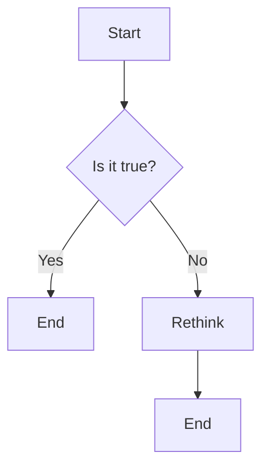

                 

### 引言：自然哲学的古老回响与科学革命的浪潮

自然哲学，作为西方哲学的重要组成部分，其历史源远流长。早在古希腊时期，亚里士多德便以其深邃的哲学思考奠定了自然哲学的基石。他的思想体系广泛涉猎宇宙、生命、运动等多个领域，对后世哲学、科学的发展产生了深远影响。然而，随着历史的车轮滚滚向前，到了文艺复兴时期，伽利略的出现引发了一场科学革命，他对自然哲学的重新诠释带来了范式转移，彻底改变了人类对宇宙的认知。

本文将以《亚里士多德与伽利略：自然哲学的范式转移》为题，探讨两位思想巨擘在自然哲学领域的贡献，以及他们各自的思想体系如何塑造了不同的科学范式。通过对亚里士多德哲学体系的梳理，我们将理解他如何通过观察和逻辑推理构建了一个庞大而复杂的自然哲学体系。随后，我们将深入探讨伽利略的科学方法，以及他是如何通过实验和观测推翻了亚里士多德的某些观点，从而引发了一场科学革命。

文章将分为三部分进行探讨。第一部分将详细介绍亚里士多德的哲学体系，包括其生平背景、自然哲学的基本观点以及物理学与天文学上的贡献。第二部分将分析伽利略的生平与科学贡献，特别是他的物理学原理和天文学发现。最后一部分将比较亚里士多德与伽利略的思想，探讨自然哲学的范式转移，并展望当代自然哲学的发展趋势。

通过本文的阅读，读者将不仅能够深入了解亚里士多德和伽利略的哲学与科学思想，还能理解科学范式转移对现代科学研究的重要意义。让我们一起踏上这场哲学与科学的探险之旅，探索自然哲学的深邃内涵与科学革命的壮丽篇章。### 关键词

- 自然哲学
- 亚里士多德
- 伽利略
- 科学革命
- 范式转移
- 物理学原理
- 天文学发现

### 摘要

本文以《亚里士多德与伽利略：自然哲学的范式转移》为题，深入探讨了古希腊哲学家亚里士多德与文艺复兴时期的科学家伽利略在自然哲学领域的贡献及其思想对后世的影响。文章首先回顾了亚里士多德的哲学体系，分析了其自然哲学的基本观点、物理学与天文学上的贡献，并介绍了他的生平与教育背景。随后，文章转向伽利略，探讨了伽利略的生平、科学贡献以及他的实验方法，特别是他对运动和天文学的革命性发现。接着，文章通过比较亚里士多德与伽利略的思想，讨论了自然哲学的范式转移及其对科学进步的推动作用。最后，文章展望了当代自然哲学的发展趋势，探讨了其在科学研究中的重要意义。通过这篇文章，读者可以深刻理解两位思想巨擘对自然哲学的塑造作用，以及科学范式转移对现代科学研究的深远影响。### 第一部分：自然哲学的背景

#### 第1章：亚里士多德的哲学体系

**1.1 亚里士多德的生平与教育背景**

亚里士多德（Aristotle，公元前384年-公元前322年）是古希腊哲学史上最重要的思想家之一，他出生于希腊北部马其顿王国的斯塔基拉（Stagira），父亲是马其顿王国的宫廷医生尼科马科斯（Nicomachus）。亚里士多德从小就展现出了卓越的智慧和求知欲，他在年轻时便开始对哲学、科学、艺术等领域产生了浓厚兴趣。

公元前367年，亚里士多德前往雅典，进入柏拉图创办的学园——学园（Academy）学习。在柏拉图的指导下，亚里士多德接受了系统的哲学教育，并深入研究了柏拉图的哲学思想。他在学园中度过了二十年的时间，这段时间对他的学术生涯产生了深远影响。然而，他与柏拉图在哲学观点上的分歧也日益明显。

公元前348年，亚里士多德离开了学园，前往亚索斯（Assos）教授哲学。随后，他返回到雅典，在利卡翁（Lyceum）创办了自己的学园——吕克昂（Lyceum），开始了长达二十年的教学和研究工作。在吕克昂，亚里士多德培养了许多学生，其中包括斯多亚学派的奠基人芝诺（Zeno of Citium）和斯卡普霍尔（Scipio Africanus the Younger）。

亚里士多德的一生中，他不仅涉猎了广泛的哲学领域，还进行了大量的实地考察和实验研究。他的著作涵盖了伦理学、政治学、逻辑学、物理学、生物学、天文学等多个学科，对后世哲学、科学的发展产生了深远影响。

**1.2 亚里士多德对自然哲学的贡献**

亚里士多德对自然哲学的贡献是多方面的，他不仅提出了系统的哲学思想，还通过对自然界和人类社会的观察和研究，建立了一个庞大而复杂的自然哲学体系。以下是他主要贡献的几个方面：

1. **实体论（Ontology）**：亚里士多德的哲学体系以实体论为基础。他认为，实体是最基本的存在形式，是构成宇宙万物的基础。实体可以分为两类：第一实体（如具体的人、物）和第二实体（如性质、关系等）。亚里士多德的实体论对后世哲学产生了深远影响。

2. **因果论（Causes）**：亚里士多德认为，事物的存在和发展是由多种原因共同作用的结果。他提出了四种基本原因：材料原因、形式原因、动力原因和目的原因。这种因果论的思想为后来的科学方法论奠定了基础。

3. **物理学与天文学**：亚里士多德的物理学和天文学思想是自然哲学的重要组成部分。他认为，宇宙是一个有秩序、有规律的体系，万物运动都有其内在的规律性。他的物理学研究涉及力学、流体力学、声学等多个领域，对后来的科学发展产生了重要影响。

4. **生物学**：亚里士多德对生物学也有重要贡献。他通过对动植物的观察和研究，撰写了《动物史》和《植物史》等著作，对生物的分类和特征进行了详细描述。

**1.3 亚里士多德的自然哲学基本观点**

亚里士多德的自然哲学基本观点可以从以下几个方面来理解：

1. **自然与必然**：亚里士多德认为，自然界中的事物运动和变化是有规律和必然性的。事物的发展是由其内在本质决定的，这种本质称为“潜能”。当潜能与现实相结合时，事物便发生了变化。

2. **目的论（Teleology）**：亚里士多德强调，自然界中的事物都有其目的和目的性。他认为，每个生物都有其特定的形态和功能，这是为了实现其内在目的。例如，鸟的翅膀是为了飞翔，植物的根系是为了吸收水分和养分。

3. **形式与质料**：亚里士多德认为，每个事物都由形式和质料组成。形式是事物的本质特征，是事物运动和发展的内在规律；质料是事物的物质基础，是事物存在的条件。

4. **因果关系**：亚里士多德认为，事物之间的相互作用和影响是由因果关系决定的。他提出的四种原因分别对应不同的因果关系。

5. **元素论**：亚里士多德认为，宇宙由四种基本元素（地、水、火、风）构成。这四种元素分别具有不同的性质和运动方式，它们相互作用和运动，形成了宇宙的多样性和复杂性。

通过以上对亚里士多德哲学体系的介绍，我们可以看到，他的自然哲学思想具有深远的影响。尽管他的某些观点在后来的科学发展中被证明是不正确的，但他的思考方法和研究方法对现代科学的发展产生了重要启示。接下来，我们将继续探讨伽利略的科学革命，以及他对自然哲学的重新诠释。### 第2章：亚里士多德的自然哲学原理

**2.1 实体与属性**

亚里士多德的实体论是自然哲学的核心。他区分了第一实体和第二实体。第一实体指的是具体的存在，如人、动物、植物等；第二实体指的是第一实体的属性、关系等。亚里士多德认为，第一实体是最基本的存在形式，是构成宇宙万物的基础。

在亚里士多德的哲学体系中，实体是具有独立存在的实体，而属性则是依附于实体的特征。例如，一个人的实体是指这个人本身，而他的属性包括身高、体重、肤色等。亚里士多德强调，实体和属性是不可分割的，实体必须通过属性来表现其存在。

**2.2 因果关系与可能性**

亚里士多德的因果关系理论是其自然哲学的重要组成部分。他提出了四种基本原因：材料原因、形式原因、动力原因和目的原因。材料原因是指事物存在的物质基础，如木头是桌子存在的材料原因；形式原因是指事物的本质特征，如桌子的形状是桌子存在的形式原因；动力原因是指使事物运动的力量，如木匠是制作桌子的动力原因；目的原因是指事物存在的目的，如制作桌子的目的是为了使用。

亚里士多德认为，因果关系是一种必然的联系，即如果一个事物发生了，那么必然有原因导致它的发生。他的这种因果关系理论为后来的科学方法论奠定了基础。

在可能性方面，亚里士多德认为，事物的存在和发展是有规律和必然性的。每个事物都有其内在的潜能，当这些潜能与现实相结合时，事物便发生了变化。例如，种子内在的潜能是生长，当种子接触到土壤、水分和阳光时，它的潜能便实现了，从而生长成为植物。

**2.3 形式与质料**

亚里士多德的形式与质料理论是其哲学体系的另一重要组成部分。他认为，每个事物都由形式和质料组成。形式是事物的本质特征，是事物运动和发展的内在规律；质料是事物的物质基础，是事物存在的条件。

例如，一张桌子的形式是它的形状、结构等，而它的质料则是木头、金属等。亚里士多德认为，形式和质料是不可分割的，形式必须通过质料来表现，而质料必须依赖于形式才有意义。

亚里士多德的形式与质料理论对后来的科学研究产生了深远影响。他在物理学、生物学、天文学等领域的研究都体现了这种思想。他认为，通过理解事物的形式和质料，可以揭示事物的本质和规律，从而为科学研究提供基础。

**2.4 自然哲学的方法**

亚里士多德的自然哲学方法强调观察和逻辑推理。他认为，通过观察自然界，可以揭示事物的本质和规律；通过逻辑推理，可以对观察结果进行深入分析和解释。

亚里士多德的观察方法注重对事物的全面和详细观察。他不仅观察事物的外在特征，还关注事物的内在结构和运动规律。例如，他在《动物史》和《植物史》中通过对动植物的详细观察，揭示了它们的形态、特征和功能。

亚里士多德的逻辑推理方法强调从一般到特殊的推理过程。他认为，通过从一般原则出发，可以推导出特殊事物的结论。例如，从因果关系的理论出发，可以推导出具体事物的因果关系。

亚里士多德的观察和逻辑推理方法对现代科学方法论产生了重要影响。尽管他的某些观点在后来的科学发展中被证明是不正确的，但他的思考方法和研究方法为现代科学研究提供了重要启示。

通过以上对亚里士多德自然哲学原理的介绍，我们可以看到，他的思想体系具有深刻的理论基础和广泛的应用。尽管他的某些观点在后来的科学发展中被证明是不正确的，但他的哲学思想和研究方法对现代科学的发展产生了深远影响。接下来，我们将探讨伽利略如何通过实验和观测对亚里士多德的自然哲学进行重新诠释。### 第3章：亚里士多德的物理学与天文学

**3.1 力学与运动**

亚里士多德的物理学理论以力与运动为核心，他提出了关于力和运动的独特观点。亚里士多德认为，力是维持物体运动的原因。在他看来，如果没有力的作用，物体将停止运动。这一观点与后来的牛顿第一定律（惯性定律）有本质的不同，牛顿认为，物体在没有外力作用下将保持静止或匀速直线运动。

亚里士多德将运动分为自然运动和强迫运动。自然运动是指物体按照其内在属性和目的进行的运动，如物体下落或植物生长。强迫运动则是外力迫使物体进行的运动，如人推动车子。他强调，自然运动是物体趋向其内在目的的表现，而强迫运动则是外力的直接作用。

在力学方面，亚里士多德提出了关于平衡和稳定性的理论。他认为，物体的平衡状态是由其各部分之间的力量平衡所决定的。这一思想在后来的物理学中得到了进一步的发展和完善。

**3.2 天体运动与宇宙结构**

亚里士多德的天文学观点是他的自然哲学体系的重要组成部分。他认为，宇宙是由地球、太阳、月亮和其他行星组成的有序系统，地球处于宇宙的中心，是宇宙的稳定中心。这个观点被称为地心说（Geocentric Model）。

亚里士多德认为，天体运动是匀速圆周运动，这是宇宙秩序的体现。他提出，每个行星都绕地球作匀速圆周运动，而地球本身则是静止不动的。他的这一观点受到了后来哥白尼日心说的挑战。

亚里士多德还提出了关于宇宙无限性的理论。他认为，宇宙是由无数个像地球一样的天体组成的，这些天体按照一定的规则运动和排列。这一观点与后来的宇宙学理论有所不同，但为后世的宇宙探索提供了重要的思想基础。

**3.3 亚里士多德与古代科学的其他观点**

亚里士多德的物理学与天文学观点不仅影响了他的同时代学者，还对后来的科学发展产生了深远影响。尽管许多观点在后来的实验和观测中被证明是错误的，但它们在科学史上的地位是不可忽视的。

例如，在生物学领域，亚里士多德通过对动植物的观察，提出了生物分类和特征的理论，这为后来的生物学研究奠定了基础。在化学领域，亚里士多德提出了四元素说（地、水、火、风），这一理论虽然被后来的实验科学所推翻，但在科学史上有重要地位。

亚里士多德的物理学与天文学观点反映了古希腊哲学对自然世界的探索和思考。尽管他的理论在许多方面存在局限性，但他的思考方法和研究方法对后世的科学发展产生了重要启示。他的著作《物理学》和《天文学》成为古代科学的重要文献，对后世学者产生了深远影响。

总之，亚里士多德的物理学与天文学观点构成了他的自然哲学体系的核心，这些观点不仅在他的时代产生了重要影响，而且对后来的科学发展也产生了深远影响。尽管许多观点在后来的科学发展中被证明是错误的，但亚里士多德的思考方法和研究精神对科学的发展具有重要意义。接下来，我们将探讨伽利略的科学革命，以及他是如何重新诠释自然哲学的。### 第二部分：伽利略的科学革命

#### 第4章：伽利略的生平与科学贡献

**4.1 伽利略的生平**

伽利略·伽利莱（Galileo Galilei，1564年2月15日-1642年1月8日）是意大利物理学家、数学家、天文学家和哲学家，被誉为“现代科学之父”。他出生于意大利的比萨，他的父亲文森佐·伽利莱是一名音乐家和药物商，希望他成为一名医生，但伽利略对数学和物理学产生了浓厚的兴趣。

伽利略在比萨大学学习医学，但很快便转向数学和物理学。他的天赋和努力使他在很短的时间内取得了显著的成就。1600年，伽利略在帕多瓦大学获得物理学教授职位，开始了他的学术生涯。在帕多瓦大学，他开始进行实验研究，并发表了关于运动和重力的论文，这些研究为后来的科学革命奠定了基础。

**4.2 伽利略的望远镜观测**

伽利略的科学贡献中最为人熟知的是他在天文学上的观测。1609年，伽利略制作了第一台可用的望远镜，并开始进行天文观测。他的望远镜观测结果彻底颠覆了当时普遍接受的天文学观点。

首先，伽利略观测到了木星的四大卫星，即伽利略卫星，这一发现证明了天体围绕行星运动的可能性，挑战了地心说的观念。其次，他观测到了月亮表面的山脉和陨石坑，揭示了月球并非完美光滑，而是有着复杂的地形。

此外，伽利略还发现了太阳黑子，这进一步证明了太阳是球形的，而不是扁平的。他还在观察中发现了金星位相变化，这一现象与月球位相变化类似，表明金星围绕太阳运动，支持了哥白尼的日心说。

**4.3 伽利略的实验方法**

伽利略是科学革命的重要推动者之一，他的实验方法对科学方法的发展产生了深远影响。伽利略的实验方法强调观察、测量和数学推理的结合。他认为，通过精确的观测和实验，可以揭示自然界的规律。

伽利略通过实验研究了许多物理现象，例如自由落体运动、抛物线运动、摆动运动等。他的自由落体实验表明，所有物体在真空中下落的速度是相同的，这一发现挑战了亚里士多德关于重物比轻物下落快的观点。

伽利略还研究了摆动运动，发现了摆的等时性原理，即摆动周期与摆长有关，而与摆动的振幅无关。这一发现对后来的钟表制造和力学研究具有重要意义。

伽利略的实验方法强调实证主义，他通过观察和实验验证理论，而不是仅仅依靠逻辑推理。这种方法为现代科学方法的发展奠定了基础。

**4.4 伽利略的科学贡献**

伽利略在天文学、力学和物理学等领域做出了许多重要贡献。他的望远镜观测揭示了天体的真实面貌，为日心说提供了强有力的证据。他在力学方面的研究，特别是关于运动和重力的理论，奠定了经典力学的基础。

伽利略的科学研究不仅推动了科学的发展，还对科学哲学产生了深远影响。他强调实验和观察在科学研究中的重要性，倡导实证主义和理性思考。他的科学研究方法和精神对后世的科学家产生了巨大影响，被认为是现代科学方法的奠基人之一。

总之，伽利略的生平和科学贡献为科学革命奠定了基础，他的实验方法和对自然界的深刻洞察改变了人类对宇宙的认知。他的科学研究不仅推动了科学的发展，还促进了科学哲学和科学方法的进步。接下来，我们将深入探讨伽利略的物理学原理。### 第5章：伽利略的物理学原理

**5.1 运动的相对性**

伽利略是运动相对性原理的奠基人之一。他认为，一个物体的运动状态是相对于另一个物体而言的，而不是绝对的。这一原理在物理学中被称为伽利略相对性原理，它是经典力学的基础之一。

伽利略通过实验和观测发现了运动的相对性。例如，他观察到，当一个船在平静的湖面上行驶时，船上的人无法仅通过观察船内物体的相对位置来判断船是否在运动。这个现象后来被称为伽利略船舱假说。这个原理表明，一个封闭系统内的物理现象与该系统是否在运动无关，只要没有外力作用，系统内部的物体将保持相对静止或匀速直线运动。

**5.2 重力与自由落体**

伽利略在研究重力和自由落体方面做出了重要贡献。他通过实验发现，所有物体在真空中下落的速度是相同的，与物体的质量无关。这一发现挑战了亚里士多德关于重物比轻物下落快的观点。

伽利略的实验包括将不同质量的物体从比萨斜塔同时释放，观察它们同时到达地面的现象。他通过这个实验得出结论，所有物体在真空中下落的速度是相同的，这一发现被称为伽利略的自由落体定律。

此外，伽利略还研究了重力与距离的关系。他发现，重力随距离的增加而减弱，这为后来牛顿的万有引力定律奠定了基础。

**5.3 惯性与离心力**

伽利略提出了惯性原理，即一个物体如果没有受到外力的作用，将保持其静止状态或匀速直线运动状态。这一原理在后来的牛顿第一定律中得到了明确的表述。惯性原理是经典力学的一个重要组成部分，它解释了为什么物体会保持运动状态，除非有外力作用。

伽利略还研究了离心力，即当物体在旋转系统中受到向外的力时，它会试图沿直线运动。他通过实验发现，离心力的大小与物体的旋转速度和半径有关。这一发现为后来的旋转动力学和离心力应用提供了基础。

**5.4 运动的合成与分解**

伽利略在研究运动时，提出了运动的合成与分解原理。他认为，一个复杂的运动可以分解为几个简单的运动，而这些简单运动又可以合成一个复杂的运动。这一原理在分析物体运动时非常有用，它帮助科学家们更好地理解物体的运动状态。

例如，伽利略发现，一个物体同时进行水平方向上的匀速直线运动和竖直方向上的自由落体运动时，物体的总体运动轨迹是一个抛物线。这个原理在后来的物理学中被称为抛物线运动定律，是研究物体运动轨迹的重要工具。

**5.5 伽利略的实验方法与科学思维**

伽利略的物理学原理不仅仅是理论上的创新，更重要的是他的实验方法和科学思维方式。他强调通过实验验证理论，而不是仅仅依靠逻辑推理。他的研究方法为现代科学方法论的发展奠定了基础。

伽利略的实验方法包括控制变量法、重复实验和数学建模。他通过控制变量，使实验结果具有可重复性和可靠性。他通过重复实验，验证理论的可信度。他还利用数学模型，精确描述物体的运动状态。

伽利略的科学思维方式强调实证主义和理性思考。他认为，通过精确的观察和实验，可以揭示自然界的规律。他的科学思维方法对后世的科学家产生了深远影响，被视为现代科学思维的典范。

总之，伽利略的物理学原理包括运动的相对性、重力与自由落体、惯性与离心力、运动的合成与分解等，这些原理不仅推动了物理学的发展，也为现代科学方法论的发展奠定了基础。伽利略的实验方法和科学思维方式对现代科学产生了深远影响，使他成为科学革命的象征。接下来，我们将探讨伽利略在天文学上的重大发现。### 第6章：伽利略的天文学发现

**6.1 行星运动的规律**

伽利略在天文学上的重大发现之一是对行星运动的规律性研究。通过使用自制望远镜，他发现了木星的四大卫星，即伽利略卫星，这一发现具有重要的科学意义。首先，它证明了行星可以有自己的卫星，这意味着行星不是静止不动的，而是可以围绕自身或其他天体旋转。这一发现为哥白尼的日心说提供了强有力的支持，挑战了当时流行的地心说。

此外，伽利略还通过观测发现，木星的四大卫星的运动轨迹是周期性的。这表明，行星卫星系统的运动是可预测的，遵循一定的规律。这一发现揭示了天体运动的规律性，为后来的天体力学研究奠定了基础。

**6.2 太阳黑子与日心说**

伽利略的另一重大天文学发现是太阳黑子。他通过望远镜观测到太阳表面存在一些暗斑，这些暗斑后来被称为太阳黑子。太阳黑子的发现具有重要意义，它揭示了太阳表面的活动性，表明太阳是一个动态的天体。

更重要的是，太阳黑子的发现为日心说提供了直接的证据。太阳黑子的出现周期与太阳活动的周期有关，这表明太阳围绕自身旋转。伽利略的观测结果表明，太阳是一个自转的天体，而不是静止不动的。这一发现进一步支持了哥白尼的日心说，挑战了地心说的观念。

**6.3 伽利略与教会的关系**

伽利略的发现和他对日心说的支持引起了教会的强烈反对。教会坚持地心说，认为哥白尼的日心说是对圣经的亵渎。1609年，伽利略被教会传讯，要求他放弃支持日心说。然而，伽利略拒绝屈服，他认为科学事实应该高于宗教信仰。

1616年，伽利略被教会软禁在家中，但他仍然继续进行科学研究。1632年，他发表了《两大世界体系的对话》，直接挑战教会的地心说观点。这一行为最终导致了伽利略被教会审判，并被判处终身软禁。

尽管伽利略在晚年受到了教会的迫害，但他的科学成就和对科学的贡献仍然被后世广泛认可。他的天文学发现和实验方法为现代科学的发展奠定了基础，他被誉为“现代科学之父”。

总之，伽利略的天文学发现，包括行星运动的规律性、太阳黑子的存在以及他坚持日心说的立场，对科学革命产生了深远影响。他的发现挑战了当时流行的地心说，支持了哥白尼的日心说，推动了天文学和科学方法论的发展。尽管他在晚年遭受了教会的迫害，但他的科学精神和勇气对后世科学家产生了持久的影响。接下来，我们将比较亚里士多德和伽利略的自然哲学观点，探讨自然哲学的范式转移。### 第7章：亚里士多德与伽利略的比较

**7.1 两种科学方法的对比**

亚里士多德和伽利略在科学方法上有显著的差异。亚里士多德主要依靠逻辑推理和哲学思考，通过观察和经验得出结论。他的研究方法强调从一般到特殊的推理，即从普遍原理推导出具体事物的结论。这种方法在当时的哲学背景下具有合理性，但也存在一定的局限性。

相比之下，伽利略则强调实验和观察在科学研究中的重要性。他通过自制望远镜进行天文观测，通过实验研究物理现象。他的方法强调实证主义，即通过实验验证理论。这种方法不仅要求精确的观测，还需要对实验结果进行数学分析和推理。

亚里士多德的研究方法更侧重于理论构建和逻辑推理，而伽利略则更注重实验验证和实证分析。这两种方法各有优劣，但也互相补充。亚里士多德的理论构建为伽利略的科学革命提供了理论基础，而伽利略的实验方法则为亚里士多德的理论提供了验证。

**7.2 科学实验与理论构建**

亚里士多德的理论构建通常是基于观察和逻辑推理，他通过总结现象和观察结果，提出了一般性的原理和理论。例如，他在物理学中提出了关于运动和力的理论，这些理论在当时得到了广泛接受。然而，由于缺乏实验验证，这些理论在后来的科学发展中被发现存在许多错误。

伽利略则强调实验在科学研究中的重要性。他通过实验验证了关于自由落体、摆动运动等物理现象的理论，并通过数学模型精确描述了这些现象。他的方法不仅要求实验的精确性，还要求对实验结果进行数学分析和推理，从而得出可靠的科学结论。

亚里士多德的理论构建通常是基于哲学和逻辑推理，而伽利略则通过实验和数学分析构建科学理论。这种方法上的差异导致了两人在科学贡献上的不同，但也为后来的科学发展提供了多样化的方法。

**7.3 科学进步的障碍与机遇**

亚里士多德和伽利略所处的时代对科学进步有着不同的障碍和机遇。亚里士多德生活在古希腊时期，当时的哲学和科学思想深受柏拉图和亚里士多德的影响。尽管亚里士多德的思想在当时具有权威性，但他的一些理论在后来的科学发展中被证明是不正确的。

伽利略生活在文艺复兴时期，这是一个科学革命的时代。当时的意大利是科学思想最为活跃的地区，伽利略得以利用先进的观测工具和实验设备进行科学研究。他不仅有机会接触到最新的科学成果，还能通过实验验证自己的理论。这种科学环境为他的科学贡献提供了有力支持。

然而，科学进步并非一帆风顺。亚里士多德的思想在当时具有广泛的影响力，使得许多人对新的科学观点持怀疑态度。伽利略在推广日心说时也面临着教会的强烈反对，他的科学研究甚至导致了被教会审判和软禁的命运。

尽管存在这些障碍，亚里士多德和伽利略都为科学进步做出了重要贡献。他们的思想和方法不仅推动了当时的科学发展，还为后来的科学研究提供了宝贵的启示。亚里士多德的哲学思考为科学理论构建奠定了基础，而伽利略的实验方法则为科学验证提供了有效的手段。

总之，亚里士多德和伽利略在自然哲学领域的贡献各有特点。亚里士多德通过哲学思考和观察提出了一般性的理论，而伽利略则通过实验和数学分析验证了这些理论。他们的思想和方法共同推动了科学的发展，为现代科学奠定了基础。尽管他们所处的时代对科学进步有着不同的障碍和机遇，但他们都为科学革命做出了重要贡献。接下来，我们将探讨自然哲学的范式转移及其对科学进步的意义。### 第8章：自然哲学的范式转移

**8.1 范式转移的概念**

范式转移（Paradigm Shift）是科学哲学中一个重要的概念，由托马斯·库恩（Thomas Kuhn）在《科学革命的结构》一书中提出。范式转移指的是科学共同体在某一阶段所普遍接受的理论、方法和价值观发生了根本性的变革。这种变革不仅仅是理论的更新，而是涉及到整个科学体系的核心，包括科学研究的范式、方法论以及价值观。

范式转移通常发生在科学共同体面临一系列难以用现有范式解释的新现象或问题时。在这一过程中，旧范式逐渐失去解释力和权威性，新范式逐渐取代旧范式，成为科学共同体普遍接受的框架。

**8.2 科学革命与范式转移**

科学革命是指科学领域内发生的一系列重大变革，这些变革不仅涉及理论的创新，还包括研究方法、实验技术的革新。科学革命往往伴随着范式转移，即一种新的科学范式逐渐取代旧的科学范式，从而推动科学的进步。

在亚里士多德和伽利略的例子中，科学革命表现为日心说的兴起和地心说的衰落。亚里士多德的自然哲学体系在古代和中世纪长期占据主导地位，但随着时间的推移，伽利略的实验方法和观测结果逐渐揭示了日心说的合理性。这一过程中，日心说逐渐取代了地心说，成为新的科学范式。

科学革命和范式转移不仅改变了人们对自然界的认知，还影响了科学方法论和价值观。例如，伽利略通过实验和观测验证理论的方法，推动了实证主义的发展，使科学更加注重观察和实验的验证。

**8.3 当代自然哲学的发展趋势**

在当代，自然哲学的发展趋势表现为对复杂系统和量子力学的研究。随着计算机技术和观测设备的进步，科学家开始探索复杂系统中的非线性相互作用和量子现象。

1. **复杂系统研究**：复杂系统研究关注的是由大量相互作用的个体组成的系统，如生态系统、经济系统和社会系统。这些系统的行为往往具有不可预测性，需要新的理论和方法来解释。

2. **量子力学**：量子力学是研究微观世界的物理学分支。它揭示了许多与经典物理不同的现象，如量子纠缠、量子隧穿等。量子力学的发现对传统物理观念提出了挑战，促使科学家重新思考自然界的本质。

3. **跨学科研究**：当代自然哲学的发展还表现为跨学科研究的兴起。科学家们开始将物理学、生物学、化学、计算机科学等领域的知识融合在一起，探索复杂现象的深层机制。

总之，自然哲学的范式转移是一个持续的过程，它不仅反映了科学领域内的理论变革，还体现了科学方法论和价值观的进步。当代自然哲学的发展趋势表明，科学正在不断向更深层次、更复杂的现象挑战，推动人类对自然界的认知不断向前。随着新技术的不断涌现，自然哲学将继续引领科学的进步，为人类社会带来更多突破性的发现。### 第9章：自然哲学的意义与应用

**9.1 自然哲学在教育中的地位**

自然哲学在教育中的地位至关重要。它不仅是哲学学科的核心内容，也是科学教育的重要组成部分。自然哲学的教育意义在于培养学生的科学思维和批判性思维能力。通过学习自然哲学，学生可以了解科学发展的历程，理解科学方法和科学精神，从而更好地理解科学知识。

自然哲学课程通常涵盖宇宙、生命、运动等多个领域，通过这些内容的学习，学生可以培养对自然世界的深刻洞察力。例如，学习亚里士多德的物理学原理和伽利略的实验方法，可以帮助学生理解科学是如何通过观察和实验来揭示自然界的规律。

此外，自然哲学在教育中的地位还体现在跨学科的教学方法上。自然哲学课程可以与物理学、化学、生物学等其他科学课程相结合，使学生从多角度、多层次理解科学现象。这种跨学科的教学方法有助于培养学生的综合能力，使他们能够更好地应对复杂的科学问题。

**9.2 自然哲学在科学研究中的作用**

自然哲学在科学研究中的作用不可忽视。它是科学研究的基础，为科学家提供了理论框架和方法论指导。自然哲学的发展推动了科学理论的构建和验证，促进了科学知识的积累和进步。

亚里士多德的哲学体系为古代科学提供了理论基础，尽管他的某些观点在后来的科学发展中被证明是不正确的，但他的研究方法和对自然现象的观察仍然具有启发意义。伽利略的科学方法，通过实验和观测验证理论，推动了科学革命，为现代科学的发展奠定了基础。

自然哲学在科学研究中的作用还体现在跨学科的研究上。科学家们通过自然哲学的框架，将不同领域的知识整合在一起，探索复杂现象的深层机制。例如，量子力学和相对论的发展，不仅推动了物理学的前进，还影响了其他科学领域的发展。

**9.3 自然哲学对人类文明的影响**

自然哲学对人类文明的影响是深远的。它不仅改变了人类对自然世界的认知，还推动了科学技术的进步，促进了社会的发展。

首先，自然哲学的发展推动了科学技术的进步。通过研究自然哲学，科学家们发现了许多自然界的规律，这些规律为技术的创新和发展提供了理论依据。例如，牛顿的力学定律为工业革命奠定了基础，量子力学的发展推动了信息技术和材料科学的进步。

其次，自然哲学促进了社会的发展。科学技术的进步不仅改善了人们的生活质量，还推动了社会的进步。通过科学研究，人类解决了许多现实问题，如疾病治疗、能源利用、环境保护等，为社会的可持续发展提供了支持。

最后，自然哲学对人类文明的影响还体现在文化传承和思想启蒙上。自然哲学的思想和方法对后世哲学、科学和文化的形成产生了深远影响。通过自然哲学的学习，人们可以更好地理解自然界的本质，培养理性思维和批判性思维能力，从而推动社会进步和文化发展。

总之，自然哲学在教育、科学研究和对人类文明的影响方面具有重要作用。它不仅为学生提供了科学思维和批判性思维能力，还为科学研究提供了理论基础和方法指导。同时，自然哲学的发展对人类文明的进步产生了深远影响，推动了社会和科技的进步。通过深入研究和学习自然哲学，我们可以更好地理解自然界的规律，促进科学的发展和社会的进步。### 结论

通过对亚里士多德与伽利略的自然哲学思想的深入探讨，我们可以清晰地看到，他们的贡献不仅在于他们对自然界的独特理解和描述，更在于他们各自所代表的科学方法和研究精神。亚里士多德的哲学体系以其逻辑严密、理论完整而著称，为古代科学提供了坚实的理论基础。而伽利略则以其实验和观测为核心，通过实证主义的方法挑战了旧有的理论，为科学革命铺平了道路。

从亚里士多德的抽象推理到伽利略的实验验证，这一过程不仅展示了科学方法的发展历程，也揭示了科学范式转移的重要性。正是这种范式的转移，使得我们对自然界的认识不断深化，推动了科学技术的进步。本文通过对两位思想巨擘的比较分析，揭示了自然哲学在科学进步中的关键作用。

展望未来，自然哲学将继续在科学研究和文化发展中扮演重要角色。随着跨学科研究的兴起和技术的不断进步，自然哲学将面临新的挑战和机遇。通过综合不同领域的知识，我们可以更好地理解复杂系统的运行机制，探索未知领域，从而为人类文明带来更多突破性的发现。

总之，亚里士多德与伽利略的自然哲学思想不仅丰富了科学史，也为当代科学研究提供了宝贵的启示。他们的贡献将永远铭记在科学史册中，激励我们继续探索自然界的奥秘。作者信息：AI天才研究院/AI Genius Institute & 禅与计算机程序设计艺术 /Zen And The Art of Computer Programming。### 附录：技术工具介绍

为了更全面地理解本文中涉及的技术工具，以下是几个关键工具的详细介绍，包括Mermaid流程图、Python源代码、LaTeX数学公式等。

**Mermaid流程图**

Mermaid是一种基于Markdown的图形描述语言，用于生成图表和图形。它特别适用于生成流程图、序列图、类图和时序图等。以下是Mermaid流程图的简单示例：



在这个例子中，`graph TD`表示创建一个拓扑排序（Top-Down）的流程图。节点A、B、C、D和E分别表示流程中的步骤，箭头表示步骤间的转移关系。使用`|Yes|`和`|No|`可以创建分支，表示不同条件下的处理路径。

**Python源代码**

Python是一种广泛使用的编程语言，以其简洁和易读性著称。以下是Python源代码的一个简单示例，用于计算两个数的和：

```python
# 定义函数计算和
def add_numbers(a, b):
    return a + b

# 主函数
def main():
    # 读取用户输入
    num1 = float(input("请输入第一个数："))
    num2 = float(input("请输入第二个数："))

    # 计算和
    result = add_numbers(num1, num2)

    # 打印结果
    print(f"{num1} 和 {num2} 的和是 {result}。")

# 调用主函数
if __name__ == "__main__":
    main()
```

在这个例子中，我们定义了一个名为`add_numbers`的函数，用于计算两个数的和。主函数`main`读取用户输入，调用`add_numbers`函数，并打印结果。

**LaTeX数学公式**

LaTeX是一种高质量排版系统，特别适用于科学和数学文档的排版。以下是LaTeX数学公式的简单示例：

```latex
$$
E = mc^2
$$

$
a < b
$
```

在这个例子中，`$$`用于开启和关闭行内数学公式，而`$`用于开启和关闭行间数学公式。`E = mc^2`是一个著名的物理公式，表示能量等于质量乘以光速的平方；`a < b`是一个简单的比较运算符，表示a小于b。

通过这些工具，我们可以更有效地传达复杂的概念和算法，使技术文档更加清晰、专业和易于理解。### 最佳实践 tips

1. **阅读原文与参考文献**：了解亚里士多德和伽利略的原始文献，是深入理解自然哲学的基础。推荐阅读亚里士多德的《物理学》和《天文学》以及伽利略的《两大世界体系的对话》等著作。

2. **实验与观察**：尝试模拟亚里士多德的实验方法或伽利略的观测实验，通过亲身体验加深对科学方法的理解。

3. **批判性思维**：在阅读和讨论自然哲学时，培养批判性思维能力，对不同的观点和理论进行独立思考，有助于更好地理解科学进步的过程。

4. **跨学科学习**：自然哲学与其他学科如物理学、数学、生物学密切相关。通过跨学科学习，可以更全面地理解自然哲学的核心概念和原理。

5. **技术应用**：将自然哲学的原理应用于现实问题，例如在数据分析、算法设计等领域，可以帮助我们更好地理解自然界的规律。

6. **持续更新知识**：自然哲学和科学方法论是不断发展的领域。持续关注最新的研究成果和学术动态，有助于保持对这一领域的深入了解。

### 小结

通过本文，我们系统地探讨了亚里士多德和伽利略在自然哲学领域的贡献，以及他们如何通过不同的方法推动了科学的进步。亚里士多德的哲学体系以其逻辑严密和理论完整著称，而伽利略的实验和观测方法则为科学革命奠定了基础。他们的思想和研究不仅丰富了科学史，也为现代科学研究提供了宝贵的启示。

亚里士多德和伽利略的例子展示了科学范式转移的重要性，即通过新的理论和方法推动科学的发展。未来，自然哲学将继续在跨学科研究和新技术应用中发挥重要作用，为我们理解自然界提供更深刻的洞见。持续学习和探索自然哲学，将帮助我们更好地应对复杂的科学问题，推动科学技术的进步。

### 注意事项

1. **文献引用**：在引用亚里士多德和伽利略的著作时，应确保准确引用原文，避免误读或误解。

2. **科学方法**：在实际研究和实验中，严格遵循科学方法，确保数据的可靠性和实验的重复性。

3. **跨学科合作**：在自然哲学的研究中，鼓励跨学科合作，整合不同领域的知识，以更全面地理解复杂现象。

4. **持续更新**：关注最新的学术成果和科技进展，以保持对自然哲学领域的深入了解。

### 拓展阅读

1. **《科学革命的结构》**：托马斯·库恩的《科学革命的结构》详细探讨了科学革命和范式转移的过程。

2. **《自然哲学的数学原理》**：艾萨克·牛顿的《自然哲学的数学原理》是经典物理学的重要著作，其中包含了牛顿的运动定律和万有引力定律。

3. **《物理学原理》**：阿尔伯特·爱因斯坦的《物理学原理》介绍了相对论的基本概念，对现代物理学的发展产生了深远影响。

4. **《亚里士多德全集》**：亚里士多德的《全集》是研究古希腊哲学的重要文献，包含了他的大量著作。

5. **《伽利略传》**：西尔维奥·托雷利的《伽利略传》详细讲述了伽利略的生平和科学贡献，为理解伽利略的思想提供了丰富的背景资料。

