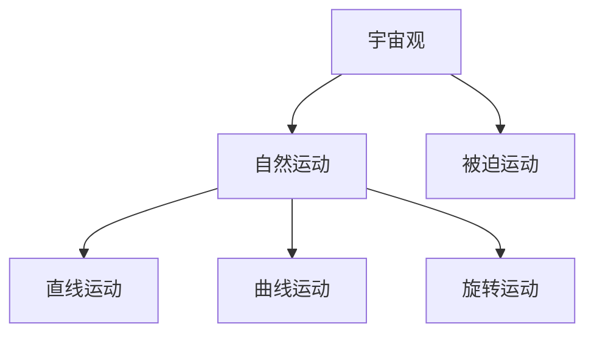
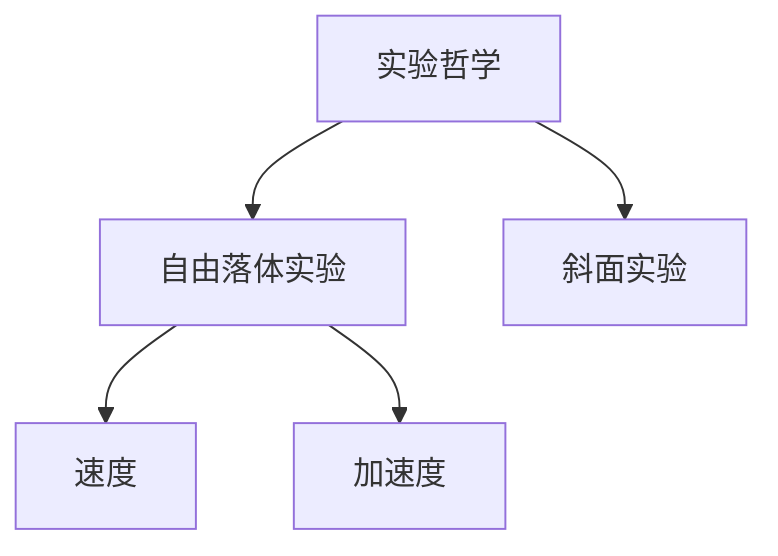
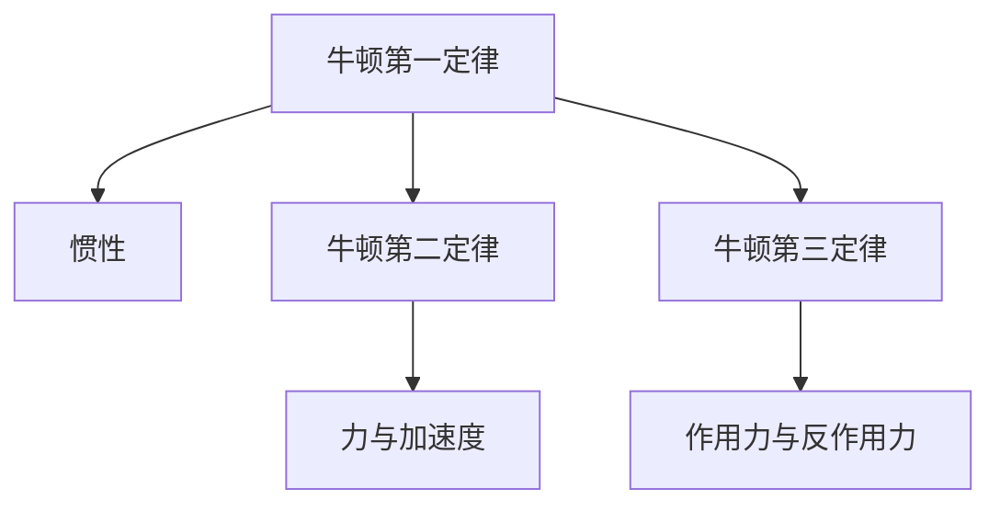

                 

# 亚里士多德与伽利略：运动理论的革命

> 关键词：亚里士多德、伽利略、运动理论、革命、实验方法、力学、加速度

> 摘要：本文将探讨古代哲学家亚里士多德与文艺复兴时期的科学家伽利略对运动理论的贡献，分析两者理论之间的差异与联系。文章将通过历史的视角，深入剖析两位科学巨匠的理论体系，以及他们如何通过实验方法挑战并推动物理学的发展。最终，我们将总结牛顿如何在此基础上形成更完整的物理学体系，并对现代物理学的理论发展进行展望。

---

## 第一部分：亚里士多德的运动理论

### 第1章：亚里士多德与古代物理学

#### 1.1 亚里士多德的宇宙观

亚里士多德（Aristotle）是古希腊的著名哲学家，他的宇宙观对后世的物理学产生了深远的影响。亚里士多德认为宇宙是一个由多个天体组成的有序系统，地球位于中心，而其他天体则围绕地球旋转。这一观点被称为地心说（geocentric model）。

#### 1.2 亚里士多德对运动的理解

亚里士多德对运动的理解基于他的物理哲学。他区分了两种类型的运动：自然运动和被迫运动。自然运动是物体在其自然状态下的运动，例如，石头会自动下落，而火焰会上升。被迫运动则是物体在外力作用下的运动，如推车。

#### 1.3 亚里士多德的运动分类

亚里士多德将运动分为三种类型：直线运动、曲线运动和旋转运动。他认为直线运动是最自然的运动形式，而曲线运动和旋转运动则是被迫的。

### 第2章：亚里士多德的力学理论

#### 2.1 静止与运动的关系

亚里士多德认为，静止是运动的一种形式，而运动则是物体从静止状态转变而来的。他提出了一个观点，即物体必须受到外力作用才能持续运动，没有外力作用，物体将停止运动。

#### 2.2 力的概念

在亚里士多德的理论中，力是一个导致物体运动或改变物体运动状态的原因。他认为，力是一种推动或拉动物体的力量。

#### 2.3 重力与运动

亚里士多德认为，重力是导致物体下落的力，它使得物体从高处向低处运动。他观察到，在没有其他力干扰的情况下，物体总是向下落。

## 第二部分：伽利略的实验方法与运动理论

### 第3章：伽利略的实验方法

#### 3.1 伽利略的实验哲学

伽利略·伽利莱（Galileo Galilei）是文艺复兴时期的科学家，他被誉为现代科学的奠基人之一。伽利略提出了实验哲学（experimental philosophy）的概念，即通过实验验证理论，而不是仅仅依靠逻辑推理。

#### 3.2 自由落体实验

伽利略进行了著名的自由落体实验，他发现，在没有空气阻力的情况下，所有物体的下落速度是相同的。这一发现挑战了亚里士多德的观点，即重物比轻物下落得快。

#### 3.3 斜面实验

伽利略还进行了斜面实验，他观察到，物体在斜面上滚下的速度随时间的平方增加。这一结果为他提出了加速度的概念提供了实验依据。

### 第4章：伽利略的运动理论

#### 4.1 速度与加速度

伽利略定义了速度和加速度的概念。他认为，速度是物体在单位时间内移动的距离，而加速度是速度随时间的变化率。

#### 4.2 运动的等时性

伽利略发现，物体在斜面上的运动时间与斜面的倾角无关，这表明了运动的等时性原理。

#### 4.3 平抛运动

伽利略还研究了平抛运动，他发现，平抛运动的水平分量和垂直分量是独立的，且物体的轨迹是一个抛物线。

## 第三部分：亚里士多德与伽利略的争论

### 第5章：亚里士多德与伽利略的论战

#### 5.1 争论的背景

亚里士多德的理论在当时的学术界占据主导地位，伽利略的实验方法与理论挑战了这一传统观点，引发了激烈的争论。

#### 5.2 争论的焦点

争论的焦点主要集中在自由落体定律和运动规律上，伽利略认为物体下落速度与重量无关，而亚里士多德则认为重物比轻物下落得快。

#### 5.3 争论的结果与影响

尽管伽利略在当时并未完全赢得争论，但他的实验方法和理论观点为后来的科学革命铺平了道路。他的工作激发了牛顿的研究，并最终导致了经典力学的建立。

### 第6章：牛顿综合

#### 6.1 牛顿的物理学观点

艾萨克·牛顿（Isaac Newton）是17世纪英国伟大的物理学家和数学家，他的工作将亚里士多德和伽利略的理论综合为统一的体系。

#### 6.2 牛顿的运动定律

牛顿提出了三个运动定律，这些定律描述了物体如何受力以及如何运动。第一个定律描述了惯性，第二个定律定义了力和加速度的关系，第三个定律描述了作用力与反作用力的原理。

#### 6.3 牛顿对亚里士多德与伽利略理论的总结

牛顿的工作将亚里士多德关于力的概念和伽利略的加速度概念结合起来，形成了一个完整的力学理论体系。

### 第7章：现代物理学中的亚里士多德与伽利略

#### 7.1 量子力学与相对论的挑战

尽管牛顿的理论在经典物理学领域取得了巨大成功，但现代物理学，如量子力学和相对论，对其提出了新的挑战。

#### 7.2 亚里士多德与伽利略理论的现代意义

尽管亚里士多德和伽利略的理论在现代物理学中不再适用，但它们在科学方法论和物理学思想的发展中仍具有深远的意义。

#### 7.3 运动理论的未来方向

随着对宇宙和物质本质的深入了解，运动理论将继续发展，未来可能会出现新的理论体系来解释我们尚未发现的物理现象。

## 附录

### 附录A：亚里士多德与伽利略运动理论图解

#### 7.1 亚里士多德运动理论架构图

#### 7.2 伽利略运动理论架构图

#### 7.3 牛顿综合运动理论架构图

## 参考文献

1. 亚里士多德，《物理学》，古希腊文原著。
2. 伽利略，《关于运动的新科学》，意大利文原著。
3. 牛顿，《自然哲学的数学原理》，英文原著。

---

作者：AI天才研究院/AI Genius Institute & 禅与计算机程序设计艺术 /Zen And The Art of Computer Programming

