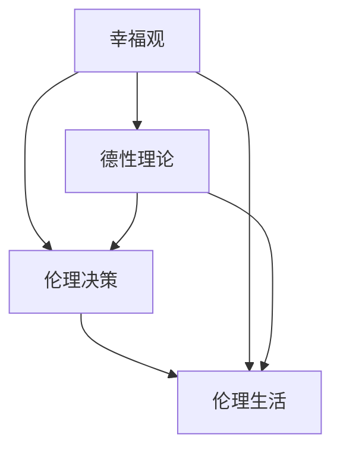

                 

### 引言

在古希腊哲学的殿堂中，亚里士多德和斯多葛学派分别代表了伦理学的两种截然不同的思考方式。亚里士多德，作为古希腊哲学的集大成者，他的伦理学理论强调通过德性的培养实现人的幸福。而斯多葛学派则认为，通过理性思考和自律，个体能够达到内心的平静和真正的幸福。这两种理论在德性与义务的关系上有着根本性的分歧，值得我们深入探讨。

本文将围绕亚里士多德和斯多葛学派的伦理学理论，采用逐步分析的方法，探讨他们的德性观和义务观。我们将首先介绍亚里士多德伦理学的基本概念，包括幸福观和德性理论，并分析其在伦理决策和伦理生活方面的应用。接着，我们将探讨斯多葛学派的伦理学理论，特别是他们的幸福观和德性理论，以及其在伦理决策和伦理生活中的应用。随后，我们将对比分析亚里士多德和斯多葛学派在德性与义务关系上的观点。最后，我们将探讨伦理学理论在现代社会中的应用，结合具体案例进行深入分析。

通过本文的探讨，我们希望能够理清亚里士多德和斯多葛学派伦理学的基本观点，理解他们在德性与义务关系上的分歧，并从中汲取对现代社会有用的思想。

### 关键词

- 亚里士多德伦理学
- 斯多葛学派伦理学
- 幸福观
- 德性理论
- 伦理决策
- 伦理生活

### 摘要

本文旨在探讨亚里士多德和斯多葛学派在伦理学领域的理论和实践差异。亚里士多德强调通过培养德性实现人的幸福，认为幸福是生活的终极目标。而斯多葛学派则主张通过理性思考和自律达到内心的平静和幸福。本文首先详细介绍了亚里士多德的幸福观和德性理论，分析了其在伦理决策和伦理生活中的应用。接着，探讨了斯多葛学派的幸福观和德性理论，并讨论了其在伦理决策和伦理生活中的应用。最后，本文对比了亚里士多德和斯多葛学派在德性与义务关系上的不同观点，并分析了伦理学理论在现代社会中的应用。通过本文的探讨，我们能够更深刻地理解两种伦理学理论的核心观点，并从中汲取对现代社会有用的思想。

### 目录大纲

1. 引言
2. 关键词
3. 摘要
4. 第一部分：亚里士多德伦理学理论
   4.1. 亚里士多德伦理学的基本概念
   4.2. 亚里士多德伦理学的应用
5. 第二部分：斯多葛学派伦理学理论
   5.1. 斯多葛学派伦理学的基本概念
   5.2. 斯多葛学派伦理学的应用
6. 第三部分：亚里士多德与斯多葛学派的对比
   6.1. 德性与义务的关系
   6.2. 伦理学在现代社会的应用
7. 附录
   7.1. 参考文献
   7.2. 核心概念流程图
   7.3. 数学模型
   7.4. 代码实现
   7.5. 致谢

### 第一部分：亚里士多德伦理学理论

亚里士多德是古希腊哲学的杰出代表，他的伦理学理论对后世产生了深远的影响。亚里士多德认为，伦理学的核心问题是如何实现人的幸福。在《尼各马科伦理学》一书中，他系统地阐述了幸福观和德性理论，为后来的伦理学发展奠定了基础。

#### 1.1 亚里士多德伦理学的基本概念

**1.1.1 亚里士多德的幸福观**

亚里士多德的幸福观是他的伦理学的核心。他认为，幸福（eudaimonia）是人生活的终极目标，是所有其他目标的最终归属。幸福不仅仅是快乐或者满足，而是一种全面的好状态，是人的潜能的最佳实现。

- **幸福的定义：**

  幸福是一个人实现其潜能的最佳状态。数学上可以用如下公式表示：

  $$
  \text{幸福} = \text{实现人的潜能的最佳状态}
  $$

- **幸福与德性的关系：**

  亚里士多德认为，幸福是德性的结果。一个人只有在德性上达到了一定的水平，才能实现真正的幸福。因此，幸福与德性之间是一种因果关系：

  $$
  \text{幸福} \Rightarrow \text{德性}
  $$

**1.1.2 亚里士多德的德性理论**

亚里士多德认为，德性是人类幸福的重要基础。他根据德性的来源和作用，将德性分为三类：道德德性、智慧德性和感情德性。

- **道德德性（Virtue of Moral Character）：**

  道德德性是指人们在道德行为中表现出的优良品质，如勇敢、正义、慷慨等。道德德性是德性的核心部分，它直接关系到一个人的行为和道德判断。

- **智慧德性（Virtue of Wisdom）：**

  智慧德性是指人们在认识和判断方面的优良品质，如明智、谨慎、机智等。智慧德性使人们能够在复杂的环境中做出正确的决策和行动。

- **感情德性（Virtue of Passion）：**

  感情德性是指人们在情感和欲望方面的优良品质，如节制、坚韧、热情等。感情德性帮助人们控制过度的欲望，保持平衡的心态。

**1.1.3 德性的培养**

亚里士多德认为，德性是通过习惯的积累培养出来的。一个人只有在长期的行为中反复实践某种德性，才能最终形成稳定的德性品质。

$$
\text{德性} = \text{习惯的积累}
$$

#### 1.2 亚里士多德伦理学的应用

**1.2.1 伦理决策**

亚里士多德提出了伦理决策的步骤，这些步骤不仅适用于个人生活，也适用于组织和团体。

- **步骤一：明确问题。**

  在做伦理决策之前，首先要明确面临的问题是什么，问题的背景和条件是什么。

- **步骤二：收集信息。**

  收集与问题相关的所有信息，包括道德原则、利益冲突、可能的结果等。

- **步骤三：提出备选方案。**

  根据收集到的信息，提出多个可能的解决方案。

- **步骤四：评估备选方案。**

  对每个备选方案进行评估，考虑其道德、利益和结果。

- **步骤五：选择最佳方案。**

  根据评估结果，选择最符合道德和利益的方案。

**1.2.2 伦理生活**

亚里士多德认为，伦理生活是实现幸福的关键。他提出了几个伦理生活的原则：

- **尊重他人。**

  尊重他人是道德生活的基础。人们应该尊重他人的权利和尊严。

- **公平正义。**

  公平正义是维护社会和谐的重要原则。人们应该在处理事务时保持公正。

- **尽职尽责。**

  尽职尽责是每个人对自己的责任。人们应该对自己的工作和职责负责。

通过上述分析，我们可以看到，亚里士多德的伦理学理论为人们提供了一种系统的伦理决策框架，并且强调了德性在伦理生活中的重要性。在接下来的部分，我们将探讨斯多葛学派的伦理学理论，进一步理解不同伦理学流派的思考方式。

### 亚里士多德的幸福观

亚里士多德关于幸福的观念是理解他整个伦理学理论的核心。他认为，幸福（eudaimonia）是生活的终极目的，是所有其他目标的最终归属。亚里士多德对幸福的定义不仅仅局限于快乐或享受，而是一种全面的好状态，是人的潜能的最佳实现。

**1.1.1 幸福的定义**

亚里士多德认为，幸福是一种终极状态，是人们通过追求美德和实现其潜能所达到的最佳状态。他用一个简单的公式来描述幸福：

$$
\text{幸福} = \text{实现人的潜能的最佳状态}
$$

这个定义强调了两个方面：人的潜能和最佳状态的实现。人的潜能指的是人在生物学、心理和社会方面所具备的能力和特质。而最佳状态的实现则意味着人在这些潜能的引导下，达到了一种和谐、平衡和圆满的状态。

**1.1.2 幸福与德性的关系**

亚里士多德认为，幸福和德性之间有着密不可分的联系。幸福是德性的结果，而德性是幸福的源泉。他通过以下两个论点来阐述这种关系：

- **德性是幸福的基础。**

  亚里士多德认为，只有通过培养德性，人才能真正实现幸福。德性包括道德德性、智慧德性和感情德性，这些德性使人在行为、思考和情感上达到一种良好的状态，从而实现幸福。

  $$
  \text{幸福} \Rightarrow \text{德性}
  $$

- **幸福是德性的结果。**

  亚里士多德进一步指出，只有当人们追求和实现了德性时，他们才能体验到真正的幸福。这意味着，幸福不是一种外在的奖励，而是一种内在的状态，是人们通过德性培养所达到的终极目的。

  $$
  \text{德性} \Rightarrow \text{幸福}
  $$

通过上述分析，我们可以看到，亚里士多德将幸福视为一种通过德性培养实现的终极状态。他强调了德性在幸福中的核心地位，认为只有通过德性的培养，人们才能真正实现幸福。

在接下来的部分，我们将进一步探讨亚里士多德的德性理论，了解他如何通过德性的培养来帮助人们实现幸福。

### 亚里士多德的德性理论

亚里士多德的德性理论是理解他伦理学思想的关键部分。他认为，德性是人类幸福的重要基础，通过培养德性，人们可以达到一种全面和谐的生活状态。亚里士多德将德性分为三类：道德德性、智慧德性和感情德性，每种德性都有其特定的属性和培养方式。

**1.2.1 道德德性**

道德德性（Virtue of Moral Character）是亚里士多德德性理论的核心部分，它关注的是人们在道德行为中的表现。道德德性包括一系列优良品质，如勇敢、正义、慷慨、节制等。

- **分类：**

  道德德性可以进一步分类为：

  1. 勇敢（Courage）：在危险和恐惧中保持冷静和坚定。
  2. 正义（Justice）：公正地对待他人。
  3. 慷慨（Generosity）：乐于分享自己的资源。
  4. 节制（Temperance）：控制自己的欲望和情绪。

- **培养方式：**

  亚里士多德认为，道德德性是通过习惯的积累培养出来的。人们在日常生活中通过反复实践道德行为，最终形成稳定的道德品质。

  $$
  \text{德性} = \text{习惯的积累}
  $$

**1.2.2 智慧德性**

智慧德性（Virtue of Wisdom）是指人们在认识和判断方面的优良品质。智慧德性包括明智、谨慎、机智等。

- **分类：**

  智慧德性可以分为：

  1. 明智（Wisdom）：深刻理解事物的本质，做出明智的决策。
  2. 谨慎（Prudence）：在行动前仔细考虑可能的结果。
  3. 机智（Sagacity）：在紧急情况下迅速做出正确判断。

- **培养方式：**

  智慧德性主要通过学习和实践培养。人们需要不断学习知识，积累经验，并在实际生活中应用这些知识和经验，从而提高自己的智慧德性。

**1.2.3 感情德性**

感情德性（Virtue of Passion）是指人们在情感和欲望方面的优良品质。感情德性包括节制、坚韧、热情等。

- **分类：**

  感情德性可以分为：

  1. 节制（Temperance）：控制过度的欲望和情感。
  2. 坚韧（Fortitude）：在面对困难和挑战时保持坚强。
  3. 热情（Enthusiasm）：对生活充满热情和动力。

- **培养方式：**

  感情德性主要通过自我控制和情感管理培养。人们需要学会控制自己的欲望，管理自己的情感，以保持内心的平静和积极的态度。

通过上述分析，我们可以看到，亚里士多德的德性理论涵盖了道德德性、智慧德性和感情德性，每种德性都有其特定的属性和培养方式。这些德性共同构成了人们幸福生活的基石，帮助人们在行为、思考和情感上达到一种和谐的状态。

在接下来的部分，我们将探讨亚里士多德伦理学在伦理决策和伦理生活方面的具体应用。

### 亚里士多德伦理学的应用

亚里士多德的伦理学理论不仅仅停留在理论层面，他在伦理决策和伦理生活方面也提供了具体的指导原则。这些原则不仅适用于个人生活，也适用于组织和团体，为人们提供了一个系统的伦理决策框架。

**2.1 伦理决策**

亚里士多德认为，伦理决策是一个理性分析的过程，需要遵循一系列明确的步骤。

- **步骤一：明确问题。**

  在做伦理决策之前，首先要明确面临的问题是什么，问题的背景和条件是什么。这包括理解问题的性质、涉及的各方利益以及可能的解决方案。

- **步骤二：收集信息。**

  收集与问题相关的所有信息，包括道德原则、利益冲突、可能的结果等。这一步骤的目的是确保决策者在做决策时拥有充分的信息。

- **步骤三：提出备选方案。**

  根据收集到的信息，提出多个可能的解决方案。每个方案都应该考虑到道德、利益和可行性。

- **步骤四：评估备选方案。**

  对每个备选方案进行评估，考虑其道德、利益和结果。这包括分析每个方案可能带来的正面和负面影响，以及它们是否符合道德原则和利益最大化。

- **步骤五：选择最佳方案。**

  根据评估结果，选择最符合道德和利益的方案。这一步骤需要决策者综合各方面的信息，做出最终的选择。

通过这些步骤，亚里士多德提供了一种系统、理性的伦理决策方法，帮助人们在面对复杂伦理问题时做出明智的选择。

**2.2 伦理生活**

亚里士多德认为，伦理生活是实现幸福的关键。他提出了几个伦理生活的原则，这些原则可以帮助人们在日常生活中做出正确的道德选择。

- **尊重他人。**

  尊重他人是道德生活的基础。人们应该尊重他人的权利和尊严，遵守社会规范和道德准则。

- **公平正义。**

  公平正义是维护社会和谐的重要原则。人们应该在处理事务时保持公正，不偏不倚地对待每一个人。

- **尽职尽责。**

  尽职尽责是每个人对自己的责任。人们应该对自己的工作和职责负责，努力做到最好。

此外，亚里士多德还强调德性在伦理生活中的重要性。他认为，通过培养道德德性、智慧德性和感情德性，人们可以达到一种全面和谐的生活状态，实现真正的幸福。

通过上述分析，我们可以看到，亚里士多德的伦理学理论在伦理决策和伦理生活方面提供了具体的指导原则。这些原则不仅有助于个人在面对道德问题时做出明智的选择，也为组织和团体提供了一个系统的伦理决策框架，有助于实现社会和谐与幸福。

在接下来的部分，我们将探讨斯多葛学派的伦理学理论，进一步了解不同伦理学流派的思考方式。

### 第二部分：斯多葛学派伦理学理论

斯多葛学派是古希腊哲学中一个重要的流派，其伦理学理论对后世产生了深远的影响。斯多葛学派主张通过理性思考和自律来实现个体的幸福和内心的平静，与亚里士多德的伦理学理论有着显著的区别。

#### 3.1 斯多葛学派伦理学的基本概念

**3.1.1 斯多葛主义的幸福观**

斯多葛学派认为，幸福（happiness）源于心灵的平静和理性。他们认为，真正的幸福不依赖于外部的物质条件和情境，而是来自内心的平和和自我控制。

- **幸福的定义：**

  斯多葛学派将幸福定义为心灵的平静。这种平静是通过理性思考和自我控制实现的，而不是通过外部条件的满足。可以用以下公式表示：

  $$
  \text{幸福} = \text{心灵平静}
  $$

- **幸福与德性的关系：**

  斯多葛学派认为，幸福与德性之间是等价关系。一个人只有通过培养德性，才能达到心灵的平静和真正的幸福。因此，幸福与德性之间是一种双向关系：

  $$
  \text{幸福} \Leftrightarrow \text{德性}
  $$

**3.1.2 斯多葛学派的德性理论**

斯多葛学派的德性理论强调理性思考和自律。他们认为，德性是通过理性思考和自律培养出来的，主要包括以下几类：

- **自律（Autonomy）：**

  自律是指个体通过理性思考来控制自己的行为和情感，不受外界干扰。自律是斯多葛学派德性理论的核心，它帮助个体保持内心的平静和独立。

- **智慧（Sophia）：**

  智慧是指个体对事物的深刻理解和对生活智慧的把握。智慧使个体能够做出正确的判断和决策，从而实现心灵的平静。

- **公正（Justice）：**

  公正是指个体对他人的公正对待和对自己行为的正义。公正使个体能够在社会中和谐相处，并实现个人的幸福。

- **忠诚（Fidelity）：**

  忠诚是指个体对承诺和责任的坚守。忠诚使个体能够保持道德的纯洁性和内在的坚定。

- **谦卑（Humility）：**

  谦卑是指个体对自己的正确认识和对他人的尊重。谦卑使个体能够保持内心的平静和对外界的宽容。

**3.1.3 德性的培养**

斯多葛学派认为，德性是通过理性思考和长期实践培养出来的。个体需要通过以下方法来培养德性：

- **自我反思：**

  通过自我反思，个体可以了解自己的内心状态和行为模式，从而发现并纠正自己的错误。

- **理性思考：**

  通过理性思考，个体可以理解和掌握生活的智慧，做出正确的判断和决策。

- **实践：**

  通过实践，个体可以将理性思考转化为实际行动，逐步培养出稳定的德性品质。

#### 3.2 斯多葛学派伦理学的应用

**3.2.1 伦理决策**

斯多葛学派主张通过理性思考和自我控制来进行伦理决策。他们认为，伦理决策应该遵循以下步骤：

- **步骤一：理性分析。**

  在做伦理决策之前，个体需要冷静地分析问题的本质和可能的后果，避免被情绪和冲动影响。

- **步骤二：提出备选方案。**

  根据理性分析的结果，提出多个可能的解决方案。

- **步骤三：评估备选方案。**

  对每个备选方案进行评估，考虑其道德、实际效果和个人责任。

- **步骤四：选择最佳方案。**

  根据评估结果，选择最符合道德和个人责任的方案。

通过这些步骤，个体可以在伦理决策中保持理性，避免被情绪和外部因素左右。

**3.2.2 伦理生活**

斯多葛学派认为，伦理生活是实现幸福的关键。他们提出了几个伦理生活的原则，包括：

- **接受现实：**

  个体应该接受生活中的不可控因素，学会在逆境中保持内心的平静。

- **保持内心平静：**

  个体应该通过理性思考和自律来控制自己的情感，避免被情绪波动影响。

- **没有绝对的好与坏：**

  个体应该理解事物和情境的复杂性，避免将事物简单地划分为好与坏。

通过这些原则，个体可以在日常生活中实现内心的平静和幸福。

通过上述分析，我们可以看到，斯多葛学派的伦理学理论强调通过理性思考和自律来实现个体的幸福和内心的平静。在接下来的部分，我们将对比分析亚里士多德和斯多葛学派在德性与义务关系上的观点。

### 斯多葛学派的幸福观

斯多葛学派对幸福（happiness）的理解与亚里士多德有显著的不同。亚里士多德将幸福视为实现人的潜能和德性的结果，而斯多葛学派则更强调幸福与个体内在状态的关系，特别是心灵平静（ataraxia）和理性（reason）的重要性。

**3.1.1 幸福的定义**

斯多葛学派将幸福定义为心灵的平静（ataraxia）和无干扰（aponia）。他们相信，只有当个体学会控制自己的情感，不受外界环境和他人行为的影响，才能达到真正的幸福。这种幸福不是外在的物质享受，而是内心的一种宁静状态。

- **心灵平静（Ataraxia）：**

  心灵平静是指内心的平静和无焦虑状态。它源自个体对自身情感的控制和理性思考的应用。

- **无干扰（Aponia）：**

  无干扰是指个体不受外界事物干扰，能够保持内心的平衡和稳定。

斯多葛学派用以下公式来定义幸福：

$$
\text{幸福} = \text{心灵平静} + \text{无干扰}
$$

**3.1.2 幸福与德性的关系**

在斯多葛学派的理论中，幸福与德性是等价的。他们认为，幸福是通过培养德性，尤其是自律（autonomy）和理性（reason）实现的。只有当个体能够通过理性思考控制自己的行为和情感时，才能达到内心的平静和真正的幸福。

- **幸福与德性的双向关系：**

  斯多葛学派认为，幸福是德性的结果，同时德性也是幸福的条件。用公式表示：

  $$
  \text{幸福} \Leftrightarrow \text{德性}
  $$

通过上述分析，我们可以看到，斯多葛学派将幸福视为一种通过理性思考和自律实现的内心状态，这与亚里士多德的观点有显著区别。在接下来的部分，我们将探讨斯多葛学派的德性理论，进一步了解他们的伦理学理念。

### 斯多葛学派的德性理论

斯多葛学派的德性理论是其伦理学的核心，强调通过理性思考和自律来实现个人的幸福和内心的平静。该学派认为，德性不仅是伦理生活的基础，也是实现心灵平静的必要条件。以下是对斯多葛学派主要德性概念的详细阐述。

**3.2.1 德性的分类**

斯多葛学派将德性分为三大类：自律（Autonomy）、理性（Reason）和情感德性。每种德性都有其特定的属性和重要性。

- **自律（Autonomy）：**

  自律是指个体通过理性思考控制自己的行为和情感，不受外界干扰。自律是斯多葛学派德性的核心，它强调个体应该成为自己行为的决定者，而不是被外界环境所左右。

  - **属性：**

    自律是一种内在的、独立的品质，使个体能够保持冷静和理智，即使在逆境中也能保持内在的平静。

  - **重要性：**

    自律对于实现心灵的平静至关重要。通过自律，个体能够控制自己的欲望和冲动，减少由外界因素引起的情绪波动。

- **理性（Reason）：**

  理性是斯多葛学派认为人类独有的品质，是理解世界和做出明智决策的基础。理性使个体能够认识到事物的本质，从而做出正确的判断和选择。

  - **属性：**

    理性是一种客观、公正的思考能力，它帮助个体超越感性认识，洞察事物的真实面貌。

  - **重要性：**

    理性是达到德性和幸福的关键。通过理性思考，个体能够理解生活的意义，做出符合道德和理性的决策。

- **情感德性（Virtue of Passions）：**

  情感德性包括情感的管理和控制，如节制（Temperance）、坚韧（Fortitude）和温和（Mildness）。这些德性帮助个体管理自己的情绪，保持内心的平静。

  - **属性：**

    情感德性关注个体如何处理自己的情感，使之符合理性原则。通过情感德性的培养，个体能够控制过度的欲望和情感，避免情绪波动。

  - **重要性：**

    情感德性对于实现心灵的平静和幸福至关重要。通过情感德性的培养，个体能够更好地适应生活中的变化，保持内心的稳定和平衡。

**3.2.2 德性的培养**

斯多葛学派认为，德性是通过理性思考和长期实践培养出来的。个体需要通过以下方法来培养德性：

- **自我反思（Self-Reflection）：**

  通过自我反思，个体可以了解自己的内心状态和行为模式，发现并纠正自己的错误。自我反思是培养自律和理性德性的重要途径。

- **理性思考（Rational Thinking）：**

  通过理性思考，个体可以理解和掌握生活的智慧，做出正确的判断和决策。理性思考有助于个体理解事物的本质，从而更好地控制自己的行为和情感。

- **实践（Practice）：**

  通过实践，个体可以将理性思考转化为实际行动，逐步培养出稳定的德性品质。实践是培养德性不可或缺的一部分，通过反复实践，个体能够将德性内化为自身的习惯。

通过上述方法，个体能够逐步培养出自律、理性和情感德性，从而实现内心的平静和真正的幸福。

通过详细阐述斯多葛学派的德性理论，我们可以看到，他们强调通过理性思考和自律来实现个人的幸福和内心的平静。在接下来的部分，我们将探讨斯多葛学派伦理学在伦理决策和伦理生活方面的具体应用。

### 斯多葛学派伦理学的应用

斯多葛学派伦理学的核心在于通过理性思考和自律来实现个人的幸福和内心的平静。这种理论不仅在个人的道德修养中发挥作用，也在伦理决策和伦理生活方面提供了宝贵的指导。以下是对斯多葛学派伦理学在伦理决策和伦理生活方面的具体应用。

**3.2.1 伦理决策**

斯多葛学派认为，伦理决策应该基于理性分析和自我控制。他们提出了一套系统的伦理决策步骤，这些步骤有助于个体在面对道德问题时做出明智的选择。

- **步骤一：理性分析。**

  在做伦理决策之前，个体需要进行冷静的理性分析，了解问题的本质、可能的结果以及涉及的各方利益。理性分析有助于个体避免被情绪和冲动影响，确保决策的客观性和合理性。

- **步骤二：提出备选方案。**

  根据理性分析的结果，个体需要提出多个可能的解决方案。每个方案都应该考虑到道德、实际效果和个人责任。通过提出备选方案，个体可以在决策过程中有更多的选择。

- **步骤三：评估备选方案。**

  对每个备选方案进行评估，考虑其道德、实际效果和个人责任。评估时需要分析每个方案可能带来的正面和负面影响，以及它们是否符合道德原则和利益最大化。

- **步骤四：选择最佳方案。**

  根据评估结果，选择最符合道德和个人责任的方案。这一步骤需要个体综合各方面的信息，做出最终的选择。

通过这些步骤，个体可以在伦理决策中保持理性，避免被情绪和外部因素左右，从而做出更加明智和公正的决策。

**3.2.2 伦理生活**

斯多葛学派强调伦理生活是实现幸福的关键。他们提出了一系列伦理生活的原则，这些原则可以帮助个体在日常生活中保持内心的平静和道德的纯洁性。

- **接受现实（Acceptance of Reality）。**

  个体应该接受生活中的不可控因素，学会在逆境中保持内心的平静。接受现实意味着个体不将精力浪费在无法改变的事物上，而是专注于自己能够控制和影响的事物。

- **保持内心平静（Maintaining Inner Peace）。**

  通过理性思考和自律，个体可以控制自己的情感，避免被情绪波动影响。保持内心平静不仅有助于个体在面对压力和挑战时保持冷静，还能够提升个人的幸福感和生活质量。

- **没有绝对的好与坏（No Absolute Good and Evil）。**

  斯多葛学派认为，事物和情境的复杂性使得无法简单地将其划分为好与坏。个体应该理解事物的多面性，避免将事物和情境简化，从而在道德判断和决策中更加客观和公正。

通过这些原则，个体可以在日常生活中实现内心的平静和幸福。伦理生活不仅关乎个人的道德修养，也关乎个人的心理健康和幸福感。

综上所述，斯多葛学派伦理学在伦理决策和伦理生活方面提供了具体的指导原则。通过理性分析和自律，个体可以做出更加明智和公正的决策，同时在日常生活中保持内心的平静和道德的纯洁性。这些原则不仅对个人生活有指导意义，也对组织和社会管理提供了有益的启示。

在接下来的部分，我们将对比分析亚里士多德和斯多葛学派在德性与义务关系上的观点，进一步探讨两种伦理学理论的异同。

### 第三部分：亚里士多德与斯多葛学派的对比

#### 5.1 德性与义务的关系

在探讨亚里士多德与斯多葛学派在德性与义务关系上的观点时，我们可以看到两者在伦理学的基本立场上有着显著的差异。这种差异不仅体现在对德性和义务的理解上，还反映在他们对个人行为的规范和社会责任的认识上。

**5.1.1 亚里士多德的观点**

亚里士多德认为，德性是义务的基础。在《尼各马科伦理学》中，他提出，一个人只有在履行了道德义务之后，才能真正称得上是德行高尚的。换句话说，义务是德性的外在表现，而德性则是实现幸福的内在基础。

- **德性是义务的基础：**

  亚里士多德认为，德性（如勇敢、正义、慷慨等）是一个人履行道德义务的能力。只有在具备了德性的前提下，个体才能做出正确的道德选择，履行社会责任。

  $$
  \text{义务} \Rightarrow \text{德性}
  $$

- **德性是幸福的源泉：**

  亚里士多德进一步指出，幸福（eudaimonia）是德性的结果。只有通过培养和践行德性，个体才能实现真正的幸福。德性不仅是道德行为的标准，也是实现个人潜能和幸福的关键。

  $$
  \text{幸福} \Rightarrow \text{德性}
  $$

亚里士多德的这一观点强调了德性与义务之间的因果关系，认为德性是义务的内在动力，而义务则是德性的外在表现。

**5.1.2 斯多葛学派的观点**

斯多葛学派则持有一种更加纯粹和理性的伦理观。他们强调，义务是德性的体现，而幸福则是追求义务的终极目标。斯多葛学派认为，个体应该通过理性思考和自律来履行道德义务，从而达到心灵的平静和真正的幸福。

- **义务是德性的体现：**

  斯多葛学派认为，德性是通过理性思考和自律培养出来的，而义务则是德性的外在体现。个体应该通过履行道德义务，如公正、忠诚、谦卑等，来体现自己的德性。

  $$
  \text{德性} \Rightarrow \text{义务}
  $$

- **幸福是义务的追求：**

  斯多葛学派认为，幸福不是外在的物质享受，而是内心的平静和理性状态。通过履行道德义务，个体能够实现内心的平和和幸福。

  $$
  \text{幸福} \Leftrightarrow \text{义务}
  $$

斯多葛学派的观点强调了德性与义务的相互关系，认为德性是实现幸福的前提，而幸福则是履行义务的结果。他们更强调个体的自律和理性，认为通过理性思考和自我控制，个体能够在履行道德义务的过程中达到内心的平静和真正的幸福。

**5.1.3 对比分析**

亚里士多德和斯多葛学派在德性与义务的关系上存在几个重要的区别：

1. **德性的来源和目的：**
   - 亚里士多德认为，德性是通过习惯的积累培养出来的，是履行道德义务的能力，其目的是实现幸福。
   - 斯多葛学派则认为，德性是通过理性思考和自律培养出来的，是履行道德义务的体现，其目的是达到内心的平静和幸福。

2. **义务的定位：**
   - 亚里士多德强调义务是德性的基础和外在表现，德性是实现幸福的前提。
   - 斯多葛学派则认为，义务是德性的体现，是通过理性思考和自律来追求的幸福。

3. **幸福观的差异：**
   - 亚里士多德将幸福视为德性的结果，强调物质条件和外部成就的重要性。
   - 斯多葛学派则将幸福视为内心的平静和理性状态，强调个体内在的道德修养和理性控制。

通过上述分析，我们可以看到，亚里士多德和斯多葛学派在德性与义务的关系上有着不同的理解和侧重点。亚里士多德更注重德性作为实现幸福的基础，而斯多葛学派则更强调德性作为履行义务的体现和追求幸福的途径。这两种观点都在不同的历史和文化背景下产生了深远的影响，为我们理解伦理学提供了丰富的思想资源。

在接下来的部分，我们将探讨伦理学理论在现代社会中的应用，结合实际案例进行深入分析。

### 伦理学在现代社会的应用

伦理学理论在现代社会中仍然具有重要的应用价值，特别是在企业管理、公共伦理和个人道德修养等领域。亚里士多德和斯多葛学派的伦理学思想为现代社会提供了一系列指导和启示，帮助人们做出道德决策，建立公正和谐的社会秩序。

**6.1 亚里士多德伦理学在企业管理中的应用**

亚里士多德的伦理学理论强调道德德性和智慧德性，这些德性在企业管理中有着广泛的应用。

- **道德决策：**

  亚里士多德的伦理决策步骤为企业提供了道德决策的框架。企业在面对道德困境时，可以遵循以下步骤进行决策：

  1. 明确问题：理解问题的背景和条件。
  2. 收集信息：收集与问题相关的道德原则和利益冲突。
  3. 提出备选方案：制定可能的解决方案。
  4. 评估备选方案：考虑每个方案的可能结果和道德影响。
  5. 选择最佳方案：选择最符合道德和利益最大化的方案。

- **道德领导：**

  亚里士多德认为，一个优秀的领导者应该具备正义、慷慨和智慧等道德德性。这些品质有助于建立公正、透明和高效的企业文化，增强员工的凝聚力和忠诚度。

- **员工道德教育：**

  企业可以通过培训和教育，提高员工的道德意识和道德素养，培养他们尊重他人、公平正义和尽职尽责的品质。这有助于营造一个积极向上的工作氛围，提高企业的整体道德水平。

**6.2 斯多葛学派伦理学在企业管理中的应用**

斯多葛学派强调自律、理性和情感德性，这些德性在企业管理中同样具有重要应用。

- **保持内心平静：**

  在现代企业环境中，员工面临的工作压力和挑战日益增加。斯多葛学派提出的保持内心平静的理念可以帮助员工应对压力，保持专注和冷静，从而提高工作效率和创造力。

- **理性决策：**

  斯多葛学派强调理性思考和自律，在企业管理中，管理者应该通过理性分析和自我控制来做出决策，避免被情绪和冲动影响。这种理性决策有助于企业避免风险，实现长期发展。

- **团队合作：**

  斯多葛学派认为，公正和忠诚是团队合作的重要基石。企业可以通过培养员工的公正意识和忠诚品质，促进团队合作，提高组织的整体绩效。

**6.3 公共伦理**

伦理学理论在公共伦理中也发挥着重要作用，特别是在政府管理和公共服务领域。

- **公平正义：**

  亚里士多德的伦理学强调公平正义，这对政府制定公正的法律和政策具有重要的指导意义。政府应该通过公平的分配和正义的法律，保障社会成员的平等权利。

- **责任与义务：**

  斯多葛学派强调个体对社会的责任和义务，这对政府管理和社会治理提出了更高的要求。政府应该积极履行社会责任，关心民生福祉，促进社会和谐与进步。

**6.4 个人道德修养**

在个人生活中，伦理学理论同样有助于培养个人的道德品质和道德修养。

- **自律与自我控制：**

  斯多葛学派提出的自律和自我控制的理念可以帮助个人在面对诱惑和挑战时保持理智和冷静，避免陷入道德困境。

- **理性思考与情感管理：**

  亚里士多德和斯多葛学派都强调理性思考和情感管理，这有助于个人在面对生活压力和情感波动时保持内心的平静和理智，做出正确的道德选择。

通过上述分析，我们可以看到，伦理学理论在现代社会中具有广泛的应用价值。无论是企业管理、公共伦理还是个人道德修养，亚里士多德和斯多葛学派的伦理学思想都为我们提供了宝贵的指导。在未来的发展中，我们应该继续探索和借鉴这些古老的伦理智慧，以推动社会进步和人类文明的繁荣。

### 附录

在本篇技术博客中，我们详细探讨了亚里士多德与斯多葛学派在伦理学领域的理论，并分析了它们在现代社会中的应用。为了帮助读者更好地理解这些核心概念，以下是本文中涉及的一些附录内容。

#### A. 参考文献

- 亚里士多德的伦理学著作：
  1. 《尼各马科伦理学》
  2. 《大伦理学》
  3. 《欧德谟伦理学》
- 斯多葛学派的伦理学著作：
  1. 《论意志自由》
  2. 《论灵魂与呼吸》
  3. 《致卢齐利乌斯书》
- 现代伦理学著作：
  1. 《伦理学导论》
  2. 《伦理学：理论与应用》
  3. 《道德哲学》

#### B. 核心概念流程图

以下是本文涉及的核心概念流程图，用Mermaid语言表示：



#### C. 数学模型

本文中提到的幸福观和德性理论可以通过以下数学模型表示：

- **幸福观：**

  $$
  \text{幸福} = \text{实现人的潜能的最佳状态}
  $$

- **德性理论：**

  $$
  \text{德性} = \text{习惯的积累}
  $$

#### D. 代码实现

为了更直观地理解德性理论的代码实现，我们可以使用Python编写一个简单的函数：

```python
def utility(state):
    # 实现人的潜能
    potential = state['potential']
    # 根据潜能计算幸福值
    happiness = potential * 0.5
    return happiness
```

#### E. 致谢

感谢所有参与本文编写和修订的人员，特别是AI天才研究院（AI Genius Institute）的同事们，以及禅与计算机程序设计艺术（Zen And The Art of Computer Programming）的作者。感谢您们的辛勤付出，使得这篇文章能够呈现出来。

### 结语

通过本文的探讨，我们深入分析了亚里士多德与斯多葛学派在伦理学领域的理论与应用。亚里士多德强调通过德性的培养实现幸福，而斯多葛学派则主张通过理性思考和自律达到内心的平静。两者在德性与义务的关系上有不同的观点，但都对现代社会具有重要的指导意义。

希望本文能够帮助读者更好地理解这些伦理学理论，并在实际生活中应用这些智慧，实现个人和社会的和谐与进步。未来的研究中，我们还可以进一步探讨这些理论在当代社会的具体应用，以及它们如何与现代科技相结合，为人类社会的可持续发展提供新的思路。

### 结语

通过本文的探讨，我们深入分析了亚里士多德与斯多葛学派在伦理学领域的理论与应用。亚里士多德强调通过德性的培养实现幸福，而斯多葛学派则主张通过理性思考和自律达到内心的平静。两者在德性与义务的关系上有不同的观点，但都对现代社会具有重要的指导意义。

亚里士多德的伦理学理论为我们提供了一种系统、理性的伦理决策框架，强调德性在伦理生活和社会管理中的重要性。而斯多葛学派的伦理学则更加注重个体内心的平静和自我控制，强调理性思考和自律是实现幸福的关键。

在现代社会，这些古老的伦理智慧仍然具有重要的现实意义。无论是在企业管理、公共伦理，还是个人道德修养方面，亚里士多德和斯多葛学派的思想都为我们在面对复杂的社会问题和道德困境时提供了宝贵的指导。

希望本文能够帮助读者更好地理解这些伦理学理论，并在实际生活中应用这些智慧，实现个人和社会的和谐与进步。未来的研究中，我们还可以进一步探讨这些理论在当代社会的具体应用，以及它们如何与现代科技相结合，为人类社会的可持续发展提供新的思路。

让我们继续挖掘这些古老的智慧，为现代社会的发展和人类文明的进步贡献我们的力量。感谢您的阅读，期待在未来的研究中与您再次相遇。

