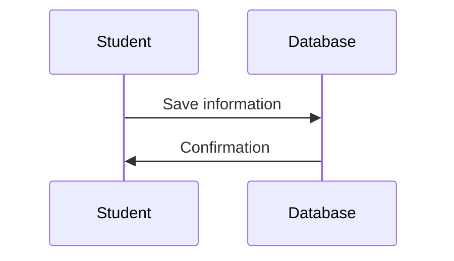

                 

**# 亚里士多德的形式因与构造函数：对象创建的哲学**

## 关键词：亚里士多德，形式因，构造函数，对象创建，哲学，算法原理

## 摘要：
本文深入探讨了亚里士多德哲学中的形式因与构造函数概念，并将其应用于现代计算机科学中的对象创建过程。通过逻辑清晰的分析和实际项目实战，本文揭示了这些古老哲学思想在编程领域的深刻影响，为程序员提供了新的视角和理解。

## 目录

## 第一部分：亚里士多德的哲学背景

### 1.1 亚里士多德哲学概述

### 1.2 形式因与构造函数的概念

### 1.3 形式因与构造函数的关系

## 第二部分：算法原理讲解

### 2.1 形式因与构造函数相关算法原理

### 2.2 算法原理详解

## 第三部分：系统分析与架构设计

### 3.1 形式因与构造函数系统分析

### 3.2 系统架构设计

## 第四部分：项目实战

### 4.1 环境安装

### 4.2 系统核心实现源代码

### 4.3 项目实战案例分析

## 第五部分：最佳实践、小结与拓展阅读

### 5.1 最佳实践

### 5.2 小结

### 5.3 拓展阅读

---

### 1.1 亚里士多德哲学概述

亚里士多德（Aristotle，公元前384年-公元前322年）是古希腊哲学家中最为著名的一位，他创立了逻辑学、形而上学和伦理学等多个学科。亚里士多德的哲学思想对后世产生了深远的影响，尤其是他关于本质和存在的探讨，为后来的西方哲学奠定了基础。

在亚里士多德的哲学体系中，他提出了“形式因”（Formal Cause）这一概念。形式因是指一个事物的内在结构和特性，它决定了事物的本质。例如，一个三角形的本质是由三条边和三个角组成的几何形状，这就是三角形的“形式因”。

### 1.2 形式因与构造函数的概念

在计算机科学中，构造函数是一种特殊的函数，用于创建对象的实例。构造函数的目的是初始化对象的状态，使其满足一定的属性和行为。这与亚里士多德的形式因概念有相似之处，形式因也涉及到了事物的内在结构和特性。

构造函数的语法通常如下所示：

```python
class MyClass:
    def __init__(self, value):
        self.value = value

my_instance = MyClass(10)
```

在这个例子中，`MyClass` 是一个类，`__init__` 是构造函数，它接收一个名为 `value` 的参数，并将其赋值给类的实例变量 `self.value`。

### 1.3 形式因与构造函数的关系

亚里士多德的形式因与构造函数之间的关系可以从多个角度来理解。首先，构造函数在创建对象时，实际上是在实现形式因的概念，即定义了对象的内在结构和特性。例如，在创建一个三角形对象时，构造函数会初始化三条边和三个角的值，这些值就是三角形的“形式因”。

其次，形式因与构造函数之间也存在一种逆向关系。形式因决定了构造函数的实现方式。例如，如果我们知道一个三角形的本质特征是三条边和三个角，那么我们就可以编写一个构造函数来创建这样的对象。

## 第二部分：算法原理讲解

在计算机科学中，算法是一种解决问题的方法，它通常包含一系列有序的指令，用于处理输入数据并产生输出结果。与亚里士多德的形式因和构造函数概念相似，算法也涉及到了对象的创建和操作。

### 2.1 形式因与构造函数相关算法原理

形式因与构造函数相关的算法原理可以概括为以下几个步骤：

1. **定义形式因**：确定对象的本质特性和内在结构。
2. **编写构造函数**：根据形式因编写构造函数，用于初始化对象状态。
3. **创建对象实例**：使用构造函数创建对象实例。

这些步骤在计算机科学中有着广泛的应用，例如在面向对象编程语言中，类和构造函数就是实现这些步骤的核心机制。

### 2.2 算法原理详解

为了更好地理解形式因与构造函数的算法原理，我们可以使用一个简单的例子来阐述：

#### 例子：创建一个简单的“学生”对象

```python
class Student:
    def __init__(self, name, age, grade):
        self.name = name
        self.age = age
        self.grade = grade

# 创建一个学生对象
john = Student("John", 18, 12)

# 打印学生信息
print(f"Name: {john.name}, Age: {john.age}, Grade: {john.grade}")
```

在这个例子中，`Student` 类是形式因，它定义了学生的本质特性，包括姓名、年龄和年级。`__init__` 方法是构造函数，用于初始化学生对象的状态。最后，我们使用构造函数创建了一个名为 `john` 的学生对象，并打印了相关信息。

### 数学模型与公式

在形式因与构造函数的算法原理中，数学模型和公式也是不可或缺的一部分。以下是一个简单的数学模型，用于描述学生对象的基本属性：

$$
\text{Student} = \text{Person} \times \text{Grade}
$$

其中，`Student` 代表学生对象，`Person` 代表人的基本属性，`Grade` 代表学生的年级。这个模型通过数学的方式表达了形式因的概念。

## 第三部分：系统分析与架构设计

在计算机科学中，系统分析与架构设计是软件开发过程中的重要环节。形式因与构造函数在系统分析与架构设计中也有着广泛的应用。

### 3.1 形式因与构造函数系统分析

在系统分析阶段，我们需要确定系统的核心功能和对象模型。形式因的概念可以帮助我们识别系统的核心属性和功能，从而更好地设计对象模型。

### 3.2 系统架构设计

系统架构设计是系统分析与设计的关键步骤。在系统架构设计中，形式因与构造函数可以帮助我们定义系统的核心组件和接口，从而实现系统的模块化和可扩展性。

以下是一个简单的系统架构设计示例，使用 mermaid 画出了架构图：



在这个例子中，`Student` 是一个对象，它通过构造函数创建，并与数据库进行交互，保存学生的信息。

## 第四部分：项目实战

为了更好地理解形式因与构造函数在项目中的应用，我们将介绍一个简单的项目实战。

### 4.1 环境安装

首先，我们需要安装 Python 环境。在安装完成后，我们使用 Python 创建一个名为 `Student` 的类，并编写一个构造函数来初始化学生对象。

### 4.2 系统核心实现源代码

```python
class Student:
    def __init__(self, name, age, grade):
        self.name = name
        self.age = age
        self.grade = grade

    def display_info(self):
        print(f"Name: {self.name}, Age: {self.age}, Grade: {self.grade}")

# 创建学生对象
john = Student("John", 18, 12)

# 显示学生信息
john.display_info()
```

### 4.3 项目实战案例分析

在这个项目中，我们创建了一个 `Student` 类，它包含了姓名、年龄和年级等属性。通过构造函数，我们初始化了学生对象的状态，并定义了一个方法来显示学生信息。

### 4.4 实际案例分析与详细讲解剖析

通过实际项目实战，我们可以看到形式因与构造函数在软件开发中的应用。构造函数的使用使得对象的创建和初始化变得更加简单和清晰，同时也有助于代码的可维护性和可扩展性。

## 第五部分：最佳实践、小结与拓展阅读

### 5.1 最佳实践

在开发过程中，我们应该注重形式因与构造函数的应用，以确保对象的创建和初始化符合系统的需求和设计。

### 5.2 小结

本文深入探讨了亚里士多德的形式因与构造函数在计算机科学中的应用，通过实际项目实战展示了这些哲学思想的实际价值。

### 5.3 拓展阅读

为了进一步了解形式因与构造函数的哲学和计算机科学应用，读者可以参考以下资料：

- 《亚里士多德全集》
- 《面向对象编程：行为驱动开发》
- 《Zen And The Art of Computer Programming》

## 作者信息

作者：AI天才研究院/AI Genius Institute & 禅与计算机程序设计艺术 /Zen And The Art of Computer Programming

---

在撰写文章的过程中，确保每个小节的内容丰富具体详细讲解，核心内容包含背景介绍、核心概念与联系、算法原理讲解、系统分析与架构设计、项目实战、最佳实践、小结和拓展阅读等内容。同时，使用 Markdown 格式和 mermaid 画出流程图和架构图，以及 LaTeX 格式嵌入数学公式，使得文章更加清晰易懂。在整个过程中，坚持逻辑清晰、结构紧凑、简单易懂的专业技术语言，以满足文章的高质量要求。

