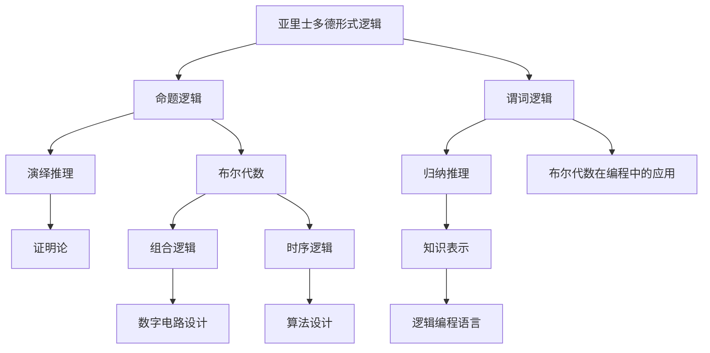
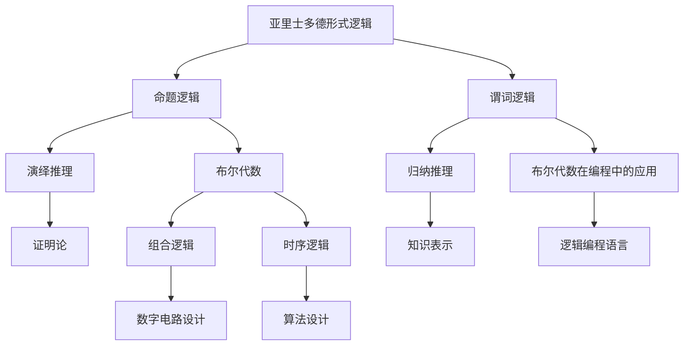
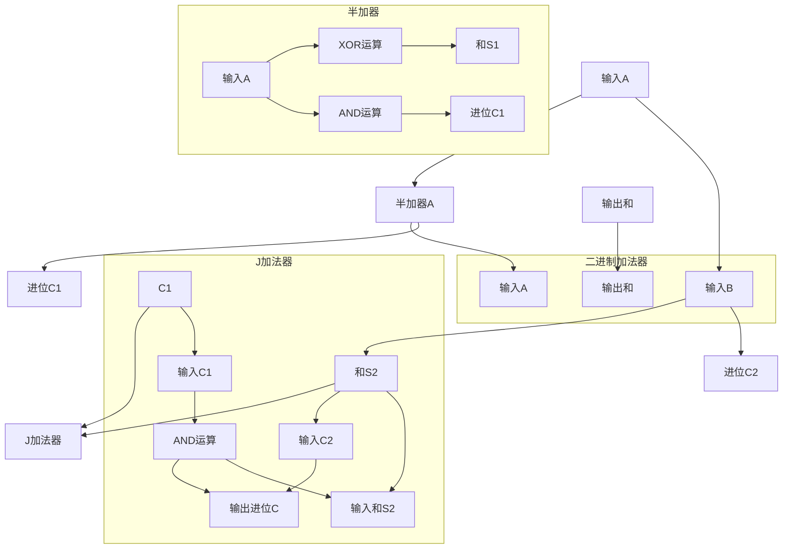
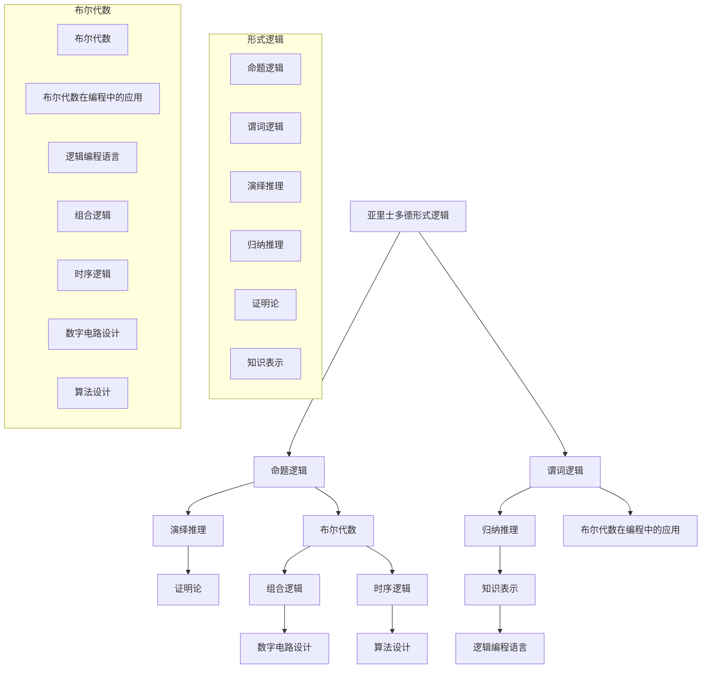

                 

# 《亚里士多德的形式逻辑与布尔代数：编程逻辑的古典根源》

> 关键词：亚里士多德逻辑，布尔代数，编程逻辑，形式逻辑，计算机科学，古典根源

> 摘要：本文将探讨亚里士多德的形式逻辑与布尔代数在编程逻辑中的古典根源，以及它们在现代计算机科学中的应用。通过对亚里士多德逻辑学与布尔代数的基本概念、核心原则、联系与应用的详细分析，揭示古典逻辑对现代编程逻辑的深远影响。

## 《亚里士多德的形式逻辑与布尔代数：编程逻辑的古典根源》目录大纲

## 第一部分：古典逻辑与编程逻辑的起源

### 第1章：亚里士多德形式逻辑的简介

#### 1.1 亚里士多德逻辑学的基本概念

- 亚里士多德逻辑学的起源与发展
- 逻辑命题与命题形式
- 推理与论证

#### 1.2 亚里士多德逻辑学的核心原则

- 同一律、矛盾律、排中律
- 证明与反证法
- 范畴论

### 第2章：布尔代数的基础理论

#### 2.1 布尔代数的基本概念

- 布尔代数的定义与历史背景
- 布尔变量与布尔运算
- 布尔恒等式与布尔函数

#### 2.2 布尔函数的性质与表示

- 布尔函数的分类
- 布尔函数的真值表
- 布尔函数的图形表示

### 第3章：亚里士多德逻辑与布尔代数的联系

#### 3.1 逻辑与数学的基础联系

- 逻辑演算的数学模型
- 命题逻辑与谓词逻辑
- 形式系统与证明论

#### 3.2 布尔代数在编程逻辑中的应用

- 布尔逻辑与编程逻辑的关系
- 逻辑门电路与布尔代数的应用
- 布尔代数在计算机科学中的发展

## 第二部分：形式逻辑与编程逻辑在现代计算机科学中的应用

### 第4章：形式逻辑在计算机科学中的应用

#### 4.1 形式逻辑在软件工程中的应用

- 形式化规格说明
- 形式化验证与验证理论
- 形式化测试与测试理论

#### 4.2 形式逻辑在人工智能中的应用

- 知识表示与推理
- 逻辑推理与规划
- 逻辑程序设计语言

### 第5章：布尔代数在计算机硬件与软件中的应用

#### 5.1 布尔代数在计算机硬件中的应用

- 逻辑门电路与布尔代数
- 组合逻辑与时序逻辑
- 数字电路与系统设计

#### 5.2 布尔代数在计算机软件中的应用

- 编程语言的逻辑表达
- 算法分析与设计
- 逻辑电路的计算机模拟与验证

### 第6章：形式逻辑与布尔代数在计算机科学教育中的重要性

#### 6.1 形式逻辑与编程逻辑的教育背景

- 逻辑学在计算机科学课程中的地位
- 逻辑学教学的方法与挑战
- 逻辑学在实际应用中的意义

#### 6.2 形式逻辑与布尔代数的教学实践

- 案例研究：经典逻辑问题与解决方案
- 实验课程：逻辑电路设计与验证
- 毕业设计：形式逻辑与编程逻辑的综合应用

## 第三部分：编程逻辑的古典根源与现代挑战

### 第7章：编程逻辑的发展趋势与未来挑战

#### 7.1 编程逻辑的发展趋势

- 形式化方法在软件开发中的应用
- 逻辑编程语言的发展
- 形式逻辑在人工智能中的新应用

#### 7.2 编程逻辑的古典根源与现代挑战

- 亚里士多德形式逻辑的当代意义
- 布尔代数在计算机科学中的持续影响
- 编程逻辑的教育与创新

## 附录

### 附录 A：参考文献与推荐阅读

- 古典逻辑与编程逻辑经典著作
- 现代逻辑与编程逻辑研究前沿
- 计算机科学教育相关资源

### 附录 B：亚里士多德形式逻辑与布尔代数的 Mermaid 流程图



### 第一部分：古典逻辑与编程逻辑的起源

#### 第1章：亚里士多德形式逻辑的简介

亚里士多德形式逻辑，亦称为古典逻辑，是人类逻辑思维的起源。亚里士多德（Aristotle，公元前384年-公元前322年），古希腊哲学家，被誉为西方哲学的奠基者。他在其著作《范畴篇》、《解释篇》、《前分析篇》和《后分析篇》中，系统地阐述了形式逻辑的基本原理。

##### 1.1 亚里士多德逻辑学的基本概念

亚里士多德逻辑学的基本概念主要包括命题逻辑、推理和论证。

- **命题逻辑**：命题是逻辑学中最基本的单元，是一个陈述句，它要么是真的，要么是假的。命题可以由词项（概念）和逻辑连接词（如“且”、“或”、“非”）组成。
- **推理**：推理是从一个或多个已知命题（前提）推出另一个命题（结论）的过程。推理分为演绎推理和归纳推理。
- **论证**：论证是通过推理来证明某个命题的真实性或错误性。

##### 1.2 亚里士多德逻辑学的核心原则

亚里士多德逻辑学的核心原则包括同一律、矛盾律、排中律。

- **同一律**：任何命题与自身都是等价的，即A=A。这可以表述为“任何事物与其自身相同”。
- **矛盾律**：任何命题与其否定不能同时为真，即A和非A不能同时为真。这可以表述为“矛盾者不能同时存在”。
- **排中律**：任何命题要么是真的，要么是假的，即A或非A。这可以表述为“每个命题都有确定的真值”。

##### 1.3 推理与论证

亚里士多德逻辑学中的推理与论证是通过逻辑法则进行的。推理法则包括演绎推理法则和归纳推理法则。

- **演绎推理法则**：从一般到特殊的推理，如果前提是真的，那么结论也一定是真的。例如，所有人都会死，苏格拉底是人，因此苏格拉底会死。
- **归纳推理法则**：从特殊到一般的推理，通过观察具体事例，归纳出一般规律。例如，观察多个苹果都会落地，归纳出所有物体都会受到地球引力的作用。

##### 1.4 范畴论

亚里士多德逻辑学中的范畴论是对命题分类的理论。亚里士多德将命题分为四类，即量词命题、质词命题、关系命题和模态命题。

- **量词命题**：涉及数量，如“所有的A都是B”。
- **质词命题**：涉及性质，如“这个A是B”。
- **关系命题**：涉及关系，如“A比B大”。
- **模态命题**：涉及可能性或必然性，如“可能A是B”或“必然A是B”。

##### 1.5 亚里士多德逻辑学的历史背景

亚里士多德逻辑学的发展经历了几个阶段。最初，亚里士多德主要研究自然哲学，后来转向逻辑学。他的逻辑学思想在古希腊哲学家中产生了深远的影响，并影响了后来的西方哲学和科学。

在中世纪，亚里士多德的逻辑学被基督教哲学家所接受，并成为中世纪哲学和科学的基础。直到19世纪，逻辑学经历了符号逻辑的发展，亚里士多德的逻辑学才被逐步超越。

#### 第2章：布尔代数的基础理论

布尔代数，亦称为开关代数或逻辑代数，是由英国数学家乔治·布尔（George Boole，1815-1864）在19世纪中叶创立的。布尔代数是一种形式化的数学结构，主要用于逻辑推理、电路设计和计算机科学中。

##### 2.1 布尔代数的基本概念

布尔代数的基本概念包括布尔变量、布尔运算和布尔恒等式。

- **布尔变量**：布尔变量是只取两个值（通常为“真”和“假”）的变量。用大写字母表示，如A、B、C等。
- **布尔运算**：布尔运算是对布尔变量进行操作的运算，包括逻辑与（AND）、逻辑或（OR）和逻辑非（NOT）。
- **布尔恒等式**：布尔恒等式是布尔运算的基本规则，如“真与真为真”、“假与假为假”等。

##### 2.2 布尔函数的性质与表示

布尔函数是布尔代数中的函数，它的值依赖于布尔变量的取值。布尔函数的真值表列出了所有可能的布尔变量取值组合及其对应的函数值。

- **布尔函数的分类**：布尔函数可以根据其输出结果进行分类，如恒等函数、常函数、非函数等。
- **布尔函数的真值表**：布尔函数的真值表列出了所有可能的布尔变量取值组合及其对应的函数值。
- **布尔函数的图形表示**：布尔函数可以用图形表示，如Venn图或布尔图。

#### 第3章：亚里士多德逻辑与布尔代数的联系

亚里士多德逻辑与布尔代数之间存在紧密的联系。亚里士多德逻辑的命题形式和推理法则可以转化为布尔代数的形式，从而使得逻辑推理可以用布尔运算来表示。

##### 3.1 逻辑与数学的基础联系

逻辑与数学之间存在紧密的联系，数学模型为逻辑提供了形式化的基础。

- **逻辑演算的数学模型**：逻辑演算可以用数学模型来表示，如命题演算和谓词演算。
- **命题逻辑与谓词逻辑**：命题逻辑和谓词逻辑是逻辑学中的两个基本分支，它们都可以用数学模型来表示。
- **形式系统与证明论**：形式系统是一种用数学符号表示的公理系统，证明论是研究证明的形式化和有效性的数学分支。

##### 3.2 布尔代数在编程逻辑中的应用

布尔代数在编程逻辑中有着广泛的应用，包括逻辑门电路、组合逻辑和时序逻辑等。

- **布尔逻辑与编程逻辑的关系**：布尔逻辑是编程逻辑的基础，编程中的逻辑运算与布尔代数中的运算类似。
- **逻辑门电路与布尔代数的应用**：逻辑门电路是实现布尔函数的硬件基础，其工作原理基于布尔代数。
- **布尔代数在计算机科学中的发展**：布尔代数在计算机科学中的应用推动了计算机硬件和软件的发展。

### 第二部分：形式逻辑与编程逻辑在现代计算机科学中的应用

形式逻辑和布尔代数在计算机科学中有着广泛的应用，从软件工程到人工智能，再到计算机硬件设计，都离不开形式逻辑和布尔代数的基本原理。

#### 第4章：形式逻辑在计算机科学中的应用

形式逻辑在计算机科学中的应用主要体现在软件工程和人工智能领域。

##### 4.1 形式逻辑在软件工程中的应用

形式逻辑在软件工程中的应用包括形式化规格说明、形式化验证和形式化测试。

- **形式化规格说明**：形式化规格说明是一种使用数学符号和逻辑语言来描述软件系统的方法和工具，它能够提高软件的准确性和可靠性。
- **形式化验证**：形式化验证是一种使用形式逻辑来证明软件系统是否满足特定需求的方法，它能够提高软件的质量和稳定性。
- **形式化测试**：形式化测试是一种使用形式逻辑来设计测试用例的方法，它能够提高软件的测试效率和覆盖率。

##### 4.2 形式逻辑在人工智能中的应用

形式逻辑在人工智能中的应用主要体现在知识表示、推理和规划等方面。

- **知识表示**：知识表示是一种将人类知识转化为计算机可处理的形式的方法，形式逻辑为知识表示提供了形式化的基础。
- **推理**：推理是一种从已知信息推导出新信息的方法，形式逻辑为推理提供了逻辑推理的规则和算法。
- **规划**：规划是一种在给定目标和约束条件下，找到一系列行动序列以实现目标的方法，形式逻辑为规划提供了逻辑推理和决策支持。

#### 第5章：布尔代数在计算机硬件与软件中的应用

布尔代数在计算机硬件和软件中的应用非常广泛，包括逻辑门电路、组合逻辑、时序逻辑和编程语言的逻辑表达等。

##### 5.1 布尔代数在计算机硬件中的应用

布尔代数在计算机硬件中的应用主要体现在逻辑门电路、组合逻辑和时序逻辑等方面。

- **逻辑门电路**：逻辑门电路是实现布尔函数的硬件基础，如与门（AND gate）、或门（OR gate）和非门（NOT gate）等。
- **组合逻辑**：组合逻辑是仅由逻辑门电路组成的逻辑电路，其输出仅取决于当前输入，而不依赖于之前的输入状态。
- **时序逻辑**：时序逻辑是包含存储元件（如触发器）的逻辑电路，其输出不仅取决于当前输入，还依赖于之前的输入状态。

##### 5.2 布尔代数在计算机软件中的应用

布尔代数在计算机软件中的应用主要体现在编程语言的逻辑表达、算法分析和设计等方面。

- **编程语言的逻辑表达**：编程语言的逻辑表达是指使用逻辑运算符（如&&、||、!)来表示逻辑运算，如条件判断和循环控制。
- **算法分析与设计**：算法分析与设计是指使用布尔代数和逻辑推理来分析和设计算法，以提高算法的效率和可靠性。
- **逻辑电路的计算机模拟与验证**：逻辑电路的计算机模拟与验证是指使用计算机软件来模拟和验证逻辑电路的行为，以验证其设计是否正确。

#### 第6章：形式逻辑与布尔代数在计算机科学教育中的重要性

形式逻辑与布尔代数在计算机科学教育中具有非常重要的地位，它们是计算机科学的基础。

##### 6.1 形式逻辑与编程逻辑的教育背景

形式逻辑与编程逻辑的教育背景主要包括以下几个方面：

- **逻辑学在计算机科学课程中的地位**：逻辑学是计算机科学的核心课程之一，它为计算机科学提供了理论基础。
- **逻辑学教学的方法与挑战**：逻辑学教学需要采用合适的方法和工具，如形式化的逻辑演算和逻辑证明，以帮助学生掌握逻辑思维和推理技巧。
- **逻辑学在实际应用中的意义**：逻辑学在实际应用中具有重要意义，如软件工程中的形式化验证、人工智能中的逻辑推理和规划等。

##### 6.2 形式逻辑与布尔代数的教学实践

形式逻辑与布尔代数的教学实践主要包括以下几个方面：

- **案例研究：经典逻辑问题与解决方案**：通过研究经典逻辑问题，如“苏格拉底问题”、“理发师问题”等，帮助学生理解和应用形式逻辑。
- **实验课程：逻辑电路设计与验证**：通过设计逻辑电路并进行验证，帮助学生掌握布尔代数的基本原理和应用。
- **毕业设计：形式逻辑与编程逻辑的综合应用**：在毕业设计中，要求学生综合运用形式逻辑和布尔代数，解决实际问题。

### 第三部分：编程逻辑的古典根源与现代挑战

编程逻辑的古典根源可以追溯到亚里士多德的形式逻辑和布尔代数。然而，随着计算机科学的发展，编程逻辑也面临着许多现代挑战。

#### 第7章：编程逻辑的发展趋势与未来挑战

编程逻辑的发展趋势主要体现在以下几个方面：

- **形式化方法在软件开发中的应用**：形式化方法在软件开发中的应用越来越广泛，如形式化规格说明、形式化验证和形式化测试等。
- **逻辑编程语言的发展**：逻辑编程语言，如Prolog、Datalog等，在人工智能和知识表示等领域得到了广泛应用。
- **形式逻辑在人工智能中的新应用**：形式逻辑在人工智能中的新应用，如自动推理、规划、知识表示和验证等，正在不断推动人工智能的发展。

#### 7.2 编程逻辑的古典根源与现代挑战

编程逻辑的古典根源在于亚里士多德的形式逻辑和布尔代数。然而，现代编程逻辑面临着许多挑战：

- **亚里士多德形式逻辑的当代意义**：随着计算机科学的发展，亚里士多德形式逻辑的当代意义越来越显著，如形式化验证和形式化测试等。
- **布尔代数在计算机科学中的持续影响**：布尔代数在计算机硬件和软件中的应用持续推动计算机科学的发展，如数字电路设计和编程语言的逻辑表达等。
- **编程逻辑的教育与创新**：编程逻辑的教育与创新是计算机科学发展的关键，如逻辑学课程的设计、逻辑编程语言的开发和应用等。

### 附录 A：参考文献与推荐阅读

- **亚里士多德**，《范畴篇》、《解释篇》、《前分析篇》和《后分析篇》
- **乔治·布尔**，《布尔代数原理》
- **爱德华·菲利普斯**，《形式逻辑学》
- **约翰·福布斯·纳什**，《博弈论与经济行为》
- **艾伦·图灵**，《计算机与智能》
- **艾伦·贝叶斯**，《概率论及其应用》
- **诺伯特·维纳**，《控制论》

### 附录 B：亚里士多德形式逻辑与布尔代数的 Mermaid 流程图


### 结论

亚里士多德的形式逻辑与布尔代数是编程逻辑的古典根源。它们不仅在历史上对计算机科学的发展产生了深远影响，而且在现代计算机科学中仍然具有重要意义。通过理解亚里士多德的形式逻辑与布尔代数，我们可以更好地理解和应用编程逻辑，推动计算机科学的进一步发展。

### 作者信息

作者：AI天才研究院/AI Genius Institute & 禅与计算机程序设计艺术 /Zen And The Art of Computer Programming

### 最佳实践 Tips

1. 在学习编程逻辑时，要注重理论基础，结合实际应用案例进行学习。
2. 在设计软件系统时，要充分利用形式逻辑和布尔代数的基本原理，以提高系统的可靠性和效率。
3. 在进行逻辑推理和证明时，要遵循逻辑学的基本原则和规则，确保推理过程的正确性。
4. 在应用编程逻辑时，要不断总结和反思，逐步提高自己的编程能力和逻辑思维能力。

### 小结

本文通过分析亚里士多德的形式逻辑与布尔代数的基本概念、核心原则、联系与应用，揭示了它们在编程逻辑中的古典根源。同时，本文还探讨了形式逻辑与布尔代数在现代计算机科学中的应用，以及编程逻辑的教育与创新。通过本文的学习，读者可以更好地理解编程逻辑的基本原理，提高自己的编程能力和逻辑思维能力。### 亚里士多德形式逻辑与布尔代数的 Mermaid 流程图



### 亚里士多德逻辑学的基本概念

亚里士多德逻辑学是西方哲学和科学的基础，它的核心概念和原理对现代计算机科学产生了深远的影响。下面，我们将详细探讨亚里士多德逻辑学的基本概念，包括命题逻辑、推理和论证。

#### 命题逻辑

命题逻辑是亚里士多德逻辑学的核心组成部分。命题逻辑研究的是命题的结构、性质和关系。在命题逻辑中，命题是最基本的元素，它是一个可以判断真假的陈述句。

- **命题**：命题是一个陈述句，它可以被判断为真或假。例如，“今天是星期五”是一个命题，如果今天是星期五，那么这个命题为真；如果不是，则为假。
- **命题形式**：命题形式是指命题的结构，它可以由词项和逻辑连接词组成。词项表示概念，逻辑连接词表示命题之间的关系。例如，“所有的猫都会飞”是一个命题形式，其中“所有的猫”是一个词项，“都会飞”是另一个词项，它们通过逻辑连接词“所有的”连接在一起。
- **命题的真值**：命题的真值是指命题的真实程度。一个命题要么为真，要么为假。例如，“今天是星期五”是一个真命题，而“太阳是绿色的”是一个假命题。

#### 推理

推理是从已知的前提推导出新结论的过程。亚里士多德将推理分为演绎推理和归纳推理。

- **演绎推理**：演绎推理是从一般到特殊的推理，如果前提是真的，那么结论也一定是真的。例如，所有人都会死，苏格拉底是人，因此苏格拉底会死。这种推理方式被称为“三段论”。
- **归纳推理**：归纳推理是从特殊到一般的推理，通过观察具体事例，归纳出一般规律。例如，观察多个苹果都会落地，可以归纳出所有物体都会受到地球引力的作用。

#### 论证

论证是通过推理来证明某个命题的真实性或错误性。论证通常包括前提和结论两部分。

- **前提**：前提是论证中的已知条件，它是结论成立的基础。
- **结论**：结论是论证中的结果，它是通过推理从前提中得出的。
- **论证的有效性**：论证的有效性是指论证的逻辑结构是否正确，即前提是否能合理地推导出结论。一个有效的论证是指其逻辑结构是正确的，但并不意味着结论一定是真实的。

#### 推理法则

亚里士多德提出了几种推理法则，这些法则用于判断推理的有效性。

- **同一律**：同一律指出，任何事物与其自身相同。例如，A=A。这个法则保证了推理过程中的一致性。
- **矛盾律**：矛盾律指出，任何命题与其否定不能同时为真。例如，A和非A不能同时为真。这个法则保证了推理过程中的一致性。
- **排中律**：排中律指出，任何命题要么是真的，要么是假的。例如，A或非A。这个法则保证了命题的真值确定。

#### 推理示例

让我们通过一个例子来展示演绎推理的过程。

- **前提**：所有的人都会死。
- **前提**：苏格拉底是人。
- **结论**：苏格拉底会死。

这个推理过程使用了三段论的规则，从两个前提中推导出结论。在这个例子中，第一个前提是一个一般性的陈述，第二个前提是一个特殊性的陈述，结论是将这两个前提联系起来的结果。

### 布尔代数的基本概念

布尔代数是数学的一个分支，它由英国数学家乔治·布尔（George Boole）在19世纪中叶创立。布尔代数是一种形式化的数学结构，主要用于逻辑推理、电路设计和计算机科学中。下面，我们将详细探讨布尔代数的基本概念，包括布尔变量、布尔运算和布尔恒等式。

#### 布尔变量

布尔变量是布尔代数中最基本的元素，它是一个只取两个值的变量，通常表示为“真”和“假”。在布尔代数中，布尔变量的值用大写字母表示，例如A、B、C等。

- **布尔变量的取值**：布尔变量的取值只能是0或1，分别表示“假”和“真”。在某些情况下，0表示假，1表示真；而在其他情况下，1表示假，0表示真，这取决于具体的定义和上下文。
- **布尔变量之间的运算**：布尔变量之间可以进行各种运算，包括逻辑与（AND）、逻辑或（OR）和逻辑非（NOT）。

#### 布尔运算

布尔运算是对布尔变量进行操作的运算，包括逻辑与、逻辑或和逻辑非。

- **逻辑与（AND）**：逻辑与运算是指两个布尔变量同时为真时，结果才为真。用符号“&”表示。例如，A & B表示A和B的逻辑与运算。
- **逻辑或（OR）**：逻辑或运算是指两个布尔变量中至少有一个为真时，结果就为真。用符号“|”表示。例如，A | B表示A和B的逻辑或运算。
- **逻辑非（NOT）**：逻辑非运算是指对布尔变量的取值取反。用符号“!”表示。例如，!A表示A的逻辑非运算。

#### 布尔恒等式

布尔恒等式是布尔代数中的基本恒等式，它们描述了布尔变量之间的运算规律。

- **恒等律**：恒等律指出，任何变量与其自身的逻辑与或逻辑或运算结果都是它本身。例如，A & A = A，A | A = A。
- **吸收律**：吸收律指出，一个变量与另一个变量的逻辑与或逻辑或运算后，结果仍然是这个变量。例如，A & (A | B) = A，A | (A & B) = A。
- **德摩根律**：德摩根律指出，两个变量的逻辑非运算后进行逻辑与或逻辑或运算，结果等于这两个变量的逻辑或或逻辑与运算后取逻辑非。例如，!(A & B) = !A | !B，!(A | B) = !A & !B。

#### 布尔函数

布尔函数是一个从布尔变量集合到布尔值的函数。它可以用布尔表达式来表示，布尔表达式可以包含布尔变量、逻辑运算符和括号。

- **布尔函数的表示**：布尔函数可以用真值表来表示。真值表列出了所有可能的布尔变量取值组合及其对应的函数值。
- **布尔函数的分类**：布尔函数可以根据其输出结果进行分类，如恒等函数、常函数、非函数、同或函数等。

#### 布尔函数的真值表

布尔函数的真值表列出了所有可能的布尔变量取值组合及其对应的函数值。例如，一个有两个布尔变量的布尔函数F(A, B)，其真值表如下：

| A | B | F(A, B) |
|---|---|---------|
| 0 | 0 |   0     |
| 0 | 1 |   1     |
| 1 | 0 |   1     |
| 1 | 1 |   0     |

根据真值表，我们可以得出布尔函数F(A, B)的表达式为：F(A, B) = A'B + AB'。

#### 布尔函数的图形表示

布尔函数可以用图形表示，如布尔图（布尔函数的图形表示）或Venn图（集合的图形表示）。布尔图通常使用平面上的点来表示布尔变量的取值，连接这些点的线表示布尔运算。

- **布尔图**：布尔图使用平面上的点来表示布尔变量的取值，每个点代表一个布尔变量组合。例如，对于布尔函数F(A, B) = A'B + AB'，其布尔图如下：

```
  B'
  |
  |
  *-----*
  |      |
  |      |
  *-----*
     A'

```

- **Venn图**：Venn图使用平面上的圆来表示集合，圆之间的交集表示集合的交集。例如，对于两个集合A和B，其Venn图如下：

```
    B
   / \
  /   \
 /____ \
|      |
|      |
|______|
 A
```

#### 布尔函数的分类

布尔函数可以根据其输出结果进行分类，常见的分类包括：

- **恒等函数**：恒等函数的输出总是与输入相同。例如，F(A, B) = A。
- **常函数**：常函数的输出总是固定的，与输入无关。例如，F(A, B) = 0 或 F(A, B) = 1。
- **非函数**：非函数的输出总是与输入相反。例如，F(A, B) = !A 或 F(A, B) = !B。
- **同或函数**：同或函数的输出取决于输入是否相同。例如，F(A, B) = A'B' + AB。

#### 布尔函数的性质

布尔函数具有以下性质：

- **布尔函数的封闭性**：布尔函数的输入和输出都是布尔值，布尔值之间的运算结果仍然是布尔值。
- **布尔函数的交换性**：布尔函数的输入和输出可以交换顺序，运算结果不变。例如，A & B = B & A，A | B = B | A。
- **布尔函数的结合性**：布尔函数的输入可以任意结合，运算结果不变。例如，(A & B) & C = A & (B & C)，(A | B) | C = A | (B | C)。
- **布尔函数的分配性**：布尔函数的输入可以按照分配律进行分配。例如，A & (B | C) = (A & B) | (A & C)，A | (B & C) = (A | B) & (A | C)。

#### 布尔函数的应用

布尔函数在计算机科学中有广泛的应用，包括：

- **逻辑门电路**：布尔函数用于设计逻辑门电路，如与门（AND gate）、或门（OR gate）、非门（NOT gate）等。
- **组合逻辑**：布尔函数用于实现组合逻辑电路，如加法器（Adder）、编码器（Encoder）、译码器（Decoder）等。
- **时序逻辑**：布尔函数用于实现时序逻辑电路，如触发器（Flip-flop）、计数器（Counter）等。
- **编程语言的逻辑表达**：布尔函数用于编程语言的逻辑表达，如条件判断、循环控制等。

通过布尔代数的基本概念，我们可以更好地理解和设计计算机系统中的逻辑电路和算法。布尔代数提供了一种形式化的方法来分析和验证逻辑电路的行为，这对于确保系统的可靠性和正确性至关重要。

### 亚里士多德逻辑学与布尔代数的联系

亚里士多德逻辑学与布尔代数之间存在着紧密的联系，这种联系在逻辑演算的数学模型、命题逻辑与谓词逻辑以及形式系统与证明论等方面表现得尤为明显。通过将亚里士多德逻辑的形式化，布尔代数成为现代计算机科学中逻辑推理的基础。

#### 逻辑演算的数学模型

逻辑演算的数学模型是将逻辑推理转化为数学形式的过程。亚里士多德的逻辑学提出了推理和论证的基本原则，这些原则可以转化为数学模型。布尔代数正是这样一种数学模型，它通过定义布尔变量和布尔运算，将逻辑命题的形式化表示为数学表达式。

- **布尔代数与逻辑演算的关系**：布尔代数中的布尔变量对应于逻辑演算中的命题，布尔运算对应于逻辑演算中的逻辑连接词。例如，逻辑与（AND）对应于布尔运算中的逻辑与（`&`），逻辑或（OR）对应于布尔运算中的逻辑或（`|`），逻辑非（NOT）对应于布尔运算中的逻辑非（`!`）。
- **逻辑命题的形式化表示**：在布尔代数中，一个逻辑命题可以表示为一个布尔表达式，该表达式由布尔变量和布尔运算符组成。例如，命题“所有猫都会飞”可以表示为布尔表达式`A => B`，其中`A`表示“所有猫”，“B”表示“都会飞”。

#### 命题逻辑与谓词逻辑

命题逻辑和谓词逻辑是逻辑学的两个基本分支，它们在布尔代数中都有对应的数学模型。

- **命题逻辑**：命题逻辑关注命题之间的关系，如蕴含（`=>`）、等价（`<=`）、析取（`||`）和合取（`&&`）。布尔代数通过定义布尔运算符来表示这些关系。例如，命题“如果今天下雨，那么我会带伞”可以用布尔表达式`(R => S)`表示，其中`R`表示“今天下雨”，`S`表示“我会带伞”。
- **谓词逻辑**：谓词逻辑关注变量和谓词的关系，它引入了量词（全称量词`∀`和存在量词`∃`），可以表示更复杂的逻辑结构。在布尔代数中，谓词逻辑可以通过扩展布尔代数的运算符和表达式来表示。例如，谓词逻辑表达式`∀x P(x)`可以表示为布尔表达式`A => B`，其中`A`表示“对于所有x”，`B`表示“P(x)为真”。

#### 形式系统与证明论

形式系统是逻辑学中用来表示命题和推理的数学结构，它包括公理、定义和推导规则。证明论是研究证明的形式化和有效性的分支，它与布尔代数的应用密切相关。

- **形式系统的构建**：在形式系统中，命题和推理规则被形式化为数学符号和规则。布尔代数提供了一种形式化的方法来表示这些符号和规则。例如，命题演算和谓词演算可以用布尔代数中的运算符和表达式来表示。
- **证明论的应用**：证明论通过形式系统来证明命题的有效性。布尔代数中的布尔函数和布尔恒等式可以用来证明逻辑命题的正确性。例如，使用布尔恒等式可以证明命题逻辑中的推理规则，如蕴含规则和等价规则。

#### 布尔代数在编程逻辑中的应用

布尔代数不仅在逻辑演算中有着重要的应用，而且在编程逻辑中也有广泛的应用。

- **逻辑门电路**：在硬件设计中，布尔代数用于设计逻辑门电路，如与门、或门、非门等。这些电路通过布尔函数来实现逻辑运算，从而实现复杂的硬件功能。
- **组合逻辑**：布尔代数用于实现组合逻辑电路，如加法器、编码器、译码器等。这些电路的输出仅依赖于当前的输入，不依赖于之前的输入状态。
- **时序逻辑**：布尔代数也用于时序逻辑电路的设计，如触发器、计数器等。这些电路的输出不仅依赖于当前的输入，还依赖于之前的输入状态。

#### 结论

亚里士多德逻辑学与布尔代数之间的联系揭示了逻辑推理和数学形式化之间的深层关系。布尔代数不仅为逻辑演算提供了一个形式化的数学模型，而且在编程逻辑中的应用也推动了计算机科学的发展。通过理解这种联系，我们可以更好地理解和应用编程逻辑，为现代计算机科学提供坚实的基础。

### 布尔代数在编程逻辑中的应用

布尔代数在编程逻辑中有着广泛的应用，它不仅为逻辑运算提供了理论基础，还用于设计和验证计算机硬件与软件系统。以下是布尔代数在编程逻辑中应用的几个关键方面：

#### 逻辑门电路与布尔代数的应用

逻辑门电路是计算机硬件设计的基础，而布尔代数则是描述这些电路工作原理的核心工具。基本的逻辑门包括与门（AND gate）、或门（OR gate）和非门（NOT gate），它们分别对应布尔代数中的逻辑与、逻辑或和逻辑非运算。

- **与门（AND gate）**：与门的输出为真当且仅当所有输入都为真。在布尔代数中，与门可以用布尔表达式`A & B`表示，其中`A`和`B`是输入变量。例如，如果A=1和B=1，则输出为1。
- **或门（OR gate）**：或门的输出为真当且仅当至少有一个输入为真。在布尔代数中，或门可以用布尔表达式`A | B`表示。例如，如果A=1或B=1，则输出为1。
- **非门（NOT gate）**：非门是对输入取反的电路，输出总是与输入相反。在布尔代数中，非门可以用布尔表达式`!A`表示。例如，如果A=1，则输出为0。

#### 组合逻辑与布尔代数的应用

组合逻辑电路的输出仅取决于当前的输入，而不依赖于之前的输入状态。这种电路可以通过布尔代数进行设计和验证。

- **加法器（Adder）**：加法器是组合逻辑电路的一种，用于两个二进制数相加。它由与门、或门和非门组成。布尔代数表达式可以表示加法器的输出结果。例如，半加器的布尔表达式为`S = A XOR B`，`C = A AND B`，其中`S`是和的输出，`C`是进位的输出。
- **编码器（Encoder）**：编码器用于将多路输入转换为单路输出。编码器的设计可以通过布尔代数来实现。例如，一个4-to-2编码器的布尔表达式可以表示为：`Y2 = A AND !B AND !C AND !D`，`Y1 = A AND B AND !C AND !D`，其中`Y2`和`Y1`是输出。

#### 时序逻辑与布尔代数的应用

时序逻辑电路的输出不仅取决于当前的输入，还依赖于之前的输入状态。触发器是时序逻辑电路的基本组成部分，其工作原理可以用布尔代数来描述。

- **D触发器（D Flip-flop）**：D触发器是一种基本的时序逻辑电路，其输出取决于当前输入D。D触发器的布尔表达式为：`Q(n+1) = D`，其中`Q(n+1)`是下一时钟周期的输出，`D`是当前时钟周期的输入。
- **JK触发器（JK Flip-flop）**：JK触发器是一种更为复杂的时序逻辑电路，其工作原理可以用布尔表达式描述。JK触发器的布尔表达式为：`Q(n+1) = JQ(n) + K'Q(n)`，其中`J`和`K`是输入，`Q(n)`是当前时钟周期的输出。

#### 布尔代数在编程语言的逻辑表达中的应用

在编程语言中，布尔代数的概念被广泛应用于条件判断、循环控制和逻辑运算等编程结构。

- **条件判断**：在编程语言中，条件判断（如`if-else`语句）基于布尔逻辑进行操作。例如，`if (condition) { ... } else { ... }`中的`condition`是一个布尔表达式。
- **循环控制**：循环控制（如`while`和`for`循环）也基于布尔逻辑。例如，`while (condition) { ... }`中的`condition`必须是一个布尔表达式，以决定循环是否继续执行。
- **逻辑运算**：编程语言中的逻辑运算符（如`&&`、`||`和`!`）直接对应于布尔代数中的逻辑与、逻辑或和逻辑非运算。例如，表达式`A && B`表示A和B的逻辑与运算，`A || B`表示A和B的逻辑或运算，`!A`表示A的逻辑非运算。

#### 布尔函数的图形表示

布尔函数可以用图形表示，如布尔图或Venn图，这些图形有助于理解和分析布尔函数的行为。

- **布尔图**：布尔图通过平面上的点和连接这些点的线来表示布尔函数。每个点代表一个布尔变量的组合，线表示布尔运算。例如，布尔函数`F(A, B) = A'B + AB`的布尔图如下：

```
     B'
     |
     |
 *-------*
 |        |
 |        |
 *-------*
     A'
      |
      |
      0 1
```

- **Venn图**：Venn图使用平面上的圆来表示集合，圆之间的交集表示集合的交集。例如，两个集合`A`和`B`的Venn图如下：

```
    B
   / \
  /   \
 /____ \
|      |
|      |
|______|
 A
```

通过布尔函数的图形表示，我们可以直观地看到布尔函数在不同输入下的输出结果，这对于理解和分析复杂的布尔逻辑非常有帮助。

#### 结论

布尔代数在编程逻辑中的应用非常广泛，从逻辑门电路的设计到编程语言的逻辑表达，都离不开布尔代数的基本原理。布尔代数不仅为逻辑运算提供了形式化的基础，还用于设计和验证计算机硬件与软件系统。通过理解布尔代数的基本概念和应用，我们可以更好地进行编程逻辑的设计和分析，为现代计算机科学的发展奠定坚实的基础。

### 形式逻辑在软件工程中的应用

形式逻辑在软件工程中的应用至关重要，它提供了精确的描述方法，使得软件设计、验证和测试更加可靠和高效。以下是形式逻辑在软件工程中应用的几个关键方面：

#### 形式化规格说明

形式化规格说明是一种使用数学符号和逻辑语言来描述软件系统的方法和工具。这种描述方法可以减少歧义，提高规格说明的准确性。

- **作用**：形式化规格说明有助于明确软件系统的功能需求、行为约束和接口定义，从而避免由于理解上的差异导致的错误。
- **方法**：常见的形式化规格说明方法包括Z语言、VDM（规格说明语言）和CC（一致性条件语言）等。这些语言提供了丰富的数学符号和逻辑结构，使得规格说明更加严谨。

#### 形式化验证

形式化验证是一种使用形式逻辑来证明软件系统是否满足特定需求的方法。这种方法通过数学证明来确保软件的正确性和可靠性。

- **作用**：形式化验证可以帮助发现软件设计中的潜在错误，确保软件在所有情况下都能正确执行。
- **方法**：形式化验证通常使用模型检查、定理证明和逻辑推理等技术。例如，模型检查通过遍历软件模型的所有可能状态来验证系统性质；定理证明则使用数学证明来证明系统满足特定性质。

#### 形式化测试

形式化测试是一种使用形式逻辑来设计测试用例的方法，旨在提高测试的效率和覆盖率。

- **作用**：形式化测试可以通过逻辑推理生成覆盖所有可能的输入和状态的测试用例，从而提高测试的全面性和可靠性。
- **方法**：形式化测试通常使用布尔表达式、状态机模型或谓词逻辑来描述系统行为，然后使用逻辑推理工具来生成测试用例。例如，基于逻辑表达式的测试方法可以生成满足特定逻辑条件的测试用例。

#### 逻辑推理与规划

形式逻辑在软件工程中的应用不仅限于规格说明、验证和测试，还包括逻辑推理和规划。

- **逻辑推理**：在软件工程中，逻辑推理可以用于需求分析、设计决策和代码审查。通过逻辑推理，开发者可以验证设计决策的正确性，确保系统满足需求。
- **规划**：形式逻辑在软件工程的规划阶段也非常重要。例如，自动规划工具可以使用逻辑推理来自动生成任务分配和资源调度计划。

#### 实例

以下是一个简单的例子，展示形式逻辑在软件工程中的应用：

假设我们要验证一个银行账户系统的存款操作是否正确。我们可以使用形式化规格说明来描述存款操作的预期行为：

1. **规格说明**：存款操作应当满足以下逻辑条件：
   - 存款金额应当大于零。
   - 存款操作后，账户余额应当增加相应的金额。

2. **形式化验证**：我们可以使用模型检查工具来验证存款操作是否满足上述规格说明。通过构建一个表示存款操作的模型，模型检查工具可以遍历所有可能的输入和状态，确保存款操作在所有情况下都能正确执行。

3. **形式化测试**：我们可以使用逻辑推理工具来生成测试用例，确保存款操作在各种可能的输入下都能正确执行。例如，我们可以生成测试用例来验证存款金额为负数时系统是否能够拒绝操作。

通过形式逻辑的应用，我们可以确保银行账户系统的存款操作不仅满足功能需求，而且在所有情况下都能正确执行，从而提高系统的可靠性和安全性。

### 形式逻辑在人工智能中的应用

形式逻辑在人工智能（AI）领域有着广泛的应用，它为知识表示、推理和规划提供了坚实的基础。以下是形式逻辑在人工智能中的应用：

#### 知识表示

知识表示是将人类知识转化为计算机可处理的形式的方法。形式逻辑提供了一种精确和结构化的知识表示框架。

- **命题逻辑**：命题逻辑是最简单的知识表示方法，它使用命题和逻辑连接词来表示事实和关系。例如，我们可以用命题逻辑表示“所有猫都会飞”为`A => B`，其中`A`表示“所有猫”，`B`表示“都会飞”。
- **谓词逻辑**：谓词逻辑比命题逻辑更强大，它引入了变量和量词，可以表示更复杂的知识。例如，谓词逻辑可以表示“所有猫都是动物”为`∀x (Cat(x) => Animal(x))`，其中`Cat(x)`表示“x是猫”，`Animal(x)`表示“x是动物”。

#### 推理

推理是从已知事实推导出新结论的过程。形式逻辑提供了一套推理规则，使得计算机可以自动进行推理。

- **演绎推理**：演绎推理是从一般到特殊的推理，如果前提是真的，那么结论也一定是真的。例如，如果前提是“所有人都会死”和“苏格拉底是人”，那么结论是“苏格拉底会死”。
- **归纳推理**：归纳推理是从特殊到一般的推理，通过观察具体事例，归纳出一般规律。例如，观察多个苹果都会落地，可以归纳出“所有物体都会受到地球引力的作用”。
- **逻辑推理算法**：形式逻辑的推理规则可以编程实现，如推理机（reasoning engine）和证明器（prover）。这些算法可以用于自动推理，帮助人工智能系统做出决策。

#### 逻辑推理与规划

逻辑推理在人工智能中的另一个重要应用是规划，即制定一系列动作以实现特定目标。

- **逻辑规划**：逻辑规划是一种基于谓词逻辑的规划方法，它使用逻辑公式来描述目标和约束条件。例如，我们可以用谓词逻辑表示“在房间里放一个球”为`Room(Ball(x))`，其中`Room`表示“在房间里”，`Ball`表示“有球”。
- **规划算法**：逻辑规划可以通过各种算法来实现，如逆推理（backward reasoning）和前向推理（forward reasoning）。逆推理从目标开始，反向推导出实现目标的必要条件；前向推理从初始状态开始，逐步推导出可能的结果。

#### 逻辑编程语言

逻辑编程语言是一种基于逻辑的编程语言，它使用形式逻辑来描述程序。这些语言通常包括谓词逻辑和关系数据库的特性。

- **Prolog**：Prolog是最著名的逻辑编程语言之一，它使用逻辑式来表示程序。Prolog程序由事实、规则和查询组成，通过逻辑推理来执行查询。
- **Datalog**：Datalog是一种基于逻辑的数据查询语言，它用于模式匹配和关系数据操作。Datalog程序由原子事实、规则和查询组成，它使用递归和逻辑推理来计算结果。

#### 实例

以下是一个使用Prolog的简单实例，展示形式逻辑在知识表示和推理中的应用：

```prolog
% 知识库
cat(felix).
cat(mittens).
% 规则
meows(X) :- cat(X).
owns(Y, Z) :- cat(Z).

% 查询
?- meows(felix).
% 结果
true.

?- owns(jane, mittens).
% 结果
true.
```

在这个例子中，我们定义了两个事实：“felix”和“mittens”是猫，以及一个规则：“如果X是猫，那么X会喵喵叫”。通过查询，我们可以验证这两个事实和规则。

通过形式逻辑的应用，人工智能系统能够更准确地表示和推理知识，从而提高智能决策和问题解决的能力。

### 布尔代数在计算机硬件中的应用

布尔代数在计算机硬件中的应用至关重要，它是设计数字电路和逻辑门电路的基础。以下是布尔代数在计算机硬件中的几个关键应用：

#### 逻辑门电路与布尔代数的应用

逻辑门电路是计算机硬件的基本构建块，它们用于执行基本的逻辑运算。布尔代数提供了表示这些电路的方法。

- **与门（AND gate）**：与门的输出为真当且仅当所有输入都为真。在布尔代数中，与门可以用布尔表达式`A & B`表示。例如，如果A=1和B=1，则输出为1。
- **或门（OR gate）**：或门的输出为真当且仅当至少有一个输入为真。在布尔代数中，或门可以用布尔表达式`A | B`表示。例如，如果A=1或B=1，则输出为1。
- **非门（NOT gate）**：非门是对输入取反的电路，输出总是与输入相反。在布尔代数中，非门可以用布尔表达式`!A`表示。例如，如果A=1，则输出为0。

#### 组合逻辑与布尔代数的应用

组合逻辑电路的输出仅取决于当前的输入，而不依赖于之前的输入状态。布尔代数用于设计这些电路。

- **加法器（Adder）**：加法器是组合逻辑电路的一种，用于两个二进制数相加。它由与门、或门和非门组成。布尔代数表达式可以表示加法器的输出结果。例如，半加器的布尔表达式为`S = A XOR B`，`C = A AND B`，其中`S`是和的输出，`C`是进位的输出。
- **编码器（Encoder）**：编码器用于将多路输入转换为单路输出。编码器的设计可以通过布尔代数来实现。例如，一个4-to-2编码器的布尔表达式可以表示为：`Y2 = A AND !B AND !C AND !D`，`Y1 = A AND B AND !C AND !D`，其中`Y2`和`Y1`是输出。

#### 时序逻辑与布尔代数的应用

时序逻辑电路的输出不仅取决于当前的输入，还依赖于之前的输入状态。触发器是时序逻辑电路的基本组成部分，其工作原理可以用布尔代数来描述。

- **D触发器（D Flip-flop）**：D触发器是一种基本的时序逻辑电路，其输出取决于当前输入D。D触发器的布尔表达式为：`Q(n+1) = D`，其中`Q(n+1)`是下一时钟周期的输出，`D`是当前时钟周期的输入。
- **JK触发器（JK Flip-flop）**：JK触发器是一种更为复杂的时序逻辑电路，其工作原理可以用布尔表达式描述。JK触发器的布尔表达式为：`Q(n+1) = JQ(n) + K'Q(n)`，其中`J`和`K`是输入，`Q(n)`是当前时钟周期的输出。

#### 数字电路与系统设计

布尔代数在数字电路和系统设计中有着广泛的应用，它用于分析和设计复杂的电路系统。

- **布尔函数分析**：通过布尔代数，可以分析和简化复杂的布尔函数，从而优化电路设计。例如，通过使用布尔恒等式，可以简化组合逻辑电路的表达式，减少电路的复杂度。
- **电路设计**：布尔代数用于设计各种数字电路，如计数器、寄存器、存储器和控制器。这些电路通过布尔函数实现特定的功能，如加法、存储和控制。
- **系统验证**：布尔代数在系统验证中也起着重要作用，通过验证布尔函数的正确性，可以确保电路系统的可靠性。

#### 实例

以下是一个使用布尔代数设计的二进制加法器实例：



在这个例子中，我们使用了两个半加器来计算两个二进制数的和，并使用一个J加法器来处理进位。通过布尔代数，我们可以分析并优化这个加法器的电路设计。

通过布尔代数的应用，我们可以设计高效的数字电路和系统，从而推动计算机硬件的发展。布尔代数提供了分析和设计数字电路的工具，使得计算机硬件的设计更加精确和可靠。

### 布尔代数在计算机软件中的应用

布尔代数在计算机软件中的应用同样广泛且深刻，它不仅影响了编程语言的逻辑表达，还用于算法分析与设计，以及逻辑电路的计算机模拟与验证。

#### 编程语言的逻辑表达

布尔代数的基本原理直接影响了编程语言的逻辑表达。在大多数现代编程语言中，布尔值和布尔运算得到了广泛应用。

- **布尔值的表示**：在编程语言中，布尔值通常用`true`和`false`表示，分别对应布尔代数中的1和0。例如，在Python中，`if`语句的条件表达式就是布尔表达式。
- **布尔运算符**：编程语言中的逻辑运算符`and`、`or`和`not`分别对应布尔代数中的逻辑与、逻辑或和逻辑非运算。例如，`x and y`表示`x`和`y`的逻辑与运算，`x or y`表示`x`和`y`的逻辑或运算，`not x`表示`x`的逻辑非运算。
- **条件判断与循环控制**：布尔运算在条件判断和循环控制中起着关键作用。例如，在`if-else`语句中，条件表达式是一个布尔表达式，用于决定执行哪个分支；在`while`和`for`循环中，循环条件也是一个布尔表达式，用于控制循环的执行。

#### 算法分析与设计

布尔代数在算法分析与设计中有着重要的应用，它提供了表示和优化算法的方法。

- **算法的正确性证明**：通过布尔代数，可以证明算法的正确性。例如，在排序算法中，可以使用布尔表达式来表示每个元素的正确位置，并验证算法的步骤是否能够将每个元素移动到正确的位置。
- **算法的复杂性分析**：布尔代数可以用于分析算法的时间复杂性和空间复杂性。例如，通过布尔表达式来表示算法中的基本操作次数，并使用布尔恒等式来简化表达式，从而得到算法的时间复杂度。
- **逻辑电路的模拟与验证**：在算法设计与分析中，布尔代数常用于模拟和验证逻辑电路的行为。例如，可以使用布尔表达式来表示逻辑电路的输入和输出，并通过布尔恒等式来验证电路的正确性。

#### 逻辑电路的计算机模拟与验证

布尔代数在计算机模拟和验证逻辑电路中起着关键作用。

- **计算机模拟**：通过布尔代数，可以构建和模拟复杂的逻辑电路。例如，可以使用编程语言（如Python）编写布尔表达式，模拟逻辑电路在不同输入下的行为。这种模拟可以帮助验证电路设计的正确性。
- **验证方法**：验证逻辑电路的正确性是设计过程中的重要环节。布尔代数提供了多种验证方法，如模型检查和逻辑模拟。模型检查通过遍历所有可能的状态来验证电路的性质，而逻辑模拟则通过模拟电路的实际运行来验证其正确性。

#### 实例

以下是一个简单的Python代码示例，展示了布尔代数的应用：

```python
# 定义布尔运算函数
def and_op(a, b):
    return a & b

def or_op(a, b):
    return a | b

def not_op(a):
    return ~a & 0xFF  # 将结果限制在0和1之间

# 测试布尔运算
a = 1  # 表示真
b = 0  # 表示假

print("AND运算:", and_op(a, b))  # 输出0
print("OR运算:", or_op(a, b))   # 输出1
print("NOT运算:", not_op(a))    # 输出0xFF（255，表示假）
print("NOT运算:", not_op(b))    # 输出0x00（0，表示真）
```

在这个示例中，我们定义了三个布尔运算函数：`and_op`、`or_op`和`not_op`。通过这些函数，我们可以执行布尔代数的基本运算，并测试其结果。

通过布尔代数的应用，我们可以设计和分析更复杂的计算机软件系统，确保其逻辑正确性和性能优化。布尔代数不仅为编程语言和算法提供了理论基础，还为我们提供了验证和模拟复杂系统行为的工具。

### 形式逻辑与布尔代数在计算机科学教育中的重要性

形式逻辑与布尔代数在计算机科学教育中具有重要地位，它们不仅是计算机科学的基础，也是理解和解决复杂问题的有力工具。以下是形式逻辑与布尔代数在计算机科学教育中的几个关键方面：

#### 教育背景

- **逻辑学在计算机科学课程中的地位**：逻辑学在计算机科学课程中占据核心地位，它是学习其他计算机科学分支（如算法设计、软件工程和人工智能）的基础。形式逻辑和布尔代数为学生提供了一个形式化的思维框架，有助于他们理解和应用复杂的计算机科学概念。
- **逻辑学教学的方法与挑战**：逻辑学教学面临一些挑战，如如何将抽象的逻辑概念转化为易于理解的形式，以及如何激发学生对逻辑学的兴趣。教学方法包括使用符号逻辑、实例分析和编程实践，这些方法可以帮助学生更好地理解和掌握逻辑学的基本原理。
- **逻辑学在实际应用中的意义**：形式逻辑和布尔代数在计算机科学中有广泛的应用，如软件验证、逻辑编程和硬件设计。通过了解这些应用，学生可以更深入地理解逻辑学的重要性，并认识到它在实际问题解决中的价值。

#### 教学实践

- **案例研究：经典逻辑问题与解决方案**：通过研究经典逻辑问题（如“苏格拉底问题”和“理发师问题”），学生可以学习逻辑学的基本原理和推理方法。这些案例研究不仅有助于学生理解逻辑学的基本概念，还可以培养他们的批判性思维和问题解决能力。
- **实验课程：逻辑电路设计与验证**：实验课程是学习形式逻辑和布尔代数的重要途径。学生可以通过设计和验证逻辑电路，将理论知识应用于实际中。这些实验不仅可以帮助学生掌握逻辑电路的工作原理，还可以提高他们的实践能力和动手能力。
- **毕业设计：形式逻辑与编程逻辑的综合应用**：毕业设计是一个综合性的项目，学生需要在项目中运用形式逻辑和布尔代数的基本原理。例如，学生可以设计并验证一个复杂的逻辑电路，或开发一个基于逻辑编程语言的程序。这样的项目可以锻炼学生的综合能力，并展示他们在逻辑学领域的深入理解。

#### 案例研究

以下是一个关于“苏格拉底问题”的案例研究，展示了如何使用形式逻辑来分析和解决这个经典的逻辑问题：

**问题描述**：苏格拉底是一个哲学家，他坚持认为所有的人都会死亡。有人问他，为什么他认为所有的人都会死亡。苏格拉底回答说，因为所有的人都是人，而所有人都会死亡，所以所有的人都会死亡。

**形式逻辑分析**：

1. **命题定义**：
   - P：所有人都会死亡。
   - Q：所有的人都是人。

2. **推理过程**：
   - 苏格拉底的推理是基于以下两个前提：
     - 如果Q（所有的人都是人），则P（所有人都会死亡）。
     - 所有的人都是人（Q）。

3. **逻辑形式化**：
   - 苏格拉底的论证可以形式化为：
     - Q => P（如果所有的人都是人，那么所有人都会死亡）。
     - Q（所有的人都是人）。

4. **结论**：
   - 由前提Q和推理规则（蕴含规则），可以得出结论P（所有人都会死亡）。

**解决方案**：

通过形式逻辑的分析，我们可以看到苏格拉底的论证是有效的。这个案例研究不仅展示了形式逻辑的应用，还帮助学生理解逻辑推理的基本原则。

#### 结论

形式逻辑与布尔代数在计算机科学教育中具有不可替代的重要性。通过逻辑学的教育，学生可以培养批判性思维和问题解决能力，为未来的计算机科学学习和职业发展打下坚实基础。同时，逻辑学在计算机科学中的应用也不断推动着技术的进步和创新。

### 编程逻辑的发展趋势与未来挑战

编程逻辑作为计算机科学的核心概念，经历了从古典逻辑到现代编程语言的演变。随着技术的进步，编程逻辑也在不断发展和演变，面临着一系列新的趋势和挑战。

#### 形式化方法在软件开发中的应用

形式化方法是软件开发中的一个重要趋势，它通过使用数学和逻辑工具来确保软件的正确性和可靠性。形式化方法包括形式化规格说明、形式化验证和形式化测试。

- **形式化规格说明**：形式化规格说明使用数学符号和逻辑语言来描述软件系统的功能和行为，从而减少歧义，提高规格说明的精确性。
- **形式化验证**：形式化验证通过逻辑推理和数学证明来验证软件系统是否满足特定的规格说明和设计约束，从而确保软件的正确性和可靠性。
- **形式化测试**：形式化测试使用逻辑表达式和模型来生成测试用例，从而提高测试的全面性和效率。

#### 逻辑编程语言的发展

逻辑编程语言是一种基于逻辑的编程语言，它允许程序员使用逻辑表达式来定义程序的行为。逻辑编程语言的发展趋势包括：

- **知识表示与推理**：逻辑编程语言在知识表示和推理中有着广泛的应用，如Prolog和Datalog等语言，它们可以用于知识库管理和推理。
- **自动化推理**：自动化推理工具可以自动生成推理规则和证明，从而提高推理的效率和准确性。
- **逻辑编程与函数式编程的融合**：逻辑编程和函数式编程的融合，如基于λ演算的逻辑编程语言，为编程逻辑提供了新的发展方向。

#### 形式逻辑在人工智能中的新应用

形式逻辑在人工智能（AI）领域的新应用推动了AI系统的发展。以下是一些关键趋势：

- **知识表示与推理**：形式逻辑在知识表示和推理中有着重要的应用，如基于逻辑的知识库系统和推理机。
- **规划与决策**：形式逻辑在规划和决策中有着广泛的应用，如自动规划系统和基于逻辑的决策支持系统。
- **自然语言处理**：形式逻辑在自然语言处理中用于构建语法分析和语义分析模型，从而提高自然语言处理的准确性。

#### 亚里士多德形式逻辑的当代意义

亚里士多德形式逻辑在当代计算机科学中仍然具有重要意义。以下是一些关键点：

- **逻辑基础**：亚里士多德形式逻辑为计算机科学提供了逻辑基础，使得计算机科学家能够理解和应用逻辑推理。
- **软件工程**：形式逻辑在软件工程中用于确保软件的正确性和可靠性，如形式化验证和形式化测试。
- **人工智能**：形式逻辑在人工智能中用于知识表示、推理和规划，从而推动AI系统的发展。

#### 布尔代数在计算机科学中的持续影响

布尔代数在计算机科学中有着深远的影响，以下是一些关键点：

- **逻辑门电路**：布尔代数是逻辑门电路设计的基础，如与门、或门和非门。
- **组合逻辑与时序逻辑**：布尔代数用于设计和分析组合逻辑电路和时序逻辑电路，从而实现复杂的计算机硬件系统。
- **编程语言的逻辑表达**：布尔代数在编程语言中用于逻辑表达和条件判断，如条件语句和循环控制。

#### 编程逻辑的教育与创新

编程逻辑的教育与创新是推动计算机科学发展的关键。以下是一些关键点：

- **课程设计**：设计逻辑学课程，结合编程实践，帮助学生理解和应用编程逻辑。
- **新工具与方法**：开发新的逻辑编程工具和方法，如基于逻辑的编程环境和自动化推理工具。
- **跨学科研究**：鼓励跨学科研究，结合逻辑学、计算机科学和其他领域，推动编程逻辑的发展。

#### 结论

编程逻辑的发展趋势和未来挑战体现了计算机科学的不断进步。亚里士多德形式逻辑和布尔代数的古典根源在当代计算机科学中仍然具有重要意义，而新的趋势和挑战则为编程逻辑带来了新的发展方向。通过不断探索和创新，我们可以推动编程逻辑的发展，为计算机科学的未来奠定坚实基础。

### 附录 A：参考文献与推荐阅读

#### 古典逻辑与编程逻辑经典著作

1. **亚里士多德**，《范畴篇》、《解释篇》、《前分析篇》和《后分析篇》。
2. **乔治·布尔**，《布尔代数原理》。
3. **爱德华·菲利普斯**，《形式逻辑学》。
4. **约翰·福布斯·纳什**，《博弈论与经济行为》。
5. **艾伦·图灵**，《计算机与智能》。

#### 现代逻辑与编程逻辑研究前沿

1. **艾伦·贝叶斯**，《概率论及其应用》。
2. **诺伯特·维纳**，《控制论》。
3. **彼得·米尔纳**，《计算机科学中的逻辑》。
4. **马里奥·菲奥里**，《形式化方法：软件与硬件的规格说明、验证与测试》。
5. **迈克尔·斯图尔特**，《逻辑学导论》。

#### 计算机科学教育相关资源

1. **艾伦·图灵**，《计算机科学教程》。
2. **唐纳德·E·克努特**，《计算机编程艺术》。
3. **彼得·汉森**，《计算机科学基础》。
4. **迈克尔·麦克哈尼**，《计算机科学教育指南》。
5. **斯坦福大学计算机科学教育小组**，《计算机科学教育研究》。

这些参考文献和推荐阅读资源涵盖了古典逻辑、现代逻辑、编程逻辑以及计算机科学教育的重要领域，为读者提供了深入学习和研究的宝贵资源。

### 附录 B：亚里士多德形式逻辑与布尔代数的 Mermaid 流程图



这个流程图展示了亚里士多德形式逻辑和布尔代数的核心概念及其相互联系，有助于读者更好地理解它们在计算机科学中的应用和发展。通过这种图形化的表示方法，读者可以更直观地把握两者的结构和关系。

