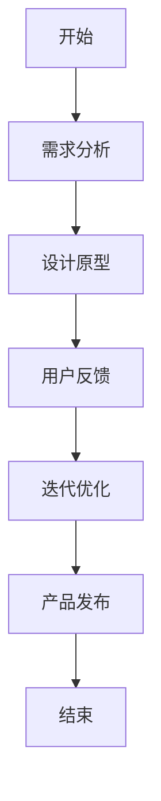
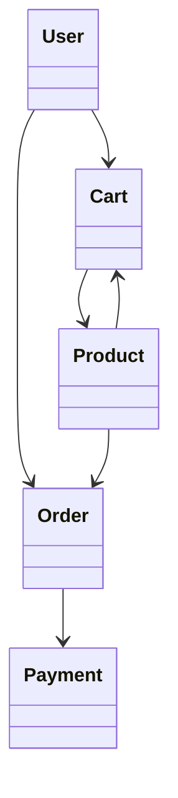
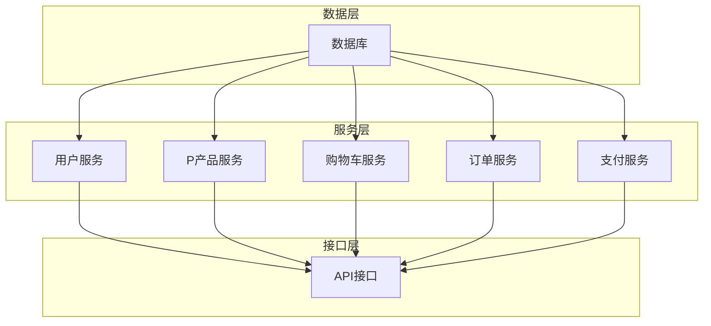
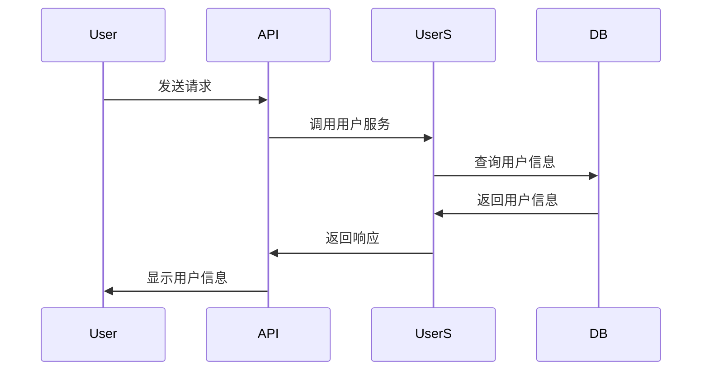

                 

# 产品思维：培养开发人员的产品意识

> 关键词：产品思维、开发人员、产品意识、软件开发、用户体验

> 摘要：在快速变化的软件行业，开发人员需要不仅仅关注技术实现，还需要培养产品意识，理解产品开发和用户体验的重要性。本文将探讨产品思维的核心概念，并通过实际案例和最佳实践，帮助开发人员提升产品意识，更好地参与产品开发。

## 1. 背景介绍

### 问题背景

在当今的软件行业，技术更新迭代速度越来越快，开发者面临的挑战不仅仅是编写高效的代码，更需要理解产品的全生命周期，从需求分析到用户反馈的每一个环节。然而，很多开发人员往往重视技术实现而忽视产品思维，导致软件产品在用户体验、市场需求和业务价值方面存在不足。

### 产品思维的概念

产品思维是一种以用户为中心的思考方式，强调从用户需求出发，通过不断的迭代和优化来提升产品价值。它不仅关注功能实现，更注重产品的整体设计、用户体验和市场适应性。

### 开发人员如何培养产品意识

开发人员培养产品意识需要从多个方面入手，包括理解市场需求、学习用户反馈、参与产品设计和了解业务目标。通过这些方法，开发人员能够更好地融入产品开发过程，为产品的成功做出贡献。

### 问题解决

本书旨在通过详细的案例分析和最佳实践，帮助开发人员理解产品思维的重要性，并提供实用的方法和技巧来提升他们的产品意识。

### 边界与外延

本书将主要讨论产品思维的培养方法、案例分析和技术实现，但不会涉及市场研究和项目管理等其他领域。

### 概念结构与核心要素组成

产品思维的核心要素包括用户需求分析、用户体验设计、迭代开发和业务目标。这些要素相互关联，共同构成了产品思维的整体框架。

## 2. 核心概念与联系

### 核心概念原理

产品思维是一种以用户为中心的思考方式，强调从用户需求出发，通过不断的迭代和优化来提升产品价值。它不仅关注功能实现，更注重产品的整体设计、用户体验和市场适应性。

### 概念属性特征对比表格

| 特征         | 描述                                                     | 对比                   |
| ------------ | -------------------------------------------------------- | ---------------------- |
| 用户中心     | 以用户需求为核心，关注用户体验                           | 技术中心：以技术实现为核心 |
| 不断迭代     | 通过多次迭代优化产品                                     | 一劳永逸：一次性完成   |
| 整体设计     | 关注产品设计的各个方面，包括功能、界面、性能等           | 分离设计：各自独立设计 |
| 市场适应性   | 关注市场需求，适应市场变化                               | 技术封闭：忽视市场变化 |

### ER实体关系图架构的 Mermaid 流程图

```mermaid
erDiagram
    User ||--o{ Product : "uses"
    Product ||--o{ Feature : "includes"
    Feature ||--o{ Requirement : "meets"
    Requirement ||--o{ User : "satisfied"}
```

## 3. 算法原理讲解

### 算法mermaid流程图



### Python源代码

```python
def product_mindset流程图():
    # 需求分析
    print("需求分析：理解用户需求")
    # 设计原型
    print("设计原型：创建产品原型")
    # 用户反馈
    print("用户反馈：收集用户反馈")
    # 迭代优化
    print("迭代优化：根据反馈优化产品")
    # 产品发布
    print("产品发布：发布最终产品")
    # 结束
    print("结束：完成产品开发")

product_mindset流程图()
```

### 数学模型和公式

产品价值 \( V \) 可以表示为用户满意度 \( S \)、市场需求 \( D \) 和产品性能 \( P \) 的函数：

$$
V = S \times D \times P
$$

其中，\( S \)、\( D \) 和 \( P \) 都是在 0 到 1 之间的值，表示各自的程度。

### 详细讲解和举例说明

#### 需求分析

首先，我们需要了解用户的需求。例如，对于一个社交应用，用户可能需要以下功能：

- 添加好友
- 发送消息
- 创建群组
- 浏览动态

#### 设计原型

接下来，我们可以设计一个简单的原型，包括以上功能的基本界面。例如，一个好友列表界面、一个消息发送界面和一个群组创建界面。

#### 用户反馈

在原型完成后，我们可以邀请一些用户进行测试，并收集他们的反馈。例如，用户可能认为消息发送界面不够直观，或者群组创建界面需要更多选项。

#### 迭代优化

根据用户反馈，我们可以对原型进行优化。例如，改进消息发送界面的设计，增加群组创建界面的选项。

#### 产品发布

在经过多次迭代后，我们可以发布最终产品。例如，一个包含所有功能、界面友好、用户体验良好的社交应用。

## 4. 系统分析与架构设计方案

### 问题场景介绍

假设我们要开发一款在线购物平台，用户可以在平台上浏览商品、添加购物车、下单支付。

### 系统功能设计（领域模型Mermaid类图）



### 系统架构设计（Mermaid架构图）



### 系统接口设计和系统交互（Mermaid序列图）



## 5. 项目实战

### 环境安装

在开发之前，我们需要安装相关的开发环境和工具。例如，使用 Python 和 Flask 框架来构建 API。

### 系统核心实现源代码

以下是用户服务的基本实现：

```python
from flask import Flask, jsonify, request

app = Flask(__name__)

@app.route('/user', methods=['GET'])
def get_user():
    user_id = request.args.get('id')
    # 在这里，我们可以从数据库中查询用户信息
    user = {'id': user_id, 'name': 'John Doe'}
    return jsonify(user)

if __name__ == '__main__':
    app.run(debug=True)
```

### 代码应用解读与分析

这个简单的用户服务允许我们通过 API 获取用户信息。当用户发送一个包含用户 ID 的 GET 请求时，服务会从数据库中查询用户信息，并将结果以 JSON 格式返回。

### 实际案例分析和详细讲解剖析

假设我们有一个用户 ID 为 1 的用户，当我们访问 `/user?id=1` 时，API 将返回以下 JSON 响应：

```json
{
    "id": "1",
    "name": "John Doe"
}
```

这个案例展示了如何通过简单的 API 接口实现用户信息查询，并返回 JSON 格式的响应。

### 项目小结

在这个项目中，我们通过简单的用户服务演示了产品思维的应用。从需求分析到用户反馈，再到迭代优化，我们不断改进服务，使其更好地满足用户需求。

## 6. 最佳实践 tips、小结、注意事项、拓展阅读等内容

### 最佳实践 tips

1. **持续学习**：产品思维是一个不断发展的领域，持续学习最新的趋势和最佳实践是至关重要的。
2. **用户反馈**：重视用户反馈，将其作为产品改进的重要依据。
3. **团队合作**：与产品经理、设计师和业务团队紧密合作，确保产品思维在整个团队中得以贯彻。

### 小结

本文通过详细的分析和实际案例，探讨了产品思维的核心概念和培养方法，帮助开发人员提升产品意识。通过实际项目，我们看到了产品思维在软件开发中的重要性。

### 注意事项

1. **理解用户需求**：始终以用户需求为中心，避免过分追求技术实现而忽视用户体验。
2. **持续迭代**：产品开发是一个持续迭代的过程，不断优化产品以适应市场变化。

### 拓展阅读

1. 《用户体验要素》 - 侠义涛
2. 《产品经理的第一本书》 - 毛向辉
3. 《敏捷开发实践指南》 - 史蒂夫·麦科德

### 作者信息

作者：AI天才研究院/AI Genius Institute & 禅与计算机程序设计艺术 /Zen And The Art of Computer Programming

