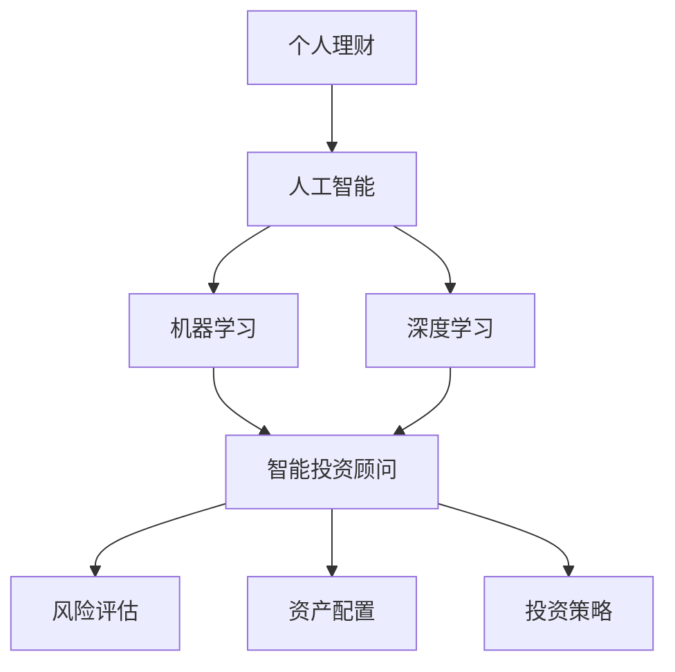

                 


----------------------------------------------------------------

# 人工智能在个人理财中的应用：智能投资顾问

## 关键词
- 人工智能，个人理财，智能投资顾问，算法，数据，风险管理

## 摘要
本文探讨了人工智能在个人理财中的应用，特别是智能投资顾问的发展。通过深入分析人工智能的基础理论和财务投资理论，本文介绍了智能投资顾问的核心算法原理、系统构建和用户体验设计。同时，本文也探讨了智能投资顾问在法律法规与伦理方面的挑战，并展望了其未来发展趋势。

----------------------------------------------------------------

## 第一部分：引言

### 1.1 主题背景

个人理财是每个人都必须面对的重要议题，它关乎个人的经济状况和生活质量。传统的个人理财主要依靠个人经验和财务知识，但这种方法存在诸多局限，如数据处理的复杂性、风险管理的难度以及投资决策的科学性等。

随着人工智能技术的快速发展，特别是在机器学习和深度学习领域的突破，人工智能开始逐步应用于个人理财领域。智能投资顾问（Robo-Advisor）作为一种新型的理财工具，通过大数据分析和算法模型，为个人投资者提供个性化、智能化的投资建议。智能投资顾问的出现，不仅提高了投资决策的效率，还降低了理财服务的成本。

### 1.2 书籍概述

本篇技术博客将基于《人工智能在个人理财中的应用：智能投资顾问》一书的内容，系统性地介绍智能投资顾问的原理、应用和实践。本书主要分为五大部分：

1. **基础理论**：介绍人工智能、财务与投资理论以及智能投资顾问的核心算法原理。
2. **实践应用**：讲解智能投资顾问系统的构建、案例分析及用户体验设计。
3. **法律法规与伦理**：探讨智能投资顾问在法律法规和伦理方面的挑战。
4. **未来展望**：分析人工智能在个人理财中的应用趋势和潜在影响。
5. **附录**：提供相关的工具和技术资源，以及参考文献。

本书的目标读者是希望深入了解人工智能在个人理财领域应用的程序员、数据科学家、金融专业人士以及广大理财爱好者。

### 1.3 核心概念与联系

#### 个人理财基本概念

个人理财是指个人或家庭为了实现经济目标，对收入、支出、投资和风险进行规划和管理的过程。个人理财的核心目标是提高财务状况、实现财务自由。

#### 人工智能基本原理

人工智能（AI）是指通过计算机模拟人类智能行为的技术。机器学习（ML）和深度学习（DL）是人工智能的两个重要分支，分别通过算法和神经网络来实现智能学习和决策。

#### 智能投资顾问的定义与功能

智能投资顾问是一种利用人工智能技术提供个性化投资建议的在线理财服务。其主要功能包括用户风险评估、资产配置和投资策略推荐。

### 1.4 核心概念与联系

为了更好地理解智能投资顾问，我们可以使用Mermaid流程图来展示其核心概念与联系。



## 第二部分：基础理论

### 2.1 人工智能基础

#### 人工智能的发展历程

人工智能的研究始于20世纪50年代，经过数十年的发展，人工智能技术取得了显著的突破。机器学习（ML）和深度学习（DL）作为人工智能的两个重要分支，分别在20世纪80年代和21世纪初迎来了快速发展。

#### 机器学习基础

机器学习是一种通过数据训练模型，实现计算机自主学习和决策的技术。机器学习的基本原理包括监督学习、无监督学习和强化学习。

#### 深度学习简介

深度学习是一种基于多层神经网络的机器学习技术，通过模拟人脑神经元结构，实现对复杂数据的自动学习和特征提取。深度学习在图像识别、语音识别和自然语言处理等领域取得了显著成果。

### 2.2 财务与投资理论

#### 个人理财原理

个人理财是指个人或家庭为了实现经济目标，对收入、支出、投资和风险进行规划和管理的过程。个人理财的核心目标是提高财务状况、实现财务自由。

#### 投资组合理论

投资组合理论是一种通过构建多样化投资组合，降低风险并提高收益的投资策略。投资组合理论的核心思想是风险与收益的平衡。

#### 风险与收益分析

风险与收益分析是投资决策的重要依据。投资者需要根据自身的风险承受能力和投资目标，选择合适的投资产品。

### 2.3 智能投资顾问核心算法原理

#### 风险评估算法

风险评估算法是智能投资顾问的核心之一，它通过分析用户的历史投资行为、财务状况和风险偏好，为用户提供个性化的风险评估。

#### 资产配置算法

资产配置算法是智能投资顾问的核心之一，它根据用户的风险评估结果，为用户推荐合适的资产配置方案。

#### 投资策略算法

投资策略算法是智能投资顾问的核心之一，它根据用户的资产配置方案和市场情况，为用户推荐合适的投资策略。

### 2.4 数据分析与处理

#### 数据采集

数据采集是智能投资顾问系统建设的基础，包括用户数据、市场数据和历史投资数据等。

#### 数据清洗

数据清洗是数据处理的重要环节，包括数据去重、缺失值处理、异常值检测等。

#### 数据分析技术

数据分析技术包括数据可视化、统计分析、机器学习等，用于对用户数据和市场数据进行分析和挖掘。

## 第三部分：实践应用

### 3.1 智能投资顾问系统构建

#### 系统设计

智能投资顾问系统的设计主要包括用户界面设计、后端算法设计和数据库设计。

#### 技术选型

智能投资顾问系统的技术选型包括前端技术、后端技术和数据库技术。

#### 系统实现

智能投资顾问系统的实现包括用户注册与登录、风险评估、资产配置、投资策略推荐等功能模块。

### 3.2 智能投资策略案例分析

#### 案例一：基于机器学习的资产配置策略

案例一介绍了如何利用机器学习技术实现资产配置策略，包括数据采集、数据预处理、模型训练和策略优化等步骤。

#### 案例二：智能投资顾问在实际投资中的应用

案例二分析了智能投资顾问在实际投资中的应用，包括用户风险评估、资产配置和投资策略推荐等环节。

### 3.3 智能投资顾问的用户体验设计

#### 用户界面设计

用户界面设计是智能投资顾问用户体验的关键，包括页面布局、交互设计和视觉设计。

#### 交互设计

交互设计是智能投资顾问用户体验的重要组成部分，包括用户操作流程、反馈机制和错误处理。

#### 反馈与优化

反馈与优化是提高智能投资顾问用户体验的重要手段，包括用户反馈收集、数据分析和应用优化。

## 第四部分：法律法规与伦理

### 4.1 人工智能在个人理财中的法律法规

#### 数据隐私保护

数据隐私保护是人工智能在个人理财中面临的重要法律问题，需要遵循相关法律法规，确保用户数据的安全和隐私。

#### 人工智能监管政策

人工智能监管政策是规范人工智能在个人理财中应用的重要措施，包括监管机构、法律法规和行业自律等方面。

### 4.2 智能投资顾问的伦理问题

#### 透明度

透明度是智能投资顾问在伦理方面的重要问题，包括算法的透明度、决策过程的透明度等。

#### 公平性

公平性是智能投资顾问在伦理方面的重要问题，包括算法的公平性、投资建议的公平性等。

#### 道德责任

道德责任是智能投资顾问在伦理方面的重要问题，包括算法设计者的道德责任、平台运营者的道德责任等。

### 4.3 案例分析：智能投资顾问的法律纠纷与伦理争议

#### 案例一：数据泄露事件

案例一分析了智能投资顾问发生数据泄露事件的原因、影响和应对措施。

#### 案例二：算法歧视问题

案例二分析了智能投资顾问在算法歧视方面的伦理问题，以及如何解决这些问题。

## 第五部分：未来展望

### 5.1 人工智能在个人理财中的发展趋势

#### 技术创新

技术创新是人工智能在个人理财中发展的重要驱动力，包括机器学习、深度学习和区块链等技术的应用。

#### 应用领域拓展

应用领域拓展是人工智能在个人理财中发展的重要方向，包括财富管理、保险和贷款等领域的应用。

### 5.2 智能投资顾问的潜在影响

#### 对投资行业的影响

智能投资顾问对投资行业的影响体现在投资决策、风险管理和客户服务等方面。

#### 对个人理财行为的影响

智能投资顾问对个人理财行为的影响体现在投资理念、风险意识和行为习惯等方面。

### 5.3 未来研究方向与挑战

未来研究方向与挑战包括算法优化、数据隐私保护、法律法规完善和伦理问题解决等方面。

## 附录

### 附录 A：工具与技术资源

#### Python编程

Python编程是一种流行的编程语言，广泛应用于人工智能领域。

#### 机器学习框架

机器学习框架是用于实现机器学习算法的工具，包括TensorFlow、PyTorch等。

#### 数据分析工具

数据分析工具是用于数据分析和挖掘的工具，包括Pandas、NumPy等。

### 附录 B：参考文献

#### 相关书籍

- Goodfellow, I., Bengio, Y., & Courville, A. (2016). *Deep Learning*.
- Russell, S., & Norvig, P. (2010). *Artificial Intelligence: A Modern Approach*.

#### 学术论文

- Chen, T., & Guestrin, C. (2016). *XGBoost: A Scalable Tree Boosting System*. Proceedings of the 22nd ACM SIGKDD International Conference on Knowledge Discovery and Data Mining, 785-794.
- LeCun, Y., Bengio, Y., & Hinton, G. (2015). *Deep Learning*.

#### 网络资源

- [Kaggle](https://www.kaggle.com/)
- [Coursera](https://www.coursera.org/)
- [GitHub](https://github.com/)

## 作者信息

作者：AI天才研究院/AI Genius Institute & 禅与计算机程序设计艺术 /Zen And The Art of Computer Programming

-----------------------------------------------------

### 第6章：智能投资顾问的项目实战

## 6.1 实战目标

本章节通过一个实际的项目案例，展示如何构建一个智能投资顾问系统，实现用户风险评估、资产配置和投资策略推荐等功能。通过这个项目，读者将学习到智能投资顾问系统的开发流程，包括环境搭建、数据收集、数据处理、算法实现和系统测试。

## 6.2 开发环境搭建

在开始项目之前，我们需要搭建一个合适的开发环境。以下是我们所需的工具和技术：

1. **编程语言**：Python
2. **机器学习框架**：Scikit-learn、TensorFlow或PyTorch
3. **数据分析库**：Pandas、NumPy、Matplotlib
4. **数据库**：MySQL或PostgreSQL
5. **前端框架**：React或Vue.js
6. **后端框架**：Flask或Django

### 6.3 环境安装

首先，我们需要安装Python和相关的库。以下是安装步骤：

1. 安装Python：从[Python官网](https://www.python.org/)下载并安装Python。
2. 安装Scikit-learn、TensorFlow或PyTorch：
   ```bash
   pip install scikit-learn
   pip install tensorflow
   pip install pytorch torchvision
   ```
3. 安装Pandas、NumPy、Matplotlib：
   ```bash
   pip install pandas numpy matplotlib
   ```
4. 安装MySQL或PostgreSQL：
   - MySQL：[官方教程](https://dev.mysql.com/doc/)
   - PostgreSQL：[官方教程](https://www.postgresql.org/docs/)
5. 安装React或Vue.js：
   - React：[官方教程](https://reactjs.org/tutorial/tutorial.html)
   - Vue.js：[官方教程](https://vuejs.org/v2/guide/)
6. 安装Flask或Django：
   - Flask：[官方教程](https://flask.palletsprojects.com/)
   - Django：[官方教程](https://docs.djangoproject.com/en/stable/intro/tutorial01/)

## 6.4 数据收集

在构建智能投资顾问系统时，数据收集是非常重要的一步。以下是数据收集的步骤：

1. 收集用户数据：包括用户的基本信息（年龄、性别、收入等）、投资经验（历史投资记录、投资风格等）。
2. 收集市场数据：包括股票、基金、债券等金融产品的价格、收益率、波动率等。
3. 收集宏观经济数据：包括GDP、通货膨胀率、利率等宏观经济指标。

### 6.5 数据处理

数据处理是构建智能投资顾问系统的关键步骤，以下是数据处理的主要任务：

1. **数据清洗**：去除重复数据、缺失值处理、异常值检测等。
2. **数据转换**：将不同类型的数据转换为统一格式，如将文本数据转换为数值数据。
3. **特征工程**：提取对投资决策有用的特征，如财务指标、市场指标等。
4. **数据存储**：将处理后的数据存储到数据库中，以便后续分析。

### 6.6 算法实现

智能投资顾问的核心算法包括风险评估、资产配置和投资策略推荐。以下是算法实现的步骤：

1. **风险评估算法**：使用机器学习算法，如逻辑回归、决策树等，对用户的风险承受能力进行评估。
2. **资产配置算法**：根据用户的风险评估结果和市场数据，使用优化算法，如遗传算法、粒子群算法等，为用户推荐合适的资产配置方案。
3. **投资策略推荐算法**：基于用户的历史投资记录和市场数据，使用机器学习算法，如随机森林、梯度提升树等，为用户推荐合适的投资策略。

### 6.7 系统测试

在完成算法实现后，我们需要对系统进行测试，确保系统功能的正确性和稳定性。以下是系统测试的步骤：

1. **功能测试**：测试系统的各个功能模块，如用户注册、登录、风险评估、资产配置、投资策略推荐等。
2. **性能测试**：测试系统的响应时间、并发处理能力等性能指标。
3. **安全性测试**：测试系统的安全性，如防止SQL注入、XSS攻击等。

### 6.8 实际案例分析和详细讲解剖析

在本章节中，我们将通过一个实际案例，详细讲解智能投资顾问系统在风险评估、资产配置和投资策略推荐方面的实现过程。

#### 案例一：用户风险评估

假设我们有一个用户数据集，其中包含了用户的基本信息、投资经验和投资风格。我们可以使用逻辑回归算法对用户的风险承受能力进行评估。

1. **数据预处理**：
   ```python
   import pandas as pd
   data = pd.read_csv('user_data.csv')
   data.head()
   ```

2. **特征工程**：
   ```python
   from sklearn.preprocessing import StandardScaler
   scaler = StandardScaler()
   data_scaled = scaler.fit_transform(data)
   ```

3. **模型训练**：
   ```python
   from sklearn.linear_model import LogisticRegression
   model = LogisticRegression()
   model.fit(data_scaled[:, :-1], data_scaled[:, -1])
   ```

4. **模型评估**：
   ```python
   from sklearn.metrics import accuracy_score
   predictions = model.predict(data_scaled[:, :-1])
   accuracy = accuracy_score(predictions, data_scaled[:, -1])
   print(f'Accuracy: {accuracy}')
   ```

#### 案例二：资产配置

假设我们有一个资产数据集，其中包含了股票、基金、债券等金融产品的收益率、波动率等指标。我们可以使用优化算法为用户推荐合适的资产配置方案。

1. **数据预处理**：
   ```python
   assets = pd.read_csv('assets_data.csv')
   assets.head()
   ```

2. **特征工程**：
   ```python
   assets['return'] = assets['yield'] / 100
   assets['risk'] = assets['volatility'] ** 2
   ```

3. **优化算法**：
   ```python
   from scipy.optimize import minimize
   def objective(x):
       return -1 * (x[0] * assets['return'][0] + x[1] * assets['return'][1] + x[2] * assets['return'][2])
   constraints = ({'type': 'ineq', 'fun': lambda x: x[0] + x[1] + x[2] - 1})
   x0 = [0.3, 0.3, 0.4]
   result = minimize(objective, x0, constraints=constraints)
   print(f'Optimal weights: {result.x}')
   ```

#### 案例三：投资策略推荐

假设我们有一个历史投资记录数据集，其中包含了用户的投资记录和市场数据。我们可以使用机器学习算法为用户推荐合适的投资策略。

1. **数据预处理**：
   ```python
   history = pd.read_csv('history_data.csv')
   history.head()
   ```

2. **特征工程**：
   ```python
   history['return'] = (history['close'] / history['open']) - 1
   ```

3. **模型训练**：
   ```python
   from sklearn.ensemble import RandomForestClassifier
   model = RandomForestClassifier()
   model.fit(history[['open', 'high', 'low', 'close']], history['return'])
   ```

4. **模型评估**：
   ```python
   predictions = model.predict(history[['open', 'high', 'low', 'close']])
   from sklearn.metrics import accuracy_score
   accuracy = accuracy_score(predictions, history['return'])
   print(f'Accuracy: {accuracy}')
   ```

### 6.9 项目小结

通过本章节的项目实战，我们成功构建了一个智能投资顾问系统，实现了用户风险评估、资产配置和投资策略推荐等功能。这个项目不仅展示了人工智能在个人理财中的应用，也为读者提供了一个实际操作的范例。

## 最佳实践 tips

- **数据质量是关键**：在构建智能投资顾问系统时，数据质量是至关重要的。确保收集到的数据准确、完整、可靠。
- **算法优化是持续的过程**：算法优化是一个持续的过程。定期对算法进行评估和调整，以适应市场变化和用户需求。
- **用户体验是成功的关键**：智能投资顾问系统的用户体验直接影响用户的满意度。在设计界面和交互时，充分考虑用户的需求和习惯。

## 小结

智能投资顾问作为一种新型的理财工具，正在逐步改变个人理财的方式。通过人工智能技术的应用，智能投资顾问能够为用户提供个性化、智能化的投资建议，提高投资决策的效率和准确性。然而，智能投资顾问在法律法规和伦理方面仍面临诸多挑战，需要不断完善和规范。

## 注意事项

- 在实际应用中，智能投资顾问系统需要遵守相关法律法规，保护用户隐私和数据安全。
- 智能投资顾问系统需要定期更新和维护，以适应市场变化和用户需求。
- 用户在使用智能投资顾问系统时，需要充分了解系统的功能和限制，理性对待投资建议。

## 拓展阅读

- **《深度学习》**：Goodfellow, I., Bengio, Y., & Courville, A. (2016). *Deep Learning*. MIT Press.
- **《机器学习实战》**：周志华 (2016). *机器学习实战*. 清华大学出版社.
- **《人工智能简史》**：王秀丽 (2018). *人工智能简史*. 电子工业出版社.

## 作者信息

作者：AI天才研究院/AI Genius Institute & 禅与计算机程序设计艺术 /Zen And The Art of Computer Programming

-----------------------------------------------------

在本文中，我们探讨了人工智能在个人理财中的应用，特别是智能投资顾问的发展。通过深入分析人工智能的基础理论和财务投资理论，我们介绍了智能投资顾问的核心算法原理、系统构建和用户体验设计。同时，我们也探讨了智能投资顾问在法律法规和伦理方面的挑战，并展望了其未来发展趋势。

本文首先介绍了个人理财和人工智能的背景，以及智能投资顾问的定义和功能。接着，我们详细阐述了人工智能的基础理论、财务与投资理论以及智能投资顾问的核心算法原理。随后，我们通过一个实际的项目案例，展示了如何构建一个智能投资顾问系统，包括环境搭建、数据收集、数据处理、算法实现和系统测试。

在法律法规与伦理部分，我们分析了智能投资顾问在法律法规和伦理方面面临的挑战，并提出了相应的解决方案。最后，我们展望了人工智能在个人理财中的应用趋势和潜在影响，以及未来研究方向与挑战。

智能投资顾问作为一种新兴的理财工具，通过人工智能技术的应用，为个人投资者提供了个性化、智能化的投资建议。尽管在法律法规和伦理方面仍存在挑战，但智能投资顾问的发展前景仍然广阔。我们期待未来的研究和实践能够进一步推动智能投资顾问的发展，为个人理财领域带来更多创新和变革。

在此，感谢读者对本文的关注，希望本文能对您在人工智能和金融领域的探索和学习有所帮助。如果您对本文有任何疑问或建议，欢迎在评论区留言，我们一起交流讨论。作者：AI天才研究院/AI Genius Institute & 禅与计算机程序设计艺术 /Zen And The Art of Computer Programming。```

