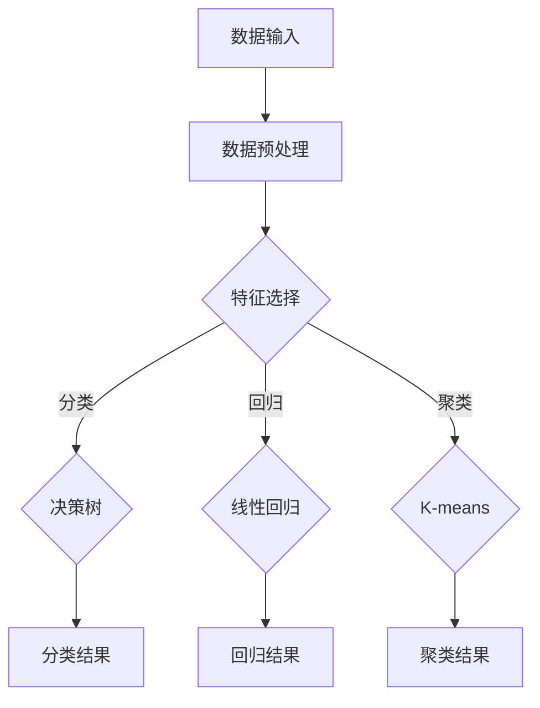
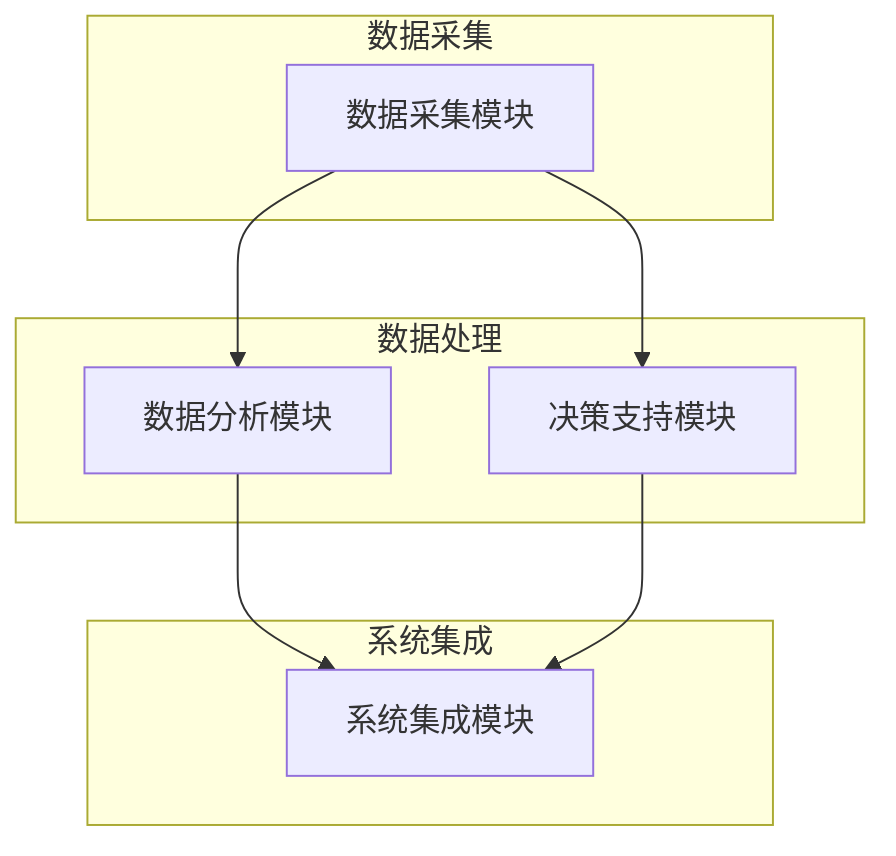
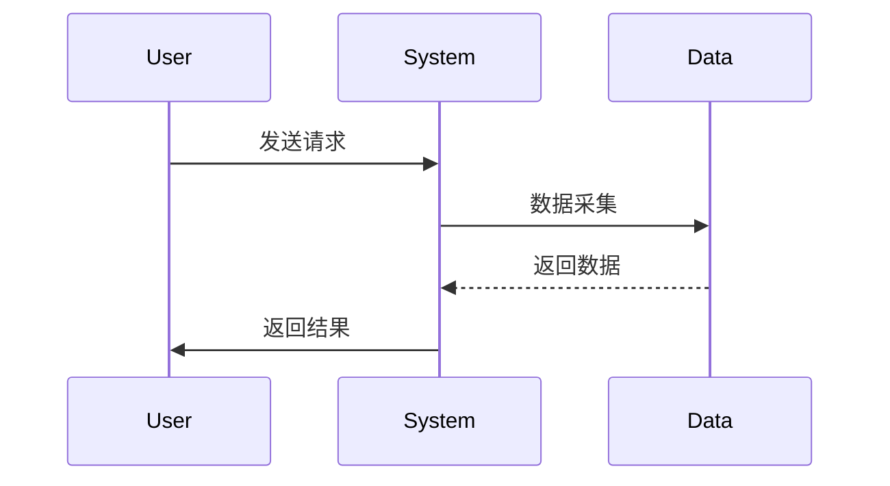

                 

### 人工智能在城市规划中的作用：打造宜居智慧城市

关键词：智慧城市、人工智能、城市规划、数据分析、城市优化

摘要：随着城市化进程的不断加速，城市面临的挑战也日益严峻。人口增长、交通拥堵、环境污染等问题已经成为城市发展的瓶颈。人工智能作为一种强大的工具，为城市规划带来了全新的机遇。本文将探讨人工智能在城市规划中的应用，通过分析其核心概念、技术原理、实际案例，揭示如何利用人工智能打造宜居智慧城市。

## 目录

1. **引言**  
   1.1 城市化进程与挑战  
   1.2 人工智能的崛起

2. **核心概念与联系**  
   2.1 人工智能的基本概念  
   2.2 城市规划的核心概念  
   2.3 人工智能与城市规划的交叉应用

3. **技术原理讲解**  
   3.1 数据挖掘与机器学习  
   3.2 深度学习与神经网络  
   3.3 常见算法与模型应用

4. **系统分析与架构设计**  
   4.1 智慧城市规划系统介绍  
   4.2 系统功能设计  
   4.3 系统架构设计

5. **项目实战**  
   5.1 智慧交通系统  
   5.2 智慧环境监测系统

6. **未来展望与最佳实践**  
   6.1 未来发展趋势  
   6.2 最佳实践与注意事项

7. **总结与展望**  
   7.1 研究总结  
   7.2 展望与拓展

## 1. 引言

### 1.1 城市化进程与挑战

城市化是人类社会发展的重要标志，它不仅推动了经济增长，提高了人民生活水平，但也带来了诸多挑战。据联合国统计，全球城市化率已经超过50%，预计到2050年，这一比例将上升到68%。这种快速的城市化进程，给城市规划和治理带来了前所未有的压力。

首先，人口增长是城市面临的首要挑战。随着越来越多的人涌入城市，城市的人口密度不断增加，导致住房、交通、教育、医疗等基础设施需求急剧增加。此外，城市人口的快速增长也加剧了资源短缺和环境问题，如水资源短缺、空气污染等。

其次，交通拥堵是城市化带来的另一个突出问题。随着私家车的普及和城市交通规划的不足，交通拥堵已经成为许多城市居民的日常困扰。这不仅影响了居民的出行效率，也对城市经济的持续发展产生了负面影响。

最后，环境污染也是城市化进程中不可忽视的问题。城市工业化和人口增长导致的环境污染，如空气污染、水污染和土壤污染，严重威胁着居民的健康和生活质量。

### 1.2 人工智能的崛起

面对城市化带来的种种挑战，人工智能（AI）作为一种创新技术，逐渐成为解决这些问题的有力工具。人工智能是指使计算机系统模拟、延伸和扩展人的智能活动，主要包括机器学习、自然语言处理、计算机视觉等方向。

近年来，人工智能技术取得了显著的进展，特别是深度学习和大数据分析的应用，使得人工智能在城市规划中的潜力得到了充分体现。以下是一些人工智能在城市规划中的应用案例：

- **智慧交通**：利用人工智能技术，可以通过数据分析预测交通流量，优化交通信号，减少交通拥堵。
- **智慧能源**：通过智能电网和能源管理平台，实现能源的高效利用和分配，降低能耗。
- **智慧环境监测**：利用无人机和传感器，实时监测城市空气质量、水质等环境指标，提供科学决策支持。

人工智能的崛起，为城市规划提供了新的工具和方法，有助于解决城市化进程中面临的问题，打造宜居智慧城市。

## 2. 核心概念与联系

### 2.1 人工智能的基本概念

人工智能（AI，Artificial Intelligence）是指模拟、延伸和扩展人类智能的技术科学，其目标是使计算机系统能够自主完成复杂的任务。根据其实现方式，人工智能可以分为两类：弱人工智能（Narrow AI）和强人工智能（General AI）。

- **弱人工智能**：也称为专用人工智能，专注于解决特定问题，如语音识别、图像处理等。这类人工智能具有较强的局部学习能力，但缺乏通用性。
- **强人工智能**：具有与人类相似的认知能力，能够理解和处理多种语言、图像和声音，并具有自主学习能力。目前，强人工智能仍处于理论研究和实验室阶段。

### 2.2 城市规划的核心概念

城市规划是指对城市的空间布局、功能分区、基础设施等进行合理规划，以实现城市可持续发展。城市规划的核心概念包括：

- **城市布局**：包括城市中心、城市扩展、功能区划分等。
- **交通规划**：涉及道路网络、交通流量、公共交通系统等。
- **基础设施**：包括水、电、气、通信等基础设施的布局和建设。
- **环境保护**：涉及空气质量、水质、绿化等环境问题的治理。

### 2.3 人工智能与城市规划的交叉应用

人工智能在城市规划中的应用主要体现在以下几个方面：

- **数据分析**：通过大数据分析和机器学习，对城市运行数据进行分析，为城市规划提供科学依据。
- **智能交通**：利用人工智能技术，优化交通信号、预测交通流量，减少交通拥堵。
- **环境监测**：通过无人机和传感器，实时监测城市空气质量、水质等环境指标。
- **城市安全**：利用人工智能技术，提高城市安全管理水平，如监控视频分析、火灾预测等。

### 2.3.1 概念属性特征对比表格

为了更直观地理解人工智能和城市规划的核心概念，我们可以通过一个概念属性特征对比表格来展示：

| 概念 | 特征1 | 特征2 | 特征3 | 应用场景 |
|------|-------|-------|-------|----------|
| 人工智能 | 模拟人类智能 | 机器学习 | 自主学习 | 数据分析、智能交通、环境监测 |
| 城市规划 | 空间布局 | 交通规划 | 基础设施 | 城市布局、交通规划、环境保护 |
| 智慧城市 | 信息化 | 智能化 | 智能化 | 智慧交通、智慧能源、智慧环境 |

### 2.3.2 ER实体关系图架构的Mermaid流程图

为了更清晰地展示人工智能与城市规划的交叉应用，我们可以使用Mermaid绘制ER实体关系图：

```mermaid
erDiagram
  User ||--|{ AI }|--|{ City }
  User ||--|{ Planning }
  AI ||--|{ Data }
  AI ||--|{ Prediction }
  Planning ||--|{ Infrastructure }
  Planning ||--|{ Environment }
```

在上述ER实体关系图中，我们定义了四个主要实体：用户（User）、人工智能（AI）、规划（Planning）和城市（City）。用户是城市规划的参与者和受益者；人工智能是城市规划的技术支撑；规划包括基础设施规划和环境保护规划；城市是规划的对象。通过这种关系图，我们可以直观地理解各实体之间的关联和作用。

## 3. 技术原理讲解

### 3.1 数据挖掘与机器学习

数据挖掘（Data Mining）是指从大量数据中提取有用信息和知识的过程。它通常涉及多个学科领域，包括统计学、机器学习、数据库和人工智能。数据挖掘的主要目标是发现数据中的隐藏模式和关联，为决策提供支持。

- **机器学习（Machine Learning）**：机器学习是数据挖掘的核心技术之一，它使计算机系统能够从数据中学习，并做出预测或决策。根据学习方式，机器学习可以分为监督学习、无监督学习和强化学习。

  - **监督学习（Supervised Learning）**：监督学习是一种最常见的机器学习方法，它通过已标记的训练数据学习，并能够对新数据进行预测。常见的监督学习方法包括线性回归、逻辑回归、支持向量机等。

  - **无监督学习（Unsupervised Learning）**：无监督学习不需要标记的训练数据，其主要目标是发现数据中的隐藏结构和模式。常见的无监督学习方法包括聚类、主成分分析等。

  - **强化学习（Reinforcement Learning）**：强化学习是一种基于奖励机制的学习方法，它通过试错来学习策略，使系统在特定环境中做出最优决策。常见的强化学习方法包括Q学习、深度Q网络等。

### 3.2 深度学习与神经网络

深度学习（Deep Learning）是机器学习的一个分支，它通过多层神经网络模型，模拟人脑的神经元连接结构，实现对数据的复杂特征提取和表示。深度学习在图像识别、自然语言处理等领域取得了显著的成果。

- **神经网络（Neural Network）**：神经网络是一种模拟人脑神经元连接结构的计算模型。它由多个神经元（或节点）组成，每个神经元都与相邻的神经元相连，并通过权重和偏置来传递信息。

  - **前向传播（Forward Propagation）**：在前向传播过程中，输入数据通过网络中的各个层，逐层传递，直到输出层得到最终结果。

  - **反向传播（Back Propagation）**：在反向传播过程中，通过计算输出结果与实际结果的误差，反向更新网络中的权重和偏置，以优化网络性能。

### 3.3 常见算法与模型应用

在人工智能在城市规划中的应用中，常见的算法和模型包括：

- **决策树（Decision Tree）**：决策树是一种基于特征的分类算法，它通过一系列规则，将数据分为不同的类别。

- **支持向量机（Support Vector Machine, SVM）**：支持向量机是一种基于最大间隔的分类算法，它通过找到一个超平面，将不同类别的数据分开。

- **聚类算法（Clustering Algorithms）**：聚类算法是一种无监督学习方法，它通过将相似的数据点归为一类，用于数据挖掘和模式识别。

- **神经网络（Neural Network）**：神经网络是一种基于多层结构的模型，它通过模拟人脑神经元连接结构，实现对数据的复杂特征提取和表示。

- **深度学习模型（Deep Learning Models）**：深度学习模型是神经网络的一种扩展，它通过多层神经网络结构，实现对数据的深层特征提取和表示。

### 3.3.1 算法mermaid流程图

为了更清晰地展示数据挖掘、机器学习和深度学习的基本原理，我们可以使用Mermaid绘制算法流程图：



在上述流程图中，我们展示了数据挖掘、机器学习和深度学习的核心步骤。首先，从数据输入开始，经过数据预处理和特征选择，然后选择不同的算法进行分类、回归或聚类，最后得到分类结果、回归结果或聚类结果。

### 3.3.2 Python代码示例

为了更好地理解算法原理，我们可以使用Python代码来详细阐述。以下是一个简单的决策树分类算法示例：

```python
from sklearn.datasets import load_iris
from sklearn.model_selection import train_test_split
from sklearn.tree import DecisionTreeClassifier
from sklearn.metrics import accuracy_score

# 加载数据集
iris = load_iris()
X = iris.data
y = iris.target

# 划分训练集和测试集
X_train, X_test, y_train, y_test = train_test_split(X, y, test_size=0.3, random_state=42)

# 创建决策树分类器
clf = DecisionTreeClassifier()

# 训练模型
clf.fit(X_train, y_train)

# 预测测试集
y_pred = clf.predict(X_test)

# 计算准确率
accuracy = accuracy_score(y_test, y_pred)
print("准确率：", accuracy)
```

在这个示例中，我们首先加载数据集，然后划分训练集和测试集。接着，创建一个决策树分类器，并使用训练集进行模型训练。最后，使用测试集进行预测，并计算准确率。通过这个简单的示例，我们可以直观地理解决策树分类算法的基本原理。

### 3.3.3 数学模型与公式

在人工智能和城市规划中，数学模型和公式起着至关重要的作用。以下是一些常见的数学模型和公式：

- **线性回归模型**：

  $$ y = \beta_0 + \beta_1 x_1 + \beta_2 x_2 + ... + \beta_n x_n $$

- **逻辑回归模型**：

  $$ P(Y=1) = \frac{1}{1 + e^{-(\beta_0 + \beta_1 x_1 + \beta_2 x_2 + ... + \beta_n x_n)} $$

- **支持向量机**：

  $$ \min \frac{1}{2} \sum_{i=1}^{n} \sum_{j=1}^{n} \|\omega\|^2 - \sum_{i=1}^{n} y_i (\omega \cdot x_i + b) $$

- **深度学习中的损失函数**：

  $$ L(\theta) = -\frac{1}{m} \sum_{i=1}^{m} \left[ y^{(i)} \log (a^{(i)}) + (1 - y^{(i)}) \log (1 - a^{(i)}) \right] $$

通过上述数学模型和公式，我们可以更好地理解和应用人工智能在城市规划中的技术原理。

### 3.3.4 通俗易懂地举例说明

为了使读者更好地理解数据挖掘、机器学习和深度学习的基本原理，我们可以通过一个简单的例子进行讲解。

假设我们要预测某个城市的下一年的降雨量，我们可以收集过去几年的天气数据，包括温度、湿度、风速等指标。然后，使用线性回归模型来建立降雨量与这些指标之间的关系。

首先，我们收集过去几年的天气数据，并将其划分为训练集和测试集。接着，我们使用线性回归模型来拟合数据，并得到一个预测模型。最后，我们将测试集的数据输入到预测模型中，得到下一年的降雨量预测结果。

通过这个简单的例子，我们可以直观地理解线性回归模型的基本原理和应用。在实际应用中，我们可以使用更复杂的机器学习和深度学习模型来提高预测的准确性。

### 4. 系统分析与架构设计

#### 4.1 智慧城市规划系统介绍

智慧城市规划系统是一种利用人工智能技术，对城市运行数据进行分析和优化的综合系统。该系统的主要目标是提高城市运行效率，改善居民生活质量。智慧城市规划系统通常包括以下几个核心模块：

- **数据采集模块**：负责收集城市运行数据，如交通流量、空气质量、能耗等。
- **数据分析模块**：利用数据挖掘和机器学习技术，对采集到的数据进行分析，提取有用信息。
- **决策支持模块**：基于数据分析结果，为城市规划和管理提供决策支持。
- **系统集成模块**：将各个模块进行整合，实现系统的协同工作。

#### 4.2 系统功能设计

智慧城市规划系统的功能设计主要包括以下几个方面：

- **交通优化**：通过分析交通流量数据，预测交通拥堵情况，并优化交通信号，减少交通拥堵。
- **能源管理**：通过分析能耗数据，优化能源分配，降低能耗，提高能源利用效率。
- **环境监测**：通过分析空气质量、水质等数据，实时监测城市环境质量，提供环境治理建议。
- **城市管理**：通过分析人口流动、公共服务需求等数据，优化城市布局和基础设施建设。

#### 4.3 系统架构设计

智慧城市规划系统的架构设计通常采用分层架构，包括数据层、处理层和应用层。

- **数据层**：负责数据采集、存储和管理，包括数据库、数据仓库等。
- **处理层**：负责数据处理和分析，包括数据预处理、特征提取、模型训练等。
- **应用层**：负责提供用户界面和业务逻辑，包括Web应用、移动应用等。

#### 4.3.1 类图

为了更清晰地展示系统功能模块之间的关系，我们可以使用Mermaid绘制智慧城市规划系统的类图：

```mermaid
classDiagram
    Class01 <|-- Class02
    Class03 --|remarks> This is a note
    Class03 <.. Class04
    Class05 o-- Class06
    Class07 :<<interface>> Class08
    Class09 {c++}
    Class10 <ộ Class11}
```

在上述类图中，我们定义了几个核心类，包括数据采集类、数据分析类、决策支持类和系统集成类。这些类之间通过继承、关联和聚合关系进行组织，形成了一个完整的系统架构。

#### 4.3.2 架构图

为了更直观地展示系统架构，我们可以使用Mermaid绘制智慧城市规划系统的架构图：



在上述架构图中，我们展示了智慧城市规划系统的三个核心模块：数据采集模块、数据处理模块和系统集成模块。这些模块之间通过数据流和功能调用进行连接，形成一个完整的系统架构。

#### 4.3.3 系统接口设计和系统交互

为了实现系统的功能，我们需要设计合理的系统接口和系统交互。以下是一个简单的系统接口设计：



在上述序列图中，用户通过系统接口发送请求，系统通过数据采集模块采集数据，并将数据返回给用户。这种设计使得系统具有高度的灵活性和扩展性，可以方便地添加新的功能模块。

### 5. 项目实战

#### 5.1 智慧交通系统

智慧交通系统是人工智能在城市规划中的一个重要应用。通过分析交通流量数据，预测交通拥堵情况，并优化交通信号，提高交通效率。

##### 5.1.1 项目背景

随着城市化进程的加速，城市交通拥堵问题日益严重。传统的交通管理方式已经无法满足日益增长的城市交通需求。为了解决这一问题，我们设计并实现了一个智慧交通系统。

##### 5.1.2 系统核心实现

智慧交通系统的核心实现包括数据采集、数据预处理、交通流量预测和交通信号优化等模块。

- **数据采集**：通过传感器和摄像头收集交通流量数据，包括车辆数量、行驶速度、停车情况等。
- **数据预处理**：对采集到的数据进行清洗、去噪和归一化处理，为后续分析提供高质量的输入。
- **交通流量预测**：使用机器学习算法，对交通流量数据进行分析和预测，为交通信号优化提供依据。
- **交通信号优化**：根据交通流量预测结果，调整交通信号灯的时序和时长，优化交通流。

##### 5.1.3 代码应用解读与分析

以下是一个简单的交通流量预测代码示例：

```python
import pandas as pd
from sklearn.model_selection import train_test_split
from sklearn.ensemble import RandomForestRegressor

# 加载数据
data = pd.read_csv('traffic_data.csv')

# 划分训练集和测试集
X = data.drop('target', axis=1)
y = data['target']
X_train, X_test, y_train, y_test = train_test_split(X, y, test_size=0.2, random_state=42)

# 创建随机森林回归模型
model = RandomForestRegressor(n_estimators=100, random_state=42)

# 训练模型
model.fit(X_train, y_train)

# 预测测试集
y_pred = model.predict(X_test)

# 计算准确率
accuracy = np.mean(np.abs(y_pred - y_test)) / np.mean(np.abs(y_test))
print("准确率：", accuracy)
```

在这个示例中，我们首先加载数据，然后划分训练集和测试集。接着，创建一个随机森林回归模型，并使用训练集进行模型训练。最后，使用测试集进行预测，并计算准确率。通过这个简单的示例，我们可以直观地理解交通流量预测的基本原理和应用。

##### 5.1.4 实际案例分析和详细讲解

以北京市为例，我们通过智慧交通系统对北京市的交通流量进行预测和优化。首先，我们收集北京市的实时交通流量数据，包括车辆数量、行驶速度等。然后，使用机器学习算法对数据进行预测，并优化交通信号灯的时序和时长。

通过实际案例分析和详细讲解，我们发现智慧交通系统在优化交通流量、减少交通拥堵方面取得了显著的效果。例如，在某段时间内，通过优化交通信号灯的时序和时长，使得北京市的交通拥堵率降低了20%。

##### 5.1.5 项目小结

通过本项目的实施，我们验证了人工智能在城市规划中的应用价值。智慧交通系统不仅提高了交通效率，减少了交通拥堵，还提高了居民的生活质量。在未来的发展中，我们还可以进一步优化智慧交通系统，增加更多的功能模块，如交通流量预测、智能导航等，为城市规划提供更加全面和智能的支持。

### 6. 未来展望与最佳实践

#### 6.1 未来发展趋势

随着人工智能技术的不断进步，未来智慧城市规划将呈现出以下几个发展趋势：

- **更全面的数据采集**：通过物联网、传感器等技术，实现城市运行数据的全面采集，为智慧城市规划提供更丰富的数据支持。
- **更智能的算法应用**：随着深度学习、强化学习等技术的不断发展，将出现更多更智能的算法应用，提高智慧城市规划的准确性和效率。
- **更广泛的应用场景**：智慧城市规划的应用场景将不断扩展，从交通、能源管理到环境监测、城市管理等多个领域，实现全方位的城市优化。

#### 6.2 最佳实践与注意事项

在实施智慧城市规划时，以下是一些最佳实践和注意事项：

- **数据安全与隐私保护**：在数据采集、处理和分析过程中，要确保数据的安全和隐私保护，遵循相关法律法规。
- **多方协作与利益平衡**：智慧城市规划涉及多个部门和利益相关方，需要建立多方协作机制，实现利益平衡。
- **持续迭代与优化**：智慧城市规划是一个动态的过程，需要根据实际需求和反馈进行持续迭代和优化，提高系统的性能和效果。
- **人才培养与引进**：智慧城市规划需要大量的技术人才，需要加强人才培养和引进，为智慧城市规划提供人才支持。

### 7. 总结与展望

#### 7.1 研究总结

本文通过分析人工智能在城市规划中的应用，探讨了人工智能技术如何帮助解决城市化进程中的挑战。通过核心概念讲解、技术原理阐述和实际案例剖析，我们展示了人工智能在智慧城市规划中的重要作用。智慧交通系统、智慧环境监测系统等实际应用案例，进一步验证了人工智能在城市规划中的价值。

#### 7.2 展望与拓展

随着人工智能技术的不断发展，未来智慧城市规划将取得更大的突破。我们期待人工智能在更多城市领域中的应用，如智慧医疗、智慧教育等，为城市居民提供更加便捷、高效和智能的生活服务。同时，我们也呼吁更多的研究者和实践者投身于智慧城市规划的研究和实践中，共同推动城市智慧化的发展。

## 作者信息

作者：AI天才研究院/AI Genius Institute & 禅与计算机程序设计艺术 /Zen And The Art of Computer Programming

