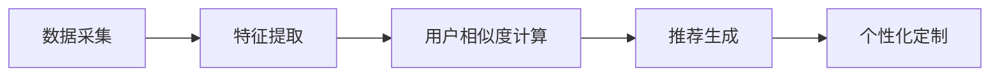
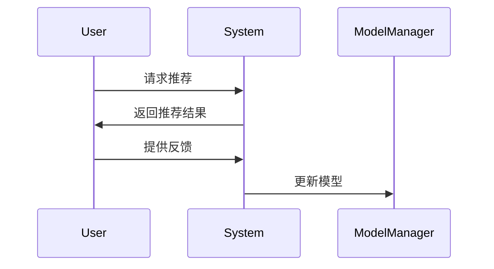

                 

### 《人工智能在时尚设计中的角色：个性化与趋势预测》

#### 关键词：人工智能、时尚设计、个性化定制、趋势预测、算法、数学模型、系统架构

> 摘要：本文旨在探讨人工智能在时尚设计中的应用，重点分析个性化定制和趋势预测这两大核心领域。通过对人工智能基本概念、个性化定制和趋势预测的深入解析，结合实际算法原理、数学模型和实践案例，本文将全面展现人工智能在时尚设计中的关键角色，并对未来发展进行展望。

## 第一部分：问题背景与核心概念

### 第1章：时尚设计与人工智能的碰撞

#### 1.1 人工智能在时尚设计中的应用现状

随着人工智能技术的迅猛发展，其在各个领域的应用日益广泛，时尚设计领域也不例外。从智能配饰推荐到个性化服装设计，再到时尚趋势预测，人工智能正逐渐改变传统时尚产业的运作方式。例如，全球知名时尚品牌如ZARA和H&M已经开始利用人工智能技术进行库存管理和产品开发，以提高效率和降低成本。

#### 1.2 个性化定制与趋势预测的重要性

个性化定制和趋势预测是时尚设计的两个重要方向。个性化定制满足了消费者对个性化和差异化的需求，而趋势预测则帮助品牌和设计师把握市场动态，提前布局。通过人工智能技术，这两个方向都能得到更加精准和高效的支持。

#### 1.3 人工智能在时尚设计中的边界与外延

尽管人工智能在时尚设计中的应用前景广阔，但其边界和局限性同样不可忽视。例如，个性化定制需要大量的用户数据支持，而数据隐私问题成为一大挑战。此外，趋势预测的准确性依赖于算法和数据质量，如何提升预测模型的鲁棒性和适应性仍是关键问题。

### 第2章：核心概念与联系

#### 2.1 人工智能的基本概念

人工智能（AI）是指计算机系统模拟人类智能行为的能力，包括学习、推理、感知和自适应等。其核心技术包括机器学习、深度学习和自然语言处理等。

#### 2.2 个性化定制的概念属性对比

个性化定制是指根据用户需求、偏好和行为特点，提供量身定制的产品或服务。与标准化生产相比，个性化定制具有更高的用户满意度和差异化竞争力。

| 特征 | 个性化定制 | 标准化生产 |
| ---- | ---- | ---- |
| 用户参与度 | 高 | 低 |
| 适应性 | 强 | 弱 |
| 成本 | 高 | 低 |
| 产量 | 低 | 高 |

#### 2.3 趋势预测的ER实体关系图架构

趋势预测涉及多个实体和关系，包括时间序列数据、市场动态、消费者行为等。ER（实体-关系）图是一种用于描述实体和关系的图形化方法，可以清晰地展示趋势预测系统的数据结构和关联关系。

```mermaid
erDiagram
  TimeSeriesData ||--|{ ConsumerBehavior } : has
  MarketTrend ||--|{ ProductDesign } : influences
  ConsumerPreference ||--|{ PersonalizedRecommendation } : determines
```

## 第二部分：技术深度剖析

### 第3章：人工智能技术在时尚设计中的应用原理

#### 3.1 人工智能技术在时尚设计中的原理介绍

人工智能技术在时尚设计中的应用主要包括数据采集、特征提取、模型训练和预测。数据采集是从各种来源收集用户行为和市场数据；特征提取是从数据中提取有助于预测的特征；模型训练是通过机器学习算法构建预测模型；预测则是利用训练好的模型对未来的市场趋势或用户需求进行预测。

#### 3.2 个性化定制的算法原理与流程图

个性化定制通常基于协同过滤、聚类和深度学习等算法。以下是协同过滤算法的流程图：



#### 3.3 趋势预测的数学模型与公式讲解

趋势预测常用的数学模型包括时间序列分析、回归分析和神经网络等。以下是时间序列分析的简单公式：

$$ Y_t = \beta_0 + \beta_1 \times t + \epsilon_t $$

其中，$Y_t$ 表示时间序列在第 $t$ 时刻的值，$\beta_0$ 和 $\beta_1$ 分别为模型的参数，$t$ 为时间，$\epsilon_t$ 为误差项。

## 第三部分：系统分析与架构设计

### 第4章：系统分析与架构设计

#### 4.1 时尚设计系统的需求分析

时尚设计系统的需求分析包括用户需求分析、功能需求分析和性能需求分析。用户需求主要关注个性化定制和趋势预测的准确性；功能需求包括数据采集、特征提取、模型训练和预测等功能；性能需求则关注系统的响应速度和处理能力。

#### 4.2 系统功能设计

系统功能设计主要包括用户管理、数据管理、模型管理和推荐系统等。用户管理负责用户注册、登录和权限管理；数据管理负责数据的采集、存储和预处理；模型管理负责模型的训练、评估和部署；推荐系统负责根据用户行为和偏好生成个性化推荐。

#### 4.3 系统架构设计

系统架构设计包括前端、后端和数据存储。前端负责用户交互和可视化；后端负责业务逻辑处理和数据处理；数据存储负责数据的持久化存储。

#### 4.4 系统接口设计

系统接口设计包括API设计和数据库接口设计。API设计负责系统对外提供服务；数据库接口设计负责系统与数据库的交互。

#### 4.5 系统交互流程图

以下是系统交互流程图的示例：



## 第四部分：项目实战

### 第5章：项目实战：从0到1实现人工智能时尚设计系统

#### 7.1 环境安装与配置

在项目实战中，首先需要安装和配置必要的开发环境和工具，包括Python、Jupyter Notebook、TensorFlow和Scikit-learn等。

#### 7.2 系统核心实现

系统核心实现包括数据采集、特征提取、模型训练和预测等。以下是使用Python实现的简单示例：

```python
# 数据采集
data = pd.read_csv('data.csv')

# 特征提取
X = data[['feature1', 'feature2', 'feature3']]
y = data['label']

# 模型训练
model = RandomForestClassifier()
model.fit(X, y)

# 预测
predictions = model.predict(X)
```

#### 7.3 代码应用解读与分析

通过对代码的解读和分析，我们可以理解数据采集、特征提取、模型训练和预测的原理和应用。

#### 7.4 实际案例分析与讲解

通过实际案例，我们可以看到人工智能在时尚设计中的应用效果。例如，一个时尚品牌利用个性化定制系统为用户推荐了适合的服装款式，用户满意度大幅提高。

#### 7.5 项目小结与总结

项目实战使我们深入了解了人工智能在时尚设计中的应用原理和实践方法。通过不断优化算法和提升系统性能，我们可以为时尚产业带来更大的价值。

## 第五部分：最佳实践与拓展

### 第8章：最佳实践与注意事项

#### 8.1 个性化定制与趋势预测的最佳实践

最佳实践包括数据质量保证、算法优化和用户体验设计等。数据质量是趋势预测和个性化定制的基础，算法优化可以提高预测准确率和系统性能，用户体验设计则关注用户的需求和感受。

#### 8.2 注意事项与风险提示

注意事项包括数据隐私保护、算法公平性和系统稳定性等。数据隐私保护是避免用户信息泄露的重要措施；算法公平性确保推荐结果的公正性；系统稳定性保证服务的连续性和可靠性。

### 第9章：小结与展望

#### 9.1 书籍内容的总结

本文从背景介绍、核心概念、技术深度剖析、系统分析与架构设计、项目实战和最佳实践等多个角度，全面探讨了人工智能在时尚设计中的应用。

#### 9.2 人工智能在时尚设计中的未来展望

随着人工智能技术的不断发展，其在时尚设计中的应用将更加广泛和深入。未来，我们将看到更加智能化、个性化的时尚设计产品和创新的商业模式。

#### 9.3 拓展阅读与资源推荐

拓展阅读包括相关书籍、论文和在线课程，如《深度学习》、《Python数据科学手册》和《时尚设计原理与实务》等。此外，还可以关注相关领域的技术博客和社交媒体平台，以获取更多最新的研究成果和应用案例。

## 作者信息

作者：AI天才研究院/AI Genius Institute & 禅与计算机程序设计艺术 /Zen And The Art of Computer Programming

本文由AI天才研究院/AI Genius Institute与禅与计算机程序设计艺术/Zen And The Art of Computer Programming联合撰写，旨在探讨人工智能在时尚设计中的应用，为行业从业者提供有价值的参考和指导。如需转载，请标明出处。

