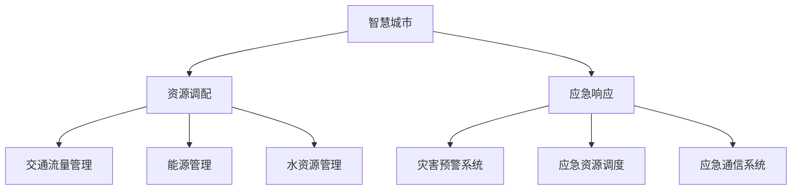

                 

基于您的要求和指南，下面是《人工智能在智慧城市管理中的角色：资源调配与应急响应》的技术博客文章的撰写步骤：

### 第一步：文章标题、关键词和摘要

**文章标题**：《人工智能在智慧城市管理中的角色：资源调配与应急响应》

**关键词**：智慧城市、人工智能、资源调配、应急响应、交通流量管理、能源管理、水资源管理、灾害预警系统、资源调度、通信系统

**摘要**：

本文旨在探讨人工智能在智慧城市管理中的关键作用，特别是资源调配与应急响应方面。通过详细分析人工智能在交通流量管理、能源管理、水资源管理以及灾害预警系统、应急资源调度和应急通信系统中的应用，本文旨在为读者提供对智慧城市中人工智能应用的全景了解，并探讨其面临的挑战与未来发展。

### 第二步：引言

#### 2.1 智慧城市背景

智慧城市是指通过信息通信技术和物联网技术，将城市中的各种信息和资源进行整合，实现智能化管理和服务的城市。智慧城市的目标是通过数据驱动的方式提高城市的管理效率、居民的生活质量和城市的可持续发展。

#### 2.2 人工智能在智慧城市中的应用

人工智能在智慧城市中扮演着至关重要的角色，它能够通过数据的收集、分析和预测，实现资源的优化配置和应急响应的智能化。

#### 2.3 本书结构

本文将分为七个章节，首先介绍智慧城市的基本概念与架构，然后详细讨论人工智能在资源调配和应急响应中的应用，最后分析人工智能在智慧城市管理中的挑战与未来发展趋势。

### 第三步：智慧城市基本概念与架构

#### 3.1 智慧城市定义

智慧城市是指通过先进的信息通信技术和物联网技术，将城市中的各种信息和资源进行整合，实现智能化管理和服务的城市。

#### 3.2 智慧城市架构

智慧城市架构通常包括感知层、传输层、平台层和应用层。感知层负责数据的收集，传输层负责数据的传输，平台层负责数据的处理和分析，应用层负责实现智慧城市各种功能。

#### 3.3 智慧城市的关键技术

智慧城市的关键技术包括物联网技术、大数据技术、云计算技术、人工智能技术等。

### 第四步：人工智能在资源调配中的应用

#### 4.1 交通流量管理

##### 4.1.1 车辆数据收集与分析

车辆数据收集是交通流量管理的基础。通过车载传感器、交通摄像头等设备，可以实时收集车辆的速度、位置、行驶方向等信息。

##### 4.1.2 实时交通信息显示

通过数据分析，可以得到实时的交通信息，并将其显示在交通信息屏上，帮助司机和交通管理者了解道路状况。

##### 4.1.3 智能交通信号控制

根据实时交通信息，智能交通信号控制系统可以动态调整交通信号，以减少交通拥堵。

### 第五步：人工智能在应急响应中的应用

#### 5.1 灾害预警系统

##### 5.1.1 数据采集与预处理

灾害预警系统需要收集各种数据，如气象数据、地质数据等，并对数据进行预处理，以消除噪声和异常值。

##### 5.1.2 灾害预测模型

通过历史数据和预测模型，可以预测可能发生的灾害，并提前发布预警信息。

##### 5.1.3 应急响应策略

在灾害发生时，应急响应策略可以帮助政府和相关部门迅速采取行动，减轻灾害影响。

### 第六步：案例研究

#### 6.1 案例介绍

以某智慧城市为例，分析人工智能在资源调配和应急响应中的应用。

#### 6.2 AI应用详细分析

详细分析案例中人工智能的具体应用，如交通流量管理、能源管理和灾害预警系统。

#### 6.3 案例成效评估

评估案例中人工智能应用的效果，如交通拥堵减少、能源消耗降低和灾害预警准确性提高等。

### 第七步：挑战与未来

#### 7.1 挑战分析

分析人工智能在智慧城市管理中面临的挑战，如数据隐私、技术实施和维护等。

#### 7.2 未来发展趋势

探讨人工智能在智慧城市管理中的未来发展趋势，如新技术引入和智慧城市的可持续发展。

### 第八步：结论

总结文章的主要观点，强调人工智能在智慧城市管理中的重要作用，并提出未来研究方向。

### 第九步：附录

提供参考文献、Mermaid流程图示例和代码与数据资源。

通过以上九个步骤，我们可以撰写出一篇结构清晰、内容丰富、逻辑严密的技术博客文章，满足您的要求。以下是一个简单的Mermaid流程图示例：

接下来，我们将按照这些步骤，逐步撰写文章的各个部分，确保文章的质量和深度。由于篇幅限制，这里仅提供了整体框架和步骤，具体内容将在后续步骤中详细展开。

