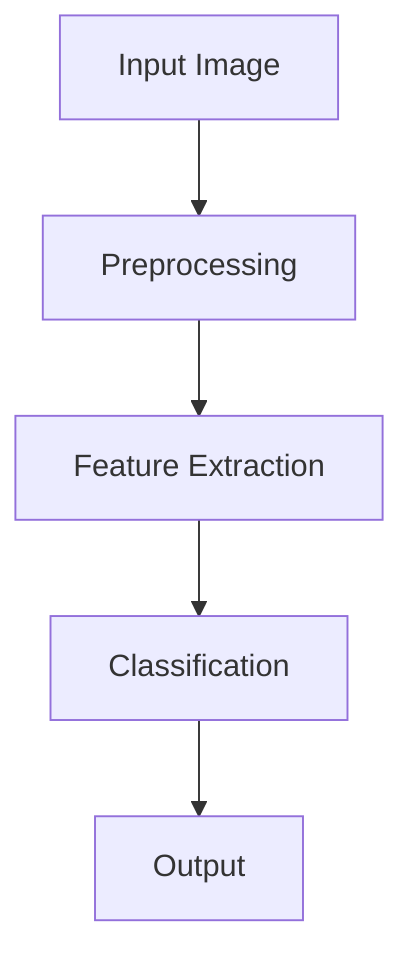
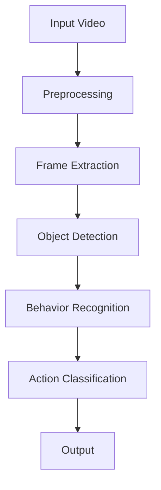
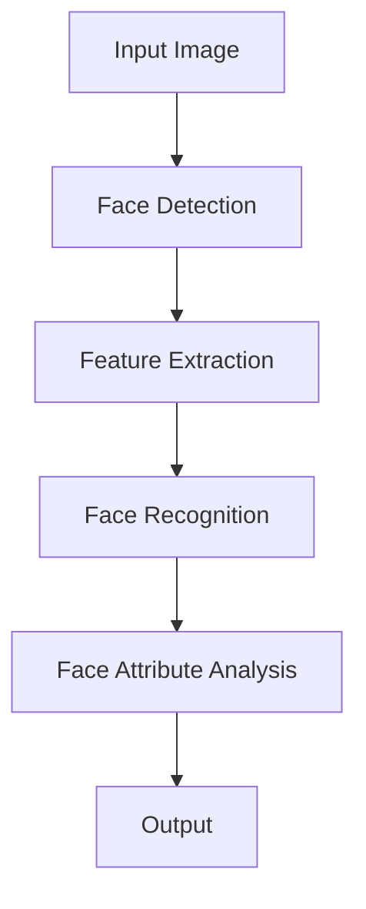
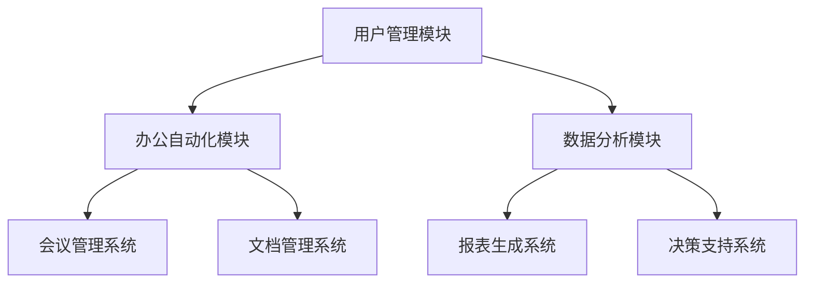

                 


### 第一部分：引言与背景

#### 1. 引言

随着信息技术的飞速发展，人工智能（AI）技术逐渐渗透到各行各业，改变了传统的工作模式，提高了工作效率。智能办公作为人工智能应用的重要领域，正日益受到企业和社会的关注。本文旨在探讨人工智能在智能办公中的应用，分析其如何提高工作效率，并提供实用的技术解决方案和案例分析。

#### 2. 智能办公与人工智能的关系

智能办公（Smart Office）是指利用现代信息技术，特别是人工智能技术，来实现办公环境的智能化、自动化和高效化。人工智能与智能办公之间的关系可以概括为以下几个方面：

- **数据驱动**：智能办公依赖于大量数据的收集、处理和分析，而人工智能正是实现这一目标的核心技术。
- **自动化**：通过人工智能，智能办公可以实现任务自动化，降低人工干预，提高工作效率。
- **个性化**：人工智能可以根据用户行为和偏好，提供个性化的服务和体验。
- **协同**：人工智能可以协助团队成员进行协同工作，提高团队整体效率。

#### 3. 本书的目标和结构

本书的目标是深入探讨人工智能在智能办公中的应用，帮助读者了解智能办公的需求、挑战和关键技术，并通过案例研究展示实际应用效果。本书的结构如下：

- **第一部分**：引言与背景，介绍智能办公和人工智能的关系。
- **第二部分**：人工智能基础知识，包括概述、核心技术等。
- **第三部分**：智能办公应用场景分析，探讨智能办公的需求与挑战。
- **第四部分**：智能办公的关键技术，介绍自然语言处理、计算机视觉、数据分析等。
- **第五部分**：智能办公系统设计与实现，讲解系统架构设计、开发与集成。
- **第六部分**：案例分析，通过实际案例展示智能办公应用效果。
- **第七部分**：展望与未来，讨论人工智能在智能办公中的发展趋势。

通过以上结构，本书将带领读者全面了解人工智能在智能办公中的应用，帮助读者掌握智能办公的关键技术和实践方法。

#### 4. 人工智能概述

人工智能（Artificial Intelligence，简称AI）是指通过计算机模拟人类智能行为的技术。AI的发展可以追溯到20世纪50年代，但真正引起广泛关注则是在21世纪。随着计算能力、算法和大数据的快速发展，人工智能技术取得了显著的进步。

**4.1 人工智能的定义与发展历史**

人工智能的定义有多种，一种广泛接受的定义是：人工智能是指使计算机系统能够执行通常需要人类智能才能完成的任务的科学技术。这些任务包括感知、学习、推理、规划、解决问题、自然语言理解和生成等。

人工智能的发展历史可以分为几个阶段：

- **早期阶段**（1956年-1974年）：人工智能概念的提出和早期研究。
- **繁荣时期**（1974年-1980年）：符号主义和知识表示方法的发展。
- **低谷期**（1980年-1990年）：由于实际应用效果不佳，人工智能研究进入低谷。
- **复兴时期**（1990年至今）：机器学习、深度学习和大数据的兴起，人工智能重新受到重视。

**4.2 人工智能的核心技术**

人工智能的核心技术包括以下几个方面：

- **机器学习**：机器学习是人工智能的核心技术之一，它使计算机系统能够从数据中自动学习和改进性能。常见的机器学习方法包括监督学习、无监督学习和强化学习。
- **深度学习**：深度学习是机器学习的一种方法，它通过多层神经网络对数据进行处理和分析，具有强大的特征提取能力。深度学习在图像识别、自然语言处理等领域取得了显著的成果。
- **自然语言处理**：自然语言处理（NLP）是使计算机能够理解和生成自然语言的技术。NLP广泛应用于语音识别、机器翻译、情感分析等场景。
- **计算机视觉**：计算机视觉是使计算机能够理解和解释视觉信息的领域。计算机视觉在图像识别、视频分析、自动驾驶等领域具有广泛的应用。
- **强化学习**：强化学习是一种通过试错和奖励机制来学习决策策略的方法。强化学习在游戏、机器人控制等领域表现出色。

以上核心技术共同构成了人工智能的技术体系，为智能办公提供了强大的技术支持。

#### 5. 智能办公的需求与挑战

智能办公的需求源于提高工作效率、降低人力成本和优化工作流程。随着企业对办公环境智能化和自动化需求的增加，智能办公逐渐成为现代企业提升竞争力的关键。然而，智能办公在实施过程中也面临诸多挑战。

**5.1 智能办公的现状**

当前，智能办公的应用场景主要包括以下几个方面：

- **自动化办公**：通过机器人流程自动化（RPA）等技术，实现重复性任务的自动化处理。
- **智能会议**：利用智能会议助手进行会议安排、记录和总结，提高会议效率。
- **智能文档**：通过智能文档助手进行文档分类、整理和检索，提高文档管理效率。
- **智能沟通**：利用智能聊天机器人提供实时沟通服务，提高团队协作效率。
- **智能监控**：通过智能监控系统进行安全监控、设备管理和能源管理。

**5.2 提高工作效率的重要性**

提高工作效率是企业持续发展的关键。高效的工作方式不仅可以减少人力成本，还能提高员工的工作满意度和生产力。以下是提高工作效率的几个重要方面：

- **减少重复劳动**：通过自动化和智能化技术，减少重复性、低价值的工作，将人力资源集中于更有价值的工作。
- **优化工作流程**：通过智能办公系统，优化工作流程，消除不必要的步骤，提高工作协同效率。
- **实时数据支持**：利用智能办公系统，实时获取和分析数据，为决策提供支持，提高决策效率。
- **个性化服务**：根据员工的工作习惯和偏好，提供个性化的办公环境和工具，提高工作舒适度和满意度。

**5.3 智能办公面临的挑战**

尽管智能办公具有显著的优势，但在实际应用过程中仍然面临诸多挑战：

- **技术成熟度**：一些智能办公技术尚处于发展阶段，技术成熟度和稳定性有待提高。
- **数据安全与隐私**：智能办公涉及大量数据的收集和处理，如何保障数据安全与隐私成为重要问题。
- **员工适应性**：员工对智能办公系统的适应性和接受程度影响其实际效果。
- **系统整合与兼容**：不同智能办公系统的整合与兼容性也是一大挑战。
- **法律与伦理**：智能办公涉及到法律和伦理问题，如自动化决策可能导致的不公平和责任归属问题。

综上所述，智能办公在提高工作效率方面具有巨大潜力，但同时也需要克服技术、数据、员工适应性等多方面的挑战。只有通过不断创新和优化，才能充分发挥智能办公的优势，实现办公环境的智能化和高效化。

#### 6. 智能办公的关键技术

智能办公的实现离不开关键技术的支持。以下是智能办公中常见的核心技术，包括自然语言处理、计算机视觉和数据分析等，这些技术为智能办公提供了强大的工具和手段。

**6.1 自然语言处理**

自然语言处理（NLP）是使计算机能够理解和生成自然语言的技术。NLP在智能办公中的应用非常广泛，主要包括以下几个方面：

- **语音识别**：通过语音识别技术，将语音转换为文本，实现人机语音交互。例如，智能会议助手可以记录会议内容，将语音转换为文本进行存档和检索。
- **语言理解**：通过语言理解技术，计算机可以理解文本的含义和上下文，实现语义分析和文本分类。例如，智能文档助手可以根据文档内容进行分类和管理。
- **自然语言生成**：通过自然语言生成技术，计算机可以生成自然语言文本，实现信息自动生成和报告生成。例如，智能报表助手可以自动生成各种报表和总结。

**6.2 计算机视觉**

计算机视觉是使计算机能够理解和解释视觉信息的领域。计算机视觉在智能办公中的应用包括以下几个方面：

- **图像识别**：通过图像识别技术，计算机可以识别和分类图像中的对象。例如，智能监控系统可以识别进出公司的人员，实现安全监控。
- **视频分析**：通过视频分析技术，计算机可以对视频内容进行实时处理和分析。例如，智能会议助手可以实时分析会议内容，提取关键信息进行记录和总结。
- **人脸识别**：通过人脸识别技术，计算机可以识别和验证人脸。例如，智能办公系统可以人脸识别作为身份验证，提高办公环境的安全性。

**6.3 数据分析**

数据分析是智能办公的核心技术之一，通过数据分析，可以提取数据中的价值信息，为决策提供支持。数据分析在智能办公中的应用包括以下几个方面：

- **数据采集与预处理**：通过传感器、数据库等技术手段，收集办公环境中的各种数据，并进行预处理，如数据清洗、数据整合等。
- **数据可视化**：通过数据可视化技术，将数据分析结果以图形化的方式展示出来，使数据更加直观和易于理解。
- **数据挖掘**：通过数据挖掘技术，从大量数据中提取有价值的信息，如趋势分析、关联规则挖掘等。
- **决策支持**：通过数据分析，为管理决策提供支持，如优化工作流程、预测市场趋势等。

**6.4 关键技术对比与联系**

以下是自然语言处理、计算机视觉和数据分析等关键技术的对比与联系：

| 技术类型 | 定义 | 应用场景 |  
| --- | --- | --- |  
| 自然语言处理 | 使计算机能够理解和生成自然语言 | 语音识别、语言理解、自然语言生成 |  
| 计算机视觉 | 使计算机能够理解和解释视觉信息 | 图像识别、视频分析、人脸识别 |  
| 数据分析 | 从数据中提取价值信息，为决策提供支持 | 数据采集与预处理、数据可视化、数据挖掘 |

从上表可以看出，自然语言处理、计算机视觉和数据分析各有侧重，但它们在智能办公中相互补充，共同构建了智能办公的技术体系。

通过以上介绍，可以看出智能办公的关键技术是如何协同工作，共同实现办公环境的智能化和高效化。在接下来的章节中，我们将进一步探讨这些技术的具体应用和实现方法。

### 6. 自然语言处理

自然语言处理（NLP）是人工智能（AI）领域的重要分支，主要研究如何使计算机理解和生成人类语言。NLP技术广泛应用于智能客服、智能翻译、文本分类等领域，极大提高了工作效率。以下是对自然语言处理核心技术的详细探讨。

#### 6.1 语言模型

语言模型（Language Model）是NLP的基础，用于预测一个句子或单词的下一个单词。常见的语言模型有：

- **n-gram模型**：基于单词序列的概率模型，通过统计相邻单词出现的频率来预测下一个单词。
- **循环神经网络（RNN）**：通过递归的方式处理序列数据，可以捕捉长距离依赖关系。
- **长短时记忆网络（LSTM）**：LSTM是RNN的一种改进，能够更好地处理长序列数据。
- **Transformer模型**：Transformer引入了自注意力机制，能够并行处理序列数据，在自然语言处理任务中表现出色。

**语言模型对比表格：**

| 模型类型 | 特点 | 适用场景 |  
| --- | --- | --- |  
| n-gram模型 | 简单易实现，计算效率高 | 词汇较少的文本处理 |  
| RNN | 能够处理序列数据，捕捉长距离依赖 | 语音识别、文本分类 |  
| LSTM | 改进RNN，能够处理长序列数据 | 机器翻译、文本生成 |  
| Transformer | 自注意力机制，并行计算效率高 | 机器翻译、文本分类 |

**ER实体关系图架构：**

```mermaid
erDiagram
    Product ||--|{ Order } : "produces"
    Customer ||--|{ Order } : "places"
    Employee ||--|{ Order } : "processes"
```

在这个ER实体关系图中，Product（产品）、Customer（客户）和Employee（员工）是三个实体，它们之间通过Order（订单）实体建立联系。

#### 6.2 对话系统

对话系统（Dialogue System）是NLP技术的应用之一，主要用于实现人机交互。对话系统可以分为以下几类：

- **规则基础对话系统**：基于预定义的规则和流程，实现简单的问答功能。
- **模板匹配对话系统**：通过模板匹配的方式，将用户输入与预定义模板进行匹配，生成响应。
- **统计模型对话系统**：利用统计模型，如n-gram模型和RNN，生成自然语言响应。
- **深度学习对话系统**：利用深度学习模型，如LSTM和Transformer，实现更加自然的对话。

**对话系统流程图：**


在这个流程图中，用户输入经过预处理、NLP处理、对话管理和响应生成等步骤，最终生成用户输出。

#### 6.3 文本分类与情感分析

文本分类（Text Classification）是NLP技术的一种应用，用于将文本数据分配到预定义的类别中。常见的文本分类方法有：

- **朴素贝叶斯分类器**：基于贝叶斯定理，通过词频统计进行分类。
- **支持向量机（SVM）**：通过找到最佳超平面，实现文本分类。
- **深度学习分类器**：如卷积神经网络（CNN）和循环神经网络（RNN），通过学习文本特征进行分类。

情感分析（Sentiment Analysis）是文本分类的一种特殊应用，用于判断文本的情感倾向，如正面、负面或中性。情感分析的关键在于情感极性判别和情感强度评估。

**情感分析示例代码：**

```python
from textblob import TextBlob

text = "这是一条很好的信息。"
blob = TextBlob(text)
print(blob.sentiment)
```

输出结果为：（0.8，0.2），表示这条信息有80%的概率是正面的。

通过以上对自然语言处理核心技术的详细探讨，可以看出NLP技术在智能办公中的应用潜力。在接下来的章节中，我们将继续探讨计算机视觉和数据分析等核心技术，以及它们在智能办公中的应用。

### 7. 计算机视觉

计算机视觉（Computer Vision）是人工智能（AI）的重要分支，旨在使计算机具有从图像和视频中提取信息的能力。在智能办公中，计算机视觉技术广泛应用于图像识别、视频分析和人脸识别等领域，极大地提升了办公效率和安全性。

#### 7.1 图像识别

图像识别（Image Recognition）是指计算机通过算法分析图像，识别和分类图像中的对象。常见的图像识别算法有：

- **卷积神经网络（CNN）**：通过多层卷积操作，提取图像的局部特征，实现对图像的分类。
- **支持向量机（SVM）**：通过找到最佳超平面，实现图像分类。
- **深度学习模型**：如ResNet、Inception等，通过深度神经网络，实现对图像的精细分类。

**图像识别流程图：**



在这个流程图中，输入图像经过预处理、特征提取和分类等步骤，最终得到识别结果。

**Python代码示例：**

```python
from tensorflow.keras.applications import VGG16
from tensorflow.keras.preprocessing.image import ImageDataGenerator

# 加载预训练的VGG16模型
model = VGG16(weights='imagenet')

# 加载图像并进行预处理
image = ImageDataGenerator(rescale=1./255).flow_from_directory('data/', target_size=(224, 224), batch_size=32)

# 进行图像分类
predictions = model.predict(image)

# 输出分类结果
print(predictions)
```

#### 7.2 视频分析

视频分析（Video Analysis）是指计算机通过处理视频数据，提取有价值的信息。常见的视频分析技术有：

- **目标检测**：通过算法检测视频中的目标对象，并对其位置进行标注。常用的目标检测算法有YOLO、Faster R-CNN等。
- **行为识别**：通过分析视频中的动作和行为，识别用户的行为模式。常用的行为识别算法有HMM、CNN等。
- **动作分类**：通过将视频数据划分为不同的动作类别，实现视频内容的分类。常用的动作分类算法有K-均值聚类、SVM等。

**视频分析流程图：**



在这个流程图中，输入视频经过预处理、帧提取、目标检测、行为识别和动作分类等步骤，最终得到分析结果。

**Python代码示例：**

```python
import cv2
import mediapipe as mp

# 创建视频捕捉对象
cap = cv2.VideoCapture(0)

# 创建MediaPipe人体姿态估计模型
mp_hands = mp.solutions.hands
hands = mp_hands.Hands()

while cap.isOpened():
    # 读取视频帧
    ret, frame = cap.read()
    if not ret:
        break

    # 处理视频帧
    frame = cv2.flip(frame, 1)
    frame = cv2.cvtColor(frame, cv2.COLOR_BGR2RGB)
    results = hands.process(frame)

    # 输出检测结果
    if results.multi_hand_landmarks:
        for hand_landmarks in results.multi_hand_landmarks:
            for i in range(len(hand_landmarks.landmark)):
                x = hand_landmarks.landmark[i].x * frame.shape[1]
                y = hand_landmarks.landmark[i].y * frame.shape[0]
                cv2.circle(frame, (int(x), int(y)), 10, (0, 0, 255), cv2.FILLED)

    cv2.imshow('Video', frame)
    if cv2.waitKey(1) & 0xFF == ord('q'):
        break

cap.release()
cv2.destroyAllWindows()
```

#### 7.3 人脸识别与人脸属性分析

人脸识别（Facial Recognition）是指通过计算机算法识别和验证人脸的技术。常见的人脸识别算法有：

- **特征点检测**：通过检测人脸的特征点（如眼睛、鼻子、嘴巴），建立人脸模型。
- **特征编码**：通过特征编码技术，将人脸特征转换为数值编码，用于分类和匹配。
- **深度学习模型**：如DeepFace、FaceNet等，通过深度学习算法实现人脸识别。

人脸属性分析（Facial Attribute Analysis）是指通过计算机算法分析人脸的性别、年龄、情绪等属性。常见的人脸属性分析算法有：

- **CNN模型**：通过卷积神经网络，学习人脸属性的分类特征。
- **LSTM模型**：通过长短时记忆网络，分析人脸表情变化的趋势。

**人脸识别流程图：**



在这个流程图中，输入图像经过人脸检测、特征提取、人脸识别和人脸属性分析等步骤，最终得到识别和属性分析结果。

**Python代码示例：**

```python
import cv2
import face_recognition

# 加载人脸识别模型
model = face_recognition.api.load_model('cnn')

# 加载待识别的人脸图片
image = face_recognition.load_image_file('test.jpg')
face_encoding = model.encode_image(image)

# 加载已知人脸图片
known_image = face_recognition.load_image_file('known.jpg')
known_face_encoding = model.encode_image(known_image)

# 进行人脸匹配
matches = face_recognition.compare_faces([known_face_encoding], face_encoding)
if matches[0]:
    print("这是已知的人脸。")
else:
    print("这不是已知的人脸。")

# 进行人脸属性分析
face_landmarks = face_recognition.face_landmarks(image)
print(face_landmarks)
```

通过以上对计算机视觉核心技术的详细探讨，我们可以看到计算机视觉在智能办公中的应用前景。在接下来的章节中，我们将继续探讨数据分析与决策支持系统，以及它们如何为智能办公提供数据驱动的支持。

### 8. 数据分析与决策支持系统

数据分析与决策支持系统（Data Analysis and Decision Support System）是智能办公的核心，通过高效的数据处理和分析，为管理者提供科学的决策依据，从而提高工作效率和优化业务流程。

#### 8.1 数据采集与预处理

数据采集是数据分析的第一步，涉及从各种来源获取数据，如传感器、数据库、互联网等。数据采集过程中，需要关注数据的质量、完整性和实时性。以下是一些常见的数据采集方法：

- **传感器采集**：通过传感器实时获取环境数据，如温度、湿度、人员流量等。
- **数据库采集**：从企业内部数据库提取业务数据，如销售数据、库存数据等。
- **互联网采集**：通过网络爬虫、API接口等方式获取外部数据，如市场数据、竞争情报等。

数据预处理是数据分析的关键步骤，主要包括数据清洗、数据整合和数据转换等。以下是数据预处理的一些具体方法：

- **数据清洗**：去除重复数据、缺失值填充、异常值处理等，确保数据质量。
- **数据整合**：将来自不同来源的数据进行合并，构建统一的数据视图。
- **数据转换**：将原始数据转换为适合分析的形式，如数值化、规范化等。

**Python代码示例：**

```python
import pandas as pd

# 读取数据
data = pd.read_csv('data.csv')

# 数据清洗
data.drop_duplicates(inplace=True)
data.fillna(method='ffill', inplace=True)

# 数据整合
data['combined'] = data['sales'] * data['price']

# 数据转换
data['sales'] = data['sales'].astype(int)
data['price'] = data['price'].astype(float)
```

#### 8.2 数据可视化

数据可视化是将数据以图形化的方式展示出来，使数据更加直观和易于理解。常见的可视化工具有Matplotlib、Seaborn、Plotly等。以下是数据可视化的一些基本方法：

- **折线图**：用于展示数据的变化趋势，如销售数据的日/周/月变化。
- **柱状图**：用于对比不同类别或时间点的数据，如不同产品的销售量对比。
- **饼图**：用于展示各部分占整体的比例，如产品销售占比。
- **散点图**：用于展示两个变量之间的关系，如员工绩效与薪资的关系。

**Python代码示例：**

```python
import matplotlib.pyplot as plt
import seaborn as sns

# 数据预处理
data['sales'] = data['sales'].astype(int)
data['price'] = data['price'].astype(float)

# 可视化
plt.figure(figsize=(10, 6))
sns.lineplot(x='date', y='sales', data=data)
plt.title('Sales Trend')
plt.xlabel('Date')
plt.ylabel('Sales')
plt.show()
```

#### 8.3 数据分析与优化

数据分析的核心目标是提取数据中的价值信息，为决策提供支持。以下是一些常见的数据分析方法和优化策略：

- **统计分析**：通过均值、方差、相关性等统计指标，分析数据的分布和关系。
- **机器学习**：利用机器学习算法，如回归、分类、聚类等，对数据进行分析和预测。
- **优化算法**：通过优化算法，如线性规划、遗传算法等，找到最优解，提高业务效率。

**Python代码示例：**

```python
from sklearn.linear_model import LinearRegression
import numpy as np

# 数据预处理
X = np.array([[data['price'], data['quantity']] for index, row in data.iterrows()])
y = np.array(data['sales'])

# 机器学习模型
model = LinearRegression()
model.fit(X, y)

# 预测
predicted_sales = model.predict(X)

# 可视化
plt.figure(figsize=(10, 6))
plt.scatter(X[:, 0], y, color='blue')
plt.plot(X[:, 0], predicted_sales, color='red')
plt.title('Sales Prediction')
plt.xlabel('Price')
plt.ylabel('Sales')
plt.show()
```

通过以上对数据采集与预处理、数据可视化和数据分析与优化的详细探讨，我们可以看到数据分析在智能办公中的重要地位。在接下来的章节中，我们将探讨智能办公系统设计与实现，以及如何通过技术手段实现智能办公的目标。

### 9. 智能办公系统架构设计

智能办公系统的架构设计是确保系统高效、稳定运行的关键。一个良好的架构设计不仅能够满足当前的业务需求，还能适应未来的变化和扩展。以下是对智能办公系统架构设计的详细介绍。

#### 9.1 系统需求分析

在进行系统架构设计之前，首先需要明确系统的需求。智能办公系统的需求分析主要包括以下几个方面：

- **功能需求**：确定系统需要实现的核心功能，如自动化办公、智能会议、文档管理、数据分析等。
- **性能需求**：确定系统需要满足的性能指标，如响应时间、吞吐量、并发用户数等。
- **安全性需求**：确保系统数据的安全性和用户隐私的保护，如数据加密、权限控制等。
- **可扩展性需求**：系统需要具备良好的扩展性，能够适应业务增长和需求变化。

#### 9.2 系统架构设计

智能办公系统架构设计主要包括以下几个方面：

- **技术选型**：选择适合系统的技术栈，如前端框架、后端框架、数据库等。
- **模块划分**：将系统划分为多个功能模块，如用户管理模块、办公自动化模块、数据分析模块等。
- **数据架构**：设计系统的数据架构，包括数据存储、数据访问和数据流等。

以下是智能办公系统的架构设计图：



在这个架构图中，用户管理模块负责用户认证和权限管理，办公自动化模块包括会议管理系统和文档管理系统，数据分析模块包括报表生成系统和决策支持系统。

#### 9.3 系统模块划分

智能办公系统可以划分为多个功能模块，每个模块负责特定的功能，以提高系统的可维护性和扩展性。以下是系统模块的详细划分：

- **用户管理模块**：负责用户注册、登录、权限管理和个人信息管理等功能。
- **办公自动化模块**：包括会议管理系统和文档管理系统，实现自动化办公流程，如会议预约、会议记录、文档分类和检索等。
- **数据分析模块**：包括报表生成系统和决策支持系统，提供数据分析工具和报表，帮助管理者做出科学决策。
- **会议管理系统**：负责会议的安排、记录和总结，提供实时会议通知和会议纪要生成功能。
- **文档管理系统**：实现文档的存储、分类、检索和共享，提高文档管理的效率和安全性。
- **报表生成系统**：通过数据分析，生成各种报表，帮助管理者了解业务状况。
- **决策支持系统**：利用数据分析结果，提供决策支持，如业务预测、优化建议等。

通过以上对智能办公系统架构设计的详细探讨，我们可以看到一个良好的系统架构设计是如何满足智能办公的需求，提高工作效率。在接下来的章节中，我们将进一步探讨智能办公系统的开发与实现。

### 10. 智能办公系统开发

智能办公系统的开发是一个复杂的过程，涉及多个阶段，包括系统环境搭建、核心算法实现、系统集成与测试等。以下是智能办公系统开发的详细介绍。

#### 10.1 系统环境搭建

系统环境搭建是智能办公系统开发的第一步，主要包括以下几个方面：

- **硬件环境**：选择适合的硬件设备，如服务器、存储设备、网络设备等。
- **软件环境**：安装和配置操作系统、数据库、Web服务器等软件环境。
- **开发工具**：选择合适的开发工具，如IDE、版本控制工具、调试工具等。

以下是一个典型的智能办公系统开发环境搭建步骤：

1. **硬件环境**：配置高性能服务器，确保系统运行的稳定性和高效性。
2. **软件环境**：安装Linux操作系统，配置Apache、MySQL、Python等软件。
3. **开发工具**：安装PyCharm、Git、Docker等开发工具。

#### 10.2 核心算法实现

核心算法实现是智能办公系统开发的核心环节，主要包括自然语言处理、计算机视觉和数据分析等技术的应用。以下是几个关键算法的实现：

1. **自然语言处理（NLP）算法**：
   - **语言模型**：使用TensorFlow实现一个简单的语言模型，用于文本生成。
   ```python
   import tensorflow as tf

   # 定义语言模型
   model = tf.keras.Sequential([
       tf.keras.layers.Embedding(vocab_size, embedding_dim),
       tf.keras.layers.LSTM(128),
       tf.keras.layers.Dense(vocab_size, activation='softmax')
   ])

   # 编译模型
   model.compile(optimizer='adam', loss='categorical_crossentropy', metrics=['accuracy'])

   # 训练模型
   model.fit(dataset, epochs=10)
   ```

   - **对话系统**：使用Rasa框架实现一个简单的对话系统，用于智能客服。
   ```python
   from rasa_sdk import ActionEnd, Action
   from rasa_sdk.events import SlotSet

   class ActionHello(ActionEnd):
       def name(self):
           return "action_hello"

       def run(self, dispatcher, tracker, domain):
           dispatcher.utter_message(template="hello_message")
           return [SlotSet("name", "User")]

   ```

2. **计算机视觉算法**：
   - **图像识别**：使用TensorFlow实现一个简单的图像识别算法，用于文档分类。
   ```python
   import tensorflow as tf
   import tensorflow_hub as hub

   # 加载预训练的图像识别模型
   model = hub.load("https://tfhub.dev/google/imagenet/mobilenet_v2_140_224/1")

   # 定义图像识别函数
   def classify_image(image_path):
       image = load_and_preprocess_image(image_path)
       predictions = model.predict(image)
       return predictions

   # 测试图像识别
   predictions = classify_image("test.jpg")
   print(predictions)
   ```

3. **数据分析算法**：
   - **数据分析**：使用Pandas和Scikit-learn实现数据分析算法，用于数据可视化。
   ```python
   import pandas as pd
   import seaborn as sns

   # 读取数据
   data = pd.read_csv("data.csv")

   # 数据可视化
   sns.lineplot(x="date", y="sales", data=data)
   sns.scatterplot(x="price", y="sales", data=data)
   plt.show()
   ```

#### 10.3 系统集成与测试

系统集成与测试是确保智能办公系统正常运行的重要环节。以下是系统集成与测试的主要步骤：

1. **集成**：
   - 将各个模块集成到一起，确保模块之间的接口正确无误。
   - 使用Docker容器化技术，确保系统在不同环境中的一致性。

2. **测试**：
   - 功能测试：测试系统各功能模块是否正常工作，如用户管理、文档管理、数据分析等。
   - 性能测试：测试系统在高并发情况下的性能，如响应时间、吞吐量等。
   - 安全测试：测试系统对恶意攻击的抵抗力，如SQL注入、跨站脚本攻击等。

3. **部署**：
   - 将测试通过的系统部署到生产环境，确保系统上线后能够正常运行。
   - 使用Kubernetes等容器编排工具，实现系统的自动化部署和运维。

通过以上对智能办公系统开发的详细介绍，我们可以看到系统开发是一个系统工程，需要多方面的技术支持和协作。在接下来的章节中，我们将通过实际案例展示智能办公系统的应用效果。

### 11. 案例研究一：智能会议助手

智能会议助手是智能办公系统中的一个典型应用，通过人工智能技术，实现会议的自动化管理、实时记录和智能总结，大大提高了会议的效率和质量。以下是智能会议助手的详细案例分析。

#### 11.1 案例背景

某大型企业面临日常会议繁多、会议记录繁杂、会议总结不及时等问题，影响了企业的运营效率和管理决策。为了解决这些问题，企业决定开发一套智能会议助手系统，通过人工智能技术，实现会议的自动化管理和智能化处理。

#### 11.2 系统功能与设计

智能会议助手系统主要包括以下几个功能模块：

- **会议预约**：用户可以通过系统预约会议，填写会议主题、时间、地点、参会人员等信息，系统自动发送会议通知。
- **会议记录**：系统实时记录会议内容，包括发言人的发言、讨论议题、决策结果等，支持语音识别和文字记录。
- **智能总结**：系统对会议内容进行智能分析，生成会议总结报告，包括会议主题、主要议题、发言内容、决策结果等。
- **数据分析**：系统对会议数据进行统计分析，生成会议频率、参与度、议题分析等报告，为管理者提供决策支持。

#### 11.3 实现细节

1. **语音识别与文字记录**：
   - 使用百度语音识别API，实现会议过程中的语音识别，将语音转换为文字。
   - 使用自然语言处理技术，对识别出的文字进行语义分析和去噪处理，提取有效信息。

2. **会议总结生成**：
   - 利用关键词提取技术，从会议记录中提取关键信息，如会议主题、主要议题、发言内容、决策结果等。
   - 使用文本生成模型，将提取的关键信息整合成会议总结报告。

3. **数据分析与可视化**：
   - 使用Pandas和Matplotlib等工具，对会议数据进行统计分析，生成会议频率、参与度、议题分析等报告。
   - 使用图表和数据可视化技术，将分析结果以直观的方式展示给用户。

#### 11.4 效果评估

智能会议助手系统上线后，取得了显著的成效：

- **会议效率提高**：通过自动化预约、实时记录和智能总结，会议准备和总结时间大幅缩短，提高了会议效率。
- **会议内容清晰**：智能会议助手能够准确记录会议内容，生成详细的会议总结报告，确保会议决策得到有效执行。
- **数据分析支持**：通过数据分析与可视化，管理者可以实时了解会议情况，为决策提供科学依据。

#### 11.5 小结

智能会议助手系统通过人工智能技术，实现了会议的自动化管理和智能化处理，有效解决了企业日常会议管理中存在的问题，提高了会议效率和质量。这一案例展示了人工智能在智能办公中的应用潜力，为企业提供了有效的解决方案。

### 12. 案例研究二：智能文档助手

智能文档助手是智能办公系统中另一个重要的应用，通过人工智能技术，实现文档的自动化分类、整理和检索，大大提高了文档管理的效率和质量。以下是智能文档助手的详细案例分析。

#### 12.1 案例背景

某企业面临大量文档需要管理和检索，但文档分类不清晰、查找效率低下等问题，严重影响了企业的运营效率和员工的工作体验。为了解决这些问题，企业决定开发一套智能文档助手系统，通过人工智能技术，实现文档的自动化分类、整理和智能检索。

#### 12.2 系统功能与设计

智能文档助手系统主要包括以下几个功能模块：

- **文档分类**：系统根据文档的内容、格式、关键字等信息，自动将文档分类到不同的文件夹中。
- **文档整理**：系统对文档进行结构化处理，提取文档的关键信息，如标题、作者、日期等，便于文档管理和检索。
- **智能检索**：系统提供智能检索功能，用户可以通过关键词、标签等方式，快速找到所需的文档。
- **数据统计**：系统对文档数据进行统计分析，生成文档数量、类型、使用频率等报告，为管理者提供数据支持。

#### 12.3 实现细节

1. **文档分类**：
   - 使用机器学习算法，如朴素贝叶斯分类器，对文档进行分类。
   - 使用自然语言处理技术，对文档内容进行语义分析，提取关键词和标签，用于分类。

2. **文档整理**：
   - 使用OCR（光学字符识别）技术，将文档中的文字内容提取出来，进行结构化处理。
   - 使用命名实体识别技术，提取文档中的关键信息，如标题、作者、日期等。

3. **智能检索**：
   - 使用搜索引擎技术，如Lucene，实现文档的全文检索。
   - 使用模糊查询和相似度计算技术，提高检索的准确性和速度。

4. **数据统计**：
   - 使用Pandas和Matplotlib等工具，对文档数据进行分析和统计，生成各类报告。

#### 12.4 效果评估

智能文档助手系统上线后，取得了显著的效果：

- **文档管理效率提高**：通过自动化分类、整理和智能检索，文档管理效率大幅提高，员工可以更快速地找到所需的文档。
- **文档质量提升**：智能文档助手能够准确提取文档的关键信息，确保文档的准确性和完整性。
- **数据统计支持**：通过数据统计功能，管理者可以实时了解文档的使用情况，为决策提供数据支持。

#### 12.5 小结

智能文档助手系统通过人工智能技术，实现了文档的自动化分类、整理和智能检索，有效解决了企业文档管理中存在的问题，提高了文档管理的效率和质量。这一案例展示了人工智能在智能办公中的应用潜力，为企业提供了有效的解决方案。

### 13. 人工智能在智能办公中的发展趋势

人工智能（AI）技术正迅速发展，并在智能办公中发挥着越来越重要的作用。随着技术的进步和应用的深入，人工智能在智能办公中的发展趋势表现出以下几个方面的特点。

#### 13.1 技术进步带来的变革

随着深度学习、自然语言处理、计算机视觉等技术的不断成熟，人工智能在智能办公中的应用场景日益丰富。以下是一些技术进步带来的变革：

- **高效的自然语言处理**：自然语言处理技术的进步，使得智能办公系统能够更准确地理解和生成自然语言，实现更智能的沟通和协作。
- **强大的计算机视觉**：计算机视觉技术的发展，使得智能办公系统能够更好地理解和解释视觉信息，实现自动化监控、安全防护等功能。
- **精准的数据分析**：数据分析技术的提升，使得智能办公系统能够更深入地挖掘数据价值，为管理者提供更精准的决策支持。

#### 13.2 行业应用的创新实践

人工智能在智能办公中的创新应用不断涌现，为各行业带来了新的发展机遇。以下是一些行业应用的创新实践：

- **智能客服**：通过人工智能技术，实现自动化客服，提供24/7无缝服务，提高客户满意度。
- **智能文档管理**：利用人工智能技术，实现文档的自动化分类、整理和检索，提高文档管理效率。
- **智能会议管理**：通过智能会议助手，实现会议的自动化预约、记录和总结，提高会议效率。
- **智能安防监控**：利用计算机视觉技术，实现智能安防监控，提高企业安全防护能力。

#### 13.3 未来面临的挑战与机遇

尽管人工智能在智能办公中具有巨大潜力，但未来仍面临一些挑战：

- **数据安全与隐私**：随着人工智能应用的增加，如何保障数据安全和用户隐私成为一个重要问题。
- **员工适应性**：员工对智能办公系统的接受度和适应性，将影响系统的实际效果。
- **技术成熟度**：一些人工智能技术尚处于发展阶段，技术成熟度和稳定性有待提高。

然而，挑战背后也蕴含着巨大的机遇：

- **提升工作效率**：通过人工智能技术，可以大幅提升办公效率，减少重复性工作，提高员工的工作满意度。
- **优化业务流程**：人工智能技术可以深入挖掘数据价值，为业务流程优化提供科学依据。
- **创新应用场景**：随着技术的进步，人工智能在智能办公中的创新应用场景将不断拓展，为企业带来新的发展机遇。

总之，人工智能在智能办公中的发展趋势充满活力，通过不断创新和优化，人工智能将为智能办公带来更多可能性，助力企业提升竞争力。

### 14. 总结与展望

通过本文的探讨，我们可以清晰地看到人工智能在智能办公中的应用潜力。从自然语言处理、计算机视觉到数据分析，人工智能技术为智能办公提供了丰富的工具和手段，极大地提高了工作效率和办公质量。以下是对本文内容的总结和对未来的展望：

#### 14.1 本书主要内容回顾

本文从以下几个方面对人工智能在智能办公中的应用进行了深入探讨：

1. **引言与背景**：介绍了智能办公与人工智能的关系，以及本书的目标和结构。
2. **人工智能概述**：详细阐述了人工智能的定义、发展历史和核心技术。
3. **智能办公需求与挑战**：分析了智能办公的需求、提高工作效率的重要性，以及面临的挑战。
4. **智能办公关键技术**：介绍了自然语言处理、计算机视觉、数据分析等关键技术。
5. **智能办公系统设计与实现**：讲解了系统架构设计、开发与集成过程。
6. **案例分析**：通过智能会议助手和智能文档助手的案例研究，展示了实际应用效果。
7. **发展趋势与展望**：讨论了人工智能在智能办公中的未来发展趋势和机遇。

#### 14.2 对智能办公的思考

智能办公不仅是一种技术变革，更是一种办公模式的革新。它不仅提高了工作效率，还带来了工作方式的转变。以下是几个值得思考的问题：

- **如何平衡人工智能与人文关怀**：在追求高效的同时，如何确保员工的身心健康和工作的满意度。
- **数据安全与隐私保护**：随着智能办公系统的广泛应用，如何保障数据安全和用户隐私成为关键问题。
- **员工的适应与培训**：员工对智能办公系统的接受度和适应性，将直接影响系统的效果，因此需要提供相应的培训和支持。

#### 14.3 对人工智能发展的展望

人工智能在智能办公中的发展充满机遇，但也面临挑战。以下是几个值得关注的方面：

- **技术创新**：持续推动人工智能技术的研发，提高技术成熟度和应用效果。
- **跨领域融合**：加强人工智能与其他领域的交叉融合，拓展智能办公的应用场景。
- **伦理与法规**：建立健全的伦理和法规体系，确保人工智能技术的健康发展。

#### 14.4 拓展阅读

对于希望深入了解人工智能在智能办公中应用的读者，以下是一些建议的拓展阅读资源：

- **《人工智能：一种现代的方法》**：Stephen Marsland 著，详细介绍了人工智能的理论基础和实践方法。
- **《深度学习》**：Ian Goodfellow、Yoshua Bengio 和 Aaron Courville 著，深入讲解了深度学习的原理和应用。
- **《智能办公：未来工作方式变革》**：Rajesh Nair 著，探讨了智能办公的未来发展趋势和实际应用案例。
- **《数据科学实战》**：JohnMurphy、DavidHand 和 IanMarsland 著，提供了丰富的数据分析和可视化实战案例。

通过本文的探讨，我们不仅了解了人工智能在智能办公中的应用，还对未来有了更加明确的展望。相信在不久的将来，人工智能将为智能办公带来更多创新和变革，助力企业实现更高效、更智能的工作方式。

