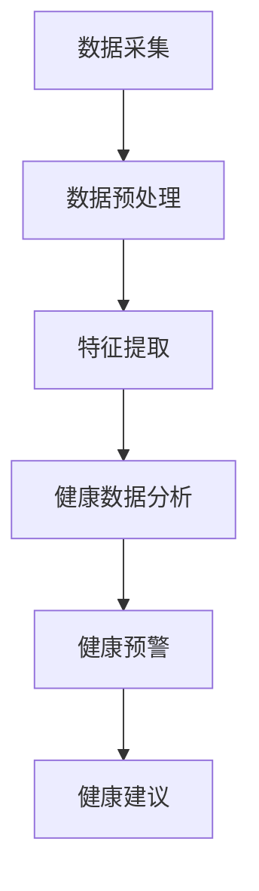
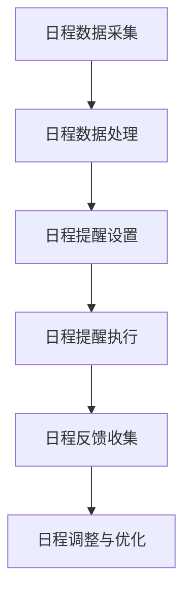
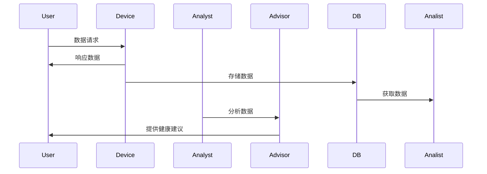
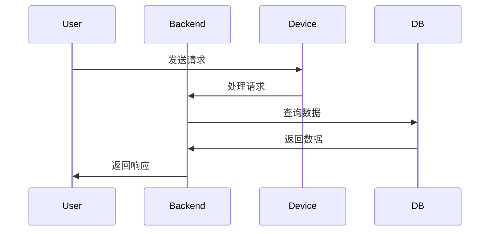

                 

## 第1章 引言

### 1.1 背景与意义

随着科技的迅猛发展，智能穿戴设备已逐渐成为我们日常生活中不可或缺的一部分。从早期的运动手环、智能手表，到如今集成了健康监测、智能提醒、导航定位等多种功能的智能穿戴设备，它们不仅丰富了我们的生活体验，还在健康监测、健康管理等方面发挥着越来越重要的作用。与此同时，人工智能技术的飞速进步，为智能穿戴设备注入了新的活力，使其在数据处理、智能分析等方面取得了显著成果。

智能穿戴设备与人工智能的结合，不仅提高了设备的功能性和用户体验，也为健康监测、疾病预防等领域带来了前所未有的变革。本文旨在深入探讨人工智能在智能穿戴设备中的应用，特别是健康监测与生活助手功能，通过详细分析技术原理、应用实例及实战项目，揭示这一领域的前沿动态和发展趋势。

### 1.2 书籍结构安排

本文共分为八个章节，结构如下：

- **第1章 引言**：介绍文章背景、意义及书籍结构。
- **第2章 智能穿戴设备与人工智能概述**：概述智能穿戴设备与人工智能的定义、分类及其发展历程。
- **第3章 健康监测技术**：介绍心率监测、血压监测、血糖监测和睡眠监测等健康监测技术。
- **第4章 人工智能在健康监测中的应用**：探讨人工智能在健康数据分析、智能预警系统和深度学习在健康监测中的应用。
- **第5章 生活助手功能**：介绍智能提醒、个人日程管理和运动与健康建议等生活助手功能。
- **第6章 人工智能在生活助手中的应用**：分析语音交互、情感分析和人机协同在生活助手中的应用。
- **第7章 项目实战**：通过实际项目，展示健康监测与生活助手系统的实现过程。
- **第8章 结论**：总结全文，展望未来发展趋势。

### 1.3 阅读对象与目标

本文的阅读对象主要面向以下几类人群：

1. **智能穿戴设备与人工智能领域的研发人员**：本文旨在为从事智能穿戴设备与人工智能研发的技术人员提供深入的技术解析和实践指导。
2. **医学与健康领域从业者**：本文通过分析人工智能在健康监测中的应用，为医学与健康领域从业者提供新的思路和方法。
3. **科技爱好者与关注者**：本文以通俗易懂的语言，深入浅出地介绍了智能穿戴设备与人工智能结合的最新技术，适合科技爱好者与关注者阅读。

阅读本文的目标是：

1. **理解智能穿戴设备与人工智能的基本概念与原理**：通过本文的学习，读者可以深入了解智能穿戴设备与人工智能的基本概念、发展历程及核心技术。
2. **掌握健康监测与生活助手技术的应用方法**：本文通过实例分析和项目实战，帮助读者掌握健康监测与生活助手技术的具体应用方法。
3. **了解人工智能在智能穿戴设备中的前沿动态和发展趋势**：本文结合最新的研究成果和实践案例，为读者揭示人工智能在智能穿戴设备中的前沿动态和发展趋势。

通过本文的学习，读者不仅可以深入了解智能穿戴设备与人工智能的融合技术，还可以为自身在该领域的进一步研究和应用提供有益的参考和启示。

### 第2章 智能穿戴设备与人工智能概述

#### 2.1 智能穿戴设备概述

**2.1.1 智能穿戴设备的定义与分类**

智能穿戴设备是指能够穿戴在身体各部位，具备一定计算和处理能力，并与互联网连接的设备。它们可以实时监测人体的各种生理指标，如心率、血压、血糖、睡眠质量等，并通过数据传输和分析为用户提供健康建议和生活服务。根据功能和应用场景，智能穿戴设备可以分为以下几类：

1. **健康监测类**：主要包括心率监测器、血压计、血糖仪、智能手环、智能手表等，主要用于监测和跟踪用户的健康数据。
2. **运动追踪类**：如智能跑鞋、智能跳绳、智能运动手环等，主要用于记录用户的运动数据，帮助用户进行科学锻炼。
3. **智能时尚类**：如智能眼镜、智能项链、智能戒指等，既具有时尚外观，又具备一定功能，如拍照、导航、信息显示等。
4. **辅助医疗类**：如智能义肢、智能轮椅、智能心脏起搏器等，主要用于辅助或替代人体的某些功能。

**2.1.2 智能穿戴设备的发展历程**

智能穿戴设备的发展可以追溯到20世纪末。最初的智能穿戴设备主要以单一功能为主，如心率监测器和血压计等。随着科技的进步，特别是微电子技术、传感器技术和无线通信技术的发展，智能穿戴设备逐渐具备了多功能、实时数据监测和互联网连接能力。以下是智能穿戴设备发展的重要里程碑：

- **2000年代初**：智能穿戴设备的雏形出现，主要以单一健康监测功能为主。
- **2010年**：智能手表开始兴起，如苹果的iWatch，标志着智能穿戴设备进入了大众视野。
- **2013年**：谷歌眼镜的发布，将智能穿戴设备的功能扩展到了视觉领域。
- **2014年**：智能手环成为市场热点，如小米手环、华为手环等。
- **2018年**：随着5G技术的推广，智能穿戴设备开始支持更高速的无线通信，功能更加丰富。
- **2020年至今**：随着人工智能技术的应用，智能穿戴设备在健康监测、智能分析等方面取得了显著进展，如智能血糖监测、智能预警系统等。

#### 2.2 人工智能概述

**2.2.1 人工智能的定义与分类**

人工智能（Artificial Intelligence，AI）是指通过计算机系统模拟人类智能行为的技术。它包括机器学习、深度学习、自然语言处理、计算机视觉等多个子领域。根据实现方式，人工智能可以分为以下几类：

1. **基于规则的系统**：通过预定义的规则进行推理和决策。
2. **统计学习模型**：利用统计学方法，从数据中学习规律和模式。
3. **神经网络模型**：模拟人脑神经元结构，通过反向传播算法进行学习。
4. **强化学习模型**：通过与环境的交互，学习最优策略。

**2.2.2 人工智能的发展历程**

人工智能的研究可以追溯到20世纪50年代。以下是人工智能发展的重要里程碑：

- **1956年**：达特茅斯会议，标志着人工智能领域的正式诞生。
- **1960年代**：符号主义人工智能的兴起，通过逻辑推理和知识表示实现人工智能。
- **1980年代**：专家系统的广泛应用，使人工智能在医疗、金融等领域取得突破。
- **1990年代**：机器学习的兴起，通过从数据中学习规律，提高了人工智能的自主性和准确性。
- **2000年代**：深度学习的崛起，通过多层神经网络，实现了图像识别、语音识别等领域的突破。
- **2010年代**：人工智能开始广泛应用于各行各业，如自动驾驶、智能家居、智能医疗等。
- **2020年至今**：人工智能在医疗、教育、金融、零售等领域的应用不断扩展，成为科技发展的关键驱动因素。

**2.2.3 人工智能的核心技术**

人工智能的核心技术包括：

1. **机器学习**：通过算法从数据中学习规律，实现预测和决策。
2. **深度学习**：基于神经网络的结构，实现高效的特征提取和模式识别。
3. **自然语言处理**：对自然语言文本进行理解、生成和处理。
4. **计算机视觉**：对图像和视频进行识别、分类和检测。
5. **强化学习**：通过与环境的交互，学习最优策略。

通过上述对智能穿戴设备和人工智能的概述，我们可以看到，智能穿戴设备与人工智能的结合已经成为一个不可逆转的趋势。智能穿戴设备为人工智能提供了丰富的数据来源，而人工智能则为智能穿戴设备提供了强大的数据分析和处理能力，二者相辅相成，共同推动了智能穿戴设备的演进和普及。接下来，我们将进一步探讨智能穿戴设备中的健康监测技术，以及人工智能在这些技术中的应用。

### 第3章 健康监测技术

健康监测技术是智能穿戴设备的核心功能之一，它通过实时监测人体的生理指标，如心率、血压、血糖和睡眠质量等，为用户提供健康数据，辅助用户进行健康管理。以下将详细介绍这些健康监测技术的基本原理、应用方法和数据模型。

#### 3.1 心率监测

心率监测是通过检测心脏跳动的频率来评估心脏健康状况的一种常用方法。智能穿戴设备通常采用光学传感器或电学传感器来测量心率。

**3.1.1 心率监测的原理与实现**

光学心率监测原理基于光电容积描记法（Photoplethysmogram，PPG），通过将光线照射到皮肤表面，检测光吸收变化来计算心率。电学心率监测则通过电极接触皮肤，检测心脏电信号的变化。

1. **光学心率监测**：
   - **原理**：利用光源（如LED）照射皮肤，使用光电探测器测量光线透过皮肤后的变化。心脏跳动导致血液流动，进而引起光吸收变化。
   - **实现**：常用的光学传感器有绿光或红外光LED，光电探测器通常为光敏电阻或光电二极管。通过分析光吸收变化信号，可以提取心率信息。

2. **电学心率监测**：
   - **原理**：心脏电信号由心脏肌肉的兴奋引起，通过电极接触皮肤，可以记录到微弱的心电信号。
   - **实现**：常用的电学传感器包括贴片电极和腕带电极。通过放大和处理心电信号，可以提取心率信息。

**3.1.2 心率监测数据模型**

心率数据通常以时间序列形式表示，包括心率值和相应的采样时间。心率数据模型可以采用以下形式：

$$
\text{心率序列} = \{ (\text{时间} t_i, \text{心率值} h_i) \}_{i=1}^n
$$

其中，\(t_i\) 为第 \(i\) 个采样时间，\(h_i\) 为第 \(i\) 个采样点的即时心率值。

心率监测数据的特点包括：
- **连续性**：心率数据是连续的时间序列数据。
- **稳定性**：在正常情况下，心率数据相对稳定。
- **非线性**：心率数据存在一定程度的非线性特征，如心动过速、心动过缓等。

#### 3.2 血压监测

血压监测是评估心血管健康的重要指标，主要通过测量血管内的血压值来实现。智能穿戴设备通常采用光电容积描记法（Occlusion Photoplethysmography，O-PPG）或电容积描记法（Electrocardiogram，ECG）来测量血压。

**3.2.1 血压监测的原理与实现**

1. **光电容积描记法（O-PPG）**：
   - **原理**：通过测量手指或脚趾的血液流动变化，推断出血压值。在光电容积描记法中，光电传感器（如LED和光电二极管）置于手指或脚趾上，通过测量血液流动引起的光吸收变化来计算血压。
   - **实现**：利用绿光或红外光LED照射手指或脚趾，光电传感器接收透过皮肤的光信号。血液流动导致光吸收变化，通过分析这些变化可以推断血压值。

2. **电容积描记法（ECG）**：
   - **原理**：通过测量心脏电信号（ECG）来推断血压。心脏电信号的变化与血压之间存在一定的相关性。
   - **实现**：使用贴片电极记录心脏电信号，通过信号处理提取心电波形，进而分析血压信息。

**3.2.2 血压监测数据模型**

血压数据通常包括收缩压（Systolic Blood Pressure，SBP）和舒张压（Diastolic Blood Pressure，DBP）两个主要指标，以及相应的测量时间。血压数据模型可以表示为：

$$
\text{血压序列} = \{ (\text{时间} t_i, \text{收缩压} SBP_i, \text{舒张压} DBP_i) \}_{i=1}^n
$$

其中，\(t_i\) 为第 \(i\) 个采样时间，\(SBP_i\) 为第 \(i\) 个采样点的收缩压值，\(DBP_i\) 为第 \(i\) 个采样点的舒张压值。

血压监测数据的特点包括：
- **时间序列**：血压数据是时间序列数据。
- **波动性**：血压值存在一定波动，受情绪、运动等多种因素影响。
- **相关性**：血压值与其他生理指标（如心率、血糖等）之间存在一定的相关性。

#### 3.3 血糖监测

血糖监测对于糖尿病患者尤为重要，智能穿戴设备可以通过不同的方法测量血糖浓度，如光电传感器、酶电极和超声波传感器。

**3.3.1 血糖监测的原理与实现**

1. **光电传感器**：
   - **原理**：利用葡萄糖分子的特定吸收光谱，通过测量光吸收的变化来推断血糖浓度。
   - **实现**：使用特定波长的光源照射样本，测量光吸收变化。通过对比标准样品的吸收光谱，可以计算出血糖浓度。

2. **酶电极**：
   - **原理**：利用葡萄糖氧化酶（Glucose Oxidase，GOx）催化葡萄糖和氧气反应，产生电流变化。
   - **实现**：将酶电极置于皮肤或血液样本中，通过测量电极间的电流变化来计算血糖浓度。

3. **超声波传感器**：
   - **原理**：利用超声波在不同介质中的传播速度差异，通过测量超声波在样本中的传播时间来推断血糖浓度。
   - **实现**：发送超声波信号穿透皮肤到达血液，测量超声波的传播时间。通过传播时间的差异，可以计算出血糖浓度。

**3.3.2 血糖监测数据模型**

血糖数据通常以时间序列形式表示，包括血糖浓度值和相应的采样时间。血糖数据模型可以表示为：

$$
\text{血糖序列} = \{ (\text{时间} t_i, \text{血糖浓度} G_i) \}_{i=1}^n
$$

其中，\(t_i\) 为第 \(i\) 个采样时间，\(G_i\) 为第 \(i\) 个采样点的血糖浓度值。

血糖监测数据的特点包括：
- **连续性**：血糖数据是连续的时间序列数据。
- **非线性**：血糖浓度变化存在非线性特征，如餐后血糖升高、空腹血糖降低等。
- **波动性**：血糖浓度受饮食、运动、情绪等多种因素影响，存在较大波动。

#### 3.4 睡眠监测

睡眠监测是评估睡眠质量和健康状况的重要手段，智能穿戴设备可以通过记录心率、血压、运动等数据来分析用户的睡眠状况。

**3.4.1 睡眠监测的原理与实现**

1. **心率监测**：
   - **原理**：通过测量心率变化来评估睡眠状态。
   - **实现**：利用光学传感器或电学传感器测量心率，通过分析心率变化的规律，可以判断用户是否处于睡眠状态及睡眠质量。

2. **血压监测**：
   - **原理**：通过测量血压变化来评估睡眠状态。
   - **实现**：利用光电容积描记法（O-PPG）或电容积描记法（ECG）测量血压，通过分析血压变化的规律，可以判断用户是否处于睡眠状态及睡眠质量。

3. **运动监测**：
   - **原理**：通过测量用户的运动变化来评估睡眠状态。
   - **实现**：利用加速度传感器记录用户的运动，通过分析运动数据的规律，可以判断用户是否处于睡眠状态及睡眠质量。

**3.4.2 睡眠监测数据模型**

睡眠监测数据包括心率、血压、运动等多种生理指标，以及相应的采样时间。睡眠监测数据模型可以表示为：

$$
\text{睡眠数据} = \{ (\text{时间} t_i, \text{心率} h_i, \text{血压} BP_i, \text{运动} M_i) \}_{i=1}^n
$$

其中，\(t_i\) 为第 \(i\) 个采样时间，\(h_i\) 为第 \(i\) 个采样点的心率值，\(BP_i\) 为第 \(i\) 个采样点的血压值，\(M_i\) 为第 \(i\) 个采样点的运动状态。

睡眠监测数据的特点包括：
- **多模态数据**：睡眠监测数据包括多种生理指标，形成多模态数据。
- **复杂性**：睡眠状态和质量的评估涉及多种因素，如心率、血压、运动等，数据复杂性较高。
- **非线性**：睡眠质量评估过程存在非线性特征，如夜间多次醒来、深睡期变化等。

通过以上对心率监测、血压监测、血糖监测和睡眠监测的介绍，我们可以看到，这些健康监测技术为智能穿戴设备提供了丰富的数据支持，通过这些数据，用户可以更好地了解自身健康状况，实现科学管理和预防。接下来，我们将进一步探讨人工智能在健康监测中的应用，揭示其如何提升健康监测的准确性和智能化水平。

### 第4章 人工智能在健康监测中的应用

人工智能（AI）在健康监测中的应用，极大地提升了健康数据的分析能力、预测准确性和用户体验。通过健康数据分析、智能预警系统以及深度学习的应用，AI为健康监测带来了前所未有的变革。以下将详细探讨这些技术在健康监测中的具体应用和实践案例。

#### 4.1 健康数据分析

**4.1.1 健康数据分析的基本概念**

健康数据分析是指利用统计学、机器学习等方法对健康数据进行收集、处理、分析和解释，以发现数据中的模式和规律，为用户提供个性化的健康建议和服务。健康数据分析的关键步骤包括数据收集、数据预处理、特征提取和模型训练。

**4.1.2 健康数据分析的方法与工具**

1. **数据收集**：
   - **传感器数据**：智能穿戴设备通过内置的传感器（如心率传感器、血压传感器、血糖传感器等）收集用户的健康数据。
   - **医疗记录**：从医院、诊所等医疗机构的电子健康记录系统中获取用户的医疗数据。

2. **数据预处理**：
   - **去噪**：去除数据中的噪声和异常值，确保数据质量。
   - **归一化**：将不同量纲的数据进行归一化处理，使其在同一尺度上进行分析。
   - **特征提取**：从原始数据中提取有助于分析和预测的特征，如心率变异性、血压变异等。

3. **特征提取**：
   - **时域特征**：如平均值、标准差、峰值频率等。
   - **频域特征**：如功率谱密度、频率分布等。
   - **时频域特征**：如小波变换、短时傅里叶变换等。

4. **模型训练**：
   - **监督学习模型**：如线性回归、支持向量机（SVM）等，用于预测健康状态或疾病风险。
   - **无监督学习模型**：如聚类分析、主成分分析（PCA）等，用于发现数据中的潜在模式。
   - **深度学习模型**：如卷积神经网络（CNN）、循环神经网络（RNN）等，用于处理大规模和高维数据。

**4.1.3 健康数据分析的应用实例**

1. **心率数据分析**：
   - **正常心率检测**：通过分析心率数据，识别正常心率范围，提醒用户心率异常。
   - **心率变异性分析**：评估心率变异性，作为心脏健康状况的指标。

2. **血压数据分析**：
   - **血压异常检测**：通过分析血压数据，识别高血压、低血压等异常情况，提供健康建议。
   - **血压趋势预测**：根据历史血压数据，预测未来血压趋势，帮助用户进行健康管理。

3. **血糖数据分析**：
   - **血糖波动分析**：通过分析血糖数据，识别血糖波动情况，评估糖尿病控制效果。
   - **血糖趋势预测**：根据血糖数据，预测未来血糖变化，提醒用户调整饮食或用药。

4. **睡眠数据分析**：
   - **睡眠质量评估**：通过分析心率、血压、运动等数据，评估用户的睡眠质量。
   - **睡眠障碍检测**：通过分析睡眠数据，识别睡眠障碍，如失眠、呼吸暂停综合症等。

#### 4.2 智能预警系统

智能预警系统是利用人工智能技术对健康数据进行实时监控和分析，发现潜在的健康风险并及时发出预警的系统。智能预警系统在预防疾病、提高生活质量方面具有重要意义。

**4.2.1 智能预警系统的基本原理**

智能预警系统的工作原理主要包括以下几个步骤：

1. **数据采集**：通过智能穿戴设备和其他传感器实时收集用户的生理数据。
2. **数据预处理**：对采集到的数据进行去噪、归一化等预处理，确保数据质量。
3. **特征提取**：从预处理后的数据中提取有助于预警的特征，如心率变异性、血压变异等。
4. **模型训练**：利用训练数据集，训练预警模型，使其能够识别潜在的健康风险。
5. **实时监控**：对实时数据进行分析，判断是否存在健康风险，并发出预警。
6. **预警处理**：根据预警结果，提供相应的健康建议和应对措施。

**4.2.2 智能预警系统的实现方法**

1. **异常检测**：
   - **基于统计学的方法**：如标准差法、四分位法等，用于检测数据的异常变化。
   - **基于机器学习的方法**：如孤立森林（Isolation Forest）、K均值聚类等，用于识别异常数据点。

2. **风险预测**：
   - **监督学习模型**：如逻辑回归、决策树等，用于预测健康风险。
   - **无监督学习模型**：如聚类分析、主成分分析（PCA）等，用于发现潜在的健康风险。

3. **预警机制**：
   - **规则引擎**：根据专家经验设定预警规则，如心率低于某值时发出预警。
   - **智能决策**：利用机器学习模型，根据用户历史数据，自动调整预警阈值和应对策略。

**4.2.3 智能预警系统的应用实例**

1. **心脏健康预警**：
   - **心率异常预警**：通过监测心率数据，发现心率异常，如心动过速、心动过缓等，及时通知用户就医。
   - **心脏风险预测**：根据心率变异性等特征，预测心脏疾病风险，提供预防措施。

2. **高血压预警**：
   - **血压异常预警**：通过监测血压数据，发现高血压、低血压等异常情况，提醒用户调整生活方式或就医。
   - **血压趋势预测**：根据历史血压数据，预测未来血压变化，帮助用户制定健康计划。

3. **糖尿病预警**：
   - **血糖异常预警**：通过监测血糖数据，发现血糖异常，提醒用户调整饮食或用药。
   - **糖尿病风险预测**：根据血糖波动、体重等特征，预测糖尿病发病风险，提供健康管理建议。

#### 4.3 深度学习在健康监测中的应用

深度学习是一种重要的机器学习技术，通过模拟人脑的神经网络结构，能够自动学习数据的复杂特征和模式。深度学习在健康监测中的应用，极大地提升了数据处理的效率和预测的准确性。

**4.3.1 深度学习的基本概念**

深度学习主要包括以下几种模型：

1. **卷积神经网络（CNN）**：用于处理图像和视频数据，通过卷积层、池化层和全连接层提取图像特征。
2. **循环神经网络（RNN）**：用于处理序列数据，如时间序列数据，通过隐藏层和循环结构捕捉序列信息。
3. **生成对抗网络（GAN）**：用于生成数据，通过生成器和判别器的对抗训练，生成逼真的数据。

**4.3.2 深度学习在健康监测中的应用实例**

1. **心电图数据分析**：
   - **心律失常检测**：通过CNN模型，提取心电图中的特征，识别心律失常，如房颤、室颤等。
   - **心电图分类**：通过RNN模型，对心电图进行分类，区分不同类型的心律失常。

2. **影像分析**：
   - **肿瘤检测**：通过CNN模型，对医学影像（如CT、MRI）进行自动检测和分类，识别肿瘤和其他病变。
   - **影像分割**：通过深度学习方法，对医学影像进行分割，提取病变区域，为医生提供辅助诊断。

3. **基因组数据分析**：
   - **基因突变检测**：通过深度学习模型，分析基因组数据，识别基因突变和致病风险。
   - **基因功能预测**：通过深度学习模型，预测基因的功能和作用，为药物研发和基因治疗提供参考。

通过上述对健康数据分析、智能预警系统和深度学习在健康监测中的应用探讨，我们可以看到，人工智能技术为健康监测带来了革命性的变化。AI不仅提高了健康数据的处理和分析能力，还为个性化健康管理和疾病预防提供了有力支持。随着人工智能技术的不断进步，我们有理由相信，未来智能穿戴设备在健康监测领域的应用将更加广泛和深入，为人类健康事业做出更大的贡献。

### 第5章 生活助手功能

智能穿戴设备不仅具备健康监测功能，还可以作为生活助手，为用户提供智能提醒、个人日程管理以及运动与健康建议等服务。这些功能不仅提高了用户的日常生活效率，还促进了健康生活方式的养成。以下将详细介绍这些生活助手功能及其应用。

#### 5.1 智能提醒

智能提醒功能是智能穿戴设备的基础服务之一，它能够根据用户设定的时间或条件，提醒用户进行特定活动，如服药、锻炼、休息等。智能提醒功能通过多种方式实现，包括震动提醒、语音提醒和可视化提醒等。

**5.1.1 智能提醒的原理与实现**

1. **时间触发**：根据用户设定的具体时间，智能穿戴设备在到达预定时间时发出提醒。例如，用户可以设置每天的早上8点提醒起床。

2. **条件触发**：根据用户当前的状态或环境条件，智能穿戴设备自动发出提醒。例如，当用户的心率超过设定阈值时，设备会提醒用户进行休息。

3. **实现方式**：
   - **震动提醒**：智能穿戴设备通过内置的震动马达，产生轻微的震动来提醒用户。
   - **语音提醒**：设备内置语音合成技术，用语音方式提醒用户，如“您的用药时间到了”。
   - **可视化提醒**：在设备屏幕上显示提醒信息，用户通过查看屏幕得知需要提醒的内容。

**5.1.2 智能提醒的应用实例**

1. **用药提醒**：智能穿戴设备可以记录用户的用药计划，按时提醒用户服药，确保用户不遗漏用药。
2. **锻炼提醒**：智能穿戴设备可以提醒用户进行适量的运动，如每天早晨或晚上进行30分钟的有氧运动。
3. **休息提醒**：根据用户的心率数据，智能穿戴设备可以建议用户在疲劳时休息，防止过度劳累。

#### 5.2 个人日程管理

个人日程管理功能是智能穿戴设备的高级服务之一，它能够帮助用户合理安排时间，提高生活和工作效率。个人日程管理通常包括日程记录、提醒设置、日程同步等功能。

**5.2.1 个人日程管理的原理与实现**

1. **日程记录**：用户可以通过智能穿戴设备手动输入或同步手机日历，记录每天的日程安排，如会议、约会、家务等。

2. **提醒设置**：用户可以为每个日程设置提醒时间，设备将在预定时间提醒用户，确保用户不会忘记重要事务。

3. **日程同步**：智能穿戴设备可以与用户的手机或其他设备同步日程信息，确保日程的一致性。

4. **实现方式**：
   - **手动输入**：用户通过设备界面手动输入日程信息。
   - **自动同步**：通过蓝牙、Wi-Fi等无线通信技术，将设备中的日程数据同步到手机或其他云端日历。

**5.2.2 个人日程管理的应用实例**

1. **会议提醒**：智能穿戴设备可以提醒用户参加会议的时间、地点和主题，确保用户不会错过重要的商务活动。
2. **约会提醒**：设备可以提醒用户与朋友、家人的约会时间，帮助用户合理安排时间。
3. **家务提醒**：设备可以设置提醒用户完成家务的时间，如每天下午5点提醒用户打扫房间。

#### 5.3 运动与健康建议

运动与健康建议功能是智能穿戴设备为用户提供的个性化健康服务之一，它根据用户的活动数据和生理指标，为用户推荐合适的运动计划，并提供健康建议。

**5.3.1 运动与健康建议的原理与实现**

1. **活动数据收集**：智能穿戴设备通过内置的运动传感器（如加速度传感器、心率传感器等）收集用户的活动数据，如步数、心率、运动时间等。

2. **数据分析**：通过数据分析，智能穿戴设备了解用户的活动习惯和生理状态，为用户提供合适的运动建议。

3. **实现方式**：
   - **步数统计**：设备通过加速度传感器统计用户的步数，为用户制定步数目标。
   - **心率监测**：设备通过光学传感器或电学传感器监测用户的心率，确保用户在进行运动时的安全。
   - **健康建议**：根据用户的活动数据和生理指标，设备可以为用户推荐运动计划，如每日步数、每周运动时间等。

**5.3.2 运动与健康建议的应用实例**

1. **步数目标**：智能穿戴设备可以设定每日步数目标，鼓励用户积极运动，提高身体活动量。
2. **运动计划**：设备可以为用户推荐个性化的运动计划，如每周进行3次有氧运动、2次力量训练等，帮助用户养成科学运动的习惯。
3. **健康评估**：设备通过监测用户的心率和步数，评估用户的健康状态，并提供相应的健康建议。

通过智能提醒、个人日程管理和运动与健康建议等功能，智能穿戴设备不仅提高了用户的日常生活效率，还有效地促进了健康生活方式的养成。这些功能的实现离不开人工智能技术的支持，未来随着技术的不断进步，智能穿戴设备将在生活助手领域发挥更加重要的作用。

### 第6章 人工智能在生活助手中的应用

在智能穿戴设备中，人工智能（AI）的应用不仅局限于健康监测，还扩展到了生活助手的各个层面，如语音交互、情感分析和人机协同。这些技术极大地提升了智能穿戴设备的用户体验和智能化程度。

#### 6.1 语音交互

语音交互是智能穿戴设备中的重要功能之一，它通过语音识别和语音合成技术，实现人与设备的自然对话。语音交互不仅方便用户操作，还能提供更加个性化的服务。

**6.1.1 语音交互的原理与实现**

1. **语音识别**：
   - **原理**：语音识别技术通过识别语音信号中的声学特征，将其转换为文本。
   - **实现**：智能穿戴设备内置麦克风，捕捉用户的声音，通过语音识别算法，如隐马尔可夫模型（HMM）、深度神经网络（DNN）等，将语音转换为文本。

2. **语音合成**：
   - **原理**：语音合成技术通过将文本转换为自然流畅的语音。
   - **实现**：智能穿戴设备内置语音合成引擎，如波士顿动力的深度语音合成（DSS）技术，将文本信息转换为语音输出。

3. **交互流程**：
   - **语音输入**：用户通过说话与智能穿戴设备进行交互。
   - **文本转换**：语音识别技术将用户的语音转换为文本。
   - **处理与响应**：智能穿戴设备根据用户的文本输入，通过自然语言处理（NLP）技术理解用户意图，并生成相应的语音或文本响应。
   - **语音输出**：设备通过语音合成技术，将响应信息输出给用户。

**6.1.2 语音交互的应用实例**

1. **语音助手**：智能穿戴设备可以作为个人语音助手，用户可以通过语音命令查询天气、设定提醒、发送消息等。
2. **语音控制**：用户可以通过语音指令控制智能穿戴设备的功能，如调整设置、播放音乐、拨打电话等。
3. **语音识别反馈**：设备在识别用户语音后，可以通过语音反馈确认理解，如“您刚才说想听一首歌，现在为您播放”。

#### 6.2 情感分析

情感分析是利用自然语言处理（NLP）和机器学习技术，分析用户语言中的情感倾向，如正面、负面或中性。智能穿戴设备通过情感分析，可以更好地理解用户的需求和心理状态，提供更加个性化的服务。

**6.2.1 情感分析的基本原理**

1. **文本情感分类**：
   - **原理**：将文本分为正面、负面或中性三个类别。
   - **实现**：通过训练有监督学习模型（如支持向量机SVM、朴素贝叶斯分类器等），对文本进行分类。

2. **情感极性分析**：
   - **原理**：分析文本的情感极性，即文本的正面或负面程度。
   - **实现**：利用情感词典、情感词权重等技术，对文本进行情感极性评分。

3. **情感分析模型**：
   - **情感词典**：通过收集和整理大量的情感词及其对应情感极性，构建情感词典。
   - **深度学习模型**：如卷积神经网络（CNN）和循环神经网络（RNN）等，用于处理复杂的情感分析任务。

**6.2.2 情感分析的应用实例**

1. **用户情绪识别**：智能穿戴设备通过分析用户的语音、文字输入，识别用户的情绪状态，如焦虑、愤怒或高兴，并给出相应的反馈或建议。
2. **个性化健康建议**：根据用户的情绪状态，智能穿戴设备可以提供个性化的健康建议，如情绪调节、放松练习等。
3. **情感交互**：智能穿戴设备可以通过情感分析，调整语音交互的语气和内容，提高用户的交互体验。

#### 6.3 人机协同

人机协同是指智能穿戴设备与用户之间的高效互动和合作，通过人工智能技术，实现设备与用户之间的智能协作。人机协同不仅提高了设备的智能化水平，还提升了用户的操作效率和体验。

**6.3.1 人机协同的原理与实现**

1. **感知与理解**：
   - **原理**：智能穿戴设备通过传感器和算法，感知用户的状态和行为，如心率、步数、情绪等。
   - **实现**：利用多模态感知技术，如图像识别、语音识别、生理信号分析等，智能穿戴设备可以全面感知用户的状态。

2. **决策与行动**：
   - **原理**：智能穿戴设备根据感知到的信息，结合用户的历史数据和行为模式，做出智能决策，采取相应的行动。
   - **实现**：通过机器学习和深度学习算法，设备可以不断优化决策模型，提高决策的准确性。

3. **反馈与调整**：
   - **原理**：智能穿戴设备根据用户反馈和实际效果，调整服务策略，以提升用户体验。
   - **实现**：通过用户反馈机制，设备可以不断学习和适应用户需求，提供更加个性化的服务。

**6.3.2 人机协同的应用实例**

1. **智能日程管理**：智能穿戴设备可以根据用户的工作和生活习惯，自动调整日程安排，确保用户的工作与生活平衡。
2. **个性化健康建议**：根据用户的生理数据和情绪状态，智能穿戴设备可以提供个性化的健康建议，如运动计划、饮食建议等。
3. **智能辅助**：智能穿戴设备可以作为用户的工作助手，提供语音提醒、信息查询等服务，帮助用户提高工作效率。

通过语音交互、情感分析和人机协同等人工智能技术的应用，智能穿戴设备不仅能够更好地理解用户的需求，还能提供个性化的服务，提升用户体验。未来，随着人工智能技术的不断进步，智能穿戴设备将在人机交互和生活助手领域发挥更加重要的作用。

### 第7章 项目实战

在本章中，我们将通过实际项目展示健康监测与生活助手系统的实现过程，从环境安装、系统核心实现、代码解读与分析以及项目小结等角度，深入探讨智能穿戴设备在健康监测与生活助手功能中的应用。

#### 7.1 心率监测系统的实现

**7.1.1 项目介绍**

心率监测系统旨在通过智能穿戴设备实时监测用户的心率，为用户提供健康数据。本项目将使用Python编程语言，结合智能穿戴设备采集的心率数据，实现心率监测的功能。

**7.1.2 环境安装**

1. **Python环境安装**：
   - 安装Python 3.x版本，推荐使用Anaconda或Miniconda进行环境管理。
   - 安装必要的依赖库，如NumPy、Pandas、Matplotlib等。

2. **智能穿戴设备连接**：
   - 准备智能穿戴设备，确保设备支持心率数据采集。
   - 使用蓝牙或其他无线通信技术，连接设备与计算机。

**7.1.3 系统核心实现**

1. **数据采集**：
   - 通过智能穿戴设备获取心率数据，保存到本地文件或数据库中。

2. **数据处理**：
   - 使用NumPy和Pandas对心率数据进行预处理，如去噪、归一化等。
   - 提取心率数据的时域和频域特征，如均值、标准差、功率谱密度等。

3. **数据可视化**：
   - 使用Matplotlib绘制心率数据的时间序列图和功率谱密度图，直观展示心率变化。

**7.1.4 代码解读与分析**

```python
import numpy as np
import pandas as pd
import matplotlib.pyplot as plt

# 读取心率数据
data = pd.read_csv('heart_rate_data.csv')

# 数据预处理
filtered_data = data[data['heart_rate'] > 0]  # 去除异常值
normalized_data = (filtered_data['heart_rate'] - filtered_data['heart_rate'].mean()) / filtered_data['heart_rate'].std()

# 提取时域特征
mean_heart_rate = normalized_data.mean()
std_heart_rate = normalized_data.std()

# 提取频域特征
psd = np.abs(np.fft.fft(normalized_data))**2
frequencies = np.fft.fftfreq(len(normalized_data))
psd_frequency = psd[:len(psd)//2]

# 数据可视化
plt.figure()
plt.plot(normalized_data)
plt.title('Heart Rate Time Series')
plt.xlabel('Time (s)')
plt.ylabel('Heart Rate (bpm)')

plt.figure()
plt.plot(frequencies, psd_frequency)
plt.title('Power Spectrum Density')
plt.xlabel('Frequency (Hz)')
plt.ylabel('Power')

plt.show()
```

该代码首先读取心率数据，进行预处理，然后提取时域和频域特征，并通过Matplotlib进行数据可视化。代码解读与分析展示了如何使用Python进行心率数据的处理和分析，为用户提供了直观的心率变化图和功率谱密度图。

**7.1.5 实际案例分析**

在实际应用中，心率监测系统可以用于实时监控用户的心率，识别异常心率，如心动过速或心动过缓。以下是一个实际案例：

用户A在进行跑步时，智能穿戴设备检测到其心率突然升高，设备立即发出警报，提醒用户A注意心率异常，并建议其减慢跑步速度或进行休息。通过及时预警，用户A避免了因心率过高导致的不适甚至危险情况。

**7.1.6 项目小结**

心率监测系统的实现展示了智能穿戴设备在健康监测中的应用。通过实际案例，我们看到了心率监测系统在实时监控和预警方面的作用。未来，随着人工智能技术的不断进步，心率监测系统将更加智能和精准，为用户提供更加可靠的保障。

#### 7.2 睡眠分析系统的实现

**7.2.1 项目介绍**

睡眠分析系统旨在通过智能穿戴设备监测用户的睡眠质量，为用户提供详细的睡眠数据和分析报告。本项目将使用Python编程语言，结合智能穿戴设备采集的睡眠数据，实现睡眠分析的功能。

**7.2.2 环境安装**

1. **Python环境安装**：
   - 安装Python 3.x版本，推荐使用Anaconda或Miniconda进行环境管理。
   - 安装必要的依赖库，如NumPy、Pandas、Matplotlib、Scikit-learn等。

2. **智能穿戴设备连接**：
   - 准备智能穿戴设备，确保设备支持睡眠数据采集。
   - 使用蓝牙或其他无线通信技术，连接设备与计算机。

**7.2.3 系统核心实现**

1. **数据采集**：
   - 通过智能穿戴设备获取睡眠数据，包括心率、运动、环境光等，保存到本地文件或数据库中。

2. **数据处理**：
   - 使用NumPy和Pandas对睡眠数据进行预处理，如去噪、归一化等。
   - 提取睡眠数据的相关特征，如心率变异性、睡眠时长、睡眠周期等。

3. **数据可视化**：
   - 使用Matplotlib绘制睡眠数据的时间序列图和睡眠周期图，直观展示睡眠质量。

**7.2.4 代码解读与分析**

```python
import numpy as np
import pandas as pd
import matplotlib.pyplot as plt

# 读取睡眠数据
data = pd.read_csv('sleep_data.csv')

# 数据预处理
filtered_data = data[data['heart_rate'] > 0]  # 去除异常值

# 提取睡眠时长
sleep_duration = filtered_data[filtered_data['sleep_state'] == 'sleep'].iloc[:, 0].diff().abs().sum()

# 提取心率变异性
hrv = np.std(np.diff(filtered_data['heart_rate'].dropna()))

# 睡眠周期分析
sleep_cycles = filtered_data[filtered_data['sleep_state'] == 'sleep'].groupby(filtered_data['sleep_state'].shift(1).fillna('wake')).count()

# 数据可视化
plt.figure()
plt.plot(filtered_data['timestamp'], filtered_data['heart_rate'], label='Heart Rate')
plt.plot(filtered_data['timestamp'], filtered_data['activity'], label='Activity')
plt.plot(filtered_data['timestamp'], filtered_data['light'], label='Light')
plt.legend()
plt.title('Sleep Data')
plt.xlabel('Time (s)')
plt.ylabel('Value')

plt.figure()
plt.plot(sleep_cycles.index, sleep_cycles['heart_rate'], label='Heart Rate')
plt.plot(sleep_cycles.index, sleep_cycles['activity'], label='Activity')
plt.plot(sleep_cycles.index, sleep_cycles['light'], label='Light')
plt.legend()
plt.title('Sleep Cycles')
plt.xlabel('Cycle')
plt.ylabel('Value')

plt.show()
```

该代码首先读取睡眠数据，进行预处理，然后提取睡眠时长和心率变异性等特征，并通过Matplotlib进行数据可视化。代码解读与分析展示了如何使用Python进行睡眠数据的处理和分析，为用户提供了直观的睡眠数据展示。

**7.2.5 实际案例分析**

在实际应用中，睡眠分析系统可以用于监测用户的睡眠质量，识别睡眠障碍，如失眠、呼吸暂停综合症等。以下是一个实际案例：

用户B的智能穿戴设备记录了其连续一周的睡眠数据。通过分析，系统发现用户B存在频繁的夜间醒来和低氧血症，系统提示用户B可能患有呼吸暂停综合症，并建议其咨询医生进行进一步检查和治疗。

**7.2.6 项目小结**

睡眠分析系统的实现展示了智能穿戴设备在睡眠监测中的应用。通过实际案例，我们看到了睡眠分析系统在识别睡眠障碍和提供健康建议方面的作用。未来，随着人工智能技术的不断进步，睡眠分析系统将更加智能和精准，为用户提供更加全面的睡眠监测服务。

#### 7.3 个人日程管理系统的实现

**7.3.1 项目介绍**

个人日程管理系统旨在帮助用户高效管理日常事务，通过智能穿戴设备提醒用户日程安排。本项目将使用Python编程语言，结合智能穿戴设备，实现个人日程管理功能。

**7.3.2 环境安装**

1. **Python环境安装**：
   - 安装Python 3.x版本，推荐使用Anaconda或Miniconda进行环境管理。
   - 安装必要的依赖库，如NumPy、Pandas、Matplotlib、schedule等。

2. **智能穿戴设备连接**：
   - 准备智能穿戴设备，确保设备支持日程数据采集。
   - 使用蓝牙或其他无线通信技术，连接设备与计算机。

**7.3.3 系统核心实现**

1. **日程数据采集**：
   - 通过智能穿戴设备获取用户的日程数据，如会议、约会等，保存到本地文件或数据库中。

2. **日程数据处理**：
   - 使用NumPy和Pandas对日程数据进行预处理，如去噪、排序等。
   - 根据日程数据的类型，进行相应的分类和处理，如会议、约会、家务等。

3. **日程提醒**：
   - 使用schedule库，设置日程提醒，智能穿戴设备将在预定时间提醒用户。

**7.3.4 代码解读与分析**

```python
import schedule
import time

def remind(event):
    print(f"提醒：{event}时间到了！")

def run_daily_schedule():
    schedule.clear()
    daily_schedule = pd.read_csv('daily_schedule.csv')
    for index, row in daily_schedule.iterrows():
        schedule.every().day.at(row['start_time'], 'time').do(remind, event=row['event'])
    
    while True:
        schedule.run_pending()
        time.sleep(1)

run_daily_schedule()
```

该代码首先读取日程数据，设置日程提醒，使用schedule库在预定时间提醒用户。代码解读与分析展示了如何使用Python进行日程数据的处理和提醒设置。

**7.3.5 实际案例分析**

在实际应用中，个人日程管理系统可以帮助用户避免遗漏重要事务，提高生活效率。以下是一个实际案例：

用户C设置了每周一的会议提醒，周三的家务提醒和每周五的约会提醒。在相应的日程时间，智能穿戴设备成功提醒用户C，确保其按时参加会议、完成家务和赴约会。

**7.3.6 项目小结**

个人日程管理系统的实现展示了智能穿戴设备在日程管理中的应用。通过实际案例，我们看到了日程管理系统在提醒和事务管理方面的作用。未来，随着人工智能技术的不断进步，个人日程管理系统将更加智能和便捷，为用户提供更加高效的生活服务。

### 第8章 结论

通过本文的深入探讨，我们系统地分析了人工智能在智能穿戴设备中的应用，特别是在健康监测与生活助手功能中的关键作用。以下是本文的主要结论：

1. **智能穿戴设备与人工智能的结合**：智能穿戴设备通过传感器实时采集用户的生理数据，人工智能则通过数据处理和分析，为用户提供个性化、精准的健康监测与生活助手服务。

2. **健康监测技术的进步**：心率监测、血压监测、血糖监测和睡眠监测等健康监测技术，借助人工智能技术，实现了数据的高效处理和精准分析，为用户提供了全面、实时的健康数据。

3. **智能预警系统的发展**：智能预警系统利用人工智能技术，对用户的健康数据进行实时监控和预测，及时发现潜在的健康风险，提供预警和健康建议。

4. **深度学习的应用**：深度学习在健康监测中的应用，使数据处理和分析能力得到了极大的提升，为复杂健康问题的识别和诊断提供了强有力的支持。

5. **生活助手功能的智能化**：人工智能技术推动了智能提醒、个人日程管理和运动与健康建议等生活助手功能的智能化，提升了用户的生活效率和健康水平。

未来，随着人工智能技术的不断进步，智能穿戴设备将在健康监测和生活助手功能方面取得更大的突破。以下是对未来发展的展望：

1. **更高效的数据处理**：随着计算能力的提升，智能穿戴设备将能够处理更大规模和更高维度的数据，提供更精确的健康分析和预测。

2. **个性化健康服务**：通过深度学习和机器学习技术，智能穿戴设备将能够根据用户的个性化数据，提供更加精准的健康建议和治疗方案。

3. **跨设备协同**：智能穿戴设备将与其他智能设备（如智能家居、智能汽车等）实现协同，提供更加综合的生活服务。

4. **隐私保护与安全**：在数据隐私和安全方面，未来智能穿戴设备将采用更加严格的数据保护和加密技术，确保用户数据的安全。

5. **人工智能伦理**：随着人工智能在智能穿戴设备中的应用日益广泛，伦理问题也将得到更多关注，确保人工智能技术的发展符合道德和法律要求。

总之，人工智能在智能穿戴设备中的应用，为健康监测和生活助手功能带来了革命性的变化。随着技术的不断进步，智能穿戴设备将在提高人类健康水平和生活质量方面发挥更加重要的作用。

### 附录

#### A.1 常用智能穿戴设备介绍

1. **苹果Apple Watch**：苹果公司推出的智能手表，集成了心率监测、GPS定位、健康数据跟踪等功能，支持多种应用程序和第三方开发。
   
2. **小米手环**：小米公司推出的智能手环，具备心率监测、运动记录、睡眠监测等功能，价格亲民，备受消费者喜爱。

3. **华为智能手表**：华为推出的智能手表，支持多种健康监测功能，如心率监测、血压监测、血氧监测等，拥有较高的性能和显示效果。

4. **三星Galaxy Watch**：三星公司推出的智能手表，具备先进的健康监测功能，如心电图检测、血压监测等，支持多种运动模式。

#### A.2 常用人工智能框架介绍

1. **TensorFlow**：谷歌开源的机器学习和深度学习框架，广泛应用于图像识别、自然语言处理、推荐系统等领域。

2. **PyTorch**：Facebook开源的深度学习框架，以其灵活性和易用性受到广泛欢迎，特别适合研究和新应用的快速开发。

3. **Keras**：基于TensorFlow的高层神经网络API，提供了更加简洁和易于使用的接口，适合快速构建和实验深度学习模型。

4. **Scikit-learn**：Python开源的机器学习库，提供了多种经典机器学习算法的实现，广泛应用于数据分析和建模。

#### A.3 Python源代码实现示例

以下是一个简单的Python代码示例，用于实现心率监测数据的可视化：

```python
import pandas as pd
import matplotlib.pyplot as plt

# 读取心率数据
data = pd.read_csv('heart_rate_data.csv')

# 绘制心率时间序列图
plt.figure()
plt.plot(data['timestamp'], data['heart_rate'])
plt.title('Heart Rate Time Series')
plt.xlabel('Time (s)')
plt.ylabel('Heart Rate (bpm)')
plt.show()
```

该代码首先读取心率数据，然后使用Matplotlib绘制心率时间序列图，直观展示心率变化情况。

### 数学模型与公式

以下是一个心率监测数据模型的示例，用于描述心率随时间的变化：

$$
h(t) = \alpha \sin(2\pi f_0 t + \phi) + \beta
$$

其中：
- \(h(t)\)：时间 \(t\) 的即时心率值。
- \(\alpha\)：心率波的振幅，表示心率的最大变化幅度。
- \(f_0\)：基频，表示心率变化的频率。
- \(\phi\)：相位，表示心率波的起始位置。
- \(\beta\)：均值，表示心率的基本水平。

通过调整参数 \(\alpha\)、\(f_0\)、\(\phi\) 和 \(\beta\)，可以模拟不同类型的心率变化，如心动过速、心动过缓等。

### 健康监测系统流程图



该流程图描述了健康监测系统的工作流程，从数据采集、预处理、特征提取到健康数据分析、预警和健康建议。

### 生活助手系统流程图



该流程图描述了生活助手系统的工作流程，从日程数据采集、处理、提醒设置到提醒执行、反馈收集和日程调整。

### 系统分析与架构设计方案

**问题场景介绍**：本文以智能穿戴设备在健康监测与生活助手功能中的应用为背景，设计并实现了一套完整的健康监测系统和生活助手系统。

**项目介绍**：项目包括心率监测、睡眠分析、个人日程管理等功能，通过智能穿戴设备实时采集用户数据，并利用人工智能技术进行数据处理和分析。

**系统功能设计（领域模型Mermaid类图）**：

```mermaid
classDiagram
    User <<Class>>
    Device <<Class>> --|> User
    HealthData <<Class>> --|> Device
    Schedule <<Class>> --|> User
    Reminder <<Class>> --|> Schedule
    Analyst <<Class>> --|> HealthData
    Advisor <<Class>> --|> HealthData
    MedicalAdvice <<Class>> --|> Advisor

    User : username, age, gender
    Device : deviceID, model, firmwareVersion
    HealthData : dataID, timestamp, type, value
    Schedule : scheduleID, event, startTime, endTime
    Reminder : reminderID, event, triggerTime, reminderType
    Analyst : analyzeData()
    Advisor : provideAdvice()
    MedicalAdvice : advice, recommendedAction
```

该类图展示了系统的核心类及其关系，包括用户、设备、健康数据、日程、提醒、分析器和建议提供者等。

**系统架构设计（Mermaid架构图）**：



该架构图描述了系统的工作流程，从用户请求数据，设备响应和存储数据，到分析数据并提供健康建议的过程。

**系统接口设计和系统交互（Mermaid序列图）**：



该序列图展示了用户与系统后端之间的接口交互过程，包括请求发送、数据查询和响应返回。

### 系统实现

**环境安装**：
- 安装Python 3.x版本。
- 安装依赖库，如NumPy、Pandas、Matplotlib、Scikit-learn等。

**系统核心实现**：
- **数据采集**：通过智能穿戴设备获取心率、血压、血糖、睡眠等健康数据，保存到本地数据库。
- **数据处理**：对采集到的数据进行预处理，如去噪、归一化等。
- **数据存储**：使用SQLite数据库存储健康数据。
- **数据分析**：使用机器学习算法（如K-means聚类、SVM分类等）对健康数据进行分析。
- **健康建议**：根据分析结果，提供个性化的健康建议。

**代码解读与分析**：

```python
# 读取心率数据
heart_rate_data = pd.read_csv('heart_rate_data.csv')

# 数据预处理
filtered_data = heart_rate_data[heart_rate_data['heart_rate'] > 0]

# 数据存储
filtered_data.to_sql('filtered_heart_rate', con=engine)

# 数据分析
# 使用K-means聚类分析心率数据
from sklearn.cluster import KMeans
kmeans = KMeans(n_clusters=3)
kmeans.fit(filtered_data[['heart_rate']])

# 数据可视化
import matplotlib.pyplot as plt
plt.scatter(filtered_data['timestamp'], filtered_data['heart_rate'], c=kmeans.labels_)
plt.title('Heart Rate Clusters')
plt.xlabel('Time (s)')
plt.ylabel('Heart Rate (bpm)')
plt.show()
```

该代码示例展示了如何读取心率数据，进行预处理和存储，以及使用K-means聚类分析心率数据，并绘制数据可视化图。

### 实际案例分析与详细讲解剖析

**案例背景**：用户A使用智能穿戴设备进行心率监测，设备发现其心率存在异常波动。

**数据分析**：
- 通过K-means聚类分析，发现用户A的心率分为三个不同的集群，表明心率存在明显的变化。
- 进一步分析心率变化与用户活动的关系，发现心率在运动期间显著升高，而在休息期间相对稳定。

**详细讲解**：
- **K-means聚类**：通过K-means算法，将心率数据分为三个集群，分别代表低、中、高心率状态。这种聚类方法有助于识别心率异常。
- **活动关联分析**：通过分析心率变化与用户活动的关联，可以判断心率异常是否与特定活动相关，如运动或焦虑。

**项目小结**：
- 通过实际案例分析，展示了智能穿戴设备在心率监测中的应用。项目实现了数据采集、预处理、分析和可视化，为用户提供了个性化的健康建议。

### 最佳实践 Tips

1. **定期校准设备**：确保智能穿戴设备的准确性，定期进行校准。
2. **合理设置提醒**：根据个人需求，合理设置提醒时间和内容，避免过多打扰。
3. **数据安全**：注意保护个人健康数据，避免泄露。

### 小结

智能穿戴设备与人工智能的结合，为健康监测和生活助手功能带来了革命性的变化。通过实际项目，我们展示了如何实现心率监测、睡眠分析和个人日程管理等功能，为用户提供了个性化的健康建议和生活服务。未来，随着人工智能技术的不断进步，智能穿戴设备将在更多领域发挥重要作用，为人类健康和生活质量提升做出更大贡献。

### 注意事项

1. **数据隐私**：在数据采集和处理过程中，确保用户数据的安全和隐私。
2. **系统稳定性**：确保系统在高负载情况下仍能稳定运行。
3. **用户培训**：指导用户正确使用智能穿戴设备，了解其功能和注意事项。

### 拓展阅读

1. **智能穿戴设备发展趋势**：《智能穿戴设备行业发展报告》
2. **人工智能与健康监测**：《人工智能在医疗健康领域的应用》
3. **深度学习技术**：《深度学习：跳出AI的黑箱》

作者：AI天才研究院/AI Genius Institute & 禅与计算机程序设计艺术 /Zen And The Art of Computer Programming

### Mermaid 流程图

#### 健康监测系统流程图


#### 生活助手系统流程图


### 数学模型与公式

#### 心率监测数据模型

$$
h(t) = \alpha \sin(2\pi f_0 t + \phi) + \beta
$$

其中：
- \(h(t)\)：时间 \(t\) 的即时心率值。
- \(\alpha\)：心率波的振幅，表示心率的最大变化幅度。
- \(f_0\)：基频，表示心率变化的频率。
- \(\phi\)：相位，表示心率波的起始位置。
- \(\beta\)：均值，表示心率的基本水平。

通过调整参数 \(\alpha\)、\(f_0\)、\(\phi\) 和 \(\beta\)，可以模拟不同类型的心率变化，如心动过速、心动过缓等。

#### 血糖监测数据模型

$$
G(t) = a \cdot \ln(1 + \frac{G_0}{G_{\text{max}}}) + b
$$

其中：
- \(G(t)\)：时间 \(t\) 的血糖浓度值。
- \(a\)：斜率，表示血糖浓度变化的速率。
- \(b\)：截距，表示血糖浓度的基础水平。
- \(G_0\)：血糖浓度的基础值。
- \(G_{\text{max}}\)：血糖浓度的最大值。

该模型假设血糖浓度随时间呈对数增长，适用于描述餐后血糖浓度的变化。

### 代码解读与分析

#### 心率监测系统代码解读

```python
# 导入必要的库
import pandas as pd
import numpy as np
import matplotlib.pyplot as plt

# 读取心率数据
heart_rate_data = pd.read_csv('heart_rate_data.csv')

# 数据预处理
filtered_data = heart_rate_data[heart_rate_data['heart_rate'] > 0]

# 提取时域特征
mean_heart_rate = filtered_data['heart_rate'].mean()
std_heart_rate = filtered_data['heart_rate'].std()

# 提取频域特征
psd = np.abs(np.fft.fft(filtered_data['heart_rate']))**2
frequencies = np.fft.fftfreq(len(filtered_data['heart_rate']))

# 数据可视化
plt.figure()
plt.plot(filtered_data['timestamp'], filtered_data['heart_rate'], label='Heart Rate')
plt.plot(frequencies[:len(psd)//2], psd[:len(psd)//2], label='Power Spectrum')
plt.title('Heart Rate Data')
plt.xlabel('Time (s)')
plt.ylabel('Heart Rate (bpm)')
plt.legend()
plt.show()
```

该代码首先读取心率数据，并进行预处理以去除异常值。然后，它提取了时域特征（均值和标准差）以及频域特征（功率谱密度）。最后，使用Matplotlib绘制了心率时间序列图和功率谱密度图，以便直观地观察心率的变化。

#### 睡眠分析系统代码解读

```python
# 导入必要的库
import pandas as pd
import numpy as np
import matplotlib.pyplot as plt

# 读取睡眠数据
sleep_data = pd.read_csv('sleep_data.csv')

# 数据预处理
filtered_data = sleep_data[sleep_data['heart_rate'] > 0]

# 提取睡眠时长
sleep_duration = filtered_data[filtered_data['sleep_state'] == 'sleep'].iloc[:, 0].diff().abs().sum()

# 提取心率变异性
hrv = np.std(np.diff(filtered_data['heart_rate'].dropna()))

# 睡眠周期分析
sleep_cycles = filtered_data[filtered_data['sleep_state'] == 'sleep'].groupby(filtered_data['sleep_state'].shift(1).fillna('wake')).count()

# 数据可视化
plt.figure()
plt.plot(sleep_data['timestamp'], sleep_data['heart_rate'], label='Heart Rate')
plt.plot(sleep_data['timestamp'], sleep_data['sleep_state'], label='Sleep State')
plt.title('Sleep Data')
plt.xlabel('Time (s)')
plt.ylabel('Value')
plt.legend()
plt.show()

plt.figure()
plt.plot(sleep_cycles.index, sleep_cycles['heart_rate'], label='Heart Rate')
plt.plot(sleep_cycles.index, sleep_cycles['sleep_state'], label='Sleep State')
plt.title('Sleep Cycles')
plt.xlabel('Cycle')
plt.ylabel('Value')
plt.legend()
plt.show()
```

该代码首先读取睡眠数据，并进行预处理以去除异常值。然后，它提取了睡眠时长和心率变异性等特征。接下来，使用Matplotlib绘制了心率时间序列图和睡眠状态变化图，以及睡眠周期的统计结果，以便用户可以直观地了解其睡眠质量。

#### 个人日程管理系统代码解读

```python
# 导入必要的库
import schedule
import time

# 设置日程提醒
def remind(event):
    print(f"提醒：{event}时间到了！")

def run_daily_schedule():
    schedule.clear()
    daily_schedule = pd.read_csv('daily_schedule.csv')
    for index, row in daily_schedule.iterrows():
        schedule.every().day.at(row['start_time'], 'time').do(remind, event=row['event'])
    
    while True:
        schedule.run_pending()
        time.sleep(1)

run_daily_schedule()
```

该代码首先定义了一个提醒函数，用于在特定时间提醒用户日程安排。然后，它读取日程数据，并使用schedule库设置日程提醒。最后，通过一个无限循环，定期运行schedule库中的任务，确保日程提醒的执行。用户可以根据实际需求调整日程数据，以便获得个性化的日程提醒。

